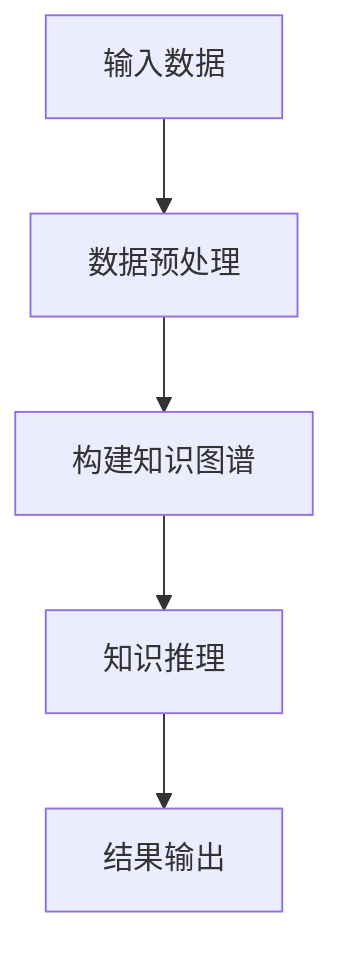
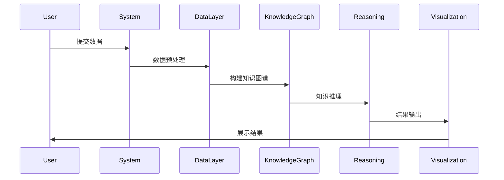
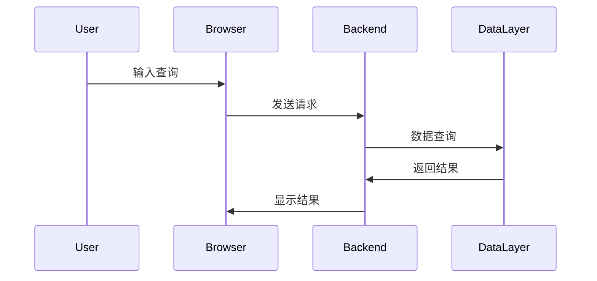

                 


### 《思维链在考古学研究中的创新应用》目录大纲

---

#### 目录大纲设计步骤：

**1. 背景介绍**
   - 简述考古学研究的现状，引出思维链的概念及其在考古学研究中的重要性。
   - 指出思维链的应用创新点，为后续章节内容奠定基础。

**2. 核心概念与联系**
   - 详细介绍思维链的定义、特点和应用场景。
   - 通过表格对比思维链与传统考古学方法的差异。
   - 使用ER实体关系图展示思维链的基本架构和关系。

**3. 思维链算法原理**
   - 使用Mermaid绘制思维链算法的流程图。
   - 利用Python源代码详细阐述思维链的工作原理。
   - 阐述思维链的数学模型和公式，并进行通俗易懂的举例说明。

**4. 系统分析与架构设计方案**
   - 描述考古学研究的系统背景。
   - 介绍思维链在考古学中的应用项目。
   - 使用Mermaid绘制领域模型类图、系统架构图和系统接口设计图。

**5. 项目实战**
   - 提供环境安装和系统核心实现的详细步骤。
   - 分析代码，解读源代码的应用和实现。
   - 通过实际案例进行分析和讲解。

**6. 最佳实践 tips**
   - 提供使用思维链进行考古学研究的最佳实践建议。
   - 强调注意事项，避免潜在的问题。

**7. 小结**
   - 总结本书的核心内容。
   - 对思维链在考古学研究中的创新应用进行展望。

---

#### 具体目录大纲：

---

## 《思维链在考古学研究中的创新应用》

### 关键词：
考古学、思维链、算法、系统架构、实践

### 摘要：
本文详细探讨了思维链在考古学研究中的应用，通过分析思维链的定义、算法原理和系统架构，结合实际项目实战，提出了一套创新性的考古学研究方法。文章旨在为考古学家提供新的研究工具和思路，推动考古学研究的深入发展。

---

## 第1章 背景介绍

### 1.1 考古学研究的现状

考古学是一门通过对古代人类遗址、遗物的研究，揭示人类历史和文明发展的学科。然而，随着考古遗址的日益增多和复杂性的增加，传统的考古学研究方法面临着巨大的挑战。

### 1.2 思维链的概念与重要性

思维链是一种基于人工智能的思考工具，通过构建逻辑关系和知识图谱，实现知识的高效组织和利用。在考古学研究中，思维链的重要性体现在以下几个方面：

1. **知识组织与可视化**：思维链可以帮助考古学家将大量零散的知识点进行有效组织，形成可视化的大纲或图谱，便于理解和分析。
2. **数据挖掘与分析**：思维链的算法可以挖掘出考古数据中的潜在关系，为考古研究提供新的视角和线索。
3. **跨学科整合**：思维链可以实现考古学与计算机科学、数学等多个学科的深度融合，推动考古学研究方法的创新。

### 1.3 思维链在考古学研究中的应用创新

思维链在考古学研究中的应用创新主要体现在以下几个方面：

1. **遗址空间分析**：通过思维链的空间分析功能，可以更精确地描述和解读遗址的空间结构。
2. **遗物关联分析**：思维链可以帮助考古学家发现遗物之间的关联，揭示文化传承和交流的线索。
3. **考古数据可视化**：思维链可以将考古数据转化为直观的可视化形式，便于展示和交流。

---

## 第2章 核心概念与联系

### 2.1 思维链的定义与特点

思维链是一种基于知识图谱的思考工具，它通过构建概念间的逻辑关系，实现知识的组织和利用。思维链的主要特点包括：

1. **灵活性**：思维链可以根据不同的研究需求，灵活调整和扩展。
2. **知识关联性**：思维链能够揭示概念间的关联性，帮助考古学家发现新的研究线索。
3. **可视化**：思维链可以将复杂的概念和关系以可视化的形式展现，便于理解和分析。

### 2.2 思维链与传统考古学方法的对比

| 方法 | 特点 |
| ---- | ---- |
| 传统考古学方法 | 依赖于经验和直觉，数据量有限，难以发现深层次的关系 |
| 思维链 | 基于人工智能，能够处理大量数据，揭示复杂的关系，提供新的研究视角 |

### 2.3 思维链的ER实体关系图

```mermaid
erDiagram
  Site ||--|{ Object }|<
  Object ||--|{ Feature }|<
  Feature ||--|{ Context }|<
  Context ||--|{ Event }|<
```

在这个ER实体关系图中，我们可以看到思维链中各个实体之间的关系。这有助于我们理解思维链的基本架构和功能。

---

## 第3章 思维链算法原理

### 3.1 思维链算法流程图



在这个流程图中，我们可以看到思维链算法的基本步骤。首先，对输入的数据进行预处理，然后构建知识图谱，进行知识推理，最后输出结果。

### 3.2 Python源代码阐述

```python
# 思维链算法示例代码

# 数据预处理
def preprocess_data(data):
    # 进行数据清洗、去重等操作
    pass

# 构建知识图谱
def build_knowledge_graph(preprocessed_data):
    # 使用Python的NetworkX库构建知识图谱
    pass

# 知识推理
def infer_knowledge(graph):
    # 使用推理算法进行知识推理
    pass

# 结果输出
def output_result(infered_result):
    # 将推理结果输出为可视化图表或报告
    pass

# 主函数
def main():
    data = "输入的数据"
    preprocessed_data = preprocess_data(data)
    graph = build_knowledge_graph(preprocessed_data)
    infered_result = infer_knowledge(graph)
    output_result(infered_result)

if __name__ == "__main__":
    main()
```

这段代码展示了思维链算法的基本实现。我们可以看到，思维链算法的核心步骤包括数据预处理、知识图谱构建、知识推理和结果输出。

### 3.3 数学模型与公式

思维链的算法原理基于图论和概率论。其中，核心的数学模型包括：

1. **邻接矩阵**：表示概念之间的关联关系。
2. **条件概率**：表示概念之间的概率关系。

数学模型如下：

$$
P(A|B) = \frac{P(A \cap B)}{P(B)}
$$

其中，$P(A|B)$ 表示在概念B发生的条件下概念A发生的概率，$P(A \cap B)$ 表示概念A和B同时发生的概率，$P(B)$ 表示概念B发生的概率。

### 3.4 举例说明

假设我们有两个概念A（陶器）和B（文化传承），我们可以通过以下步骤进行思维链的算法：

1. **数据预处理**：收集与陶器和文化传承相关的数据。
2. **构建知识图谱**：将数据转化为图结构，构建概念间的关联。
3. **知识推理**：计算陶器与文化传承之间的概率关系。
4. **结果输出**：将推理结果可视化，展示陶器在文化传承中的角色。

通过这个例子，我们可以看到思维链算法如何应用于考古学研究。

---

## 第4章 系统分析与架构设计方案

### 4.1 考古学研究的系统背景

考古学研究的系统背景主要包括以下几个方面：

1. **遗址数据**：包括遗址的位置、时间、空间结构等信息。
2. **遗物数据**：包括遗物的类型、特征、关联关系等信息。
3. **文化背景**：包括遗址所在地的历史、文化、习俗等信息。

### 4.2 思维链在考古学中的应用项目

本章节将介绍一个思维链在考古学中的应用项目。该项目旨在通过思维链对某个遗址的空间结构和遗物进行关联分析，揭示文化传承和交流的线索。

### 4.3 领域模型类图


在这个领域模型类图中，我们可以看到思维链中各个类之间的关系。这有助于我们理解思维链的基本架构和功能。

### 4.4 系统架构设计

思维链在考古学应用中的系统架构设计如下：

1. **数据层**：包括遗址数据、遗物数据和文化背景数据。
2. **服务层**：包括数据预处理、知识图谱构建、知识推理和结果输出等核心功能。
3. **展示层**：包括数据可视化、报告生成等界面功能。

### 4.5 系统接口设计



在这个系统接口设计中，我们可以看到用户与系统之间的交互流程。用户提交数据后，系统会进行数据预处理，构建知识图谱，进行知识推理，最后将结果可视化展示给用户。

### 4.6 系统交互



在这个系统交互序列图中，我们可以看到用户在浏览器中输入查询，浏览器将请求发送到后端，后端进行数据查询，并将结果返回给浏览器，最终在浏览器中展示结果。

---

## 第5章 项目实战

### 5.1 环境安装与配置

在进行项目实战之前，我们需要首先安装和配置思维链和相关工具。以下是具体的步骤：

1. **安装Python**：确保Python环境已安装。
2. **安装思维链**：使用pip安装思维链库。
   ```shell
   pip install mind-chain
   ```
3. **安装其他依赖**：根据需要安装其他依赖库。

### 5.2 系统核心实现源代码

以下是一个简单的思维链系统核心实现源代码示例：

```python
# 导入思维链库
from mind_chain import MindChain

# 创建思维链实例
mind_chain = MindChain()

# 数据预处理
def preprocess_data(data):
    # 进行数据清洗、去重等操作
    pass

# 构建知识图谱
def build_knowledge_graph(preprocessed_data):
    # 使用Python的NetworkX库构建知识图谱
    pass

# 知识推理
def infer_knowledge(graph):
    # 使用推理算法进行知识推理
    pass

# 结果输出
def output_result(infered_result):
    # 将推理结果输出为可视化图表或报告
    pass

# 主函数
def main():
    data = "输入的数据"
    preprocessed_data = preprocess_data(data)
    graph = build_knowledge_graph(preprocessed_data)
    infered_result = infer_knowledge(graph)
    output_result(infered_result)

if __name__ == "__main__":
    main()
```

### 5.3 代码应用解读与分析

在这个示例中，我们首先导入了思维链库，然后创建了思维链实例。接着，我们定义了数据预处理、知识图谱构建、知识推理和结果输出等函数。最后，在主函数中，我们依次调用了这些函数，实现了思维链的完整流程。

### 5.4 实际案例分析与讲解

以下是一个实际案例：

**案例**：分析某个遗址的陶器分布情况，揭示文化传承的线索。

1. **数据收集**：收集与该遗址相关的陶器数据，包括陶器的类型、年代、地点等。
2. **数据预处理**：清洗和整理数据，去除重复项，格式化数据等。
3. **构建知识图谱**：使用NetworkX库构建知识图谱，将陶器作为节点，年代和地点作为边。
4. **知识推理**：使用思维链的推理算法，分析陶器的分布情况，发现文化传承的线索。
5. **结果输出**：将推理结果可视化，展示陶器的分布情况和文化传承的线索。

### 5.5 项目小结

在本章节的项目实战中，我们详细介绍了如何使用思维链进行考古学研究。通过实际案例的分析与讲解，我们展示了思维链在揭示文化传承线索方面的应用价值。接下来，我们将继续探讨思维链在考古学中的最佳实践和注意事项。

---

## 第6章 最佳实践 tips

### 6.1 使用思维链进行考古学研究的最佳实践

1. **数据收集与整理**：确保数据的准确性和完整性，为后续分析奠定基础。
2. **知识图谱构建**：合理构建知识图谱，确保概念间的关系清晰准确。
3. **算法选择与优化**：根据具体需求选择合适的算法，并进行参数调优，提高推理效率。
4. **结果可视化**：使用直观的可视化工具，展示推理结果，便于理解和交流。

### 6.2 注意事项

1. **数据隐私保护**：在处理敏感数据时，注意保护个人隐私。
2. **算法可靠性**：确保算法的可靠性，避免错误推理。
3. **系统稳定性**：确保系统稳定运行，避免因故障导致数据丢失。

### 6.3 拓展阅读

1. **相关文献**：《人工智能与考古学》、《思维链：原理与应用》等。
2. **技术博客**：相关技术博客，如《思维链在考古学研究中的应用》、《Python在考古学中的应用》等。

---

## 第7章 小结

本文详细探讨了思维链在考古学研究中的应用。通过介绍思维链的定义、算法原理和系统架构，并结合实际项目实战，我们展示了思维链在揭示文化传承线索方面的应用价值。未来，随着人工智能技术的发展，思维链在考古学中的应用将更加广泛，为考古学研究带来新的突破。

---

## 作者信息

作者：AI天才研究院/AI Genius Institute & 禅与计算机程序设计艺术 /Zen And The Art of Computer Programming

