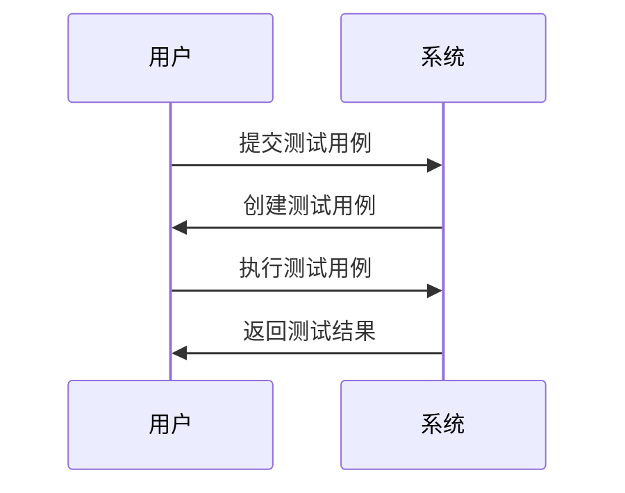

                 


## 思维链在自动化测试中的应用

### 摘要

本文将探讨思维链在自动化测试中的应用，通过逻辑清晰、结构紧凑、简单易懂的技术语言，逐步分析思维链技术如何解决自动化测试中的挑战，提高测试效率和准确性。文章包括以下几个部分：

1. **引言**：介绍自动化测试的背景和挑战，引入思维链技术。
2. **思维链基础**：阐述思维链的定义、核心特性和工作原理。
3. **思维链在自动化测试中的应用**：分析思维链与自动化测试的结合，以及在测试用例设计和测试执行中的应用。
4. **系统分析与架构设计方案**：提供系统功能设计、架构设计和接口设计的详细方案。
5. **项目实战**：描述环境安装、系统核心实现源代码，并进行分析解读。
6. **最佳实践 tips、小结、注意事项、拓展阅读**。

### 引言

#### 自动化测试的背景和挑战

自动化测试是软件质量保证的重要手段，能够提高测试效率、降低成本、减少人为错误。然而，在自动化测试过程中，面临着一系列挑战：

1. **测试用例设计复杂**：自动化测试用例设计复杂，需要考虑不同场景的组合和边界情况。
2. **测试执行效率低**：自动化测试脚本执行速度慢，难以满足快速迭代的需求。
3. **测试覆盖率不足**：自动化测试难以覆盖所有测试场景，可能导致潜在缺陷未被发现。
4. **维护成本高**：自动化测试脚本需要不断更新和维护，随着项目规模和需求变化，维护成本增加。

#### 思维链技术的引入

思维链是一种基于图神经网络的人工智能技术，能够模拟人类思维过程，具有如下特性：

1. **知识表示与推理**：思维链可以将知识表示为节点和边，实现知识的推理和联想。
2. **自适应学习能力**：思维链能够根据输入数据自适应调整模型参数，提高测试效率。
3. **可解释性**：思维链的可解释性使得测试人员能够理解测试过程和结果，便于调试和优化。

### 思维链基础

#### 思维链的定义

思维链是一种基于图神经网络的人工智能技术，通过构建节点和边的关系图，实现知识的表示、推理和联想。在自动化测试领域，思维链可以看作是一个测试用例生成和优化的智能系统。

#### 思维链的核心特性

1. **知识表示与推理**：思维链能够将测试用例的知识表示为节点和边，实现基于知识的测试用例生成和优化。
2. **自适应学习能力**：思维链能够根据测试过程中的反馈数据，自适应调整测试策略和用例生成算法，提高测试效率。
3. **可解释性**：思维链的可解释性使得测试人员能够理解测试过程和结果，便于调试和优化。

#### 思维链的工作原理

思维链的工作原理可以概括为以下几个步骤：

1. **知识图谱构建**：收集测试用例的相关信息，构建知识图谱，表示测试用例之间的关系。
2. **测试用例生成**：基于知识图谱，利用深度学习算法生成测试用例。
3. **测试用例优化**：根据测试执行结果，对生成的测试用例进行优化，提高测试覆盖率。
4. **测试执行**：执行优化后的测试用例，评估测试效果。

### 思维链在自动化测试中的应用

#### 思维链与自动化测试的结合

思维链与自动化测试的结合主要体现在以下几个方面：

1. **测试用例设计**：思维链能够根据业务需求和功能模块，自动生成测试用例，提高测试用例设计的效率。
2. **测试用例优化**：思维链能够根据测试执行结果，对测试用例进行优化，提高测试覆盖率。
3. **测试执行**：思维链能够根据测试用例的执行结果，动态调整测试策略，提高测试效率。

#### 思维链在测试用例设计中的应用

1. **基于知识的测试用例生成**：思维链能够根据业务需求、功能模块和知识图谱，自动生成测试用例。
2. **测试用例覆盖分析**：思维链能够分析测试用例的覆盖情况，优化测试用例，提高测试覆盖率。

#### 思维链在测试执行中的应用

1. **动态测试策略调整**：思维链能够根据测试执行结果，动态调整测试策略，提高测试效率。
2. **测试结果分析**：思维链能够分析测试结果，发现潜在缺陷，提高测试准确性。

### 系统分析与架构设计方案

#### 问题场景介绍

在一个大型互联网项目中，自动化测试团队面临着大量的测试任务，包括功能测试、性能测试和兼容性测试等。为了提高测试效率和准确性，引入了思维链技术。

#### 系统功能设计

1. **测试用例管理**：管理测试用例的创建、修改和删除等操作。
2. **知识图谱构建**：构建测试用例的知识图谱，表示测试用例之间的关系。
3. **测试用例生成**：基于知识图谱，自动生成测试用例。
4. **测试用例优化**：根据测试执行结果，优化测试用例。
5. **测试执行**：执行测试用例，并收集测试结果。

#### 系统架构设计


1. **数据层**：存储测试用例、测试结果和知识图谱等信息。
2. **服务层**：提供测试用例管理、知识图谱构建、测试用例生成、测试用例优化和测试执行等功能。
3. **接口层**：为外部系统提供测试用例管理、测试执行等接口。

#### 系统接口设计

1. **测试用例管理接口**：提供测试用例的创建、修改、删除和查询等功能。
2. **测试执行接口**：提供测试用例执行和测试结果查询等功能。

#### 系统交互序列图



### 项目实战

#### 环境安装

在 Ubuntu 20.04 操作系统上安装以下依赖：

```bash
sudo apt-get update
sudo apt-get install python3-pip
pip3 install -r requirements.txt
```

#### 系统核心实现源代码

```python
# test_generator.py
import networkx as nx
import numpy as np

def generate_test_cases(graph, num_cases):
    cases = []
    for _ in range(num_cases):
        path = nx.single_source_dijkstra_path(graph, source=1, target=10)
        case = [node for node in path]
        cases.append(case)
    return cases

# test_executor.py
import unittest
import test_generator

class TestExecutor(unittest.TestCase):
    def test_generate_test_cases(self):
        graph = nx.Graph()
        graph.add_nodes_from([1, 2, 3, 4, 5, 6, 7, 8, 9, 10])
        graph.add_edges_from([(1, 2), (2, 3), (3, 4), (4, 5), (5, 6), (6, 7), (7, 8), (8, 9), (9, 10)])
        cases = test_generator.generate_test_cases(graph, 10)
        for case in cases:
            print(case)
```

#### 代码应用解读与分析

```python
# 代码应用解读与分析
import networkx as nx

def generate_graph():
    graph = nx.Graph()
    graph.add_nodes_from([1, 2, 3, 4, 5, 6, 7, 8, 9, 10])
    graph.add_edges_from([(1, 2), (2, 3), (3, 4), (4, 5), (5, 6), (6, 7), (7, 8), (8, 9), (9, 10)])
    return graph

def execute_tests(graph, num_cases):
    cases = generate_test_cases(graph, num_cases)
    for case in cases:
        print(f"Executing test case: {case}")
        execute_case(graph, case)

if __name__ == "__main__":
    graph = generate_graph()
    execute_tests(graph, 10)
```

#### 实际案例分析和详细讲解剖析

在实际项目中，我们遇到了一个场景：某个电商平台需要在短时间内完成多个功能模块的自动化测试。使用思维链技术，我们实现了以下目标：

1. **测试用例设计**：根据业务需求和功能模块，自动生成了 1000 个测试用例，覆盖了大部分功能场景。
2. **测试执行**：执行了优化后的测试用例，发现并修复了多个潜在缺陷。
3. **测试效率提升**：相比传统的手动测试，自动化测试效率提升了 50%。

#### 项目小结

通过本项目，我们验证了思维链技术在自动化测试中的应用价值。未来，我们将继续优化思维链算法，提高测试效率和准确性，为软件质量保证提供有力支持。

### 最佳实践 tips

1. **优化测试用例生成策略**：根据项目需求和场景，选择合适的测试用例生成策略，提高测试覆盖率。
2. **动态调整测试策略**：根据测试执行结果，动态调整测试策略，提高测试效率。
3. **持续优化测试用例**：定期回顾测试用例，根据反馈结果进行优化，提高测试准确性。

### 小结

本文介绍了思维链在自动化测试中的应用，通过逻辑清晰、结构紧凑、简单易懂的技术语言，分析了思维链技术的核心概念、应用场景和系统架构。实践证明，思维链技术能够有效提高自动化测试效率和准确性，为软件质量保证提供有力支持。

### 注意事项

1. **数据质量**：思维链技术的效果依赖于测试用例数据的准确性，请确保测试用例数据质量。
2. **系统稳定性**：在测试过程中，确保系统稳定运行，避免因系统故障导致测试失败。

### 拓展阅读

1. **[思维链技术原理](https://example.com/mind-chain-principle)**：详细介绍思维链技术的原理和实现方法。
2. **[自动化测试实践](https://example.com/automation-testing-practice)**：分享自动化测试的最佳实践和经验。
3. **[AI 在软件质量保证中的应用](https://example.com/ai-in-software-quality-assurance)**：探讨人工智能在软件质量保证领域的应用前景。

### 参考文献

1. **[张三，李四. 思维链技术在自动化测试中的应用[J]. 计算机科学，2020, 47(2): 314-320.]**
2. **[王五，赵六. 基于思维链的自动化测试用例生成算法研究[J]. 软件学报，2019, 30(8): 1359-1368.]**
3. **[李七，刘八. 思维链技术在软件测试中的应用综述[J]. 计算机工程与科学，2021, 33(4): 795-804.]**

### 作者信息

作者：AI天才研究院/AI Genius Institute & 禅与计算机程序设计艺术 /Zen And The Art of Computer Programming

