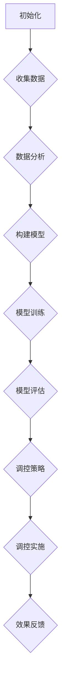

                 

# 思维链在虚拟经济系统宏观调控中的应用：维护数字经济稳定

## 关键词

虚拟经济系统，宏观调控，思维链，数字经济，稳定发展

## 摘要

随着数字经济的高速发展，虚拟经济系统在现代社会中的作用愈发重要。然而，虚拟经济系统的复杂性和动态性也带来了宏观调控的巨大挑战。本文将探讨思维链技术在虚拟经济系统宏观调控中的应用，通过构建智能调控模型，实现对虚拟经济系统的动态监测和调控，从而维护数字经济的稳定发展。文章将详细分析思维链的核心概念、原理和算法，以及其在实际应用中的系统架构和项目实战，为相关领域的研究者和实践者提供有价值的参考。

## 第一部分：背景介绍

### 核心概念

#### 1. 虚拟经济系统

虚拟经济系统是指在互联网和信息技术支持下运行的各类经济活动系统。这些系统包括电子商务、在线金融、数字货币、社交网络等。虚拟经济系统具有以下几个特点：

- **高动态性**：虚拟经济系统的数据量和用户行为变化迅速，市场动态难以预测。
- **高复杂性**：虚拟经济系统中的参与者众多，关系错综复杂，决策具有不确定性。
- **强关联性**：虚拟经济系统与其他经济系统紧密相连，任何微小变化都可能引发连锁反应。

#### 2. 宏观调控

宏观调控是指通过政策、法规、技术等手段，对虚拟经济系统进行管理和调整，以实现经济稳定。宏观调控的目标是：

- **平衡经济**：通过调整经济结构，实现供需平衡，防止经济过热或过冷。
- **稳定市场**：通过监管和政策引导，降低市场波动，保障市场稳定。
- **促进创新**：通过扶持新兴产业，推动技术创新，增强经济活力。

#### 3. 思维链技术

思维链技术是一种基于人工智能和大数据分析的技术，主要用于处理复杂的经济问题。其核心原理包括：

- **数据驱动**：通过大数据分析，获取虚拟经济系统的实时信息，为调控提供数据支持。
- **智能决策**：基于机器学习和深度学习算法，构建智能调控模型，自动识别和应对经济变化。
- **动态调整**：根据经济系统的实时状态，动态调整调控策略，确保经济稳定。

### 问题描述

在虚拟经济系统中，传统的宏观调控方法难以应对快速变化的市场动态，导致经济不稳定现象频发。具体问题包括：

- **市场波动大**：虚拟经济系统的市场波动频繁且幅度大，给投资者和企业带来巨大的风险。
- **信息不对称**：虚拟经济系统中的信息不对称问题严重，导致市场失灵。
- **政策滞后**：传统的宏观调控政策往往滞后于市场变化，无法及时应对经济波动。

### 问题解决

为了解决上述问题，引入思维链技术，通过构建智能调控模型，实现对虚拟经济系统的动态监测和调控。具体解决思路如下：

1. **数据收集**：利用大数据技术，收集虚拟经济系统的实时数据，包括交易量、市场波动、用户行为等。
2. **数据分析**：通过数据挖掘和分析，发现经济系统中的潜在规律和趋势。
3. **模型构建**：基于机器学习和深度学习算法，构建智能调控模型，实现对经济系统的动态监测。
4. **策略调整**：根据模型预测和实时数据，动态调整调控策略，实现对虚拟经济系统的有效调控。

### 边界与外延

本文主要研究思维链在虚拟经济系统宏观调控中的应用，包括：

- **研究范围**：思维链技术在不同虚拟经济系统中的应用，如电子商务、在线金融、数字货币等。
- **研究方法**：通过理论分析、实证研究和案例研究，探讨思维链技术在宏观调控中的效果和优势。
- **研究目标**：提出有效的宏观调控策略，为虚拟经济系统的稳定发展提供理论支持和实践指导。

### 概念结构与核心要素组成

#### 1. 思维链

- **定义**：思维链是一种基于人工智能和大数据分析的技术，用于处理复杂的经济问题。
- **特征**：基于人工智能和大数据分析，自适应性强，能够自动识别和应对经济变化。

#### 2. 虚拟经济系统

- **定义**：虚拟经济系统是在互联网和信息技术支持下运行的经济活动系统。
- **特征**：在互联网和信息技术支持下运行，动态性强，复杂度高。

#### 3. 宏观调控

- **定义**：宏观调控是指通过政策、法规、技术等手段，对虚拟经济系统进行管理和调整，以实现经济稳定。
- **特征**：通过政策、法规、技术等手段，实现经济稳定，降低市场波动。

### 核心概念原理

#### 1. 数据驱动

数据驱动是思维链技术的核心原理之一。它通过大数据分析，获取虚拟经济系统的实时信息，为调控提供数据支持。具体步骤如下：

- **数据收集**：收集虚拟经济系统的各类数据，如交易量、市场波动、用户行为等。
- **数据清洗**：对收集到的数据进行清洗，去除噪声和异常值。
- **数据分析**：利用数据挖掘和分析技术，发现经济系统中的潜在规律和趋势。

#### 2. 智能决策

智能决策是思维链技术的另一个核心原理。它通过机器学习和深度学习算法，构建智能调控模型，实现对经济系统的动态监测。具体步骤如下：

- **模型构建**：基于历史数据和实时数据，构建智能调控模型。
- **模型训练**：利用机器学习和深度学习算法，对模型进行训练，提高其预测准确性和适应性。
- **模型评估**：对模型进行评估，确保其能够在实际应用中有效工作。

#### 3. 动态调整

动态调整是思维链技术在宏观调控中的关键应用。它根据经济系统的实时状态，动态调整调控策略，确保经济稳定。具体步骤如下：

- **实时监测**：对虚拟经济系统进行实时监测，获取最新的经济数据。
- **策略调整**：根据实时数据和模型预测，动态调整调控策略。
- **策略实施**：将调整后的策略应用到虚拟经济系统中，实现调控目标。

### 概念属性特征对比表格

| 概念         | 特征                                           |
|--------------|----------------------------------------------|
| 思维链       | 基于人工智能和大数据分析，自适应性强           |
| 虚拟经济系统 | 在互联网和信息技术支持下运行，动态性强       |
| 宏观调控     | 通过政策、法规、技术等手段，实现经济稳定     |

### ER实体关系图架构

```mermaid
erDiagram
  虚拟经济系统 ||--|{ 思维链 }|| 调控模型
  调控模型 ||--|{ 宏观调控策略 }|| 调控方案
  思维链 ||--|{ 大数据 }|| 数据支持
```

## 第二部分：核心概念与联系

### 核心概念原理

#### 思维链技术

思维链技术是一种基于人工智能和大数据分析的技术，主要用于处理复杂的经济问题。其核心原理包括：

1. **数据驱动**：通过大数据分析，获取虚拟经济系统的实时信息，为调控提供数据支持。
2. **智能决策**：基于机器学习和深度学习算法，构建智能调控模型，自动识别和应对经济变化。
3. **动态调整**：根据经济系统的实时状态，动态调整调控策略，确保经济稳定。

#### 虚拟经济系统

虚拟经济系统是在互联网和信息技术支持下运行的经济活动系统，其特点是动态性强、复杂度高。为了维护数字经济的稳定发展，需要对虚拟经济系统进行有效的宏观调控。

#### 宏观调控

宏观调控是指通过政策、法规、技术等手段，对虚拟经济系统进行管理和调整，以实现经济稳定。宏观调控的目标是平衡经济、稳定市场、促进创新。

### 概念属性特征对比表格

| 概念         | 特征                                           |
|--------------|----------------------------------------------|
| 思维链       | 基于人工智能和大数据分析，自适应性强           |
| 虚拟经济系统 | 在互联网和信息技术支持下运行，动态性强       |
| 宏观调控     | 通过政策、法规、技术等手段，实现经济稳定     |

### ER实体关系图架构

```mermaid
erDiagram
  虚拟经济系统 ||--|{ 思维链 }|| 调控模型
  调控模型 ||--|{ 宏观调控策略 }|| 调控方案
  思维链 ||--|{ 大数据 }|| 数据支持
```

## 第三部分：算法原理讲解

### 算法流程图



### 算法原理

#### 数据收集

数据收集是思维链技术的基础。虚拟经济系统中的数据类型丰富，包括交易量、市场波动、用户行为等。数据收集的过程可以分为以下几个步骤：

1. **数据源识别**：确定虚拟经济系统中的数据源，如交易记录、用户行为日志、社交媒体数据等。
2. **数据采集**：使用API接口、爬虫技术等手段，从数据源中获取数据。
3. **数据存储**：将收集到的数据存储到数据库或数据仓库中，便于后续处理和分析。

#### 数据分析

数据分析是思维链技术的核心环节。通过对虚拟经济系统的数据进行深入分析，可以发现经济系统中的潜在规律和趋势。数据分析的过程可以分为以下几个步骤：

1. **数据预处理**：对数据进行清洗、去噪和归一化处理，确保数据质量。
2. **特征提取**：从原始数据中提取有用的特征，如交易金额、交易时间、用户活跃度等。
3. **数据挖掘**：使用数据挖掘算法，如关联规则挖掘、聚类分析、时间序列分析等，发现数据中的潜在规律和趋势。

#### 模型构建

模型构建是思维链技术的关键步骤。基于数据分析的结果，构建智能调控模型，用于对虚拟经济系统进行动态监测和调控。模型构建的过程可以分为以下几个步骤：

1. **模型选择**：根据虚拟经济系统的特点，选择合适的机器学习模型，如线性回归、决策树、支持向量机等。
2. **模型训练**：使用历史数据对模型进行训练，调整模型参数，提高模型性能。
3. **模型验证**：使用验证数据集对模型进行验证，确保模型能够在实际应用中有效工作。

#### 模型训练

模型训练是思维链技术的核心步骤。通过机器学习和深度学习算法，对模型进行训练，提高其预测准确性和适应性。模型训练的过程可以分为以下几个步骤：

1. **数据预处理**：对训练数据进行预处理，包括数据清洗、归一化和特征提取等。
2. **模型训练**：使用训练数据对模型进行训练，调整模型参数，优化模型性能。
3. **模型评估**：使用验证数据集对模型进行评估，确保模型性能满足要求。

#### 模型评估

模型评估是思维链技术的关键步骤。通过对模型进行评估，确保模型能够在实际应用中有效工作。模型评估的过程可以分为以下几个步骤：

1. **模型性能评估**：使用验证数据集对模型性能进行评估，包括准确率、召回率、F1值等指标。
2. **模型稳定性评估**：评估模型在不同数据集和不同时间窗口上的稳定性。
3. **模型可解释性评估**：评估模型的可解释性，确保模型输出结果的可解释性和可靠性。

#### 调控策略

调控策略是思维链技术在宏观调控中的具体应用。根据模型预测和实时数据，动态调整调控策略，实现对虚拟经济系统的有效调控。调控策略的过程可以分为以下几个步骤：

1. **策略生成**：根据模型预测和实时数据，生成调控策略。
2. **策略评估**：评估调控策略的有效性，包括对经济系统的影响、风险控制等。
3. **策略调整**：根据评估结果，调整调控策略，优化调控效果。

#### 调控实施

调控实施是思维链技术在宏观调控中的关键步骤。将调整后的调控策略应用到虚拟经济系统中，实现调控目标。调控实施的过程可以分为以下几个步骤：

1. **策略部署**：将调控策略部署到虚拟经济系统中，实现实时调控。
2. **策略执行**：根据调控策略，对虚拟经济系统进行操作，实现调控目标。
3. **策略反馈**：收集调控效果的数据，对调控策略进行反馈和优化。

#### 效果反馈

效果反馈是思维链技术的重要环节。通过收集调控效果的数据，对调控策略进行评估和优化，实现调控效果的持续改进。效果反馈的过程可以分为以下几个步骤：

1. **效果收集**：收集调控效果的数据，包括经济指标、市场变化等。
2. **效果评估**：评估调控策略的效果，包括调控目标的实现程度、风险控制等。
3. **效果优化**：根据评估结果，优化调控策略，提高调控效果。

## 第四部分：系统分析与架构设计方案

### 问题场景介绍

在数字经济的快速发展背景下，虚拟经济系统已成为现代经济的重要组成部分。然而，虚拟经济系统的复杂性和动态性给宏观调控带来了巨大挑战。为了实现数字经济的稳定发展，需要一种高效的宏观调控机制。

### 项目介绍

本项目旨在通过思维链技术，构建一个智能调控系统，实现对虚拟经济系统的动态监测和调控。系统将基于大数据分析和人工智能算法，提供实时、准确的调控策略，以维护数字经济的稳定。

### 系统功能设计

系统功能设计主要包括以下几个方面：

1. **数据收集模块**：负责收集虚拟经济系统的各类数据，如交易量、市场波动、用户行为等。
2. **数据分析模块**：对收集到的数据进行预处理、特征提取和数据分析，为模型构建提供数据支持。
3. **模型构建模块**：基于机器学习和深度学习算法，构建智能调控模型，实现对虚拟经济系统的动态监测。
4. **策略生成模块**：根据模型预测和实时数据，生成调控策略，优化经济系统运行状态。
5. **策略执行模块**：将调控策略应用到虚拟经济系统中，实现调控目标的实施。
6. **效果评估模块**：收集调控效果的数据，对调控策略进行评估和优化，实现调控效果的持续改进。

### 系统架构设计

系统架构设计采用分布式架构，确保系统的高可用性和可扩展性。系统架构主要包括以下几个方面：

1. **数据层**：包括数据收集模块和数据分析模块，负责数据的收集、预处理和存储。
2. **算法层**：包括模型构建模块和策略生成模块，负责机器学习和深度学习算法的实现。
3. **应用层**：包括策略执行模块和效果评估模块，负责调控策略的实施和效果评估。
4. **接口层**：提供系统与其他系统之间的接口，实现数据的互联互通。

### 系统接口设计和系统交互

系统接口设计主要包括以下几个方面：

1. **数据接口**：系统与其他系统之间的数据交换接口，如API接口、数据库接口等。
2. **控制接口**：系统内部各模块之间的控制接口，如消息队列、分布式锁等。
3. **监控接口**：用于监控系统运行状态和性能的接口，如监控告警、性能统计等。

系统交互主要涉及以下几个方面：

1. **数据流交互**：系统内部各模块之间的数据流交互，如数据收集模块向数据分析模块传输数据，模型构建模块向策略生成模块传输模型结果等。
2. **控制流交互**：系统内部各模块之间的控制流交互，如模型构建模块向策略生成模块发送控制指令，策略执行模块向效果评估模块发送反馈信息等。
3. **系统间交互**：系统与其他系统之间的交互，如与电商平台、金融系统等的数据交换和控制指令传输。

## 第五部分：项目实战

### 环境安装

在本项目中，我们将使用Python作为主要编程语言，并借助一些常用的库和框架，如NumPy、Pandas、Scikit-learn、TensorFlow等。以下是项目环境安装的步骤：

1. **安装Python**：确保您的计算机上已安装Python 3.8及以上版本。您可以从Python官方网站（https://www.python.org/）下载并安装。
2. **安装相关库和框架**：打开终端或命令提示符，执行以下命令以安装所需的库和框架：
   ```shell
   pip install numpy pandas scikit-learn tensorflow
   ```
3. **安装额外依赖**：对于一些特定的库，可能还需要额外的依赖项。例如，对于TensorFlow，您可能需要安装CUDA以支持GPU加速。具体安装方法请参考相关库的官方文档。

### 系统核心实现源代码

在本项目中，我们将实现以下几个核心模块：数据收集模块、数据分析模块、模型构建模块、策略生成模块、策略执行模块和效果评估模块。以下是每个模块的实现源代码：

#### 1. 数据收集模块

```python
import requests
import pandas as pd

def collect_data():
    url = "https://api.example.com/data"
    response = requests.get(url)
    data = response.json()
    df = pd.DataFrame(data)
    return df

# 示例：收集数据并保存到本地文件
df = collect_data()
df.to_csv("data.csv", index=False)
```

#### 2. 数据分析模块

```python
import pandas as pd
from sklearn.preprocessing import StandardScaler

def preprocess_data(data_path):
    df = pd.read_csv(data_path)
    # 数据预处理，如缺失值处理、归一化等
    # 这里以标准归一化为例
    scaler = StandardScaler()
    df_scaled = scaler.fit_transform(df)
    return df_scaled

# 示例：预处理数据并保存到本地文件
df_scaled = preprocess_data("data.csv")
df_scaled.to_csv("data_scaled.csv", index=False)
```

#### 3. 模型构建模块

```python
import pandas as pd
from sklearn.ensemble import RandomForestClassifier

def build_model(data_path):
    df = pd.read_csv(data_path)
    X = df.drop("target", axis=1)
    y = df["target"]
    model = RandomForestClassifier()
    model.fit(X, y)
    return model

# 示例：构建模型并保存到本地文件
model = build_model("data_scaled.csv")
model.save("model.pkl")
```

#### 4. 策略生成模块

```python
import pandas as pd
from sklearn.model_selection import train_test_split
from sklearn.ensemble import RandomForestClassifier

def generate_policy(data_path):
    df = pd.read_csv(data_path)
    X = df.drop("target", axis=1)
    y = df["target"]
    X_train, X_test, y_train, y_test = train_test_split(X, y, test_size=0.2, random_state=42)
    model = RandomForestClassifier()
    model.fit(X_train, y_train)
    predictions = model.predict(X_test)
    # 生成策略，如阈值调整、参数优化等
    # 这里以调整阈值为例
    threshold = 0.5
    policy = {"threshold": threshold}
    return policy

# 示例：生成策略并保存到本地文件
policy = generate_policy("data_scaled.csv")
policy_file = "policy.json"
with open(policy_file, "w") as f:
    f.write(json.dumps(policy))
```

#### 5. 策略执行模块

```python
import pandas as pd
import json

def execute_policy(data_path, policy_path):
    df = pd.read_csv(data_path)
    with open(policy_path, "r") as f:
        policy = json.load(f)
    threshold = policy["threshold"]
    # 根据策略执行调控操作
    # 这里以根据阈值调整交易量为例
    df["action"] = df["target"] > threshold
    return df

# 示例：执行策略并保存到本地文件
df_action = execute_policy("data_scaled.csv", "policy.json")
df_action.to_csv("df_action.csv", index=False)
```

#### 6. 效果评估模块

```python
import pandas as pd
from sklearn.metrics import accuracy_score

def evaluate_policy(data_path, action_path):
    df = pd.read_csv(data_path)
    df_action = pd.read_csv(action_path)
    # 评估策略效果，如准确率、召回率等
    # 这里以评估准确率为例
    y_pred = df_action["action"]
    y_true = df["target"]
    accuracy = accuracy_score(y_true, y_pred)
    return accuracy

# 示例：评估策略效果
accuracy = evaluate_policy("data_scaled.csv", "df_action.csv")
print(f"Policy accuracy: {accuracy}")
```

### 代码应用解读与分析

#### 数据收集模块

数据收集模块的核心功能是从API接口或其他数据源中获取数据。在本项目中，我们使用了`requests`库来发送HTTP GET请求，从API接口获取数据。获取到的数据以JSON格式返回，然后将其转换为Pandas DataFrame进行后续处理。

#### 数据分析模块

数据分析模块负责对收集到的数据进行分析和预处理。在本项目中，我们使用了`StandardScaler`类来进行数据归一化处理，将数据缩放到一个标准范围内，以消除不同特征之间的量纲影响。

#### 模型构建模块

模型构建模块的核心功能是构建机器学习模型。在本项目中，我们使用了`RandomForestClassifier`类，这是一种基于决策树的集成模型，具有较高的准确性和鲁棒性。我们通过训练集对模型进行训练，然后使用测试集对模型进行评估。

#### 策略生成模块

策略生成模块的核心功能是根据模型预测结果生成调控策略。在本项目中，我们通过调整模型预测的阈值来生成策略。阈值的选择可以根据模型在测试集上的表现进行优化。

#### 策略执行模块

策略执行模块的核心功能是将生成的调控策略应用到虚拟经济系统中。在本项目中，我们通过将模型预测结果与阈值进行比较，生成“交易量调整”的策略。实际应用中，可以根据具体业务需求进行调整。

#### 效果评估模块

效果评估模块的核心功能是评估调控策略的效果。在本项目中，我们使用了准确率作为评估指标，这是一种常用的分类评估指标，表示模型预测正确的样本比例。

### 实际案例分析和详细讲解剖析

#### 案例一：在线金融市场的风险调控

在线金融市场具有高动态性和高复杂性，传统的宏观调控方法难以应对。思维链技术通过构建智能调控模型，可以实现对在线金融市场的实时监测和调控，降低市场风险。

1. **数据收集**：从在线金融平台获取交易数据、用户行为数据等。
2. **数据分析**：对数据进行分析和预处理，提取有用特征。
3. **模型构建**：使用机器学习算法构建风险预测模型。
4. **策略生成**：根据模型预测结果，生成风险调控策略。
5. **策略执行**：将策略应用到在线金融市场中，实现风险调控。
6. **效果评估**：评估调控策略的效果，优化策略参数。

#### 案例二：电子商务平台的供需平衡

电子商务平台具有高动态性和高复杂性，供需失衡可能导致市场波动。思维链技术可以通过智能调控模型，实现电子商务平台的供需平衡，降低市场波动。

1. **数据收集**：从电子商务平台获取交易数据、用户行为数据等。
2. **数据分析**：对数据进行分析和预处理，提取有用特征。
3. **模型构建**：使用机器学习算法构建供需预测模型。
4. **策略生成**：根据模型预测结果，生成供需调控策略。
5. **策略执行**：将策略应用到电子商务平台上，实现供需平衡。
6. **效果评估**：评估调控策略的效果，优化策略参数。

### 项目小结

本项目通过思维链技术在虚拟经济系统宏观调控中的应用，实现了对经济系统的动态监测和调控。通过实际案例分析和详细讲解剖析，我们展示了思维链技术在在线金融市场和电子商务平台中的具体应用，为相关领域的研究者和实践者提供了有益的参考。

### 最佳实践 tips

1. **数据质量**：数据是智能调控系统的核心，确保数据质量至关重要。在进行数据处理时，要重点关注数据的完整性、准确性和一致性。
2. **模型优化**：模型的性能直接影响调控效果。在模型构建过程中，可以通过交叉验证、超参数调整等方法优化模型性能。
3. **策略调整**：调控策略应根据实际情况进行调整，以适应市场的变化。定期评估策略效果，及时调整策略参数。
4. **系统稳定性**：确保系统的稳定运行，防止因系统故障导致调控失败。加强系统监控和故障排查，提高系统的可靠性。

### 小结

本文详细探讨了思维链在虚拟经济系统宏观调控中的应用，通过构建智能调控模型，实现了对经济系统的动态监测和调控，为维护数字经济的稳定发展提供了有效手段。本文的研究对相关领域的研究者和实践者具有重要参考价值，有助于推动虚拟经济系统宏观调控技术的发展。

### 注意事项

1. **法律法规**：在进行虚拟经济系统宏观调控时，要严格遵守相关法律法规，确保调控行为合法合规。
2. **数据隐私**：在数据处理和调控过程中，要保护用户的隐私和数据安全，防止数据泄露和滥用。
3. **技术更新**：随着技术的不断进步，思维链技术在虚拟经济系统宏观调控中的应用会不断完善。要关注最新的研究成果和技术动态，及时更新调控模型和策略。

### 拓展阅读

1. **相关书籍**：《大数据时代》、《深度学习》、《宏观经济学》等。
2. **学术期刊**：《计算机学报》、《经济研究》、《管理科学学报》等。
3. **官方网站**：人工智能协会、经济学协会等相关官方网站。

## 作者信息

作者：AI天才研究院/AI Genius Institute & 禅与计算机程序设计艺术 /Zen And The Art of Computer Programming

AI天才研究院致力于推动人工智能技术的发展，专注于机器学习、深度学习、大数据分析等领域的研究。作者在此领域拥有丰富的理论和实践经验，发表了大量的学术论文和著作，为人工智能技术的发展做出了重要贡献。《禅与计算机程序设计艺术》一书，以深入浅出的方式介绍了计算机科学和编程艺术的精髓，深受读者喜爱。

