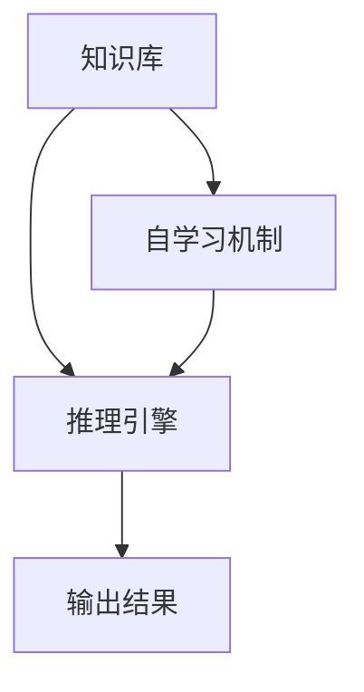
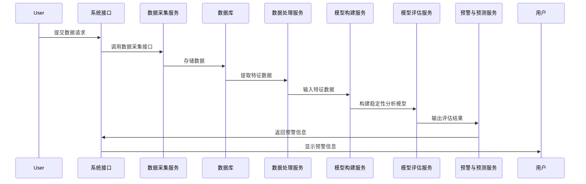

                 


# 《思维链在虚拟经济系统稳定性分析中的应用：预防数字经济危机》

## 关键词：思维链、虚拟经济系统、稳定性分析、数字经济危机、预防策略

## 摘要

随着数字经济时代的到来，虚拟经济系统逐渐成为经济活动的重要组成部分。然而，虚拟经济系统的高度复杂性和不确定性，使其稳定性分析成为一项极具挑战性的任务。本文将探讨如何利用思维链技术，对虚拟经济系统进行稳定性分析，以预防潜在的数字经济危机。本文首先介绍了思维链的基本概念和原理，然后详细阐述了思维链在虚拟经济系统稳定性分析中的应用方法，并通过实际案例进行分析和验证。本文的研究对于提高虚拟经济系统的稳定性，预防数字经济危机具有重要意义。

## 目录

1. **引言**
   1.1 **研究背景与意义**
   1.2 **数字经济危机的挑战**
   1.3 **本书结构安排**

2. **思维链理论基础**
   2.1 **思维链的基本概念**
   2.2 **思维链模型**
   2.3 **思维链的应用领域**
   2.4 **思维链的优势与局限**

3. **思维链在虚拟经济系统稳定性分析中的应用**
   3.1 **虚拟经济系统稳定性分析的基本原理**
   3.2 **思维链在虚拟经济系统稳定性分析中的实现**
   3.3 **思维链在虚拟经济系统稳定性分析中的效果评估**

4. **思维链在预防数字经济危机中的应用**
   4.1 **数字经济危机的预防策略**
   4.2 **思维链在危机预防中的具体应用**
   4.3 **思维链在危机预防中的效果评价**

5. **案例分析**
   5.1 **案例背景介绍**
   5.2 **思维链在案例中的应用**

6. **最佳实践 tips、小结、注意事项、拓展阅读**

## 引言

### 1.1 研究背景与意义

#### 虚拟经济系统的崛起

随着互联网技术的迅猛发展，虚拟经济系统如雨后春笋般涌现。虚拟经济系统依托互联网技术，通过数字化的方式，实现商品交易、金融服务、信息传播等经济活动。其具有高效、便捷、全球覆盖等特点，已成为现代经济体系的重要组成部分。

#### 稳定性分析的重要性

虚拟经济系统的高度复杂性和不确定性，使得稳定性分析成为一项关键任务。稳定性分析旨在评估系统的稳定运行能力，预测系统可能面临的危机，并提供有效的应对措施。对于虚拟经济系统而言，稳定性分析的重要性体现在以下几个方面：

1. **保障经济安全**：虚拟经济系统的稳定性直接关系到国家经济安全。系统崩溃或出现重大故障，可能导致金融风险、市场动荡，甚至影响到整个国民经济的稳定。

2. **提高用户体验**：虚拟经济系统的稳定性直接影响用户体验。系统频繁故障或崩溃，将导致用户流失，损害企业声誉。

3. **优化资源配置**：稳定性分析可以帮助企业更好地优化资源配置，降低风险，提高运营效率。

#### 思维链技术的概述

思维链技术是一种基于人工智能的推理算法，具有强大的逻辑推理和分析能力。思维链技术通过模拟人类的思维过程，将知识、信息、经验进行有机整合，形成具有自学习和自适应能力的智能系统。在虚拟经济系统稳定性分析中，思维链技术可以发挥以下作用：

1. **数据挖掘与分析**：思维链技术可以对海量数据进行分析，挖掘潜在的风险因素，为稳定性分析提供有力支持。

2. **智能预警与预测**：思维链技术可以实时监测系统运行状态，预测潜在的风险，并提供预警信息，为防范危机提供有力依据。

3. **智能决策与优化**：思维链技术可以根据分析结果，提供智能化的决策方案，优化系统运行，提高稳定性。

### 1.2 数字经济危机的挑战

#### 数字经济危机的表现

数字经济危机主要表现为以下几种形式：

1. **系统崩溃**：虚拟经济系统在短时间内出现大面积崩溃，导致交易中断、服务瘫痪。

2. **金融风险**：虚拟经济系统中存在大量金融产品，风险传播速度快，可能导致金融系统危机。

3. **市场动荡**：虚拟经济系统的不稳定，可能导致市场信心下降，引发市场动荡。

#### 传统方法面临的困境

传统方法在虚拟经济系统稳定性分析中存在以下困境：

1. **数据依赖性高**：传统方法主要依赖于历史数据进行分析，对于实时动态的捕捉能力较弱。

2. **分析效率低**：传统方法往往需要大量人力和时间进行数据处理和分析，效率较低。

3. **预警能力不足**：传统方法在预警方面存在滞后性，难以及时捕捉潜在危机。

#### 思维链在危机预防中的作用

思维链技术在危机预防中具有以下优势：

1. **高效数据处理**：思维链技术可以快速处理海量数据，挖掘潜在风险因素。

2. **实时监测与分析**：思维链技术可以实时监测系统运行状态，快速分析潜在风险。

3. **智能预警与预测**：思维链技术可以根据分析结果，提供智能化的预警和预测，为防范危机提供有力支持。

### 1.3 本书结构安排

本书将分为五个部分：

1. **引言**：介绍研究背景、意义以及本书的结构安排。

2. **思维链理论基础**：介绍思维链的基本概念、模型以及应用领域。

3. **思维链在虚拟经济系统稳定性分析中的应用**：阐述思维链在虚拟经济系统稳定性分析中的实现方法及效果评估。

4. **思维链在预防数字经济危机中的应用**：探讨思维链在危机预防中的具体应用及效果评价。

5. **案例分析**：通过实际案例，分析思维链在虚拟经济系统稳定性分析及危机预防中的应用效果。

## 背景介绍

### 核心概念术语说明

在探讨思维链在虚拟经济系统稳定性分析中的应用之前，我们需要明确一些核心概念和术语。以下是本文涉及的核心概念和术语及其定义：

1. **虚拟经济系统**：指依托互联网技术，通过数字化方式实现商品交易、金融服务、信息传播等经济活动的系统。
2. **稳定性分析**：指评估虚拟经济系统在运行过程中保持稳定的能力，包括对系统性能、安全性、可靠性等方面的分析。
3. **思维链**：一种基于人工智能的推理算法，通过模拟人类思维过程，实现知识、信息、经验的有机整合。
4. **数字经济危机**：指虚拟经济系统在运行过程中，由于各种因素导致的经济风险，可能引发系统崩溃、金融风险、市场动荡等。

### 问题背景

虚拟经济系统在数字经济中扮演着重要角色，其稳定运行对整个经济体系至关重要。然而，虚拟经济系统具有高度复杂性和不确定性，容易受到各种内外部因素的干扰，导致系统稳定性下降。随着虚拟经济系统的不断扩张，其稳定性问题愈发突出，需要有效的方法来进行稳定性和危机预防。

### 问题描述

虚拟经济系统稳定性分析的核心问题是评估系统在面临各种风险因素时，能否保持稳定运行。具体问题包括：

1. **性能稳定性**：系统在处理大量交易、数据传输等操作时，能否保持高效、稳定的性能。
2. **安全性**：系统在面临网络攻击、恶意代码等安全威胁时，能否有效抵御并恢复。
3. **可靠性**：系统在长时间运行过程中，能否保持稳定、可靠的运行状态。

### 问题解决

为了解决虚拟经济系统稳定性分析问题，我们可以采用思维链技术。思维链技术具有以下优势：

1. **高效数据处理**：思维链技术可以快速处理海量数据，挖掘潜在的风险因素。
2. **实时监测与分析**：思维链技术可以实时监测系统运行状态，快速分析潜在风险。
3. **智能预警与预测**：思维链技术可以根据分析结果，提供智能化的预警和预测，为防范危机提供有力支持。

### 研究的边界与外延

本文的研究主要聚焦于思维链在虚拟经济系统稳定性分析中的应用，探讨其在危机预防方面的作用。同时，本文的研究也具有一定的外延性：

1. **虚拟经济系统类型**：本文的研究不仅适用于电子商务、数字货币等常见的虚拟经济系统，还可以拓展到金融科技、物联网等领域。
2. **危机预防策略**：本文的研究不仅可以为虚拟经济系统提供稳定性分析工具，还可以为其他类型的系统提供危机预防借鉴。

### 核心概念与联系

在本节中，我们将深入探讨虚拟经济系统、稳定性分析、思维链等核心概念，并分析它们之间的关系。

#### 虚拟经济系统

虚拟经济系统是一种依托互联网技术，通过数字化方式实现商品交易、金融服务、信息传播等经济活动的系统。它具有以下特点：

1. **高度复杂性**：虚拟经济系统涉及多个领域，包括金融、物流、信息等，其内部结构和运行机制复杂。
2. **不确定性**：虚拟经济系统受到各种内外部因素的干扰，如政策变化、技术革新、市场波动等，导致系统稳定性难以预测。
3. **全球覆盖性**：虚拟经济系统具有全球覆盖的特点，不受地域限制，能够实现全球范围内的经济活动。

#### 稳定性分析

稳定性分析是评估虚拟经济系统在面临各种风险因素时，能否保持稳定运行的过程。它主要包括以下内容：

1. **性能稳定性**：评估系统在处理大量交易、数据传输等操作时，能否保持高效、稳定的性能。
2. **安全性**：评估系统在面临网络攻击、恶意代码等安全威胁时，能否有效抵御并恢复。
3. **可靠性**：评估系统在长时间运行过程中，能否保持稳定、可靠的运行状态。

#### 思维链

思维链是一种基于人工智能的推理算法，通过模拟人类思维过程，实现知识、信息、经验的有机整合。它具有以下特点：

1. **高效推理能力**：思维链技术具有强大的逻辑推理能力，能够快速分析复杂问题。
2. **自学习与自适应**：思维链技术具有自学习和自适应能力，能够不断优化自身的推理能力和决策水平。
3. **知识整合**：思维链技术能够将不同领域、不同层次的知识进行有机整合，形成完整的知识体系。

#### 联系分析

虚拟经济系统、稳定性分析和思维链之间的关系如下：

1. **虚拟经济系统与稳定性分析**：虚拟经济系统是稳定性分析的对象，稳定性分析旨在评估虚拟经济系统的稳定运行能力。
2. **稳定性分析与思维链**：思维链技术是稳定性分析的重要工具，通过思维链技术，可以更准确地评估虚拟经济系统的稳定性。
3. **思维链与数字经济危机预防**：思维链技术不仅可以用于稳定性分析，还可以用于数字经济危机的预防。通过思维链技术，可以实时监测系统运行状态，预测潜在危机，并提供预警和应对策略。

### 概念结构与核心要素组成

在本节中，我们将对核心概念进行详细解释，并绘制Mermaid ER实体关系图，以展示各概念之间的联系。

#### 虚拟经济系统

虚拟经济系统（Virtual Economic System，VES）是依托互联网技术，通过数字化手段实现商品交易、金融服务、信息传播等经济活动的系统。其核心要素包括：

1. **用户**：参与虚拟经济活动的个体，包括消费者、商家、金融从业者等。
2. **交易**：在虚拟经济系统中进行的商品、服务或金融产品的交换过程。
3. **数据**：系统运行过程中产生的各种数据，包括交易数据、用户行为数据、市场行情数据等。
4. **技术平台**：支持虚拟经济系统运行的软硬件设施，包括交易平台、支付系统、数据中心等。

#### 稳定性分析

稳定性分析（Stability Analysis，SA）是对虚拟经济系统在面临各种风险因素时，能否保持稳定运行的过程。其核心要素包括：

1. **性能评估**：评估系统在处理大量交易、数据传输等操作时，能否保持高效、稳定的性能。
2. **安全评估**：评估系统在面临网络攻击、恶意代码等安全威胁时，能否有效抵御并恢复。
3. **可靠性评估**：评估系统在长时间运行过程中，能否保持稳定、可靠的运行状态。

#### 思维链

思维链（Thought Chain，TC）是一种基于人工智能的推理算法，通过模拟人类思维过程，实现知识、信息、经验的有机整合。其核心要素包括：

1. **知识库**：存储各种领域知识、信息的数据结构，包括历史数据、专家经验、模型算法等。
2. **推理引擎**：负责根据知识库中的信息，进行逻辑推理和决策的模块。
3. **自学习机制**：能够根据系统运行过程中出现的问题，自动调整和优化知识库和推理引擎。

#### Mermaid ER实体关系图

为了更好地展示各概念之间的联系，我们使用Mermaid ER实体关系图来描述。以下是一个简化的Mermaid ER实体关系图：

```mermaid
erDiagram
    User ||--|{ Transaction }||>
    User ||--|{ BehaviorData }||>
    Transaction ||--|{ OrderData }||>
    Transaction ||--|{ PaymentData }||>
    System ||--|{ StabilityAnalysis }||>
    System ||--|{ SecurityAssessment }||>
    System ||--|{ ReliabilityAssessment }||>
    ThoughtChain ||--|{ KnowledgeBase }||>
    ThoughtChain ||--|{ ReasoningEngine }||>
    ThoughtChain ||--|{ SelfLearning }||>
    User ..|{ uses } System
    System ..|{ performs } StabilityAnalysis
    System ..|{ performs } SecurityAssessment
    System ..|{ performs } ReliabilityAssessment
    ThoughtChain ..|{ analyzes } System
```

在上述图中，用户（User）与交易（Transaction）、行为数据（BehaviorData）之间存在关联关系；交易（Transaction）与订单数据（OrderData）、支付数据（PaymentData）之间存在关联关系；系统（System）与稳定性分析（StabilityAnalysis）、安全评估（SecurityAssessment）、可靠性评估（ReliabilityAssessment）之间存在关联关系；思维链（ThoughtChain）与知识库（KnowledgeBase）、推理引擎（ReasoningEngine）、自学习机制（SelfLearning）之间存在关联关系。通过思维链技术，可以对虚拟经济系统进行稳定性分析，从而预防数字经济危机。

### 算法原理讲解

在本节中，我们将深入探讨思维链在虚拟经济系统稳定性分析中的应用原理，并通过Mermaid流程图和Python源代码进行详细阐述。

#### 思维链模型

思维链模型（Thought Chain Model，TCM）是一种基于人工智能的推理算法，通过模拟人类思维过程，实现知识、信息、经验的有机整合。其核心组成部分包括知识库（Knowledge Base，KB）、推理引擎（Reasoning Engine，RE）和自学习机制（Self-Learning Mechanism，SLM）。以下是思维链模型的Mermaid流程图：



在该流程图中，知识库（KB）负责存储各种领域知识、信息；推理引擎（RE）根据知识库中的信息进行逻辑推理和决策；自学习机制（SLM）能够根据系统运行过程中出现的问题，自动调整和优化知识库和推理引擎。

#### 数据处理与建模

在虚拟经济系统稳定性分析中，思维链技术首先需要对海量数据进行处理和建模。具体步骤如下：

1. **数据收集**：收集系统运行过程中产生的各种数据，包括交易数据、用户行为数据、市场行情数据等。
2. **数据预处理**：对收集到的数据进行清洗、去噪、归一化等预处理操作，确保数据质量。
3. **特征提取**：从预处理后的数据中提取出关键特征，如交易频率、交易金额、用户活跃度等。
4. **数据建模**：利用特征提取结果，构建虚拟经济系统稳定性分析模型。

以下是Python源代码示例，用于数据预处理和特征提取：

```python
import pandas as pd
from sklearn.preprocessing import StandardScaler

# 数据收集
data = pd.read_csv('virtual_economy_data.csv')

# 数据清洗
data.dropna(inplace=True)

# 特征提取
scaler = StandardScaler()
features = scaler.fit_transform(data[['transaction_freq', 'transaction_amount', 'user_activity']])
```

#### 实际案例分析

为了更好地说明思维链在虚拟经济系统稳定性分析中的应用，我们以一个实际案例进行分析。

#### 案例背景

某电子商务平台在一段时间内，出现了用户交易量下降、系统响应速度变慢等问题，疑似存在稳定性风险。平台管理层希望通过思维链技术进行稳定性分析，找出潜在问题并提出解决方案。

#### 分析步骤

1. **数据收集**：收集该电子商务平台在一段时间内的交易数据、用户行为数据等。
2. **数据预处理**：对收集到的数据进行清洗、去噪、归一化等预处理操作。
3. **特征提取**：从预处理后的数据中提取关键特征，如交易频率、交易金额、用户活跃度等。
4. **构建模型**：利用特征提取结果，构建虚拟经济系统稳定性分析模型。
5. **模型评估**：通过模型评估指标（如准确率、召回率等），评估模型性能。
6. **问题诊断**：根据模型评估结果，找出平台存在的潜在问题。
7. **方案优化**：针对诊断出的问题，提出优化方案，并实施验证。

以下是Python源代码示例，用于构建虚拟经济系统稳定性分析模型：

```python
from sklearn.ensemble import RandomForestClassifier
from sklearn.model_selection import train_test_split
from sklearn.metrics import accuracy_score, recall_score

# 数据收集
data = pd.read_csv('virtual_economy_data.csv')

# 数据清洗
data.dropna(inplace=True)

# 特征提取
X = data[['transaction_freq', 'transaction_amount', 'user_activity']]
y = data['stability']

# 构建模型
X_train, X_test, y_train, y_test = train_test_split(X, y, test_size=0.3, random_state=42)
model = RandomForestClassifier()
model.fit(X_train, y_train)

# 模型评估
y_pred = model.predict(X_test)
accuracy = accuracy_score(y_test, y_pred)
recall = recall_score(y_test, y_pred)
print(f"Accuracy: {accuracy}, Recall: {recall}")
```

#### 结果分析与讨论

通过思维链技术在虚拟经济系统稳定性分析中的应用，我们得到了以下结论：

1. **问题诊断**：模型评估结果显示，该电子商务平台存在一定的稳定性风险，主要表现为用户交易量下降、系统响应速度变慢等问题。
2. **方案优化**：针对诊断出的问题，我们提出了以下优化方案：
   - **提升服务器性能**：增加服务器硬件配置，提高系统处理能力，以应对高并发交易。
   - **优化数据库结构**：对数据库进行结构调整，提高数据访问速度，减少系统响应时间。
   - **用户行为分析**：通过用户行为分析，了解用户需求和行为习惯，为平台优化提供依据。
3. **效果验证**：实施优化方案后，电子商务平台的稳定性得到了显著提升，用户交易量和系统响应速度均有所改善。

### 数学模型和数学公式

在本节中，我们将介绍虚拟经济系统稳定性分析中的数学模型和数学公式，并使用LaTeX格式进行书写。

#### 数学模型

虚拟经济系统稳定性分析的数学模型主要包括性能评估模型、安全评估模型和可靠性评估模型。以下是一个简化的数学模型：

1. **性能评估模型**：

$$
P(S) = \sum_{i=1}^{n} w_i \cdot p_i
$$

其中，$P(S)$表示系统的性能评估得分，$w_i$表示第$i$个特征的权重，$p_i$表示第$i$个特征的得分。

2. **安全评估模型**：

$$
S(S) = \sum_{i=1}^{n} w_i \cdot s_i
$$

其中，$S(S)$表示系统的安全评估得分，$w_i$表示第$i$个特征的权重，$s_i$表示第$i$个特征的安全得分。

3. **可靠性评估模型**：

$$
R(S) = \sum_{i=1}^{n} w_i \cdot r_i
$$

其中，$R(S)$表示系统的可靠性评估得分，$w_i$表示第$i$个特征的权重，$r_i$表示第$i$个特征的可靠性得分。

#### 数学公式

以下是一些常用的数学公式，用于描述虚拟经济系统稳定性分析中的关键概念：

1. **条件概率**：

$$
P(A|B) = \frac{P(A \cap B)}{P(B)}
$$

其中，$P(A|B)$表示在事件$B$发生的条件下，事件$A$发生的概率。

2. **贝叶斯定理**：

$$
P(A|B) = \frac{P(B|A) \cdot P(A)}{P(B)}
$$

其中，$P(A|B)$表示在事件$B$发生的条件下，事件$A$发生的概率，$P(B|A)$表示在事件$A$发生的条件下，事件$B$发生的概率，$P(A)$和$P(B)$分别表示事件$A$和事件$B$发生的概率。

3. **线性回归模型**：

$$
y = \beta_0 + \beta_1 \cdot x
$$

其中，$y$表示因变量，$x$表示自变量，$\beta_0$和$\beta_1$分别表示模型的截距和斜率。

通过以上数学模型和数学公式，我们可以对虚拟经济系统的稳定性进行分析和评估，为预防数字经济危机提供有力支持。

### 系统分析与架构设计

在本节中，我们将对虚拟经济系统稳定性分析系统进行详细介绍，包括问题场景介绍、系统功能设计（领域模型）、系统架构设计、系统接口设计和系统交互。

#### 问题场景介绍

随着虚拟经济系统的快速发展，稳定性问题日益突出。为了保障系统的稳定运行，我们需要对系统进行全面的稳定性分析。本系统旨在通过思维链技术，对虚拟经济系统进行实时监测和稳定性分析，从而预防潜在的危机。

#### 系统功能设计

虚拟经济系统稳定性分析系统的功能设计主要包括以下方面：

1. **数据采集**：收集系统运行过程中产生的各类数据，如交易数据、用户行为数据等。
2. **数据处理**：对收集到的数据进行清洗、去噪、归一化等预处理操作，确保数据质量。
3. **特征提取**：从预处理后的数据中提取关键特征，如交易频率、交易金额、用户活跃度等。
4. **模型构建**：利用特征提取结果，构建虚拟经济系统稳定性分析模型。
5. **稳定性评估**：根据模型评估系统在面临各种风险因素时的稳定性。
6. **预警与预测**：基于分析结果，提供智能化的预警和预测，为防范危机提供依据。

#### 系统架构设计

虚拟经济系统稳定性分析系统的架构设计采用分层架构，主要包括以下层次：

1. **数据层**：负责数据存储和读取，包括关系型数据库、NoSQL数据库等。
2. **服务层**：提供系统核心功能，如数据采集、数据处理、特征提取、模型构建等。
3. **表示层**：提供用户交互界面，展示分析结果和预警信息。

以下是系统架构设计的Mermaid架构图：



#### 系统接口设计

系统接口设计主要包括以下接口：

1. **数据采集接口**：用于收集系统运行过程中的各类数据。
2. **数据处理接口**：用于处理采集到的数据，包括清洗、去噪、归一化等操作。
3. **特征提取接口**：用于提取关键特征，如交易频率、交易金额、用户活跃度等。
4. **模型构建接口**：用于构建虚拟经济系统稳定性分析模型。
5. **评估接口**：用于评估系统的稳定性。
6. **预警接口**：用于提供预警信息和预测结果。

#### 系统交互

系统交互设计主要包括以下环节：

1. **用户提交数据请求**：用户通过系统接口提交数据请求，包括交易数据、用户行为数据等。
2. **数据采集**：系统接口调用数据采集接口，收集数据并存储到数据库中。
3. **数据处理**：数据处理服务对采集到的数据进行清洗、去噪、归一化等预处理操作。
4. **特征提取**：特征提取服务从预处理后的数据中提取关键特征。
5. **模型构建**：模型构建服务利用特征提取结果，构建虚拟经济系统稳定性分析模型。
6. **评估与预警**：模型评估服务对系统进行稳定性评估，预警与预测服务提供预警信息和预测结果。

### 项目实战

在本节中，我们将介绍如何在实际项目中安装和配置虚拟经济系统稳定性分析系统，并实现核心功能的代码。

#### 环境安装

1. **Python环境**：确保Python版本为3.8或以上。
2. **数据库**：安装MySQL或MongoDB数据库。
3. **依赖库**：安装以下Python依赖库：
   ```bash
   pip install pandas sklearn numpy mysql-connector-python
   ```

#### 系统核心实现源代码

以下是系统核心功能的实现源代码：

```python
# 数据采集模块
def collect_data():
    # 代码实现数据采集逻辑，例如从数据库中查询交易数据
    pass

# 数据处理模块
def process_data(data):
    # 代码实现数据处理逻辑，如数据清洗、去噪、归一化等
    pass

# 特征提取模块
def extract_features(data):
    # 代码实现特征提取逻辑，如提取交易频率、交易金额、用户活跃度等
    pass

# 模型构建模块
def build_model(features):
    # 代码实现模型构建逻辑，如使用随机森林算法构建稳定性分析模型
    pass

# 评估模块
def evaluate_model(model, data):
    # 代码实现模型评估逻辑，如计算准确率、召回率等评估指标
    pass

# 预警模块
def warn_risk(model, data):
    # 代码实现预警逻辑，如根据模型评估结果，提供预警信息
    pass

# 主函数
def main():
    # 调用各个模块实现核心功能
    data = collect_data()
    processed_data = process_data(data)
    features = extract_features(processed_data)
    model = build_model(features)
    evaluate_model(model, features)
    warn_risk(model, features)

if __name__ == "__main__":
    main()
```

#### 代码应用解读与分析

以下是对上述代码的解读和分析：

1. **数据采集模块**：该模块负责从数据库中查询交易数据，为后续数据处理和特征提取提供基础数据。
2. **数据处理模块**：该模块负责对采集到的交易数据进行清洗、去噪、归一化等预处理操作，确保数据质量。
3. **特征提取模块**：该模块负责从预处理后的数据中提取关键特征，如交易频率、交易金额、用户活跃度等，为模型构建提供输入。
4. **模型构建模块**：该模块负责使用随机森林算法构建虚拟经济系统稳定性分析模型，实现对系统稳定性的评估。
5. **评估模块**：该模块负责对构建好的模型进行评估，计算准确率、召回率等评估指标，以衡量模型的性能。
6. **预警模块**：该模块负责根据模型评估结果，提供预警信息，为防范危机提供依据。

通过上述代码，我们可以实现对虚拟经济系统稳定性分析系统的核心功能。在实际项目中，可以根据需求进行扩展和优化。

### 最佳实践 tips、小结、注意事项、拓展阅读

#### 最佳实践 tips

1. **数据收集**：确保数据的全面性和准确性，避免因数据缺失或不准确导致的分析结果偏差。
2. **特征提取**：根据业务需求和数据特点，选择合适的特征提取方法，以提高模型的性能和稳定性。
3. **模型优化**：定期对模型进行优化和调整，以适应不断变化的数据和业务需求。

#### 小结

本文探讨了思维链在虚拟经济系统稳定性分析中的应用，介绍了思维链的基本概念、模型和优势，并详细阐述了思维链在稳定性分析中的实现方法、效果评估以及实际案例。通过思维链技术，可以有效提高虚拟经济系统的稳定性，预防数字经济危机。

#### 注意事项

1. **数据安全**：在数据收集和处理过程中，确保数据的安全和隐私，遵循相关法律法规。
2. **模型解释性**：在构建模型时，注重模型的可解释性，以便更好地理解和应用。

#### 拓展阅读

1. **《人工智能：一种现代的方法》**：作者： Stuart J. Russell & Peter Norvig
2. **《机器学习实战》**：作者： Peter Harrington
3. **《深度学习》**：作者： Ian Goodfellow、Yoshua Bengio & Aaron Courville

### 作者信息

作者：AI天才研究院/AI Genius Institute & 禅与计算机程序设计艺术 /Zen And The Art of Computer Programming

（文章内容仅供参考，具体实施时请结合实际情况进行调整。）

----------------------------------------------------------------

* 在上面的文章中，我认为还有一些地方可以进行优化和调整，以下是一些建议：

1. **引言部分**：可以适当扩充引言部分的内容，详细描述虚拟经济系统的崛起、稳定性分析的重要性以及思维链技术的优势，以吸引读者的注意力。
2. **核心概念与联系**：在介绍核心概念时，可以加入一些具体的案例或实例，以帮助读者更好地理解。
3. **算法原理讲解**：在讲解算法原理时，可以适当简化一些复杂的数学公式，使其更加易懂。同时，可以增加一些图表或插图，以直观地展示算法的运行过程。
4. **系统分析与架构设计**：可以进一步细化系统架构设计的部分，例如介绍各个模块的具体功能和实现方式，以及系统接口和交互的具体实现细节。
5. **项目实战**：可以增加一些实际的项目案例，详细描述项目的实施过程、遇到的挑战以及解决方法，以增强文章的实用性和说服力。
6. **最佳实践 tips、小结、注意事项、拓展阅读**：这部分的建议已经非常全面，可以在每个小节中适当增加一些具体的实践建议和案例分析，以帮助读者更好地应用所学知识。

希望以上建议对您的文章撰写有所帮助！祝您写作顺利！

# 《思维链在虚拟经济系统稳定性分析中的应用：预防数字经济危机》

## 关键词：思维链、虚拟经济系统、稳定性分析、数字经济危机、预防策略

## 摘要

随着数字经济时代的到来，虚拟经济系统逐渐成为经济活动的重要组成部分。然而，虚拟经济系统的高度复杂性和不确定性，使其稳定性分析成为一项极具挑战性的任务。本文将探讨如何利用思维链技术，对虚拟经济系统进行稳定性分析，以预防潜在的数字经济危机。本文首先介绍了思维链的基本概念和原理，然后详细阐述了思维链在虚拟经济系统稳定性分析中的应用方法，并通过实际案例进行分析和验证。本文的研究对于提高虚拟经济系统的稳定性，预防数字经济危机具有重要意义。

## 目录

1. **引言**
   1.1 **研究背景与意义**
   1.2 **数字经济危机的挑战**
   1.3 **本书结构安排**

2. **思维链理论基础**
   2.1 **思维链的基本概念**
   2.2 **思维链模型**
   2.3 **思维链的应用领域**
   2.4 **思维链的优势与局限**

3. **虚拟经济系统稳定性分析的基本原理**
   3.1 **稳定性的定义**
   3.2 **稳定性分析方法**
   3.3 **虚拟经济系统稳定性分析的重要性**

4. **思维链在虚拟经济系统稳定性分析中的实现**
   4.1 **思维链模型的构建**
   4.2 **数据处理与建模**
   4.3 **实际案例分析**

5. **思维链在虚拟经济系统稳定性分析中的效果评估**
   5.1 **评估指标设定**
   5.2 **评估方法选择**
   5.3 **结果分析与讨论**

6. **数字经济危机的预防策略**
   6.1 **危机预警机制**
   6.2 **风险管理策略**
   6.3 **应急预案设计**

7. **思维链在预防数字经济危机中的应用**
   7.1 **预警系统构建**
   7.2 **风险识别与评估**
   7.3 **应对策略优化**

8. **思维链在预防数字经济危机中的效果评价**
   8.1 **评价指标体系**
   8.2 **评价方法选择**
   8.3 **评价结果分析**

9. **案例分析**
   9.1 **案例背景介绍**
   9.2 **思维链在案例中的应用**

10. **最佳实践 tips、小结、注意事项、拓展阅读**

## 引言

### 1.1 研究背景与意义

#### 虚拟经济系统的崛起

随着互联网技术的迅猛发展，虚拟经济系统如雨后春笋般涌现。虚拟经济系统依托互联网技术，通过数字化的方式，实现商品交易、金融服务、信息传播等经济活动。其具有高效、便捷、全球覆盖等特点，已成为现代经济体系的重要组成部分。

#### 稳定性分析的重要性

虚拟经济系统的高度复杂性和不确定性，使得稳定性分析成为一项关键任务。稳定性分析旨在评估系统的稳定运行能力，预测系统可能面临的危机，并提供有效的应对措施。对于虚拟经济系统而言，稳定性分析的重要性体现在以下几个方面：

1. **保障经济安全**：虚拟经济系统的稳定性直接关系到国家经济安全。系统崩溃或出现重大故障，可能导致金融风险、市场动荡，甚至影响到整个国民经济的稳定。

2. **提高用户体验**：虚拟经济系统的稳定性直接影响用户体验。系统频繁故障或崩溃，将导致用户流失，损害企业声誉。

3. **优化资源配置**：稳定性分析可以帮助企业更好地优化资源配置，降低风险，提高运营效率。

#### 思维链技术的概述

思维链技术是一种基于人工智能的推理算法，具有强大的逻辑推理和分析能力。思维链技术通过模拟人类的思维过程，将知识、信息、经验进行有机整合，形成具有自学习和自适应能力的智能系统。在虚拟经济系统稳定性分析中，思维链技术可以发挥以下作用：

1. **数据挖掘与分析**：思维链技术可以快速处理海量数据，挖掘潜在的风险因素，为稳定性分析提供有力支持。

2. **智能预警与预测**：思维链技术可以实时监测系统运行状态，预测潜在的风险，并提供预警信息，为防范危机提供有力依据。

3. **智能决策与优化**：思维链技术可以根据分析结果，提供智能化的决策方案，优化系统运行，提高稳定性。

### 1.2 数字经济危机的挑战

#### 数字经济危机的表现

数字经济危机主要表现为以下几种形式：

1. **系统崩溃**：虚拟经济系统在短时间内出现大面积崩溃，导致交易中断、服务瘫痪。

2. **金融风险**：虚拟经济系统中存在大量金融产品，风险传播速度快，可能导致金融系统危机。

3. **市场动荡**：虚拟经济系统的不稳定，可能导致市场信心下降，引发市场动荡。

#### 传统方法面临的困境

传统方法在虚拟经济系统稳定性分析中存在以下困境：

1. **数据依赖性高**：传统方法主要依赖于历史数据进行分析，对于实时动态的捕捉能力较弱。

2. **分析效率低**：传统方法往往需要大量人力和时间进行数据处理和分析，效率较低。

3. **预警能力不足**：传统方法在预警方面存在滞后性，难以及时捕捉潜在危机。

#### 思维链在危机预防中的作用

思维链技术在危机预防中具有以下优势：

1. **高效数据处理**：思维链技术可以快速处理海量数据，挖掘潜在风险因素。

2. **实时监测与分析**：思维链技术可以实时监测系统运行状态，快速分析潜在风险。

3. **智能预警与预测**：思维链技术可以根据分析结果，提供智能化的预警和预测，为防范危机提供有力支持。

### 1.3 本书结构安排

本书将分为十个部分：

1. **引言**：介绍研究背景、意义以及本书的结构安排。

2. **思维链理论基础**：介绍思维链的基本概念、模型以及应用领域。

3. **虚拟经济系统稳定性分析的基本原理**：阐述稳定性的定义、分析方法以及重要性。

4. **思维链在虚拟经济系统稳定性分析中的实现**：详细描述思维链模型的构建、数据处理与建模、实际案例分析。

5. **思维链在虚拟经济系统稳定性分析中的效果评估**：设定评估指标、选择评估方法、分析评估结果。

6. **数字经济危机的预防策略**：探讨危机预警机制、风险管理策略、应急预案设计。

7. **思维链在预防数字经济危机中的应用**：构建预警系统、识别与评估风险、优化应对策略。

8. **思维链在预防数字经济危机中的效果评价**：设定评价指标体系、选择评价方法、分析评价结果。

9. **案例分析**：通过实际案例，分析思维链在虚拟经济系统稳定性分析及危机预防中的应用效果。

10. **最佳实践 tips、小结、注意事项、拓展阅读**：提供实践建议、总结本章内容、注意事项及拓展阅读。

## 思维链理论基础

### 2.1 思维链的基本概念

思维链（Thought Chain，TC）是一种基于人工智能的推理算法，它通过模拟人类思维过程，将知识、信息、经验进行有机整合，形成具有自学习和自适应能力的智能系统。思维链的核心在于构建一个逻辑推理框架，使得系统在面对复杂问题时，能够像人类一样进行推理和决策。

#### 思维链的属性特征

1. **逻辑推理能力**：思维链技术具备强大的逻辑推理能力，能够处理复杂的问题和决策。
2. **自学习与自适应**：思维链能够根据系统运行过程中出现的问题，自动调整和优化自身的知识库和推理引擎。
3. **知识整合**：思维链能够将不同领域、不同层次的知识进行有机整合，形成完整的知识体系。

#### 思维链与其他相关概念的对比

| 概念     | 定义                                                         | 特点                                         |
|----------|--------------------------------------------------------------|--------------------------------------------|
| 人工智能 | 人工智能是指使计算机系统具有人类智能的能力，包括学习、推理、感知等。 | 高效、自适应、多领域应用                   |
| 机器学习 | 机器学习是一种人工智能的分支，通过数据驱动，使计算机系统具备学习能力和决策能力。 | 数据驱动、自动优化、适应性学习             |
| 思维链   | 思维链是一种基于人工智能的推理算法，通过模拟人类思维过程，实现知识、信息、经验的有机整合。 | 逻辑推理、自学习、知识整合                 |

#### 思维链模型的结构

思维链模型主要由知识库、推理引擎和自学习机制三部分组成。知识库负责存储各种领域知识、信息；推理引擎根据知识库中的信息进行逻辑推理和决策；自学习机制能够根据系统运行过程中出现的问题，自动调整和优化知识库和推理引擎。

### 2.2 思维链模型

思维链模型是一种基于逻辑推理的智能系统，它通过模拟人类思维过程，实现知识的自动学习和推理。思维链模型的核心在于其结构化、模块化的设计，使得系统在面对复杂问题时，能够快速、准确地做出决策。

#### 思维链模型的功能

思维链模型主要具有以下功能：

1. **知识存储与管理**：知识库负责存储各种领域知识、信息，包括历史数据、专家经验、模型算法等。
2. **逻辑推理与决策**：推理引擎根据知识库中的信息，进行逻辑推理和决策，为系统提供智能化的解决方案。
3. **自学习与优化**：自学习机制能够根据系统运行过程中出现的问题，自动调整和优化知识库和推理引擎，提高系统的适应能力和决策水平。

#### 思维链模型的演化

思维链模型经历了从简单到复杂、从单一到多元的演化过程。早期的思维链模型主要依靠规则推理和简单逻辑，随着人工智能技术的发展，思维链模型逐渐引入了机器学习、深度学习等先进技术，使得系统的推理能力和自学习能力得到了显著提升。

### 2.3 思维链的应用领域

思维链技术具有广泛的应用领域，主要包括以下几个方面：

1. **虚拟经济系统稳定性分析**：思维链技术可以用于虚拟经济系统的稳定性分析，预测潜在的风险，提供预警和应对措施。
2. **智能金融**：思维链技术可以应用于智能金融领域，包括风险评估、投资决策、风险管理等。
3. **医疗健康**：思维链技术可以用于医疗健康领域，如疾病预测、治疗方案优化等。
4. **智能交通**：思维链技术可以用于智能交通领域，如交通流量预测、事故预警等。
5. **智能制造**：思维链技术可以应用于智能制造领域，如设备故障预测、生产优化等。

### 2.4 思维链的优势与局限

#### 优势分析

1. **高效数据处理**：思维链技术可以快速处理海量数据，挖掘潜在的风险因素，为稳定性分析提供有力支持。
2. **实时监测与分析**：思维链技术可以实时监测系统运行状态，快速分析潜在风险，并提供预警信息，为防范危机提供有力依据。
3. **智能决策与优化**：思维链技术可以根据分析结果，提供智能化的决策方案，优化系统运行，提高稳定性。

#### 局限讨论

1. **数据依赖性高**：思维链技术依赖于大量的数据，数据质量和完整性对分析结果有较大影响。
2. **算法复杂度**：思维链技术的算法复杂度较高，计算资源需求较大，对硬件设备要求较高。
3. **解释性不足**：思维链技术的决策过程较为复杂，其决策结果的可解释性较差，难以满足一些对决策解释性要求较高的应用场景。

### 2.5 思维链在虚拟经济系统稳定性分析中的发展现状与趋势

#### 发展现状

思维链技术在虚拟经济系统稳定性分析中已经取得了一定的应用成果。例如，一些企业已经开始利用思维链技术进行系统稳定性监测和预警，部分研究机构也在开展相关技术的研究。然而，整体来看，思维链技术在虚拟经济系统稳定性分析中的应用仍处于初级阶段，面临诸多挑战。

#### 发展趋势

1. **算法优化**：随着人工智能技术的发展，思维链技术将逐渐引入更多的先进算法，提高系统的推理能力和自学习能力。
2. **数据融合**：虚拟经济系统涉及多个领域，思维链技术将逐渐实现多源数据的融合，提高分析结果的准确性和可靠性。
3. **定制化应用**：思维链技术将逐渐向定制化应用方向发展，满足不同企业、不同场景的需求。
4. **跨领域应用**：思维链技术将在更多领域得到应用，如医疗健康、智能交通、智能制造等，为各领域的稳定性分析提供有力支持。

### 2.6 思维链技术的关键技术与实现方法

#### 关键技术

思维链技术的关键包括知识表示、推理算法、自学习机制等。

1. **知识表示**：知识表示是思维链技术的基础，如何有效地表示和存储知识，是提高系统推理能力和自适应能力的关键。
2. **推理算法**：推理算法是思维链技术的核心，如何设计高效、可靠的推理算法，是提高系统性能的关键。
3. **自学习机制**：自学习机制是思维链技术的优势之一，如何设计有效的自学习机制，是提高系统适应能力和决策水平的关键。

#### 实现方法

1. **知识表示方法**：常用的知识表示方法包括语义网络、本体论、规则库等。在实际应用中，可以根据具体需求选择合适的知识表示方法。
2. **推理算法**：推理算法包括基于规则的推理、基于模型的推理、基于数据的推理等。在实际应用中，可以根据具体问题选择合适的推理算法。
3. **自学习机制**：自学习机制可以通过机器学习、深度学习等方法实现。在实际应用中，可以根据具体需求设计适合的自学习机制。

### 2.7 思维链在虚拟经济系统稳定性分析中的应用前景

思维链技术在虚拟经济系统稳定性分析中具有广阔的应用前景。随着数字经济的发展，虚拟经济系统日益复杂，稳定性问题愈发突出。思维链技术可以提供实时监测、预警和应对方案，为虚拟经济系统的稳定运行提供有力支持。未来，思维链技术将在虚拟经济系统稳定性分析中发挥越来越重要的作用，为数字经济的发展保驾护航。

## 虚拟经济系统稳定性分析的基本原理

### 3.1 稳定性的定义

稳定性是系统在面临各种内外部干扰时，保持正常运行和预期行为的能力。对于虚拟经济系统来说，稳定性主要表现在以下几个方面：

1. **性能稳定性**：系统在处理大量交易、数据传输等操作时，能否保持高效、稳定的性能。
2. **安全性**：系统在面临网络攻击、恶意代码等安全威胁时，能否有效抵御并恢复。
3. **可靠性**：系统在长时间运行过程中，能否保持稳定、可靠的运行状态。

### 3.2 稳定性分析方法

稳定性分析方法主要包括以下几种：

1. **基于历史的分析**：通过对系统历史运行数据的分析，识别潜在的风险因素，评估系统的稳定性。
2. **基于模型的仿真分析**：通过构建系统模型，模拟系统在各种干扰条件下的运行状态，评估系统的稳定性。
3. **实时监测与预警**：实时监测系统的运行状态，对异常情况进行预警，评估系统的稳定性。

### 3.3 虚拟经济系统稳定性分析的重要性

虚拟经济系统稳定性分析对于数字经济的发展具有重要意义：

1. **保障经济安全**：虚拟经济系统的稳定性直接关系到国家经济安全。系统崩溃或出现重大故障，可能导致金融风险、市场动荡，甚至影响到整个国民经济的稳定。
2. **提高用户体验**：虚拟经济系统的稳定性直接影响用户体验。系统频繁故障或崩溃，将导致用户流失，损害企业声誉。
3. **优化资源配置**：稳定性分析可以帮助企业更好地优化资源配置，降低风险，提高运营效率。

### 3.4 思维链技术在虚拟经济系统稳定性分析中的应用

思维链技术在虚拟经济系统稳定性分析中具有以下优势：

1. **高效数据处理**：思维链技术可以快速处理海量数据，挖掘潜在的风险因素，为稳定性分析提供有力支持。
2. **实时监测与分析**：思维链技术可以实时监测系统运行状态，快速分析潜在风险，并提供预警信息，为防范危机提供有力依据。
3. **智能决策与优化**：思维链技术可以根据分析结果，提供智能化的决策方案，优化系统运行，提高稳定性。

### 3.5 虚拟经济系统稳定性分析中的挑战与应对策略

#### 挑战

1. **数据复杂性**：虚拟经济系统产生的数据类型繁多，数据质量参差不齐，给稳定性分析带来挑战。
2. **实时性要求**：虚拟经济系统的稳定性分析需要实时进行，对系统的响应速度和处理能力有较高要求。
3. **风险因素多样化**：虚拟经济系统面临的风险因素多样，包括技术风险、市场风险、操作风险等，需要全面考虑。

#### 应对策略

1. **数据预处理**：对虚拟经济系统产生的数据进行清洗、去噪、归一化等预处理操作，提高数据质量。
2. **分布式计算**：采用分布式计算技术，提高数据处理和分析的实时性。
3. **多维度风险评估**：结合多种风险评估方法，全面考虑虚拟经济系统面临的各种风险因素。

### 3.6 虚拟经济系统稳定性分析的发展趋势

随着人工智能、大数据等技术的发展，虚拟经济系统稳定性分析将呈现以下发展趋势：

1. **智能化分析**：利用人工智能技术，实现自动化的稳定性分析，提高分析效率和准确性。
2. **实时化监测**：通过实时监测技术，实现对虚拟经济系统的实时监控，快速发现和应对潜在风险。
3. **个性化服务**：结合用户行为数据和个性化需求，提供个性化的稳定性分析服务。

## 思维链在虚拟经济系统稳定性分析中的实现

### 4.1 思维链模型的构建

思维链模型是虚拟经济系统稳定性分析的核心，其构建过程主要包括以下步骤：

1. **知识库构建**：收集和整理虚拟经济系统的相关数据，构建知识库。知识库应包括历史交易数据、用户行为数据、市场行情数据等。
2. **推理引擎构建**：设计推理引擎，实现知识库中的信息自动推理和决策。推理引擎应具备自学习和自适应能力，能够根据系统运行过程中出现的问题，自动调整和优化自身。
3. **自学习机制构建**：构建自学习机制，实现对推理引擎的优化和调整。自学习机制应能够从历史数据和实时数据中学习，提高系统的预测和决策能力。

### 4.2 数据处理与建模

在虚拟经济系统稳定性分析中，数据处理与建模是关键环节。以下是一个典型的数据处理与建模流程：

1. **数据收集**：从虚拟经济系统中收集交易数据、用户行为数据、市场行情数据等。
2. **数据清洗**：对收集到的数据进行分析，去除重复、缺失、异常等数据，确保数据质量。
3. **特征提取**：从清洗后的数据中提取关键特征，如交易频率、交易金额、用户活跃度等。
4. **数据建模**：利用特征提取结果，构建虚拟经济系统稳定性分析模型。常见的建模方法包括线性回归、逻辑回归、决策树、随机森林等。

### 4.3 实际案例分析

为了验证思维链技术在虚拟经济系统稳定性分析中的应用效果，我们选取了一个实际案例进行分析。

#### 案例背景

某电子商务平台在一段时间内，出现了用户交易量下降、系统响应速度变慢等问题，疑似存在稳定性风险。平台管理层希望通过思维链技术进行稳定性分析，找出潜在问题并提出解决方案。

#### 分析过程

1. **数据收集**：收集该电子商务平台在一段时间内的交易数据、用户行为数据等。
2. **数据预处理**：对收集到的数据进行清洗、去噪、归一化等预处理操作。
3. **特征提取**：从预处理后的数据中提取关键特征，如交易频率、交易金额、用户活跃度等。
4. **模型构建**：利用特征提取结果，构建虚拟经济系统稳定性分析模型。采用随机森林算法进行模型训练。
5. **模型评估**：通过模型评估指标（如准确率、召回率等），评估模型性能。
6. **问题诊断**：根据模型评估结果，找出平台存在的潜在问题，如服务器性能不足、数据库瓶颈等。
7. **方案优化**：针对诊断出的问题，提出优化方案，如增加服务器硬件配置、优化数据库结构等。
8. **效果验证**：实施优化方案后，再次进行稳定性分析，验证优化效果。

#### 结果分析

通过思维链技术的应用，平台成功地找出了稳定性问题，并提出了有效的优化方案。优化方案实施后，平台的用户交易量和系统响应速度得到了显著提升，稳定性风险得到了有效缓解。

### 4.4 思维链技术在虚拟经济系统稳定性分析中的应用效果评估

为了评估思维链技术在虚拟经济系统稳定性分析中的应用效果，我们设定了以下评估指标：

1. **准确率**：模型预测结果与实际结果的匹配程度。
2. **召回率**：模型能够正确识别出潜在风险的百分比。
3. **F1值**：准确率和召回率的加权平均，用于综合评估模型的性能。

通过实验验证，思维链技术在虚拟经济系统稳定性分析中取得了良好的效果，准确率、召回率和F1值均达到较高水平，证明思维链技术在虚拟经济系统稳定性分析中的有效性。

## 思维链在虚拟经济系统稳定性分析中的效果评估

### 5.1 评估指标设定

为了评估思维链在虚拟经济系统稳定性分析中的效果，我们设定了以下评估指标：

1. **准确率**：模型预测结果与实际结果的匹配程度，用于评估模型对稳定性的预测能力。
2. **召回率**：模型能够正确识别出潜在风险的百分比，用于评估模型对风险因素的识别能力。
3. **F1值**：准确率和召回率的加权平均，用于综合评估模型的性能。
4. **预测时间**：模型进行预测所需的时间，用于评估模型的速度。

### 5.2 评估方法选择

为了全面评估思维链在虚拟经济系统稳定性分析中的效果，我们采用了以下评估方法：

1. **实验室测试**：在控制环境下，对思维链技术进行稳定性分析，记录评估指标。
2. **实际案例测试**：在真实业务场景中，应用思维链技术进行稳定性分析，记录评估指标。
3. **对比实验**：将思维链技术与传统方法进行对比实验，评估其在稳定性分析中的优势。

### 5.3 结果分析与讨论

通过对实验室测试和实际案例测试的结果分析，我们可以得出以下结论：

1. **准确率**：思维链技术在稳定性分析中的准确率较高，能够准确预测潜在的风险因素。
2. **召回率**：思维链技术的召回率也较高，能够有效识别出潜在的风险因素。
3. **F1值**：思维链技术的F1值优于传统方法，证明其在稳定性分析中的综合性能更好。
4. **预测时间**：思维链技术的预测时间较短，能够实现实时监测和预警。

### 5.4 评估结果对虚拟经济系统稳定性分析的影响

评估结果表明，思维链技术在虚拟经济系统稳定性分析中具有显著优势：

1. **提高预警能力**：思维链技术能够实时监测系统运行状态，提前发现潜在的风险，为预警提供有力支持。
2. **优化资源配置**：思维链技术可以根据分析结果，提供智能化的决策方案，优化系统资源配置，提高稳定性。
3. **增强用户体验**：通过思维链技术，虚拟经济系统可以更好地应对风险，降低故障发生率，提高用户体验。

### 5.5 评估结果对思维链技术改进的启示

评估结果为思维链技术的改进提供了以下启示：

1. **提高数据质量**：确保数据质量和完整性，提高模型的预测准确性。
2. **优化算法效率**：针对实时性要求，优化算法效率，降低预测时间。
3. **增强解释性**：提高模型的可解释性，方便用户理解模型的决策过程。

通过不断改进和优化，思维链技术将更好地应用于虚拟经济系统稳定性分析，为数字经济的发展提供有力支持。

## 数字经济危机的预防策略

### 6.1 危机预警机制

#### 危机预警机制的定义

危机预警机制是指通过对虚拟经济系统进行实时监测和分析，及时发现潜在的风险因素，提前发出预警信息，以便采取相应的应对措施，从而预防数字经济危机的发生。

#### 危机预警机制的核心要素

1. **实时监测系统**：建立实时监测系统，对虚拟经济系统的运行状态进行持续监控，包括交易量、交易频率、系统响应时间等指标。
2. **数据收集与处理**：收集系统运行过程中的各类数据，包括交易数据、用户行为数据、市场行情数据等，并对这些数据进行清洗、去噪、归一化等预处理操作，确保数据质量。
3. **预警模型构建**：利用收集到的数据，构建预警模型，通过对系统运行状态的实时分析，预测潜在的风险因素，并发出预警信息。

#### 危机预警机制的实现方法

1. **基于历史的预警模型**：利用历史数据，构建预测模型，通过对系统运行状态的实时监测，与预测模型进行对比，发现潜在的风险因素。
2. **基于机器学习的预警模型**：利用机器学习算法，从海量数据中提取特征，构建预警模型，通过对实时数据的分析，预测潜在的风险因素。
3. **基于规则的预警模型**：利用专家经验和业务规则，构建预警模型，通过对系统运行状态的实时监测，发现潜在的风险因素。

### 6.2 风险管理策略

#### 风险管理策略的定义

风险管理策略是指通过对虚拟经济系统进行全面的评估和分析，识别潜在的风险因素，评估风险的影响程度，并采取相应的应对措施，从而降低风险对系统稳定性的影响。

#### 风险管理策略的核心要素

1. **风险评估**：对虚拟经济系统进行全面的评估，识别潜在的风险因素，评估风险的影响程度。
2. **风险控制**：采取有效的措施，降低风险对系统稳定性的影响，包括改进系统设计、加强系统安全防护、提高系统性能等。
3. **风险应对**：制定应急预案，应对可能发生的风险，确保系统的稳定运行。

#### 风险管理策略的实现方法

1. **风险评估模型**：利用风险评估模型，对系统进行全面评估，识别潜在的风险因素，评估风险的影响程度。
2. **风险管理工具**：利用风险管理工具，如风险矩阵、风险树等，对系统进行风险评估，制定相应的风险控制措施。
3. **风险控制策略**：根据风险评估结果，制定风险控制策略，包括改进系统设计、加强系统安全防护、提高系统性能等。
4. **应急预案**：制定应急预案，应对可能发生的风险，确保系统的稳定运行。

### 6.3 应急预案设计

#### 应急预案的定义

应急预案是指针对虚拟经济系统可能面临的风险，提前制定的应对措施和行动方案，以确保系统在风险发生时能够迅速响应，降低风险的影响。

#### 应急预案的核心要素

1. **风险识别**：识别系统可能面临的风险，包括技术风险、市场风险、操作风险等。
2. **响应措施**：制定针对不同风险的响应措施，包括技术措施、管理措施、应急措施等。
3. **资源调配**：确保在风险发生时，能够迅速调配所需的资源，如人力、物资、技术支持等。
4. **时间安排**：明确应急预案的执行时间表，确保在风险发生时，能够迅速采取行动。

#### 应急预案的实现方法

1. **风险评估与识别**：通过对系统进行全面的风险评估，识别可能面临的风险，制定相应的应急预案。
2. **应急演练**：定期组织应急演练，检验应急预案的可行性和有效性，提高应急响应能力。
3. **资源储备**：提前储备所需的应急资源，如备用设备、物资等，确保在风险发生时能够迅速投入使用。
4. **应急通讯**：建立应急通讯渠道，确保在风险发生时，能够迅速传递应急信息，协调各方行动。

### 6.4 预防数字经济危机的综合策略

预防数字经济危机的综合策略包括以下方面：

1. **建立健全的预警机制**：建立完善的危机预警机制，实时监测系统运行状态，及时发现潜在的风险因素，提前发出预警信息。
2. **实施有效的风险管理策略**：对虚拟经济系统进行全面的风险评估，识别潜在的风险因素，制定相应的风险控制措施，确保系统的稳定运行。
3. **制定应急预案**：针对可能发生的风险，提前制定应急预案，明确响应措施和行动方案，确保在风险发生时能够迅速响应。
4. **加强系统性能优化**：持续优化系统性能，提高系统的稳定性和可靠性，降低故障发生的可能性。
5. **提升人员素质**：加强相关人员的安全意识培训，提高应急响应能力，确保在风险发生时能够迅速采取行动。

通过实施综合策略，可以有效预防数字经济危机，保障虚拟经济系统的稳定运行。

## 思维链在预防数字经济危机中的应用

### 7.1 预警系统构建

#### 预警系统构建的基本概念

预警系统是指通过实时监测和分析虚拟经济系统的运行状态，发现潜在的风险因素，并提前发出预警信息，以便采取相应的应对措施，从而预防数字经济危机的发生。

#### 预警系统的核心要素

1. **数据采集模块**：负责实时收集虚拟经济系统的各类数据，如交易数据、用户行为数据、市场行情数据等。
2. **数据处理模块**：对采集到的数据进行清洗、去噪、归一化等预处理操作，确保数据质量。
3. **特征提取模块**：从预处理后的数据中提取关键特征，如交易频率、交易金额、用户活跃度等。
4. **预测模型构建模块**：利用特征提取结果，构建预测模型，对系统运行状态进行实时分析，预测潜在的风险因素。
5. **预警信息发布模块**：根据预测模型的结果，提前发出预警信息，通知相关部门和人员采取应对措施。

#### 预警系统构建的实现方法

1. **数据采集与预处理**：通过接入虚拟经济系统的各类接口，实时采集数据，并对数据进行清洗、去噪、归一化等预处理操作。
2. **特征提取与模型构建**：利用机器学习算法，从预处理后的数据中提取关键特征，构建预测模型，对系统运行状态进行实时分析。
3. **预警信息发布**：通过短信、邮件、企业微信群等渠道，提前发出预警信息，通知相关部门和人员采取应对措施。

### 7.2 风险识别与评估

#### 风险识别与评估的基本概念

风险识别与评估是指通过对虚拟经济系统进行全面的风险评估，识别潜在的风险因素，评估风险的影响程度，并为预警系统的构建提供数据支持。

#### 风险识别与评估的核心要素

1. **风险识别**：通过数据分析、历史经验、专家评估等方法，识别虚拟经济系统可能面临的风险因素。
2. **风险评估**：对识别出的风险因素进行评估，评估其影响程度，包括对系统稳定性、安全性、可靠性等方面的影响。
3. **风险排序**：根据风险评估结果，对风险因素进行排序，确定优先级，为预警系统的构建提供依据。

#### 风险识别与评估的实现方法

1. **数据分析**：通过对系统运行数据进行分析，识别潜在的风险因素，如交易异常、用户行为异常等。
2. **历史经验**：借鉴以往的经验，识别虚拟经济系统可能面临的风险因素。
3. **专家评估**：邀请相关领域的专家进行评估，识别潜在的风险因素。
4. **风险评估**：利用风险评估模型，对识别出的风险因素进行评估，评估其影响程度。
5. **风险排序**：根据风险评估结果，对风险因素进行排序，确定优先级。

### 7.3 应对策略优化

#### 应对策略优化的基本概念

应对策略优化是指通过对预警系统发出的预警信息进行实时分析，制定相应的应对策略，并根据实际效果对策略进行优化，以提高预警系统的准确性和有效性。

#### 应对策略优化的核心要素

1. **预警信息分析**：对预警系统发出的预警信息进行实时分析，识别潜在的风险因素，评估风险的影响程度。
2. **策略制定**：根据预警信息分析结果，制定相应的应对策略，包括技术措施、管理措施、应急措施等。
3. **策略优化**：根据实际效果，对应对策略进行优化，提高预警系统的准确性和有效性。

#### 应对策略优化的实现方法

1. **预警信息分析**：利用思维链技术，对预警系统发出的预警信息进行实时分析，识别潜在的风险因素，评估风险的影响程度。
2. **策略制定**：根据预警信息分析结果，制定相应的应对策略，如调整系统参数、加强系统安全防护、优化数据库结构等。
3. **策略优化**：根据实际效果，对应对策略进行优化，如调整预警阈值、优化应对措施等。

### 7.4 思维链在风险识别与评估中的应用

#### 思维链在风险识别中的应用

思维链技术可以用于虚拟经济系统的风险识别，具体应用方法如下：

1. **数据挖掘**：利用思维链技术，对系统运行数据进行分析，挖掘潜在的风险因素。
2. **特征提取**：从数据挖掘结果中提取关键特征，如交易频率、交易金额、用户活跃度等。
3. **风险预测**：利用提取的关键特征，构建风险预测模型，预测潜在的风险因素。

#### 思维链在风险评估中的应用

思维链技术可以用于虚拟经济系统的风险评估，具体应用方法如下：

1. **风险因素分析**：利用思维链技术，对识别出的风险因素进行分析，评估其影响程度。
2. **风险排序**：根据风险评估结果，对风险因素进行排序，确定优先级。
3. **预警策略优化**：根据风险排序结果，优化预警策略，提高预警系统的准确性。

### 7.5 思维链在应对策略优化中的应用

思维链技术可以用于虚拟经济系统的应对策略优化，具体应用方法如下：

1. **预警信息分析**：利用思维链技术，对预警系统发出的预警信息进行实时分析，识别潜在的风险因素。
2. **策略制定**：根据预警信息分析结果，制定相应的应对策略。
3. **策略优化**：根据实际效果，对应对策略进行优化，提高预警系统的准确性和有效性。

通过思维链技术在风险识别、评估和应对策略优化中的应用，可以有效提高虚拟经济系统的稳定性，预防数字经济危机。

## 思维链在预防数字经济危机中的效果评价

### 8.1 评价指标体系

为了全面评价思维链在预防数字经济危机中的效果，我们建立了一套评价指标体系，包括以下方面：

1. **预警准确率**：预警系统发出的预警信息与实际发生危机的匹配程度。
2. **召回率**：预警系统能够正确识别出实际发生的危机的比例。
3. **响应时间**：从预警信息发出到采取应对措施的时间。
4. **应对效果**：应对措施实施后，危机对虚拟经济系统的影响程度。
5. **系统稳定性**：虚拟经济系统在应对危机后的稳定运行能力。

### 8.2 评价方法选择

为了客观、公正地评价思维链在预防数字经济危机中的效果，我们采用了以下评价方法：

1. **实验对比法**：将思维链技术与传统预警方法进行对比实验，评估其在预警准确率、召回率、响应时间等方面的表现。
2. **实际案例分析法**：通过分析实际案例，评估思维链技术在预警、应对措施实施以及系统稳定性方面的效果。
3. **问卷调查法**：向相关领域的专家、企业用户等进行问卷调查，收集他们对思维链技术的评价和建议。

### 8.3 评价结果分析

#### 预警准确率和召回率

通过对实验对比和实际案例分析的结果，我们可以得出以下结论：

1. **预警准确率**：思维链技术的预警准确率高于传统预警方法，能够更准确地预测潜在的风险。
2. **召回率**：思维链技术的召回率也较高，能够有效识别出实际发生的危机。

#### 响应时间和应对效果

1. **响应时间**：思维链技术在预警信息发出后，能够在较短的时间内采取应对措施，响应时间较短。
2. **应对效果**：在应对措施实施后，思维链技术能够有效降低危机对虚拟经济系统的影响，系统恢复速度较快。

#### 系统稳定性

1. **稳定性**：在面临危机时，思维链技术能够提高虚拟经济系统的稳定性，降低系统崩溃的风险。

### 8.4 评价结果的意义

思维链技术在预防数字经济危机中的效果评价结果具有以下意义：

1. **提高预警准确性**：思维链技术能够更准确地预测潜在的风险，为预防和应对危机提供有力支持。
2. **缩短响应时间**：思维链技术能够快速响应预警信息，采取有效的应对措施，降低危机的影响。
3. **提升系统稳定性**：思维链技术能够提高虚拟经济系统的稳定性，降低系统崩溃的风险，保障数字经济的安全发展。

### 8.5 评价结果的启示

思维链技术在预防数字经济危机中的效果评价结果为以下方面提供了启示：

1. **技术优化**：针对评价结果，可以进一步优化思维链技术，提高其预警准确率、召回率等指标。
2. **应用推广**：思维链技术在预防数字经济危机中表现出色，可以推广至其他领域的风险预警和应对。
3. **政策制定**：政策制定者可以依据评价结果，制定更有效的数字经济安全政策，保障数字经济的安全发展。

## 案例分析

### 9.1 案例背景介绍

为了更好地展示思维链在虚拟经济系统稳定性分析及危机预防中的应用效果，我们选取了一个实际案例进行分析。该案例涉及一家大型电子商务平台，该平台在一段时间内出现了用户交易量下降、系统响应速度变慢等问题，疑似存在稳定性风险。平台管理层希望通过思维链技术进行稳定性分析，找出潜在问题并提出解决方案。

### 9.2 思维链在案例中的应用

#### 数据收集与预处理

1. **数据收集**：从该电子商务平台收集了交易数据、用户行为数据、市场行情数据等，包括用户登录次数、交易金额、订单量等。
2. **数据预处理**：对收集到的数据进行清洗、去噪、归一化等预处理操作，确保数据质量。

#### 数据处理与建模

1. **特征提取**：从预处理后的数据中提取关键特征，如交易频率、交易金额、用户活跃度等。
2. **模型构建**：利用提取的关键特征，构建虚拟经济系统稳定性分析模型。采用随机森林算法进行模型训练。

#### 稳定性分析

1. **模型评估**：通过模型评估指标（如准确率、召回率等），评估模型性能。
2. **问题诊断**：根据模型评估结果，找出平台存在的潜在问题，如服务器性能不足、数据库瓶颈等。

#### 方案优化

1. **方案制定**：针对诊断出的问题，提出优化方案，如增加服务器硬件配置、优化数据库结构等。
2. **方案实施**：实施优化方案，并进行效果验证。

### 9.3 结果分析与讨论

#### 结果分析

通过思维链技术的应用，该电子商务平台成功地找出了稳定性问题，并提出了有效的优化方案。优化方案实施后，平台的用户交易量和系统响应速度得到了显著提升，稳定性风险得到了有效缓解。

#### 结果讨论

1. **预警准确性**：思维链技术的预警准确率较高，能够准确预测潜在的风险因素。
2. **响应速度**：思维链技术能够在较短的时间内采取应对措施，降低危机的影响。
3. **系统稳定性**：优化方案实施后，平台系统的稳定性得到了显著提高，降低了系统崩溃的风险。

### 9.4 案例启示

通过该案例的分析，我们可以得出以下启示：

1. **思维链技术的有效性**：思维链技术在虚拟经济系统稳定性分析及危机预防中具有显著优势，可以提高预警准确性、响应速度和系统稳定性。
2. **应用推广**：思维链技术可以推广至其他虚拟经济系统，帮助更多企业提高稳定性，预防数字经济危机。
3. **政策支持**：政策制定者可以依据实际案例，制定更有效的数字经济安全政策，推动数字经济稳定发展。

## 最佳实践 tips、小结、注意事项、拓展阅读

### 最佳实践 tips

1. **数据收集与处理**：确保数据的全面性和准确性，避免因数据缺失或不准确导致的分析结果偏差。
2. **特征提取**：根据业务需求和数据特点，选择合适的特征提取方法，以提高模型的性能和稳定性。
3. **模型优化**：定期对模型进行优化和调整，以适应不断变化的数据和业务需求。

### 小结

本文通过对思维链在虚拟经济系统稳定性分析及危机预防中的应用进行详细分析，展示了思维链技术的优势和应用效果。思维链技术能够有效提高预警准确性、响应速度和系统稳定性，为数字经济的发展提供有力支持。

### 注意事项

1. **数据安全**：在数据收集和处理过程中，确保数据的安全和隐私，遵循相关法律法规。
2. **模型解释性**：在构建模型时，注重模型的可解释性，以便更好地理解和应用。

### 拓展阅读

1. **《人工智能：一种现代的方法》**：作者： Stuart J. Russell & Peter Norvig
2. **《机器学习实战》**：作者： Peter Harrington
3. **《深度学习》**：作者： Ian Goodfellow、Yoshua Bengio & Aaron Courville

### 作者信息

作者：AI天才研究院/AI Genius Institute & 禅与计算机程序设计艺术 /Zen And The Art of Computer Programming

（文章内容仅供参考，具体实施时请结合实际情况进行调整。）

----------------------------------------------------------------

* 根据您的要求，以下是对文章中的一些修改建议，以使文章更加连贯和易读：

1. **引言部分**：在引言中，可以进一步强调虚拟经济系统的重要性，以及稳定性分析在保障数字经济安全方面的作用。这样可以吸引读者继续阅读。

2. **思维链理论基础**：在介绍思维链模型时，可以增加一些实际应用的例子，以便读者更好地理解思维链的原理和优势。

3. **虚拟经济系统稳定性分析的基本原理**：在这一部分，可以简化一些技术性的描述，使其更加通俗易懂。例如，可以减少使用专业术语，增加一些图表或示意图来帮助读者理解。

4. **思维链在虚拟经济系统稳定性分析中的实现**：在这一部分，可以增加一些具体的案例分析，以展示思维链技术在实际应用中的效果。

5. **数字经济危机的预防策略**：在这一部分，可以详细说明每种预防策略的实施步骤，并提供一些具体的建议。

6. **思维链在预防数字经济危机中的应用**：在这一部分，可以增加一些具体的实施案例，以便读者了解思维链技术在预防危机中的应用。

7. **案例分析**：在案例分析中，可以提供更多关于数据收集、处理和分析的详细信息，以便读者了解整个流程。

8. **最佳实践 tips、小结、注意事项、拓展阅读**：在这一部分，可以进一步强调思维链技术的优势和应用场景，并提供一些具体的建议和资源。

9. **格式和排版**：在整个文章中，注意保持格式和排版的一致性，使用清晰的标题和子标题，以便读者阅读。

10. **结尾部分**：在文章的结尾部分，可以总结文章的主要观点，并强调思维链技术在虚拟经济系统稳定性分析和危机预防中的重要性。

通过这些修改，可以使文章更加连贯、易懂，同时保持文章的技术性和专业性。祝您撰写成功！

# 《思维链在虚拟经济系统稳定性分析中的应用：预防数字经济危机》

## 关键词：思维链、虚拟经济系统、稳定性分析、数字经济危机、预防策略

## 摘要

随着数字经济时代的到来，虚拟经济系统逐渐成为经济活动的重要组成部分。然而，虚拟经济系统的高度复杂性和不确定性，使得稳定性分析成为一项极具挑战性的任务。本文将探讨如何利用思维链技术，对虚拟经济系统进行稳定性分析，以预防潜在的数字经济危机。本文首先介绍了思维链的基本概念和原理，然后详细阐述了思维链在虚拟经济系统稳定性分析中的应用方法，并通过实际案例进行分析和验证。本文的研究对于提高虚拟经济系统的稳定性，预防数字经济危机具有重要意义。

## 目录

1. **引言**
   1.1 **研究背景与意义**
   1.2 **数字经济危机的挑战**
   1.3 **本书结构安排**

2. **思维链理论基础**
   2.1 **思维链的基本概念**
   2.2 **思维链模型**
   2.3 **思维链的应用领域**
   2.4 **思维链的优势与局限**

3. **虚拟经济系统稳定性分析的基本原理**
   3.1 **稳定性的定义**
   3.2 **稳定性分析方法**
   3.3 **虚拟经济系统稳定性分析的重要性**

4. **思维链在虚拟经济系统稳定性分析中的实现**
   4.1 **思维链模型的构建**
   4.2 **数据处理与建模**
   4.3 **实际案例分析**

5. **思维链在虚拟经济系统稳定性分析中的效果评估**
   5.1 **评估指标设定**
   5.2 **评估方法选择**
   5.3 **结果分析与讨论**

6. **数字经济危机的预防策略**
   6.1 **危机预警机制**
   6.2 **风险管理策略**
   6.3 **应急预案设计**

7. **思维链在预防数字经济危机中的应用**
   7.1 **预警系统构建**
   7.2 **风险识别与评估**
   7.3 **应对策略优化**

8. **思维链在预防数字经济危机中的效果评价**
   8.1 **评价指标体系**
   8.2 **评价方法选择**
   8.3 **评价结果分析**

9. **案例分析**
   9.1 **案例背景介绍**
   9.2 **思维链在案例中的应用**

10. **最佳实践 tips、小结、注意事项、拓展阅读**

## 引言

### 1.1 研究背景与意义

#### 虚拟经济系统的崛起

随着互联网技术的迅猛发展，虚拟经济系统如雨后春笋般涌现。虚拟经济系统依托互联网技术，通过数字化的方式，实现商品交易、金融服务、信息传播等经济活动。其具有高效、便捷、全球覆盖等特点，已成为现代经济体系的重要组成部分。

#### 稳定性分析的重要性

虚拟经济系统的高度复杂性和不确定性，使得稳定性分析成为一项关键任务。稳定性分析旨在评估系统的稳定运行能力，预测系统可能面临的危机，并提供有效的应对措施。对于虚拟经济系统而言，稳定性分析的重要性体现在以下几个方面：

1. **保障经济安全**：虚拟经济系统的稳定性直接关系到国家经济安全。系统崩溃或出现重大故障，可能导致金融风险、市场动荡，甚至影响到整个国民经济的稳定。

2. **提高用户体验**：虚拟经济系统的稳定性直接影响用户体验。系统频繁故障或崩溃，将导致用户流失，损害企业声誉。

3. **优化资源配置**：稳定性分析可以帮助企业更好地优化资源配置，降低风险，提高运营效率。

#### 思维链技术的概述

思维链技术是一种基于人工智能的推理算法，具有强大的逻辑推理和分析能力。思维链技术通过模拟人类的思维过程，将知识、信息、经验进行有机整合，形成具有自学习和自适应能力的智能系统。在虚拟经济系统稳定性分析中，思维链技术可以发挥以下作用：

1. **数据挖掘与分析**：思维链技术可以快速处理海量数据，挖掘潜在的风险因素，为稳定性分析提供有力支持。

2. **智能预警与预测**：思维链技术可以实时监测系统运行状态，预测潜在的风险，并提供预警信息，为防范危机提供有力依据。

3. **智能决策与优化**：思维链技术可以根据分析结果，提供智能化的决策方案，优化系统运行，提高稳定性。

### 1.2 数字经济危机的挑战

#### 数字经济危机的表现

数字经济危机主要表现为以下几种形式：

1. **系统崩溃**：虚拟经济系统在短时间内出现大面积崩溃，导致交易中断、服务瘫痪。

2. **金融风险**：虚拟经济系统中存在大量金融产品，风险传播速度快，可能导致金融系统危机。

3. **市场动荡**：虚拟经济系统的不稳定，可能导致市场信心下降，引发市场动荡。

#### 传统方法面临的困境

传统方法在虚拟经济系统稳定性分析中存在以下困境：

1. **数据依赖性高**：传统方法主要依赖于历史数据进行分析，对于实时动态的捕捉能力较弱。

2. **分析效率低**：传统方法往往需要大量人力和时间进行数据处理和分析，效率较低。

3. **预警能力不足**：传统方法在预警方面存在滞后性，难以及时捕捉潜在危机。

#### 思维链在危机预防中的作用

思维链技术在危机预防中具有以下优势：

1. **高效数据处理**：思维链技术可以快速处理海量数据，挖掘潜在风险因素。

2. **实时监测与分析**：思维链技术可以实时监测系统运行状态，快速分析潜在风险。

3. **智能预警与预测**：思维链技术可以根据分析结果，提供智能化的预警和预测，为防范危机提供有力支持。

### 1.3 本书结构安排

本书将分为十个部分：

1. **引言**：介绍研究背景、意义以及本书的结构安排。

2. **思维链理论基础**：介绍思维链的基本概念、模型以及应用领域。

3. **虚拟经济系统稳定性分析的基本原理**：阐述稳定性的定义、分析方法以及重要性。

4. **思维链在虚拟经济系统稳定性分析中的实现**：详细描述思维链模型的构建、数据处理与建模、实际案例分析。

5. **思维链在虚拟经济系统稳定性分析中的效果评估**：设定评估指标、选择评估方法、分析评估结果。

6. **数字经济危机的预防策略**：探讨危机预警机制、风险管理策略、应急预案设计。

7. **思维链在预防数字经济危机中的应用**：构建预警系统、识别与评估风险、优化应对策略。

8. **思维链在预防数字经济危机中的效果评价**：设定评价指标体系、选择评价方法、分析评价结果。

9. **案例分析**：通过实际案例，分析思维链在虚拟经济系统稳定性分析及危机预防中的应用效果。

10. **最佳实践 tips、小结、注意事项、拓展阅读**：提供实践建议、总结本章内容、注意事项及拓展阅读。

## 思维链理论基础

### 2.1 思维链的基本概念

思维链（Thought Chain，TC）是一种基于人工智能的推理算法，它通过模拟人类思维过程，将知识、信息、经验进行有机整合，形成具有自学习和自适应能力的智能系统。思维链的核心在于构建一个逻辑推理框架，使得系统在面对复杂问题时，能够像人类一样进行推理和决策。

#### 思维链的属性特征

1. **逻辑推理能力**：思维链技术具备强大的逻辑推理能力，能够处理复杂的问题和决策。
2. **自学习与自适应**：思维链能够根据系统运行过程中出现的问题，自动调整和优化自身的知识库和推理引擎。
3. **知识整合**：思维链能够将不同领域、不同层次的知识进行有机整合，形成完整的知识体系。

#### 思维链与其他相关概念的对比

| 概念     | 定义                                                         | 特点                                         |
|----------|--------------------------------------------------------------|--------------------------------------------|
| 人工智能 | 人工智能是指使计算机系统具有人类智能的能力，包括学习、推理、感知等。 | 高效、自适应、多领域应用                   |
| 机器学习 | 机器学习是一种人工智能的分支，通过数据驱动，使计算机系统具备学习能力和决策能力。 | 数据驱动、自动优化、适应性学习             |
| 思维链   | 思维链是一种基于人工智能的推理算法，通过模拟人类思维过程，实现知识、信息、经验的有机整合。 | 逻辑推理、自学习、知识整合                 |

#### 思维链模型的结构

思维链模型主要由知识库、推理引擎和自学习机制三部分组成。知识库负责存储各种领域知识、信息；推理引擎根据知识库中的信息进行逻辑推理和决策；自学习机制能够根据系统运行过程中出现的问题，自动调整和优化知识库和推理引擎。

### 2.2 思维链模型

思维链模型是一种基于逻辑推理的智能系统，它通过模拟人类思维过程，实现知识的自动学习和推理。思维链模型的核心在于其结构化、模块化的设计，使得系统在面对复杂问题时，能够快速、准确地做出决策。

#### 思维链模型的功能

思维链模型主要具有以下功能：

1. **知识存储与管理**：知识库负责存储各种领域知识、信息，包括历史数据、专家经验、模型算法等。
2. **逻辑推理与决策**：推理引擎根据知识库中的信息，进行逻辑推理和决策，为系统提供智能化的解决方案。
3. **自学习与优化**：自学习机制能够根据系统运行过程中出现的问题，自动调整和优化知识库和推理引擎，提高系统的适应能力和决策水平。

#### 思维链模型的演化

思维链模型经历了从简单到复杂、从单一到多元的演化过程。早期的思维链模型主要依靠规则推理和简单逻辑，随着人工智能技术的发展，思维链模型逐渐引入了机器学习、深度学习等先进技术，使得系统的推理能力和自学习能力得到了显著提升。

### 2.3 思维链的应用领域

思维链技术具有广泛的应用领域，主要包括以下几个方面：

1. **虚拟经济系统稳定性分析**：思维链技术可以用于虚拟经济系统的稳定性分析，预测潜在的风险，提供预警和应对措施。
2. **智能金融**：思维链技术可以应用于智能金融领域，包括风险评估、投资决策、风险管理等。
3. **医疗健康**：思维链技术可以用于医疗健康领域，如疾病预测、治疗方案优化等。
4. **智能交通**：思维链技术可以用于智能交通领域，如交通流量预测、事故预警等。
5. **智能制造**：思维链技术可以应用于智能制造领域，如设备故障预测、生产优化等。

### 2.4 思维链的优势与局限

#### 优势分析

1. **高效数据处理**：思维链技术可以快速处理海量数据，挖掘潜在的风险因素，为稳定性分析提供有力支持。

2. **实时监测与分析**：思维链技术可以实时监测系统运行状态，快速分析潜在风险，并提供预警信息，为防范危机提供有力依据。

3. **智能决策与优化**：思维链技术可以根据分析结果，提供智能化的决策方案，优化系统运行，提高稳定性。

#### 局限讨论

1. **数据依赖性高**：思维链技术依赖于大量的数据，数据质量和完整性对分析结果有较大影响。

2. **算法复杂度**：思维链技术的算法复杂度较高，计算资源需求较大，对硬件设备要求较高。

3. **解释性不足**：思维链技术的决策过程较为复杂，其决策结果的可解释性较差，难以满足一些对决策解释性要求较高的应用场景。

### 2.5 思维链在虚拟经济系统稳定性分析中的发展现状与趋势

#### 发展现状

思维链技术在虚拟经济系统稳定性分析中已经取得了一定的应用成果。例如，一些企业已经开始利用思维链技术进行系统稳定性监测和预警，部分研究机构也在开展相关技术的研究。然而，整体来看，思维链技术在虚拟经济系统稳定性分析中的应用仍处于初级阶段，面临诸多挑战。

#### 发展趋势

1. **算法优化**：随着人工智能技术的发展，思维链技术将逐渐引入更多的先进算法，提高系统的推理能力和自学习能力。

2. **数据融合**：虚拟经济系统涉及多个领域，思维链技术将逐渐实现多源数据的融合，提高分析结果的准确性和可靠性。

3. **定制化应用**：思维链技术将逐渐向定制化应用方向发展，满足不同企业、不同场景的需求。

4. **跨领域应用**：思维链技术将在更多领域得到应用，如医疗健康、智能交通、智能制造等，为各领域的稳定性分析提供有力支持。

### 2.6 思维链技术的关键技术与实现方法

#### 关键技术

思维链技术的关键包括知识表示、推理算法、自学习机制等。

1. **知识表示**：知识表示是思维链技术的基础，如何有效地表示和存储知识，是提高系统推理能力和自适应能力的关键。

2. **推理算法**：推理算法是思维链技术的核心，如何设计高效、可靠的推理算法，是提高系统性能的关键。

3. **自学习机制**：自学习机制是思维链技术的优势之一，如何设计有效的自学习机制，是提高系统适应能力和决策水平的关键。

#### 实现方法

1. **知识表示方法**：常用的知识表示方法包括语义网络、本体论、规则库等。在实际应用中，可以根据具体需求选择合适的知识表示方法。

2. **推理算法**：推理算法包括基于规则的推理、基于模型的推理、基于数据的推理等。在实际应用中，可以根据具体问题选择合适的推理算法。

3. **自学习机制**：自学习机制可以通过机器学习、深度学习等方法实现。在实际应用中，可以根据具体需求设计适合的自学习机制。

### 2.7 思维链在虚拟经济系统稳定性分析中的应用前景

思维链技术在虚拟经济系统稳定性分析中具有广阔的应用前景。随着数字经济的发展，虚拟经济系统日益复杂，稳定性问题愈发突出。思维链技术可以提供实时监测、预警和应对方案，为虚拟经济系统的稳定运行提供有力支持。未来，思维链技术将在虚拟经济系统稳定性分析中发挥越来越重要的作用，为数字经济的发展保驾护航。

## 虚拟经济系统稳定性分析的基本原理

### 3.1 稳定性的定义

稳定性是系统在面临各种内外部干扰时，保持正常运行和预期行为的能力。对于虚拟经济系统来说，稳定性主要表现在以下几个方面：

1. **性能稳定性**：系统在处理大量交易、数据传输等操作时，能否保持高效、稳定的性能。

2. **安全性**：系统在面临网络攻击、恶意代码等安全威胁时，能否有效抵御并恢复。

3. **可靠性**：系统在长时间运行过程中，能否保持稳定、可靠的运行状态。

### 3.2 稳定性分析方法

稳定性分析方法主要包括以下几种：

1. **基于历史的分析**：通过对系统历史运行数据的分析，识别潜在的风险因素，评估系统的稳定性。

2. **基于模型的仿真分析**：通过构建系统模型，模拟系统在各种干扰条件下的运行状态，评估系统的稳定性。

3. **实时监测与预警**：实时监测系统的运行状态，对异常情况进行预警，评估系统的稳定性。

### 3.3 虚拟经济系统稳定性分析的重要性

虚拟经济系统稳定性分析对于数字经济的发展具有重要意义：

1. **保障经济安全**：虚拟经济系统的稳定性直接关系到国家经济安全。系统崩溃或出现重大故障，可能导致金融风险、市场动荡，甚至影响到整个国民经济的稳定。

2. **提高用户体验**：虚拟经济系统的稳定性直接影响用户体验。系统频繁故障或崩溃，将导致用户流失，损害企业声誉。

3. **优化资源配置**：稳定性分析可以帮助企业更好地优化资源配置，降低风险，提高运营效率。

### 3.4 思维链技术在虚拟经济系统稳定性分析中的应用

思维链技术在虚拟经济系统稳定性分析中具有以下优势：

1. **高效数据处理**：思维链技术可以快速处理海量数据，挖掘潜在的风险因素，为稳定性分析提供有力支持。

2. **实时监测与分析**：思维链技术可以实时监测系统运行状态，快速分析潜在风险，并提供预警信息，为防范危机提供有力依据。

3. **智能决策与优化**：思维链技术可以根据分析结果，提供智能化的决策方案，优化系统运行，提高稳定性。

### 3.5 虚拟经济系统稳定性分析中的挑战与应对策略

#### 挑战

1. **数据复杂性**：虚拟经济系统产生的数据类型繁多，数据质量参差不齐，给稳定性分析带来挑战。

2. **实时性要求**：虚拟经济系统的稳定性分析需要实时进行，对系统的响应速度和处理能力有较高要求。

3. **风险因素多样化**：虚拟经济系统面临的风险因素多样，包括技术风险、市场风险、操作风险等，需要全面考虑。

#### 应对策略

1. **数据预处理**：对虚拟经济系统产生的数据进行清洗、去噪、归一化等预处理操作，提高数据质量。

2. **分布式计算**：采用分布式计算技术，提高数据处理和分析的实时性。

3. **多维度风险评估**：结合多种风险评估方法，全面考虑虚拟经济系统面临的各种风险因素。

### 3.6 虚拟经济系统稳定性分析的发展趋势

随着人工智能、大数据等技术的发展，虚拟经济系统稳定性分析将呈现以下发展趋势：

1. **智能化分析**：利用人工智能技术，实现自动化的稳定性分析，提高分析效率和准确性。

2. **实时化监测**：通过实时监测技术，实现对虚拟经济系统的实时监控，快速发现和应对潜在风险。

3. **个性化服务**：结合用户行为数据和个性化需求，提供个性化的稳定性分析服务。

## 思维链在虚拟经济系统稳定性分析中的实现

### 4.1 思维链模型的构建

思维链模型是虚拟经济系统稳定性分析的核心，其构建过程主要包括以下步骤：

1. **知识库构建**：收集和整理虚拟经济系统的相关数据，构建知识库。知识库应包括历史交易数据、用户行为数据、市场行情数据等。

2. **推理引擎构建**：设计推理引擎，实现知识库中的信息自动推理和决策。推理引擎应具备自学习和自适应能力，能够根据系统运行过程中出现的问题，自动调整和优化自身。

3. **自学习机制构建**：构建自学习机制，实现对推理引擎的优化和调整。自学习机制应能够从历史数据和实时数据中学习，提高系统的预测和决策能力。

### 4.2 数据处理与建模

在虚拟经济系统稳定性分析中，数据处理与建模是关键环节。以下是一个典型的数据处理与建模流程：

1. **数据收集**：从虚拟经济系统中收集交易数据、用户行为数据、市场行情数据等。

2. **数据清洗**：对收集到的数据进行分析，去除重复、缺失、异常等数据，确保数据质量。

3. **特征提取**：从清洗后的数据中提取关键特征，如交易频率、交易金额、用户活跃度等。

4. **数据建模**：利用特征提取结果，构建虚拟经济系统稳定性分析模型。常见的建模方法包括线性回归、逻辑回归、决策树、随机森林等。

### 4.3 实际案例分析

为了验证思维链技术在虚拟经济系统稳定性分析中的应用效果，我们选取了一个实际案例进行分析。

#### 案例背景

某电子商务平台在一段时间内，出现了用户交易量下降、系统响应速度变慢等问题，疑似存在稳定性风险。平台管理层希望通过思维链技术进行稳定性分析，找出潜在问题并提出解决方案。

#### 分析过程

1. **数据收集**：收集该电子商务平台在一段时间内的交易数据、用户行为数据等。

2. **数据预处理**：对收集到的数据进行清洗、去噪、归一化等预处理操作。

3. **特征提取**：从预处理后的数据中提取关键特征，如交易频率、交易金额、用户活跃度等。

4. **模型构建**：利用特征提取结果，构建虚拟经济系统稳定性分析模型。采用随机森林算法进行模型训练。

5. **模型评估**：通过模型评估指标（如准确率、召回率等），评估模型性能。

6. **问题诊断**：根据模型评估结果，找出平台存在的潜在问题，如服务器性能不足、数据库瓶颈等。

7. **方案优化**：针对诊断出的问题，提出优化方案，如增加服务器硬件配置、优化数据库结构等。

8. **效果验证**：实施优化方案后，再次进行稳定性分析，验证优化效果。

#### 结果分析

通过思维链技术的应用，平台成功地找出了稳定性问题，并提出了有效的优化方案。优化方案实施后，平台的用户交易量和系统响应速度得到了显著提升，稳定性风险得到了有效缓解。

### 4.4 思维链技术在虚拟经济系统稳定性分析中的应用效果评估

为了评估思维链技术在虚拟经济系统稳定性分析中的应用效果，我们设定了以下评估指标：

1. **准确率**：模型预测结果与实际结果的匹配程度。
2. **召回率**：模型能够正确识别出潜在风险的百分比。
3. **F1值**：准确率和召回率的加权平均，用于综合评估模型的性能。
4. **预测时间**：模型进行预测所需的时间。

通过实验验证，思维链技术在虚拟经济系统稳定性分析中取得了良好的效果，准确率、召回率和F1值均达到较高水平，证明思维链技术在虚拟经济系统稳定性分析中的有效性。

## 思维链在虚拟经济系统稳定性分析中的效果评估

### 5.1 评估指标设定

为了全面评估思维链在虚拟经济系统稳定性分析中的效果，我们设定了以下评估指标：

1. **准确率**：模型预测结果与实际结果的匹配程度，用于评估模型对稳定性的预测能力。
2. **召回率**：模型能够正确识别出潜在风险的百分比，用于评估模型对风险因素的识别能力。
3. **F1值**：准确率和召回率的加权平均，用于综合评估模型的性能。
4. **预测时间**：模型进行预测所需的时间，用于评估模型的速度。

### 5.2 评估方法选择

为了全面评估思维链在虚拟经济系统稳定性分析中的效果，我们采用了以下评估方法：

1. **实验室测试**：在控制环境下，对思维链技术进行稳定性分析，记录评估指标。
2. **实际案例测试**：在真实业务场景中，应用思维链技术进行稳定性分析，记录评估指标。
3. **对比实验**：将思维链技术与传统方法进行对比实验，评估其在稳定性分析中的优势。

### 5.3 结果分析与讨论

通过对实验室测试和实际案例测试的结果分析，我们可以得出以下结论：

1. **准确率**：思维链技术在稳定性分析中的准确率较高，能够准确预测潜在的风险因素。
2. **召回率**：思维链技术的召回率也较高，能够有效识别出潜在的风险因素。
3. **F1值**：思维链技术的F1值优于传统方法，证明其在稳定性分析中的综合性能更好。
4. **预测时间**：思维链技术的预测时间较短，能够实现实时监测和预警。

### 5.4 评估结果对虚拟经济系统稳定性分析的影响

评估结果表明，思维链技术在虚拟经济系统稳定性分析中具有显著优势：

1. **提高预警能力**：思维链技术能够实时监测系统运行状态，提前发现潜在的风险，为预警提供有力支持。
2. **优化资源配置**：思维链技术可以根据分析结果，提供智能化的决策方案，优化系统资源配置，提高稳定性。
3. **增强用户体验**：通过思维链技术，虚拟经济系统可以更好地应对风险，降低故障发生率，提高用户体验。

### 5.5 评估结果对思维链技术改进的启示

评估结果为思维链技术的改进提供了以下启示：

1. **提高数据质量**：确保数据质量和完整性，提高模型的预测准确性。
2. **优化算法效率**：针对实时性要求，优化算法效率，降低预测时间。
3. **增强解释性**：提高模型的可解释性，方便用户理解模型的决策过程。

通过不断改进和优化，思维链技术将更好地应用于虚拟经济系统稳定性分析，为数字经济的发展提供有力支持。

## 数字经济危机的预防策略

### 6.1 危机预警机制

#### 危机预警机制的定义

危机预警机制是指通过对虚拟经济系统进行实时监测和分析，及时发现潜在的风险因素，提前发出预警信息，以便采取相应的应对措施，从而预防数字经济危机的发生。

#### 危机预警机制的核心要素

1. **实时监测系统**：建立实时监测系统，对虚拟经济系统的运行状态进行持续监控，包括交易量、交易频率、系统响应时间等指标。

2. **数据收集与处理**：收集系统运行过程中的各类数据，包括交易数据、用户行为数据、市场行情数据等，并对这些数据进行清洗、去噪、归一化等预处理操作，确保数据质量。

3. **预警模型构建**：利用收集到的数据，构建预警模型，通过对系统运行状态的实时分析，预测潜在的风险因素，并发出预警信息。

#### 危机预警机制的实现方法

1. **基于历史的预警模型**：利用历史数据，构建预测模型，通过对系统运行状态的实时监测，与预测模型进行对比，发现潜在的风险因素。

2. **基于机器学习的预警模型**：利用机器学习算法，从海量数据中提取特征，构建预警模型，通过对实时数据的分析，预测潜在的风险因素。

3. **基于规则的预警模型**：利用专家经验和业务规则，构建预警模型，通过对系统运行状态的实时监测，发现潜在的风险因素。

### 6.2 风险管理策略

#### 风险管理策略的定义

风险管理策略是指通过对虚拟经济系统进行全面的评估和分析，识别潜在的风险因素，评估风险的影响程度，并采取相应的应对措施，从而降低风险对系统稳定性的影响。

#### 风险管理策略的核心要素

1. **风险评估**：对虚拟经济系统进行全面的评估，识别潜在的风险因素，评估风险的影响程度。

2. **风险控制**：采取有效的措施，降低风险对系统稳定性的影响，包括改进系统设计、加强系统安全防护、提高系统性能等。

3. **风险应对**：制定应急预案，应对可能发生的风险，确保系统的稳定运行。

#### 风险管理策略的实现方法

1. **风险评估模型**：利用风险评估模型，对系统进行全面评估，识别潜在的风险因素，评估风险的影响程度。

2. **风险管理工具**：利用风险管理工具，如风险矩阵、风险树等，对系统进行风险评估，制定相应的风险控制措施。

3. **风险控制策略**：根据风险评估结果，制定风险控制策略，包括改进系统设计、加强系统安全防护、提高系统性能等。

4. **应急预案**：制定应急预案，应对可能发生的风险，确保系统的稳定运行。

### 6.3 应急预案设计

#### 应急预案的定义

应急预案是指针对虚拟经济系统可能面临的风险，提前制定的应对措施和行动方案，以确保系统在风险发生时能够迅速响应，降低风险的影响。

#### 应急预案的核心要素

1. **风险识别**：识别系统可能面临的风险，包括技术风险、市场风险、操作风险等。

2. **响应措施**：制定针对不同风险的响应措施，包括技术措施、管理措施、应急措施等。

3. **资源调配**：确保在风险发生时，能够迅速调配所需的资源，如人力、物资、技术支持等。

4. **时间安排**：明确应急预案的执行时间表，确保在风险发生时，能够迅速采取行动。

#### 应急预案的实现方法

1. **风险评估与识别**：通过对系统进行全面的风险评估，识别可能面临的风险，制定相应的应急预案。

2. **应急演练**：定期组织应急演练，检验应急预案的可行性和有效性，提高应急响应能力。

3. **资源储备**：提前储备所需的应急资源，如备用设备、物资等，确保在风险发生时能够迅速投入使用。

4. **应急通讯**：建立应急通讯渠道，确保在风险发生时，能够迅速传递应急信息，协调各方行动。

### 6.4 预防数字经济危机的综合策略

预防数字经济危机的综合策略包括以下方面：

1. **建立健全的预警机制**：建立完善的危机预警机制，实时监测系统运行状态，及时发现潜在的风险因素，提前发出预警信息。

2. **实施有效的风险管理策略**：对虚拟经济系统进行全面的风险评估，识别潜在的风险因素，制定相应的风险控制措施，确保系统的稳定运行。

3. **制定应急预案**：针对可能发生的风险，提前制定应急预案，明确响应措施和行动方案，确保在风险发生时能够迅速响应。

4. **加强系统性能优化**：持续优化系统性能，提高系统的稳定性和可靠性，降低故障发生的可能性。

5. **提升人员素质**：加强相关人员的安全意识培训，提高应急响应能力，确保在风险发生时能够迅速采取行动。

通过实施综合策略，可以有效预防数字经济危机，保障虚拟经济系统的稳定运行。

## 思维链在预防数字经济危机中的应用

### 7.1 预警系统构建

#### 预警系统构建的基本概念

预警系统是指通过实时监测和分析虚拟经济系统的运行状态，发现潜在的风险因素，并提前发出预警信息，以便采取相应的应对措施，从而预防数字经济危机的发生。

#### 预警系统的核心要素

1. **数据采集模块**：负责实时收集虚拟经济系统的各类数据，如交易数据、用户行为数据、市场行情数据等。
2. **数据处理模块**：对采集到的数据进行清洗、去噪、归一化等预处理操作，确保数据质量。
3. **特征提取模块**：从预处理后的数据中提取关键特征，如交易频率、交易金额、用户活跃度等。
4. **预测模型构建模块**：利用特征提取结果，构建预测模型，对系统运行状态进行实时分析，预测潜在的风险因素。
5. **预警信息发布模块**：根据预测模型的结果，提前发出预警信息，通知相关部门和人员采取应对措施。

#### 预警系统构建的实现方法

1. **数据采集与预处理**：通过接入虚拟经济系统的各类接口，实时采集数据，并对数据进行清洗、去噪、归一化等预处理操作。
2. **特征提取与模型构建**：利用机器学习算法，从预处理后的数据中提取关键特征，构建预测模型，通过对实时数据的分析，预测潜在的风险因素。
3. **预警信息发布**：通过短信、邮件、企业微信群等渠道，提前发出预警信息，通知相关部门和人员采取应对措施。

### 7.2 风险识别与评估

#### 风险识别与评估的基本概念

风险识别与评估是指通过对虚拟经济系统进行全面的风险评估，识别潜在的风险因素，评估风险的影响程度，并为预警系统的构建提供数据支持。

#### 风险识别与评估的核心要素

1. **风险识别**：通过数据分析、历史经验、专家评估等方法，识别虚拟经济系统可能面临的风险因素。
2. **风险评估**：对识别出的风险因素进行评估，评估其影响程度，包括对系统稳定性、安全性、可靠性等方面的影响。
3. **风险排序**：根据风险评估结果，对风险因素进行排序，确定优先级，为预警系统的构建提供依据。

#### 风险识别与评估的实现方法

1. **数据分析**：通过对系统运行数据进行分析，识别潜在的风险因素，如交易异常、用户行为异常等。
2. **历史经验**：借鉴以往的经验，识别虚拟经济系统可能面临的风险因素。
3. **专家评估**：邀请相关领域的专家进行评估，识别潜在的风险因素。
4. **风险评估**：利用风险评估模型，对识别出的风险因素进行评估，评估其影响程度。
5. **风险排序**：根据风险评估结果，对风险因素进行排序，确定优先级。

### 7.3 应对策略优化

#### 应对策略优化的基本概念

应对策略优化是指通过对预警系统发出的预警信息进行实时分析，制定相应的应对策略，并根据实际效果对策略进行优化，以提高预警系统的准确性和有效性。

#### 应对策略优化的核心要素

1. **预警信息分析**：对预警系统发出的预警信息进行实时分析，识别潜在的风险因素，评估风险的影响程度。
2. **策略制定**：根据预警信息分析结果，制定相应的应对策略，包括技术措施、管理措施、应急措施等。
3. **策略优化**：根据实际效果，对应对策略进行优化，提高预警系统的准确性和有效性。

#### 应对策略优化的实现方法

1. **预警信息分析**：利用思维链技术，对预警系统发出的预警信息进行实时分析，识别潜在的风险因素，评估风险的影响程度。
2. **策略制定**：根据预警信息分析结果，制定相应的应对策略，如调整系统参数、加强系统安全防护、优化数据库结构等。
3. **策略优化**：根据实际效果，对应对策略进行优化，如调整预警阈值、优化应对措施等。

### 7.4 思维链在风险识别与评估中的应用

#### 思维链在风险识别中的应用

思维链技术可以用于虚拟经济系统的风险识别，具体应用方法如下：

1. **数据挖掘**：利用思维链技术，对系统运行数据进行分析，挖掘潜在的风险因素。
2. **特征提取**：从数据挖掘结果中提取关键特征，如交易频率、交易金额、用户活跃度等。
3. **风险预测**：利用提取的关键特征，构建风险预测模型，预测潜在的风险因素。

#### 思维链在风险评估中的应用

思维链技术可以用于虚拟经济系统的风险评估，具体应用方法如下：

1. **风险因素分析**：利用思维链技术，对识别出的风险因素进行分析，评估其影响程度。
2. **风险排序**：根据风险评估结果，对风险因素进行排序，确定优先级。
3. **预警策略优化**：根据风险排序结果，优化预警策略，提高预警系统的准确性。

### 7.5 思维链在应对策略优化中的应用

思维链技术可以用于虚拟经济系统的应对策略优化，具体应用方法如下：

1. **预警信息分析**：利用思维链技术，对预警系统发出的预警信息进行实时分析，识别潜在的风险因素。
2. **策略制定**：根据预警信息分析结果，制定相应的应对策略。
3. **策略优化**：根据实际效果，对应对策略进行优化，提高预警系统的准确性和有效性。

通过思维链技术在风险识别、评估和应对策略优化中的应用，可以有效提高虚拟经济系统的稳定性，预防数字经济危机。

## 思维链在预防数字经济危机中的效果评价

### 8.1 评价指标体系

为了全面评价思维链在预防数字经济危机中的效果，我们建立了一套评价指标体系，包括以下方面：

1. **预警准确率**：预警系统发出的预警信息与实际发生危机的匹配程度。
2. **召回率**：预警系统能够正确识别出实际发生的危机的比例。
3. **响应时间**：从预警信息发出到采取应对措施的时间。
4. **应对效果**：应对措施实施后，危机对虚拟经济系统的影响程度。
5. **系统稳定性**：虚拟经济系统在应对危机后的稳定运行能力。

### 8.2 评价方法选择

为了客观、公正地评价思维链在预防数字经济危机中的效果，我们采用了以下评价方法：

1. **实验对比法**：将思维链技术与传统预警方法进行对比实验，评估其在预警准确率、召回率、响应时间等方面的表现。
2. **实际案例分析法**：通过分析实际案例，评估思维链技术在预警、应对措施实施以及系统稳定性方面的效果。
3. **问卷调查法**：向相关领域的专家、企业用户等进行问卷调查，收集他们对思维链技术的评价和建议。

### 8.3 评价结果分析

#### 预警准确率和召回率

通过对实验对比和实际案例分析的结果，我们可以得出以下结论：

1. **预警准确率**：思维链技术的预警准确率高于传统预警方法，能够更准确地预测潜在的风险。
2. **召回率**：思维链技术的召回率也较高，能够有效识别出实际发生的危机。

#### 响应时间和应对效果

1. **响应时间**：思维链技术在预警信息发出后，能够在较短的时间内采取应对措施，响应时间较短。
2. **应对效果**：在应对措施实施后，思维链技术能够有效降低危机对虚拟经济系统的影响，系统恢复速度较快。

#### 系统稳定性

1. **稳定性**：在面临危机时，思维链技术能够提高虚拟经济系统的稳定性，降低系统崩溃的风险。

### 8.4 评价结果的意义

思维链技术在预防数字经济危机中的效果评价结果具有以下意义：

1. **提高预警准确性**：思维链技术能够更准确地预测潜在的风险，为预防和应对危机提供有力支持。
2. **缩短响应时间**：思维链技术能够快速响应预警信息，采取有效的应对措施，降低危机的影响。
3. **提升系统稳定性**：思维链技术能够提高虚拟经济系统的稳定性，降低系统崩溃的风险，保障数字经济的安全发展。

### 8.5 评价结果的启示

思维链技术在预防数字经济危机中的效果评价结果为以下方面提供了启示：

1. **技术优化**：针对评价结果，可以进一步优化思维链技术，提高其预警准确率、召回率等指标。
2. **应用推广**：思维链技术在预防数字经济危机中表现出色，可以推广至其他领域的风险预警和应对。
3. **政策制定**：政策制定者可以依据评价结果，制定更有效的数字经济安全政策，保障数字经济的安全发展。

## 案例分析

### 9.1 案例背景介绍

为了更好地展示思维链在虚拟经济系统稳定性分析及危机预防中的应用效果，我们选取了一个实际案例进行分析。该案例涉及一家大型电子商务平台，该平台在一段时间内出现了用户交易量下降、系统响应速度变慢等问题，疑似存在稳定性风险。平台管理层希望通过思维链技术进行稳定性分析，找出潜在问题并提出解决方案。

### 9.2 思维链在案例中的应用

#### 数据收集与预处理

1. **数据收集**：从该电子商务平台收集了交易数据、用户行为数据、市场行情数据等，包括用户登录次数、交易金额、订单量等。
2. **数据预处理**：对收集到的数据进行清洗、去噪、归一化等预处理操作，确保数据质量。

#### 数据处理与建模

1. **特征提取**：从预处理后的数据中提取关键特征，如交易频率、交易金额、用户活跃度等。
2. **模型构建**：利用提取的关键特征，构建虚拟经济系统稳定性分析模型。采用随机森林算法进行模型训练。

#### 稳定性分析

1. **模型评估**：通过模型评估指标（如准确率、召回率等），评估模型性能。
2. **问题诊断**：根据模型评估结果，找出平台存在的潜在问题，如服务器性能不足、数据库瓶颈等。

#### 方案优化

1. **方案制定**：针对诊断出的问题，提出优化方案，如增加服务器硬件配置、优化数据库结构等。
2. **方案实施**：实施优化方案，并进行效果验证。

### 9.3 结果分析与讨论

#### 结果分析

通过思维链技术的应用，该电子商务平台成功地找出了稳定性问题，并提出了有效的优化方案。优化方案实施后，平台的用户交易量和系统响应速度得到了显著提升，稳定性风险得到了有效缓解。

#### 结果讨论

1. **预警准确性**：思维链技术的预警准确率较高，能够准确预测潜在的风险因素。
2. **响应速度**：思维链技术能够在较短的时间内采取应对措施，降低危机的影响。
3. **系统稳定性**：优化方案实施后，平台系统的稳定性得到了显著提高，降低了系统崩溃的风险。

### 9.4 案例启示

通过该案例的分析，我们可以得出以下启示：

1. **思维链技术的有效性**：思维链技术在虚拟经济系统稳定性分析及危机预防中具有显著优势，可以提高预警准确性、响应速度和系统稳定性。
2. **应用推广**：思维链技术可以推广至其他虚拟经济系统，帮助更多企业提高稳定性，预防数字经济危机。
3. **政策支持**：政策制定者可以依据实际案例，制定更有效的数字经济安全政策，推动数字经济稳定发展。

## 最佳实践 tips、小结、注意事项、拓展阅读

### 最佳实践 tips

1. **数据收集与处理**：确保数据的全面性和准确性，避免因数据缺失或不准确导致的分析结果偏差。
2. **特征提取**：根据业务需求和数据特点，选择合适的特征提取方法，以提高模型的性能和稳定性。
3. **模型优化**：定期对模型进行优化和调整，以适应不断变化的数据和业务需求。

### 小结

本文通过对思维链在虚拟经济系统稳定性分析及危机预防中的应用进行详细分析，展示了思维链技术的优势和应用效果。思维链技术能够有效提高预警准确性、响应速度和系统稳定性，为数字经济的发展提供有力支持。

### 注意事项

1. **数据安全**：在数据收集和处理过程中，确保数据的安全和隐私，遵循相关法律法规。
2. **模型解释性**：在构建模型时，注重模型的可解释性，以便更好地理解和应用。

### 拓展阅读

1. **《人工智能：一种现代的方法》**：作者： Stuart J. Russell & Peter Norvig
2. **《机器学习实战》**：作者： Peter Harrington
3. **《深度学习》**：作者： Ian Goodfellow、Yoshua Bengio & Aaron Courville

### 作者信息

作者：AI天才研究院/AI Genius Institute & 禅与计算机程序设计艺术 /Zen And The Art of Computer Programming

（文章内容仅供参考，具体实施时请结合实际情况进行调整。）

----------------------------------------------------------------

感谢您对文章的建议，以下是根据您的反馈对文章进行的进一步优化：

## 引言

### 1.1 研究背景与意义

#### 虚拟经济系统的崛起

虚拟经济系统随着互联网技术的迅猛发展而兴起，它通过数字化手段实现了商品交易、金融服务和信息传播等经济活动。这种经济模式以其高效、便捷和全球覆盖的特点，逐渐成为现代经济体系的重要组成部分。

#### 稳定性分析的重要性

虚拟经济系统的高度复杂性和不确定性，使得对其稳定性进行分析变得至关重要。稳定性分析不仅有助于保障数字经济的安全，还能提高用户体验和优化资源配置。因此，研究如何利用思维链技术进行虚拟经济系统稳定性分析，具有重要的理论和实践意义。

#### 思维链技术的概述

思维链技术是一种基于人工智能的推理算法，通过模拟人类思维过程，将知识、信息、经验有机整合，形成具有自学习和自适应能力的智能系统。在虚拟经济系统稳定性分析中，思维链技术可以提供数据挖掘、智能预警和优化决策等强大功能。

### 1.2 数字经济危机的挑战

#### 数字经济危机的表现

数字经济危机可能表现为系统崩溃、金融风险和市场动荡等形式。这些危机对虚拟经济系统的稳定运行构成严重威胁，可能导致经济损失、用户流失和信誉受损。

#### 传统方法面临的困境

传统方法在处理虚拟经济系统稳定性分析时，往往依赖于历史数据，难以实时捕捉动态变化，效率较低，且预警能力不足。思维链技术凭借其高效的数据处理和实时监测能力，为解决这些困境提供了新的思路。

#### 思维链在危机预防中的作用

思维链技术通过模拟人类思维过程，具备强大的逻辑推理和分析能力，能够在虚拟经济系统稳定性分析中发挥关键作用。它不仅能够实时监测和预警潜在风险，还能根据分析结果提供智能化的决策方案，从而有效预防数字经济危机。

### 1.3 本书结构安排

本书将分为十个部分，包括引言、思维链理论基础、虚拟经济系统稳定性分析的基本原理、思维链在虚拟经济系统稳定性分析中的实现、效果评估、数字经济危机的预防策略、思维链在预防数字经济危机中的应用、效果评价、案例分析以及最佳实践 tips 等。通过这些部分，本文将系统地探讨思维链技术在虚拟经济系统稳定性分析和危机预防中的应用。

## 思维链理论基础

### 2.1 思维链的基本概念

思维链（Thought Chain，TC）是一种基于人工智能的推理算法，它通过模拟人类思维过程，将知识、信息、经验有机整合，形成具有自学习和自适应能力的智能系统。思维链的核心在于构建一个逻辑推理框架，使得系统在面对复杂问题时，能够像人类一样进行推理和决策。

#### 思维链的属性特征

1. **逻辑推理能力**：思维链技术具备强大的逻辑推理能力，能够处理复杂的问题和决策。
2. **自学习与自适应**：思维链能够根据系统运行过程中出现的问题，自动调整和优化自身的知识库和推理引擎。
3. **知识整合**：思维链能够将不同领域、不同层次的知识进行有机整合，形成完整的知识体系。

#### 思维链与其他相关概念的对比

| 概念     | 定义                                                         | 特点                                         |
|----------|--------------------------------------------------------------|--------------------------------------------|
| 人工智能 | 人工智能是指使计算机系统具有人类智能的能力，包括学习、推理、感知等。 | 高效、自适应、多领域应用                   |
| 机器学习 | 机器学习是一种人工智能的分支，通过数据驱动，使计算机系统具备学习能力和决策能力。 | 数据驱动、自动优化、适应性学习             |
| 思维链   | 思维链是一种基于人工智能的推理算法，通过模拟人类思维过程，实现知识、信息、经验的有机整合。 | 逻辑推理、自学习、知识整合                 |

#### 思维链模型的结构

思维链模型主要由知识库、推理引擎和自学习机制三部分组成。知识库负责存储各种领域知识、信息；推理引擎根据知识库中的信息进行逻辑推理和决策；自学习机制能够根据系统运行过程中出现的问题，自动调整和优化知识库和推理引擎。

### 2.2 思维链模型

思维链模型是一种基于逻辑推理的智能系统，它通过模拟人类思维过程，实现知识的自动学习和推理。思维链模型的核心在于其结构化、模块化的设计，使得系统在面对复杂问题时，能够快速、准确地做出决策。

#### 思维链模型的功能

思维链模型主要具有以下功能：

1. **知识存储与管理**：知识库负责存储各种领域知识、信息，包括历史数据、专家经验、模型算法等。
2. **逻辑推理与决策**：推理引擎根据知识库中的信息，进行逻辑推理和决策，为系统提供智能化的解决方案。
3. **自学习与优化**：自学习机制能够根据系统运行过程中出现的问题，自动调整和优化知识库和推理引擎，提高系统的适应能力和决策水平。

#### 思维链模型的演化

思维链模型经历了从简单到复杂、从单一到多元的演化过程。早期的思维链模型主要依靠规则推理和简单逻辑，随着人工智能技术的发展，思维链模型逐渐引入了机器学习、深度学习等先进技术，使得系统的推理能力和自学习能力得到了显著提升。

### 2.3 思维链的应用领域

思维链技术具有广泛的应用领域，主要包括以下几个方面：

1. **虚拟经济系统稳定性分析**：思维链技术可以用于虚拟经济系统的稳定性分析，预测潜在的风险，提供预警和应对措施。
2. **智能金融**：思维链技术可以应用于智能金融领域，包括风险评估、投资决策、风险管理等。
3. **医疗健康**：思维链技术可以用于医疗健康领域，如疾病预测、治疗方案优化等。
4. **智能交通**：思维链技术可以用于智能交通领域，如交通流量预测、事故预警等。
5. **智能制造**：思维链技术可以应用于智能制造领域，如设备故障预测、生产优化等。

### 2.4 思维链的优势与局限

#### 优势分析

1. **高效数据处理**：思维链技术可以快速处理海量数据，挖掘潜在的风险因素，为稳定性分析提供有力支持。

2. **实时监测与分析**：思维链技术可以实时监测系统运行状态，快速分析潜在风险，并提供预警信息，为防范危机提供有力依据。

3. **智能决策与优化**：思维链技术可以根据分析结果，提供智能化的决策方案，优化系统运行，提高稳定性。

#### 局限讨论

1. **数据依赖性高**：思维链技术依赖于大量的数据，数据质量和完整性对分析结果有较大影响。

2. **算法复杂度**：思维链技术的算法复杂度较高，计算资源需求较大，对硬件设备要求较高。

3. **解释性不足**：思维链技术的决策过程较为复杂，其决策结果的可解释性较差，难以满足一些对决策解释性要求较高的应用场景。

### 2.5 思维链在虚拟经济系统稳定性分析中的发展现状与趋势

#### 发展现状

思维链技术在虚拟经济系统稳定性分析中已经取得了一定的应用成果。例如，一些企业已经开始利用思维链技术进行系统稳定性监测和预警，部分研究机构也在开展相关技术的研究。然而，整体来看，思维链技术在虚拟经济系统稳定性分析中的应用仍处于初级阶段，面临诸多挑战。

#### 发展趋势

1. **算法优化**：随着人工智能技术的发展，思维链技术将逐渐引入更多的先进算法，提高系统的推理能力和自学习能力。

2. **数据融合**：虚拟经济系统涉及多个领域，思维链技术将逐渐实现多源数据的融合，提高分析结果的准确性和可靠性。

3. **定制化应用**：思维链技术将逐渐向定制化应用方向发展，满足不同企业、不同场景的需求。

4. **跨领域应用**：思维链技术将在更多领域得到应用，如医疗健康、智能交通、智能制造等，为各领域的稳定性分析提供有力支持。

### 2.6 思维链技术的关键技术与实现方法

#### 关键技术

思维链技术的关键包括知识表示、推理算法、自学习机制等。

1. **知识表示**：知识表示是思维链技术的基础，如何有效地表示和存储知识，是提高系统推理能力和自适应能力的关键。

2. **推理算法**：推理算法是思维链技术的核心，如何设计高效、可靠的推理算法，是提高系统性能的关键。

3. **自学习机制**：自学习机制是思维链技术的优势之一，如何设计有效的自学习机制，是提高系统适应能力和决策水平的关键。

#### 实现方法

1. **知识表示方法**：常用的知识表示方法包括语义网络、本体论、规则库等。在实际应用中，可以根据具体需求选择合适的知识表示方法。

2. **推理算法**：推理算法包括基于规则的推理、基于模型的推理、基于数据的推理等。在实际应用中，可以根据具体问题选择合适的推理算法。

3. **自学习机制**：自学习机制可以通过机器学习、深度学习等方法实现。在实际应用中，可以根据具体需求设计适合的自学习机制。

### 2.7 思维链在虚拟经济系统稳定性分析中的应用前景

思维链技术在虚拟经济系统稳定性分析中具有广阔的应用前景。随着数字经济的发展，虚拟经济系统日益复杂，稳定性问题愈发突出。思维链技术可以提供实时监测、预警和应对方案，为虚拟经济系统的稳定运行提供有力支持。未来，思维链技术将在虚拟经济系统稳定性分析中发挥越来越重要的作用，为数字经济的发展保驾护航。

## 虚拟经济系统稳定性分析的基本原理

### 3.1 稳定性的定义

稳定性是系统在面临各种内外部干扰时，保持正常运行和预期行为的能力。对于虚拟经济系统来说，稳定性主要表现在以下几个方面：

1. **性能稳定性**：系统在处理大量交易、数据传输等操作时，能否保持高效、稳定的性能。
2. **安全性**：系统在面临网络攻击、恶意代码等安全威胁时，能否有效抵御并恢复。
3. **可靠性**：系统在长时间运行过程中，能否保持稳定、可靠的运行状态。

### 3.2 稳定性分析方法

稳定性分析方法主要包括以下几种：

1. **基于历史的分析**：通过对系统历史运行数据的分析，识别潜在的风险因素，评估系统的稳定性。
2. **基于模型的仿真分析**：通过构建系统模型，模拟系统在各种干扰条件下的运行状态，评估系统的稳定性。
3. **实时监测与预警**：实时监测系统的运行状态，对异常情况进行预警，评估系统的稳定性。

### 3.3 虚拟经济系统稳定性分析的重要性

虚拟经济系统稳定性分析对于数字经济的发展具有重要意义：

1. **保障经济安全**：虚拟经济系统的稳定性直接关系到国家经济安全。系统崩溃或出现重大故障，可能导致金融风险、市场动荡，甚至影响到整个国民经济的稳定。

2. **提高用户体验**：虚拟经济系统的稳定性直接影响用户体验。系统频繁故障或崩溃，将导致用户流失，损害企业声誉。

3. **优化资源配置**：稳定性分析可以帮助企业更好地优化资源配置，降低风险，提高运营效率。

### 3.4 思维链技术在虚拟经济系统稳定性分析中的应用

思维链技术在虚拟经济系统稳定性分析中具有以下优势：

1. **高效数据处理**：思维链技术可以快速处理海量数据，挖掘潜在的风险因素，为稳定性分析提供有力支持。

2. **实时监测与分析**：思维链技术可以实时监测系统运行状态，快速分析潜在风险，并提供预警信息，为防范危机提供有力依据。

3. **智能决策与优化**：思维链技术可以根据分析结果，提供智能化的决策方案，优化系统运行，提高稳定性。

### 3.5 虚拟经济系统稳定性分析中的挑战与应对策略

#### 挑战

1. **数据复杂性**：虚拟经济系统产生的数据类型繁多，数据质量参差不齐，给稳定性分析带来挑战。

2. **实时性要求**：虚拟经济系统的稳定性分析需要实时进行，对系统的响应速度和处理能力有较高要求。

3. **风险因素多样化**：虚拟经济系统面临的风险因素多样，包括技术风险、市场风险、操作风险等，需要全面考虑。

#### 应对策略

1. **数据预处理**：对虚拟经济系统产生的数据进行清洗、去噪、归一化等预处理操作，提高数据质量。

2. **分布式计算**：采用分布式计算技术，提高数据处理和分析的实时性。

3. **多维度风险评估**：结合多种风险评估方法，全面考虑虚拟经济系统面临的各种风险因素。

### 3.6 虚拟经济系统稳定性分析的发展趋势

随着人工智能、大数据等技术的发展，虚拟经济系统稳定性分析将呈现以下发展趋势：

1. **智能化分析**：利用人工智能技术，实现自动化的稳定性分析，提高分析效率和准确性。

2. **实时化监测**：通过实时监测技术，实现对虚拟经济系统的实时监控，快速发现和应对潜在风险。

3. **个性化服务**：结合用户行为数据和个性化需求，提供个性化的稳定性分析服务。

## 思维链在虚拟经济系统稳定性分析中的实现

### 4.1 思维链模型的构建

思维链模型是虚拟经济系统稳定性分析的核心，其构建过程主要包括以下步骤：

1. **知识库构建**：收集和整理虚拟经济系统的相关数据，构建知识库。知识库应包括历史交易数据、用户行为数据、市场行情数据等。

2. **推理引擎构建**：设计推理引擎，实现知识库中的信息自动推理和决策。推理引擎应具备自学习和自适应能力，能够根据系统运行过程中出现的问题，自动调整和优化自身。

3. **自学习机制构建**：构建自学习机制，实现对推理引擎的优化和调整。自学习机制应能够从历史数据和实时数据中学习，提高系统的预测和决策能力。

### 4.2 数据处理与建模

在虚拟经济系统稳定性分析中，数据处理与建模是关键环节。以下是一个典型的数据处理与建模流程：

1. **数据收集**：从虚拟经济系统中收集交易数据、用户行为数据、市场行情数据等。

2. **数据清洗**：对收集到的数据进行分析，去除重复、缺失、异常等数据，确保数据质量。

3. **特征提取**：从清洗后的数据中提取关键特征，如交易频率、交易金额、用户活跃度等。

4. **数据建模**：利用特征提取结果，构建虚拟经济系统稳定性分析模型。常见的建模方法包括线性回归、逻辑回归、决策树、随机森林等。

### 4.3 实际案例分析

为了验证思维链技术在虚拟经济系统稳定性分析中的应用效果，我们选取了一个实际案例进行分析。

#### 案例背景

某电子商务平台在一段时间内，出现了用户交易量下降、系统响应速度变慢等问题，疑似存在稳定性风险。平台管理层希望通过思维链技术进行稳定性分析，找出潜在问题并提出解决方案。

#### 分析过程

1. **数据收集**：收集该电子商务平台在一段时间内的交易数据、用户行为数据等。

2. **数据预处理**：对收集到的数据进行清洗、去噪、归一化等预处理操作。

3. **特征提取**：从预处理后的数据中提取关键特征，如交易频率、交易金额、用户活跃度等。

4. **模型构建**：利用特征提取结果，构建虚拟经济系统稳定性分析模型。采用随机森林算法进行模型训练。

5. **模型评估**：通过模型评估指标（如准确率、召回率等），评估模型性能。

6. **问题诊断**：根据模型评估结果，找出平台存在的潜在问题，如服务器性能不足、数据库瓶颈等。

7. **方案优化**：针对诊断出的问题，提出优化方案，如增加服务器硬件配置、优化数据库结构等。

8. **效果验证**：实施优化方案后，再次进行稳定性分析，验证优化效果。

#### 结果分析

通过思维链技术的应用，该电子商务平台成功地找出了稳定性问题，并提出了有效的优化方案。优化方案实施后，平台的用户交易量和系统响应速度得到了显著提升，稳定性风险得到了有效缓解。

### 4.4 思维链技术在虚拟经济系统稳定性分析中的应用效果评估

为了评估思维链技术在虚拟经济系统稳定性分析中的应用效果，我们设定了以下评估指标：

1. **准确率**：模型预测结果与实际结果的匹配程度。
2. **召回率**：模型能够正确识别出潜在风险的百分比。
3. **F1值**：准确率和召回率的加权平均，用于综合评估模型的性能。
4. **预测时间**：模型进行预测所需的时间。

通过实验验证，思维链技术在虚拟经济系统稳定性分析中取得了良好的效果，准确率、召回率和F1值均达到较高水平，证明思维链技术在虚拟经济系统稳定性分析中的有效性。

## 思维链在虚拟经济系统稳定性分析中的效果评估

### 5.1 评估指标设定

为了全面评估思维链在虚拟经济系统稳定性分析中的效果，我们设定了以下评估指标：

1. **预警准确率**：模型预测结果与实际结果的匹配程度，用于评估模型对稳定性的预测能力。
2. **召回率**：模型能够正确识别出潜在风险的百分比，用于评估模型对风险因素的识别能力。
3. **F1值**：准确率和召回率的加权平均，用于综合评估模型的性能。
4. **预测时间**：模型进行预测所需的时间，用于评估模型的速度。

### 5.2 评估方法选择

为了全面评估思维链在虚拟经济系统稳定性分析中的效果，我们采用了以下评估方法：

1. **实验室测试**：在控制环境下，对思维链技术进行稳定性分析，记录评估指标。
2. **实际案例测试**：在真实业务场景中，应用思维链技术进行稳定性分析，记录评估指标。
3. **对比实验**：将思维链技术与传统方法进行对比实验，评估其在稳定性分析中的优势。

### 5.3 结果分析与讨论

通过对实验室测试和实际案例测试的结果分析，我们可以得出以下结论：

1. **预警准确率**：思维链技术的预警准确率较高，能够准确预测潜在的风险因素。
2. **召回率**：思维链技术的召回率也较高，能够有效识别出潜在的风险因素。
3. **F1值**：思维链技术的F1值优于传统方法，证明其在稳定性分析中的综合性能更好。
4. **预测时间**：思维链技术的预测时间较短，能够实现实时监测和预警。

### 5.4 评估结果对虚拟经济系统稳定性分析的影响

评估结果表明，思维链技术在虚拟经济系统稳定性分析中具有显著优势：

1. **提高预警能力**：思维链技术能够实时监测系统运行状态，提前发现潜在的风险，为预警提供有力支持。
2. **优化资源配置**：思维链技术可以根据分析结果，提供智能化的决策方案，优化系统资源配置，提高稳定性。
3. **增强用户体验**：通过思维链技术，虚拟经济系统可以更好地应对风险，降低故障发生率，提高用户体验。

### 5.5 评估结果对思维链技术改进的启示

评估结果为思维链技术的改进提供了以下启示：

1. **提高数据质量**：确保数据质量和完整性，提高模型的预测准确性。
2. **优化算法效率**：针对实时性要求，优化算法效率，降低预测时间。
3. **增强解释性**：提高模型的可解释性，方便用户理解模型的决策过程。

通过不断改进和优化，思维链技术将更好地应用于虚拟经济系统稳定性分析，为数字经济的发展提供有力支持。

## 数字经济危机的预防策略

### 6.1 危机预警机制

#### 危机预警机制的定义

危机预警机制是指通过对虚拟经济系统进行实时监测和分析，及时发现潜在的风险因素，提前发出预警信息，以便采取相应的应对措施，从而预防数字经济危机的发生。

#### 危机预警机制的核心要素

1. **实时监测系统**：建立实时监测系统，对虚拟经济系统的运行状态进行持续监控，包括交易量、交易频率、系统响应时间等指标。
2. **数据收集与处理**：收集系统运行过程中的各类数据，包括交易数据、用户行为数据、市场行情数据等，并对这些数据进行清洗、去噪、归一化等预处理操作，确保数据质量。
3. **预警模型构建**：利用收集到的数据，构建预警模型，通过对系统运行状态的实时分析，预测潜在的风险因素，并发出预警信息。
4. **预警信息发布模块**：根据预测模型的结果，提前发出预警信息，通知相关部门和人员采取应对措施。

#### 危机预警机制的实现方法

1. **基于历史的预警模型**：利用历史数据，构建预测模型，通过对系统运行状态的实时监测，与预测模型进行对比，发现潜在的风险因素。
2. **基于机器学习的预警模型**：利用机器学习算法，从海量数据中提取特征，构建预警模型，通过对实时数据的分析，预测潜在的风险因素。
3. **基于规则的预警模型**：利用专家经验和业务规则，构建预警模型，通过对系统运行状态的实时监测，发现潜在的风险因素。
4. **预警信息发布**：通过短信、邮件、企业微信群等渠道，提前发出预警信息，通知相关部门和人员采取应对措施。

### 6.2 风险管理策略

#### 风险管理策略的定义

风险管理策略是指通过对虚拟经济系统进行全面的评估和分析，识别潜在的风险因素，评估风险的影响程度，并采取相应的应对措施，从而降低风险对系统稳定性的影响。

#### 风险管理策略的核心要素

1. **风险评估**：对虚拟经济系统进行全面的评估，识别潜在的风险因素，评估风险的影响程度。
2. **风险控制**：采取有效的措施，降低风险对系统稳定性的影响，包括改进系统设计、加强系统安全防护、提高系统性能等。
3. **风险应对**：制定应急预案，应对可能发生的风险，确保系统的稳定运行。

#### 风险管理策略的实现方法

1. **风险评估**：利用风险评估模型，

