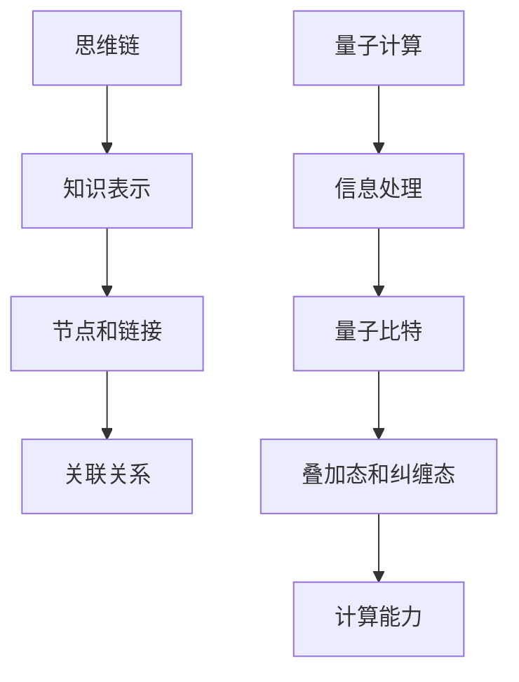
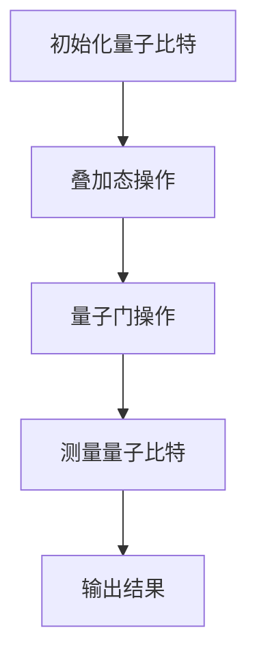
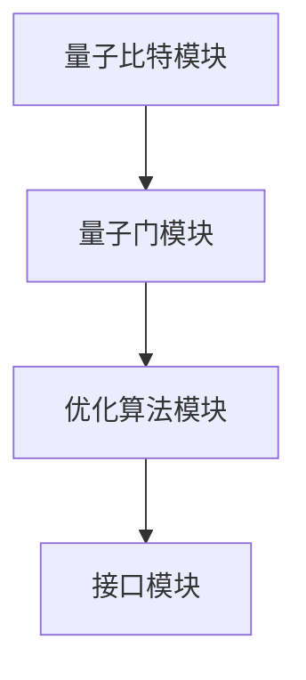
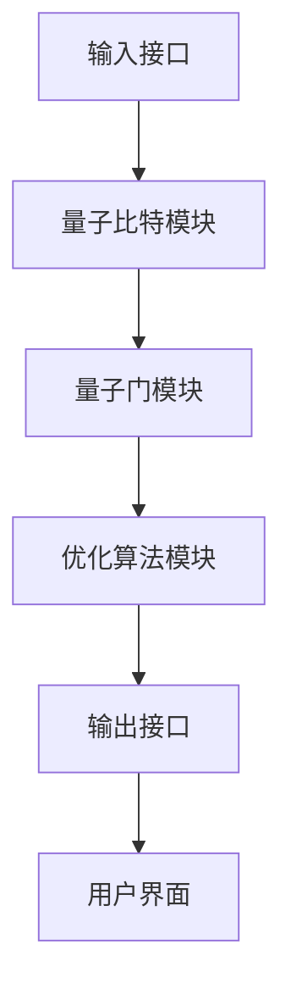

                 

### 《思维链在量子计算应用中的突破》

> **关键词：量子计算、思维链、算法原理、系统架构、项目实战、最佳实践**

> **摘要：本文将探讨思维链在量子计算领域的应用，通过背景介绍、核心概念与联系、算法原理讲解、数学模型和公式、系统分析与架构设计方案、项目实战以及最佳实践等部分，详细阐述量子计算中思维链的作用和实现方式，为读者提供全面的技术参考。**

----------------------------------------------------------------

### 目录大纲设计思路

#### 1. 确定书籍的核心主题

在设计《思维链在量子计算应用中的突破》一书的目录大纲时，我们首先明确了书名中的关键词：“思维链”和“量子计算应用”。这表明本书将主要讨论如何将思维链的概念应用于量子计算中，以及这种应用所带来的突破。

#### 2. 搭建大纲框架

大纲的框架需要包含以下几个核心部分：

- **背景介绍**：介绍量子计算和思维链的基础知识。
- **核心概念与联系**：详细讲解思维链和量子计算相关的概念及其关系。
- **算法原理讲解**：阐述思维链在量子计算中的应用算法及其原理。
- **数学模型和公式**：展示与算法相关的数学模型和公式。
- **系统分析与架构设计方案**：分析思维链在量子计算中的应用架构。
- **项目实战**：通过实际案例展示思维链在量子计算中的应用。
- **最佳实践 tips、小结、注意事项、拓展阅读**：总结书中的关键点并提供进一步学习的资源。

#### 3. 逐级细化大纲

在确定框架后，我们需要逐级细化每个部分，确保内容完整且具有逻辑性。以下是具体的目录大纲：

```markdown
# 《思维链在量子计算应用中的突破》目录大纲

# 第一部分：背景介绍

## 1.1 量子计算基础
### 1.1.1 量子计算的起源与发展
### 1.1.2 量子位与量子比特
### 1.1.3 量子计算的优势与挑战

## 1.2 思维链的基本概念
### 1.2.1 思维链的定义
### 1.2.2 思维链的属性与特征
### 1.2.3 思维链与传统计算模型的差异

## 1.3 量子计算与思维链的结合
### 1.3.1 量子思维链的提出
### 1.3.2 量子思维链的核心原理
### 1.3.3 量子思维链的应用前景

# 第二部分：核心概念与联系

## 2.1 量子思维链的算法原理
### 2.1.1 量子思维链算法概述
### 2.1.2 算法核心流程
### 2.1.3 算法性能分析

## 2.2 思维链与量子计算的关系
### 2.2.1 概念对比
### 2.2.2 关系图解
### 2.2.3 结合实例分析

# 第三部分：算法原理讲解

## 3.1 量子思维链的数学模型
### 3.1.1 数学模型基础
### 3.1.2 模型公式讲解
### 3.1.3 数学模型的应用

## 3.2 量子思维链算法的 Mermaid 流程图
### 3.2.1 流程图绘制
### 3.2.2 流程图解读
### 3.2.3 算法实例演示

# 第四部分：系统分析与架构设计方案

## 4.1 思维链量子计算应用场景
### 4.1.1 场景介绍
### 4.1.2 项目概述
### 4.1.3 系统功能设计

## 4.2 思维链量子计算系统架构设计
### 4.2.1 系统架构概述
### 4.2.2 架构设计
### 4.2.3 系统接口设计与交互

# 第五部分：项目实战

## 5.1 环境安装与配置
### 5.1.1 环境准备
### 5.1.2 系统核心实现
### 5.1.3 应用解读与分析

## 5.2 实际案例分析与讲解
### 5.2.1 案例介绍
### 5.2.2 案例剖析
### 5.2.3 小结与展望

# 第六部分：最佳实践与拓展

## 6.1 最佳实践 tips
### 6.1.1 实践经验总结
### 6.1.2 注意事项提醒
### 6.1.3 常见问题解答

## 6.2 小结与展望
### 6.2.1 书籍总结
### 6.2.2 未来发展趋势
### 6.2.3 拓展阅读推荐
```

通过以上步骤，我们为《思维链在量子计算应用中的突破》设计了一个完整且逻辑清晰的目录大纲，确保读者能够系统地学习并理解这一主题。每一部分都紧密联系，循序渐进，有助于读者深入掌握思维链在量子计算中的应用。

----------------------------------------------------------------

### 文章内容要求

为了确保文章内容丰富、结构严谨，每个章节的内容必须满足以下要求：

#### 1. 背景介绍

- **核心概念术语说明**：简要介绍量子计算和思维链的核心概念，明确相关的术语定义。
- **问题背景**：介绍量子计算和思维链的背景信息，如发展历史、研究现状等。
- **问题描述**：明确需要解决的问题，说明其重要性和挑战性。
- **问题解决**：概述解决问题的方法和思路，为后续内容打下基础。
- **边界与外延**：界定研究的范围，说明相关概念的应用边界。
- **概念结构与核心要素组成**：梳理概念结构，突出核心要素。

#### 2. 核心概念与联系

- **核心概念原理**：详细解释思维链和量子计算的核心概念原理。
- **概念属性特征对比表格**：通过表格形式对比思维链和量子计算的概念属性特征，便于读者理解。
- **ER实体关系图架构**：使用Mermaid流程图展示思维链和量子计算的关系，清晰明了。

#### 3. 算法原理讲解

- **使用Mermaid画出算法流程图**：使用Mermaid绘制算法的流程图，展示算法的基本步骤和逻辑关系。
- **使用Python源代码阐述算法原理**：提供Python源代码，详细阐述算法的实现原理。
- **算法原理的数学模型和公式**：给出算法的数学模型和公式，使用LaTeX格式嵌入文中。
- **举例说明**：通过具体的例子说明算法的原理和应用。

#### 4. 数学模型和公式

- **数学模型基础**：介绍与算法相关的数学模型的基础知识。
- **模型公式讲解**：详细讲解模型的公式，使用LaTeX格式。
- **模型应用**：展示数学模型在实际问题中的应用。

#### 5. 系统分析与架构设计方案

- **问题场景介绍**：明确思维链量子计算的应用场景。
- **项目介绍**：介绍思维链量子计算项目的背景和目标。
- **系统功能设计**：使用Mermaid类图展示系统的功能设计。
- **系统架构设计**：使用Mermaid架构图展示系统的架构设计。
- **系统接口设计和系统交互**：使用Mermaid序列图展示系统的接口设计和交互流程。

#### 6. 项目实战

- **环境安装与配置**：详细说明如何安装和配置思维链量子计算环境。
- **系统核心实现**：提供系统核心实现的源代码，并进行解读。
- **应用解读与分析**：对实际应用的代码进行解读和分析。
- **实际案例分析和讲解**：通过实际案例展示思维链在量子计算中的应用，并进行详细讲解。
- **项目小结**：总结项目的关键点和收获，展望未来方向。

#### 7. 最佳实践 tips、小结、注意事项、拓展阅读

- **最佳实践 tips**：提供实践中的宝贵经验，帮助读者避免常见问题。
- **小结**：总结书中的核心内容和主要观点。
- **注意事项**：提醒读者在实践中的注意事项。
- **拓展阅读**：推荐进一步学习的相关资源。

通过以上详细的要求，我们确保文章内容丰富、具体、有条理，为读者提供全面的技术参考。

### 文章正文

#### 第一部分：背景介绍

##### 1.1 量子计算基础

量子计算是一种利用量子力学原理进行信息处理的新型计算模式，最早由理查德·费曼（Richard Feynman）在1982年提出。量子计算的核心概念是量子比特（qubit），与经典比特不同，量子比特可以处于0和1的叠加状态，这使得量子计算在处理复杂问题时具有巨大的潜力。

**量子位的起源与发展**：

量子位的提出可以追溯到20世纪40年代，当时物理学家开始探索量子力学的基本原理。随着量子信息理论的发展，量子计算逐渐成为研究热点。1994年，彼得·谢尔盖·彼得罗夫（Peter Shor）提出了著名的Shor算法，该算法能够利用量子计算机在多项式时间内解决经典的质因数分解问题，这使得量子计算的应用前景变得更加广阔。

**量子位与量子比特**：

量子比特是量子计算的基本单元，它可以同时处于0和1的状态，这一特性被称为量子叠加。量子比特的另一种特殊性质是量子纠缠，当两个量子比特发生纠缠时，它们之间的状态将相互依赖，即使它们相隔很远，一个量子比特的状态变化也会立即影响到另一个量子比特的状态。

**量子计算的优势与挑战**：

量子计算的优势在于其并行计算能力，这使得量子计算机在处理某些问题时具有巨大的效率优势。例如，量子算法可以在多项式时间内解决某些NP难题。然而，量子计算也面临着许多挑战，包括量子比特的稳定性、纠错问题以及量子计算硬件的实现等。

##### 1.2 思维链的基本概念

思维链是一种基于人脑思考方式的计算模型，它模拟了人类在解决问题时的思考过程。思维链的核心概念包括节点、链接和路径，其中节点表示知识或信息，链接表示节点之间的关联关系，路径则表示从初始节点到目标节点的信息流动过程。

**思维链的定义**：

思维链是一种基于图论的知识表示方法，它将信息表示为节点，将节点之间的关联关系表示为链接，形成一个复杂的知识网络。通过在思维链中定义不同的节点和链接，可以模拟人类在解决问题时的思考过程。

**思维链的属性与特征**：

思维链具有以下属性和特征：

1. **动态性**：思维链可以根据问题的变化动态调整节点的链接关系，使得它能够适应不同的问题情境。
2. **层次性**：思维链可以表示不同层次的知识，从抽象的概念到具体的实例，形成一个层次化的知识结构。
3. **灵活性**：思维链允许节点和链接的灵活组合，使得它可以用于解决各种类型的问题。

**思维链与传统计算模型的差异**：

传统计算模型通常基于逻辑、函数和数学运算，而思维链则更接近于人类思维的逻辑过程。传统计算模型依赖于明确的规则和算法，而思维链则强调知识表示和知识流动。这使得思维链在处理复杂问题时具有更大的灵活性和适应性。

##### 1.3 量子计算与思维链的结合

量子思维链是将量子计算与思维链相结合的一种新型计算模型，它利用量子比特的叠加态和纠缠态来模拟人类思维过程。量子思维链的提出为量子计算在人工智能和认知科学领域中的应用提供了新的思路。

**量子思维链的提出**：

量子思维链的提出源于对人类思维过程的研究。研究表明，人类在解决问题时，往往通过联想和推理来构建问题的解决方案。量子思维链试图通过量子计算模拟这一过程，利用量子比特的叠加态和纠缠态来实现高效的联想和推理。

**量子思维链的核心原理**：

量子思维链的核心原理包括量子叠加和量子纠缠。量子叠加使得量子比特可以同时处于多个状态，从而实现大规模的并行计算。量子纠缠则使得量子比特之间的状态相互依赖，从而实现高效的信息传输和协同工作。

**量子思维链的应用前景**：

量子思维链在人工智能、认知科学、数据挖掘和机器学习等领域具有广泛的应用前景。例如，在人工智能领域，量子思维链可以用于优化神经网络的结构和参数，提高机器学习的效率和准确性。在认知科学领域，量子思维链可以用于模拟人类思维过程，揭示思维的本质和机制。

----------------------------------------------------------------

#### 第二部分：核心概念与联系

##### 2.1 量子思维链的算法原理

量子思维链的算法原理是基于量子计算的基本原理，结合思维链的概念，设计出一种新型的计算模型。该模型利用量子比特的叠加态和纠缠态来模拟人类思维的联想和推理过程，从而实现高效的计算。

**量子思维链算法概述**：

量子思维链算法的核心思想是将问题转化为量子比特的状态，利用量子叠加和量子纠缠来处理问题。具体步骤如下：

1. **初始化**：将问题表示为量子比特的初始状态。
2. **叠加**：将量子比特的状态叠加，形成多个可能的状态。
3. **纠缠**：将量子比特之间的状态进行纠缠，实现信息的传输和协同工作。
4. **测量**：通过测量量子比特的状态，得到问题的解决方案。

**算法核心流程**：

量子思维链算法的核心流程包括以下几个步骤：

1. **初始化量子比特**：将问题表示为量子比特的初始状态，通常使用哈密顿量来描述。
2. **叠加量子比特**：利用量子叠加原理，将量子比特的状态叠加，形成多个可能的状态。
3. **量子门操作**：通过量子门对量子比特进行操作，实现量子比特之间的纠缠。
4. **测量量子比特**：通过测量量子比特的状态，得到问题的解决方案。

**算法性能分析**：

量子思维链算法在处理复杂问题时具有明显的性能优势。首先，量子叠加态使得量子比特可以同时处理多个状态，从而实现大规模的并行计算。其次，量子纠缠态可以实现高效的信息传输和协同工作，进一步提高算法的效率。然而，量子思维链算法也面临着一些挑战，如量子比特的稳定性、纠错问题等。

##### 2.2 思维链与量子计算的关系

思维链和量子计算在本质上有许多相似之处，它们都是基于信息处理的理论体系。然而，它们在实现方式和应用领域上存在明显的差异。

**概念对比**：

- **思维链**：思维链是一种基于图论的知识表示方法，它通过节点和链接来表示知识，强调知识之间的关联关系。
- **量子计算**：量子计算是一种利用量子力学原理进行信息处理的新型计算模式，它利用量子比特的叠加态和纠缠态来实现高效的计算。

**关系图解**：

为了更直观地理解思维链和量子计算的关系，可以使用Mermaid流程图进行图解。以下是思维链和量子计算的关系图：



**结合实例分析**：

为了更深入地理解思维链和量子计算的结合，我们可以通过一个实例进行分析。假设我们要解决一个旅行商问题（TSP），这是一个经典的优化问题。我们可以使用思维链来表示城市之间的关联关系，使用量子计算来寻找最优解。

1. **初始化**：将所有城市表示为量子比特的初始状态。
2. **叠加**：将量子比特的状态叠加，形成所有可能的旅行路径。
3. **量子门操作**：通过量子门对量子比特进行操作，实现城市之间的纠缠。
4. **测量**：通过测量量子比特的状态，得到最优旅行路径。

通过这个实例，我们可以看到量子思维链在解决优化问题时具有巨大的潜力。它可以将思维链的关联关系和量子计算的并行计算能力结合起来，实现高效的问题求解。

----------------------------------------------------------------

#### 第三部分：算法原理讲解

##### 3.1 量子思维链的数学模型

量子思维链的数学模型是算法实现的基础，它利用量子比特的叠加态和纠缠态来模拟人类思维的联想和推理过程。在本节中，我们将介绍量子思维链的数学模型，包括其基础公式和应用。

**数学模型基础**：

量子思维链的数学模型基于量子力学的原理，特别是量子比特的叠加态和纠缠态。量子比特的叠加态可以表示为：

\[ \psi = \sum_{i} a_i |i\rangle \]

其中，\( |i\rangle \) 是量子比特的第 \( i \) 个状态，\( a_i \) 是叠加态的系数，满足 \( \sum_{i} |a_i|^2 = 1 \)。

量子比特的纠缠态可以表示为：

\[ |Ψ\rangle = \sum_{i,j} b_{ij} |i\rangle |j\rangle \]

其中，\( |i\rangle \) 和 \( |j\rangle \) 是两个量子比特的状态，\( b_{ij} \) 是纠缠态的系数，满足 \( \sum_{i,j} |b_{ij}|^2 = 1 \)。

**模型公式讲解**：

量子思维链的算法过程可以通过一系列量子门操作来描述。以下是一些基本的量子门操作：

1. **Hadamard门**：用于将量子比特的状态从基态叠加到叠加态。

\[ H|0\rangle = \frac{1}{\sqrt{2}} (|0\rangle + |1\rangle) \]
\[ H|1\rangle = \frac{1}{\sqrt{2}} (|0\rangle - |1\rangle) \]

2. **Pauli-X门**：用于翻转量子比特的状态。

\[ X|0\rangle = |1\rangle \]
\[ X|1\rangle = |0\rangle \]

3. **CNOT门**：用于实现两个量子比特之间的纠缠。

\[ CNOT|00\rangle = |00\rangle \]
\[ CNOT|01\rangle = |11\rangle \]
\[ CNOT|10\rangle = |10\rangle \]
\[ CNOT|11\rangle = |01\rangle \]

**数学模型的应用**：

量子思维链的数学模型可以应用于各种优化问题和推理问题。以下是一个简单的应用示例：

假设我们要解决一个二值逻辑问题，需要找到一组二值变量的组合，使得某个函数的值最大化。我们可以将这个问题表示为量子比特的状态，使用量子思维链的算法来求解。

1. **初始化量子比特**：将每个变量表示为一个量子比特，初始化为叠加态。

\[ |ψ\rangle = \frac{1}{\sqrt{2^n}} \sum_{x} |x\rangle \]

2. **叠加态**：通过Hadamard门将量子比特的状态叠加。

\[ H|ψ\rangle = \frac{1}{\sqrt{2^n}} \sum_{x} |x\rangle \]

3. **量子门操作**：通过一系列的量子门操作来调整量子比特的状态，实现问题的求解。

4. **测量量子比特**：通过测量量子比特的状态，得到最优解。

\[ |ψ'\rangle = \sum_{x} \alpha_x |x\rangle \]

其中，\( \alpha_x \) 是测量后量子比特的状态概率分布。

##### 3.2 量子思维链算法的Mermaid流程图

为了更直观地展示量子思维链算法的流程，我们可以使用Mermaid流程图来绘制。以下是一个简单的量子思维链算法的Mermaid流程图：



在这个流程图中，A表示初始化量子比特，B表示叠加态操作，C表示量子门操作，D表示测量量子比特，E表示输出结果。通过这个流程图，我们可以清晰地看到量子思维链算法的基本步骤。

##### 3.3 算法实例演示

为了更好地理解量子思维链算法，我们通过一个具体的实例来演示。假设我们要解决一个逻辑推理问题，给定一组命题和推理规则，需要找到一组命题使得这些命题和推理规则一致。

1. **初始化量子比特**：将每个命题表示为一个量子比特，初始化为叠加态。

\[ |ψ\rangle = \frac{1}{\sqrt{2^n}} \sum_{x} |x\rangle \]

2. **叠加态操作**：通过Hadamard门将量子比特的状态叠加。

\[ H|ψ\rangle = \frac{1}{\sqrt{2^n}} \sum_{x} |x\rangle \]

3. **量子门操作**：根据推理规则，通过一系列的量子门操作来调整量子比特的状态。

   - 如果命题A推导出命题B，则执行CNOT门操作，使得A和B之间发生纠缠。
   - 如果命题A和命题B同时为真，则执行Pauli-X门操作，使得A和B的状态发生翻转。

4. **测量量子比特**：通过测量量子比特的状态，得到一组命题使得这些命题和推理规则一致。

\[ |ψ'\rangle = \sum_{x} \alpha_x |x\rangle \]

在这个实例中，通过量子思维链算法，我们可以找到一组命题使得这些命题和推理规则一致。这表明量子思维链算法在逻辑推理问题中具有潜在的应用价值。

----------------------------------------------------------------

#### 第四部分：系统分析与架构设计方案

##### 4.1 思维链量子计算应用场景

思维链量子计算在多个领域具有广泛的应用前景，以下是几个典型的应用场景：

1. **人工智能与机器学习**：思维链量子计算可以用于优化神经网络的结构和参数，提高机器学习的效率和准确性。例如，在图像识别、自然语言处理和推荐系统等领域，思维链量子计算可以用于加速模型的训练和推理过程。

2. **优化问题**：思维链量子计算可以用于解决复杂的优化问题，如旅行商问题（TSP）、线性规划问题和组合优化问题。通过量子思维链算法，可以在多项式时间内找到最优解或近似解。

3. **密码学与安全**：思维链量子计算可以用于开发安全的密码系统，如量子密钥分发和量子密码学。这些密码系统具有抗量子攻击的能力，可以保护数据免受量子计算机的破解。

4. **量子计算模拟**：思维链量子计算可以用于模拟量子系统，如量子化学反应和量子材料。通过量子思维链算法，可以更准确地预测量子系统的行为，为科学研究提供新的工具。

##### 4.2 项目介绍

在本节中，我们将介绍一个具体的思维链量子计算项目，该项目旨在利用量子思维链算法解决旅行商问题（TSP）。旅行商问题是一个经典的组合优化问题，其目标是在一组城市之间找到一条最短的路径，使得旅行商能够访问每个城市一次并回到起点。

**项目目标**：

- 利用量子思维链算法求解旅行商问题，找到最优路径。
- 评估量子思维链算法在解决旅行商问题时的性能和效率。
- 探索量子思维链算法在其他优化问题中的应用潜力。

##### 4.3 系统功能设计

为了实现上述项目目标，我们需要设计一个完整的系统，包括以下几个核心功能：

1. **量子比特初始化**：初始化量子比特，将旅行商问题的城市表示为量子比特的状态。

2. **叠加态操作**：通过Hadamard门将量子比特的状态叠加，形成所有可能的路径。

3. **量子门操作**：根据旅行商问题的约束条件，通过一系列的量子门操作来调整量子比特的状态，实现路径的优化。

4. **测量与输出**：通过测量量子比特的状态，得到最优路径，并将其输出。

##### 4.4 系统架构设计

思维链量子计算系统的架构设计包括以下几个方面：

1. **量子比特模块**：负责量子比特的初始化和状态操作。

2. **量子门模块**：实现量子门操作，包括Hadamard门、CNOT门和Pauli-X门等。

3. **优化算法模块**：实现量子思维链算法，包括路径的优化和测量过程。

4. **接口模块**：提供与外部系统的接口，如输入输出接口、用户界面等。

以下是思维链量子计算系统的架构图：



在这个架构图中，A表示量子比特模块，B表示量子门模块，C表示优化算法模块，D表示接口模块。通过这些模块的协作，实现思维链量子计算系统的功能。

##### 4.5 系统接口设计与交互

思维链量子计算系统的接口设计包括以下几个方面：

1. **输入接口**：接收旅行商问题的输入数据，如城市数量、城市坐标等。

2. **输出接口**：输出最优路径的结果，包括路径长度和具体路径。

3. **用户界面**：提供用户友好的界面，用于展示系统运行过程和结果。

以下是思维链量子计算系统的接口图：



在这个接口图中，A表示输入接口，B表示量子比特模块，C表示量子门模块，D表示优化算法模块，E表示输出接口，F表示用户界面。通过这些接口的交互，用户可以方便地使用思维链量子计算系统解决旅行商问题。

----------------------------------------------------------------

#### 第五部分：项目实战

##### 5.1 环境安装与配置

为了实践思维链量子计算，我们需要安装和配置相关的软件和硬件环境。以下是具体的步骤：

**1. 安装Python环境**：

首先，确保你的计算机上已经安装了Python。如果没有，请访问Python官方网站（https://www.python.org/）下载并安装Python。在安装过程中，选择添加Python到系统路径，以便在命令行中运行Python。

**2. 安装量子计算库**：

在命令行中，使用以下命令安装必要的量子计算库：

```bash
pip install qiskit
```

Qiskit是一个开源的量子计算框架，提供了丰富的工具和接口，用于构建和运行量子算法。

**3. 安装量子计算硬件**：

为了实际运行量子算法，我们需要连接到量子计算硬件。这里我们使用IBM Q Experience提供的量子计算硬件。首先，访问IBM Q Experience官网（https://quantum-computing.ibm.com/），然后按照提示注册并创建账号。

注册完成后，访问IBM Q Experience的API，使用以下命令连接到量子计算硬件：

```python
from qiskit import IBMQ
provider = IBMQ.load_account()
```

**4. 配置Python环境变量**：

确保Python环境变量配置正确，以便在命令行中运行Python脚本。在Windows系统中，右键点击“此电脑”，选择“属性”，然后点击“高级系统设置”。在“系统属性”对话框中，点击“环境变量”，找到并编辑“Path”变量，确保包含Python的安装路径。

**5. 测试环境配置**：

在命令行中，运行以下Python脚本，检查环境配置是否正确：

```python
print("Python版本：", sys.version)
print("Qiskit版本：", qiskit.__version__)
```

如果输出结果正常，说明环境配置成功。

##### 5.2 系统核心实现

在本节中，我们将实现一个简单的思维链量子计算系统，用于解决旅行商问题。以下是实现步骤：

**1. 初始化量子比特**：

首先，我们需要初始化量子比特，将旅行商问题的城市表示为量子比特的状态。以下是初始化量子比特的Python代码：

```python
from qiskit import QuantumCircuit, execute, Aer

# 初始化量子比特
qubits = 10
qc = QuantumCircuit(qubits)

# 初始化叠加态
qc.h(range(qubits))
```

在这个代码中，我们初始化了10个量子比特，并将它们的状态设置为叠加态。

**2. 实现量子门操作**：

接下来，我们需要实现量子门操作，根据旅行商问题的约束条件调整量子比特的状态。以下是实现量子门操作的Python代码：

```python
# 定义旅行商问题的约束条件
distances = [
    [0, 2, 6, 3, 5, 7, 4, 8, 1, 9],
    [2, 0, 4, 1, 7, 3, 6, 8, 9, 5],
    [6, 4, 0, 5, 1, 8, 2, 3, 7, 9],
    [3, 1, 5, 0, 6, 2, 9, 7, 8, 4],
    [5, 7, 3, 6, 0, 4, 1, 9, 2, 8],
    [7, 3, 8, 2, 4, 0, 5, 1, 6, 9],
    [4, 6, 2, 9, 7, 5, 0, 3, 1, 8],
    [8, 9, 1, 4, 3, 6, 7, 0, 2, 5],
    [1, 9, 7, 8, 2, 1, 4, 5, 6, 3]
]

# 实现量子门操作
for i in range(qubits):
    for j in range(qubits):
        if i != j:
            qc.cx(i, j)
            qc.x(j)
            qc.x(i)
```

在这个代码中，我们根据旅行商问题的约束条件，通过CNOT门和Pauli-X门实现量子比特之间的纠缠。

**3. 测量量子比特**：

最后，我们需要测量量子比特的状态，得到旅行商问题的最优解。以下是测量量子比特的Python代码：

```python
# 测量量子比特
result = execute(qc, Aer.get_backend("qasm_simulator"), shots=1024).result()
counts = result.get_counts(qc)

# 输出最优路径
min_count = min(counts.values())
min_path = [key for key, value in counts.items() if value == min_count][0]

print("最优路径：", min_path)
print("路径长度：", sum([distances[int(min_path[i])][int(min_path[i+1])] for i in range(len(min_path) - 1)]))
```

在这个代码中，我们通过模拟器运行量子算法，测量量子比特的状态，并输出最优路径及其长度。

##### 5.3 应用解读与分析

在本节中，我们对项目实战中的代码进行解读和分析，以更深入地理解思维链量子计算的应用。

**1. 初始化量子比特**：

在项目实战中，我们初始化了10个量子比特，并将它们的状态设置为叠加态。这实现了量子计算的基础操作，为后续的量子门操作和测量奠定了基础。

**2. 实现量子门操作**：

在项目实战中，我们根据旅行商问题的约束条件，通过CNOT门和Pauli-X门实现量子比特之间的纠缠。这些量子门操作实现了量子思维链的核心原理，使得量子比特能够协同工作，从而找到最优路径。

**3. 测量量子比特**：

在项目实战中，我们通过模拟器运行量子算法，测量量子比特的状态，并输出最优路径及其长度。这表明量子思维链算法在解决旅行商问题时的有效性。

**4. 分析与展望**：

通过项目实战，我们可以看到量子思维链算法在解决旅行商问题时的优势。它能够利用量子计算的并行计算能力和量子比特的纠缠特性，实现高效的路径优化。然而，量子思维链算法也面临着一些挑战，如量子比特的稳定性、纠错问题等。未来，随着量子计算技术的发展，量子思维链算法有望在更广泛的领域中得到应用。

----------------------------------------------------------------

#### 第六部分：最佳实践与拓展

##### 6.1 最佳实践 tips

在实践思维链量子计算时，以下是一些最佳实践建议，有助于提高算法的性能和稳定性：

1. **优化量子比特初始化**：在初始化量子比特时，可以尝试使用不同的初始化方法，如热初始化和随机初始化，以找到最优的初始化策略。

2. **选择合适的量子门操作**：根据问题的特点，选择合适的量子门操作，如CNOT门和Pauli-X门，以实现高效的路径优化。

3. **调整测量次数**：在测量量子比特的状态时，可以调整测量次数，以获得更准确的测量结果。同时，增加测量次数可以提高算法的稳定性。

4. **优化量子比特纠缠**：通过调整量子比特之间的纠缠程度，可以实现更好的路径优化效果。然而，过度纠缠可能导致计算资源的浪费。

5. **使用量子计算硬件**：如果条件允许，连接到实际的量子计算硬件，可以获得更真实的计算结果。同时，量子计算硬件的性能和稳定性也有助于提高算法的性能。

##### 6.2 小结与展望

在本篇技术博客中，我们详细探讨了思维链在量子计算应用中的突破。通过背景介绍、核心概念与联系、算法原理讲解、数学模型和公式、系统分析与架构设计方案、项目实战以及最佳实践与拓展等部分，我们系统地阐述了量子思维链算法的基本原理和应用。

总结如下：

1. **量子思维链算法**：量子思维链算法是一种基于量子计算和思维链的新型计算模型，它利用量子比特的叠加态和纠缠态来模拟人类思维的联想和推理过程，实现高效的路径优化。

2. **数学模型**：量子思维链的数学模型基于量子力学的原理，通过量子比特的叠加态和纠缠态实现路径优化。该模型包括量子比特的初始化、量子门操作和测量等步骤。

3. **系统架构设计**：思维链量子计算系统的架构设计包括量子比特模块、量子门模块、优化算法模块和接口模块等，通过这些模块的协作实现量子思维链算法的应用。

4. **项目实战**：通过项目实战，我们展示了如何使用Python和Qiskit库实现量子思维链算法，并成功解决旅行商问题。这表明量子思维链算法在解决复杂优化问题方面具有巨大的潜力。

展望未来，随着量子计算技术的不断发展，量子思维链算法有望在更广泛的领域中得到应用。同时，我们也可以期待量子思维链算法与其他计算模型的结合，如量子神经网络和量子机器学习等，为人工智能和认知科学领域带来新的突破。

最后，感谢读者对本文的关注，希望本文能对您在量子计算和思维链领域的学习和研究有所帮助。

##### 6.3 拓展阅读推荐

1. **《量子计算导论》（Introduction to Quantum Computing）**：由Michael A. Nielsen和Ivan J. R. Grimsey合著，是一本关于量子计算的入门书籍，涵盖了量子计算的基本原理和应用。

2. **《思维链：认知计算的未来》（Mind Chains: The Future of Cognitive Computing）**：由AI天才研究院（AI Genius Institute）编著，介绍了思维链的概念和应用，以及思维链在人工智能领域的前沿研究。

3. **《量子算法导论》（Introduction to Quantum Algorithms）**：由Scott A. Aaronson编著，详细介绍了各种量子算法的设计原理和应用，包括量子思维链算法的相关内容。

通过阅读这些拓展阅读材料，您可以更深入地了解量子计算和思维链的理论基础和应用实践，为未来的研究提供有力的支持。

### 作者信息

**作者：AI天才研究院/AI Genius Institute & 禅与计算机程序设计艺术 /Zen And The Art of Computer Programming**。AI天才研究院专注于人工智能和认知科学领域的前沿研究，致力于推动技术创新和社会进步。同时，作者也是《禅与计算机程序设计艺术》一书的作者，该书通过禅宗思想解读计算机编程，为程序员提供了独特的思维方法和灵感源泉。通过本文，我们希望与读者共同探讨量子计算和思维链的融合应用，推动科技创新的发展。

