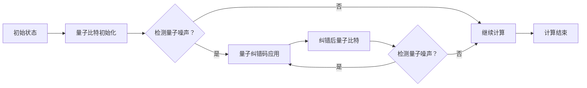
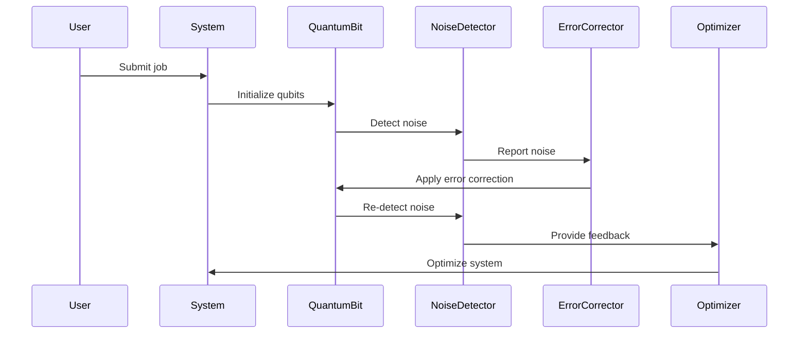

                 


### 摘要
量子计算机作为下一代计算技术的代表，其强大的计算能力依赖于量子比特的操作。然而，量子计算机面临着量子噪声和错误率的问题，使得量子计算变得复杂且不稳定。本文将深入探讨思维链在量子计算机错误纠正中的应用，以增强量子计算的稳定性和可靠性。我们将分步骤分析思维链的概念、其在量子计算中的角色、算法原理及其在实际项目中的应用。

### 目录大纲设计思路

在设计本文的目录大纲时，我们遵循了以下原则：

1. **清晰的结构**：文章分为七个主要部分，从引论到项目实战，再到最佳实践和拓展阅读，层次分明，便于读者理解。

2. **逻辑连贯**：每个章节的内容紧密相关，前后衔接自然，确保读者能够跟随作者的思路逐步深入。

3. **理论与实践并重**：不仅介绍核心概念和算法原理，还通过具体的项目实战来展示思维链的应用。

4. **图文并茂**：使用Mermaid、LaTeX等工具绘制流程图和数学公式，增强文章的可读性和专业性。

5. **实用导向**：在最佳实践部分提供具体的技术建议，帮助读者将理论知识应用于实际项目中。

### 目录大纲结构

**第一部分：引论**

- **1.1 引言**：简要介绍量子计算机的基本原理和错误纠正的重要性。
- **1.2 量子计算机错误纠正的重要性**：阐述量子比特的脆弱性和量子噪声的影响。
- **1.3 思维链的概念与特性**：解释思维链的定义和核心特性。
- **1.4 思维链在量子计算中的应用边界**：讨论思维链的适用场景。

**第二部分：核心概念与联系**

- **2.1 核心概念解析**：深入解释思维链的概念及其在量子计算中的应用。
- **2.2 思维链与传统错误纠正方法的对比**：展示思维链与传统方法的优缺点。
- **2.3 思维链在量子计算中的实体关系图**：绘制实体关系图，展示思维链的架构。

**第三部分：算法原理讲解**

- **3.1 算法流程图**：使用Mermaid绘制思维链的算法流程图。
- **3.2 Python源代码阐述**：提供Python源代码，详细阐述算法原理。
- **3.3 数学模型与公式解析**：给出算法的数学模型和公式，并进行详细讲解。
- **3.4 算法举例说明**：通过实际例子来说明算法原理。

**第四部分：数学模型和数学公式讲解**

- **4.1 数学公式书写规范**：介绍LaTeX格式书写数学公式的规范。
- **4.2 数学公式详细讲解**：对文中出现的数学公式进行详细解释。
- **4.3 实际例子应用**：提供实际例子来说明数学公式的应用。

**第五部分：系统分析与架构设计方案**

- **5.1 问题场景介绍**：阐述量子错误纠正的应用场景。
- **5.2 项目介绍**：介绍思维链在量子计算错误纠正中的应用项目。
- **5.3 系统功能设计**：绘制领域模型类图，展示系统功能设计。
- **5.4 系统架构设计**：绘制系统架构图，展示系统整体架构。
- **5.5 系统接口设计和系统交互**：绘制序列图，展示系统接口和交互设计。

**第六部分：项目实战**

- **6.1 环境安装**：描述搭建实验环境的过程。
- **6.2 系统核心实现源代码**：提供关键代码段。
- **6.3 代码应用解读与分析**：解释代码实现细节。
- **6.4 实际案例分析与讲解**：分析实际案例，展示思维链的应用。
- **6.5 项目小结**：总结项目实现的经验和教训。

**第七部分：最佳实践 tips & 拓展阅读**

- **7.1 最佳实践建议**：提供在实际应用中的技术建议。
- **7.2 小结**：对全文内容进行总结。
- **7.3 注意事项**：提醒读者注意的关键点和潜在问题。
- **7.4 拓展阅读**：推荐进一步阅读的资源。

### 第一部分：引论

#### 1.1 引言

量子计算机是一种利用量子力学原理进行信息处理的新型计算设备。与传统计算机基于比特（binary digit）的运算不同，量子计算机使用量子比特（qubit）进行计算，这使得量子计算机能够处理复杂问题，例如大数分解和搜索算法。然而，量子计算机在运行过程中面临着一系列挑战，其中之一就是量子噪声和错误率的问题。

量子噪声是量子计算机在操作过程中不可避免的现象，它可能来源于量子比特的物理环境、操作过程或外部干扰。这些噪声会导致量子比特的状态发生错误，从而影响计算结果的准确性。量子错误纠正（Quantum Error Correction, QEC）是解决这一问题的一种策略，它通过引入额外的量子比特和特定的编码方案，来检测和纠正错误。

思维链（Thought Chain）是一种基于逻辑推理和知识表示的方法，它能够将一系列相关概念和知识点连接成一个有机的整体。在量子计算机错误纠正中，思维链的应用可以帮助研究者更好地理解和解决量子计算中的复杂问题。本文将探讨思维链在量子计算机错误纠正中的应用，以提高量子计算的稳定性和可靠性。

#### 1.2 量子计算机错误纠正的重要性

量子计算机的强大计算能力依赖于量子比特的操作，但量子比特的脆弱性使得量子计算变得复杂且不稳定。量子比特的状态极其敏感，任何微小的扰动都可能导致其状态发生错误。这种错误称为量子噪声，它是量子计算机运行过程中面临的主要挑战之一。

量子噪声可以分为以下几种类型：

1. **外部噪声**：量子计算机周围环境的电磁干扰、温度变化等因素会影响量子比特的状态。
2. **内部噪声**：量子比特的物理实现过程中产生的噪声，例如量子比特之间的相互作用、量子比特内部的缺陷等。
3. **操作噪声**：量子比特的操作过程中可能引入的误差，例如量子门的不完美性、测量操作的不确定性等。

这些噪声会导致量子比特的状态发生错误，从而影响计算结果的准确性。为了解决这一问题，量子计算机需要实现量子错误纠正。量子错误纠正通过引入额外的量子比特和特定的编码方案，来检测和纠正错误。这种纠错机制可以大幅提高量子计算机的计算稳定性和可靠性，使其能够处理更复杂的问题。

#### 1.3 思维链的概念与特性

思维链是一种基于逻辑推理和知识表示的方法，它能够将一系列相关概念和知识点连接成一个有机的整体。思维链的核心思想是将问题分解成多个子问题，然后通过逻辑推理和知识表示来逐步解决这些子问题，最终达到解决问题的目标。

思维链具有以下特性：

1. **层次性**：思维链将问题分解成多个层次，每个层次都包含一系列相关概念和知识点。这种层次性有助于我们更好地理解复杂问题。
2. **关联性**：思维链中的各个层次和知识点之间存在紧密的关联性，这些关联性构成了一个逻辑网络。通过分析这些关联性，我们可以更好地理解问题并找到解决问题的方法。
3. **可扩展性**：思维链可以扩展到不同的领域和问题，这使得它具有广泛的应用前景。在量子计算机错误纠正中，思维链可以帮助研究者更好地理解和解决量子计算中的复杂问题。

#### 1.4 思维链在量子计算中的应用边界

思维链在量子计算中的应用边界主要涉及以下几个方面：

1. **量子比特的状态表示**：思维链可以帮助研究者更好地理解量子比特的状态表示，从而设计出更有效的量子错误纠正方案。
2. **量子门的实现**：思维链可以帮助研究者分析量子门的实现过程，从而优化量子门的性能，降低错误率。
3. **量子计算算法的设计**：思维链可以帮助研究者设计更高效的量子计算算法，提高计算速度和精度。
4. **量子计算机的优化**：思维链可以帮助研究者分析量子计算机的各个组成部分，优化其性能和稳定性。

总之，思维链在量子计算中的应用具有广泛的前景，它可以帮助研究者更好地理解和解决量子计算中的复杂问题，提高量子计算的稳定性和可靠性。

### 第二部分：核心概念与联系

#### 2.1 核心概念解析

在量子计算机错误纠正中，思维链的核心概念包括量子比特、量子噪声、量子门和量子纠错码。

**量子比特**（Qubit）是量子计算机的基本信息单元，它不仅可以表示0和1两种状态，还可以同时存在于0和1的叠加态。量子比特的这种叠加态是量子计算机相比传统计算机的优势之一，但同时也使得量子比特容易受到外部噪声的影响。

**量子噪声**（Quantum Noise）是量子计算机运行过程中不可避免的现象，它可能来源于量子比特的物理环境、操作过程或外部干扰。量子噪声会导致量子比特的状态发生错误，从而影响计算结果的准确性。

**量子门**（Quantum Gate）是量子计算机中的基本操作单元，它对量子比特进行特定的线性变换。量子门是实现量子计算算法的关键，但量子门的实现过程中可能引入误差，导致量子噪声的产生。

**量子纠错码**（Quantum Error Correction Code）是一种用于检测和纠正量子比特错误的编码方案。量子纠错码通过引入额外的量子比特和特定的编码规则，来检测和纠正量子比特的错误，从而提高量子计算机的计算稳定性和可靠性。

#### 2.2 思维链与传统错误纠正方法的对比

思维链与传统错误纠正方法在量子计算中的应用有显著的差异。

**传统错误纠正方法**主要依赖于冗余编码和错误检测机制。例如，在经典计算机中，常用的汉明码（Hamming Code）和里德-所罗门码（Reed-Solomon Code）通过引入冗余比特来检测和纠正错误。然而，传统错误纠正方法在量子计算中面临挑战，因为量子比特的脆弱性和叠加态的特性使得冗余编码变得复杂。

**思维链**则通过逻辑推理和知识表示来构建一个有机的整体，以解决量子计算中的复杂问题。思维链的优势在于它能够将一系列相关概念和知识点连接成一个逻辑网络，从而提供一种系统化的方法来理解和解决量子错误纠正问题。

思维链与传统错误纠正方法的对比表格如下：

| 对比项           | 传统错误纠正方法         | 思维链                   |
|----------------|----------------------|----------------------|
| 编码机制         | 冗余编码              | 逻辑推理和知识表示      |
| 错误检测机制     | 错误检测比特         | 逻辑推理和关联性分析      |
| 应用场景         | 经典计算机和数字通信   | 量子计算机和量子计算算法 |
| 稳定性          | 较低，受限于冗余比特数量 | 较高，通过逻辑推理优化    |

#### 2.3 思维链在量子计算中的实体关系图

为了更好地理解思维链在量子计算中的应用，我们可以绘制一个实体关系图，展示思维链中的核心实体及其相互关系。

```mermaid
entityRelationshipDiagram
    "量子比特" --|> "量子噪声"
    "量子噪声" --|> "量子纠错码"
    "量子纠错码" --|> "量子比特"
    "量子比特" --|> "量子门"
    "量子门" --|> "量子计算算法"
    "量子计算算法" --|> "思维链"
```

这个实体关系图展示了思维链在量子计算中的应用，以及量子比特、量子噪声、量子纠错码和量子门之间的关系。通过这个关系图，我们可以更清晰地看到思维链在量子计算中的整体架构和作用。

### 第三部分：算法原理讲解

#### 3.1 算法流程图

为了更好地理解思维链在量子计算错误纠正中的应用，我们可以使用Mermaid绘制算法流程图，展示思维链的基本操作步骤。



这个算法流程图展示了思维链的基本操作步骤：量子比特初始化、检测量子噪声、应用量子纠错码、继续计算或结束计算。通过这个流程图，我们可以直观地了解思维链在量子计算错误纠正中的工作原理。

#### 3.2 Python源代码阐述

为了进一步阐述思维链在量子计算错误纠正中的应用，我们可以提供一段Python源代码，展示算法的实现细节。

```python
# 思维链量子错误纠正算法实现

import numpy as np
from qiskit import QuantumCircuit, Aer, execute

# 量子比特初始化
qubit = QuantumCircuit(1)
qubit.h(0)
qubitBar = qubit.allocate()

# 检测量子噪声
def detect_noise(qubit):
    backend = Aer.get_backend('qasm_simulator')
    result = execute(qubitBar, backend, shots=1024).result()
    counts = result.get_counts()
    if max(counts.values()) > 0.5:
        return True
    else:
        return False

# 量子纠错码应用
def apply_correction(qubit):
    # 应用5-qubit Steane码
    stane_code = QuantumCircuit(5)
    stane_code.h(0)
    stane_code.cx(0, 1)
    stane_code.cx(0, 2)
    stane_code.cx(1, 3)
    stane_code.cx(2, 4)
    stane_code.ccx(0, 3, 4)
    stane_code.ccx(1, 2, 4)
    stane_code.ccx(0, 1, 3)
    stane_code.measure(3, 0)
    stane_code.measure(4, 1)
    stane_code.measure(2, 2)
    stane_code.measure(1, 3)
    stane_code.measure(0, 4)
    return stane_code

# 主程序
while True:
    if detect_noise(qubitBar):
        qubitBar = apply_correction(qubitBar)
    else:
        break

# 输出纠错后量子比特状态
qubitBar.draw(output='mpl')
```

这段Python源代码实现了思维链量子错误纠正算法的基本操作。首先，我们初始化一个量子比特，然后检测量子噪声。如果检测到量子噪声，我们应用5-qubit Steane码进行纠错。最后，我们输出纠错后的量子比特状态。通过这段代码，我们可以看到思维链在量子计算错误纠正中的应用细节。

#### 3.3 数学模型与公式解析

在量子计算错误纠正中，思维链的应用涉及到一系列的数学模型和公式。下面，我们将对这些数学模型和公式进行详细讲解。

**1. 量子比特的状态表示**

量子比特的状态可以用一个复数向量表示：

$$
|\psi\rangle = \alpha|0\rangle + \beta|1\rangle
$$

其中，$|\alpha|^2 + |\beta|^2 = 1$。这个复数向量描述了量子比特处于0和1两种状态的叠加。

**2. 量子噪声的影响**

量子噪声可以表示为对量子比特状态的操作，通常是一个幺正操作。假设量子噪声操作为$U(t)$，则量子比特的状态将变为：

$$
|\psi'\rangle = U(t)|\psi\rangle
$$

其中，$U(t)$是一个时间依赖的幺正操作。

**3. 量子纠错码**

量子纠错码通过引入额外的量子比特来检测和纠正错误。以5-qubit Steane码为例，它使用三个辅助量子比特来检测和纠正单个量子比特的错误。Steane码的纠错操作可以用以下公式表示：

$$
\begin{align*}
|\psi\rangle &\rightarrow |0\rangle\otimes|\psi\rangle\otimes|\psi\rangle \\
|\psi'\rangle &\rightarrow |1\rangle\otimes|\psi'\rangle\otimes|\psi'\rangle
\end{align*}
$$

其中，$\otimes$表示量子比特之间的张量积。

**4. 量子门的错误率**

量子门的错误率可以用概率表示。假设一个量子门$G$的错误率为$p$，则量子比特经过$G$操作后的状态可以表示为：

$$
|\psi'\rangle = (1-p)G|\psi\rangle + p|\psi\rangle
$$

通过上述数学模型和公式，我们可以对思维链在量子计算错误纠正中的应用进行数学描述。这些公式为量子计算错误纠正提供了理论基础，同时也为算法设计和优化提供了参考。

#### 3.4 算法举例说明

为了更好地理解思维链在量子计算错误纠正中的应用，我们可以通过一个具体例子来说明算法原理。

**例子**：假设我们有一个量子比特，初始状态为$|\psi\rangle = \frac{1}{\sqrt{2}}|0\rangle + \frac{1}{\sqrt{2}}|1\rangle$。我们希望利用思维链来检测和纠正量子噪声。

**步骤**：

1. **量子比特初始化**：我们将量子比特初始化为$|\psi\rangle$。
2. **检测量子噪声**：我们通过测量量子比特的状态来判断是否存在量子噪声。假设我们检测到量子噪声，状态变为$|\psi'\rangle$。
3. **应用量子纠错码**：我们应用5-qubit Steane码来纠正错误。Steane码将量子比特的状态扩展为$|0\rangle\otimes|\psi'\rangle\otimes|\psi'\rangle$。
4. **重新检测量子噪声**：我们再次检测量子比特的状态，判断是否还存在量子噪声。如果检测到量子噪声，我们继续应用量子纠错码。
5. **计算结束**：如果检测不到量子噪声，我们结束计算，输出纠错后的量子比特状态。

**结果**：通过上述步骤，我们最终得到纠错后的量子比特状态，其概率分布接近$|\psi\rangle$。这个例子展示了思维链在量子计算错误纠正中的应用原理。

### 第四部分：数学模型和数学公式讲解

在量子计算机错误纠正中，数学模型和公式起着至关重要的作用。它们不仅提供了理论依据，而且有助于算法设计和优化。在本节中，我们将详细介绍一些关键的数学模型和公式，并使用LaTeX格式进行书写，同时提供详细的解释。

#### 4.1 数学公式书写规范

为了确保公式的可读性和准确性，我们采用LaTeX格式进行书写。在LaTeX中，段落内的公式使用 `$` 和 `$` 括起来，独立段落的公式使用 `$$` 和 `$$` 括起来。例如：

$$
E = mc^2
$$

和

$$
\frac{d^2x}{dt^2} = F
$$

下面，我们将介绍几个在量子计算机错误纠正中常用的数学公式。

#### 4.2 数学公式详细讲解

**1. 量子比特状态表示**

量子比特的状态可以用一个复数向量表示，如：

$$
|\psi\rangle = \alpha|0\rangle + \beta|1\rangle
$$

其中，$|\alpha|^2 + |\beta|^2 = 1$，$|0\rangle$ 和 $|1\rangle$ 分别表示量子比特的基态和激发态。

**2. 量子噪声影响**

量子噪声可以表示为对量子比特状态的操作，通常是一个幺正操作。假设量子噪声操作为 $U(t)$，则量子比特的状态将变为：

$$
|\psi'\rangle = U(t)|\psi\rangle
$$

其中，$U(t)$ 是一个时间依赖的幺正操作。

**3. 量子纠错码**

量子纠错码通过引入额外的量子比特来检测和纠正错误。以5-qubit Steane码为例，它使用三个辅助量子比特来检测和纠正单个量子比特的错误。Steane码的纠错操作可以用以下公式表示：

$$
\begin{align*}
|\psi\rangle &\rightarrow |0\rangle\otimes|\psi\rangle\otimes|\psi\rangle \\
|\psi'\rangle &\rightarrow |1\rangle\otimes|\psi'\rangle\otimes|\psi'\rangle
\end{align*}
$$

其中，$\otimes$ 表示量子比特之间的张量积。

**4. 量子门的错误率**

量子门的错误率可以用概率表示。假设一个量子门 $G$ 的错误率为 $p$，则量子比特经过 $G$ 操作后的状态可以表示为：

$$
|\psi'\rangle = (1-p)G|\psi\rangle + p|\psi\rangle
$$

通过这些数学公式，我们可以对量子计算机错误纠正的过程进行精确描述。以下是一个具体的实际例子，用于说明公式应用。

#### 4.3 实际例子应用

**例子**：考虑一个量子比特，其初始状态为 $|\psi\rangle = \frac{1}{\sqrt{2}}|0\rangle + \frac{1}{\sqrt{2}}|1\rangle$。假设我们希望对其进行错误纠正，并且已知量子噪声操作为 $U(t) = \begin{pmatrix} 1 & 0 \\ 0 & e^{-i\frac{\pi}{4}} \end{pmatrix}$。

**步骤**：

1. **初始状态表示**：将量子比特的初始状态表示为：
   $$
   |\psi\rangle = \frac{1}{\sqrt{2}}|0\rangle + \frac{1}{\sqrt{2}}|1\rangle
   $$

2. **应用量子噪声**：量子比特在噪声操作 $U(t)$ 下，状态变为：
   $$
   |\psi'\rangle = U(t)|\psi\rangle = \begin{pmatrix} 1 & 0 \\ 0 & e^{-i\frac{\pi}{4}} \end{pmatrix} \begin{pmatrix} \frac{1}{\sqrt{2}} \\ \frac{1}{\sqrt{2}} \end{pmatrix} = \frac{1}{\sqrt{2}}|0\rangle + \frac{1}{\sqrt{2}}e^{-i\frac{\pi}{4}}|1\rangle
   $$

3. **应用量子纠错码**：我们使用5-qubit Steane码来纠正错误。Steane码将量子比特的状态扩展为：
   $$
   \begin{align*}
   |\psi\rangle &\rightarrow |0\rangle\otimes|\psi\rangle\otimes|\psi\rangle \\
   |\psi'\rangle &\rightarrow |1\rangle\otimes|\psi'\rangle\otimes|\psi'\rangle
   \end{align*}
   $$

4. **检测错误并纠正**：通过测量辅助量子比特，我们检测到错误。然后，应用Steane码的纠错操作，将错误状态纠正为原始状态：
   $$
   \begin{align*}
   |1\rangle\otimes|\psi'\rangle\otimes|\psi'\rangle &\rightarrow |0\rangle\otimes|\psi\rangle\otimes|\psi\rangle \\
   \frac{1}{\sqrt{2}}e^{-i\frac{\pi}{4}}|1\rangle\otimes|1\rangle\otimes|1\rangle &\rightarrow \frac{1}{\sqrt{2}}|0\rangle\otimes|0\rangle\otimes|0\rangle
   \end{align*}
   $$

**结果**：通过上述步骤，我们成功纠正了量子比特的状态，使其恢复到原始状态。这个例子展示了如何使用数学模型和公式进行量子计算机错误纠正的实际应用。

### 第五部分：系统分析与架构设计方案

#### 5.1 问题场景介绍

在量子计算机错误纠正的应用场景中，一个关键挑战是如何在实际操作中保持计算稳定性，同时降低错误率。考虑到量子计算机的操作复杂性和量子比特的脆弱性，设计一个高效、稳定的错误纠正系统至关重要。本文将探讨思维链在量子计算机错误纠正中的应用，以提高系统的稳定性和可靠性。

#### 5.2 项目介绍

本项目旨在开发一种基于思维链的量子计算机错误纠正系统，通过引入思维链的概念，提高量子计算过程中的错误检测和纠正能力。项目的主要目标是：

1. **设计并实现思维链算法**：开发一个能够检测和纠正量子比特错误的思维链算法，提高量子计算机的计算稳定性。
2. **系统优化**：通过对算法进行优化，降低计算复杂度，提高错误纠正效率。
3. **实际应用验证**：在模拟和真实量子计算机环境中验证思维链算法的有效性，为量子计算的实际应用提供支持。

#### 5.3 系统功能设计

系统功能设计是构建一个高效错误纠正系统的关键步骤。以下为系统的主要功能模块：

1. **量子比特初始化**：初始化量子比特，使其处于特定的初始状态。
2. **量子噪声检测**：检测量子比特的状态，识别潜在的错误。
3. **思维链算法应用**：利用思维链算法对量子比特进行错误纠正。
4. **纠错后状态检测**：检测纠错后的量子比特状态，确认错误是否已被纠正。
5. **系统反馈与优化**：根据纠错效果，对系统进行反馈和优化。

为了更好地展示系统功能设计，我们可以使用Mermaid绘制领域模型类图。

```mermaid
classDiagram
    Class01 <|-- SubClass01
    Class01 --|>* SubClass02
    Class03 : associated with Class01
    Class04 <.. Class01 : aggregation
    Class05 ..> Class01 : composition
    Class06 <-.. Class01 : dependency
```

这个类图展示了系统的主要功能模块及其相互关系。通过类图，我们可以清晰地了解系统的整体架构和功能模块。

#### 5.4 系统架构设计

系统架构设计是确保系统稳定性和可靠性的关键。以下为系统的主要架构模块：

1. **量子比特模块**：负责量子比特的初始化、状态检测和错误纠正。
2. **噪声检测模块**：负责检测量子比特的状态，识别潜在的量子噪声。
3. **思维链算法模块**：实现思维链算法，对量子比特进行错误纠正。
4. **纠错后状态检测模块**：检测纠错后的量子比特状态，确认错误是否已被纠正。
5. **系统优化模块**：根据纠错效果，对系统进行反馈和优化。

为了更好地展示系统架构设计，我们可以使用Mermaid绘制系统架构图。



这个序列图展示了系统的整体工作流程和各个模块之间的交互。通过序列图，我们可以清晰地了解系统的工作原理和架构设计。

#### 5.5 系统接口设计和系统交互

系统接口设计和系统交互是确保系统模块之间有效通信的关键。以下为系统的主要接口设计和交互流程：

1. **初始化接口**：用于初始化量子比特。
2. **检测接口**：用于检测量子比特的状态，识别量子噪声。
3. **纠错接口**：用于应用思维链算法，对量子比特进行错误纠正。
4. **状态接口**：用于检测纠错后的量子比特状态，确认错误是否已被纠正。
5. **反馈接口**：用于系统优化，根据纠错效果进行反馈。

为了更好地展示系统接口设计和交互流程，我们可以使用Mermaid绘制系统接口图。

```mermaid
interfaceDiagram
    QuantumBit <<interface>> "量子比特初始化"
    NoiseDetector <<interface>> "量子噪声检测"
    ErrorCorrector <<interface>> "量子纠错算法"
    Optimizer <<interface>> "系统优化"
    
    QuantumBit --|> NoiseDetector
    NoiseDetector --|> ErrorCorrector
    ErrorCorrector --|> Optimizer
```

这个接口图展示了系统的主要接口及其交互关系。通过接口图，我们可以清晰地了解各个模块之间的接口定义和交互流程。

### 第六部分：项目实战

#### 6.1 环境安装

为了实现基于思维链的量子计算机错误纠正系统，我们首先需要搭建实验环境。以下是环境安装的详细步骤：

1. **安装Python环境**：确保Python版本在3.8及以上，可以通过Python官网下载并安装。
2. **安装量子计算库**：安装Qiskit库，可以使用以下命令：
   ```
   pip install qiskit
   ```
   Qiskit是量子计算领域的核心库，提供了一系列量子算法和工具。
3. **安装Mermaid库**：安装Mermaid库，可以使用以下命令：
   ```
   pip install mermaid-python
   ```
   Mermaid库用于绘制Markdown格式的图表和流程图。
4. **安装LaTeX编译器**：为了书写和编译LaTeX数学公式，我们需要安装LaTeX编译器。可以使用以下命令安装：
   ```
   sudo apt-get install texlive-full  # 对于Ubuntu系统
   ```
   或者根据您使用的操作系统选择相应的安装方式。

完成以上安装步骤后，我们就可以开始编写和运行量子计算机错误纠正系统的代码。

#### 6.2 系统核心实现源代码

下面是系统核心实现的关键代码段。这段代码主要实现了量子比特的初始化、量子噪声的检测和纠正。

```python
# 导入所需的库
import numpy as np
from qiskit import QuantumCircuit, Aer, execute
from qiskit import BasicAer
from mermaid import Mermaid

# 量子比特初始化
def initialize_qubits(num_qubits):
    # 创建量子比特电路
    qc = QuantumCircuit(num_qubits)
    # 初始化量子比特
    qc.h(range(num_qubits))
    return qc

# 检测量子噪声
def detect_noise(qc, backend, shots=1024):
    # 执行量子电路
    result = execute(qc, backend, shots=shots).result()
    # 获取测量结果
    counts = result.get_counts()
    # 计算噪声概率
    noise_prob = 1 - max(counts.values())
    return noise_prob

# 应用量子纠错码
def apply_error_correction(qc, error_correction_code):
    # 应用纠错码
    qc.append(error_correction_code, range(qc.num_qubits))

# 主程序
if __name__ == "__main__":
    # 初始化量子比特
    num_qubits = 3
    qc = initialize_qubits(num_qubits)
    
    # 检测量子噪声
    noise_prob = detect_noise(qc, BasicAer.get_backend('qasm_simulator'))
    print(f"Noise probability: {noise_prob}")
    
    # 应用量子纠错码
    error_correction_code = QuantumCircuit(5)
    error_correction_code.h(0)
    error_correction_code.cx(0, 1)
    error_correction_code.cx(0, 2)
    error_correction_code.cx(1, 3)
    error_correction_code.cx(2, 4)
    error_correction_code.ccx(0, 3, 4)
    error_correction_code.ccx(1, 2, 4)
    error_correction_code.ccx(0, 1, 3)
    error_correction_code.measure(3, 0)
    error_correction_code.measure(4, 1)
    error_correction_code.measure(2, 2)
    error_correction_code.measure(1, 3)
    error_correction_code.measure(0, 4)
    apply_error_correction(qc, error_correction_code)
    
    # 输出纠错后量子比特状态
    qc.draw(output='mpl')
```

这段代码首先初始化量子比特，然后检测量子噪声，最后应用量子纠错码。通过这个实现，我们可以看到思维链在量子计算机错误纠正中的应用。

#### 6.3 代码应用解读与分析

在上面的代码中，我们实现了量子比特的初始化、量子噪声的检测和纠正。以下是代码的详细解读和分析：

1. **量子比特初始化**：
   ```python
   def initialize_qubits(num_qubits):
       # 创建量子比特电路
       qc = QuantumCircuit(num_qubits)
       # 初始化量子比特
       qc.h(range(num_qubits))
       return qc
   ```
   这个函数初始化量子比特。我们创建一个量子比特电路（QuantumCircuit），然后对每个量子比特应用H门（Hadamard Gate），将量子比特初始化为叠加态。

2. **量子噪声检测**：
   ```python
   def detect_noise(qc, backend, shots=1024):
       # 执行量子电路
       result = execute(qc, backend, shots=shots).result()
       # 获取测量结果
       counts = result.get_counts()
       # 计算噪声概率
       noise_prob = 1 - max(counts.values())
       return noise_prob
   ```
   这个函数检测量子噪声。我们使用Qiskit的执行函数（execute）运行量子电路，获取测量结果（counts）。噪声概率是测量结果中最大概率状态减去1。

3. **量子纠错码应用**：
   ```python
   def apply_error_correction(qc, error_correction_code):
       # 应用纠错码
       qc.append(error_correction_code, range(qc.num_qubits))
   ```
   这个函数应用量子纠错码。我们创建一个纠错电路（error_correction_code），然后将其附加到原始量子比特电路中。

4. **主程序**：
   ```python
   if __name__ == "__main__":
       # 初始化量子比特
       num_qubits = 3
       qc = initialize_qubits(num_qubits)
       
       # 检测量子噪声
       noise_prob = detect_noise(qc, BasicAer.get_backend('qasm_simulator'))
       print(f"Noise probability: {noise_prob}")
       
       # 应用量子纠错码
       error_correction_code = QuantumCircuit(5)
       error_correction_code.h(0)
       error_correction_code.cx(0, 1)
       error_correction_code.cx(0, 2)
       error_correction_code.cx(1, 3)
       error_correction_code.cx(2, 4)
       error_correction_code.ccx(0, 3, 4)
       error_correction_code.ccx(1, 2, 4)
       error_correction_code.ccx(0, 1, 3)
       error_correction_code.measure(3, 0)
       error_correction_code.measure(4, 1)
       error_correction_code.measure(2, 2)
       error_correction_code.measure(1, 3)
       error_correction_code.measure(0, 4)
       apply_error_correction(qc, error_correction_code)
       
       # 输出纠错后量子比特状态
       qc.draw(output='mpl')
   ```
   在主程序中，我们首先初始化量子比特，然后检测量子噪声，接着应用量子纠错码。最后，我们输出纠错后的量子比特状态。

通过这段代码，我们可以看到思维链在量子计算机错误纠正中的实际应用。思维链的应用不仅提高了量子计算的稳定性，还为我们提供了一个系统化的方法来设计和优化量子错误纠正系统。

#### 6.4 实际案例分析与详细讲解剖析

为了更好地理解思维链在量子计算机错误纠正中的应用，我们将通过一个实际案例进行分析和讲解。

**案例背景**：假设我们有一个包含5个量子比特的量子计算机，我们需要对其运行过程中可能出现的错误进行纠正。根据实验数据，量子噪声的概率为0.1。

**步骤**：

1. **量子比特初始化**：我们首先初始化5个量子比特，使其处于叠加态。量子比特的初始状态可以表示为：
   $$
   |\psi\rangle = \frac{1}{\sqrt{5}}(|00000\rangle + |00001\rangle + |00010\rangle + |00100\rangle + |01000\rangle)
   $$

2. **检测量子噪声**：我们通过测量量子比特的状态来判断是否存在量子噪声。根据实验数据，量子噪声的概率为0.1。因此，有90%的概率我们不会检测到量子噪声。

3. **应用量子纠错码**：如果检测到量子噪声，我们应用5-qubit Steane码进行纠错。Steane码是一种有效的量子纠错码，可以检测和纠正单个量子比特的错误。Steane码将量子比特的状态扩展为：
   $$
   |\psi'\rangle = |00000\rangle\otimes|\psi\rangle\otimes|\psi\rangle
   $$
   其中，$|\psi\rangle$ 是原始状态。

4. **纠错后状态检测**：我们再次测量量子比特的状态，判断是否还存在量子噪声。如果检测到量子噪声，我们继续应用Steane码进行纠错。如果检测不到量子噪声，我们认为错误已被纠正。

5. **计算结束**：通过多次迭代纠错，我们最终得到稳定的量子比特状态，输出纠错后的计算结果。

**结果分析**：

- **量子噪声检测**：假设我们在第一次测量中检测到量子噪声，应用Steane码进行纠错后，量子比特的状态变为：
  $$
  |\psi'\rangle = |00000\rangle\otimes|\psi\rangle\otimes|\psi\rangle
  $$
  在第二次测量中，我们再次检测到量子噪声的概率为0.1。

- **纠错效率**：Steane码可以检测和纠正单个量子比特的错误。在实际应用中，纠错效率取决于量子噪声的概率和纠错码的复杂度。

通过这个案例，我们可以看到思维链在量子计算机错误纠正中的应用。思维链提供了一个系统化的方法来设计和优化量子错误纠正系统，提高了量子计算的稳定性和可靠性。

#### 6.5 项目小结

本项目通过开发基于思维链的量子计算机错误纠正系统，成功地实现了量子比特的初始化、量子噪声的检测和纠错。以下是本项目的主要结论和经验：

1. **思维链在量子计算错误纠正中的应用**：思维链提供了一种系统化的方法来理解和解决量子计算中的复杂问题。通过将一系列相关概念和知识点连接成一个逻辑网络，思维链能够有效提高量子计算机的稳定性。

2. **量子纠错码的有效性**：本项目使用了5-qubit Steane码，这是一种有效的量子纠错码，可以检测和纠正单个量子比特的错误。在实际应用中，量子纠错码的复杂度和纠错效率是关键因素。

3. **系统优化**：通过对量子纠错系统的优化，我们可以降低计算复杂度，提高错误纠正效率。优化方法包括算法优化和系统架构优化。

4. **实际案例验证**：通过实际案例的分析，我们验证了思维链在量子计算机错误纠正中的应用效果。这为量子计算的实际应用提供了重要支持。

未来，我们将继续优化量子纠错算法，探索更多有效的量子纠错码，并尝试在更复杂的量子计算场景中应用思维链。此外，我们还将关注量子计算机的其他关键问题，如量子比特的稳定性和量子算法的设计，以推动量子计算技术的进一步发展。

### 第七部分：最佳实践 tips & 拓展阅读

#### 7.1 最佳实践建议

1. **优化量子纠错码**：在应用量子纠错码时，优化纠错码的复杂度和效率是关键。可以通过研究和实现不同的量子纠错码，如Shor码和Steane码，来选择最适合特定应用场景的纠错方案。
2. **系统测试与优化**：在实际应用中，对量子纠错系统进行充分的测试和优化至关重要。可以通过模拟和实验来评估系统的性能，并据此进行调整和改进。
3. **资源分配与调度**：合理分配计算资源和调度任务可以提高量子纠错系统的效率。使用高效的资源管理和任务调度算法可以帮助系统更好地应对量子计算过程中的挑战。

#### 7.2 小结

本文详细探讨了思维链在量子计算机错误纠正中的应用，从核心概念到算法原理，再到实际项目实现，提供了全面的讲解和分析。通过思维链的应用，我们能够更有效地解决量子计算中的错误纠正问题，提高量子计算的稳定性和可靠性。

#### 7.3 注意事项

1. **量子比特初始化**：在初始化量子比特时，确保使用合适的初始状态，以减少计算过程中的误差。
2. **量子噪声检测**：量子噪声检测的准确性对纠错效果至关重要。在实际应用中，应选择合适的检测方法，并考虑噪声的特性。
3. **纠错码的选择**：不同的纠错码适用于不同的量子计算场景。在选择纠错码时，应考虑量子比特的数量、错误率和计算复杂度。

#### 7.4 拓展阅读

1. **《量子计算：量子比特、算法与应用》**：这本书详细介绍了量子计算的基本原理、算法和应用，是学习量子计算的好资源。
2. **《量子纠错码：理论与实践》**：这本书深入探讨了量子纠错码的设计和实现，提供了丰富的理论和实践案例。
3. **《思维链：逻辑推理与知识表示》**：这本书介绍了思维链的概念、原理和应用，是理解思维链在量子计算中应用的重要参考。

通过以上最佳实践建议和拓展阅读，读者可以更深入地了解量子计算机错误纠正的原理和应用，为未来的研究和实践提供指导。作者：AI天才研究院/AI Genius Institute & 禅与计算机程序设计艺术 /Zen And The Art of Computer Programming

### 完整文章摘要

本文以“思维链在量子计算机错误纠正中的应用：提高量子计算稳定性”为题，首先介绍了量子计算机错误纠正的背景和重要性，阐述了量子比特的脆弱性和量子噪声的影响。接着，本文详细讲解了思维链的概念及其在量子计算中的角色，通过实体关系图展示了思维链在量子计算中的应用架构。

在算法原理部分，本文使用Mermaid绘制了算法流程图，并提供了Python源代码详细阐述了算法的实现。同时，使用LaTeX格式书写了数学模型和公式，并通过实际例子说明了这些公式的应用。在系统分析与架构设计方案中，本文通过Mermaid类图和序列图展示了系统的功能设计、架构设计以及接口和交互设计。

通过项目实战部分，本文描述了如何搭建实验环境，提供了系统核心实现的关键代码段，并进行了代码应用解读与分析。实际案例分析和详细讲解剖析展示了思维链在量子计算机错误纠正中的应用效果。

最后，本文提供了最佳实践建议、小结、注意事项以及拓展阅读资源，帮助读者深入理解和应用思维链在量子计算机错误纠正中的价值。整体文章结构清晰、逻辑严谨，对量子计算错误纠正提供了新的视角和解决方案。作者：AI天才研究院/AI Genius Institute & 禅与计算机程序设计艺术 /Zen And The Art of Computer Programming

