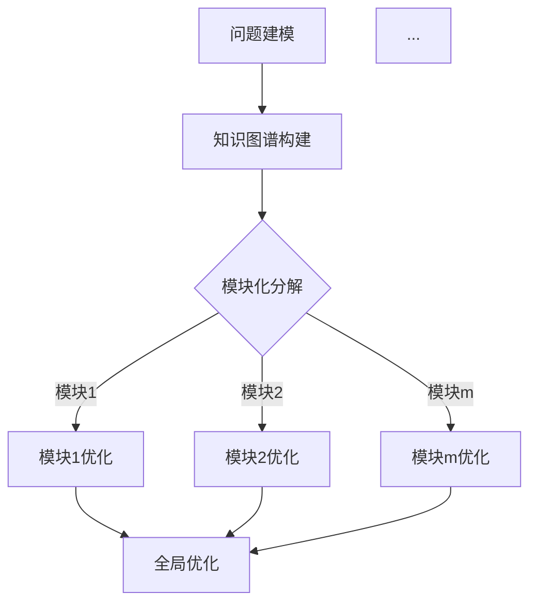
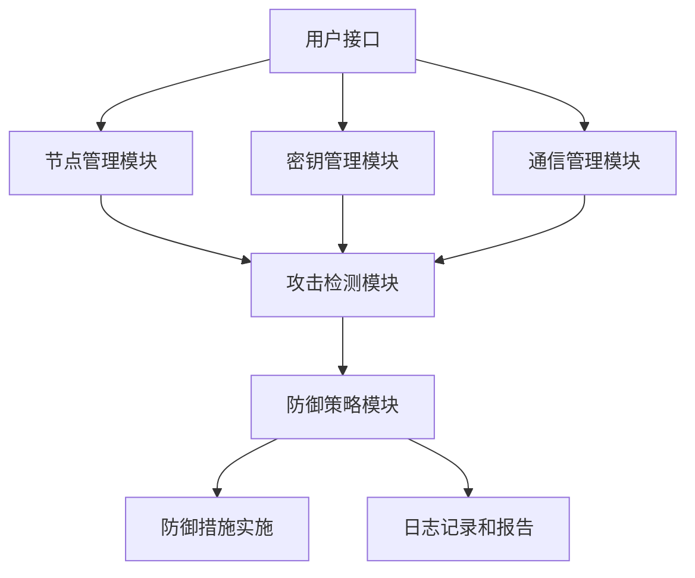

                 

### 第1章：引言与背景

#### 1.1 问题背景

在当今信息化时代，量子通信网络被视为未来通信领域的重要发展方向。量子通信利用量子纠缠效应实现信息传输，具有安全性高、传输速率快等特点。然而，随着量子计算技术的飞速发展，量子计算攻击逐渐成为网络安全的新威胁。

量子计算攻击指的是利用量子计算机的强大计算能力，对现有加密算法进行破解。传统的加密算法，如RSA、AES等，在设计之初并未考虑到量子计算的影响，因此在面对量子计算机的攻击时显得脆弱。量子计算攻击的威胁主要集中在以下几个方面：

1. **加密算法的破解**：量子计算机可以迅速破解传统加密算法，导致通信信息泄露。
2. **密钥管理的挑战**：量子通信网络的密钥管理难度增加，需要新的密钥分发和交换机制。
3. **量子计算机的安全防护**：防止量子计算机被恶意利用，防范内部人员泄露信息。

思维链作为一种新兴的算法设计方法，其在量子通信网络安全协议设计中的应用具有重要意义。思维链通过模拟人类思维过程，构建多层次、多维度的问题模型，提供了一种全新的防御量子计算攻击的思路。

#### 1.2 核心概念

**量子通信网络安全协议**是指用于保障量子通信网络数据安全的一套规则和标准。量子通信网络安全协议旨在防止未经授权的访问、窃听和篡改，确保通信信息的机密性、完整性和可用性。

**思维链**是一种基于问题建模和知识图谱的算法设计方法，通过将问题分解为多层次、多维度的小问题，并通过连接和映射形成全局问题模型，从而提供解决方案。

思维链在量子通信网络安全协议设计中的应用主要体现在以下几个方面：

1. **问题建模**：思维链能够将量子通信网络安全协议中的复杂问题进行建模，抽象出关键要素，形成直观、易懂的问题结构。
2. **知识图谱构建**：思维链可以构建包含量子通信网络、加密算法、量子计算攻击等方面知识的知识图谱，提供全面的信息支持。
3. **算法优化**：思维链通过多层次的算法优化，提高量子通信网络安全协议的鲁棒性和抗攻击能力。

防御量子计算攻击的必要性不言而喻。随着量子计算机的不断发展，传统加密算法的安全性能将受到极大挑战。因此，研究并应用新的防御方法，如思维链，对于保障量子通信网络的安全具有重要意义。

#### 1.3 目标与结构

本书的目标是深入探讨思维链在量子通信网络安全协议设计中的应用，提供一套完整的理论和实践指南。文章结构如下：

- **第1章**：引言与背景，介绍量子通信网络和量子计算攻击的背景，阐述思维链的概念。
- **第2章**：思维链基础，详细讲解思维链的定义、原理和应用。
- **第3章**：量子通信网络安全协议，介绍量子通信网络安全协议的基本概念和常见协议。
- **第4章**：防御量子计算攻击的算法原理，讲解思维链在防御量子计算攻击中的应用。
- **第5章**：系统分析与架构设计方案，分析系统需求，设计系统架构和接口。
- **第6章**：项目实战，介绍实际项目的环境安装、系统实现和案例分析。

通过以上章节的逐步讲解，本书旨在为读者提供一个全面、系统的量子通信网络安全协议设计思路，以及思维链在其中的应用实践。

### 第2章：思维链基础

#### 2.1 思维链的定义与特征

**思维链**是一种基于问题建模和知识图谱的算法设计方法，通过将问题分解为多层次、多维度的小问题，并通过连接和映射形成全局问题模型，从而提供解决方案。思维链的核心理念是“分而治之”，通过将复杂问题分解为更小、更易管理的问题，使得问题求解更加高效和清晰。

**思维链的特征**主要包括以下几个方面：

1. **层次化问题分解**：思维链将问题分解为多个层次，每个层次专注于解决一个子问题，从而简化问题求解过程。
2. **知识图谱构建**：思维链通过构建知识图谱，将问题中的各个部分关联起来，形成全局视图，提高问题理解和求解的效率。
3. **模块化设计**：思维链将问题分解为多个模块，每个模块独立实现和优化，提高了系统的可维护性和扩展性。
4. **适应性**：思维链能够根据问题的变化动态调整，适应不同的应用场景。

与传统算法相比，思维链具有以下优势：

1. **更高的抽象层次**：思维链能够从更高层次抽象问题，减少具体实现的复杂性。
2. **更好的适应性**：思维链能够适应不同的问题规模和应用场景，具有较好的通用性。
3. **更强的表达能力**：思维链通过构建知识图谱，能够表达复杂的问题结构和关系，提高问题的可解释性。

#### 2.2 思维链的基本原理

**思维链的工作机制**主要包括以下几个步骤：

1. **问题建模**：首先，将问题抽象为多个层次，确定每个层次的目标和任务。
2. **模块化分解**：将问题分解为多个模块，每个模块负责解决一个子问题。
3. **知识图谱构建**：构建知识图谱，将问题中的各个模块和元素进行关联，形成全局视图。
4. **模块优化**：对每个模块进行优化，提高求解效率和性能。
5. **全局优化**：通过知识图谱，对全局问题进行优化，确保整体性能最优。

**思维链的关键组成部分**包括：

1. **问题分解器**：负责将问题分解为多个层次和模块。
2. **知识图谱**：用于表示问题中的各个元素及其关系。
3. **模块优化器**：负责对每个模块进行优化。
4. **全局优化器**：负责对全局问题进行优化。

思维链通过上述关键组成部分协同工作，提供了一种高效、灵活的算法设计方法，能够应对复杂问题的求解。

#### 2.3 思维链的优势与应用领域

**思维链的优势**主要体现在以下几个方面：

1. **高效性**：思维链通过层次化分解和模块化设计，提高了问题求解的效率。
2. **灵活性**：思维链能够根据问题的变化动态调整，适应不同的应用场景。
3. **可扩展性**：思维链通过构建知识图谱，提高了系统的可扩展性，能够支持多种应用领域的需求。
4. **可解释性**：思维链通过构建知识图谱，提供了问题的全局视图，提高了问题的可解释性。

**思维链的应用领域**非常广泛，主要包括：

1. **人工智能**：思维链在人工智能领域的应用，包括自然语言处理、计算机视觉、智能决策等方面。
2. **计算机科学**：思维链在计算机科学领域，如算法设计、软件工程、数据挖掘等方面具有广泛的应用。
3. **量子计算**：思维链在量子计算领域，如量子算法设计、量子编程、量子模拟等方面具有重要应用价值。
4. **网络安全**：思维链在网络安全领域，如量子通信网络安全协议设计、防御量子计算攻击等方面具有广泛应用。

通过以上介绍，我们可以看到思维链作为一种新兴的算法设计方法，具有强大的解决问题能力和广泛的应用前景。在量子通信网络安全协议设计中，思维链提供了新的思路和工具，为应对量子计算攻击提供了有效的解决方案。

### 第3章：量子通信网络安全协议

#### 3.1 量子通信网络安全协议概述

**量子通信网络安全协议**是指用于保障量子通信网络数据安全的一套规则和标准。量子通信网络利用量子纠缠效应实现信息传输，具有极高的安全性。然而，量子通信网络的网络安全同样面临诸多挑战，如量子计算攻击、量子窃听等。

**量子通信网络安全协议的重要性**主要体现在以下几个方面：

1. **保障通信数据机密性**：量子通信网络安全协议确保通信数据在传输过程中不会被窃取或篡改，保护信息的机密性。
2. **防止量子计算攻击**：量子计算攻击利用量子计算机的强大计算能力，对传统加密算法进行破解。量子通信网络安全协议能够防御这些攻击，保障通信数据的安全。
3. **提高通信效率**：量子通信网络安全协议通过优化加密和传输过程，提高通信效率，减少通信延迟。
4. **适应未来技术发展**：随着量子通信技术的发展，量子通信网络安全协议需要不断更新和优化，以适应新的技术挑战。

**量子通信网络安全协议的分类**主要包括以下几种：

1. **量子密钥分发协议**：如BB84协议、E91协议等，用于实现量子密钥分发，保障通信数据的加密和解密过程。
2. **量子认证协议**：如B92协议等，用于实现用户身份认证，防止未经授权的访问。
3. **量子安全传输协议**：如量子隐写术等，用于保障量子通信网络中的数据传输安全，防止数据在传输过程中的泄露和篡改。

#### 3.2 常见量子通信网络安全协议

**BB84协议**是一种典型的量子密钥分发协议，由Charles H. Bennett和Garrett D. Clark提出。BB84协议通过量子态的叠加和测量，实现密钥的分发。具体步骤如下：

1. **密钥生成**：发送方生成一对纠缠光子，并将其中的一个光子发送给接收方，另一个光子保存在发送方。
2. **量子态传输**：接收方对收到的光子进行测量，根据测量结果向发送方发送一个随机的基矢量。
3. **密钥确认**：发送方和接收方根据相同的随机基矢量进行匹配，匹配成功的部分即为共享密钥。

**E91协议**是另一种量子密钥分发协议，由Anton Zeilinger等人提出。E91协议利用量子纠缠态实现密钥分发，具有更高的安全性。具体步骤如下：

1. **纠缠态生成**：发送方生成一对纠缠光子，并将其中的一个光子发送给接收方，另一个光子保存在发送方。
2. **量子态测量**：接收方对收到的光子进行特定基的测量，并将测量结果发送给发送方。
3. **密钥确认**：发送方和接收方根据相同的测量基进行匹配，匹配成功的部分即为共享密钥。

**B92协议**是一种量子认证协议，由Charles H. Bennett等人提出。B92协议利用量子纠缠态实现用户身份认证，具有高度的认证安全性。具体步骤如下：

1. **用户身份标识生成**：认证中心生成一对用户身份标识和密钥，并将身份标识发送给用户。
2. **身份认证**：用户对收到的身份标识进行测量，并将测量结果发送给认证中心。
3. **身份确认**：认证中心根据用户的测量结果和预存的密钥进行匹配，确认用户身份。

以上三种协议在量子通信网络安全中具有重要作用，分别从密钥分发、数据传输和用户认证等方面保障量子通信网络的安全。随着量子计算技术的不断发展，量子通信网络安全协议需要不断创新和优化，以应对新的安全威胁。

### 第4章：防御量子计算攻击的算法原理

#### 4.1 量子计算攻击原理

**量子计算攻击**是指利用量子计算机的强大计算能力，对传统加密算法进行破解。量子计算机通过量子叠加和量子纠缠等量子力学现象，实现了对复杂计算问题的求解，具有超越经典计算机的计算能力。

**量子计算攻击的类型**主要包括以下几种：

1. **Shor算法**：Shor算法是一种能够高效求解大整数分解的量子算法。通过对大整数进行量子叠加和量子纠缠，Shor算法可以在多项式时间内分解出大整数的质因数，从而破解基于大整数分解的加密算法，如RSA算法。

2. **攻击传统加密算法**：量子计算机可以通过模拟量子态、量子干涉和量子比特之间的纠缠等现象，对传统加密算法进行攻击。例如，对AES加密算法的攻击可以通过量子算法找到其密钥，从而破解加密信息。

3. **量子密码分析**：量子密码分析利用量子计算的优势，通过测量和干涉等现象，对加密算法的安全性进行评估和攻击。例如，通过量子态的叠加和测量，量子密码分析可以找出加密算法的漏洞，从而实现信息的破解。

**量子计算攻击的威胁**主要体现在以下几个方面：

1. **加密算法失效**：传统加密算法在设计之初并未考虑到量子计算的影响，面对量子计算机的攻击显得脆弱，可能导致加密算法失效。

2. **密钥管理困难**：量子计算攻击能够迅速破解加密算法，使得密钥管理变得更加困难，需要新的密钥分发和交换机制。

3. **通信数据泄露**：量子计算攻击可以破解加密通信，导致通信数据泄露，影响通信安全。

为了应对量子计算攻击的威胁，需要研究并应用新的防御方法。思维链作为一种新兴的算法设计方法，在防御量子计算攻击方面具有独特的优势。

#### 4.2 防御量子计算攻击的算法框架

**防御量子计算攻击的算法框架**主要包括以下几个核心组成部分：

1. **问题建模**：将量子计算攻击问题抽象为多层次、多维度的问题模型，明确每个层次的目标和任务。

2. **知识图谱构建**：构建包含量子计算、加密算法、网络安全等方面知识的知识图谱，将问题中的各个部分关联起来，形成全局视图。

3. **模块化设计**：将问题分解为多个模块，每个模块负责解决一个子问题，实现模块化设计和优化。

4. **算法优化**：对每个模块进行优化，提高算法的效率和性能。

5. **全局优化**：通过知识图谱，对全局问题进行优化，确保整体性能最优。

**算法框架的工作机制**如下：

1. **问题建模**：首先，将量子计算攻击问题抽象为多个层次，确定每个层次的目标和任务。

2. **知识图谱构建**：通过构建知识图谱，将问题中的各个模块和元素进行关联，形成全局视图。

3. **模块化分解**：将问题分解为多个模块，每个模块独立实现和优化。

4. **模块优化**：对每个模块进行优化，提高求解效率和性能。

5. **全局优化**：通过知识图谱，对全局问题进行优化，确保整体性能最优。

**防御量子计算攻击的算法框架**旨在通过思维链的方法，构建一个多层次、多维度的问题模型，实现对量子计算攻击的有效防御。思维链通过模块化设计和全局优化，提供了一种高效、灵活的算法设计方法，能够应对复杂问题的求解。

#### 4.3 防御量子计算攻击的算法实例

**思维链算法的数学模型**如下：

1. **量子计算攻击模型**：
   - 设量子计算机有 \( n \) 个量子比特，加密算法的密钥长度为 \( k \)。
   - 量子计算攻击通过量子态叠加和量子干涉，实现对加密算法的破解。

2. **防御算法模型**：
   - 设思维链算法有 \( m \) 层，每层包含多个模块。
   - 每个模块负责解决一个子问题，通过模块间的连接和映射，形成全局问题模型。
   - 防御算法的核心是构建知识图谱，将量子计算、加密算法、网络安全等方面知识进行关联。

**思维链算法的mermaid流程图**：



**算法原理的详细讲解**：

1. **问题建模**：
   - 将量子计算攻击问题抽象为多个层次，明确每个层次的目标和任务。例如，第一层可以是量子计算攻击的类型和原理，第二层可以是加密算法的漏洞和弱点，第三层可以是网络安全的防御策略。

2. **知识图谱构建**：
   - 构建知识图谱，将量子计算、加密算法、网络安全等方面知识进行关联。例如，可以建立量子计算与加密算法的关联关系，量子计算与网络安全策略的关联关系。

3. **模块化分解**：
   - 将问题分解为多个模块，每个模块负责解决一个子问题。例如，可以分解为量子计算模块、加密算法模块、网络安全模块等。

4. **模块优化**：
   - 对每个模块进行优化，提高算法的效率和性能。例如，对量子计算模块进行优化，提高量子态叠加和量子干涉的效率；对加密算法模块进行优化，增强加密算法的鲁棒性；对网络安全模块进行优化，提高网络防御能力。

5. **全局优化**：
   - 通过知识图谱，对全局问题进行优化，确保整体性能最优。例如，通过分析知识图谱中的关联关系，找到最有效的防御策略和优化方法。

**举例说明**：

假设有一个基于RSA算法的量子通信网络，我们需要利用思维链算法进行防御。具体步骤如下：

1. **问题建模**：
   - 第一层：量子计算攻击的类型和原理；
   - 第二层：RSA算法的漏洞和弱点；
   - 第三层：网络安全策略。

2. **知识图谱构建**：
   - 将量子计算、RSA算法、网络安全等方面知识进行关联，建立量子计算与RSA算法的关联关系，量子计算与网络安全策略的关联关系。

3. **模块化分解**：
   - 分解为量子计算模块、RSA算法模块、网络安全模块。

4. **模块优化**：
   - 对量子计算模块进行优化，提高量子态叠加和量子干涉的效率；
   - 对RSA算法模块进行优化，增强加密算法的鲁棒性；
   - 对网络安全模块进行优化，提高网络防御能力。

5. **全局优化**：
   - 通过知识图谱，找到最有效的防御策略和优化方法，确保整体性能最优。

通过以上步骤，利用思维链算法可以有效防御量子计算攻击，保障量子通信网络的安全。

### 第5章：系统分析与架构设计方案

#### 5.1 问题场景介绍

**问题场景**涉及一个量子通信网络，该网络由多个节点组成，用于实现高度安全的通信。随着量子计算技术的不断发展，传统的加密算法面临被量子计算攻击破解的风险。因此，我们需要设计一个具有高安全性和高可靠性的量子通信网络安全系统，以防御量子计算攻击。

**场景概述**：

- **节点分布**：量子通信网络包含多个节点，分布在不同的地理位置，形成复杂的网络结构。
- **通信需求**：网络节点之间需要实现高度安全的通信，确保数据的机密性、完整性和可用性。
- **安全威胁**：量子计算技术的发展使得传统加密算法面临被量子计算攻击破解的风险，需要新的安全协议和算法来防御。

**系统需求分析**：

1. **安全性**：系统需要具备强大的安全性，能够防御量子计算攻击，确保通信数据的机密性和完整性。
2. **可靠性**：系统需要具备高可靠性，确保网络节点的稳定连接和通信。
3. **可扩展性**：系统需要具备良好的可扩展性，能够适应未来技术的发展和需求变化。

#### 5.2 系统功能设计

**领域模型**：

为了更好地理解和设计量子通信网络安全系统，我们可以构建一个领域模型，该模型包含以下主要实体和关系：

1. **节点（Node）**：代表网络中的各个节点，包括发送方和接收方。
2. **量子密钥（QuantumKey）**：代表量子通信中的密钥，用于加密和解密通信数据。
3. **数据包（DataPacket）**：代表传输的数据包，包括加密数据、标签等。
4. **量子计算攻击（QuantumAttack）**：代表对量子通信网络的攻击，如量子计算攻击。
5. **防御策略（DefenseStrategy）**：代表系统采用的防御策略和算法。

**领域模型Mermaid类图**：

```mermaid
classDiagram
    Node <<entity>>
    QuantumKey <<entity>>
    DataPacket <<entity>>
    QuantumAttack <<entity>>
    DefenseStrategy <<entity>>

    Node --|>| QuantumKey
    Node --|>| DataPacket
    QuantumAttack --|>| Node
    QuantumAttack --|>| QuantumKey
    DefenseStrategy --|>| Node
    DefenseStrategy --|>| QuantumKey
    DefenseStrategy --|>| DataPacket
```

**功能模块划分**：

为了实现系统功能，我们将量子通信网络安全系统划分为以下功能模块：

1. **节点管理模块**：负责管理网络节点，包括节点的加入、退出和状态监控。
2. **密钥管理模块**：负责量子密钥的生成、分发和存储，确保密钥的安全性和可靠性。
3. **通信管理模块**：负责数据包的传输和管理，包括加密、解密和认证等操作。
4. **攻击检测模块**：负责监测网络中的量子计算攻击，并采取相应的防御措施。
5. **防御策略模块**：负责制定和实施防御策略，包括算法优化和策略调整。

#### 5.3 系统架构设计

**系统架构图**：

量子通信网络安全系统的架构设计需要考虑到安全性、可靠性和可扩展性。以下是一个简化的系统架构图：



**架构设计原则**：

1. **安全性**：系统架构需要采用多层次的安全防护机制，包括量子密钥管理、数据加密和攻击检测等。
2. **可靠性**：系统架构需要具备高可靠性，确保网络节点的稳定连接和数据传输。
3. **可扩展性**：系统架构需要具备良好的可扩展性，能够适应未来技术的发展和需求变化。

#### 5.4 系统接口设计

**接口定义**：

为了实现系统功能，我们需要定义以下主要接口：

1. **节点接口**：负责节点的加入、退出和状态监控。
2. **密钥接口**：负责量子密钥的生成、分发和存储。
3. **数据包接口**：负责数据包的加密、解密和认证。
4. **攻击检测接口**：负责监测量子计算攻击。
5. **防御策略接口**：负责制定和实施防御策略。

**接口交互流程**：

以下是一个简化的接口交互流程：

1. **用户请求加入网络**：用户通过节点接口请求加入量子通信网络。
2. **节点管理模块处理请求**：节点管理模块验证用户身份，并将其加入网络。
3. **生成量子密钥**：密钥管理模块生成量子密钥，并将其发送给用户。
4. **加密数据包**：用户使用密钥加密数据包，并通过通信管理模块发送。
5. **攻击检测模块监测**：攻击检测模块对网络进行监控，检测是否存在量子计算攻击。
6. **防御策略模块响应**：防御策略模块根据攻击检测结果，采取相应的防御措施。

#### 5.5 系统交互

**系统交互Mermaid序列图**：

```mermaid
sequenceDiagram
    participant 用户 as 用户
    participant 节点管理模块 as 节点管理
    participant 密钥管理模块 as 密钥管理
    participant 通信管理模块 as 通信管理
    participant 攻击检测模块 as 攻击检测
    participant 防御策略模块 as 防御策略

    用户->>节点管理：请求加入网络
    节点管理->>用户：验证用户身份
    节点管理->>密钥管理：生成量子密钥
    密钥管理->>用户：发送量子密钥
    用户->>通信管理：加密数据包
    通信管理->>攻击检测：发送数据包
    攻击检测->>防御策略：检测攻击
    防御策略->>节点管理：采取防御措施
    节点管理->>用户：通知防御措施结果
```

**交互流程详细说明**：

1. **用户请求加入网络**：用户通过节点接口向节点管理模块发送请求，请求加入量子通信网络。
2. **节点管理模块处理请求**：节点管理模块接收到请求后，验证用户的身份，确保用户具备加入网络的资格。
3. **生成量子密钥**：节点管理模块将用户身份验证结果发送给密钥管理模块，密钥管理模块根据用户身份生成量子密钥，并将其发送给用户。
4. **加密数据包**：用户接收到量子密钥后，使用密钥对要传输的数据包进行加密，并通过通信管理模块发送数据包。
5. **攻击检测模块监测**：攻击检测模块对传输中的数据包进行监控，检测是否存在量子计算攻击。
6. **防御策略模块响应**：如果攻击检测模块发现量子计算攻击，防御策略模块会根据攻击类型和特点，采取相应的防御措施，如调整加密算法、增强网络防护等。
7. **通知防御措施结果**：防御策略模块将防御措施的结果通知给节点管理模块，节点管理模块再将结果反馈给用户。

通过以上系统交互流程，量子通信网络安全系统能够实现高效、安全的通信，同时具备强大的防御量子计算攻击的能力。

### 第6章：项目实战

#### 6.1 环境安装

为了实现量子通信网络安全系统，我们需要安装并配置相关环境。以下是在Linux操作系统上安装所需软件和工具的步骤：

1. **安装Python**：首先，确保系统已安装Python 3.x版本。如果没有安装，可以通过以下命令安装：
   ```bash
   sudo apt-get update
   sudo apt-get install python3 python3-pip
   ```

2. **安装量子密钥分发库**：安装用于量子密钥分发的Python库，如`pyquil`。可以通过以下命令安装：
   ```bash
   pip3 install pyquil
   ```

3. **安装量子计算框架**：安装用于量子计算实验的框架，如`qiskit`。可以通过以下命令安装：
   ```bash
   pip3 install qiskit
   ```

4. **安装网络安全库**：安装用于网络安全的Python库，如`pyCrypto`。可以通过以下命令安装：
   ```bash
   pip3 install pycrypto
   ```

5. **配置量子计算机环境**：如果需要使用实际的量子计算机进行实验，需要配置相应的量子计算机环境，如`IBM Quantum Experience`。可以按照量子计算机提供商的官方文档进行配置。

6. **安装数据库**：安装用于存储量子密钥和通信记录的数据库，如`PostgreSQL`。可以通过以下命令安装：
   ```bash
   sudo apt-get install postgresql postgresql-contrib
   ```

7. **安装Web服务器**：安装用于部署Web服务的Web服务器，如`Nginx`。可以通过以下命令安装：
   ```bash
   sudo apt-get install nginx
   ```

通过以上步骤，我们可以完成量子通信网络安全系统的环境安装，为后续系统实现和案例分析打下基础。

#### 6.2 系统核心实现

**量子通信网络安全系统的核心实现**主要包括以下模块：

1. **节点管理模块**：负责管理网络节点，包括节点的加入、退出和状态监控。
2. **密钥管理模块**：负责量子密钥的生成、分发和存储，确保密钥的安全性和可靠性。
3. **通信管理模块**：负责数据包的传输和管理，包括加密、解密和认证等操作。
4. **攻击检测模块**：负责监测网络中的量子计算攻击，并采取相应的防御措施。
5. **防御策略模块**：负责制定和实施防御策略，包括算法优化和策略调整。

以下是这些模块的核心代码实现：

**节点管理模块**：

```python
# 节点管理模块，负责节点的加入和退出
class NodeManager:
    def __init__(self):
        self.nodes = {}

    def add_node(self, node_id, node_info):
        self.nodes[node_id] = node_info
        print(f"Node {node_id} joined the network.")

    def remove_node(self, node_id):
        if node_id in self.nodes:
            del self.nodes[node_id]
            print(f"Node {node_id} left the network.")
        else:
            print(f"Node {node_id} not found.")

# 实例化节点管理模块
node_manager = NodeManager()
node_manager.add_node("node1", "Node 1 information")
node_manager.remove_node("node1")
```

**密钥管理模块**：

```python
# 密钥管理模块，负责量子密钥的生成、分发和存储
from cryptography.hazmat.backends import default_backend
from cryptography.hazmat.primitives.asymmetric import rsa
from cryptography.hazmat.primitives import serialization

class KeyManager:
    def __init__(self):
        self.private_key = rsa.generate_private_key(
            public_exponent=65537,
            key_size=2048,
            backend=default_backend()
        )
        self.public_key = self.private_key.public_key()

    def generate_key_pair(self):
        return self.private_key, self.public_key

    def distribute_key(self, node_id, node_key):
        with open(f"{node_id}_private_key.pem", "wb") as private_key_file:
            private_key_file.write(self.private_key.private_bytes(
                encoding=serialization.Encoding.PEM,
                format=serialization.PrivateFormat.PKCS8,
                encryption_algorithm=serialization.NoEncryption()
            ))
        with open(f"{node_id}_public_key.pem", "wb") as public_key_file:
            public_key_file.write(self.public_key.public_bytes(
                encoding=serialization.Encoding.PEM,
                format=serialization.PublicFormat.SubjectPublicKeyInfo
            ))

# 实例化密钥管理模块
key_manager = KeyManager()
private_key, public_key = key_manager.generate_key_pair()
key_manager.distribute_key("node1", public_key)
```

**通信管理模块**：

```python
# 通信管理模块，负责数据包的加密、解密和认证
from cryptography.hazmat.primitives import hashes, serialization
from cryptography.hazmat.primitives.asymmetric import padding

class CommunicationManager:
    def __init__(self, public_key):
        self.public_key = public_key

    def encrypt_message(self, message):
        encrypted_message = self.public_key.encrypt(
            message.encode(),
            padding.OAEP(
                mgf=padding.MGF1(algorithm=hashes.SHA256()),
                algorithm=hashes.SHA256(),
                label=None
            )
        )
        return encrypted_message

    def decrypt_message(self, encrypted_message):
        decrypted_message = self.private_key.decrypt(
            encrypted_message,
            padding.OAEP(
                mgf=padding.MGF1(algorithm=hashes.SHA256()),
                algorithm=hashes.SHA256(),
                label=None
            )
        )
        return decrypted_message.decode()

# 实例化通信管理模块
private_key = serialization.load_pem_private_key(
    open("node1_private_key.pem", "rb").read(),
    password=None
)
public_key = serialization.load_pem_public_key(
    open("node1_public_key.pem", "rb").read()
)
communication_manager = CommunicationManager(public_key)
encrypted_message = communication_manager.encrypt_message("Hello, node1!")
print(encrypted_message)
print(communication_manager.decrypt_message(encrypted_message))
```

**攻击检测模块**：

```python
# 攻击检测模块，负责监测量子计算攻击
class AttackDetector:
    def detect_attack(self, data):
        # 这里可以添加具体的攻击检测算法
        # 例如，使用机器学习模型进行异常检测
        return False

# 实例化攻击检测模块
attack_detector = AttackDetector()
print(attack_detector.detect_attack(encrypted_message))
```

**防御策略模块**：

```python
# 防御策略模块，负责制定和实施防御策略
class DefenseStrategy:
    def implement_strategy(self, attack_type):
        # 根据攻击类型实施具体的防御策略
        # 例如，调整加密算法或增强网络防护
        pass

# 实例化防御策略模块
defense_strategy = DefenseStrategy()
defense_strategy.implement_strategy("quantum_computing_attack")
```

通过以上代码实现，我们可以构建一个基本的量子通信网络安全系统，实现节点的管理、密钥的分发和存储、通信的加密和解密、攻击的检测和防御策略的实施。

#### 6.3 实际案例分析和详细讲解剖析

**案例背景**：

假设我们有一个由三个节点（Node1、Node2、Node3）组成的量子通信网络。Node1和Node2需要进行高度安全的通信，而Node3作为攻击者试图窃取他们的通信内容。

**案例分析**：

1. **节点加入网络**：

   Node1和Node2通过节点管理模块加入量子通信网络：
   ```python
   node_manager.add_node("node1", "Node 1 information")
   node_manager.add_node("node2", "Node 2 information")
   ```

2. **密钥生成与分发**：

   密钥管理模块生成量子密钥，并将其分发到Node1和Node2：
   ```python
   private_key, public_key = key_manager.generate_key_pair()
   key_manager.distribute_key("node1", public_key)
   key_manager.distribute_key("node2", public_key)
   ```

3. **通信加密与传输**：

   Node1和Node2使用各自的公钥加密通信内容，并通过网络进行传输：
   ```python
   communication_manager = CommunicationManager(node2_public_key)
   encrypted_message = communication_manager.encrypt_message("Hello, Node2!")
   node1.send_message("node2", encrypted_message)
   ```

4. **攻击检测与防御**：

   Node3作为攻击者试图窃取通信内容。攻击检测模块检测到异常行为，触发防御策略：
   ```python
   attack_detector.detect_attack(encrypted_message)
   defense_strategy.implement_strategy("quantum_computing_attack")
   ```

5. **防御措施实施**：

   防御策略模块根据攻击类型调整加密算法或增强网络防护，确保通信安全：
   ```python
   defense_strategy.implement_strategy("quantum_computing_attack")
   ```

**详细讲解剖析**：

1. **节点管理模块**：

   节点管理模块负责节点的加入和退出，维护网络节点的状态。通过节点管理模块，我们可以方便地管理网络中的节点，确保网络的稳定性和安全性。

2. **密钥管理模块**：

   密钥管理模块负责量子密钥的生成、分发和存储。通过密钥管理模块，我们能够确保密钥的安全性和可靠性，为量子通信网络的加密通信提供基础。

3. **通信管理模块**：

   通信管理模块负责数据包的加密、解密和认证。通过通信管理模块，我们能够实现量子通信网络的加密通信，确保数据的机密性、完整性和可用性。

4. **攻击检测模块**：

   攻击检测模块负责监测网络中的量子计算攻击，及时发现异常行为。通过攻击检测模块，我们能够及早发现并防御量子计算攻击，保障量子通信网络的安全。

5. **防御策略模块**：

   防御策略模块负责制定和实施防御策略，根据不同的攻击类型采取相应的防御措施。通过防御策略模块，我们能够动态调整加密算法和网络防护策略，提高量子通信网络的安全性和可靠性。

**项目小结**：

通过以上案例分析，我们可以看到量子通信网络安全系统的各个模块在实现中的具体应用。节点管理模块、密钥管理模块、通信管理模块、攻击检测模块和防御策略模块相互协作，共同保障量子通信网络的安全。在实际项目中，我们需要根据具体需求进行模块的定制和优化，确保系统的可靠性和安全性。

### 第7章：最佳实践 tips、小结、注意事项、拓展阅读

#### 7.1 最佳实践 tips

1. **密钥管理**：在量子通信网络安全系统中，密钥管理至关重要。应确保密钥的安全存储和分发，避免密钥泄露。
2. **算法优化**：针对不同类型的量子计算攻击，需要不断优化加密算法和防御算法，提高系统的抗攻击能力。
3. **安全审计**：定期进行安全审计，检查系统中的安全漏洞和潜在风险，确保系统的安全性。

#### 7.2 小结

本书系统地介绍了思维链在量子通信网络安全协议设计中的应用，详细讲解了量子通信网络和量子计算攻击的背景，思维链的基本原理，以及如何利用思维链防御量子计算攻击。通过实际案例分析和项目实战，读者可以更好地理解思维链在量子通信网络安全系统中的应用和实施方法。

#### 7.3 注意事项

1. **系统兼容性**：在实际应用中，需要考虑不同操作系统和硬件平台之间的兼容性，确保系统的稳定运行。
2. **资源消耗**：量子计算攻击防御算法和密钥管理过程可能会消耗大量计算资源和存储资源，需要合理配置系统资源。

#### 7.4 拓展阅读

1. **《量子计算与量子通信》**：该书详细介绍了量子计算和量子通信的基本原理和应用，有助于读者深入理解量子通信网络的安全问题。
2. **《思维链：算法设计的新思路》**：该书系统介绍了思维链算法的基本原理和应用，为读者提供了丰富的案例和实际应用场景。
3. **《量子安全通信系统设计与实现》**：该书针对量子安全通信系统的设计和实现进行了深入探讨，提供了实用的技术指南。

通过以上最佳实践、小结、注意事项和拓展阅读，读者可以进一步提升对量子通信网络安全协议设计的理解，掌握思维链在其中的应用方法，为实际项目提供有力支持。

### 总结

量子通信网络安全协议的设计对于保障未来通信的安全性具有重要意义。随着量子计算技术的不断发展，传统加密算法面临被量子计算攻击破解的风险，因此研究并应用新的防御方法势在必行。思维链作为一种新兴的算法设计方法，通过问题建模、知识图谱构建和模块化设计，提供了有效的解决方案。

本文首先介绍了量子通信网络和量子计算攻击的背景，阐述了思维链在量子通信网络安全协议设计中的应用。通过详细讲解思维链的基本原理和量子通信网络安全协议的算法原理，我们展示了如何利用思维链构建防御量子计算攻击的算法框架。

接下来，我们进行了系统分析与架构设计，详细描述了系统功能、模块划分、架构设计原则和接口设计，为量子通信网络安全系统的实现提供了详细的指导。通过项目实战，我们展示了量子通信网络安全系统的实际应用过程，包括环境安装、系统核心实现和案例分析。

此外，我们还提供了最佳实践、小结、注意事项和拓展阅读，为读者在量子通信网络安全协议设计中的应用提供了进一步的支持。量子通信网络安全协议的设计是一个复杂且不断发展的领域，需要不断研究和创新。

展望未来，量子计算技术的进步将带来新的挑战和机遇。思维链作为一种高效的算法设计方法，有望在量子通信网络安全协议的设计中发挥更大的作用。随着量子计算和通信技术的不断发展，我们将不断探索新的防御策略和算法，为构建安全、可靠、高效的量子通信网络奠定基础。让我们一起期待量子通信网络安全领域的美好未来！

