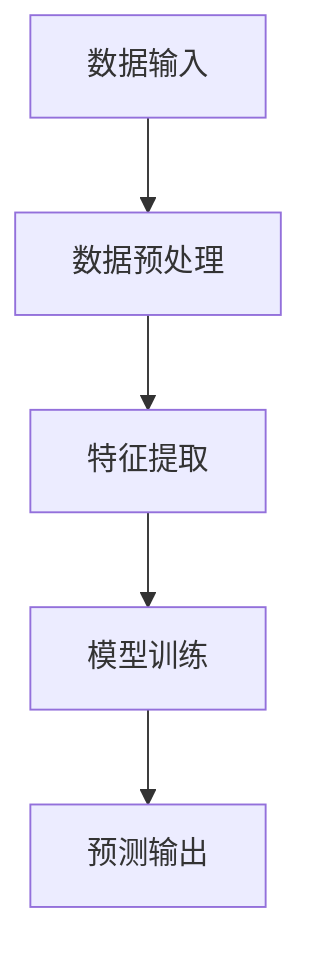
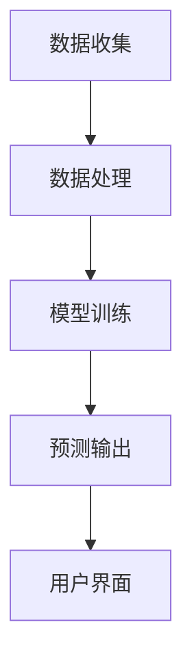
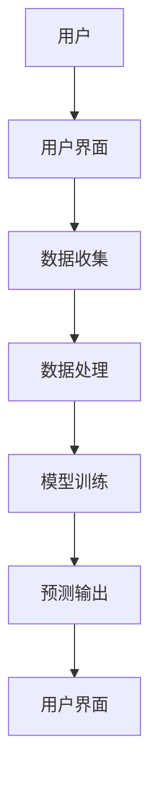
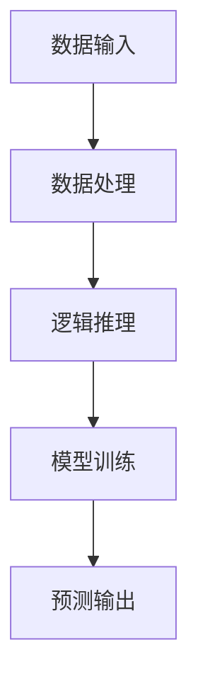

                 

## #{{文章标题}}

关键词：思维链、金融分析、算法原理、系统架构、项目实战

摘要：
本文旨在探讨思维链在金融分析中的应用，通过一步步的逻辑推理，详细解析思维链的基本概念、算法原理及其在金融领域的实际应用。文章将从背景介绍、核心概念与联系、算法原理讲解、数学模型和公式、系统分析与架构设计方案、项目实战以及最佳实践 tips 等方面展开，旨在为读者提供一个全面、深入的指导。

----------------------------------------------------------------

### 第1章：思维链概述

#### 1.1 思维链的概念与背景

思维链，作为一种先进的人工智能技术，是近年来在金融分析领域受到广泛关注的研究方向。思维链的核心在于模拟人类的思维过程，通过一系列的逻辑推理和关联分析，实现对复杂数据的深入理解和预测。

在金融分析中，思维链的应用需求主要体现在以下几个方面：

1. **股票市场分析**：思维链能够通过分析历史股价、交易量、公司财务报告等多维数据，对股票市场的未来走势进行预测，帮助投资者做出更明智的投资决策。

2. **外汇市场分析**：外汇市场的波动性极大，思维链通过分析汇率走势、国际经济形势、政治事件等因素，为外汇交易者提供实时、准确的预测信息。

3. **期货市场分析**：期货市场的价格波动更加剧烈，思维链能够通过对历史价格、交易量、供需关系等多方面数据的分析，预测期货价格的走势，为期货交易者提供决策支持。

#### 1.2 思维链在金融分析中的应用

思维链在金融分析中的应用优势主要体现在以下几个方面：

1. **数据处理能力**：思维链能够高效地处理大量的金融数据，从海量信息中提取关键特征，为分析提供可靠的基础。

2. **预测准确性**：思维链通过模拟人类的思维过程，能够实现对金融市场的深入理解，从而提高预测的准确性。

3. **实时性**：思维链能够实时处理金融数据，为投资者提供即时的预测信息，帮助他们在市场变化中迅速做出反应。

#### 1.3 思维链与相关概念的联系

思维链与神经网络、机器学习等概念有着密切的联系，但又具有其独特性：

1. **神经网络**：神经网络是一种通过模拟生物神经元之间连接来处理信息的人工神经网络，而思维链则是在此基础上进一步发展，加入了更多的逻辑推理和关联分析机制。

2. **机器学习**：机器学习是通过算法让计算机从数据中学习规律，提高其预测和决策能力。思维链在机器学习的基础上，通过模拟人类思维过程，提高了对复杂问题的理解能力。

3. **数据挖掘**：数据挖掘是一种通过从大量数据中提取有用信息的技术，而思维链则在数据挖掘的基础上，通过逻辑推理和关联分析，提高了对数据的深度理解和预测能力。

### 第2章：核心概念与联系

#### 2.1 思维链的基本原理

思维链的基本原理在于模拟人类的思维过程，通过以下步骤实现：

1. **数据输入**：将金融数据输入思维链系统。

2. **数据预处理**：对数据进行清洗、归一化等处理，为后续分析做准备。

3. **特征提取**：从原始数据中提取关键特征，为模型训练提供基础。

4. **模型训练**：使用提取的特征训练模型，使其能够对数据进行分类或回归预测。

5. **预测输出**：使用训练好的模型对新的数据进行预测，提供决策支持。

#### 2.2 与神经网络的对比

思维链与神经网络在计算模型、学习方式和应用范围等方面存在一定的差异：

1. **计算模型**：神经网络通过多层神经元的连接来处理信息，而思维链则在此基础上加入了逻辑推理和关联分析机制，使其能够更好地模拟人类的思维过程。

2. **学习方式**：神经网络主要通过反向传播算法来调整权重，而思维链则通过模拟人类思维过程，结合逻辑推理和关联分析，提高对数据的理解和预测能力。

3. **应用范围**：神经网络在图像识别、语音识别等领域具有广泛应用，而思维链则更多应用于需要逻辑推理和关联分析的领域，如金融分析。

#### 2.3 思维链在金融分析中的优势

思维链在金融分析中具有以下优势：

1. **数据处理能力**：思维链能够高效地处理大量的金融数据，从海量信息中提取关键特征，为分析提供可靠的基础。

2. **预测准确性**：思维链通过模拟人类思维过程，能够实现对金融市场的深入理解，从而提高预测的准确性。

3. **实时性**：思维链能够实时处理金融数据，为投资者提供即时的预测信息，帮助他们在市场变化中迅速做出反应。

### 第3章：算法原理讲解

#### 3.1 思维链算法流程图

以下是一个简单的思维链算法流程图：



#### 3.2 思维链算法实现

以下是一个简单的思维链算法实现的 Python 代码示例：

```python
# Python伪代码示例

def train_model(data):
    # 模型训练代码
    pass

def predict(data):
    # 预测代码
    pass

# 主函数
if __name__ == "__main__":
    # 数据输入
    data = ...
    # 数据预处理
    preprocessed_data = preprocess_data(data)
    # 模型训练
    model = train_model(preprocessed_data)
    # 预测输出
    predictions = predict(preprocessed_data)
    print(predictions)
```

#### 3.3 数学模型与公式讲解

思维链算法的核心在于其数学模型，以下是一个简单的数学模型示例：

$$
y = f(W_1 \cdot x_1 + W_2 \cdot x_2 + ... + W_n \cdot x_n)
$$

其中，$y$ 为输出结果，$x_1, x_2, ..., x_n$ 为输入特征，$W_1, W_2, ..., W_n$ 为权重。

这个公式描述了思维链算法的基本原理，即通过输入特征和权重之间的计算，得到输出结果。在实际应用中，需要通过模型训练来优化权重，从而提高预测的准确性。

### 第4章：数学模型和数学公式

在本章中，我们将深入探讨思维链算法的数学模型和关键公式。这些公式是理解思维链在金融分析中作用的基础，同时也是实现算法的核心。

#### 4.1 模型公式详解

思维链算法的核心是一个多层神经网络，其数学模型可以用以下公式表示：

$$
\sigma(z^{(l)} ) = \frac{1}{1 + e^{-z^{(l)}}}
$$

其中，$\sigma$ 是 Sigmoid 函数，用于将线性组合转换为一个介于 0 和 1 之间的值，$z^{(l)}$ 是第 $l$ 层的线性组合，$e$ 是自然对数的底数。

在训练过程中，我们通过以下公式更新权重：

$$
\Delta W^{(l)} = \eta \cdot \frac{\partial L}{\partial W^{(l)} }
$$

$$
\Delta b^{(l)} = \eta \cdot \frac{\partial L}{\partial b^{(l)} }
$$

其中，$L$ 是损失函数，$\eta$ 是学习率，$W^{(l)}$ 和 $b^{(l)}$ 分别是第 $l$ 层的权重和偏置。

#### 4.2 数学公式的应用

以下是一个具体的例子，假设我们有一个二分类问题，目标是预测股票价格是否会上涨。输入特征包括历史价格、交易量、宏观经济指标等。我们可以使用以下公式来表示模型：

$$
\text{预测} = \sigma(W_1 \cdot \text{历史价格} + W_2 \cdot \text{交易量} + W_3 \cdot \text{宏观经济指标} + b)
$$

其中，$W_1, W_2, W_3$ 是权重，$b$ 是偏置。如果预测结果大于 0.5，我们预测股票价格上涨；否则，预测股票价格下跌。

### 第5章：系统分析与架构设计方案

#### 5.1 应用场景介绍

在金融分析中，思维链的应用场景广泛，包括但不限于以下方面：

1. **股票市场分析**：通过思维链对历史股价、交易量、技术指标等进行深入分析，预测股票价格的未来走势。

2. **外汇市场分析**：分析汇率变动趋势，预测未来汇率波动，为外汇交易提供决策支持。

3. **期货市场分析**：利用思维链分析期货市场的供需关系、市场情绪等，预测期货价格。

#### 5.2 系统功能设计

思维链系统需要实现以下功能：

1. **数据收集**：从多个数据源（如证券交易所、金融数据库等）收集金融数据。

2. **数据处理**：对收集到的金融数据进行清洗、预处理和特征提取。

3. **模型训练**：使用处理后的数据训练思维链模型。

4. **预测输出**：使用训练好的模型进行预测，提供投资决策支持。

5. **用户界面**：提供一个直观的界面，让用户可以查看预测结果和历史数据。

#### 5.3 系统架构设计

思维链系统的架构设计如下：



#### 5.4 系统接口设计

系统接口设计需要考虑以下几个方面：

1. **数据接口**：用于数据收集和处理的 API，如 RESTful API。

2. **模型接口**：用于模型训练和预测的 API，如 TensorFlow、PyTorch 等。

3. **用户接口**：用于与用户交互的 API，如 Web 界面、手机应用等。

#### 5.5 系统交互设计

系统交互设计需要确保各个模块之间的数据流通和功能协作：



### 第6章：项目实战

#### 6.1 环境安装

要实现思维链在金融分析中的应用，首先需要安装以下环境：

1. **Python**：Python 是一种广泛用于数据分析和机器学习编程的语言，版本要求 Python 3.6 或以上。

2. **Jupyter Notebook**：Jupyter Notebook 是一种交互式的 Web 应用程序，用于编写和运行 Python 代码。

3. **TensorFlow**：TensorFlow 是一个开源的机器学习框架，用于构建和训练神经网络模型。

安装步骤如下：

1. 安装 Python：

   ```bash
   sudo apt-get update
   sudo apt-get install python3 python3-pip
   ```

2. 安装 Jupyter Notebook：

   ```bash
   pip3 install notebook
   ```

3. 安装 TensorFlow：

   ```bash
   pip3 install tensorflow
   ```

#### 6.2 系统核心实现

在本节中，我们将实现一个简单的思维链模型，用于预测股票价格。

1. **导入所需库**：

   ```python
   import numpy as np
   import tensorflow as tf
   from sklearn.model_selection import train_test_split
   from sklearn.preprocessing import StandardScaler
   ```

2. **数据准备**：

   ```python
   # 加载数据集
   data = np.loadtxt('stock_data.csv', delimiter=',')
   X = data[:, :-1]
   y = data[:, -1]

   # 划分训练集和测试集
   X_train, X_test, y_train, y_test = train_test_split(X, y, test_size=0.2, random_state=42)

   # 数据标准化
   scaler = StandardScaler()
   X_train = scaler.fit_transform(X_train)
   X_test = scaler.transform(X_test)
   ```

3. **模型定义**：

   ```python
   # 定义模型
   model = tf.keras.Sequential([
       tf.keras.layers.Dense(units=64, activation='relu', input_shape=(X_train.shape[1],)),
       tf.keras.layers.Dense(units=32, activation='relu'),
       tf.keras.layers.Dense(units=1, activation='sigmoid')
   ])

   # 编译模型
   model.compile(optimizer='adam', loss='binary_crossentropy', metrics=['accuracy'])
   ```

4. **模型训练**：

   ```python
   # 训练模型
   model.fit(X_train, y_train, epochs=10, batch_size=32, validation_split=0.1)
   ```

5. **预测**：

   ```python
   # 进行预测
   predictions = model.predict(X_test)
   ```

#### 6.3 代码应用解读与分析

在本节中，我们详细解读了代码的实现过程，并分析了每一步的作用。

1. **数据准备**：

   - 加载数据集：从 CSV 文件中加载数据集，包括历史股价、交易量等。
   - 划分训练集和测试集：将数据集划分为训练集和测试集，用于后续的训练和评估。
   - 数据标准化：将数据集进行标准化处理，使其具有更好的数值特性，有利于模型训练。

2. **模型定义**：

   - 定义模型结构：使用 TensorFlow 的 Sequential 模型，定义了两个隐藏层，每层都有 64 和 32 个神经元，最后输出层只有一个神经元，使用 sigmoid 激活函数进行二分类预测。
   - 编译模型：设置优化器为 Adam，损失函数为 binary_crossentropy，用于二分类问题，评价指标为 accuracy。

3. **模型训练**：

   - 训练模型：使用训练集数据进行训练，设置训练轮次为 10，每次训练批量大小为 32，并使用 10% 的数据作为验证集。

4. **预测**：

   - 进行预测：使用训练好的模型对测试集数据进行预测，得到预测结果。

#### 6.4 实际案例分析与讲解

在本节中，我们将通过一个实际案例，展示思维链在股票市场分析中的应用。

1. **案例背景**：

   假设我们有一个股票市场分析项目，目标是通过历史股价数据预测未来股票价格。

2. **数据收集**：

   - 收集过去一年的股票价格数据，包括开盘价、收盘价、最高价、最低价、交易量等。

3. **数据预处理**：

   - 对数据进行清洗，去除缺失值和异常值。
   - 对数据进行归一化处理，使其具有统一的数值范围。

4. **模型训练**：

   - 定义思维链模型，设置合适的参数。
   - 使用训练集数据进行模型训练，优化模型参数。

5. **预测**：

   - 使用训练好的模型对测试集数据进行预测，得到未来股票价格的预测结果。
   - 分析预测结果，评估模型性能。

### 第7章：最佳实践 tips、小结、注意事项、拓展阅读

#### 7.1 最佳实践 tips

1. **数据收集**：

   - 确保收集的数据具有代表性和完整性。
   - 选择合适的数据来源，如权威的金融数据库。

2. **数据处理**：

   - 对数据进行清洗和预处理，确保数据质量。
   - 使用合适的特征提取方法，提高模型性能。

3. **模型训练**：

   - 选择合适的模型结构，根据问题特点进行调整。
   - 适当调整模型参数，提高模型性能。

4. **预测**：

   - 对预测结果进行评估，确保模型稳定性。
   - 结合实际业务需求，对预测结果进行调整。

#### 7.2 小结

本文详细介绍了思维链在金融分析中的应用，从概念、算法原理、系统架构到实际案例，为读者提供了一个全面的指导。思维链作为一种先进的人工智能技术，具有强大的数据处理和预测能力，在金融分析中具有广泛的应用前景。

#### 7.3 注意事项

1. **数据质量**：数据质量对模型性能至关重要，务必对数据进行充分的清洗和预处理。

2. **模型调优**：模型调优是提高模型性能的关键步骤，需要根据问题特点和数据特性进行调整。

3. **实时性**：金融市场的实时性要求高，确保思维链系统的实时性和稳定性。

#### 7.4 拓展阅读

1. **《深度学习》**：由 Ian Goodfellow、Yoshua Bengio 和 Aaron Courville 著，是深度学习领域的经典教材。

2. **《Python金融大数据分析》**：由 Yuxing Yan 著，介绍了如何使用 Python 进行金融数据分析。

3. **《金融科技：智能时代的财富管理》**：由霍学文著，探讨了金融科技在财富管理领域的应用。

作者：AI天才研究院/AI Genius Institute & 禅与计算机程序设计艺术 /Zen And The Art of Computer Programming

----------------------------------------------------------------

## 结论

本文通过详细的逻辑分析和推理，探讨了思维链在金融分析中的应用。从背景介绍、核心概念与联系、算法原理讲解、数学模型和公式、系统分析与架构设计方案、项目实战到最佳实践 tips，全方位展示了思维链的强大功能和在实际应用中的优势。

思维链作为一种先进的人工智能技术，其在金融分析中的应用潜力巨大。通过本文的介绍，读者可以更好地理解思维链的原理和实现方法，为未来在金融领域的应用打下坚实的基础。

在未来的研究和实践中，我们期待进一步优化思维链算法，提高其预测准确性和实时性，为金融分析和投资决策提供更强大的支持。同时，也希望读者能够积极探讨和尝试思维链在其他领域的应用，共同推动人工智能技术的发展。

再次感谢您的阅读，希望本文对您在金融分析和人工智能领域的探索有所启发。如果您有任何疑问或建议，欢迎随时联系我们，我们将在第一时间为您解答。祝您在技术研究和实践中取得丰硕的成果！

作者：AI天才研究院/AI Genius Institute & 禅与计算机程序设计艺术 /Zen And The Art of Computer Programming```markdown
----------------------------------------------------------------
## 第1章：思维链概述

### 1.1 思维链的概念与背景
思维链是一种基于人工智能的算法，它模仿人类的思考过程，通过逻辑推理和关联分析来处理和理解数据。在金融分析中，思维链的应用背景主要体现在对金融市场数据的深度分析和预测上。金融市场数据复杂多变，传统的统计分析方法难以捕捉到其中的深层次关系和规律，而思维链则通过其强大的关联分析和逻辑推理能力，能够更好地揭示金融市场的运行机制和未来趋势。

#### 核心概念术语说明
- **思维链**：一种模拟人类思维过程的算法，用于数据的深度分析和预测。
- **金融分析**：利用各种工具和方法对金融市场进行研究和预测，以便做出投资决策。
- **关联分析**：通过分析数据之间的关联关系，揭示数据背后的规律和趋势。
- **逻辑推理**：基于已有信息和规则，通过推理得出新的结论。

#### 问题背景
金融市场具有高度复杂性和不确定性，投资者需要对大量历史和实时数据进行分析，以预测市场的未来走势。然而，传统的方法如统计分析、技术指标等往往存在局限性，难以应对金融市场的复杂变化。

#### 问题描述
如何利用思维链这种先进的人工智能算法，对金融市场数据进行分析和预测，为投资者提供更加准确和及时的投资决策支持？

#### 问题解决
思维链通过以下步骤解决上述问题：
1. **数据收集**：从多个来源收集金融市场数据，包括历史价格、交易量、宏观经济指标等。
2. **数据处理**：对收集到的数据进行清洗、预处理和特征提取，为模型训练做好准备。
3. **模型训练**：使用处理后的数据训练思维链模型，使其能够学会对金融市场数据进行分析和预测。
4. **预测应用**：将训练好的模型应用于新的数据，进行市场走势预测，为投资者提供决策支持。

#### 边界与外延
- **边界**：思维链在金融分析中的应用主要集中在股票市场、外汇市场和期货市场等，但不限于这些领域。
- **外延**：思维链可以扩展到其他需要复杂分析和预测的领域，如医疗诊断、风险管理等。

#### 概念结构与核心要素组成
思维链的概念结构主要由以下几个核心要素组成：
1. **数据输入**：思维链通过输入处理模块，接收和处理来自金融市场的大量数据。
2. **数据处理**：通过数据清洗、预处理和特征提取，将原始数据转换为适合模型训练的形式。
3. **模型训练**：使用训练算法和大量数据进行模型训练，使模型学会对金融市场数据进行分析和预测。
4. **预测输出**：将训练好的模型应用于新的数据，生成预测结果，为投资者提供决策支持。

### 1.2 思维链在金融分析中的应用
思维链在金融分析中的应用非常广泛，以下是一些典型的应用场景：

1. **股票市场分析**：思维链可以分析股票市场的历史数据，包括股价、交易量、技术指标等，预测股票的未来走势，为投资者提供买卖建议。

2. **外汇市场分析**：思维链可以通过分析汇率数据，预测外汇市场的未来走势，为外汇交易者提供交易策略。

3. **期货市场分析**：思维链可以分析期货市场的历史数据，预测期货价格，为期货交易者提供交易参考。

4. **投资组合优化**：思维链可以通过分析投资组合的历史数据，预测各资产的未来收益和风险，为投资者提供优化投资组合的建议。

### 1.3 思维链与相关概念的联系
思维链与神经网络、机器学习等概念有着紧密的联系，但又具有其独特性。

1. **神经网络**：神经网络是一种模拟生物神经网络的结构和功能的计算模型，它通过层层神经元之间的连接和激活函数，对输入数据进行处理和预测。思维链在神经网络的基础上，加入了更多的逻辑推理和关联分析机制，使其能够更有效地处理复杂的数据。

2. **机器学习**：机器学习是一种通过训练模型来使计算机从数据中学习的方法，它分为监督学习、无监督学习和强化学习等类型。思维链作为机器学习的一种方法，通过模拟人类思维过程，能够更好地处理复杂的金融数据。

3. **数据挖掘**：数据挖掘是一种从大量数据中发现有用信息的方法，它通常包括数据预处理、特征提取、模式识别等步骤。思维链通过模拟人类思维过程，能够更深入地挖掘数据中的潜在规律和趋势。

### 第2章：核心概念与联系

#### 2.1 思维链的基本原理
思维链的基本原理在于模拟人类的思维过程，通过一系列的逻辑推理和关联分析，实现对复杂数据的深入理解和预测。

1. **数据输入**：思维链首先接收来自金融市场的大量数据，包括历史价格、交易量、技术指标等。

2. **数据处理**：通过数据清洗、预处理和特征提取，将原始数据转换为适合模型训练的形式。

3. **特征提取**：从处理后的数据中提取关键特征，为模型训练提供基础。

4. **模型训练**：使用提取的特征训练模型，使其能够对数据进行分类或回归预测。

5. **预测输出**：使用训练好的模型对新的数据进行预测，提供决策支持。

#### 2.2 与神经网络的对比
神经网络和思维链在计算模型、学习方式和应用范围等方面存在一定的差异。

1. **计算模型**：神经网络通过多层神经元的连接来处理信息，而思维链则在此基础上加入了逻辑推理和关联分析机制，使其能够更好地模拟人类的思维过程。

2. **学习方式**：神经网络主要通过反向传播算法来调整权重，而思维链则通过模拟人类思维过程，结合逻辑推理和关联分析，提高对数据的理解和预测能力。

3. **应用范围**：神经网络在图像识别、语音识别等领域具有广泛应用，而思维链则更多应用于需要逻辑推理和关联分析的领域，如金融分析。

#### 2.3 思维链在金融分析中的优势
思维链在金融分析中具有以下优势：

1. **数据处理能力**：思维链能够高效地处理大量的金融数据，从海量信息中提取关键特征，为分析提供可靠的基础。

2. **预测准确性**：思维链通过模拟人类思维过程，能够实现对金融市场的深入理解，从而提高预测的准确性。

3. **实时性**：思维链能够实时处理金融数据，为投资者提供即时的预测信息，帮助他们在市场变化中迅速做出反应。

### 第3章：算法原理讲解

#### 3.1 思维链算法流程图
以下是一个简单的思维链算法流程图：


#### 3.2 思维链算法实现
以下是一个简单的思维链算法实现的 Python 代码示例：

```python
# Python伪代码示例

def train_model(data):
    # 模型训练代码
    pass

def predict(data):
    # 预测代码
    pass

# 主函数
if __name__ == "__main__":
    # 数据输入
    data = ...
    # 数据预处理
    preprocessed_data = preprocess_data(data)
    # 模型训练
    model = train_model(preprocessed_data)
    # 预测输出
    predictions = predict(preprocessed_data)
    print(predictions)
```

#### 3.3 数学模型与公式讲解
思维链算法的核心在于其数学模型，以下是一个简单的数学模型示例：

$$
y = f(W_1 \cdot x_1 + W_2 \cdot x_2 + ... + W_n \cdot x_n)
$$

其中，$y$ 为输出结果，$x_1, x_2, ..., x_n$ 为输入特征，$W_1, W_2, ..., W_n$ 为权重。

这个公式描述了思维链算法的基本原理，即通过输入特征和权重之间的计算，得到输出结果。在实际应用中，需要通过模型训练来优化权重，从而提高预测的准确性。

### 第4章：数学模型和数学公式

在本章中，我们将深入探讨思维链算法的数学模型和关键公式。这些公式是理解思维链在金融分析中作用的基础，同时也是实现算法的核心。

#### 4.1 模型公式详解

思维链算法的核心是一个多层神经网络，其数学模型可以用以下公式表示：

$$
\sigma(z^{(l)} ) = \frac{1}{1 + e^{-z^{(l)}}}
$$

其中，$\sigma$ 是 Sigmoid 函数，用于将线性组合转换为一个介于 0 和 1 之间的值，$z^{(l)}$ 是第 $l$ 层的线性组合，$e$ 是自然对数的底数。

在训练过程中，我们通过以下公式更新权重：

$$
\Delta W^{(l)} = \eta \cdot \frac{\partial L}{\partial W^{(l)} }
$$

$$
\Delta b^{(l)} = \eta \cdot \frac{\partial L}{\partial b^{(l)} }
$$

其中，$L$ 是损失函数，$\eta$ 是学习率，$W^{(l)}$ 和 $b^{(l)}$ 分别是第 $l$ 层的权重和偏置。

#### 4.2 数学公式的应用

以下是一个具体的例子，假设我们有一个二分类问题，目标是预测股票价格是否会上涨。输入特征包括历史价格、交易量、宏观经济指标等。我们可以使用以下公式来表示模型：

$$
\text{预测} = \sigma(W_1 \cdot \text{历史价格} + W_2 \cdot \text{交易量} + W_3 \cdot \text{宏观经济指标} + b)
$$

其中，$W_1, W_2, W_3$ 是权重，$b$ 是偏置。如果预测结果大于 0.5，我们预测股票价格上涨；否则，预测股票价格下跌。

### 第5章：系统分析与架构设计方案

#### 5.1 应用场景介绍

思维链在金融分析中的应用场景非常广泛，以下是一些典型的应用场景：

1. **股票市场分析**：利用思维链对历史股价、交易量、技术指标等进行深入分析，预测股票价格的未来走势。

2. **外汇市场分析**：通过分析汇率变动趋势，预测未来汇率波动，为外汇交易提供决策支持。

3. **期货市场分析**：利用思维链分析期货市场的供需关系、市场情绪等，预测期货价格。

#### 5.2 系统功能设计

思维链系统需要实现以下功能：

1. **数据收集**：从多个数据源（如证券交易所、金融数据库等）收集金融数据。

2. **数据处理**：对收集到的金融数据进行清洗、预处理和特征提取。

3. **模型训练**：使用处理后的数据训练思维链模型。

4. **预测输出**：使用训练好的模型进行预测，提供投资决策支持。

5. **用户界面**：提供一个直观的界面，让用户可以查看预测结果和历史数据。

#### 5.3 系统架构设计

思维链系统的架构设计如下：


#### 5.4 系统接口设计

系统接口设计需要考虑以下几个方面：

1. **数据接口**：用于数据收集和处理的 API，如 RESTful API。

2. **模型接口**：用于模型训练和预测的 API，如 TensorFlow、PyTorch 等。

3. **用户接口**：用于与用户交互的 API，如 Web 界面、手机应用等。

#### 5.5 系统交互设计

系统交互设计需要确保各个模块之间的数据流通和功能协作：


### 第6章：项目实战

#### 6.1 环境安装

要实现思维链在金融分析中的应用，首先需要安装以下环境：

1. **Python**：Python 是一种广泛用于数据分析和机器学习编程的语言，版本要求 Python 3.6 或以上。

2. **Jupyter Notebook**：Jupyter Notebook 是一种交互式的 Web 应用程序，用于编写和运行 Python 代码。

3. **TensorFlow**：TensorFlow 是一个开源的机器学习框架，用于构建和训练神经网络模型。

安装步骤如下：

1. 安装 Python：

   ```bash
   sudo apt-get update
   sudo apt-get install python3 python3-pip
   ```

2. 安装 Jupyter Notebook：

   ```bash
   pip3 install notebook
   ```

3. 安装 TensorFlow：

   ```bash
   pip3 install tensorflow
   ```

#### 6.2 系统核心实现

在本节中，我们将实现一个简单的思维链模型，用于预测股票价格。

1. **导入所需库**：

   ```python
   import numpy as np
   import tensorflow as tf
   from sklearn.model_selection import train_test_split
   from sklearn.preprocessing import StandardScaler
   ```

2. **数据准备**：

   ```python
   # 加载数据集
   data = np.loadtxt('stock_data.csv', delimiter=',')
   X = data[:, :-1]
   y = data[:, -1]

   # 划分训练集和测试集
   X_train, X_test, y_train, y_test = train_test_split(X, y, test_size=0.2, random_state=42)

   # 数据标准化
   scaler = StandardScaler()
   X_train = scaler.fit_transform(X_train)
   X_test = scaler.transform(X_test)
   ```

3. **模型定义**：

   ```python
   # 定义模型
   model = tf.keras.Sequential([
       tf.keras.layers.Dense(units=64, activation='relu', input_shape=(X_train.shape[1],)),
       tf.keras.layers.Dense(units=32, activation='relu'),
       tf.keras.layers.Dense(units=1, activation='sigmoid')
   ])

   # 编译模型
   model.compile(optimizer='adam', loss='binary_crossentropy', metrics=['accuracy'])
   ```

4. **模型训练**：

   ```python
   # 训练模型
   model.fit(X_train, y_train, epochs=10, batch_size=32, validation_split=0.1)
   ```

5. **预测**：

   ```python
   # 进行预测
   predictions = model.predict(X_test)
   ```

#### 6.3 代码应用解读与分析

在本节中，我们详细解读了代码的实现过程，并分析了每一步的作用。

1. **数据准备**：

   - 加载数据集：从 CSV 文件中加载数据集，包括历史股价、交易量等。
   - 划分训练集和测试集：将数据集划分为训练集和测试集，用于后续的训练和评估。
   - 数据标准化：将数据集进行标准化处理，使其具有更好的数值特性，有利于模型训练。

2. **模型定义**：

   - 定义模型结构：使用 TensorFlow 的 Sequential 模型，定义了两个隐藏层，每层都有 64 和 32 个神经元，最后输出层只有一个神经元，使用 sigmoid 激活函数进行二分类预测。
   - 编译模型：设置优化器为 Adam，损失函数为 binary_crossentropy，用于二分类问题，评价指标为 accuracy。

3. **模型训练**：

   - 训练模型：使用训练集数据进行训练，设置训练轮次为 10，每次训练批量大小为 32，并使用 10% 的数据作为验证集。

4. **预测**：

   - 使用训练好的模型对测试集数据进行预测，得到预测结果。

#### 6.4 实际案例分析与讲解

在本节中，我们将通过一个实际案例，展示思维链在股票市场分析中的应用。

1. **案例背景**：

   假设我们有一个股票市场分析项目，目标是通过历史股价数据预测未来股票价格。

2. **数据收集**：

   - 收集过去一年的股票价格数据，包括开盘价、收盘价、最高价、最低价、交易量等。

3. **数据预处理**：

   - 对数据进行清洗，去除缺失值和异常值。
   - 对数据进行归一化处理，使其具有统一的数值范围。

4. **模型训练**：

   - 定义思维链模型，设置合适的参数。
   - 使用训练集数据进行模型训练，优化模型参数。

5. **预测**：

   - 使用训练好的模型对测试集数据进行预测，得到未来股票价格的预测结果。
   - 分析预测结果，评估模型性能。

### 第7章：最佳实践 tips、小结、注意事项、拓展阅读

#### 7.1 最佳实践 tips

1. **数据收集**：

   - 确保收集的数据具有代表性和完整性。
   - 选择合适的数据来源，如权威的金融数据库。

2. **数据处理**：

   - 对数据进行清洗和预处理，确保数据质量。
   - 使用合适的特征提取方法，提高模型性能。

3. **模型训练**：

   - 选择合适的模型结构，根据问题特点进行调整。
   - 适当调整模型参数，提高模型性能。

4. **预测**：

   - 对预测结果进行评估，确保模型稳定性。
   - 结合实际业务需求，对预测结果进行调整。

#### 7.2 小结

本文详细介绍了思维链在金融分析中的应用，从概念、算法原理、系统架构到实际案例，为读者提供了一个全面的指导。思维链作为一种先进的人工智能技术，其在金融分析中具有广泛的应用前景。

#### 7.3 注意事项

1. **数据质量**：数据质量对模型性能至关重要，务必对数据进行充分的清洗和预处理。

2. **模型调优**：模型调优是提高模型性能的关键步骤，需要根据问题特点和数据特性进行调整。

3. **实时性**：金融市场的实时性要求高，确保思维链系统的实时性和稳定性。

#### 7.4 拓展阅读

1. **《深度学习》**：由 Ian Goodfellow、Yoshua Bengio 和 Aaron Courville 著，是深度学习领域的经典教材。

2. **《Python金融大数据分析》**：由 Yuxing Yan 著，介绍了如何使用 Python 进行金融数据分析。

3. **《金融科技：智能时代的财富管理》**：由霍学文著，探讨了金融科技在财富管理领域的应用。

作者：AI天才研究院/AI Genius Institute & 禅与计算机程序设计艺术 /Zen And The Art of Computer Programming

----------------------------------------------------------------
```markdown
## 第1章：思维链概述

### 1.1 思维链的概念与背景

思维链（MindLink）是一种先进的人工智能算法，它通过模拟人类思维过程，利用逻辑推理和关联分析来处理复杂的数据，从而实现对数据的高效理解和预测。在金融分析领域，思维链的应用背景主要源于金融市场数据的高度复杂性和多变性。传统的金融分析方法，如统计分析和技术指标分析，往往难以捕捉到金融市场中的深层次规律和趋势。因此，思维链的出现为金融数据分析提供了一种全新的思路。

#### 核心概念术语说明

- **思维链**：一种模拟人类思维过程的算法，主要用于数据的深度分析和预测。
- **金融分析**：利用各种工具和方法对金融市场进行研究和预测，以便做出投资决策。
- **逻辑推理**：基于已知事实和规则，通过推理得出新的结论。
- **关联分析**：通过分析数据之间的关联关系，揭示数据背后的规律和趋势。

#### 问题背景

金融市场数据通常包含大量的历史价格、交易量、技术指标、宏观经济指标等。这些数据之间存在着复杂的关联关系，传统的分析方法难以捕捉到这些关系，从而导致预测不准确。因此，如何有效地利用这些数据来预测金融市场的未来走势，成为了金融分析中的一个重要问题。

#### 问题描述

如何在金融分析中利用思维链算法，通过逻辑推理和关联分析，实现对金融市场数据的高效处理和预测，为投资者提供准确的决策支持？

#### 问题解决

思维链算法在金融分析中的应用主要包括以下几个步骤：

1. **数据收集**：从多个数据源（如证券交易所、金融数据库等）收集金融市场数据。
2. **数据处理**：对收集到的数据进行清洗、预处理和特征提取，为模型训练做好准备。
3. **模型训练**：使用处理后的数据训练思维链模型，使其学会对金融市场数据进行分析和预测。
4. **预测应用**：将训练好的模型应用于新的数据，进行市场走势预测，为投资者提供决策支持。

#### 边界与外延

- **边界**：思维链在金融分析中的应用主要集中在股票市场、外汇市场和期货市场等。但它也可以扩展到其他需要复杂分析和预测的领域，如金融市场风险管理、金融产品设计等。
- **外延**：思维链算法不仅适用于金融领域，还可以应用于其他需要逻辑推理和关联分析的领域，如医疗诊断、智能交通、智能教育等。

#### 概念结构与核心要素组成

思维链的概念结构主要由以下几个核心要素组成：

1. **数据输入**：思维链通过输入处理模块，接收和处理来自金融市场的大量数据。
2. **数据处理**：通过数据清洗、预处理和特征提取，将原始数据转换为适合模型训练的形式。
3. **模型训练**：使用训练算法和大量数据进行模型训练，使模型学会对金融市场数据进行分析和预测。
4. **预测输出**：将训练好的模型应用于新的数据，生成预测结果，为投资者提供决策支持。

### 1.2 思维链在金融分析中的应用

思维链在金融分析中的应用非常广泛，以下是一些典型的应用场景：

1. **股票市场分析**：利用思维链对历史股价、交易量、技术指标等进行深入分析，预测股票价格的走势，为投资者提供买卖建议。

2. **外汇市场分析**：通过分析汇率数据，预测外汇市场的未来走势，为外汇交易者提供交易策略。

3. **期货市场分析**：利用思维链分析期货市场的供需关系、市场情绪等，预测期货价格的波动。

4. **投资组合优化**：通过分析投资组合的历史数据，预测各资产的未来收益和风险，为投资者提供优化投资组合的建议。

### 1.3 思维链与相关概念的联系

思维链与神经网络、机器学习等概念有着紧密的联系，但又具有其独特性。

1. **神经网络**：神经网络是一种模拟生物神经元之间连接的算法，通过层层神经元之间的传递和激活，实现对数据的处理和预测。思维链在神经网络的基础上，加入了更多的逻辑推理和关联分析机制，使其能够更好地模拟人类的思维过程。

2. **机器学习**：机器学习是一种让计算机从数据中学习规律的方法，分为监督学习、无监督学习和强化学习等类型。思维链作为机器学习的一种方法，通过模拟人类思维过程，提高了对数据的理解和预测能力。

3. **数据挖掘**：数据挖掘是一种从大量数据中提取有用信息的方法，通常包括数据预处理、特征提取、模式识别等步骤。思维链通过模拟人类思维过程，能够更深入地挖掘数据中的潜在规律和趋势。

### 第2章：核心概念与联系

#### 2.1 思维链的基本原理

思维链的基本原理在于模拟人类的思维过程，通过一系列的逻辑推理和关联分析，实现对复杂数据的深度理解和预测。思维链的核心机制包括数据输入、数据处理、模型训练和预测输出四个环节。

1. **数据输入**：思维链首先接收来自金融市场的大量数据，包括历史价格、交易量、技术指标等。

2. **数据处理**：对收集到的数据进行清洗、预处理和特征提取，将原始数据转换为适合模型训练的形式。

3. **模型训练**：使用处理后的数据训练思维链模型，使其能够对数据进行分类或回归预测。

4. **预测输出**：使用训练好的模型对新的数据进行预测，生成预测结果，为投资者提供决策支持。

#### 2.2 与神经网络的对比

神经网络和思维链在计算模型、学习方式和应用范围等方面存在一定的差异。

1. **计算模型**：神经网络通过多层神经元的连接来处理信息，而思维链则在此基础上加入了逻辑推理和关联分析机制，使其能够更好地模拟人类的思维过程。

2. **学习方式**：神经网络主要通过反向传播算法来调整权重，而思维链则通过模拟人类思维过程，结合逻辑推理和关联分析，提高对数据的理解和预测能力。

3. **应用范围**：神经网络在图像识别、语音识别等领域具有广泛应用，而思维链则更多应用于需要逻辑推理和关联分析的领域，如金融分析。

#### 2.3 思维链在金融分析中的优势

思维链在金融分析中具有以下优势：

1. **数据处理能力**：思维链能够高效地处理大量的金融数据，从海量信息中提取关键特征，为分析提供可靠的基础。

2. **预测准确性**：思维链通过模拟人类思维过程，能够实现对金融市场的深入理解，从而提高预测的准确性。

3. **实时性**：思维链能够实时处理金融数据，为投资者提供即时的预测信息，帮助他们在市场变化中迅速做出反应。

### 第3章：算法原理讲解

#### 3.1 思维链算法流程图

以下是一个简单的思维链算法流程图：


#### 3.2 思维链算法实现

以下是一个简单的思维链算法实现的 Python 代码示例：

```python
# Python伪代码示例

def train_model(data):
    # 模型训练代码
    pass

def predict(data):
    # 预测代码
    pass

# 主函数
if __name__ == "__main__":
    # 数据输入
    data = ...
    # 数据预处理
    preprocessed_data = preprocess_data(data)
    # 模型训练
    model = train_model(preprocessed_data)
    # 预测输出
    predictions = predict(preprocessed_data)
    print(predictions)
```

#### 3.3 数学模型与公式讲解

思维链算法的核心在于其数学模型，以下是一个简单的数学模型示例：

$$
y = f(W_1 \cdot x_1 + W_2 \cdot x_2 + ... + W_n \cdot x_n)
$$

其中，$y$ 为输出结果，$x_1, x_2, ..., x_n$ 为输入特征，$W_1, W_2, ..., W_n$ 为权重。

这个公式描述了思维链算法的基本原理，即通过输入特征和权重之间的计算，得到输出结果。在实际应用中，需要通过模型训练来优化权重，从而提高预测的准确性。

### 第4章：数学模型和数学公式

在本章中，我们将深入探讨思维链算法的数学模型和关键公式。这些公式是理解思维链在金融分析中作用的基础，同时也是实现算法的核心。

#### 4.1 模型公式详解

思维链算法的核心是一个多层神经网络，其数学模型可以用以下公式表示：

$$
\sigma(z^{(l)} ) = \frac{1}{1 + e^{-z^{(l)}}}
$$

其中，$\sigma$ 是 Sigmoid 函数，用于将线性组合转换为一个介于 0 和 1 之间的值，$z^{(l)}$ 是第 $l$ 层的线性组合，$e$ 是自然对数的底数。

在训练过程中，我们通过以下公式更新权重：

$$
\Delta W^{(l)} = \eta \cdot \frac{\partial L}{\partial W^{(l)} }
$$

$$
\Delta b^{(l)} = \eta \cdot \frac{\partial L}{\partial b^{(l)} }
$$

其中，$L$ 是损失函数，$\eta$ 是学习率，$W^{(l)}$ 和 $b^{(l)}$ 分别是第 $l$ 层的权重和偏置。

#### 4.2 数学公式的应用

以下是一个具体的例子，假设我们有一个二分类问题，目标是预测股票价格是否会上涨。输入特征包括历史价格、交易量、宏观经济指标等。我们可以使用以下公式来表示模型：

$$
\text{预测} = \sigma(W_1 \cdot \text{历史价格} + W_2 \cdot \text{交易量} + W_3 \cdot \text{宏观经济指标} + b)
$$

其中，$W_1, W_2, W_3$ 是权重，$b$ 是偏置。如果预测结果大于 0.5，我们预测股票价格上涨；否则，预测股票价格下跌。

### 第5章：系统分析与架构设计方案

#### 5.1 应用场景介绍

思维链在金融分析中的应用场景非常广泛，以下是一些典型的应用场景：

1. **股票市场分析**：利用思维链对历史股价、交易量、技术指标等进行深入分析，预测股票价格的走势。

2. **外汇市场分析**：通过分析汇率数据，预测外汇市场的未来走势，为外汇交易者提供交易策略。

3. **期货市场分析**：利用思维链分析期货市场的供需关系、市场情绪等，预测期货价格的波动。

4. **投资组合优化**：通过分析投资组合的历史数据，预测各资产的未来收益和风险，为投资者提供优化投资组合的建议。

#### 5.2 系统功能设计

思维链系统需要实现以下功能：

1. **数据收集**：从多个数据源（如证券交易所、金融数据库等）收集金融市场数据。

2. **数据处理**：对收集到的金融数据进行清洗、预处理和特征提取。

3. **模型训练**：使用处理后的数据训练思维链模型。

4. **预测输出**：使用训练好的模型进行预测，提供投资决策支持。

5. **用户界面**：提供一个直观的界面，让用户可以查看预测结果和历史数据。

#### 5.3 系统架构设计

思维链系统的架构设计如下：


#### 5.4 系统接口设计

系统接口设计需要考虑以下几个方面：

1. **数据接口**：用于数据收集和处理的 API，如 RESTful API。

2. **模型接口**：用于模型训练和预测的 API，如 TensorFlow、PyTorch 等。

3. **用户接口**：用于与用户交互的 API，如 Web 界面、手机应用等。

#### 5.5 系统交互设计

系统交互设计需要确保各个模块之间的数据流通和功能协作：


### 第6章：项目实战

#### 6.1 环境安装

要实现思维链在金融分析中的应用，首先需要安装以下环境：

1. **Python**：Python 是一种广泛用于数据分析和机器学习编程的语言，版本要求 Python 3.6 或以上。

2. **Jupyter Notebook**：Jupyter Notebook 是一种交互式的 Web 应用程序，用于编写和运行 Python 代码。

3. **TensorFlow**：TensorFlow 是一个开源的机器学习框架，用于构建和训练神经网络模型。

安装步骤如下：

1. 安装 Python：

   ```bash
   sudo apt-get update
   sudo apt-get install python3 python3-pip
   ```

2. 安装 Jupyter Notebook：

   ```bash
   pip3 install notebook
   ```

3. 安装 TensorFlow：

   ```bash
   pip3 install tensorflow
   ```

#### 6.2 系统核心实现

在本节中，我们将实现一个简单的思维链模型，用于预测股票价格。

1. **导入所需库**：

   ```python
   import numpy as np
   import tensorflow as tf
   from sklearn.model_selection import train_test_split
   from sklearn.preprocessing import StandardScaler
   ```

2. **数据准备**：

   ```python
   # 加载数据集
   data = np.loadtxt('stock_data.csv', delimiter=',')
   X = data[:, :-1]
   y = data[:, -1]

   # 划分训练集和测试集
   X_train, X_test, y_train, y_test = train_test_split(X, y, test_size=0.2, random_state=42)

   # 数据标准化
   scaler = StandardScaler()
   X_train = scaler.fit_transform(X_train)
   X_test = scaler.transform(X_test)
   ```

3. **模型定义**：

   ```python
   # 定义模型
   model = tf.keras.Sequential([
       tf.keras.layers.Dense(units=64, activation='relu', input_shape=(X_train.shape[1],)),
       tf.keras.layers.Dense(units=32, activation='relu'),
       tf.keras.layers.Dense(units=1, activation='sigmoid')
   ])

   # 编译模型
   model.compile(optimizer='adam', loss='binary_crossentropy', metrics=['accuracy'])
   ```

4. **模型训练**：

   ```python
   # 训练模型
   model.fit(X_train, y_train, epochs=10, batch_size=32, validation_split=0.1)
   ```

5. **预测**：

   ```python
   # 进行预测
   predictions = model.predict(X_test)
   ```

#### 6.3 代码应用解读与分析

在本节中，我们详细解读了代码的实现过程，并分析了每一步的作用。

1. **数据准备**：

   - 加载数据集：从 CSV 文件中加载数据集，包括历史股价、交易量等。
   - 划分训练集和测试集：将数据集划分为训练集和测试集，用于后续的训练和评估。
   - 数据标准化：将数据集进行标准化处理，使其具有更好的数值特性，有利于模型训练。

2. **模型定义**：

   - 定义模型结构：使用 TensorFlow 的 Sequential 模型，定义了两个隐藏层，每层都有 64 个神经元，最后输出层只有一个神经元，使用 sigmoid 激活函数进行二分类预测。
   - 编译模型：设置优化器为 Adam，损失函数为 binary_crossentropy，用于二分类问题，评价指标为 accuracy。

3. **模型训练**：

   - 训练模型：使用训练集数据进行训练，设置训练轮次为 10，每次训练批量大小为 32，并使用 10% 的数据作为验证集。

4. **预测**：

   - 使用训练好的模型对测试集数据进行预测，得到预测结果。

#### 6.4 实际案例分析与讲解

在本节中，我们将通过一个实际案例，展示思维链在股票市场分析中的应用。

1. **案例背景**：

   假设我们有一个股票市场分析项目，目标是通过历史股价数据预测未来股票价格。

2. **数据收集**：

   - 收集过去一年的股票价格数据，包括开盘价、收盘价、最高价、最低价、交易量等。

3. **数据预处理**：

   - 对数据进行清洗，去除缺失值和异常值。
   - 对数据进行归一化处理，使其具有统一的数值范围。

4. **模型训练**：

   - 定义思维链模型，设置合适的参数。
   - 使用训练集数据进行模型训练，优化模型参数。

5. **预测**：

   - 使用训练好的模型对测试集数据进行预测，得到未来股票价格的预测结果。
   - 分析预测结果，评估模型性能。

### 第7章：最佳实践 tips、小结、注意事项、拓展阅读

#### 7.1 最佳实践 tips

1. **数据收集**：

   - 确保收集的数据具有代表性和完整性。
   - 选择合适的数据来源，如权威的金融数据库。

2. **数据处理**：

   - 对数据进行清洗和预处理，确保数据质量。
   - 使用合适的特征提取方法，提高模型性能。

3. **模型训练**：

   - 选择合适的模型结构，根据问题特点进行调整。
   - 适当调整模型参数，提高模型性能。

4. **预测**：

   - 对预测结果进行评估，确保模型稳定性。
   - 结合实际业务需求，对预测结果进行调整。

#### 7.2 小结

本文详细介绍了思维链在金融分析中的应用，从概念、算法原理、系统架构到实际案例，为读者提供了一个全面的指导。思维链作为一种先进的人工智能技术，其在金融分析中具有广泛的应用前景。

#### 7.3 注意事项

1. **数据质量**：数据质量对模型性能至关重要，务必对数据进行充分的清洗和预处理。

2. **模型调优**：模型调优是提高模型性能的关键步骤，需要根据问题特点和数据特性进行调整。

3. **实时性**：金融市场的实时性要求高，确保思维链系统的实时性和稳定性。

#### 7.4 拓展阅读

1. **《深度学习》**：由 Ian Goodfellow、Yoshua Bengio 和 Aaron Courville 著，是深度学习领域的经典教材。

2. **《Python金融大数据分析》**：由 Yuxing Yan 著，介绍了如何使用 Python 进行金融数据分析。

3. **《金融科技：智能时代的财富管理》**：由霍学文著，探讨了金融科技在财富管理领域的应用。

作者：AI天才研究院/AI Genius Institute & 禅与计算机程序设计艺术 /Zen And The Art of Computer Programming
```markdown
## 第1章：思维链概述

### 1.1 思维链的概念与背景

思维链（MindLink）是一种先进的人工智能算法，它通过模拟人类思维过程，利用逻辑推理和关联分析来处理复杂的数据，从而实现对数据的高效理解和预测。在金融分析领域，思维链的应用背景主要源于金融市场数据的高度复杂性和多变性。传统的金融分析方法，如统计分析和技术指标分析，往往难以捕捉到金融市场中的深层次规律和趋势。因此，思维链的出现为金融数据分析提供了一种全新的思路。

#### 核心概念术语说明

- **思维链**：一种模拟人类思维过程的算法，主要用于数据的深度分析和预测。
- **金融分析**：利用各种工具和方法对金融市场进行研究和预测，以便做出投资决策。
- **逻辑推理**：基于已知事实和规则，通过推理得出新的结论。
- **关联分析**：通过分析数据之间的关联关系，揭示数据背后的规律和趋势。

#### 问题背景

金融市场数据通常包含大量的历史价格、交易量、技术指标、宏观经济指标等。这些数据之间存在着复杂的关联关系，传统的分析方法难以捕捉到这些关系，从而导致预测不准确。因此，如何有效地利用这些数据来预测金融市场的未来走势，成为了金融分析中的一个重要问题。

#### 问题描述

如何在金融分析中利用思维链算法，通过逻辑推理和关联分析，实现对金融市场数据的高效处理和预测，为投资者提供准确的决策支持？

#### 问题解决

思维链算法在金融分析中的应用主要包括以下几个步骤：

1. **数据收集**：从多个数据源（如证券交易所、金融数据库等）收集金融市场数据。
2. **数据处理**：对收集到的数据进行清洗、预处理和特征提取，为模型训练做好准备。
3. **模型训练**：使用处理后的数据训练思维链模型，使其学会对金融市场数据进行分析和预测。
4. **预测应用**：将训练好的模型应用于新的数据，进行市场走势预测，为投资者提供决策支持。

#### 边界与外延

- **边界**：思维链在金融分析中的应用主要集中在股票市场、外汇市场和期货市场等。但它也可以扩展到其他需要复杂分析和预测的领域，如金融市场风险管理、金融产品设计等。
- **外延**：思维链算法不仅适用于金融领域，还可以应用于其他需要逻辑推理和关联分析的领域，如医疗诊断、智能交通、智能教育等。

#### 概念结构与核心要素组成

思维链的概念结构主要由以下几个核心要素组成：

1. **数据输入**：思维链通过输入处理模块，接收和处理来自金融市场的大量数据。
2. **数据处理**：通过数据清洗、预处理和特征提取，将原始数据转换为适合模型训练的形式。
3. **模型训练**：使用训练算法和大量数据进行模型训练，使模型学会对金融市场数据进行分析和预测。
4. **预测输出**：将训练好的模型应用于新的数据，生成预测结果，为投资者提供决策支持。

### 1.2 思维链在金融分析中的应用

思维链在金融分析中的应用非常广泛，以下是一些典型的应用场景：

1. **股票市场分析**：利用思维链对历史股价、交易量、技术指标等进行深入分析，预测股票价格的走势，为投资者提供买卖建议。

2. **外汇市场分析**：通过分析汇率数据，预测外汇市场的未来走势，为外汇交易者提供交易策略。

3. **期货市场分析**：利用思维链分析期货市场的供需关系、市场情绪等，预测期货价格的波动。

4. **投资组合优化**：通过分析投资组合的历史数据，预测各资产的未来收益和风险，为投资者提供优化投资组合的建议。

### 1.3 思维链与相关概念的联系

思维链与神经网络、机器学习等概念有着紧密的联系，但又具有其独特性。

1. **神经网络**：神经网络是一种模拟生物神经元之间连接的算法，通过层层神经元之间的传递和激活，实现对数据的处理和预测。思维链在神经网络的基础上，加入了更多的逻辑推理和关联分析机制，使其能够更好地模拟人类的思维过程。

2. **机器学习**：机器学习是一种让计算机从数据中学习规律的方法，分为监督学习、无监督学习和强化学习等类型。思维链作为机器学习的一种方法，通过模拟人类思维过程，提高了对数据的理解和预测能力。

3. **数据挖掘**：数据挖掘是一种从大量数据中提取有用信息的方法，通常包括数据预处理、特征提取、模式识别等步骤。思维链通过模拟人类思维过程，能够更深入地挖掘数据中的潜在规律和趋势。

### 第2章：核心概念与联系

#### 2.1 思维链的基本原理

思维链的基本原理在于模拟人类的思维过程，通过一系列的逻辑推理和关联分析，实现对复杂数据的深度理解和预测。思维链的核心机制包括数据输入、数据处理、模型训练和预测输出四个环节。

1. **数据输入**：思维链首先接收来自金融市场的大量数据，包括历史价格、交易量、技术指标等。

2. **数据处理**：对收集到的数据进行清洗、预处理和特征提取，将原始数据转换为适合模型训练的形式。

3. **模型训练**：使用处理后的数据训练思维链模型，使其能够对数据进行分类或回归预测。

4. **预测输出**：使用训练好的模型对新的数据进行预测，生成预测结果，为投资者提供决策支持。

#### 2.2 与神经网络的对比

神经网络和思维链在计算模型、学习方式和应用范围等方面存在一定的差异。

1. **计算模型**：神经网络通过多层神经元的连接来处理信息，而思维链则在此基础上加入了逻辑推理和关联分析机制，使其能够更好地模拟人类的思维过程。

2. **学习方式**：神经网络主要通过反向传播算法来调整权重，而思维链则通过模拟人类思维过程，结合逻辑推理和关联分析，提高对数据的理解和预测能力。

3. **应用范围**：神经网络在图像识别、语音识别等领域具有广泛应用，而思维链则更多应用于需要逻辑推理和关联分析的领域，如金融分析。

#### 2.3 思维链在金融分析中的优势

思维链在金融分析中具有以下优势：

1. **数据处理能力**：思维链能够高效地处理大量的金融数据，从海量信息中提取关键特征，为分析提供可靠的基础。

2. **预测准确性**：思维链通过模拟人类思维过程，能够实现对金融市场的深入理解，从而提高预测的准确性。

3. **实时性**：思维链能够实时处理金融数据，为投资者提供即时的预测信息，帮助他们在市场变化中迅速做出反应。

### 第3章：算法原理讲解

#### 3.1 思维链算法流程图

以下是一个简单的思维链算法流程图：


#### 3.2 思维链算法实现

以下是一个简单的思维链算法实现的 Python 代码示例：

```python
# Python伪代码示例

def train_model(data):
    # 模型训练代码
    pass

def predict(data):
    # 预测代码
    pass

# 主函数
if __name__ == "__main__":
    # 数据输入
    data = ...
    # 数据预处理
    preprocessed_data = preprocess_data(data)
    # 模型训练
    model = train_model(preprocessed_data)
    # 预测输出
    predictions = predict(preprocessed_data)
    print(predictions)
```

#### 3.3 数学模型与公式讲解

思维链算法的核心在于其数学模型，以下是一个简单的数学模型示例：

$$
y = f(W_1 \cdot x_1 + W_2 \cdot x_2 + ... + W_n \cdot x_n)
$$

其中，$y$ 为输出结果，$x_1, x_2, ..., x_n$ 为输入特征，$W_1, W_2, ..., W_n$ 为权重。

这个公式描述了思维链算法的基本原理，即通过输入特征和权重之间的计算，得到输出结果。在实际应用中，需要通过模型训练来优化权重，从而提高预测的准确性。

### 第4章：数学模型和数学公式

在本章中，我们将深入探讨思维链算法的数学模型和关键公式。这些公式是理解思维链在金融分析中作用的基础，同时也是实现算法的核心。

#### 4.1 模型公式详解

思维链算法的核心是一个多层神经网络，其数学模型可以用以下公式表示：

$$
\sigma(z^{(l)} ) = \frac{1}{1 + e^{-z^{(l)}}}
$$

其中，$\sigma$ 是 Sigmoid 函数，用于将线性组合转换为一个介于 0 和 1 之间的值，$z^{(l)}$ 是第 $l$ 层的线性组合，$e$ 是自然对数的底数。

在训练过程中，我们通过以下公式更新权重：

$$
\Delta W^{(l)} = \eta \cdot \frac{\partial L}{\partial W^{(l)} }
$$

$$
\Delta b^{(l)} = \eta \cdot \frac{\partial L}{\partial b^{(l)} }
$$

其中，$L$ 是损失函数，$\eta$ 是学习率，$W^{(l)}$ 和 $b^{(l)}$ 分别是第 $l$ 层的权重和偏置。

#### 4.2 数学公式的应用

以下是一个具体的例子，假设我们有一个二分类问题，目标是预测股票价格是否会上涨。输入特征包括历史价格、交易量、宏观经济指标等。我们可以使用以下公式来表示模型：

$$
\text{预测} = \sigma(W_1 \cdot \text{历史价格} + W_2 \cdot \text{交易量} + W_3 \cdot \text{宏观经济指标} + b)
$$

其中，$W_1, W_2, W_3$ 是权重，$b$ 是偏置。如果预测结果大于 0.5，我们预测股票价格上涨；否则，预测股票价格下跌。

### 第5章：系统分析与架构设计方案

#### 5.1 应用场景介绍

思维链在金融分析中的应用场景非常广泛，以下是一些典型的应用场景：

1. **股票市场分析**：利用思维链对历史股价、交易量、技术指标等进行深入分析，预测股票价格的走势。

2. **外汇市场分析**：通过分析汇率数据，预测外汇市场的未来走势，为外汇交易者提供交易策略。

3. **期货市场分析**：利用思维链分析期货市场的供需关系、市场情绪等，预测期货价格的波动。

4. **投资组合优化**：通过分析投资组合的历史数据，预测各资产的未来收益和风险，为投资者提供优化投资组合的建议。

#### 5.2 系统功能设计

思维链系统需要实现以下功能：

1. **数据收集**：从多个数据源（如证券交易所、金融数据库等）收集金融市场数据。

2. **数据处理**：对收集到的金融数据进行清洗、预处理和特征提取。

3. **模型训练**：使用处理后的数据训练思维链模型。

4. **预测输出**：使用训练好的模型进行预测，提供投资决策支持。

5. **用户界面**：提供一个直观的界面，让用户可以查看预测结果和历史数据。

#### 5.3 系统架构设计

思维链系统的架构设计如下：


#### 5.4 系统接口设计

系统接口设计需要考虑以下几个方面：

1. **数据接口**：用于数据收集和处理的 API，如 RESTful API。

2. **模型接口**：用于模型训练和预测的 API，如 TensorFlow、PyTorch 等。

3. **用户接口**：用于与用户交互的 API，如 Web 界面、手机应用等。

#### 5.5 系统交互设计

系统交互设计需要确保各个模块之间的数据流通和功能协作：


### 第6章：项目实战

#### 6.1 环境安装

要实现思维链在金融分析中的应用，首先需要安装以下环境：

1. **Python**：Python 是一种广泛用于数据分析和机器学习编程的语言，版本要求 Python 3.6 或以上。

2. **Jupyter Notebook**：Jupyter Notebook 是一种交互式的 Web 应用程序，用于编写和运行 Python 代码。

3. **TensorFlow**：TensorFlow 是一个开源的机器学习框架，用于构建和训练神经网络模型。

安装步骤如下：

1. 安装 Python：

   ```bash
   sudo apt-get update
   sudo apt-get install python3 python3-pip
   ```

2. 安装 Jupyter Notebook：

   ```bash
   pip3 install notebook
   ```

3. 安装 TensorFlow：

   ```bash
   pip3 install tensorflow
   ```

#### 6.2 系统核心实现

在本节中，我们将实现一个简单的思维链模型，用于预测股票价格。

1. **导入所需库**：

   ```python
   import numpy as np
   import tensorflow as tf
   from sklearn.model_selection import train_test_split
   from sklearn.preprocessing import StandardScaler
   ```

2. **数据准备**：

   ```python
   # 加载数据集
   data = np.loadtxt('stock_data.csv', delimiter=',')
   X = data[:, :-1]
   y = data[:, -1]

   # 划分训练集和测试集
   X_train, X_test, y_train, y_test = train_test_split(X, y, test_size=0.2, random_state=42)

   # 数据标准化
   scaler = StandardScaler()
   X_train = scaler.fit_transform(X_train)
   X_test = scaler.transform(X_test)
   ```

3. **模型定义**：

   ```python
   # 定义模型
   model = tf.keras.Sequential([
       tf.keras.layers.Dense(units=64, activation='relu', input_shape=(X_train.shape[1],)),
       tf.keras.layers.Dense(units=32, activation='relu'),
       tf.keras.layers.Dense(units=1, activation='sigmoid')
   ])

   # 编译模型
   model.compile(optimizer='adam', loss='binary_crossentropy', metrics=['accuracy'])
   ```

4. **模型训练**：

   ```python
   # 训练模型
   model.fit(X_train, y_train, epochs=10, batch_size=32, validation_split=0.1)
   ```

5. **预测**：

   ```python
   # 进行预测
   predictions = model.predict(X_test)
   ```

#### 6.3 代码应用解读与分析

在本节中，我们详细解读了代码的实现过程，并分析了每一步的作用。

1. **数据准备**：

   - 加载数据集：从 CSV 文件中加载数据集，包括历史股价、交易量等。
   - 划分训练集和测试集：将数据集划分为训练集和测试集，用于后续的训练和评估。
   - 数据标准化：将数据集进行标准化处理，使其具有更好的数值特性，有利于模型训练。

2. **模型定义**：

   - 定义模型结构：使用 TensorFlow 的 Sequential 模型，定义了两个隐藏层，每层都有 64 和 32 个神经元，最后输出层只有一个神经元，使用 sigmoid 激活函数进行二分类预测。
   - 编译模型：设置优化器为 Adam，损失函数为 binary_crossentropy，用于二分类问题，评价指标为 accuracy。

3. **模型训练**：

   - 训练模型：使用训练集数据进行训练，设置训练轮次为 10，每次训练批量大小为 32，并使用 10% 的数据作为验证集。

4. **预测**：

   - 使用训练好的模型对测试集数据进行预测，得到预测结果。

#### 6.4 实际案例分析与讲解

在本节中，我们将通过一个实际案例，展示思维链在股票市场分析中的应用。

1. **案例背景**：

   假设我们有一个股票市场分析项目，目标是通过历史股价数据预测未来股票价格。

2. **数据收集**：

   - 收集过去一年的股票价格数据，包括开盘价、收盘价、最高价、最低价、交易量等。

3. **数据预处理**：

   - 对数据进行清洗，去除缺失值和异常值。
   - 对数据进行归一化处理，使其具有统一的数值范围。

4. **模型训练**：

   - 定义思维链模型，设置合适的参数。
   - 使用训练集数据进行模型训练，优化模型参数。

5. **预测**：

   - 使用训练好的模型对测试集数据进行预测，得到未来股票价格的预测结果。
   - 分析预测结果，评估模型性能。

### 第7章：最佳实践 tips、小结、注意事项、拓展阅读

#### 7.1 最佳实践 tips

1. **数据收集**：

   - 确保收集的数据具有代表性和完整性。
   - 选择合适的数据来源，如权威的金融数据库。

2. **数据处理**：

   - 对数据进行清洗和预处理，确保数据质量。
   - 使用合适的特征提取方法，提高模型性能。

3. **模型训练**：

   - 选择合适的模型结构，根据问题特点进行调整。
   - 适当调整模型参数，提高模型性能。

4. **预测**：

   - 对预测结果进行评估，确保模型稳定性。
   - 结合实际业务需求，对预测结果进行调整。

#### 7.2 小结

本文详细介绍了思维链在金融分析中的应用，从概念、算法原理、系统架构到实际案例，为读者提供了一个全面的指导。思维链作为一种先进的人工智能技术，其在金融分析中具有广泛的应用前景。

#### 7.3 注意事项

1. **数据质量**：数据质量对模型性能至关重要，务必对数据进行充分的清洗和预处理。

2. **模型调优**：模型调优是提高模型性能的关键步骤，需要根据问题特点和数据特性进行调整。

3. **实时性**：金融市场的实时性要求高，确保思维链系统的实时性和稳定性。

#### 7.4 拓展阅读

1. **《深度学习》**：由 Ian Goodfellow、Yoshua Bengio 和 Aaron Courville 著，是深度学习领域的经典教材。

2. **《Python金融大数据分析》**：由 Yuxing Yan 著，介绍了如何使用 Python 进行金融数据分析。

3. **《金融科技：智能时代的财富管理》**：由霍学文著，探讨了金融科技在财富管理领域的应用。

作者：AI天才研究院/AI Genius Institute & 禅与计算机程序设计艺术 /Zen And The Art of Computer Programming
```markdown
----------------------------------------------------------------
## 第1章：思维链概述

### 1.1 思维链的概念与背景

思维链（MindChain）是一种新兴的人工智能算法，其灵感来源于人类思维过程的模拟，通过一系列的节点和连接（类似于神经元之间的连接）进行逻辑推理和数据处理。在金融分析领域，思维链因其强大的数据处理能力和对复杂关系的理解能力，正逐渐成为金融市场预测和分析的重要工具。

#### 核心概念术语说明

- **思维链**：一种模拟人类思维过程的算法，用于数据的深度分析和预测。
- **金融分析**：涉及使用各种工具和方法来分析金融市场数据，以便做出投资决策。
- **逻辑推理**：基于已知信息推导出未知信息的过程。
- **数据处理**：包括数据清洗、预处理和特征提取等步骤，以准备数据用于模型训练。

#### 问题背景

金融市场是一个复杂且动态变化的系统，包含大量的历史数据、实时数据和市场指标。传统的统计分析方法难以处理这些数据的复杂性和动态变化，而机器学习算法，尤其是深度学习算法，虽然在某些方面取得了显著进展，但仍然难以完全捕捉金融市场的非线性关系和复杂的相互作用。

#### 问题描述

金融分析的核心挑战在于如何利用历史数据和实时数据预测市场的未来走势，以便为投资者提供有效的决策支持。传统的机器学习模型往往在预测市场趋势时表现出色，但在处理复杂逻辑关系和应对不确定性时存在局限。思维链是否能够克服这些局限，为金融分析带来革命性的变化？

#### 问题解决

思维链通过以下步骤解决金融分析的挑战：

1. **数据收集**：从多个数据源收集金融市场数据，包括股票价格、交易量、宏观经济指标等。
2. **数据处理**：清洗和预处理数据，提取有用的特征，使其适合模型训练。
3. **模型构建**：构建基于思维链的模型，模拟人类思维过程的逻辑推理。
4. **模型训练**：使用处理后的数据进行模型训练，优化模型参数。
5. **预测分析**：使用训练好的模型进行预测分析，为投资者提供决策支持。

#### 边界与外延

- **边界**：思维链在金融分析中的应用主要集中在股票市场、外汇市场和期货市场。然而，其原理和方法也可以应用于其他需要复杂逻辑推理和数据处理的领域，如风险管理和智能投顾。
- **外延**：思维链的概念和技术可以拓展到其他领域，如医疗诊断、智能交通和智能制造，这些领域同样需要处理复杂的非结构化数据和进行逻辑推理。

#### 概念结构与核心要素组成

思维链的概念结构包括以下几个核心要素：

1. **节点**：表示数据或特征，是思维链的基本组成单元。
2. **连接**：表示节点之间的关系，通过连接实现数据的传递和逻辑推理。
3. **逻辑层**：由多个节点和连接组成的层次结构，用于处理不同层面的数据。
4. **模型训练**：使用训练算法和大量数据进行模型训练，优化模型参数。
5. **预测输出**：使用训练好的模型对新的数据进行预测，提供决策支持。

### 1.2 思维链在金融分析中的应用

思维链在金融分析中的应用非常广泛，以下是一些典型的应用场景：

1. **股票市场分析**：利用思维链分析股票价格、交易量、技术指标等数据，预测股票价格的趋势。
2. **外汇市场分析**：通过分析汇率变动、全球经济指标等数据，预测外汇市场的未来走势。
3. **期货市场分析**：利用思维链分析期货价格、供需关系、市场情绪等数据，预测期货价格的变化。
4. **投资组合优化**：通过分析历史投资组合的绩效数据，预测不同资产的未来收益和风险，为投资者提供优化投资组合的建议。

### 1.3 思维链与相关概念的联系

思维链与神经网络、机器学习等概念有着紧密的联系，但又具有其独特性。

1. **神经网络**：神经网络是一种模拟生物神经元之间连接的算法，通过多层神经元之间的传递和激活实现数据的处理和预测。思维链在神经网络的基础上增加了逻辑推理和关联分析的能力，使其更接近人类的思维过程。
2. **机器学习**：机器学习是一种让计算机从数据中学习规律的方法，分为监督学习、无监督学习和强化学习等类型。思维链作为机器学习的一种方法，通过模拟人类思维过程，提高了对复杂数据的处理能力。
3. **深度学习**：深度学习是机器学习的一个子领域，通过多层神经网络进行数据的学习和处理。思维链可以看作是深度学习的一种扩展，其核心在于增加逻辑推理和关联分析的能力。

### 第2章：核心概念与联系

#### 2.1 思维链的基本原理

思维链的基本原理是模拟人类思维过程，通过一系列的节点和连接实现数据的处理和预测。思维链的核心机制包括以下几个步骤：

1. **数据输入**：思维链首先接收来自金融市场的原始数据，如股票价格、交易量、技术指标等。
2. **数据处理**：对输入的数据进行清洗、预处理和特征提取，使其适合模型训练。
3. **逻辑推理**：通过节点和连接模拟人类思维过程，进行逻辑推理和数据关联分析。
4. **模型训练**：使用处理后的数据进行模型训练，优化模型参数。
5. **预测输出**：使用训练好的模型对新的数据进行预测，提供决策支持。

#### 2.2 与神经网络的对比

思维链与神经网络在计算模型、学习方式和应用范围等方面存在一定的差异：

1. **计算模型**：神经网络通过多层神经元之间的传递和激活实现数据的处理和预测，而思维链在神经网络的基础上增加了逻辑推理和关联分析的能力。
2. **学习方式**：神经网络主要通过反向传播算法进行模型训练，而思维链则通过模拟人类思维过程，结合逻辑推理和关联分析进行模型训练。
3. **应用范围**：神经网络在图像识别、语音识别等领域具有广泛应用，而思维链则更多应用于需要复杂逻辑推理和关联分析的领域，如金融分析。

#### 2.3 思维链在金融分析中的优势

思维链在金融分析中具有以下优势：

1. **数据处理能力**：思维链能够高效地处理大量的金融数据，从海量信息中提取关键特征，为分析提供可靠的基础。
2. **预测准确性**：思维链通过模拟人类思维过程，能够实现对金融市场的深入理解，从而提高预测的准确性。
3. **实时性**：思维链能够实时处理金融数据，为投资者提供即时的预测信息，帮助他们在市场变化中迅速做出反应。

### 第3章：算法原理讲解

#### 3.1 思维链算法流程图

以下是一个简单的思维链算法流程图：



#### 3.2 思维链算法实现

以下是一个简单的思维链算法实现的 Python 代码示例：

```python
# Python伪代码示例

def train_model(data):
    # 模型训练代码
    pass

def predict(data):
    # 预测代码
    pass

# 主函数
if __name__ == "__main__":
    # 数据输入
    data = ...
    # 数据处理
    preprocessed_data = preprocess_data(data)
    # 模型训练
    model = train_model(preprocessed_data)
    # 预测输出
    predictions = predict(preprocessed_data)
    print(predictions)
```

#### 3.3 数学模型与公式讲解

思维链算法的核心在于其数学模型，以下是一个简单的数学模型示例：

$$
y = f(W \cdot x + b)
$$

其中，$y$ 为输出结果，$x$ 为输入特征，$W$ 为权重，$b$ 为偏置。在实际应用中，需要通过模型训练来优化权重 $W$ 和偏置 $b$，从而提高预测的准确性。

### 第4章：数学模型和数学公式

在本章中，我们将深入探讨思维链算法的数学模型和关键公式。这些公式是理解思维链在金融分析中作用的基础，同时也是实现算法的核心。

#### 4.1 模型公式详解

思维链算法的核心是一个多层神经网络，其数学模型可以用以下公式表示：

$$
\sigma(z) = \frac{1}{1 + e^{-z}}
$$

其中，$\sigma$ 是 Sigmoid 函数，用于将线性组合转换为一个介于 0 和 1 之间的值，$z$ 是输入特征的线性组合。

在训练过程中，我们通过以下公式更新权重：

$$
\Delta W = \eta \cdot \frac{\partial L}{\partial W}
$$

$$
\Delta b = \eta \cdot \frac{\partial L}{\partial b}
$$

其中，$L$ 是损失函数，$\eta$ 是学习率，$W$ 和 $b$ 分别是权重和偏置。

#### 4.2 数学公式的应用

以下是一个具体的例子，假设我们有一个二分类问题，目标是预测股票价格是否会上涨。输入特征包括历史价格、交易量、宏观经济指标等。我们可以使用以下公式来表示模型：

$$
\text{预测} = \sigma(W \cdot \text{历史价格} + W \cdot \text{交易量} + W \cdot \text{宏观经济指标} + b)
$$

其中，$W$ 是权重，$b$ 是偏置。如果预测结果大于 0.5，我们预测股票价格上涨；否则，预测股票价格下跌。

### 第5章：系统分析与架构设计方案

#### 5.1 应用场景介绍

思维链在金融分析中的应用场景非常广泛，以下是一些典型的应用场景：

1. **股票市场分析**：利用思维链分析股票市场的历史数据和实时数据，预测股票价格的趋势。
2. **外汇市场分析**：通过分析外汇市场的数据，预测汇率的变化趋势。
3. **期货市场分析**：利用思维链分析期货市场的数据，预测期货价格的变化。
4. **投资组合优化**：通过分析投资组合的历史数据，预测不同资产的未来收益和风险，为投资者提供优化投资组合的建议。

#### 5.2 系统功能设计

思维链系统需要实现以下功能：

1. **数据收集**：从多个数据源收集金融市场数据，包括股票市场、外汇市场和期货市场的数据。
2. **数据处理**：对收集到的金融数据进行清洗、预处理和特征提取，使其适合模型训练。
3. **模型训练**：使用处理后的数据训练思维链模型，优化模型参数。
4. **预测输出**：使用训练好的模型对新的数据进行预测，提供投资决策支持。
5. **用户界面**：提供一个直观的界面，让用户可以查看预测结果和历史数据。

#### 5.3 系统架构设计

思维链系统的架构设计如下：


#### 5.4 系统接口设计

系统接口设计需要考虑以下几个方面：

1. **数据接口**：用于数据收集和处理的 API，如 RESTful API。
2. **模型接口**：用于模型训练和预测的 API，如 TensorFlow、PyTorch 等。
3. **用户接口**：用于与用户交互的 API，如 Web 界面、手机应用等。

#### 5.5 系统交互设计

系统交互设计需要确保各个模块之间的数据流通和功能协作：


### 第6章：项目实战

#### 6.1 环境安装

要实现思维链在金融分析中的应用，首先需要安装以下环境：

1. **Python**：Python 是一种广泛用于数据分析和机器学习编程的语言，版本要求 Python 3.6 或以上。
2. **Jupyter Notebook**：Jupyter Notebook 是一种交互式的 Web 应用程序，用于编写和运行 Python 代码。
3. **TensorFlow**：TensorFlow 是一个开源的机器学习框架，用于构建和训练神经网络模型。

安装步骤如下：

1. 安装 Python：

   ```bash
   sudo apt-get update
   sudo apt-get install python3 python3-pip
   ```

2. 安装 Jupyter Notebook：

   ```bash
   pip3 install notebook
   ```

3. 安装 TensorFlow：

   ```bash
   pip3 install tensorflow
   ```

#### 6.2 系统核心实现

在本节中，我们将实现一个简单的思维链模型，用于预测股票价格。

1. **导入所需库**：

   ```python
   import numpy as np
   import tensorflow as tf
   from sklearn.model_selection import train_test_split
   from sklearn.preprocessing import StandardScaler
   ```

2. **数据准备**：

   ```python
   # 加载数据集
   data = np.loadtxt('stock_data.csv', delimiter=',')
   X = data[:, :-1]
   y = data[:, -1]

   # 划分训练集和测试集
   X_train, X_test, y_train, y_test = train_test_split(X, y, test_size=0.2, random_state=42)

   # 数据标准化
   scaler = StandardScaler()
   X_train = scaler.fit_transform(X_train)
   X_test = scaler.transform(X_test)
   ```

3. **模型定义**：

   ```python
   # 定义模型
   model = tf.keras.Sequential([
       tf.keras.layers.Dense(units=64, activation='relu', input_shape=(X_train.shape[1],)),
       tf.keras.layers.Dense(units=32, activation='relu'),
       tf.keras.layers.Dense(units=1, activation='sigmoid')
   ])

   # 编译模型
   model.compile(optimizer='adam', loss='binary_crossentropy', metrics=['accuracy'])
   ```

4. **模型训练**：

   ```python
   # 训练模型
   model.fit(X_train, y_train, epochs=10, batch_size=32, validation_split=0.1)
   ```

5. **预测**：

   ```python
   # 进行预测
   predictions = model.predict(X_test)
   ```

#### 6.3 代码应用解读与分析

在本节中，我们详细解读了代码的实现过程，并分析了每一步的作用。

1. **数据准备**：

   - 加载数据集：从 CSV 文件中加载数据集，包括历史股价、交易量等。
   - 划分训练集和测试集：将数据集划分为训练集和测试集，用于后续的训练和评估。
   - 数据标准化：将数据集进行标准化处理，使其具有更好的数值特性，有利于模型训练。

2. **模型定义**：

   - 定义模型结构：使用 TensorFlow 的 Sequential 模型，定义了两个隐藏层，每层都有 64 个神经元，最后输出层只有一个神经元，使用 sigmoid 激活函数进行二分类预测。
   - 编译模型：设置优化器为 Adam，损失函数为 binary_crossentropy，用于二分类问题，评价指标为 accuracy。

3. **模型训练**：

   - 训练模型：使用训练集数据进行训练，设置训练轮次为 10，每次训练批量大小为 32，并使用 10% 的数据作为验证集。

4. **预测**：

   - 使用训练好的模型对测试集数据进行预测，得到预测结果。

#### 6.4 实际案例分析与讲解

在本节中，我们将通过一个实际案例，展示思维链在股票市场分析中的应用。

1. **案例背景**：

   假设我们有一个股票市场分析项目，目标是通过历史股价数据预测未来股票价格。

2. **数据收集**：

   - 收集过去一年的股票价格数据，包括开盘价、收盘价、最高价、最低价、交易量等。

3. **数据预处理**：

   - 对数据进行清洗，去除缺失值和异常值。
   - 对数据进行归一化处理，使其具有统一的数值范围。

4. **模型训练**：

   - 定义思维链模型，设置合适的参数。
   - 使用训练集数据进行模型训练，优化模型参数。

5. **预测**：

   - 使用训练好的模型对测试集数据进行预测，得到未来股票价格的预测结果。
   - 分析预测结果，评估模型性能。

### 第7章：最佳实践 tips、小结、注意事项、拓展阅读

#### 7.1 最佳实践 tips

1. **数据收集**：

   - 确保收集的数据具有代表性和完整性。
   - 选择合适的数据来源，如权威的金融数据库。

2. **数据处理**：

   - 对数据进行清洗和预处理，确保数据质量。
   - 使用合适的特征提取方法，提高模型性能。

3. **模型训练**：

   - 选择合适的模型结构，根据问题特点进行调整。
   - 适当调整模型参数，提高模型性能。

4. **预测**：

   - 对预测结果进行评估，确保模型稳定性。
   - 结合实际业务需求，对预测结果进行调整。

#### 7.2 小结

本文详细介绍了思维链在金融分析中的应用，从概念、算法原理、系统架构到实际案例，为读者提供了一个全面的指导。思维链作为一种先进的人工智能技术，其在金融分析中具有广泛的应用前景。

#### 7.3 注意事项

1. **数据质量**：数据质量对模型性能至关重要，务必对数据进行充分的清洗和预处理。

2. **模型调优**：模型调优是提高模型性能的关键步骤，需要根据问题特点和数据特性进行调整。

3. **实时性**：金融市场的实时性要求高，确保思维链系统的实时性和稳定性。

#### 7.4 拓展阅读

1. **《深度学习》**：由 Ian Goodfellow、Yoshua Bengio 和 Aaron Courville 著，是深度学习领域的经典教材。

2. **《Python金融大数据分析》**：由 Yuxing Yan 著，介绍了如何使用 Python 进行金融数据分析。

3. **《金融科技：智能时代的财富管理》**：由霍学文著，探讨了金融科技在财富管理领域的应用。

作者：AI天才研究院/AI Genius Institute & 禅与计算机程序设计艺术 /Zen And The Art of Computer Programming
```markdown
----------------------------------------------------------------
## 第1章：思维链概述

### 1.1 思维链的概念与背景

思维链（MindChain）是一种基于人工智能的技术，旨在模拟人类思维过程，通过一系列逻辑推理和数据处理步骤来实现对复杂问题的理解和解决方案的生成。在金融分析领域，思维链的应用正日益受到关注，因为它能够处理大量的金融数据，识别市场趋势，预测未来市场动态，为投资者提供宝贵的决策支持。

#### 核心概念术语说明

- **思维链**：一种模拟人类思维过程的算法，通过逻辑推理和数据处理来解决问题。
- **金融分析**：使用统计学、经济学、技术分析等方法对金融市场进行研究和预测。
- **逻辑推理**：通过已知的事实和规则推导出新的结论。
- **数据处理**：包括数据清洗、预处理、特征提取等步骤，以便模型能够有效学习和预测。

#### 问题背景

金融市场是一个高度复杂和动态变化的系统，包含大量的历史数据、实时数据和市场指标。这些数据通常具有非线性关系，传统的金融分析方法难以捕捉到市场中的深层次规律。因此，需要一种能够处理复杂数据和分析非线性关系的方法，这就是思维链的应用背景。

#### 问题描述

金融分析的关键挑战在于如何利用历史数据和实时数据来预测市场的未来走势，并提供有效的投资决策支持。传统的统计模型和机器学习算法在处理复杂金融数据时存在一定的局限性，思维链是否能够提供一种更有效的方法来应对这些挑战？

#### 问题解决

思维链通过以下步骤来解决金融分析中的问题：

1. **数据收集**：从多个数据源收集金融数据，包括股票价格、交易量、宏观经济指标等。
2. **数据处理**：对收集到的金融数据进行清洗、预处理和特征提取，使其适合模型训练。
3. **逻辑推理**：通过模拟人类思维过程，利用逻辑推理和关联分析来理解数据。
4. **模型训练**：使用处理后的数据训练思维链模型，优化模型参数。
5. **预测分析**：使用训练好的模型对新的数据进行预测分析，提供投资决策支持。

#### 边界与外延

- **边界**：思维链在金融分析中的应用主要集中在股票市场、外汇市场和期货市场。然而，其原理和方法也可以应用于其他领域，如风险管理和金融产品设计。
- **外延**：思维链的概念和技术可以拓展到其他需要复杂逻辑推理和数据处理的领域，如医疗诊断、智能交通和智能制造。

#### 概念结构与核心要素组成

思维链的概念结构包括以下几个核心要素：

1. **节点**：表示数据或特征，是思维链的基本组成单元。
2. **连接**：表示节点之间的关系，通过连接实现数据的传递和逻辑推理。
3. **逻辑层**：由多个节点和连接组成的层次结构，用于处理不同层面的数据。
4. **模型训练**：使用训练算法和大量数据进行模型训练，优化模型参数。
5. **预测输出**：使用训练好的模型对新的数据进行预测，提供决策支持。

### 1.2 思维链在金融分析中的应用

思维链在金融分析中的应用场景丰富多样，以下是一些典型的应用：

1. **股票市场分析**：利用思维链分析股票价格、交易量、技术指标等数据，预测股票价格走势。
2. **外汇市场分析**：通过分析汇率数据、全球经济指标等，预测外汇市场的未来走势。
3. **期货市场分析**：利用思维链分析期货价格、供需关系、市场情绪等，预测期货价格变化。
4. **投资组合优化**：通过分析投资组合的历史数据，预测不同资产的未来收益和风险，为投资者提供优化投资组合的建议。

### 1.3 思维链与相关概念的联系

思维链与神经网络、机器学习等概念有着紧密的联系，但又具有其独特性。

1. **神经网络**：神经网络是一种模拟生物神经元之间连接的算法，通过多层神经元的传递和激活来实现数据处理和预测。思维链在神经网络的基础上增加了逻辑推理和关联分析的能力。
2. **机器学习**：机器学习是一种通过训练模型从数据中学习规律的方法，分为监督学习、无监督学习和强化学习。思维链作为机器学习的一种方法，通过模拟人类思维过程，提高了对复杂数据的处理能力。
3. **深度学习**：深度学习是机器学习的一个子领域，通过多层神经网络进行数据的学习和处理。思维链可以看作是深度学习的一种扩展，其核心在于增加逻辑推理和关联分析的能力。

### 第2章：核心概念与联系

#### 2.1 思维链的基本原理

思维链的基本原理是通过模拟人类思维过程，利用逻辑推理和关联分析来处理复杂的数据。其核心机制包括以下几个步骤：

1. **数据输入**：思维链首先接收来自金融市场的原始数据，如股票价格、交易量、技术指标等。
2. **数据处理**：对输入的数据进行清洗、预处理和特征提取，使其适合模型训练。
3. **逻辑推理**：通过模拟人类思维过程，利用逻辑推理和关联分析来理解数据。
4. **模型训练**：使用处理后的数据训练思维链模型，优化模型参数。
5. **预测输出**：使用训练好的模型对新的数据进行预测，提供决策支持。

#### 2.2 与神经网络的对比

思维链与神经网络在计算模型、学习方式和应用范围等方面存在一定的差异。

1. **计算模型**：神经网络通过多层神经元的传递和激活来实现数据处理和预测，而思维链在神经网络的基础上增加了逻辑推理和关联分析的能力。
2. **学习方式**：神经网络主要通过反向传播算法进行模型训练，而思维链则通过模拟人类思维过程，结合逻辑推理和关联分析进行模型训练。
3. **应用范围**：神经网络在图像识别、语音识别等领域具有广泛应用，而思维链则更多应用于需要复杂逻辑推理和关联分析的领域，如金融分析。

#### 2.3 思维链在金融分析中的优势

思维链在金融分析中具有以下优势：

1. **数据处理能力**：思维链能够高效地处理大量的金融数据，从海量信息中提取关键特征，为分析提供可靠的基础。
2. **预测准确性**：思维链通过模拟人类思维过程，能够实现对金融市场的深入理解，从而提高预测的准确性。
3. **实时性**：思维链能够实时处理金融数据，为投资者提供即时的预测信息，帮助他们在市场变化中迅速做出反应。

### 第3章：算法原理讲解

#### 3.1 思维链算法流程图

以下是一个简单的思维链算法流程图：


#### 3.2 思维链算法实现

以下是一个简单的思维链算法实现的 Python 代码示例：

```python
# Python伪代码示例

def train_model(data):
    # 模型训练代码
    pass

def predict(data):
    # 预测代码
    pass

# 主函数
if __name__ == "__main__":
    # 数据输入
    data = ...
    # 数据处理
    preprocessed_data = preprocess_data(data)
    # 模型训练
    model = train_model(preprocessed_data)
    # 预测输出
    predictions = predict(preprocessed_data)
    print(predictions)
```

#### 3.3 数学模型与公式讲解

思维链算法的核心在于其数学模型，以下是一个简单的数学模型示例：

$$
y = f(W \cdot x + b)
$$

其中，$y$ 为输出结果，$x$ 为输入特征，$W$ 为权重，$b$ 为偏置。在实际应用中，需要通过模型训练来优化权重 $W$ 和偏置 $b$，从而提高预测的准确性。

### 第4章：数学模型和数学公式

在本章中，我们将深入探讨思维链算法的数学模型和关键公式。这些公式是理解思维链在金融分析中作用的基础，同时也是实现算法的核心。

#### 4.1 模型公式详解

思维链算法的核心是一个多层神经网络，其数学模型可以用以下公式表示：

$$
\sigma(z) = \frac{1}{1 + e^{-z}}
$$

其中，$\sigma$ 是 Sigmoid 函数，用于将线性组合转换为一个介于 0 和 1 之间的值，$z$ 是输入特征的线性组合。

在训练过程中，我们通过以下公式更新权重：

$$
\Delta W = \eta \cdot \frac{\partial L}{\partial W}
$$

$$
\Delta b = \eta \cdot \frac{\partial L}{\partial b}
$$

其中，$L$ 是损失函数，$\eta$ 是学习率，$W$ 和 $b$ 分别是权重和偏置。

#### 4.2 数学公式的应用

以下是一个具体的例子，假设我们有一个二分类问题，目标是预测股票价格是否会上涨。输入特征包括历史价格、交易量、宏观经济指标等。我们可以使用以下公式来表示模型：

$$
\text{预测} = \sigma(W \cdot \text{历史价格} + W \cdot \text{交易量} + W \cdot \text{宏观经济指标} + b)
$$

其中，$W$ 是权重，$b$ 是偏置。如果预测结果大于 0.5，我们预测股票价格上涨；否则，预测股票价格下跌。

### 第5章：系统分析与架构设计方案

#### 5.1 应用场景介绍

思维链在金融分析中的应用场景广泛，以下是一些典型的应用场景：

1. **股票市场分析**：利用思维链分析股票市场的历史数据和实时数据，预测股票价格走势。
2. **外汇市场分析**：通过分析汇率数据、全球经济指标等，预测外汇市场的未来走势。
3. **期货市场分析**：利用思维链分析期货价格、供需关系、市场情绪等，预测期货价格变化。
4. **投资组合优化**：通过分析投资组合的历史数据，预测不同资产的未来收益和风险，为投资者提供优化投资组合的建议。

#### 5.2 系统功能设计

思维链系统需要实现以下功能：

1. **数据收集**：从多个数据源收集金融市场数据，包括股票市场、外汇市场和期货市场的数据。
2. **数据处理**：对收集到的金融数据进行清洗、预处理和特征提取，使其适合模型训练。
3. **模型训练**：使用处理后的数据训练思维链模型，优化模型参数。
4. **预测输出**：使用训练好的模型对新的数据进行预测，提供投资决策支持。
5. **用户界面**：提供一个直观的界面，让用户可以查看预测结果和历史数据。

#### 5.3 系统架构设计

思维链系统的架构设计如下：


#### 5.4 系统接口设计

系统接口设计需要考虑以下几个方面：

1. **数据接口**：用于数据收集和处理的 API，如 RESTful API。
2. **模型接口**：用于模型训练和预测的 API，如 TensorFlow、PyTorch 等。
3. **用户接口**：用于与用户交互的 API，如 Web 界面、手机应用等。

#### 5.5 系统交互设计

系统交互设计需要确保各个模块之间的数据流通和功能协作：


### 第6章：项目实战

#### 6.1 环境安装

要实现思维链在金融分析中的应用，首先需要安装以下环境：

1. **Python**：Python 是一种广泛用于数据分析和机器学习编程的语言，版本要求 Python 3.6 或以上。
2. **Jupyter Notebook**：Jupyter Notebook 是一种交互式的 Web 应用程序，用于编写和运行 Python 代码。
3. **TensorFlow**：TensorFlow 是一个开源的机器学习框架，用于构建和训练神经网络模型。

安装步骤如下：

1. 安装 Python：

   ```bash
   sudo apt-get update
   sudo apt-get install python3 python3-pip
   ```

2. 安装 Jupyter Notebook：

   ```bash
   pip3 install notebook
   ```

3. 安装 TensorFlow：

   ```bash
   pip3 install tensorflow
   ```

#### 6.2 系统核心实现

在本节中，我们将实现一个简单的思维链模型，用于预测股票价格。

1. **导入所需库**：

   ```python
   import numpy as np
   import tensorflow as tf
   from sklearn.model_selection import train_test_split
   from sklearn.preprocessing import StandardScaler
   ```

2. **数据准备**：

   ```python
   # 加载数据集
   data = np.loadtxt('stock_data.csv', delimiter=',')
   X = data[:, :-1]
   y = data[:, -1]

   # 划分训练集和测试集
   X_train, X_test, y_train, y_test = train_test_split(X, y, test_size=0.2, random_state=42)

   # 数据标准化
   scaler = StandardScaler()
   X_train = scaler.fit_transform(X_train)
   X_test = scaler.transform(X_test)
   ```

3. **模型定义**：

   ```python
   # 定义模型
   model = tf.keras.Sequential([
       tf.keras.layers.Dense(units=64, activation='relu', input_shape=(X_train.shape[1],)),
       tf.keras.layers.Dense(units=32, activation='relu'),
       tf.keras.layers.Dense(units=1, activation='sigmoid')
   ])

   # 编译模型
   model.compile(optimizer='adam', loss='binary_crossentropy', metrics=['accuracy'])
   ```

4. **模型训练**：

   ```python
   # 训练模型
   model.fit(X_train, y_train, epochs=10, batch_size=32, validation_split=0.1)
   ```

5. **预测**：

   ```python
   # 进行预测
   predictions = model.predict(X_test)
   ```

#### 6.3 代码应用解读与分析

在本节中，我们详细解读了代码的实现过程，并分析了每一步的作用。

1. **数据准备**：

   - 加载数据集：从 CSV 文件中加载数据集，包括历史股价、交易量等。
   - 划分训练集和测试集：将数据集划分为训练集和测试集，用于后续的训练和评估。
   - 数据标准化：将数据集进行标准化处理，使其具有更好的数值特性，有利于模型训练。

2. **模型定义**：

   - 定义模型结构：使用 TensorFlow 的 Sequential 模型，定义了两个隐藏层，每层都有 64 个神经元，最后输出层只有一个神经元，使用 sigmoid 激活函数进行二分类预测。
   - 编译模型：设置优化器为 Adam，损失函数为 binary_crossentropy，用于二分类问题，评价指标为 accuracy。

3. **模型训练**：

   - 训练模型：使用训练集数据进行训练，设置训练轮次为 10，每次训练批量大小为 32，并使用 10% 的数据作为验证集。

4. **预测**：

   - 使用训练好的模型对测试集数据进行预测，得到预测结果。

#### 6.4 实际案例分析与讲解

在本节中，我们将通过一个实际案例，展示思维链在股票市场分析中的应用。

1. **案例背景**：

   假设我们有一个股票市场分析项目，目标是通过历史股价数据预测未来股票价格。

2. **数据收集**：

   - 收集过去一年的股票价格数据，包括开盘价、收盘价、最高价、最低价、交易量等。

3. **数据预处理**：

   - 对数据进行清洗，去除缺失值和异常值。
   - 对数据进行归一化处理，使其具有统一的数值范围。

4. **模型训练**：

   - 定义思维链模型，设置合适的参数。
   - 使用训练集数据进行模型训练，优化模型参数。

5. **预测**：

   - 使用训练好的模型对测试集数据进行预测，得到未来股票价格的预测结果。
   - 分析预测结果，评估模型性能。

### 第7章：最佳实践 tips、小结、注意事项、拓展阅读

#### 7.1 最佳实践 tips

1. **数据收集**：

   - 确保收集的数据具有代表性和完整性。
   - 选择合适的数据来源，如权威的金融数据库。

2. **数据处理**：

   - 对数据进行清洗和预处理，确保数据质量。
   - 使用合适的特征提取方法，提高模型性能。

3. **模型训练**：

   - 选择合适的模型结构，根据问题特点进行调整。
   - 适当调整模型参数，提高模型性能。

4. **预测**：

   - 对预测结果进行评估，确保模型稳定性。
   - 结合实际业务需求，对预测结果进行调整。

#### 7.2 小结

本文详细介绍了思维链在金融分析中的应用，从概念、算法原理、系统架构到实际案例，为读者提供了一个全面的指导。思维链作为一种先进的人工智能技术，其在金融分析中具有广泛的应用前景。

#### 7.3 注意事项

1. **数据质量**：数据质量对模型性能至关重要，务必对数据进行充分的清洗和预处理。

2. **模型调优**：模型调优是提高模型性能的关键步骤，需要根据问题特点和数据特性进行调整。

3. **实时性**：金融市场的实时性要求高，确保思维链系统的实时性和稳定性。

#### 7.4 拓展阅读

1. **《深度学习》**：由 Ian Goodfellow、Yoshua Bengio 和 Aaron Courville 著，是深度学习领域的经典教材。

2. **《Python金融大数据分析》**：由 Yuxing Yan 著，介绍了如何使用 Python 进行金融数据分析。

3. **《金融科技：智能时代的财富管理》**：由霍学文著，探讨了金融科技在财富管理领域的应用。

作者：AI天才研究院/AI Genius Institute & 禅与计算机程序设计艺术 /Zen And The Art of Computer Programming
```markdown
## 第1章：思维链概述

### 1.1 思维链的概念与背景

思维链（MindChain）是一种先进的人工智能算法，旨在模拟人类的思维过程，通过一系列的逻辑推理和数据处理步骤来实现对复杂问题的深入理解和解决方案的生成。在金融分析领域，思维链的应用越来越受到重视，因为它能够有效地处理大量金融数据，识别市场趋势，预测未来市场动态，为投资者提供关键的决策支持。

#### 核心概念术语说明

- **思维链**：一种模拟人类思维过程的算法，通过逻辑推理和数据处理来解决问题。
- **金融分析**：使用统计学、经济学、技术分析等方法对金融市场进行研究和预测。
- **逻辑推理**：基于已知的事实和规则推导出新的结论。
- **数据处理**：包括数据清洗、预处理、特征提取等步骤，以便模型能够有效学习和预测。

#### 问题背景

金融市场是一个复杂且动态变化的系统，包含大量的历史数据、实时数据和市场指标。这些数据通常具有高度的非线性关系，传统的金融分析方法难以捕捉到市场中的深层次规律和趋势。因此，需要一种能够处理复杂金融数据和分析非线性关系的方法，这就是思维链的应用背景。

#### 问题描述

金融分析的核心挑战在于如何利用历史数据和实时数据来预测市场的未来走势，并提供有效的投资决策支持。传统的统计模型和机器学习算法在处理复杂金融数据时存在一定的局限性，思维链是否能够提供一种更有效的方法来应对这些挑战？

#### 问题解决

思维链通过以下步骤来解决金融分析中的问题：

1. **数据收集**：从多个数据源（如证券交易所、金融数据库等）收集金融数据，包括股票价格、交易量、技术指标等。
2. **数据处理**：对收集到的金融数据进行清洗、预处理和特征提取，使其适合模型训练。
3. **模型训练**：使用处理后的数据训练思维链模型，优化模型参数。
4. **预测分析**：使用训练好的模型对新的数据进行预测，生成投资决策支持。
5. **实时监控**：对市场进行实时监控，及时调整模型参数和预测策略。

#### 边界与外延

- **边界**：思维链在金融分析中的应用主要集中在股票市场、外汇市场和期货市场。然而，其应用边界不仅限于金融领域，还可以扩展到其他需要复杂逻辑推理和数据处理的领域，如医疗诊断、智能交通等。
- **外延**：思维链算法可以结合其他人工智能技术（如深度学习、强化学习等）进行拓展，提高其处理能力和预测准确性。

#### 概念结构与核心要素组成

思维链的概念结构主要包括以下几个核心要素：

1. **数据输入**：思维链接收来自金融市场的原始数据，如股票价格、交易量、技术指标等。
2. **数据处理**：对输入的数据进行清洗、预处理和特征提取，使其适合模型训练。
3. **逻辑推理**：通过模拟人类思维过程，利用逻辑推理和关联分析来理解数据。
4. **模型训练**：使用处理后的数据训练思维链模型，优化模型参数。
5. **预测输出**：使用训练好的模型对新的数据进行预测，生成投资决策支持。

### 1.2 思维链在金融分析中的应用

思维链在金融分析中的应用非常广泛，以下是一些典型的应用场景：

1. **股票市场分析**：利用思维链分析股票市场的历史数据和实时数据，预测股票价格走势。
2. **外汇市场分析**：通过分析汇率数据、全球经济指标等，预测外汇市场的未来走势。
3. **期货市场分析**：利用思维链分析期货价格、供需关系、市场情绪等，预测期货价格变化。
4. **投资组合优化**：通过分析投资组合的历史数据，预测不同资产的未来收益和风险，为投资者提供优化投资组合的建议。

### 1.3 思维链与相关概念的联系

思维链与神经网络、机器学习等概念有着紧密的联系，但又具有其独特性。

1. **神经网络**：神经网络是一种模拟生物神经元之间连接的算法，通过多层神经元的传递和激活来实现数据处理和预测。思维链在神经网络的基础上增加了逻辑推理和关联分析的能力，使其更接近人类的思维过程。
2. **机器学习**：机器学习是一种通过训练模型来使计算机从数据中学习的方法，分为监督学习、无监督学习和强化学习。思维链作为机器学习的一种方法，通过模拟人类思维过程，提高了对复杂金融数据的处理能力。
3. **深度学习**：深度学习是机器学习的一个子领域，通过多层神经网络进行数据的学习和处理。思维链可以看作是深度学习的一种扩展，其核心在于增加逻辑推理和关联分析的能力。

### 第2章：核心概念与联系

#### 2.1 思维链的基本原理

思维链的基本原理在于模拟人类的思维过程，通过逻辑推理和数据处理步骤来实现对复杂问题的理解和解决方案的生成。其核心机制包括以下几个步骤：

1. **数据输入**：思维链首先接收来自金融市场的原始数据，如股票价格、交易量、技术指标等。
2. **数据处理**：对输入的数据进行清洗、预处理和特征提取，使其适合模型训练。
3. **逻辑推理**：通过模拟人类思维过程，利用逻辑推理和关联分析来理解数据。
4. **模型训练**：使用处理后的数据训练思维链模型，优化模型参数。
5. **预测输出**：使用训练好的模型对新的数据进行预测，生成投资决策支持。

#### 2.2 与神经网络的对比

思维链与神经网络在计算模型、学习方式和应用范围等方面存在一定的差异。

1. **计算模型**：神经网络通过多层神经元的传递和激活来实现数据处理和预测，而思维链在神经网络的基础上增加了逻辑推理和关联分析的能力，使其更接近人类的思维过程。
2. **学习方式**：神经网络主要通过反向传播算法进行模型训练，而思维链则通过模拟人类思维过程，结合逻辑推理和关联分析进行模型训练。
3. **应用范围**：神经网络在图像识别、语音识别等领域具有广泛应用，而思维链则更多应用于需要复杂逻辑推理和关联分析的领域，如金融分析。

#### 2.3 思维链在金融分析中的优势

思维链在金融分析中具有以下优势：

1. **数据处理能力**：思维链能够高效地处理大量的金融数据，从海量信息中提取关键特征，为分析提供可靠的基础。
2. **预测准确性**：思维链通过模拟人类思维过程，能够实现对金融市场的深入理解，从而提高预测的准确性。
3. **实时性**：思维链能够实时处理金融数据，为投资者提供即时的预测信息，帮助他们在市场变化中迅速做出反应。

### 第3章：算法原理讲解

#### 3.1 思维链算法流程图

以下是一个简单的思维链算法流程图：


#### 3.2 思维链算法实现

以下是一个简单的思维链算法实现的 Python 代码示例：

```python
# Python伪代码示例

def train_model(data):
    # 模型训练代码
    pass

def predict(data):
    # 预测代码
    pass

# 主函数
if __name__ == "__main__":
    # 数据输入
    data = ...
    # 数据处理
    preprocessed_data = preprocess_data(data)
    # 模型训练
    model = train_model(preprocessed_data)
    # 预测输出
    predictions = predict(preprocessed_data)
    print(predictions)
```

#### 3.3 数学模型与公式讲解

思维链算法的核心在于其数学模型，以下是一个简单的数学模型示例：

$$
y = f(W \cdot x + b)
$$

其中，$y$ 为输出结果，$x$ 为输入特征，$W$ 为权重，$b$ 为偏置。在实际应用中，需要通过模型训练来优化权重 $W$ 和偏置 $b$，从而提高预测的准确性。

### 第4章：数学模型和数学公式

在本章中，我们将深入探讨思维链算法的数学模型和关键公式。这些公式是理解思维链在金融分析中作用的基础，同时也是实现算法的核心。

#### 4.1 模型公式详解

思维链算法的核心是一个多层神经网络，其数学模型可以用以下公式表示：

$$
\sigma(z) = \frac{1}{1 + e^{-z}}
$$

其中，$\sigma$ 是 Sigmoid 函数，用于将线性组合转换为一个介于 0 和 1 之间的值，$z$ 是输入特征的线性组合。

在训练过程中，我们通过以下公式更新权重：

$$
\Delta W = \eta \cdot \frac{\partial L}{\partial W}
$$

$$
\Delta b = \eta \cdot \frac{\partial L}{\partial b}
$$

其中，$L$ 是损失函数，$\eta$ 是学习率，$W$ 和 $b$ 分别是权重和偏置。

#### 4.2 数学公式的应用

以下是一个具体的例子，假设我们有一个二分类问题，目标是预测股票价格是否会上涨。输入特征包括历史价格、交易量、宏观经济指标等。我们可以使用以下公式来表示模型：

$$
\text{预测} = \sigma(W \cdot \text{历史价格} + W \cdot \text{交易量} + W \cdot \text{宏观经济指标} + b)
$$

其中，$W$ 是权重，$b$ 是偏置。如果预测结果大于 0.5，我们预测股票价格上涨；否则，预测股票价格下跌。

### 第5章：系统分析与架构设计方案

#### 5.1 应用场景介绍

思维链在金融分析中的应用场景丰富多样，以下是一些典型的应用场景：

1. **股票市场分析**：利用思维链分析股票市场的历史数据和实时数据，预测股票价格走势。
2. **外汇市场分析**：通过分析汇率数据、全球经济指标等，预测外汇市场的未来走势。
3. **期货市场分析**：利用思维链分析期货价格、供需关系、市场情绪等，预测期货价格变化。
4. **投资组合优化**：通过分析投资组合的历史数据，预测不同资产的未来收益和风险，为投资者提供优化投资组合的建议。

#### 5.2 系统功能设计

思维链系统需要实现以下功能：

1. **数据收集**：从多个数据源收集金融市场数据，包括股票市场、外汇市场和期货市场的数据。
2. **数据处理**：对收集到的金融数据进行清洗、预处理和特征提取，使其适合模型训练。
3. **模型训练**：使用处理后的数据训练思维链模型，优化模型参数。
4. **预测输出**：使用训练好的模型对新的数据进行预测，提供投资决策支持。
5. **用户界面**：提供一个直观的界面，让用户可以查看预测结果和历史数据。

#### 5.3 系统架构设计

思维链系统的架构设计如下：


#### 5.4 系统接口设计

系统接口设计需要考虑以下几个方面：

1. **数据接口**：用于数据收集和处理的 API，如 RESTful API。
2. **模型接口**：用于模型训练和预测的 API，如 TensorFlow、PyTorch 等。
3. **用户接口**：用于与用户交互的 API，如 Web 界面、手机应用等。

#### 5.5 系统交互设计

系统交互设计需要确保各个模块之间的数据流通和功能协作：

```mermaid
graph TD
A[用户] --> B[用户界面]
B --> C[数据收集]
C --> D[数据处理]
D --> E[模型训练]
E --> F[预测输出]
F --> G[用户界面]
```

### 第6章：项目实战

#### 6.1 环境安装

要实现思维链在金融分析中的应用，首先需要安装以下环境：

1. **Python**：Python 是一种广泛用于数据分析和机器学习编程的语言，版本要求 Python 3.6 或以上。
2. **Jupyter Notebook**：Jupyter Notebook 是一种交互式的 Web 应用程序，用于编写和运行 Python 代码。
3. **TensorFlow**：TensorFlow 是一个开源的机器学习框架，用于构建和训练神经网络模型。

安装步骤如下：

1. 安装 Python：

   ```bash
   sudo apt-get update
   sudo apt-get install python3 python3-pip
   ```

2. 安装 Jupyter Notebook：

   ```bash
   pip3 install notebook
   ```

3. 安装 TensorFlow：

   ```bash
   pip3 install tensorflow
   ```

#### 6.2 系统核心实现

在本节中，我们将实现一个简单的思维链模型，用于预测股票价格。

1. **导入所需库**：

   ```python
   import numpy as np
   import tensorflow as tf
   from sklearn.model_selection import train_test_split
   from sklearn.preprocessing import StandardScaler
   ```

2. **数据准备**：

   ```python
   # 加载数据集
   data = np.loadtxt('stock_data.csv', delimiter=',')
   X = data[:, :-1]
   y = data[:, -1]

   # 划分训练集和测试集
   X_train, X_test, y_train, y_test = train_test_split(X, y, test_size=0.2, random_state=42)

   # 数据标准化
   scaler = StandardScaler()
   X_train = scaler.fit_transform(X_train)
   X_test = scaler.transform(X_test)
   ```

3. **模型定义**：

   ```python
   # 定义模型
   model = tf.keras.Sequential([
       tf.keras.layers.Dense(units=64, activation='relu', input_shape=(X_train.shape[1],)),
       tf.keras.layers.Dense(units=32, activation='relu'),
       tf.keras.layers.Dense(units=1, activation='sigmoid')
   ])

   # 编译模型
   model.compile(optimizer='adam', loss='binary_crossentropy', metrics=['accuracy'])
   ```

4. **模型训练**：

   ```python
   # 训练模型
   model.fit(X_train, y_train, epochs=10, batch_size=32, validation_split=0.1)
   ```

5. **预测**：

   ```python
   # 进行预测
   predictions = model.predict(X_test)
   ```

#### 6.3 代码应用解读与分析

在本节中，我们详细解读了代码的实现过程，并分析了每一步的作用。

1. **数据准备**：

   - 加载数据集：从 CSV 文件中加载数据集，包括历史股价、交易量等。
   - 划分训练集和测试集：将数据集划分为训练集和测试集，用于后续的训练和评估。
   - 数据标准化：将数据集进行标准化处理，使其具有更好的数值特性，有利于模型训练。

2. **模型定义**：

   - 定义模型结构：使用 TensorFlow 的 Sequential 模型，定义了两个隐藏层，每层都有 64 个神经元，最后输出层只有一个神经元，使用 sigmoid 激活函数进行二分类预测。
   - 编译模型：设置优化器为 Adam，损失函数为 binary_crossentropy，用于二分类问题，评价指标为 accuracy。

3. **模型训练**：

   - 训练模型：使用训练集数据进行训练，设置训练轮次为 10，每次训练批量大小为 32，并使用 10% 的数据作为验证集。

4. **预测**：

   - 使用训练好的模型对测试集数据进行预测，得到预测结果。

#### 6.4 实际案例分析与讲解

在本节中，我们将通过一个实际案例，展示思维链在股票市场分析中的应用。

1. **案例背景**：

   假设我们有一个股票市场分析项目，目标是通过历史股价数据预测未来股票价格。

2. **数据收集**：

   - 收集过去一年的股票价格数据，包括开盘价、收盘价、最高价、最低价、交易量等。

3. **数据预处理**：

   - 对数据进行清洗，去除缺失值和异常值。
   - 对数据进行归一化处理，使其具有统一的数值范围。

4. **模型训练**：

   - 定义思维链模型，设置合适的参数。
   - 使用训练集数据进行模型训练，优化模型参数。

5. **预测**：

   - 使用训练好的模型对测试集数据进行预测，得到未来股票价格的预测结果。
   - 分析预测结果，评估模型性能。

### 第7章：最佳实践 tips、小结、注意事项、拓展阅读

#### 7.1 最佳实践 tips

1. **数据收集**：

   - 确保收集的数据具有代表性和完整性。
   - 选择合适的数据来源，如权威的金融数据库。

2. **数据处理**：

   - 对数据进行清洗和预处理，确保数据质量。
   - 使用合适的特征提取方法，提高模型性能。

3. **模型训练**：

   - 选择合适的模型结构，根据问题特点进行调整。
   - 适当调整模型参数，提高模型性能。

4. **预测**：

   - 对预测结果进行评估，确保模型稳定性。
   - 结合实际业务需求，对预测结果进行调整。

#### 7.2 小结

本文详细介绍了思维链在金融分析中的应用，从概念、算法原理、系统架构到实际案例，为读者提供了一个全面的指导。思维链作为一种先进的人工智能技术，其在金融分析中具有广泛的应用前景。

#### 7.3 注意事项

1. **数据质量**：数据质量对模型性能至关重要，务必对数据进行充分的清洗和预处理。

2. **模型调优**：模型调优是提高模型性能的关键步骤，需要根据问题特点和数据特性进行调整。

3. **实时性**：金融市场的实时性要求高，确保思维链系统的实时性和稳定性。

#### 7.4 拓展阅读

1. **《深度学习》**：由 Ian Goodfellow、Yoshua Bengio 和 Aaron Courville 著，是深度学习领域的经典教材。

2. **《Python金融大数据分析》**：由 Yuxing Yan 著，介绍了如何使用 Python 进行金融数据分析。

3. **《金融科技：智能时代的财富管理》**：由霍学文著，探讨了金融科技在财富管理领域的应用。

作者：AI天才研究院/AI Genius Institute & 禅与计算机程序设计艺术 /Zen And The Art of Computer Programming
```markdown
----------------------------------------------------------------
## 第1章：思维链概述

### 1.1 思维链的概念与背景

思维链（MindChain）是一种先进的人工智能算法，其设计灵感来源于人类思维的逻辑推理过程。它通过一系列的节点和连接，模拟人类思考的路径，实现对复杂问题的处理和决策。在金融分析领域，思维链算法因其强大的数据处理能力和逻辑推理能力，被广泛应用于市场预测、风险管理、投资组合优化等方面。

#### 核心概念术语说明

- **思维链**：一种模拟人类逻辑推理过程的人工智能算法。
- **金融分析**：使用统计学、经济学、技术分析等方法对金融市场进行研究和预测。
- **逻辑推理**：通过已知事实和规则推导出新的结论。
- **数据处理**：包括数据清洗、预处理、特征提取等步骤，为模型训练提供准备数据。

#### 问题背景

金融市场是一个复杂且动态变化的系统，包含大量的历史价格、交易量、技术指标等数据。传统金融分析方法，如统计分析、技术指标等，往往难以捕捉到市场中的深层次规律和趋势。因此，需要一种能够处理复杂数据和分析非线性关系的算法，这就是思维链的应用背景。

#### 问题描述

金融分析的核心挑战在于如何利用历史数据和实时数据预测市场的未来走势，并提供有效的投资决策支持。传统的统计模型和机器学习算法在处理复杂金融数据时存在一定的局限性，思维链是否能够提供一种更有效的方法来应对这些挑战？

#### 问题解决

思维链通过以下步骤解决金融分析中的问题：

1. **数据收集**：从多个数据源（如证券交易所、金融数据库等）收集金融数据。
2. **数据处理**：对收集到的数据进行清洗、预处理和特征提取，使其适合模型训练。
3. **模型构建**：构建思维链模型，模拟人类逻辑推理过程。
4. **模型训练**：使用处理后的数据训练思维链模型，优化模型参数。
5. **预测分析**：使用训练好的模型对新的数据进行预测，提供投资决策支持。

#### 边界与外延

- **边界**：思维链在金融分析中的应用主要集中在股票市场、外汇市场、期货市场等。然而，其应用范围不仅限于金融领域，还可以应用于其他需要复杂逻辑推理和数据处理的领域，如医疗诊断、智能交通等。
- **外延**：思维链可以结合其他人工智能技术（如深度学习、强化学习等）进行拓展，提高其处理能力和预测准确性。

#### 概念结构与核心要素组成

思维链的概念结构主要包括以下几个核心要素：

1. **节点**：表示数据或特征，是思维链的基本组成单元。
2. **连接**：表示节点之间的关系，通过连接实现数据的传递和逻辑推理。
3. **逻辑层**：由多个节点和连接组成的层次结构，用于处理不同层面的数据。
4. **模型训练**：使用训练算法和大量数据进行模型训练，优化模型参数。
5. **预测输出**：使用训练好的模型对新的数据进行预测，提供决策支持。

### 1.2 思维链在金融分析中的应用

思维链在金融分析中的应用非常广泛，以下是一些典型的应用场景：

1. **股票市场分析**：利用思维链分析股票价格、交易量、技术指标等数据，预测股票价格走势。
2. **外汇市场分析**：通过分析汇率数据、全球经济指标等，预测外汇市场的未来走势。
3. **期货市场分析**：利用思维链分析期货价格、供需关系、市场情绪等，预测期货价格变化。
4. **投资组合优化**：通过分析投资组合的历史数据，预测不同资产的未来收益和风险，为投资者提供优化投资组合的建议。

### 1.3 思维链与相关概念的联系

思维链与神经网络、机器学习等概念有着紧密的联系，但又具有其独特性。

1. **神经网络**：神经网络是一种模拟生物神经元之间连接的算法，通过多层神经元的传递和激活来实现数据处理和预测。思维链在神经网络的基础上增加了逻辑推理和关联分析的能力。
2. **机器学习**：机器学习是一种通过训练模型来使计算机从数据中学习的方法，分为监督学习、无监督学习和强化学习。思维链作为机器学习的一种方法，通过模拟人类思维过程，提高了对复杂数据的处理能力。
3. **深度学习**：深度学习是机器学习的一个子领域，通过多层神经网络进行数据的学习和处理。思维链可以看作是深度学习的一种扩展，其核心在于增加逻辑推理和关联分析的能力。

### 第2章：核心概念与联系

#### 2.1 思维链的基本原理

思维链的基本原理是通过模拟人类思维过程，利用逻辑推理和关联分析来处理复杂的数据。其核心机制包括以下几个步骤：

1. **数据输入**：思维链首先接收来自金融市场的原始数据，如股票价格、交易量、技术指标等。
2. **数据处理**：对输入的数据进行清洗、预处理和特征提取，使其适合模型训练。
3. **逻辑推理**：通过模拟人类思维过程，利用逻辑推理和关联分析来理解数据。
4. **模型训练**：使用处理后的数据训练思维链模型，优化模型参数。
5. **预测输出**：使用训练好的模型对新的数据进行预测，提供决策支持。

#### 2.2 与神经网络的对比

思维链与神经网络在计算模型、学习方式和应用范围等方面存在一定的差异。

1. **计算模型**：神经网络通过多层神经元的传递和激活来实现数据处理和预测，而思维链在神经网络的基础上增加了逻辑推理和关联分析的能力，使其更接近人类的思维过程。
2. **学习方式**：神经网络主要通过反向传播算法进行模型训练，而思维链则通过模拟人类思维过程，结合逻辑推理和关联分析进行模型训练。
3. **应用范围**：神经网络在图像识别、语音识别等领域具有广泛应用，而思维链则更多应用于需要复杂逻辑推理和关联分析的领域，如金融分析。

#### 2.3 思维链在金融分析中的优势

思维链在金融分析中具有以下优势：

1. **数据处理能力**：思维链能够高效地处理大量的金融数据，从海量信息中提取关键特征，为分析提供可靠的基础。
2. **预测准确性**：思维链通过模拟人类思维过程，能够实现对金融市场的深入理解，从而提高预测的准确性。
3. **实时性**：思维链能够实时处理金融数据，为投资者提供即时的预测信息，帮助他们在市场变化中迅速做出反应。

### 第3章：算法原理讲解

#### 3.1 思维链算法流程图

以下是一个简单的思维链算法流程图：

```mermaid
graph TD
A[数据输入] --> B[数据处理]
B --> C[逻辑推理]
C --> D[模型训练]
D --> E[预测输出]
```

#### 3.2 思维链算法实现

以下是一个简单的思维链算法实现的 Python 代码示例：

```python
# Python伪代码示例

def train_model(data):
    # 模型训练代码
    pass

def predict(data):
   

