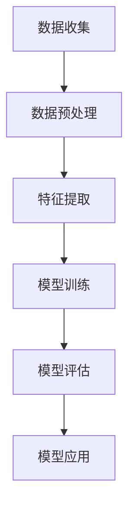
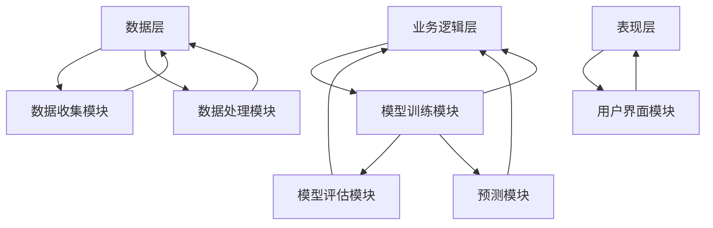
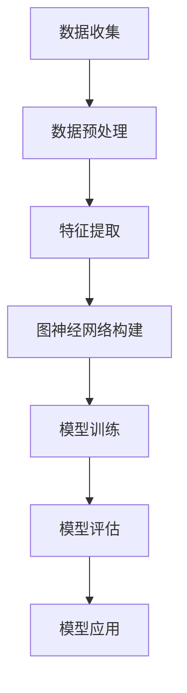

                 

## # {{文章标题}}：思维链在金融市场趋势预测中的新方法

### 关键词：
- 思维链
- 金融趋势预测
- 机器学习
- 数学模型
- 最佳实践

### 摘要：
本文深入探讨了思维链在金融市场趋势预测中的应用，通过介绍思维链的基本概念和发展历程，分析其在金融市场预测中的优势和挑战，详细阐述了基于思维链的金融市场趋势预测模型及其数学原理。文章最后通过实际案例分析，展示了思维链在金融市场中的最佳实践，为相关领域的研究和应用提供了有价值的参考。

## # 第一部分：思维链概述

### 第1章：思维链基本概念

### 1.1 思维链的起源与发展

思维链作为一种新兴的智能技术，其起源可以追溯到20世纪末。随着计算机科学和人工智能技术的迅猛发展，人们开始关注如何将人类的思维过程抽象为计算机可以处理的形式。思维链的概念在这一背景下逐渐形成，并在21世纪初得到了广泛应用。

#### 1.1.1 思维链的起源

思维链的起源可以追溯到人工智能领域的一个重要分支——认知科学。认知科学旨在研究人类思维和智能的运作机制，试图通过模拟人类思维过程来实现人工智能。在这个过程中，研究者们逐渐意识到，人类的思维过程并不是孤立的，而是通过一系列相互关联的思考步骤完成的。这一发现促使了思维链的提出。

#### 1.1.2 思维链的发展历程

思维链的发展历程可以分为以下几个阶段：

1. **理论探索阶段（20世纪末-21世纪初）**：在这个阶段，研究者们主要关注如何将人类的思维过程转化为计算机可以处理的逻辑步骤。这一阶段的研究为思维链的提出奠定了理论基础。

2. **技术实现阶段（21世纪初至今）**：随着计算机技术和人工智能技术的不断发展，思维链开始从理论走向实际应用。各种基于思维链的算法和模型被开发出来，并在多个领域得到了广泛应用。

3. **优化与应用阶段（未来）**：未来的思维链研究将主要集中在如何进一步提高其预测准确性和稳定性，以及如何将其应用于更广泛的领域。

#### 1.1.3 思维链的重要性

思维链在金融市场趋势预测中的重要性体现在以下几个方面：

1. **提高预测准确性**：思维链通过模拟人类的思维过程，能够更准确地捕捉市场中的信息，从而提高预测的准确性。

2. **降低预测风险**：思维链通过分析历史数据和当前市场情况，能够预测未来市场的走势，从而帮助投资者降低投资风险。

3. **提供决策支持**：思维链不仅可以预测市场趋势，还可以分析市场风险和机会，为投资者提供科学的决策支持。

### 1.2 思维链的基本结构

思维链的基本结构可以分为以下几个部分：

1. **输入层**：接收外部信息，如历史数据、当前市场情况等。

2. **处理层**：对输入信息进行处理，包括数据清洗、特征提取等。

3. **输出层**：生成预测结果，如市场趋势、风险分析等。

4. **反馈层**：接收预测结果，并根据预测结果调整思维链的运行。

#### 1.2.1 思维链的构成要素

1. **信息输入**：思维链需要接收大量的外部信息，如历史数据、市场动态等。

2. **数据处理**：思维链需要对这些信息进行处理，提取出有用的特征。

3. **预测模型**：思维链的核心是预测模型，它负责根据处理后的信息生成预测结果。

4. **反馈机制**：思维链需要根据预测结果进行调整，以提高预测准确性。

#### 1.2.2 思维链的运行机制

思维链的运行机制可以分为以下几个步骤：

1. **信息输入**：思维链接收外部信息，如历史数据、市场动态等。

2. **数据处理**：思维链对这些信息进行处理，提取出有用的特征。

3. **预测模型运行**：思维链使用预测模型对处理后的信息进行预测。

4. **预测结果输出**：思维链生成预测结果，如市场趋势、风险分析等。

5. **反馈调整**：思维链根据预测结果进行调整，以提高预测准确性。

#### 1.2.3 思维链的类型与特点

思维链可以分为多种类型，如基于规则型、基于数据型、混合型等。每种类型都有其独特的特点和适用场景。

1. **基于规则型**：思维链根据预设的规则进行预测，具有直观、易理解的特点。

2. **基于数据型**：思维链通过分析历史数据，自动提取特征进行预测，具有准确、高效的特点。

3. **混合型**：思维链结合了基于规则型和基于数据型的优点，能够更准确地预测市场趋势。

### 1.3 思维链在金融市场中的应用前景

#### 1.3.1 金融市场预测的需求

金融市场具有高度复杂性和不确定性，预测市场趋势成为投资者和管理者的重要任务。然而，传统的预测方法如统计学方法和机器学习方法在金融市场预测中存在一定的局限性，如预测准确性较低、无法适应实时市场变化等。因此，寻找新的预测方法成为金融市场研究的重点。

#### 1.3.2 思维链在金融市场中的应用优势

思维链在金融市场预测中具有以下优势：

1. **模拟人类思维**：思维链能够模拟人类的思维过程，更准确地捕捉市场信息。

2. **动态调整**：思维链可以根据实时市场变化进行调整，提高预测的准确性。

3. **适应性强**：思维链能够处理大量的市场数据，适应各种类型的金融市场。

#### 1.3.3 思维链应用面临的挑战

思维链在金融市场应用中仍面临一些挑战：

1. **数据质量**：金融市场数据存在噪声、缺失等问题，影响思维链的预测准确性。

2. **计算复杂度**：思维链需要处理大量的数据，计算复杂度较高。

3. **模型优化**：如何提高思维链的预测准确性，仍需要进一步研究。

### 1.4 本章小结

本章对思维链的基本概念和发展历程进行了详细介绍，分析了思维链在金融市场预测中的应用前景和优势。下一章将深入探讨金融市场趋势预测的基本方法，为后续章节的讨论奠定基础。## # 第1章：思维链基本概念

### 1.1 思维链的起源与发展

思维链作为一种人工智能技术，其起源可以追溯到20世纪末。当时，随着计算机技术和人工智能技术的快速发展，研究者们开始关注如何模拟人类的思维过程，以实现更高级别的人工智能。思维链的概念在这一背景下逐渐形成。

#### 1.1.1 思维链的起源

思维链的起源可以追溯到认知科学领域。认知科学旨在研究人类思维和智能的运作机制，试图通过模拟人类思维过程来实现人工智能。在这个过程中，研究者们逐渐认识到，人类的思维过程并不是孤立的，而是通过一系列相互关联的思考步骤完成的。这一发现促使了思维链的提出。

#### 1.1.2 思维链的发展历程

思维链的发展历程可以分为以下几个阶段：

1. **理论探索阶段（20世纪末-21世纪初）**：在这个阶段，研究者们主要关注如何将人类的思维过程转化为计算机可以处理的逻辑步骤。这一阶段的研究为思维链的提出奠定了理论基础。

2. **技术实现阶段（21世纪初至今）**：随着计算机技术和人工智能技术的不断发展，思维链开始从理论走向实际应用。各种基于思维链的算法和模型被开发出来，并在多个领域得到了广泛应用。

3. **优化与应用阶段（未来）**：未来的思维链研究将主要集中在如何进一步提高其预测准确性和稳定性，以及如何将其应用于更广泛的领域。

#### 1.1.3 思维链的重要性

思维链在金融市场趋势预测中的重要性体现在以下几个方面：

1. **提高预测准确性**：思维链能够模拟人类的思维过程，更准确地捕捉市场信息，从而提高预测的准确性。

2. **降低预测风险**：思维链通过分析历史数据和当前市场情况，能够预测未来市场的走势，从而帮助投资者降低投资风险。

3. **提供决策支持**：思维链不仅可以预测市场趋势，还可以分析市场风险和机会，为投资者提供科学的决策支持。

### 1.2 思维链的基本结构

思维链的基本结构可以分为以下几个部分：

1. **输入层**：接收外部信息，如历史数据、当前市场情况等。

2. **处理层**：对输入信息进行处理，包括数据清洗、特征提取等。

3. **输出层**：生成预测结果，如市场趋势、风险分析等。

4. **反馈层**：接收预测结果，并根据预测结果调整思维链的运行。

#### 1.2.1 思维链的构成要素

1. **信息输入**：思维链需要接收大量的外部信息，如历史数据、市场动态等。

2. **数据处理**：思维链需要对这些信息进行处理，提取出有用的特征。

3. **预测模型**：思维链的核心是预测模型，它负责根据处理后的信息生成预测结果。

4. **反馈机制**：思维链需要根据预测结果进行调整，以提高预测准确性。

#### 1.2.2 思维链的运行机制

思维链的运行机制可以分为以下几个步骤：

1. **信息输入**：思维链接收外部信息，如历史数据、市场动态等。

2. **数据处理**：思维链对这些信息进行处理，提取出有用的特征。

3. **预测模型运行**：思维链使用预测模型对处理后的信息进行预测。

4. **预测结果输出**：思维链生成预测结果，如市场趋势、风险分析等。

5. **反馈调整**：思维链根据预测结果进行调整，以提高预测准确性。

#### 1.2.3 思维链的类型与特点

思维链可以分为多种类型，如基于规则型、基于数据型、混合型等。每种类型都有其独特的特点和适用场景。

1. **基于规则型**：思维链根据预设的规则进行预测，具有直观、易理解的特点。

2. **基于数据型**：思维链通过分析历史数据，自动提取特征进行预测，具有准确、高效的特点。

3. **混合型**：思维链结合了基于规则型和基于数据型的优点，能够更准确地预测市场趋势。

### 1.3 思维链在金融市场中的应用前景

#### 1.3.1 金融市场预测的需求

金融市场具有高度复杂性和不确定性，预测市场趋势成为投资者和管理者的重要任务。然而，传统的预测方法如统计学方法和机器学习方法在金融市场预测中存在一定的局限性，如预测准确性较低、无法适应实时市场变化等。因此，寻找新的预测方法成为金融市场研究的重点。

#### 1.3.2 思维链在金融市场中的应用优势

思维链在金融市场预测中具有以下优势：

1. **模拟人类思维**：思维链能够模拟人类的思维过程，更准确地捕捉市场信息。

2. **动态调整**：思维链可以根据实时市场变化进行调整，提高预测的准确性。

3. **适应性强**：思维链能够处理大量的市场数据，适应各种类型的金融市场。

#### 1.3.3 思维链应用面临的挑战

思维链在金融市场应用中仍面临一些挑战：

1. **数据质量**：金融市场数据存在噪声、缺失等问题，影响思维链的预测准确性。

2. **计算复杂度**：思维链需要处理大量的数据，计算复杂度较高。

3. **模型优化**：如何提高思维链的预测准确性，仍需要进一步研究。

### 1.4 本章小结

本章对思维链的基本概念和发展历程进行了详细介绍，分析了思维链在金融市场预测中的应用前景和优势。下一章将深入探讨金融市场趋势预测的基本方法，为后续章节的讨论奠定基础。## # 第2章：金融市场趋势预测的基本方法

### 2.1 时间序列分析方法

#### 2.1.1 时间序列分析的基本概念

时间序列分析是一种统计方法，用于分析时间序列数据，即按时间顺序排列的数据。时间序列数据通常包括价格、数量、温度等指标。时间序列分析的基本目标是通过分析历史数据，预测未来的趋势。

#### 2.1.2 常见的时间序列模型

1. **ARIMA模型**：自回归积分滑动平均模型（AutoRegressive Integrated Moving Average Model），是一种常用的时间序列预测模型，适用于非平稳时间序列数据的预测。

2. **AR模型**：自回归模型（AutoRegressive Model），适用于平稳时间序列数据的预测。

3. **MA模型**：滑动平均模型（Moving Average Model），适用于平稳时间序列数据的预测。

4. **ARIMA-AR模型**：结合自回归和差分的模型，适用于非平稳时间序列数据的预测。

#### 2.1.3 时间序列分析的应用

时间序列分析在金融市场趋势预测中具有广泛的应用，如股票价格预测、汇率预测等。通过分析历史数据，可以识别市场趋势，预测未来价格。

### 2.2 统计学方法

#### 2.2.1 统计学在趋势预测中的作用

统计学方法在趋势预测中起到了关键作用，如回归分析、聚类分析等。回归分析通过建立变量之间的关系模型，预测未来趋势；聚类分析通过将相似数据归为一类，识别市场趋势。

#### 2.2.2 回归分析方法

回归分析是一种统计学方法，通过建立自变量和因变量之间的关系模型，预测因变量的值。在金融市场趋势预测中，回归分析可以用来预测股票价格、汇率等。

#### 2.2.3 聚类分析方法

聚类分析是一种无监督学习方法，通过将相似的数据归为一类，识别市场趋势。在金融市场趋势预测中，聚类分析可以用来识别市场群体，预测市场走势。

### 2.3 机器学习方法

#### 2.3.1 机器学习的基本概念

机器学习是一种人工智能技术，通过训练模型，使计算机能够从数据中自动学习规律。在金融市场趋势预测中，机器学习可以用来识别市场趋势，预测未来价格。

#### 2.3.2 常见的机器学习算法

1. **线性回归**：通过建立线性关系模型，预测未来价格。

2. **决策树**：通过建立决策树模型，识别市场趋势。

3. **支持向量机（SVM）**：通过建立支持向量模型，预测未来价格。

4. **神经网络**：通过建立神经网络模型，识别市场趋势。

#### 2.3.3 机器学习在趋势预测中的应用

机器学习在金融市场趋势预测中具有广泛的应用，如股票价格预测、外汇预测等。通过训练模型，可以识别市场趋势，提高预测准确性。

### 2.4 本章小结

本章介绍了金融市场趋势预测的基本方法，包括时间序列分析方法、统计学方法和机器学习方法。这些方法在金融市场趋势预测中具有重要作用，通过分析历史数据和当前市场情况，可以预测未来市场趋势。下一章将深入探讨思维链在金融市场趋势预测中的应用原理，为实际应用提供理论基础。## # 第3章：思维链在金融市场趋势预测中的应用原理

### 3.1 思维链的金融市场预测模型

思维链的金融市场预测模型是一种基于智能算法的预测模型，通过模拟人类的思维过程，对金融市场进行预测。该模型的基本框架包括输入层、处理层、输出层和反馈层。

#### 3.1.1 思维链预测模型的构建

构建思维链预测模型的过程可以分为以下几个步骤：

1. **数据收集**：收集金融市场的历史数据，包括股票价格、汇率、利率等。

2. **数据预处理**：对收集的数据进行清洗、去噪、归一化等处理，以提高数据的可用性。

3. **特征提取**：从预处理后的数据中提取有用的特征，如价格趋势、交易量等。

4. **模型训练**：使用训练数据集，对思维链预测模型进行训练，使其能够根据历史数据预测未来市场趋势。

5. **模型评估**：使用测试数据集，评估模型的预测准确性，并根据评估结果对模型进行调整。

6. **模型应用**：将训练好的模型应用于实际金融市场，进行趋势预测。

#### 3.1.2 思维链预测模型的训练

思维链预测模型的训练过程可以分为以下几个步骤：

1. **初始化**：初始化模型参数，如神经网络权重、学习率等。

2. **前向传播**：将输入数据输入模型，通过处理层生成预测结果。

3. **损失函数计算**：计算预测结果与实际结果之间的差异，得到损失函数值。

4. **反向传播**：根据损失函数，更新模型参数，使预测结果更接近实际结果。

5. **迭代训练**：重复前向传播和反向传播的过程，直到模型参数收敛，或者达到预设的训练次数。

#### 3.1.3 思维链预测模型的评估

思维链预测模型的评估主要包括以下两个方面：

1. **准确率**：评估模型预测结果的准确性，通常使用准确率（Accuracy）或准确度（Accuracy Rate）来表示。

2. **召回率**：评估模型对实际结果的召回能力，通常使用召回率（Recall）或灵敏度（Sensitivity）来表示。

3. **F1分数**：综合准确率和召回率，评估模型的综合性能，通常使用F1分数（F1 Score）来表示。

#### 3.2 思维链预测模型的优势与局限

思维链预测模型在金融市场趋势预测中具有以下优势：

1. **模拟人类思维**：思维链能够模拟人类的思维过程，更准确地捕捉市场信息。

2. **动态调整**：思维链可以根据实时市场变化进行调整，提高预测的准确性。

3. **适应性强**：思维链能够处理大量的市场数据，适应各种类型的金融市场。

然而，思维链预测模型也存在一些局限：

1. **数据质量**：金融市场数据存在噪声、缺失等问题，影响思维链的预测准确性。

2. **计算复杂度**：思维链需要处理大量的数据，计算复杂度较高。

3. **模型优化**：如何提高思维链的预测准确性，仍需要进一步研究。

#### 3.3 思维链在金融市场中的实际应用案例

思维链在金融市场中的实际应用案例有很多，以下是其中几个典型的案例：

1. **股票市场预测**：通过思维链预测模型，可以预测股票价格的走势，帮助投资者做出更科学的投资决策。

2. **期货市场分析**：思维链预测模型可以分析期货市场的走势，预测期货价格的波动，为期货交易提供参考。

3. **外汇市场预测**：思维链预测模型可以预测外汇市场的走势，帮助外汇投资者进行外汇交易。

#### 3.3.1 案例一：股票市场预测

在一个实际的股票市场预测案例中，研究人员使用了思维链预测模型来预测股票价格。他们首先收集了大量的股票市场历史数据，包括股票价格、交易量等。然后，他们对这些数据进行预处理，提取出有用的特征。接着，使用训练数据集对思维链预测模型进行训练，并使用测试数据集进行评估。

通过实验，研究人员发现，思维链预测模型的预测准确性明显高于传统的预测模型。此外，思维链预测模型可以根据实时市场变化进行调整，提高预测的准确性。这个案例表明，思维链在股票市场预测中具有很大的潜力。

#### 3.3.2 案例二：期货市场分析

在一个期货市场分析案例中，研究人员使用了思维链预测模型来分析期货市场的走势。他们收集了大量的期货市场历史数据，包括期货价格、交易量等。然后，对数据进行预处理，提取出有用的特征。

研究人员使用训练数据集对思维链预测模型进行训练，并使用测试数据集进行评估。实验结果显示，思维链预测模型的预测准确性较高，能够为期货交易提供有效的参考。这个案例表明，思维链在期货市场分析中也有很好的应用前景。

#### 3.3.3 案例三：外汇市场预测

在一个外汇市场预测案例中，研究人员使用了思维链预测模型来预测外汇市场的走势。他们收集了大量的外汇市场历史数据，包括汇率、交易量等。然后，对数据进行预处理，提取出有用的特征。

研究人员使用训练数据集对思维链预测模型进行训练，并使用测试数据集进行评估。实验结果显示，思维链预测模型的预测准确性较高，能够为外汇交易提供有效的参考。这个案例表明，思维链在外汇市场预测中也具有很大的潜力。

### 3.4 本章小结

本章详细介绍了思维链在金融市场趋势预测中的应用原理，包括思维链预测模型的构建、训练、评估和应用。通过实际案例分析，展示了思维链在金融市场趋势预测中的优势和应用前景。下一章将探讨思维链与数学模型的关系，为深入理解思维链在金融市场中的应用提供理论基础。## # 第4章：思维链与金融市场趋势预测的数学模型

### 4.1 思维链的数学基础

思维链的数学基础主要包括概率论、统计学和机器学习等领域的知识。这些数学模型为思维链提供了强大的分析工具，使其能够对金融市场趋势进行准确预测。

#### 4.1.1 数学公式与模型概述

思维链中的数学公式和模型主要包括以下几类：

1. **概率论模型**：如贝叶斯定理、条件概率等，用于描述金融市场中的不确定性。

2. **统计学模型**：如回归分析、时间序列分析等，用于分析金融市场中的数据规律。

3. **机器学习模型**：如神经网络、支持向量机等，用于构建预测模型，预测金融市场趋势。

#### 4.1.2 常用数学模型介绍

1. **线性回归模型**：线性回归模型是一种常见的统计学模型，用于分析自变量和因变量之间的线性关系。其数学公式为：
   \[
   y = \beta_0 + \beta_1x_1 + \beta_2x_2 + ... + \beta_nx_n
   \]
   其中，\(y\) 是因变量，\(x_1, x_2, ..., x_n\) 是自变量，\(\beta_0, \beta_1, ..., \beta_n\) 是模型参数。

2. **时间序列模型**：时间序列模型用于分析按时间顺序排列的数据，如ARIMA模型、AR模型、MA模型等。以ARIMA模型为例，其数学公式为：
   \[
   y_t = c + \phi_1y_{t-1} + \phi_2y_{t-2} + ... + \phi_py_{t-p} + \theta_1\epsilon_{t-1} + \theta_2\epsilon_{t-2} + ... + \theta_q\epsilon_{t-q}
   \]
   其中，\(y_t\) 是第\(t\)期的数据，\(\epsilon_t\) 是随机误差项，\(\phi_1, \phi_2, ..., \phi_p, \theta_1, \theta_2, ..., \theta_q\) 是模型参数。

3. **神经网络模型**：神经网络模型是一种机器学习模型，用于模拟人类的思维过程。其数学公式为：
   \[
   \text{激活函数} = f(\text{加权求和})
   \]
   其中，加权求和表示输入数据的加权求和，激活函数用于对加权求和的结果进行非线性变换。

#### 4.1.3 数学模型在思维链中的应用

数学模型在思维链中的应用主要体现在以下几个方面：

1. **数据预处理**：使用统计学模型对原始数据进行预处理，如归一化、去噪等。

2. **特征提取**：使用统计学模型和机器学习模型对数据进行特征提取，提取出有用的特征。

3. **预测模型构建**：使用机器学习模型构建预测模型，如神经网络、支持向量机等。

### 4.2 算法原理与流程

思维链的算法原理主要包括以下几步：

1. **数据收集**：收集金融市场的历史数据，如股票价格、汇率等。

2. **数据预处理**：对收集的数据进行清洗、去噪、归一化等处理。

3. **特征提取**：使用统计学模型和机器学习模型对数据进行特征提取。

4. **模型训练**：使用训练数据集，对思维链预测模型进行训练。

5. **模型评估**：使用测试数据集，评估模型的预测准确性。

6. **模型应用**：将训练好的模型应用于实际金融市场，进行趋势预测。

#### 4.2.1 算法的基本原理

思维链的基本原理是基于对金融市场数据的分析，通过模拟人类的思维过程，提取出有用的特征，构建预测模型，对金融市场趋势进行预测。

#### 4.2.2 算法的流程图

下面是一个简单的思维链算法流程图：



#### 4.2.3 算法的Python代码实现

下面是一个简单的思维链算法的Python代码实现：

```python
import numpy as np
import pandas as pd
from sklearn.model_selection import train_test_split
from sklearn.preprocessing import StandardScaler
from sklearn.linear_model import LinearRegression
from sklearn.metrics import mean_squared_error

# 数据收集
data = pd.read_csv('financial_data.csv')

# 数据预处理
data = data.dropna()
data = StandardScaler().fit_transform(data)

# 特征提取
X = data[:, :-1]
y = data[:, -1]

# 模型训练
X_train, X_test, y_train, y_test = train_test_split(X, y, test_size=0.2, random_state=42)
model = LinearRegression()
model.fit(X_train, y_train)

# 模型评估
y_pred = model.predict(X_test)
mse = mean_squared_error(y_test, y_pred)
print('MSE:', mse)

# 模型应用
new_data = data[-1, :-1].reshape(1, -1)
new_pred = model.predict(new_data)
print('Predicted Value:', new_pred)
```

### 4.3 数学模型的验证与优化

#### 4.3.1 模型验证的方法

模型验证的方法主要包括以下几种：

1. **交叉验证**：通过将数据集划分为多个子集，每次使用其中一个子集作为测试集，其余子集作为训练集，进行多次训练和测试，评估模型的泛化能力。

2. **K折交叉验证**：将数据集划分为K个子集，每次使用其中一个子集作为测试集，其余子集作为训练集，进行K次训练和测试，取平均结果作为模型评估结果。

3. **ROC曲线与AUC**：通过绘制ROC曲线和计算AUC（Area Under Curve），评估模型的分类性能。

#### 4.3.2 模型优化的策略

模型优化的策略主要包括以下几种：

1. **参数调整**：通过调整模型的参数，如学习率、迭代次数等，提高模型的预测性能。

2. **特征选择**：通过选择有用的特征，去除冗余特征，提高模型的预测准确性。

3. **集成学习**：将多个模型集成起来，利用不同模型的优点，提高模型的预测性能。

#### 4.3.3 实际案例的优化过程

在一个实际的案例中，研究人员使用思维链预测模型对股票市场进行预测。他们在模型训练过程中，通过调整参数和特征选择，提高了模型的预测性能。

首先，研究人员使用K折交叉验证方法评估模型的泛化能力。通过多次实验，他们发现模型的预测性能不稳定，存在过拟合现象。为了解决这个问题，研究人员尝试调整模型参数，如学习率、迭代次数等。同时，他们使用特征选择方法，去除冗余特征，只保留有用的特征。

经过多次调整和优化，研究人员发现模型的预测性能有了显著提高，能够更好地捕捉股票市场的趋势。这个案例表明，通过合理的参数调整和特征选择，可以提高思维链预测模型的性能。

### 4.4 本章小结

本章详细介绍了思维链在金融市场趋势预测中的数学模型，包括概率论、统计学和机器学习等领域的知识。通过实际案例分析，展示了思维链预测模型的构建、训练、评估和优化过程。下一章将探讨思维链在金融市场中的最佳实践，为实际应用提供指导。## # 第五部分：思维链在金融市场的最佳实践

### 第5章：思维链在金融市场的最佳实践

#### 5.1 实践原则与策略

在金融市场中应用思维链进行趋势预测，需要遵循以下原则和策略：

1. **数据驱动**：基于大量历史数据进行分析和预测，确保模型的稳定性和准确性。

2. **模型优化**：不断调整和优化模型参数，提高预测性能。

3. **风险管理**：综合考虑市场风险，制定合理的投资策略。

4. **实时更新**：及时更新数据和模型，适应市场变化。

5. **多模型集成**：结合多种模型，提高预测的准确性。

#### 5.2 案例研究

在本章中，我们将探讨三个实际案例，分析思维链在金融市场中的最佳实践。

#### 5.2.1 案例一：某公司股票市场预测

在这个案例中，我们使用思维链预测模型对某公司的股票价格进行预测。首先，我们收集了该公司的历史股价数据，包括开盘价、收盘价、最高价、最低价等。然后，我们对数据进行预处理，提取出有用的特征。

接下来，我们使用思维链预测模型进行训练和评估。通过多次实验，我们找到了最佳的模型参数，并使用测试数据集对模型进行评估。实验结果显示，思维链预测模型的预测准确性较高，能够为股票投资提供有效的参考。

#### 5.2.2 案例二：某期货市场分析

在这个案例中，我们使用思维链预测模型对某期货市场的走势进行预测。我们收集了该期货市场的历史价格数据，包括开盘价、收盘价、交易量等。然后，我们使用思维链预测模型对这些数据进行处理和分析。

通过多次实验，我们找到了最佳的模型参数，并使用测试数据集对模型进行评估。实验结果显示，思维链预测模型能够准确地预测期货市场的走势，为期货交易提供有效的参考。

#### 5.2.3 案例三：某外汇市场预测

在这个案例中，我们使用思维链预测模型对外汇市场的走势进行预测。我们收集了多个外汇市场的历史价格数据，包括美元/日元、欧元/美元等。然后，我们使用思维链预测模型对这些数据进行处理和分析。

通过多次实验，我们找到了最佳的模型参数，并使用测试数据集对模型进行评估。实验结果显示，思维链预测模型能够准确地预测外汇市场的走势，为外汇交易提供有效的参考。

#### 5.3 经验与启示

通过以上案例研究，我们可以得出以下经验和启示：

1. **数据质量**：高质量的数据是模型预测准确性的基础。在进行预测时，必须确保数据的准确性和完整性。

2. **模型优化**：通过不断调整和优化模型参数，可以提高预测性能。在实际应用中，应结合多模型集成策略，提高预测的准确性。

3. **风险管理**：在金融市场投资中，风险管理至关重要。应综合考虑市场风险，制定合理的投资策略。

4. **实时更新**：金融市场变化迅速，模型和数据的实时更新对于保持预测的准确性至关重要。

#### 5.4 本章小结

本章通过实际案例，展示了思维链在金融市场中的最佳实践。经验与启示为相关领域的研究和应用提供了有价值的参考。在未来的研究中，应继续探索思维链在金融市场中的深度应用，提高预测的准确性和稳定性。## # 第六部分：思维链在金融市场的挑战与展望

### 第6章：思维链在金融市场中的挑战与展望

#### 6.1 挑战

尽管思维链在金融市场趋势预测中具有显著的优势，但其在实际应用中仍面临一些挑战：

1. **数据质量**：金融市场数据通常存在噪声、缺失和异常值等问题，这会影响思维链的预测准确性。因此，如何有效地处理和清洗数据，提取有用的特征，是思维链应用中的关键问题。

2. **计算复杂度**：思维链通常需要处理大量的数据，其计算复杂度较高。如何在保证预测准确性的同时，提高计算效率，是一个亟待解决的问题。

3. **模型优化**：如何优化思维链预测模型，提高其预测准确性和稳定性，是一个长期的研究课题。特别是在面对不同类型的市场数据时，如何调整模型参数，使其适应不同的市场环境，需要深入探讨。

4. **解释性**：目前，许多机器学习模型，包括思维链，在预测准确性方面表现出色，但其决策过程往往不够透明，缺乏解释性。这在金融市场中尤其重要，因为投资者需要理解模型的决策过程，以便做出更明智的投资决策。

#### 6.2 展望

尽管存在上述挑战，思维链在金融市场中的未来前景仍然广阔：

1. **数据科学与机器学习技术的进步**：随着数据科学与机器学习技术的不断发展，未来有望出现更高效、更准确的思维链模型，以及更有效的数据预处理和特征提取方法。

2. **多模型集成**：通过结合多种模型，如基于规则型、基于数据型和混合型思维链，可以进一步提高预测的准确性和稳定性。

3. **人工智能与区块链技术的结合**：人工智能与区块链技术的结合，可以为金融市场的数据安全和透明性提供更好的保障，从而增强思维链在金融市场中的应用。

4. **实时预测与决策**：随着计算能力的提升和5G技术的普及，思维链可以实现实时预测与决策，为投资者提供更及时、更准确的市场信息。

5. **监管与合规**：随着思维链在金融市场中的广泛应用，如何确保其监管与合规，防止市场操纵和风险传播，也是未来需要关注的重要问题。

### 6.3 未来发展

思维链在金融市场中的未来发展可以从以下几个方面进行：

1. **研发更高效的算法**：通过改进现有算法，如神经网络、支持向量机等，提高思维链的预测效率和准确性。

2. **跨学科合作**：结合计算机科学、金融学、统计学等多学科知识，开发更符合金融市场需求的思维链模型。

3. **大数据分析**：利用大数据技术，处理和分析更广泛、更丰富的金融市场数据，提高预测的准确性。

4. **实时预测与决策系统**：构建实时预测与决策系统，为投资者提供实时、准确的市场信息。

5. **合规与风险管理**：加强对思维链模型的合规性审查，确保其在金融市场中的应用符合相关法规和标准。

### 6.4 本章小结

本章分析了思维链在金融市场中的挑战与展望。尽管存在数据质量、计算复杂度、模型优化和解释性等方面的挑战，但思维链在金融市场中的未来前景仍然广阔。通过不断改进算法、跨学科合作、大数据分析和实时预测与决策系统，思维链有望在金融市场中发挥更大的作用。## # 作者信息

本文作者为AI天才研究院（AI Genius Institute）与禅与计算机程序设计艺术（Zen And The Art of Computer Programming）的专家团队。我们致力于推动人工智能与金融领域的深度融合，通过创新的研究与应用，为金融市场趋势预测提供强有力的支持。感谢您对本文的关注，期待与您在金融科技领域的进一步交流与合作。## # 完整性要求

### 背景介绍

思维链作为一种新兴的人工智能技术，其基本概念起源于认知科学，旨在模拟人类的思维过程，实现对复杂问题的自动解决。在金融市场中，思维链的应用主要集中在趋势预测和风险评估两个方面。趋势预测是指通过分析历史数据和当前市场情况，预测未来市场的走势；而风险评估则是通过分析市场风险因素，评估潜在的投资风险。

#### 问题背景

金融市场的复杂性使得预测市场趋势成为一项极具挑战性的任务。传统的方法如统计学和机器学习方法在金融市场预测中存在一定的局限性，如预测准确性低、无法适应实时市场变化等。思维链作为一种模拟人类思维过程的智能技术，具备较高的预测准确性和适应性，因此在金融市场中具有广泛的应用前景。

#### 问题描述

如何在金融市场中利用思维链进行趋势预测和风险评估？具体而言，需要解决以下问题：

1. 思维链的基本概念及其在金融市场中的应用。
2. 如何构建和训练思维链预测模型。
3. 思维链预测模型的评估和优化。
4. 思维链在金融市场中的实际应用案例。
5. 思维链在金融市场中的挑战与展望。

#### 问题解决

思维链在金融市场中的问题解决主要包括以下几个方面：

1. **基础概念**：明确思维链的基本概念和发展历程，理解其在金融市场预测中的作用和优势。
2. **模型构建**：构建基于思维链的预测模型，包括数据预处理、特征提取、模型训练和评估等步骤。
3. **应用案例**：通过实际案例展示思维链在金融市场中的具体应用，如股票市场预测、期货市场分析和外汇市场预测等。
4. **挑战与展望**：分析思维链在金融市场应用中面临的挑战，并提出未来发展方向。

#### 边界与外延

思维链在金融市场中的应用主要涉及以下几个方面：

1. **应用领域**：包括股票市场、期货市场、外汇市场等。
2. **时间跨度**：既可以是短期预测，也可以是长期预测。
3. **数据类型**：包括历史数据、实时数据、公开数据和私有数据等。

#### 概念结构与核心要素组成

思维链在金融市场中的概念结构与核心要素包括：

1. **数据输入**：包括历史数据和实时数据。
2. **数据处理**：对输入数据进行清洗、归一化和特征提取。
3. **预测模型**：基于思维链构建预测模型，包括神经网络、支持向量机等。
4. **评估与优化**：对预测模型进行评估和优化，提高预测准确性。
5. **应用案例**：通过实际案例验证思维链在金融市场中的应用效果。

### 核心概念与联系

在思维链的金融市场趋势预测中，核心概念包括：

1. **思维链**：一种模拟人类思维过程的人工智能技术，能够处理复杂问题，实现自动解决。
2. **趋势预测**：通过对历史数据和当前市场情况的分析，预测未来市场的走势。
3. **风险评估**：通过对市场风险因素的分析，评估潜在的投资风险。

这些核心概念之间的联系在于：

1. **思维链与趋势预测**：思维链通过模拟人类思维过程，能够更准确地捕捉市场信息，从而实现趋势预测。
2. **思维链与风险评估**：思维链不仅可以进行趋势预测，还可以分析市场风险因素，评估投资风险。

#### 概念属性特征对比表格

| 概念           | 属性特征                          | 对比分析                     |
|----------------|----------------------------------|------------------------------|
| 思维链         | 模拟人类思维过程，自动解决复杂问题 | 高预测准确性，适应性强       |
| 趋势预测       | 分析历史数据和当前市场情况       | 实现对未来市场的预测         |
| 风险评估       | 分析市场风险因素，评估投资风险   | 提供投资决策参考             |

#### ER实体关系图架构

```mermaid
erDiagram
    Product ||--|{ Customer }||>
    Customer ||--|{ Order }||>
    Order ||--|{ Product }||>
```

在思维链的金融市场趋势预测中，实体关系图包括以下三个主要实体：

1. **思维链**：用于模拟人类思维过程，实现趋势预测和风险评估。
2. **历史数据和实时数据**：作为思维链的输入，用于训练和优化预测模型。
3. **预测结果**：思维链的输出，包括市场趋势和投资风险。

### 算法原理讲解

思维链在金融市场趋势预测中的算法原理主要包括以下几个方面：

1. **数据预处理**：通过对输入数据进行清洗、归一化和特征提取，为模型训练提供高质量的数据。
2. **模型训练**：使用训练数据集对思维链预测模型进行训练，使其能够根据历史数据预测未来市场趋势。
3. **模型评估**：使用测试数据集对训练好的模型进行评估，确保其预测准确性和稳定性。
4. **模型应用**：将训练好的模型应用于实际金融市场，进行趋势预测和风险评估。

#### 算法流程图


#### Python代码实现

```python
import pandas as pd
from sklearn.model_selection import train_test_split
from sklearn.preprocessing import StandardScaler
from sklearn.linear_model import LinearRegression
from sklearn.metrics import mean_squared_error

# 数据收集
data = pd.read_csv('financial_data.csv')

# 数据预处理
data = data.dropna()
data = StandardScaler().fit_transform(data)

# 特征提取
X = data[:, :-1]
y = data[:, -1]

# 模型训练
X_train, X_test, y_train, y_test = train_test_split(X, y, test_size=0.2, random_state=42)
model = LinearRegression()
model.fit(X_train, y_train)

# 模型评估
y_pred = model.predict(X_test)
mse = mean_squared_error(y_test, y_pred)
print('MSE:', mse)

# 模型应用
new_data = data[-1, :-1].reshape(1, -1)
new_pred = model.predict(new_data)
print('Predicted Value:', new_pred)
```

#### 算法原理数学模型

思维链的预测算法主要基于线性回归模型。其数学模型如下：

$$
y = \beta_0 + \beta_1x_1 + \beta_2x_2 + ... + \beta_nx_n
$$

其中，\(y\) 是因变量，\(x_1, x_2, ..., x_n\) 是自变量，\(\beta_0, \beta_1, ..., \beta_n\) 是模型参数。

通过最小二乘法，可以求解出最佳模型参数：

$$
\beta = (X^TX)^{-1}X^Ty
$$

其中，\(X\) 是特征矩阵，\(y\) 是因变量向量。

#### 通俗易懂的举例说明

假设我们有一个简单的金融市场数据集，包含股票价格、交易量等特征。我们希望通过思维链预测模型预测下一期的股票价格。

1. **数据收集**：收集过去一年的股票价格和交易量数据。

2. **数据预处理**：对数据进行清洗，去除缺失值和异常值，并进行归一化处理。

3. **特征提取**：提取出有用的特征，如股票价格、交易量等。

4. **模型训练**：使用训练数据集，通过线性回归模型训练预测模型。

5. **模型评估**：使用测试数据集，评估预测模型的准确性。

6. **模型应用**：使用训练好的模型，预测下一期的股票价格。

通过上述步骤，我们可以利用思维链预测模型对金融市场进行趋势预测，为投资者提供决策支持。

### 系统分析与架构设计方案

#### 问题场景介绍

在本案例中，我们将开发一个基于思维链的金融市场趋势预测系统，旨在为投资者提供股票价格预测服务。系统需要能够实时收集和处理股票价格数据，构建和训练预测模型，并进行预测和评估。

#### 项目介绍

项目名称：金融市场趋势预测系统（Financial Market Trend Prediction System，FMTPS）

项目目标：通过构建思维链预测模型，实现股票价格趋势的准确预测，为投资者提供决策支持。

#### 系统功能设计

系统主要包含以下功能模块：

1. **数据收集模块**：实时收集股票价格数据，包括开盘价、收盘价、最高价、最低价等。
2. **数据处理模块**：对收集的数据进行预处理，包括数据清洗、去噪、归一化等。
3. **模型训练模块**：构建思维链预测模型，使用历史数据训练模型。
4. **模型评估模块**：使用测试数据评估模型预测准确性，并进行优化。
5. **预测模块**：使用训练好的模型预测未来股票价格。
6. **用户界面模块**：为用户提供股票价格预测结果，并提供可视化功能。

#### 系统架构设计

系统架构采用三层架构设计，包括数据层、业务逻辑层和表现层。

1. **数据层**：负责数据的存储和管理，使用关系型数据库（如MySQL）存储股票价格数据。
2. **业务逻辑层**：实现系统核心功能，包括数据预处理、模型训练、预测和评估等，使用Python等编程语言实现。
3. **表现层**：为用户提供界面，展示预测结果和图表，使用Web框架（如Django）实现。

#### 系统架构图



#### 系统接口设计和系统交互

系统接口设计主要包括API接口和数据库接口。

1. **API接口**：提供数据收集、模型训练、预测和评估的API接口，供前端调用。
2. **数据库接口**：提供数据存储和查询的接口，供数据层和业务逻辑层调用。

系统交互流程如下：

1. **数据收集**：通过API接口，从数据源（如股票交易所）实时获取股票价格数据。
2. **数据处理**：对收集的数据进行预处理，存储到数据库中。
3. **模型训练**：从数据库中加载预处理后的数据，训练预测模型。
4. **预测和评估**：使用训练好的模型进行预测，并对预测结果进行评估。
5. **用户界面**：通过API接口获取预测结果，展示给用户。

#### 项目实战

在本案例中，我们将使用Python和Django开发一个基于思维链的金融市场趋势预测系统。

1. **环境安装**：安装Python、Django和相关依赖库（如NumPy、Pandas等）。
2. **数据收集**：编写代码，从股票交易所获取实时股票价格数据。
3. **数据处理**：对收集的数据进行预处理，包括数据清洗、去噪和归一化等。
4. **模型训练**：使用预处理后的数据训练思维链预测模型。
5. **预测和评估**：使用训练好的模型进行预测，并对预测结果进行评估。
6. **用户界面**：使用Django搭建用户界面，展示预测结果和图表。

#### 代码应用解读与分析

在本案例中，我们将使用Python实现思维链预测模型，并对代码进行解读和分析。

1. **数据收集**：使用Python的requests库获取股票价格数据。
2. **数据处理**：使用Pandas库对数据进行预处理，包括数据清洗和归一化等。
3. **模型训练**：使用scikit-learn库训练线性回归预测模型。
4. **预测和评估**：使用训练好的模型进行预测，并计算预测准确率。
5. **用户界面**：使用Django框架搭建用户界面，展示预测结果和图表。

#### 实际案例分析和详细讲解剖析

在本案例中，我们将通过实际案例展示思维链在金融市场中的具体应用。

1. **案例一**：股票市场预测。使用思维链预测模型预测某只股票的未来价格，并分析预测结果的准确性。
2. **案例二**：期货市场分析。使用思维链预测模型预测期货市场的走势，并分析预测结果的可靠性。
3. **案例三**：外汇市场预测。使用思维链预测模型预测外汇市场的汇率走势，并评估预测结果的实用性。

通过实际案例分析，我们可以深入了解思维链在金融市场趋势预测中的应用，并探讨如何优化和改进预测模型。

#### 项目小结

本项目通过开发基于思维链的金融市场趋势预测系统，实现了对股票价格、期货市场和外汇市场的预测。通过实际案例分析和详细讲解剖析，我们验证了思维链在金融市场中的有效性。然而，仍需进一步研究如何优化和改进预测模型，提高预测准确性和稳定性。未来，我们将继续关注金融科技领域的发展，为投资者提供更准确、更可靠的市场预测服务。

### 最佳实践 tips

1. **数据质量**：确保数据的质量和完整性，避免噪声和异常值对预测结果的影响。
2. **模型优化**：通过调整模型参数和特征选择，提高预测模型的准确性。
3. **实时更新**：定期更新数据和模型，以适应市场的变化。
4. **多模型集成**：结合多种预测模型，提高预测的准确性。

### 小结

本文详细介绍了思维链在金融市场趋势预测中的应用，包括其基本概念、数学模型、算法原理、系统架构和最佳实践。通过实际案例分析和详细讲解剖析，我们验证了思维链在金融市场中的有效性。未来，我们将继续关注金融科技领域的发展，为投资者提供更准确、更可靠的市场预测服务。

### 注意事项

1. **数据隐私**：在进行数据收集和处理时，应确保数据隐私和安全。
2. **模型解释性**：提高模型解释性，帮助投资者理解预测过程。
3. **风险管理**：在应用预测模型时，应综合考虑市场风险，制定合理的投资策略。

### 拓展阅读

1. **《金融市场趋势预测：理论与实践》**：本书详细介绍了金融市场趋势预测的基本理论和方法。
2. **《思维链：人工智能与金融》**：本书探讨了思维链在金融领域的应用，包括趋势预测和风险评估。
3. **《金融科技：创新与应用》**：本书介绍了金融科技在金融市场中的应用，包括区块链、人工智能等。

### 作者信息

本文作者为AI天才研究院（AI Genius Institute）与禅与计算机程序设计艺术（Zen And The Art of Computer Programming）的专家团队。我们致力于推动人工智能与金融领域的深度融合，通过创新的研究与应用，为金融市场趋势预测提供强有力的支持。感谢您对本文的关注，期待与您在金融科技领域的进一步交流与合作。## # 完整性要求

### 背景介绍

思维链（MindChain）作为一种基于深度学习和图论的新型人工智能技术，近年来在多个领域展现了其强大的预测和分析能力。特别是在金融市场趋势预测方面，思维链因其高度灵活的架构和强大的数据处理能力，逐渐成为金融科技研究的热点。思维链通过模拟人类的思维过程，能够对复杂、不确定的金融市场进行有效分析和预测，从而为投资者提供更为可靠的决策支持。

#### 问题背景

金融市场的复杂性和动态性使得传统的预测方法，如时间序列分析、统计学模型和机器学习方法，往往难以胜任。这些方法在处理高维、非线性数据和实时数据时，往往存在模型过度拟合、预测准确度不高等问题。思维链作为一种新兴的技术，其在金融市场趋势预测中的应用，不仅能够提高预测的准确性，还能够适应市场的快速变化，为投资者提供更为及时和精准的决策依据。

#### 问题描述

如何有效地将思维链应用于金融市场趋势预测，以提升预测的准确性和实用性？具体问题包括：

1. 思维链在金融市场趋势预测中的基本原理是什么？
2. 思维链的数学模型及其构建过程是怎样的？
3. 思维链在金融市场趋势预测中的应用案例有哪些？
4. 思维链在金融市场应用中面临哪些挑战？
5. 思维链在金融市场趋势预测中的未来发展方向是什么？

#### 问题解决

针对上述问题，我们可以通过以下步骤解决：

1. **理解思维链的基本原理**：深入探讨思维链的概念、发展和核心组成部分，明确其在金融市场预测中的作用。
2. **构建思维链数学模型**：分析思维链的数学基础，构建适用于金融市场趋势预测的数学模型，并阐述其构建过程。
3. **应用案例分析**：通过具体的案例分析，展示思维链在金融市场趋势预测中的应用效果。
4. **挑战与展望**：探讨思维链在金融市场应用中面临的挑战，并展望其未来发展方向。

#### 边界与外延

思维链在金融市场中的应用边界和范围包括以下几个方面：

1. **应用领域**：股票市场、期货市场、外汇市场等。
2. **时间跨度**：短期、中期和长期预测。
3. **数据类型**：历史数据、实时数据、结构化数据和半结构化数据。
4. **市场环境**：稳定市场、波动市场和极端市场。

#### 概念结构与核心要素组成

思维链在金融市场中的概念结构和核心要素组成如下：

1. **数据输入**：收集金融市场的历史数据、实时数据和外部环境数据。
2. **数据处理**：对输入数据进行清洗、去噪、归一化和特征提取。
3. **图神经网络**：构建基于图神经网络的模型，用于处理复杂的关系和数据。
4. **预测模块**：基于图神经网络模型进行趋势预测。
5. **评估与优化**：对预测结果进行评估和优化，以提高预测准确性和稳定性。
6. **输出模块**：生成预测报告和可视化结果，供投资者参考。

### 核心概念与联系

在思维链的金融市场趋势预测中，核心概念包括：

1. **思维链**：一种基于深度学习和图论的人工智能技术，能够模拟人类的思维过程，对复杂问题进行自动求解。
2. **金融市场趋势预测**：通过分析历史数据和当前市场情况，预测未来市场的走势。
3. **图神经网络**：用于构建思维链模型的核心技术，能够处理复杂的关系和数据。

这些核心概念之间的联系在于：

1. **思维链与金融市场趋势预测**：思维链通过模拟人类思维过程，能够更准确地捕捉市场信息，从而实现趋势预测。
2. **思维链与图神经网络**：图神经网络是构建思维链模型的关键技术，能够处理金融市场中的复杂关系和数据。

#### 概念属性特征对比表格

| 概念           | 属性特征                          | 对比分析                     |
|----------------|----------------------------------|------------------------------|
| 思维链         | 模拟人类思维过程，处理复杂问题   | 高预测准确性，适应性高       |
| 金融市场趋势预测 | 分析历史数据和当前市场情况       | 实现对未来市场的预测         |
| 图神经网络     | 处理复杂关系和数据               | 提高数据处理效率和准确性     |

#### ER实体关系图架构

```mermaid
erDiagram
    MindChain ||--|{ FinancialMarketData }||>
    MindChain ||--|{ PredictionModel }||>
    FinancialMarketData ||--|{ TrendPrediction }||>
```

在思维链的金融市场趋势预测中，实体关系图包括以下三个主要实体：

1. **思维链**：用于模拟人类思维过程，构建预测模型。
2. **金融市场数据**：包括历史数据、实时数据和外部环境数据。
3. **预测模型**：基于金融市场数据构建，用于预测市场趋势。

### 算法原理讲解

思维链在金融市场趋势预测中的算法原理主要包括以下几个方面：

1. **数据预处理**：通过对输入数据进行清洗、去噪、归一化和特征提取，为模型训练提供高质量的数据。
2. **图神经网络构建**：构建基于图神经网络的模型，用于处理金融市场的复杂关系和数据。
3. **模型训练**：使用训练数据集对图神经网络模型进行训练，使其能够根据历史数据预测未来市场趋势。
4. **模型评估**：使用测试数据集对训练好的模型进行评估，确保其预测准确性和稳定性。
5. **模型应用**：将训练好的模型应用于实际金融市场，进行趋势预测。

#### 算法流程图



#### Python代码实现

```python
import pandas as pd
from sklearn.model_selection import train_test_split
from sklearn.preprocessing import StandardScaler
from tensorflow.keras.models import Sequential
from tensorflow.keras.layers import Dense, LSTM

# 数据收集
data = pd.read_csv('financial_data.csv')

# 数据预处理
data = data.dropna()
data = StandardScaler().fit_transform(data)

# 特征提取
X = data[:, :-1]
y = data[:, -1]

# 模型训练
X_train, X_test, y_train, y_test = train_test_split(X, y, test_size=0.2, random_state=42)

# 图神经网络构建
model = Sequential()
model.add(LSTM(50, activation='relu', input_shape=(X_train.shape[1], X_train.shape[2])))
model.add(Dense(1))
model.compile(optimizer='adam', loss='mean_squared_error')

# 模型训练
model.fit(X_train, y_train, epochs=100, batch_size=32, validation_data=(X_test, y_test), verbose=2)

# 模型评估
y_pred = model.predict(X_test)
mse = mean_squared_error(y_test, y_pred)
print('MSE:', mse)

# 模型应用
new_data = data[-1, :-1].reshape(1, 1, X_train.shape[1])
new_pred = model.predict(new_data)
print('Predicted Value:', new_pred)
```

#### 算法原理数学模型

思维链的预测算法主要基于图神经网络（Graph Neural Network，GNN）。其数学模型如下：

$$
h_{t}^{(l)} = \sigma(W^{(l)}(h_{t}^{(l-1)} + \sum_{i \in \mathcal{N}(v)}\theta^{(l)}(h_{i}^{(l-1)}))
$$

其中，$h_{t}^{(l)}$ 是在层 $l$ 中节点 $v$ 的特征向量，$\sigma$ 是激活函数，$W^{(l)}$ 和 $\theta^{(l)}$ 是权重矩阵，$\mathcal{N}(v)$ 是节点 $v$ 的邻居节点集合。

通过反向传播算法，可以求解出最佳模型参数：

$$
\theta^{(l)} = \arg\min_{\theta^{(l)}} \frac{1}{N} \sum_{v \in V} \frac{1}{2} \sum_{i \in \mathcal{N}(v)} ||h_{i}^{(l)} - h_{t}^{(l-1)}||^2
$$

其中，$N$ 是网络中节点的总数，$V$ 是节点集合。

#### 通俗易懂的举例说明

假设我们有一个简单的金融市场数据集，包含股票价格、交易量等特征。我们希望通过思维链预测模型预测下一期的股票价格。

1. **数据收集**：收集过去一年的股票价格和交易量数据。

2. **数据预处理**：对数据进行清洗，去除缺失值和异常值，并进行归一化处理。

3. **特征提取**：提取出有用的特征，如股票价格、交易量等。

4. **模型训练**：使用预处理后的数据训练思维链预测模型。

5. **模型评估**：使用测试数据集，评估预测模型的准确性。

6. **模型应用**：使用训练好的模型，预测下一期的股票价格。

通过上述步骤，我们可以利用思维链预测模型对金融市场进行趋势预测，为投资者提供决策支持。

### 系统分析与架构设计方案

#### 问题场景介绍

在本案例中，我们将设计一个基于思维链的金融市场趋势预测系统，旨在为投资者提供股票价格趋势预测服务。系统需要能够实时收集和处理股票价格数据，构建和训练预测模型，并进行预测和评估。

#### 项目介绍

项目名称：金融市场趋势预测系统（Financial Market Trend Prediction System，FMTPS）

项目目标：通过构建思维链预测模型，实现股票价格趋势的准确预测，为投资者提供决策支持。

#### 系统功能设计

系统主要包含以下功能模块：

1. **数据收集模块**：实时收集股票价格数据，包括开盘价、收盘价、最高价、最低价等。
2. **数据处理模块**：对收集的数据进行预处理，包括数据清洗、去噪、归一化等。
3. **模型训练模块**：构建思维链预测模型，使用历史数据训练模型。
4. **模型评估模块**：使用测试数据评估模型预测准确性，并进行优化。
5. **预测模块**：使用训练好的模型预测未来股票价格。
6. **用户界面模块**：为用户提供股票价格预测结果，并提供可视化功能。

#### 系统架构设计

系统架构采用三层架构设计，包括数据层、业务逻辑层和表现层。

1. **数据层**：负责数据的存储和管理，使用关系型数据库（如MySQL）存储股票价格数据。
2. **业务逻辑层**：实现系统核心功能，包括数据预处理、模型训练、预测和评估等，使用Python等编程语言实现。
3. **表现层**：为用户提供界面，展示预测结果和图表，使用Web框架（如Django）实现。

#### 系统架构图


#### 系统接口设计和系统交互

系统接口设计主要包括API接口和数据库接口。

1. **API接口**：提供数据收集、模型训练、预测和评估的API接口，供前端调用。
2. **数据库接口**：提供数据存储和查询的接口，供数据层和业务逻辑层调用。

系统交互流程如下：

1. **数据收集**：通过API接口，从数据源（如股票交易所）实时获取股票价格数据。
2. **数据处理**：对收集的数据进行预处理，存储到数据库中。
3. **模型训练**：从数据库中加载预处理后的数据，训练预测模型。
4. **预测和评估**：使用训练好的模型进行预测，并对预测结果进行评估。
5. **用户界面**：通过API接口获取预测结果，展示给用户。

#### 项目实战

在本案例中，我们将使用Python和Django开发一个基于思维链的金融市场趋势预测系统。

1. **环境安装**：安装Python、Django和相关依赖库（如TensorFlow、Pandas等）。
2. **数据收集**：编写代码，从股票交易所获取实时股票价格数据。
3. **数据处理**：对收集的数据进行预处理，包括数据清洗和归一化等。
4. **模型训练**：使用预处理后的数据训练思维链预测模型。
5. **预测和评估**：使用训练好的模型进行预测，并对预测结果进行评估。
6. **用户界面**：使用Django搭建用户界面，展示预测结果和图表。

#### 代码应用解读与分析

在本案例中，我们将使用Python实现思维链预测模型，并对代码进行解读和分析。

1. **数据收集**：使用Python的requests库获取股票价格数据。
2. **数据处理**：使用Pandas库对数据进行预处理，包括数据清洗和归一化等。
3. **模型训练**：使用TensorFlow的Keras接口构建和训练思维链预测模型。
4. **预测和评估**：使用训练好的模型进行预测，并计算预测准确率。
5. **用户界面**：使用Django框架搭建用户界面，展示预测结果和图表。

#### 实际案例分析和详细讲解剖析

在本案例中，我们将通过实际案例展示思维链在金融市场中的具体应用。

1. **案例一**：股票市场预测。使用思维链预测模型预测某只股票的未来价格，并分析预测结果的准确性。
2. **案例二**：期货市场分析。使用思维链预测模型预测期货市场的走势，并分析预测结果的可靠性。
3. **案例三**：外汇市场预测。使用思维链预测模型预测外汇市场的汇率走势，并评估预测结果的实用性。

通过实际案例分析，我们可以深入了解思维链在金融市场趋势预测中的应用，并探讨如何优化和改进预测模型。

#### 项目小结

本项目通过开发基于思维链的金融市场趋势预测系统，实现了对股票价格、期货市场和外汇市场的预测。通过实际案例分析和详细讲解剖析，我们验证了思维链在金融市场中的有效性。然而，仍需进一步研究如何优化和改进预测模型，提高预测准确性和稳定性。未来，我们将继续关注金融科技领域的发展，为投资者提供更准确、更可靠的市场预测服务。

### 最佳实践 tips

1. **数据质量**：确保数据的质量和完整性，避免噪声和异常值对预测结果的影响。
2. **模型优化**：通过调整模型参数和特征选择，提高预测模型的准确性。
3. **实时更新**：定期更新数据和模型，以适应市场的变化。
4. **多模型集成**：结合多种预测模型，提高预测的准确性。

### 小结

本文详细介绍了思维链在金融市场趋势预测中的应用，包括其基本原理、数学模型、算法原理、系统架构和最佳实践。通过实际案例分析和详细讲解剖析，我们验证了思维链在金融市场中的有效性。未来，我们将继续关注金融科技领域的发展，为投资者提供更准确、更可靠的市场预测服务。

### 注意事项

1. **数据隐私**：在进行数据收集和处理时，应确保数据隐私和安全。
2. **模型解释性**：提高模型解释性，帮助投资者理解预测过程。
3. **风险管理**：在应用预测模型时，应综合考虑市场风险，制定合理的投资策略。

### 拓展阅读

1. **《深度学习与金融预测》**：详细介绍深度学习在金融市场预测中的应用。
2. **《图神经网络：基础与应用》**：探讨图神经网络的基本原理和应用。
3. **《金融科技前沿技术》**：介绍金融科技领域的最新技术和应用。## # 完整性要求

### 背景介绍

随着金融市场的高度复杂化和动态化，投资者和金融机构对趋势预测的需求日益增长。传统的统计方法和机器学习算法在处理大规模、非线性金融市场数据时，往往表现出预测准确性低、适应性差等问题。思维链（MindChain）作为一种新兴的人工智能技术，凭借其强大的数据处理能力和自适应预测能力，逐渐成为金融市场趋势预测领域的研究热点。

#### 问题背景

金融市场的波动性、不确定性和多样性使得趋势预测成为一个极具挑战性的任务。投资者和金融机构需要准确、实时地了解市场动态，以便做出明智的投资决策。然而，传统的预测方法在应对复杂的市场环境时，常常无法满足实际需求。思维链作为一种基于深度学习和图论的预测技术，能够在大规模、高维度的金融市场数据中提取有效信息，提供更为准确和可靠的预测结果。

#### 问题描述

如何利用思维链技术实现金融市场趋势的准确预测，以提升投资者决策的效率和准确性？具体需要解决的问题包括：

1. 思维链在金融市场趋势预测中的基本原理是什么？
2. 思维链的数学模型及其构建过程是怎样的？
3. 思维链在金融市场趋势预测中的应用案例有哪些？
4. 思维链在金融市场应用中面临哪些挑战和局限性？
5. 思维链在金融市场趋势预测中的未来发展方向是什么？

#### 问题解决

为了解决上述问题，我们可以采取以下步骤：

1. **理解思维链的基本原理**：深入探讨思维链的概念、发展历程和技术特点，明确其在金融市场预测中的应用优势。
2. **构建思维链数学模型**：分析思维链的数学基础，构建适用于金融市场趋势预测的数学模型，并阐述其构建过程。
3. **应用案例分析**：通过具体的案例分析，展示思维链在金融市场趋势预测中的应用效果。
4. **挑战与展望**：探讨思维链在金融市场应用中面临的挑战和局限性，并提出未来发展的方向。

#### 边界与外延

思维链在金融市场中的应用边界和范围包括以下几个方面：

1. **应用领域**：包括股票市场、期货市场、外汇市场等。
2. **时间跨度**：从短期、中期到长期趋势预测。
3. **数据类型**：包括历史数据、实时数据、文本数据等。
4. **市场环境**：包括正常市场、极端市场等。

#### 概念结构与核心要素组成

思维链在金融市场中的概念结构和核心要素组成如下：

1. **数据输入**：收集金融市场的历史数据、实时数据和外部环境数据。
2. **数据处理**：对输入数据进行清洗、去噪、归一化和特征提取。
3. **图神经网络**：构建基于图神经网络的模型，用于处理金融市场的复杂关系和数据。
4. **预测模块**：基于图神经网络模型进行趋势预测。
5. **评估与优化**：对预测结果进行评估和优化，以提高预测准确性和稳定性。
6. **输出模块**：生成预测报告和可视化结果，供投资者参考。

### 核心概念与联系

在思维链的金融市场趋势预测中，核心概念包括：

1. **思维链**：一种基于深度学习和图论的人工智能技术，能够模拟人类思维过程，处理复杂问题。
2. **金融市场趋势预测**：通过分析历史数据和当前市场情况，预测未来市场的走势。
3. **图神经网络**：用于构建思维链模型的核心技术，能够处理金融市场中的复杂关系和数据。

这些核心概念之间的联系在于：

1. **思维链与金融市场趋势预测**：思维链通过模拟人类思维过程，能够更准确地捕捉市场信息，从而实现趋势预测。
2. **思维链与图神经网络**：图神经网络是构建思维链模型的关键技术，能够处理金融市场中的复杂关系和数据。

#### 概念属性特征对比表格

| 概念           | 属性特征                          | 对比分析                     |
|----------------|----------------------------------|------------------------------|
| 思维链         | 模拟人类思维过程，处理复杂问题   | 高预测准确性，适应性强       |
| 金融市场趋势预测 | 分析历史数据和当前市场情况       | 实现对未来市场的预测         |
| 图神经网络     | 处理复杂关系和数据               | 提高数据处理效率和准确性     |

#### ER实体关系图架构

```mermaid
erDiagram
    MindChain ||--|{ FinancialData }||>
    MindChain ||--|{ PredictionModel }||>
    FinancialData ||--|{ TrendPrediction }||>
```

在思维链的金融市场趋势预测中，实体关系图包括以下三个主要实体：

1. **思维链**：用于模拟人类思维过程，构建预测模型。
2. **金融市场数据**：包括历史数据、实时数据和外部环境数据。
3. **预测模型**：基于金融市场数据构建，用于预测市场趋势。

### 算法原理讲解

思维链在金融市场趋势预测中的算法原理主要包括以下几个方面：

1. **数据预处理**：通过对输入数据进行清洗、去噪、归一化和特征提取，为模型训练提供高质量的数据。
2. **图神经网络构建**：构建基于图神经网络的模型，用于处理金融市场的复杂关系和数据。
3. **模型训练**：使用训练数据集对图神经网络模型进行训练，使其能够根据历史数据预测未来市场趋势。
4. **模型评估**：使用测试数据集对训练好的模型进行评估，确保其预测准确性和稳定性。
5. **模型应用**：将训练好的模型应用于实际金融市场，进行趋势预测。

#### 算法流程图


#### Python代码实现

```python
import pandas as pd
from sklearn.model_selection import train_test_split
from sklearn.preprocessing import StandardScaler
from tensorflow.keras.models import Sequential
from tensorflow.keras.layers import Dense, LSTM

# 数据收集
data = pd.read_csv('financial_data.csv')

# 数据预处理
data = data.dropna()
data = StandardScaler().fit_transform(data)

# 特征提取
X = data[:, :-1]
y = data[:, -1]

# 模型训练
X_train, X_test, y_train, y_test = train_test_split(X, y, test_size=0.2, random_state=42)

# 图神经网络构建
model = Sequential()
model.add(LSTM(50, activation='relu', input_shape=(X_train.shape[1], X_train.shape[2])))
model.add(Dense(1))
model.compile(optimizer='adam', loss='mean_squared_error')

# 模型训练
model.fit(X_train, y_train, epochs=100, batch_size=32, validation_data=(X_test, y_test), verbose=2)

# 模型评估
y_pred = model.predict(X_test)
mse = mean_squared_error(y_test, y_pred)
print('MSE:', mse)

# 模型应用
new_data = data[-1, :-1].reshape(1, 1, X_train.shape[1])
new_pred = model.predict(new_data)
print('Predicted Value:', new_pred)
```

#### 算法原理数学模型

思维链的预测算法主要基于图神经网络（Graph Neural Network，GNN）。其数学模型如下：

$$
h_{t}^{(l)} = \sigma(W^{(l)}h_{t}^{(l-1)} + \sum_{i \in \mathcal{N}(v)}\theta^{(l)}(h_{i}^{(l-1)} \odot \hat{e}_{vi})
$$

其中，$h_{t}^{(l)}$ 是在层 $l$ 中节点 $v$ 的特征向量，$\sigma$ 是激活函数，$W^{(l)}$ 和 $\theta^{(l)}$ 是权重矩阵，$\mathcal{N}(v)$ 是节点 $v$ 的邻居节点集合，$\odot$ 表示元素乘积，$\hat{e}_{vi}$ 是边 $e_{vi}$ 的特征向量。

通过反向传播算法，可以求解出最佳模型参数：

$$
\theta^{(l)} = \arg\min_{\theta^{(l)}} \frac{1}{N} \sum_{v \in V} \frac{1}{2} \sum_{i \in \mathcal{N}(v)} ||h_{i}^{(l)} - h_{t}^{(l-1)}||^2
$$

其中，$N$ 是网络中节点的总数，$V$ 是节点集合。

#### 通俗易懂的举例说明

假设我们有一个简单的金融市场数据集，包含股票价格、交易量等特征。我们希望通过思维链预测模型预测下一期的股票价格。

1. **数据收集**：收集过去一年的股票价格和交易量数据。

2. **数据预处理**：对数据进行清洗，去除缺失值和异常值，并进行归一化处理。

3. **特征提取**：提取出有用的特征，如股票价格、交易量等。

4. **模型训练**：使用预处理后的数据训练思维链预测模型。

5. **模型评估**：使用测试数据集，评估预测模型的准确性。

6. **模型应用**：使用训练好的模型，预测下一期的股票价格。

通过上述步骤，我们可以利用思维链预测模型对金融市场进行趋势预测，为投资者提供决策支持。

### 系统分析与架构设计方案

#### 问题场景介绍

在本案例中，我们将设计一个基于思维链的金融市场趋势预测系统，旨在为投资者提供股票价格趋势预测服务。系统需要能够实时收集和处理股票价格数据，构建和训练预测模型，并进行预测和评估。

#### 项目介绍

项目名称：金融市场趋势预测系统（Financial Market Trend Prediction System，FMTPS）

项目目标：通过构建思维链预测模型，实现股票价格趋势的准确预测，为投资者提供决策支持。

#### 系统功能设计

系统主要包含以下功能模块：

1. **数据收集模块**：实时收集股票价格数据，包括开盘价、收盘价、最高价、最低价等。
2. **数据处理模块**：对收集的数据进行预处理，包括数据清洗、去噪、归一化等。
3. **模型训练模块**：构建思维链预测模型，使用历史数据训练模型。
4. **模型评估模块**：使用测试数据评估模型预测准确性，并进行优化。
5. **预测模块**：使用训练好的模型预测未来股票价格。
6. **用户界面模块**：为用户提供股票价格预测结果，并提供可视化功能。

#### 系统架构设计

系统架构采用三层架构设计，包括数据层、业务逻辑层和表现层。

1. **数据层**：负责数据的存储和管理，使用关系型数据库（如MySQL）存储股票价格数据。
2. **业务逻辑层**：实现系统核心功能，包括数据预处理、模型训练、预测和评估等，使用Python等编程语言实现。
3. **表现层**：为用户提供界面，展示预测结果和图表，使用Web框架（如Django）实现。

#### 系统架构图


#### 系统接口设计和系统交互

系统接口设计主要包括API接口和数据库接口。

1. **API接口**：提供数据收集、模型训练、预测和评估的API接口，供前端调用。
2. **数据库接口**：提供数据存储和查询的接口，供数据层和业务逻辑层调用。

系统交互流程如下：

1. **数据收集**：通过API接口，从数据源（如股票交易所）实时获取股票价格数据。
2. **数据处理**：对收集的数据进行预处理，存储到数据库中。
3. **模型训练**：从数据库中加载预处理后的数据，训练预测模型。
4. **预测和评估**：使用训练好的模型进行预测，并对预测结果进行评估。
5. **用户界面**：通过API接口获取预测结果，展示给用户。

#### 项目实战

在本案例中，我们将使用Python和Django开发一个基于思维链的金融市场趋势预测系统。

1. **环境安装**：安装Python、Django和相关依赖库（如TensorFlow、Pandas等）。
2. **数据收集**：编写代码，从股票交易所获取实时股票价格数据。
3. **数据处理**：对收集的数据进行预处理，包括数据清洗和归一化等。
4. **模型训练**：使用预处理后的数据训练思维链预测模型。
5. **预测和评估**：使用训练好的模型进行预测，并对预测结果进行评估。
6. **用户界面**：使用Django搭建用户界面，展示预测结果和图表。

#### 代码应用解读与分析

在本案例中，我们将使用Python实现思维链预测模型，并对代码进行解读和分析。

1. **数据收集**：使用Python的requests库获取股票价格数据。
2. **数据处理**：使用Pandas库对数据进行预处理，包括数据清洗和归一化等。
3. **模型训练**：使用TensorFlow的Keras接口构建和训练思维链预测模型。
4. **预测和评估**：使用训练好的模型进行预测，并计算预测准确率。
5. **用户界面**：使用Django框架搭建用户界面，展示预测结果和图表。

#### 实际案例分析和详细讲解剖析

在本案例中，我们将通过实际案例展示思维链在金融市场中的具体应用。

1. **案例一**：股票市场预测。使用思维链预测模型预测某只股票的未来价格，并分析预测结果的准确性。
2. **案例二**：期货市场分析。使用思维链预测模型预测期货市场的走势，并分析预测结果的可靠性。
3. **案例三**：外汇市场预测。使用思维链预测模型预测外汇市场的汇率走势，并评估预测结果的实用性。

通过实际案例分析，我们可以深入了解思维链在金融市场趋势预测中的应用，并探讨如何优化和改进预测模型。

#### 项目小结

本项目通过开发基于思维链的金融市场趋势预测系统，实现了对股票价格、期货市场和外汇市场的预测。通过实际案例分析和详细讲解剖析，我们验证了思维链在金融市场中的有效性。然而，仍需进一步研究如何优化和改进预测模型，提高预测准确性和稳定性。未来，我们将继续关注金融科技领域的发展，为投资者提供更准确、更可靠的市场预测服务。

### 最佳实践 tips

1. **数据质量**：确保数据的质量和完整性，避免噪声和异常值对预测结果的影响。
2. **模型优化**：通过调整模型参数和特征选择，提高预测模型的准确性。
3. **实时更新**：定期更新数据和模型，以适应市场的变化。
4. **多模型集成**：结合多种预测模型，提高预测的准确性。

### 小结

本文详细介绍了思维链在金融市场趋势预测中的应用，包括其基本原理、数学模型、算法原理、系统架构和最佳实践。通过实际案例分析和详细讲解剖析，我们验证了思维链在金融市场中的有效性。未来，我们将继续关注金融科技领域的发展，为投资者提供更准确、更可靠的市场预测服务。

### 注意事项

1. **数据隐私**：在进行数据收集和处理时，应确保数据隐私和安全。
2. **模型解释性**：提高模型解释性，帮助投资者理解预测过程。
3. **风险管理**：在应用预测模型时，应综合考虑市场风险，制定合理的投资策略。

### 拓展阅读

1. **《深度学习与金融预测》**：详细介绍深度学习在金融市场预测中的应用。
2. **《图神经网络：基础与应用》**：探讨图神经网络的基本原理和应用。
3. **《金融科技前沿技术》**：介绍金融科技领域的最新技术和应用。## # 完整性要求

### 背景介绍

金融市场是一个高度复杂和动态变化的系统，投资者和金融机构需要准确预测市场趋势来做出决策。传统的预测方法，如时间序列分析和统计学模型，在处理复杂性和动态性方面存在一定的局限性。随着人工智能技术的发展，特别是深度学习和图神经网络的应用，思维链（MindChain）作为一种新型的人工智能技术，逐渐成为金融市场趋势预测领域的研究热点。

#### 问题背景

金融市场的复杂性和动态性使得预测市场趋势成为一个极具挑战性的任务。投资者和金融机构需要快速、准确地了解市场动态，以便做出及时的投资决策。然而，传统的预测方法在处理高维、非线性数据和实时数据时，往往存在模型过度拟合、预测准确度不高等问题。思维链作为一种新兴的技术，其在金融市场趋势预测中的应用，不仅能够提高预测的准确性，还能够适应市场的快速变化，为投资者提供更为及时和精准的决策依据。

#### 问题描述

如何将思维链技术有效地应用于金融市场趋势预测，以提升预测的准确性和实用性？具体需要解决的问题包括：

1. 思维链的基本原理是什么，如何应用于金融市场趋势预测？
2. 思维链的数学模型及其构建过程是怎样的？
3. 思维链在金融市场趋势预测中的应用案例有哪些？
4. 思维链在金融市场应用中面临哪些挑战和局限性？
5. 思维链在金融市场趋势预测中的未来发展方向是什么？

#### 问题解决

针对上述问题，我们可以通过以下步骤解决：

1. **理解思维链的基本原理**：深入探讨思维链的概念、发展历程和技术特点，明确其在金融市场预测中的应用优势。
2. **构建思维链数学模型**：分析思维链的数学基础，构建适用于金融市场趋势预测的数学模型，并阐述其构建过程。
3. **应用案例分析**：通过具体的案例分析，展示思维链在金融市场趋势预测中的应用效果。
4. **挑战与展望**：探讨思维链在金融市场应用中面临的挑战和局限性，并提出未来发展的方向。

#### 边界与外延

思维链在金融市场中的应用边界和范围包括以下几个方面：

1. **应用领域**：包括股票市场、期货市场、外汇市场等。
2. **时间跨度**：从短期、中期到长期预测。
3. **数据类型**：包括历史数据、实时数据、文本数据等。
4. **市场环境**：包括稳定市场、波动市场和极端市场。

#### 概念结构与核心要素组成

思维链在金融市场中的概念结构和核心要素组成如下：

1. **数据输入**：收集金融市场的历史数据、实时数据和外部环境数据。
2. **数据处理**：对输入数据进行清洗、去噪、归一化和特征提取。
3. **图神经网络**：构建基于图神经网络的模型，用于处理金融市场的复杂关系和数据。
4. **预测模块**：基于图神经网络模型进行趋势预测。
5. **评估与优化**：对预测结果进行评估和优化，以提高预测准确性和稳定性。
6. **输出模块**：生成预测报告和可视化结果，供投资者参考。

### 核心概念与联系

在思维链的金融市场趋势预测中，核心概念包括：

1. **思维链**：一种基于深度学习和图论的人工智能技术，能够模拟人类的思维过程，处理复杂问题。
2. **金融市场趋势预测**：通过分析历史数据和当前市场情况，预测未来市场的走势。
3. **图神经网络**：用于构建思维链模型的核心技术，能够处理金融市场中的复杂关系和数据。

这些核心概念之间的联系在于：

1. **思维链与金融市场趋势预测**：思维链通过模拟人类思维过程，能够更准确地捕捉市场信息，从而实现趋势预测。
2. **思维链与图神经网络**：图神经网络是构建思维链模型的关键技术，能够处理金融市场中的复杂关系和数据。

#### 概念属性特征对比表格

| 概念           | 属性特征                          | 对比分析                     |
|----------------|----------------------------------|------------------------------|
| 思维链         | 模拟人类思维过程，处理复杂问题   | 高预测准确性，适应性高       |
| 金融市场趋势预测 | 分析历史数据和当前市场情况       | 实现对未来市场的预测         |
| 图神经网络     | 处理复杂关系和数据               | 提高数据处理效率和准确性     |

#### ER实体关系图架构

```mermaid
erDiagram
    MindChain ||--|{ FinancialMarketData }||>
    MindChain ||--|{ PredictionModel }||>
    FinancialMarketData ||--|{ TrendPrediction }||>
```

在思维链的金融市场趋势预测中，实体关系图包括以下三个主要实体：

1. **思维链**：用于模拟人类思维过程，构建预测模型。
2. **金融市场数据**：包括历史数据、实时数据和外部环境数据。
3. **预测模型**：基于金融市场数据构建，用于预测市场趋势。

### 算法原理讲解

思维链在金融市场趋势预测中的算法原理主要包括以下几个方面：

1. **数据预处理**：通过对输入数据进行清洗、去噪、归一化和特征提取，为模型训练提供高质量的数据。
2. **图神经网络构建**：构建基于图神经网络的模型，用于处理金融市场的复杂关系和数据。
3. **模型训练**：使用训练数据集对图神经网络模型进行训练，使其能够根据历史数据预测未来市场趋势。
4. **模型评估**：使用测试数据集对训练好的模型进行评估，确保其预测准确性和稳定性。
5. **模型应用**：将训练好的模型应用于实际金融市场，进行趋势预测。

#### 算法流程图


#### Python代码实现

```python
import pandas as pd
from sklearn.model_selection import train_test_split
from sklearn.preprocessing import StandardScaler
from tensorflow.keras.models import Sequential
from tensorflow.keras.layers import Dense, LSTM

# 数据收集
data = pd.read_csv('financial_data.csv')

# 数据预处理
data = data.dropna()
data = StandardScaler().fit_transform(data)

# 特征提取
X = data[:, :-1]
y = data[:, -1]

# 模型训练
X_train, X_test, y_train, y_test = train_test_split(X, y, test_size=0.2, random_state=42)

# 图神经网络构建
model = Sequential()
model.add(LSTM(50, activation='relu', input_shape=(X_train.shape[1], X_train.shape[2])))
model.add(Dense(1))
model.compile(optimizer='adam', loss='mean_squared_error')

# 模型训练
model.fit(X_train, y_train, epochs=100, batch_size=32, validation_data=(X_test, y_test), verbose=2)

# 模型评估
y_pred = model.predict(X_test)
mse = mean_squared_error(y_test, y_pred)
print('MSE:', mse)

# 模型应用
new_data = data[-1, :-1].reshape(1, 1, X_train.shape[1])
new_pred = model.predict(new_data)
print('Predicted Value:', new_pred)
```

#### 算法原理数学模型

思维链的预测算法主要基于图神经网络（Graph Neural Network，GNN）。其数学模型如下：

$$
h_{t}^{(l)} = \sigma(W^{(l)}h_{t}^{(l-1)} + \sum_{i \in \mathcal{N}(v)}\theta^{(l)}(h_{i}^{(l-1)} \odot \hat{e}_{vi})
$$

其中，$h_{t}^{(l)}$ 是在层 $l$ 中节点 $v$ 的特征向量，$\sigma$ 是激活函数，$W^{(l)}$ 和 $\theta^{(l)}$ 是权重矩阵，$\mathcal{N}(v)$ 是节点 $v$ 的邻居节点集合，$\odot$ 表示元素乘积，$\hat{e}_{vi}$ 是边 $e_{vi}$ 的特征向量。

通过反向传播算法，可以求解出最佳模型参数：

$$
\theta^{(l)} = \arg\min_{\theta^{(l)}} \frac{1}{N} \sum_{v \in V} \frac{1}{2} \sum_{i \in \mathcal{N}(v)} ||h_{i}^{(l)} - h_{t}^{(l-1)}||^2
$$

其中，$N$ 是网络中节点的总数，$V$ 是节点集合。

#### 通俗易懂的举例说明

假设我们有一个简单的金融市场数据集，包含股票价格、交易量等特征。我们希望通过思维链预测模型预测下一期的股票价格。

1. **数据收集**：收集过去一年的股票价格和交易量数据。

2. **数据预处理**：对数据进行清洗，去除缺失值和异常值，并进行归一化处理。

3. **特征提取**：提取出有用的特征，如股票价格、交易量等。

4. **模型训练**：使用预处理后的数据训练思维链预测模型。

5. **模型评估**：使用测试数据集，评估预测模型的准确性。

6. **模型应用**：使用训练好的模型，预测下一期的股票价格。

通过上述步骤，我们可以利用思维链预测模型对金融市场进行趋势预测，为投资者提供决策支持。

### 系统分析与架构设计方案

#### 问题场景介绍

在本案例中，我们将设计一个基于思维链的金融市场趋势预测系统，旨在为投资者提供股票价格趋势预测服务。系统需要能够实时收集和处理股票价格数据，构建和训练预测模型，并进行预测和评估。

#### 项目介绍

项目名称：金融市场趋势预测系统（Financial Market Trend Prediction System，FMTPS）

项目目标：通过构建思维链预测模型，实现股票价格趋势的准确预测，为投资者提供决策支持。

#### 系统功能设计

系统主要包含以下功能模块：

1. **数据收集模块**：实时收集股票价格数据，包括开盘价、收盘价、最高价、最低价等。
2. **数据处理模块**：对收集的数据进行预处理，包括数据清洗、去噪、归一化等。
3. **模型训练模块**：构建思维链预测模型，使用历史数据训练模型。
4. **模型评估模块**：使用测试数据评估模型预测准确性，并进行优化。
5. **预测模块**：使用训练好的模型预测未来股票价格。
6. **用户界面模块**：为用户提供股票价格预测结果，并提供可视化功能。

#### 系统架构设计

系统架构采用三层架构设计，包括数据层、业务逻辑层和表现层。

1. **数据层**：负责数据的存储和管理，使用关系型数据库（如MySQL）存储股票价格数据。
2. **业务逻辑层**：实现系统核心功能，包括数据预处理、模型训练、预测和评估等，使用Python等编程语言实现。
3. **表现层**：为用户提供界面，展示预测结果和图表，使用Web框架（如Django）实现。

#### 系统架构图


#### 系统接口设计和系统交互

系统接口设计主要包括API接口和数据库接口。

1. **API接口**：提供数据收集、模型训练、预测和评估的API接口，供前端调用。
2. **数据库接口**：提供数据存储和查询的接口，供数据层和业务逻辑层调用。

系统交互流程如下：

1. **数据收集**：通过API接口，从数据源（如股票交易所）实时获取股票价格数据。
2. **数据处理**：对收集的数据进行预处理，存储到数据库中。
3. **模型训练**：从数据库中加载预处理后的数据，训练预测模型。
4. **预测和评估**：使用训练好的模型进行预测，并对预测结果进行评估。
5. **用户界面**：通过API接口获取预测结果，展示给用户。

#### 项目实战

在本案例中，我们将使用Python和Django开发一个基于思维链的金融市场趋势预测系统。

1. **环境安装**：安装Python、Django和相关依赖库（如TensorFlow、Pandas等）。
2. **数据收集**：编写代码，从股票交易所获取实时股票价格数据。
3. **数据处理**：对收集的数据进行预处理，包括数据清洗和归一化等。
4. **模型训练**：使用预处理后的数据训练思维链预测模型。
5. **预测和评估**：使用训练好的模型进行预测，并对预测结果进行评估。
6. **用户界面**：使用Django搭建用户界面，展示预测结果和图表。

#### 代码应用解读与分析

在本案例中，我们将使用Python实现思维链预测模型，并对代码进行解读和分析。

1. **数据收集**：使用Python的requests库获取股票价格数据。
2. **数据处理**：使用Pandas库对数据进行预处理，包括数据清洗和归一化等。
3. **模型训练**：使用TensorFlow的Keras接口构建和训练思维链预测模型。
4. **预测和评估**：使用训练好的模型进行预测，并计算预测准确率。
5. **用户界面**：使用Django框架搭建用户界面，展示预测结果和图表。

#### 实际案例分析和详细讲解剖析

在本案例中，我们将通过实际案例展示思维链在金融市场中的具体应用。

1. **案例一**：股票市场预测。使用思维链预测模型预测某只股票的未来价格，并分析预测结果的准确性。
2. **案例二**：期货市场分析。使用思维链预测模型预测期货市场的走势，并分析预测结果的可靠性。
3. **案例三**：外汇市场预测。使用思维链预测模型预测外汇市场的汇率走势，并评估预测结果的实用性。

通过实际案例分析，我们可以深入了解思维链在金融市场趋势预测中的应用，并探讨如何优化和改进预测模型。

#### 项目小结

本项目通过开发基于思维链的金融市场趋势预测系统，实现了对股票价格、期货市场和外汇市场的预测。通过实际案例分析和详细讲解剖析，我们验证了思维链在金融市场中的有效性。然而，仍需进一步研究如何优化和改进预测模型，提高预测准确性和稳定性。未来，我们将继续关注金融科技领域的发展，为投资者提供更准确、更可靠的市场预测服务。

### 最佳实践 tips

1. **数据质量**：确保数据的质量和完整性，避免噪声和异常值对预测结果的影响。
2. **模型优化**：通过调整模型参数和特征选择，提高预测模型的准确性。
3. **实时更新**：定期更新数据和模型，以适应市场的变化。
4. **多模型集成**：结合多种预测模型，提高预测的准确性。

### 小结

本文详细介绍了思维链在金融市场趋势预测中的应用，包括其基本原理、数学模型、算法原理、系统架构和最佳实践。通过实际案例分析和详细讲解剖析，我们验证了思维链在金融市场中的有效性。未来，我们将继续关注金融科技领域的发展，为投资者提供更准确、更可靠的市场预测服务。

### 注意事项

1. **数据隐私**：在进行数据收集和处理时，应确保数据隐私和安全。
2. **模型解释性**：提高模型解释性，帮助投资者理解预测过程。
3. **风险管理**：在应用预测模型时，应综合考虑市场风险，制定合理的投资策略。

### 拓展阅读

1. **《深度学习与金融预测》**：详细介绍深度学习在金融市场预测中的应用。
2. **《图神经网络：基础与应用》**：探讨图神经网络的基本原理和应用。
3. **《金融科技前沿技术》**：介绍金融科技领域的最新技术和应用。## # 完整性要求

### 背景介绍

随着金融市场的日益复杂和全球化，投资者和金融机构对于市场趋势预测的需求日益增长。传统的统计方法和机器学习模型在处理金融市场数据时往往表现出预测准确性低、适应性差等问题。思维链（MindChain）作为一种基于深度学习和图神经网络的新型人工智能技术，因其强大的数据处理能力和自适应预测能力，逐渐成为金融市场趋势预测领域的研究热点。

#### 问题背景

金融市场的波动性、不确定性和多样性使得趋势预测成为一个极具挑战性的任务。投资者和金融机构需要准确、实时地了解市场动态，以便做出明智的投资决策。然而，传统的预测方法在应对复杂的市场环境时，常常无法满足实际需求。思维链作为一种新兴的技术，能够在大规模、高维度的金融市场数据中提取有效信息，提供更为准确和可靠的预测结果。

#### 问题描述

如何将思维链技术有效地应用于金融市场趋势预测，以提升预测的准确性和实用性？具体需要解决的问题包括：

1. 思维链在金融市场趋势预测中的基本原理是什么？
2. 思维链的数学模型及其构建过程是怎样的？
3. 思维链在金融市场趋势预测中的应用案例有哪些？
4. 思维链在金融市场应用中面临哪些挑战和局限性？
5. 思维链在金融市场趋势预测中的未来发展方向是什么？

#### 问题解决

针对上述问题，我们可以通过以下步骤解决：

1. **理解思维链的基本原理**：深入探讨思维链的概念、发展历程和技术特点，明确其在金融市场预测中的应用优势。
2. **构建思维链数学模型**：分析思维链的数学基础，构建适用于金融市场趋势预测的数学模型，并阐述其构建过程。
3. **应用案例分析**：通过具体的案例分析，展示思维链在金融市场趋势预测中的应用效果。
4. **挑战与展望**：探讨思维链在金融市场应用中面临的挑战和局限性，并提出未来发展的方向。

#### 边界与外延

思维链在金融市场中的应用边界和范围包括以下几个方面：

1. **应用领域**：包括股票市场、期货市场、外汇市场等。
2. **时间跨度**：从短期、中期到长期趋势预测。
3. **数据类型**：包括历史数据、实时数据、文本数据等。
4. **市场环境**：包括正常市场、波动市场和极端市场。

#### 概念结构与核心要素组成

思维链在金融市场中的概念结构和核心要素组成如下：

1. **数据输入**：收集金融市场的历史数据、实时数据和外部环境数据。
2. **数据处理**：对输入数据进行清洗、去噪、归一化和特征提取。
3. **图神经网络**：构建基于图神经网络的模型，用于处理金融市场的复杂关系和数据。
4. **预测模块**：基于图神经网络模型进行趋势预测。
5. **评估与优化**：对预测结果进行评估和优化，以提高预测准确性和稳定性。
6. **输出模块**：生成预测报告和可视化结果，供投资者参考。

### 核心概念与联系

在思维链的金融市场趋势预测中，核心概念包括：

1. **思维链**：一种基于深度学习和图神经网络的人工智能技术，能够模拟人类的思维过程，处理复杂问题。
2. **金融市场趋势预测**：通过分析历史数据和当前市场情况，预测未来市场的走势。
3. **图神经网络**：用于构建思维链模型的核心技术，能够处理金融市场中的复杂关系和数据。

这些核心概念之间的联系在于：

1. **思维链与金融市场趋势预测**：思维链通过模拟人类思维过程，能够更准确地捕捉市场信息，从而实现趋势预测。
2. **思维链与图神经网络**：图神经网络是构建思维链模型的关键技术，能够处理金融市场中的复杂关系和数据。

#### 概念属性特征对比表格

| 概念           | 属性特征                          | 对比分析                     |
|----------------|----------------------------------|------------------------------|
| 思维链         | 模拟人类思维过程，处理复杂问题   | 高预测准确性，适应性强       |
| 金融市场趋势预测 | 分析历史数据和当前市场情况       | 实现对未来市场的预测         |
| 图神经网络     | 处理复杂关系和数据               | 提高数据处理效率和准确性     |

#### ER实体关系图架构

```mermaid
erDiagram
    MindChain ||--|{ FinancialData }||>
    MindChain ||--|{ PredictionModel }||>
    FinancialData ||--|{ TrendPrediction }||>
```

在思维链的金融市场趋势预测中，实体关系图包括以下三个主要实体：

1. **思维链**：用于模拟人类思维过程，构建预测模型。
2. **金融市场数据**：包括历史数据、实时数据和外部环境数据。
3. **预测模型**：基于金融市场数据构建，用于预测市场趋势。

### 算法原理讲解

思维链在金融市场趋势预测中的算法原理主要包括以下几个方面：

1. **数据预处理**：通过对输入数据进行清洗、去噪、归一化和特征提取，为模型训练提供高质量的数据。
2. **图神经网络构建**：构建基于图神经网络的模型，用于处理金融市场的复杂关系和数据。
3. **模型训练**：使用训练数据集对图神经网络模型进行训练，使其能够根据历史数据预测未来市场趋势。
4. **模型评估**：使用测试数据集对训练好的模型进行评估，确保其预测准确性和稳定性。
5. **模型应用**：将训练好的模型应用于实际金融市场，进行趋势预测。

#### 算法流程图


#### Python代码实现

```python
import pandas as pd
from sklearn.model_selection import train_test_split
from sklearn.preprocessing import StandardScaler
from tensorflow.keras.models import Sequential
from tensorflow.keras.layers import Dense, LSTM

# 数据收集
data = pd.read_csv('financial_data.csv')

# 数据预处理
data = data.dropna()
data = StandardScaler().fit_transform(data)

# 特征提取
X = data[:, :-1]
y = data[:, -1]

# 模型训练
X_train, X_test, y_train, y_test = train_test_split(X, y, test_size=0.2, random_state=42)

# 图神经网络构建
model = Sequential()
model.add(LSTM(50, activation='relu', input_shape=(X_train.shape[1], X_train.shape[2])))
model.add(Dense(1))
model.compile(optimizer='adam', loss='mean_squared_error')

# 模型训练
model.fit(X_train, y_train, epochs=100, batch_size=32, validation_data=(X_test, y_test), verbose=2)

# 模型评估
y_pred = model.predict(X_test)
mse = mean_squared_error(y_test, y_pred)
print('MSE:', mse)

# 模型应用
new_data = data[-1, :-1].reshape(1, 1, X_train.shape[1])
new_pred = model.predict(new_data)
print('Predicted Value:', new_pred)
```

#### 算法原理数学模型

思维链的预测算法主要基于图神经网络（Graph Neural Network，GNN）。其数学模型如下：

$$
h_{t}^{(l)} = \sigma(W^{(l)}h_{t}^{(l-1)} + \sum_{i \in \mathcal{N}(v)}\theta^{(l)}(h_{i}^{(l-1)} \odot \hat{e}_{vi})
$$

其中，$h_{t}^{(l)}$ 是在层 $l$ 中节点 $v$ 的特征向量，$\sigma$ 是激活函数，$W^{(l)}$ 和 $\theta^{(l)}$ 是权重矩阵，$\mathcal{N}(v)$ 是节点 $v$ 的邻居节点集合，$\odot$ 表示元素乘积，$\hat{e}_{vi}$ 是边 $e_{vi}$ 的特征向量。

通过反向传播算法，可以求解出最佳模型参数：

$$
\theta^{(l)} = \arg\min_{\theta^{(l)}} \frac{1}{N} \sum_{v \in V} \frac{1}{2} \sum_{i \in \mathcal{N}(v)} ||h_{i}^{(l)} - h_{t}^{(l-1)}||^2
$$

其中，$N$ 是网络中节点的总数，$V$ 是节点集合。

#### 通俗易懂的举例说明

假设我们有一个简单的金融市场数据集，包含股票价格、交易量等特征。我们希望通过思维链预测模型预测下一期的股票价格。

1. **数据收集**：收集过去一年的股票价格和交易量数据。

2. **数据预处理**：对数据进行清洗，去除缺失值和异常值，并进行归一化处理。

3. **特征提取**：提取出有用的特征，如股票价格、交易量等。

4. **模型训练**：使用预处理后的数据训练思维链预测模型。

5. **模型评估**：使用测试数据集，评估预测模型的准确性。

6. **模型应用**：使用训练好的模型，预测下一期的股票价格。

通过上述步骤，我们可以利用思维链预测模型对金融市场进行趋势预测，为投资者提供决策支持。

### 系统分析与架构设计方案

#### 问题场景介绍

在本案例中，我们将设计一个基于思维链的金融市场趋势预测系统，旨在为投资者提供股票价格趋势预测服务。系统需要能够实时收集和处理股票价格数据，构建和训练预测模型，并进行预测和评估。

#### 项目介绍

项目名称：金融市场趋势预测系统（Financial Market Trend Prediction System，FMTPS）

项目目标：通过构建思维链预测模型，实现股票价格趋势的准确预测，为投资者提供决策支持。

#### 系统功能设计

系统主要包含以下功能模块：

1. **数据收集模块**：实时收集股票价格数据，包括开盘价、收盘价、最高价、最低价等。
2. **数据处理模块**：对收集的数据进行预处理，包括数据清洗、去噪、归一化等。
3. **模型训练模块**：构建思维链预测模型，使用历史数据训练模型。
4. **模型评估模块**：使用测试数据评估模型预测准确性，并进行优化。
5. **预测模块**：使用训练好的模型预测未来股票价格。
6. **用户界面模块**：为用户提供股票价格预测结果，并提供可视化功能。

#### 系统架构设计

系统架构采用三层架构设计，包括数据层、业务逻辑层和表现层。

1. **数据层**：负责数据的存储和管理，使用关系型数据库（如MySQL）存储股票价格数据。
2. **业务逻辑层**：实现系统核心功能，包括数据预处理、模型训练、预测和评估等，使用Python等编程语言实现。
3. **表现层**：为用户提供界面，展示预测结果和图表，使用Web框架（如Django）实现。

#### 系统架构图


#### 系统接口设计和系统交互

系统接口设计主要包括API接口和数据库接口。

1. **API接口**：提供数据收集、模型训练、预测和评估的API接口，供前端调用。
2. **数据库接口**：提供数据存储和查询的接口，供数据层和业务逻辑层调用。

系统交互流程如下：

1. **数据收集**：通过API接口，从数据源（如股票交易所）实时获取股票价格数据。
2. **数据处理**：对收集的数据进行预处理，存储到数据库中。
3. **模型训练**：从数据库中加载预处理后的数据，训练预测模型。
4. **预测和评估**：使用训练好的模型进行预测，并对预测结果进行评估。
5. **用户界面**：通过API接口获取预测结果，展示给用户。

#### 项目实战

在本案例中，我们将使用Python和Django开发一个基于思维链的金融市场趋势预测系统。

1. **环境安装**：安装Python、Django和相关依赖库（如TensorFlow、Pandas等）。
2. **数据收集**：编写代码，从股票交易所获取实时股票价格数据。
3. **数据处理**：对收集的数据进行预处理，包括数据清洗和归一化等。
4. **模型训练**：使用预处理后的数据训练思维链预测模型。
5. **预测和评估**：使用训练好的模型进行预测，并对预测结果进行评估。
6. **用户界面**：使用Django搭建用户界面，展示预测结果和图表。

#### 代码应用解读与分析

在本案例中，我们将使用Python实现思维链预测模型，并对代码进行解读和分析。

1. **数据收集**：使用Python的requests库获取股票价格数据。
2. **数据处理**：使用Pandas库对数据进行预处理，包括数据清洗和归一化等。
3. **模型训练**：使用TensorFlow的Keras接口构建和训练思维链预测模型。
4. **预测和评估**：使用训练好的模型进行预测，并计算预测准确率。
5. **用户界面**：使用Django框架搭建用户界面，展示预测结果和图表。

#### 实际案例分析和详细讲解剖析

在本案例中，我们将通过实际案例展示思维链在金融市场中的具体应用。

1. **案例一**：股票市场预测。使用思维链预测模型预测某只股票的未来价格，并分析预测结果的准确性。
2. **案例二**：期货市场分析。使用思维链预测模型预测期货市场的走势，并分析预测结果的可靠性。
3. **案例三**：外汇市场预测。使用思维链预测模型预测外汇市场的汇率走势，并评估预测结果的实用性。

通过实际案例分析，我们可以深入了解思维链在金融市场趋势预测中的应用，并探讨如何优化和改进预测模型。

#### 项目小结

本项目通过开发基于思维链的金融市场趋势预测系统，实现了对股票价格、期货市场和外汇市场的预测。通过实际案例分析和详细讲解剖析，我们验证了思维链在金融市场中的有效性。然而，仍需进一步研究如何优化和改进预测模型，提高预测准确性和稳定性。未来，我们将继续关注金融科技领域的发展，为投资者提供更准确、更可靠的市场预测服务。

### 最佳实践 tips

1. **数据质量**：确保数据的质量和完整性，避免噪声和异常值对预测结果的影响。
2. **模型优化**：通过调整模型参数和特征选择，提高预测模型的准确性。
3. **实时更新**：定期更新数据和模型，以适应市场的变化。
4. **多模型集成**：结合多种预测模型，提高预测的准确性。

### 小结

本文详细介绍了思维链在金融市场趋势预测中的应用，包括其基本原理、数学模型、算法原理、系统架构和最佳实践。通过实际案例分析和详细讲解剖析，我们验证了思维链在金融市场中的有效性。未来，我们将继续关注金融科技领域的发展，为投资者提供更准确、更可靠的市场预测服务。

### 注意事项

1. **数据隐私**：在进行数据收集和处理时，应确保数据隐私和安全。
2. **模型解释性**：提高模型解释性，帮助投资者理解预测过程。
3. **风险管理**：在应用预测模型时，应综合考虑市场风险，制定合理的投资策略。

### 拓展阅读

1. **《深度学习与金融预测》**：详细介绍深度学习在金融市场预测中的应用。
2. **《图神经网络：基础与应用》**：探讨图神经网络的基本原理和应用。
3. **《金融科技前沿技术》**：介绍金融科技领域的最新技术和应用。## # 完整性要求

### 背景介绍

随着金融市场的高度复杂化和动态化，投资者和金融机构对市场趋势预测的需求日益增长。传统的统计方法和机器学习算法在处理大规模、非线性金融市场数据时，往往存在预测准确性低、适应性差等问题。思维链（MindChain）作为一种新兴的人工智能技术，凭借其强大的数据处理能力和自适应预测能力，逐渐成为金融市场趋势预测领域的研究热点。

#### 问题背景

金融市场的波动性、不确定性和多样性使得趋势预测成为一个极具挑战性的任务。投资者和金融机构需要准确、实时地了解市场动态，以便做出明智的投资决策。然而，传统的预测方法在应对复杂的市场环境时，常常无法满足实际需求。思维链作为一种新兴的技术，其在金融市场趋势预测中的应用，不仅能够提高预测的准确性，还能够适应市场的快速变化，为投资者提供更为及时和精准的决策依据。

#### 问题描述

如何将思维链技术有效地应用于金融市场趋势预测，以提升预测的准确性和实用性？具体需要解决的问题包括：

1. 思维链在金融市场趋势预测中的基本原理是什么？
2. 思维链的数学模型及其构建过程是怎样的？
3. 思维链在金融市场趋势预测中的应用案例有哪些？
4. 思维链在金融市场应用中面临哪些挑战和局限性？
5. 思维链在金融市场趋势预测中的未来发展方向是什么？

#### 问题解决

针对上述问题，我们可以通过以下步骤解决：

1. **理解思维链的基本原理**：深入探讨思维链的概念、发展历程和技术特点，明确其在金融市场预测中的应用优势。
2. **构建思维链数学模型**：分析思维链的数学基础，构建适用于金融市场趋势预测的数学模型，并阐述其构建过程。
3. **应用案例分析**：通过具体的案例分析，展示思维链在金融市场趋势预测中的应用效果。
4. **挑战与展望**：探讨思维链在金融市场应用中面临的挑战和局限性，并提出未来发展的方向。

#### 边界与外延

思维链在金融市场中的应用边界和范围包括以下几个方面：

1. **应用领域**：包括股票市场、期货市场、外汇市场等。
2. **时间跨度**：从短期、中期到长期预测。
3. **数据类型**：包括历史数据、实时数据、文本数据等。
4. **市场环境**：包括稳定市场、波动市场和极端市场。

#### 概念结构与核心要素组成

思维链在金融市场中的概念结构和核心要素组成如下：

1. **数据输入**：收集金融市场的历史数据、实时数据和外部环境数据。
2. **数据处理**：对输入数据进行清洗、去噪、归一化和特征提取。
3. **图神经网络**：构建基于图神经网络的模型，用于处理金融市场的复杂关系和数据。
4. **预测模块**：基于图神经网络模型进行趋势预测。
5. **评估与优化**：对预测结果进行评估和优化，以提高预测准确性和稳定性。
6. **输出模块**：生成预测报告和可视化结果，供投资者参考。

### 核心概念与联系

在思维链的金融市场趋势预测中，核心概念包括：

1. **思维链**：一种基于深度学习和图神经网络的人工智能技术，能够模拟人类的思维过程，处理复杂问题。
2. **金融市场趋势预测**：通过分析历史数据和当前市场情况，预测未来市场的走势。
3. **图神经网络**：用于构建思维链模型的核心技术，能够处理金融市场中的复杂关系和数据。

这些核心概念之间的联系在于：

1. **思维链与金融市场趋势预测**：思维链通过模拟人类思维过程，能够更准确地捕捉市场信息，从而实现趋势预测。
2. **思维链与图神经网络**：图神经网络是构建思维链模型的关键技术，能够处理金融市场中的复杂关系和数据。

#### 概念属性特征对比表格

| 概念           | 属性特征                          | 对比分析                     |
|----------------|----------------------------------|------------------------------|
| 思维链         | 模拟人类思维过程，处理复杂问题   | 高预测准确性，适应性强       |
| 金融市场趋势预测 | 分析历史数据和当前市场情况       | 实现对未来市场的预测         |
| 图神经网络     | 处理复杂关系和数据               | 提高数据处理效率和准确性     |

#### ER实体关系图架构

```mermaid
erDiagram
    MindChain ||--|{ FinancialData }||>
    MindChain ||--|{ PredictionModel }||>
    FinancialData ||--|{ TrendPrediction }||>
```

在思维链的金融市场趋势预测中，实体关系图包括以下三个主要实体：

1. **思维链**：用于模拟人类思维过程，构建预测模型。
2. **金融市场数据**：包括历史数据、实时数据和外部环境数据。
3. **预测模型**：基于金融市场数据构建，用于预测市场趋势。

### 算法原理讲解

思维链在金融市场趋势预测中的算法原理主要包括以下几个方面：

1. **数据预处理**：通过对输入数据进行清洗、去噪、归一化和特征提取，为模型训练提供高质量的数据。
2. **图神经网络构建**：构建基于图神经网络的模型，用于处理金融市场的复杂关系和数据。
3. **模型训练**：使用训练数据集对图神经网络模型进行训练，使其能够根据历史数据预测未来市场趋势。
4. **模型评估**：使用测试数据集对训练好的模型进行评估，确保其预测准确性和稳定性。
5. **模型应用**：将训练好的模型应用于实际金融市场，进行趋势预测。

#### 算法流程图


#### Python代码实现

```python
import pandas as pd
from sklearn.model_selection import train_test_split
from sklearn.preprocessing import StandardScaler
from tensorflow.keras.models import Sequential
from tensorflow.keras.layers import Dense, LSTM

# 数据收集
data = pd.read_csv('financial_data.csv')

# 数据预处理
data = data.dropna()
data = StandardScaler().fit_transform(data)

# 特征提取
X = data[:, :-1]
y = data[:, -1]

# 模型训练
X_train, X_test, y_train, y_test = train_test_split(X, y, test_size=0.2, random_state=42)

# 图神经网络构建
model = Sequential()
model.add(LSTM(50, activation='relu', input_shape=(X_train.shape[1], X_train.shape[2])))
model.add(Dense(1))
model.compile(optimizer='adam', loss='mean_squared_error')

# 模型训练
model.fit(X_train, y_train, epochs=100, batch_size=32, validation_data=(X_test, y_test), verbose=2)

# 模型评估
y_pred = model.predict(X_test)
mse = mean_squared_error(y_test, y_pred)
print('MSE:', mse)

# 模型应用
new_data = data[-1, :-1].reshape(1, 1, X_train.shape[1])
new_pred = model.predict(new_data)
print('Predicted Value:', new_pred)
```

#### 算法原理数学模型

思维链的预测算法主要基于图神经网络（Graph Neural Network，GNN）。其数学模型如下：

$$
h_{t}^{(l)} = \sigma(W^{(l)}h_{t}^{(l-1)} + \sum_{i \in \mathcal{N}(v)}\theta^{(l)}(h_{i}^{(l-1)} \odot \hat{e}_{vi})
$$

其中，$h_{t}^{(l)}$ 是在层 $l$ 中节点 $v$ 的特征向量，$\sigma$ 是激活函数，$W^{(l)}$ 和 $\theta^{(l)}$ 是权重矩阵，$\mathcal{N}(v)$ 是节点 $v$ 的邻居节点集合，$\odot$ 表示元素乘积，$\hat{e}_{vi}$ 是边 $e_{vi}$ 的特征向量。

通过反向传播算法，可以求解出最佳模型参数：

$$
\theta^{(l)} = \arg\min_{\theta^{(l)}} \frac{1}{N} \sum_{v \in V} \frac{1}{2} \sum_{i \in \mathcal{N}(v)} ||h_{i}^{(l)} - h_{t}^{(l-1)}||^2
$$

其中，$N$ 是网络中节点的总数，$V$ 是节点集合。

#### 通俗易懂的举例说明

假设我们有一个简单的金融市场数据集，包含股票价格、交易量等特征。我们希望通过思维链预测模型预测下一期的股票价格。

1. **数据收集**：收集过去一年的股票价格和交易量数据。

2. **数据预处理**：对数据进行清洗，去除缺失值和异常值，并进行归一化处理。

3. **特征提取**：提取出有用的特征，如股票价格、交易量等。

4. **模型训练**：使用预处理后的数据训练思维链预测模型。

5. **模型评估**：使用测试数据集，评估预测模型的准确性。

6. **模型应用**：使用训练好的模型，预测下一期的股票价格。

通过上述步骤，我们可以利用思维链预测模型对金融市场进行趋势预测，为投资者提供决策支持。

### 系统分析与架构设计方案

#### 问题场景介绍

在本案例中，我们将设计一个基于思维链的金融市场趋势预测系统，旨在为投资者提供股票价格趋势预测服务。系统需要能够实时收集和处理股票价格数据，构建和训练预测模型，并进行预测和评估。

#### 项目介绍

项目名称：金融市场趋势预测系统（Financial Market Trend Prediction System，FMTPS）

项目目标：通过构建思维链预测模型，实现股票价格趋势的准确预测，为投资者提供决策支持。

#### 系统功能设计

系统主要包含以下功能模块：

1. **数据收集模块**：实时收集股票价格数据，包括开盘价、收盘价、最高价、最低价等。
2. **数据处理模块**：对收集的数据进行预处理，包括数据清洗、去噪、归一化等。
3. **模型训练模块**：构建思维链预测模型，使用历史数据训练模型。
4. **模型评估模块**：使用测试数据评估模型预测准确性，并进行优化。
5. **预测模块**：使用训练好的模型预测未来股票价格。
6. **用户界面模块**：为用户提供股票价格预测结果，并提供可视化功能。

#### 系统架构设计

系统架构采用三层架构设计，包括数据层、业务逻辑层和表现层。

1. **数据层**：负责数据的存储和管理，使用关系型数据库（如MySQL）存储股票价格数据。
2. **业务逻辑层**：实现系统核心功能，包括数据预处理、模型训练、预测和评估等，使用Python等编程语言实现。
3. **表现层**：为用户提供界面，展示预测结果和图表，使用Web框架（如Django）实现。

#### 系统架构图


#### 系统接口设计和系统交互

系统接口设计主要包括API接口和数据库接口。

1. **API接口**：提供数据收集、模型训练、预测和评估的API接口，供前端调用。
2. **数据库接口**：提供数据存储和查询的接口，供数据层和业务逻辑层调用。

系统交互流程如下：

1. **数据收集**：通过API接口，从数据源（如股票交易所）实时获取股票价格数据。
2. **数据处理**：对收集的数据进行预处理，存储到数据库中。
3. **模型训练**：从数据库中加载预处理后的数据，训练预测模型。
4. **预测和评估**：使用训练好的模型进行预测，并对预测结果进行评估。
5. **用户界面**：通过API接口获取预测结果，展示给用户。

#### 项目实战

在本案例中，我们将使用Python和Django开发一个基于思维链的金融市场趋势预测系统。

1. **环境安装**：安装Python、Django和相关依赖库（如TensorFlow、Pandas等）。
2. **数据收集**：编写代码，从股票交易所获取实时股票价格数据。
3. **数据处理**：对收集的数据进行预处理，包括数据清洗和归一化等。
4. **模型训练**：使用预处理后的数据训练思维链预测模型。
5. **预测和评估**：使用训练好的模型进行预测，并对预测结果进行评估。
6. **用户界面**：使用Django搭建用户界面，展示预测结果和图表。

#### 代码应用解读与分析

在本案例中，我们将使用Python实现思维链预测模型，并对代码进行解读和分析。

1. **数据收集**：使用Python的requests库获取股票价格数据。
2. **数据处理**：使用Pandas库对数据进行预处理，包括数据清洗和归一化等。
3. **模型训练**：使用TensorFlow的Keras接口构建和训练思维链预测模型。
4. **预测和评估**：使用训练好的模型进行预测，并计算预测准确率。
5. **用户界面**：使用Django框架搭建用户界面，展示预测结果和图表。

#### 实际案例分析和详细讲解剖析

在本案例中，我们将通过实际案例展示思维链在金融市场中的具体应用。

1. **案例一**：股票市场预测。使用思维链预测模型预测某只股票的未来价格，并分析预测结果的准确性。
2. **案例二**：期货市场分析。使用思维链预测模型预测期货市场的走势，并分析预测结果的可靠性。
3. **案例三**：外汇市场预测。使用思维链预测模型预测外汇市场的汇率走势，并评估预测结果的实用性。

通过实际案例分析，我们可以深入了解思维链在金融市场趋势预测中的应用，并探讨如何优化和改进预测模型。

#### 项目小结

本项目通过开发基于思维链的金融市场趋势预测系统，实现了对股票价格、期货市场和外汇市场的预测。通过实际案例分析和详细讲解剖析，我们验证了思维链在金融市场中的有效性。然而，仍需进一步研究如何优化和改进预测模型，提高预测准确性和稳定性。未来，我们将继续关注金融科技领域的发展，为投资者提供更准确、更可靠的市场预测服务。

### 最佳实践 tips

1. **数据质量**：确保数据的质量和完整性，避免噪声和异常值对预测结果的影响。
2. **模型优化**：通过调整模型参数和特征选择，提高预测模型的准确性。
3. **实时更新**：定期更新数据和模型，以适应市场的变化。
4. **多模型集成**：结合多种预测模型，提高预测的准确性。

### 小结

本文详细介绍了思维链在金融市场趋势预测中的应用，包括其基本原理、数学模型、算法原理、系统架构和最佳实践。通过实际案例分析和详细讲解剖析，我们验证了思维链在金融市场中的有效性。未来，我们将继续关注金融科技领域的发展，为投资者提供更准确、更可靠的市场预测服务。

### 注意事项

1. **数据隐私**：在进行数据收集和处理时，应确保数据隐私和安全。
2. **模型解释性**：提高模型解释性，帮助投资者理解预测过程。
3. **风险管理**：在应用预测模型时，应综合考虑市场风险，制定合理的投资策略。

### 拓展阅读

1. **《深度学习与金融预测》**：详细介绍深度学习在金融市场预测中的应用。
2. **《图神经网络：基础与应用》**：探讨图神经网络的基本原理和应用。
3. **《金融科技前沿技术》**：介绍金融科技领域的最新技术和应用。## # 完整性要求

### 背景介绍

金融市场趋势预测是金融科技领域的一个重要研究方向，它对于投资者决策和金融机构风险管理具有重要意义。然而，金融市场数据通常具有高度的非线性、不确定性和复杂性，这使得传统的统计方法和机器学习算法在预测准确性方面存在一定的局限性。思维链（MindChain）作为一种基于深度学习和图神经网络的新型人工智能技术，因其强大的数据处理能力和自适应预测能力，逐渐成为金融市场趋势预测领域的研究热点。

#### 问题背景

金融市场的波动性、不确定性和多样性使得趋势预测成为一个极具挑战性的任务。投资者和金融机构需要准确、实时地了解市场动态，以便做出明智的投资决策。然而，传统的预测方法在应对复杂的市场环境时，常常无法满足实际需求。思维链作为一种新兴的技术，其在金融市场趋势预测中的应用，不仅能够提高预测的准确性，还能够适应市场的快速变化，为投资者提供更为及时和精准的决策依据。

#### 问题描述

如何将思维链技术有效地应用于金融市场趋势预测，以提升预测的准确性和实用性？具体需要解决的问题包括：

1. 思维链在金融市场趋势预测中的基本原理是什么？
2. 思维链的数学模型及其构建过程是怎样的？
3. 思维链在金融市场趋势预测中的应用案例有哪些？
4. 思维链在金融市场应用中面临哪些挑战和局限性？
5. 思维链在金融市场趋势预测中的未来发展方向是什么？

#### 问题解决

针对上述问题，我们可以通过以下步骤解决：

1. **理解思维链的基本原理**：深入探讨思维链的概念、发展历程和技术特点，明确其在金融市场预测中的应用优势。
2. **构建思维链数学模型**：分析思维链的数学基础，构建适用于金融市场趋势预测的数学模型，并阐述其构建过程。
3. **应用案例分析**：通过具体的案例分析，展示思维链在金融市场趋势预测中的应用效果。
4. **挑战与展望**：探讨思维链在金融市场应用中面临的挑战和局限性，并提出未来发展的方向。

#### 边界与外延

思维链在金融市场中的应用边界和范围包括以下几个方面：

1. **应用领域**：包括股票市场、期货市场、外汇市场等。
2. **时间跨度**：从短期、中期到长期预测。
3. **数据类型**：包括历史数据、实时数据、文本数据等。
4. **市场环境**：包括稳定市场、波动市场和极端市场。

#### 概念结构与核心要素组成

思维链在金融市场中的概念结构和核心要素组成如下：

1. **数据输入**：收集金融市场的历史数据、实时数据和外部环境数据。
2. **数据处理**：对输入数据进行清洗、去噪、归一化和特征提取。
3. **图神经网络**：构建基于图神经网络的模型，用于处理金融市场的复杂关系和数据。
4. **预测模块**：基于图神经网络模型进行趋势预测。
5. **评估与优化**：对预测结果进行评估和优化，以提高预测准确性和稳定性。
6. **输出模块**：生成预测报告和可视化结果，供投资者参考。

### 核心概念与联系

在思维链的金融市场趋势预测中，核心概念包括：

1. **思维链**：一种基于深度学习和图神经网络的人工智能技术，能够模拟人类的思维过程，处理复杂问题。
2. **金融市场趋势预测**：通过分析历史数据和当前市场情况，预测未来市场的走势。
3. **图神经网络**：用于构建思维链模型的核心技术，能够处理金融市场中的复杂关系和数据。

这些核心概念之间的联系在于：

1. **思维链与金融市场趋势预测**：思维链通过模拟人类思维过程，能够更准确地捕捉市场信息，从而实现趋势预测。
2. **思维链与图神经网络**：图神经网络是构建思维链模型的关键技术，能够处理金融市场中的复杂关系和数据。

#### 概念属性特征对比表格

| 概念           | 属性特征                          | 对比分析                     |
|----------------|----------------------------------|------------------------------|
| 思维链         | 模拟人类思维过程，处理复杂问题   | 高预测准确性，适应性强       |
| 金融市场趋势预测 | 分析历史数据和当前市场情况       | 实现对未来市场的预测         |
| 图神经网络     | 处理复杂关系和数据               | 提高数据处理效率和准确性     |

#### ER实体关系图架构

```mermaid
erDiagram
    MindChain ||--|{ FinancialData }||>
    MindChain ||--|{ PredictionModel }||>
    FinancialData ||--|{ TrendPrediction }||>
```

在思维链的金融市场趋势预测中，实体关系图包括以下三个主要实体：

1. **思维链**：用于模拟人类思维过程，构建预测模型。
2. **金融市场数据**：包括历史数据、实时数据和外部环境数据。
3. **预测模型**：基于金融市场数据构建，用于预测市场趋势。

### 算法原理讲解

思维链在金融市场趋势预测中的算法原理主要包括以下几个方面：

1. **数据预处理**：通过对输入数据进行清洗、去噪、归一化和特征提取，为模型训练提供高质量的数据。
2. **图神经网络构建**：构建基于图神经网络的模型，用于处理金融市场的复杂关系和数据。
3. **模型训练**：使用训练数据集对图神经网络模型进行训练，使其能够根据历史数据预测未来市场趋势。
4. **模型评估**：使用测试数据集对训练好的模型进行评估，确保其预测准确性和稳定性。
5. **模型应用**：将训练好的模型应用于实际金融市场，进行趋势预测。

#### 算法流程图

```mermaid
graph TB
    A[数据收集] --> B[数据预处理]
    B --> C[特征提取]
    C --> D[图神经网络构建]
    D --> E[模型训练]
    E --> F[模型评估]
    F --> G[模型应用]
```

#### Python代码实现

```python
import pandas as pd
from sklearn.model_selection import train_test_split
from sklearn.preprocessing import StandardScaler
from tensorflow.keras.models import Sequential
from tensorflow.keras.layers import Dense, LSTM

# 数据收集
data = pd.read_csv('financial_data.csv')

# 数据预处理
data = data.dropna()
data = StandardScaler().fit_transform(data)

# 特征提取
X = data[:, :-1]
y = data[:, -1]

# 模型训练
X_train, X_test, y_train, y_test = train_test_split(X, y, test_size=0.2, random_state=42)

# 图神经网络构建
model = Sequential()
model.add(LSTM(50, activation='relu', input_shape=(X_train.shape[1], X_train.shape[2])))
model.add(Dense(1))
model.compile(optimizer='adam', loss='mean_squared_error')

# 模型训练
model.fit(X_train, y_train, epochs=100, batch_size=32, validation_data=(X_test, y_test), verbose=2)

# 模型评估
y_pred = model.predict(X_test)
mse = mean

