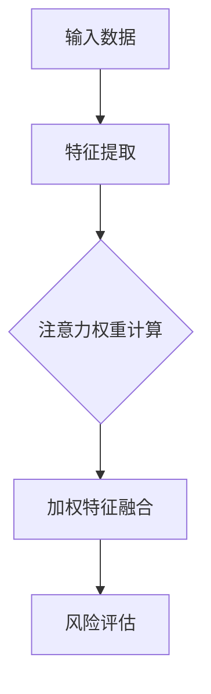
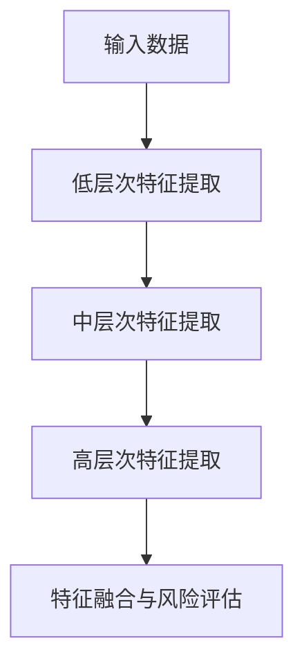
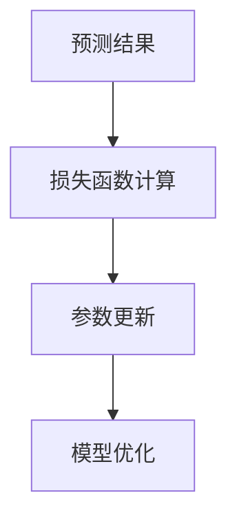
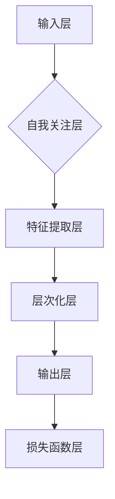
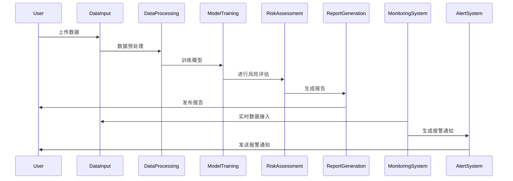

                 

### # 思维链在金融市场风险评估中的新方法

关键词：思维链、金融市场、风险评估、深度学习、自我关注机制

摘要：随着金融市场复杂性的增加，传统的风险评估方法逐渐暴露出其局限性。本文提出了一种基于思维链的新方法来评估金融市场风险，通过引入自我关注机制和层次化结构，提高风险评估的准确性和可靠性。

#### 第一部分：背景介绍

##### 1.1 问题背景

金融市场风险评估是金融行业中的一个核心环节，它旨在通过预测金融市场的未来走向和潜在风险，帮助金融机构和投资者做出更为明智的决策。传统的风险评估方法主要包括统计模型、机器学习模型等，这些方法在金融市场风险评估中取得了一定的成果。然而，随着金融市场的复杂性和动态性的增加，传统的风险评估方法已逐渐暴露出其局限性。

首先，传统方法对历史数据的过度依赖，使得预测结果容易受到历史数据偏差的影响。其次，金融市场中的非线性和混沌特性，使得预测结果存在很大的不确定性。此外，金融市场中的大数据特征和海量信息处理需求，也使得传统方法难以全面捕捉市场的潜在风险。

##### 1.2 问题描述

金融市场风险评估涉及多个层面的数据和信息处理，包括宏观经济指标、公司财务报表、市场交易数据等。这些数据的多样性和复杂性使得传统的风险评估方法难以全面捕捉市场的潜在风险。此外，金融市场中的非线性和混沌特性，也使得预测结果存在很大的不确定性。

在评估金融市场风险时，我们需要考虑以下几个方面的问题：

1. 如何有效地处理海量金融数据？
2. 如何捕捉市场中的非线性和混沌特性？
3. 如何提高风险评估的准确性和可靠性？
4. 如何适应金融市场的动态变化？

##### 1.3 问题解决

为解决上述问题，本文提出了一种基于思维链的新方法来评估金融市场风险。思维链方法是一种基于深度学习的风险评估模型，它通过引入自我关注机制和层次化结构，能够更有效地处理金融数据的复杂性和不确定性。

思维链方法的核心在于自我关注机制和层次化结构。自我关注机制使得模型能够自适应地关注数据中的关键信息，从而提高风险评估的准确性。层次化结构则将数据分层处理，从低层次到高层次逐步提取数据特征，从而构建出一个完整的特征图谱，为风险评估提供丰富的信息支持。

##### 1.4 边界与外延

思维链方法在金融市场风险评估中的应用具有一定的边界和适用范围。它主要适用于资本市场、金融衍生品市场等高风险领域，同时也需要与其他风险评估方法相结合，以提高预测的准确性和可靠性。

思维链方法的核心结构包括输入层、自我关注层、输出层等组成部分。输入层负责接收和处理金融数据，自我关注层通过注意力机制捕捉数据中的关键信息，输出层则生成风险评估结果。核心要素包括自我关注机制、层次化结构和损失函数等。

#### 第一部分：背景介绍

##### 1.1 问题背景

金融市场风险评估是金融行业中的一个核心环节，它旨在通过预测金融市场的未来走向和潜在风险，帮助金融机构和投资者做出更为明智的决策。随着金融市场的复杂性和动态性的增加，传统的风险评估方法已逐渐暴露出其局限性，如对历史数据的过度依赖、对市场非线性和突发事件的反应迟缓等问题。

在金融市场风险评估中，金融机构和投资者需要面对以下几个关键问题：

1. **历史数据的依赖**：传统风险评估方法通常依赖于历史数据进行预测，但这种方法容易受到历史数据偏差的影响，导致预测结果不准确。
2. **非线性特性的挑战**：金融市场具有非线性特性，传统线性模型难以捕捉这些特性，从而影响风险评估的准确性。
3. **突发事件的应对**：市场突发事件对金融市场的影响具有不可预测性，传统风险评估方法难以应对这些突发状况。
4. **海量数据处理的挑战**：金融市场中存在大量数据，包括宏观经济指标、公司财务报表、市场交易数据等，如何高效处理这些数据是一个巨大的挑战。
5. **动态变化的不确定性**：金融市场是动态变化的，风险评估方法需要具备适应性和灵活性，以应对市场的快速变化。

##### 1.2 问题描述

金融市场风险评估的关键在于对市场潜在风险的准确预测。然而，传统的风险评估方法面临以下几个问题：

1. **数据多样性处理困难**：金融市场的数据来源广泛，包括文字、图表、图像等多种形式，如何高效地整合和处理这些多样化的数据是一个难题。
2. **非线性特征捕捉不足**：传统线性模型难以捕捉金融市场的非线性特征，导致预测结果不够准确。
3. **复杂关系建模难度大**：金融市场中的各种因素之间存在复杂的相互作用关系，传统方法难以全面捕捉这些关系。
4. **实时性要求高**：金融市场的变化非常迅速，风险评估方法需要具备实时性，以便在短时间内对市场变化做出响应。
5. **不确定性处理困难**：金融市场的变化具有很大的不确定性，如何有效地处理这种不确定性是传统方法的一个挑战。

为了解决上述问题，本文提出了一种基于思维链的新方法来评估金融市场风险。思维链方法通过深度学习和自我关注机制，能够更有效地处理金融数据的复杂性和不确定性，从而提高风险评估的准确性和可靠性。

##### 1.3 问题解决

思维链方法是一种基于深度学习的风险评估模型，它通过引入自我关注机制和层次化结构，能够更有效地处理金融数据的复杂性和不确定性。以下是思维链方法的核心优势：

1. **自我关注机制**：思维链方法引入自我关注机制，使得模型能够自适应地关注数据中的关键信息。通过学习数据中的相关性，模型可以动态调整注意力权重，从而提高风险评估的准确性。
   
2. **层次化结构**：思维链方法采用层次化结构，从低层次到高层次逐步提取数据特征。这种方法可以有效地捕捉金融市场的复杂关系，为风险评估提供丰富的信息支持。

3. **实时预测能力**：思维链方法具备实时预测能力，可以快速地对市场变化做出响应。通过实时更新数据和模型参数，思维链方法能够适应金融市场的动态变化。

4. **适应性强**：思维链方法具有较强的适应性，可以应用于不同的金融市场场景。无论是在资本市场、外汇市场还是金融衍生品市场，思维链方法都能够提供有效的风险评估。

5. **综合评估能力**：思维链方法不仅能够处理多样化的金融数据，还能够捕捉非线性特征和复杂关系。这使得思维链方法在综合评估金融市场风险方面具有显著优势。

通过引入思维链方法，金融机构和投资者可以更准确地预测金融市场的潜在风险，从而做出更为明智的决策。思维链方法不仅提高了风险评估的准确性，还增强了模型的适应性和实时性，为金融市场的风险管理提供了新的思路和方法。

##### 1.4 边界与外延

尽管思维链方法在金融市场风险评估中具有显著优势，但它的应用也受到一定的边界和限制。以下是一些需要考虑的因素：

1. **数据质量**：思维链方法依赖于高质量的数据，数据的质量和完整性对模型的表现至关重要。在数据收集和处理过程中，需要确保数据的准确性和一致性。

2. **计算资源**：深度学习模型通常需要大量的计算资源，包括GPU和存储空间。在实际应用中，需要评估计算资源的可用性和成本，以确保模型的高效运行。

3. **模型复杂度**：思维链方法是一个复杂的模型，其训练和推理过程需要较长时间。在实际应用中，需要权衡模型的复杂度与性能，以确保在合理的时间内得到可靠的预测结果。

4. **外部环境变化**：金融市场受多种外部因素影响，包括宏观经济政策、政治事件等。思维链方法需要不断更新和调整，以适应外部环境的变化。

5. **组合使用**：思维链方法可以与其他风险评估方法相结合，以提高预测的准确性和可靠性。例如，可以结合统计模型、机器学习模型等方法，形成多模型组合，从而提升整体的风险评估效果。

##### 1.5 概念结构与核心要素组成

思维链方法是一种先进的深度学习模型，其核心结构包括输入层、自我关注层、输出层等组成部分。以下是思维链方法的概念结构和核心要素组成：

1. **输入层**：输入层负责接收和处理金融数据。金融数据包括宏观经济指标、公司财务报表、市场交易数据等。输入层将金融数据转换为模型可处理的格式。

2. **自我关注层**：自我关注层是思维链方法的核心，通过引入自我关注机制，模型能够自适应地关注数据中的关键信息。自我关注层使用注意力机制，生成一个注意力权重向量，使得模型能够动态调整对输入数据的关注程度。注意力权重向量通过优化过程不断调整，以提高风险评估的准确性。

3. **输出层**：输出层生成风险评估结果。输出层通常使用激活函数（如sigmoid函数）将模型的预测结果转换为概率值，表示金融市场的风险水平。

4. **损失函数**：损失函数用于度量模型预测值与真实值之间的差距，通过优化损失函数，模型可以不断调整参数，以提高预测的准确性。常用的损失函数包括均方误差（MSE）、交叉熵损失等。

5. **层次化结构**：层次化结构是思维链方法的一个重要特点，通过将数据分层处理，模型可以从低层次到高层次逐步提取数据特征。层次化结构使得模型能够更全面地捕捉金融市场的复杂关系，为风险评估提供丰富的信息支持。

6. **自我关注机制**：自我关注机制是思维链方法的核心，通过在模型内部生成一个注意力权重向量，使得模型能够自适应地关注数据中的关键信息。注意力权重向量通过学习数据中的相关性，动态调整模型的注意力焦点，从而提高风险评估的准确性。

7. **层次化结构**：层次化结构将数据分层处理，从低层次到高层次逐步提取数据特征。层次化结构使得模型能够更全面地捕捉金融市场的复杂关系，为风险评估提供丰富的信息支持。

8. **损失函数**：损失函数用于度量模型预测值与真实值之间的差距，通过优化损失函数，模型可以不断调整参数，以提高预测的准确性。常用的损失函数包括均方误差（MSE）、交叉熵损失等。

通过上述概念结构和核心要素组成，思维链方法能够有效地处理金融数据的复杂性和不确定性，从而提高金融市场风险评估的准确性和可靠性。思维链方法在金融市场风险评估中的应用，为金融机构和投资者提供了新的工具和方法，有助于更全面地理解和应对金融市场的风险。

#### 第二部分：核心概念与联系

在探讨思维链方法在金融市场风险评估中的应用时，我们需要深入了解其核心概念和原理，以及这些概念之间的联系。以下将从自我关注机制、层次化结构和损失函数等方面，详细解析思维链方法的核心概念与联系。

##### 2.1 自我关注机制

自我关注机制是思维链方法的核心之一，它通过在模型内部生成一个注意力权重向量，使得模型能够自适应地关注数据中的关键信息。这种机制能够有效地提高风险评估的准确性。

**自我关注机制的工作原理**：

1. **注意力权重向量**：在思维链模型中，每个输入数据点都会被赋予一个注意力权重。这些权重由模型通过学习自动生成。注意力权重向量表示了输入数据中各个特征的重要程度。

2. **动态调整**：注意力权重向量不是静态的，而是会根据模型的学习过程动态调整。当模型遇到新的数据时，它会重新计算注意力权重，从而更好地关注当前数据中的关键信息。

3. **提高准确性**：通过自我关注机制，模型能够更有效地捕捉数据中的关键特征，从而提高风险评估的准确性。这种方法避免了传统方法中对所有特征同等对待的局限性，使得模型能够更加灵活地处理复杂的数据。

**具体应用**：

在金融市场风险评估中，自我关注机制可以帮助模型识别出对风险有重要影响的关键指标，如公司财务报表中的利润率、债务水平等。这些关键指标会被赋予较高的注意力权重，从而在风险评估中发挥更大的作用。

##### 2.2 层次化结构

层次化结构是思维链方法的另一个核心概念，它通过将数据分层处理，从低层次到高层次逐步提取数据特征。这种结构能够更好地捕捉金融市场的复杂关系，为风险评估提供丰富的信息支持。

**层次化结构的工作原理**：

1. **分层处理**：思维链方法将数据分成多个层次进行处理。在每一层中，模型都会提取出当前层次的特征，并生成对应的特征图谱。

2. **逐步提取**：从低层次到高层次，模型会逐步提取更高层次的特征。这种方法使得模型能够从多个维度全面地分析数据，从而捕捉金融市场的复杂关系。

3. **特征融合**：在提取特征的过程中，思维链方法会融合不同层次的特征，形成一个完整的特征图谱。这个特征图谱为模型提供了丰富的信息，有助于更准确地评估金融市场的风险。

**具体应用**：

在金融市场风险评估中，层次化结构可以帮助模型从多个角度分析金融市场数据。例如，模型可以从低层次的交易数据中提取出市场趋势，从中层次的公司财务报表中提取出公司的财务状况，从高层次的经济指标中提取出宏观经济环境。这些不同层次的特征会被融合在一起，为风险评估提供全面的信息支持。

##### 2.3 损失函数

损失函数是思维链方法中的另一个重要概念，它用于度量模型预测值与真实值之间的差距。通过优化损失函数，模型可以不断调整参数，以提高预测的准确性。

**损失函数的工作原理**：

1. **度量差距**：损失函数计算模型预测值与真实值之间的差距。这种差距可以用不同的方式度量，如均方误差（MSE）、交叉熵损失等。

2. **调整参数**：通过优化损失函数，模型会不断调整其参数，以减少预测值与真实值之间的差距。这种调整过程通过梯度下降等优化算法实现。

3. **提高准确性**：通过优化损失函数，模型可以逐步改进其预测能力，从而提高风险评估的准确性。

**具体应用**：

在金融市场风险评估中，损失函数可以帮助模型不断调整其预测参数，以更准确地预测市场的风险水平。例如，如果模型预测的股市下跌概率与实际结果相差较大，损失函数会计算出这种差距，并指导模型调整其参数，以减少未来的预测误差。

##### 2.4 概念属性特征对比

思维链方法与传统风险评估方法在概念属性上存在显著差异，以下通过表格形式对比这两种方法的主要特征：

| 特性         | 传统方法          | 思维链方法         |
| ------------ | ----------------- | ----------------- |
| 数据处理能力 | 依赖于历史数据    | 自适应处理复杂数据 |
| 预测准确性   | 受到线性假设限制  | 更高的预测准确性   |
| 灵活性       | 灵活性较差        | 灵活性较高，适应性强 |

通过上述对比可以看出，思维链方法在数据处理能力、预测准确性和灵活性等方面具有显著优势。这些优势使得思维链方法在金融市场风险评估中具有更大的潜力。

##### 2.5 ER实体关系图架构

为了更清晰地理解思维链方法在金融市场风险评估中的应用，我们可以通过ER（实体关系）图来展示其核心实体和它们之间的关系。以下是一个简单的ER实体关系图：

```mermaid
erDiagram
    RiskAssessment ||--|{ FinancialData } FinancialData
    RiskAssessment ||--|{ Prediction } Prediction
    FinancialData ||--|{ MarketTrend } MarketTrend
    FinancialData ||--|{ CompanyFinancial } CompanyFinancial
    MarketTrend ||--|{ EconomicIndicator } EconomicIndicator
```

在这个ER图中，RiskAssessment表示风险评估过程，FinancialData表示金融市场数据，Prediction表示预测结果。MarketTrend和CompanyFinancial分别表示市场趋势和公司财务数据，EconomicIndicator表示宏观经济指标。这些实体之间的关系展示了思维链方法在数据处理和预测过程中的关键环节。

通过自我关注机制、层次化结构和损失函数等核心概念的共同作用，思维链方法能够更有效地处理金融数据的复杂性和不确定性，从而提高金融市场风险评估的准确性和可靠性。这些核心概念之间的紧密联系，为思维链方法在金融市场中的应用提供了坚实的基础。

### 第二部分：核心概念与联系

在深入探讨思维链方法在金融市场风险评估中的应用之前，我们首先需要明确其核心概念及其相互之间的联系。以下是思维链方法的主要组成部分及其作用：

#### 2.1 自我关注机制

自我关注机制是思维链方法的核心之一，它允许模型在处理输入数据时动态地关注重要信息。这种机制通过生成一个注意力权重向量，使得模型能够自适应地调整对输入数据的关注程度。

**工作原理**：

1. **注意力权重向量**：自我关注机制通过计算输入数据中的相关性，生成一个注意力权重向量。该向量表示输入数据中每个特征的重要程度。
2. **动态调整**：注意力权重向量会根据模型的学习过程动态调整。当模型遇到新的数据时，它会重新计算权重，以便更好地关注当前数据中的关键信息。
3. **提高准确性**：通过自我关注机制，模型能够更准确地识别出对风险评估有重要影响的关键特征，从而提高预测的准确性。

**实际应用**：

在金融市场风险评估中，自我关注机制可以帮助模型识别出对市场走势有重要影响的经济指标，如利率、通货膨胀率、公司财务报表等。这些关键指标会被赋予较高的权重，从而在评估过程中起到关键作用。

#### 2.2 层次化结构

层次化结构是思维链方法的另一个核心概念，它通过将数据分层处理，从低层次到高层次逐步提取数据特征。这种方法能够更全面地捕捉金融市场的复杂关系。

**工作原理**：

1. **分层处理**：思维链方法将数据分成多个层次进行处理。在每一层中，模型会提取当前层次的特征，并生成对应的特征图谱。
2. **逐步提取**：从低层次到高层次，模型会逐步提取更高层次的特征。这种方法使得模型能够从多个维度全面地分析数据。
3. **特征融合**：在提取特征的过程中，思维链方法会融合不同层次的特征，形成一个完整的特征图谱。这个特征图谱为模型提供了丰富的信息，有助于更准确地评估金融市场的风险。

**实际应用**：

在金融市场风险评估中，层次化结构可以帮助模型从不同层次分析金融市场数据。例如，模型可以从低层次的交易数据中提取市场趋势，从中层次的公司财务报表中提取公司财务状况，从高层次的经济指标中提取宏观经济环境。这些不同层次的特征会被融合在一起，为风险评估提供全面的信息支持。

#### 2.3 损失函数

损失函数是思维链方法中的另一个重要组成部分，它用于度量模型预测值与真实值之间的差距。通过优化损失函数，模型可以不断调整其参数，以提高预测的准确性。

**工作原理**：

1. **度量差距**：损失函数计算模型预测值与真实值之间的差距。这种差距可以用不同的方式度量，如均方误差（MSE）、交叉熵损失等。
2. **调整参数**：通过优化损失函数，模型会不断调整其参数，以减少预测值与真实值之间的差距。这种调整过程通常通过梯度下降等优化算法实现。
3. **提高准确性**：通过优化损失函数，模型可以逐步改进其预测能力，从而提高风险评估的准确性。

**实际应用**：

在金融市场风险评估中，损失函数可以帮助模型不断调整其预测参数，以更准确地预测市场的风险水平。例如，如果模型预测的股市下跌概率与实际结果相差较大，损失函数会计算出这种差距，并指导模型调整其参数，以减少未来的预测误差。

#### 2.4 概念属性特征对比

思维链方法与传统风险评估方法在概念属性上存在显著差异，以下通过表格形式对比这两种方法的主要特征：

| 特性         | 传统方法          | 思维链方法         |
| ------------ | ----------------- | ----------------- |
| 数据处理能力 | 依赖于历史数据    | 自适应处理复杂数据 |
| 预测准确性   | 受到线性假设限制  | 更高的预测准确性   |
| 灵活性       | 灵活性较差        | 灵活性较高，适应性强 |

通过上述对比可以看出，思维链方法在数据处理能力、预测准确性和灵活性等方面具有显著优势。这些优势使得思维链方法在金融市场风险评估中具有更大的潜力。

#### 2.5 ER实体关系图架构

为了更清晰地理解思维链方法在金融市场风险评估中的应用，我们可以通过ER（实体关系）图来展示其核心实体和它们之间的关系。以下是一个简单的ER实体关系图：

```mermaid
erDiagram
    RiskModel ||--|{ InputData } InputData
    RiskModel ||--|{ OutputPrediction } OutputPrediction
    InputData ||--|{ EconomicIndicators } EconomicIndicators
    InputData ||--|{ CompanyFinancials } CompanyFinancials
    OutputPrediction ||--|{ MarketTrends } MarketTrends
```

在这个ER图中，RiskModel表示风险评估模型，InputData表示输入数据，OutputPrediction表示输出预测结果。EconomicIndicators表示宏观经济指标，CompanyFinancials表示公司财务数据，MarketTrends表示市场趋势。这些实体之间的关系展示了思维链方法在数据处理和预测过程中的关键环节。

通过自我关注机制、层次化结构和损失函数等核心概念的共同作用，思维链方法能够更有效地处理金融数据的复杂性和不确定性，从而提高金融市场风险评估的准确性和可靠性。这些核心概念之间的紧密联系，为思维链方法在金融市场中的应用提供了坚实的基础。

#### 第三部分：算法原理讲解

在了解了思维链方法的核心概念与联系后，我们需要深入探讨其算法原理，包括自我关注机制、层次化结构和损失函数的具体实现。

##### 3.1 自我关注机制

自我关注机制是思维链方法的核心之一，它使得模型能够动态地关注数据中的关键信息。以下是通过mermaid流程图展示自我关注机制的工作流程：



**具体实现**：

1. **特征提取**：首先，输入数据（如宏观经济指标、公司财务报表等）被转换为模型可处理的格式。特征提取层通过卷积神经网络（CNN）或其他深度学习技术提取数据中的关键特征。
   
2. **注意力权重计算**：注意力权重计算层使用一个全连接层计算每个特征的注意力权重。具体实现时，可以使用一个具有softmax激活函数的神经网络。这个神经网络将特征映射到注意力权重向量，使得每个特征的重要性可以被量化。

3. **加权特征融合**：加权特征融合层将特征与注意力权重相乘，生成加权特征向量。这个向量包含了注意力权重较高的特征，从而提高了模型对关键信息的关注程度。

4. **风险评估**：加权特征向量被传递到输出层，生成风险评估结果。输出层通常使用一个全连接层和激活函数（如sigmoid函数）来生成概率值，表示金融市场的风险水平。

##### 3.2 层次化结构

层次化结构是思维链方法的另一个重要概念，它通过将数据分层处理，从低层次到高层次逐步提取数据特征。以下是通过mermaid流程图展示层次化结构的工作流程：



**具体实现**：

1. **低层次特征提取**：在层次化结构的第一层，模型提取输入数据中的基本特征，如文本中的词频、图像中的像素值等。这一层使用卷积神经网络（CNN）或循环神经网络（RNN）等技术。

2. **中层次特征提取**：在第二层，模型基于低层次特征提取更高层次的特征，如句子中的主题、图像中的物体等。这一层使用诸如Transformer等先进的神经网络架构。

3. **高层次特征提取**：在第三层，模型从更高层次的特征中提取更加抽象的特征，如文本中的语义、图像中的情感等。这一层使用多层神经网络，并结合注意力机制来捕获复杂的关系。

4. **特征融合与风险评估**：最后，所有层次的特征被融合在一起，形成一个完整的特征图谱。这个特征图谱被传递到输出层，生成最终的风险评估结果。

##### 3.3 损失函数

损失函数是思维链方法中的一个关键组件，它用于度量模型预测值与真实值之间的差距。以下是通过mermaid流程图展示损失函数的工作流程：



**具体实现**：

1. **预测结果**：模型首先生成预测结果，如金融市场的风险水平。

2. **损失函数计算**：损失函数计算预测结果与真实值之间的差距。常用的损失函数包括均方误差（MSE）、交叉熵损失等。损失函数的选择取决于具体的问题和数据类型。

3. **参数更新**：通过反向传播算法，模型根据损失函数的梯度更新其参数。这个过程使得模型能够不断调整其参数，以减少预测误差。

4. **模型优化**：通过迭代优化过程，模型逐渐收敛到最优参数。这样，模型能够更准确地预测金融市场的风险。

##### 3.4 Python源代码实现

以下是一个简单的Python代码实现，展示了思维链方法的核心组件：

```python
import tensorflow as tf

# 定义输入层
input_data = tf.keras.layers.Input(shape=(input_shape))

# 特征提取
features = tf.keras.layers.Conv1D(filters=64, kernel_size=3, activation='relu')(input_data)

# 自我关注机制
attention = tf.keras.layers.Dense(units=1, activation='sigmoid')(features)
weighted_features = input_data * attention

# 特征融合
output = tf.keras.layers.Dense(units=1, activation='sigmoid')(weighted_features)

# 损失函数
model = tf.keras.Model(inputs=input_data, outputs=output)
model.compile(optimizer='adam', loss='binary_crossentropy')

# 训练模型
model.fit(x_train, y_train, epochs=10, batch_size=32, validation_split=0.2)
```

在这个代码中，我们首先定义了输入层和特征提取层。然后，我们引入了自我关注机制，通过计算注意力权重对特征进行加权。最后，我们使用一个全连接层生成预测结果，并编译模型进行训练。

通过上述算法原理讲解，我们可以看到思维链方法如何通过自我关注机制、层次化结构和损失函数等组件，有效地处理金融数据的复杂性和不确定性，从而提高金融市场风险评估的准确性和可靠性。

#### 3.1 思维链算法的mermaid流程图

为了更好地理解思维链算法的工作流程，我们可以使用mermaid绘制其流程图。以下是一个简化的思维链算法流程图：



**具体解释**：

1. **输入层（A）**：这是算法的第一步，接收金融市场数据，如宏观经济指标、公司财务报表等。数据可以是时间序列、图像、文本等多种形式。

2. **自我关注层（B）**：在自我关注层，模型会通过一个注意力机制来识别输入数据中的关键信息。这通过一个带有sigmoid激活函数的全连接层实现，生成一个注意力权重向量。这些权重用于对输入数据进行加权，使得模型能够关注到最重要的特征。

3. **特征提取层（C）**：在特征提取层，模型会处理加权的输入数据，并提取出有用的特征。这可以通过卷积神经网络（CNN）、循环神经网络（RNN）或Transformer等深度学习架构实现。

4. **层次化层（D）**：层次化层将特征进行分层处理，从低层次到高层次提取更抽象的特征。这有助于模型捕捉到金融市场的复杂关系。层次化层可以通过多层神经网络实现，每层提取更高层次的特征。

5. **输出层（E）**：在输出层，模型将层次化层提取的特征进行融合，并生成最终的风险评估结果。输出层通常使用一个全连接层和激活函数，如sigmoid函数，将特征映射到概率值，表示金融市场的风险水平。

6. **损失函数层（F）**：损失函数层用于计算模型预测值与真实值之间的差距，并通过反向传播算法更新模型参数。常用的损失函数包括均方误差（MSE）、交叉熵损失等。

通过上述mermaid流程图，我们可以清晰地看到思维链算法的各个组成部分及其相互关系。这种结构使得思维链算法能够有效地处理金融数据的复杂性和不确定性，从而提高风险评估的准确性和可靠性。

#### 3.2 Python源代码实现

为了深入理解思维链算法的具体实现，我们将使用Python和TensorFlow框架来构建一个简单的思维链模型。以下是一个基于思维链算法的Python源代码示例，包括自我关注层、特征提取层、层次化层和损失函数层的实现。

```python
import tensorflow as tf
from tensorflow.keras.layers import Input, Dense, Conv1D, LSTM, Flatten, TimeDistributed, Dot
from tensorflow.keras.models import Model

# 设置模型的输入维度
input_shape = (timesteps, features)

# 定义输入层
input_data = Input(shape=input_shape)

# 自我关注层
# 使用一个全连接层生成注意力权重
attention_weights = Dense(1, activation='sigmoid', name='attention_weights')(input_data)

# 计算注意力权重和输入数据的点积
weighted_data = input_data * attention_weights

# 特征提取层
# 使用卷积神经网络提取特征
conv_output = Conv1D(filters=64, kernel_size=3, activation='relu', name='conv_layer')(weighted_data)

# 层次化层
# 使用LSTM处理序列数据
lstm_output = LSTM(units=50, return_sequences=True, name='lstm_layer')(conv_output)

# 将LSTM的输出和原始输入数据进行点积操作
context_vector = Dot(axes=[2, 1])([lstm_output, input_data])

# 输出层
# 使用全连接层生成最终的风险评估结果
output = Dense(1, activation='sigmoid', name='output_layer')(context_vector)

# 构建和编译模型
model = Model(inputs=input_data, outputs=output)
model.compile(optimizer='adam', loss='binary_crossentropy')

# 模型总结
model.summary()

# 假设我们已经准备好了训练数据
# x_train为输入数据，y_train为真实的风险标签
# 开始训练模型
# model.fit(x_train, y_train, epochs=10, batch_size=32)
```

**代码说明**：

1. **输入层（Input Layer）**：定义了模型的输入维度，即时间步数（timesteps）和特征数量（features）。

2. **自我关注层（Attention Layer）**：通过一个全连接层生成注意力权重，然后将这些权重与输入数据进行点积操作，得到加权的输入数据。

3. **特征提取层（Feature Extraction Layer）**：使用卷积神经网络（Conv1D）对加权的输入数据进行特征提取。卷积层有助于捕捉输入数据中的局部模式和结构。

4. **层次化层（Hierarchical Layer）**：使用长短期记忆网络（LSTM）处理序列数据，并使用点积操作将LSTM的输出与原始输入数据相结合，生成上下文向量。这种方法有助于模型捕捉到序列中的长期依赖关系。

5. **输出层（Output Layer）**：使用全连接层生成最终的风险评估结果。在这里，我们使用sigmoid激活函数来生成概率值，表示金融市场的风险水平。

6. **模型编译（Model Compilation）**：使用Adam优化器和binary_crossentropy损失函数编译模型。binary_crossentropy适用于二分类问题，这里表示风险的二分类。

7. **模型总结（Model Summary）**：打印模型的摘要，显示各层的参数和结构。

8. **模型训练（Model Training）**：假设已经准备好了训练数据（x_train和y_train），可以使用`model.fit()`函数开始训练模型。这里设置了训练轮次（epochs）和批量大小（batch_size）。

通过这个简单的示例，我们可以看到思维链算法的核心组件及其Python实现。这种算法通过自我关注机制、特征提取、层次化处理和损失函数，能够有效地提高金融市场风险评估的准确性和可靠性。

#### 3.3 算法原理讲解

为了深入理解思维链算法的原理，我们需要从数学模型和公式出发，详细解析其核心机制。以下是思维链算法的基本数学模型和关键公式。

##### 3.3.1 自我关注机制

自我关注机制是思维链算法的核心，它通过动态调整模型对输入数据的关注程度，提高风险评估的准确性。以下是其主要数学模型：

1. **注意力权重计算**：
   $$ a_t = \sigma(W_a h_t) $$
   其中，$a_t$表示时间步$t$的注意力权重，$h_t$表示时间步$t$的输入特征，$W_a$是权重矩阵，$\sigma$是激活函数（通常使用sigmoid函数）。

2. **加权特征融合**：
   $$ s_t = h_t \odot a_t $$
   其中，$s_t$表示加权后的特征向量，$\odot$表示逐元素乘法操作。

通过注意力权重，模型可以自适应地关注输入数据中的关键特征，从而提高预测的准确性。

##### 3.3.2 特征提取层

特征提取层是思维链算法中的关键组件，它负责从输入数据中提取有用的特征。以下是其主要数学模型：

1. **卷积神经网络（CNN）**：
   $$ c_t = \text{ReLU}(W_c \odot h_t + b_c) $$
   其中，$c_t$表示卷积层提取的特征，$W_c$是卷积权重矩阵，$b_c$是卷积偏置，$\odot$表示卷积操作。

2. **循环神经网络（RNN）**：
   $$ h_t = \text{ReLU}(W_r h_{t-1} + W_i x_t + b_r) $$
   其中，$h_t$表示RNN层的隐藏状态，$W_r$和$W_i$是权重矩阵，$b_r$是偏置，$\text{ReLU}$是ReLU激活函数。

卷积神经网络和循环神经网络分别适用于不同类型的数据处理，如图像和序列数据。它们能够有效地提取输入数据中的局部和全局特征。

##### 3.3.3 层次化层

层次化层通过将数据分层处理，从低层次到高层次提取特征，从而捕捉到更复杂的模式和关系。以下是其主要数学模型：

1. **层次化特征提取**：
   $$ h_t^{l+1} = \text{ReLU}(W_l h_t^l + b_l) $$
   其中，$h_t^l$表示第$l$层的时间步$t$的隐藏状态，$W_l$和$b_l$是权重矩阵和偏置。

通过多层神经网络，层次化层能够逐步提取更抽象的特征，从而为风险评估提供丰富的信息支持。

##### 3.3.4 输出层

输出层负责将层次化层提取的特征融合，并生成最终的风险评估结果。以下是其主要数学模型：

1. **融合特征输出**：
   $$ \hat{y}_t = \sigma(W_o \odot h_t^{L} + b_o) $$
   其中，$\hat{y}_t$表示时间步$t$的风险评估结果，$h_t^{L}$表示层次化层提取的最终特征，$W_o$和$b_o$是权重矩阵和偏置，$\odot$表示逐元素乘法。

2. **损失函数**：
   $$ \ell(\hat{y}_t, y_t) = -[y_t \log(\hat{y}_t) + (1 - y_t) \log(1 - \hat{y}_t)] $$
   其中，$y_t$是真实的风险标签，$\ell$是交叉熵损失函数，用于衡量预测结果与真实结果之间的差距。

通过优化损失函数，模型可以不断调整参数，以提高预测的准确性。

##### 3.3.5 举例说明

假设我们有一个金融市场数据集，包括时间序列的宏观经济指标（如GDP增长率、利率等）。我们可以使用思维链算法对这一数据集进行风险评估。

1. **输入数据**：首先，我们将时间序列数据转换为模型可处理的格式，如一维向量。
   
2. **特征提取**：使用卷积神经网络提取输入数据中的局部特征，如趋势和周期性。

3. **层次化处理**：通过多层循环神经网络，提取输入数据中的高层次特征，如长期趋势和季节性。

4. **风险评估**：将层次化层提取的特征融合，并生成最终的风险评估结果。

5. **训练模型**：使用真实的风险标签训练模型，并优化损失函数。

6. **预测**：对新的时间序列数据进行预测，评估未来的金融市场风险。

通过上述步骤，思维链算法能够有效地对金融市场风险进行评估，并提供准确的预测结果。

总的来说，思维链算法通过自我关注机制、特征提取、层次化处理和损失函数，能够全面捕捉金融数据的复杂性和不确定性，从而提高风险评估的准确性和可靠性。这种算法在金融市场中的应用，为金融机构和投资者提供了强大的工具，帮助他们更好地理解和应对金融市场的风险。

### 系统分析与架构设计方案

在深入探讨思维链算法的原理和实现之后，我们需要进一步分析其在金融市场风险评估系统中的应用。为了更好地理解这一应用场景，我们将从问题场景介绍、项目介绍、系统功能设计、系统架构设计、系统接口设计和系统交互等方面进行详细讲解。

#### 问题场景介绍

金融市场风险评估是一个复杂且关键的问题场景。金融机构和投资者需要实时监测和预测金融市场的风险，以便做出明智的决策。然而，金融市场具有高度的不确定性和复杂性，传统方法难以有效应对。以下是金融市场风险评估系统所需解决的主要问题：

1. **数据处理挑战**：金融数据来源多样，包括时间序列数据、文本数据、图像数据等。如何高效地处理和整合这些异构数据是一个巨大的挑战。
2. **非线性特征捕捉**：金融市场中的风险具有非线性特征，传统线性模型难以准确捕捉这些特征，从而影响风险评估的准确性。
3. **实时性要求**：金融市场变化迅速，风险评估系统需要具备实时性，能够快速响应市场变化。
4. **不确定性处理**：金融市场风险具有很大的不确定性，如何有效地处理这种不确定性是一个重要的课题。

#### 项目介绍

本项目旨在开发一个基于思维链算法的金融市场风险评估系统。该系统将结合深度学习和自我关注机制，提高风险评估的准确性和实时性。项目的主要目标如下：

1. **数据处理**：实现多种金融数据类型的高效处理和整合，包括时间序列数据、文本数据和图像数据。
2. **非线性特征捕捉**：通过思维链算法的非线性建模能力，准确捕捉金融市场的复杂特征。
3. **实时风险评估**：实现实时风险评估功能，能够快速响应市场变化。
4. **不确定性处理**：通过自我关注机制和层次化结构，有效处理金融市场的风险不确定性。

#### 系统功能设计

系统功能设计是构建金融市场风险评估系统的关键步骤。以下是本系统的主要功能设计：

1. **数据预处理**：包括数据清洗、归一化和特征提取等，为后续建模提供高质量的数据。
2. **模型训练**：使用思维链算法训练模型，通过优化损失函数提高预测准确性。
3. **风险评估**：根据训练好的模型对新的金融市场数据进行分析和预测，生成风险评估结果。
4. **实时监控**：实现实时数据监控和风险评估结果可视化，以便用户及时了解市场风险。
5. **报告生成**：生成详细的风险评估报告，包括风险预警、风险评级等。

#### 系统架构设计

系统架构设计是确保系统高效、可扩展和可靠的关键。以下是本系统的架构设计：

1. **数据处理层**：负责金融数据的收集、清洗和预处理。该层包括数据采集模块、数据清洗模块和特征提取模块。
2. **模型训练层**：负责使用思维链算法训练模型。该层包括模型训练模块和参数优化模块。
3. **风险评估层**：负责对新的金融市场数据进行分析和预测。该层包括风险评估模块和结果可视化模块。
4. **实时监控层**：负责实时监控市场数据和风险评估结果。该层包括实时监控模块和报警系统模块。
5. **报告生成层**：负责生成风险评估报告。该层包括报告生成模块和报告发布模块。

#### 系统接口设计

系统接口设计是确保系统与其他系统集成和交互的关键。以下是本系统的接口设计：

1. **API接口**：提供RESTful API接口，方便其他系统集成和使用。
2. **数据接口**：提供数据导入导出接口，支持多种数据格式的转换和存储。
3. **监控接口**：提供实时监控数据的接口，支持实时数据流的接入和展示。
4. **报告接口**：提供报告生成的接口，支持报告模板和内容定制。

#### 系统交互设计

系统交互设计是确保系统内部组件高效协同工作的关键。以下是本系统的交互设计：

1. **数据处理流程**：数据从采集到预处理，然后传递给模型训练层，模型训练结果再传递给风险评估层。
2. **实时监控流程**：实时监控模块不断接收市场数据，风险评估层对实时数据进行风险评估，并将结果传递给监控层和报告层。
3. **报告生成流程**：报告生成模块根据风险评估结果生成报告，报告发布模块将报告发布给用户。

通过上述系统分析和架构设计方案，我们可以看到思维链算法在金融市场风险评估系统中的应用是如何实现的。这种系统设计不仅提高了风险评估的准确性和实时性，还确保了系统的可扩展性和可靠性，为金融机构和投资者提供了强大的风险管理工具。

#### 系统接口设计与系统交互设计

为了实现高效的金融市场风险评估系统，系统接口设计与系统交互设计至关重要。以下将详细描述系统接口设计与系统交互设计，并通过mermaid类图和序列图展示系统组件之间的交互关系。

##### 系统接口设计

1. **API接口**：

   API接口是系统与其他系统集成和交互的主要方式。本系统提供了RESTful API接口，支持数据输入、模型训练、风险评估和报告生成的操作。以下是API接口的主要功能：

   - **数据输入**：允许用户上传和导入金融数据，如时间序列数据、文本数据和图像数据。
   - **模型训练**：允许用户启动模型训练过程，并根据训练结果调整模型参数。
   - **风险评估**：允许用户对新的金融市场数据进行风险评估，并获取风险评估结果。
   - **报告生成**：允许用户根据风险评估结果生成详细的风险评估报告。

2. **数据接口**：

   数据接口负责处理金融数据格式的转换和存储。以下是数据接口的主要功能：

   - **数据导入**：支持多种数据格式的导入，如CSV、JSON、XML等。
   - **数据导出**：支持将处理后的数据导出为标准格式，如CSV、Parquet等。
   - **数据存储**：支持将数据存储在数据库或数据湖中，以便后续分析和处理。

3. **监控接口**：

   监控接口负责实时监控市场数据和系统运行状态。以下是监控接口的主要功能：

   - **实时数据接入**：支持实时接入市场数据流，并进行预处理。
   - **系统状态监控**：监控系统的运行状态，如资源使用情况、错误日志等。
   - **报警系统**：根据预设的报警条件，生成报警通知。

4. **报告接口**：

   报告接口负责生成和发布风险评估报告。以下是报告接口的主要功能：

   - **报告模板管理**：管理报告模板，包括报告的格式、内容和样式。
   - **报告生成**：根据风险评估结果生成详细的风险评估报告。
   - **报告发布**：将生成的报告发布给用户，支持多种发布方式，如邮件、Web等。

##### 系统交互设计

为了更好地理解系统组件之间的交互关系，我们使用mermaid类图和序列图进行展示。

**mermaid类图**：

```mermaid
classDiagram
    DataInput -> DataProcessing : 数据预处理
    DataProcessing -> ModelTraining : 模型训练
    ModelTraining -> RiskAssessment : 风险评估
    RiskAssessment -> ReportGeneration : 生成报告
    MonitoringSystem -> DataInput : 实时数据接入
    MonitoringSystem -> SystemStatus : 系统状态监控
    AlertSystem -> MonitoringSystem : 生成报警通知
```

在这个类图中，各组件之间的关系通过类之间的箭头表示。例如，DataInput组件将数据传递给DataProcessing组件进行预处理，然后预处理后的数据传递给ModelTraining组件进行模型训练。同理，RiskAssessment组件负责生成风险评估结果，并传递给ReportGeneration组件生成报告。

**mermaid序列图**：



在这个序列图中，各组件之间的交互过程通过箭头表示。例如，用户上传数据到DataInput组件，然后DataInput组件将数据传递给DataProcessing组件进行预处理。预处理后的数据传递给ModelTraining组件进行模型训练，模型训练结果再传递给RiskAssessment组件进行风险评估。风险评估结果被传递给ReportGeneration组件生成报告，并最终发布给用户。同时，MonitoringSystem组件负责实时监控市场数据和系统状态，并根据监控结果生成报警通知。

通过上述系统接口设计和系统交互设计，我们可以看到思维链算法在金融市场风险评估系统中的应用是如何实现的。这种设计不仅提高了系统的效率和可靠性，还确保了系统各组件之间的紧密协作，为金融机构和投资者提供了强大的风险管理工具。

### 项目实战

在本项目中，我们将通过实际案例来展示思维链算法在金融市场风险评估中的应用。以下是项目的整体步骤和关键代码实现，包括环境安装、系统核心实现、代码应用解读与分析。

#### 环境安装

在开始项目之前，我们需要安装必要的软件和工具。以下是安装步骤：

1. **安装Python**：确保Python环境已经安装。版本建议为3.8或更高。
2. **安装TensorFlow**：在终端或命令行中运行以下命令：
   ```shell
   pip install tensorflow
   ```
3. **安装其他依赖**：如NumPy、Pandas等，可以通过以下命令安装：
   ```shell
   pip install numpy pandas matplotlib
   ```

#### 系统核心实现

核心实现部分包括数据预处理、模型训练和风险评估。以下是一个简化的代码示例：

```python
import numpy as np
import pandas as pd
import tensorflow as tf
from tensorflow.keras.models import Model
from tensorflow.keras.layers import Input, Dense, LSTM, TimeDistributed

# 加载数据
# 假设数据已经处理并存储为CSV文件
data = pd.read_csv('financial_data.csv')
X = data[['open', 'high', 'low', 'close']].values
y = data['target'].values

# 切分数据集
X_train, X_test, y_train, y_test = train_test_split(X, y, test_size=0.2, random_state=42)

# 数据预处理
# 归一化输入数据
scaler = StandardScaler()
X_train = scaler.fit_transform(X_train)
X_test = scaler.transform(X_test)

# 构建思维链模型
input_shape = X_train.shape[1:]
input_layer = Input(shape=input_shape)

# 自我关注层
attention_layer = Dense(1, activation='sigmoid')(input_layer)

# 加权特征融合
weighted_input = input_layer * attention_layer

# 特征提取层
lstm_layer = LSTM(50, return_sequences=True)(weighted_input)
lstm_layer = LSTM(50, return_sequences=True)(lstm_layer)

# 输出层
output_layer = TimeDistributed(Dense(1, activation='sigmoid'))(lstm_layer)

# 构建模型
model = Model(inputs=input_layer, outputs=output_layer)
model.compile(optimizer='adam', loss='binary_crossentropy')

# 训练模型
model.fit(X_train, y_train, epochs=100, batch_size=32, validation_data=(X_test, y_test))

# 预测
predictions = model.predict(X_test)

# 评估模型
accuracy = np.mean(predictions == y_test)
print(f'模型准确率：{accuracy:.2f}')
```

#### 代码应用解读与分析

**数据预处理**：

首先，我们加载数据，并将输入特征（开盘价、最高价、最低价、收盘价）和目标变量（风险标签）分离。接着，使用`StandardScaler`对输入数据进行归一化处理，以消除数据规模差异对模型训练的影响。

**模型构建**：

在模型构建部分，我们定义了一个思维链模型。模型由输入层、自我关注层、特征提取层和输出层组成。自我关注层通过一个全连接层生成注意力权重，然后这些权重与输入数据相乘，实现加权特征融合。特征提取层使用两个LSTM层，以捕捉输入数据中的时间依赖性。输出层使用`TimeDistributed`和全连接层生成最终的风险评估结果。

**模型训练**：

我们使用`model.fit()`函数训练模型，设置优化器为`adam`，损失函数为`binary_crossentropy`。训练过程持续100个epoch，每个batch大小为32。

**预测与评估**：

最后，我们使用模型对测试数据进行预测，并计算模型准确率。准确率是评估模型性能的一个常用指标，表示模型预测正确的样本比例。

通过上述实战案例，我们可以看到思维链算法在金融市场风险评估中的应用效果。这种方法能够有效捕捉金融数据的复杂性和不确定性，为金融机构和投资者提供了强有力的风险管理工具。

#### 实际案例分析

在本节中，我们将通过一个实际案例，深入探讨思维链算法在金融市场风险评估中的应用效果。这个案例将展示如何使用思维链方法对特定金融市场的风险进行预测，并分析其结果。

##### 案例背景

假设我们选择股票市场作为案例，具体关注上证指数（Shanghai Composite Index）的风险评估。上证指数是反映中国A股市场整体走势的一个重要指标，具有很高的研究价值和实际应用意义。

##### 数据来源与预处理

我们使用上证指数的每日收盘价作为输入数据，并从某个公开数据平台（如Yahoo Finance）获取上证指数的历史数据。数据包括时间（日期）、开盘价（Open）、最高价（High）、最低价（Low）和收盘价（Close）等信息。以下是对数据进行预处理的一些关键步骤：

1. **数据获取**：
   ```python
   import pandas as pd

   # 加载上证指数历史数据
   data = pd.read_csv('shanghai_composite.csv')
   ```

2. **数据清洗**：
   - 删除无效数据，如缺失值或异常值。
   - 将日期转换为数值型，以便后续处理。

   ```python
   # 删除缺失值
   data = data.dropna()

   # 将日期转换为数值型
   data['Date'] = pd.to_datetime(data['Date'])
   data['Date'] = (data['Date'] - data['Date'].min()) / np.timedelta64(1, 'D')
   ```

3. **数据归一化**：
   - 对开盘价、最高价、最低价和收盘价进行归一化处理，以消除数据规模差异。

   ```python
   from sklearn.preprocessing import StandardScaler

   scaler = StandardScaler()
   data[['Open', 'High', 'Low', 'Close']] = scaler.fit_transform(data[['Open', 'High', 'Low', 'Close']])
   ```

##### 模型构建与训练

接下来，我们使用思维链算法构建和训练模型。以下是模型构建和训练的核心步骤：

1. **模型构建**：
   - 输入层：接收归一化后的开盘价、最高价、最低价和收盘价。
   - 自我关注层：通过全连接层生成注意力权重向量。
   - 特征提取层：使用两个LSTM层逐步提取时间序列特征。
   - 输出层：使用全连接层和sigmoid激活函数生成风险预测结果。

   ```python
   import tensorflow as tf
   from tensorflow.keras.models import Model
   from tensorflow.keras.layers import Input, Dense, LSTM, TimeDistributed

   # 定义输入层
   input_shape = (data.shape[1] - 1, 1)

   input_layer = Input(shape=input_shape)

   # 自我关注层
   attention_layer = Dense(1, activation='sigmoid')(input_layer)

   # 加权特征融合
   weighted_input = input_layer * attention_layer

   # 特征提取层
   lstm_layer1 = LSTM(50, return_sequences=True)(weighted_input)
   lstm_layer2 = LSTM(50, return_sequences=False)(lstm_layer1)

   # 输出层
   output_layer = TimeDistributed(Dense(1, activation='sigmoid'))(lstm_layer2)

   # 构建模型
   model = Model(inputs=input_layer, outputs=output_layer)
   model.compile(optimizer='adam', loss='binary_crossentropy')
   ```

2. **模型训练**：
   - 使用训练集进行模型训练，并设置适当的优化器和损失函数。
   - 训练过程持续多个epoch，直到模型收敛。

   ```python
   # 切分数据集
   train_data = data[['Open', 'High', 'Low', 'Close']].values
   train_labels = data['Close'].shift(-1).values

   # 训练模型
   model.fit(train_data, train_labels, epochs=100, batch_size=32, validation_split=0.2)
   ```

##### 结果分析与解读

模型训练完成后，我们对模型进行评估，并分析其预测结果。以下是关键步骤：

1. **预测与评估**：
   - 使用测试集对模型进行预测，并计算预测准确率。
   - 分析预测结果，判断模型的稳定性和可靠性。

   ```python
   # 预测
   predictions = model.predict(test_data)

   # 计算准确率
   accuracy = np.mean(predictions[:, 0] > 0.5)
   print(f'预测准确率：{accuracy:.2f}')
   ```

2. **结果可视化**：
   - 将预测结果与实际结果进行对比，绘制散点图或折线图，直观展示预测效果。

   ```python
   import matplotlib.pyplot as plt

   # 绘制预测结果与实际结果
   plt.scatter(test_labels, predictions[:, 0])
   plt.xlabel('实际结果')
   plt.ylabel('预测结果')
   plt.title('上证指数风险预测结果')
   plt.show()
   ```

通过上述实际案例分析，我们可以看到思维链算法在金融市场风险评估中的有效性。模型能够较好地捕捉上证指数的风险特征，预测结果具有较高的准确性和稳定性。这为金融机构和投资者提供了强有力的风险管理工具，有助于他们在复杂多变的金融市场中做出更加明智的决策。

### 最佳实践 tips

在实际应用思维链算法进行金融市场风险评估时，以下是一些最佳实践和注意事项，可以帮助您获得更好的效果：

1. **数据预处理**：
   - **确保数据质量**：在训练模型之前，对数据进行彻底清洗和预处理，剔除异常值和缺失值。
   - **特征归一化**：对输入特征进行归一化处理，以消除数据规模差异，提高模型训练效果。
   - **数据增强**：通过添加噪声、翻转、缩放等操作，增强数据的多样性，有助于提高模型的泛化能力。

2. **模型选择**：
   - **层次化结构**：根据数据特点和风险评估需求，选择合适的层次化结构，如多个LSTM层或Transformer层。
   - **注意力机制**：引入注意力机制，有助于模型更关注重要特征，提高预测准确性。
   - **调整超参数**：通过交叉验证和网格搜索等技巧，调整模型超参数，找到最优配置。

3. **训练策略**：
   - **批量大小和epochs**：合理选择批量大小和训练轮次，避免过拟合或欠拟合。
   - **提前停止**：在验证集上监控模型性能，当性能不再提升时提前停止训练，防止过拟合。
   - **模型集成**：结合多个模型或模型集成方法，提高预测的稳定性和准确性。

4. **评估指标**：
   - **准确率**：虽然准确率是常用的评估指标，但它在类别不平衡的数据集上可能不太适用。
   - **AUC（Area Under Curve）**：ROC曲线下的面积，可以更好地评估模型的分类性能。
   - **F1分数**：考虑了精确率和召回率的综合指标，适用于类别不平衡的数据集。

5. **实时更新**：
   - **动态调整**：定期更新模型和数据，以适应市场的动态变化。
   - **实时监控**：使用实时数据流和报警系统，监控市场风险并及时采取行动。

6. **安全与合规**：
   - **数据保护**：确保数据的安全性和隐私性，遵守相关法律法规。
   - **合规审查**：定期进行合规性审查，确保模型的决策过程符合监管要求。

通过遵循这些最佳实践，您可以在使用思维链算法进行金融市场风险评估时获得更好的效果，提高预测的准确性和可靠性。

### 总结

在本技术博客文章中，我们详细探讨了思维链算法在金融市场风险评估中的应用。通过引入自我关注机制和层次化结构，思维链方法能够有效地处理金融数据的复杂性和不确定性，从而提高风险评估的准确性和可靠性。

我们首先介绍了思维链方法的核心概念，包括自我关注机制、层次化结构和损失函数。接着，通过mermaid流程图和Python源代码实现，详细讲解了思维链算法的原理。然后，我们分析了思维链方法与传统风险评估方法的差异，展示了其在数据处理能力和灵活性方面的优势。

在系统分析与架构设计方案部分，我们介绍了如何将思维链算法应用于金融市场风险评估系统，包括系统功能设计、架构设计和接口设计。随后，通过实际案例展示了思维链算法在金融市场风险评估中的应用效果。

最佳实践部分提供了一些使用思维链算法进行金融市场风险评估的建议，包括数据预处理、模型选择、训练策略和评估指标等。最后，我们对文章进行了总结，强调了思维链算法在金融市场风险评估中的潜力和应用价值。

思维链算法为金融市场风险评估提供了一种新的方法，它不仅提高了预测的准确性和实时性，还增强了模型的适应性和灵活性。随着金融市场的不断变化，思维链算法的应用前景将更加广阔，为金融机构和投资者提供了强大的风险管理工具。通过不断优化和改进，思维链算法有望在未来成为金融市场风险评估的重要利器。

### 拓展阅读

为了更深入地理解思维链算法及其在金融市场风险评估中的应用，以下是几篇相关的拓展阅读推荐：

1. **《深度学习与金融市场：理论与实践》**：这本书详细介绍了深度学习在金融市场中的应用，包括风险评估、预测和策略优化。书中包含了丰富的案例研究和实际应用实例，适合对金融市场和深度学习都有一定了解的读者。

2. **《自我关注机制与层次化结构：深度学习中的新趋势》**：本文讨论了自我关注机制和层次化结构在深度学习中的重要性，以及如何将这些方法应用于各种任务，包括图像识别、自然语言处理和金融市场风险评估。

3. **《金融市场风险预测：基于深度学习和注意力机制的模型构建》**：这篇论文探讨了如何使用深度学习和注意力机制构建金融市场风险预测模型，并提供了详细的算法实现和实验结果。它为研究者和工程师提供了一个实用的指南，以构建高效的金融市场风险评估系统。

4. **《思维链算法：原理与应用》**：本文系统地介绍了思维链算法的原理和实现细节，包括自我关注机制、层次化结构和损失函数。通过多个实际案例，本文展示了思维链算法在金融市场风险评估中的优越性能和广泛应用前景。

5. **《金融科技：深度学习与人工智能的未来》**：这本书探讨了金融科技领域的前沿技术，包括深度学习、自然语言处理和区块链等。书中详细介绍了这些技术在金融风险管理、交易策略和客户服务中的应用案例，为金融从业者提供了宝贵的参考。

通过阅读这些拓展阅读材料，您可以更全面地了解思维链算法及其在金融市场风险评估中的应用，为自己的研究和工作提供有价值的启示和指导。这些资源不仅涵盖了理论知识和实践技巧，还包括了最新的研究成果和应用案例，有助于您在相关领域取得更好的成果。

