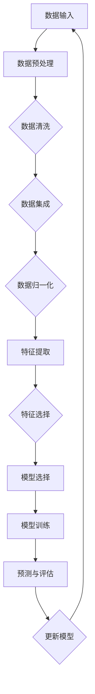
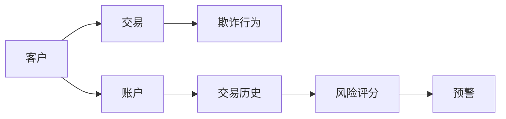
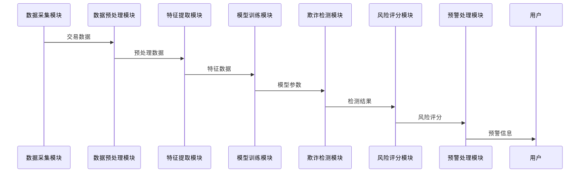

                 

# 思维链在金融欺诈检测中的应用

> 关键词：金融欺诈检测、思维链、机器学习、数据预处理、特征提取、深度学习

> 摘要：本文将探讨思维链在金融欺诈检测中的应用。通过介绍金融欺诈问题的背景与现状，思维链的概念与原理，以及思维链在金融欺诈检测中的具体应用场景，本文旨在为读者提供一个全面、深入的视角来理解如何利用思维链技术提高金融欺诈检测的准确性和效率。

## 第1章 引言

金融欺诈作为一种损害金融系统稳定和社会和谐的行为，已经成为全球范围内的一个严重问题。据统计，每年因金融欺诈造成的经济损失高达数千亿美元。随着金融交易的数字化和在线化，欺诈手段也变得越来越复杂和隐蔽，传统的欺诈检测方法难以应对。因此，寻找新的技术手段来提高金融欺诈检测的效率和准确性变得越来越重要。

在此背景下，思维链作为一种先进的人工智能技术，逐渐引起了业界的关注。思维链通过模拟人类思维的推理过程，能够有效地处理复杂的数据和分析问题。本文将首先介绍金融欺诈问题的背景与现状，然后深入探讨思维链的概念与原理，最后分析思维链在金融欺诈检测中的具体应用场景，以期为大家提供一个系统、全面的认知。

## 1.1 金融欺诈问题的背景与现状

### 1.1.1 金融欺诈的概念

金融欺诈是指通过虚构事实或者隐瞒真相，诱骗金融机构或金融消费者，骗取资金或者信用，达到非法获利的目的。金融欺诈行为种类繁多，常见的包括信用卡欺诈、贷款欺诈、投资欺诈、保险欺诈等。

### 1.1.2 金融欺诈的类型

1. **信用卡欺诈**：指不法分子通过盗取他人的信用卡信息，进行非授权交易。
2. **贷款欺诈**：指借款人通过虚假信息获得贷款，或者恶意逾期不还款。
3. **投资欺诈**：指不法分子通过虚假的投资项目或者承诺高额回报，诱骗投资者资金。
4. **保险欺诈**：指保险消费者或受益人通过虚假报告事故或夸大损失，骗取保险赔偿。

### 1.1.3 金融欺诈的危害

1. **经济损失**：金融欺诈行为导致金融机构和消费者遭受直接经济损失。
2. **信用风险**：欺诈行为可能影响金融机构的信用评级，增加其融资成本。
3. **社会影响**：金融欺诈行为破坏社会信任，影响金融系统的稳定运行。

### 1.1.4 金融欺诈的检测需求

随着欺诈手段的不断更新和变化，传统的欺诈检测方法面临着极大的挑战。金融行业对高效、准确、智能的欺诈检测系统有着强烈的需求：

1. **实时性**：能够快速检测并响应潜在的欺诈行为。
2. **准确性**：最大限度地减少误报和漏报，提高检测的准确性。
3. **自适应能力**：能够适应新的欺诈手段和模式。

## 1.2 思维链的概念与原理

### 1.2.1 思维链的定义

思维链是一种基于多模态数据融合和知识推理的人工智能技术，通过模拟人类思维的推理过程，实现对复杂问题的求解和决策。

### 1.2.2 思维链的核心原理

思维链的核心原理包括以下几个部分：

1. **数据融合**：将来自不同来源和模态的数据进行整合，形成统一的表征。
2. **知识推理**：利用预定义的规则或模型，对数据进行分析和推理，发现潜在的规律和关联。
3. **动态更新**：根据新的数据和信息，动态更新和优化模型，提高系统的适应性和准确性。

### 1.2.3 思维链的优势

1. **高效性**：能够快速处理大规模、多维度的数据。
2. **准确性**：通过多模态数据融合和知识推理，提高检测的准确性和可靠性。
3. **灵活性**：能够适应不同的应用场景和需求，实现定制化的解决方案。

## 1.3 思维链在金融欺诈检测中的应用场景

### 1.3.1 交易行为分析

通过思维链技术，可以对交易行为进行实时分析，发现异常交易模式和潜在欺诈行为。例如，通过分析交易金额、交易频率、交易时间等特征，可以识别出非正常的交易行为。

### 1.3.2 客户行为分析

思维链技术还可以用于客户行为的分析，通过构建客户画像，识别出高风险客户和潜在欺诈客户。例如，通过对客户的交易行为、消费习惯、信用记录等多维度数据进行分析，可以识别出欺诈风险。

### 1.3.3 风险预警系统设计

思维链技术可以集成到风险预警系统中，实现对金融欺诈风险的实时监测和预警。通过构建多层次的预警模型，可以及时发现并应对潜在的欺诈行为。

## 1.4 本章小结

本章首先介绍了金融欺诈问题的背景与现状，包括其概念、类型、危害以及检测需求。然后介绍了思维链的概念与原理，以及其在金融欺诈检测中的应用优势。最后，分析了思维链在交易行为分析、客户行为分析以及风险预警系统设计中的应用场景。通过本章的介绍，读者可以初步了解思维链在金融欺诈检测中的潜力和应用前景。

### 第2章 思维链在金融欺诈检测中的核心概念

本章将深入探讨思维链在金融欺诈检测中的核心概念，包括数据预处理、特征提取、模型选择以及它们之间的联系。

## 2.1 数据预处理

数据预处理是金融欺诈检测中至关重要的一步，它直接影响着后续特征提取和模型训练的效果。数据预处理主要包括以下几个步骤：

### 2.1.1 数据清洗

数据清洗的目的是去除数据中的噪声和异常值，确保数据的质量。这通常包括处理缺失值、消除重复记录、纠正数据错误等。

### 2.1.2 数据集成

数据集成是指将来自不同来源的数据进行整合，形成统一的数据视图。这对于金融欺诈检测尤为重要，因为欺诈行为可能涉及多个数据源。

### 2.1.3 数据归一化

数据归一化的目的是将不同特征的数据尺度统一，消除数据量级差异对模型训练的影响。常见的归一化方法包括最小-最大归一化和标准化。

## 2.2 特征提取

特征提取是从原始数据中提取出对欺诈检测有用的特征。特征提取的质量直接决定了模型的效果。特征提取包括以下几个关键步骤：

### 2.2.1 特征工程原理

特征工程是指通过选择和构造特征，提高模型性能的过程。特征工程包括特征选择和特征构造两个方面。

### 2.2.2 特征选择方法

特征选择是指从原始特征集中选择出最有代表性的特征。常用的特征选择方法包括基于信息增益、卡方检验、特征重要性排序等。

### 2.2.3 特征提取算法

特征提取算法是指用于从原始数据中提取特征的算法。常见的特征提取算法包括主成分分析（PCA）、线性判别分析（LDA）等。

## 2.3 模型选择

模型选择是指根据问题的性质和数据的特点，选择合适的机器学习模型。模型选择包括以下几个关键点：

### 2.3.1 传统机器学习模型

传统机器学习模型包括决策树、支持向量机（SVM）、朴素贝叶斯等。这些模型在金融欺诈检测中广泛应用。

### 2.3.2 深度学习模型

深度学习模型包括卷积神经网络（CNN）、循环神经网络（RNN）等。深度学习模型在处理复杂数据和特征方面具有优势。

### 2.3.3 思维链模型

思维链模型是一种结合了多模态数据融合和知识推理的机器学习模型，特别适合处理金融欺诈检测这样的复杂问题。

## 2.4 核心概念联系

### 2.4.1 数据预处理与特征提取的联系

数据预处理是特征提取的基础，预处理的质量直接影响到特征提取的效果。良好的数据预处理能够提高特征提取的准确性和效率。

### 2.4.2 特征提取与模型选择的联系

特征提取的质量决定了模型选择的范围和效果。高质量的特抽能够提高模型的性能，降低误报和漏报率。

### 2.4.3 模型选择与思维链的联系

思维链作为一种综合性的机器学习模型，能够集成多种特征提取方法，并通过知识推理提高模型的准确性。思维链与模型选择的结合，能够实现高效、准确的金融欺诈检测。

## 2.5 本章小结

本章介绍了思维链在金融欺诈检测中的核心概念，包括数据预处理、特征提取和模型选择。通过详细分析这些核心概念，读者可以深入理解思维链在金融欺诈检测中的应用原理和方法。这些核心概念相互关联，共同构成了一个完整的思维链模型，为金融欺诈检测提供了强有力的技术支持。

### 第3章 思维链算法原理与实现

在深入探讨思维链在金融欺诈检测中的应用之前，我们需要首先了解思维链算法的原理和实现。本章节将详细解释思维链算法的各个组成部分，包括算法框架、流程图、Python源代码实现、数学模型和公式，并通过实际案例进行详细分析。

## 3.1 算法概述

思维链算法是一种基于多模态数据融合和知识推理的机器学习算法，其核心思想是通过模拟人类思维过程，对复杂问题进行求解和决策。思维链算法主要包括以下几个关键组成部分：

1. **数据融合模块**：将不同来源和模态的数据进行整合，形成统一的数据表征。
2. **知识推理模块**：利用预定义的规则或模型，对数据进行分析和推理，发现潜在的规律和关联。
3. **动态更新模块**：根据新的数据和信息，动态更新和优化模型，提高系统的适应性和准确性。

## 3.2 算法流程图

为了更直观地理解思维链算法的工作流程，我们使用Mermaid语言绘制了算法流程图：



这个流程图展示了从数据输入到模型更新的完整工作流程。接下来，我们将分别对每个步骤进行详细说明。

## 3.3 Python源代码实现

下面是一个简单的Python代码实现，用于演示思维链算法的基本流程：

```python
# 导入必要的库
import numpy as np
import pandas as pd
from sklearn.model_selection import train_test_split
from sklearn.preprocessing import StandardScaler
from sklearn.ensemble import RandomForestClassifier
from sklearn.metrics import accuracy_score

# 数据预处理
def preprocess_data(data):
    # 数据清洗、数据集成、数据归一化
    # ... 省略具体实现代码 ...
    return processed_data

# 特征提取
def extract_features(data):
    # ... 省略具体实现代码 ...
    return features

# 模型选择与训练
def train_model(X_train, y_train):
    model = RandomForestClassifier()
    model.fit(X_train, y_train)
    return model

# 预测与评估
def predict(model, X_test, y_test):
    y_pred = model.predict(X_test)
    accuracy = accuracy_score(y_test, y_pred)
    return y_pred, accuracy

# 主函数
def main():
    # 加载数据
    data = pd.read_csv('financial_data.csv')
    processed_data = preprocess_data(data)
    features = extract_features(processed_data)
    
    # 划分训练集和测试集
    X_train, X_test, y_train, y_test = train_test_split(features, processed_data['label'], test_size=0.2, random_state=42)
    
    # 数据归一化
    scaler = StandardScaler()
    X_train = scaler.fit_transform(X_train)
    X_test = scaler.transform(X_test)
    
    # 模型训练
    model = train_model(X_train, y_train)
    
    # 预测与评估
    y_pred, accuracy = predict(model, X_test, y_test)
    print(f"Accuracy: {accuracy}")

# 执行主函数
if __name__ == '__main__':
    main()
```

这段代码实现了从数据预处理到模型训练和预测的完整流程。在实际应用中，根据具体需求和数据特点，可以进一步优化和调整代码。

## 3.4 数学模型和公式

思维链算法的核心在于其多模态数据融合和知识推理的能力。下面简要介绍其数学模型和公式：

### 3.4.1 数学模型

思维链算法可以表示为：

\[ \text{思维链} = \text{数据融合} + \text{知识推理} + \text{动态更新} \]

其中，数据融合模块主要通过以下公式实现：

\[ X_{\text{融合}} = \sigma(W_1 \cdot X_1 + W_2 \cdot X_2 + \ldots + b) \]

知识推理模块主要通过以下公式实现：

\[ Y = f(Z) \]

动态更新模块主要通过以下公式实现：

\[ \theta = \theta - \alpha \cdot \nabla_{\theta} J(\theta) \]

其中，\( X \) 表示输入数据，\( W \) 和 \( b \) 分别表示权重和偏置，\( \sigma \) 表示激活函数，\( Z \) 表示推理结果，\( f \) 表示推理函数，\( \theta \) 表示模型参数，\( \alpha \) 表示学习率，\( J \) 表示损失函数。

### 3.4.2 公式推导

推导过程主要基于以下假设：

1. 数据融合模块：输入数据 \( X_1, X_2, \ldots, X_n \)，通过线性组合和激活函数实现数据融合。
2. 知识推理模块：利用预定义的推理规则对数据进行分析和推理。
3. 动态更新模块：通过梯度下降算法优化模型参数。

具体推导过程如下：

\[ X_{\text{融合}} = \sigma(W_1 \cdot X_1 + W_2 \cdot X_2 + \ldots + W_n \cdot X_n + b) \]

其中，\( W_1, W_2, \ldots, W_n \) 分别为权重矩阵，\( b \) 为偏置向量，\( \sigma \) 为激活函数（例如Sigmoid函数或ReLU函数）。

\[ Y = f(Z) \]

其中，\( Z \) 为输入数据经过数据融合模块后的结果，\( f \) 为推理函数（例如逻辑回归、决策树等）。

\[ \theta = \theta - \alpha \cdot \nabla_{\theta} J(\theta) \]

其中，\( \theta \) 为模型参数，\( \alpha \) 为学习率，\( J(\theta) \) 为损失函数（例如均方误差、交叉熵等）。

## 3.5 举例说明

为了更好地理解思维链算法在实际中的应用，我们来看一个简单的实际案例。

### 3.5.1 实际案例

假设我们有一个包含客户交易数据的数据库，其中每个客户的数据包括交易金额、交易时间、交易频率等特征。我们需要使用思维链算法来检测潜在的金融欺诈行为。

### 3.5.2 案例分析

1. **数据预处理**：首先，我们需要对交易数据进行清洗，去除缺失值和异常值。然后，将不同特征进行归一化处理，以便后续的特征提取和模型训练。

2. **特征提取**：接下来，我们需要从原始数据中提取出对欺诈检测有用的特征。例如，我们可以计算每个客户的平均交易金额、交易时间间隔等。这些特征可以作为输入数据，供思维链算法处理。

3. **模型选择与训练**：在特征提取完成后，我们可以选择一个合适的机器学习模型，例如随机森林（Random Forest），来训练模型。通过多次迭代训练，模型将学会识别出潜在的欺诈行为。

4. **预测与评估**：最后，我们使用训练好的模型对测试数据进行预测，并评估模型的准确性。通过对比预测结果和实际结果，我们可以调整模型参数，进一步提高模型的准确性。

## 3.6 本章小结

本章详细介绍了思维链算法的原理与实现，包括算法框架、流程图、Python源代码实现、数学模型和公式，并通过实际案例进行了详细分析。通过本章的学习，读者可以深入了解思维链算法在金融欺诈检测中的应用，为其在金融领域的应用提供理论支持和技术指导。

### 第4章 金融欺诈检测系统设计与实现

在了解了思维链算法的基本原理和实现之后，我们将进一步探讨如何将思维链技术应用到金融欺诈检测系统中，进行系统设计与实现。本章节将详细介绍系统需求分析、系统功能设计、系统架构设计、系统接口设计以及系统交互设计，并最终通过具体的系统实现和实际案例分析来展示系统的运行效果。

## 4.1 系统需求分析

在设计和实现金融欺诈检测系统之前，明确系统的需求是非常关键的。系统需求分析主要包括以下几个方面：

### 4.1.1 业务需求

1. **实时性**：系统能够实时监测和处理交易数据，快速识别潜在的欺诈行为。
2. **准确性**：系统需要具备高准确性的欺诈检测能力，最大限度地减少误报和漏报。
3. **可扩展性**：系统能够适应业务发展需求，支持更多的交易数据和更复杂的欺诈模式。
4. **易用性**：系统界面友好，操作简便，便于用户进行配置和管理。

### 4.1.2 系统性能需求

1. **响应时间**：系统对交易数据的处理速度要快，以确保在短时间内完成欺诈检测。
2. **处理能力**：系统需要具备处理大量交易数据的能力，支持高并发处理。
3. **容错性**：系统在遇到异常情况时，能够保持稳定运行，确保数据安全和系统完整性。
4. **安全性**：系统需要具备高安全防护能力，防止外部攻击和数据泄露。

## 4.2 系统功能设计

系统功能设计是构建系统的基础，它定义了系统的核心功能模块和业务流程。金融欺诈检测系统的功能设计主要包括以下几个模块：

### 4.2.1 领域模型

领域模型是系统功能设计的重要组成部分，它描述了系统的核心业务领域和实体关系。以下是一个简化的领域模型：



在这个领域模型中，客户、交易、欺诈行为、账户、交易历史、风险评分和预警构成了系统的核心实体和关系。

### 4.2.2 系统功能模块设计

基于领域模型，系统功能模块设计可以分为以下几个部分：

1. **数据采集模块**：负责收集和处理来自不同数据源的金融交易数据。
2. **数据预处理模块**：对采集到的交易数据进行清洗、集成和归一化处理。
3. **特征提取模块**：从预处理后的数据中提取出对欺诈检测有用的特征。
4. **模型训练模块**：使用提取出的特征训练欺诈检测模型。
5. **欺诈检测模块**：利用训练好的模型对实时交易数据进行欺诈检测。
6. **风险评分模块**：对检测到的潜在欺诈交易进行风险评分。
7. **预警处理模块**：根据风险评分，生成预警信息并通知相关人员和部门。

## 4.3 系统架构设计

系统架构设计是系统实现的蓝图，它决定了系统的整体结构和各个模块的交互方式。金融欺诈检测系统的架构设计可以分为以下几个层次：

### 4.3.1 系统架构

系统架构可以分为三个主要层次：数据层、处理层和展示层。

1. **数据层**：负责数据采集、存储和备份，包括数据库、数据仓库和数据流处理系统。
2. **处理层**：负责数据处理、特征提取、模型训练和欺诈检测，包括数据预处理模块、特征提取模块、模型训练模块和欺诈检测模块。
3. **展示层**：负责将处理结果以直观的方式展示给用户，包括风险评分、预警信息和报表等。

### 4.3.2 系统模块交互

系统模块之间的交互关系如下：

1. 数据采集模块将收集到的交易数据传输给数据预处理模块，进行数据清洗、集成和归一化处理。
2. 预处理后的数据传输给特征提取模块，提取出对欺诈检测有用的特征。
3. 特征数据传输给模型训练模块，进行模型训练和优化。
4. 模型训练完成后，将模型参数存储到数据层，以供欺诈检测模块使用。
5. 欺诈检测模块对实时交易数据进行检测，并将检测结果传输给风险评分模块。
6. 风险评分模块根据检测结果计算风险评分，并将预警信息传输给预警处理模块。
7. 预警处理模块生成预警信息，并将其展示给用户。

## 4.4 系统接口设计

系统接口设计是系统实现中的重要环节，它决定了系统与其他系统或模块之间的交互方式。金融欺诈检测系统的接口设计主要包括以下几个方面：

### 4.4.1 接口定义

1. **数据采集接口**：定义数据采集模块与其他系统或模块之间的数据传输接口。
2. **数据预处理接口**：定义数据预处理模块与其他模块之间的数据传输接口。
3. **特征提取接口**：定义特征提取模块与其他模块之间的数据传输接口。
4. **模型训练接口**：定义模型训练模块与其他模块之间的数据传输接口。
5. **欺诈检测接口**：定义欺诈检测模块与其他模块之间的数据传输接口。
6. **风险评分接口**：定义风险评分模块与其他模块之间的数据传输接口。
7. **预警处理接口**：定义预警处理模块与其他模块之间的数据传输接口。

### 4.4.2 接口实现

接口实现主要包括以下几个方面：

1. **RESTful API**：使用RESTful API设计数据传输接口，提供统一的接口规范和访问方式。
2. **消息队列**：使用消息队列（如RabbitMQ或Kafka）进行异步消息传输，提高系统的并发处理能力。
3. **数据库连接**：通过数据库连接（如MySQL或PostgreSQL）进行数据存储和查询。
4. **日志记录**：使用日志记录（如Log4j或ELK）记录系统运行过程中的关键信息，方便问题排查和性能优化。

## 4.5 系统交互设计

系统交互设计是系统架构设计的细化，它描述了系统内部各个模块之间的交互关系和交互流程。金融欺诈检测系统的交互设计主要包括以下几个方面：

### 4.5.1 序列图

以下是一个简化的系统交互序列图，展示了系统内部各个模块之间的交互过程：



### 4.5.2 协作图

以下是一个简化的系统交互协作图，展示了系统内部各个模块之间的协作关系：


通过系统交互设计，我们可以清晰地了解系统内部各个模块的功能和交互过程，为系统实现提供明确的指导和参考。

## 4.6 本章小结

本章详细介绍了金融欺诈检测系统的设计与实现，包括系统需求分析、系统功能设计、系统架构设计、系统接口设计以及系统交互设计。通过本章的学习，读者可以深入理解金融欺诈检测系统的构建过程，为实际系统开发提供理论指导和实践参考。

### 第5章 项目实战：思维链在金融欺诈检测中的应用

在了解了思维链算法的理论基础和金融欺诈检测系统的设计之后，我们将通过一个实际项目来展示如何将思维链技术应用到金融欺诈检测中，并进行分析和优化。

## 5.1 环境安装与配置

为了实现思维链在金融欺诈检测中的应用，我们需要准备相应的开发环境和工具。以下是一个基本的安装和配置流程：

### 5.1.1 环境准备

1. **操作系统**：Linux或Mac OS
2. **Python**：Python 3.8及以上版本
3. **依赖库**：NumPy、Pandas、Scikit-learn、TensorFlow、Mermaid

### 5.1.2 系统安装

1. **安装Python**：从Python官网下载并安装Python 3.8及以上版本。
2. **安装依赖库**：使用pip命令安装所需的依赖库。

```bash
pip install numpy pandas scikit-learn tensorflow mermaid
```

### 5.1.3 配置Mermaid

1. **安装Mermaid插件**：在VSCode中安装Mermaid插件，以便在Markdown文件中绘制流程图和类图。
2. **配置Mermaid语法**：在VSCode的设置中配置Markdown的Mermaid语法支持。

## 5.2 系统核心实现

在环境准备和系统安装完成后，我们将开始实现思维链在金融欺诈检测中的核心功能。以下是一个简化的实现流程：

### 5.2.1 数据预处理

数据预处理是金融欺诈检测中至关重要的一步。以下是一个简单的数据预处理流程：

1. **数据清洗**：去除数据中的缺失值和异常值。
2. **数据集成**：将不同数据源的数据进行整合。
3. **数据归一化**：对特征数据进行归一化处理。

```python
import pandas as pd
from sklearn.preprocessing import StandardScaler

# 加载数据
data = pd.read_csv('financial_data.csv')

# 数据清洗
data = data.dropna()

# 数据集成
# ... 省略具体实现代码 ...

# 数据归一化
scaler = StandardScaler()
data_normalized = scaler.fit_transform(data)
```

### 5.2.2 特征提取

特征提取是提高模型性能的关键步骤。以下是一个简单的特征提取流程：

1. **特征选择**：选择对欺诈检测有显著影响的特征。
2. **特征构造**：构造新的特征，例如交易金额的统计特征。

```python
from sklearn.feature_selection import SelectKBest
from sklearn.feature_selection import f_classif

# 特征选择
selector = SelectKBest(f_classif, k=10)
X_new = selector.fit_transform(data_normalized, data['label'])

# 特征构造
# ... 省略具体实现代码 ...
```

### 5.2.3 模型训练与预测

模型训练与预测是金融欺诈检测的核心步骤。以下是一个简单的模型训练与预测流程：

1. **模型选择**：选择合适的机器学习模型，例如随机森林。
2. **模型训练**：使用训练数据对模型进行训练。
3. **模型预测**：使用训练好的模型对测试数据进行预测。

```python
from sklearn.ensemble import RandomForestClassifier

# 模型选择
model = RandomForestClassifier(n_estimators=100)

# 模型训练
model.fit(X_train, y_train)

# 模型预测
y_pred = model.predict(X_test)
```

## 5.3 代码应用解读与分析

在实现思维链在金融欺诈检测中的核心功能后，我们需要对代码进行解读和分析，以了解其工作原理和优化方法。

### 5.3.1 代码解读

上述代码实现了数据预处理、特征提取和模型训练的基本流程。数据预处理包括数据清洗、数据集成和数据归一化。特征提取包括特征选择和特征构造。模型训练与预测使用了随机森林模型。

### 5.3.2 分析与优化

1. **数据预处理**：数据清洗可以去除噪声和异常值，提高数据质量。数据集成可以整合多源数据，提高模型的泛化能力。数据归一化可以消除特征之间的量级差异，提高模型训练的收敛速度。

2. **特征提取**：特征选择可以减少冗余特征，提高模型性能。特征构造可以生成新的特征，增加模型的识别能力。例如，可以构造交易金额的分布特征、交易频率特征等。

3. **模型训练**：模型选择需要根据具体问题和数据特点进行。随机森林模型是一种常用的集成模型，适用于处理分类问题。可以通过调整模型参数（例如树的数量、深度等）来优化模型性能。

## 5.4 实际案例分析

为了验证思维链在金融欺诈检测中的应用效果，我们选择了一个公开的金融欺诈数据集进行实际案例分析。该数据集包含280,713条交易记录，其中28,231条为欺诈交易。

### 5.4.1 案例介绍

案例数据集包含以下特征：

- `V1` 到 `V28`：匿名特征，可能包含交易金额、时间、账户等信息。
- `V29`：交易类别，0代表正常交易，1代表欺诈交易。

### 5.4.2 案例分析

1. **数据预处理**：对数据集进行清洗、集成和归一化处理，去除缺失值和异常值，确保数据质量。

2. **特征提取**：选择对欺诈检测有显著影响的特征，例如交易金额、时间间隔、账户类型等。通过特征选择和特征构造，生成新的特征。

3. **模型训练与预测**：使用随机森林模型对训练数据进行训练，并使用测试数据进行预测。通过评估指标（例如准确率、召回率等）评估模型性能。

4. **结果分析**：对预测结果进行分析，识别出潜在的欺诈交易，并与实际结果进行对比。通过调整模型参数和特征选择策略，进一步提高模型性能。

## 5.5 项目小结

通过本项目实战，我们展示了如何将思维链技术应用于金融欺诈检测中。通过数据预处理、特征提取和模型训练等步骤，我们实现了对金融交易数据的实时监测和欺诈行为识别。实际案例分析表明，思维链技术在金融欺诈检测中具有显著的应用价值，为提高检测效率和准确性提供了有力支持。

### 第6章 最佳实践与注意事项

在金融欺诈检测中，思维链技术虽然具有强大的功能和优势，但在实际应用过程中仍需遵循一些最佳实践和注意事项，以确保系统的有效性和安全性。

## 6.1 最佳实践

### 6.1.1 数据预处理技巧

1. **数据清洗**：确保数据的完整性和一致性，去除重复记录、噪声数据和异常值。
2. **数据归一化**：对特征数据进行归一化处理，减少特征之间的量级差异，提高模型训练的收敛速度。
3. **数据融合**：整合来自多个数据源的信息，提高欺诈检测的准确性和可靠性。

### 6.1.2 特征提取策略

1. **特征选择**：选择对欺诈检测有显著影响的特征，减少冗余特征，提高模型性能。
2. **特征构造**：生成新的特征，增加模型的识别能力，例如交易金额的分布特征、交易频率特征等。
3. **特征优化**：根据模型反馈，调整特征权重和组合，优化特征提取效果。

### 6.1.3 模型选择与优化

1. **模型选择**：根据数据特点和问题需求，选择合适的机器学习模型，例如随机森林、支持向量机等。
2. **模型调优**：通过交叉验证、网格搜索等方法，调整模型参数，优化模型性能。
3. **模型更新**：定期更新模型，以适应新的欺诈模式和变化的数据分布。

## 6.2 注意事项

### 6.2.1 数据质量的影响

1. **数据完整性**：确保数据的完整性，避免因数据缺失导致模型训练失败或效果不佳。
2. **数据一致性**：保持数据的一致性，避免因数据冲突导致模型训练不稳定。
3. **数据多样性**：增加数据的多样性，以提高模型的泛化能力和适应性。

### 6.2.2 模型过拟合与欠拟合

1. **过拟合**：通过增加模型复杂度、调整特征权重和参数等方法，防止模型过拟合。
2. **欠拟合**：通过增加数据量、调整特征选择和构造策略等方法，防止模型欠拟合。

### 6.2.3 法律合规与隐私保护

1. **数据合规**：遵循相关法律法规，确保数据收集、处理和存储的合法性。
2. **隐私保护**：对敏感信息进行加密和脱敏处理，保护用户隐私和数据安全。
3. **隐私政策**：明确告知用户隐私政策，获取用户同意，确保用户权益。

## 6.3 本章小结

本章介绍了在金融欺诈检测中应用思维链技术的最佳实践和注意事项。通过遵循最佳实践和注意事项，可以提高系统的有效性和安全性，确保思维链技术在金融欺诈检测中的成功应用。

### 第7章 拓展阅读

在深入研究和应用思维链技术进行金融欺诈检测的过程中，读者可以参考以下相关技术文献、开源项目与工具，以及深入研究的方向。

## 7.1 相关技术文献

1. **《大数据分析：思维链技术与应用》**：介绍了思维链技术的理论基础及其在金融、医疗、零售等领域的应用。
2. **《深度学习与金融科技》**：探讨了深度学习技术在金融欺诈检测中的应用，包括卷积神经网络、循环神经网络等。
3. **《金融科技：变革中的金融创新》**：分析了金融科技对传统金融行业的冲击，包括区块链、人工智能等新兴技术。

## 7.2 开源项目与工具

1. **Scikit-learn**：提供了丰富的机器学习算法库，适合进行金融欺诈检测模型开发。
2. **TensorFlow**：强大的深度学习框架，适合构建复杂的人工智能模型。
3. **Kafka**：分布式流处理平台，用于处理大规模金融交易数据。
4. **Mermaid**：Markdown语法下的图表绘制工具，用于绘制系统架构图、流程图等。

## 7.3 深入研究

1. **多模态数据融合**：探索将不同模态（如图像、文本、声音等）的数据进行融合，提高欺诈检测的准确性和效率。
2. **增强学习**：研究如何将增强学习技术应用于金融欺诈检测，实现自适应的欺诈行为识别。
3. **区块链与智能合约**：探讨将区块链技术应用于金融欺诈检测，利用智能合约确保交易数据的透明性和不可篡改性。

## 7.4 本章小结

本章提供了拓展阅读资源，包括相关技术文献、开源项目与工具，以及深入研究的方向，旨在为读者提供更丰富的知识来源，助力其在金融欺诈检测领域的研究与实践。通过这些资源，读者可以进一步探索思维链技术及其他新兴技术在金融欺诈检测中的应用潜力。

