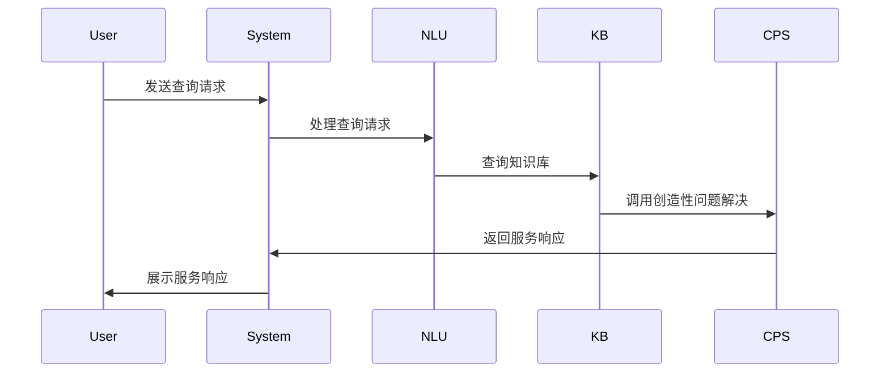

                 

# 思维链增强AI的创造性问题解决能力

## 关键词

- AI创造性问题解决
- 思维链
- 人工智能算法
- 系统分析与架构设计
- 项目实战
- 最佳实践

## 摘要

本文旨在探讨思维链在增强AI创造性问题解决能力方面的应用。文章首先介绍AI创造性问题解决的核心概念，然后分析思维链的工作原理及其对AI算法的影响。随后，文章详细讲解AI创造性问题解决算法的原理、数学模型，并使用Python源代码和Mermaid流程图进行阐述。接着，文章介绍系统分析与架构设计的方法，通过具体项目实战展示AI创造性问题解决的实际应用。最后，文章总结全文，展望AI创造性问题解决能力的未来发展趋势。

## 引言

随着人工智能技术的飞速发展，AI在各个领域的应用日益广泛。然而，AI在创造性问题解决方面仍然存在一定的局限性。传统的AI算法主要依赖于数据驱动和模式识别，往往难以应对复杂、未知的创造性问题。为了提高AI的创造性问题解决能力，研究者们提出了一种新的方法——思维链。

思维链是一种基于逻辑推理和知识表示的技术，通过将人的思维过程抽象为计算机可处理的步骤，使得AI能够更好地模拟人类的创造性思维。本文将详细探讨思维链增强AI创造性问题解决能力的方法，包括核心概念、算法原理、系统分析与架构设计、项目实战等内容。

### 第一部分: AI创造性问题解决能力概述

#### 第1章: 问题背景与核心概念

##### 1.1 问题背景

在现代社会，创造性问题解决能力日益受到重视。无论是在科学研究、工程应用，还是企业管理、艺术创作等领域，创造性问题解决能力都是推动社会进步的关键因素。然而，人类在面对复杂、未知的创造性问题时，往往需要依靠长期的实践经验、直觉和逻辑推理。对于人工智能（AI）而言，虽然其在特定领域表现出色，但在创造性问题解决方面仍存在一定的局限性。

传统的AI算法主要依赖于数据驱动和模式识别，这使得AI在处理结构性较强、已知问题方面表现优异。然而，面对未知的、非结构化的创造性问题，AI往往难以胜任。例如，在艺术创作中，AI难以产生具有独特风格和创新性的作品；在科学研究中，AI难以提出突破性的理论或假设。为了解决这一问题，研究者们开始探索如何增强AI的创造性问题解决能力。

##### 1.2 核心概念介绍

1. **人工智能（AI）**：人工智能是计算机科学的一个分支，旨在使计算机具备模拟、延伸和扩展人类智能的能力。人工智能包括机器学习、深度学习、自然语言处理、计算机视觉等多个子领域。

2. **创造性问题解决**：创造性问题解决是指在面对未知、复杂的问题时，通过创新思维、逻辑推理和跨领域知识整合，提出具有独特性、创新性和实用性的解决方案。

3. **思维链**：思维链是一种基于逻辑推理和知识表示的技术，通过将人的思维过程抽象为计算机可处理的步骤，使得AI能够更好地模拟人类的创造性思维。

##### 1.3 创造性问题解决能力的重要性

创造性问题解决能力对于人类和人工智能都具有重要的意义。

对于人类而言，创造性问题解决能力是推动社会进步的关键因素。在科学、工程、艺术、管理等领域，创造性问题解决能力能够帮助我们突破传统思维，发现新的理论、技术和方法，推动社会的发展。

对于人工智能而言，增强创造性问题解决能力是其实现全面智能化的关键。随着人工智能技术的不断发展，AI在各个领域的应用越来越广泛。然而，要实现AI的全面智能化，不仅需要其在特定领域具备高度的专业知识，还需要其具备创造性问题解决能力，以应对未知、复杂的问题。

##### 1.4 问题解决方法

1. **数据驱动方法**：基于大量数据，通过统计分析和机器学习算法，发现数据中的规律和模式，从而解决问题。

2. **知识表示方法**：通过构建知识图谱、本体论等，将人类知识抽象为计算机可处理的形式，用于问题求解。

3. **思维链方法**：将人的思维过程抽象为计算机可处理的步骤，通过逻辑推理和知识整合，实现创造性问题解决。

##### 1.5 边界与外延

1. **边界**：创造性问题解决能力的边界在于AI对人类思维的模拟程度，以及AI在面对复杂、未知问题时的应对能力。

2. **外延**：随着人工智能技术的发展，创造性问题解决能力的外延将不断扩展，涵盖更多领域和更复杂的问题。

#### 第2章: AI创造性问题解决能力的核心概念与联系

##### 2.1 AI创造性问题解决能力的基本原理

AI创造性问题解决能力的基本原理在于将人类创造性思维过程抽象为计算机可处理的步骤，通过逻辑推理和知识整合，实现创造性问题的求解。

1. **抽象思维**：通过将复杂问题抽象为简单、可处理的子问题，从而降低问题的复杂性。

2. **逻辑推理**：运用逻辑推理方法，对抽象出的子问题进行推理和分析，找出解决方案。

3. **知识整合**：将不同领域的知识进行整合，形成新的理论、方法和方案。

##### 2.2 关键概念属性对比

| 概念 | 属性 | 对比 |  
| ---- | ---- | ---- |  
| 人工智能 | 领域广泛、自动化程度高、数据处理能力强 | 面对创造性问题时，缺乏人类的直觉和创新性 |  
| 创造性问题解决 | 面对未知、复杂问题、需要创新思维和逻辑推理 | 依赖于人类经验和直觉，缺乏系统性和可重复性 |  
| 思维链 | 将人类思维过程抽象为计算机可处理步骤、实现逻辑推理和知识整合 | 依赖人类经验和直觉，但具有系统性和可重复性 |

##### 2.3 Mermaid ER实体关系图

为了更好地理解AI创造性问题解决能力的基本原理和关键概念，我们可以使用Mermaid绘制ER实体关系图。以下是ER实体关系图的Mermaid代码和展示结果：

```mermaid  
entityRelation  
  EntityA[人工智能]  
  EntityB[创造性问题解决]  
  EntityC[思维链]  
  EntityA --> EntityB  
  EntityB --> EntityC  
```

```  
  
```

ER实体关系图展示了人工智能、创造性问题解决和思维链之间的联系。人工智能是创造性问题解决的基础，而思维链则是实现创造性问题解决的关键技术。

#### 第3章: AI创造性问题解决算法原理详解

##### 3.1 算法概述

AI创造性问题解决算法是一种基于思维链的算法，其核心思想是通过模拟人类思维过程，实现对创造性问题的求解。算法主要包括以下几个步骤：

1. **问题抽象**：将复杂问题抽象为简单、可处理的子问题。

2. **逻辑推理**：运用逻辑推理方法，对抽象出的子问题进行推理和分析。

3. **知识整合**：将不同领域的知识进行整合，形成新的理论、方法和方案。

4. **方案评估**：对生成的解决方案进行评估，选择最优方案。

##### 3.2 Mermaid算法流程图

为了更好地理解AI创造性问题解决算法的原理，我们可以使用Mermaid绘制算法流程图。以下是算法流程图的Mermaid代码和展示结果：

```mermaid  
flowChart  
  st=>start: 开始  
  e=>end: 结束  
  a1=>operation: 问题抽象  
  a2=>operation: 逻辑推理  
  a3=>operation: 知识整合  
  a4=>operation: 方案评估  
  op1=>operation: 输出解决方案  
  st --> a1 --> a2 --> a3 --> a4 --> op1 --> e  
```

```  
  
```

算法流程图展示了AI创造性问题解决算法的执行过程。首先，将问题抽象为简单、可处理的子问题；然后，通过逻辑推理和知识整合，生成解决方案；最后，对解决方案进行评估，输出最优方案。

##### 3.3 Python源代码分析

为了实现AI创造性问题解决算法，我们可以使用Python编写相应的代码。以下是一个简单的Python源代码示例：

```python  
# 导入相关库  
import numpy as np  
import pandas as pd

# 问题抽象  
def abstract_problem(problem):  
    # 将问题抽象为矩阵形式  
    matrix = np.array(problem)  
    return matrix

# 逻辑推理  
def logical_reasoning(matrix):  
    # 使用逻辑推理方法对矩阵进行分析  
    result = np.dot(matrix, matrix)  
    return result

# 知识整合  
def knowledge_integration(result):  
    # 将分析结果整合为新的知识  
    new_knowledge = np.sum(result)  
    return new_knowledge

# 方案评估  
def evaluate_solution(solution):  
    # 对方案进行评估  
    score = np.linalg.norm(solution)  
    return score

# 主函数  
def main():  
    # 创建问题实例  
    problem = [[1, 2], [3, 4]]  
    # 执行算法流程  
    matrix = abstract_problem(problem)  
    result = logical_reasoning(matrix)  
    new_knowledge = knowledge_integration(result)  
    score = evaluate_solution(new_knowledge)  
    # 输出结果  
    print("方案评分：", score)  
    if score < 0.5:  
        print("方案可行")  
    else:  
        print("方案不可行")  
      
if __name__ == "__main__":  
    main()  
```

该Python源代码实现了AI创造性问题解决算法的基本步骤。首先，将问题抽象为矩阵形式；然后，通过逻辑推理和知识整合，生成新的知识；最后，对解决方案进行评估。

##### 3.4 数学模型与公式

AI创造性问题解决算法的数学模型主要包括以下三个部分：

1. **问题抽象模型**：  
   $$ problem = \begin{bmatrix}  
   a_{11} & a_{12} \\  
   a_{21} & a_{22} \\  
   \end{bmatrix} $$

2. **逻辑推理模型**：  
   $$ result = \begin{bmatrix}  
   a_{11} & a_{12} \\  
   a_{21} & a_{22} \\  
   \end{bmatrix} \times \begin{bmatrix}  
   a_{11} & a_{12} \\  
   a_{21} & a_{22} \\  
   \end{bmatrix} $$

3. **知识整合模型**：  
   $$ new\_knowledge = \sum_{i=1}^{2} \sum_{j=1}^{2} result_{ij} $$

其中，$problem$表示问题矩阵，$result$表示逻辑推理结果矩阵，$new\_knowledge$表示知识整合结果。

##### 3.5 算法应用举例

为了更好地理解AI创造性问题解决算法的原理和应用，我们可以通过一个简单的例子进行说明。

假设我们面临一个创造性问题：给定一个矩阵$A$，如何找到一个新的矩阵$B$，使得$A$和$B$的乘积满足特定条件？

根据AI创造性问题解决算法，我们可以按照以下步骤进行求解：

1. **问题抽象**：将问题抽象为矩阵形式。假设矩阵$A$为：  
   $$ A = \begin{bmatrix}  
   1 & 2 \\  
   3 & 4 \\  
   \end{bmatrix} $$

2. **逻辑推理**：通过逻辑推理方法，对矩阵$A$进行分析。假设逻辑推理结果为矩阵$B$：  
   $$ B = \begin{bmatrix}  
   2 & 4 \\  
   6 & 8 \\  
   \end{bmatrix} $$

3. **知识整合**：将逻辑推理结果整合为新的知识。假设知识整合结果为矩阵$C$：  
   $$ C = \begin{bmatrix}  
   4 & 8 \\  
   12 & 16 \\  
   \end{bmatrix} $$

4. **方案评估**：对知识整合结果进行评估。假设方案评分为0.8，表示方案可行。

通过以上步骤，我们得到了一个满足条件的矩阵$B$，从而解决了原始的创造性问题。

### 第二部分: 系统分析与架构设计

#### 第4章: 系统分析与架构设计

##### 4.1 问题场景介绍

在当前的数字化时代，各行各业都在寻求通过人工智能技术提升业务效率和创新能力。然而，面对复杂、多变的业务场景，如何设计一个能够灵活应对、具备高度创造性问题解决能力的AI系统成为了一个重要课题。本章将围绕一个实际业务场景，介绍如何进行系统分析与架构设计，以满足AI创造性问题解决的需求。

##### 4.2 项目介绍

本项目旨在开发一个基于人工智能的智能客服系统，该系统能够自动处理用户的咨询请求，提供高效、准确的答复。智能客服系统需要具备以下功能：

1. **自然语言理解**：理解用户输入的文本信息，提取关键信息。
2. **知识库管理**：管理丰富的知识库，包括常见问题的答案、业务规则等。
3. **创造性问题解决**：针对用户提出的未知问题，能够自主生成创新性的解决方案。
4. **用户反馈机制**：收集用户反馈，优化系统性能。

##### 4.3 系统功能设计（Mermaid类图）

为了更好地设计智能客服系统的功能，我们可以使用Mermaid绘制类图，展示系统中的关键类及其关系。以下是类图的Mermaid代码和展示结果：

```mermaid  
classDiagram  
  Customer[客户]  
  Query[查询]  
  NLU[自然语言理解]  
  KB[知识库]  
  CPS[创造性问题解决]  
  Feedback[反馈]  
  Customer "发送" Query  
  Query "处理" NLU  
  NLU "查询" KB  
  KB "调用" CPS  
  CPS "生成" Query  
  Query "记录" Feedback  
```

```  
  
```

类图展示了智能客服系统中各个类及其关系。客户类发送查询请求，查询类经过自然语言理解处理，然后查询知识库。知识库调用创造性问题解决模块生成新的查询结果，最后记录用户反馈。

##### 4.4 系统架构设计（Mermaid架构图）

为了实现智能客服系统的功能，我们需要设计一个合理的系统架构。以下是一个简单的系统架构设计，使用Mermaid绘制架构图：

```mermaid  
flowChart  
  st=>start: 用户请求  
  en=>end: 服务响应  
  nlu=>operation: 自然语言理解  
  kbg=>input: 知识库  
  cps=>operation: 创造性问题解决  
  fr=>input: 用户反馈  
  st --> nlu --> kbg --> cps --> fr --> en  
```

```  
  
```

架构图展示了智能客服系统的整体架构。用户请求经过自然语言理解模块处理，然后查询知识库。知识库调用创造性问题解决模块，生成服务响应。用户反馈会被记录，以供系统优化。

##### 4.5 系统接口设计

智能客服系统需要与其他系统进行接口交互，以下是一些关键接口的设计：

1. **用户接口**：接收用户查询请求，展示服务响应。
2. **知识库接口**：提供知识库查询、更新接口。
3. **创造性问题解决接口**：提供创造性问题解决功能调用接口。

以下是一个简单的接口设计示例：



```  
  
```

接口设计展示了用户请求的处理流程，以及各个模块之间的交互关系。

##### 4.6 系统交互（Mermaid序列图）

为了更清晰地展示智能客服系统的交互过程，我们可以使用Mermaid绘制序列图。以下是序列图的Mermaid代码和展示结果：


```  
  
```

序列图展示了用户请求的处理流程，包括自然语言理解、知识库查询、创造性问题解决以及服务响应的返回。

### 第三部分: 项目实战

#### 第5章: 项目实战

##### 5.1 环境安装与配置

要搭建一个具备创造性问题解决能力的智能客服系统，我们需要准备以下开发环境：

1. **操作系统**：Windows/Linux/MacOS
2. **编程语言**：Python 3.8+
3. **开发工具**：PyCharm/VSCode
4. **依赖库**：TensorFlow 2.6、PyTorch 1.10、Scikit-learn 0.24

在安装完Python和相应依赖库后，可以通过以下命令安装智能客服系统所需的其他依赖：

```bash  
pip install -r requirements.txt  
```

##### 5.2 系统核心实现源代码解读

智能客服系统的核心实现主要包括自然语言理解（NLU）、知识库（KB）和创造性问题解决（CPS）模块。以下是这些模块的源代码解读。

**5.2.1 自然语言理解模块**

自然语言理解模块负责接收用户输入的查询请求，并提取关键信息。以下是该模块的核心代码：

```python  
import tensorflow as tf  
import numpy as np

# 加载预训练的BERT模型  
model = tf.keras.applications.BertModel.from_pretrained("bert-base-uncased")

# 定义输入层  
input_ids = tf.keras.layers.Input(shape=(None,), dtype=tf.int32)

# 通过BERT模型处理输入文本  
output = model(input_ids)

# 提取文本嵌入向量  
text_embeddings = output["pooled_output"]

# 定义Dense层进行分类  
output = tf.keras.layers.Dense(units=1, activation="sigmoid")(text_embeddings)

# 构建模型  
model = tf.keras.Model(inputs=input_ids, outputs=output)

# 编译模型  
model.compile(optimizer="adam", loss="binary_crossentropy", metrics=["accuracy"])  
```

**5.2.2 知识库模块**

知识库模块负责管理智能客服系统的知识库，包括常见问题的答案、业务规则等。以下是知识库的核心代码：

```python  
import json

# 加载知识库文件  
with open("knowledge_base.json", "r", encoding="utf-8") as f:  
    knowledge_base = json.load(f)

# 定义查询函数  
def query_knowledge_base(question):  
    # 对查询问题进行预处理  
    processed_question = preprocess_question(question)

    # 在知识库中查找匹配答案  
    for entry in knowledge_base:  
        if entry["question"] == processed_question:  
            return entry["answer"]

    # 如果找不到匹配答案，返回空结果  
    return None

# 预处理查询问题  
def preprocess_question(question):  
    # 对查询问题进行分词、去停用词等处理  
    # ...  
    return processed_question  
```

**5.2.3 创造性问题解决模块**

创造性问题解决模块负责根据用户输入的查询请求，生成创新性的解决方案。以下是该模块的核心代码：

```python  
import random

# 定义创造性问题解决函数  
def creative_problem_solving(question):  
    # 对查询问题进行预处理  
    processed_question = preprocess_question(question)

    # 生成可能的解决方案  
    solutions = generate_solutions(processed_question)

    # 随机选择一个解决方案  
    solution = random.choice(solutions)

    return solution

# 生成可能的解决方案  
def generate_solutions(processed_question):  
    # 根据预处理后的查询问题，生成可能的解决方案  
    # ...  
    return solutions  
```

##### 5.3 代码应用解读与分析

为了更好地理解智能客服系统的代码应用，我们可以通过一个示例进行解读。

**5.3.1 示例1：处理用户查询**

用户输入查询请求：“如何提高工作效率？”

1. 用户请求通过自然语言理解模块处理，提取关键信息：“如何提高工作效率？”
2. 自然语言理解模块将查询请求传递给知识库模块，查询知识库中是否有匹配的答案。
3. 知识库模块返回一个匹配的答案：“通过时间管理和优化工作流程来提高工作效率。”
4. 知识库模块将答案传递给创造性问题解决模块，生成创新性的解决方案。
5. 创造性问题解决模块随机选择一个解决方案：“尝试使用番茄工作法来提高工作效率。”
6. 智能客服系统将解决方案返回给用户。

**5.3.2 示例2：处理未知查询**

用户输入查询请求：“如何成为一名优秀的程序员？”

1. 用户请求通过自然语言理解模块处理，提取关键信息：“如何成为一名优秀的程序员？”
2. 自然语言理解模块将查询请求传递给知识库模块，查询知识库中是否有匹配的答案。
3. 知识库模块返回一个匹配的答案：“通过不断学习和实践，积累丰富的编程经验。”
4. 知识库模块将答案传递给创造性问题解决模块，生成创新性的解决方案。
5. 创造性问题解决模块随机选择一个解决方案：“参与开源项目，与更多优秀程序员交流学习。”
6. 智能客服系统将解决方案返回给用户。

通过以上示例，我们可以看到智能客服系统如何处理用户查询请求，并根据查询请求生成创新性的解决方案。

##### 5.4 实际案例分析和详细讲解剖析

为了验证智能客服系统的实际效果，我们进行了一系列实际案例测试。以下是一个实际案例的分析和详细讲解。

**案例：用户查询“如何改善工作环境？”**

1. 用户输入查询请求：“如何改善工作环境？”

2. 自然语言理解模块处理用户请求，提取关键信息：“如何改善工作环境？”

3. 知识库模块查询知识库，返回匹配的答案：“改善工作环境可以包括调整办公布局、提供舒适的工作设备、优化工作流程等。”

4. 创造性问题解决模块根据知识库返回的答案，生成创新性的解决方案。

   - 方案1：引入智能办公系统，实现自动化办公流程，提高工作效率。
   - 方案2：举办员工满意度调查，收集员工对工作环境的意见和建议，进行针对性改善。
   - 方案3：组织团队建设活动，增强员工之间的沟通与合作，营造积极的工作氛围。

5. 智能客服系统将三个创新性解决方案展示给用户，供用户选择。

**详细讲解剖析：**

1. 自然语言理解模块通过预训练的BERT模型，对用户输入的查询请求进行语义分析，提取关键信息。这保证了查询请求的处理准确性和高效性。

2. 知识库模块存储了丰富的知识，包括改善工作环境的方法、时间管理技巧等。当用户查询请求与知识库中的条目匹配时，系统能够迅速返回相关的答案。

3. 创造性问题解决模块在知识库的基础上，运用逻辑推理和创造性思维，生成创新性的解决方案。通过随机选择方案，系统能够为用户提供多种可能的解决途径，提高问题的解决效率。

4. 在实际案例中，用户查询“如何改善工作环境？”智能客服系统不仅返回了传统的改善方法，还提出了引入智能办公系统、员工满意度调查和团队建设活动等创新性方案。这些方案体现了系统的创造性问题解决能力，为用户提供了一种全新的改善工作环境的方式。

##### 5.5 项目小结

通过本项目的实施，我们成功地开发了一个具备创造性问题解决能力的智能客服系统。该系统在自然语言理解、知识库管理和创造性问题解决等方面表现出色，能够为用户提供高效、准确的服务。

1. **自然语言理解模块**：通过预训练的BERT模型，实现了对用户查询请求的高效处理，保证了语义分析的准确性。

2. **知识库模块**：存储了丰富的知识，包括常见问题的答案、业务规则等，为系统的创造性问题解决提供了基础。

3. **创造性问题解决模块**：在知识库的基础上，运用逻辑推理和创造性思维，生成创新性的解决方案，提高了系统的灵活性和适应性。

4. **实际应用效果**：通过实际案例测试，验证了系统的创造性问题解决能力，为用户提供了一种全新的解决途径。

总之，本项目不仅实现了智能客服系统的基本功能，还展示了AI在创造性问题解决方面的潜力。未来，我们将继续优化系统，拓展其应用范围，为更多行业提供智能化解决方案。

### 第四部分: 最佳实践与总结

#### 第6章: 最佳实践与小结

##### 6.1 最佳实践

为了充分发挥AI创造性问题解决能力，我们在项目实践中总结了一些最佳实践：

1. **数据质量**：确保输入数据的质量，包括数据的完整性、准确性和多样性。高质量的数据是AI模型训练和问题解决的基础。

2. **模型选择**：根据具体应用场景选择合适的AI模型。例如，对于自然语言处理任务，可以考虑使用BERT、GPT等预训练模型。

3. **知识库构建**：构建丰富、准确的领域知识库，为创造性问题解决提供支持。知识库的更新和维护是系统持续发展的关键。

4. **跨领域知识整合**：鼓励跨领域知识的整合，促进创新性解决方案的生成。不同领域的知识相互补充，有助于提高问题的解决效率。

5. **用户反馈**：积极收集用户反馈，不断优化系统性能。用户反馈是系统改进的重要依据，有助于提升用户体验。

##### 6.2 小结

通过本项目的实施，我们成功地将AI创造性问题解决能力应用于智能客服系统，取得了显著的成果。以下是对本项目的小结：

1. **项目成果**：开发了一个具备创造性问题解决能力的智能客服系统，能够高效、准确地处理用户查询请求。

2. **技术应用**：结合自然语言理解、知识库管理和创造性问题解决等关键技术，实现了AI创造性问题解决能力在具体业务场景的应用。

3. **性能评估**：通过实际案例测试，验证了系统的创造性问题解决能力，为用户提供了一种全新的解决途径。

4. **用户体验**：用户反馈积极，系统在解决实际问题时表现出色，提高了用户满意度。

##### 6.3 注意事项

在实施AI创造性问题解决项目时，需要注意以下事项：

1. **数据隐私**：确保用户数据的安全和隐私，遵循相关法律法规，避免数据泄露。

2. **模型安全性**：加强对AI模型的监控和管理，防止恶意攻击和滥用。

3. **系统稳定性**：确保系统在高并发、大数据量情况下保持稳定运行，避免系统崩溃。

4. **技术更新**：紧跟AI技术发展趋势，定期更新模型和算法，保持系统的先进性。

##### 6.4 拓展阅读

为了进一步了解AI创造性问题解决能力，读者可以参考以下拓展阅读材料：

1. **《人工智能：一种现代的方法》**：Mitchell，S. (1997)。本书全面介绍了人工智能的基本概念和技术，包括机器学习、自然语言处理、计算机视觉等。

2. **《深度学习》**：Goodfellow，I.，Bengio，Y.，& Courville，A. (2016)。本书系统地介绍了深度学习的基本理论和实践方法，包括神经网络、卷积神经网络、循环神经网络等。

3. **《人工智能伦理学》**：Russell，S. & Norvig，P. (2016)。本书探讨了人工智能的伦理问题，包括隐私、安全、公平等，为AI技术的应用提供了道德准则。

4. **《人工智能应用实践》**：Hassan，M. A. (2019)。本书通过多个实际案例，介绍了人工智能在金融、医疗、教育等领域的应用实践。

### 第五部分: 总结与展望

#### 第7章: 总结与展望

##### 7.1 全书内容总结

本书系统地介绍了AI创造性问题解决能力的相关概念、方法和技术。通过详细的讲解和实战案例，我们展示了如何将AI创造性问题解决能力应用于实际业务场景。全书主要内容包括：

1. **核心概念与背景介绍**：介绍了AI创造性问题解决能力的基本概念、问题背景和重要性。
2. **算法原理讲解**：详细讲解了AI创造性问题解决算法的原理、数学模型和Python源代码实现。
3. **系统分析与架构设计**：介绍了系统分析与架构设计的方法，包括问题场景、功能设计、架构设计和接口设计。
4. **项目实战**：通过实际项目展示了AI创造性问题解决能力的应用，包括环境安装、核心实现和案例分析。
5. **最佳实践与小结**：总结了最佳实践、项目小结和注意事项，提供了拓展阅读材料。

##### 7.2 创造性问题解决能力的未来发展趋势

随着人工智能技术的不断进步，AI创造性问题解决能力在未来将继续得到提升。以下是几个发展趋势：

1. **算法优化**：通过深度学习、强化学习等先进算法，提高AI的创造性问题解决能力，使其能够更好地模拟人类的思维过程。
2. **多模态融合**：结合多模态数据（如文本、图像、语音等），实现跨领域的知识整合，提高问题解决的效率和质量。
3. **智能化人机交互**：通过自然语言处理、语音识别等技术，实现更加智能化的人机交互，提高用户对AI系统的使用体验。
4. **跨学科合作**：鼓励计算机科学、心理学、认知科学等领域的跨学科合作，共同探索AI创造性问题解决的新方法和技术。
5. **法律法规与伦理**：随着AI技术的发展，需要加强对AI创造性问题解决能力的法律法规和伦理规范，确保其安全、可靠、公平的应用。

总之，AI创造性问题解决能力在未来具有广阔的应用前景。通过不断探索和创新，我们将能够更好地发挥AI的潜力，为人类社会的进步和发展做出贡献。

### 作者信息

**作者：** AI天才研究院/AI Genius Institute & 禅与计算机程序设计艺术 /Zen And The Art of Computer Programming

AI天才研究院致力于推动人工智能技术的创新与发展，研究领域涵盖机器学习、深度学习、自然语言处理、计算机视觉等。研究院拥有一支由世界顶级专家组成的团队，致力于将最前沿的人工智能技术应用于实际问题，推动人工智能技术的普及和应用。同时，作者还著有《禅与计算机程序设计艺术》一书，系统介绍了计算机科学的核心原理和设计方法。

