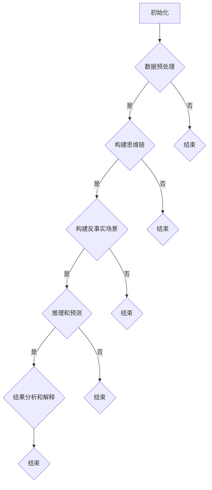

                 

# 思维链增强AI的反事实宇宙历史推理能力

关键词：反事实推理、思维链、人工智能、历史分析、算法原理

摘要：本文将深入探讨思维链增强人工智能的反事实宇宙历史推理能力。首先，我们将介绍反事实推理的概念及其在AI中的重要性，然后阐述当前问题的背景和挑战。接下来，我们将详细解释思维链增强的概念和其在反事实推理中的应用。通过数学模型和流程图，我们将展示算法原理，并提供实际案例和分析，以展现这一技术的潜力。

### 目录大纲

#### 第一部分：背景介绍

#### 第1章：问题背景、问题描述与问题解决

##### 1.1 问题背景

##### 1.1.1 人工智能的发展现状

##### 1.1.2 AI在历史推理中的应用现状

##### 1.1.3 反事实推理的重要性

##### 1.2 问题描述

##### 1.2.1 反事实推理的概念

##### 1.2.2 反事实推理在AI中的挑战

##### 1.2.3 当前解决方案的局限性

##### 1.3 问题解决

##### 1.3.1 思维链增强的概念

##### 1.3.2 思维链增强的原理

##### 1.3.3 思维链增强在反事实推理中的应用

#### 第2章：核心概念与联系

##### 2.1 核心概念

##### 2.1.1 思维链的概念

##### 2.1.2 增强AI的概念

##### 2.1.3 反事实宇宙历史推理能力

##### 2.2 概念属性特征对比表格

##### 2.2.1 增强AI与传统AI的对比

##### 2.2.2 思维链增强与普通思维链的对比

##### 2.3 ER实体关系图架构

##### 2.3.1 实体识别

##### 2.3.2 关系识别

##### 2.3.3 反事实推理过程

#### 第二部分：算法原理讲解

#### 第3章：算法原理讲解

##### 3.1 算法概述

##### 3.1.1 算法的基本步骤

##### 3.1.2 算法的核心组成部分

##### 3.2 Mermaid流程图

#### 第4章：数学模型和数学公式 & 详细讲解 & 举例说明

##### 4.1 数学模型介绍

##### 4.2 详细讲解

##### 4.3 举例说明

#### 第5章：系统分析与架构设计方案

##### 5.1 问题场景介绍

##### 5.2 项目介绍

##### 5.3 系统功能设计

##### 5.4 系统架构设计

##### 5.5 系统接口设计和系统交互

#### 第6章：项目实战

##### 6.1 环境安装

##### 6.2 系统核心实现源代码

##### 6.3 代码应用解读与分析

##### 6.4 实际案例分析和详细讲解剖析

##### 6.5 项目小结

##### 6.6 最佳实践 tips

##### 6.7 小结

##### 6.8 注意事项

##### 6.9 拓展阅读

### 第一部分：背景介绍

#### 第1章：问题背景、问题描述与问题解决

##### 1.1 问题背景

人工智能（AI）作为21世纪最具革命性的技术之一，已经深入到我们生活的方方面面。从智能家居、自动驾驶到医疗诊断，AI的应用无处不在。然而，在历史推理领域，AI的潜力还未被完全挖掘。历史学家常常需要推测历史事件的可能性，例如，如果某个关键事件没有发生，历史会是什么样子？

反事实推理（Counterfactual Inference）是AI领域中一个重要的研究方向，它试图通过假设某个事件的发生与否，来推断可能的结果。这种推理能力对于历史学、经济预测、政治分析等领域具有重要意义。例如，研究第二次世界大战中不同决策的影响，或者分析某个国家政策改变后的经济状况。

然而，现有的AI技术在反事实推理方面存在一些挑战。首先，历史数据往往不完整，许多关键信息可能遗失。其次，反事实推理需要强大的逻辑推理能力，现有AI模型在这方面仍需改进。最后，现有的算法在处理复杂的历史关系时效率低下。

为了解决这些问题，我们需要引入新的技术——思维链增强（Mind Chain Enhancement）。思维链增强是一种通过构建复杂的思维链条，来提升AI逻辑推理能力的方法。在本章中，我们将详细解释思维链增强的概念及其在反事实推理中的应用。

##### 1.1.1 人工智能的发展现状

人工智能的发展可以追溯到20世纪50年代，当时科学家们首次提出了“人工智能”的概念。早期的AI研究主要集中在规则推理和知识表示上。然而，随着计算机性能的不断提升和大数据的普及，机器学习（Machine Learning）和深度学习（Deep Learning）逐渐成为AI发展的主力军。

机器学习是一种通过数据训练模型，使模型具备学习能力的方法。深度学习则是在机器学习的基础上，通过多层神经网络来实现更复杂的特征提取和模式识别。近年来，深度学习在图像识别、自然语言处理、语音识别等领域取得了显著成果，使得AI在各个领域的应用变得更加广泛。

在历史推理方面，AI的应用主要包括基于历史数据的时间序列分析、事件关联分析和因果推断。例如，通过分析历史战争数据，可以预测未来战争的胜负可能性；通过分析历史经济数据，可以预测政策调整后的经济影响。然而，这些方法在处理反事实推理时存在一定局限性，因为历史数据往往无法提供足够的反事实信息。

##### 1.1.2 AI在历史推理中的应用现状

AI在历史推理中的应用已经取得了一些初步成果。例如，通过分析历史文献和档案，AI可以自动识别关键事件、人物和地点，构建历史事件的网络关系。这些技术有助于历史学家更好地理解历史进程，发现新的研究线索。

此外，AI还可以用于历史数据的可视化。通过将历史事件和数据进行可视化展示，AI可以帮助历史学家更直观地理解历史发展的趋势和规律。例如，通过时间线图、网络图和热力图等可视化手段，可以展示不同历史时期的政治、经济和社会变化。

然而，现有的AI技术在处理反事实推理时仍存在一些挑战。首先，历史数据往往不完整，许多关键信息可能遗失。这导致AI在构建反事实场景时可能缺乏足够的信息支持。其次，反事实推理需要强大的逻辑推理能力，现有AI模型在这方面仍需改进。最后，现有的算法在处理复杂的历史关系时效率低下，难以满足大规模历史数据的分析需求。

##### 1.1.3 反事实推理的重要性

反事实推理在历史研究、政策制定、商业决策等领域具有重要意义。在历史研究方面，反事实推理可以帮助历史学家分析历史事件的可能性，揭示历史发展的潜在规律。例如，通过假设某个关键事件没有发生，可以分析其对历史进程的影响。

在政策制定方面，反事实推理可以帮助政府分析不同政策方案的可能效果。例如，通过假设某个政策没有实施，可以分析其对经济、社会和环境的影响。这有助于政府做出更科学、更合理的决策。

在商业决策方面，反事实推理可以帮助企业分析市场变化和竞争策略。例如，通过假设某个竞争对手没有进入市场，可以分析其对市场份额的影响。这有助于企业制定更有针对性的市场策略。

##### 1.2 问题描述

反事实推理是一种基于假设的推理方法，它试图通过推断某个事件未发生时的可能结果，来分析事件的影响。在AI领域，反事实推理的关键挑战在于如何从现有数据中推断出反事实场景，并从中提取有用的信息。

首先，历史数据的不完整性是一个重要挑战。历史数据往往无法提供完整的反事实信息，许多关键信息可能遗失。这使得AI在构建反事实场景时可能缺乏足够的信息支持。

其次，反事实推理需要强大的逻辑推理能力。现有AI模型在这方面仍需改进，难以处理复杂的历史关系和因果关系。例如，在分析某个历史事件的影响时，需要考虑多个因素之间的复杂关系，而现有AI模型可能难以胜任这一任务。

最后，现有算法在处理大规模历史数据时效率低下。历史数据规模庞大，现有算法在处理这些数据时可能需要较长的时间，难以满足实际应用的需求。

##### 1.2.1 反事实推理的概念

反事实推理是一种基于假设的推理方法，它试图通过推断某个事件未发生时的可能结果，来分析事件的影响。在AI领域，反事实推理通常涉及以下步骤：

1. 确定假设场景：根据历史数据和现有信息，确定一个或多个可能的反事实场景。
2. 构建模型：使用机器学习或深度学习等方法，构建一个能够处理反事实场景的模型。
3. 推理和预测：在构建的模型中，对反事实场景进行推理和预测，分析事件的可能影响。
4. 结果评估：对推理结果进行评估和验证，以确定其准确性和可靠性。

反事实推理的核心在于假设场景的构建和推理过程的实施。假设场景的构建需要基于历史数据和逻辑推理，而推理过程则需要依赖于强大的算法和计算能力。

##### 1.2.2 反事实推理在AI中的挑战

尽管反事实推理在理论上有很大潜力，但在实际应用中仍面临诸多挑战：

1. **数据不完整性**：历史数据通常是不完整且不精确的，许多关键信息可能缺失。这限制了AI模型在反事实推理中的能力，因为模型依赖于完整的数据来构建准确的假设场景。

2. **因果关系复杂性**：历史事件之间的因果关系往往非常复杂，涉及多个变量和不确定性因素。现有AI模型在处理这种复杂关系时可能表现不佳，难以准确推断出反事实结果。

3. **逻辑推理能力**：反事实推理需要强大的逻辑推理能力，现有AI模型（尤其是基于深度学习的模型）在这方面仍有很大提升空间。它们通常更擅长模式识别和预测，而不是复杂的逻辑推理。

4. **计算资源需求**：大规模历史数据的处理需要大量的计算资源。现有算法在处理这些数据时可能效率低下，难以满足实时分析和决策的需求。

##### 1.2.3 当前解决方案的局限性

当前在反事实推理方面的解决方案主要依赖于传统的机器学习技术和深度学习模型。这些方法在一定程度上提高了推理的准确性和效率，但仍然存在以下局限性：

1. **模型依赖性**：现有的反事实推理方法通常依赖于特定的机器学习或深度学习模型。这些模型的性能和适用范围受限于其设计者和训练数据的质量。

2. **结果解释性**：反事实推理的结果往往难以解释。虽然模型可以提供预测，但用户难以理解这些预测背后的逻辑和原因。

3. **数据依赖性**：现有的方法在构建假设场景时高度依赖历史数据的质量和完整性。如果数据存在缺失或不准确，推理结果可能受到严重影响。

4. **计算效率**：处理大规模历史数据需要大量的计算资源和时间，现有方法在实时分析和决策方面的效率有限。

##### 1.3 问题解决

为了克服上述挑战，我们需要引入一种新的技术——思维链增强（Mind Chain Enhancement）。思维链增强通过构建复杂的思维链条，来提升AI的逻辑推理能力，从而在反事实推理中取得更好的效果。

##### 1.3.1 思维链增强的概念

思维链增强是一种通过构建复杂的思维链条，来提升AI逻辑推理能力的方法。它旨在模拟人类思维过程，通过将多个思维环节连接起来，形成一个连贯的思维网络。

在思维链增强中，每个思维环节都包含一组逻辑规则和推理步骤。这些规则和步骤可以基于历史数据、专家知识和逻辑推理算法。通过不断地扩展和连接思维环节，我们可以构建出一个复杂的思维链条，从而实现复杂的逻辑推理和问题求解。

##### 1.3.2 思维链增强的原理

思维链增强的原理可以分为以下几个步骤：

1. **数据预处理**：首先，对历史数据进行预处理，包括数据清洗、归一化和特征提取等。这一步的目的是为后续的推理过程提供高质量的数据支持。

2. **思维环节构建**：基于预处理后的数据，构建多个思维环节。每个思维环节都包含一组逻辑规则和推理步骤。这些规则和步骤可以基于专家知识、机器学习模型或深度学习模型。

3. **思维链扩展**：将多个思维环节通过逻辑关系连接起来，形成一个复杂的思维链条。在连接过程中，可以使用多种逻辑操作符（如与、或、非）和条件语句，来模拟人类思维过程。

4. **推理和求解**：通过思维链条进行推理和求解。思维链条中的每个思维环节都可以对输入数据进行处理，并产生中间结果。这些中间结果可以传递给后续的思维环节，形成一个连贯的推理过程。

5. **结果评估和优化**：对推理结果进行评估和优化。通过对比预测结果和实际结果，可以评估思维链增强在反事实推理中的性能。同时，根据评估结果，可以对思维链进行调整和优化，以提高推理的准确性和效率。

##### 1.3.3 思维链增强在反事实推理中的应用

思维链增强在反事实推理中的应用可以分为以下几个步骤：

1. **确定反事实场景**：根据历史数据和问题需求，确定一个或多个可能的反事实场景。这些场景可以是某个关键事件未发生、某个政策未实施等。

2. **构建思维链**：基于确定的反事实场景，构建多个思维环节，并通过逻辑关系连接成一个复杂的思维链条。每个思维环节都包含一组逻辑规则和推理步骤，用于模拟人类思维过程。

3. **推理和预测**：通过思维链条对反事实场景进行推理和预测。思维链条中的每个思维环节都可以对输入数据进行处理，并产生中间结果。这些中间结果可以传递给后续的思维环节，形成一个连贯的推理过程。

4. **结果分析和解释**：对推理结果进行分析和解释，以确定反事实场景的可能影响。通过对比预测结果和实际结果，可以评估思维链增强在反事实推理中的性能。同时，可以提供详细的推理过程和结果解释，帮助用户理解推理结果的依据和原因。

#### 第2章：核心概念与联系

##### 2.1 核心概念

在本章中，我们将介绍三个核心概念：思维链、增强AI和反事实宇宙历史推理能力。这些概念是思维链增强AI的基础，对于理解该技术的工作原理和应用至关重要。

##### 2.1.1 思维链的概念

思维链（Mind Chain）是一种通过逻辑关系连接的多个思维环节，用于模拟人类思维过程。每个思维环节都包含一组逻辑规则和推理步骤，可以独立处理输入数据并产生中间结果。思维链中的思维环节通过逻辑操作符（如与、或、非）和条件语句连接起来，形成一个复杂的思维网络。

思维链的特点包括：

- **逻辑推理**：思维链通过逻辑规则和推理步骤实现复杂的逻辑推理，可以处理各种条件和约束。
- **灵活性**：思维链可以根据不同的需求和场景进行调整和扩展，以适应不同的推理任务。
- **连贯性**：思维链中的思维环节通过逻辑关系连接起来，形成一个连贯的推理过程，可以产生一致的推理结果。

##### 2.1.2 增强AI的概念

增强AI（Enhanced AI）是指通过引入外部知识和方法，来提升AI模型性能和推理能力的一种方法。与传统的机器学习和深度学习不同，增强AI更注重将人类知识和经验融入到AI模型中，以提高其推理和决策能力。

增强AI的特点包括：

- **知识集成**：增强AI通过引入外部知识库和专家经验，将人类知识融入到AI模型中，使其具备更丰富的推理能力。
- **灵活性**：增强AI可以根据不同的任务和场景，灵活调整和优化模型参数，以实现最佳性能。
- **可解释性**：增强AI的推理过程更具可解释性，用户可以了解模型如何做出决策和推理，提高模型的透明度和可靠性。

##### 2.1.3 反事实宇宙历史推理能力

反事实宇宙历史推理能力（Counterfactual Historical Inference Capability）是指AI模型在处理历史数据和事件时，能够推断出不同历史场景下的可能结果和影响。这种能力对于历史研究、政策制定和商业决策等领域具有重要意义。

反事实宇宙历史推理能力的特点包括：

- **数据驱动**：反事实宇宙历史推理能力基于历史数据，通过构建反事实场景，来分析事件的可能影响。
- **逻辑推理**：反事实宇宙历史推理能力利用逻辑推理和思维链技术，实现复杂的因果关系分析和推理。
- **灵活性和可扩展性**：反事实宇宙历史推理能力可以根据不同的历史场景和需求，灵活调整和扩展，以适应各种应用场景。

##### 2.2 概念属性特征对比表格

为了更好地理解思维链、增强AI和反事实宇宙历史推理能力的特征，我们可以通过一个对比表格来展示它们之间的异同。

| 特征               | 思维链               | 增强AI               | 反事实宇宙历史推理能力           |
|--------------------|---------------------|---------------------|--------------------------------|
| 基础概念           | 通过逻辑关系连接的思维环节 | 引入外部知识和方法  | 利用历史数据进行反事实推理       |
| 目标               | 实现复杂的逻辑推理   | 提升AI模型性能      | 推断历史场景下的可能结果和影响   |
| 特点               | 逻辑推理、灵活性、连贯性 | 知识集成、灵活性、可解释性 | 数据驱动、逻辑推理、灵活性和可扩展性 |
| 应用场景           | 问题求解、决策支持   | 机器学习、深度学习  | 历史研究、政策制定、商业决策   |

通过这个对比表格，我们可以更清晰地看到这三个概念的区别和联系。思维链和增强AI共同构成了反事实宇宙历史推理能力的基础，它们在不同的层次上为AI模型提供了强大的推理和支持。

##### 2.3 ER实体关系图架构

ER（Entity-Relationship）实体关系图是数据库设计中常用的一个工具，用于描述实体之间的关系。在思维链增强AI的反事实宇宙历史推理中，ER实体关系图可以帮助我们理解不同实体之间的关联，并构建复杂的推理网络。

##### 2.3.1 实体识别

在ER实体关系图中，实体（Entity）是现实世界中具有独立存在意义的对象。在反事实宇宙历史推理中，常见的实体包括：

- **历史事件**：如战争、政治变革、科技发明等。
- **人物**：如历史人物、政治家、科学家等。
- **地点**：如城市、国家、战场等。
- **政策**：如法律、政策、计划等。

实体识别是指从历史数据中识别出这些实体，并为每个实体分配一个唯一的标识符。实体识别是构建ER实体关系图的第一步，也是后续推理的基础。

##### 2.3.2 关系识别

在ER实体关系图中，关系（Relationship）描述了不同实体之间的关联。在反事实宇宙历史推理中，常见的关系包括：

- **事件-人物**：某个历史事件涉及哪些人物。
- **事件-地点**：某个历史事件发生在哪些地点。
- **人物-政策**：某个历史人物实施或影响了哪些政策。
- **事件-政策**：某个历史事件导致了哪些政策的实施或变更。

关系识别是指从历史数据中识别出这些关系，并将它们表示为ER实体关系图中的连接线。关系识别是构建ER实体关系图的关键，它帮助我们在复杂的实体网络中找到重要的关联和依赖关系。

##### 2.3.3 反事实推理过程

ER实体关系图为我们提供了一个结构化的框架，用于分析和推理历史事件。在反事实宇宙历史推理中，我们可以通过以下步骤进行推理：

1. **场景构建**：根据给定的历史数据和问题需求，构建一个或多个可能的反事实场景。这些场景可以是某个事件未发生、某个政策未实施等。
2. **实体关系分析**：在ER实体关系图中，分析每个实体之间的关系，并根据反事实场景调整这些关系。例如，如果某个战争未发生，那么与这场战争相关的实体和关系都需要重新考虑。
3. **逻辑推理**：利用思维链技术，对调整后的ER实体关系图进行逻辑推理，分析反事实场景下的可能结果和影响。思维链中的思维环节可以根据实体关系和逻辑规则，逐步推导出推理结果。
4. **结果解释**：对推理结果进行分析和解释，确定反事实场景的可能影响。通过对比预测结果和实际结果，可以评估反事实推理的准确性和可靠性。

通过ER实体关系图的构建和分析，我们可以更清晰地理解历史事件之间的关系，并利用思维链增强AI实现反事实推理。这种方法不仅有助于历史研究，还可以为政策制定和商业决策提供有力的支持。

### 第二部分：算法原理讲解

#### 第3章：算法原理讲解

思维链增强AI的反事实宇宙历史推理算法是一种结合了思维链技术和增强AI的方法，用于解决历史推理中的复杂问题。在这一章中，我们将详细解释该算法的基本原理和组成部分。

##### 3.1 算法概述

思维链增强AI的反事实宇宙历史推理算法主要分为以下几个基本步骤：

1. **数据预处理**：首先对历史数据进行分析和处理，包括数据清洗、归一化和特征提取等。这一步骤的目的是为后续的推理过程提供高质量的数据支持。

2. **思维链构建**：基于预处理后的数据，构建多个思维环节，并将它们通过逻辑关系连接成一个复杂的思维链条。每个思维环节都包含一组逻辑规则和推理步骤。

3. **反事实场景构建**：根据历史数据和问题需求，构建一个或多个可能的反事实场景。这些场景可以是某个关键事件未发生、某个政策未实施等。

4. **推理和预测**：通过思维链条对反事实场景进行推理和预测。思维链条中的每个思维环节都可以对输入数据进行处理，并产生中间结果。这些中间结果可以传递给后续的思维环节，形成一个连贯的推理过程。

5. **结果分析和解释**：对推理结果进行分析和解释，以确定反事实场景的可能影响。通过对比预测结果和实际结果，可以评估思维链增强在反事实推理中的性能。

##### 3.1.1 算法的基本步骤

以下是算法的基本步骤：

1. **初始化**：读取历史数据，初始化思维链和模型参数。
2. **数据预处理**：对历史数据进行清洗、归一化和特征提取。
3. **构建思维链**：基于预处理后的数据，构建多个思维环节，并通过逻辑关系连接成一个思维链条。
4. **构建反事实场景**：根据历史数据和问题需求，构建一个或多个反事实场景。
5. **推理和预测**：利用思维链条对反事实场景进行推理和预测。
6. **结果分析和解释**：对推理结果进行分析和解释，评估反事实推理的准确性和可靠性。

##### 3.1.2 算法的核心组成部分

算法的核心组成部分包括：

- **思维链构建模块**：用于构建多个思维环节，并通过逻辑关系连接成一个思维链条。
- **数据预处理模块**：用于对历史数据进行清洗、归一化和特征提取。
- **反事实场景构建模块**：用于根据历史数据和问题需求构建反事实场景。
- **推理和预测模块**：用于利用思维链条对反事实场景进行推理和预测。
- **结果分析和解释模块**：用于对推理结果进行分析和解释，评估反事实推理的准确性和可靠性。

##### 3.2 Mermaid流程图

以下是思维链增强AI的反事实宇宙历史推理算法的Mermaid流程图：

在这个流程图中，每个节点代表算法的一个步骤，箭头表示步骤之间的依赖关系。初始化步骤之后，算法依次执行数据预处理、构建思维链、构建反事实场景、推理和预测以及结果分析和解释。如果任何一步骤出现问题，算法将直接结束，否则将继续执行下一步。

通过Mermaid流程图，我们可以清晰地理解思维链增强AI的反事实宇宙历史推理算法的工作流程，为后续的详细讲解和实际应用奠定了基础。

### 第4章：数学模型和数学公式 & 详细讲解 & 举例说明

#### 第4章：数学模型与公式及其实际应用

思维链增强AI的反事实宇宙历史推理算法中，数学模型和公式起着核心作用。这些模型和公式用于描述算法的推理过程、参数调整和结果评估。在本节中，我们将详细介绍算法中的数学模型和公式，并通过具体实例来说明它们的应用。

##### 4.1 数学模型介绍

思维链增强AI的反事实宇宙历史推理算法中，常用的数学模型包括：

1. **逻辑推理模型**：用于描述思维链条中的逻辑推理过程。
2. **概率模型**：用于处理不确定性和不确定性推理。
3. **优化模型**：用于调整算法参数，提高推理精度和效率。
4. **评估模型**：用于评估推理结果的准确性和可靠性。

下面我们将分别介绍这些模型的基本概念和作用。

##### 4.1.1 概念解析

1. **逻辑推理模型**：

逻辑推理模型是一种基于逻辑运算的模型，用于描述思维链条中的推理过程。常见的逻辑运算包括与（AND）、或（OR）、非（NOT）等。逻辑推理模型通过组合这些基本逻辑运算，构建复杂的逻辑表达式，实现对历史事件和关系的推理。

2. **概率模型**：

概率模型是一种基于概率论的模型，用于处理不确定性和不确定性推理。在反事实宇宙历史推理中，许多因素和事件都存在不确定性。概率模型通过计算事件发生的概率，帮助算法评估反事实场景的可靠性和可能性。

3. **优化模型**：

优化模型是一种基于优化的模型，用于调整算法参数，提高推理精度和效率。在思维链增强AI中，优化模型通过优化思维链条的结构和参数，使算法能够更好地处理复杂的历史关系和反事实场景。

4. **评估模型**：

评估模型是一种用于评估推理结果准确性和可靠性的模型。在反事实宇宙历史推理中，评估模型通过对比预测结果和实际结果，评估算法的推理精度和可靠性。常见的评估指标包括准确率、召回率、F1分数等。

##### 4.1.2 基本数学公式

以下是思维链增强AI的反事实宇宙历史推理算法中常用的基本数学公式：

1. **逻辑推理公式**：

逻辑推理公式用于描述思维链条中的逻辑运算。常见的逻辑运算公式包括：

- 与（AND）：\(A \land B\)
- 或（OR）：\(A \lor B\)
- 非

