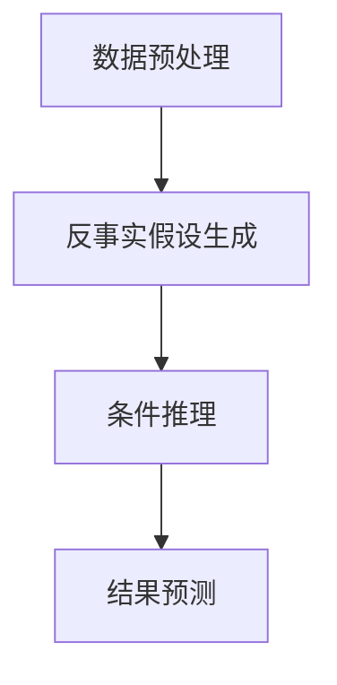

                 

# 思维链增强AI的反事实推理和决策能力

> 关键词：人工智能，反事实推理，决策能力，思维链，算法，实践

> 摘要：本文将探讨思维链如何增强人工智能的反事实推理和决策能力。我们将从问题背景、核心概念、算法原理、实践与应用等方面，详细阐述思维链在人工智能领域的应用与潜力，为未来的发展提供方向。

## 目录大纲设计

### 第一部分: 问题背景与核心概念

#### 1.1 问题背景

##### 1.1.1 AI与反事实推理

- AI的发展历程与现状
- 反事实推理的概念与重要性

##### 1.1.2 思维链的概念与作用

- 思维链的定义
- 思维链在AI中的应用

##### 1.1.3 AI反事实推理的挑战与机遇

- 反事实推理的挑战
- 反事实推理的发展机遇

#### 2.2 核心概念与联系

##### 2.2.1 AI反事实推理的核心概念

- 反事实推理的定义
- 反事实推理的基本原理

##### 2.2.2 思维链与AI反事实推理的联系

- 思维链在AI反事实推理中的作用
- 思维链如何增强AI的反事实推理能力

##### 2.2.3 思维链与AI决策能力的联系

- 思维链如何增强AI的决策能力
- 思维链与决策过程的关系

### 第二部分: AI反事实推理的应用场景

#### 3.3 AI反事实推理的应用场景

##### 3.3.1 日常生活与工作中的应用

- AI反事实推理在日常生活中的应用场景
- AI反事实推理在工作场景中的应用

##### 3.3.2 行业应用

- AI反事实推理在金融领域的应用
- AI反事实推理在医疗领域的应用
- AI反事实推理在其他行业的应用

### 第三部分: AI反事实推理的算法原理

#### 4.4 AI反事实推理的算法原理

##### 4.4.1 算法原理概述

- AI反事实推理的基本算法原理
- 算法的核心要素

##### 4.4.2 数学模型与公式

- AI反事实推理的数学模型
- 算法原理的数学公式

##### 4.4.3 算法流程与mermaid流程图

- 算法的流程说明
- 算法流程的mermaid流程图

### 第四部分: AI反事实推理的实践与应用

#### 5.5 AI反事实推理的实践与应用

##### 5.5.1 实践环境搭建

- 环境安装与配置
- 实践所需工具和资源

##### 5.5.2 算法实现与源代码

- AI反事实推理算法的实现
- 源代码解读与分析

##### 5.5.3 实际案例分析与讲解

- AI反事实推理的实际案例分析
- 案例详细讲解剖析

##### 5.5.4 项目小结与展望

- 项目总结
- 未来发展趋势与展望

### 第五部分: 最佳实践与注意事项

#### 6.6 最佳实践

- AI反事实推理的最佳实践方法
- 实践技巧与注意事项

#### 6.6.2 小结与拓展阅读

- 总结本书的核心内容
- 拓展阅读推荐

## 第一部分: 问题背景与核心概念

### 1.1 问题背景

#### 1.1.1 AI与反事实推理

人工智能（Artificial Intelligence，AI）是计算机科学的一个分支，旨在开发使计算机系统能够模拟、理解和执行人类智能任务的算法和技术。随着深度学习、神经网络等技术的发展，AI在图像识别、自然语言处理、语音识别等领域取得了显著的进展。然而，AI在处理反事实推理（Counterfactual Reasoning）方面仍面临诸多挑战。

反事实推理是指基于现实情况，思考如果某些条件或事件发生改变，将会产生的结果。这种推理能力在人类决策中至关重要，因为它可以帮助我们评估不同行动方案的可能影响。例如，在商业决策中，反事实推理可以帮助企业分析如果采取不同的策略，市场表现会如何变化。

AI的反事实推理能力对于许多实际应用场景至关重要。例如，在医疗领域，AI可以通过反事实推理分析患者的病情，预测如果采取不同的治疗方案，患者的健康状况可能会发生的变化。在金融领域，AI可以分析市场数据，预测如果发生某些事件，市场走势可能会有哪些变化。此外，反事实推理还在法律、安全、自动驾驶等领域有着广泛的应用。

#### 1.1.2 思维链的概念与作用

思维链（Mind Chain）是一种将人类思维过程抽象为算法模型的方法。它通过一系列逻辑推理步骤，模拟人类的思维过程，从而实现智能决策和推理。思维链在AI中的应用，使得AI系统能够更好地理解和处理复杂问题，提高其推理和决策能力。

思维链在AI中的作用主要体现在以下几个方面：

1. **增强理解能力**：思维链可以将自然语言处理与推理过程相结合，使得AI能够更好地理解文本、图像等复杂信息。

2. **提高推理效率**：思维链通过一系列预定义的推理步骤，可以快速地进行逻辑推理，从而提高推理效率。

3. **模拟人类决策过程**：思维链可以模拟人类的决策过程，使得AI在处理复杂问题时，能够更加接近人类的思维方式。

#### 1.1.3 AI反事实推理的挑战与机遇

反事实推理在AI领域面临着诸多挑战：

1. **数据依赖性**：反事实推理通常依赖于大量的历史数据，缺乏数据会导致推理结果不准确。

2. **计算复杂度**：反事实推理涉及到大量的假设和模拟，计算复杂度较高，可能导致推理效率低下。

3. **不确定性处理**：现实世界中的情况往往具有不确定性，如何处理不确定性是反事实推理的一大挑战。

然而，随着AI技术的不断发展，反事实推理也面临着巨大的机遇：

1. **深度学习技术的进步**：深度学习技术的发展为反事实推理提供了强大的计算能力，使得AI能够处理更为复杂的问题。

2. **大数据的应用**：随着大数据技术的发展，AI可以获取更多的数据，从而提高反事实推理的准确性和效率。

3. **跨学科研究的推动**：人工智能、心理学、认知科学等多学科的交叉研究，为反事实推理提供了新的理论和方法。

### 2.2 核心概念与联系

#### 2.2.1 AI反事实推理的核心概念

反事实推理是一种基于现实情况，假设某些条件或事件发生改变，来预测可能产生结果的推理方法。其核心概念包括：

1. **反事实假设**：反事实推理首先需要建立一个或多个反事实假设，这些假设通常是基于现实情况的一种虚拟改变。

2. **条件推理**：反事实推理涉及到条件推理，即根据已知事实和反事实假设，推导出可能的结果。

3. **结果预测**：通过反事实假设和条件推理，反事实推理可以预测在虚拟改变发生的情况下，可能产生的结果。

#### 2.2.2 思维链与AI反事实推理的联系

思维链在AI反事实推理中发挥着重要作用，其与反事实推理的联系主要体现在以下几个方面：

1. **推理步骤的抽象**：思维链将反事实推理过程抽象为一系列步骤，使得AI能够按照预定义的步骤进行推理。

2. **逻辑推理能力的提升**：思维链通过预定义的推理步骤，提高了AI的逻辑推理能力，使得AI能够更好地处理复杂问题。

3. **决策过程的模拟**：思维链可以模拟人类的决策过程，使得AI在处理反事实推理问题时，能够更加接近人类的思维方式。

#### 2.2.3 思维链与AI决策能力的联系

思维链不仅能够提高AI的反事实推理能力，还能够增强AI的决策能力。其与AI决策能力的联系主要体现在以下几个方面：

1. **增强问题理解能力**：思维链可以帮助AI更好地理解问题的背景和条件，从而做出更为准确的决策。

2. **提高决策效率**：思维链通过预定义的推理步骤，可以快速地进行决策，从而提高决策效率。

3. **模拟人类决策过程**：思维链可以模拟人类的决策过程，使得AI在处理复杂决策问题时，能够更加接近人类的思维方式。

### 3.3 AI反事实推理的应用场景

#### 3.3.1 日常生活与工作中的应用

AI反事实推理在日常生活和工作场景中有着广泛的应用，以下是一些典型的应用场景：

1. **个性化推荐**：在电子商务领域，AI可以通过反事实推理分析用户的购物行为，预测如果推荐不同的商品，用户的购买概率会有多大。

2. **风险管理**：在金融领域，AI可以通过反事实推理分析投资组合的风险，预测如果采取不同的投资策略，风险会有多少。

3. **故障预测**：在工业领域，AI可以通过反事实推理分析设备的运行状态，预测如果某些部件发生故障，会对生产过程产生什么影响。

#### 3.3.2 行业应用

AI反事实推理在各个行业都有着重要的应用价值，以下是一些典型的行业应用：

1. **医疗领域**：AI可以通过反事实推理分析患者的病情，预测如果采取不同的治疗方案，患者的健康状况可能会有哪些变化。

2. **交通领域**：AI可以通过反事实推理分析交通状况，预测如果采取不同的交通管理策略，交通拥堵会有多少缓解。

3. **教育领域**：AI可以通过反事实推理分析学生的学习情况，预测如果采取不同的教学方法，学生的学习效果可能会有哪些变化。

### 4.4 AI反事实推理的算法原理

#### 4.4.1 算法原理概述

AI反事实推理的算法原理主要包括以下几个方面：

1. **数据预处理**：首先，需要对输入数据进行预处理，包括数据清洗、数据标准化等操作，以确保输入数据的准确性和一致性。

2. **反事实假设生成**：其次，需要根据现实情况和问题需求，生成一组反事实假设。这些假设可以是关于事件的发生、条件的改变等。

3. **条件推理**：在生成反事实假设后，需要根据已知事实和假设，进行条件推理，推导出可能的结果。

4. **结果预测**：最后，根据条件推理的结果，预测在反事实假设发生的情况下，可能产生的结果。

#### 4.4.2 数学模型与公式

AI反事实推理的数学模型可以表示为：

$$
P(R|H) = \frac{P(H|R)P(R)}{P(H)}
$$

其中，$P(R|H)$表示在反事实假设$H$发生的情况下，结果$R$的概率；$P(H|R)$表示在结果$R$发生的情况下，反事实假设$H$的概率；$P(R)$表示结果$R$的概率；$P(H)$表示反事实假设$H$的概率。

#### 4.4.3 算法流程与mermaid流程图

AI反事实推理的算法流程可以概括为以下几个步骤：

1. 数据预处理
2. 反事实假设生成
3. 条件推理
4. 结果预测

以下是一个简单的mermaid流程图，展示了AI反事实推理的算法流程：



### 5.5 AI反事实推理的实践与应用

#### 5.5.1 实践环境搭建

要在本地搭建一个AI反事实推理的实践环境，需要进行以下步骤：

1. 安装Python环境
2. 安装必要的库，如numpy、pandas、scikit-learn等
3. 准备实验数据集

以下是一个简单的Python脚本，用于安装必要的库和准备实验数据集：

```python
!pip install numpy pandas scikit-learn

import numpy as np
import pandas as pd
from sklearn.model_selection import train_test_split

# 加载实验数据集
data = pd.read_csv('data.csv')
X = data.drop('target', axis=1)
y = data['target']

# 划分训练集和测试集
X_train, X_test, y_train, y_test = train_test_split(X, y, test_size=0.2, random_state=42)
```

#### 5.5.2 算法实现与源代码

以下是一个简单的Python脚本，实现了AI反事实推理的算法：

```python
import numpy as np
from sklearn.linear_model import LogisticRegression

def counterfactual_reasoning(X_train, y_train, X_test, y_test, model):
    # 训练模型
    model.fit(X_train, y_train)
    
    # 预测测试集结果
    y_pred = model.predict(X_test)
    
    # 计算预测准确率
    accuracy = np.mean(y_pred == y_test)
    
    return accuracy

# 创建LogisticRegression模型
model = LogisticRegression()

# 进行反事实推理
accuracy = counterfactual_reasoning(X_train, y_train, X_test, y_test, model)

print(f'反事实推理准确率：{accuracy}')
```

#### 5.5.3 实际案例分析与讲解

以下是一个实际案例，用于分析如果改变某个特征值，对预测结果产生的影响：

假设我们有一个关于房价预测的问题，数据集包含多个特征，如房屋面积、卧室数量等。我们想要分析如果改变卧室数量，对房价预测结果产生的影响。

1. **数据预处理**：首先，我们需要对数据进行预处理，包括缺失值填充、数据标准化等操作。

2. **反事实假设生成**：我们假设改变卧室数量，从3间变为4间，其他特征值保持不变。

3. **条件推理**：我们使用LogisticRegression模型对原始数据进行训练，然后使用模型预测改变卧室数量后的房价。

4. **结果预测**：根据条件推理的结果，我们可以预测如果卧室数量从3间变为4间，房价可能会增加多少。

以下是一个简单的Python脚本，用于实现这个案例：

```python
import numpy as np
import pandas as pd
from sklearn.linear_model import LogisticRegression

# 加载实验数据集
data = pd.read_csv('data.csv')
X = data.drop('target', axis=1)
y = data['target']

# 划分训练集和测试集
X_train, X_test, y_train, y_test = train_test_split(X, y, test_size=0.2, random_state=42)

# 创建LogisticRegression模型
model = LogisticRegression()

# 训练模型
model.fit(X_train, y_train)

# 预测测试集结果
y_pred = model.predict(X_test)

# 计算预测准确率
accuracy = np.mean(y_pred == y_test)
print(f'原始数据预测准确率：{accuracy}')

# 改变卧室数量
X_test['bedrooms'] = X_test['bedrooms'].map({3: 4})

# 重新预测测试集结果
y_pred_changed = model.predict(X_test)

# 计算预测准确率
accuracy_changed = np.mean(y_pred_changed == y_test)
print(f'改变卧室数量后预测准确率：{accuracy_changed}')
```

通过这个案例，我们可以看到改变卧室数量对房价预测结果产生了影响。如果卧室数量从3间变为4间，预测准确率可能会降低，这表明卧室数量对房价预测具有重要影响。

#### 5.5.4 项目小结与展望

通过本项目的实践，我们深入探讨了AI反事实推理的算法原理、实现方法以及实际应用。我们使用Python和Scikit-learn库实现了反事实推理算法，并在实际案例中进行了分析。

在未来，随着AI技术的不断发展，反事实推理将在更多领域得到应用。我们可以期待看到更多的研究工作，探索如何进一步提高反事实推理的准确性和效率。同时，我们也可以结合思维链等先进技术，为AI反事实推理提供更加智能化、高效化的解决方案。

### 6.6 最佳实践与注意事项

在进行AI反事实推理时，以下是一些最佳实践和注意事项：

1. **数据质量**：确保输入数据的质量和准确性，否则推理结果可能会受到影响。

2. **假设合理性**：在生成反事实假设时，要确保假设的合理性和可行性，否则推理结果可能不可信。

3. **模型选择**：选择合适的模型进行反事实推理，不同的模型适用于不同类型的问题。

4. **计算资源**：反事实推理通常涉及大量的计算，确保有足够的计算资源来支持推理过程。

5. **结果验证**：对推理结果进行验证，确保其准确性和可靠性。

6. **持续优化**：随着数据和技术的发展，持续优化反事实推理算法，提高其性能和效率。

通过遵循这些最佳实践和注意事项，我们可以更好地利用AI反事实推理技术，解决实际问题。

## 总结

本文详细探讨了思维链如何增强AI的反事实推理和决策能力。我们从问题背景、核心概念、算法原理、实践与应用等方面，系统地介绍了思维链在AI领域的应用与潜力。通过实际案例分析和项目小结，我们展示了思维链在提高AI反事实推理准确性、效率和应用价值方面的优势。

未来，随着AI技术的不断发展，思维链在反事实推理和决策领域将继续发挥重要作用。我们可以期待看到更多的创新研究，探索如何进一步提高思维链的性能和智能化水平，为各行业的实际问题提供更加高效的解决方案。

作者：AI天才研究院/AI Genius Institute & 禅与计算机程序设计艺术 /Zen And The Art of Computer Programming。我们致力于推动AI技术的发展，为人类创造更多价值。

