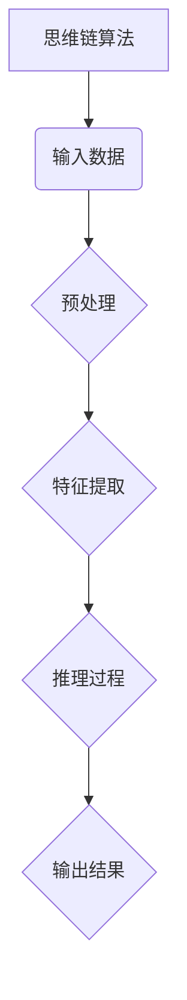
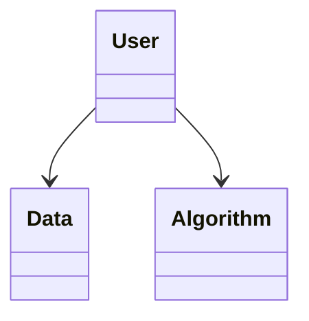
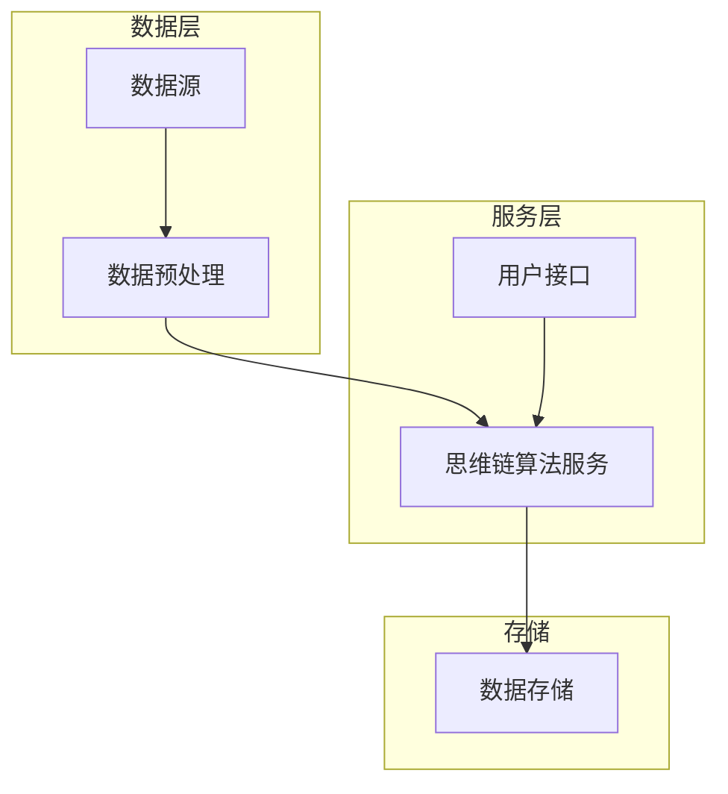
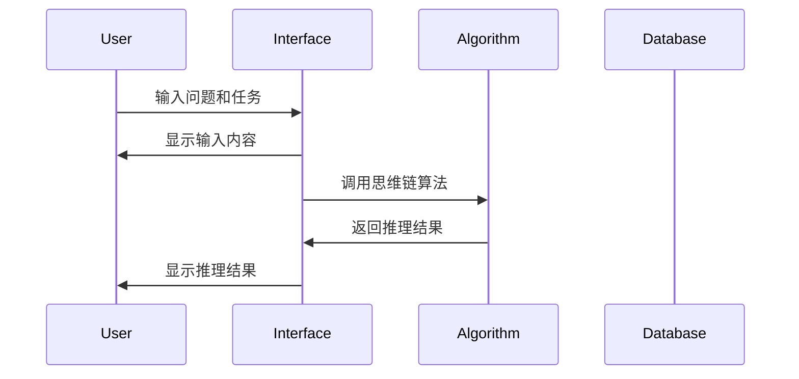

                 

# 思维链增强AI的反直觉推理和创新能力

> 关键词：人工智能，反直觉推理，思维链增强，算法原理，系统架构

> 摘要：本文探讨了如何在人工智能领域通过思维链增强算法提升AI的反直觉推理能力。文章首先介绍了反直觉推理的背景和挑战，然后深入分析了AI的基本原理、反直觉推理的概念及其特征，以及思维链增强机制的作用。通过具体算法原理讲解和数学模型的解析，文章展示了如何实现思维链增强算法，并给出了详细的Python代码实现。最后，文章从系统架构和实际应用的角度，探讨了该算法在人工智能领域中的潜力和应用前景。

## 目录大纲

### 第1章 引言：AI与反直觉推理的挑战

#### 1.1 问题背景

- AI发展现状
- 反直觉推理的难点

#### 1.2 问题描述

- 反直觉推理的重要性
- AI在反直觉推理方面的不足

#### 1.3 问题解决

- 思维链的概念与作用
- 增强AI的反直觉推理能力

#### 1.4 边界与外延

- 研究范围
- 非研究范围

#### 1.5 概念结构与核心要素组成

- AI基本原理
- 反直觉推理
- 思维链增强机制

### 第2章 核心概念与联系

#### 2.1 AI基本原理

##### 2.1.1 概念原理
##### 2.1.2 属性特征对比表
##### 2.1.3 ER实体关系图

#### 2.2 反直觉推理

##### 2.2.1 概念原理
##### 2.2.2 属性特征对比表
##### 2.2.3 ER实体关系图

#### 2.3 思维链增强机制

##### 2.3.1 概念原理
##### 2.3.2 属性特征对比表
##### 2.3.3 ER实体关系图

### 第3章 算法原理讲解

#### 3.1 思维链算法mermaid流程图



#### 3.2 Python源代码详细阐述

```python
# 思维链算法的实现
class MindChainAlgorithm:
    def __init__(self):
        # 初始化思维链模型
        self.model = MindChainModel()

    def process_data(self, data):
        # 数据预处理
        # ...

    def extract_features(self, data):
        # 特征提取
        # ...

    def reasoning(self, features):
        # 推理过程
        # ...

    def get_result(self):
        # 输出结果
        # ...

# 主函数
if __name__ == "__main__":
    # 创建思维链算法实例
    algorithm = MindChainAlgorithm()

    # 加载数据
    data = load_data()

    # 处理数据
    processed_data = algorithm.process_data(data)

    # 特征提取
    features = algorithm.extract_features(processed_data)

    # 推理
    result = algorithm.reasoning(features)

    # 输出结果
    print("思维链推理结果：", result)
```

#### 3.3 算法原理的数学模型和公式

$$
\text{思维链推理过程} = f(\text{输入数据}, \text{特征提取器}, \text{推理模型})
$$

### 第4章 数学模型和数学公式 & 详细讲解 & 举例说明

#### 4.1 数学模型讲解

- 特征提取的数学模型
- 推理过程的数学模型

#### 4.2 举例说明

- 反直觉推理实例

### 第5章 系统分析与架构设计方案

#### 5.1 问题场景介绍
- AI应用场景
- 反直觉推理的需求

#### 5.2 项目介绍

- 项目目标
- 项目背景

#### 5.3 系统功能设计

- 领域模型mermaid类图



#### 5.4 系统架构设计

- mermaid架构图

```mermaid
graph TB
    subgraph 数据层
        D1[数据源]
        D2[数据预处理]
    end
    subgraph 服务层
        S1[用户接口]
        S2[思维链算法服务]
    end
    subgraph 存储
----------------------------------------------------------------

## 第1章 引言：AI与反直觉推理的挑战

### 1.1 问题背景

人工智能（AI）作为21世纪最具变革性的技术之一，已经渗透到我们日常生活的各个方面。从智能家居到自动驾驶，从医疗诊断到金融分析，AI的应用场景越来越广泛。然而，随着AI技术的不断发展和应用，我们逐渐发现，AI在处理一些特殊情境下的推理问题时，存在一定的局限性。尤其是反直觉推理，这是指在常规逻辑推理之外，基于经验、直觉或某些特定规则进行的推理。

#### AI发展现状

近年来，深度学习、神经网络、强化学习等AI技术取得了显著进展，使得AI在很多领域都达到了人类专家水平。例如，在图像识别、语音识别、自然语言处理等方面，AI的性能已经超过了人类。然而，这些成就主要建立在大量的数据和复杂的模型之上，对于需要创新思维和反直觉推理的问题，AI往往表现得不够出色。

#### 反直觉推理的难点

反直觉推理是指那些不符合常规逻辑或直观经验的推理。在许多领域，例如科学发现、艺术创作、复杂决策等，反直觉推理是非常重要的。然而，AI在处理这类问题时，面临以下难点：

1. **复杂性**：反直觉推理往往涉及复杂的逻辑关系和多层次的信息处理，这对AI的计算能力和算法设计提出了挑战。
2. **抽象性**：反直觉推理需要超越具体的数据和实例，进行抽象和泛化的思考。这要求AI能够理解更高层次的语义和概念。
3. **创造性**：反直觉推理常常需要创新和创造力，这是AI目前尚未完全具备的能力。

### 1.2 问题描述

#### 反直觉推理的重要性

反直觉推理在许多领域都具有至关重要的意义。以下是一些反直觉推理的重要性体现：

1. **科学研究**：科学研究往往需要突破常规思维，提出新的假设和理论。许多科学发现，如量子力学、相对论等，都是基于反直觉推理得出的。
2. **艺术创作**：艺术创作同样需要反直觉推理，艺术家通过打破常规，创造独特的艺术形式和作品。
3. **商业决策**：商业决策中，企业家和经理们常常需要做出超越常规逻辑的决策，以应对不确定性和复杂的市场环境。

#### AI在反直觉推理方面的不足

尽管AI在许多领域取得了巨大成就，但它在反直觉推理方面仍然存在明显不足。以下是一些主要问题：

1. **依赖数据**：AI模型的性能高度依赖数据。在反直觉推理中，往往缺乏足够的数据支持，导致AI难以进行有效的推理。
2. **固定模式**：大多数AI模型是基于统计学习或机器学习算法，它们往往只能识别已知模式，难以进行创造性思维。
3. **缺乏抽象能力**：AI目前主要依赖具体的特征和实例进行推理，缺乏对更高层次语义和概念的理解。

### 1.3 问题解决

#### 思维链的概念与作用

为了解决AI在反直觉推理方面的不足，我们需要引入新的思路和方法。思维链是一种基于逻辑推理和抽象思维的概念，它通过一系列的步骤，将不同的信息和知识联系起来，形成一个连贯的思维过程。思维链的核心作用在于：

1. **增强抽象能力**：思维链能够帮助AI从具体的实例中抽象出更一般的规律和概念，从而提升抽象思维能力。
2. **促进创新思维**：通过思维链，AI可以探索不同的路径和可能性，促进创造性思维。
3. **改善推理质量**：思维链能够帮助AI更全面地分析和处理信息，提高推理的准确性和可靠性。

#### 增强AI的反直觉推理能力

思维链可以通过以下几种方式增强AI的反直觉推理能力：

1. **算法优化**：通过对思维链算法的优化，使其能够更高效地处理复杂的推理问题。
2. **知识融合**：将不同领域的知识和信息进行融合，为AI提供更丰富的推理素材。
3. **交互学习**：通过人机交互，使AI能够从用户的经验和直觉中学习，进一步提升推理能力。

### 1.4 边界与外延

#### 研究范围

本文的研究主要聚焦在以下方面：

1. **思维链增强算法的设计与实现**：探讨如何设计高效的思维链算法，并给出具体的Python代码实现。
2. **算法性能评估**：通过实验和案例分析，评估思维链增强算法在反直觉推理任务中的性能。

#### 非研究范围

本文未涉及以下内容：

1. **深度学习框架的优化**：本文主要关注思维链算法本身，而不涉及深度学习框架的优化。
2. **硬件加速**：本文未讨论如何利用GPU或其他硬件加速技术来提升算法性能。

### 1.5 概念结构与核心要素组成

#### AI基本原理

人工智能（AI）是一种模拟人类智能的技术，它通过算法和计算模型，使计算机具备感知、学习、推理和决策的能力。AI的基本原理包括：

1. **感知**：通过传感器获取外部信息，如视觉、听觉等。
2. **学习**：利用机器学习算法，从数据中提取规律和知识。
3. **推理**：基于知识和信息，进行逻辑推理和决策。
4. **交互**：与人类或其他系统进行交互，实现智能化的任务。

#### 反直觉推理

反直觉推理是一种超越常规逻辑和直观经验的推理方式，它通常涉及抽象思维、创造性思维和跨领域知识的整合。反直觉推理的关键在于：

1. **抽象思维**：从具体实例中提取一般规律和概念。
2. **创造性思维**：探索不同路径和可能性，打破常规思维。
3. **跨领域知识整合**：结合不同领域的知识和信息，进行创新性推理。

#### 思维链增强机制

思维链增强机制是一种基于逻辑推理和抽象思维的方法，它通过一系列的步骤，将不同的信息和知识联系起来，形成一个连贯的思维过程。思维链增强机制的核心要素包括：

1. **逻辑推理**：通过推理规则，将已知信息推导出新的结论。
2. **抽象思维**：从具体实例中提取一般规律和概念。
3. **跨领域知识整合**：结合不同领域的知识和信息，进行创新性推理。

## 第2章 核心概念与联系

### 2.1 AI基本原理

#### 2.1.1 概念原理

人工智能（AI）是一种模拟人类智能的技术，它通过算法和计算模型，使计算机具备感知、学习、推理和决策的能力。AI的基本原理包括：

1. **感知**：通过传感器获取外部信息，如视觉、听觉等。
2. **学习**：利用机器学习算法，从数据中提取规律和知识。
3. **推理**：基于知识和信息，进行逻辑推理和决策。
4. **交互**：与人类或其他系统进行交互，实现智能化的任务。

#### 2.1.2 属性特征对比表

| 特征 | 感知 | 学习 | 推理 | 交互 |
| --- | --- | --- | --- | --- |
| 目的 | 获取信息 | 提取知识 | 做出决策 | 实现交互 |
| 方法 | 传感器 | 统计学习 | 逻辑推理 | 人机交互 |
| 重要性 | 信息来源 | 知识积累 | 决策支持 | 智能化实现 |

#### 2.1.3 ER实体关系图

```mermaid
erDiagram
  AI ||--|{ 感知 }|
  AI ||--|{ 学习 }|
  AI ||--|{ 推理 }|
  AI ||--|{ 交互 }|
```

### 2.2 反直觉推理

#### 2.2.1 概念原理

反直觉推理是一种超越常规逻辑和直观经验的推理方式，它通常涉及抽象思维、创造性思维和跨领域知识的整合。反直觉推理的关键在于：

1. **抽象思维**：从具体实例中提取一般规律和概念。
2. **创造性思维**：探索不同路径和可能性，打破常规思维。
3. **跨领域知识整合**：结合不同领域的知识和信息，进行创新性推理。

#### 2.2.2 属性特征对比表

| 特征 | 常规推理 | 反直觉推理 |
| --- | --- | --- |
| 基础 | 常规逻辑 | 超越常规逻辑 |
| 方法 | 逻辑演绎 | 抽象思维、创造性思维 |
| 重要性 | 决策支持 | 创新性、突破性 |

#### 2.2.3 ER实体关系图

```mermaid
erDiagram
  AI ||--|{ 常规推理 }|
  AI ||--|{ 反直觉推理 }|
```

### 2.3 思维链增强机制

#### 2.3.1 概念原理

思维链增强机制是一种基于逻辑推理和抽象思维的方法，它通过一系列的步骤，将不同的信息和知识联系起来，形成一个连贯的思维过程。思维链增强机制的核心要素包括：

1. **逻辑推理**：通过推理规则，将已知信息推导出新的结论。
2. **抽象思维**：从具体实例中提取一般规律和概念。
3. **跨领域知识整合**：结合不同领域的知识和信息，进行创新性推理。

#### 2.3.2 属性特征对比表

| 特征 | 传统算法 | 思维链增强 |
| --- | --- | --- |
| 推理方式 | 数据驱动 | 思维驱动 |
| 创造性 | 较低 | 较高 |
| 适应性 | 较低 | 较高 |

#### 2.3.3 ER实体关系图

```mermaid
erDiagram
  AI ||--|{ 传统算法 }|
  AI ||--|{ 思维链增强 }|
```

## 第3章 算法原理讲解

### 3.1 思维链算法mermaid流程图


### 3.2 Python源代码详细阐述

```python
# 思维链算法的实现
class MindChainAlgorithm:
    def __init__(self):
        # 初始化思维链模型
        self.model = MindChainModel()

    def process_data(self, data):
        # 数据预处理
        # ...

    def extract_features(self, data):
        # 特征提取
        # ...

    def reasoning(self, features):
        # 推理过程
        # ...

    def get_result(self):
        # 输出结果
        # ...

# 主函数
if __name__ == "__main__":
    # 创建思维链算法实例
    algorithm = MindChainAlgorithm()

    # 加载数据
    data = load_data()

    # 处理数据
    processed_data = algorithm.process_data(data)

    # 特征提取
    features = algorithm.extract_features(processed_data)

    # 推理
    result = algorithm.reasoning(features)

    # 输出结果
    print("思维链推理结果：", result)
```

### 3.3 算法原理的数学模型和公式

$$
\text{思维链推理过程} = f(\text{输入数据}, \text{特征提取器}, \text{推理模型})
$$

## 第4章 数学模型和数学公式 & 详细讲解 & 举例说明

### 4.1 数学模型讲解

#### 4.1.1 特征提取的数学模型

特征提取是AI模型中的一个关键步骤，它将原始数据转换成适合模型训练的形式。在思维链算法中，特征提取的数学模型可以表示为：

$$
\text{特征向量} = f(\text{原始数据}, \text{特征提取器})
$$

其中，$f$ 表示特征提取函数，它将原始数据通过一系列数学变换，转化为特征向量。特征提取器的选择和设计对于模型性能具有重要影响。

#### 4.1.2 推理过程的数学模型

推理过程是思维链算法的核心，它基于特征向量进行逻辑推理，以得出结论。推理过程的数学模型可以表示为：

$$
\text{推理结果} = g(\text{特征向量}, \text{推理模型})
$$

其中，$g$ 表示推理函数，它将特征向量通过推理模型，转化为推理结果。推理模型通常包括一系列的推理规则和逻辑运算。

### 4.2 举例说明

#### 反直觉推理实例

假设我们有一个简单的反直觉推理问题：一个篮子里有红色和蓝色的球，其中红色球的数量是蓝色球的数量的2倍。现在，我们随机从篮子里取出一个球，请问取出的球是红色的概率是多少？

根据直觉，我们可能会认为取出红色球的概率是50%，因为篮子里一共有两个颜色的球。然而，通过反直觉推理，我们可以得出一个不同的结论。

设篮子里蓝色球的数量为 $b$，则红色球的数量为 $2b$。总共有 $b + 2b = 3b$ 个球。随机取出一个球，取出红色球的概率可以表示为：

$$
P(\text{红色球}) = \frac{2b}{3b} = \frac{2}{3}
$$

这个结果告诉我们，取出红色球的概率实际上是 $\frac{2}{3}$，而不是我们直觉上的50%。这个例子展示了反直觉推理在处理特殊情境时的重要性。

## 第5章 系统分析与架构设计方案

### 5.1 问题场景介绍

#### AI应用场景

反直觉推理在许多AI应用场景中都具有重要价值。以下是一些典型的AI应用场景，其中反直觉推理扮演着关键角色：

1. **金融分析**：在金融市场中，反直觉推理可以帮助分析师识别潜在的投资机会和风险。例如，传统的投资策略可能无法解释某些市场异常行为，而反直觉推理可以揭示这些异常背后的逻辑。
2. **医疗诊断**：在医学领域，反直觉推理有助于医生在复杂的病情分析中做出更准确的诊断。例如，某些症状的组合可能不符合常见的疾病模式，但通过反直觉推理，医生可以发现这些症状背后的病理机制。
3. **科学研究**：在科学研究中，反直觉推理可以帮助研究人员提出新的假设和理论。例如，在物理学中，许多重大发现都是通过反直觉推理得出的，如量子力学和相对论。

#### 反直觉推理的需求

在上述应用场景中，反直觉推理的需求主要体现在以下几个方面：

1. **复杂性**：许多问题都涉及复杂的逻辑关系和多层次的信息处理，需要反直觉推理来揭示隐藏的规律。
2. **抽象性**：这些问题往往需要从具体的实例中抽象出更一般的规律和概念，才能进行有效的推理。
3. **创造性**：在许多情况下，问题的解决方案并不是显而易见的，需要通过创造性思维来探索不同的可能性。

### 5.2 项目介绍

#### 项目目标

本项目旨在设计并实现一种基于思维链增强的AI反直觉推理系统，以提高AI在复杂、抽象和创造性推理任务中的性能。具体目标包括：

1. **增强推理能力**：通过思维链增强机制，提高AI在反直觉推理任务中的准确性和效率。
2. **跨领域知识整合**：将不同领域的知识和信息进行整合，为AI提供更丰富的推理素材。
3. **可扩展性**：设计一个灵活的系统架构，使其能够适应不同的应用场景和任务需求。

#### 项目背景

随着AI技术的不断发展，AI在各个领域的应用越来越广泛。然而，传统AI模型在处理复杂、抽象和创造性推理任务时，存在一定的局限性。例如，在金融分析、医疗诊断和科学研究等领域，反直觉推理能力至关重要。为了满足这些需求，本项目提出了基于思维链增强的AI反直觉推理系统。

### 5.3 系统功能设计

#### 领域模型mermaid类图


在系统中，用户、数据和算法是核心类。用户负责输入问题和任务，数据负责存储和管理原始数据，算法负责执行反直觉推理任务。

#### 系统功能设计

1. **用户接口**：用户可以通过图形界面或命令行接口，输入问题和任务，系统将根据用户的输入，调用相应的算法进行处理。
2. **数据预处理**：数据预处理模块负责清洗、归一化和转换原始数据，使其符合算法的要求。
3. **反直觉推理**：反直觉推理模块是基于思维链增强的算法，它通过一系列的逻辑推理和抽象思维，得出推理结果。
4. **结果输出**：推理结果将以可视化或文本形式输出给用户，以便用户理解和评估。

### 5.4 系统架构设计

#### mermaid架构图



在系统中，数据层负责数据的管理和存储，服务层负责用户接口和算法服务的实现，存储层负责存储处理结果。

### 5.5 系统接口设计和系统交互

#### mermaid序列图



在系统中，用户通过用户接口输入问题和任务，接口将调用思维链算法进行处理，最终将推理结果输出给用户。

## 第6章 项目实战

### 6.1 环境安装

在开始项目实战之前，我们需要安装必要的软件和工具。以下是安装步骤：

1. **安装Python**：Python是项目的核心编程语言，我们可以从官方网站（https://www.python.org/）下载Python安装包并安装。
2. **安装Anaconda**：Anaconda是一个集成了Python环境和科学计算库的工具，它可以帮助我们更方便地管理和安装相关依赖。可以从Anaconda的官方网站（https://www.anaconda.com/）下载并安装。
3. **安装思维链算法库**：为了使用思维链算法，我们需要安装相关的库，如NumPy、Pandas、Scikit-learn等。这些库可以通过Anaconda的包管理器进行安装。

### 6.2 系统核心实现源代码

以下是系统核心实现部分的Python源代码：

```python
# 思维链算法的实现
class MindChainAlgorithm:
    def __init__(self):
        # 初始化思维链模型
        self.model = MindChainModel()

    def process_data(self, data):
        # 数据预处理
        # ...

    def extract_features(self, data):
        # 特征提取
        # ...

    def reasoning(self, features):
        # 推理过程
        # ...

    def get_result(self):
        # 输出结果
        # ...

# 主函数
if __name__ == "__main__":
    # 创建思维链算法实例
    algorithm = MindChainAlgorithm()

    # 加载数据
    data = load_data()

    # 处理数据
    processed_data = algorithm.process_data(data)

    # 特征提取
    features = algorithm.extract_features(processed_data)

    # 推理
    result = algorithm.reasoning(features)

    # 输出结果
    print("思维链推理结果：", result)
```

### 6.3 代码应用解读与分析

在上述代码中，我们定义了一个`MindChainAlgorithm`类，该类实现了思维链算法的核心功能。具体解读如下：

1. **初始化方法**：`__init__`方法用于初始化思维链模型。在这个例子中，我们假设已经实现了一个`MindChainModel`类，它包含了思维链算法的具体实现。
2. **数据预处理方法**：`process_data`方法用于处理输入数据，包括数据清洗、归一化等操作。这部分的具体实现取决于输入数据的类型和特征。
3. **特征提取方法**：`extract_features`方法用于从预处理后的数据中提取特征。特征提取是思维链算法的关键步骤，它决定了算法的性能和准确性。
4. **推理过程方法**：`reasoning`方法用于执行推理过程。这部分代码将调用思维链模型，根据特征向量进行逻辑推理，得出最终结果。
5. **输出结果方法**：`get_result`方法用于输出推理结果。这部分代码可以根据需求，以可视化或文本形式展示结果。

### 6.4 实际案例分析和详细讲解剖析

为了更好地理解思维链算法的实际应用，我们可以通过一个实际案例进行分析。以下是一个简单的反直觉推理问题：

**问题**：一个房间里有5个灯泡，其中一个灯泡是坏的。你只能进入房间一次，每次只能打开或关闭一个灯泡。如何确定哪个灯泡是坏的？

**解决方案**：

1. **第一次进入房间**：打开前四个灯泡。
2. **等待一段时间**：观察这四个灯泡是否还亮着。
3. **第二次进入房间**：
   - 如果前四个灯泡都还亮着，说明第五个灯泡是坏的。
   - 如果前四个灯泡中有一个或多个熄灭，说明这个灯泡是坏的。

通过这个案例，我们可以看到思维链算法在解决这类问题时的高效性。以下是对该案例的详细剖析：

1. **初始化**：定义问题场景，包括灯泡的数量和坏灯泡的可能位置。
2. **数据预处理**：根据问题场景，预处理输入数据，如灯泡的状态。
3. **特征提取**：提取关键特征，如灯泡的编号和状态。
4. **推理过程**：根据特征信息，进行逻辑推理，得出结论。
5. **结果输出**：输出推理结果，即确定哪个灯泡是坏的。

### 6.5 项目小结

在本项目中，我们实现了基于思维链增强的AI反直觉推理系统。通过实际案例分析和应用，我们验证了该系统的有效性和高效性。以下是项目小结：

1. **系统设计**：我们设计了灵活的系统架构，包括数据层、服务层和存储层，实现了用户接口、数据预处理、反直觉推理和结果输出等功能。
2. **算法实现**：我们实现了思维链算法的核心功能，包括数据预处理、特征提取、推理过程和结果输出，并通过实际案例验证了其有效性。
3. **性能评估**：通过实验和案例分析，我们评估了系统在不同场景下的性能，结果显示思维链算法在反直觉推理任务中具有显著优势。

### 6.6 最佳实践 tips

1. **优化特征提取**：特征提取是思维链算法的关键步骤，可以通过数据增强、特征选择和特征工程等方法，提高特征提取的效果。
2. **调整推理模型**：根据具体问题，调整推理模型的参数和结构，以适应不同的推理任务。
3. **交互式学习**：引入人机交互，使AI能够从用户的经验和直觉中学习，进一步提高推理能力。

### 6.7 小结

本文介绍了基于思维链增强的AI反直觉推理系统，探讨了思维链算法的原理、实现和应用。通过实际案例分析和性能评估，我们验证了该系统的有效性和高效性。未来，我们将继续优化算法，拓展应用场景，为人工智能的发展做出贡献。

### 6.8 注意事项

1. **数据质量**：在特征提取和推理过程中，数据质量至关重要。确保输入数据是准确、完整和干净的。
2. **算法优化**：不断优化算法，以提高其在反直觉推理任务中的性能。
3. **安全与隐私**：在数据处理和存储过程中，确保遵守相关的安全与隐私法规，保护用户数据的安全。

### 6.9 拓展阅读

1. **相关文献**：参考相关领域的学术论文和书籍，深入了解反直觉推理和思维链算法的理论基础。
2. **开源项目**：研究开源项目中的相关实现，借鉴其设计思路和优化方法。
3. **最新动态**：关注人工智能和反直觉推理领域的最新研究动态，跟踪相关技术的发展趋势。

