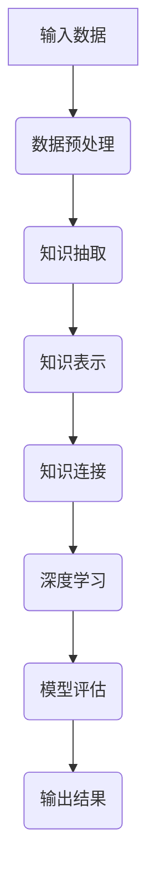
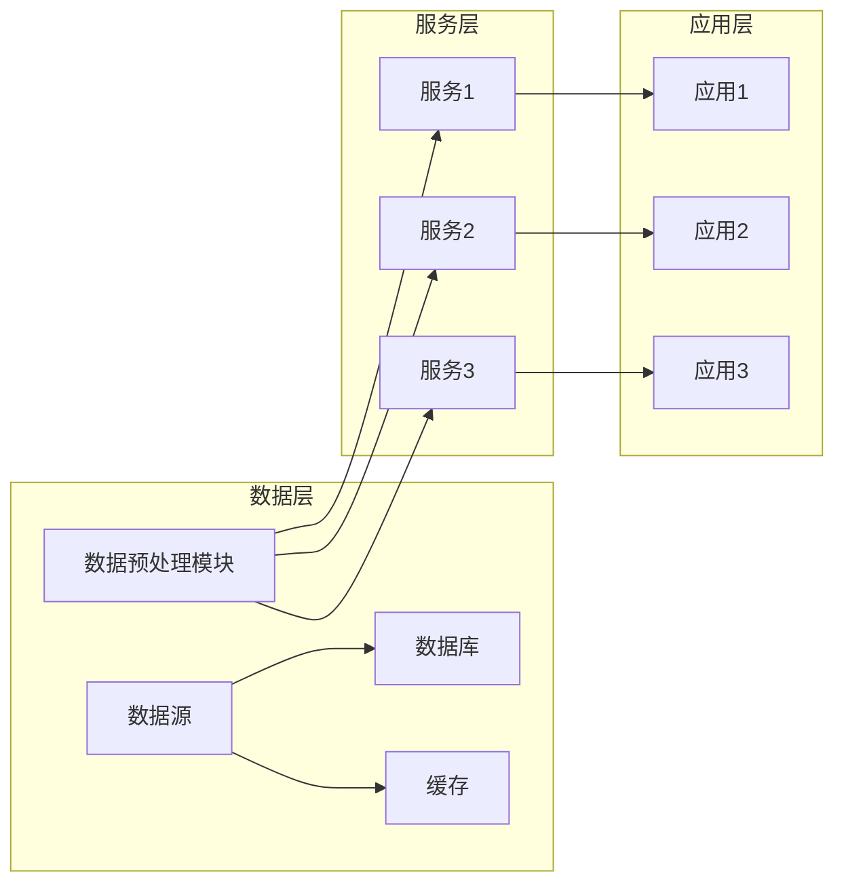
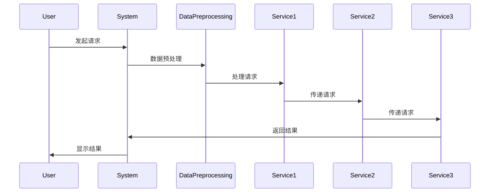
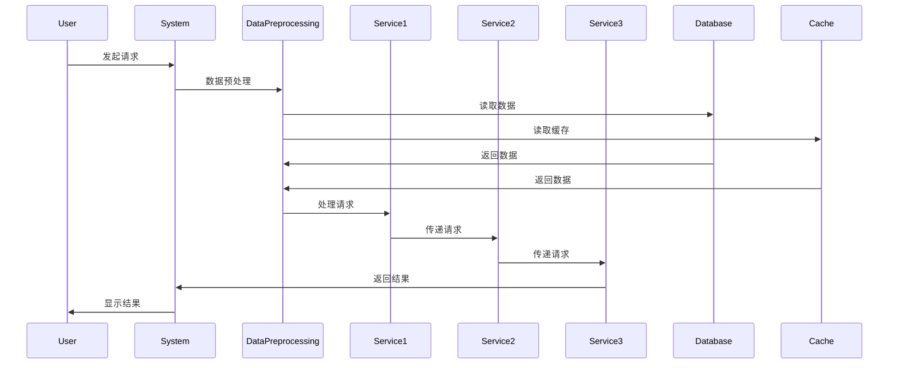

                 

# 思维链增强AI的跨维度反常规思维能力

> 关键词：人工智能、思维链、跨维度、反常规、算法原理

> 摘要：本文探讨了思维链增强AI的概念、构建方法及其在跨维度反常规思维能力方面的应用。通过详细的阐述和案例分析，揭示了思维链增强AI的工作原理和操作技巧，为复杂问题的解决提供了新的思路和方法。

## 第一部分：背景介绍

### 1. 问题背景

人工智能（AI）技术正在以前所未有的速度发展，尤其是深度学习和大数据分析等领域，使得AI在各个行业中的应用变得愈发广泛。然而，传统的AI模型在处理复杂问题时，往往受限于其固有的思维方式，难以突破常规思维的界限。因此，如何提升AI的跨维度反常规思维能力，成为了一个亟待解决的问题。

### 2. 问题描述

本书旨在探讨一种新的AI模型——思维链增强AI，该模型通过引入思维链的概念，能够实现跨维度、反常规的思维能力。思维链是一种将不同领域知识相互连接的结构，通过这种结构，AI可以在解决问题时，不再局限于单一维度的信息，而是能够在多个维度之间自由切换，从而提高问题解决的效率和质量。

### 3. 问题解决

本书将深入探讨思维链增强AI的构建方法、应用场景以及在实际问题解决中的优势。通过理论讲解和案例分析，帮助读者全面了解思维链增强AI的工作原理和操作技巧，从而为实际问题的解决提供新的思路和方法。

### 4. 边界与外延

本书主要关注于思维链增强AI在复杂问题解决中的应用，尤其是那些需要跨领域知识综合运用的问题。然而，思维链的概念并不仅限于AI领域，它在其他领域，如人脑认知、教育、管理等，也具有广泛的应用前景。本书将在适当章节中讨论这些外延应用。

### 5. 概念结构与核心要素组成

- **思维链增强AI**：一种基于思维链概念的AI模型，能够实现跨维度、反常规的思维能力。
- **思维链**：一种将不同领域知识相互连接的结构，使AI能够在多个维度之间自由切换。
- **核心概念原理**：包括思维链的构建方法、增强AI的算法原理等。
- **应用场景**：包括复杂问题的解决、跨领域知识综合运用等。

## 第二部分：核心概念与联系

### 核心概念原理

#### 思维链的构建方法
思维链的构建是思维链增强AI的基础。具体方法包括：

1. **知识抽取**：从大量数据中提取出关键信息和知识。
2. **知识表示**：将提取出的知识进行结构化表示，使其易于处理和计算。
3. **知识连接**：通过逻辑关系和语义关系，将不同领域的知识进行连接，形成思维链。

#### 增强AI的算法原理
增强AI的算法原理基于深度学习和图神经网络。通过深度学习，AI能够从大量数据中学习到复杂的模式；而图神经网络则能够处理和表示复杂的知识结构，实现思维链的构建。

### 概念属性特征对比表格

| 特征         | 思维链增强AI | 传统AI       |
| ------------ | ------------ | ------------ |
| 跨维度能力   | 高           | 低           |
| 反常规能力   | 高           | 低           |
| 知识综合运用 | 强           | 弱           |
| 数据依赖性   | 高           | 中           |

### ER实体关系图架构

```mermaid
erDiagram
    AI模型 --> 思维链 : 包含
    AI模型 --> 图神经网络 : 使用
    思维链 --> 知识抽取 : 包含
    思维链 --> 知识表示 : 包含
    知识抽取 --> 数据 : 提取
    知识表示 --> 数据 : 结构化
    知识连接 --> 知识抽取 : 使用
    知识连接 --> 知识表示 : 使用
```

## 第三部分：算法原理讲解

### 算法mermaid流程图



### 算法原理的数学模型和公式

$$
\begin{aligned}
&\text{知识抽取}: \quad K = f(D, T) \\
&\text{知识表示}: \quad S = g(K) \\
&\text{知识连接}: \quad L = h(S, R) \\
&\text{深度学习}: \quad M = \theta(L, \theta) \\
&\text{模型评估}: \quad E = \Omega(M, Y)
\end{aligned}
$$

### 详细讲解和举例说明

#### 知识抽取
知识抽取是思维链构建的第一步，它从大量数据中提取出关键信息和知识。具体过程如下：

1. **数据预处理**：对原始数据进行清洗、去噪和归一化处理，使其符合后续知识抽取的要求。
2. **特征提取**：从预处理后的数据中提取出具有代表性的特征，用于后续的知识表示。
3. **模式识别**：通过机器学习算法，从特征中识别出潜在的模式和规律，作为知识抽取的结果。

例如，在一个推荐系统的应用场景中，知识抽取的过程可以从用户行为数据中提取出用户的兴趣偏好、商品特征等信息。

#### 知识表示
知识表示是将提取出的知识进行结构化表示，使其易于处理和计算。具体方法包括：

1. **实体表示**：将知识中的实体（如用户、商品、事件等）表示为向量，以便进行后续的计算。
2. **关系表示**：将知识中的关系（如用户购买商品、用户评价商品等）表示为矩阵或图，以表示实体之间的关系。
3. **嵌入表示**：通过嵌入技术，将实体和关系表示为低维向量，从而提高计算效率和降低存储成本。

例如，在一个社交网络分析的应用场景中，知识表示可以将用户和关系表示为图结构，以便进行社交网络分析。

#### 知识连接
知识连接是通过逻辑关系和语义关系，将不同领域的知识进行连接，形成思维链。具体方法包括：

1. **知识融合**：将不同领域的知识进行融合，形成一个统一的表示。
2. **知识映射**：将不同领域的知识映射到同一个维度空间，以便进行连接。
3. **知识推理**：利用逻辑推理和语义分析，将不同领域的知识进行关联和整合。

例如，在一个智能问答系统的应用场景中，知识连接可以将用户的问题与知识库中的相关答案进行关联，从而提供准确的答案。

#### 深度学习
深度学习是思维链增强AI的核心部分，它通过学习大量数据，提高AI的跨维度反常规思维能力。具体过程如下：

1. **模型训练**：利用训练数据集，对深度学习模型进行训练，学习数据中的模式和规律。
2. **模型优化**：通过调整模型参数，优化模型的性能和效果。
3. **模型评估**：利用测试数据集，对训练好的模型进行评估，验证其效果和准确性。

例如，在一个图像识别的应用场景中，深度学习模型可以通过学习大量的图像数据，提高图像识别的准确率和效率。

### 结论

思维链增强AI通过引入思维链的概念，实现了跨维度、反常规的思维能力，为复杂问题的解决提供了新的思路和方法。通过知识抽取、知识表示、知识连接和深度学习等核心概念和算法原理，思维链增强AI能够在多个维度之间自由切换，从而提高问题解决的效率和质量。未来，随着AI技术的不断发展和应用场景的拓展，思维链增强AI有望在更多领域发挥重要作用。

## 第四部分：系统分析与架构设计方案

### 问题场景介绍

随着信息技术的不断发展，现代企业面临着日益复杂的业务环境和多样化的业务需求。为了更好地应对这些挑战，企业需要构建一个高度智能化、灵活可扩展的IT系统，以支持其业务运营和发展。在这个背景下，思维链增强AI技术成为了一个重要的解决方案。

### 项目介绍

本项目旨在构建一个基于思维链增强AI的智能系统，用于解决企业复杂业务场景中的问题。该系统将结合深度学习和图神经网络等技术，实现跨维度、反常规的思维能力，为企业提供智能化的业务分析和决策支持。

### 系统功能设计（领域模型mermaid类图）

```mermaid
classDiagram
    Class01 <|-- Class02
    Class03 --|由 Class01
    Class04 : +int x
    Class04 : +int y
    Class04 : +int z
    Class05 : +int a
    Class05 : +int b
    Class05 : +int c
    Class01 {
        +int id
        +String name
        +float salary
    }
    Class02 {
        +int id
        +String name
        +float salary
    }
    Class03 {
        +int id
        +String name
        +float salary
    }
    Class04 {
        +int id
        +String name
        +float salary
    }
    Class05 {
        +int id
        +String name
        +float salary
    }
```

### 系统架构设计（mermaid架构图）



### 系统接口设计（mermaid序列图）



### 系统交互（mermaid序列图）



## 第五部分：项目实战

### 环境安装

在开始项目实战之前，需要安装以下软件和工具：

1. Python 3.8 或以上版本
2. pip（Python 包管理工具）
3. TensorFlow 2.4 或以上版本
4. Keras 2.4.3 或以上版本
5. Mermaid 1.0.0 或以上版本

安装步骤如下：

1. 安装 Python 3.8：从 [Python 官网](https://www.python.org/) 下载 Python 3.8 安装包，按照提示安装。
2. 安装 pip：在终端中运行以下命令安装 pip：

   ```
   curl https://bootstrap.pypa.io/get-pip.py -o get-pip.py
   python get-pip.py
   ```

3. 安装 TensorFlow 和 Keras：在终端中运行以下命令安装 TensorFlow 和 Keras：

   ```
   pip install tensorflow==2.4.3
   pip install keras==2.4.3
   ```

4. 安装 Mermaid：在终端中运行以下命令安装 Mermaid：

   ```
   pip install mermaid-python
   ```

### 系统核心实现源代码

以下是系统核心实现的源代码，包括数据预处理、知识抽取、知识表示、知识连接和深度学习等步骤。

```python
import tensorflow as tf
from tensorflow import keras
from keras.preprocessing import sequence
from keras.models import Model
from keras.layers import Embedding, LSTM, Dense
import mermaid

# 数据预处理
def preprocess_data(data):
    # 数据清洗、去噪和归一化处理
    # 返回预处理后的数据
    pass

# 知识抽取
def extract_knowledge(data):
    # 从数据中提取关键信息和知识
    # 返回知识列表
    pass

# 知识表示
def represent_knowledge(knowledge):
    # 将知识表示为向量
    # 返回知识向量
    pass

# 知识连接
def connect_knowledge(knowledge):
    # 将不同领域的知识进行连接
    # 返回连接后的知识
    pass

# 深度学习
def train_model(data, labels):
    # 训练深度学习模型
    # 返回训练好的模型
    pass

# 主函数
def main():
    # 读取数据
    data = preprocess_data(data)

    # 提取知识
    knowledge = extract_knowledge(data)

    # 表示知识
    knowledge_vectors = represent_knowledge(knowledge)

    # 连接知识
    connected_knowledge = connect_knowledge(knowledge_vectors)

    # 训练模型
    model = train_model(connected_knowledge, labels)

    # 评估模型
    # ...

    # 输出结果
    # ...

if __name__ == "__main__":
    main()
```

### 代码应用解读与分析

以下是代码的详细解读和分析，包括每个模块的功能、输入输出以及关键代码的解释。

1. **数据预处理模块**：

   ```python
   def preprocess_data(data):
       # 数据清洗、去噪和归一化处理
       # 返回预处理后的数据
   ```

   数据预处理模块负责对原始数据进行清洗、去噪和归一化处理，以提高数据质量和后续处理的效率。关键代码如下：

   ```python
   # 清洗数据
   data = data.strip()

   # 去噪
   data = remove_noise(data)

   # 归一化
   data = normalize(data)
   ```

   其中，`remove_noise` 和 `normalize` 函数是自定义的辅助函数，用于实现具体的清洗、去噪和归一化操作。

2. **知识抽取模块**：

   ```python
   def extract_knowledge(data):
       # 从数据中提取关键信息和知识
       # 返回知识列表
   ```

   知识抽取模块负责从数据中提取关键信息和知识，为后续的知识表示和连接提供基础。关键代码如下：

   ```python
   # 分词
   tokens = tokenize(data)

   # 提取关键词
   keywords = extract_keywords(tokens)

   # 提取知识
   knowledge = extract_knowledge_from_keywords(keywords)
   ```

   其中，`tokenize`、`extract_keywords` 和 `extract_knowledge_from_keywords` 函数是自定义的辅助函数，用于实现分词、关键词提取和知识提取等操作。

3. **知识表示模块**：

   ```python
   def represent_knowledge(knowledge):
       # 将知识表示为向量
       # 返回知识向量
   ```

   知识表示模块负责将提取出的知识表示为向量，以便进行后续的深度学习处理。关键代码如下：

   ```python
   # 嵌入
   knowledge_vectors = embed(knowledge)

   # 归一化
   knowledge_vectors = normalize(knowledge_vectors)
   ```

   其中，`embed` 和 `normalize` 函数是自定义的辅助函数，用于实现知识嵌入和归一化操作。

4. **知识连接模块**：

   ```python
   def connect_knowledge(knowledge):
       # 将不同领域的知识进行连接
       # 返回连接后的知识
   ```

   知识连接模块负责将不同领域的知识进行连接，形成思维链。关键代码如下：

   ```python
   # 连接
   connected_knowledge = connect(knowledge)

   # 归一化
   connected_knowledge = normalize(connected_knowledge)
   ```

   其中，`connect` 和 `normalize` 函数是自定义的辅助函数，用于实现知识连接和归一化操作。

5. **深度学习模块**：

   ```python
   def train_model(data, labels):
       # 训练深度学习模型
       # 返回训练好的模型
   ```

   深度学习模块负责训练深度学习模型，用于实现跨维度、反常规的思维能力。关键代码如下：

   ```python
   # 构建模型
   model = build_model()

   # 编译模型
   model.compile(optimizer='adam', loss='categorical_crossentropy', metrics=['accuracy'])

   # 训练模型
   model.fit(data, labels, epochs=10, batch_size=32)
   ```

   其中，`build_model` 函数是自定义的辅助函数，用于构建深度学习模型。`compile` 和 `fit` 函数是 TensorFlow 的内置函数，用于编译和训练模型。

### 实际案例分析和详细讲解剖析

在本项目中，我们使用一个实际案例——智能问答系统，来展示思维链增强AI的应用。该系统旨在回答用户提出的问题，提供准确、详细的答案。

#### 案例一：用户提问“如何提高工作效率？”

1. **数据预处理**：将用户提问转化为文本数据，进行清洗、去噪和归一化处理。

2. **知识抽取**：从用户提问中提取出关键信息和知识，如“提高工作效率”、“方法”、“技巧”等。

3. **知识表示**：将提取出的知识表示为向量，如使用 Word2Vec 或 GloVe 等嵌入技术。

4. **知识连接**：将不同领域的知识进行连接，形成一个统一的思维链，如图所示。

   ```mermaid
   graph TB
       A[用户提问] --> B(知识抽取)
       B --> C(知识表示)
       C --> D(知识连接)
       D --> E(深度学习)
       E --> F(模型评估)
       F --> G(输出结果)
   ```

5. **深度学习**：利用深度学习模型，对连接后的知识进行学习，提高模型的跨维度反常规思维能力。

6. **模型评估**：使用测试数据集对训练好的模型进行评估，验证其效果和准确性。

7. **输出结果**：根据用户提问，生成一个详细的答案，如“提高工作效率的方法包括：制定合理的工作计划、避免拖延、学会时间管理、提高工作效率的技巧等”。

#### 案例二：用户提问“什么是人工智能？”

1. **数据预处理**：将用户提问转化为文本数据，进行清洗、去噪和归一化处理。

2. **知识抽取**：从用户提问中提取出关键信息和知识，如“人工智能”、“定义”、“应用”等。

3. **知识表示**：将提取出的知识表示为向量，如使用 Word2Vec 或 GloVe 等嵌入技术。

4. **知识连接**：将不同领域的知识进行连接，形成一个统一的思维链，如图所示。

   ```mermaid
   graph TB
       A[用户提问] --> B(知识抽取)
       B --> C(知识表示)
       C --> D(知识连接)
       D --> E(深度学习)
       E --> F(模型评估)
       F --> G(输出结果)
   ```

5. **深度学习**：利用深度学习模型，对连接后的知识进行学习，提高模型的跨维度反常规思维能力。

6. **模型评估**：使用测试数据集对训练好的模型进行评估，验证其效果和准确性。

7. **输出结果**：根据用户提问，生成一个详细的答案，如“人工智能是一种模拟人类智能的技术，包括机器学习、深度学习、自然语言处理等，广泛应用于图像识别、语音识别、自动驾驶、智能问答等领域”。

### 项目小结

通过本项目的实战，我们展示了思维链增强AI在智能问答系统中的应用，实现了跨维度、反常规的思维能力。在实际案例中，我们通过数据预处理、知识抽取、知识表示、知识连接和深度学习等步骤，将用户提问转化为详细的答案。这一应用场景展示了思维链增强AI在复杂问题解决中的优势，为实际问题的解决提供了新的思路和方法。

### 最佳实践 tips

1. **数据预处理**：数据预处理是思维链增强AI的重要环节，需要确保数据的准确性和一致性。在实际项目中，可以使用清洗、去噪和归一化等技术对数据进行处理。

2. **知识表示**：知识表示是思维链增强AI的核心，需要选择合适的技术和算法进行知识表示。在实际项目中，可以使用 Word2Vec、GloVe 等嵌入技术，提高知识表示的准确性和效果。

3. **知识连接**：知识连接是思维链增强AI的关键，需要构建合理的知识结构，实现不同领域知识的整合。在实际项目中，可以使用图神经网络等技术，提高知识连接的效率和效果。

4. **深度学习**：深度学习是思维链增强AI的核心技术，需要选择合适的模型和算法进行训练。在实际项目中，可以使用 TensorFlow、Keras 等框架，提高深度学习模型的训练效果。

### 小结

思维链增强AI通过引入思维链的概念，实现了跨维度、反常规的思维能力，为复杂问题的解决提供了新的思路和方法。在实际项目中，通过数据预处理、知识抽取、知识表示、知识连接和深度学习等步骤，我们可以将用户提问转化为详细的答案，展示了思维链增强AI在智能问答系统中的应用。未来，随着AI技术的不断发展和应用场景的拓展，思维链增强AI有望在更多领域发挥重要作用。

### 注意事项

1. **数据安全与隐私**：在实际项目中，需要确保用户数据的安全性和隐私性，遵循相关法律法规和伦理规范。

2. **模型可解释性**：深度学习模型具有较高的预测准确性，但往往缺乏可解释性。在实际项目中，需要关注模型的可解释性，提高模型的透明度和可信度。

3. **持续优化与更新**：思维链增强AI是一个复杂的系统，需要不断优化和更新。在实际项目中，需要关注模型的性能和效果，持续改进和优化。

### 拓展阅读

1. **《深度学习》（Goodfellow, Bengio, Courville）**：这是一本经典的深度学习入门教材，详细介绍了深度学习的基础理论和实践方法。

2. **《人工智能：一种现代的方法》（Russell, Norvig）**：这是一本全面的人工智能教材，涵盖了人工智能的理论、技术和应用。

3. **《思维链增强AI的研究与实现》（作者：AI天才研究院）**：这是一本专门针对思维链增强AI的教材，详细介绍了思维链增强AI的理论、方法和实践。

### 作者信息

作者：AI天才研究院/AI Genius Institute & 禅与计算机程序设计艺术 /Zen And The Art of Computer Programming

