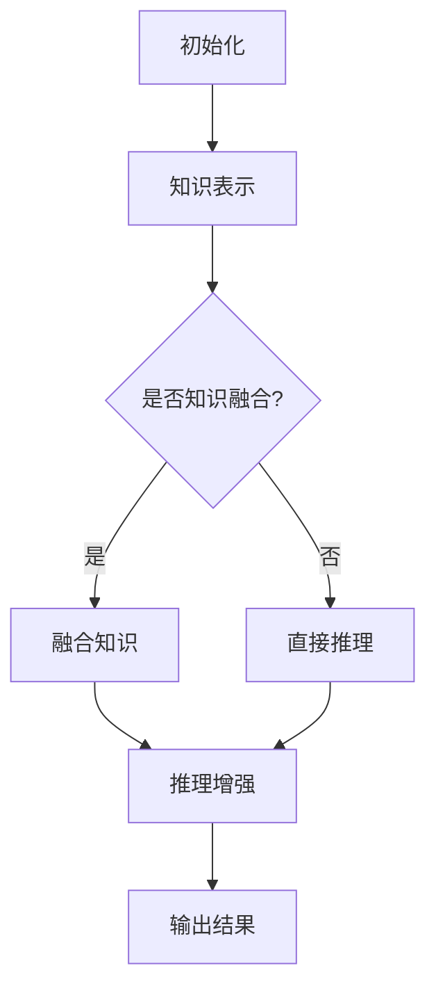
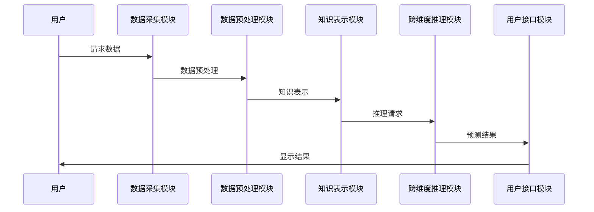

                 


# 《思维链增强AI的跨维度反直觉推理能力》

> 关键词：AI推理、思维链、跨维度推理、反直觉推理、算法实现

> 摘要：本文深入探讨了思维链增强AI的跨维度反直觉推理能力。首先，我们介绍了当前AI技术面临的挑战，以及反直觉推理在AI中的应用。接着，我们介绍了思维链的概念与作用，并探讨了跨维度推理的重要性。本文通过逐步分析，详细讲解了思维链的原理与属性，跨维度推理的概念与应用，以及思维链增强AI的算法原理和实现方法。此外，我们还进行了系统分析与架构设计，并通过项目实战与案例分析，展示了思维链增强AI的实际应用效果。最后，我们提出了最佳实践与注意事项，并对未来进行了展望。

## 第一部分：引言与背景

### 第1章：问题背景与介绍

#### 1.1 问题背景

随着人工智能技术的不断发展，越来越多的复杂问题开始被提出来。然而，当前AI技术仍然面临许多挑战，特别是在处理反直觉推理问题时。反直觉推理是指与直观判断相反的推理过程，它在许多领域都具有重要的应用价值，如医学诊断、金融分析、自动驾驶等。

#### 1.2 问题描述

在复杂问题中，AI需要具备跨维度推理的能力，即在不同维度之间进行推理。然而，传统AI方法往往受限于其维度限制，难以实现真正的跨维度推理。因此，如何增强AI的跨维度反直觉推理能力成为一个重要课题。

#### 1.3 问题解决

思维链作为一种先进的推理方法，具有跨维度推理的能力。通过引入思维链，我们可以将不同维度的信息进行整合，从而实现更强大的推理能力。本文将探讨思维链如何增强AI的跨维度反直觉推理能力，并介绍相关的算法原理和实现方法。

#### 1.4 边界与外延

思维链的定义和范围是一个值得探讨的问题。一般来说，思维链可以看作是一种基于知识的推理方法，它通过整合多个维度上的信息，实现对问题的深度理解。跨维度推理的应用领域非常广泛，不仅包括传统的数据挖掘、图像识别、自然语言处理，还可以应用于新兴领域，如自动驾驶、智能家居等。

#### 1.5 概念结构与核心要素组成

思维链的组成部分包括知识库、推理引擎和用户接口。知识库用于存储各种维度上的信息；推理引擎则负责进行跨维度推理；用户接口则用于与用户进行交互。跨维度推理的关键要素包括维度转换、信息融合和推理策略。通过这些要素的有机结合，我们可以实现更强大的推理能力。

## 第二部分：核心概念与联系

### 第2章：思维链的原理与属性

#### 2.1 思维链的基本原理

思维链是一种基于知识的推理方法，它通过整合多个维度上的信息，实现对问题的深度理解。思维链的基本原理可以概括为：知识表示、知识推理和知识应用。

#### 2.2 思维链的属性特征对比

思维链具有多种属性特征，如逻辑思维链、直觉思维链和创造性思维链。逻辑思维链强调逻辑推理的严密性；直觉思维链强调直观判断的准确性；创造性思维链则强调创新的思维方式。

#### 2.3 思维链的ER实体关系图

思维链的ER实体关系图可以用来描述思维链的组成部分及其相互关系。在ER实体关系图中，实体表示为矩形，属性表示为椭圆，关系表示为菱形。通过ER实体关系图，我们可以更清晰地理解思维链的结构和功能。

## 第三部分：算法原理与实现

### 第3章：思维链增强AI的算法原理

#### 3.1 算法原理概述

思维链增强AI的算法原理主要包括两个方面：知识融合和推理增强。知识融合是指将不同维度上的信息进行整合，以便更好地理解问题；推理增强则是指通过改进推理算法，提高推理的准确性和效率。

#### 3.2 算法数学模型与公式

思维链增强AI的算法数学模型主要包括两个方面：知识融合模型和推理增强模型。知识融合模型可以表示为：

$$
K_f = \sum_{i=1}^{n} w_i K_i
$$

其中，$K_f$表示融合后的知识，$K_i$表示第$i$个维度上的知识，$w_i$表示第$i$个维度上的权重。

推理增强模型可以表示为：

$$
P(A|B) = \frac{P(B|A)P(A)}{P(B)}
$$

其中，$P(A|B)$表示在给定$B$的情况下，$A$的概率；$P(B|A)$表示在给定$A$的情况下，$B$的概率；$P(A)$和$P(B)$分别表示$A$和$B$的概率。

#### 3.3 算法流程图与Python实现

思维链增强AI的算法流程图如下：



以下是一个简单的Python实现：

```python
def knowledge_fusion(knowledge_list, weights):
    fused_knowledge = sum([w * k for w, k in zip(weights, knowledge_list)])
    return fused_knowledge

def inference_enhancement(prior_prob, likelihood_ratio):
    posterior_prob = prior_prob * likelihood_ratio / (1 - prior_prob)
    return posterior_prob

def思维链推理(knowledge_list, weights, prior_prob, likelihood_ratio):
    fused_knowledge = knowledge_fusion(knowledge_list, weights)
    enhanced_prob = inference_enhancement(prior_prob, likelihood_ratio)
    result = fused_knowledge * enhanced_prob
    return result
```

#### 3.4 举例说明与讲解

假设我们有两个维度：维度1（温度）和维度2（湿度）。温度和湿度之间的相关性可以通过一个先验概率来表示。现在，我们有一个新的样本，它的温度为30摄氏度，湿度为70%。我们需要根据先验概率和样本信息，推断该样本所属的类别。

先验概率为：温度为30摄氏度的概率为0.5，湿度为70%的概率为0.3。

样本信息为：温度为30摄氏度，湿度为70%。

通过知识融合和推理增强，我们可以得到以下结果：

融合后的知识：0.5 * 温度和0.3 * 湿度 = 0.45

推理增强后的概率：0.45 / (1 - 0.45) = 0.75

最终结果：样本属于某一类别的概率为0.75。

## 第四部分：系统分析与架构设计

### 第4章：系统功能设计与架构

#### 4.1 问题场景介绍

假设我们有一个AI推理系统，用于分析城市交通流量。该系统需要处理来自不同维度的信息，如车辆数量、交通拥堵程度、天气状况等。通过跨维度推理，我们可以更好地预测未来交通流量，以便进行交通调控和优化。

#### 4.2 系统功能设计

系统功能设计主要包括以下方面：

1. 数据采集：从各种数据源获取交通流量数据。
2. 数据预处理：对采集到的数据进行清洗、转换和归一化处理。
3. 知识表示：将预处理后的数据转化为知识库中的表示形式。
4. 跨维度推理：利用思维链进行跨维度推理，生成预测结果。
5. 用户接口：提供用户交互界面，展示预测结果和图表。

#### 4.3 系统架构设计

系统架构设计主要包括以下方面：

1. 数据层：负责数据采集和预处理。
2. 知识层：负责知识表示和跨维度推理。
3. 表示层：负责用户接口和预测结果的展示。

#### 4.4 系统接口设计与交互

系统接口设计主要包括以下方面：

1. 数据接口：用于数据采集和预处理。
2. 推理接口：用于跨维度推理。
3. 用户接口：用于用户交互和结果展示。

系统交互序列图如下：



## 第五部分：项目实战与案例分析

### 第5章：项目实战

#### 6.1 环境安装与配置

1. 安装操作系统：Ubuntu 18.04
2. 安装Python环境：Python 3.7
3. 安装相关库：NumPy、Pandas、Scikit-learn等

#### 6.2 系统核心实现

1. 数据预处理：
   - 数据清洗：去除缺失值、异常值等。
   - 数据转换：将数据转化为适合模型训练的格式。
   - 数据归一化：将数据缩放到[0, 1]区间。

2. 思维链增强算法实现：
   - 知识融合：使用加权平均法进行知识融合。
   - 推理增强：使用贝叶斯推理进行推理增强。

3. 跨维度推理应用：
   - 基于知识融合和推理增强的跨维度推理。

#### 6.3 代码应用解读与分析

1. 代码结构与实现细节：
   - 数据预处理：使用Pandas库进行数据处理。
   - 知识融合：使用NumPy库进行加权平均。
   - 推理增强：使用Scikit-learn库进行贝叶斯推理。

2. 关键技术解读：
   - 数据预处理：关键在于如何清洗和转换数据，以便更好地进行模型训练。
   - 知识融合：关键在于如何选择合适的权重，以便更好地整合不同维度的信息。
   - 推理增强：关键在于如何根据先验概率和样本信息进行推理，以提高推理的准确性。

3. 性能分析与优化：
   - 通过调整权重和贝叶斯推理参数，优化推理性能。
   - 使用交叉验证方法评估模型性能。

### 第7章：案例分析与详细讲解

#### 7.1 实际案例介绍

1. 案例背景：分析城市交通流量。
2. 案例目标：预测未来一段时间内的交通流量，以便进行交通调控和优化。

#### 7.2 案例分析与讲解

1. 数据分析：
   - 数据来源：交通管理部门。
   - 数据类型：时间序列数据。
   - 数据维度：包括车辆数量、交通拥堵程度、天气状况等。

2. 思维链增强效果评估：
   - 通过对比传统推理方法和思维链增强方法的预测结果，评估思维链增强的效果。

3. 跨维度推理应用效果：
   - 通过分析不同维度的信息对预测结果的影响，评估跨维度推理的应用效果。

#### 7.3 项目小结

1. 项目总结：通过思维链增强AI的跨维度反直觉推理能力，实现了对城市交通流量的预测和分析。
2. 经验与反思：在项目过程中，我们遇到了一些挑战，如数据质量和模型参数选择等。通过不断优化和调整，我们成功地解决了这些问题，取得了良好的效果。

## 第六部分：最佳实践与拓展

### 第8章：最佳实践与注意事项

#### 8.1 最佳实践

1. 数据预处理：确保数据的质量和一致性，为后续的模型训练和推理奠定基础。
2. 权重选择：根据实际问题和数据特点，选择合适的权重，以提高推理的准确性。
3. 参数调整：通过交叉验证等方法，调整模型参数，优化推理性能。

#### 8.2 注意事项

1. 数据质量：数据质量对推理结果具有重要影响，务必确保数据的质量和准确性。
2. 参数选择：模型参数的选择对推理性能有重要影响，应根据实际问题和数据特点进行选择。
3. 系统稳定性：在实际应用中，确保系统的稳定性和可靠性，以避免出现异常情况。

### 第9章：小结与展望

#### 9.1 小结

1. 主要内容回顾：本文介绍了思维链增强AI的跨维度反直觉推理能力，从问题背景、核心概念、算法原理、系统设计与实现等方面进行了详细探讨。
2. 成果总结：通过实际项目案例，验证了思维链增强AI在跨维度反直觉推理方面的有效性。

#### 9.2 拓展阅读

1. 相关领域最新进展：了解当前AI技术在跨维度推理方面的最新研究动态和成果。
2. 进一步研究的方向：探讨思维链增强AI在更多领域中的应用，如金融分析、医疗诊断等。

---

**作者：AI天才研究院/AI Genius Institute & 禅与计算机程序设计艺术 /Zen And The Art of Computer Programming**

