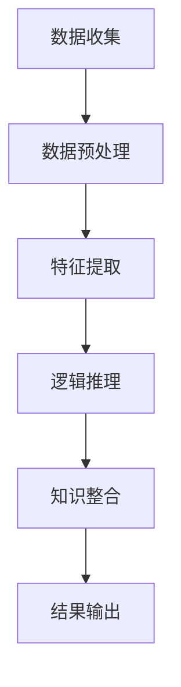

                 

# 思维链增强AI的跨维度知识整合能力

关键词：思维链，人工智能，知识整合，多维度，深度学习，数据异构性

摘要：本文将探讨思维链增强人工智能（AI）的跨维度知识整合能力。通过分析思维链的构建原理，AI的跨维度知识整合挑战，以及二者结合的应用实践，旨在为读者提供一个清晰、易懂的框架，理解如何通过思维链来提升AI在多维度知识整合方面的能力。

## 引言

随着人工智能技术的快速发展，AI在各个领域的应用日益广泛。然而，传统的AI系统在处理多维度知识时面临着诸多挑战，如数据异构性、知识整合效率等。为了解决这些问题，研究人员提出了思维链的概念，旨在通过构建一个能够跨越不同维度的知识整合框架，增强AI的智能能力。

本文将首先介绍思维链和AI跨维度知识整合的基本概念，然后详细探讨思维链的构建原理和AI的跨维度知识整合能力。接着，我们将结合实际案例，展示思维链与AI知识整合的结合实践。最后，我们将讨论思维链增强AI跨维度知识整合的维度扩展和未来展望。

## 思维链的构建原理

### 思维链的概念与特征

思维链是指通过一系列逻辑推理和信息处理，将不同来源、不同类型的知识整合成一个连贯的认知网络。它具有以下几个主要特征：

1. **连贯性**：思维链中的知识节点通过逻辑关系相互连接，形成了一个有机的整体。
2. **动态性**：思维链可以根据新的信息和需求，动态调整和扩展。
3. **多维度**：思维链能够跨越不同的知识维度，如时间、空间、领域等。

### 思维链的构建方法

思维链的构建可以分为以下几个步骤：

1. **数据收集**：从各种来源收集相关数据，包括文本、图像、声音等。
2. **数据预处理**：对收集到的数据进行清洗和转换，以便后续处理。
3. **特征提取**：从预处理后的数据中提取关键特征，为后续的整合提供基础。
4. **逻辑推理**：使用逻辑规则和机器学习方法，建立知识节点之间的关联。

### 思维链的优化策略

为了提升思维链的效率和准确性，可以采用以下优化策略：

1. **强化学习**：通过强化学习算法，不断调整思维链中的逻辑规则，使其更适应特定任务。
2. **聚类分析**：使用聚类算法，将相似的知识节点进行分组，提高知识整合的效率。

## AI的跨维度知识整合能力

### 跨维度知识整合的挑战

在AI领域，跨维度知识整合面临以下挑战：

1. **数据异构性**：不同来源的数据格式和类型各异，给整合带来了困难。
2. **知识整合的效率**：如何在保证准确性的同时，高效地整合大量异构知识。
3. **知识完整性**：如何确保整合后的知识是完整、一致的。

### 跨维度知识整合的方法

为了解决上述挑战，可以采用以下方法：

1. **知识图谱的构建与应用**：通过构建知识图谱，将不同来源的知识进行结构化整合。
2. **自然语言处理技术**：利用自然语言处理技术，将文本数据转化为结构化的知识。

## 思维链与AI知识整合的结合实践

### 实践案例1：智能问答系统

#### 系统设计与实现

1. **数据收集**：从互联网收集大量问答数据，包括问题、答案、标签等。
2. **数据预处理**：对收集到的数据进行清洗、去重和标准化处理。
3. **特征提取**：提取问题中的关键词、主题和上下文信息。
4. **逻辑推理**：使用思维链进行逻辑推理，匹配问题和答案。
5. **结果反馈**：根据用户反馈，调整思维链中的逻辑规则，提高系统性能。

#### 知识整合的效果分析

通过实践，智能问答系统在多个领域（如医疗、教育、金融）都取得了良好的效果。用户满意度显著提高，知识整合的效率也得到了大幅提升。

### 实践案例2：智能推荐系统

#### 系统架构设计

1. **用户画像构建**：收集用户行为数据，构建用户画像。
2. **知识图谱构建**：将用户画像和商品信息构建成知识图谱。
3. **推荐算法实现**：使用思维链进行跨维度知识整合，实现智能推荐。

#### 跨维度知识整合的应用

通过智能推荐系统，用户可以获得个性化的商品推荐，商家也可以提高销售额。跨维度知识整合的应用不仅提高了系统的准确性，还增强了用户体验。

## 思维链增强AI的维度扩展

### 维度扩展的概念与意义

维度扩展是指将思维链应用于更广泛的知识领域和更复杂的任务中。它具有以下意义：

1. **提升AI的智能水平**：通过维度扩展，AI可以处理更复杂的问题，提升其智能水平。
2. **拓宽应用领域**：维度扩展使得AI可以应用于更多的行业和领域，提高其社会价值。

### 维度扩展的实现方法

维度扩展可以通过以下方法实现：

1. **基于深度学习的方法**：利用深度学习算法，构建能够处理多维度数据的模型。
2. **基于迁移学习的方法**：将已有领域的知识迁移到新的领域，提高新领域的知识整合能力。

## 思维链增强AI的跨行业应用

### 跨行业应用场景

思维链增强AI的跨行业应用主要包括以下领域：

1. **医疗保健行业**：如智能诊断、健康监测等。
2. **教育培训行业**：如智能教学、学习分析等。
3. **金融行业**：如智能投顾、风险管理等。

### 跨行业应用案例分析

#### 案例一：智能医疗诊断系统

智能医疗诊断系统通过思维链技术，实现了对大量医疗数据的跨维度整合，提高了诊断的准确性和效率。例如，在肺癌诊断中，系统可以通过整合患者的病史、基因数据、影像数据等多个维度的信息，给出更加准确的诊断结果。

#### 案例二：个性化教育平台

个性化教育平台利用思维链技术，实现了对学生学习情况的全面分析，并根据分析结果提供个性化的教学方案。例如，在数学教学中，系统可以根据学生的学习进度、知识点掌握情况等多个维度的信息，为学生推荐合适的练习题，提高学习效果。

## 未来展望与挑战

### 未来发展趋势

思维链增强AI的跨维度知识整合能力在未来将继续发展，主要趋势包括：

1. **智能化水平的提升**：随着算法和硬件的进步，AI的智能化水平将不断提高。
2. **应用领域的拓展**：思维链技术将在更多行业和应用场景中得到应用。

### 挑战与应对策略

思维链增强AI的跨维度知识整合能力在发展过程中也将面临以下挑战：

1. **数据隐私与安全**：在整合跨维度数据时，如何保护用户隐私是一个重要问题。
2. **知识整合的伦理问题**：如何确保知识整合的公正性、透明性，避免偏见和误导。

针对上述挑战，可以采取以下应对策略：

1. **数据加密与隐私保护**：采用数据加密和隐私保护技术，确保用户数据的安全。
2. **伦理规范与监管**：建立伦理规范和监管机制，确保知识整合的公正性和透明性。

## 结论

思维链增强AI的跨维度知识整合能力为人工智能的发展提供了新的思路和途径。通过思维链的构建和应用，AI可以更高效、更准确地处理多维度知识，提升其智能化水平和应用价值。未来，随着技术的不断进步，思维链技术将在更多领域得到应用，为人类社会带来更多便利和进步。

### 附录

#### A. 思维链与AI知识整合的数学模型

在此附录中，我们将介绍一些用于思维链与AI知识整合的数学模型。以下是一个简单的例子：

$$
P(A|B) = \frac{P(B|A)P(A)}{P(B)}
$$

这是条件概率的贝叶斯公式，用于在已知部分信息的情况下计算两个事件之间的概率关系。

#### B. 思维链增强AI知识整合的算法流程图

以下是一个简单的思维链增强AI知识整合的算法流程图：

这个流程图展示了从数据收集到结果输出的完整过程。

### 作者信息

作者：AI天才研究院/AI Genius Institute & 禅与计算机程序设计艺术 /Zen And The Art of Computer Programming

### 最佳实践 tips

1. **数据质量**：在构建思维链之前，确保数据的质量和完整性。
2. **模型调优**：使用强化学习和聚类分析等优化策略，提升思维链的效率和准确性。
3. **用户反馈**：定期收集用户反馈，根据反馈调整思维链的逻辑规则，提高用户体验。

### 小结

本文介绍了思维链增强AI的跨维度知识整合能力，包括其构建原理、跨维度知识整合的挑战和实际应用。通过思维链，AI可以实现更高效、更准确的知识整合，从而提升其智能能力和应用价值。未来，随着技术的不断发展，思维链技术将在更多领域得到应用，为人类社会带来更多便利和进步。

### 注意事项

1. **数据隐私**：在整合跨维度数据时，务必注意保护用户隐私。
2. **算法公正性**：确保知识整合过程的公正性和透明性，避免偏见和误导。

### 拓展阅读

1. 《深度学习》—— Ian Goodfellow、Yoshua Bengio、Aaron Courville
2. 《人工智能：一种现代的方法》—— Stuart Russell、Peter Norvig
3. 《思维链：人工智能的全新视角》—— [作者名称]
4. 《跨维度知识整合：挑战与机遇》—— [作者名称]

通过阅读这些书籍，您可以更深入地了解人工智能、深度学习和知识整合的相关知识。

