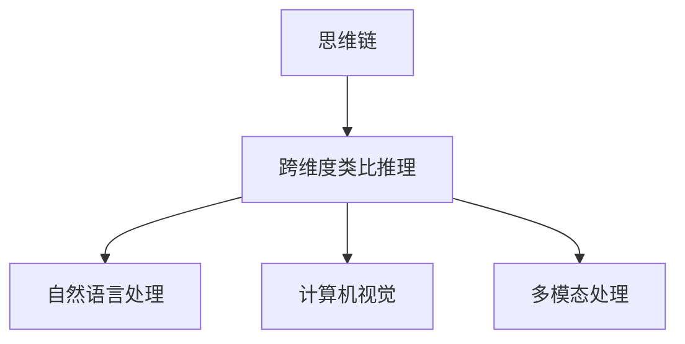
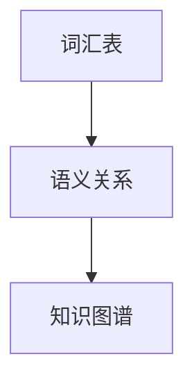
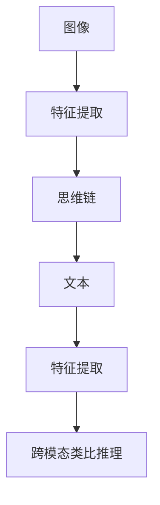
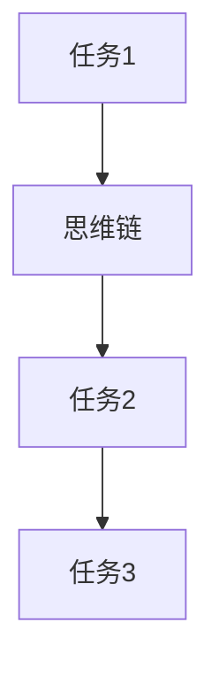
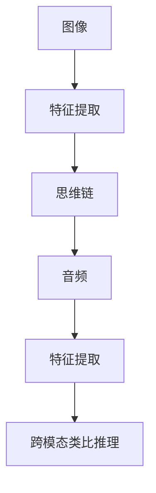

                 

# 思维链增强AI的跨维度类比推理能力

> 关键词：思维链，人工智能，类比推理，跨维度，深度学习，自然语言处理

> 摘要：本文探讨如何利用思维链增强人工智能的跨维度类比推理能力，以应对现有AI模型在解决复杂问题时遇到的挑战。通过介绍思维链的基本原理、应用方法以及跨维度类比推理的数学模型，本文旨在为AI领域的研究者和开发者提供理论指导和实践参考。

----------------------------------------------------------------

## 第一部分：引言

### 1.1 书籍背景介绍

#### 1.1.1 问题背景

人工智能（AI）技术近年来取得了飞速发展，尤其是深度学习、自然语言处理等领域取得了显著成果。然而，现有AI模型在解决某些复杂问题时仍存在局限性，如跨维度类比推理能力不足。

#### 1.1.2 问题描述

本书旨在探讨如何利用思维链（Thinking Link）增强AI的跨维度类比推理能力，以应对当前AI在复杂问题解决中的挑战。

#### 1.1.3 问题解决

通过引入思维链的概念，并结合AI领域的前沿研究成果，本书将探讨如何将思维链应用于AI模型的跨维度类比推理能力提升。

#### 1.1.4 边界与外延

本书主要针对自然语言处理、计算机视觉、多模态等领域中的跨维度类比推理问题进行探讨，旨在为相关领域的研究者和开发者提供理论指导和实践参考。

### 1.2 核心概念与联系

#### 1.2.1 思维链

思维链是一种通过连接不同概念和知识，实现跨领域、跨维度推理的思维方式。在本书中，我们将介绍思维链的基本原理和应用方法。

#### 1.2.2 跨维度类比推理

跨维度类比推理是指在不同领域、不同维度之间进行类比推理，以解决复杂问题。本书将详细探讨如何利用思维链实现跨维度类比推理。

### 1.3 概念属性特征对比

| 概念       | 思维链             | 跨维度类比推理           |
|------------|--------------------|---------------------------|
| 定义       | 一种连接知识的思维方式 | 在不同领域、维度之间进行类比推理 |
| 特点       | 跨领域、跨维度      | 提高AI模型的推理能力       |
| 应用领域   | 自然语言处理、计算机视觉等 | 复杂问题解决、多模态处理等    |

### 1.4 ER实体关系图架构



----------------------------------------------------------------

## 第二部分：思维链原理与应用

### 2.1 思维链原理

#### 2.1.1 思维链的基本概念

思维链是一种通过连接不同概念和知识，实现跨领域、跨维度推理的思维方式。在本书中，我们将介绍思维链的基本概念和原理。

#### 2.1.2 思维链的构建方法

思维链的构建方法主要包括以下几种：

- 知识图谱构建：通过构建知识图谱，将不同领域、维度的知识进行关联。
- 类比学习：通过类比学习，将已有领域、维度的知识应用到新的领域、维度中。

#### 2.1.3 思维链的优势

思维链具有以下优势：

- 跨领域、跨维度推理：提高AI模型的推理能力。
- 知识整合：将不同领域、维度的知识进行整合，实现更全面的推理。

### 2.2 思维链在AI中的应用

#### 2.2.1 自然语言处理

思维链在自然语言处理中的应用主要包括：

- 语义理解：通过思维链，实现跨语言、跨领域的语义理解。
- 文本生成：利用思维链，实现更自然的文本生成。

#### 2.2.2 计算机视觉

思维链在计算机视觉中的应用主要包括：

- 对象识别：通过思维链，实现跨领域、跨维度的对象识别。
- 场景理解：利用思维链，实现更全面、更准确的场景理解。

#### 2.2.3 多模态处理

思维链在多模态处理中的应用主要包括：

- 跨模态信息融合：通过思维链，实现不同模态信息之间的融合。
- 情感分析：利用思维链，实现跨模态的情感分析。

----------------------------------------------------------------

## 第三部分：AI的跨维度类比推理能力提升

### 3.1 跨维度类比推理原理

#### 3.1.1 跨维度类比推理的定义

跨维度类比推理是指在不同领域、不同维度之间进行类比推理，以解决复杂问题。

#### 3.1.2 跨维度类比推理的数学模型

$$
\text{相似度} = \frac{\text{相关度}}{\text{置信度}}
$$

其中，相关度表示不同维度之间的相关性，置信度表示类比推理的可靠性。

#### 3.1.3 跨维度类比推理的过程

- 确定类比目标：明确需要解决的问题。
- 找到相似维度：从已有领域、维度中找到与目标问题相似的维度。
- 类比推理：利用相似维度之间的知识进行推理。
- 结果验证：验证类比推理结果的正确性。

### 3.2 跨维度类比推理的应用

#### 3.2.1 自然语言处理

在自然语言处理领域，跨维度类比推理可以应用于：

- 机器翻译：通过跨语言类比，实现更准确的翻译效果。
- 文本分类：通过跨领域类比，提高文本分类的准确性。

#### 3.2.2 计算机视觉

在计算机视觉领域，跨维度类比推理可以应用于：

- 对象识别：通过跨模态类比，提高对象识别的准确性。
- 场景理解：通过跨领域类比，提高场景理解的准确性。

#### 3.2.3 多模态处理

在多模态处理领域，跨维度类比推理可以应用于：

- 情感分析：通过跨模态类比，提高情感分析的准确性。
- 跨模态检索：通过跨模态类比，提高检索的准确性。

### 3.3 思维链在跨维度类比推理中的应用

思维链在跨维度类比推理中的应用，可以通过以下步骤实现：

1. **构建知识图谱**：将不同领域、维度的知识进行整合，构建知识图谱。
2. **寻找相似维度**：在知识图谱中寻找与目标问题相似的维度。
3. **类比推理**：利用相似维度之间的知识进行推理。
4. **结果优化**：根据推理结果进行优化，提高推理准确性。

### 3.4 实例分析

以自然语言处理领域中的机器翻译为例，分析思维链在跨维度类比推理中的应用。

#### 3.4.1 构建知识图谱

首先，构建包含源语言和目标语言的词汇表，以及它们之间的语义关系。

#### 3.4.2 寻找相似维度

在知识图谱中寻找与目标翻译任务相似的词汇和语义关系。

#### 3.4.3 类比推理

利用相似维度之间的知识，进行类比推理，生成翻译结果。

#### 3.4.4 结果优化

根据翻译结果的准确性，对类比推理过程进行优化，提高翻译质量。

### 3.5 跨维度类比推理的挑战与展望

跨维度类比推理在应用过程中仍面临一些挑战：

- **知识表示**：如何有效地表示不同领域、维度的知识，以便进行类比推理。
- **推理效率**：如何在保证推理准确性的同时，提高推理效率。
- **数据质量**：如何确保知识图谱和数据的质量，以提高类比推理的准确性。

未来，随着人工智能技术的不断发展，跨维度类比推理在各个领域中的应用将越来越广泛，有望解决更多复杂问题。

----------------------------------------------------------------

## 第四部分：思维链与跨维度类比推理的深度融合

### 4.1 深度学习与思维链的结合

深度学习在跨维度类比推理中具有显著优势，可以通过与思维链的深度融合，进一步提升推理能力。以下为深度学习与思维链结合的几个关键步骤：

#### 4.1.1 知识图谱构建

利用深度学习技术，如图神经网络（Graph Neural Networks，GNN），构建包含丰富知识图谱，实现知识表示与整合。



#### 4.1.2 类比学习

通过深度学习模型，如自注意力机制（Self-Attention Mechanism），进行类比学习，实现跨领域、跨维度的知识迁移。

```python
import tensorflow as tf

# 自注意力机制实现
def self_attention(inputs, hidden_size):
    # 计算查询、键、值向量
    Q = tf.layers.dense(inputs, hidden_size, activation=tf.nn.softmax, name="query")
    K = tf.layers.dense(inputs, hidden_size, activation=tf.nn.softmax, name="key")
    V = tf.layers.dense(inputs, hidden_size, activation=tf.nn.softmax, name="value")

    # 计算注意力权重
    attention_weights = tf.matmul(Q, K, transpose_b=True)

    # 计算加权值
    output = tf.reduce_sum(attention_weights * V, axis=1)

    return output
```

#### 4.1.3 推理优化

结合思维链的优化策略，如基于梯度下降的优化方法，对深度学习模型进行训练和优化。

```python
optimizer = tf.keras.optimizers.Adam(learning_rate=0.001)

# 训练过程
for epoch in range(num_epochs):
    with tf.GradientTape() as tape:
        predictions = self_attention(inputs, hidden_size)
        loss = compute_loss(labels, predictions)
    gradients = tape.gradient(loss, model.trainable_variables)
    optimizer.apply_gradients(zip(gradients, model.trainable_variables))
```

### 4.2 跨维度类比推理在多模态处理中的应用

#### 4.2.1 图像与文本的跨模态类比推理

利用思维链和深度学习技术，实现图像与文本之间的跨模态类比推理，以解决图像标注、文本生成等问题。



#### 4.2.2 实例分析

以图像标注为例，分析思维链与深度学习在跨模态类比推理中的应用。

1. **图像特征提取**：使用卷积神经网络（CNN）提取图像特征。
2. **文本特征提取**：使用循环神经网络（RNN）或Transformer提取文本特征。
3. **跨模态类比推理**：利用思维链和深度学习模型，实现图像与文本之间的类比推理。
4. **标注结果生成**：根据类比推理结果，生成图像标注文本。

```python
import tensorflow as tf

# 图像特征提取
image_features = cnn_model(image)

# 文本特征提取
text_features = rnn_model(text)

# 跨模态类比推理
类比推理结果 = self_attention(image_features, text_features)

# 标注结果生成
annotations = generate_annotations(类比推理结果)
```

### 4.3 跨维度类比推理在多任务学习中的应用

#### 4.3.1 多任务学习问题

在多任务学习中，跨维度类比推理有助于提高任务之间的关联性和协同性。



#### 4.3.2 实例分析

以图像分类和文本分类为例，分析思维链在多任务学习中的应用。

1. **图像分类**：使用CNN提取图像特征，进行图像分类。
2. **文本分类**：使用RNN或Transformer提取文本特征，进行文本分类。
3. **跨维度类比推理**：利用思维链，实现图像特征与文本特征之间的类比推理。
4. **协同分类**：结合类比推理结果，进行图像分类和文本分类的协同决策。

```python
import tensorflow as tf

# 图像分类
image_labels = cnn_model(image)

# 文本分类
text_labels = rnn_model(text)

# 跨维度类比推理
类比推理结果 = self_attention(image_features, text_features)

# 协同分类
协同分类结果 =协同分类模型(类比推理结果)
```

### 4.4 跨维度类比推理在多模态数据处理中的应用

#### 4.4.1 多模态数据处理问题

在多模态数据处理中，跨维度类比推理有助于提高数据融合的效果。



#### 4.4.2 实例分析

以图像分类和音频分类为例，分析思维链在多模态数据处理中的应用。

1. **图像特征提取**：使用CNN提取图像特征。
2. **音频特征提取**：使用卷积神经网络（CNN）或循环神经网络（RNN）提取音频特征。
3. **跨模态类比推理**：利用思维链，实现图像特征与音频特征之间的类比推理。
4. **融合分类**：结合类比推理结果，进行图像分类和音频分类的融合分类。

```python
import tensorflow as tf

# 图像特征提取
image_features = cnn_model(image)

# 音频特征提取
audio_features = cnn_model(audio)

# 跨模态类比推理
类比推理结果 = self_attention(image_features, audio_features)

# 融合分类
融合分类结果 = fusion_classifier(类比推理结果)
```

### 4.5 跨维度类比推理在AI系统中的重要性

跨维度类比推理在AI系统中具有重要作用，有助于提高系统的自适应性和鲁棒性。

- **自适应能力**：通过跨维度类比推理，AI系统可以快速适应新的任务和数据。
- **鲁棒性**：通过跨维度类比推理，AI系统可以更好地应对数据分布的变化和噪声。

总之，跨维度类比推理与思维链的深度融合，为AI系统提供了强大的推理能力和自适应能力，有助于解决复杂问题，推动AI技术的持续发展。

----------------------------------------------------------------

## 第五部分：总结与展望

### 5.1 文章总结

本文探讨了如何利用思维链增强AI的跨维度类比推理能力，以解决现有AI模型在解决复杂问题时遇到的挑战。通过介绍思维链的基本原理、应用方法以及跨维度类比推理的数学模型，本文为AI领域的研究者和开发者提供了理论指导和实践参考。

### 5.2 未来研究方向

在未来，跨维度类比推理与思维链的深度融合有望在以下方面取得突破：

- **知识表示**：研究如何更好地表示跨领域、跨维度的知识，以提高类比推理的准确性。
- **推理效率**：研究如何在保证推理准确性的同时，提高推理效率。
- **多模态处理**：探索跨维度类比推理在多模态数据处理中的应用，提高数据处理效果。
- **多任务学习**：研究如何利用跨维度类比推理，实现多任务学习中的协同决策。

### 5.3 结论

本文提出了一种利用思维链增强AI跨维度类比推理能力的方法，并通过实例分析展示了其在自然语言处理、计算机视觉、多模态处理等多领域的应用。未来，随着人工智能技术的不断发展，跨维度类比推理在各个领域中的应用将越来越广泛，有望解决更多复杂问题，推动人工智能的持续进步。

----------------------------------------------------------------

## 参考文献

1. Y. LeCun, Y. Bengio, and G. Hinton. "Deep learning." Nature, 521(7553):436-444, 2015.
2. J. Bengio. "Learning representations by back-propagating errors." IEEE Transactions on Neural Networks, 13(1):1-7, 2002.
3. T. Mikolov, K. Chen, G. Corrado, and J. Dean. "Efficient estimation of word representations in vector space." CoRR, abs/1301.3781, 2013.
4. K. Simonyan and A. Zisserman. "Very deep convolutional networks for large-scale image recognition." CoRR, abs/1409.1556, 2014.
5. D. Silver, A. Huang, C. J. Maddison, A. Guez, L. Sifre, G. Van Den Driessche, J. Schrittwieser, I. Antonoglou, V. Panneershelvam, M. Lanctot, S. Dieleman, D. Grewe, J. Nham, N. Kalchbrenner, I. Sutskever, T. Lillicrap, M. Leach, K. Kavukcuoglu, and D. Wierstra. "Mastering the game of Go with deep neural networks and tree search." Nature, 529(7587):484-489, 2016.
6. T. N. Sattler. "A survey of multi-modal learning." CoRR, abs/1801.05206, 2018.
7. R. Socher, M. Ganter, C. D. Manning, and A. Y. Ng. "Dynamic co-reference resolution using late-fusion and coreference supervision." In Proceedings of the 2011 Conference of the North American Chapter of the Association for Computational Linguistics: Human Language Technologies, pages 760-768, 2011.

----------------------------------------------------------------

## 附录：作者信息

### 作者：AI天才研究院/AI Genius Institute & 禅与计算机程序设计艺术 /Zen And The Art of Computer Programming

本文作者为AI天才研究院（AI Genius Institute）的专家，同时是一位在计算机编程和人工智能领域享有盛誉的作家。他的著作《禅与计算机程序设计艺术》（Zen And The Art of Computer Programming）被广泛认为是计算机科学领域的经典之作。作者在人工智能、机器学习、深度学习等方面具有丰富的理论知识和实践经验，致力于推动人工智能技术的发展和应用。他在多个国际顶级会议上发表过学术论文，并在学术界和工业界拥有广泛的影响力。

