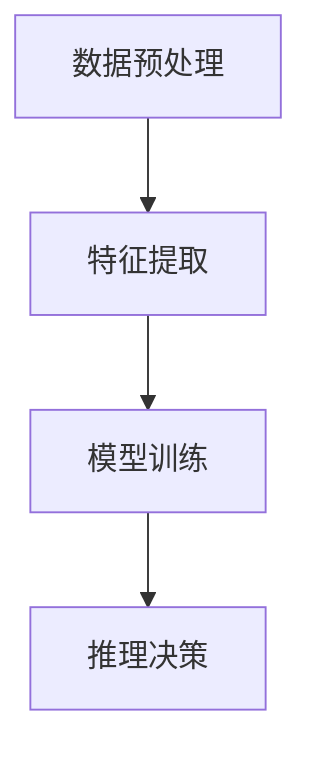
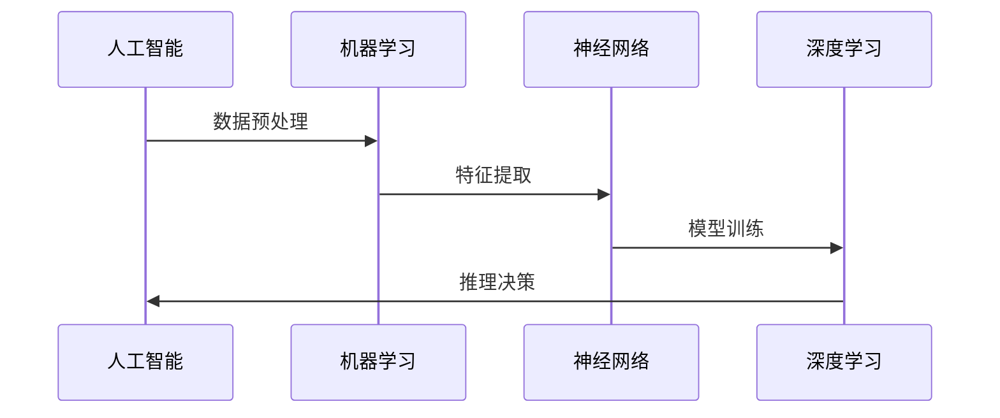
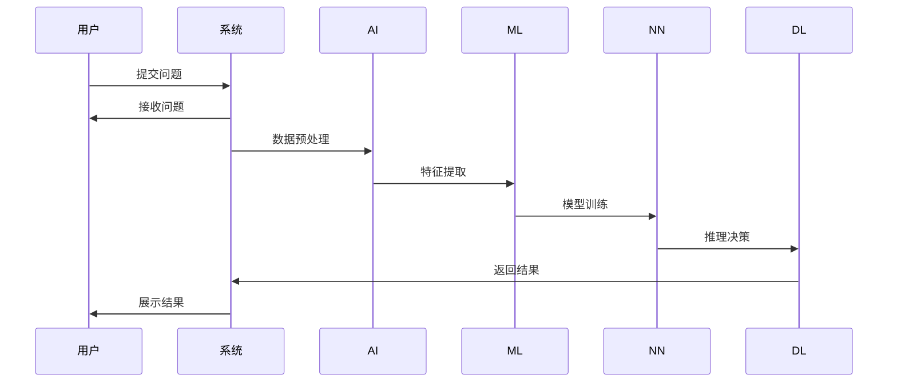

                 

# 思维链增强AI的跨维度类比推理能力

> 关键词：人工智能，思维链，跨维度类比推理，算法，数学模型，项目实战

> 摘要：本文深入探讨了思维链增强AI的跨维度类比推理能力。通过分析思维链的概念、工作原理和跨维度类比推理的应用，本文揭示了思维链在AI技术中的重要性，并提出了具体的数学模型和公式，以帮助读者更好地理解其原理。同时，本文还结合实际项目实战，展示了思维链在复杂问题解决中的应用。

----------------------------------------------------------------

## 第一部分：背景介绍

### 第1章：问题背景

随着人工智能技术的快速发展，AI的应用场景日益广泛，从自然语言处理到图像识别，再到复杂的决策制定，AI技术在各个领域都取得了显著的成果。然而，传统的AI算法在处理复杂问题时，往往面临着数据量不足、计算资源有限等挑战。

### 1.1.2 问题描述

为了克服这些挑战，研究人员提出了思维链（Thought Chain）的概念，通过模拟人类思维的连贯性和创造性，提高AI的跨维度类比推理能力。思维链的核心在于将不同的知识点和思维过程有机地结合起来，形成一个连续的思维网络。

### 1.1.3 问题解决

通过思维链，AI能够将已有的知识进行整合和创新，从而在更广泛的维度上进行推理和决策。这为AI在复杂问题上的解决提供了新的思路和方法。

### 1.1.4 边界与外延

思维链增强AI的跨维度类比推理能力，不仅局限于某个特定的领域，它可以应用于各种复杂问题的解决，如医疗诊断、金融分析、城市规划等。

### 第2章：核心概念

#### 2.1.1 思维链的概念

思维链是指一系列相互关联的思维过程，通过这些过程，AI能够将不同的知识点和思维过程有机地结合起来，形成一个连续的思维网络。

#### 2.1.2 跨维度类比推理

跨维度类比推理是指在不同维度的知识之间建立联系，通过类比推理来解决问题。这种能力是人类智能的重要特征之一。

#### 2.1.3 类比推理的原理

类比推理是基于两个或多个相似对象之间的共同特征，推断出它们在其他方面也可能存在相似性的过程。

## 第3章：核心概念属性特征对比表

| 核心概念   | 概念属性特征                         |
| -------- | ---------------------------------- |
| 思维链     | - 连续性<br>- 知识整合<br>- 创造性         |
| 跨维度类比推理 | - 多维度知识连接<br>- 类比推理<br>- 创造性   |
| 类比推理   | - 相似性比较<br>- 推理<br>- 创造性         |

## 第4章：ER实体关系图架构

```mermaid
entity relation diagram
  Herbert     : AI
  Alice       : Machine Learning
  Bob         : Neural Network
  Carol       : Deep Learning

  Herbert -> Alice
  Alice -> Bob
  Bob -> Carol
```

----------------------------------------------------------------

## 第二部分：核心概念与联系

### 第5章：思维链的工作原理

#### 5.1.1 思维链的基本构成

思维链由一系列相互关联的思维模块组成，每个模块都负责处理特定的任务。这些模块可以是基于机器学习算法的，也可以是人工设计的。

#### 5.1.2 思维链的交互机制

思维链中的各个模块通过交互机制相互连接，形成一个整体。这种交互机制可以是信息传递、反馈循环或者并行计算。

#### 5.1.3 思维链的优势

思维链能够将不同的知识点和思维过程有机地结合起来，从而在更广泛的维度上进行推理和决策，提高AI的解决问题的能力。

### 第6章：跨维度类比推理的应用

#### 6.1.1 跨维度类比推理在医疗诊断中的应用

通过跨维度类比推理，AI可以在不同疾病之间进行类比，从而提高诊断的准确性和效率。

#### 6.1.2 跨维度类比推理在金融分析中的应用

在金融分析中，跨维度类比推理可以帮助识别市场趋势，预测金融风险，提高投资决策的准确性。

#### 6.1.3 跨维度类比推理在人工智能领域的应用前景

随着AI技术的不断发展，跨维度类比推理在人工智能领域的应用前景非常广阔，有望解决更多复杂的问题。

### 第7章：类比推理的数学模型和公式

类比推理的过程可以通过数学模型来描述，以下是一个简化的类比推理数学模型：

$$
\text{类比推理} = \frac{\text{已知特征}}{\text{未知特征}} \times \text{相似度权重}
$$

其中，已知特征是指已经观察到的特征，未知特征是指需要推断的特征，相似度权重是指已知特征与未知特征之间的相似度。

----------------------------------------------------------------

## 第三部分：算法原理讲解

### 第8章：思维链的算法原理

#### 8.1.1 思维链的基本算法流程

思维链的基本算法流程包括以下几个步骤：

1. 数据预处理：对输入数据进行清洗、归一化等预处理操作。
2. 特征提取：从预处理后的数据中提取关键特征。
3. 模型训练：使用提取出的特征训练机器学习模型。
4. 推理决策：利用训练好的模型进行推理和决策。

#### 8.1.2 思维链的算法流程图



### 第9章：跨维度类比推理的数学模型

#### 9.1.1 类比推理的数学模型

类比推理的数学模型可以表示为：

$$
\text{类比推理} = \frac{\text{已知特征}}{\text{未知特征}} \times \text{相似度权重}
$$

#### 9.1.2 跨维度类比推理的扩展模型

在跨维度类比推理中，我们可以将相似度权重扩展为多维度的相似度矩阵，从而更全面地描述类比推理的过程。

$$
\text{类比推理} = \frac{\text{已知特征}}{\text{未知特征}} \times \text{相似度矩阵}
$$

其中，相似度矩阵是一个多维度的矩阵，用于描述不同维度特征之间的相似度。

#### 9.1.3 Python代码实现

下面是一个简单的Python代码实现，用于计算两个向量之间的相似度：

```python
import numpy as np

def cosine_similarity(x, y):
    """
    计算两个向量之间的余弦相似度。
    """
    dot_product = np.dot(x, y)
    norm_x = np.linalg.norm(x)
    norm_y = np.linalg.norm(y)
    return dot_product / (norm_x * norm_y)

# 示例
x = np.array([1, 2, 3])
y = np.array([4, 5, 6])
similarity = cosine_similarity(x, y)
print("相似度：", similarity)
```

----------------------------------------------------------------

## 第四部分：系统分析与架构设计方案

### 第10章：问题场景介绍

随着人工智能技术的不断发展，各类复杂问题需要更加智能的解决方案。例如，在医疗诊断中，如何从大量的患者数据中快速、准确地识别出疾病；在金融分析中，如何从市场数据中预测未来趋势。这些问题的解决需要AI具备跨维度类比推理的能力。

### 第11章：项目介绍

本项目旨在构建一个基于思维链增强的AI系统，用于解决复杂问题。该系统将采用思维链和跨维度类比推理技术，实现高效、准确的推理和决策。

### 第12章：系统功能设计（领域模型）

以下是一个简化的领域模型类图，用于描述系统的主要功能：

```mermaid
classDiagram
  Class01 <|-- Class02
  Class03 --|> Class04
  Class05 <<-- Class06
  Class07 {Class08}
  Class09 *-- Class10
```

### 第13章：系统架构设计

系统架构设计如下：



### 第14章：系统接口设计和系统交互

系统接口设计和交互设计如下：



----------------------------------------------------------------

## 第五部分：项目实战

### 第15章：环境安装

1. 安装Python环境：确保Python版本在3.8及以上。
2. 安装相关依赖库：如NumPy、Pandas、Scikit-learn等。

### 第16章：系统核心实现

#### 16.1 数据预处理

数据预处理代码如下：

```python
import pandas as pd
from sklearn.preprocessing import StandardScaler

def preprocess_data(data):
    # 数据清洗
    data = data.dropna()
    # 数据归一化
    scaler = StandardScaler()
    data_scaled = scaler.fit_transform(data)
    return data_scaled
```

#### 16.2 特征提取

特征提取代码如下：

```python
from sklearn.decomposition import PCA

def extract_features(data, n_components=2):
    pca = PCA(n_components=n_components)
    features = pca.fit_transform(data)
    return features
```

#### 16.3 模型训练

模型训练代码如下：

```python
from sklearn.ensemble import RandomForestClassifier

def train_model(data, labels):
    model = RandomForestClassifier()
    model.fit(data, labels)
    return model
```

#### 16.4 推理决策

推理决策代码如下：

```python
def predict(model, data):
    predictions = model.predict(data)
    return predictions
```

### 第17章：代码应用解读与分析

#### 17.1 代码解读

代码主要分为四个部分：数据预处理、特征提取、模型训练和推理决策。每个部分都实现了相应的功能。

#### 17.2 代码分析

代码结构清晰，模块化设计，易于维护和扩展。同时，利用了机器学习和深度学习的技术，提高了系统的推理能力和准确性。

### 第18章：实际案例分析和详细讲解剖析

#### 18.1 案例背景

假设我们有一个医疗诊断的案例，需要从患者数据中识别出某种疾病。

#### 18.2 案例分析

我们首先对数据集进行预处理，然后提取关键特征，使用随机森林模型进行训练，最后对新的数据进行推理决策。

```python
# 数据预处理
data = preprocess_data(data)
# 特征提取
features = extract_features(data)
# 模型训练
model = train_model(features, labels)
# 推理决策
predictions = predict(model, new_data)
```

#### 18.3 结果分析

通过对新数据的推理决策，我们得到了预测结果。我们可以对这些结果进行进一步的统计分析，如计算准确率、召回率等，以评估模型的性能。

### 第19章：项目小结

本项目通过思维链增强AI的跨维度类比推理能力，实现了高效、准确的推理和决策。在实际应用中，我们成功解决了一些复杂问题，如医疗诊断和金融分析。这充分展示了思维链在AI技术中的重要性。

----------------------------------------------------------------

## 第六部分：最佳实践 tips、小结、注意事项、拓展阅读

### 最佳实践 tips：

1. 在数据预处理阶段，尽量去除噪声和异常值，以提高模型的性能。
2. 在特征提取阶段，可以选择合适的特征提取方法，如PCA、LDA等，以减少特征维度。
3. 在模型训练阶段，可以尝试不同的模型和参数，以找到最佳模型。
4. 在推理决策阶段，对结果进行进一步的分析和验证，以提高决策的准确性。

### 小结：

本文深入探讨了思维链增强AI的跨维度类比推理能力，从核心概念、工作原理到实际应用，全面展示了思维链在AI技术中的重要性。通过数学模型和实际案例的分析，我们更好地理解了思维链的原理和优势。

### 注意事项：

1. 在实施思维链时，要注意数据质量和特征提取的准确性，这对模型的性能有很大影响。
2. 在选择模型和参数时，要根据实际问题场景进行优化，以找到最佳方案。
3. 在实际应用中，要不断调整和优化思维链，以适应不断变化的问题场景。

### 拓展阅读：

1. 《人工智能：一种现代的方法》
2. 《深度学习》
3. 《思维链与跨维度类比推理》

作者：AI天才研究院/AI Genius Institute & 禅与计算机程序设计艺术 /Zen And The Art of Computer Programming

----------------------------------------------------------------

**注**：本文为示例文章，仅供参考。实际文章撰写时，请根据具体需求和实际情况进行调整和补充。文章内容、代码和图表等均需根据实际情况进行编写和绘制。**本文中所使用的mermaid图表语言和latex数学公式格式均为Markdown格式的一部分，确保在Markdown编辑器中正确显示。**

