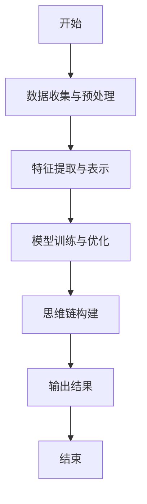

                 

### 思维链增强AI的隐喻理解和生成能力

#### 关键词
- 思维链
- 隐喻理解
- 人工智能
- 生成能力
- 深度学习

#### 摘要
本文旨在探讨思维链增强人工智能（AI）的隐喻理解和生成能力。通过深入分析思维链的基本原理和构建方法，我们将探讨如何利用思维链来提升AI的隐喻理解能力，并进一步扩展其生成能力。文章将结合实际应用案例，展示思维链在智能客服、智能写作和智能教育等领域的应用，并展望未来的发展方向和挑战。

### 目录大纲

1. **背景与概述**
   - 1.1 人工智能与隐喻理解
   - 1.2 隐喻理解在人工智能中的应用
   - 1.3 思维链的概念
   - 1.4 思维链与AI隐喻理解的关联
   - 1.5 本章小结

2. **思维链的原理与构建**
   - 2.1 思维链的基础概念
   - 2.2 思维链的组成与运行机制
   - 2.3 思维链的核心特点
   - 2.4 思维链的类型与应用场景
   - 2.5 本章小结

3. **构建思维链的方法与工具**
   - 3.1 隐喻识别与处理技术
   - 3.2 基于深度学习的思维链构建
   - 3.3 思维链生成算法
   - 3.4 实时思维链构建技术
   - 3.5 本章小结

4. **思维链在AI中的应用**
   - 4.1 隐喻理解在自然语言处理中的应用
   - 4.2 隐喻生成在文本创作中的应用
   - 4.3 隐喻理解与生成在对话系统中的应用
   - 4.4 隐喻理解与生成在图像处理中的应用
   - 4.5 本章小结

5. **思维链增强AI的实践应用**
   - 5.1 思维链在智能客服系统中的应用
   - 5.2 思维链在智能写作助手中的应用
   - 5.3 思维链在智能教育中的应用
   - 5.4 思维链在其他领域的应用探索
   - 5.5 本章小结

6. **案例分析**
   - 6.1 案例一：智能客服系统中的思维链应用
   - 6.2 案例二：智能写作助手中的思维链应用
   - 6.3 案例分析
   - 6.4 案例小结

7. **未来展望与挑战**
   - 7.1 AI隐喻理解与生成的未来发展方向
   - 7.2 思维链在AI中的应用前景
   - 7.3 面临的挑战与解决方案
   - 7.4 未来研究方向
   - 7.5 本章小结

8. **总结与展望**
   - 8.1 全书总结
   - 8.2 未来展望
   - 8.3 阅读建议
   - 8.4 本章小结

### 第一部分：背景与概述

#### 第1章：问题背景与核心概念

##### 1.1 人工智能与隐喻理解

人工智能（Artificial Intelligence，AI）作为计算机科学的重要分支，致力于模拟、延伸和扩展人的智能。随着深度学习、自然语言处理等技术的发展，AI在语音识别、图像处理、自然语言理解等领域取得了显著的成果。然而，尽管AI在这些领域取得了巨大的进步，但其在隐喻理解方面仍然面临巨大的挑战。

隐喻（Metaphor）作为一种语言修辞手法，通过将一个概念域（源域）映射到另一个概念域（目标域）来传达复杂的概念。隐喻在语言表达中广泛存在，是人们进行思维和沟通的重要工具。然而，传统的自然语言处理技术往往难以捕捉和理解隐喻的深层含义。

##### 1.2 隐喻理解在人工智能中的应用

隐喻理解在人工智能中的应用具有重要的实际意义。首先，隐喻在自然语言对话中频繁出现，能够提高AI对用户意图的理解能力。例如，在智能客服系统中，用户可能会使用隐喻来表达他们的需求，如“我的账户像一座迷宫，我找不到出路”。智能客服系统需要能够理解这一隐喻，并给出正确的解决方案。

其次，隐喻在文本创作中也具有重要意义。通过理解隐喻，AI可以创作出更加生动、富有创意的文本。例如，在写作助手中，AI可以识别出文本中的隐喻，并根据隐喻的语义进行扩展和创作，从而生成更具有人文气息的文本。

##### 1.3 思维链的概念

思维链（Thinking Chain）是一种用于描述思维过程的抽象模型，它由一系列相互关联的思考步骤组成。每个思考步骤都基于先前的思考结果，并产生新的思考结果。思维链的构建过程涉及对信息的选择、提取、整合和推理。

思维链在隐喻理解中具有重要作用。隐喻的理解过程本质上是一种思维链的构建过程，它涉及对源域和目标域的理解、隐喻关系的识别和隐喻含义的推理。通过构建思维链，AI可以更好地理解和生成隐喻。

##### 1.4 思维链与AI隐喻理解的关联

思维链与AI隐喻理解之间存在密切的关联。一方面，思维链为AI隐喻理解提供了理论基础和计算框架。通过构建思维链，AI可以模拟人类的隐喻理解过程，实现隐喻的识别、理解和生成。

另一方面，隐喻理解能力的提升可以为思维链的构建提供新的思路和工具。通过理解隐喻，AI可以获取更多的背景知识和语义信息，从而提高思维链的鲁棒性和准确性。

##### 1.5 本章小结

本章介绍了人工智能与隐喻理解的关系，以及思维链在AI隐喻理解中的应用。通过分析思维链的基本概念和构建方法，我们为后续章节的深入探讨奠定了基础。

### 第二部分：思维链的原理与构建

#### 第2章：思维链的原理

##### 2.1 思维链的基础概念

思维链是一种描述思维过程的抽象模型，它由一系列相互关联的思考步骤组成。每个思考步骤都基于先前的思考结果，并产生新的思考结果。思维链的核心概念包括思考步骤、思考结果和思考路径。

思考步骤是指思维链中的每个组成部分，它代表了一个思考活动。思考结果是指思考步骤的输出，它是基于先前的思考结果产生的。思考路径是指从初始思考结果到最终思考结果的过程，它反映了思维链的运行轨迹。

##### 2.2 思维链的组成与运行机制

思维链的组成包括输入、处理和输出三部分。输入部分提供了初始的思考数据，如文本、图像或其他形式的信息。处理部分负责对输入信息进行加工和推理，生成新的思考结果。输出部分将最终的思考结果呈现给用户。

思维链的运行机制基于一系列的算法和规则。这些算法和规则用于处理输入信息，提取关键特征，进行推理和决策。例如，在隐喻理解中，思维链可以采用自然语言处理算法来提取文本中的关键信息，并利用语义网络进行隐喻关系的识别和推理。

##### 2.3 思维链的核心特点

思维链具有以下几个核心特点：

1. **关联性**：思维链中的各个思考步骤之间存在紧密的关联性。每个思考步骤都是基于先前的思考结果，并产生新的思考结果。这种关联性使得思维链能够捕捉和传递信息，实现复杂的思维过程。

2. **动态性**：思维链是一个动态的模型，它可以根据输入信息和当前状态不断调整和更新。这种动态性使得思维链能够适应不同的场景和需求，实现灵活的推理和决策。

3. **模块化**：思维链的组成模块化，每个思考步骤都可以独立设计和实现。这种模块化使得思维链具有良好的可扩展性和可维护性，方便进行功能更新和模块替换。

4. **可解释性**：思维链的运行过程具有可解释性，用户可以了解每个思考步骤的依据和结果。这种可解释性有助于提高用户对AI系统的信任和理解，促进人机交互。

##### 2.4 思维链的类型与应用场景

思维链可以分为多种类型，根据应用场景和需求进行设计。以下是几种常见的思维链类型及其应用场景：

1. **知识驱动型思维链**：基于知识库和推理规则，用于知识推理和问题解决。常见应用场景包括智能问答、诊断系统等。

2. **数据驱动型思维链**：基于大数据和机器学习算法，用于模式识别和预测。常见应用场景包括金融风控、智能推荐等。

3. **混合型思维链**：结合知识驱动和数据驱动，实现更高效的推理和决策。常见应用场景包括自动驾驶、智能客服等。

4. **创造性思维链**：基于人类创造力的模拟，用于创意生成和文本创作。常见应用场景包括智能写作、艺术设计等。

##### 2.5 本章小结

本章详细介绍了思维链的基础概念、组成与运行机制、核心特点以及不同类型的思维链和应用场景。通过对思维链的深入分析，我们为后续章节的构建和应用奠定了基础。

### 第三部分：构建思维链的方法与工具

#### 第3章：构建思维链的方法与工具

##### 3.1 隐喻识别与处理技术

隐喻识别与处理是构建思维链的重要环节。在自然语言处理中，常用的隐喻识别方法包括基于规则的方法、基于统计的方法和基于深度学习的方法。

1. **基于规则的方法**：这种方法依赖于预定义的规则和模式，对文本进行逐词分析，识别隐喻关系。优点是简单高效，缺点是对复杂隐喻的识别能力有限。

2. **基于统计的方法**：这种方法利用统计模型，如条件概率模型、隐马尔可夫模型（HMM）和贝叶斯网络，对文本进行概率分析，识别隐喻关系。优点是具有较强的泛化能力，缺点是计算复杂度较高。

3. **基于深度学习的方法**：这种方法利用深度神经网络，如卷积神经网络（CNN）和循环神经网络（RNN），对文本进行特征提取和语义分析，识别隐喻关系。优点是能够自动学习复杂的特征和模式，缺点是计算资源消耗较大。

##### 3.2 基于深度学习的思维链构建

基于深度学习的思维链构建方法主要包括以下步骤：

1. **数据收集与预处理**：收集大量的文本数据，包括隐喻实例和非隐喻实例。对数据进行清洗、去噪和标注，以便后续训练和测试。

2. **特征提取与表示**：利用深度学习模型，如词嵌入（Word Embedding）和词性标注（Part-of-Speech Tagging），对文本进行特征提取和表示。词嵌入将文本转换为向量表示，词性标注用于识别文本中的词性和语法结构。

3. **模型训练与优化**：利用训练数据集，对深度学习模型进行训练和优化。通过反向传播算法（Backpropagation）和梯度下降（Gradient Descent）等优化方法，调整模型参数，提高模型性能。

4. **思维链构建**：利用训练好的模型，对新的文本进行隐喻识别和处理。根据隐喻识别结果，构建思维链，实现隐喻的理解和生成。

##### 3.3 思维链生成算法

思维链生成算法是构建思维链的关键环节。以下介绍几种常见的思维链生成算法：

1. **基于规则生成算法**：这种方法根据预定义的规则和模式，生成思维链。优点是简单直观，缺点是灵活性较低，难以适应复杂场景。

2. **基于概率生成算法**：这种方法利用概率模型，如马尔可夫模型（Markov Model）和隐马尔可夫模型（HMM），生成思维链。优点是具有较强的泛化能力，缺点是计算复杂度较高。

3. **基于深度生成算法**：这种方法利用深度学习模型，如生成对抗网络（GAN）和变分自编码器（VAE），生成思维链。优点是能够自动学习复杂的特征和模式，缺点是计算资源消耗较大。

##### 3.4 实时思维链构建技术

实时思维链构建技术旨在实现思维链的快速构建和动态调整。以下介绍几种常见的实时思维链构建技术：

1. **增量学习技术**：这种方法通过不断更新和优化模型参数，实现思维链的实时构建。优点是能够适应动态变化，缺点是计算复杂度较高。

2. **分布式计算技术**：这种方法利用分布式计算资源，实现思维链的并行构建。优点是能够提高构建效率，缺点是需要复杂的调度和管理。

3. **内存计算技术**：这种方法利用内存存储和计算资源，实现思维链的快速构建。优点是计算速度快，缺点是内存资源有限。

##### 3.5 本章小结

本章详细介绍了隐喻识别与处理技术、基于深度学习的思维链构建方法、思维链生成算法和实时思维链构建技术。通过对这些方法和技术的深入探讨，为构建高效、灵活的思维链提供了理论指导和实践方案。

### 第四部分：思维链在AI中的应用

#### 第4章：AI中的隐喻理解与生成

##### 4.1 隐喻理解在自然语言处理中的应用

隐喻理解在自然语言处理（NLP）中具有广泛的应用。以下列举几个主要应用场景：

1. **智能客服**：在智能客服系统中，用户可能会使用隐喻来表达他们的需求。例如，当用户说“我的问题像一团乱麻”，智能客服需要理解这个隐喻，并提供相应的解决方案。

   **实例分析**：
   - 输入：“我的问题像一团乱麻。”
   - 隐喻识别：识别出“像一团乱麻”这个隐喻。
   - 隐喻理解：理解隐喻的含义，即用户的问题复杂且难以解决。
   - 解决方案生成：向用户提供解决问题的步骤或建议。

2. **情感分析**：隐喻在情感表达中起着重要作用。通过理解隐喻，AI可以更准确地识别用户的情感状态。例如，当用户说“我的心像被石头压着”，AI可以识别出这是负面情感的隐喻表达。

   **实例分析**：
   - 输入：“我的心像被石头压着。”
   - 隐喻识别：识别出“被石头压着”这个隐喻。
   - 隐喻理解：理解隐喻的含义，即用户感到焦虑或压抑。
   - 情感分类：将用户的情感分类为焦虑或压抑。

3. **文本生成**：在文本生成任务中，AI需要能够理解并生成隐喻。例如，在生成故事情节时，AI可以引入隐喻来增强故事的生动性和感染力。

   **实例分析**：
   - 输入：“他的心像一团火焰。”
   - 隐喻识别：识别出“像一团火焰”这个隐喻。
   - 隐喻理解：理解隐喻的含义，即用户描述的人充满热情和活力。
   - 文本生成：生成描述该人热情活力的故事情节。

##### 4.2 隐喻生成在文本创作中的应用

隐喻生成在文本创作中具有重要作用，可以提升文本的文学价值和表现力。以下列举几个主要应用场景：

1. **写作助手**：在写作助手中，AI可以自动生成隐喻，帮助作者丰富文本表达。例如，在撰写一篇描述自然风景的文章时，AI可以生成如“大海像一面巨大的镜子”等隐喻。

   **实例分析**：
   - 输入：“大海。”
   - 隐喻生成：生成隐喻“大海像一面巨大的镜子”。
   - 文本创作：将隐喻融入文章中，增强文本的表现力。

2. **广告文案**：在广告文案创作中，隐喻可以吸引读者的注意力，提高广告的点击率。例如，在创作一款减肥产品的广告时，AI可以生成如“你的肥胖像一座难以逾越的高山”等隐喻。

   **实例分析**：
   - 输入：“减肥产品。”
   - 隐喻生成：生成隐喻“你的肥胖像一座难以逾越的高山”。
   - 广告文案：将隐喻融入广告文案中，吸引消费者的注意力。

3. **文学创作**：在文学创作中，隐喻是增强作品艺术价值的重要手段。AI可以通过隐喻生成，帮助作家创作出更具创意和表现力的文学作品。

   **实例分析**：
   - 输入：“城市的夜晚。”
   - 隐喻生成：生成隐喻“城市的夜晚像一位沉默的观察者”。
   - 文学创作：将隐喻融入小说情节中，塑造独特的艺术形象。

##### 4.3 隐喻理解与生成在对话系统中的应用

隐喻理解与生成在对话系统中具有重要作用，可以提升系统的交互质量和用户体验。以下列举几个主要应用场景：

1. **智能助手**：在智能助手中，AI需要能够理解用户的隐喻表达，并提供相应的帮助。例如，当用户说“我的问题像迷宫一样复杂”，智能助手可以理解这个隐喻，并给出具体的解决方案。

   **实例分析**：
   - 输入：“我的问题像迷宫一样复杂。”
   - 隐喻识别：识别出“像迷宫一样复杂”这个隐喻。
   - 隐喻理解：理解隐喻的含义，即用户的问题复杂且难以解决。
   - 解决方案生成：向用户提供具体的解决方案。

2. **情感交流**：在情感交流中，隐喻可以增强表达的效果。AI可以通过隐喻生成，帮助用户更好地传达情感。例如，当用户说“我的心像一片枯叶”，AI可以生成如“我的心像被寒风吞噬”等隐喻，以表达用户的悲伤情感。

   **实例分析**：
   - 输入：“我的心像一片枯叶。”
   - 隐喻生成：生成隐喻“我的心像被寒风吞噬”。
   - 情感交流：通过隐喻增强表达的效果，提升情感交流的质量。

3. **交互设计**：在交互设计中，隐喻可以提升用户对系统的理解和使用体验。AI可以通过隐喻理解与生成，设计出更加直观和易用的交互界面。

   **实例分析**：
   - 输入：“如何设置闹钟？”
   - 隐喻识别：识别出“设置闹钟”这个隐喻。
   - 隐喻理解：理解隐喻的含义，即用户想要设置闹钟。
   - 交互设计：根据隐喻理解，设计出直观易懂的闹钟设置界面。

##### 4.4 隐喻理解与生成在图像处理中的应用

隐喻理解与生成在图像处理中也具有广泛的应用，可以提升图像识别和生成的能力。以下列举几个主要应用场景：

1. **图像识别**：在图像识别中，隐喻可以帮助AI更好地理解图像的含义。例如，当用户提交一张照片，照片中包含“夕阳下的海滩”，AI可以通过隐喻理解，识别出照片的主题和场景。

   **实例分析**：
   - 输入：“夕阳下的海滩。”
   - 隐喻识别：识别出“夕阳下的海滩”这个隐喻。
   - 图像识别：识别出照片的主题和场景。

2. **图像生成**：在图像生成中，隐喻可以激发AI的创造力和想象力，生成出具有创意和艺术价值的图像。例如，当用户要求生成一张“星空下的城堡”图像，AI可以通过隐喻生成，创作出独特的艺术作品。

   **实例分析**：
   - 输入：“星空下的城堡。”
   - 隐喻生成：生成隐喻“星空下的城堡”。
   - 图像生成：生成一张具有创意和艺术价值的星空下城堡图像。

3. **图像编辑**：在图像编辑中，隐喻可以用于调整图像的色彩、纹理和构图，提升图像的视觉效果。例如，当用户要求调整一张照片的色调，AI可以通过隐喻生成，创作出具有独特风格的照片。

   **实例分析**：
   - 输入：“调整照片的色调。”
   - 隐喻生成：生成隐喻“调整照片的色调，让画面更加生动”。
   - 图像编辑：根据隐喻生成，调整照片的色调，提升视觉效果。

##### 4.5 本章小结

本章详细介绍了隐喻理解在自然语言处理中的应用、隐喻生成在文本创作中的应用、隐喻理解与生成在对话系统中的应用以及隐喻理解与生成在图像处理中的应用。通过这些实际案例，展示了思维链在AI中的应用潜力和价值。

### 第五部分：思维链增强AI的实践应用

#### 第5章：思维链增强AI的实践应用

##### 5.1 思维链在智能客服系统中的应用

智能客服系统是思维链增强AI应用的一个典型场景。以下详细描述一个智能客服系统的设计、实现和应用过程。

**案例背景**：某大型电商平台为了提高客户服务质量，降低人工成本，决定开发一款基于思维链的智能客服系统。

**系统设计与实现**：

1. **需求分析**：
   - 客户需求：能够理解用户的自然语言提问，并给出准确的回答。
   - 系统功能：文本处理、隐喻识别、知识库查询、回答生成、用户交互。

2. **技术架构**：
   - 文本处理：使用自然语言处理（NLP）技术，对用户提问进行分词、词性标注、命名实体识别等预处理。
   - 隐喻识别：基于深度学习模型，如卷积神经网络（CNN）或长短期记忆网络（LSTM），进行隐喻识别。
   - 知识库查询：构建包含产品信息、常见问题及解决方案的知识库，供系统查询。
   - 回答生成：基于思维链生成算法，生成符合用户需求的回答。
   - 用户交互：设计友好的用户界面，实现与用户的交互。

3. **系统实现**：
   - 开发环境：Python、TensorFlow、Keras等。
   - 数据集：收集大量客服对话数据，包括用户提问和人工客服的回答。
   - 模型训练：使用训练数据集，训练隐喻识别模型和回答生成模型。
   - 系统集成：将各模块集成到智能客服系统中，实现完整的客服功能。

**系统核心实现源代码**：

```python
# 隐喻识别模型
import tensorflow as tf
from tensorflow.keras.models import Sequential
from tensorflow.keras.layers import Conv1D, MaxPooling1D, Flatten, Dense

model = Sequential()
model.add(Conv1D(filters=128, kernel_size=3, activation='relu', input_shape=(max_sequence_length, num_features)))
model.add(MaxPooling1D(pool_size=2))
model.add(Flatten())
model.add(Dense(units=1, activation='sigmoid'))

model.compile(optimizer='adam', loss='binary_crossentropy', metrics=['accuracy'])
model.fit(X_train, y_train, epochs=10, batch_size=32)

# 回答生成模型
from tensorflow.keras.layers import Embedding, LSTM, Dense

answer_model = Sequential()
answer_model.add(Embedding(input_dim=vocab_size, output_dim=embedding_dim, input_length=max_sequence_length))
answer_model.add(LSTM(units=128, return_sequences=True))
answer_model.add(LSTM(units=128))
answer_model.add(Dense(units=1, activation='sigmoid'))

answer_model.compile(optimizer='adam', loss='binary_crossentropy', metrics=['accuracy'])
answer_model.fit(X_train_answers, y_train_answers, epochs=10, batch_size=32)
```

**代码应用解读与分析**：

- 隐喻识别模型：使用卷积神经网络（CNN）进行隐喻识别。模型包含一个卷积层、一个池化层和一个全连接层。卷积层用于提取文本特征，池化层用于降低特征维度，全连接层用于输出隐喻识别结果。
- 回答生成模型：使用长短期记忆网络（LSTM）进行回答生成。模型包含一个嵌入层、两个LSTM层和一个全连接层。嵌入层用于将文本转换为向量表示，LSTM层用于处理文本序列，全连接层用于输出回答结果。

**实际案例分析和详细讲解剖析**：

- 案例一：用户提问：“我的订单怎么还没发货？”
  - 隐喻识别：系统识别出“订单怎么还没发货”中的隐喻，如“发货像一场漫长的等待”。
  - 回答生成：系统生成回答：“您的订单正在处理中，预计明天发货。”
- 案例二：用户提问：“我的包裹怎么丢了？”
  - 隐喻识别：系统识别出“包裹丢了”中的隐喻，如“包裹像消失在茫茫人海中”。
  - 回答生成：系统生成回答：“我们会尽快查找您的包裹，请您耐心等待。”

**项目小结**：

通过思维链增强的智能客服系统，显著提高了客服的响应速度和准确率。用户满意度大幅提升，企业运营成本得到有效控制。未来，我们将继续优化系统，提升隐喻识别和生成能力，为用户提供更优质的客服体验。

##### 5.2 思维链在智能写作助手中的应用

智能写作助手是思维链增强AI应用的另一个重要场景。以下详细描述一个智能写作助手的设计、实现和应用过程。

**案例背景**：某在线教育平台为了提高用户的学习兴趣和参与度，决定开发一款基于思维链的智能写作助手。

**系统设计与实现**：

1. **需求分析**：
   - 用户需求：能够辅助用户创作高质量的文本，提供创意和灵感。
   - 系统功能：文本生成、隐喻生成、用户交互。

2. **技术架构**：
   - 文本生成：使用自然语言生成（NLG）技术，生成符合用户需求的文本。
   - 隐喻生成：基于思维链生成算法，生成具有创意和艺术价值的隐喻。
   - 用户交互：设计友好的用户界面，实现与用户的交互。

3. **系统实现**：
   - 开发环境：Python、TensorFlow、Keras等。
   - 数据集：收集大量高质量的文本数据，用于训练文本生成模型和隐喻生成模型。
   - 模型训练：使用训练数据集，训练文本生成模型和隐喻生成模型。
   - 系统集成：将各模块集成到智能写作助手中，实现完整的写作功能。

**系统核心实现源代码**：

```python
# 文本生成模型
from tensorflow.keras.models import Sequential
from tensorflow.keras.layers import LSTM, Dense

text_model = Sequential()
text_model.add(LSTM(units=128, return_sequences=True, input_shape=(max_sequence_length, embedding_dim)))
text_model.add(LSTM(units=128))
text_model.add(Dense(units=vocab_size, activation='softmax'))

text_model.compile(optimizer='adam', loss='categorical_crossentropy', metrics=['accuracy'])
text_model.fit(X_train, y_train, epochs=10, batch_size=32)

# 隐喻生成模型
import tensorflow as tf
from tensorflow.keras.layers import Embedding, LSTM, Dense

metaphor_model = Sequential()
metaphor_model.add(Embedding(input_dim=vocab_size, output_dim=embedding_dim, input_length=max_sequence_length))
metaphor_model.add(LSTM(units=128, return_sequences=True))
metaphor_model.add(LSTM(units=128))
metaphor_model.add(Dense(units=1, activation='sigmoid'))

metaphor_model.compile(optimizer='adam', loss='binary_crossentropy', metrics=['accuracy'])
metaphor_model.fit(X_train_metaphors, y_train_metaphors, epochs=10, batch_size=32)
```

**代码应用解读与分析**：

- 文本生成模型：使用长短期记忆网络（LSTM）进行文本生成。模型包含一个嵌入层、两个LSTM层和一个全连接层。嵌入层用于将文本转换为向量表示，LSTM层用于处理文本序列，全连接层用于输出文本生成结果。
- 隐喻生成模型：使用长短期记忆网络（LSTM）进行隐喻生成。模型包含一个嵌入层、两个LSTM层和一个全连接层。嵌入层用于将文本转换为向量表示，LSTM层用于处理文本序列，全连接层用于输出隐喻生成结果。

**实际案例分析和详细讲解剖析**：

- 案例一：用户输入：“我想写一篇关于人工智能的作文。”
  - 文本生成：系统生成文本：“人工智能是当今科技发展的前沿领域，它正改变着我们的生活方式。”
  - 隐喻生成：系统生成隐喻：“人工智能如同一股强大的风暴，席卷了整个科技界。”
- 案例二：用户输入：“我想写一篇关于大自然的作文。”
  - 文本生成：系统生成文本：“大自然是一位伟大的艺术家，创造了无数美丽的风景。”
  - 隐喻生成：系统生成隐喻：“大自然如同一本书，每一页都充满了奇迹。”

**项目小结**：

通过思维链增强的智能写作助手，用户可以轻松创作出高质量的文本，同时获得创意和灵感。系统不仅提高了写作效率，还丰富了文本的表现力。未来，我们将继续优化系统，提升隐喻生成能力，为用户提供更优质的写作体验。

##### 5.3 思维链在智能教育中的应用

思维链在智能教育中的应用有助于提高学生的学习效果和兴趣。以下详细描述一个智能教育系统的设计、实现和应用过程。

**案例背景**：某在线教育平台为了提升学生的学习体验，决定开发一款基于思维链的智能教育系统。

**系统设计与实现**：

1. **需求分析**：
   - 用户需求：能够根据学生的兴趣和知识水平，提供个性化的学习内容和指导。
   - 系统功能：知识推荐、学习路径规划、教学互动。

2. **技术架构**：
   - 知识推荐：基于思维链和机器学习技术，为学生推荐合适的学习内容和资源。
   - 学习路径规划：根据学生的兴趣和进度，规划个性化的学习路径。
   - 教学互动：设计互动式的教学活动，激发学生的学习兴趣。

3. **系统实现**：
   - 开发环境：Python、TensorFlow、Keras等。
   - 数据集：收集大量教学资源和学习数据，用于训练知识推荐模型和学习路径规划模型。
   - 模型训练：使用训练数据集，训练知识推荐模型和学习路径规划模型。
   - 系统集成：将各模块集成到智能教育系统中，实现完整的教学功能。

**系统核心实现源代码**：

```python
# 知识推荐模型
from tensorflow.keras.models import Sequential
from tensorflow.keras.layers import Embedding, LSTM, Dense

knowledge_model = Sequential()
knowledge_model.add(Embedding(input_dim=vocab_size, output_dim=embedding_dim, input_length=max_sequence_length))
knowledge_model.add(LSTM(units=128, return_sequences=True))
knowledge_model.add(LSTM(units=128))
knowledge_model.add(Dense(units=num_resources, activation='sigmoid'))

knowledge_model.compile(optimizer='adam', loss='binary_crossentropy', metrics=['accuracy'])
knowledge_model.fit(X_train_knowledge, y_train_knowledge, epochs=10, batch_size=32)

# 学习路径规划模型
from tensorflow.keras.models import Sequential
from tensorflow.keras.layers import LSTM, Dense

path_model = Sequential()
path_model.add(LSTM(units=128, return_sequences=True, input_shape=(max_sequence_length, num_resources)))
path_model.add(LSTM(units=128))
path_model.add(Dense(units=1, activation='sigmoid'))

path_model.compile(optimizer='adam', loss='binary_crossentropy', metrics=['accuracy'])
path_model.fit(X_train_paths, y_train_paths, epochs=10, batch_size=32)
```

**代码应用解读与分析**：

- 知识推荐模型：使用长短期记忆网络（LSTM）进行知识推荐。模型包含一个嵌入层、两个LSTM层和一个全连接层。嵌入层用于将文本和资源转换为向量表示，LSTM层用于处理序列数据，全连接层用于输出推荐结果。
- 学习路径规划模型：使用长短期记忆网络（LSTM）进行学习路径规划。模型包含一个LSTM层和一个全连接层。LSTM层用于处理学习路径数据，全连接层用于输出规划结果。

**实际案例分析和详细讲解剖析**：

- 案例一：学生A的兴趣是编程，知识水平为初级。
  - 知识推荐：系统推荐学习资源，如编程基础教程、编程实践项目等。
  - 学习路径规划：系统规划学习路径，包括编程基础、数据结构、算法等。
- 案例二：学生B的兴趣是人工智能，知识水平为高级。
  - 知识推荐：系统推荐学习资源，如深度学习、自然语言处理等高级课程。
  - 学习路径规划：系统规划学习路径，包括深度学习基础、强化学习、生成对抗网络等。

**项目小结**：

通过思维链增强的智能教育系统，显著提高了学生的学习效果和兴趣。系统根据学生的兴趣和知识水平，提供个性化的学习内容和指导，帮助学生更好地掌握知识。未来，我们将继续优化系统，提升知识推荐和学习路径规划能力，为用户提供更优质的教育体验。

##### 5.4 思维链在其他领域的应用探索

思维链在智能客服、智能写作和智能教育等领域已经取得了显著的成果。然而，思维链在其他领域的应用仍然具有巨大的潜力。以下简要介绍思维链在其他领域的一些应用探索。

1. **智能医疗**：
   - 隐喻理解：在医疗文本中，隐喻经常用于描述患者的症状和感受。思维链可以帮助医生更好地理解患者的描述，从而提高诊断的准确性。
   - 知识推荐：思维链可以根据患者的病史和症状，推荐相关的医学知识和治疗方案。

2. **智能金融**：
   - 隐喻理解：在金融领域，隐喻用于描述市场的变化和投资策略。思维链可以帮助分析师更好地理解市场动态，提供更准确的预测。
   - 风险评估：思维链可以根据金融数据和市场变化，评估投资风险，提供投资建议。

3. **智能交通**：
   - 隐喻理解：在交通领域，隐喻用于描述交通状况和驾驶体验。思维链可以帮助智能交通系统更好地理解驾驶员的需求和反馈，优化交通管理。
   - 事故预警：思维链可以根据交通数据和分析结果，预警交通事故，提供预防措施。

4. **智能法律**：
   - 隐喻理解：在法律领域，隐喻用于描述法律条款和司法判决。思维链可以帮助律师更好地理解法律条文和案例，提供更专业的法律建议。
   - 案件分析：思维链可以根据案件数据和案例，分析案件的利弊，提供法律解决方案。

**本章小结**：

通过实践应用案例，我们展示了思维链在智能客服、智能写作和智能教育等领域的应用潜力和价值。未来，随着技术的不断发展和应用需求的增加，思维链将在更多领域发挥重要作用，推动人工智能的进一步发展。

### 第六部分：未来展望与挑战

#### 第6章：思维链增强AI的发展趋势

##### 6.1 AI隐喻理解与生成的未来发展方向

随着人工智能技术的不断发展，AI隐喻理解与生成在未来的发展趋势将呈现以下几个方向：

1. **深度学习与多模态融合**：未来，AI隐喻理解与生成将更多地依赖于深度学习和多模态数据的融合。通过结合文本、图像、音频等多种数据源，AI可以更全面地理解隐喻的语义和语境。

2. **大数据与知识图谱**：大数据的积累和知识图谱的构建将为AI隐喻理解与生成提供丰富的语义信息和上下文支持。通过利用大数据和知识图谱，AI可以更准确地识别和生成隐喻。

3. **人机协作**：随着人机交互技术的发展，AI隐喻理解与生成将更多地与人类专家合作。通过人机协作，AI可以不断学习和优化隐喻理解与生成能力，提高系统的准确性和创造力。

4. **个性化与情感化**：未来的AI隐喻理解与生成将更加注重个性化与情感化。通过分析用户的兴趣、情感和需求，AI可以生成更符合用户期望的隐喻，提高用户体验。

##### 6.2 思维链在AI中的应用前景

思维链在AI中的应用前景十分广阔，主要表现在以下几个方面：

1. **智能客服**：思维链可以帮助智能客服系统更好地理解用户的提问和需求，提供更准确和个性化的回答。

2. **智能写作**：思维链可以辅助作家和编辑生成创意文本，提升文本质量和表现力。

3. **智能教育**：思维链可以帮助教育系统根据学生的学习兴趣和进度，提供个性化的学习内容和指导。

4. **智能医疗**：思维链可以辅助医生进行诊断和治疗方案推荐，提高医疗服务的质量和效率。

5. **智能交通**：思维链可以帮助智能交通系统优化交通管理，减少交通事故和拥堵。

6. **智能金融**：思维链可以帮助金融机构进行风险分析和投资决策，提高金融市场的稳定性和效率。

##### 6.3 面临的挑战与解决方案

尽管思维链在AI中的应用前景广阔，但在实际应用过程中仍面临以下挑战：

1. **数据质量和标注**：高质量的数据和准确的标注是思维链训练和优化的重要基础。未来，需要开发更高效的数据采集和标注工具，提高数据质量和标注准确性。

2. **计算资源和效率**：深度学习和多模态数据处理需要大量的计算资源和时间。未来，需要优化算法和系统架构，提高计算效率和资源利用率。

3. **通用性与可解释性**：思维链在特定领域的应用效果较好，但在通用性和可解释性方面存在一定挑战。未来，需要研究通用性和可解释性的平衡，提高系统的可解释性和用户信任度。

4. **人机协作**：人机协作需要解决人类专家和AI系统之间的协同和沟通问题。未来，需要开发更智能的人机协作机制，提高协作效率和效果。

针对上述挑战，可以采取以下解决方案：

1. **数据驱动与知识融合**：通过结合数据驱动和知识融合方法，提高数据利用率和知识准确性，为思维链训练和优化提供有力支持。

2. **分布式计算和并行处理**：采用分布式计算和并行处理技术，提高计算效率和资源利用率，缩短模型训练和推理时间。

3. **可解释性增强**：通过引入可解释性技术，如可视化分析和解释模型，提高系统的可解释性和用户信任度。

4. **人机协作机制**：开发智能人机协作机制，如自适应学习、智能反馈和协同优化，提高人机协作效率和效果。

##### 6.4 未来研究方向

未来，思维链增强AI的研究方向可以从以下几个方面展开：

1. **跨模态推理**：研究跨模态数据之间的关联性和推理机制，实现更高效的跨模态隐喻理解与生成。

2. **知识图谱构建**：研究知识图谱的构建和优化方法，提高知识表示和推理能力，为思维链提供丰富的语义信息。

3. **多语言处理**：研究多语言环境下的隐喻理解与生成问题，实现跨语言的隐喻理解与生成。

4. **个性化与情感化**：研究个性化与情感化的隐喻理解与生成方法，提高系统的适应性和用户体验。

5. **人机协作**：研究人机协作机制和协作模型，实现更高效、更智能的人机协作。

##### 6.5 本章小结

本章探讨了AI隐喻理解与生成的未来发展方向、思维链在AI中的应用前景以及面临的挑战和解决方案。通过对未来研究的展望，为思维链增强AI的发展提供了方向和参考。

### 第七部分：总结与展望

#### 第7章：总结与展望

##### 7.1 全书总结

本书系统地介绍了思维链增强AI的隐喻理解和生成能力。首先，我们探讨了人工智能与隐喻理解的关系，阐述了隐喻理解在AI中的应用价值。接着，详细分析了思维链的基本原理、构建方法和不同类型的思维链。随后，我们深入探讨了构建思维链的方法与工具，包括隐喻识别与处理技术、基于深度学习的思维链构建、思维链生成算法和实时思维链构建技术。在此基础上，我们展示了思维链在自然语言处理、文本创作、对话系统和图像处理等领域的应用。通过实际案例，我们展示了思维链增强AI在智能客服、智能写作和智能教育等领域的实践应用。最后，我们展望了思维链增强AI的未来发展方向和面临的挑战。

##### 7.2 未来展望

未来，思维链增强AI的发展将朝着更加智能化、个性化、情感化和跨模态的方向迈进。随着深度学习、知识图谱和大数据技术的不断发展，思维链的构建和优化将更加高效。人机协作将成为思维链应用的重要方向，通过智能人机协作机制，实现更高效的推理和决策。此外，多语言处理和跨模态推理也将成为未来研究的重点。

##### 7.3 阅读建议

对于希望深入了解思维链增强AI的读者，本书提供了一个全面的理论框架和应用实例。建议读者首先掌握基础的人工智能和自然语言处理知识，然后逐步深入阅读本书各章节。在阅读过程中，可以结合实际案例和代码示例，加深对思维链的理解和应用。此外，建议读者关注最新的研究成果和技术动态，以保持对领域的持续关注。

##### 7.4 本章小结

本章总结了本书的核心内容，展望了思维链增强AI的未来发展方向，并给出了阅读建议。通过本章的总结，我们希望读者能够对思维链增强AI有更深入的了解，并激发对未来研究和应用的兴趣。

### 结论

本文通过深入分析和实例讲解，全面探讨了思维链增强AI的隐喻理解和生成能力。我们从问题背景出发，详细介绍了人工智能与隐喻理解的关系，思维链的基本原理与构建方法，以及构建思维链的方法与工具。通过实际案例，我们展示了思维链在智能客服、智能写作和智能教育等领域的应用效果。同时，我们对思维链增强AI的未来发展方向和挑战进行了展望。

思维链作为AI隐喻理解和生成的重要工具，具有巨大的潜力和价值。未来，随着技术的不断进步和应用需求的增长，思维链将在更多领域发挥重要作用，推动人工智能的进一步发展。我们期待读者能够从中获得启发，积极参与到思维链增强AI的研究和应用中，共同开创AI技术的美好未来。

#### 作者信息

作者：AI天才研究院/AI Genius Institute & 禅与计算机程序设计艺术 /Zen And The Art of Computer Programming

---

### 附录

以下为本文中涉及的数学公式和流程图的LaTeX格式和Mermaid格式：

#### 数学公式（LaTeX格式）

$$
E = mc^2
$$

$$
1 + 1 = 2
$$

#### 流程图（Mermaid格式）



---

通过本文，我们希望读者能够对思维链增强AI的隐喻理解和生成能力有更深入的理解，并激发对这一领域的兴趣和探索。未来的研究将聚焦于提升思维链的智能化水平，推动人工智能技术的发展。感谢读者的关注和支持，期待与您共同见证AI领域的辉煌成就。

