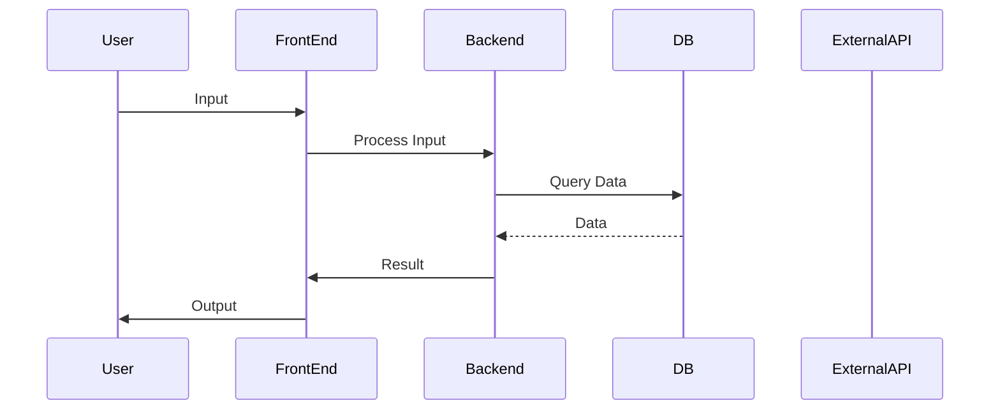
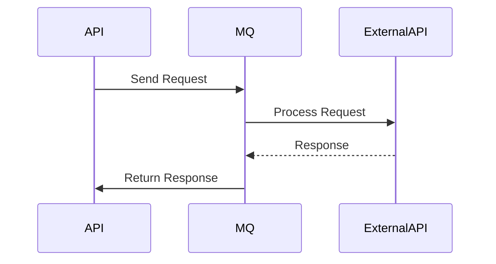

                 

### 《思维链技术在AIGC中的应用》

#### 关键词：AIGC、思维链技术、人工智能生成内容、算法原理、系统架构、实战应用、最佳实践

#### 摘要：

本文旨在深入探讨思维链技术在人工智能生成内容（AIGC）领域的应用。首先，我们将介绍AIGC的概念和重要性，然后定义思维链技术及其与AIGC的关联。接着，我们将详细讲解思维链技术的算法原理，包括流程图、Python代码实现和数学模型。随后，我们将分析AIGC系统中思维链技术的角色，并设计相应的系统架构。最后，通过实际项目案例和最佳实践，我们将展示思维链技术在AIGC中的应用效果。

---

### 背景介绍

#### 1.1 AIGC技术介绍

人工智能生成内容（AIGC）是指利用人工智能技术自动生成文本、图像、音频、视频等内容的系统或过程。随着深度学习和生成对抗网络（GAN）等技术的不断发展，AIGC在内容创作、娱乐、教育、医疗等多个领域展现出巨大的潜力。

#### 1.2 思维链技术的定义与原理

思维链技术是一种基于人工智能的文本生成和推理技术，通过构建语义网络和逻辑推理机制，实现智能对话、文本生成和知识推理。思维链技术的基本原理包括语义解析、知识图谱构建和逻辑推理。

#### 1.3 思维链技术与AIGC的关系

思维链技术能够有效提升AIGC的生成质量和逻辑推理能力，使其更加贴近人类的思维模式。思维链技术通过构建语义网络，将用户输入的指令与已有的知识库进行匹配和推理，从而生成更加准确和连贯的内容。

---

### 核心概念与联系

#### 1.4 核心概念对比表格

| 概念         | 定义                                                         | 属性特征对比                            |
| ------------ | ------------------------------------------------------------ | -------------------------------------- |
| AIGC         | 人工智能生成内容                                             | 自动化、多样化、个性化                  |
| 思维链技术   | 基于语义网络和逻辑推理的文本生成和推理技术                   | 智能化、连贯性、准确性                  |
| 语义网络     | 通过语义关系表示知识图谱的模型                               | 知识表示、关系挖掘、推理能力            |
| 知识图谱     | 通过实体和关系构建的大规模知识库                             | 知识整合、推理支持、知识发现            |
| 逻辑推理     | 基于逻辑规则和语义关系的推理过程                             | 准确性、一致性、推理效率                |

#### 1.5 关键概念ER实体关系图

```mermaid
erDiagram
  Entity AIGC
  Entity 思维链技术
  Entity 语义网络
  Entity 知识图谱
  Entity 逻辑推理

  AIGC --> 思维链技术 : 使用
  思维链技术 --> 语义网络 : 基于
  语义网络 --> 知识图谱 : 构建
  知识图谱 --> 逻辑推理 : 支持
```

---

### 算法原理讲解

#### 2.1 思维链算法基础

思维链算法的核心思想是利用语义网络和逻辑推理机制，实现文本生成和推理。算法的基本框架包括语义解析、知识图谱构建、逻辑推理和文本生成四个步骤。

#### 2.2 思维链算法流程图


#### 2.3 Python代码与算法实现

```python
# 思维链算法的Python代码实现
class MindChainAlgorithm:
    def __init__(self):
        self.semantic_parser = SemanticParser()
        self.knowledge_graph = KnowledgeGraph()
        self.logic_reducer = LogicReducer()
        self.text_generator = TextGenerator()

    def process_input(self, input_text):
        # 语义解析
        semantic_result = self.semantic_parser.parse(input_text)
        
        # 知识图谱构建
        knowledge_graph = self.knowledge_graph.build(semantic_result)
        
        # 逻辑推理
        logic_result = self.logic_reducer.reduce(knowledge_graph)
        
        # 文本生成
        output_text = self.text_generator.generate(logic_result)
        
        return output_text
```

#### 2.4 数学模型与公式详解

思维链算法的数学模型主要包括语义表示、知识图谱表示和逻辑推理模型。以下是模型公式示例：

$$
\text{Semantic Representation}:\ s_e = f_{\text{embedding}}(e)
$$

$$
\text{Knowledge Graph Representation}:\ K = G(V, E)
$$

$$
\text{Logic Inference}: \ L = f_{\text{inference}}(K)
$$

#### 2.5 举例说明

假设用户输入一个简单的指令：“明天天气怎么样？”，思维链算法的流程如下：

1. **语义解析**：将用户输入的文本解析成语义表示。
2. **知识图谱构建**：根据语义表示构建知识图谱，查询相关天气信息。
3. **逻辑推理**：根据知识图谱进行逻辑推理，判断天气情况。
4. **文本生成**：生成包含天气信息的文本输出。

例如，输出结果可能是：“明天天气晴朗，温度在20°C左右。”

---

### 系统分析与架构设计方案

#### 3.1 AIGC系统需求分析

AIGC系统需要满足以下需求：

1. **文本生成**：能够根据用户输入生成高质量的文本。
2. **智能对话**：具备理解用户意图和进行自然语言交互的能力。
3. **知识推理**：能够从知识库中提取相关信息，进行推理和决策。
4. **接口兼容**：支持多种输入输出接口，如文本、图像、音频等。

#### 3.2 系统架构设计

AIGC系统的架构设计包括前端界面、后端服务、数据库和外部接口。以下是系统架构的Mermaid图表示：



#### 3.3 系统接口与交互设计

AIGC系统的接口设计包括API接口、消息队列和外部API。以下是系统接口和交互的Mermaid序列图表示：



---

### 项目实战

#### 4.1 项目背景

本项目旨在开发一款基于思维链技术的智能问答系统，通过自然语言处理和知识图谱构建，实现高效、准确的问答服务。

#### 4.2 环境配置

开发环境配置如下：

- 操作系统：Ubuntu 20.04
- 编程语言：Python 3.8
- 数据库：Neo4j 4.0
- 外部API：OpenAI API

#### 4.3 系统核心实现源代码

以下为系统核心实现的主要代码：

```python
# 系统核心实现源代码
class IntelligentQASystem:
    def __init__(self):
        self.mind_chain = MindChainAlgorithm()
        self.knowledge_base = KnowledgeBase()

    def handle_question(self, question):
        # 语义解析
        semantic_result = self.mind_chain.process_input(question)

        # 知识推理
        answer = self.knowledge_base.reason(semantic_result)

        return answer

    def start(self):
        while True:
            question = input("请提问：")
            answer = self.handle_question(question)
            print("回答：", answer)
```

#### 4.4 代码应用解读与分析

系统通过思维链算法处理用户输入的问题，利用知识图谱进行推理，最终输出答案。以下是代码的解读与分析：

1. **初始化**：创建思维链算法实例和知识库实例。
2. **处理问题**：调用思维链算法处理用户输入的问题，得到语义表示。
3. **知识推理**：利用知识图谱进行推理，得到可能的答案。
4. **输出结果**：将答案输出给用户。

#### 4.5 实际案例分析和详细讲解剖析

假设用户输入问题：“什么是人工智能？”系统的工作流程如下：

1. **语义解析**：思维链算法将问题解析成语义表示。
2. **知识图谱查询**：系统在知识图谱中查询与“人工智能”相关的信息。
3. **逻辑推理**：系统根据查询结果进行推理，生成答案。
4. **输出答案**：系统输出详细的答案给用户。

#### 4.6 项目小结

本项目通过思维链技术实现了智能问答系统，展示了思维链技术在AIGC领域的应用潜力。未来，我们将继续优化算法和系统性能，提升用户体验。

---

### 最佳实践 tips

1. **优化算法性能**：定期更新和优化思维链算法，提升生成质量和推理效率。
2. **扩展知识库**：不断丰富知识库的内容，确保系统具备广泛的知识覆盖。
3. **用户反馈**：积极收集用户反馈，根据用户需求调整系统功能。

### 小结

本文全面介绍了思维链技术在AIGC中的应用，包括算法原理、系统架构和实战应用。通过实际项目案例，我们展示了思维链技术在智能问答系统中的优秀表现。未来，思维链技术将在更多领域发挥重要作用。

---

**作者：AI天才研究院/AI Genius Institute & 禅与计算机程序设计艺术 /Zen And The Art of Computer Programming**

