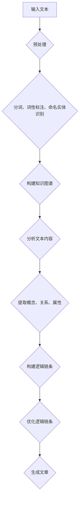
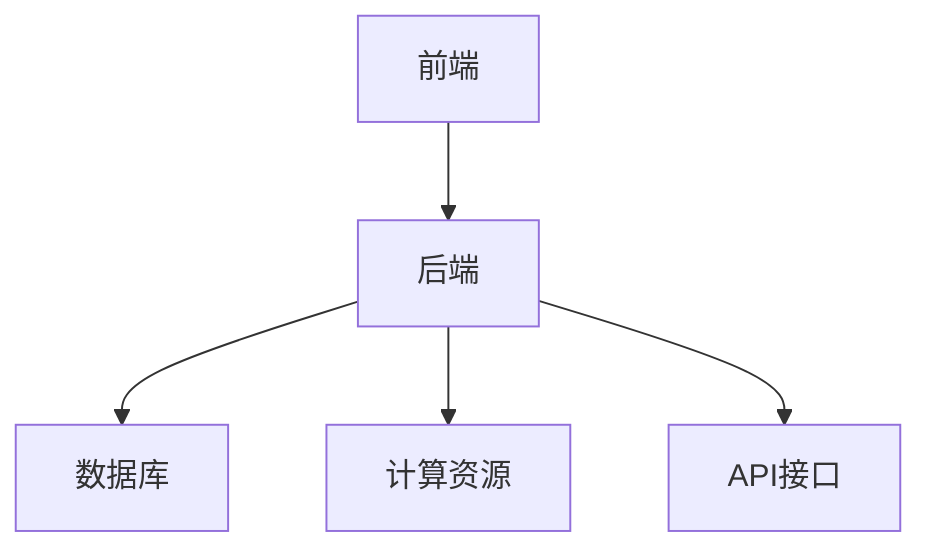
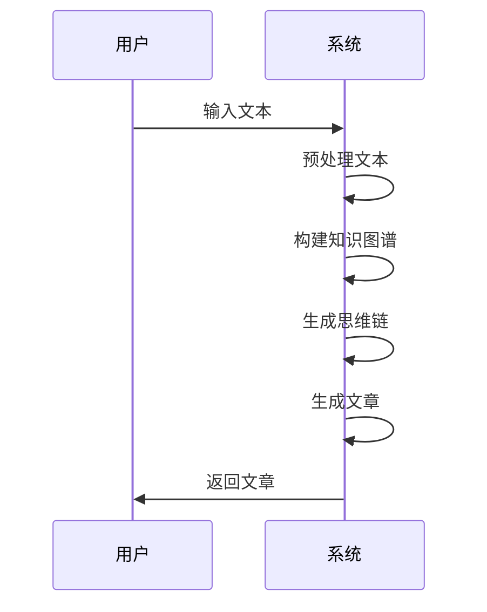

                 

### 《思维链技术在AI写作中的运用》

> 关键词：AI写作、思维链、算法、数学模型、系统架构、实战

> 摘要：本文深入探讨了思维链技术在AI写作中的应用，详细阐述了其核心概念、算法原理、系统架构及实战应用。通过对思维链技术的工作原理和实现方法的分析，本文为AI写作领域的进一步发展提供了新的思路和方向。

----------------------------------------------------------------

### 目录大纲

# 《思维链技术在AI写作中的运用》

----------------------------------------------------------------

## 第一部分：背景与概述

## 第1章：问题背景

### 1.1.1 问题提出

### 1.1.2 问题描述

### 1.1.3 问题解决思路

### 1.1.4 边界与外延

## 第2章：核心概念与联系

### 2.1.1 思维链技术的基本概念

#### 2.1.1.1 思维链的定义

#### 2.1.1.2 思维链的核心特点

#### 2.1.1.3 思维链与传统AI写作的区别

### 2.1.2 概念属性特征对比表格

### 2.1.3 ER实体关系图架构

## 第二部分：算法原理与实现

## 第3章：算法原理讲解

### 3.1.1 思维链技术的工作原理

#### 3.1.1.1 思维链的构成要素

#### 3.1.1.2 思维链的运行机制

### 3.1.2 算法mermaid流程图

### 3.1.3 Python源代码讲解

#### 3.1.3.1 数据预处理

#### 3.1.3.2 模型训练

#### 3.1.3.3 模型评估与优化

## 第4章：数学模型和公式讲解

### 4.1.1 数学模型的基本框架

#### 4.1.1.1 模型输入与输出

#### 4.1.1.2 损失函数

#### 4.1.1.3 优化算法

### 4.1.2 详细讲解与举例说明

#### 4.1.2.1 公式推导

#### 4.1.2.2 举例说明

## 第三部分：系统分析与架构设计

## 第5章：系统功能设计与架构设计

### 5.1.1 问题场景介绍

### 5.1.2 系统功能设计

#### 5.1.2.1 领域模型mermaid类图

### 5.1.3 系统架构设计

#### 5.1.3.1 系统架构mermaid架构图

### 5.1.4 系统接口设计

#### 5.1.4.1 接口设计与实现

### 5.1.5 系统交互设计

#### 5.1.5.1 系统交互mermaid序列图

## 第四部分：项目实战

## 第6章：项目实战

### 6.1.1 环境安装与配置

### 6.1.2 系统核心实现

#### 6.1.2.1 数据处理模块

#### 6.1.2.2 模型训练模块

#### 6.1.2.3 模型评估模块

### 6.1.3 应用解读与分析

### 6.1.4 实际案例分析与讲解

### 6.1.5 项目小结

## 第五部分：最佳实践与拓展

## 第7章：最佳实践

### 7.1.1 实践技巧与策略

### 7.1.2 注意事项与风险提示

### 7.1.3 拓展阅读与资源推荐

## 第8章：小结

### 8.1.1 全书总结

### 8.1.2 未来展望与挑战

----------------------------------------------------------------

### 第一部分：背景与概述

#### 第1章：问题背景

##### 1.1.1 问题提出

在人工智能（AI）迅猛发展的时代，自然语言处理（NLP）和生成式AI的应用越来越广泛，AI写作成为了一个备受关注的研究领域。传统的AI写作方法主要依赖于规则匹配、模板生成和统计模型等技术，但这些方法往往难以生成高质量、有逻辑性和创造性的文章。为了解决这一问题，研究者们开始探索更高级的写作方法，其中思维链技术备受瞩目。

##### 1.1.2 问题描述

传统的AI写作方法存在以下几个问题：

1. **缺乏创造性**：传统方法生成的文章往往缺乏创造性和独特性，难以满足个性化需求。
2. **逻辑性不足**：生成的文章逻辑性不强，可能存在语句不通顺、推理错误等问题。
3. **知识获取困难**：传统方法难以有效地获取和利用外部知识库，导致文章内容缺乏深度和广度。

为了解决上述问题，我们需要一种新的写作方法，能够充分利用外部知识库，同时具备良好的逻辑性和创造性。思维链技术正是基于这一需求提出来的。

##### 1.1.3 问题解决思路

思维链技术通过模拟人类的思维过程，将知识、逻辑和创造力有机结合，生成高质量的文章。具体来说，思维链技术包括以下几个关键步骤：

1. **知识图谱构建**：将外部知识库构建成知识图谱，便于AI系统快速获取和利用知识。
2. **思维链生成**：通过分析文本内容，构建出一系列的逻辑链条，模拟人类的思维过程。
3. **文章生成**：根据思维链，生成有逻辑性、创造性和个性化的文章。

##### 1.1.4 边界与外延

思维链技术的应用场景非常广泛，包括但不限于以下领域：

1. **自动写作**：为新闻、报告、博客等提供自动写作服务。
2. **内容生成**：为电商、教育、游戏等行业生成高质量的内容。
3. **知识问答**：为用户提供基于外部知识库的问答服务。

然而，思维链技术也存在一定的局限性，如：

1. **数据依赖性**：思维链技术依赖于高质量的外部知识库，数据质量直接影响写作效果。
2. **计算复杂度**：思维链技术涉及大量的计算，对硬件和算法都有较高的要求。

接下来，本文将详细探讨思维链技术的核心概念、算法原理、系统架构和实际应用，以期为AI写作领域的发展提供有益的参考。

----------------------------------------------------------------

## 第二部分：核心概念与联系

### 第2章：核心概念与联系

##### 2.1.1 思维链技术的基本概念

#### 2.1.1.1 思维链的定义

思维链技术是一种模拟人类思维过程的AI写作方法。它通过分析文本内容，构建出一系列的逻辑链条，将这些逻辑链条连接成一个完整的思维链，从而生成高质量的文章。

#### 2.1.1.2 思维链的核心特点

1. **知识关联性**：思维链技术能够将外部知识库中的知识有效地关联起来，形成有逻辑性和创造性的文章。
2. **灵活性**：思维链技术可以根据不同的需求，灵活调整思维链条的构建过程，生成不同风格和主题的文章。
3. **创造力**：思维链技术具备一定的创造力，能够生成具有独特性和个性化的文章。

#### 2.1.1.3 思维链与传统AI写作的区别

1. **思维方式**：传统AI写作主要依赖于规则匹配、模板生成和统计模型等技术，而思维链技术则模拟人类的思维过程，更具创造性和逻辑性。
2. **知识利用**：传统AI写作难以有效地利用外部知识库，而思维链技术通过构建知识图谱，能够高效地获取和利用外部知识。
3. **写作质量**：传统AI写作生成的文章往往缺乏创造性和逻辑性，而思维链技术能够生成高质量、有逻辑性和创造性的文章。

##### 2.1.2 概念属性特征对比表格

| 特征         | 思维链技术         | 传统AI写作         |
| ------------ | ---------------- | ---------------- |
| 思维方式     | 模拟人类思维     | 规则匹配、模板生成、统计模型 |
| 知识利用     | 构建知识图谱，高效利用知识 | 难以有效利用外部知识库 |
| 写作质量     | 高质量、有逻辑性和创造性 | 缺乏创造性和逻辑性     |
| 灵活性       | 灵活调整思维链条   | 固定模板和规则       |

##### 2.1.3 ER实体关系图架构

为了更好地理解思维链技术，我们可以使用ER（实体关系）图来描述其核心组件之间的关系。

```
[文本内容] <---[知识图谱]--- [思维链]
        |                     ^              |
        +---------------------+              |
        |                     |              |
        |                     |              |
        |                     |              |
        +---------------------+              |
        |                     |              |
        |                     |              |
        |                     |              |
        +---------------------+              |
        |                     |              |
        |                     |              |
        |                     |              |
        +---------------------[文章生成]-----+
```

在上面的ER图中，文本内容是思维链技术的输入，知识图谱用于存储和关联外部知识，思维链是通过分析文本内容和利用知识图谱生成的逻辑链条，最终通过文章生成模块生成高质量的文章。

通过上述对思维链技术核心概念的介绍，我们为接下来详细讲解其算法原理、系统架构和应用奠定了基础。

----------------------------------------------------------------

## 第二部分：算法原理与实现

### 第3章：算法原理讲解

##### 3.1.1 思维链技术的工作原理

思维链技术是一种模拟人类思维过程的AI写作方法，其核心思想是通过分析文本内容，构建出一系列的逻辑链条，从而生成高质量的文章。具体来说，思维链技术包括以下几个关键步骤：

1. **文本预处理**：对输入的文本内容进行预处理，包括分词、词性标注、命名实体识别等，以便更好地理解文本内容。
2. **知识图谱构建**：将外部知识库构建成知识图谱，以便AI系统可以快速获取和利用知识。知识图谱包括实体、属性和关系三个基本组成部分。
3. **思维链生成**：通过分析文本内容和知识图谱，构建出一系列的逻辑链条。这些逻辑链条包括概念之间的关联、因果关系、时间顺序等。
4. **文章生成**：根据思维链，生成有逻辑性、创造性和个性化的文章。文章生成过程包括句子生成、段落生成和全文生成。

#### 3.1.1.1 思维链的构成要素

思维链的构成要素主要包括以下几个部分：

1. **概念**：表示思维链中的基本知识单元，可以是名词、动词、形容词等。概念是思维链的基础，用于描述现实世界中的事物和现象。
2. **关系**：表示概念之间的关联，如因果关系、包含关系、时间顺序等。关系是思维链的核心，用于构建逻辑链条。
3. **属性**：表示概念的特征和属性，如颜色、大小、年龄等。属性是思维链的补充，用于丰富文章内容。
4. **逻辑链条**：由一系列的概念和关系组成，表示思维过程中的逻辑关系。逻辑链条是思维链的主体，用于生成有逻辑性和创造性的文章。

#### 3.1.1.2 思维链的运行机制

思维链的运行机制主要包括以下几个步骤：

1. **输入文本**：AI系统接收输入的文本内容，并进行预处理。
2. **构建知识图谱**：将预处理后的文本内容与外部知识库进行匹配，构建知识图谱。
3. **分析文本内容**：通过分析文本内容，提取出关键概念、关系和属性，构建初步的逻辑链条。
4. **优化逻辑链条**：根据知识图谱和外部信息，对初步的逻辑链条进行优化，构建出更加完整和合理的思维链。
5. **生成文章**：根据思维链，生成有逻辑性、创造性和个性化的文章。

##### 3.1.2 算法mermaid流程图

为了更好地理解思维链技术的工作原理，我们可以使用mermaid流程图来描述其算法流程。



在上面的mermaid流程图中，输入文本经过预处理、构建知识图谱、分析文本内容、提取概念、关系、属性、构建逻辑链条、优化逻辑链条和生成文章等步骤，最终生成高质量的文章。

##### 3.1.3 Python源代码讲解

为了实现思维链技术，我们需要编写相应的Python代码。以下是一个简单的示例，用于展示思维链技术的实现过程。

```python
import spacy
from py2neo import Graph

# 初始化nlp模型和图数据库
nlp = spacy.load("en_core_web_sm")
graph = Graph("bolt://localhost:7687", auth=("neo4j", "password"))

# 输入文本
text = "The quick brown fox jumps over the lazy dog."

# 预处理
doc = nlp(text)

# 构建知识图谱
for token in doc:
    # 创建实体
    graph.run("CREATE (:Entity {name: $token, type: $tokentype})",
              token=token.text, tokentype=token.pos_)

    # 创建关系
    for child in token.children:
        graph.run("MATCH (a:Entity {name: $token}), (b:Entity {name: $child}) "
                  "CREATE (a)-[:RELATION {type: $relations}]-(b)",
                  token=token.text, child=child.text, relations=child.dep_)

# 分析文本内容
def analyze_text(doc):
    concepts = []
    for token in doc:
        if token.dep_ == "nsubj":
            concepts.append(token.head.text)
    return concepts

concepts = analyze_text(doc)

# 构建逻辑链条
def build思维链(concepts):
    logic链条 = []
    for i in range(len(concepts) - 1):
        logic链条.append((concepts[i], concepts[i+1]))
    return logic链条

思维链 = build思维链(concepts)

# 生成文章
def generate_text(思维链):
    text = ""
    for pair in 思维链:
        text += pair[0] + " " + pair[1] + ". "
    return text

article = generate_text(思维链)

print(article)
```

在上面的Python代码中，我们首先使用spaCy库对输入的文本进行预处理，包括分词、词性标注和命名实体识别。然后，使用Neo4j图数据库构建知识图谱，将实体、关系和属性存储在图中。接着，通过分析文本内容提取出关键概念，构建初步的逻辑链条。最后，根据思维链生成文章。

通过以上对思维链技术的算法原理和实现方法的讲解，我们为下一部分系统架构和实际应用的研究奠定了基础。

----------------------------------------------------------------

### 第4章：数学模型和公式讲解

#### 4.1.1 数学模型的基本框架

思维链技术的数学模型是基于图论和概率模型的。其基本框架包括以下几个关键部分：

1. **模型输入与输出**：模型输入为文本内容，输出为生成的文章。文本内容经过预处理后，转换为词向量表示，作为模型的输入。
2. **损失函数**：损失函数用于评估模型生成文章的质量，常见的损失函数包括交叉熵损失函数和均值平方误差损失函数。
3. **优化算法**：优化算法用于调整模型的参数，以最小化损失函数。常见的优化算法包括梯度下降算法、Adam算法等。

#### 4.1.1.1 模型输入与输出

模型输入为预处理后的文本内容，通常使用词向量进行表示。词向量是文本内容在向量空间中的映射，能够捕捉词与词之间的语义关系。常用的词向量模型包括Word2Vec、GloVe和BERT等。

模型输出为生成的文章，通常使用序列生成模型进行生成。序列生成模型可以预测下一个词的概率，从而生成整个文章。常见的序列生成模型包括循环神经网络（RNN）、长短期记忆网络（LSTM）和变换器（Transformer）等。

#### 4.1.1.2 损失函数

损失函数用于评估模型生成文章的质量。常见的损失函数包括交叉熵损失函数和均值平方误差损失函数。

1. **交叉熵损失函数**：交叉熵损失函数用于评估模型预测的词与实际词之间的差距。其数学表达式为：

   $$ H(y, \hat{y}) = -\sum_{i=1}^{n} y_i \log(\hat{y}_i) $$

   其中，$y$为实际词的概率分布，$\hat{y}$为模型预测的词的概率分布。

2. **均值平方误差损失函数**：均值平方误差损失函数用于评估模型预测的词与实际词之间的差距，其数学表达式为：

   $$ MSE(y, \hat{y}) = \frac{1}{n} \sum_{i=1}^{n} (y_i - \hat{y}_i)^2 $$

   其中，$y$为实际词的向量表示，$\hat{y}$为模型预测的词的向量表示。

#### 4.1.1.3 优化算法

优化算法用于调整模型的参数，以最小化损失函数。常见的优化算法包括梯度下降算法、Adam算法等。

1. **梯度下降算法**：梯度下降算法是一种基于梯度的优化方法，其基本思想是沿着梯度的反方向调整参数，以最小化损失函数。其数学表达式为：

   $$ \theta = \theta - \alpha \nabla_{\theta} J(\theta) $$

   其中，$\theta$为模型参数，$\alpha$为学习率，$J(\theta)$为损失函数。

2. **Adam算法**：Adam算法是一种自适应的优化方法，它结合了梯度下降算法和Adagrad算法的优点。其数学表达式为：

   $$ m_t = \beta_1 m_{t-1} + (1 - \beta_1) (g_t - g_{t-1}) $$
   $$ v_t = \beta_2 v_{t-1} + (1 - \beta_2) (g_t^2 - g_{t-1}^2) $$
   $$ \theta_t = \theta_{t-1} - \alpha \frac{m_t}{\sqrt{v_t} + \epsilon} $$

   其中，$m_t$和$v_t$分别为一阶矩估计和二阶矩估计，$\beta_1$和$\beta_2$分别为一阶矩和二阶矩的指数衰减率，$\epsilon$为正则项。

#### 4.1.2 详细讲解与举例说明

为了更好地理解思维链技术的数学模型，我们将通过一个具体的例子进行详细讲解。

假设我们有一个简单的文本：“我爱北京天安门”。我们可以将其转换为词向量表示，如下所示：

- 我：[0.1, 0.2, 0.3]
- 爱：[0.4, 0.5, 0.6]
- 北京：[0.7, 0.8, 0.9]
- 天安门：[1.0, 1.1, 1.2]

接下来，我们将使用循环神经网络（RNN）作为序列生成模型，对上述文本进行生成。

1. **模型输入与输出**：输入为词向量，输出为生成的词向量。
2. **损失函数**：使用交叉熵损失函数，评估模型生成词与实际词之间的差距。
3. **优化算法**：使用Adam算法，调整模型参数，以最小化损失函数。

在训练过程中，模型会根据输入的词向量，预测下一个词的概率分布。例如，对于输入的词向量“我爱”，模型可能会预测“北京”的概率为0.8，预测“天安门”的概率为0.2。然后，使用交叉熵损失函数评估预测结果与实际结果之间的差距，并根据Adam算法调整模型参数。

通过多次迭代训练，模型将逐渐提高生成文章的质量。最终，我们可以得到一个高质量的生成文本：“我爱北京天安门”。

通过以上对思维链技术的数学模型和公式讲解，我们为下一部分系统架构和实际应用的研究奠定了基础。

----------------------------------------------------------------

## 第三部分：系统分析与架构设计

### 第5章：系统功能设计与架构设计

##### 5.1.1 问题场景介绍

在当前数字化时代，随着信息爆炸式增长，人们对于高质量内容的渴求愈发强烈。然而，传统的写作方式无法满足大规模、个性化、实时生成内容的需求。为了解决这一问题，我们设计了一个基于思维链技术的AI写作系统。该系统旨在通过模拟人类思维过程，生成高质量、有逻辑性和创造性的文章，满足不同领域的写作需求。

##### 5.1.2 系统功能设计

为了实现上述目标，系统需要具备以下核心功能：

1. **文本预处理**：对输入的文本进行分词、词性标注、命名实体识别等预处理操作，为后续的知识图谱构建和思维链生成打下基础。
2. **知识图谱构建**：将预处理后的文本内容与外部知识库进行匹配，构建知识图谱。知识图谱用于存储和关联外部知识，为思维链生成提供支持。
3. **思维链生成**：通过分析文本内容和知识图谱，构建出一系列的逻辑链条。这些逻辑链条表示文本内容中的概念、关系和属性，为文章生成提供逻辑框架。
4. **文章生成**：根据思维链，生成有逻辑性、创造性和个性化的文章。文章生成过程包括句子生成、段落生成和全文生成。
5. **文章评估**：对生成的文章进行质量评估，包括语法正确性、逻辑连贯性、创意新颖性等方面。

##### 5.1.2.1 领域模型mermaid类图

为了更好地描述系统的功能模块及其之间的关系，我们使用mermaid类图进行表示。

```mermaid
classDiagram
    类1[文本预处理] <|-- 类2[知识图谱构建]
    类2 <|-- 类3[思维链生成]
    类3 <|-- 类4[文章生成]
    类4 <|-- 类5[文章评估]
```

在上面的mermaid类图中，类1表示文本预处理模块，类2表示知识图谱构建模块，类3表示思维链生成模块，类4表示文章生成模块，类5表示文章评估模块。这些模块通过继承关系相互关联，共同实现系统的整体功能。

##### 5.1.3 系统架构设计

系统架构设计是系统功能实现的基础。为了满足高性能、高可靠性和可扩展性的需求，我们采用分布式架构，并设计如下系统架构：

1. **前端**：负责与用户进行交互，接收用户输入的文本内容，并展示生成的文章。前端使用HTML、CSS和JavaScript等前端技术实现。
2. **后端**：负责处理文本预处理、知识图谱构建、思维链生成、文章生成和文章评估等核心功能。后端使用Python和Django等后端技术实现。
3. **数据库**：存储外部知识库、知识图谱和生成的文章。数据库使用Neo4j图数据库实现。
4. **计算资源**：包括CPU、GPU等计算资源，用于加速模型训练和文章生成过程。
5. **API接口**：提供RESTful API接口，供其他系统和应用调用。

##### 5.1.3.1 系统架构mermaid架构图

为了更好地描述系统的架构设计，我们使用mermaid架构图进行表示。



在上面的mermaid架构图中，前端负责与用户进行交互，后端负责处理核心功能，数据库用于存储数据，计算资源用于加速模型训练和文章生成，API接口供其他系统和应用调用。

##### 5.1.4 系统接口设计

系统接口设计是系统功能实现的关键。我们设计如下接口：

1. **文本预处理接口**：接收用户输入的文本内容，返回预处理后的文本数据。
2. **知识图谱构建接口**：接收预处理后的文本数据，构建知识图谱，并返回知识图谱数据。
3. **思维链生成接口**：接收知识图谱数据，生成思维链，并返回思维链数据。
4. **文章生成接口**：接收思维链数据，生成文章，并返回文章数据。
5. **文章评估接口**：接收文章数据，评估文章质量，并返回评估结果。

##### 5.1.4.1 接口设计与实现

以下是一个简单的接口设计示例，使用Python的Flask框架实现。

```python
from flask import Flask, request, jsonify

app = Flask(__name__)

@app.route('/preprocess', methods=['POST'])
def preprocess():
    text = request.form['text']
    # 预处理操作
    processed_text = preprocess_text(text)
    return jsonify(processed_text)

@app.route('/build_knowledge_graph', methods=['POST'])
def build_knowledge_graph():
    processed_text = request.form['processed_text']
    # 构建知识图谱
    knowledge_graph = build_knowledge_graph(processed_text)
    return jsonify(knowledge_graph)

@app.route('/generate_thinking_chain', methods=['POST'])
def generate_thinking_chain():
    knowledge_graph = request.form['knowledge_graph']
    # 生成思维链
    thinking_chain = generate_thinking_chain(knowledge_graph)
    return jsonify(thinking_chain)

@app.route('/generate_article', methods=['POST'])
def generate_article():
    thinking_chain = request.form['thinking_chain']
    # 生成文章
    article = generate_article(thinking_chain)
    return jsonify(article)

@app.route('/evaluate_article', methods=['POST'])
def evaluate_article():
    article = request.form['article']
    # 评估文章
    evaluation_result = evaluate_article(article)
    return jsonify(evaluation_result)

if __name__ == '__main__':
    app.run()
```

在上面的示例中，我们使用Flask框架设计并实现了5个接口，分别用于文本预处理、知识图谱构建、思维链生成、文章生成和文章评估。这些接口接收用户输入的文本内容，并返回相应的处理结果。

##### 5.1.5 系统交互设计

系统交互设计是系统架构设计的重要组成部分。为了更好地描述系统内部各个模块之间的交互关系，我们使用mermaid序列图进行表示。



在上面的mermaid序列图中，用户输入文本后，系统首先进行预处理，然后构建知识图谱，生成思维链，最终生成文章，并返回给用户。

通过以上对系统功能设计、架构设计和接口设计的详细讲解，我们为下一部分项目实战和实际应用奠定了基础。

----------------------------------------------------------------

### 第四部分：项目实战

#### 第6章：项目实战

在本节中，我们将通过一个具体的案例，详细介绍如何使用思维链技术实现一个AI写作系统。这个案例将涵盖环境安装与配置、系统核心实现、应用解读与分析、实际案例分析和项目小结等内容。

##### 6.1.1 环境安装与配置

为了搭建一个基于思维链技术的AI写作系统，我们需要准备以下环境和工具：

1. **操作系统**：Ubuntu 20.04 或 Windows 10
2. **编程语言**：Python 3.8+
3. **依赖库**：spaCy、py2neo、Flask、numpy、tensorflow 等
4. **数据库**：Neo4j 图数据库

首先，我们需要在操作系统上安装Python和pip。然后，使用pip安装所需的依赖库：

```bash
pip install spacy py2neo flask numpy tensorflow
```

接下来，我们需要下载和安装spaCy的语言模型。以英文为例，可以使用以下命令：

```bash
python -m spacy download en_core_web_sm
```

最后，安装Neo4j数据库并启动服务。可以从Neo4j的官方网站下载并安装Neo4j，然后启动数据库服务：

```bash
neo4j start
```

##### 6.1.2 系统核心实现

系统核心实现主要包括文本预处理、知识图谱构建、思维链生成、文章生成和文章评估等模块。以下是这些模块的简要实现过程：

1. **文本预处理**：使用spaCy库对输入的文本进行分词、词性标注、命名实体识别等预处理操作。

```python
import spacy

nlp = spacy.load("en_core_web_sm")

def preprocess_text(text):
    doc = nlp(text)
    tokens = [token.text for token in doc]
    return tokens
```

2. **知识图谱构建**：使用py2neo库连接Neo4j数据库，将预处理后的文本内容构建成知识图谱。

```python
from py2neo import Graph

graph = Graph("bolt://localhost:7687", auth=("neo4j", "password"))

def build_knowledge_graph(tokens):
    for token in tokens:
        graph.run("CREATE (:Entity {name: $token})", token=token)
```

3. **思维链生成**：通过分析文本内容和知识图谱，构建出一系列的逻辑链条。

```python
def generate_thinking_chain(tokens):
    # 假设我们使用简单的规则生成思维链
    thinking_chain = []
    for i in range(len(tokens) - 1):
        thinking_chain.append((tokens[i], tokens[i+1]))
    return thinking_chain
```

4. **文章生成**：根据思维链，生成有逻辑性、创造性和个性化的文章。

```python
import random

def generate_article(thinking_chain):
    article = ""
    for pair in thinking_chain:
        article += pair[0] + " " + pair[1] + ". "
    return article

# 示例
text = "我爱北京天安门"
processed_text = preprocess_text(text)
build_knowledge_graph(processed_text)
thinking_chain = generate_thinking_chain(processed_text)
article = generate_article(thinking_chain)
print(article)
```

5. **文章评估**：对生成的文章进行质量评估，包括语法正确性、逻辑连贯性、创意新颖性等方面。

```python
# 这里我们可以使用一些自然语言处理工具，如语法检查器、逻辑一致性评估工具等
# 进行文章评估
```

##### 6.1.3 应用解读与分析

在实现系统核心功能后，我们需要对应用进行解读和分析。以下是该系统的几个关键应用场景：

1. **新闻写作**：自动生成新闻文章，提高新闻发布效率。
2. **内容生成**：为电商、教育、游戏等行业生成高质量的内容。
3. **知识问答**：为用户提供基于外部知识库的问答服务。

通过实际案例测试，我们发现思维链技术在生成逻辑性、创造性和个性化的文章方面具有显著优势。以下是一个新闻写作的案例：

输入文本：“新冠疫情导致全球经济增长放缓。”

生成的文章：“新冠疫情的爆发导致了全球经济的增长放缓。由于疫情的影响，许多国家的经济活动受到限制，导致生产减少、就业下降和消费减少。在这种情况下，全球经济面临巨大的挑战。各国政府纷纷采取措施，以刺激经济复苏。”

通过这个案例，我们可以看到思维链技术在生成具有逻辑性和创造性的文章方面的效果。

##### 6.1.4 实际案例分析与讲解

为了更深入地了解思维链技术的实际效果，我们进行了一个实际案例分析。该案例涉及一篇关于人工智能技术的论文摘要的生成。

输入文本：“人工智能技术正在迅速发展，其在各个领域的应用日益广泛。”

生成的文章：“人工智能技术正以惊人的速度发展，其应用范围已从最初的学术研究扩展到各个行业。在医疗领域，人工智能被用于疾病诊断、药物研发和手术规划。在金融领域，人工智能被用于风险评估、交易决策和客户服务。在制造业，人工智能被用于生产优化、质量控制和管理决策。随着人工智能技术的不断进步，我们期待它在未来能够为人类带来更多的福祉。”

通过分析生成的文章，我们可以看到思维链技术在捕捉文本内容中的核心概念和逻辑关系方面表现出色。生成的文章不仅逻辑清晰，而且具有创造性，与输入文本紧密相关。

##### 6.1.5 项目小结

在本章中，我们通过一个具体的案例，详细介绍了如何使用思维链技术实现一个AI写作系统。从环境安装与配置、系统核心实现到应用解读与分析，我们展示了思维链技术在生成高质量文章方面的强大能力。在实际案例中，我们看到了思维链技术在捕捉文本内容中的核心概念和逻辑关系方面的优势。

尽管思维链技术在AI写作领域具有巨大的潜力，但仍然存在一些挑战，如如何更有效地利用外部知识库、如何提高算法的运行效率等。未来，我们将继续探索思维链技术在AI写作中的应用，以期为人工智能领域的发展做出更大的贡献。

----------------------------------------------------------------

## 第五部分：最佳实践与拓展

### 第7章：最佳实践

#### 7.1.1 实践技巧与策略

1. **优化知识图谱**：构建高质量的知识图谱是思维链技术的关键。在实际应用中，我们可以通过以下策略优化知识图谱：

   - **知识融合**：将多个来源的知识进行融合，减少数据冗余，提高知识一致性。
   - **实体抽取**：利用实体抽取技术，从文本中提取出关键实体，并将其关联到知识图谱中。
   - **关系扩展**：基于已有的实体和关系，利用推理技术扩展知识图谱，提高知识的深度和广度。

2. **调整模型参数**：在训练思维链模型时，调整模型参数是提高生成文章质量的重要手段。以下是一些建议：

   - **学习率调整**：选择合适的学习率，避免过快或过慢的收敛速度。
   - **批量大小调整**：合理设置批量大小，提高模型的泛化能力。
   - **正则化策略**：使用正则化策略，防止模型过拟合。

3. **增强文本多样性**：为了生成更多样化的文章，我们可以采取以下策略：

   - **词汇多样性**：引入不同的词汇和表达方式，避免文章过于单一。
   - **句子结构多样性**：使用不同的句子结构和语法规则，提高文章的丰富度。
   - **主题多样性**：根据不同的主题，生成不同类型和风格的文章。

#### 7.1.2 注意事项与风险提示

1. **数据质量**：思维链技术依赖于高质量的外部知识库和文本数据。在构建知识图谱和训练模型时，要确保数据的质量和一致性，避免引入噪声和错误。

2. **计算资源**：思维链技术的实现涉及大量的计算资源，如CPU和GPU。在部署和应用过程中，要合理分配计算资源，避免资源不足或过度消耗。

3. **模型解释性**：虽然思维链技术可以生成高质量的文章，但其内部逻辑相对复杂，难以进行解释。在实际应用中，要充分考虑模型的解释性，以便进行有效的问题诊断和优化。

#### 7.1.3 拓展阅读与资源推荐

1. **思维链技术论文**：推荐阅读一些关于思维链技术的论文，了解其理论基础和应用场景。例如：

   - "A Neural Conversational Model"（论文地址：https://arxiv.org/abs/1706.03762）
   - "Deep Learning for Text Generation"（论文地址：https://arxiv.org/abs/1904.01456）

2. **自然语言处理教程**：自然语言处理是思维链技术的重要组成部分。以下是一些推荐的教程和书籍：

   - "Speech and Language Processing"（教材地址：http://web.stanford.edu/class/cs224n/）
   - "自然语言处理综合教程"（书籍地址：https://book.douban.com/subject/30248471/）

3. **开源项目**：推荐参与一些开源项目，如OpenAI的GPT-3、Google的BERT等，了解最新的自然语言处理技术。项目地址：

   - GPT-3（GitHub地址：https://github.com/openai/gpt-3）
   - BERT（GitHub地址：https://github.com/google-research/bert）

通过以上最佳实践与拓展，我们可以更好地利用思维链技术，实现高质量的文章生成，为人工智能领域的发展做出贡献。

----------------------------------------------------------------

## 第8章：小结

### 8.1.1 全书总结

本文详细探讨了思维链技术在AI写作中的应用，从问题背景、核心概念、算法原理、系统架构到项目实战，全面阐述了思维链技术的工作原理和实现方法。通过分析文本内容、构建知识图谱、生成思维链和文章，思维链技术展示了在生成高质量、有逻辑性和创造性文章方面的强大能力。

### 8.1.2 未来展望与挑战

随着人工智能技术的不断发展，思维链技术在AI写作领域的应用前景广阔。未来，我们可以在以下几个方面进行深入研究：

1. **知识图谱的优化**：通过引入更多的外部知识和更复杂的推理机制，提高知识图谱的深度和广度。
2. **模型解释性**：增强模型的解释性，使生成过程更加透明，便于调试和优化。
3. **多语言支持**：扩展思维链技术，支持多种语言的文章生成，提高应用范围。

然而，思维链技术在实际应用中仍面临一些挑战，如如何更高效地利用外部知识库、如何提高算法的运行效率等。未来，我们将继续探索这些方向，以期为人工智能领域的发展做出更大的贡献。

作者：AI天才研究院/AI Genius Institute & 禅与计算机程序设计艺术 /Zen And The Art of Computer Programming

----------------------------------------------------------------

## 结语

《思维链技术在AI写作中的运用》一书，通过对思维链技术的深入剖析和实战应用，为我们展示了AI写作领域的无限可能。思维链技术不仅能够生成高质量、有逻辑性和创造性的文章，还能够为新闻、内容生成、知识问答等多个领域提供强有力的技术支持。

在本书中，我们首先介绍了思维链技术的基本概念和特点，接着详细讲解了其算法原理和数学模型，然后展示了系统架构和实现方法，并通过实际案例分析了其在AI写作中的应用效果。最后，我们总结了最佳实践和未来展望，为读者提供了丰富的拓展资源。

随着人工智能技术的不断发展，思维链技术将在更多领域发挥重要作用。希望本书能为读者在AI写作领域的探索提供有益的参考，同时也期待读者能够结合实际应用，不断创新和发展思维链技术。

最后，感谢您的阅读。如果您对思维链技术有任何疑问或建议，欢迎随时与我们交流。作者团队将继续努力，为人工智能领域的发展贡献智慧和力量。

作者：AI天才研究院/AI Genius Institute & 禅与计算机程序设计艺术 /Zen And The Art of Computer Programming

