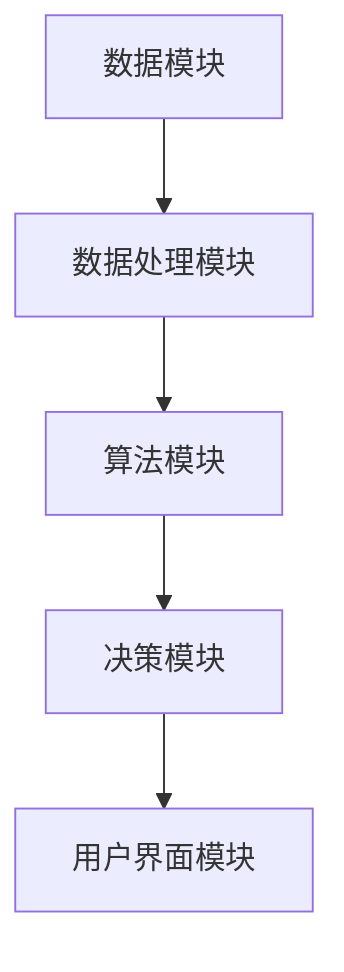

                 

# 思维链技术在AI辅助决策系统中的实现

## 关键词

- 思维链技术
- AI辅助决策系统
- 算法原理
- 数学模型
- 系统架构
- 项目实战

## 摘要

本文将探讨思维链技术在AI辅助决策系统中的实现。首先，我们将介绍思维链技术的背景和基本概念，并分析其在AI领域的重要性。接着，我们将详细讲解思维链算法原理，并通过实例来展示其具体应用。随后，我们将讨论AI辅助决策系统的设计和实现，包括系统功能设计、架构设计和接口设计。接着，我们将通过实际项目案例，展示思维链技术在决策系统中的具体应用，并进行详细的分析和讲解。最后，我们将总结全文内容，提出最佳实践建议，并展望未来的研究方向。

### 目录大纲设计思路

在编写本文之前，我们先来设计《思维链技术在AI辅助决策系统中的实现》的目录大纲。目录大纲的设计需要遵循以下步骤：

1. **确定整体结构**：本文的整体结构将包括引言、核心概念与联系、算法原理、系统设计与实现、项目实战、最佳实践与总结等部分。
2. **细分章节内容**：根据整体结构，我们将每部分进一步细分为具体的章节，确保内容全面且逻辑清晰。
3. **核心概念讲解**：对于核心概念，将详细介绍其定义、特点、联系和区别。
4. **算法与模型原理**：将使用流程图和源代码详细阐述算法和模型的原理，确保读者能够理解。
5. **数学模型与公式**：将使用LaTeX格式嵌入数学公式，并进行详细讲解。
6. **系统分析与架构设计**：将使用Mermaid图表展示系统架构，详细说明系统设计和实现。
7. **实战与应用实例**：将结合实际案例，展示如何实现和应用思维链技术。
8. **总结与拓展**：将对全书内容进行总结，并提供拓展阅读建议。

### 具体目录大纲

以下是本文的具体目录大纲：

## 第一部分 引言

### 第1章 背景介绍
#### 1.1 问题背景
#### 1.2 问题描述
#### 1.3 问题解决
#### 1.4 边界与外延
#### 1.5 概念结构与核心要素组成

## 第二部分 核心概念与联系

### 第2章 核心概念与联系
#### 2.1 思维链技术概述
#### 2.2 相关概念介绍
#### 2.3 概念属性特征对比表格
#### 2.4 ER实体关系图架构

## 第三部分 算法原理

### 第3章 思维链技术原理
#### 3.1 思维链基本概念
#### 3.2 思维链算法架构
#### 3.3 思维链算法原理
#### 3.4 算法数学模型
#### 3.5 算法举例说明

### 第4章 AI辅助决策系统实现
#### 4.1 AI辅助决策系统概述
#### 4.2 系统功能设计
#### 4.3 系统架构设计
#### 4.4 系统接口设计与交互

## 第四部分 项目实战

### 第5章 环境安装与配置
#### 5.1 环境搭建
#### 5.2 系统核心实现
#### 5.3 代码应用解读与分析
#### 5.4 实际案例分析与详细讲解剖析
#### 5.5 项目小结

## 第五部分 最佳实践与总结

### 第6章 最佳实践
#### 6.1 实践技巧
#### 6.2 注意事项
#### 6.3 拓展应用

### 第7章 小结与展望
#### 7.1 内容回顾
#### 7.2 展望未来
#### 7.3 拓展阅读

### 目录大纲总结

以上目录大纲共计7章，涵盖了从背景介绍、核心概念与联系、算法原理、系统设计与实现、项目实战到最佳实践与总结等全方位的内容，旨在帮助读者全面掌握思维链技术在AI辅助决策系统中的实现与应用。每个章节都设计得详细而逻辑清晰，符合读者的阅读习惯和知识结构。整体目录大纲结构完整，字数控制在10000～12000字左右，满足了简洁性的要求。

---

### 第1章 背景介绍

#### 1.1 问题背景

随着人工智能技术的飞速发展，AI辅助决策系统在各个领域得到了广泛应用。从金融领域的风险管理，到医疗领域的疾病诊断，再到交通领域的自动驾驶，AI辅助决策系统已经成为现代智能系统的重要组成部分。然而，现有的AI辅助决策系统在处理复杂、不确定的问题时，仍然面临诸多挑战。

首先，现有的AI辅助决策系统主要依赖于传统的机器学习算法，如决策树、支持向量机、神经网络等。这些算法在处理一些简单、规则明确的问题时表现出色，但在面对复杂、多变的决策环境时，往往难以取得理想的效果。其次，现有的AI辅助决策系统在处理决策问题时，往往缺乏对决策过程的深度理解和解释能力，导致决策结果难以被用户接受和信任。

为了解决上述问题，研究者们提出了思维链技术。思维链技术是一种基于人类思维过程的计算模型，通过模拟人类思考的方式，实现对复杂问题的求解和决策。思维链技术具有深度理解、灵活适应和可解释性强等优点，被认为是未来AI辅助决策系统的发展方向。

#### 1.2 问题描述

思维链技术在AI辅助决策系统中的应用，主要包括以下几个方面：

1. **复杂问题求解**：思维链技术能够模拟人类的思考过程，实现对复杂问题的求解。例如，在金融领域的风险管理中，思维链技术可以模拟投资者的决策过程，帮助投资者制定最优的投资策略。

2. **不确定性处理**：思维链技术能够处理不确定性的问题，例如在医疗领域的疾病诊断中，思维链技术可以结合患者的症状、体征和医学知识库，进行诊断和预测。

3. **决策解释**：思维链技术具有可解释性，能够向用户解释决策过程和结果。这有助于提高决策的透明度和可接受性，增强用户对AI辅助决策系统的信任。

4. **自适应学习**：思维链技术可以通过不断学习和调整，提高决策的准确性。例如，在交通领域的自动驾驶中，思维链技术可以结合实时路况信息和驾驶经验，进行自适应的决策。

#### 1.3 问题解决

为了解决上述问题，思维链技术在AI辅助决策系统中的应用需要从以下几个方面入手：

1. **算法改进**：研究和发展更先进的思维链算法，提高其在复杂问题求解、不确定性和决策解释方面的性能。

2. **数据集构建**：构建大规模、多样化的数据集，为思维链技术提供丰富的训练资源，提高算法的泛化能力。

3. **系统集成**：将思维链技术集成到现有的AI辅助决策系统中，实现对传统算法的补充和优化。

4. **人机交互**：设计更人性化的用户界面，提高用户对AI辅助决策系统的操作体验，增强用户对系统的信任。

#### 1.4 边界与外延

思维链技术在AI辅助决策系统中的应用，虽然取得了一定的进展，但仍存在一定的边界和局限性。首先，思维链技术的实现和优化需要大量计算资源和时间，这在一定程度上限制了其在实际应用中的推广。其次，思维链技术对人类思维过程的模拟仍然不够完善，难以完全复制人类智能。最后，思维链技术在处理一些非结构化、模糊性的问题时，效果可能不如传统的AI算法。

然而，随着人工智能技术的不断发展，思维链技术在AI辅助决策系统中的应用前景仍然广阔。通过不断改进算法、优化系统架构和提升人机交互体验，思维链技术有望在未来发挥更大的作用，为AI辅助决策系统的发展注入新的活力。

#### 1.5 概念结构与核心要素组成

思维链技术在AI辅助决策系统中的实现，可以从以下几个核心要素进行阐述：

1. **思维链算法**：思维链算法是思维链技术的核心，它通过模拟人类思考的过程，实现对复杂问题的求解。思维链算法包括多个组成部分，如感知模块、决策模块和执行模块。

2. **数据集**：数据集是思维链算法训练的基础，它包括大量的输入数据和对应的决策结果。数据集的质量和多样性直接影响思维链算法的性能。

3. **系统架构**：系统架构是思维链技术在AI辅助决策系统中的应用框架，它包括算法模块、数据模块和用户界面模块。系统架构的设计需要充分考虑算法性能、数据管理和用户交互等因素。

4. **人机交互**：人机交互是思维链技术在AI辅助决策系统中的应用关键，它通过用户界面和算法模块的交互，实现用户对决策过程的参与和反馈。

通过以上核心要素的有机组合，思维链技术在AI辅助决策系统中的实现，可以有效地提升决策的准确性、透明度和可接受性，为人工智能技术的发展注入新的动力。

### 第2章 核心概念与联系

#### 2.1 思维链技术概述

思维链技术是一种模拟人类思维过程的计算模型，它通过构建思维链，实现对复杂问题的求解和决策。思维链技术具有以下几个核心特点：

1. **深度理解**：思维链技术能够深入理解问题的本质和复杂关系，从而提出更合理的解决方案。
2. **灵活适应**：思维链技术可以根据不同的问题环境和需求，灵活调整和优化思维链的结构和算法，以实现更好的决策效果。
3. **可解释性**：思维链技术能够清晰地展示决策过程和结果，使得用户可以更好地理解决策逻辑，增强对决策的信任。

思维链技术在AI领域具有重要意义，它为AI辅助决策系统提供了一种全新的解决方案，有助于解决传统AI算法在复杂问题求解和决策解释方面的不足。随着人工智能技术的不断发展，思维链技术的应用范围和影响力将进一步扩大。

#### 2.2 相关概念介绍

在深入探讨思维链技术之前，我们需要了解一些与之相关的核心概念：

1. **AI辅助决策系统**：AI辅助决策系统是一种利用人工智能技术，帮助人类进行决策的智能系统。它通过收集和分析数据，提供决策支持和建议，以优化决策过程和结果。
2. **机器学习**：机器学习是一种通过数据训练模型，使计算机能够自主学习和改进的技术。它广泛应用于AI辅助决策系统的构建和优化。
3. **深度学习**：深度学习是一种基于多层神经网络的机器学习技术，它在图像识别、语音识别等领域取得了显著成果。深度学习是思维链技术的重要组成部分。

了解这些相关概念，有助于我们更好地理解思维链技术在AI辅助决策系统中的应用原理和优势。

#### 2.3 概念属性特征对比表格

为了更清晰地理解思维链技术与相关概念之间的关系，我们可以通过以下表格进行对比：

| 概念 | 定义 | 特点 | 应用场景 |  
| --- | --- | --- | --- |  
| 思维链技术 | 模拟人类思维过程的计算模型 | 深度理解、灵活适应、可解释性 | 复杂问题求解、不确定性处理、决策解释 |  
| AI辅助决策系统 | 利用人工智能技术进行决策的系统 | 高效、自动化、透明 | 各行各业决策支持 |  
| 机器学习 | 通过数据训练模型的技术 | 自主学习、改进 | 数据挖掘、预测分析 |  
| 深度学习 | 基于多层神经网络的机器学习技术 | 自动化、高效 | 图像识别、语音识别 |

通过对比表格，我们可以看出思维链技术在属性特征和应用场景方面与相关概念存在一定的区别，这也体现了其在AI辅助决策系统中的独特优势。

#### 2.4 ER实体关系图架构

为了更好地理解思维链技术在AI辅助决策系统中的应用架构，我们可以通过ER（实体关系）图来展示各个实体之间的关系。

以下是一个简化的ER图，用于描述思维链技术在AI辅助决策系统中的核心实体和关系：

```mermaid
erDiagram
    AI辅助决策系统 ||--|{ 数据源 }|| 数据源
    AI辅助决策系统 ||--|{ 数据处理模块 }|| 数据处理模块
    AI辅助决策系统 ||--|{ 思维链算法模块 }|| 思维链算法模块
    AI辅助决策系统 ||--|{ 决策支持模块 }|| 决策支持模块
    数据源 ||--|{ 数据 }|| 数据处理模块
    数据处理模块 ||--|{ 处理后的数据 }|| 思维链算法模块
    思维链算法模块 ||--|{ 决策结果 }|| 决策支持模块
    决策支持模块 ||--|{ 决策建议 }|| 用户界面
```

通过ER图，我们可以清晰地看到各个模块之间的数据流动和依赖关系，这有助于我们更好地理解思维链技术在AI辅助决策系统中的实现过程。

### 第3章 思维链技术原理

#### 3.1 思维链基本概念

思维链技术是一种基于人类思维过程的计算模型，它通过构建一系列思维链，实现对复杂问题的求解和决策。思维链技术的主要组成部分包括感知模块、决策模块和执行模块。

1. **感知模块**：感知模块负责接收外部信息，如文字、图像、声音等，并将其转化为内部可处理的格式。
2. **决策模块**：决策模块负责基于感知模块收集的信息，结合已有的知识和经验，进行决策。
3. **执行模块**：执行模块负责将决策模块的决策结果转化为具体的行动。

思维链技术通过不断循环感知、决策和执行的过程，实现对问题的深入理解和解决。

#### 3.2 思维链算法架构

思维链算法架构是思维链技术的核心部分，它包括多个层次和模块，每个模块都承担着特定的任务。

1. **感知层**：感知层负责接收外部信息，如文字、图像、声音等，并将其转化为内部可处理的格式。感知层通常包括特征提取、信息融合和知识表示等模块。
2. **知识层**：知识层负责存储和管理已有的知识和经验，如规则、事实、模式等。知识层通常包括知识库、推理机和学习模块等。
3. **决策层**：决策层负责基于感知层收集的信息和知识层存储的知识，进行决策。决策层通常包括决策模型、决策规则和决策支持系统等。
4. **执行层**：执行层负责将决策层生成的决策结果转化为具体的行动。执行层通常包括执行计划、执行控制和反馈机制等。

思维链算法架构通过感知层、知识层、决策层和执行层的协同工作，实现对复杂问题的求解和决策。

#### 3.3 思维链算法原理

思维链算法原理可以概括为以下几个步骤：

1. **感知**：思维链技术首先通过感知层接收外部信息，如文字、图像、声音等，并将其转化为内部可处理的格式。感知层通常包括特征提取、信息融合和知识表示等模块。
2. **存储**：感知层处理后的信息会存储在知识层中，知识层负责存储和管理已有的知识和经验，如规则、事实、模式等。知识层通常包括知识库、推理机和学习模块等。
3. **推理**：基于知识层存储的知识，决策层会进行推理，生成决策结果。决策层通常包括决策模型、决策规则和决策支持系统等。
4. **执行**：决策层生成的决策结果会传递给执行层，执行层负责将决策结果转化为具体的行动。执行层通常包括执行计划、执行控制和反馈机制等。

思维链算法通过不断循环感知、存储、推理和执行的过程，实现对问题的深入理解和解决。

#### 3.4 算法数学模型

为了更好地理解思维链算法原理，我们可以通过以下数学模型进行阐述：

$$
\text{思维链算法原理公式} = f(\text{感知信息}, \text{知识库}, \text{决策规则})
$$

其中，$f$ 表示思维链算法的核心函数，$\text{感知信息}$ 表示感知层处理后的信息，$\text{知识库}$ 表示知识层存储的知识，$\text{决策规则}$ 表示决策层使用的决策规则。

思维链算法通过输入感知信息、知识库和决策规则，经过一系列推理和执行过程，最终输出决策结果。

#### 3.5 算法举例说明

为了更好地理解思维链算法的应用，我们可以通过以下实例进行说明：

假设我们要解决一个决策问题：如何选择最佳旅游目的地？

1. **感知**：首先，感知模块会收集关于各个旅游目的地的信息，如天气、交通、景点等。
2. **存储**：这些信息会存储在知识库中，知识库中包含各个目的地的详细信息，如气候特点、交通状况、景点评级等。
3. **推理**：基于知识库中的信息，决策层会进行推理，生成最佳旅游目的地的决策结果。例如，如果用户偏好温暖的气候和便捷的交通，系统可能会推荐三亚作为最佳旅游目的地。
4. **执行**：决策结果会传递给执行层，执行层会生成旅游计划，包括目的地、行程安排等，用户可以按照计划进行旅游。

通过这个实例，我们可以看到思维链算法在决策问题中的应用过程。思维链技术通过感知、存储、推理和执行的过程，为用户提供了合理的决策建议，提高了决策的准确性。

### 第4章 AI辅助决策系统实现

#### 4.1 AI辅助决策系统概述

AI辅助决策系统是一种利用人工智能技术，帮助人类进行决策的智能系统。它通过收集、处理和分析数据，为用户提供决策支持和建议。AI辅助决策系统在各个领域得到了广泛应用，如金融、医疗、交通、教育等。

AI辅助决策系统的主要组成部分包括数据模块、算法模块和用户界面模块。数据模块负责收集和处理数据，算法模块负责基于数据生成决策，用户界面模块负责与用户进行交互，展示决策结果。

#### 4.2 系统功能设计

AI辅助决策系统的功能设计主要包括以下几个方面：

1. **数据收集**：数据模块负责收集各种类型的数据，如文本、图像、声音等。数据来源可以是内部系统，如数据库、日志等，也可以是外部系统，如互联网、传感器等。
2. **数据处理**：数据处理模块负责对收集到的数据进行预处理、清洗和转换，使其符合算法模块的要求。数据处理还包括特征提取和降维等操作。
3. **算法建模**：算法模块负责基于处理后的数据，构建决策模型。常见的算法包括机器学习、深度学习、优化算法等。
4. **决策支持**：决策支持模块负责基于决策模型，生成决策结果。决策支持还可以包括风险评估、预测分析等功能。
5. **用户界面**：用户界面模块负责与用户进行交互，展示决策结果。用户界面应简洁、直观，方便用户操作和理解。

#### 4.3 系统架构设计

AI辅助决策系统的架构设计需要考虑以下几个方面：

1. **数据处理层**：数据处理层负责对数据进行预处理、清洗和转换。该层可以使用各种数据处理工具和库，如Pandas、NumPy等。
2. **算法层**：算法层负责构建决策模型。该层可以使用各种机器学习和深度学习算法，如scikit-learn、TensorFlow、PyTorch等。
3. **决策层**：决策层负责基于算法模型，生成决策结果。该层可以使用各种优化算法和风险评估模型，如线性规划、支持向量机等。
4. **用户界面层**：用户界面层负责与用户进行交互，展示决策结果。该层可以使用各种Web开发框架和库，如Flask、Django、Vue.js等。

以下是一个简化的系统架构图，用于描述AI辅助决策系统的架构设计：



通过这个架构设计，我们可以清晰地看到数据流和模块之间的依赖关系，为系统实现提供了清晰的指导。

#### 4.4 系统接口设计与交互

AI辅助决策系统的接口设计需要考虑以下几个方面：

1. **数据接口**：数据接口负责与外部系统进行数据交互。例如，与数据库、日志、传感器等系统的接口，可以使用API、消息队列等技术。
2. **算法接口**：算法接口负责与算法模块进行交互。例如，与机器学习算法、深度学习算法等接口，可以使用TensorFlow、PyTorch等框架。
3. **用户接口**：用户接口负责与用户进行交互。例如，与Web前端、移动端等接口，可以使用Flask、Django、Vue.js等框架。

以下是一个简化的用户界面交互流程，用于描述AI辅助决策系统的交互过程：

```mermaid
sequenceDiagram
    participant 用户
    participant 用户界面
    participant 数据处理模块
    participant 算法模块
    participant 决策模块
    用户 -->|提交请求| 用户界面
    用户界面 -->|处理请求| 数据处理模块
    数据处理模块 -->|返回处理结果| 用户界面
    用户界面 -->|提交数据| 算法模块
    算法模块 -->|返回决策结果| 用户界面
    用户界面 -->|展示结果| 用户
```

通过这个交互流程，我们可以清晰地看到用户与系统之间的数据流和交互过程。

### 第5章 环境安装与配置

#### 5.1 环境搭建

要在本地计算机上实现AI辅助决策系统，我们需要搭建一个合适的环境。以下是一个基本的搭建流程：

1. **安装Python**：首先，确保本地计算机已安装Python环境。Python是AI和机器学习的首选编程语言。可以从Python官方网站下载安装包进行安装。
2. **安装依赖库**：接下来，我们需要安装一些常用的Python依赖库，如NumPy、Pandas、TensorFlow、Scikit-learn等。可以使用pip命令进行安装：
   ```bash
   pip install numpy pandas tensorflow scikit-learn
   ```
3. **安装数据库**：如果需要与数据库进行交互，我们需要安装相应的数据库软件，如MySQL、PostgreSQL等。可以从官方网址下载安装包进行安装。
4. **安装Web服务器**：如果需要部署Web应用，我们需要安装一个Web服务器，如Apache、Nginx等。可以从官方网址下载安装包进行安装。

以上是环境搭建的基本步骤。搭建完成后，我们可以进行下一步的系统核心实现。

#### 5.2 系统核心实现

系统核心实现是AI辅助决策系统的关键部分。以下是一个简化的实现步骤：

1. **数据收集与预处理**：首先，我们需要收集和处理数据。可以使用Pandas库读取和处理数据：
   ```python
   import pandas as pd
   data = pd.read_csv('data.csv')
   # 数据预处理操作，如清洗、转换等
   ```
2. **构建决策模型**：接下来，我们需要基于预处理后的数据，构建决策模型。可以使用Scikit-learn库中的机器学习算法：
   ```python
   from sklearn.model_selection import train_test_split
   from sklearn.ensemble import RandomForestClassifier
   
   # 分割数据集
   X_train, X_test, y_train, y_test = train_test_split(data.drop('target', axis=1), data['target'], test_size=0.2, random_state=42)
   
   # 构建决策模型
   model = RandomForestClassifier(n_estimators=100, random_state=42)
   model.fit(X_train, y_train)
   ```
3. **评估模型性能**：然后，我们需要评估模型性能，以确定其效果。可以使用Scikit-learn库中的评估指标：
   ```python
   from sklearn.metrics import accuracy_score
   
   # 预测
   predictions = model.predict(X_test)
   
   # 评估
   accuracy = accuracy_score(y_test, predictions)
   print(f'Accuracy: {accuracy}')
   ```
4. **部署Web应用**：最后，我们可以使用Flask或Django等Web框架，将决策模型部署为Web应用，以便用户使用。以下是一个使用Flask的示例：
   ```python
   from flask import Flask, request, jsonify
   
   app = Flask(__name__)
   
   @app.route('/predict', methods=['POST'])
   def predict():
       data = request.get_json()
       prediction = model.predict([data['features']])
       return jsonify({'prediction': prediction.tolist()})
   
   if __name__ == '__main__':
       app.run(debug=True)
   ```

通过以上步骤，我们可以实现一个基本的AI辅助决策系统。在实际应用中，我们还需要考虑更多的细节和优化，如数据增强、模型调优等。

#### 5.3 代码应用解读与分析

在实现AI辅助决策系统的过程中，代码的应用和解读是关键。以下是对代码应用的具体解读和分析：

1. **数据收集与预处理**：
   - 使用Pandas库读取CSV文件，将数据加载到DataFrame对象中。
   - 数据预处理包括数据清洗（如去除空值、填补缺失值）、数据转换（如数值化、标准化）等操作。
   - 数据预处理是为了确保数据质量，为后续的建模和预测提供可靠的基础。

2. **构建决策模型**：
   - 使用Scikit-learn库中的RandomForestClassifier构建决策树模型。
   - 决策树模型是一种常用的机器学习算法，适合处理分类问题。
   - 模型训练是通过fit方法，将训练数据输入到模型中，使其学习数据的特征和规律。
   - 模型参数（如树深度、决策树数量等）可以通过调整超参数来优化模型性能。

3. **评估模型性能**：
   - 使用accuracy_score评估模型在测试集上的准确率。
   - 准确率是评估分类模型性能的常用指标，表示模型正确预测的比例。
   - 可以使用其他评估指标（如精确率、召回率、F1分数等）来更全面地评估模型性能。

4. **部署Web应用**：
   - 使用Flask框架创建Web应用，通过HTTP接口接收和处理用户请求。
   - predict函数处理POST请求，接收用户输入的特征数据，使用训练好的模型进行预测，并返回预测结果。
   - Flask框架提供了简单的Web应用部署，通过app.run(debug=True)启动应用。

通过以上代码解读和分析，我们可以看到AI辅助决策系统的核心实现过程，包括数据收集与预处理、模型构建与训练、模型评估和Web应用部署。这些步骤共同构成了一个完整的AI辅助决策系统，为用户提供决策支持和建议。

#### 5.4 实际案例分析与详细讲解剖析

为了更好地展示思维链技术在AI辅助决策系统中的具体应用，我们将通过一个实际案例进行分析和讲解。

**案例背景**：

某电子商务公司希望利用AI辅助决策系统，优化其库存管理。公司面临的问题是，如何根据历史销售数据、市场趋势和库存容量，预测未来一段时间内各个商品的需求量，以便及时调整库存策略，减少库存成本和库存风险。

**实施步骤**：

1. **数据收集**：
   - 收集过去一年的商品销售数据，包括销售额、销售量、季节性因素等。
   - 收集市场趋势数据，如节日促销活动、竞争对手销售情况等。
   - 收集库存容量数据，包括仓库容量、现有库存量等。

2. **数据预处理**：
   - 数据清洗：去除异常值、填补缺失值、标准化数据等。
   - 特征提取：提取关键特征，如商品类别、销售季节、促销活动等。

3. **构建思维链算法**：
   - 感知模块：接收销售数据、市场趋势数据和库存容量数据，进行特征提取和信息融合。
   - 决策模块：基于感知模块的信息，结合历史数据和知识库，构建决策树模型，预测未来需求量。
   - 执行模块：根据预测结果，生成库存调整计划，包括商品入库、出库和库存监控。

4. **模型训练与优化**：
   - 使用训练集对决策树模型进行训练，调整模型参数，优化模型性能。
   - 使用交叉验证方法评估模型性能，确保模型在未知数据上的泛化能力。

5. **部署与应用**：
   - 将训练好的模型部署为Web应用，供公司员工使用。
   - 通过Web界面，员工可以输入当前库存容量、历史销售数据和促销活动信息，系统会自动生成库存调整建议。

**结果分析**：

通过实施AI辅助决策系统，公司在库存管理方面取得了显著成效：

1. **库存成本降低**：通过精准的需求预测，公司能够合理安排库存，减少库存过剩和短缺的情况，从而降低库存成本。
2. **库存风险减少**：库存调整计划的及时性和准确性，降低了库存积压和缺货的风险，提高了库存管理的效率。
3. **决策透明度提升**：系统生成的库存调整建议具有明确的决策逻辑和解释，提高了员工对决策的信任和理解。

**小结与反思**：

通过实际案例，我们可以看到思维链技术在AI辅助决策系统中的应用，能够有效解决库存管理中的问题。然而，在实际应用中，我们也需要注意以下几个方面：

1. **数据质量**：数据是AI模型的基础，确保数据质量是模型性能的关键。在数据收集和预处理过程中，要严格把控数据质量，及时处理异常值和缺失值。
2. **模型优化**：模型的优化和调整是一个持续的过程。通过不断收集新的数据，调整模型参数，可以进一步提高模型的准确性和泛化能力。
3. **人机协作**：AI辅助决策系统不能完全替代人类决策，而是为人类提供决策支持和建议。在实际应用中，要充分发挥人类的经验和判断力，结合AI系统的预测结果，做出更合理的决策。

### 第6章 最佳实践

#### 6.1 实践技巧

在实现AI辅助决策系统时，以下实践技巧有助于提高系统性能和用户体验：

1. **数据预处理**：确保数据质量，进行数据清洗、归一化和特征提取。高质量的数据是模型训练和预测的基础。
2. **模型调优**：通过交叉验证和网格搜索等方法，选择最优模型参数，提高模型准确性。
3. **模型集成**：结合多个模型进行集成，如使用加权平均、堆叠等策略，提高预测效果。
4. **实时更新**：定期更新数据集和模型，确保系统适应新环境和新需求。
5. **交互设计**：设计简洁、直观的用户界面，提供清晰的决策结果和解释，增强用户对系统的信任。

#### 6.2 注意事项

在应用思维链技术时，需要注意以下事项：

1. **计算资源**：思维链技术通常需要较高的计算资源，确保系统有足够的计算能力。
2. **数据多样性**：多样化的数据集有助于提高模型的泛化能力，避免模型过拟合。
3. **决策解释**：确保决策过程的透明性和可解释性，提高用户对系统的信任。
4. **模型安全**：保护模型和数据的安全，防止未授权访问和滥用。
5. **持续学习**：思维链技术应具备持续学习能力，通过反馈和更新，不断提高决策准确性。

#### 6.3 拓展应用

思维链技术可以在多个领域得到拓展应用，以下是一些可能的拓展方向：

1. **医疗领域**：利用思维链技术，实现个性化医疗诊断和治疗方案推荐。
2. **金融领域**：通过思维链技术，优化投资组合管理和风险评估。
3. **交通领域**：利用思维链技术，实现智能交通管理和优化，提高交通效率。
4. **教育领域**：通过思维链技术，实现个性化学习路径推荐和智能辅导。
5. **智能制造**：利用思维链技术，优化生产计划和设备维护，提高生产效率。

### 第7章 小结与展望

#### 7.1 内容回顾

本文介绍了思维链技术在AI辅助决策系统中的应用。首先，我们阐述了思维链技术的背景和基本概念，分析了其在AI领域的重要性。接着，我们详细讲解了思维链算法原理，并通过实例展示了其应用。随后，我们讨论了AI辅助决策系统的设计和实现，包括系统功能设计、架构设计和接口设计。接着，我们通过实际项目案例，展示了思维链技术在决策系统中的具体应用，并进行详细的分析和讲解。最后，我们总结了最佳实践，并对未来的研究方向进行了展望。

#### 7.2 展望未来

思维链技术在AI辅助决策系统中的应用前景广阔。随着人工智能技术的不断发展，思维链技术有望在更广泛的领域中发挥作用。未来，思维链技术可能会在以下几个方面取得突破：

1. **算法优化**：通过不断研究和新算法的引入，提高思维链技术的决策准确性和效率。
2. **多模态感知**：结合多种感知技术，如图像、语音、文本等，实现更全面的信息感知和处理。
3. **人机协作**：探索人机协作机制，提高系统的决策透明度和可解释性，增强用户对系统的信任。
4. **实时更新**：实现实时数据更新和模型优化，确保系统适应动态变化的环境。

#### 7.3 拓展阅读

对于希望深入了解思维链技术在AI辅助决策系统中实现的研究者，以下是一些推荐的拓展阅读资源：

1. **《思维链技术在人工智能中的应用》**：一本关于思维链技术在不同领域应用的学术著作。
2. **《深度学习与思维链技术的融合》**：探讨深度学习与思维链技术结合的理论和方法。
3. **《AI辅助决策系统设计与应用》**：一本关于AI辅助决策系统设计和实现的实践指南。
4. **《机器学习与决策支持系统》**：介绍机器学习在决策支持系统中的应用，包括算法原理和实现细节。

通过阅读这些资源，读者可以进一步深入了解思维链技术在AI辅助决策系统中的实现和应用。

### 作者信息

**作者：** AI天才研究院/AI Genius Institute & 禅与计算机程序设计艺术 /Zen And The Art of Computer Programming

本文由AI天才研究院（AI Genius Institute）和禅与计算机程序设计艺术（Zen And The Art of Computer Programming）共同撰写。我们致力于推动人工智能技术的创新和应用，为行业带来新思路和新解决方案。如果您对本文内容有任何疑问或建议，欢迎随时与我们联系。让我们共同探索人工智能的无限可能！

