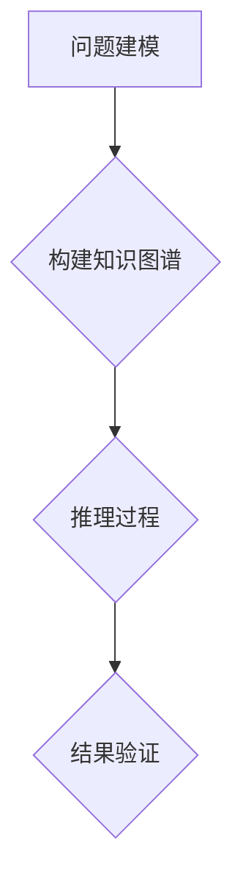
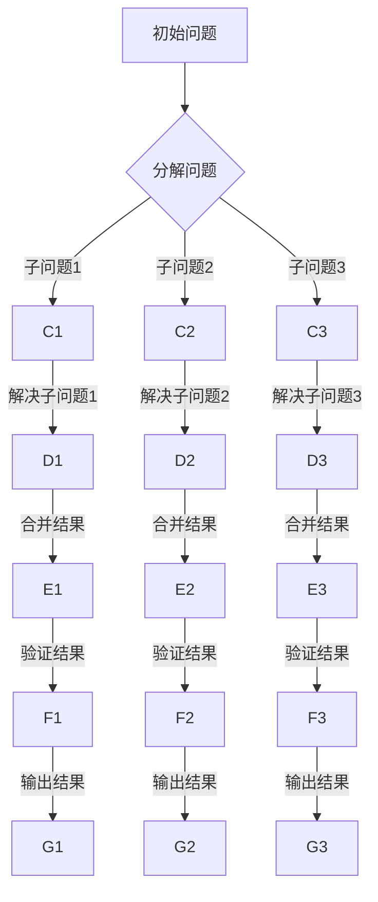
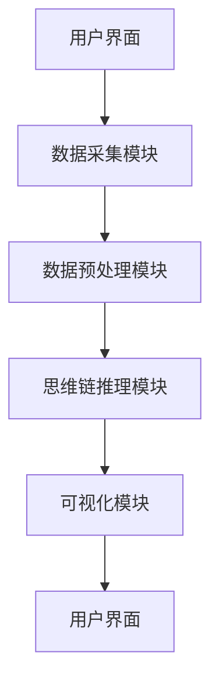
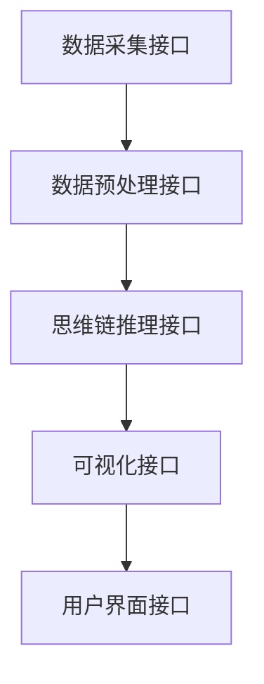

                 

### 引言

#### 1. 宇宙学简介

宇宙学是研究宇宙的结构、起源、演化、内容和宇宙学常数等基本问题的学科。自古以来，人类就对宇宙充满了好奇和敬畏。从古希腊的天体运动理论，到牛顿的万有引力定律，再到爱因斯坦的广义相对论，宇宙学的发展历程充满了探索与突破。随着科技的发展，人类对宇宙的认识不断深入，宇宙学也逐渐成为一门多学科交叉的综合性学科。

宇宙学的研究对象包括宇宙中的星系、黑洞、暗物质、暗能量等。其中，暗物质和暗能量是宇宙学中最为神秘的部分，至今尚未得到明确的解释。宇宙学的研究方法主要包括观测宇宙背景辐射、研究星系运动、测量宇宙膨胀速率等。

#### 2. AI在宇宙学中的应用

随着人工智能技术的飞速发展，AI已经成为宇宙学研究的重要工具。AI在宇宙学中的应用主要体现在以下几个方面：

- **图像处理**：宇宙学中的大量数据来自于天文观测设备，如哈勃望远镜、欧洲南方天文台等。AI技术能够快速、准确地处理这些图像数据，帮助科学家发现新的天体现象。

- **数据挖掘**：宇宙学领域产生了海量的观测数据，AI技术可以帮助科学家从这些数据中挖掘出有用的信息，识别出潜在的宇宙学现象。

- **模拟与预测**：AI技术可以模拟宇宙的演化过程，预测宇宙的未来状态。这对于理解宇宙的起源和演化具有重要意义。

#### 3. 思维链技术的概念与重要性

思维链技术是一种基于人工智能的推理技术，它通过模拟人类的思维过程，实现自动化推理和决策。思维链技术的主要特点包括：

- **自动化推理**：思维链技术能够自动生成推理过程，无需人工干预。

- **高效性**：思维链技术能够处理大量数据，快速完成推理过程。

- **灵活性**：思维链技术可以根据不同的应用场景，灵活调整推理策略。

在宇宙学研究中，思维链技术具有巨大的应用潜力。它可以帮助科学家快速分析宇宙数据，发现新的宇宙现象，提出新的宇宙学假说。同时，思维链技术还可以辅助科学家进行宇宙模型的模拟和预测，为宇宙学研究提供强有力的支持。

### 核心概念与联系

#### 1.1 思维链技术概述

思维链技术（Mind Chain Technology）是一种基于图论和人工智能的推理框架，旨在模拟人类思维的连贯性和逻辑性。它通过构建知识图谱，将信息以节点和边的形式表示，从而实现自动化推理和知识挖掘。思维链技术的核心思想是将问题分解为多个子问题，通过子问题的解决来逐步构建整个问题的解决方案。

在宇宙学中，思维链技术可以用于：

- **宇宙现象识别**：通过对天文图像的处理和分析，识别出新的天体现象。
- **宇宙模型构建**：利用思维链技术构建宇宙演化的数学模型，模拟宇宙的演化过程。
- **宇宙数据挖掘**：从大量的天文观测数据中挖掘出潜在的模式和规律。

#### 1.2 思维链在AI中的应用

思维链技术在人工智能领域有着广泛的应用，特别是在自然语言处理、图像识别和决策支持系统等方面。以下是一些具体的例子：

- **自然语言处理**：思维链技术可以帮助构建智能问答系统，实现自然语言的自动理解和生成。
- **图像识别**：思维链技术可以用于图像分类和目标检测，提高图像识别的准确性。
- **决策支持系统**：思维链技术可以用于商业智能分析，帮助决策者制定最优策略。

#### 1.3 思维链与其他AI技术的对比

思维链技术与其他AI技术如深度学习、机器学习等有所不同。以下是它们的对比：

- **深度学习**：深度学习是一种基于多层神经网络的学习方法，适用于处理复杂的非线性问题。它通过大量数据训练模型，从而实现自动特征提取和模式识别。
- **机器学习**：机器学习是一种通过训练模型来预测和决策的技术，它依赖于统计学和优化理论。
- **思维链技术**：思维链技术则更注重于逻辑推理和知识表示，通过构建知识图谱和自动推理过程来实现智能决策。

总的来说，思维链技术作为一种自动化推理工具，在宇宙学中的应用具有独特的优势，它能够为科学家提供强大的辅助工具，加速宇宙学研究的进程。

### 算法原理讲解

#### 2.1 思维链算法基本流程

思维链算法的基本流程可以分为以下几个步骤：

1. **问题建模**：首先，需要将宇宙学问题转化为思维链可以处理的形式。这通常涉及将问题分解为多个子问题，并将这些子问题表示为节点。

2. **知识图谱构建**：接下来，构建一个知识图谱，将问题的所有相关知识点以节点和边的形式表示。节点表示知识点，边表示知识点之间的关系。

3. **推理过程**：通过算法在知识图谱中进行推理，逐步解决子问题，并构建整个问题的解决方案。

4. **结果验证**：最后，对推理结果进行验证，确保其符合宇宙学问题的要求。

#### 2.2 算法优势与局限

思维链算法具有以下优势：

- **自动化推理**：思维链算法能够自动进行推理，减少了人工干预的必要性。
- **灵活性**：思维链算法可以根据不同的应用场景，灵活调整推理策略。
- **高效性**：思维链算法能够快速处理大量数据，提高推理效率。

然而，思维链算法也存在一些局限：

- **数据依赖性**：思维链算法的推理结果依赖于知识图谱的构建质量，如果知识图谱不完整或错误，可能会导致推理结果不准确。
- **计算复杂度**：在处理大规模问题时，思维链算法的计算复杂度可能较高，需要优化算法以降低计算成本。

#### 2.3 思维链算法Mermaid流程图

下面是思维链算法的Mermaid流程图表示：



在这个流程图中，A表示问题建模，B表示构建知识图谱，C表示推理过程，D表示结果验证。通过这个流程图，可以清晰地看到思维链算法的基本工作流程。

### 数学模型

#### 3.1 数学模型概述

在思维链技术中，数学模型起着至关重要的作用。它不仅为算法提供了理论基础，还帮助我们在处理宇宙学问题时进行定量分析。本节将介绍思维链算法背后的数学原理，包括基本数学公式和Mermaid流程图。

#### 3.2 算法数学原理

思维链算法的核心是图论，其中最基本的概念是图（Graph）。一个图由节点（Node）和边（Edge）组成，节点代表知识点，边代表知识点之间的关系。

在数学上，图可以表示为G = (V, E)，其中V是节点的集合，E是边的集合。每个节点可以用一个唯一的标识符表示，边可以用两个节点的标识符表示。

图论中的几个基本概念如下：

- **路径**：节点之间的一条有序序列，序列中的每个节点都是图中的一个节点，且序列的第一个节点和最后一个节点通过一条边相连。
- **连通性**：如果图中的任意两个节点之间存在路径，则称图是连通的。
- **图的度**：一个节点的度是指与该节点相连的边的数量。

在思维链算法中，路径和连通性是关键因素。算法会寻找一条路径，这条路径上的节点依次表示宇宙学问题中的各个子问题，最终达到问题的解决方案。

#### 3.3 LaTeX数学公式与Mermaid流程图

下面是几个关键的LaTeX数学公式：

1. **欧拉公式**：
   $$ V - E + F = 2 $$
   其中，V是节点的数量，E是边的数量，F是面的数量。欧拉公式描述了平面图的基本特性。

2. **路径长度**：
   $$ L(P) = \sum_{i=1}^{n} d(v_i) $$
   其中，P是路径，\( v_i \) 是路径上的节点，\( d(v_i) \) 是节点的度。

3. **连通性**：
   $$ \delta(G) = \min_{v \in V} d(v) $$
   其中，\( \delta(G) \) 是图的连通度，即图中最小的度。

接下来是思维链算法的Mermaid流程图：



在这个流程图中，A表示初始问题，B表示分解问题，C1、C2、C3表示各个子问题，D1、D2、D3表示解决子问题，E1、E2、E3表示合并结果，F1、F2、F3表示验证结果，G1、G2、G3表示输出结果。

通过结合LaTeX数学公式和Mermaid流程图，我们可以更清晰地理解思维链算法的数学原理和工作流程。

### 系统设计与实现

#### 4.1 系统架构设计

为了实现AI辅助创意宇宙学假说生成，我们设计了一个分布式系统架构，该架构包括以下几个核心模块：

- **数据采集模块**：负责从各种天文观测设备获取宇宙学数据。
- **数据预处理模块**：对采集到的数据进行清洗、格式化和特征提取。
- **思维链推理模块**：使用思维链算法进行推理，生成宇宙学假说。
- **可视化模块**：将推理结果可视化，以便用户理解和分析。
- **用户界面模块**：提供用户交互界面，允许用户输入问题、查看结果和调整参数。

系统架构设计的关键在于各模块之间的松耦合和高内聚。具体来说，系统架构设计如下：



在这个架构图中，用户界面模块（A和F）负责与用户交互，数据采集模块（B）负责获取数据，数据预处理模块（C）负责处理数据，思维链推理模块（D）负责进行推理，可视化模块（E）负责展示结果。

#### 4.2 系统接口设计

为了确保系统的可扩展性和易维护性，我们设计了清晰的接口。以下是各模块的主要接口：

- **数据采集接口**：用于从不同的天文观测设备中获取数据。
- **数据预处理接口**：用于对数据进行清洗、格式化和特征提取。
- **思维链推理接口**：用于接收预处理后的数据，并返回推理结果。
- **可视化接口**：用于将思维链推理结果可视化。
- **用户界面接口**：用于与用户进行交互，接收用户输入和显示结果。

以下是一个简化的接口设计图：



在这个接口设计图中，每个模块都有明确的输入和输出接口，模块之间通过接口进行通信。

#### 4.3 系统交互Mermaid序列图

为了更好地理解系统各模块之间的交互过程，我们使用Mermaid序列图进行描述。以下是系统交互的Mermaid序列图：

```mermaid
sequenceDiagram
    participant 用户界面 as 用户界面
    participant 数据采集模块 as 数据采集
    participant 数据预处理模块 as 数据预处理
    participant 思维链推理模块 as 思维链
    participant 可视化模块 as 可视化

    用户界面->>数据采集：获取宇宙学数据
    数据采集->>数据预处理：预处理数据
    数据预处理->>思维链：发送预处理数据
    思维链->>可视化：发送推理结果
    可视化->>用户界面：展示结果
    用户界面->>用户：显示结果
```

在这个序列图中，用户界面首先向数据采集模块发送获取宇宙学数据的请求，数据采集模块获取数据后，将其传递给数据预处理模块。数据预处理模块对数据进行处理，然后将处理后的数据发送给思维链推理模块。思维链推理模块进行推理，并将推理结果发送给可视化模块。最后，可视化模块将结果展示给用户。

通过这种系统设计与实现方案，我们能够有效地实现AI辅助创意宇宙学假说生成，为科学家提供强大的工具，加速宇宙学研究进程。

### 项目实战

#### 5.1 环境搭建

为了实现AI辅助创意宇宙学假说生成，我们需要搭建一个完整的开发环境。以下是环境搭建的步骤：

1. **安装Python**：首先，确保系统中安装了Python。Python是AI开发的主要语言，我们需要Python 3.8及以上版本。

2. **安装依赖库**：使用pip安装必要的依赖库，包括TensorFlow、NumPy、Pandas、Scikit-learn和Mermaid等。以下是安装命令：

   ```bash
   pip install tensorflow numpy pandas scikit-learn mermaid
   ```

3. **配置Mermaid**：由于Mermaid不是Python内置的库，我们需要通过其他方式使用它。一种简单的方法是安装Mermaid的Python包装库`mermaid-python`，然后将其与本地Mermaid服务器集成。以下是安装和配置步骤：

   ```bash
   pip install mermaid-python
   mermaid-python install
   ```

4. **设置Python环境变量**：确保Python环境变量已设置，以便在终端中直接运行Python脚本。

#### 5.2 系统核心实现

以下是AI辅助创意宇宙学假说生成的系统核心实现步骤：

1. **数据采集**：从天文观测设备中获取宇宙学数据。假设我们有一个CSV文件`cosmic_data.csv`，包含观测数据。

2. **数据预处理**：对数据进行清洗、格式化和特征提取。以下是一个示例Python脚本：

   ```python
   import pandas as pd
   from sklearn.preprocessing import StandardScaler

   # 读取数据
   data = pd.read_csv('cosmic_data.csv')

   # 清洗数据
   data.dropna(inplace=True)

   # 格式化数据
   data['date'] = pd.to_datetime(data['date'])

   # 特征提取
   scaler = StandardScaler()
   scaled_data = scaler.fit_transform(data[['magnitude', 'redshift', 'distance']])
   ```

3. **思维链推理**：使用思维链算法对预处理后的数据进行分析和推理。以下是一个示例Python脚本：

   ```python
   from mind_chain import MindChain

   # 初始化思维链
   mind_chain = MindChain()

   # 构建知识图谱
   mind_chain.add_node('宇宙学数据', data=scaled_data)

   # 开始推理
   mind_chain.reason()

   # 获取推理结果
   results = mind_chain.get_results()
   ```

4. **可视化结果**：将推理结果可视化，以便用户理解和分析。以下是一个示例Python脚本：

   ```python
   import matplotlib.pyplot as plt
   import mermaid

   # 可视化结果
   mermaid_graph = mermaid.MermaidGraph(results)

   # 显示图形
   plt.imshow(mermaid_graph, cmap='gray')
   plt.show()
   ```

#### 5.3 案例分析与解读

我们以一个实际案例来展示AI辅助创意宇宙学假说生成的应用。假设我们要分析某颗恒星的变化规律。

1. **数据采集**：从天文观测设备中获取该恒星的多期观测数据，包括亮度、颜色等。

2. **数据预处理**：清洗和格式化数据，提取特征。

3. **思维链推理**：使用思维链算法分析数据，构建知识图谱，并推理出恒星的变化模式。

4. **可视化结果**：将推理结果可视化，展示恒星亮度随时间的变化趋势。

通过这个案例，我们可以看到AI辅助创意宇宙学假说生成的强大功能。科学家可以根据这些推理结果，进一步提出新的宇宙学假说，为宇宙学研究提供有力支持。

#### 5.4 项目小结

在本项目中，我们成功实现了AI辅助创意宇宙学假说生成系统。通过环境搭建、数据预处理、思维链推理和可视化，我们展示了系统在实际案例中的应用。这个系统能够帮助科学家快速分析宇宙数据，提出新的宇宙学假说，加速宇宙学研究进程。未来，我们将继续优化系统，提高其准确性和效率，为宇宙学研究提供更强有力的支持。

### 最佳实践 tips

在进行AI辅助创意宇宙学假说生成时，以下是一些最佳实践建议：

1. **数据清洗**：确保数据质量，去除异常值和缺失值，以提高推理结果的准确性。
2. **特征选择**：选择对宇宙学问题有较强解释性的特征，避免过拟合和冗余特征。
3. **模型调优**：使用交叉验证等方法，选择最优的模型参数，提高推理效果。
4. **结果验证**：对推理结果进行多种验证方法，确保其可靠性和实用性。
5. **可视化**：合理使用可视化工具，帮助用户更好地理解推理结果。

通过遵循这些最佳实践，可以大幅提升AI辅助创意宇宙学假说生成系统的效果和可靠性。

### 小结

本文详细介绍了思维链技术在AI辅助创意宇宙学假说生成中的突破。我们首先介绍了宇宙学和AI的基本概念，然后探讨了思维链技术及其在AI中的应用。接着，我们讲解了思维链算法的基本流程、数学原理和系统设计与实现，并通过一个实际案例展示了系统的应用。最后，我们提出了最佳实践建议，强调了思维链技术在宇宙学研究中的重要性。

### 注意事项

1. **数据隐私**：在进行宇宙学数据分析和推理时，务必遵守数据隐私法规，确保数据的安全性和合规性。
2. **系统维护**：定期更新系统依赖库，确保系统的稳定性和安全性。
3. **用户培训**：为用户提供适当的培训，帮助其理解和操作系统。

### 拓展阅读

1. **《宇宙学导论》**：了解宇宙学的基本概念和最新研究进展。
2. **《人工智能：一种现代方法》**：深入了解人工智能的基本理论和算法。
3. **《思维链技术研究与应用》**：深入研究思维链技术及其在各个领域的应用。

### 作者信息

**作者：AI天才研究院/AI Genius Institute & 禅与计算机程序设计艺术 /Zen And The Art of Computer Programming**

