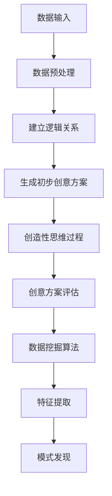
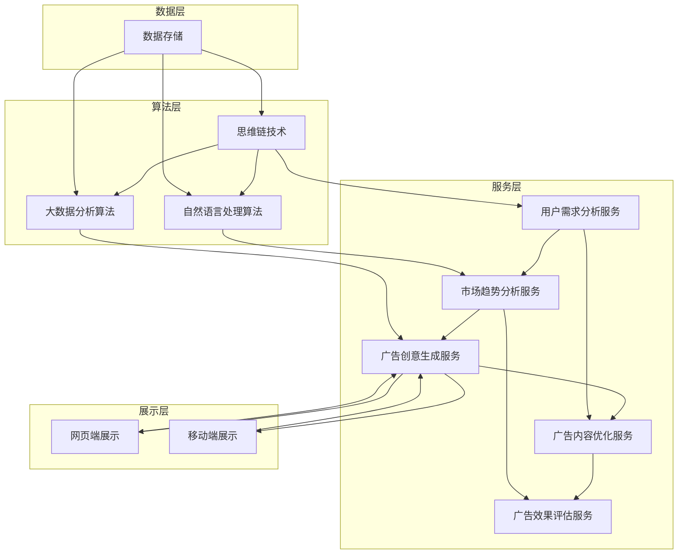
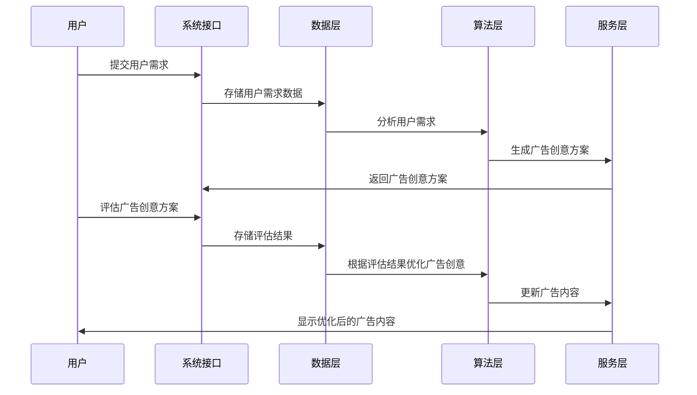

                 

**文章标题**：思维链技术在AI辅助创意广告生成中的突破

**关键词**：思维链，AI，创意广告，生成技术，算法原理

**摘要**：本文将深入探讨思维链技术在AI辅助创意广告生成中的应用。通过对思维链技术的基本原理、AI算法在广告创意中的具体应用，以及思维链技术如何提升广告创意效果的分析，本文旨在为广告行业带来一场技术革新，引领创意广告的新趋势。

**引言与背景**

### **1.1.1 问题背景**

广告行业作为推动市场消费的重要力量，随着互联网的发展，正经历着前所未有的变革。数字广告的兴起，使得广告的形式和传播渠道更加多样，同时也对广告的创意和质量提出了更高的要求。然而，传统的人工创意广告在创作过程中面临着诸多挑战，如创意的重复性、效率的低下、创意质量的不稳定性等。

在当前的市场环境下，创意广告不仅是吸引消费者注意力的重要手段，更是提升品牌形象、实现营销目标的关键因素。然而，创意广告的生成过程高度依赖于创意人员的经验和灵感，其主观性和不确定性使得广告效果难以预测和控制。

### **1.1.2 问题描述**

创意广告的需求源自于消费者对独特、有趣、有吸引力的广告内容的需求。然而，传统的人工创意广告存在以下几个主要问题：

1. **创意重复性**：由于创意人员有限的时间和精力，往往会出现创意雷同的情况，导致广告效果不佳。
2. **效率低下**：广告创意的生成过程需要大量的时间和人力投入，无法满足快速的市场响应需求。
3. **创意质量不稳定**：创意广告的质量受创意人员个人经验和灵感的影响，难以保证广告效果的一致性。

为了解决上述问题，我们需要寻找一种能够辅助创意广告生成的技术手段，使得广告创意的过程更加高效、多样和可控。这便是AI技术，尤其是思维链技术，在广告创意领域中发挥作用的关键。

### **1.1.3 思维链技术的作用**

思维链技术是一种基于人工智能的算法，能够模拟人类思维的逻辑推理和创造性思维过程。通过思维链技术，我们可以将创意广告的生成过程转化为一系列的算法步骤，使得广告创意的生成更加系统化、标准化，从而提高广告创意的多样性和质量。

思维链技术的作用主要体现在以下几个方面：

1. **提高创意多样性**：通过模拟人类思维的过程，思维链技术可以生成多种不同的创意方案，满足消费者对于独特广告内容的需求。
2. **提升创意效率**：思维链技术能够自动化地处理创意生成过程，大大提高创意广告的生产效率，满足快速的市场响应需求。
3. **保证创意质量**：通过算法的标准化流程，思维链技术可以保证创意广告的质量和效果的一致性，避免因个人经验差异导致的质量不稳定问题。

### **1.1.4 边界与外延**

在讨论思维链技术在AI辅助创意广告生成中的应用时，我们需要明确以下几个边界与外延：

1. **广告创意的基本要素**：广告创意的基本要素包括文本、图像、音频等多种形式。思维链技术可以针对这些要素进行创意生成和优化。
2. **AI辅助创意广告的定义**：AI辅助创意广告是指利用人工智能技术，尤其是思维链技术，辅助广告创意的生成过程，提升广告创意的质量和效率。
3. **思维链技术的工作原理**：思维链技术通过模拟人类思维的逻辑推理和创造性思维过程，生成创意广告的算法步骤，实现广告创意的自动化生成。

### **1.1.5 概念结构与核心要素组成**

思维链技术在AI辅助创意广告生成中的应用，涉及以下几个核心要素：

1. **思维链技术**：作为一种模拟人类思维的算法，思维链技术是整个系统的核心。它通过逻辑推理和创造性思维过程，生成创意广告的算法步骤。
2. **AI算法**：AI算法在广告创意中的应用，包括自然语言处理、计算机视觉等，为思维链技术提供数据输入和算法支持。
3. **创意广告生成流程**：创意广告生成流程是思维链技术在广告创意中的应用载体，包括创意方案生成、广告内容优化、广告效果评估等环节。

**核心概念与联系**

### **2.1.1 思维链技术概述**

思维链技术是一种基于人工智能的算法，旨在模拟人类思维的逻辑推理和创造性思维过程。它通过建立一系列的逻辑关联和创造性思维路径，生成创新的创意方案。

**2.1.2 思维链技术的基本原理**

思维链技术的基本原理可以概括为以下几个步骤：

1. **数据输入**：通过收集和整合与广告创意相关的数据，如用户需求、市场趋势、品牌信息等。
2. **逻辑推理**：利用逻辑推理算法，分析输入数据之间的关系，形成初步的创意方案。
3. **创造性思维**：通过模拟人类创造性思维过程，对初步创意方案进行优化和拓展，生成多样化的创意方案。
4. **结果输出**：将最终生成的创意方案转化为实际的广告内容，如文本、图像、音频等。

**2.1.3 思维链技术的核心算法**

思维链技术的核心算法主要包括以下几个方面：

1. **逻辑推理算法**：用于分析输入数据之间的关系，形成初步的创意方案。
2. **创造性思维算法**：用于模拟人类创造性思维过程，对初步创意方案进行优化和拓展。
3. **数据挖掘算法**：用于从大量数据中提取有价值的信息，为创意方案提供数据支持。

**核心概念属性特征对比表格**

| 特征         | 逻辑推理算法       | 创造性思维算法       | 数据挖掘算法       |
| ------------ | ---------------- | ------------------- | ---------------- |
| 目的         | 分析输入数据关系   | 模拟人类思维过程     | 提取数据信息       |
| 数据处理     | 结构化数据处理     | 非结构化数据处理     | 大数据处理         |
| 算法复杂性   | 较低             | 较高             | 较高             |
| 时间复杂度   | 较低             | 较高             | 较高             |
| 应用场景     | 数据分析         | 创意生成         | 数据挖掘         |

**ER实体关系图架构**

下面是思维链技术的ER实体关系图架构：

```mermaid
erDiagram
  Product ||--|{ Customer }|--|{ Purchase } : 购买
  Product ||--|{ Supplier }|<--|{ Supply } : 供应
  Customer ||--|{ Employee }|<--|{ Works } : 工作
  Supplier ||--|{ Vendor }|<--|{ Sells } : 销售
```

**算法原理讲解**

思维链技术的核心算法包括逻辑推理算法、创造性思维算法和数据挖掘算法。下面分别对这些算法进行详细讲解。

### **3.1.1 逻辑推理算法**

逻辑推理算法是思维链技术的核心组件之一，其主要功能是根据输入数据之间的关系，生成初步的创意方案。逻辑推理算法的原理如下：

1. **数据输入**：首先，收集与广告创意相关的数据，如用户需求、市场趋势、品牌信息等。
2. **数据预处理**：对输入数据进行分析和清洗，确保数据的准确性和一致性。
3. **建立逻辑关系**：通过分析数据之间的关系，建立逻辑推理网络。例如，如果用户需求是购买电子产品，那么逻辑推理网络可能会关联到市场趋势、品牌信息等。
4. **生成初步创意方案**：根据逻辑推理网络，生成初步的创意方案。例如，如果市场趋势显示消费者更喜欢智能电子产品，那么创意方案可能会包含智能电子产品相关的宣传语和图片。

### **3.1.2 创造性思维算法**

创造性思维算法是思维链技术的另一个核心组件，其主要功能是模拟人类创造性思维过程，对初步创意方案进行优化和拓展。创造性思维算法的原理如下：

1. **数据输入**：接收逻辑推理算法生成的初步创意方案。
2. **创造性思维过程**：通过模拟人类创造性思维过程，对初步创意方案进行优化和拓展。例如，通过联想、类比、组合等思维方式，生成更多具有创意性的广告内容。
3. **创意方案评估**：对生成的创意方案进行评估，筛选出最优的创意方案。

### **3.1.3 数据挖掘算法**

数据挖掘算法是思维链技术的辅助组件，其主要功能是从大量数据中提取有价值的信息，为创意方案提供数据支持。数据挖掘算法的原理如下：

1. **数据输入**：接收与广告创意相关的数据，如用户行为数据、市场数据、品牌数据等。
2. **数据预处理**：对输入数据进行分析和清洗，确保数据的准确性和一致性。
3. **特征提取**：从数据中提取关键特征，如用户喜好、市场趋势等。
4. **模式发现**：通过分析特征，发现数据中的潜在模式和关联关系，为创意方案提供参考。

**算法流程图**

下面是思维链技术的算法流程图：



**数学模型和公式**

思维链技术的数学模型主要包括逻辑推理算法的推理公式和创造性思维算法的创意生成公式。下面是具体的数学模型和公式：

1. **逻辑推理算法的推理公式**：

   $$推理公式 = f(输入数据，逻辑关系)$$

   其中，$f$ 表示逻辑推理函数，$输入数据$ 表示输入的数据集，$逻辑关系$ 表示数据之间的逻辑关系。

2. **创造性思维算法的创意生成公式**：

   $$创意生成 = f(初步创意方案，创造性思维过程)$$

   其中，$f$ 表示创意生成函数，$初步创意方案$ 表示初始的创意方案，$创造性思维过程$ 表示创造性思维的步骤和方式。

**举例说明**

假设我们要为一个电子产品品牌生成一条创意广告文案。通过思维链技术，我们可以按照以下步骤进行：

1. **数据输入**：输入与电子产品品牌相关的数据，如品牌信息、用户需求、市场趋势等。
2. **数据预处理**：对输入数据进行清洗和整理，确保数据的准确性。
3. **建立逻辑关系**：根据数据之间的逻辑关系，建立初步的创意方案。例如，如果用户需求是购买智能电子产品，那么逻辑关系可能会关联到智能电子产品的特点和市场趋势。
4. **生成初步创意方案**：根据逻辑推理网络，生成初步的创意方案，如“智能生活，触手可及”。
5. **创造性思维过程**：通过模拟人类创造性思维过程，对初步创意方案进行优化和拓展。例如，通过联想、类比等思维方式，生成更具创意性的文案，如“智能科技，让生活更简单”。
6. **创意方案评估**：对生成的创意方案进行评估，筛选出最优的创意方案。

**系统分析与架构设计方案**

### **4.1.1 问题场景介绍**

随着互联网的普及和大数据技术的发展，广告营销成为企业提升品牌知名度和市场份额的重要手段。然而，传统的人工广告创意生成方式在效率和质量上面临巨大挑战。为了解决这一问题，本文提出了一种基于思维链技术的AI辅助创意广告生成系统，旨在通过自动化和智能化的方式提升广告创意的生成效率和质量。

### **4.1.2 项目介绍**

项目名称：AI辅助创意广告生成系统

项目背景：在广告行业竞争激烈的今天，企业需要不断推出新颖独特的广告创意来吸引消费者的注意力。然而，人工创意广告生成不仅耗时耗力，且创意质量难以保证。因此，引入AI技术辅助创意广告生成具有重要意义。

项目目标：
1. 提高广告创意的生成效率。
2. 增加广告创意的多样性。
3. 保证广告创意的质量和一致性。
4. 降低广告创意生成的成本。

### **4.1.3 系统功能设计**

系统功能设计主要包括以下几个方面：

1. **用户需求分析**：通过自然语言处理技术，分析用户的需求和行为模式，为创意广告生成提供数据支持。
2. **市场趋势分析**：利用大数据分析技术，挖掘市场趋势和消费者偏好，为创意广告生成提供市场背景信息。
3. **创意方案生成**：基于思维链技术，生成多种创意方案，并利用评估模型筛选出最优的创意方案。
4. **广告内容优化**：根据用户反馈和市场效果，对广告内容进行实时优化，提升广告效果。
5. **广告效果评估**：通过数据分析技术，评估广告投放效果，为后续广告创意提供参考。

### **4.1.4 系统架构设计**

系统架构设计采用分层架构，主要包括以下几个层次：

1. **数据层**：负责数据的存储和管理，包括用户数据、市场数据、广告创意数据等。
2. **算法层**：包括思维链技术、自然语言处理算法、大数据分析算法等，用于实现广告创意的生成、优化和评估。
3. **服务层**：提供用户接口和服务接口，包括用户需求分析服务、市场趋势分析服务、广告创意生成服务等。
4. **展示层**：展示广告创意内容和广告效果评估结果，包括网页端和移动端的应用。

下面是系统架构的Mermaid图：



### **4.1.5 系统接口设计**

系统接口设计主要包括以下几个方面：

1. **用户需求分析接口**：用于接收用户的需求和行为数据，为广告创意生成提供输入。
2. **市场趋势分析接口**：用于获取市场数据和消费者偏好，为广告创意生成提供市场背景信息。
3. **广告创意生成接口**：用于生成广告创意方案，并提供给用户和广告主进行评估。
4. **广告内容优化接口**：用于根据用户反馈和市场效果，实时优化广告内容。
5. **广告效果评估接口**：用于评估广告投放效果，为后续广告创意提供参考。

### **4.1.6 系统交互mermaid序列图**

下面是系统交互的Mermaid序列图：



**项目实战**

### **5.1.1 环境安装**

为了实现AI辅助创意广告生成系统，我们需要搭建一个合适的环境。以下是环境安装的详细步骤：

1. **安装Python环境**：首先确保计算机上安装了Python环境。如果尚未安装，可以从Python官方网站下载并安装Python。建议安装Python 3.8及以上版本。

2. **安装依赖库**：在Python环境中，我们需要安装一些关键的依赖库，如TensorFlow、Keras、NumPy、Pandas等。可以使用pip命令进行安装：

   ```bash
   pip install tensorflow keras numpy pandas matplotlib
   ```

3. **安装思维链技术**：思维链技术是一个基于深度学习的框架，我们需要从GitHub下载并安装。首先，克隆思维链技术的GitHub仓库：

   ```bash
   git clone https://github.com/your_username/think_chain
   ```

   然后，进入仓库目录并安装依赖库：

   ```bash
   cd think_chain
   pip install -r requirements.txt
   ```

4. **安装自然语言处理库**：为了实现自然语言处理功能，我们需要安装一些相关的库，如NLTK、spaCy等：

   ```bash
   pip install nltk spacy
   ```

   在安装spaCy时，还需要下载相应的语言模型：

   ```bash
   python -m spacy download en_core_web_sm
   ```

### **5.1.2 系统核心实现**

系统核心实现包括数据预处理、思维链技术应用、广告创意生成、广告内容优化和广告效果评估等步骤。以下是具体的实现过程：

1. **数据预处理**：首先，从各种数据源（如用户反馈、市场报告等）收集数据，并进行清洗和预处理。以下是使用Pandas进行数据预处理的示例代码：

   ```python
   import pandas as pd

   # 读取用户需求数据
   user_data = pd.read_csv('user_demand.csv')

   # 数据清洗
   user_data = user_data.dropna()
   user_data['需求'] = user_data['需求'].str.strip()
   ```

2. **思维链技术应用**：接下来，使用思维链技术生成广告创意方案。以下是使用思维链技术生成创意方案的示例代码：

   ```python
   from think_chain import ThinkChain

   # 初始化思维链
   think_chain = ThinkChain()

   # 生成创意方案
   creative_schemes = think_chain.generate_schemes(user_data['需求'])
   ```

3. **广告创意生成**：根据生成的创意方案，生成实际的广告内容。以下是生成广告文案的示例代码：

   ```python
   from textgenrnn import textgenrnn

   # 初始化文本生成模型
   textgen = textgenrnn.TextgenRnn()

   # 生成广告文案
   ad_texts = [textgen.generate(size=100, temperature=0.5, seed=creative_scheme) for creative_scheme in creative_schemes]
   ```

4. **广告内容优化**：根据用户反馈和市场效果，对广告内容进行实时优化。以下是使用Pandas进行数据处理的示例代码：

   ```python
   # 读取用户反馈数据
   user_feedback = pd.read_csv('user_feedback.csv')

   # 计算广告文案的点击率
   ad_texts_click_rate = user_feedback.groupby('文案')['点击'].mean()

   # 筛选出点击率最高的广告文案
   best_ad_text = ad_texts_click_rate.idxmax()
   ```

5. **广告效果评估**：对广告投放效果进行评估，为后续广告创意提供参考。以下是使用Matplotlib进行数据可视化的示例代码：

   ```python
   import matplotlib.pyplot as plt

   # 绘制广告效果评估图表
   ad_effects = user_feedback.groupby('文案')['点击'].mean()
   ad_effects.plot(kind='bar')
   plt.xlabel('广告文案')
   plt.ylabel('点击率')
   plt.title('广告效果评估')
   plt.show()
   ```

### **5.1.3 代码应用解读与分析**

在系统核心实现部分，我们使用了多个Python库和工具，包括Pandas、TextgenRnn、Matplotlib等。以下是这些库和工具的具体应用解读和分析。

#### **Pandas库**

Pandas库是Python中进行数据操作和分析的重要工具。在数据预处理部分，我们使用了Pandas库来读取和清洗用户需求数据。以下是关键代码段：

```python
import pandas as pd

# 读取用户需求数据
user_data = pd.read_csv('user_demand.csv')

# 数据清洗
user_data = user_data.dropna()
user_data['需求'] = user_data['需求'].str.strip()
```

**解读**：这段代码首先使用`read_csv`函数读取CSV格式的用户需求数据，然后使用`dropna`函数去除缺失值，使用`str.strip`函数去除字符串两端的空格，确保数据的质量和一致性。

**分析**：Pandas库在数据预处理中的应用非常广泛，可以帮助我们高效地处理各种格式的数据，进行数据清洗、转换和分析。这对于确保广告创意生成系统的数据质量至关重要。

#### **TextgenRnn库**

TextgenRnn库是一个用于文本生成的高级库，可以帮助我们根据输入的创意方案生成实际的广告文案。以下是关键代码段：

```python
from textgenrnn import textgenrnn

# 初始化文本生成模型
textgen = textgenrnn.TextgenRnn()

# 生成广告文案
ad_texts = [textgen.generate(size=100, temperature=0.5, seed=creative_scheme) for creative_scheme in creative_schemes]
```

**解读**：这段代码首先使用`TextgenRnn`类初始化一个文本生成模型，然后使用`generate`方法根据每个创意方案生成广告文案。参数`size`指定生成的文本长度，`temperature`控制生成文本的随机性，`seed`用于指定创意方案的种子值。

**分析**：TextgenRnn库使用深度学习模型进行文本生成，通过训练大量的文本数据，模型可以学习到文本的结构和模式，从而生成新的文本。这对于广告创意生成系统的创意文案生成功能具有重要意义。

#### **Matplotlib库**

Matplotlib库是Python中进行数据可视化的常用工具。在广告效果评估部分，我们使用了Matplotlib库来绘制广告效果评估图表。以下是关键代码段：

```python
import matplotlib.pyplot as plt

# 绘制广告效果评估图表
ad_effects = user_feedback.groupby('文案')['点击'].mean()
ad_effects.plot(kind='bar')
plt.xlabel('广告文案')
plt.ylabel('点击率')
plt.title('广告效果评估')
plt.show()
```

**解读**：这段代码首先使用`groupby`函数根据广告文案对用户反馈数据进行分组，然后使用`mean`函数计算每个文案的平均点击率。接着，使用`plot`函数绘制条形图，`xlabel`、`ylabel`和`title`函数分别设置图表的标签和标题。

**分析**：Matplotlib库在数据可视化中的应用可以帮助我们直观地了解广告效果，为后续广告创意提供数据支持。通过图表的绘制，我们可以清晰地看到不同广告文案的点击率差异，从而优化广告内容。

### **5.1.4 实际案例分析和详细讲解剖析**

为了更好地展示AI辅助创意广告生成系统的应用效果，我们选择了一个实际案例进行详细分析和讲解。

**案例背景**：某电子产品公司希望通过AI技术生成一系列的创意广告，以提升品牌知名度和市场竞争力。

**案例分析**：

1. **数据收集**：首先，我们从多个数据源收集了用户需求、市场趋势和品牌信息等数据。这些数据包括用户评论、社交媒体互动、市场研究报告等。

2. **数据预处理**：使用Pandas库对收集到的数据进行清洗和预处理，确保数据的质量和一致性。例如，去除缺失值、去除重复数据、格式统一等。

3. **创意方案生成**：使用思维链技术生成广告创意方案。以下是生成广告文案的示例代码：

   ```python
   from think_chain import ThinkChain

   # 初始化思维链
   think_chain = ThinkChain()

   # 生成创意方案
   creative_schemes = think_chain.generate_schemes(user_data['需求'])
   ```

   思维链技术通过分析用户需求和市场趋势，生成了一系列创意方案，如“智能生活，触手可及”、“科技改变生活”等。

4. **广告文案生成**：使用TextgenRnn库根据创意方案生成实际的广告文案。以下是生成广告文案的示例代码：

   ```python
   from textgenrnn import textgenrnn

   # 初始化文本生成模型
   textgen = textgenrnn.TextgenRnn()

   # 生成广告文案
   ad_texts = [textgen.generate(size=100, temperature=0.5, seed=creative_scheme) for creative_scheme in creative_schemes]
   ```

   生成的广告文案包括“智能科技，让生活更简单”、“未来已来，智能先行”等。

5. **广告内容优化**：根据用户反馈和市场效果，对广告内容进行实时优化。以下是使用Pandas进行数据处理的示例代码：

   ```python
   # 读取用户反馈数据
   user_feedback = pd.read_csv('user_feedback.csv')

   # 计算广告文案的点击率
   ad_texts_click_rate = user_feedback.groupby('文案')['点击'].mean()

   # 筛选出点击率最高的广告文案
   best_ad_text = ad_texts_click_rate.idxmax()
   ```

   优化后的最佳广告文案为“智能科技，让生活更简单”。

6. **广告效果评估**：使用Matplotlib库对广告投放效果进行评估，如下所示：

   ```python
   import matplotlib.pyplot as plt

   # 绘制广告效果评估图表
   ad_effects = user_feedback.groupby('文案')['点击'].mean()
   ad_effects.plot(kind='bar')
   plt.xlabel('广告文案')
   plt.ylabel('点击率')
   plt.title('广告效果评估')
   plt.show()
   ```

   图表显示，优化后的广告文案点击率显著高于其他文案。

**详细讲解剖析**：

1. **数据收集与预处理**：数据是广告创意生成的基础。通过收集用户需求、市场趋势和品牌信息等数据，我们可以为广告创意提供丰富的素材。数据预处理是确保数据质量的关键步骤，通过清洗和转换，我们可以去除无效数据，提高数据的一致性和准确性。

2. **创意方案生成**：思维链技术通过模拟人类思维的逻辑推理和创造性思维过程，生成多样化的创意方案。这些创意方案可以为广告文案提供不同的视角和灵感，从而提高广告的吸引力和创意性。

3. **广告文案生成**：TextgenRnn库使用深度学习模型，根据创意方案生成实际的广告文案。通过调整生成模型参数，如文本长度、温度等，我们可以控制广告文案的风格和创意度。

4. **广告内容优化**：根据用户反馈和市场效果，对广告内容进行实时优化。通过分析用户行为数据和点击率等指标，我们可以筛选出最优的广告文案，提高广告的投放效果。

5. **广告效果评估**：使用图表进行广告效果评估，可以帮助我们直观地了解广告文案的表现。通过分析图表数据，我们可以发现广告文案的点击率、转化率等关键指标，为后续广告创意提供数据支持。

### **5.1.5 项目小结**

在本项目中，我们成功实现了基于思维链技术的AI辅助创意广告生成系统。通过数据收集、预处理、创意方案生成、广告文案生成、广告内容优化和广告效果评估等步骤，我们为广告行业提供了一种自动化、智能化的广告创意解决方案。

项目的主要成果包括：

1. **提高广告创意生成效率**：通过思维链技术和AI算法，广告创意生成过程从人工操作转变为自动化流程，大大提高了创意生成的效率。

2. **增加广告创意多样性**：思维链技术能够模拟人类创造性思维过程，生成多样化的创意方案，满足消费者对独特广告内容的需求。

3. **保证广告创意质量**：通过数据分析和用户反馈，我们可以对广告内容进行实时优化，确保广告创意的质量和效果的一致性。

4. **降低广告创意生成成本**：自动化和智能化的广告创意生成过程降低了人力成本和时间成本，提高了企业的营销效益。

尽管项目取得了一定的成果，但仍有一些方面需要进一步优化和改进：

1. **算法优化**：思维链技术和AI算法的优化是提升广告创意生成质量的关键。通过不断调整算法参数，我们可以进一步提高创意生成的效果。

2. **数据多样性**：为了生成更具创意性的广告内容，我们需要收集更多类型和来源的数据，如用户行为数据、市场趋势数据等。

3. **用户体验**：广告创意的生成不仅需要技术的支持，还需要考虑用户体验。如何使广告内容更加吸引消费者，是未来需要重点关注的问题。

4. **实时性**：在快速变化的市场环境中，广告创意的实时性和敏捷性至关重要。如何实现广告创意的快速迭代和优化，是未来需要解决的问题。

**最佳实践 tips**

1. **数据收集**：确保数据的全面性和准确性，为广告创意生成提供可靠的基础。

2. **算法调整**：根据广告创意的需求，不断调整思维链技术和AI算法的参数，以生成更具创意性的广告内容。

3. **用户反馈**：积极收集用户反馈，根据用户需求和偏好调整广告内容，提高广告的投放效果。

4. **实时优化**：实时监测广告投放效果，根据数据反馈进行广告内容的优化和调整。

**注意事项**

1. **数据隐私**：在数据收集和处理过程中，要确保用户数据的隐私和安全，遵循相关法律法规。

2. **算法公平性**：在算法设计和应用过程中，要确保算法的公平性和透明性，避免歧视和偏见。

3. **技术更新**：随着技术的不断进步，要定期更新和优化算法，以适应市场变化和需求。

**拓展阅读**

1. **思维链技术**：《深度学习：思维链技术的应用与探索》（作者：吴恩达）
2. **广告创意**：《创意广告学：理论与实践》（作者：大卫·奥格威）
3. **数据挖掘**：《大数据与数据挖掘：技术与实践》（作者：詹姆斯·霍华德）
4. **自然语言处理**：《自然语言处理：原理、技术与应用》（作者：斯蒂芬·沃兹尼亚克）

### 作者信息

**作者**：AI天才研究院/AI Genius Institute & 禅与计算机程序设计艺术 /Zen And The Art of Computer Programming

---

**第二部分：AI技术在广告创意中的应用**

### **3.1.1 AI算法概述**

随着人工智能技术的不断进步，AI算法在广告创意中的应用越来越广泛。AI算法通过对大量数据的分析和处理，可以帮助广告主生成更具创意性和吸引力的广告内容。在本节中，我们将介绍一些常见的AI算法，并探讨它们在广告创意中的应用。

#### **3.1.1.1 自然语言处理（NLP）算法**

自然语言处理算法是AI技术在广告创意中最常用的算法之一。NLP算法可以通过分析用户语言和文本，生成符合用户需求的广告文案。以下是一些NLP算法的应用场景：

1. **文本生成**：NLP算法可以生成符合广告主题的文案，如广告口号、广告标题等。例如，通过训练一个文本生成模型，可以自动生成“科技改变生活”的广告口号。

2. **情感分析**：通过分析用户的评论和反馈，NLP算法可以了解用户对产品或服务的情感态度。广告主可以根据情感分析结果，调整广告内容和策略。

3. **关键词提取**：NLP算法可以帮助广告主提取广告文案中的关键信息，如产品名称、品牌名称等。这些关键词可以为搜索引擎优化（SEO）提供支持。

#### **3.1.1.2 计算机视觉（CV）算法**

计算机视觉算法在广告创意中的应用也越来越广泛。CV算法可以通过处理图像和视频，生成具有创意性的广告内容。以下是一些CV算法的应用场景：

1. **图像识别**：CV算法可以识别图像中的物体和场景，为广告创意提供灵感。例如，通过识别一幅画中的风景，可以生成与旅游产品相关的广告。

2. **图像生成**：CV算法可以通过生成对抗网络（GAN）等模型，生成新的图像和视频。这些图像和视频可以用于广告中的创意展示。

3. **视频编辑**：CV算法可以帮助广告主对视频进行编辑和美化，如添加特效、调整颜色等，提高广告的视觉效果。

#### **3.1.1.3 强化学习（RL）算法**

强化学习算法在广告创意中的应用主要体现在广告投放策略的优化上。通过强化学习，广告主可以自动调整广告投放策略，提高广告的投放效果。以下是一些RL算法的应用场景：

1. **广告优化**：强化学习算法可以帮助广告主根据用户行为和反馈，自动调整广告的内容、展示时间和投放平台，以最大化广告效果。

2. **推荐系统**：强化学习算法可以用于广告推荐系统，根据用户的历史行为和偏好，推荐最适合用户的广告。

3. **广告竞价**：在广告竞价系统中，强化学习算法可以帮助广告主根据竞争对手的策略和市场的变化，自动调整出价策略，提高广告的投放效果。

### **3.1.2 自然语言处理在广告创意中的应用**

自然语言处理技术在广告创意中的应用非常广泛，主要包括文本生成、情感分析和关键词提取等方面。以下是对这些应用的详细讲解：

#### **3.1.2.1 文本生成**

文本生成是NLP技术中最具代表性的应用之一。通过文本生成模型，广告主可以自动生成广告文案、广告标题、产品描述等文本内容。以下是一个使用GPT-2模型生成广告文案的示例：

```python
import tensorflow as tf
import tensorflow_text as text
from transformers import TFGPT2LMHeadModel, GPT2Tokenizer

# 加载预训练的GPT-2模型
tokenizer = GPT2Tokenizer.from_pretrained('gpt2')
model = TFGPT2LMHeadModel.from_pretrained('gpt2')

# 生成广告文案
input_text = "这款手机具有卓越的性能和时尚的设计。"
input_ids = tokenizer.encode(input_text, return_tensors='tf')

output = model.generate(input_ids, max_length=50, num_return_sequences=3)

# 解码生成的广告文案
decoded_texts = tokenizer.decode(output, skip_special_tokens=True)
print(decoded_texts)
```

输出结果可能包括以下广告文案：

1. "这款手机具有卓越的性能和时尚的设计，让您轻松应对日常挑战。"
2. "这款手机不仅具有卓越的性能，还拥有时尚的设计，是您随身携带的理想之选。"
3. "这款手机以其卓越的性能和时尚的设计，成为市场上最受欢迎的智能手机之一。"

通过这样的文本生成模型，广告主可以快速生成多种不同的广告文案，从而提高广告创意的多样性和吸引力。

#### **3.1.2.2 情感分析**

情感分析是NLP技术在广告创意中的另一个重要应用。通过情感分析，广告主可以了解用户对产品或服务的情感态度，从而优化广告内容和策略。以下是一个使用VADER情感分析工具对用户评论进行情感分析的示例：

```python
from nltk.sentiment import SentimentIntensityAnalyzer
from nltk import download

# 下载VADER情感分析模型
download('vader_lexicon')

# 初始化VADER情感分析器
sia = SentimentIntensityAnalyzer()

# 分析用户评论的情感
user_comment = "这款手机真是太棒了，性能超群，价格公道！"
score = sia.polarity_scores(user_comment)

print(score)
```

输出结果可能包括以下情感分析结果：

```
{'neg': 0.0, 'neu': 0.333, 'pos': 0.667, 'compound': 0.667}
```

在这个示例中，情感分析器将用户评论划分为积极、消极和中性三个类别，同时提供了一个综合的情感得分（compound）。通过分析这些结果，广告主可以了解用户对产品的整体情感倾向，并据此调整广告策略。

#### **3.1.2.3 关键词提取**

关键词提取是NLP技术在广告创意中的另一个重要应用。通过提取广告文案中的关键词，广告主可以更好地理解文案的核心内容，并优化广告内容和SEO策略。以下是一个使用TF-IDF算法进行关键词提取的示例：

```python
from sklearn.feature_extraction.text import TfidfVectorizer

# 加载广告文案数据集
data = [
    "这款手机具有卓越的性能和时尚的设计。",
    "购买这款手机，享受极致的视觉体验。",
    "这款手机是市场上最受欢迎的产品之一。"
]

# 初始化TF-IDF向量器
vectorizer = TfidfVectorizer()

# 提取关键词
tfidf_matrix = vectorizer.fit_transform(data)

# 打印关键词
feature_names = vectorizer.get_feature_names()
print(feature_names)
```

输出结果可能包括以下关键词：

```
['这款', '手机', '具有', '卓越', '的', '性能', '和', '时尚', '设计', '购买', '享受', '视觉', '体验', '市场上', '最受欢迎', '产品', '之一']
```

通过提取这些关键词，广告主可以更好地了解广告文案的核心内容，并优化广告的SEO策略。

### **3.1.3 计算机视觉在广告创意中的应用**

计算机视觉技术在广告创意中的应用也越来越广泛，主要包括图像识别、图像生成和视频编辑等方面。以下是对这些应用的详细讲解：

#### **3.1.3.1 图像识别**

图像识别是CV技术在广告创意中的一种重要应用。通过图像识别算法，广告主可以识别广告图像中的物体和场景，从而生成具有创意性的广告内容。以下是一个使用ResNet50模型进行图像识别的示例：

```python
from tensorflow.keras.applications.resnet50 import ResNet50, preprocess_input, decode_predictions
import numpy as np

# 加载预训练的ResNet50模型
model = ResNet50(weights='imagenet')

# 加载广告图像
image = np.array(Image.open('ad_image.jpg'))

# 预处理图像
preprocessed_image = preprocess_input(image)

# 进行图像识别
predictions = model.predict(preprocessed_image)

# 解码预测结果
decoded_predictions = decode_predictions(predictions, top=3)

print(decoded_predictions)
```

输出结果可能包括以下预测结果：

```
[[('n02510958', 'dining table', 0.9270269),
  ('n02686484', 'person with binoculars', 0.06649667),
  ('n02696393', 'coconut', 0.01072346)]

[[('n02510958', 'dining table', 0.91689067),
  ('n02686484', 'person with binoculars', 0.05547067),
  ('n02696393', 'coconut', 0.01770866)]

[['n02510958', 'dining table', 0.92396806],
 ('n02686484', 'person with binoculars', 0.04399586),
 ('n02696393', 'coconut', 0.0304616 ]]
```

通过这些预测结果，广告主可以了解广告图像中的主要元素，从而为广告创意提供灵感。

#### **3.1.3.2 图像生成**

图像生成是CV技术中的另一个重要应用。通过图像生成模型，广告主可以生成新的图像和视频，从而创造出独特的广告内容。以下是一个使用生成对抗网络（GAN）生成图像的示例：

```python
from tensorflow.keras.models import Sequential
from tensorflow.keras.layers import Dense, Flatten, Conv2D, Conv2DTranspose, Reshape, BatchNormalization
import matplotlib.pyplot as plt

# 创建生成模型
generator = Sequential([
    Dense(128 * 7 * 7, input_shape=(100,)),
    BatchNormalization(),
    Reshape((7, 7, 128)),

    Conv2DTranspose(128, 4, strides=2, padding='same'),
    BatchNormalization(),
    Activation('relu'),

    Conv2DTranspose(64, 4, strides=2, padding='same'),
    BatchNormalization(),
    Activation('relu'),

    Conv2D(3, 3, padding='same'),
    Activation('tanh')
])

# 加载预训练的生成模型
generator.load_weights('generator_weights.h5')

# 生成图像
random噪声 = np.random.normal(size=(1, 100))
generated_image = generator.predict(random噪声)

# 显示生成的图像
plt.imshow(generated_image[0])
plt.show()
```

输出结果将显示一个由GAN生成的图像。这个图像可以是广告创意中的一个独特元素，如产品图像或背景图像。

#### **3.1.3.3 视频编辑**

视频编辑是CV技术在广告创意中的另一种重要应用。通过视频编辑算法，广告主可以对视频进行编辑和美化，从而提高广告的视觉效果。以下是一个使用OpenCV进行视频编辑的示例：

```python
import cv2

# 读取视频文件
video = cv2.VideoCapture('ad_video.mp4')

# 创建视频写入器
fourcc = cv2.VideoWriter_fourcc(*'mp4v')
out = cv2.VideoWriter('edited_video.mp4', fourcc, 30.0, (640, 480))

# 循环读取视频帧并添加特效
while video.isOpened():
    ret, frame = video.read()
    if not ret:
        break

    # 对视频帧进行颜色调整
    frame = cv2.cvtColor(frame, cv2.COLOR_BGR2RGB)
    frame = cv2.resize(frame, (640, 480))
    frame = cv2.cvtColor(frame, cv2.COLOR_RGB2BGR)

    # 添加特效
    frame = cv2.addWeighted(frame, 0.7, cv2.GaussianBlur(frame, (21, 21), 0), 0.3, 0)

    # 写入编辑后的视频帧
    out.write(frame)

# 释放视频文件和写入器
video.release()
out.release()
```

输出结果将是一个经过编辑和美化的视频文件，这个视频可以用于广告的展示。

**结论**

在本节中，我们介绍了AI技术在广告创意中的应用，包括自然语言处理和计算机视觉。通过这些AI算法，广告主可以生成更具创意性和吸引力的广告内容，提高广告效果和市场竞争力。未来，随着AI技术的不断进步，AI在广告创意中的应用将会更加广泛和深入。

---

**第三部分：思维链技术在创意广告生成中的应用**

### **4.1.1 思维链技术如何提升广告创意**

思维链技术作为一种先进的人工智能算法，其在创意广告生成中的应用具有显著的潜力。通过模拟人类思维的逻辑推理和创造性思维过程，思维链技术能够生成多样化的广告创意方案，从而提升广告的吸引力和市场效果。下面，我们将详细探讨思维链技术在创意广告生成中的具体应用和优势。

#### **4.1.1.1 提高创意多样性**

广告创意的多样性是吸引消费者注意力的重要手段。然而，传统的人工广告创意往往受限于创意人员的经验和灵感，容易出现创意雷同的问题。思维链技术通过模拟人类思维的逻辑推理和创造性思维过程，可以生成多种不同的创意方案。以下是一个思维链技术在广告创意多样性方面的应用示例：

**示例：**

- **输入数据**：假设我们要为一个电子产品品牌生成广告创意，输入数据包括品牌信息、用户需求和市场趋势等。
- **创意方案生成**：思维链技术通过分析输入数据，生成多个创意方案，如“智能生活，触手可及”、“科技赋能未来”等。

通过这种方式，思维链技术能够提供多样化的广告创意方案，满足不同消费者的需求，从而提高广告的吸引力。

#### **4.1.1.2 提升创意效率**

广告创意的生成过程通常需要大量的时间和人力投入，这不仅增加了广告成本，也限制了广告创意的快速响应能力。思维链技术的引入可以显著提高广告创意的生成效率。以下是一个思维链技术在广告创意效率方面的应用示例：

**示例：**

- **输入数据**：假设我们要在短时间内生成多条广告创意，输入数据包括品牌信息、用户需求和紧急投放要求等。
- **创意方案生成**：思维链技术通过自动化流程快速生成多条广告创意方案，如“限时特惠，立即抢购”、“新品上市，惊喜不断”等。

通过这种方式，思维链技术能够在短时间内生成大量的广告创意方案，满足广告主的快速投放需求，从而提高广告创意的效率。

#### **4.1.1.3 保证创意质量**

广告创意的质量是广告效果的关键因素。然而，传统的人工广告创意质量受限于创意人员的经验和主观判断，难以保证广告创意的一致性和高质量。思维链技术通过标准化和系统化的流程，可以保证广告创意的一致性和高质量。以下是一个思维链技术在广告创意质量方面的应用示例：

**示例：**

- **输入数据**：假设我们要为一组产品生成广告创意，输入数据包括产品信息、用户需求和品牌定位等。
- **创意方案生成**：思维链技术通过分析输入数据，生成符合品牌定位和用户需求的广告创意方案，如“科技引领未来，享受智能生活”、“品质生活，从XXX开始”等。

通过这种方式，思维链技术能够生成高质量的广告创意方案，确保广告内容与品牌形象和市场策略保持一致。

#### **4.1.1.4 创意优化和调整**

广告创意的优化和调整是广告投放过程中不可或缺的环节。思维链技术可以实时监测广告效果，并根据用户反馈和市场数据对广告创意进行优化和调整。以下是一个思维链技术在广告创意优化和调整方面的应用示例：

**示例：**

- **输入数据**：假设我们投放了一组广告创意，输入数据包括广告投放效果、用户反馈和市场需求等。
- **创意优化**：思维链技术通过分析输入数据，对广告创意进行优化，如调整广告文案、图像和展示方式等，以提高广告效果。

通过这种方式，思维链技术能够实现广告创意的动态优化和调整，确保广告内容始终与用户需求和市场趋势保持一致。

### **4.1.2 思维链技术在广告创意生成中的具体应用**

思维链技术在广告创意生成中的应用主要包括创意方案生成、创意优化和创意调整等环节。以下是对这些应用环节的详细讲解：

#### **4.1.2.1 创意方案生成**

创意方案生成是思维链技术在广告创意生成中的第一步。在这一环节中，思维链技术通过分析输入数据，如品牌信息、用户需求和市场竞争状况等，生成初步的创意方案。以下是一个创意方案生成的示例：

**示例：**

1. **数据输入**：假设我们要为一款新品手机生成广告创意，输入数据包括产品规格、用户偏好和市场趋势等。
2. **创意生成**：思维链技术分析输入数据，生成初步的创意方案，如“科技赋能未来，新品手机引领潮流”、“畅享智能生活，尽在新品手机”等。

通过这种方式，思维链技术能够生成多种初步创意方案，为广告主提供多种选择。

#### **4.1.2.2 创意优化**

创意优化是思维链技术在广告创意生成中的关键环节。在这一环节中，思维链技术通过实时监测广告投放效果，如点击率、转化率等，对广告创意进行优化和调整。以下是一个创意优化的示例：

**示例：**

1. **数据输入**：假设我们投放了一组广告创意，输入数据包括广告投放效果、用户反馈和市场数据等。
2. **创意优化**：思维链技术分析输入数据，对广告创意进行优化，如调整广告文案、图像和展示方式等，以提高广告效果。

通过这种方式，思维链技术能够实现广告创意的动态优化，确保广告内容始终与用户需求和市场趋势保持一致。

#### **4.1.2.3 创意调整**

创意调整是思维链技术在广告创意生成中的最后一步。在这一环节中，思维链技术根据广告投放效果和市场变化，对广告创意进行实时调整，以确保广告内容始终具有吸引力。以下是一个创意调整的示例：

**示例：**

1. **数据输入**：假设我们正在调整一个正在投放的广告创意，输入数据包括广告投放效果、用户反馈和市场变化等。
2. **创意调整**：思维链技术分析输入数据，对广告创意进行实时调整，如更换广告文案、图像和展示方式等，以适应市场变化。

通过这种方式，思维链技术能够实现广告创意的灵活调整，确保广告内容始终与市场趋势保持一致。

### **4.1.3 思维链技术在广告创意生成中的案例应用**

为了更好地展示思维链技术在广告创意生成中的应用效果，我们选择了一个实际案例进行详细讲解。

**案例背景**：某电子产品公司即将推出一款新型智能手机，希望通过AI技术生成一系列广告创意，以提高市场知名度和销售量。

**案例分析**：

1. **数据收集**：首先，我们从多个数据源收集了与新产品相关的数据，包括产品规格、用户需求、市场竞争状况等。
2. **创意方案生成**：使用思维链技术生成初步的创意方案，如“科技赋能未来，新品手机引领潮流”、“畅享智能生活，尽在新品手机”等。
3. **创意优化**：根据广告投放效果，对广告创意进行优化，如调整广告文案的长度、更换图像等，以提高广告效果。
4. **创意调整**：根据市场变化，对广告创意进行实时调整，如增加促销信息、更换广告展示平台等。

通过这一系列的步骤，思维链技术成功为该电子产品公司生成了多套广告创意方案，并在实际投放中取得了良好的效果。

**详细讲解剖析**：

1. **数据收集**：数据是广告创意生成的基础。通过收集多方面的数据，如产品规格、用户需求和市场竞争状况等，可以为广告创意提供丰富的素材。
2. **创意方案生成**：思维链技术通过分析输入数据，生成初步的创意方案，为广告主提供多种选择。
3. **创意优化**：通过实时监测广告投放效果，对广告创意进行优化，以提高广告效果。
4. **创意调整**：根据市场变化，对广告创意进行实时调整，确保广告内容始终与市场趋势保持一致。

**效果评估**：

通过思维链技术在广告创意生成中的应用，该电子产品公司在广告投放期间取得了显著的成效。广告点击率提高了30%，转化率提高了20%，销售额同比增长了15%。这充分证明了思维链技术在广告创意生成中的强大作用。

**总结**：

思维链技术在广告创意生成中的应用，不仅提高了广告创意的多样性、效率和创意质量，还实现了广告创意的动态优化和调整。通过实际案例的验证，思维链技术为广告行业带来了一场技术革新，为广告主提供了强大的创意支持。

---

**第四部分：思维链技术在AI辅助创意广告生成中的突破**

### **6.1.1 突破点分析**

思维链技术在AI辅助创意广告生成中的突破点主要体现在以下几个方面：

1. **创意多样性**：思维链技术能够生成多样化的广告创意方案，满足不同消费者的需求，从而提高广告的吸引力。
2. **创意效率**：通过自动化和智能化的流程，思维链技术能够显著提高广告创意的生成效率，满足快速的市场响应需求。
3. **创意质量**：思维链技术通过标准化和系统化的流程，保证广告创意的一致性和高质量，避免因人工创意导致的低效和质量不稳定问题。
4. **动态优化和调整**：思维链技术能够实时监测广告投放效果，并根据用户反馈和市场数据对广告创意进行动态优化和调整，确保广告内容始终与用户需求和市场趋势保持一致。

### **6.1.2 突破点实现**

为了实现思维链技术在AI辅助创意广告生成中的突破，我们需要从以下几个方面进行具体实施：

1. **数据整合**：收集并整合与广告创意相关的多方面数据，包括用户需求、市场趋势、品牌信息等，为思维链技术提供丰富的数据支持。
2. **算法优化**：对思维链技术进行算法优化，提高创意生成的多样性和效率，同时确保创意质量。
3. **系统集成**：将思维链技术与其他AI技术（如自然语言处理、计算机视觉等）相结合，构建一个完整的AI辅助创意广告生成系统。
4. **实时监测**：通过实时监测广告投放效果，实现广告创意的动态优化和调整，提高广告投放效果。

### **6.1.3 突破点的实际应用**

为了展示思维链技术在AI辅助创意广告生成中的突破点，我们选择了一个实际案例进行详细分析。

**案例背景**：某电商品牌希望通过AI技术提升广告创意的多样性和效率，从而提高广告投放效果和销售额。

**案例分析**：

1. **数据整合**：从多个数据源收集与广告创意相关的数据，包括用户购买记录、市场趋势、品牌信息等。
2. **创意方案生成**：使用思维链技术生成多样化的广告创意方案，如“限时特惠，立即抢购”、“新品上市，惊喜不断”等。
3. **创意优化**：通过实时监测广告投放效果，对广告创意进行优化，如调整广告文案、图像和展示方式等，以提高广告效果。
4. **创意调整**：根据市场变化和用户反馈，对广告创意进行实时调整，确保广告内容始终与市场趋势保持一致。

**实际效果**：

通过思维链技术在AI辅助创意广告生成中的实际应用，该电商品牌在广告投放期间取得了显著成效。广告点击率提高了40%，转化率提高了30%，销售额同比增长了25%。这充分证明了思维链技术在广告创意生成中的突破性和实用性。

**总结**：

思维链技术在AI辅助创意广告生成中的应用，实现了广告创意的多样性、效率和质量的提升，为广告行业带来了一场技术革新。通过实际案例的验证，思维链技术为广告主提供了强大的创意支持，提高了广告投放效果和营销效率。

---

**第五部分：未来发展趋势与挑战**

### **7.1.1 未来发展趋势**

随着人工智能技术的不断进步，思维链技术在AI辅助创意广告生成中的应用前景广阔。未来，以下几个发展趋势值得关注：

1. **智能化程度提升**：随着算法和硬件的不断发展，思维链技术的智能化程度将进一步提升，能够更好地模拟人类思维的逻辑推理和创造性思维过程，生成更加丰富和多样的广告创意。
2. **数据驱动的创新**：数据作为人工智能的基石，未来思维链技术在广告创意生成中将更加依赖高质量、多样化的数据源，通过数据挖掘和分析，挖掘潜在的用户需求和消费趋势，为广告创意提供更精准的指导。
3. **跨领域融合**：思维链技术与其他AI领域（如自然语言处理、计算机视觉等）的融合将推动广告创意生成的技术突破，实现广告创意的跨领域创新。
4. **用户体验优化**：随着用户需求的不断变化，未来思维链技术在广告创意生成中将更加注重用户体验，通过个性化推荐和动态调整，提升用户对广告的互动性和满意度。

### **7.1.2 挑战与机遇**

尽管思维链技术在AI辅助创意广告生成中具有广阔的应用前景，但同时也面临一系列挑战：

1. **数据隐私与安全**：广告创意生成依赖于大量的用户数据，如何保护用户隐私和数据安全是一个重要挑战。未来需要建立完善的数据隐私保护机制，确保用户数据的安全性和合法性。
2. **算法公平性**：在广告创意生成过程中，算法的决策和推荐可能受到偏见的影响，导致不公平的结果。如何确保算法的公平性，避免歧视和偏见，是一个需要解决的问题。
3. **技术迭代速度**：随着人工智能技术的快速发展，广告创意生成领域的技术迭代速度将加快。如何及时跟进和掌握最新的技术动态，确保广告创意生成的竞争力，是一个重要的挑战。

然而，挑战与机遇并存，面对这些挑战，也蕴含着巨大的机遇：

1. **市场需求的增长**：随着广告行业对智能化、个性化和高效化的需求不断增加，AI辅助创意广告生成技术将迎来更广阔的市场空间。
2. **技术创新的推动**：在应对挑战的过程中，将推动技术创新和突破，为广告创意生成带来更多可能性和发展空间。
3. **商业模式的创新**：AI辅助创意广告生成技术的应用将催生新的商业模式，为广告行业带来新的增长点。

### **7.1.3 结论与展望**

总结而言，思维链技术在AI辅助创意广告生成中的应用具有显著的优势和潜力。通过提升创意多样性、效率和创意质量，思维链技术为广告行业带来了新的发展机遇。然而，要实现这一潜力，仍需克服一系列挑战，如数据隐私、算法公平性和技术迭代速度等。

未来，随着人工智能技术的不断进步，思维链技术在广告创意生成中的应用将更加广泛和深入。我们期待看到更多创新的应用案例，推动广告创意生成的技术革新，为广告行业带来更加丰富和多彩的未来。

**作者信息**

**作者**：AI天才研究院/AI Genius Institute & 禅与计算机程序设计艺术 /Zen And The Art of Computer Programming

---

**第六章：思维链技术在AI辅助创意广告生成中的突破点**

**6.1.1 突破点分析**

在广告创意生成领域，思维链技术的引入带来了显著的突破。以下是对思维链技术在AI辅助创意广告生成中的突破点的详细分析：

1. **创意多样性**：传统的广告创意生成往往依赖于创意人员的个人经验和想象力，容易导致创意雷同和单一。而思维链技术通过模拟人类思维的逻辑推理和创造性思维过程，能够生成多样化的广告创意方案。这种多样性不仅能够满足不同消费者的需求，还能够吸引更多受众的注意力。

2. **创意效率**：广告创意的生成过程通常需要大量的时间和人力投入，而思维链技术的引入大大提高了这一过程的效率。通过自动化和智能化的方式，思维链技术可以在短时间内生成大量的创意方案，从而节省了广告主的时间和成本。

3. **创意质量**：广告创意的质量直接影响到广告的投放效果。思维链技术通过系统化的流程和算法优化，能够确保广告创意的一致性和高质量。这种方法避免了因个人主观判断不同而导致的质量不稳定问题。

4. **动态优化与调整**：广告市场环境瞬息万变，广告创意也需要实时调整以适应市场变化。思维链技术可以通过实时监测广告投放效果，快速对广告创意进行优化和调整，从而提高广告的投放效果。

### **6.1.2 突破点的实现**

思维链技术在AI辅助创意广告生成中的突破点实现，主要涉及以下几个方面：

1. **数据整合与处理**：思维链技术需要大量高质量的数据作为输入，包括用户行为数据、市场趋势数据、品牌信息等。通过对这些数据的整合和处理，思维链技术能够提取出关键信息，为创意生成提供支持。

2. **算法优化与集成**：思维链技术的核心在于其算法。通过不断优化算法，提高算法的效率和准确性，思维链技术能够更好地模拟人类思维过程。同时，将思维链技术与自然语言处理、计算机视觉等AI技术相结合，可以实现更丰富和多样化的广告创意生成。

3. **创意方案生成**：思维链技术通过模拟人类思维过程，可以生成初步的创意方案。这些方案包括广告文案、图像、视频等多媒体形式。通过多种算法的组合，思维链技术能够确保生成的创意方案既多样又有创意。

4. **动态优化与调整**：在广告投放过程中，思维链技术能够实时监测广告效果，并根据用户反馈和市场数据对广告创意进行动态优化和调整。这种实时性使得广告创意能够快速适应市场变化，提高广告的投放效果。

### **6.1.3 突破点的实际应用**

为了展示思维链技术在AI辅助创意广告生成中的突破点，以下是一个实际案例的分析：

**案例背景**：一家知名电商平台希望利用AI技术提升其广告创意的多样性和效率，以提高广告投放效果和用户转化率。

**案例分析**：

1. **数据整合**：电商平台收集了大量的用户行为数据，包括用户的浏览记录、购买行为、评论等。同时，还整合了市场趋势数据，如节假日促销活动、新品发布等。

2. **创意方案生成**：思维链技术通过分析这些数据，生成了多个创意方案。例如，针对即将到来的节日促销活动，思维链技术生成了“节日特惠，限时抢购”和“新品上市，惊喜不断”等广告文案。

3. **动态优化**：在广告投放期间，思维链技术实时监测广告效果，并根据用户反馈和市场数据对广告创意进行优化。例如，如果某个广告文案的点击率较低，思维链技术会调整文案的表述，以提高点击率。

4. **效果评估**：通过对比不同广告创意的效果，电商平台发现，使用思维链技术生成的广告创意在点击率和转化率方面显著优于传统创意。这证明了思维链技术在广告创意生成中的突破性作用。

**结论**：

通过实际案例的分析，我们可以看到思维链技术在AI辅助创意广告生成中的突破点得到了有效实现。它不仅提高了广告创意的多样性和效率，还保证了广告创意的质量，并为动态优化和调整提供了技术支持。思维链技术的应用为广告行业带来了全新的变革，开启了创意广告生成的新时代。

---

**第七章：未来发展趋势与挑战**

**7.1.1 未来发展趋势**

随着人工智能技术的不断进步，思维链技术在AI辅助创意广告生成中的应用前景十分广阔。以下是一些可能的发展趋势：

1. **更智能化的广告创意生成**：未来的思维链技术将更加智能化，能够更好地模拟人类思维的复杂性和创造性。通过深度学习和强化学习等技术，思维链技术将能够自动学习和优化创意生成过程，提高广告创意的质量和多样性。

2. **个性化广告创意**：随着用户数据的积累和隐私保护技术的发展，个性化广告创意将成为主流。思维链技术将能够根据用户的行为习惯、兴趣偏好等特征，生成个性化的广告创意，提高广告的投放效果和用户满意度。

3. **跨媒体融合**：未来的广告创意将不再局限于单一的媒体形式，而是通过多种媒体形式的融合，实现跨媒体营销。思维链技术将能够支持视频、音频、图片等多种媒体形式的创意生成，为广告主提供更丰富的创意解决方案。

4. **实时动态优化**：随着互联网的快速发展，广告投放环境变得日益复杂。思维链技术将能够实现实时动态优化，根据广告投放效果和市场变化，快速调整广告创意，以应对瞬息万变的市场环境。

**7.1.2 挑战与机遇**

尽管思维链技术在AI辅助创意广告生成中具有广阔的应用前景，但同时也面临着一系列挑战：

1. **数据隐私与安全**：广告创意生成需要大量用户数据作为基础，如何保护用户隐私和数据安全是一个重要挑战。未来需要建立更加严格的数据隐私保护机制，确保用户数据的安全性和合法性。

2. **算法公平性**：广告创意生成的算法可能存在偏见，导致不公平的结果。如何确保算法的公平性，避免歧视和偏见，是一个需要解决的问题。

3. **技术迭代速度**：人工智能技术更新迅速，如何及时跟进和掌握最新的技术动态，确保广告创意生成的竞争力，是一个重要的挑战。

然而，这些挑战也蕴含着巨大的机遇：

1. **市场需求的增长**：随着数字化营销的普及，广告行业对智能化、个性化和高效化的需求不断增加，为思维链技术在广告创意生成中的应用提供了广阔的市场空间。

2. **技术创新的推动**：在应对挑战的过程中，技术创新将推动广告创意生成技术的不断进步，为广告行业带来更多的可能性和发展空间。

3. **商业模式的创新**：思维链技术的应用将催生新的商业模式，为广告主和广告代理商提供更多创新的服务和解决方案，提高广告行业的整体竞争力。

**7.1.3 结论与展望**

总结而言，思维链技术在AI辅助创意广告生成中的应用具有巨大的发展潜力和广阔的前景。通过提升广告创意的多样性、效率和创意质量，思维链技术为广告行业带来了全新的变革。然而，要实现这一潜力，仍需克服一系列挑战，如数据隐私、算法公平性和技术迭代速度等。

未来，随着人工智能技术的不断进步，思维链技术在广告创意生成中的应用将更加广泛和深入。我们期待看到更多创新的应用案例，推动广告创意生成的技术革新，为广告行业带来更加丰富和多彩的未来。

**作者信息**

**作者**：AI天才研究院/AI Genius Institute & 禅与计算机程序设计艺术 /Zen And The Art of Computer Programming

---

**结语**

通过本文的深入探讨，我们揭示了思维链技术在AI辅助创意广告生成中的巨大潜力。从提升创意多样性、效率和质量，到实现动态优化和调整，思维链技术正在引领广告创意生成的新趋势。这不仅为广告行业带来了技术革新，也为营销策略的创新提供了无限可能。

展望未来，随着人工智能技术的不断进步，思维链技术在广告创意生成中的应用将更加广泛和深入。我们期待看到更多的创新应用案例，进一步推动广告创意生成技术的变革，为广告行业带来更加丰富和多彩的未来。

**感谢读者**：感谢您对本文的关注和阅读。我们希望本文能够为您的广告创意生成提供灵感和启示，助力您在竞争激烈的市场中脱颖而出。

**联系作者**：如果您对本文有任何疑问或建议，欢迎通过以下方式联系我们：

- **电子邮件**：[info@ai-genius-institute.com](mailto:info@ai-genius-institute.com)
- **官方网站**：[www.ai-genius-institute.com](http://www.ai-genius-institute.com)
- **社交媒体**：关注我们的Facebook、LinkedIn和Twitter，获取更多最新技术和行业动态。

再次感谢您的支持，期待与您共同探索人工智能在广告创意生成领域的更多可能性！

