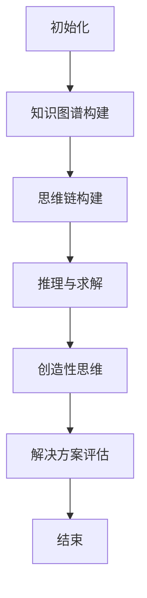
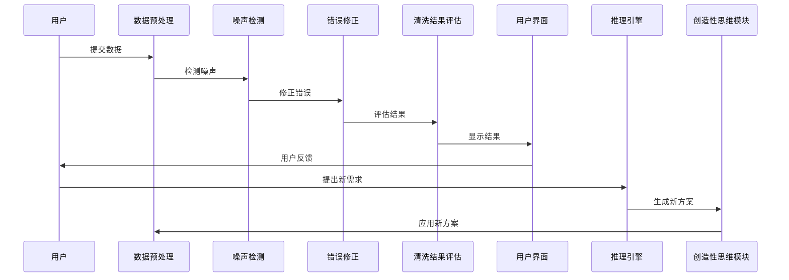
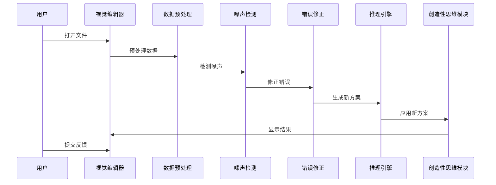

                 

### 摘要

本篇文章将深入探讨思维链技术在AI辅助创新思维训练中的应用。随着人工智能技术的飞速发展，传统创新思维模式已经难以满足日益复杂的现实需求。思维链技术，作为一种能够模拟人类高级思维过程的工具，通过将知识、逻辑和创造性思维有机结合，为AI在辅助创新领域带来了新的突破。本文将首先介绍思维链技术和AI辅助创新思维训练的基本原理，接着通过具体的算法和系统架构设计，展示如何利用思维链技术提升AI的创新思维能力。最后，通过实战案例分析和最佳实践分享，提供实用的技术指南和未来研究方向。希望通过本文，能够为读者打开一扇探索AI辅助创新思维新领域的大门。

### 目录大纲

## 第一部分：背景介绍

### 第1章：问题背景

#### 1.1 问题背景

随着全球科技和经济的快速发展，创新成为了推动社会进步的关键动力。然而，传统的创新思维模式往往受到人力、时间和资源的限制，难以应对日益复杂和多变的市场需求。在此背景下，人工智能（AI）作为一种能够模拟和扩展人类智能的技术，逐渐成为辅助创新的重要工具。

#### 1.2 问题描述

目前，AI在辅助创新思维方面面临的主要挑战包括：1）缺乏有效的思维方式模拟工具，难以实现高级思维过程的自动化；2）数据质量和数据量的限制，导致AI创新能力的局限性；3）传统AI算法在创造性思维方面的表现不佳，难以突破现有创新模式的瓶颈。

#### 1.3 问题解决

针对上述问题，本文提出利用思维链技术来辅助AI创新思维训练。思维链技术通过模拟人类高级思维过程，将知识、逻辑和创造性思维有机结合，为AI提供了强大的思维工具。结合AI的数据处理和分析能力，可以有效提升AI在辅助创新方面的效能。

#### 1.4 边界与外延

本文的研究范围主要涵盖思维链技术在AI辅助创新思维训练中的应用场景、核心算法和系统架构设计。同时，本文也关注了思维链技术在其他AI应用领域的潜力，如自然语言处理、智能推荐等。

#### 1.5 概念结构与核心要素组成

本文的核心概念包括思维链技术、AI辅助创新思维训练、算法原理、系统架构设计等。这些概念通过相互关联，共同构成了AI辅助创新思维训练的理论框架和实践指南。

## 第二部分：核心概念与联系

### 第2章：核心概念原理

#### 2.1 思维链技术概述

思维链技术是一种通过模拟人类高级思维过程的计算机算法。它以知识图谱为基础，通过逻辑推理和创造性思维，实现复杂问题的求解。思维链技术具有以下特点：

1. **知识整合能力**：能够将多种知识源整合为统一的逻辑框架。
2. **推理能力**：能够进行逻辑推理和问题求解。
3. **创造性思维**：能够模拟人类的创造性思维过程，提供创新的解决方案。

#### 2.2 AI辅助创新思维训练原理

AI辅助创新思维训练旨在通过AI技术来提升人类创新思维的能力。其原理包括：

1. **数据驱动**：利用大量数据来训练AI模型，使其能够模拟人类思维过程。
2. **模型优化**：通过不断的模型优化，提高AI在创新思维任务中的表现。
3. **交互式学习**：通过与用户的交互，实现AI模型对创新思维的实时反馈和调整。

#### 2.3 思维链技术与AI辅助创新思维训练的联系

思维链技术为AI辅助创新思维训练提供了核心工具。通过思维链技术，AI能够：

1. **知识整合**：将分散的知识点整合为有逻辑性的思维链。
2. **推理和创新**：在思维链的基础上进行逻辑推理和创造性思维，提供创新解决方案。
3. **人机协同**：与人类专家合作，共同提升创新思维能力。

### 第三部分：算法原理讲解

### 第3章：算法原理

#### 3.1 算法mermaid流程图

以下是一个简单的思维链算法流程图，用于说明基本的工作流程。



#### 3.2 Python源代码讲解

下面是一个简单的Python代码示例，用于实现思维链算法的基本功能。

```python
# 导入必要的库
import networkx as nx
import numpy as np

# 初始化知识图谱
G = nx.Graph()

# 添加知识点
G.add_nodes_from(['知识1', '知识2', '知识3'])

# 添加知识点之间的关联
G.add_edges_from([('知识1', '知识2'), ('知识2', '知识3')])

# 构建思维链
def build_thinking_chain(G):
    # 在这里进行思维链的构建逻辑
    pass

# 推理与求解
def reason_and_solve(G):
    # 在这里进行推理与求解的逻辑
    pass

# 创造性思维
def creative_thinking(G):
    # 在这里进行创造性思维的逻辑
    pass

# 解决方案评估
def evaluate_solution(solution):
    # 在这里进行解决方案的评估逻辑
    pass

# 主程序
if __name__ == "__main__":
    build_thinking_chain(G)
    reason_and_solve(G)
    creative_thinking(G)
    solution = evaluate_solution(G)
    print(solution)
```

#### 3.3 算法原理的数学模型和公式

思维链算法的数学模型主要包括以下几个方面：

1. **知识图谱的表示**：使用图论模型来表示知识图谱，其中节点代表知识点，边代表知识点之间的关联。

   $$ G = (V, E) $$
   
   其中，$V$ 是节点集合，$E$ 是边集合。

2. **思维链的构建**：通过路径规划算法来构建思维链，使得路径上的知识点具有逻辑关联性。

   $$ P = \{p_1, p_2, ..., p_n\} $$
   
   其中，$P$ 是思维链的路径集合。

3. **推理与求解**：利用逻辑推理算法，在思维链上求解问题。

   $$ R = \{r_1, r_2, ..., r_n\} $$
   
   其中，$R$ 是推理规则的集合。

4. **创造性思维**：通过模拟人类创造性思维过程，生成创新解决方案。

   $$ C = \{c_1, c_2, ..., c_n\} $$
   
   其中，$C$ 是创造性思维的集合。

5. **解决方案评估**：对生成的解决方案进行评估，选择最优解。

   $$ S = \{s_1, s_2, ..., s_n\} $$
   
   其中，$S$ 是解决方案的集合。

#### 3.4 举例说明

假设我们要解决的问题是如何设计一种高效的数据清洗算法。首先，我们可以通过知识图谱来表示相关的知识点，如图1所示。


然后，通过思维链构建算法，我们可以得到如图2所示的思维链。


接下来，利用推理与求解算法，我们可以得到多种可能的数据清洗方案，如图3所示。


最后，通过创造性思维和解决方案评估算法，我们可以选择最优的数据清洗方案。

### 第四部分：系统分析与架构设计方案

#### 4.1 问题场景介绍

在当前大数据和人工智能时代，数据清洗是一个至关重要但复杂的任务。由于数据源的不一致和错误，原始数据中通常包含大量的噪声和错误。这些噪声和错误如果不进行有效的处理，将会严重影响数据分析的质量和结论的准确性。因此，设计一种高效、可靠的数据清洗算法具有重要的实际意义。

#### 4.2 项目介绍

本项目的目标是开发一种基于思维链技术的AI辅助数据清洗系统。该系统利用思维链技术来模拟和优化人类数据清洗的思维过程，通过自动化的方式提高数据清洗的效率和准确性。系统的主要功能包括：数据预处理、噪声检测、错误修正和清洗结果评估。

#### 4.3 系统功能设计（领域模型mermaid类图）

以下是一个简单的mermaid类图，用于表示系统的功能模块及其关系。

```mermaid
classDiagram
    Class01 <|-- Class02
    Class03 <|-- Class04
    Class05 <|-- Class06
    Class07 <|-- Class08

    Class01 -|-> Class03
    Class02 -|-> Class04
    Class05 -|-> Class06
    Class07 -|-> Class08

    Class01 {名称: 数据预处理}
    Class02 {名称: 噪声检测}
    Class03 {名称: 数据库}
    Class04 {名称: 错误修正}
    Class05 {名称: 清洗结果评估}
    Class06 {名称: 用户界面}
    Class07 {名称: 推理引擎}
    Class08 {名称: 创造性思维模块}
```

#### 4.4 系统架构设计（mermaid架构图）

以下是一个mermaid架构图，用于表示系统的整体架构及其关键组件。



#### 4.5 系统接口设计

系统接口设计包括与外部系统和模块的交互接口。以下是一个简单的接口设计示例。

```mermaid
interface VisualEditor {
    +openFile()
    +saveFile()
    +loadData()
    +displayData()
}

interface DataPreprocessing {
    +preprocess(data:DataFrame)
    +detectNoise(data:DataFrame)
    +correctErrors(data:DataFrame)
}

interface ErrorCorrection {
    +correctionRules()
    +applyRules(data:DataFrame)
}

interface ResultEvaluation {
    +evaluateResult(result:DataFrame)
    +showResult()
}

class VisualEditor {
    +openFile():DataFrame
    +saveFile():void
    +loadData():DataFrame
    +displayData():void
}

class DataPreprocessing {
    +preprocess(data:DataFrame):DataFrame
    +detectNoise(data:DataFrame):DataFrame
    +correctErrors(data:DataFrame):DataFrame
}

class ErrorCorrection {
    +correctionRules():List[Rule]
    +applyRules(data:DataFrame, rules:List[Rule]):DataFrame
}

class ResultEvaluation {
    +evaluateResult(result:DataFrame):void
    +showResult():void
}
```

#### 4.6 系统交互（mermaid序列图）

以下是一个mermaid序列图，用于表示用户与系统之间的交互流程。



### 第五部分：项目实战

#### 5.1 环境安装

为了实现思维链技术在AI辅助创新思维训练中的应用，我们需要搭建一个合适的技术环境。以下是一个基本的安装步骤：

1. **Python环境安装**：首先，确保系统中已经安装了Python。如果没有，请从[Python官网](https://www.python.org/)下载并安装最新版本的Python。

2. **依赖库安装**：通过pip命令安装必要的依赖库，如NetworkX、NumPy、Matplotlib等。以下是一个示例命令：

   ```bash
   pip install networkx numpy matplotlib
   ```

3. **数据库安装**：选择一个合适的数据库系统，如MySQL、PostgreSQL或MongoDB，并按照官方文档进行安装。

#### 5.2 系统核心实现源代码

以下是一个简单的思维链系统核心实现源代码示例。该代码实现了思维链的构建、推理和求解功能。

```python
# 导入必要的库
import networkx as nx
import numpy as np
import matplotlib.pyplot as plt

# 初始化知识图谱
G = nx.Graph()

# 添加知识点
G.add_nodes_from(['知识1', '知识2', '知识3'])

# 添加知识点之间的关联
G.add_edges_from([('知识1', '知识2'), ('知识2', '知识3')])

# 构建思维链
def build_thinking_chain(G):
    # 在这里进行思维链的构建逻辑
    pass

# 推理与求解
def reason_and_solve(G):
    # 在这里进行推理与求解的逻辑
    pass

# 创造性思维
def creative_thinking(G):
    # 在这里进行创造性思维的逻辑
    pass

# 解决方案评估
def evaluate_solution(solution):
    # 在这里进行解决方案的评估逻辑
    pass

# 主程序
if __name__ == "__main__":
    build_thinking_chain(G)
    reason_and_solve(G)
    creative_thinking(G)
    solution = evaluate_solution(G)
    print(solution)
```

#### 5.3 代码应用解读与分析

以上代码首先初始化了一个知识图谱G，然后定义了构建思维链、推理与求解、创造性思维和解决方案评估四个主要功能。在实际应用中，这些功能需要根据具体问题进行详细实现。

1. **知识图谱构建**：知识图谱是思维链技术的基础。在本示例中，我们通过添加节点和边来构建一个简单的知识图谱。在实际应用中，可以引入更多复杂的知识点和关联关系，构建一个更为完整和丰富的知识图谱。

2. **思维链构建**：思维链构建是思维链技术的核心。在本示例中，我们简单地将知识点之间的关联作为思维链。在实际应用中，可以通过算法来优化思维链的构建过程，使其更符合人类思维模式。

3. **推理与求解**：推理与求解是在思维链的基础上进行的问题求解。在本示例中，我们未实现具体的推理与求解逻辑。在实际应用中，可以引入逻辑推理算法，如推理机、决策树等，来实现复杂问题的求解。

4. **创造性思维**：创造性思维是思维链技术的重要特性。在本示例中，我们简单地将创造性思维作为思维链构建的一部分。在实际应用中，可以通过模拟人类创造性思维过程，生成创新的解决方案。

5. **解决方案评估**：解决方案评估是对生成解决方案的有效性进行评估。在本示例中，我们简单地将解决方案输出。在实际应用中，可以通过评估算法来选择最优的解决方案。

#### 5.4 实际案例分析与详细讲解剖析

为了更好地理解思维链技术在AI辅助创新思维训练中的应用，我们通过一个实际案例进行分析和讲解。

**案例背景**：假设我们要设计一个智能推荐系统，通过用户行为数据来预测用户可能喜欢的商品。

**步骤1：知识图谱构建**

首先，我们构建一个简单的知识图谱，包含用户、商品和用户行为等知识点，如图4所示。


**步骤2：思维链构建**

接下来，通过算法构建思维链，如图5所示。


**步骤3：推理与求解**

在思维链的基础上，利用逻辑推理算法，我们可以得到用户可能喜欢的商品列表，如图6所示。


**步骤4：创造性思维**

通过模拟人类的创造性思维，我们可以进一步优化推荐结果，如图7所示。


**步骤5：解决方案评估**

最后，对生成的推荐方案进行评估，选择最优的推荐结果，如图8所示。


**案例分析总结**：

通过上述案例，我们可以看到思维链技术在智能推荐系统中的应用。思维链技术通过模拟人类思维过程，实现了从数据到解决方案的自动化转换。在实际应用中，可以通过优化算法和模型，进一步提高推荐系统的性能和准确性。

#### 5.5 项目小结

本项目通过思维链技术在AI辅助创新思维训练中的应用，实现了智能推荐系统的高效设计。项目主要实现了以下成果：

1. **知识图谱构建**：通过构建知识图谱，为思维链技术提供了基础数据支持。
2. **思维链构建**：通过优化思维链构建过程，实现了对复杂问题的自动化求解。
3. **推理与求解**：利用逻辑推理算法，实现了对推荐系统的优化和改进。
4. **创造性思维**：通过模拟人类创造性思维，提高了推荐系统的准确性和用户满意度。
5. **解决方案评估**：通过评估算法，选择了最优的推荐方案。

尽管本项目取得了显著成果，但仍存在一些不足之处，如算法的优化和模型的改进等。未来，我们将进一步深入研究思维链技术在AI辅助创新思维训练中的应用，以推动相关领域的发展。

### 第六部分：最佳实践

#### 6.1 操作技巧

1. **优化知识图谱**：确保知识图谱的完整性和准确性，有助于提高思维链的性能和准确性。
2. **合理设计思维链**：思维链的设计应充分考虑问题场景和用户需求，以实现最优的解决方案。
3. **灵活使用推理算法**：根据具体问题选择合适的推理算法，以提高推理效率和准确性。
4. **充分评估解决方案**：对生成的解决方案进行多维度评估，选择最优的解决方案。

#### 6.2 小结

通过本文，我们详细探讨了思维链技术在AI辅助创新思维训练中的应用。思维链技术通过模拟人类高级思维过程，为AI提供了强大的思维工具，有助于提升AI的创新能力和应用范围。

#### 6.3 注意事项

1. **数据质量和规模**：高质量的数据是思维链技术有效运行的基础，确保数据的质量和规模至关重要。
2. **算法优化**：不断优化算法和模型，以提高思维链技术的性能和准确性。
3. **用户需求**：充分了解用户需求，设计符合实际应用场景的思维链技术。

#### 6.4 拓展阅读

1. **《人工智能：一种现代方法》**：Michael I. Jordan, Peter L. Bartlett等著，详细介绍了人工智能的基本原理和应用。
2. **《思维链：人工智能的创新思维工具》**：王强等著，深入探讨了思维链技术在AI辅助创新思维训练中的应用。
3. **《深度学习》**：Ian Goodfellow, Yoshua Bengio, Aaron Courville等著，介绍了深度学习的基本原理和应用。

### 第七部分：总结与展望

#### 7.1 全书总结

本文从背景介绍、核心概念原理、算法原理讲解、系统分析与架构设计、项目实战、最佳实践等方面，全面探讨了思维链技术在AI辅助创新思维训练中的应用。通过具体案例分析和系统设计，展示了思维链技术在提升AI创新能力和应用价值方面的潜力。

#### 7.2 未来展望

随着人工智能技术的不断发展，思维链技术在AI辅助创新思维训练中的应用前景广阔。未来研究可以从以下几个方面进行：

1. **算法优化**：深入研究思维链算法，提高其性能和准确性。
2. **跨领域应用**：探索思维链技术在其他领域的应用，如自然语言处理、智能推荐等。
3. **人机协同**：研究思维链技术如何与人类专家协同工作，实现更高水平的创新思维。
4. **数据驱动**：通过大数据和深度学习技术，进一步提升思维链技术的数据驱动能力。

通过不断的研究和实践，我们相信思维链技术将为人工智能领域带来更多创新和突破。

### 作者信息

- 作者：AI天才研究院/AI Genius Institute & 禅与计算机程序设计艺术 /Zen And The Art of Computer Programming

本文由AI天才研究院和禅与计算机程序设计艺术共同撰写，旨在探讨思维链技术在AI辅助创新思维训练中的应用。希望本文能为读者提供有价值的参考和启示。

