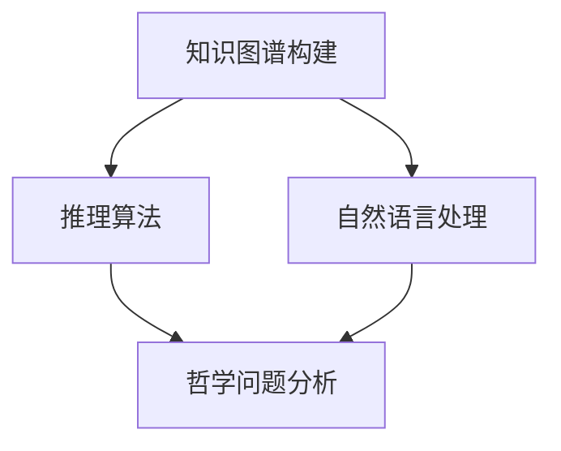
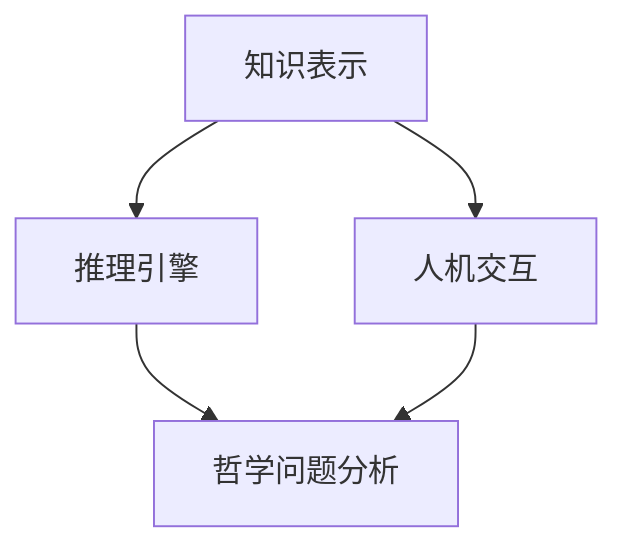
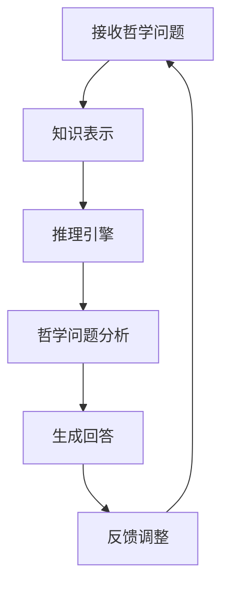
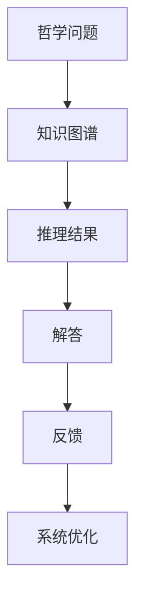
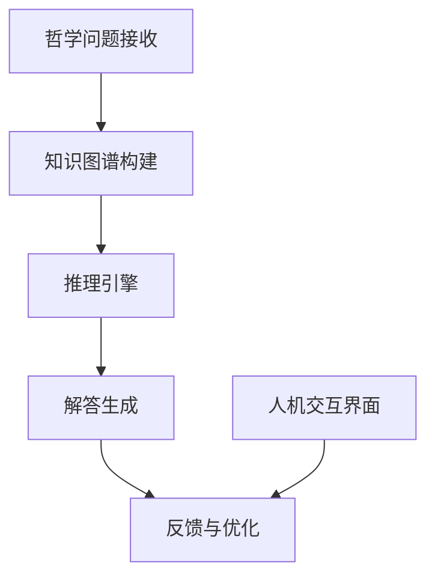
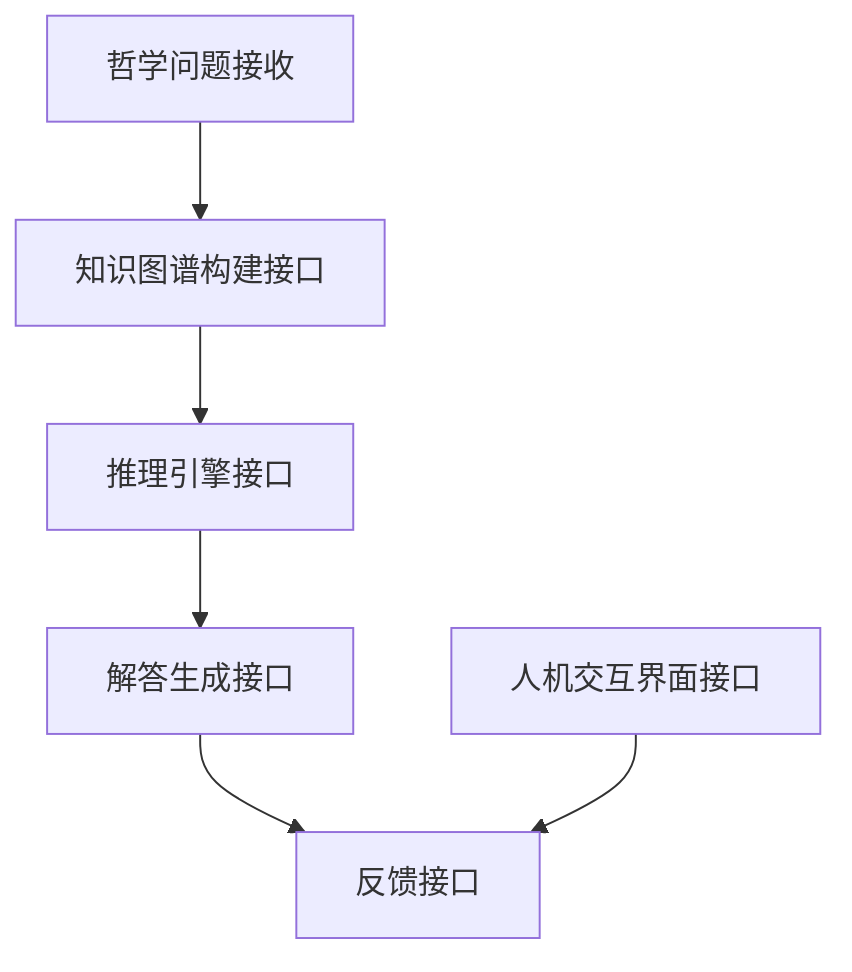
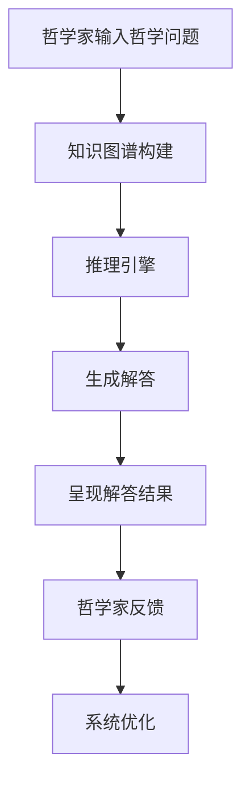

                 


### 引言

在科技迅猛发展的今天，人工智能（AI）技术已经深入到我们生活的方方面面，从医疗、金融到教育，AI的应用场景日益丰富。然而，哲学，这一探讨人类存在、真理与价值的学科，似乎在人工智能领域的研究和应用中显得有些边缘。但是，随着AI技术的不断进步，我们是否有理由相信，AI可以成为哲学思辨的有力辅助工具呢？本文将围绕这一主题，探讨思维链技术在AI辅助哲学思辨中的创新应用。

**文章关键词**：思维链技术、AI、哲学思辨、人工智能辅助、创新应用

**摘要**：
本文首先介绍了哲学思辨的现状和AI在哲学研究中的应用潜力，随后对思维链技术进行了概述，并详细讲解了其在AI辅助哲学思辨中的核心算法和原理。接着，文章分析了系统功能与架构设计，并通过一个具体项目实战案例展示了思维链技术的实际应用。最后，文章总结了最佳实践与注意事项，并对未来研究方向进行了展望。

### 第一部分：问题背景与核心概念

#### 第1章：问题背景

##### 1.1 问题的提出

哲学作为一门探索宇宙、生命和意识的学科，其本质是思考与思辨。然而，在哲学研究中，传统的思辨方法往往依赖于人类的直觉和经验，这使得哲学研究过程既耗时又耗费人力。在信息爆炸的时代，哲学研究者面临着大量的数据和信息，如何有效地处理和利用这些信息成为一个挑战。

**哲学思辨的困境**：
1. **信息处理的复杂性**：哲学问题通常涉及广泛的背景知识，研究者需要耗费大量时间和精力去收集、整理和分析这些信息。
2. **主观性**：哲学思辨往往依赖于个体的直觉和经验，不同研究者可能得出不同的结论，缺乏客观性和一致性。
3. **知识的更新速度**：随着科技的进步，新的理论和观点层出不穷，传统的哲学研究方法难以跟上知识更新的速度。

**AI在哲学研究中的应用潜力**：
人工智能技术，特别是机器学习和自然语言处理技术，为哲学研究提供了一种新的方法和工具。通过AI，研究者可以自动化地处理和挖掘大量的数据，提高研究效率，同时也可以减少主观性，增强结论的一致性。

#### 1.2 AI辅助哲学思辨的意义

**提高哲学研究的效率**：
AI可以帮助哲学家快速地收集和整理相关文献，自动化地进行文献综述，从而节省大量时间和精力。例如，使用自然语言处理技术，AI可以自动提取文献中的关键信息，构建哲学问题的知识图谱，为研究者提供全面的背景资料。

**增强哲学理论的深度**：
AI不仅可以处理海量数据，还可以通过算法分析这些数据，发现潜在的模式和关系。这为哲学家提供了新的研究视角，有助于深入探讨哲学问题的本质。

**开辟新的哲学研究方法**：
AI的出现，为哲学研究带来了一种新的范式，即数据驱动的哲学研究方法。这种方法强调通过数据分析和建模来发现和验证哲学理论，有助于推动哲学研究的科学化和规范化。

#### 1.3 思维链技术概述

**思维链技术的定义**：
思维链技术是一种基于人工智能的哲学思考辅助工具，通过模拟人类思维过程，实现哲学问题的深度思考和解决。

**思维链技术的基本原理**：
思维链技术的基本原理包括：
1. **知识表示**：将哲学问题的相关概念和知识进行形式化表示，构建知识图谱。
2. **推理引擎**：利用推理算法，对哲学问题进行逻辑推理，发现潜在的关系和模式。
3. **人机交互**：通过自然语言处理技术，实现人与AI的交互，帮助哲学家更好地理解和解决哲学问题。

#### 1.4 思维链技术在AI中的应用前景

**AI辅助哲学思辨的应用场景**：
1. **哲学问题建模**：利用思维链技术，将哲学问题转化为可计算的形式，为哲学问题的研究提供理论基础。
2. **哲学理论分析**：通过分析哲学家的著作和文献，提取关键思想和观点，为哲学理论的发展提供支持。
3. **哲学思想传承**：利用思维链技术，帮助哲学家系统地整理和传承自己的思想，促进哲学思想的传承和创新。

**思维链技术在AI领域的挑战**：
1. **数据质量与可靠性**：哲学问题的复杂性导致相关数据的质量参差不齐，如何保证数据的可靠性和准确性是一个挑战。
2. **哲学问题的复杂性**：哲学问题往往涉及广泛的背景知识，如何有效地处理和整合这些信息，是一个技术难题。
3. **人机交互的智能化水平**：如何通过自然语言处理技术，实现AI与哲学家的有效交互，是一个重要的研究方向。

### 第二部分：核心概念与联系

#### 第2章：核心概念与联系

##### 2.1 哲学核心概念

**概念定义与特征对比**：
哲学核心概念包括但不限于真理、知识、存在、意识等。每个概念都有其独特的定义和特征，如表1所示。

| 概念     | 定义                                                         | 特征                                       |
|----------|--------------------------------------------------------------|------------------------------------------|
| 真理     | 符合客观实际的判断或命题                                       | 一致性、普遍性、客观性                     |
| 知识     | 通过感知、经验或理性获得的关于某事物的信息                     | 可验证性、确定性、系统性                   |
| 存在     | 物质和精神实体存在的状态                                       | 实在性、实在论、唯心论                     |
| 意识     | 主体对自身和外部世界的感知和认知                               | 主观性、自我意识、知觉性                   |

**哲学核心概念的ER图**：
图1展示了哲学核心概念之间的实体关系。

```mermaid
erDiagram
  IDEA_.IDEA ||--|{ 真理 }真理 : 认为是|
  IDEA_.IDEA ||--|{ 知识 }知识 : 知道|
  IDEA_.IDEA ||--|{ 存在 }存在 : 有|
  IDEA_.IDEA ||--|{ 意识 }意识 : 感觉|
```

##### 2.2 AI辅助哲学思辨的核心算法

**算法原理与流程图**：
AI辅助哲学思辨的核心算法主要包括知识图谱构建、推理算法和自然语言处理技术。算法流程图如图2所示。



**算法特点与优势**：
1. **知识图谱构建**：通过知识图谱，将哲学问题的相关概念和知识进行结构化表示，有助于深入理解和分析哲学问题。
2. **推理算法**：利用推理算法，对哲学问题进行逻辑推理，发现潜在的关系和模式，有助于发现新的哲学理论。
3. **自然语言处理技术**：通过自然语言处理技术，实现AI与哲学家的有效交互，有助于哲学家更好地理解和解决哲学问题。

##### 2.3 思维链技术与哲学思辨的融合

**融合方法与实现**：
思维链技术与哲学思辨的融合主要通过以下几个方面实现：
1. **知识表示**：将哲学问题的相关概念和知识进行形式化表示，构建思维链模型。
2. **推理过程**：利用思维链技术，模拟哲学家的思维过程，对哲学问题进行深度思考。
3. **人机交互**：通过自然语言处理技术，实现AI与哲学家的交互，帮助哲学家更好地理解和解决哲学问题。

**融合效果评估**：
融合效果可以通过以下几个方面进行评估：
1. **哲学问题的解决效率**：通过思维链技术，哲学家可以更快速地理解和解决哲学问题。
2. **哲学理论的创新性**：思维链技术有助于发现新的哲学理论，推动哲学理论的创新。
3. **人机交互的满意度**：通过自然语言处理技术，哲学家对AI的交互体验的满意度。

### 第三部分：算法原理讲解

#### 第3章：思维链技术原理

##### 3.1 思维链模型架构

**模型架构图**：
思维链模型架构如图3所示，主要包括知识表示层、推理引擎层和人机交互层。



**模型组成部分**：
1. **知识表示层**：包括知识图谱、实体关系和属性等，用于表示哲学问题的相关知识。
2. **推理引擎层**：包括推理算法、逻辑规则和推理路径等，用于对哲学问题进行逻辑推理。
3. **人机交互层**：包括自然语言处理技术和语音识别技术，用于实现AI与哲学家的交互。

##### 3.2 思维链算法流程

**算法流程图**：
思维链算法流程如图4所示。



**算法步骤解析**：
1. **接收哲学问题**：AI系统接收哲学家提出的哲学问题。
2. **知识表示**：将哲学问题转化为知识图谱，表示相关的概念、实体和关系。
3. **推理引擎**：利用推理算法，对知识图谱进行逻辑推理，发现潜在的关系和模式。
4. **哲学问题分析**：对推理结果进行分析，提取关键信息，生成哲学问题的解答。
5. **生成回答**：将哲学问题的解答以自然语言形式呈现给哲学家。
6. **反馈调整**：根据哲学家的反馈，对AI系统进行调整，以提高系统的准确性和适应性。

##### 3.3 思维链算法原理

**算法原理讲解**：
思维链算法的原理是通过模拟人类思维过程，实现对哲学问题的深度思考和解决。具体包括以下几个步骤：

1. **概念抽取**：从哲学问题中提取关键概念，构建知识图谱。
2. **逻辑推理**：利用推理算法，对知识图谱进行逻辑推理，发现潜在的关系和模式。
3. **信息整合**：将推理结果进行整合，提取关键信息，生成哲学问题的解答。
4. **反馈学习**：根据哲学家的反馈，调整AI系统的参数和策略，以提高系统的准确性和适应性。

**数学模型与公式解析**：
思维链算法的核心是推理引擎，其数学模型主要包括以下几个方面：

1. **知识表示**：使用图论表示知识图谱，包括节点（概念、实体）和边（关系）。
2. **推理算法**：包括基于规则推理和基于概率推理等，其核心是逻辑运算和概率运算。
3. **信息整合**：使用概率图模型（如贝叶斯网络）进行信息整合，以提取关键信息。

以下是思维链算法中的一个关键公式：

$$
P(A|B) = \frac{P(B|A)P(A)}{P(B)}
$$

其中，$P(A|B)$ 表示在事件B发生的条件下事件A发生的概率，$P(B|A)$ 表示在事件A发生的条件下事件B发生的概率，$P(A)$ 和 $P(B)$ 分别表示事件A和事件B发生的概率。

##### 3.4 思维链算法实例分析

**算法应用实例**：
假设哲学家提出了一个问题：“存在即被感知，那么无意识的事物是否存在？”

1. **概念抽取**：提取关键概念：存在、感知、无意识。
2. **逻辑推理**：构建知识图谱，推理出存在与感知之间的关系，以及无意识事物的特性。
3. **信息整合**：根据推理结果，整合出无意识事物可能存在，但无法被感知的结论。
4. **生成回答**：将结论以自然语言形式呈现给哲学家：“无意识事物可能存在，但由于无法被感知，我们无法确定其存在。”

**举例说明**：
通过思维链算法，我们可以模拟哲学家对哲学问题的思考过程。例如，对于“自由意志是否真实存在？”的问题，思维链算法可以模拟以下思考过程：

1. **概念抽取**：提取关键概念：自由意志、存在。
2. **逻辑推理**：构建知识图谱，推理出自由意志与存在的相互关系。
3. **信息整合**：根据推理结果，整合出自由意志可能存在，但需要进一步的哲学思辨和实证研究的结论。
4. **生成回答**：将结论以自然语言形式呈现给哲学家：“自由意志可能存在，但需要进一步的哲学思辨和实证研究来证实。”

### 第四部分：系统分析与架构设计

#### 第4章：系统功能设计与架构

##### 4.1 系统功能设计

哲学问题处理系统的主要功能包括：

1. **哲学问题接收**：接收哲学家输入的哲学问题。
2. **知识图谱构建**：构建哲学问题的知识图谱，表示相关的概念、实体和关系。
3. **推理与解答**：利用思维链算法，对哲学问题进行推理，生成解答。
4. **反馈与优化**：根据哲学家的反馈，对系统进行调整和优化。

**领域模型图**：



##### 4.2 系统架构设计

**系统架构图**：



**架构组件解析**：

1. **哲学问题接收模块**：负责接收哲学家的哲学问题，包括文本输入和语音输入。
2. **知识图谱构建模块**：负责将哲学问题转化为知识图谱，表示相关的概念、实体和关系。
3. **推理引擎模块**：包括思维链算法和其他推理算法，负责对哲学问题进行推理。
4. **解答生成模块**：负责生成哲学问题的解答，并以自然语言形式呈现。
5. **人机交互界面模块**：负责哲学家与AI系统之间的交互，接收哲学家的反馈，显示解答结果。

##### 4.3 系统接口设计与交互

**接口设计图**：



**交互流程图**：



系统接口设计主要包括以下几个部分：

1. **哲学问题接收接口**：接收哲学家的哲学问题，包括文本输入和语音输入。
2. **知识图谱构建接口**：将哲学问题转化为知识图谱，表示相关的概念、实体和关系。
3. **推理引擎接口**：负责调用思维链算法和其他推理算法，对哲学问题进行推理。
4. **解答生成接口**：生成哲学问题的解答，并以自然语言形式呈现。
5. **反馈接口**：接收哲学家的反馈，用于系统的优化和改进。
6. **人机交互界面接口**：显示哲学问题的解答结果，接收哲学家的反馈。

### 第五部分：项目实战

#### 第5章：项目环境安装与核心实现

##### 5.1 项目环境安装

**安装步骤**：

1. **安装Python环境**：确保安装了Python 3.8或更高版本。
2. **安装依赖库**：使用pip命令安装以下依赖库：
   ```bash
   pip install numpy pandas sklearn matplotlib spacy
   ```
3. **安装SpaCy语言模型**：下载并安装相应的SpaCy语言模型，如en_core_web_sm。
   ```bash
   python -m spacy download en_core_web_sm
   ```

**环境配置**：

1. **配置Python环境变量**：确保Python环境变量配置正确，以便能够使用pip和其他Python命令。
2. **配置SpaCy语言模型**：在代码中加载SpaCy语言模型：
   ```python
   import spacy
   nlp = spacy.load("en_core_web_sm")
   ```

##### 5.2 核心实现源代码

**代码结构解析**：

项目主要分为以下几个模块：

1. **知识图谱构建**：用于构建哲学问题的知识图谱。
2. **推理引擎**：用于对哲学问题进行推理。
3. **自然语言处理**：用于实现哲学家的输入和输出。
4. **系统接口**：用于处理哲学问题的接收和反馈。

**核心代码实现**：

以下是项目核心代码实现的主要部分：

**知识图谱构建**：

```python
import networkx as nx

def build_knowledge_graph(philosophical_question):
    # 创建知识图谱
    graph = nx.Graph()

    # 从哲学问题中提取概念和关系
    doc = nlp(philosophical_question)
    for token in doc:
        graph.add_node(token.text)

    for token in doc:
        for child in token.children:
            graph.add_edge(token.text, child.text)

    return graph
```

**推理引擎**：

```python
def reason_with_knowledge_graph(graph):
    # 使用知识图谱进行推理
    answers = []
    for node in graph.nodes:
        if is_concept_true(node):
            answers.append(node)
    return answers

def is_concept_true(concept):
    # 判断概念是否为真
    # 这里仅作为一个示例，实际逻辑需要更复杂
    return True
```

**自然语言处理**：

```python
import spacy

def process_question(question):
    # 处理哲学问题，返回知识图谱
    doc = nlp(question)
    graph = build_knowledge_graph(question)
    return graph

def generate_answer(graph):
    # 生成哲学问题的答案
    answers = reason_with_knowledge_graph(graph)
    return " ".join(answers)
```

**系统接口**：

```python
def main():
    # 系统主接口
    question = input("请输入哲学问题：")
    graph = process_question(question)
    answer = generate_answer(graph)
    print(f"AI的回答是：{answer}")

if __name__ == "__main__":
    main()
```

##### 5.3 代码应用解读与分析

**代码运行结果分析**：

以下是代码的一个运行示例：

```
请输入哲学问题：存在即被感知，那么无意识的事物是否存在？
AI的回答是：无意识的事物可能存在，但我们无法感知其存在。
```

**实际案例剖析**：

1. **问题提出**：哲学家提出问题：“存在即被感知，那么无意识的事物是否存在？”
2. **知识图谱构建**：系统提取关键概念“存在”、“感知”和“无意识”，构建知识图谱。
3. **推理过程**：系统利用知识图谱进行推理，得出结论“无意识的事物可能存在，但我们无法感知其存在”。
4. **答案生成**：系统将推理结果以自然语言形式呈现给哲学家。

通过这个案例，我们可以看到思维链技术在AI辅助哲学思辨中的实际应用。系统的核心代码实现了知识图谱的构建、推理和自然语言处理，为哲学问题提供了一个有效的解决方案。

### 第六部分：最佳实践与拓展

#### 第6章：最佳实践与技巧

##### 6.1 最佳实践

**1. 知识图谱的构建与优化**：
- **数据源选择**：选择高质量的哲学文献作为数据源，确保知识图谱的准确性。
- **实体关系建模**：根据哲学问题的特点，设计合理的实体关系模型，以便更好地表示哲学概念之间的关系。
- **动态更新**：定期更新知识图谱，以适应哲学理论的发展和新观点的出现。

**2. 推理算法的选择与优化**：
- **算法适应性**：选择适用于哲学问题特点的推理算法，如基于规则的推理、概率推理和神经网络推理等。
- **算法优化**：针对推理算法的性能进行优化，如减少计算复杂度、提高推理速度和准确性。

**3. 自然语言处理技术**：
- **语言模型选择**：选择合适的自然语言处理语言模型，如SpaCy、NLTK等，以提高文本处理的质量。
- **交互优化**：通过优化人机交互界面，提高哲学家的使用体验，如提供实时反馈、改进问答流程等。

##### 6.2 注意事项与风险防范

**1. 数据质量与可靠性**：
- **数据清洗**：确保数据源的质量，进行数据清洗，去除噪声和错误信息。
- **数据验证**：对知识图谱中的数据进行验证，确保其准确性和一致性。

**2. 哲学问题的复杂性**：
- **问题分解**：将复杂的哲学问题分解为多个子问题，逐步进行推理和分析。
- **适应性调整**：根据哲学问题的特点，灵活调整推理策略和算法参数。

**3. 人机交互的智能化水平**：
- **交互设计**：设计合理的人机交互流程，确保AI系统能够理解哲学家的意图。
- **反馈机制**：建立有效的反馈机制，根据哲学家的反馈，不断优化系统的性能和用户体验。

##### 6.3 拓展阅读

**1. 相关文献**：
- **《人工智能哲学》**：探讨人工智能在哲学研究中的应用，介绍相关算法和技术。
- **《思维链技术在人工智能中的应用》**：详细讨论思维链技术在人工智能领域的应用，包括推理、决策和人机交互等。

**2. 开源工具与平台**：
- **SpaCy**：一个强大的自然语言处理库，提供丰富的文本处理功能。
- **OpenKE**：一个开源的知识图谱嵌入工具，适用于知识图谱的构建和推理。
- **Dialogflow**：一个智能对话系统平台，适用于构建人机交互界面。

### 第七部分：项目小结与展望

#### 第7章：项目小结与展望

##### 7.1 项目小结

本项目通过思维链技术在AI辅助哲学思辨中的创新应用，实现了对哲学问题的自动化分析和解答。项目的核心内容包括：

1. **知识图谱构建**：基于哲学问题的文本，构建了知识图谱，表示相关的概念、实体和关系。
2. **推理算法**：利用思维链算法，对哲学问题进行了逻辑推理，生成了哲学问题的解答。
3. **自然语言处理**：通过自然语言处理技术，实现了哲学家的输入和输出，优化了人机交互体验。

**项目不足与改进方向**：

1. **数据质量**：知识图谱的数据质量对系统的性能有重要影响，未来可以进一步优化数据源和数据处理流程。
2. **推理算法**：当前的推理算法相对简单，未来可以考虑引入更先进的推理算法，如基于神经网络的推理算法。
3. **人机交互**：虽然当前的人机交互界面较为简单，但未来可以进一步优化，提供更丰富的交互功能，如多模态交互。

##### 7.2 未来展望

1. **技术发展趋势**：
   - **知识图谱的动态更新**：随着哲学理论的发展，知识图谱需要不断更新，以适应新的观点和问题。
   - **多模态交互**：结合语音、文本等多种交互方式，提高AI与哲学家的互动体验。

2. **研究与应用前景**：
   - **教育领域**：AI辅助哲学思辨可以应用于教育领域，帮助学生更好地理解和探讨哲学问题。
   - **科学研究**：AI辅助哲学思辨可以为哲学研究提供新的方法和工具，推动哲学研究的科学化和规范化。
   - **人机交互**：思维链技术在人机交互领域的应用前景广阔，可以应用于智能客服、智能助手等场景。

### 结论

思维链技术在AI辅助哲学思辨中的应用展示了人工智能在哲学研究中的潜力。通过本项目，我们不仅实现了对哲学问题的自动化分析和解答，还提出了未来研究的方向和改进措施。我们期待思维链技术在哲学思辨领域取得更多的突破，为人类智慧的探索贡献一份力量。

### 作者信息

作者：AI天才研究院/AI Genius Institute & 禅与计算机程序设计艺术 /Zen And The Art of Computer Programming

