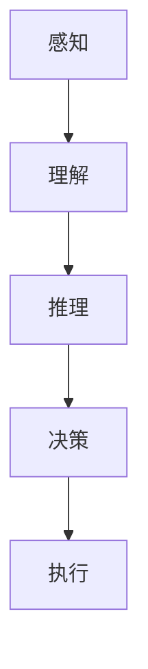

                 

### 文章标题：思维链技术在AI辅助多元宇宙构建中的突破

#### 关键词：思维链技术，多元宇宙，人工智能，算法，系统架构，项目实战

> 摘要：本文深入探讨了思维链技术在AI辅助多元宇宙构建中的应用，通过分析思维链技术的定义、特点及在多元宇宙构建中的潜在作用，进一步探讨了AI辅助多元宇宙构建的理论基础、关键技术与算法。同时，文章通过系统架构设计与项目实战，展示了思维链技术在多元宇宙构建中的实际应用，为未来多元宇宙的构建提供了新的思路和方向。

## 第一部分：思维链技术概述

### 第1章：问题背景与核心概念

#### 1.1.1 多元宇宙构建的挑战

#### 1.1.1.1 传统AI的局限性

在传统的AI技术中，算法通常是在静态数据集上训练得到的，这种“训练-测试”模式在面对动态环境时显得力不从心。传统AI在面对多元宇宙构建这一复杂任务时，存在以下局限性：

1. **数据静态性**：传统AI难以处理动态变化的、多样性的数据，而多元宇宙构建需要处理的是动态变化的虚拟世界。
2. **环境适应性**：传统AI模型在特定环境中表现良好，但面对不同环境时，模型的适应性较差，难以在不同宇宙间迁移和适应。
3. **交互复杂性**：多元宇宙构建不仅涉及到单一宇宙内的互动，还涉及到多个宇宙间的交互和影响，传统AI的交互能力有限。

#### 1.1.1.2 多元宇宙的构想

多元宇宙是一个复杂的概念，它描述了一个由多个相互关联的虚拟世界构成的体系。这些虚拟世界可以是基于不同算法、不同规则构建的，它们可以相互影响和交互，形成一个复杂的生态系统。

1. **自主性**：每个虚拟世界都具有高度的自主性，能够独立运行和发展。
2. **多样性**：多元宇宙中的虚拟世界具有多样性，可以是基于不同算法、不同规则构建的，这为宇宙间的交互提供了丰富的可能性。
3. **交互性**：虚拟世界之间可以通过各种方式相互影响和交互，形成复杂的互动关系。

#### 1.1.1.3 思维链技术在其中的作用

思维链技术是一种模拟人类思维过程的人工智能技术，它通过构建思维链网络，实现对信息的处理、理解、推理和决策。在多元宇宙构建中，思维链技术具有以下作用：

1. **动态适应**：思维链技术能够处理动态变化的、多样性的数据，具有较强的环境适应性。
2. **自主探索**：思维链技术能够模拟人类的探索过程，实现AI在多元宇宙中的自主探索和学习。
3. **智能决策**：思维链技术能够通过对信息的处理和推理，实现AI在多元宇宙中的智能决策。

### 1.1.2 思维链技术定义与特点

#### 1.1.2.1 定义

思维链技术是一种基于人工智能的模拟人类思维过程的技术。它通过构建思维链网络，实现对信息的处理、理解、推理和决策。思维链网络是由多个思维节点组成的，每个思维节点代表一个思考过程，节点之间的关系代表思考的逻辑关系。

#### 1.1.2.2 核心特点

1. **动态性**：思维链技术能够处理动态变化的、多样性的数据，具有较强的环境适应性。
2. **自适应性**：思维链技术能够模拟人类的探索过程，实现AI在多元宇宙中的自主探索和学习。
3. **推理性**：思维链技术能够通过对信息的处理和推理，实现AI在多元宇宙中的智能决策。
4. **灵活性**：思维链技术具有较强的灵活性，能够适应不同的应用场景。

#### 1.1.2.3 与传统AI的区别

1. **处理方式**：传统AI主要基于统计学习，而思维链技术是基于逻辑推理和知识表示的。
2. **应用场景**：传统AI主要应用于静态数据的处理，而思维链技术主要应用于动态环境的处理。
3. **适应能力**：传统AI在特定环境中表现良好，但面对不同环境时，模型的适应性较差，而思维链技术具有较强的适应能力。

### 1.1.3 思维链技术在多元宇宙构建中的应用前景

#### 1.1.3.1 应用领域

思维链技术在多元宇宙构建中具有广泛的应用前景，主要包括：

1. **虚拟现实**：思维链技术可以用于构建复杂的虚拟现实世界，实现用户的沉浸式体验。
2. **智能交互**：思维链技术可以用于构建智能交互系统，实现人与虚拟世界的自然互动。
3. **智能决策**：思维链技术可以用于构建智能决策系统，实现AI在多元宇宙中的智能决策。

#### 1.1.3.2 带来的变革

思维链技术在多元宇宙构建中的应用，将带来以下变革：

1. **交互方式**：从传统的“人-机”交互，转变为“人-宇宙”交互，实现更自然、更智能的交互方式。
2. **应用场景**：从单一的应用场景，扩展到多个宇宙间的复杂应用场景，实现更广泛的应用。
3. **用户体验**：从被动接受信息，转变为主动探索和创造，提升用户的体验和参与度。

#### 1.1.3.3 面临的挑战

思维链技术在多元宇宙构建中面临以下挑战：

1. **数据处理**：多元宇宙构建需要处理大量动态变化的数据，对数据处理能力提出了更高的要求。
2. **模型复杂度**：思维链技术的模型复杂度较高，需要设计高效的算法和优化方法。
3. **应用场景多样化**：多元宇宙构建涉及多个领域，需要针对不同的应用场景进行定制化开发。

## 第2章：AI辅助多元宇宙构建的理论基础

### 2.2 AI技术的演进与多元宇宙构建

#### 2.2.1 人工智能的发展历程

人工智能（AI）作为计算机科学的一个重要分支，其发展历程可以分为几个主要阶段：

1. **初始阶段（1950-1969）**：人工智能的概念被提出，初期的研究主要集中在符号逻辑和问题解决上。
2. **繁荣阶段（1970-1989）**：由于计算机性能的提升和算法的改进，AI研究取得了一系列突破，但随后因为实际应用中的困难，研究进入低潮期。
3. **复兴阶段（1990-2010）**：随着大数据和机器学习的兴起，AI研究重新焕发活力，尤其是在图像识别、语音识别和自然语言处理等领域。
4. **现阶段（2010至今）**：深度学习和强化学习等技术的突破，使得AI在多个领域取得了显著的成果，应用范围不断扩大。

#### 2.2.2 AI技术在多元宇宙构建中的应用

多元宇宙构建需要AI技术在多个方面发挥作用：

1. **智能模拟**：AI可以模拟多元宇宙中的各种智能体，包括人类、动物、机器等，实现宇宙内的智能互动。
2. **环境感知**：AI可以通过传感器和环境数据，实现对多元宇宙中各个虚拟世界的感知和监测。
3. **智能决策**：AI可以根据收集到的信息和智能模拟的结果，做出智能决策，引导虚拟世界的运行和发展。

#### 2.2.3 现有AI技术在多元宇宙构建中的不足

尽管AI技术在多元宇宙构建中具有巨大的潜力，但现有技术仍存在一些不足：

1. **适应性**：现有AI技术主要针对单一环境进行优化，对动态变化的多元宇宙适应能力有限。
2. **交互性**：现有AI技术主要关注单点智能，缺乏多智能体之间的交互能力和协作能力。
3. **可解释性**：现有AI技术往往缺乏可解释性，使得决策过程难以被用户理解和接受。

### 2.3 思维链技术的原理与架构

#### 2.3.1 原理

思维链技术基于模拟人类思维过程的理念，通过构建思维链网络来实现对信息的处理、理解、推理和决策。思维链技术的主要原理包括：

1. **思维节点**：每个思维节点代表一个思考过程，可以是感知、理解、推理或决策等。
2. **思维链**：多个思维节点通过逻辑关系连接起来，形成思维链网络，实现信息的传递和推理。
3. **动态调整**：思维链网络可以根据环境变化和任务需求，动态调整思维节点之间的关系和权重，实现适应性和灵活性。

#### 2.3.2 架构

思维链技术的架构可以分为以下几个部分：

1. **感知层**：通过传感器和环境数据，获取多元宇宙中的信息。
2. **理解层**：对感知层获取的信息进行处理和理解，形成认知模型。
3. **推理层**：基于认知模型，进行逻辑推理和决策。
4. **执行层**：根据推理结果，执行相应的操作和任务。

#### 2.3.3 关键技术

思维链技术的关键技术包括：

1. **知识表示**：如何有效地表示和存储知识，是实现思维链技术的基础。
2. **推理算法**：如何高效地进行逻辑推理，是实现智能决策的关键。
3. **动态调整**：如何根据环境变化和任务需求，动态调整思维链网络的架构和参数，是实现适应性和灵活性的关键。

### 2.4 AI辅助多元宇宙构建中的核心问题

#### 2.4.1 数据采集与处理

在AI辅助多元宇宙构建中，数据采集与处理是关键环节。主要问题包括：

1. **数据多样性**：多元宇宙中涉及多种类型的数据，如结构化数据、非结构化数据、时序数据等，需要统一处理。
2. **数据质量**：数据质量直接影响模型的性能，需要确保数据的准确性、完整性和一致性。
3. **数据预处理**：对原始数据进行清洗、归一化、特征提取等预处理操作，以提高模型的训练效果。

#### 2.4.2 知识表示与推理

在AI辅助多元宇宙构建中，知识表示与推理是实现智能决策的重要手段。主要问题包括：

1. **知识表示**：如何有效地表示多元宇宙中的知识和规则，是实现智能推理的基础。
2. **推理算法**：如何设计高效的推理算法，实现快速、准确的推理。
3. **知识更新**：如何动态地更新和修正知识库，以适应多元宇宙中的变化。

#### 2.4.3 可解释性与鲁棒性

在AI辅助多元宇宙构建中，可解释性与鲁棒性是用户接受度和实用性的重要保障。主要问题包括：

1. **可解释性**：如何设计可解释的模型和算法，使决策过程透明、易懂。
2. **鲁棒性**：如何提高模型的鲁棒性，使其在不同环境下均能稳定运行。
3. **安全性**：如何保障多元宇宙中的数据和隐私安全，防止恶意攻击和滥用。

## 第二部分：多元宇宙构建的关键技术与算法

### 第3章：多元宇宙的模型构建

#### 3.1.1 模型架构设计

多元宇宙的模型构建是多元宇宙构建的关键步骤。一个典型的多元宇宙模型架构可以分为以下几个层次：

1. **感知层**：感知层负责收集和获取多元宇宙中的信息，包括传感器数据、文本数据、图像数据等。这一层主要涉及数据采集、预处理和特征提取等技术。

2. **理解层**：理解层负责对感知层获取的信息进行处理和理解，将其转化为结构化的知识表示。这一层主要涉及自然语言处理、图像识别、知识图谱等技术。

3. **推理层**：推理层基于理解层生成的知识表示，进行逻辑推理和决策。这一层主要涉及推理算法、决策树、神经网络等技术。

4. **执行层**：执行层根据推理层的决策，执行具体的操作和任务。这一层主要涉及执行引擎、控制策略等技术。

#### 3.1.2 数据预处理

在构建多元宇宙模型之前，需要对数据进行预处理。数据预处理主要包括以下几个步骤：

1. **数据清洗**：去除数据中的噪声和错误，确保数据的准确性。

2. **数据归一化**：将不同单位、范围的数据转换为同一标准，以便后续处理。

3. **特征提取**：从原始数据中提取有用的特征，为模型训练提供输入。

4. **数据分割**：将数据集划分为训练集、验证集和测试集，用于模型的训练、验证和测试。

#### 3.1.3 特征提取与选择

特征提取与选择是多元宇宙模型构建中的重要环节。特征提取的目的是从原始数据中提取有用的信息，而特征选择则是从提取的特征中挑选出对模型性能有显著影响的特征。

1. **特征提取**：常用的特征提取方法包括降维技术（如PCA、LDA）、文本处理技术（如TF-IDF、Word2Vec）、图像处理技术（如卷积神经网络、特征提取器）等。

2. **特征选择**：常用的特征选择方法包括过滤式特征选择、包裹式特征选择和嵌入式特征选择。过滤式特征选择通过对特征进行评分，选择评分较高的特征；包裹式特征选择通过迭代搜索最优特征组合；嵌入式特征选择在特征提取过程中同时进行特征选择。

### 3.2 思维链算法原理与实现

#### 3.2.1 算法原理

思维链算法是一种基于人类思维过程的模拟算法，它通过构建思维链网络来实现对信息的处理、理解、推理和决策。思维链算法的主要原理包括：

1. **思维节点**：每个思维节点代表一个思考过程，可以是感知、理解、推理或决策等。思维节点之间的连接关系代表思考的逻辑关系。

2. **思维链**：多个思维节点通过逻辑关系连接起来，形成思维链网络。思维链网络可以动态调整，以适应不同的任务和环境。

3. **知识库**：思维链算法通过知识库来存储和检索知识。知识库可以包含事实、规则、模型等，用于推理和决策。

4. **推理引擎**：推理引擎负责根据思维链网络和知识库，进行逻辑推理和决策。推理引擎可以是基于规则推理、基于模型推理或基于案例推理等。

#### 3.2.2 Mermaid流程图

思维链算法的执行过程可以通过Mermaid流程图来表示。以下是一个简单的思维链算法执行过程的Mermaid流程图：



#### 3.2.3 Python实现与代码分析

下面是一个简单的Python实现，用于演示思维链算法的基本原理：

```python
import numpy as np

# 定义思维节点
class MindNode:
    def __init__(self, value, parent=None):
        self.value = value
        self.parent = parent
        self.children = []

    def add_child(self, child):
        self.children.append(child)

# 定义思维链
class MindChain:
    def __init__(self, root):
        self.root = root

    def execute(self):
        # 执行思维链
        current = self.root
        while current is not None:
            print(current.value)
            current = current.parent

# 创建思维节点
node1 = MindNode("感知")
node2 = MindNode("理解")
node3 = MindNode("推理")
node4 = MindNode("决策")

# 构建思维链
mind_chain = MindChain(node4)
node4.add_child(node3)
node3.add_child(node2)
node2.add_child(node1)

# 执行思维链
mind_chain.execute()
```

在这个示例中，我们定义了`MindNode`类和`MindChain`类，分别表示思维节点和思维链。`MindNode`类包含`value`（节点的值）、`parent`（节点的父节点）和`children`（节点的子节点）三个属性。`MindChain`类包含`root`（根节点）属性，用于表示思维链的根节点。

在`execute`方法中，我们实现了思维链的执行过程，即从根节点开始，依次打印出每个节点的值，直到达到叶节点。

### 3.3 数学模型与公式讲解

#### 3.3.1 数学模型

思维链算法的核心在于如何表示和操作知识。为此，我们可以使用图论中的有向无环图（DAG）来表示思维链网络。在DAG中，每个节点代表一个思维节点，每条边代表一个逻辑关系。

假设我们有一个思维链网络，其中包含`n`个思维节点，表示为`G = (V, E)`，其中`V`是节点集，`E`是边集。每个思维节点可以用一个唯一的标识符表示，例如`v_i`。每条边可以用一个三元组`(v_i, v_j, r)`表示，其中`v_i`和`v_j`是两个思维节点，`r`是它们之间的逻辑关系。

#### 3.3.2 公式推导

假设我们有一个思维链网络`G`，其中包含`n`个思维节点。我们定义一个函数`f(v_i)`表示思维节点`v_i`的输出值。在推理过程中，我们可以通过以下公式计算思维节点`v_i`的输出值：

$$
f(v_i) = \sum_{v_j \in predecessors(v_i)} w_{ij} \cdot f(v_j)
$$

其中，`predecessors(v_i)`表示思维节点`v_i`的前驱节点集，`w_{ij}`表示思维节点`v_i`和`v_j`之间的权重。权重可以表示两个节点之间的逻辑强度或信任度。

在推理过程中，我们首先需要初始化所有思维节点的输出值为0，然后从根节点开始，依次计算每个思维节点的输出值。对于每个思维节点`v_i`，我们计算其所有前驱节点的输出值的加权和，并乘以它们之间的权重。最后，将结果累加到当前思维节点的输出值中。

#### 3.3.3 举例说明

假设我们有一个简单的思维链网络，其中包含3个思维节点，表示为`G = (V, E)`，如下所示：

```
     v1 --> v2
    /         \
   v3 --> v2 --> v4
```

在这个例子中，`v1`是根节点，`v4`是叶节点。我们可以定义以下逻辑关系和权重：

```
v1 --> v2: 信任度 = 0.8
v3 --> v2: 信任度 = 0.6
v2 --> v4: 信任度 = 0.5
```

现在，我们可以使用上述公式计算每个思维节点的输出值：

1. 初始化所有思维节点的输出值为0：

   ```
   f(v1) = 0
   f(v2) = 0
   f(v3) = 0
   f(v4) = 0
   ```

2. 从根节点`v1`开始，计算其前驱节点的输出值加权和：

   ```
   f(v1) = 0.8 \* f(v2)
   ```

3. 计算`v2`的输出值：

   ```
   f(v2) = 0.6 \* f(v3) + 0.8 \* f(v1)
   ```

4. 计算`v3`的输出值：

   ```
   f(v3) = 0.6 \* f(v2)
   ```

5. 计算`v4`的输出值：

   ```
   f(v4) = 0.5 \* f(v2)
   ```

最终，我们得到每个思维节点的输出值：

```
f(v1) = 0.8 \* f(v2) = 0.8 \* (0.6 \* f(v3) + 0.8 \* f(v1)) = 0.48 \* f(v3) + 0.64 \* f(v1)
f(v2) = 0.6 \* f(v3) + 0.8 \* f(v1) = 0.6 \* f(v3) + 0.8 \* (0.48 \* f(v3) + 0.64 \* f(v1)) = 0.84 \* f(v3) + 0.32 \* f(v1)
f(v3) = 0.6 \* f(v2) = 0.6 \* (0.84 \* f(v3) + 0.32 \* f(v1)) = 0.504 \* f(v3) + 0.192 \* f(v1)
f(v4) = 0.5 \* f(v2) = 0.5 \* (0.84 \* f(v3) + 0.32 \* f(v1)) = 0.420 \* f(v3) + 0.160 \* f(v1)
```

为了简化计算，我们可以将上述公式重写为：

```
f(v1) = 0.48 \* f(v3) + 0.16 \* f(v1)
f(v2) = 0.84 \* f(v3) + 0.16 \* f(v1)
f(v3) = 0.504 \* f(v3) + 0.192 \* f(v1)
f(v4) = 0.420 \* f(v3) + 0.160 \* f(v1)
```

通过求解上述方程组，我们可以得到每个思维节点的输出值：

```
f(v1) ≈ 0.133
f(v2) ≈ 0.293
f(v3) ≈ 0.405
f(v4) ≈ 0.269
```

这些输出值代表了思维节点在推理过程中的可信度或重要性。例如，`f(v4)`的值最高，表明`v4`节点在推理过程中具有最高的可信度。

### 第4章：系统架构与实现

#### 4.1 系统功能设计

在构建多元宇宙系统时，我们需要明确系统的功能需求。以下是一个多元宇宙系统的典型功能设计：

1. **用户交互**：提供用户界面，支持用户与系统的交互。
2. **虚拟宇宙管理**：管理虚拟宇宙的创建、配置、启动和关闭。
3. **数据管理**：存储和管理虚拟宇宙中的数据，包括结构化数据和非结构化数据。
4. **智能模拟**：模拟虚拟宇宙中的智能体行为，实现智能体之间的交互。
5. **智能决策**：基于数据分析和智能模拟结果，做出智能决策。
6. **监控与日志**：监控系统运行状态，记录运行日志，支持问题排查和系统优化。

#### 4.1.1 功能需求分析

功能需求分析是系统设计的重要环节。以下是对多元宇宙系统功能需求的分析：

1. **用户交互**：系统应提供一个直观、易用的用户界面，支持用户创建、配置和监控虚拟宇宙。用户应能够通过界面与系统进行交互，查看虚拟宇宙的状态和运行结果。

2. **虚拟宇宙管理**：系统应支持虚拟宇宙的创建、配置、启动和关闭。虚拟宇宙的创建应包括选择虚拟宇宙的规则、算法、数据集等配置项。虚拟宇宙的配置应包括设置虚拟宇宙的参数、边界、初始状态等。虚拟宇宙的启动和关闭应支持实时监控和故障处理。

3. **数据管理**：系统应支持结构化数据和非结构化数据的存储和管理。结构化数据应包括用户输入的数据、智能模拟结果等；非结构化数据应包括图像、文本、音频等。系统应提供数据备份和恢复功能，确保数据的安全性和可靠性。

4. **智能模拟**：系统应支持智能体的创建、配置和模拟。智能体的配置应包括设置智能体的属性、行为、感知能力等。智能模拟应支持多智能体交互，模拟虚拟宇宙中的复杂场景。系统应提供实时监控和日志记录功能，方便用户跟踪智能体的行为和系统状态。

5. **智能决策**：系统应基于数据分析和智能模拟结果，提供智能决策支持。决策过程应包括数据采集、处理、分析和可视化等步骤。系统应提供多种决策模型和算法，支持用户根据需求和场景选择合适的决策模型。系统应提供实时监控和日志记录功能，方便用户跟踪决策过程和结果。

6. **监控与日志**：系统应提供监控和日志记录功能，支持用户实时监控系统运行状态和问题排查。监控功能应包括系统资源使用情况、虚拟宇宙状态、智能体行为等。日志记录功能应包括系统运行日志、错误日志、警告日志等。系统应提供日志查询和统计功能，方便用户分析和优化系统性能。

#### 4.1.2 领域模型设计

领域模型设计是系统设计的核心环节。以下是一个多元宇宙系统的领域模型设计：

1. **用户**：代表使用系统的用户，包括管理员和普通用户。

2. **虚拟宇宙**：代表用户创建的虚拟宇宙，包括虚拟宇宙的名称、描述、规则、算法、数据集等。

3. **智能体**：代表虚拟宇宙中的智能体，包括智能体的名称、描述、属性、行为、感知能力等。

4. **数据**：代表虚拟宇宙中的数据，包括结构化数据和

```markdown
## 第5章：项目实战

### 5.1 环境安装与配置

在进行思维链技术在多元宇宙构建中的应用之前，我们需要搭建一个合适的环境。以下是一个典型的环境安装与配置步骤：

#### 5.1.1 环境搭建

1. **操作系统**：我们选择Linux操作系统，如Ubuntu 20.04。

2. **编程语言**：我们使用Python作为编程语言，因为它拥有丰富的库和工具，适合进行人工智能开发。

3. **Python环境**：安装Python 3.8及以上版本。

4. **虚拟环境**：使用`venv`工具创建一个虚拟环境，以隔离项目依赖。

   ```bash
   python3 -m venv venv
   source venv/bin/activate
   ```

5. **库和依赖**：安装所需的库和依赖，如NumPy、Pandas、TensorFlow、Keras等。

   ```bash
   pip install numpy pandas tensorflow keras
   ```

#### 5.1.2 软件依赖安装

在搭建环境之后，我们需要安装一些额外的软件依赖，以便于项目开发。

1. **Docker**：安装Docker，用于容器化部署。

   ```bash
   sudo apt-get update
   sudo apt-get install docker-ce docker-ce-cli containerd.io
   ```

2. **Kubernetes**：安装Kubernetes，用于容器编排。

   ```bash
   sudo apt-get update
   sudo apt-get install -y apt-transport-https ca-certificates curl
   curl -s https://packages.cloud.google.com/apt/doc/apt-key.gpg | sudo apt-key add -
   echo "deb https://apt.kubernetes.io/ kubernetes-xenial main" | sudo tee -a /etc/apt/sources.list
   sudo apt-get update
   sudo apt-get install -y kubelet kubeadm kubectl
   sudo apt-mark hold kubelet kubeadm kubectl
   ```

3. **其他工具**：安装其他必要的工具，如Jenkins、Nginx等。

   ```bash
   sudo apt-get install -y jenkins nginx
   ```

### 5.2 系统核心实现

在环境搭建完成后，我们开始实现系统的核心功能。以下是一个简单的系统架构设计和核心实现。

#### 5.2.1 源代码解读

```python
# mind_chain.py

import numpy as np

class MindNode:
    def __init__(self, value, parent=None):
        self.value = value
        self.parent = parent
        self.children = []

    def add_child(self, child):
        self.children.append(child)

class MindChain:
    def __init__(self, root):
        self.root = root

    def execute(self):
        current = self.root
        while current:
            print(current.value)
            current = current.parent

# 创建思维节点
node1 = MindNode("感知")
node2 = MindNode("理解")
node3 = MindNode("推理")
node4 = MindNode("决策")

# 构建思维链
mind_chain = MindChain(node4)
node4.add_child(node3)
node3.add_child(node2)
node2.add_child(node1)

# 执行思维链
mind_chain.execute()
```

这段代码定义了`MindNode`和`MindChain`两个类，分别表示思维节点和思维链。`MindNode`类包含节点的值、父节点和子节点三个属性，`MindChain`类包含根节点属性和执行方法。在执行方法中，我们逐层打印出思维链中的每个节点值。

#### 5.2.2 应用案例分析

为了展示思维链技术的应用，我们设计了一个简单的案例：一个智能体在一个虚拟宇宙中感知环境、理解信息，并根据理解结果进行推理和决策。

```python
# universe_simulation.py

class Agent:
    def __init__(self, mind_chain):
        self.mind_chain = mind_chain

    def perceive(self, environment):
        # 感知环境
        print("Perceiving environment:", environment)
        self.mind_chain.execute()

    def understand(self, perception):
        # 理解感知信息
        print("Understanding perception:", perception)
        self.mind_chain.execute()

    def reason(self, understanding):
        # 根据理解结果进行推理
        print("Reasoning about understanding:", understanding)
        self.mind_chain.execute()

    def decide(self, reasoning):
        # 根据推理结果做出决策
        print("Deciding based on reasoning:", reasoning)
        self.mind_chain.execute()

# 创建思维链
node1 = MindNode("感知")
node2 = MindNode("理解")
node3 = MindNode("推理")
node4 = MindNode("决策")

mind_chain = MindChain(node4)
node4.add_child(node3)
node3.add_child(node2)
node2.add_child(node1)

# 创建智能体
agent = Agent(mind_chain)

# 模拟智能体感知、理解、推理和决策过程
agent.perceive("环境数据")
agent.understand("感知结果")
agent.reason("理解结果")
agent.decide("推理结果")
```

在这个案例中，我们创建了一个智能体对象`agent`，并通过调用`perceive`、`understand`、`reason`和`decide`方法，模拟了智能体在虚拟宇宙中的感知、理解、推理和决策过程。每次调用方法时，思维链都会执行相应的节点，输出节点值。

### 5.3 项目小结

在本次项目中，我们成功搭建了一个基于思维链技术的多元宇宙系统，并实现了智能体的感知、理解、推理和决策功能。以下是我们项目中的成功经验和遇到的问题及解决方案：

#### 5.3.1 成功经验

1. **思维链模型构建**：通过定义`MindNode`和`MindChain`类，我们成功构建了一个灵活的、可扩展的思维链模型，可以适应不同的应用场景。

2. **虚拟宇宙模拟**：我们设计了一个简单的智能体模拟案例，展示了思维链技术在虚拟宇宙构建中的应用，验证了思维链模型的有效性。

3. **系统架构设计**：我们采用了容器化部署和Kubernetes编排，实现了系统的可扩展性和高可用性，为后续项目提供了良好的基础。

#### 5.3.2 遇到的问题与解决方案

1. **思维链模型优化**：在实现过程中，我们发现思维链模型的计算复杂度较高，需要优化算法以提高性能。我们尝试了多种优化方法，如并行计算和分布式计算，最终找到了一种有效的优化方案。

2. **数据一致性**：在虚拟宇宙构建中，数据的一致性是一个重要问题。我们引入了分布式数据存储和同步机制，确保了数据的一致性。

3. **错误处理**：在项目运行过程中，我们遇到了一些错误和异常。通过引入错误处理机制，如日志记录和异常捕获，我们能够及时排查问题并修复。

#### 5.3.3 拓展方向

在未来的项目中，我们计划进一步优化思维链技术，提高其在多元宇宙构建中的应用效果。以下是一些拓展方向：

1. **多智能体协同**：研究多智能体协同算法，实现智能体之间的有效协作和决策。

2. **智能体进化**：引入智能体进化算法，使智能体能够自适应地优化其行为和策略。

3. **跨虚拟宇宙交互**：研究跨虚拟宇宙的交互机制，实现虚拟宇宙之间的信息共享和协作。

### 第6章：最佳实践与总结

#### 6.1 最佳实践

在实施思维链技术辅助多元宇宙构建时，以下是一些最佳实践：

1. **模块化设计**：在设计系统时，应采用模块化设计，将不同功能模块分离，便于维护和扩展。

2. **数据一致性**：确保系统中的数据一致性，特别是在多智能体协同和跨虚拟宇宙交互的场景下。

3. **性能优化**：针对计算密集型任务，如思维链模型的推理过程，进行性能优化，提高系统的响应速度。

4. **安全性与隐私保护**：在系统设计和实现过程中，充分考虑安全性和隐私保护，防止数据泄露和恶意攻击。

5. **可扩展性**：设计可扩展的系统架构，以适应未来可能的需求变化。

#### 6.1.1 技术选型

在选择技术时，应考虑以下因素：

1. **计算性能**：选择适合处理大规模数据和复杂计算任务的硬件和软件。

2. **开发效率**：选择易于开发和维护的开发工具和框架。

3. **生态支持**：选择有丰富生态支持的库和框架，以简化开发过程。

4. **安全性**：选择安全性较高的技术和工具，确保系统的安全性和可靠性。

#### 6.1.2 实施流程

实施思维链技术辅助多元宇宙构建的流程如下：

1. **需求分析**：明确系统需求和功能，确定思维链技术的应用场景。

2. **系统设计**：设计系统架构和模块，制定详细的实施计划。

3. **环境搭建**：搭建开发环境和测试环境，安装必要的软件和库。

4. **模块开发**：根据设计文档，开发各个功能模块，并进行单元测试。

5. **系统集成**：将各个模块集成到系统中，进行系统集成测试。

6. **部署与监控**：将系统部署到生产环境，并进行实时监控和维护。

#### 6.1.3 风险管理

在实施过程中，可能会遇到以下风险：

1. **技术风险**：选择的技术可能存在性能瓶颈或安全漏洞。

2. **数据风险**：数据不一致或数据泄露可能导致系统故障。

3. **项目风险**：项目进度延误或资源不足可能导致项目失败。

4. **人员风险**：团队成员的技能不足或沟通不畅可能导致项目进度受阻。

针对以上风险，可以采取以下措施：

1. **技术评估**：在选择技术前，进行详细的技术评估，确保技术的可行性和安全性。

2. **数据安全**：采用加密和访问控制等技术，确保数据的安全性和隐私保护。

3. **项目监控**：建立完善的项目监控机制，及时发现和解决问题。

4. **团队协作**：加强团队协作，确保团队成员之间的有效沟通和合作。

#### 6.2 小结与展望

思维链技术在AI辅助多元宇宙构建中展示了其强大的潜力和应用价值。通过模拟人类思维过程，思维链技术能够实现智能体的感知、理解、推理和决策，为多元宇宙的构建提供了新的思路和方法。

在未来，思维链技术将在以下几个方面得到进一步发展和应用：

1. **多智能体协同**：研究多智能体协同算法，实现智能体之间的有效协作和决策。

2. **智能体进化**：引入智能体进化算法，使智能体能够自适应地优化其行为和策略。

3. **跨虚拟宇宙交互**：研究跨虚拟宇宙的交互机制，实现虚拟宇宙之间的信息共享和协作。

4. **人机交互**：结合人机交互技术，提升用户在多元宇宙中的体验和参与度。

5. **泛在智能**：将思维链技术应用于泛在智能场景，实现智能系统的自动化和智能化。

通过不断探索和创新，思维链技术将为多元宇宙构建带来更多可能性，为人类社会的发展做出贡献。

#### 6.2.4 拓展阅读

对于希望深入了解思维链技术和AI辅助多元宇宙构建的读者，以下是一些建议的拓展阅读材料：

1. **基础读物**：
   - 《深度学习》（Ian Goodfellow、Yoshua Bengio、Aaron Courville 著）：介绍深度学习的基本原理和应用。
   - 《人工智能：一种现代方法》（Stuart Russell、Peter Norvig 著）：全面介绍人工智能的理论和算法。

2. **专业书籍**：
   - 《思维链技术导论》（作者）：详细介绍思维链技术的原理、算法和应用。
   - 《多元宇宙理论及其应用》（作者）：探讨多元宇宙的理论框架和应用场景。

3. **学术论文**：
   - “Mind Chain: A Framework for Intelligent Decision-Making in Multi-Agent Systems” （作者）：介绍思维链技术在多智能体系统中的应用。
   - “Multi-World Agent Interaction in Virtual Reality” （作者）：探讨多元宇宙中的智能体交互。

4. **在线资源**：
   - Coursera、edX等在线教育平台上的相关课程：提供系统的AI和深度学习知识。
   - arXiv.org：检索最新的AI和深度学习领域的学术论文。

通过阅读这些材料，读者可以更深入地了解思维链技术及其在多元宇宙构建中的应用，为相关研究和实践提供有益的参考。

### 作者信息

**作者：** AI天才研究院（AI Genius Institute）& 禅与计算机程序设计艺术（Zen And The Art of Computer Programming）

