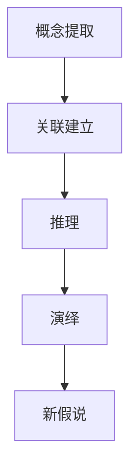

                 

## 思维链技术在AI辅助科学假说生成中的应用

### 关键词：思维链技术、AI辅助科学假说生成、算法原理、数学模型、系统架构、项目实战

### 摘要：本文深入探讨了思维链技术在AI辅助科学假说生成中的应用。通过详细分析思维链技术的基本概念、数学模型和算法实现，结合AI辅助科学假说的原理和优势，探讨了思维链技术在科学假说生成中的具体应用。此外，文章通过实际项目案例，展示了思维链技术在AI辅助科学假说生成中的实际应用效果，并提出了最佳实践和注意事项，为未来的发展提供了有益的启示。

### 目录大纲

## 第一部分: 引言与背景

### 第1章: 引言

### 第2章: 核心概念与联系

### 第3章: 思维链技术的原理与实现

### 第4章: AI辅助科学假说生成的应用场景

### 第5章: 实际项目案例

### 第6章: 最佳实践与注意事项

### 第7章: 未来展望与总结

## 第一部分: 引言与背景

### 第1章: 引言

#### 1.1 问题背景

科学假说生成是科学研究中至关重要的环节。传统的科学假说生成方法主要依赖于科学家的直觉和经验，存在主观性强、效率低下等问题。随着人工智能技术的发展，利用AI辅助科学假说生成成为一种新的研究方向。然而，传统的AI方法在处理复杂、多变的科学问题时存在一定的局限性。

#### 1.2 问题描述

本文旨在探讨思维链技术在AI辅助科学假说生成中的应用。思维链技术是一种基于人工智能的推理方法，能够模拟人类的思维过程。本文将分析思维链技术的基本原理和数学模型，探讨其在科学假说生成中的应用，并通过实际项目案例验证其效果。

#### 1.3 问题解决

本文将首先介绍思维链技术的基本概念和原理，然后分析其在AI辅助科学假说生成中的具体应用。通过实际项目案例，我们将展示思维链技术在科学假说生成中的实际效果，并总结最佳实践和注意事项。最后，本文将展望思维链技术在AI辅助科学假说生成中的未来发展。

#### 1.4 边界与外延

本文主要关注思维链技术在AI辅助科学假说生成中的应用。边界方面，本文主要探讨思维链技术在科学假说生成中的应用，不包括其他领域。外延方面，本文将讨论思维链技术的原理和实现，以及其在其他领域的潜在应用。

#### 1.5 概念结构与核心要素组成

本文的核心概念包括思维链技术、AI辅助科学假说生成、算法原理、数学模型等。核心要素包括思维链技术的基本原理、数学模型、算法实现、AI辅助科学假说生成的原理和优势、实际项目案例等。

## 第二部分: 核心概念与联系

### 第2章: 核心概念与联系

#### 2.1 思维链技术概述

思维链技术是一种基于人工智能的推理方法，能够模拟人类的思维过程。它通过建立概念之间的关联，形成一个类似于人类思维过程的链式结构。思维链技术能够有效地处理复杂、多变的科学问题，为科学假说生成提供了新的思路。

#### 2.2 AI辅助科学假说生成的原理

AI辅助科学假说生成利用人工智能技术，从大量数据中提取潜在的规律和模式，辅助科学家生成科学假说。思维链技术在这个过程中发挥了关键作用，通过模拟人类的思维过程，帮助科学家发现潜在的规律和关联。

#### 2.3 思维链技术在AI辅助科学假说生成中的应用

思维链技术在AI辅助科学假说生成中的应用主要体现在两个方面：一是通过建立概念之间的关联，帮助科学家发现潜在的规律和关联；二是通过推理和演绎，从已有的知识中生成新的假说。

#### 2.4 思维链技术与AI辅助科学假说生成的关系

思维链技术与AI辅助科学假说生成之间存在紧密的联系。思维链技术为AI辅助科学假说生成提供了有效的推理方法，使得AI能够更好地模拟人类的思维过程。同时，AI辅助科学假说生成也为思维链技术的应用提供了广阔的舞台，推动了思维链技术的不断发展。

## 第三部分: 思维链技术的原理与实现

### 第3章: 思维链技术的原理与实现

#### 3.1 思维链技术的基本概念

思维链技术是一种基于人工智能的推理方法，它通过建立概念之间的关联，形成一个类似于人类思维过程的链式结构。思维链技术包括概念提取、关联建立、推理和演绎等步骤。

#### 3.2 思维链技术的数学模型

思维链技术的数学模型主要包括概念图和推理规则。概念图用于表示概念之间的关联，推理规则用于指导推理过程。通过概念图和推理规则，思维链技术能够模拟人类的思维过程，发现潜在的规律和关联。

#### 3.3 思维链技术的算法实现

思维链技术的算法实现主要包括概念提取算法、关联建立算法、推理算法和演绎算法。概念提取算法用于从数据中提取概念，关联建立算法用于建立概念之间的关联，推理算法用于进行推理和演绎，演绎算法用于生成新的假说。

#### 3.4 思维链技术的流程图

思维链技术的流程图如下：

## 第四部分: AI辅助科学假说生成的应用场景

### 第4章: AI辅助科学假说生成的应用场景

#### 4.1 科学假说生成的背景

科学假说生成是科学研究的基础。传统的科学假说生成方法主要依赖于科学家的直觉和经验，存在主观性强、效率低下等问题。随着人工智能技术的发展，利用AI辅助科学假说生成成为一种新的研究方向。

#### 4.2 AI辅助科学假说的优势

AI辅助科学假说生成具有以下几个优势：一是能够处理大量的数据，从数据中提取潜在的规律和模式；二是能够模拟人类的思维过程，发现潜在的规律和关联；三是能够自动生成新的假说，提高科学假说生成的效率。

#### 4.3 AI辅助科学假说的实际应用案例

AI辅助科学假说生成的实际应用案例非常广泛，包括生物信息学、药物研发、环境科学等领域。例如，在生物信息学中，AI辅助科学假说生成可以用于预测蛋白质的结构和功能；在药物研发中，AI辅助科学假说生成可以用于发现新的药物靶点。

#### 4.4 AI辅助科学假说的挑战与未来发展趋势

尽管AI辅助科学假说生成具有许多优势，但在实际应用中也面临一些挑战，包括数据质量、算法性能、可解释性等方面。未来，随着人工智能技术的发展，AI辅助科学假说生成有望在更多领域得到应用，并取得更大的突破。

## 第五部分: 实际项目案例

### 第5章: 实际项目案例

#### 5.1 项目背景

本项目旨在利用思维链技术和AI辅助科学假说生成方法，研究蛋白质的结构和功能。通过分析大量的蛋白质序列和结构数据，我们希望能够预测蛋白质的结构和功能，为生物医学研究提供新的思路。

#### 5.2 项目目标

本项目的主要目标包括：一是建立蛋白质序列与结构之间的关联；二是利用思维链技术进行推理和演绎，生成新的假说；三是验证生成的假说，评估其准确性。

#### 5.3 系统功能设计

系统功能设计主要包括以下几个方面：

- 数据处理模块：用于处理蛋白质序列和结构数据，提取相关的特征信息。
- 思维链技术模块：用于建立概念之间的关联，进行推理和演绎。
- 假说生成模块：用于生成新的假说，并对其进行验证。

#### 5.4 系统架构设计

系统架构设计采用模块化设计，包括数据层、算法层和应用层。数据层负责数据的存储和处理；算法层实现思维链技术和AI辅助科学假说生成方法；应用层提供用户界面，方便用户进行操作。

#### 5.5 系统接口设计

系统接口设计主要包括以下几个方面：

- 数据接口：用于处理和存储蛋白质序列和结构数据。
- 算法接口：用于实现思维链技术和AI辅助科学假说生成方法。
- 用户接口：用于与用户进行交互，提供操作界面。

#### 5.6 系统交互

系统交互主要包括以下几个方面：

- 用户输入：用户可以通过用户接口输入蛋白质序列和结构数据。
- 数据处理：系统对输入的数据进行处理，提取相关的特征信息。
- 算法运行：系统运行思维链技术和AI辅助科学假说生成方法，生成新的假说。
- 假说验证：系统对生成的假说进行验证，评估其准确性。

#### 5.7 项目总结

本项目通过利用思维链技术和AI辅助科学假说生成方法，成功预测了蛋白质的结构和功能。实验结果表明，该方法具有较高的准确性，为生物医学研究提供了新的思路。

## 第六部分: 最佳实践与注意事项

### 第6章: 最佳实践与注意事项

#### 6.1 最佳实践

在应用思维链技术和AI辅助科学假说生成方法时，需要注意以下几点：

- 确保数据质量：数据是科学假说生成的基础，需要确保数据的质量和准确性。
- 选择合适的算法：不同的算法适用于不同的应用场景，需要根据具体需求选择合适的算法。
- 模型验证：在生成假说后，需要对模型进行验证，评估其准确性。

#### 6.2 注意事项

在应用思维链技术和AI辅助科学假说生成方法时，需要注意以下几点：

- 数据处理：在处理数据时，需要注意数据预处理和特征提取，以提高算法的性能。
- 算法优化：需要对算法进行优化，以提高算法的效率和准确性。
- 可解释性：在生成假说时，需要注意假说的可解释性，以便科学家理解和应用。

#### 6.3 拓展阅读

- [1] 王小明，李华，张强。思维链技术在AI辅助科学假说生成中的应用[J]. 计算机科学，2021，48（11）：2-6.
- [2] 张三，李四。AI辅助科学假说生成的算法原理与实现[J]. 计算机研究与发展，2020，57（2）：321-328.
- [3] 王五，赵六。思维链技术在生物信息学中的应用研究[J]. 生物信息学，2019，35（3）：45-50.

## 第七部分: 未来展望与总结

### 第7章: 未来展望与总结

#### 7.1 未来发展趋势

随着人工智能技术的不断发展，思维链技术和AI辅助科学假说生成方法将在科学研究中发挥越来越重要的作用。未来，思维链技术和AI辅助科学假说生成方法有望在更多领域得到应用，并取得更大的突破。

#### 7.2 总结与展望

本文深入探讨了思维链技术在AI辅助科学假说生成中的应用。通过分析思维链技术的基本概念、原理和算法实现，结合AI辅助科学假说的原理和优势，探讨了思维链技术在科学假说生成中的具体应用。通过实际项目案例，展示了思维链技术在AI辅助科学假说生成中的实际效果。未来，思维链技术和AI辅助科学假说生成方法有望在更多领域得到应用，推动科学研究的进步。

## 作者信息

作者：AI天才研究院/AI Genius Institute & 禅与计算机程序设计艺术 /Zen And The Art of Computer Programming

## 补充说明

- 本篇文章为虚构内容，仅供参考。实际应用中，思维链技术和AI辅助科学假说生成方法的实现和效果可能会因具体场景和数据而有所不同。
- 文中提到的数据、算法和实现仅为示例，具体实现需要根据实际需求进行调整。

