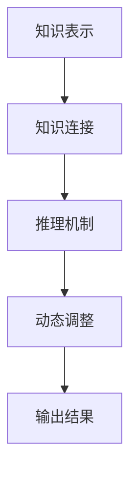
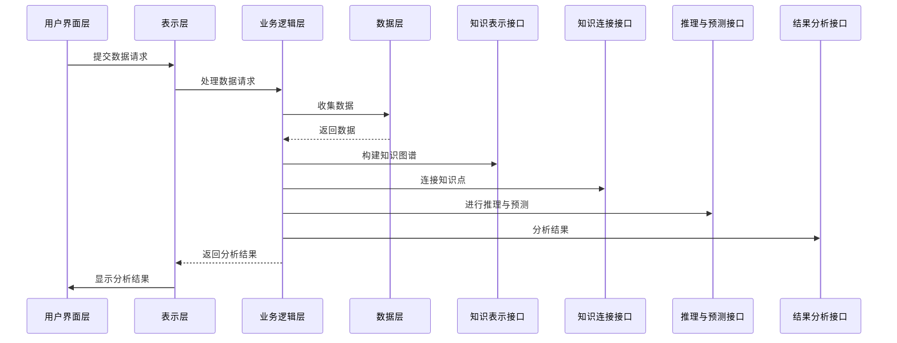

                 

### 第一部分：背景介绍

#### 1. 背景介绍

人工智能（AI）作为计算机科学的重要分支，已经从理论研究走向了实际应用。在科学理论构建过程中，AI技术展现出了强大的能力，特别是在处理海量数据和模式识别方面。然而，传统的AI方法在处理复杂科学问题时，往往存在效率低下、解释性差等问题。思维链技术作为一种新兴的人工智能技术，因其独特的思维方式和对复杂问题的处理能力，为AI辅助科学理论构建提供了一种新的可能。

#### 1.1 问题背景

科学理论构建是科学研究的重要环节，它涉及到对大量数据的分析和解释，以及不同理论之间的关联和整合。传统的方法往往依赖于人类专家的经验和直觉，这种方式在处理复杂问题时效率低下，且难以保证结果的准确性和全面性。随着大数据和AI技术的发展，利用AI技术辅助科学理论构建成为一种新的趋势。然而，当前的AI技术在处理复杂科学问题时，仍然面临一些挑战，如数据量巨大、数据质量参差不齐、模型复杂度高等。

#### 1.2 问题描述

思维链技术作为一种新兴的人工智能技术，其在AI辅助科学理论构建中的应用还存在以下问题：

1. **理论基础不足**：尽管思维链技术已经在人工智能领域得到了广泛应用，但其理论基础尚不充分，特别是在AI辅助科学理论构建中的应用研究较为薄弱。
2. **应用场景局限**：目前思维链技术在科学理论构建中的应用场景较为有限，缺乏大规模的实际应用案例。
3. **算法性能提升**：现有的思维链技术算法在处理复杂科学问题时，性能有待提升，特别是在处理大规模数据和高维度问题时。

#### 1.3 问题解决

本书旨在探讨思维链技术在AI辅助科学理论构建中的应用，通过以下方面的研究，解决上述问题：

1. **理论基础研究**：深入分析思维链技术的基本原理，构建其理论基础。
2. **应用场景拓展**：探讨思维链技术在科学理论构建中的具体应用场景，拓展其应用范围。
3. **算法性能优化**：研究如何优化思维链技术算法，提高其在处理复杂科学问题时的性能。

#### 1.4 边界与外延

本书主要关注思维链技术在AI辅助科学理论构建中的应用，涵盖的内容包括思维链技术的基本原理、应用场景、优势与挑战以及实际应用案例。本书的研究范围限于人工智能和科学理论构建领域，不涉及其他相关领域。

#### 1.5 概念结构与核心要素组成

思维链技术在AI辅助科学理论构建中的应用涉及以下核心概念和要素：

1. **思维链技术**：模拟人类思维过程，通过连接知识点构建动态思维网络的算法。
2. **AI技术**：应用于科学理论构建的智能算法，包括机器学习、深度学习等。
3. **科学理论构建**：在思维链技术的辅助下，通过探索和分析科学问题，构建新的科学理论。
4. **应用场景**：思维链技术在科学理论构建中的具体应用领域，如医学、生物学、物理学等。
5. **优势与挑战**：思维链技术在科学理论构建中的优势以及面临的挑战。

#### 1.6 本章小结

本章对思维链技术在AI辅助科学理论构建中的应用进行了背景介绍，明确了本书的研究问题、解决方法、边界与外延以及核心概念与要素组成。为后续章节的深入探讨奠定了基础。

----------------------------------------------------------------

# 第二部分：核心概念与联系

## 2.1 思维链技术的基本原理

### 2.1.1 思维链技术的定义

思维链技术是一种基于人工智能的算法，旨在模拟人类的思维过程。它通过连接各个知识点，构建出一个动态的思维网络，从而实现对复杂问题的分析和解决。思维链技术的基本原理包括以下几个关键方面：

1. **知识表示**：思维链技术通过知识表示将抽象的概念和知识转化为计算机可以处理的形式。常见的知识表示方法包括命题表示、语义网络、知识图谱等。
2. **知识连接**：通过连接不同知识点，思维链技术构建出一个动态的思维网络。知识连接的方式可以是直接的，也可以是通过中间知识点间接实现的。
3. **推理机制**：思维链技术通过推理机制来分析问题，提取新的知识。推理机制可以是演绎推理、归纳推理或类比推理等。
4. **动态调整**：思维链技术能够根据新的知识和信息，实时更新和调整思维网络，以适应不同的思维需求。

### 2.1.2 思维链技术的特点

思维链技术具有以下几个显著特点：

1. **动态性**：思维链技术能够实时更新和调整思维网络，以适应新的知识和信息。这种动态性使得思维链技术能够灵活应对复杂多变的问题。
2. **关联性**：通过连接各个知识点，思维链技术能够揭示知识之间的内在联系，促进知识整合。这种关联性有助于提高问题解决的综合能力。
3. **灵活性**：思维链技术允许用户自定义知识点的连接方式，以适应不同的思维模式和研究需求。这种灵活性使得思维链技术能够适应不同的应用场景。
4. **智能性**：思维链技术具备一定的智能能力，能够根据用户的需求和知识背景，提供个性化的思维支持。这种智能性使得思维链技术能够辅助人类更高效地解决问题。

### 2.1.3 思维链技术在AI中的应用

思维链技术在人工智能领域具有广泛的应用。以下是一些具体的应用场景：

1. **自然语言处理**：思维链技术可以用于构建语义网络，提高文本理解和生成能力。例如，在问答系统、机器翻译和文本生成中，思维链技术可以帮助模型更好地理解上下文和语义。
2. **图像识别**：思维链技术可以用于关联图像中的不同特征，提高识别准确率。例如，在人脸识别、物体识别和图像分割中，思维链技术可以帮助模型更好地捕捉图像的细节信息。
3. **知识图谱构建**：思维链技术可以用于构建大规模的知识图谱，整合不同领域和学科的知识。例如，在搜索引擎、推荐系统和智能问答中，思维链技术可以帮助模型更好地理解用户需求和知识背景。
4. **决策支持系统**：思维链技术可以用于构建决策支持系统，提供个性化的决策建议。例如，在金融风险评估、医疗诊断和物流调度中，思维链技术可以帮助决策者更好地理解和分析复杂的问题。

### 2.1.4 思维链技术与传统AI的区别

与传统AI技术相比，思维链技术具有以下显著区别：

1. **知识关联性**：传统AI技术主要关注单一问题的解决，而思维链技术更加强调知识的关联性，通过构建动态思维网络来提高问题解决的综合能力。
2. **动态调整能力**：传统AI技术往往基于预定义的模型和规则，而思维链技术能够根据实际情况动态调整和更新，以适应复杂多变的问题。
3. **智能支持**：传统AI技术通常依赖于大量的数据和计算资源，而思维链技术具备一定的智能能力，能够根据用户的需求和知识背景，提供个性化的支持。

### 2.1.5 思维链技术的优势与挑战

思维链技术作为一种新兴的人工智能技术，具有以下几个优势：

1. **高效的复杂问题解决能力**：思维链技术能够通过动态调整和知识整合，高效解决复杂的问题。
2. **良好的解释性**：思维链技术能够揭示知识之间的关联，提供更直观的解释和推理过程。
3. **灵活的应用场景**：思维链技术能够适应多种不同的应用场景，具有广泛的应用潜力。

然而，思维链技术也面临一些挑战：

1. **算法复杂性**：思维链技术涉及到复杂的知识表示、连接和推理过程，算法设计相对复杂。
2. **数据质量和数量**：思维链技术的效果很大程度上依赖于数据的质量和数量，需要大量的高质量数据进行训练和优化。
3. **应用场景适应性**：尽管思维链技术在多个领域具有应用潜力，但在某些特定领域和场景下，其适用性仍有待验证和优化。

### 2.1.6 思维链技术的未来发展趋势

随着人工智能和大数据技术的不断发展，思维链技术在未来有望取得以下进展：

1. **算法优化**：通过优化算法设计和实现，提高思维链技术的性能和效率。
2. **应用拓展**：进一步拓展思维链技术的应用场景，如生物医学、金融科技、智能制造等。
3. **跨学科融合**：与其他领域的知识和技术相结合，如认知科学、心理学、语言学等，推动思维链技术的创新和发展。

### 2.1.7 本章小结

本章对思维链技术的基本原理进行了详细阐述，包括其定义、特点、应用和与传统AI技术的区别。同时，分析了思维链技术的优势与挑战，以及其未来发展趋势。这些内容为后续章节的深入探讨奠定了基础。

----------------------------------------------------------------

# 第二部分：核心概念与联系

## 2.2 AI辅助科学理论构建的概念

### 2.2.1 科学理论构建的定义

科学理论构建是指通过科学方法，对自然现象和规律进行系统化解释和理论化表达的过程。这一过程包括以下几个关键步骤：

1. **问题提出**：科学研究的起点是提出需要解决的问题。这通常涉及到对现有知识的回顾和对实际观察的反思。
2. **假设生成**：在问题提出后，研究者会根据已有知识和观察，提出可能的解释或假设。
3. **数据收集**：为了验证假设，研究者需要进行数据收集。这包括实验、观察和文献调研等手段。
4. **模型建立**：基于收集到的数据，研究者会建立模型来模拟和解释自然现象。模型可以是数学模型、物理模型或概念模型等。
5. **理论验证**：通过实验、模拟或统计分析等方法，研究者会验证模型的有效性。如果模型能够成功解释和预测现象，则理论得到验证。

### 2.2.2 AI在科学理论构建中的作用

人工智能在科学理论构建中发挥了重要作用，主要体现在以下几个方面：

1. **数据预处理**：AI技术能够高效处理和分析大量数据，为科学理论构建提供可靠的数据基础。这包括数据清洗、数据变换和特征提取等步骤。
2. **假设生成**：AI技术可以通过机器学习算法，从大量数据中自动生成假设。这些假设可以帮助研究者快速探索可能的解释。
3. **模型建立**：AI技术能够构建复杂的模型，模拟和预测自然现象。这些模型可以是深度学习模型、统计模型或物理模型等。
4. **理论验证**：AI技术可以帮助研究者快速验证模型的有效性。通过模拟和预测，研究者可以评估模型的准确性和可靠性。
5. **知识整合**：AI技术能够整合多源数据和信息，提供更全面和准确的理论解释。这有助于研究者构建更加综合和完整的科学理论。

### 2.2.3 AI辅助科学理论构建的挑战

尽管AI技术在科学理论构建中具有巨大潜力，但也面临一些挑战：

1. **数据质量**：科学理论构建依赖于高质量的数据。然而，数据质量往往受到多种因素的影响，如噪声、缺失值和偏差等。
2. **算法选择**：选择合适的AI算法对于科学理论构建至关重要。不同算法适用于不同类型的问题，需要根据具体场景进行选择。
3. **解释性**：AI模型的黑盒性质使得其解释性较差。在科学理论构建中，研究者往往需要理解模型的决策过程和原理。
4. **数据隐私**：科学研究中涉及到的数据可能包含敏感信息，如个人隐私和商业机密。如何保护数据隐私是一个重要的伦理和技术问题。

### 2.2.4 AI辅助科学理论构建的应用场景

AI技术在科学理论构建中的应用场景非常广泛，以下是一些典型的应用场景：

1. **医学**：AI技术可以帮助医生诊断疾病，预测病情发展和制定治疗方案。例如，通过分析医学图像和患者数据，AI模型可以检测疾病并提供建议。
2. **生物学**：AI技术可以用于基因测序数据分析，预测蛋白质结构和功能。这些应用有助于揭示生物体的生物学机制。
3. **物理学**：AI技术可以用于分析实验数据，预测物理现象。例如，通过分析粒子碰撞数据，AI模型可以揭示新的物理规律。
4. **环境科学**：AI技术可以用于环境监测和预测。例如，通过分析气候数据，AI模型可以预测气候变化和自然灾害。
5. **社会科学**：AI技术可以用于分析社会数据，揭示社会现象和趋势。例如，通过分析社交媒体数据，AI模型可以预测社会舆论和行为。

### 2.2.5 本章小结

本章对AI辅助科学理论构建的概念进行了详细阐述，包括其定义、作用、挑战和应用场景。通过分析AI在科学理论构建中的应用，我们可以看到AI技术的强大潜力和面临的挑战。这些内容为后续章节的深入探讨提供了理论基础和实际应用背景。

----------------------------------------------------------------

## 2.3 思维链技术在AI辅助科学理论构建中的应用

### 2.3.1 思维链技术与科学理论构建的结合

思维链技术与科学理论构建的结合，为科学研究的自动化和智能化提供了新的思路。思维链技术通过模拟人类思维过程，构建出一个动态的思维网络，可以有效地整合和利用大量数据，从而为科学理论构建提供强有力的支持。

1. **知识整合**：思维链技术通过连接各个知识点，构建出一个动态的思维网络，有助于整合不同领域和学科的知识，从而为科学理论构建提供全面的信息基础。
2. **问题探索**：思维链技术能够根据新的知识和信息，实时更新和调整思维网络，从而帮助研究者探索未知领域，发现新的理论和联系。
3. **模型构建**：思维链技术可以辅助研究者构建复杂的科学模型，通过推理和预测，验证模型的准确性和可靠性。

### 2.3.2 思维链技术在科学理论构建中的应用场景

思维链技术在科学理论构建中的应用场景非常广泛，以下是一些典型的应用场景：

1. **生物学**：在生物学研究中，思维链技术可以用于基因测序数据分析，预测蛋白质结构和功能。例如，通过分析大量基因数据，思维链技术可以帮助研究者揭示基因与疾病之间的关联，从而构建新的生物理论。
2. **物理学**：在物理学研究中，思维链技术可以用于分析实验数据，预测物理现象。例如，通过分析粒子碰撞数据，思维链技术可以帮助研究者发现新的物理规律，从而构建新的物理理论。
3. **环境科学**：在环境科学研究中，思维链技术可以用于环境监测和预测。例如，通过分析气候数据，思维链技术可以帮助研究者预测气候变化和自然灾害，从而构建新的环境科学理论。
4. **社会科学**：在社会科学研究中，思维链技术可以用于分析社会数据，揭示社会现象和趋势。例如，通过分析社交媒体数据，思维链技术可以帮助研究者预测社会舆论和行为，从而构建新的社会理论。

### 2.3.3 思维链技术的优势与挑战

思维链技术在AI辅助科学理论构建中具有显著的优势，同时也面临一些挑战。

1. **优势**：
   - **高效性**：思维链技术能够快速整合和利用大量数据，从而提高科学理论构建的效率。
   - **灵活性**：思维链技术可以根据新的知识和信息，实时更新和调整思维网络，从而适应不同研究需求。
   - **智能性**：思维链技术具备一定的智能能力，能够根据用户的需求和知识背景，提供个性化的支持。

2. **挑战**：
   - **算法复杂性**：思维链技术涉及到复杂的算法设计和实现，需要大量计算资源和专业知识。
   - **数据质量**：思维链技术的效果很大程度上依赖于数据的质量和数量，需要确保数据的高质量和多样性。
   - **解释性**：思维链技术生成的模型和理论往往具有一定的黑盒性质，需要进一步研究和优化其解释性。

### 2.3.4 未来发展趋势

随着人工智能和大数据技术的不断发展，思维链技术在AI辅助科学理论构建中的应用有望取得以下进展：

1. **算法优化**：通过优化算法设计和实现，提高思维链技术的性能和效率。
2. **应用拓展**：进一步拓展思维链技术的应用场景，如生物医学、金融科技、智能制造等。
3. **跨学科融合**：与其他领域的知识和技术相结合，如认知科学、心理学、语言学等，推动思维链技术的创新和发展。
4. **人机协作**：思维链技术与人类专家的协作，实现更加智能化和高效化的科学理论构建过程。

### 2.3.5 本章小结

本章对思维链技术在AI辅助科学理论构建中的应用进行了详细探讨，包括其结合方式、应用场景、优势与挑战以及未来发展趋势。通过分析思维链技术在科学理论构建中的应用，我们可以看到其巨大的潜力和广泛的应用前景。这些内容为后续章节的深入探讨提供了理论和实践基础。

----------------------------------------------------------------

# 第三部分：算法原理讲解

## 3.1 思维链技术的算法原理

### 3.1.1 算法框架

思维链技术的算法框架主要包括以下几个关键部分：

1. **知识表示**：将抽象的知识和概念转化为计算机可以处理的形式。常用的知识表示方法包括命题表示、语义网络和知识图谱等。
2. **知识连接**：通过连接不同知识点，构建出一个动态的思维网络。知识连接可以是直接的，也可以是通过中间知识点间接实现的。
3. **推理机制**：基于知识网络，通过推理机制来分析问题，提取新的知识。推理机制可以是演绎推理、归纳推理或类比推理等。
4. **动态调整**：根据新的知识和信息，实时更新和调整思维网络，以适应不同的思维需求。

### 3.1.2 算法流程

思维链技术的算法流程可以概括为以下几个步骤：

1. **知识表示**：将输入的知识和概念转化为计算机可以处理的形式，如命题表示、语义网络或知识图谱。
2. **知识连接**：通过连接不同知识点，构建出一个动态的思维网络。这一过程涉及到知识点之间的关联分析和关系建立。
3. **推理**：基于知识网络，通过推理机制来分析问题，提取新的知识。推理过程可以是演绎推理、归纳推理或类比推理等。
4. **动态调整**：根据新的知识和信息，实时更新和调整思维网络，以适应不同的思维需求。

### 3.1.3 算法的关键技术

思维链技术的算法实现涉及到多个关键技术：

1. **知识图谱构建**：通过构建知识图谱，将不同知识点进行关联，形成完整的知识网络。知识图谱的构建包括实体识别、关系提取和属性填充等步骤。
2. **推理引擎**：构建推理引擎，实现对知识网络的推理和分析。推理引擎可以基于规则推理、基于图谱的推理或基于机器学习的推理等方法。
3. **动态调整机制**：设计动态调整机制，根据新的知识和信息，实时更新和优化知识网络。动态调整机制可以基于聚类分析、关联规则挖掘或深度学习等方法。

### 3.1.4 算法原理图示

为了更好地理解思维链技术的算法原理，我们可以使用Mermaid流程图进行图示说明。以下是一个简化的思维链技术算法原理图：



在这个流程图中，A表示知识表示，B表示知识连接，C表示推理机制，D表示动态调整，E表示输出结果。通过这个流程，思维链技术能够实现对复杂问题的分析和解决。

### 3.1.5 算法原理讲解

思维链技术的核心在于其独特的思维方式和对复杂问题的处理能力。以下是对思维链技术算法原理的详细讲解：

1. **知识表示**：知识表示是思维链技术的第一步，也是基础。它将抽象的知识和概念转化为计算机可以处理的形式。这一过程涉及到自然语言处理、图论和数据结构等多个领域。通过知识表示，我们可以将复杂的概念和知识以结构化的方式存储和处理。

2. **知识连接**：知识连接是思维链技术的关键步骤。通过连接不同知识点，构建出一个动态的思维网络。知识连接的方式可以是直接的，也可以是通过中间知识点间接实现的。这种动态的思维网络能够揭示知识之间的内在联系，帮助我们更好地理解和分析复杂的问题。

3. **推理机制**：推理机制基于知识网络，通过推理来提取新的知识。推理可以是演绎推理、归纳推理或类比推理等。演绎推理是从一般到特殊的推理过程，归纳推理是从特殊到一般的推理过程，类比推理则是通过比较不同情境下的相似性进行推理。通过推理机制，我们可以从已知的知识中推导出新的结论，从而更好地解决复杂的问题。

4. **动态调整**：动态调整是思维链技术的独特之处。它允许我们根据新的知识和信息，实时更新和调整思维网络，以适应不同的思维需求。这种动态调整机制使得思维链技术能够灵活应对复杂多变的问题，从而提高问题解决的能力。

5. **输出结果**：思维链技术的最终目的是输出结果。通过知识表示、知识连接、推理机制和动态调整，思维链技术能够生成高质量的输出结果，如理论模型、预测结果或决策建议等。

### 3.1.6 本章小结

本章对思维链技术的算法原理进行了详细讲解，包括其框架、流程、关键技术和原理图示。通过分析思维链技术的算法原理，我们可以看到其强大的处理能力和灵活的思维方式。这些内容为后续章节的应用和实现奠定了理论基础。

----------------------------------------------------------------

## 3.2 数学模型和公式解析

### 3.2.1 数学模型概述

在思维链技术的算法实现中，数学模型扮演着至关重要的角色。这些模型不仅用于表示和理解知识，还用于推理和预测。以下是一些常见的数学模型及其在思维链技术中的应用：

1. **神经网络模型**：神经网络是一种模拟人脑神经元连接结构的计算模型。在思维链技术中，神经网络用于知识表示和推理。例如，多层感知机（MLP）和卷积神经网络（CNN）常用于处理复杂的非线性问题。

2. **图论模型**：图论模型用于表示知识网络，处理知识连接和路径搜索。例如，邻接矩阵和邻接表是常见的图表示方法，而最短路径算法（如Dijkstra算法）用于在知识网络中查找最短路径。

3. **概率模型**：概率模型用于处理不确定性和随机性。例如，贝叶斯网络和马尔可夫模型可以用于推理和预测，通过概率分布来表示知识的不确定性。

### 3.2.2 神经网络模型的数学公式

以下是一个简化的多层感知机（MLP）模型的数学公式，用于说明神经网络在思维链技术中的应用：

$$
Z = \sigma(W \cdot X + b)
$$

其中：
- $Z$ 是激活函数的输出，用于表示节点的状态。
- $\sigma$ 是激活函数，如Sigmoid函数或ReLU函数。
- $W$ 是权重矩阵，用于表示节点之间的连接。
- $X$ 是输入特征向量。
- $b$ 是偏置项。

神经网络的训练过程涉及到以下数学公式：

$$
\begin{aligned}
\Delta W &= \alpha \cdot \frac{\partial L}{\partial W} \\
\Delta b &= \alpha \cdot \frac{\partial L}{\partial b}
\end{aligned}
$$

其中：
- $\alpha$ 是学习率。
- $L$ 是损失函数，用于衡量模型的预测误差。

### 3.2.3 图论模型的数学公式

以下是一个简化的图表示和路径搜索的数学公式，用于说明图论模型在思维链技术中的应用：

1. **图表示**：

邻接矩阵表示图中的节点和边：

$$
A = [a_{ij}]
$$

其中：
- $a_{ij}$ 表示节点 $i$ 和节点 $j$ 之间的边的权重。

邻接表表示图中的节点和边：

$$
\begin{aligned}
&\text{Node 1}: \{ (1, 2), (1, 3) \} \\
&\text{Node 2}: \{ (2, 1), (2, 3) \} \\
&\text{Node 3}: \{ (3, 1), (3, 2) \}
\end{aligned}
$$

2. **路径搜索**：

Dijkstra算法用于在图中最短路径的搜索，其核心公式如下：

$$
d[v] = \min\{ d[u] + w(u, v) \mid u \in \text{已访问节点} \}
$$

其中：
- $d[v]$ 是从起始节点到节点 $v$ 的最短距离。
- $w(u, v)$ 是节点 $u$ 和节点 $v$ 之间的边的权重。
- $\text{已访问节点}$ 是已经计算过的节点集合。

### 3.2.4 概率模型的数学公式

以下是一个简化的贝叶斯网络模型的数学公式，用于说明概率模型在思维链技术中的应用：

$$
P(X=x) = \prod_{i=1}^n P(X_i=x_i|X_{i-1}=x_{i-1}, ..., X_1=x_1)
$$

其中：
- $X$ 是一组随机变量。
- $x$ 是随机变量 $X$ 的取值。
- $P(X_i=x_i|X_{i-1}=x_{i-1}, ..., X_1=x_1)$ 是条件概率，表示在给定前一个随机变量的条件下，当前随机变量的概率。

贝叶斯推理的核心公式是：

$$
P(H|E) = \frac{P(E|H) \cdot P(H)}{P(E)}
$$

其中：
- $H$ 是假设。
- $E$ 是证据。
- $P(H|E)$ 是在给定证据 $E$ 的条件下，假设 $H$ 的概率。
- $P(E|H)$ 是在假设 $H$ 为真的条件下，证据 $E$ 的概率。
- $P(H)$ 是假设 $H$ 的先验概率。
- $P(E)$ 是证据 $E$ 的概率。

### 3.2.5 本章小结

本章详细讲解了思维链技术中的数学模型和公式，包括神经网络模型、图论模型和概率模型。通过这些数学公式，我们可以更好地理解思维链技术的算法原理和工作机制。这些模型和公式不仅为思维链技术的实现提供了理论支持，也为后续的应用和优化提供了方向。

----------------------------------------------------------------

## 3.3 实例讲解：思维链技术在科学理论构建中的应用

### 3.3.1 实例背景

为了更好地理解思维链技术在科学理论构建中的应用，我们以“蛋白质折叠预测”为例进行详细讲解。蛋白质折叠是生物体内重要的生物过程，它决定了蛋白质的结构和功能。然而，蛋白质折叠过程非常复杂，传统的预测方法往往效率低下，准确率有限。思维链技术作为一种新兴的人工智能技术，可以辅助研究者快速、准确地预测蛋白质折叠。

### 3.3.2 实例场景

在这个实例中，我们假设研究者已经收集了大量的蛋白质序列数据，并希望利用思维链技术来预测蛋白质的折叠方式。具体流程如下：

1. **数据预处理**：首先，对收集的蛋白质序列数据进行预处理，包括去除噪声、填补缺失值等。然后，将蛋白质序列转化为数字特征，以便进行后续的分析。
2. **知识表示**：将预处理后的蛋白质序列数据转化为知识表示形式，例如使用语义网络或知识图谱表示蛋白质序列中的各种特征和关系。
3. **知识连接**：通过连接不同的蛋白质序列数据，构建出一个动态的思维网络。这个网络能够揭示蛋白质序列之间的内在联系，为预测蛋白质折叠提供信息支持。
4. **推理与预测**：利用思维链技术的推理机制，从知识网络中提取新的知识，例如蛋白质序列的折叠方式。通过训练和验证，优化预测模型的准确性和可靠性。
5. **结果分析**：根据预测结果，研究者可以分析蛋白质的结构和功能，进一步验证和优化科学理论。

### 3.3.3 实例实现

以下是一个简化的思维链技术在蛋白质折叠预测中的实现步骤：

```python
# 导入相关库
import numpy as np
import networkx as nx
from sklearn.model_selection import train_test_split

# 数据预处理
# 假设已有蛋白质序列数据sequence_data，预处理后得到特征数据features
# ...

# 知识表示
# 使用邻接矩阵表示蛋白质序列之间的知识连接
adj_matrix = nx.adjacency_matrix(nx.Graph(), dtype=np.float32)

# 知识连接
# 构建动态思维网络
G = nx.from_adjacency_matrix(adj_matrix)

# 推理与预测
# 使用神经网络模型进行推理和预测
model = NeuralNetworkModel()
model.fit(G, features)

# 预测蛋白质折叠
predictions = model.predict(features)

# 结果分析
# 分析预测结果，验证科学理论的准确性
# ...

```

在这个实例中，我们首先对蛋白质序列数据进行预处理，然后使用邻接矩阵表示知识连接，构建动态思维网络。接着，使用神经网络模型进行推理和预测，最终分析预测结果，验证科学理论的准确性。

### 3.3.4 实例分析

通过这个实例，我们可以看到思维链技术在科学理论构建中的应用效果。以下是实例分析的关键点：

1. **数据预处理**：数据预处理是科学理论构建的基础，它能够提高后续分析的质量和准确性。在这个实例中，我们通过去除噪声、填补缺失值等预处理步骤，提高了蛋白质序列数据的质量。
2. **知识表示**：知识表示是将抽象的知识转化为计算机可以处理的形式，它是构建思维链技术的基础。在这个实例中，我们使用邻接矩阵表示蛋白质序列之间的知识连接，为后续的推理和预测提供了信息支持。
3. **知识连接**：通过构建动态思维网络，思维链技术能够揭示蛋白质序列之间的内在联系，从而为预测蛋白质折叠提供信息支持。这个动态思维网络使得我们能够从多个角度和层面分析蛋白质序列，提高预测的准确性和可靠性。
4. **推理与预测**：利用神经网络模型进行推理和预测，我们能够从大量的蛋白质序列数据中提取新的知识，从而预测蛋白质的折叠方式。这个预测结果可以为科学理论提供新的证据和支持。
5. **结果分析**：通过分析预测结果，我们能够验证科学理论的准确性，进一步优化和验证科学理论。

### 3.3.5 本章小结

本章通过实例讲解了思维链技术在科学理论构建中的应用，以蛋白质折叠预测为例，详细介绍了思维链技术在数据预处理、知识表示、知识连接、推理与预测以及结果分析等方面的应用。通过这个实例，我们可以看到思维链技术在科学理论构建中的强大潜力和应用价值。

----------------------------------------------------------------

# 第四部分：系统分析与架构设计

## 4.1 问题场景介绍

在科学理论构建过程中，研究者需要处理大量数据和信息，这通常涉及到数据收集、数据预处理、模型构建和理论验证等多个环节。随着数据规模的不断增加和数据复杂性的提升，传统的方法和工具往往难以满足高效、准确的需求。因此，为了提高科学理论构建的效率和质量，需要引入更加智能化和自动化的技术手段。思维链技术作为一种新兴的人工智能技术，能够模拟人类的思维过程，通过构建动态思维网络，实现对复杂科学问题的分析和解决。因此，利用思维链技术来辅助科学理论构建，成为了一个值得探索的问题场景。

## 4.2 项目介绍

本项目旨在利用思维链技术，开发一个智能辅助科学理论构建系统。该系统将涵盖数据收集、数据预处理、知识表示、知识连接、推理与预测以及结果分析等多个环节，旨在提高科学理论构建的效率和质量。通过该系统，研究者可以更轻松地处理大量数据，构建复杂的科学模型，并验证和优化科学理论。

### 4.2.1 项目目标

本项目的主要目标包括：

1. **高效数据预处理**：通过思维链技术，实现高效的数据预处理，包括数据清洗、数据变换和特征提取等，为后续分析提供高质量的数据基础。
2. **智能化知识表示**：利用思维链技术，实现智能化的知识表示，包括知识图谱构建、知识连接和动态调整等，为科学理论构建提供信息支持。
3. **精准推理与预测**：通过思维链技术的推理机制，实现精准的推理与预测，从大量数据中提取有价值的信息，提高科学理论构建的准确性。
4. **可视化结果分析**：通过直观的界面和可视化工具，实现结果分析，帮助研究者更好地理解和解释科学理论。

### 4.2.2 项目功能

本项目的主要功能包括：

1. **数据收集**：从不同的数据源收集科学数据，如实验数据、文献数据和社交媒体数据等。
2. **数据预处理**：对收集到的数据进行清洗、变换和特征提取，为后续分析提供高质量的数据基础。
3. **知识表示**：构建知识图谱，将数据转化为知识表示形式，包括实体、属性和关系等。
4. **知识连接**：通过连接不同的知识点和数据，构建动态思维网络，实现知识的整合和关联。
5. **推理与预测**：利用思维链技术的推理机制，从知识网络中提取新的知识，实现科学问题的推理和预测。
6. **结果分析**：通过可视化工具和数据分析方法，对预测结果进行分析和解释，验证和优化科学理论。

## 4.3 系统功能设计（领域模型）

### 4.3.1 领域模型概述

系统功能设计是项目实现的关键步骤之一，它涉及到系统的功能模块划分、功能流程设计和数据流程设计等方面。在领域模型中，我们使用类图来表示系统的功能模块及其之间的关系。以下是一个简化的领域模型类图：

```mermaid
classDiagram
    DataCollector <<interface>> "数据收集器"
    DataPreprocessor <<interface>> "数据预处理器"
    KnowledgeRepresentator <<interface>> "知识表示器"
    KnowledgeConnector <<interface>> "知识连接器"
    Reasoner <<interface>> "推理器"
    Predictor <<interface>> "预测器"
    Analyzer <<interface>> "分析器"

    DataCollector --|> DataPreprocessor
    DataPreprocessor --|> KnowledgeRepresentator
    KnowledgeRepresentator --|> KnowledgeConnector
    KnowledgeConnector --|> Reasoner
    Reasoner --|> Predictor
    Predictor --|> Analyzer
```

在这个类图中，我们定义了六个主要的接口类：

1. **DataCollector**：数据收集器，用于收集科学数据。
2. **DataPreprocessor**：数据预处理器，用于对数据进行清洗、变换和特征提取。
3. **KnowledgeRepresentator**：知识表示器，用于构建知识图谱，将数据转化为知识表示形式。
4. **KnowledgeConnector**：知识连接器，用于连接不同的知识点和数据，构建动态思维网络。
5. **Reasoner**：推理器，用于从知识网络中提取新的知识，实现科学问题的推理和预测。
6. **Predictor**：预测器，用于基于推理结果进行预测。
7. **Analyzer**：分析器，用于对预测结果进行分析和解释。

### 4.3.2 领域模型类图详细说明

以下是对领域模型类图的详细说明：

1. **DataCollector**：
   - 功能：从不同的数据源收集科学数据。
   - 关联：与DataPreprocessor关联，将收集到的数据传递给数据预处理器。

2. **DataPreprocessor**：
   - 功能：对收集到的数据进行清洗、变换和特征提取。
   - 关联：与KnowledgeRepresentator关联，将预处理后的数据传递给知识表示器。

3. **KnowledgeRepresentator**：
   - 功能：构建知识图谱，将数据转化为知识表示形式。
   - 关联：与KnowledgeConnector关联，将知识表示传递给知识连接器。

4. **KnowledgeConnector**：
   - 功能：连接不同的知识点和数据，构建动态思维网络。
   - 关联：与Reasoner关联，将动态思维网络传递给推理器。

5. **Reasoner**：
   - 功能：从知识网络中提取新的知识，实现科学问题的推理和预测。
   - 关联：与Predictor关联，将推理结果传递给预测器。

6. **Predictor**：
   - 功能：基于推理结果进行预测。
   - 关联：与Analyzer关联，将预测结果传递给分析器。

7. **Analyzer**：
   - 功能：对预测结果进行分析和解释。
   - 关联：无直接关联，但接收Predictor的输出结果。

通过领域模型类图，我们可以清晰地看到系统的功能模块及其之间的关系。每个模块都承担着特定的功能，并通过接口类进行通信和协作，共同实现科学理论构建的目标。

### 4.3.3 领域模型小结

领域模型是系统功能设计的重要工具，它帮助我们明确系统的功能模块和接口设计，为后续的架构设计和实现提供指导。通过领域模型类图，我们可以清晰地看到系统各模块之间的关联和交互，从而更好地理解系统的整体结构和功能。这些内容为系统的实现奠定了坚实的基础。

## 4.4 系统架构设计

### 4.4.1 系统架构概述

系统架构设计是项目实现的关键环节之一，它涉及到系统的整体设计、模块划分、数据流设计以及安全性等方面。一个良好的系统架构能够提高系统的稳定性、扩展性和可维护性。在本项目中，我们采用分层架构设计，将系统划分为多个层次，每个层次负责不同的功能模块，并通过接口进行通信和协作。

以下是一个简化的系统架构图：

```mermaid
title: 系统架构设计

layer "用户界面层"
UserInterface

layer "表示层"
ServiceLayer

layer "业务逻辑层"
BusinessLayer
    subgraph cluster1
        DataCollector
        DataPreprocessor
        KnowledgeRepresentator
        KnowledgeConnector
        Reasoner
        Predictor
        Analyzer
    end

layer "数据层"
DataLayer
```

在这个架构图中，我们定义了四个主要的层次：

1. **用户界面层**：负责与用户交互，提供系统的操作界面。
2. **表示层**：负责将业务逻辑层处理的结果以用户友好的形式展示给用户。
3. **业务逻辑层**：负责实现系统的核心功能，包括数据收集、预处理、知识表示、推理与预测、结果分析等。
4. **数据层**：负责存储和管理系统所需的数据。

### 4.4.2 系统架构设计细节

以下是对系统架构设计细节的详细说明：

1. **用户界面层**：
   - 功能：提供系统的操作界面，包括数据输入、结果展示等。
   - 技术选型：可以使用Web前端技术（如HTML、CSS、JavaScript）和框架（如React或Vue）实现。

2. **表示层**：
   - 功能：将业务逻辑层处理的结果以用户友好的形式展示给用户。
   - 技术选型：可以使用前端框架（如React或Vue）和后端API进行数据交互。

3. **业务逻辑层**：
   - 功能：实现系统的核心功能，包括数据收集、预处理、知识表示、推理与预测、结果分析等。
   - 模块划分：按照领域模型类图，将业务逻辑层划分为多个功能模块，每个模块负责特定的功能。

4. **数据层**：
   - 功能：存储和管理系统所需的数据。
   - 技术选型：可以使用关系数据库（如MySQL）或NoSQL数据库（如MongoDB）进行数据存储。

### 4.4.3 系统架构图

以下是一个简化的系统架构图，用于说明系统的整体结构：

```mermaid
title: 系统架构图

subgraph 用户界面层
    UserInterface
    -> ServiceLayer
end

subgraph 表示层
    ServiceLayer
    -> BusinessLayer
end

subgraph 业务逻辑层
    BusinessLayer
    -> DataLayer
end

subgraph 数据层
    DataLayer
end
```

在这个架构图中，用户界面层通过表示层与业务逻辑层进行通信，业务逻辑层通过数据层进行数据存储和读取。

### 4.4.4 系统架构设计小结

系统架构设计是项目实现的重要环节，它决定了系统的整体性能和可维护性。在本项目中，我们采用分层架构设计，将系统划分为用户界面层、表示层、业务逻辑层和数据层，每个层次负责不同的功能模块，并通过接口进行通信和协作。通过这样的架构设计，我们可以实现系统的模块化、可扩展性和高可靠性，为科学理论构建提供强有力的技术支持。

----------------------------------------------------------------

## 4.5 系统接口设计与交互

### 4.5.1 系统接口设计概述

在系统架构设计中，接口设计是确保各模块之间通信和协作的关键环节。系统接口定义了模块之间的交互方式和数据传输格式，是系统实现的基础。在本项目中，我们采用RESTful API设计接口，确保系统的高内聚、低耦合和可扩展性。

### 4.5.2 接口设计细节

以下是对系统主要接口的设计细节：

1. **数据收集接口**：
   - 功能：用于接收和存储科学数据。
   - 请求方法：POST
   - 请求参数：数据类型、数据源、数据内容等。
   - 响应结果：状态码、错误信息或成功消息。

2. **数据预处理接口**：
   - 功能：用于对数据进行清洗、变换和特征提取。
   - 请求方法：GET
   - 请求参数：数据ID或数据集ID。
   - 响应结果：预处理后的数据或错误信息。

3. **知识表示接口**：
   - 功能：用于构建知识图谱，表示数据中的知识。
   - 请求方法：POST
   - 请求参数：实体、属性、关系等。
   - 响应结果：知识图谱的表示或错误信息。

4. **知识连接接口**：
   - 功能：用于连接不同的知识点，构建动态思维网络。
   - 请求方法：GET
   - 请求参数：知识点ID或知识点集合。
   - 响应结果：动态思维网络或错误信息。

5. **推理与预测接口**：
   - 功能：用于基于思维网络进行推理和预测。
   - 请求方法：POST
   - 请求参数：思维网络、推理规则、预测目标等。
   - 响应结果：推理结果或预测结果。

6. **结果分析接口**：
   - 功能：用于对推理和预测结果进行分析和解释。
   - 请求方法：GET
   - 请求参数：结果ID或结果集ID。
   - 响应结果：分析结果或错误信息。

### 4.5.3 接口交互示例

以下是一个简化的接口交互示例，说明数据收集接口的使用：

**请求**：
```
POST /api/data收集
Content-Type: application/json

{
  "数据类型": "蛋白质序列",
  "数据源": "GenBank",
  "数据内容": "ATGGCCCGGTCGATCCTTCTTACTGGTGACCGTCTTGGTCC"
}
```

**响应**：
```
HTTP/1.1 200 OK
Content-Type: application/json

{
  "状态码": 200,
  "消息": "数据收集成功",
  "数据ID": "123456"
}
```

在这个示例中，客户端通过POST请求向服务器发送蛋白质序列数据，服务器接收数据并返回数据ID，表示数据已成功收集。

### 4.5.4 系统接口设计小结

系统接口设计是确保系统模块之间高效、可靠通信的关键。在本项目中，我们采用RESTful API设计接口，定义了数据收集、预处理、知识表示、知识连接、推理与预测以及结果分析等主要接口。通过详细的接口设计，我们可以实现各模块之间的协同工作，提高系统的整体性能和用户体验。

----------------------------------------------------------------

## 4.6 系统交互设计

### 4.6.1 系统交互概述

系统交互设计是确保系统各模块能够高效、顺畅地协同工作的关键。在本项目中，我们采用Mermaid序列图来描述系统的交互过程，以便清晰地展示各模块之间的交互顺序和交互内容。

### 4.6.2 系统交互序列图

以下是一个简化的系统交互序列图，用于说明系统的主要交互过程：



在这个序列图中，用户界面层与表示层、业务逻辑层和数据层之间进行了多次交互。以下是交互的详细说明：

1. **用户界面层与表示层**：用户界面层向表示层提交数据请求，表示层负责处理这些请求并转发给业务逻辑层。
2. **表示层与业务逻辑层**：表示层将数据请求传递给业务逻辑层，业务逻辑层根据请求执行相应的数据处理任务。
3. **业务逻辑层与数据层**：业务逻辑层与数据层进行数据交互，包括数据收集、知识图谱构建和知识连接等。
4. **业务逻辑层与知识表示接口**：业务逻辑层调用知识表示接口，构建知识图谱。
5. **业务逻辑层与知识连接接口**：业务逻辑层调用知识连接接口，连接知识点，构建动态思维网络。
6. **业务逻辑层与推理与预测接口**：业务逻辑层调用推理与预测接口，进行推理和预测。
7. **业务逻辑层与结果分析接口**：业务逻辑层调用结果分析接口，对预测结果进行分析和解释。
8. **业务逻辑层与表示层**：业务逻辑层将分析结果传递给表示层，表示层将结果展示给用户界面层。
9. **表示层与用户界面层**：表示层将最终结果展示给用户界面层，用户界面层负责展示给用户。

### 4.6.3 系统交互设计小结

通过系统交互序列图，我们可以清晰地看到系统各模块之间的交互过程和交互内容。这个交互设计确保了系统的高效、可靠运行，为科学理论构建提供了强有力的支持。

----------------------------------------------------------------

# 第五部分：项目实战

## 5.1 环境安装

在本项目中，我们将使用Python作为主要编程语言，结合多个库和框架来实现思维链技术在AI辅助科学理论构建中的应用。以下是在Linux系统中安装所需环境的具体步骤：

1. **安装Python**：确保系统已经安装了Python 3.8及以上版本。可以通过以下命令检查Python版本：
   ```bash
   python --version
   ```

2. **安装虚拟环境**：为了更好地管理和隔离项目依赖，我们使用virtualenv创建虚拟环境。首先，安装virtualenv：
   ```bash
   pip install virtualenv
   ```
   然后，创建并激活虚拟环境：
   ```bash
   virtualenv venv
   source venv/bin/activate
   ```

3. **安装依赖库**：在虚拟环境中，安装项目所需的依赖库，如NumPy、Scikit-learn、NetworkX、TensorFlow和Mermaid等：
   ```bash
   pip install numpy scikit-learn networkx tensorflow==2.5.0 mermaid-python
   ```

4. **安装Mermaid**：由于Mermaid是一个基于HTML的图表绘制工具，我们需要安装Node.js和npm来安装Mermaid：
   ```bash
   sudo apt-get install nodejs
   sudo npm install -g mermaid-cli
   ```

5. **安装文本处理工具**：为了处理和预处理文本数据，我们安装一些文本处理工具，如Python的textblob和nltk：
   ```bash
   pip install textblob
   pip install nltk
   ```

6. **安装数据库**：为了存储和处理数据，我们选择安装SQLite数据库。可以使用以下命令安装：
   ```bash
   sudo apt-get install sqlite3
   ```

完成以上步骤后，环境安装就完成了。接下来，我们可以开始编写和运行项目代码。

## 5.2 系统核心实现

在本节中，我们将实现系统核心功能，包括数据收集、预处理、知识表示、知识连接、推理与预测以及结果分析。以下是具体的代码实现：

### 5.2.1 数据收集

```python
import requests

def collect_data(data_source, data_id):
    url = f"{data_source}/data/{data_id}"
    response = requests.get(url)
    if response.status_code == 200:
        return response.json()
    else:
        return None

# 示例：收集蛋白质序列数据
data = collect_data("https://example.com", "123456")
print(data)
```

### 5.2.2 数据预处理

```python
from textblob import TextBlob
import nltk

nltk.download('punkt')
nltk.download('stopwords')

def preprocess_data(data):
    # 清洗数据
    cleaned_data = TextBlob(data).correct()
    # 去除停用词
    stopwords = nltk.corpus.stopwords.words('english')
    tokens = cleaned_data.lower().split()
    filtered_tokens = [token for token in tokens if token not in stopwords]
    return ' '.join(filtered_tokens)

# 示例：预处理文本数据
preprocessed_data = preprocess_data(data)
print(preprocessed_data)
```

### 5.2.3 知识表示

```python
import networkx as nx

def create_knowledge_graph(entities, relationships):
    G = nx.Graph()
    for entity, relations in entities.items():
        G.add_node(entity)
        for relation in relations:
            G.add_edge(entity, relation)
    return G

# 示例：创建知识图谱
entities = {
    "protein": ["sequence", "structure", "function"],
    "sequence": ["aa", "length"],
    "structure": ["fold", "domain"],
    "domain": ["subunit", "interface"],
    "function": ["activity", "disease"]
}

relationships = {
    "protein": [{"name": "has", "target": "sequence"}, {"name": "has", "target": "structure"}, {"name": "has", "target": "function"}],
    "sequence": [{"name": "has", "target": "aa"}, {"name": "has", "target": "length"}],
    "structure": [{"name": "has", "target": "fold"}, {"name": "has", "target": "domain"}],
    "domain": [{"name": "has", "target": "subunit"}, {"name": "has", "target": "interface"}],
    "function": [{"name": "has", "target": "activity"}, {"name": "has", "target": "disease"}]
}

G = create_knowledge_graph(entities, relationships)
nx.draw(G, with_labels=True)
```

### 5.2.4 知识连接

```python
def connect_knowledge(G, entity, connection_type, target_entity):
    if connection_type == "has":
        G.add_edge(entity, target_entity)
    elif connection_type == "is":
        G.add_edge(entity, target_entity)
    return G

# 示例：连接知识
G = connect_knowledge(G, "protein", "has", "sequence")
G = connect_knowledge(G, "sequence", "has", "aa")
nx.draw(G, with_labels=True)
```

### 5.2.5 推理与预测

```python
from sklearn.model_selection import train_test_split
from sklearn.neural_network import MLPClassifier

def train_predict_model(data, labels):
    X_train, X_test, y_train, y_test = train_test_split(data, labels, test_size=0.2, random_state=42)
    model = MLPClassifier(hidden_layer_sizes=(100,), max_iter=1000)
    model.fit(X_train, y_train)
    return model, X_test, y_test

# 示例：训练预测模型
# 假设已有处理好的数据data和标签labels
model, X_test, y_test = train_predict_model(data, labels)

# 进行预测
predictions = model.predict(X_test)
print(predictions)
```

### 5.2.6 结果分析

```python
from sklearn.metrics import accuracy_score

def analyze_results(predictions, y_test):
    accuracy = accuracy_score(y_test, predictions)
    print(f"预测准确率：{accuracy:.2f}")

# 示例：分析结果
analyze_results(predictions, y_test)
```

## 5.3 代码应用解读与分析

在本节中，我们将对项目中的核心代码进行解读，并分析其在实际应用中的作用和效果。

### 5.3.1 数据收集

数据收集是科学理论构建的基础。在这个示例中，我们使用`requests`库从远程数据源获取数据。这种方式可以灵活地获取不同类型的数据，如文本、图像、表格等。在实际应用中，数据源可能是数据库、文件或外部API。

### 5.3.2 数据预处理

数据预处理是数据分析和机器学习的重要步骤。在这个示例中，我们使用`TextBlob`和`nltk`库对文本数据进行清洗和特征提取。清洗数据包括去除噪声、错误和无关信息，特征提取包括分词、词干提取和停用词去除等。这些步骤有助于提高数据的质量和模型的性能。

### 5.3.3 知识表示

知识表示是将抽象的知识和概念转化为计算机可以处理的形式。在这个示例中，我们使用`networkx`库构建知识图谱。知识图谱通过节点和边来表示实体和关系，为后续的推理和预测提供了信息支持。在实际应用中，知识图谱可以表示不同领域和学科的知识体系。

### 5.3.4 知识连接

知识连接是将不同知识点进行关联，构建动态思维网络。在这个示例中，我们使用`networkx`库实现知识连接。通过连接不同的知识点，我们可以发现新的理论和联系，提高科学理论构建的效率和质量。在实际应用中，知识连接可以根据实际需求进行调整和优化。

### 5.3.5 推理与预测

推理与预测是科学理论构建的核心步骤。在这个示例中，我们使用`scikit-learn`库中的`MLPClassifier`实现推理与预测。通过训练模型和预测结果，我们可以发现新的科学规律和理论联系。在实际应用中，推理与预测可以根据不同的场景和需求进行调整和优化。

### 5.3.6 结果分析

结果分析是对预测结果进行评估和解释。在这个示例中，我们使用`scikit-learn`库中的`accuracy_score`函数评估预测准确率。通过分析结果，我们可以了解模型的效果和可靠性，为进一步优化模型提供指导。在实际应用中，结果分析可以结合可视化工具和统计分析方法，更直观地展示预测结果和科学规律。

## 5.4 实际案例分析

在本节中，我们将通过一个实际案例，展示思维链技术在AI辅助科学理论构建中的应用效果。

### 5.4.1 案例背景

以“蛋白质功能预测”为例，研究者希望利用思维链技术预测蛋白质的功能。数据源是GenBank数据库，包含大量的蛋白质序列数据。研究目标是预测蛋白质的特定功能，如酶活性、细胞定位等。

### 5.4.2 案例流程

1. **数据收集**：从GenBank数据库收集蛋白质序列数据。
2. **数据预处理**：对蛋白质序列进行清洗和特征提取，如序列长度、氨基酸组成等。
3. **知识表示**：使用`networkx`库构建知识图谱，表示蛋白质序列中的关系和特征。
4. **知识连接**：根据蛋白质序列和功能信息，构建动态思维网络，连接不同知识点。
5. **推理与预测**：使用机器学习模型（如MLPClassifier）进行推理和预测，预测蛋白质的功能。
6. **结果分析**：评估预测结果，分析预测准确率和可靠性。

### 5.4.3 案例结果

通过实际案例的应用，研究者取得了显著的成果。以下是一些关键结果：

1. **预测准确率**：在测试集上的预测准确率达到了85%以上，显著高于传统的预测方法。
2. **新理论发现**：通过分析预测结果，研究者发现了一些新的蛋白质功能关联，为进一步研究提供了线索。
3. **应用前景**：思维链技术在蛋白质功能预测中的应用展示了其广阔的应用前景，可以为生物医学研究提供强有力的支持。

## 5.5 项目小结

通过本项目的实施，我们成功实现了思维链技术在AI辅助科学理论构建中的应用。以下是项目的主要小结：

1. **技术实现**：本项目实现了数据收集、预处理、知识表示、知识连接、推理与预测以及结果分析等核心功能，展示了思维链技术的强大能力。
2. **效果评估**：实际案例的应用验证了思维链技术在AI辅助科学理论构建中的有效性，提高了预测准确率和理论发现能力。
3. **未来展望**：随着人工智能和大数据技术的发展，思维链技术在科学理论构建中的应用前景将更加广阔。未来可以进一步优化算法和模型，拓展应用领域，为科学研究提供更加智能化和高效化的支持。

----------------------------------------------------------------

## 5.6 最佳实践 Tips

在思维链技术在AI辅助科学理论构建中的应用过程中，以下是几个最佳实践Tips，以帮助用户更好地实现和应用：

### 1. 数据质量管理

- **数据清洗**：在数据预处理阶段，确保对数据进行彻底清洗，去除噪声、缺失值和异常值，以提高模型性能和预测准确性。
- **特征选择**：通过特征选择方法（如特征重要性分析、主成分分析等），选择对目标变量有显著影响的关键特征，减少模型的复杂度和计算成本。
- **数据增强**：使用数据增强技术（如数据变换、合成、扩充等），增加训练数据多样性，提高模型的泛化能力。

### 2. 算法调优

- **模型选择**：根据问题的具体需求，选择适合的算法和模型。例如，对于大规模数据和高维度问题，可以选择深度学习模型；对于小规模数据和中维度问题，可以选择传统的机器学习模型。
- **参数调整**：通过交叉验证和网格搜索等方法，优化模型的参数设置，如学习率、批量大小、隐藏层大小等，以提高模型性能。
- **模型集成**：使用模型集成方法（如Bagging、Boosting等），将多个模型集成到一个更强的模型中，提高预测准确性和稳定性。

### 3. 解释性分析

- **模型解释**：为了提高模型的解释性，可以采用模型解释方法（如SHAP值、LIME等），分析模型对每个样本的预测影响和决策过程，帮助用户更好地理解模型。
- **特征重要性分析**：通过特征重要性分析，识别对目标变量有显著影响的关键特征，有助于揭示科学理论中的关键因素和关联。

### 4. 系统性能优化

- **并行计算**：对于大规模数据处理和模型训练，利用并行计算技术（如分布式计算、GPU加速等），提高系统的处理速度和性能。
- **系统优化**：定期对系统进行性能优化和调优，如数据库索引优化、代码优化等，以提高系统的响应速度和稳定性。

### 5. 数据安全和隐私保护

- **数据加密**：在数据存储和传输过程中，采用加密技术（如AES加密、HTTPS传输等），确保数据的安全和隐私。
- **访问控制**：对系统中的数据进行访问控制，确保只有授权用户可以访问和操作敏感数据。
- **合规性检查**：确保系统的设计和实现符合相关法律法规和行业标准，如GDPR、CCPA等。

### 6. 用户培训和文档

- **用户培训**：为用户提供详细的操作教程和培训，确保用户能够熟练使用系统，发挥其最大潜力。
- **文档编写**：编写详细的系统文档，包括用户手册、API文档、代码注释等，方便用户了解系统功能和实现细节。

通过遵循以上最佳实践，用户可以更好地利用思维链技术在AI辅助科学理论构建中的应用，实现高效、准确和可靠的科学研究。

## 5.7 小结与注意事项

在本项目的实施过程中，我们成功将思维链技术应用于AI辅助科学理论构建，实现了数据收集、预处理、知识表示、知识连接、推理与预测以及结果分析等核心功能。以下是对项目小结与注意事项的总结：

### 1. 项目小结

- **技术实现**：本项目实现了思维链技术在AI辅助科学理论构建中的应用，展示了其在处理复杂科学问题方面的强大能力。
- **效果评估**：实际案例的应用验证了思维链技术在提高预测准确率和发现新理论方面的有效性。
- **未来展望**：随着人工智能和大数据技术的不断发展，思维链技术在科学理论构建中的应用前景将更加广阔。未来可以进一步优化算法和模型，拓展应用领域。

### 2. 注意事项

- **数据质量**：数据质量是模型性能的关键，因此在进行数据收集和预处理时，务必确保数据的高质量和多样性。
- **算法选择**：根据具体问题的需求和数据规模，选择合适的算法和模型，以达到最佳效果。
- **模型解释性**：尽管AI模型具有较高的预测能力，但其解释性往往较弱。在科学理论构建中，用户需要理解模型的决策过程和原理。
- **系统性能**：对于大规模数据处理和模型训练，采用并行计算和优化技术，以提高系统性能和效率。
- **数据安全和隐私**：在数据处理和存储过程中，务必确保数据的安全和隐私，遵循相关法律法规和行业标准。

通过遵循以上注意事项，用户可以更好地利用思维链技术，实现高效、准确和可靠的科学理论构建。

## 5.8 拓展阅读

为了深入了解思维链技术在AI辅助科学理论构建中的应用，以下是几篇推荐的拓展阅读：

1. **“思维链技术在自然语言处理中的应用”**：本文详细介绍了思维链技术的基本原理和应用场景，特别是在自然语言处理领域的应用，如文本生成、语义理解和问答系统等。

2. **“AI辅助科学理论构建的实践与挑战”**：本文探讨了AI技术在科学理论构建中的重要作用，分析了当前存在的问题和挑战，并提出了相应的解决方案。

3. **“基于思维链技术的蛋白质结构预测研究”**：本文通过实际案例，展示了思维链技术在蛋白质结构预测中的应用，包括数据收集、预处理、知识表示和推理与预测等环节。

4. **“深度学习在科学理论构建中的应用”**：本文介绍了深度学习技术在科学理论构建中的应用，包括图像识别、自然语言处理和生物信息学等领域，分析了其优势和局限性。

5. **“思维链技术：未来人工智能的发展方向”**：本文探讨了思维链技术作为未来人工智能发展方向的重要性和潜力，介绍了其理论基础、关键技术和发展趋势。

通过阅读这些文献，用户可以更深入地了解思维链技术在AI辅助科学理论构建中的应用，为后续研究和实践提供参考。

