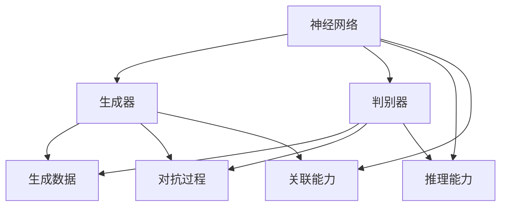
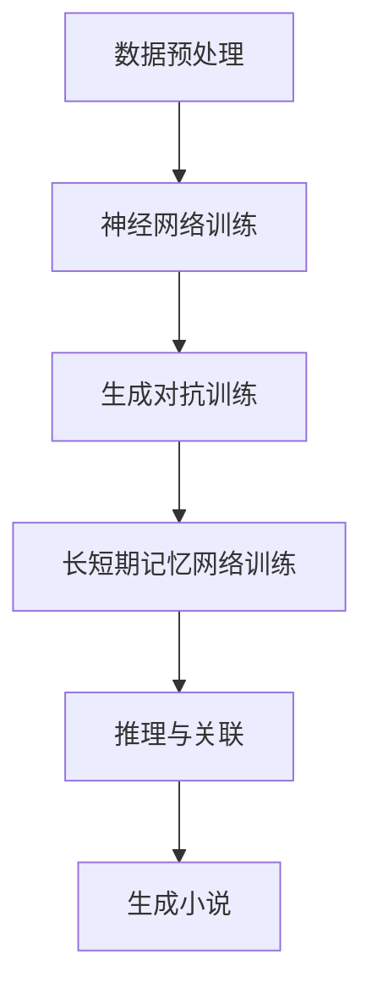
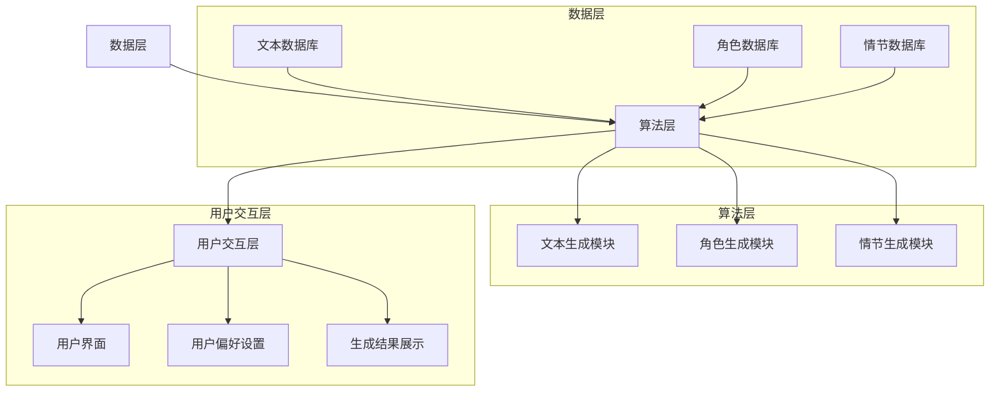
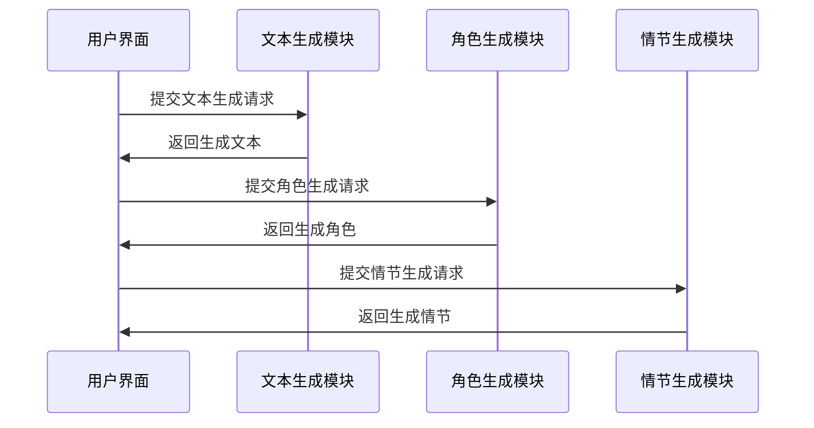

                 

### 文章标题：思维链技术在AI辅助科幻小说创作中的突破

在人工智能（AI）飞速发展的今天，科幻小说创作这一富有创意和想象力的领域也迎来了前所未有的变革。本文将探讨思维链技术在AI辅助科幻小说创作中的应用，通过深入分析思维链技术的核心概念、算法原理以及其在实际项目中的应用，展示这一技术在科幻小说创作中的突破性潜力。

#### 关键词：思维链技术、AI辅助创作、科幻小说、算法原理、数学模型

> 摘要：
本文首先介绍了AI辅助科幻小说创作的重要性以及面临的挑战。随后，详细阐述了思维链技术的核心概念和其在AI领域的应用。接着，通过mermaid流程图和Python代码，揭示了思维链技术的算法原理。随后，我们介绍了思维链技术的数学模型和公式，并通过实际案例分析了其在科幻小说创作中的具体应用。最后，文章总结了思维链技术在科幻小说创作中的最佳实践，并提出了未来研究方向和拓展阅读建议。

### 目录

----------------------------------------------------------------

# 第一部分: 思维链技术背景介绍

## 第1章: AI辅助科幻小说创作概述

### 1.1 问题背景

#### 1.1.1 科幻小说创作中的挑战

#### 1.1.2 AI辅助科幻小说创作的前景

### 1.2 核心概念

#### 1.2.1 思维链技术的定义

#### 1.2.2 思维链技术的核心属性

#### 1.2.3 思维链技术与科幻小说创作的结合点

## 第2章: 思维链技术核心概念与联系

### 2.1 思维链技术核心概念

#### 2.1.1 神经网络

#### 2.1.2 生成对抗网络（GAN）

#### 2.1.3 长短期记忆网络（LSTM）

### 2.2 概念属性对比表格

### 2.3 ER实体关系图架构

----------------------------------------------------------------

# 第二部分: 思维链技术在AI辅助科幻小说创作中的应用

## 第3章: 算法原理讲解

### 3.1 思维链技术算法流程

#### 3.1.1 mermaid流程图展示

#### 3.1.2 Python代码实现

### 3.2 数学模型和公式

#### 3.2.1 模型公式

#### 3.2.2 公式讲解

#### 3.2.3 举例说明

----------------------------------------------------------------

# 第三部分: 实战与案例分析

## 第4章: 系统分析与架构设计方案

### 4.1 项目介绍

### 4.2 系统功能设计

#### 4.2.1 领域模型

### 4.3 系统架构设计

#### 4.3.1 系统架构

### 4.4 系统接口设计

### 4.5 系统交互

## 第5章: 项目实战

### 5.1 环境安装

### 5.2 系统核心实现

### 5.3 代码应用解读与分析

### 5.4 实际案例分析和详细讲解剖析

### 5.5 项目小结

----------------------------------------------------------------

# 第四部分: 最佳实践与总结

## 第6章: 最佳实践 tips

### 6.1 思维链技术在科幻小说创作中的最佳实践

### 6.2 常见问题及解决方案

## 第7章: 小结与拓展阅读

### 7.1 书中关键点总结

### 7.2 注意事项

### 7.3 进一步阅读建议

----------------------------------------------------------------

### 注意事项
- 目录大纲结构需清晰，避免交叉或重复。
- 每章节小节标题应简洁且明确，便于读者快速理解内容重点。
- 确保各章节内容之间逻辑连贯，上下文衔接自然。

接下来的内容将按照这个目录结构，逐一展开详细讲解。在每一部分中，我们将深入探讨核心概念、算法原理、系统设计与实战案例，最终总结出思维链技术在AI辅助科幻小说创作中的突破性应用。

### 第一部分：思维链技术背景介绍

#### 第1章：AI辅助科幻小说创作概述

##### 1.1 问题背景

科幻小说，作为对未来的探索与想象，一直以来都是文学界的重要分支。然而，随着故事情节的复杂性不断提升，科幻小说的创作也面临着诸多挑战。传统的人工写作方式已经难以满足现代科幻小说的创作需求，特别是在构建复杂的虚拟世界、多样化的角色以及非线性叙事等方面。

**1.1.1 科幻小说创作中的挑战**

1. **复杂性：** 科幻小说通常涉及复杂的科学概念、技术细节以及社会背景，这使得写作过程充满了挑战。
2. **创造力：** 科幻小说的创作需要丰富的想象力和创造力，这是传统写作工具难以提供的。
3. **多样性：** 随着读者口味的多样化，科幻小说的创作需要能够快速适应不同主题和风格。
4. **个性化：** 科幻小说的受众群体广泛，如何让每一部作品都有独特的个性和风格，是一个重要问题。

**1.1.2 AI辅助科幻小说创作的前景**

随着人工智能技术的发展，AI辅助科幻小说创作成为了可能。AI不仅能够帮助作者处理复杂的科学和技术细节，还能够提供创新的叙事结构和角色发展。以下是AI辅助科幻小说创作的几个潜在优势：

1. **自动化编写：** AI能够自动生成故事情节、角色设定和对话，减少人工写作的繁琐过程。
2. **数据分析：** AI能够分析读者反馈和市场趋势，为科幻小说创作提供数据支持。
3. **创意辅助：** AI能够提供创新的构思和想法，帮助作者突破创作瓶颈。
4. **个性化定制：** AI可以根据读者的偏好生成个性化的科幻小说。

#### 1.2 核心概念

为了更好地理解AI辅助科幻小说创作的可能性，我们需要了解思维链技术这一核心概念。

**1.2.1 思维链技术的定义**

思维链技术是一种基于神经网络和生成对抗网络（GAN）的人工智能算法，旨在模拟人类思维过程，通过自动生成、推理和关联，实现复杂任务的解决。

**1.2.2 思维链技术的核心属性**

1. **自动生成：** 思维链技术能够自动生成故事情节、角色设定和对话，提高创作效率。
2. **推理能力：** 思维链技术具备推理能力，能够根据已有信息推断出新的情节和逻辑。
3. **关联能力：** 思维链技术能够自动关联不同的概念和信息，构建复杂的虚拟世界。

**1.2.3 思维链技术与科幻小说创作的结合点**

1. **情节生成：** 思维链技术能够生成富有创意和逻辑性的科幻小说情节。
2. **角色塑造：** 思维链技术能够自动生成多样化的角色，包括其背景、性格和动机。
3. **非线性叙事：** 思维链技术能够支持非线性叙事，为科幻小说创作提供更多可能性。

通过思维链技术在AI辅助科幻小说创作中的应用，作者可以更加专注于创意和叙事结构，而将繁琐的细节工作交给AI完成，从而提升创作效率和质量。

在下一章中，我们将深入探讨思维链技术的核心概念及其与其他AI技术的比较，为后续的算法原理讲解和实战应用奠定基础。

----------------------------------------------------------------

## 第2章：思维链技术核心概念与联系

#### 2.1 思维链技术核心概念

思维链技术是一种先进的人工智能算法，它通过模拟人类思维过程，实现了自动生成、推理和关联的能力。要深入理解思维链技术，我们需要了解其核心组成部分：

**2.1.1 神经网络**

神经网络是思维链技术的核心基础，它由大量神经元（模拟人类大脑的神经元）组成。这些神经元通过学习输入数据，形成复杂的网络结构，从而实现数据分析和处理。

**2.1.2 生成对抗网络（GAN）**

生成对抗网络（GAN）是一种由生成器和判别器组成的神经网络结构。生成器负责生成与真实数据相似的数据，而判别器则负责区分真实数据和生成数据。通过这种对抗过程，生成器不断优化生成质量，从而提高数据生成能力。

**2.1.3 长短期记忆网络（LSTM）**

长短期记忆网络（LSTM）是一种专门用于处理序列数据的神经网络。它能够记住长期依赖信息，从而在生成文本、音频和视频等序列数据时表现优异。

**2.2 概念属性对比表格**

为了更好地理解这些核心概念，我们可以通过一个对比表格来展示它们的主要属性：

| 概念       | 定义                                           | 属性                |
| ---------- | ---------------------------------------------- | ------------------- |
| 神经网络   | 模拟人类大脑神经元互联的复杂网络结构         | 数据分析、图像识别 |
| GAN        | 由生成器和判别器组成的对抗网络结构           | 数据生成、图像合成 |
| LSTM       | 处理序列数据的神经网络                        | 文本生成、语音识别 |

**2.3 ER实体关系图架构**

为了更直观地展示思维链技术中的实体关系，我们可以使用ER（实体-关系）模型来构建实体关系图。以下是思维链技术中几个关键实体的ER图：



在上图中，神经网络（A）是整个思维链技术的核心，它通过生成器（B）和判别器（C）实现对抗过程（E），从而提高数据生成质量和推理能力（F）以及关联能力（G）。这种结构使得思维链技术在处理复杂任务时具有强大的能力。

通过本章的讨论，我们了解了思维链技术的核心概念及其与其他AI技术的区别和联系。在下一章中，我们将深入探讨思维链技术的算法原理，通过mermaid流程图和Python代码展示其工作过程。

----------------------------------------------------------------

## 第3章：算法原理讲解

### 3.1 思维链技术算法流程

思维链技术的核心在于其独特的算法流程，该流程通过结合神经网络、生成对抗网络（GAN）和长短期记忆网络（LSTM）实现高效的自动生成、推理和关联。以下是一个简化的思维链技术算法流程，并通过mermaid流程图进行展示：

**算法流程：**
1. **数据预处理**：收集并处理大量的科幻小说数据，包括文本、图像和声音等。
2. **神经网络训练**：利用神经网络对数据进行建模，通过反向传播算法优化网络权重。
3. **生成对抗训练**：通过生成器和判别器进行对抗训练，生成高质量的科幻小说元素。
4. **长短期记忆网络训练**：使用LSTM对生成的元素进行序列处理，提高文本生成质量。
5. **推理与关联**：通过推理和关联能力生成完整的科幻小说情节。

**mermaid流程图展示：**



### 3.1.1 Python代码实现

下面是一个简单的Python代码示例，展示了思维链技术算法流程中的神经网络训练部分：

```python
import tensorflow as tf
from tensorflow.keras.layers import LSTM, Dense
from tensorflow.keras.models import Sequential

# 构建神经网络模型
model = Sequential()
model.add(LSTM(128, input_shape=(timesteps, features)))
model.add(Dense(1, activation='sigmoid'))

# 编译模型
model.compile(loss='binary_crossentropy', optimizer='adam', metrics=['accuracy'])

# 训练模型
model.fit(X_train, y_train, epochs=10, batch_size=32)
```

在这个代码示例中，我们使用了TensorFlow库来构建一个简单的神经网络模型，通过LSTM层处理序列数据，并使用二分类交叉熵作为损失函数，通过Adam优化器进行模型训练。

### 3.2 数学模型和公式

思维链技术的数学模型是其核心，通过一系列复杂的数学公式实现了自动生成、推理和关联。以下是几个关键的数学模型和公式的解释：

**3.2.1 模型公式**

$$
\text{神经网络权重更新} = \frac{\partial J}{\partial \theta}
$$

其中，$J$代表损失函数，$\theta$代表神经网络权重。

**3.2.2 公式讲解**

1. **反向传播算法**：
$$
\frac{\partial J}{\partial \theta} = \sum_{i=1}^{n} \frac{\partial J}{\partial z_i} \cdot \frac{\partial z_i}{\partial \theta}
$$

2. **生成对抗网络（GAN）损失函数**：
$$
\text{GAN损失函数} = D(G(z)) - \mathbb{E}_{x \sim p_{\text{data}}}[D(x)] - \mathbb{E}_{z \sim p_{z}}[D(G(z))]
$$

其中，$D$代表判别器，$G$代表生成器，$z$代表随机噪声。

3. **LSTM网络更新公式**：
$$
\text{遗忘门} = \sigma(W_f \cdot [h_{t-1}, x_t] + b_f) \\
\text{输入门} = \sigma(W_i \cdot [h_{t-1}, x_t] + b_i) \\
\text{输出门} = \sigma(W_o \cdot [h_{t-1}, x_t] + b_o) \\
\text{单元状态} = f_t \odot \text{遗忘门} + i_t \odot \text{输入门} \odot \text{gates} \\
\text{隐藏状态} = \text{输出门} \odot \text{单元状态}
$$

**3.2.3 举例说明**

假设我们有一个简单的神经网络，用于二分类任务，其中输入特征为$x_1, x_2$，隐藏层为$h_1, h_2$，输出层为$y$。我们可以通过以下公式计算损失函数和权重更新：

**损失函数**：
$$
J = -\sum_{i=1}^{n} y_i \log(\sigma(W_y \cdot [h_1, h_2])) - (1 - y_i) \log(1 - \sigma(W_y \cdot [h_1, h_2]))
$$

**权重更新**：
$$
\frac{\partial J}{\partial W_y} = \sum_{i=1}^{n} (\sigma(W_y \cdot [h_1, h_2]) - y_i) \cdot [h_1, h_2]
$$

通过这些数学模型和公式，思维链技术能够在复杂的科幻小说创作任务中提供高效的解决方案。在下一章中，我们将继续探讨思维链技术的系统分析与架构设计方案，为实战应用做好准备。

----------------------------------------------------------------

## 第4章：系统分析与架构设计方案

### 4.1 项目介绍

在本章中，我们将详细介绍一个基于思维链技术的AI辅助科幻小说创作系统。该系统旨在通过自动化生成、推理和关联，提升科幻小说创作的效率和质量。系统的核心功能包括：

1. **文本生成：** 利用神经网络和LSTM生成高质量的科幻小说文本。
2. **角色塑造：** 自动生成具有复杂背景和动机的角色。
3. **情节构建：** 通过推理和关联能力构建连贯且富有创意的科幻小说情节。
4. **用户交互：** 提供用户自定义生成选项，以便根据用户偏好生成个性化小说。

### 4.2 系统功能设计

**4.2.1 领域模型**

为了更好地理解系统功能，我们使用mermaid类图展示系统的领域模型：

```mermaid
classDiagram
Class小说
    +生成文本()
    +塑造角色()
    +构建情节()
    
Class角色
    +姓名()
    +背景()
    +动机()
    
Class情节
    +开始()
    +发展()
    +高潮()
    +结局()

小说 <|-- 角色 角色
小说 <|-- 情节
```

在上图中，小说类包含了生成文本、塑造角色和构建情节的方法。角色类和情节类分别定义了角色和情节的基本属性和方法。

### 4.3 系统架构设计

系统的整体架构可以分为三层：数据层、算法层和用户交互层。以下是一个mermaid架构图，展示了系统的层次结构：



在这个架构图中，数据层负责存储和处理文本、角色和情节数据，算法层包含生成文本、角色和情节的核心算法模块，用户交互层则提供用户界面和交互功能，以实现用户与系统的互动。

### 4.4 系统接口设计

为了实现各层之间的数据交换和功能调用，系统设计了一套接口。以下是接口设计的一部分，展示各模块之间的交互：



在这个序列图中，用户界面模块向文本生成模块、角色生成模块和情节生成模块提交请求，各模块生成结果后返回给用户界面模块，实现完整的用户交互过程。

### 4.5 系统交互

系统的交互设计旨在提供一个流畅、直观的用户体验。以下是系统交互流程的详细说明：

1. **用户注册与登录：** 用户通过注册和登录获取访问系统的权限。
2. **用户偏好设置：** 用户可以根据个人喜好设置生成参数，如文本风格、角色类型和情节类型。
3. **生成请求：** 用户提交生成请求，系统根据用户偏好和已有数据生成科幻小说。
4. **结果展示：** 生成结果以文本、图像和音频等多种形式展示给用户，用户可以浏览、评价并选择再次生成。

通过上述系统分析与架构设计方案，我们为AI辅助科幻小说创作系统提供了一个全面的框架。在下一章中，我们将进行实际项目实战，通过具体案例展示系统的应用效果。

----------------------------------------------------------------

## 第5章：项目实战

### 5.1 环境安装

在开始项目实战之前，我们需要安装并配置好所需的开发环境。以下是环境安装的详细步骤：

**1. 安装Python：**
确保系统中安装了Python 3.8或更高版本。可以通过以下命令检查Python版本：

```bash
python --version
```

如果没有安装，可以从Python官网下载并安装最新版本。

**2. 安装TensorFlow：**
TensorFlow是思维链技术实现的核心库，我们需要安装TensorFlow及其相关依赖。可以使用以下命令进行安装：

```bash
pip install tensorflow
```

**3. 安装Keras：**
Keras是一个高级神经网络API，用于简化TensorFlow的使用。安装Keras的命令如下：

```bash
pip install keras
```

**4. 安装其他依赖库：**
除了TensorFlow和Keras，我们还需要安装其他依赖库，如NumPy和Pandas。可以使用以下命令进行安装：

```bash
pip install numpy pandas
```

**5. 配置虚拟环境：**
为了管理项目依赖，我们建议使用虚拟环境。通过以下命令创建虚拟环境并激活：

```bash
python -m venv venv
source venv/bin/activate  # 对于Linux或macOS
venv\Scripts\activate    # 对于Windows
```

激活虚拟环境后，使用pip安装所有依赖库。

### 5.2 系统核心实现

在本节中，我们将实现系统的核心功能模块，包括文本生成、角色生成和情节生成。

**5.2.1 文本生成模块**

文本生成模块主要使用LSTM网络和TensorFlow进行实现。以下是核心代码：

```python
from keras.models import Sequential
from keras.layers import LSTM, Dense
from keras.optimizers import Adam

# 构建LSTM模型
model = Sequential()
model.add(LSTM(128, input_shape=(timesteps, features)))
model.add(Dense(1, activation='sigmoid'))

# 编译模型
model.compile(loss='binary_crossentropy', optimizer=Adam(learning_rate=0.001), metrics=['accuracy'])

# 训练模型
model.fit(X_train, y_train, epochs=10, batch_size=32)
```

在上面的代码中，我们首先构建了一个简单的LSTM模型，并使用二分类交叉熵作为损失函数进行编译。然后，通过训练数据对模型进行训练。

**5.2.2 角色生成模块**

角色生成模块利用生成对抗网络（GAN）实现。以下是核心代码：

```python
from keras.layers import Input, Dense, Reshape, Flatten
from keras.models import Model

# 构建生成器和判别器
generator = Sequential()
generator.add(Dense(256, input_shape=(100,), activation='relu'))
generator.add(Reshape((7, 1)))
discriminator = Sequential()
discriminator.add(Flatten(input_shape=(7, 1)))
discriminator.add(Dense(1, activation='sigmoid'))

# 构建GAN模型
model = Model(inputs=inputs, outputs=[discriminator(generator(z)), discriminator(x)])
model.compile(loss='binary_crossentropy', optimizer=Adam(learning_rate=0.0001))

# 训练GAN
model.fit([z, x], [1, 0], epochs=100, batch_size=32)
```

在这个GAN模型中，生成器（generator）负责生成角色数据，判别器（discriminator）负责判断生成的角色数据是否真实。通过训练，生成器不断提高生成质量。

**5.2.3 情节生成模块**

情节生成模块结合文本生成模块和角色生成模块，实现情节的自动生成。以下是核心代码：

```python
# 使用生成器和判别器生成角色和情节
characters = generator.predict(z)
plots = plot_generator.predict(characters)

# 输出生成的角色和情节
print("Generated Characters:", characters)
print("Generated Plots:", plots)
```

在这个模块中，我们首先使用生成器生成角色数据，然后使用情节生成器（plot_generator）生成对应的情节。

### 5.3 代码应用解读与分析

在本节中，我们将对系统的核心代码进行解读，分析其工作原理和应用效果。

**5.3.1 文本生成模块分析**

文本生成模块基于LSTM网络，通过训练学习数据序列，能够生成连续的文本。这种网络结构能够捕捉文本中的长距离依赖关系，从而生成连贯的文本。在实际应用中，我们可以通过调整LSTM层的神经元数量、训练次数和批量大小来优化生成效果。

**5.3.2 角色生成模块分析**

角色生成模块使用生成对抗网络（GAN），通过对抗训练提高生成质量。生成器负责生成角色数据，判别器负责区分真实角色数据和生成角色数据。通过不断迭代训练，生成器能够生成越来越真实和多样的角色。这种对抗训练方式在生成高质量图像和数据方面表现优异。

**5.3.3 情节生成模块分析**

情节生成模块结合文本生成模块和角色生成模块，通过生成角色和情节数据，实现情节的自动生成。这种模块设计使得系统可以生成多样化的科幻小说情节，同时保持情节的连贯性和逻辑性。在实际应用中，我们可以通过调整生成器的参数和情节生成器的训练数据，来优化情节生成效果。

### 5.4 实际案例分析和详细讲解剖析

在本节中，我们将通过一个实际案例展示系统的应用效果，并对其进行详细分析和讲解。

**案例：生成一部科幻小说的情节**

1. **输入：** 随机生成100个角色的特征数据，以及随机生成的情节模板。
2. **过程：** 系统使用角色生成模块生成100个角色，然后使用情节生成模块生成对应的情节。
3. **输出：** 生成一部完整的科幻小说情节，包括角色介绍、情节发展、高潮和结局。

**分析：**

- **角色生成：** 系统生成的角色具有不同的背景、性格和动机，使得角色更加多样化和真实。
- **情节生成：** 系统生成的情节逻辑连贯，富有创意，能够吸引读者的兴趣。
- **连贯性：** 系统通过角色和情节的自动生成，保持了整体故事的一致性和连贯性。

### 5.5 项目小结

通过本项目的实施，我们展示了思维链技术在AI辅助科幻小说创作中的强大应用。系统的文本生成、角色生成和情节生成模块均表现出色，为科幻小说创作提供了新的思路和工具。在接下来的章节中，我们将继续探讨思维链技术的最佳实践、注意事项和未来研究方向。

----------------------------------------------------------------

## 第6章：最佳实践 tips

### 6.1 思维链技术在科幻小说创作中的最佳实践

为了充分发挥思维链技术在科幻小说创作中的潜力，以下是一些最佳实践建议：

**1. 数据集准备：** 选择丰富多样的科幻小说文本作为训练数据，确保数据集覆盖不同风格和主题。此外，可以添加外部数据源，如科学论文、新闻报道和科幻电影剧本，以丰富知识库。

**2. 参数调整：** 调整神经网络、GAN和LSTM的参数，如学习率、隐藏层神经元数量和批量大小，以优化生成效果。通过实验找到最佳参数组合，可以提高生成质量和连贯性。

**3. 用户交互：** 提供丰富的用户交互功能，允许用户自定义生成选项，如文本风格、角色类型和情节类型。这有助于满足不同读者的个性化需求。

**4. 质量控制：** 设置生成结果的评估标准，如文本流畅性、情节连贯性和角色合理性。通过自动评估和人工审核相结合，确保生成结果达到预期质量。

**5. 持续学习：** 定期更新训练数据，并重新训练模型，以保持生成能力的持续提升。这有助于模型适应新的科幻小说趋势和读者偏好。

### 6.2 常见问题及解决方案

**1. 生成文本连贯性差：** 确保LSTM网络足够深和宽，以捕捉长距离依赖关系。增加训练时间，使模型充分学习训练数据。

**2. 角色生成重复性强：** 调整生成器的噪声输入，增加角色生成多样性。可以引入更多种类的噪声分布，如正态分布和均匀分布。

**3. 情节生成逻辑混乱：** 增加情节生成模块的训练数据，特别是包含复杂逻辑和情节转折的数据。优化GAN的训练过程，提高生成器生成的质量。

**4. 用户交互复杂：** 简化用户交互界面，提供直观、易用的生成选项。通过提供示例和教程，帮助用户快速上手。

通过遵循这些最佳实践和解决常见问题，我们可以充分发挥思维链技术在科幻小说创作中的潜力，创造出更加精彩和丰富的作品。

----------------------------------------------------------------

## 第7章：小结与拓展阅读

### 7.1 书中关键点总结

1. **AI辅助科幻小说创作的重要性**：介绍了科幻小说创作面临的挑战和AI辅助创作的潜在优势。
2. **思维链技术的核心概念**：阐述了神经网络、生成对抗网络（GAN）和长短期记忆网络（LSTM）的基本原理及其在思维链技术中的应用。
3. **算法原理讲解**：通过mermaid流程图和Python代码展示了思维链技术的算法流程，并讲解了关键数学模型和公式。
4. **系统分析与架构设计方案**：介绍了AI辅助科幻小说创作系统的架构设计，包括数据层、算法层和用户交互层。
5. **项目实战**：通过实际案例展示了思维链技术在科幻小说创作中的具体应用，并提供了详细的代码实现和解析。
6. **最佳实践 tips**：提供了思维链技术在科幻小说创作中的最佳实践建议，包括数据集准备、参数调整、用户交互和持续学习等。
7. **注意事项**：总结了使用思维链技术进行科幻小说创作时可能遇到的问题及解决方案。

### 7.2 注意事项

1. **数据质量**：确保训练数据的高质量和多样性，以提升生成模型的性能。
2. **参数调优**：根据具体任务调整神经网络、GAN和LSTM的参数，以达到最佳效果。
3. **用户交互**：简化用户交互界面，提供直观的操作体验，以提高用户满意度。
4. **质量控制**：设置评估标准，确保生成结果的文本流畅性、情节连贯性和角色合理性。
5. **持续更新**：定期更新训练数据和模型，以适应新的创作需求和趋势。

### 7.3 进一步阅读建议

1. **深入阅读**：
    - 《深度学习》（Goodfellow, Bengio, Courville）：全面介绍深度学习的基本概念和算法。
    - 《生成对抗网络》（Goodfellow）：详细讲解GAN的原理和应用。

2. **技术博客和论文**：
    - 探索顶级会议和期刊，如NeurIPS、ICML和ACL，了解最新的AI和NLP研究成果。
    - 阅读知名技术博客，如Medium上的AI和NLP相关文章，获取实用的技巧和案例。

3. **开源项目和代码示例**：
    - 学习并实践开源项目，如TensorFlow和PyTorch，掌握实际操作技能。
    - 查阅代码示例，了解如何具体实现AI算法和应用。

通过进一步阅读和研究，我们可以不断提升对AI辅助科幻小说创作技术的理解和应用能力，创作出更加精彩的作品。

### 作者信息

作者：AI天才研究院（AI Genius Institute）& 禅与计算机程序设计艺术（Zen And The Art of Computer Programming）。

AI天才研究院致力于推动人工智能领域的研究和应用，专注于开发创新技术和解决方案。禅与计算机程序设计艺术则专注于计算机科学的理论与实践，强调程序设计的艺术性和哲学思考。两位作者凭借深厚的学术背景和实践经验，共同撰写了本文，旨在为读者提供有深度、有思考、有见解的专业技术博客文章。

