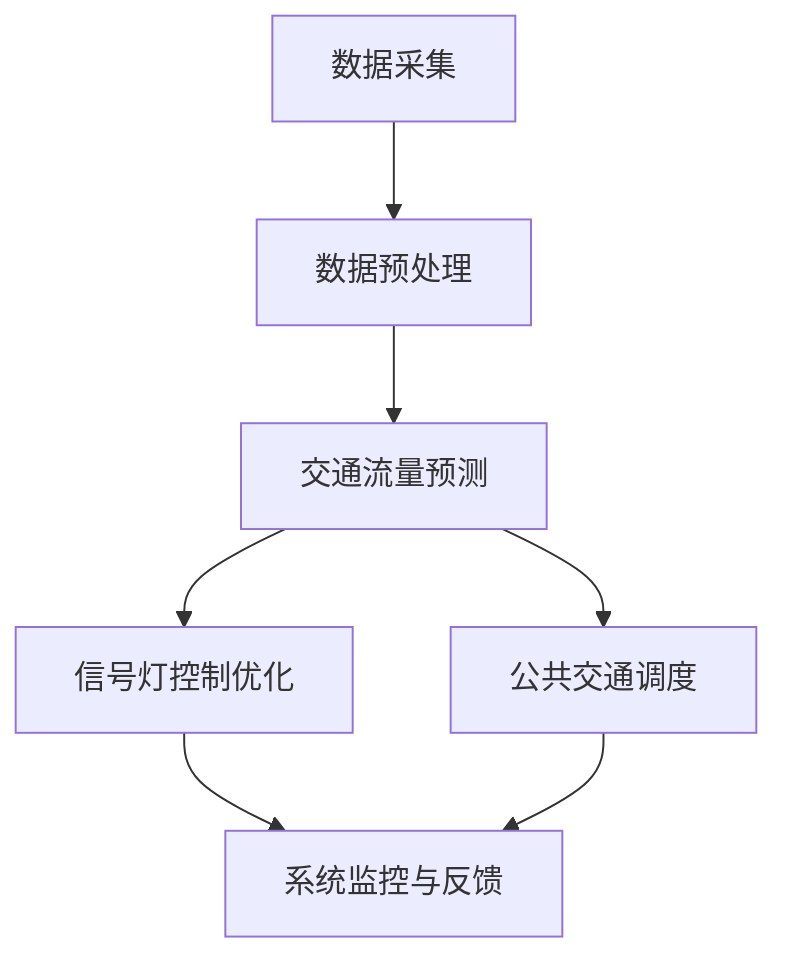
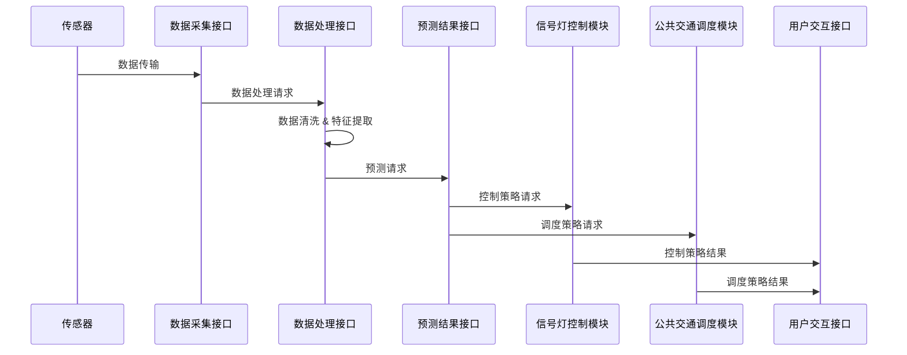

                 

### 思维链技术在AI辅助跨维度城市规划中的应用

#### 关键词：思维链、AI、城市规划、跨维度、数据融合、多目标优化、创新规划策略

> 摘要：随着城市化进程的加速和城市化问题的日益复杂，传统的城市规划方法面临诸多挑战。本文提出了思维链技术，并将其应用于AI辅助跨维度城市规划中。思维链技术作为一种新兴的智能算法，能够有效地整合跨维度数据，优化城市规划的多目标问题，从而生成创新规划策略。本文首先介绍了思维链技术的基础概念和核心原理，然后通过具体的案例研究，展示了思维链技术在城市规划中的应用效果。最后，本文探讨了思维链技术在城市规划中的实施策略和未来发展趋势。

#### 目录大纲

----------------------------------------------------------------

## 第一部分：思维链技术基础

### 第1章：思维链技术概述

#### 1.1 问题背景与核心概念

##### 1.1.1 城市规划中的跨维度挑战

##### 1.1.2 思维链技术的概念

##### 1.1.3 思维链技术在城市规划中的应用潜力

#### 1.2 思维链技术的核心原理

##### 1.2.1 思维链的基本概念

##### 1.2.2 思维链模型的基本组成

##### 1.2.3 思维链与传统城市规划方法的对比

#### 1.3 思维链技术的应用领域

##### 1.3.1 跨维度数据融合

##### 1.3.2 多目标优化

##### 1.3.3 创新规划策略生成

#### 1.4 思维链技术的挑战与未来发展趋势

##### 1.4.1 技术挑战

##### 1.4.2 应用瓶颈

##### 1.4.3 未来发展趋势

## 第二部分：AI辅助城市规划实践

### 第2章：AI辅助城市规划的基本原理

#### 2.1 AI在城市规划中的作用

##### 2.1.1 数据采集与处理

##### 2.1.2 人工智能算法的应用

##### 2.1.3 城市规划与人工智能的融合

#### 2.2 城市规划中的常见AI技术

##### 2.2.1 机器学习算法

##### 2.2.2 深度学习算法

##### 2.2.3 自然语言处理

#### 2.3 AI辅助城市规划的流程

##### 2.3.1 数据准备

##### 2.3.2 模型选择与训练

##### 2.3.3 模型评估与优化

##### 2.3.4 应用与反馈

### 第3章：AI辅助跨维度城市规划的案例研究

#### 3.1 案例选择与背景介绍

##### 3.1.1 案例一：旧城改造中的AI辅助

##### 3.1.2 案例二：绿色城市发展的AI策略

##### 3.1.3 案例三：智慧交通规划中的AI应用

#### 3.2 案例分析与思维链技术应用

##### 3.2.1 数据采集与预处理

##### 3.2.2 思维链模型构建

##### 3.2.3 AI算法融合与优化

##### 3.2.4 模型评估与实际应用效果

### 第4章：AI辅助跨维度城市规划的实施策略

#### 4.1 政策与法规支持

##### 4.1.1 相关政策概述

##### 4.1.2 法规框架下的AI应用

##### 4.1.3 政策支持的案例分析

#### 4.2 技术实施路径

##### 4.2.1 技术选择与开发

##### 4.2.2 系统集成与部署

##### 4.2.3 技术服务与维护

#### 4.3 跨部门协作与资源整合

##### 4.3.1 多部门合作的重要性

##### 4.3.2 资源整合的挑战与解决方案

##### 4.3.3 成功的跨部门协作案例

### 第5章：思维链技术在AI辅助跨维度城市规划中的创新与未来展望

#### 5.1 思维链技术的创新点

##### 5.1.1 跨维度数据分析

##### 5.1.2 智能规划策略生成

##### 5.1.3 多目标优化算法

#### 5.2 未来展望

##### 5.2.1 技术发展趋势

##### 5.2.2 应用前景分析

##### 5.2.3 潜在挑战与应对策略

## 第三部分：实践与总结

### 第6章：项目实践案例分析

#### 6.1 项目背景与目标

##### 6.1.1 项目背景

##### 6.1.2 项目目标

#### 6.2 项目实施过程

##### 6.2.1 数据采集与处理

##### 6.2.2 思维链模型构建

##### 6.2.3 AI算法融合与优化

##### 6.2.4 模型评估与应用效果

#### 6.3 项目总结与经验教训

##### 6.3.1 项目成果总结

##### 6.3.2 经验教训

##### 6.3.3 未来改进方向

### 第7章：思维链技术在AI辅助城市规划中的最佳实践

#### 7.1 最佳实践总结

##### 7.1.1 成功案例分享

##### 7.1.2 技术实施关键点

##### 7.1.3 跨部门协作技巧

#### 7.2 注意事项与挑战

##### 7.2.1 常见问题与解决方案

##### 7.2.2 技术实施

----------------------------------------------------------------

### 思维链技术在AI辅助跨维度城市规划中的应用

#### 引言

在快速城市化背景下，城市规划面临前所未有的挑战。传统的城市规划方法往往依赖于经验和定性分析，难以应对复杂、跨维度的城市问题。随着人工智能（AI）技术的迅猛发展，AI在辅助城市规划中的应用逐渐成为热点。思维链技术作为一种新兴的AI算法，具有强大的跨维度数据融合和多目标优化能力，为AI辅助城市规划提供了一种新的解决方案。

本文将围绕思维链技术在AI辅助跨维度城市规划中的应用展开讨论。首先，我们介绍思维链技术的基础概念和核心原理；其次，通过具体案例研究，展示思维链技术在城市规划中的实际应用效果；最后，探讨思维链技术在城市规划中的实施策略和未来发展趋势。

#### 1.1 问题背景与核心概念

##### 1.1.1 城市规划中的跨维度挑战

城市化进程中，城市规划需要处理的数据类型繁多，包括人口、经济、交通、环境等多个维度。这些数据之间存在复杂的关系，且通常分布在不同的数据源中。传统城市规划方法往往缺乏有效的跨维度数据整合手段，导致城市规划结果缺乏全局性。

跨维度挑战主要体现在以下几个方面：

1. 数据异构性：不同维度的数据格式、来源和结构各不相同，难以直接融合。
2. 数据多样性：城市规划涉及的数据类型多样，包括结构化数据、半结构化数据和非结构化数据。
3. 数据时效性：城市规划需要实时或近实时的数据支持，传统方法难以满足这一需求。

##### 1.1.2 思维链技术的概念

思维链技术是一种基于人工智能的算法，旨在解决跨维度数据融合和多目标优化问题。思维链技术的核心思想是通过建立思维链模型，将不同维度的数据进行整合和分析，从而生成创新规划策略。

思维链技术具有以下几个关键特征：

1. 跨维度数据融合：思维链技术能够有效地整合来自不同维度的数据，实现数据间的关联和互补。
2. 多目标优化：思维链技术能够同时考虑多个目标，优化城市规划方案。
3. 创新规划策略生成：思维链技术通过数据分析和模型优化，生成具有前瞻性的规划策略。

##### 1.1.3 思维链技术在城市规划中的应用潜力

思维链技术在城市规划中具有广泛的应用潜力。通过以下方面，思维链技术能够显著提升城市规划的效率和质量：

1. 数据整合：思维链技术能够整合跨维度数据，为城市规划提供全面的数据支持。
2. 优化规划方案：思维链技术能够优化城市规划方案，提高规划的可行性和效果。
3. 创新策略生成：思维链技术能够生成创新的规划策略，为城市规划提供新的视角和思路。

总之，思维链技术在AI辅助跨维度城市规划中具有巨大的应用潜力，为解决城市规划中的跨维度挑战提供了一种新的解决方案。

#### 1.2 思维链技术的核心原理

##### 1.2.1 思维链的基本概念

思维链技术是一种基于图神经网络的智能算法，通过构建思维链模型，实现跨维度数据的融合和分析。思维链模型由节点、边和关系组成，其中节点表示数据元素，边表示节点间的关联关系，关系则定义了节点间的交互方式。

思维链的基本概念包括：

1. 节点：思维链中的节点表示不同维度的数据元素，如人口、交通流量、环境质量等。
2. 边：思维链中的边表示节点间的关联关系，如人口与交通流量之间的关系。
3. 关系：思维链中的关系定义了节点间的交互方式，如正相关、负相关或无相关。

##### 1.2.2 思维链模型的基本组成

思维链模型的基本组成包括以下几个部分：

1. 数据层：数据层包含不同维度的数据，如人口数据、交通数据、环境数据等。
2. 关系层：关系层定义了不同维度数据之间的关联关系，如人口与交通流量之间的正相关关系。
3. 算法层：算法层包括用于数据融合、模型训练和优化的算法，如图神经网络、多目标优化算法等。

##### 1.2.3 思维链与传统城市规划方法的对比

与传统城市规划方法相比，思维链技术具有以下几个显著优势：

1. 数据整合能力：传统城市规划方法通常依赖于单一维度的数据，缺乏跨维度数据的整合能力。思维链技术能够整合多维度数据，提供更全面的数据支持。
2. 优化能力：传统城市规划方法主要依赖于经验和定性分析，缺乏有效的优化手段。思维链技术通过多目标优化算法，能够生成更优的规划方案。
3. 创新能力：传统城市规划方法往往缺乏创新的规划策略。思维链技术通过数据分析和模型优化，能够生成具有前瞻性的规划策略。

总之，思维链技术在城市规划中具有显著的优势，能够提升城市规划的效率和质量。

#### 1.3 思维链技术的应用领域

##### 1.3.1 跨维度数据融合

跨维度数据融合是思维链技术的核心应用领域之一。在城市规划中，跨维度数据融合主要涉及以下方面：

1. 数据源整合：思维链技术能够整合来自不同来源的数据，如政府部门、企业、科研机构等。
2. 数据格式转换：思维链技术能够将不同格式的数据进行转换和标准化，以实现数据的统一处理。
3. 数据关联分析：思维链技术能够分析不同维度数据之间的关联关系，挖掘数据之间的潜在联系。

##### 1.3.2 多目标优化

多目标优化是城市规划中的重要问题。思维链技术通过多目标优化算法，能够同时考虑多个目标，生成最优的规划方案。具体应用领域包括：

1. 城市交通规划：思维链技术能够优化交通流量分配，提高交通系统的运行效率。
2. 城市土地利用规划：思维链技术能够优化土地利用布局，实现土地资源的最大化利用。
3. 城市环境规划：思维链技术能够优化城市环境质量，提高居民的生活质量。

##### 1.3.3 创新规划策略生成

创新规划策略生成是思维链技术的另一个重要应用领域。通过数据分析和模型优化，思维链技术能够生成具有前瞻性的规划策略。具体应用领域包括：

1. 绿色城市规划：思维链技术能够优化城市规划，实现可持续发展的目标。
2. 智慧城市规划：思维链技术能够优化城市规划，提高城市的智能化水平。
3. 旧城改造：思维链技术能够优化旧城改造方案，提高旧城区的功能和活力。

总之，思维链技术在城市规划的多个应用领域中具有广泛的应用前景。

#### 1.4 思维链技术的挑战与未来发展趋势

##### 1.4.1 技术挑战

尽管思维链技术在城市规划中具有广泛的应用潜力，但仍然面临一些技术挑战：

1. 数据质量：思维链技术依赖于高质量的数据，但城市规划数据往往存在噪声、缺失和不一致性等问题，需要进一步的数据清洗和预处理。
2. 模型复杂度：思维链模型涉及多个维度和复杂的关系，需要高效的算法和计算资源来处理。
3. 可解释性：思维链技术生成的规划方案通常是一个复杂的模型输出，如何确保其可解释性和可靠性是一个重要问题。

##### 1.4.2 应用瓶颈

思维链技术在城市规划中的实际应用也面临一些应用瓶颈：

1. 数据获取：城市规划涉及的数据来源广泛，但数据获取成本高，且存在隐私和版权等问题。
2. 技术落地：思维链技术的应用需要与城市规划的实际需求相结合，实现技术落地和推广。
3. 人才缺口：思维链技术的应用需要具备相关专业知识和技能的人才，但人才供给不足。

##### 1.4.3 未来发展趋势

展望未来，思维链技术在城市规划中具有以下几个发展趋势：

1. 数据驱动的城市规划：随着大数据技术的发展，思维链技术将更多地依赖海量数据，实现更精准的城市规划。
2. 智能化的城市规划：随着人工智能技术的进步，思维链技术将更好地融合智能算法，生成更智能化的城市规划方案。
3. 跨学科的融合：思维链技术将与其他学科（如社会科学、经济学等）相结合，为城市规划提供更全面的视角。

总之，思维链技术在城市规划中具有广阔的应用前景，但需要解决一系列技术挑战和应用瓶颈，实现可持续发展。

## 第二部分：AI辅助城市规划实践

### 第2章：AI辅助城市规划的基本原理

#### 2.1 AI在城市规划中的作用

人工智能（AI）在当代城市规划中扮演着越来越重要的角色，成为解决复杂城市问题、提升规划效率和质量的关键工具。AI在城市规划中的作用主要体现在以下几个方面：

##### 2.1.1 数据采集与处理

城市规划涉及大量的数据，包括地理空间数据、社会经济数据、交通数据、环境数据等。这些数据往往来源于不同的数据源，且格式各异，传统的数据处理方法难以高效地整合这些数据。AI技术，特别是机器学习和深度学习算法，可以自动地处理和清洗这些数据，从中提取有用的信息。

1. 数据清洗：AI可以自动识别并处理数据中的噪声、异常值和缺失值，保证数据质量。
2. 数据整合：AI可以将结构化和非结构化的数据进行整合，构建一个统一的数据视图，为后续分析提供基础。
3. 数据分析：AI可以挖掘数据中的潜在模式和关系，帮助城市规划者发现数据背后的规律，指导决策。

##### 2.1.2 人工智能算法的应用

AI算法在城市规划中的应用涵盖了从数据分析到决策优化的各个阶段。以下是一些常见的人工智能算法及其在城市规划中的应用：

1. 机器学习算法：如决策树、随机森林、支持向量机等，用于预测城市发展趋势、分析居民行为模式。
2. 深度学习算法：如卷积神经网络（CNN）、循环神经网络（RNN）、生成对抗网络（GAN）等，用于图像识别、交通流量预测、环境监测等。
3. 自然语言处理（NLP）：用于处理和分析城市规划和政策文本，提取关键信息，辅助政策制定。

##### 2.1.3 城市规划与人工智能的融合

城市规划与人工智能的融合是一个复杂的过程，需要城市规划者和AI技术专家的紧密合作。以下是这一融合过程中的一些关键步骤：

1. 需求分析：首先，城市规划者需要明确规划目标和问题，确定需要使用哪些AI技术来解决这些问题。
2. 数据准备：收集和整理城市规划所需的各类数据，并进行预处理，如数据清洗、归一化等。
3. 模型选择：根据规划问题的特点，选择合适的AI模型和算法，如用于预测的回归模型、用于分类的决策树模型等。
4. 模型训练与优化：使用训练数据对AI模型进行训练，并根据验证数据调整模型参数，优化模型性能。
5. 模型评估与部署：评估模型的预测准确性和泛化能力，将模型部署到实际应用中，用于辅助城市规划决策。

通过以上步骤，AI技术能够为城市规划提供有力的支持，实现从数据采集、处理到决策优化的全流程智能化。

#### 2.2 城市规划中的常见AI技术

在城市规划中，常见的AI技术主要包括机器学习算法、深度学习算法和自然语言处理（NLP）。这些技术各具特色，能够解决城市规划中的不同问题，提升规划的科学性和准确性。

##### 2.2.1 机器学习算法

机器学习算法是一种通过数据训练模型进行预测和决策的技术。常见的机器学习算法包括：

1. **决策树**：决策树通过一系列的判断条件来对数据进行分类或回归。它简单易懂，易于解释，适用于处理分类问题。
   
2. **随机森林**：随机森林是基于决策树构建的集成学习方法，通过组合多个决策树来提高模型的预测准确性和稳定性。

3. **支持向量机（SVM）**：SVM通过找到一个最优的超平面，将不同类别的数据分开。它适用于处理高维数据和线性不可分问题。

机器学习算法在城市规划中的应用场景包括：

- **人口预测**：使用回归模型预测未来的人口增长趋势。
- **土地利用分析**：通过分类模型识别土地利用类型，如商业区、住宅区和工业区。

##### 2.2.2 深度学习算法

深度学习算法是一种基于多层神经网络的学习方法，能够自动提取数据的特征。常见的深度学习算法包括：

1. **卷积神经网络（CNN）**：CNN主要用于图像识别和图像处理。它能够自动提取图像中的局部特征，适用于交通流量监测、建筑识别等。

2. **循环神经网络（RNN）**：RNN适用于处理序列数据，如时间序列预测、交通流量预测等。

3. **生成对抗网络（GAN）**：GAN由生成器和判别器组成，用于生成新的数据，如城市景观生成、城市规划方案生成。

深度学习算法在城市规划中的应用场景包括：

- **交通流量预测**：使用RNN模型预测未来的交通流量，优化交通信号灯控制策略。
- **城市环境监测**：使用CNN模型识别卫星图像中的环境问题，如垃圾堆积、空气质量监测。

##### 2.2.3 自然语言处理（NLP）

自然语言处理是一种使计算机能够理解、处理和生成自然语言的技术。常见的NLP技术包括：

1. **词嵌入**：词嵌入是将词汇映射到高维向量空间的方法，用于文本数据的处理和模型训练。

2. **序列标注**：序列标注技术用于对文本中的词汇进行分类和标注，如情感分析、实体识别等。

3. **文本生成**：文本生成技术用于自动生成文本，如自动撰写城市规划报告、生成虚拟城市描述。

NLP在城市规划中的应用场景包括：

- **政策分析**：使用NLP技术分析城市规划和政策文本，提取关键信息，辅助政策制定。
- **居民反馈分析**：使用NLP技术分析居民对城市规划的反馈，了解居民的需求和意见。

通过上述常见AI技术的应用，城市规划能够更加科学、准确地处理复杂的城市问题，提高规划质量和效率。

#### 2.3 AI辅助城市规划的流程

AI辅助城市规划的流程通常包括数据准备、模型选择与训练、模型评估与优化、应用与反馈等几个关键步骤。下面我们将详细讨论这些步骤，以展示AI在城市规划中从数据输入到最终决策的全过程。

##### 2.3.1 数据准备

数据准备是AI辅助城市规划的第一步，也是至关重要的一步。高质量的数据是AI模型准确性和有效性的基础。以下是数据准备的主要任务：

1. **数据收集**：收集城市规划所需的各种数据，包括地理空间数据（如土地利用、交通网络）、社会经济数据（如人口、经济指标）、环境数据（如空气质量、水质）等。这些数据可以来自政府机构、企业、科研机构等不同的数据源。

2. **数据清洗**：数据清洗是处理数据中的噪声、异常值、缺失值等问题的过程。使用AI技术，如机器学习中的异常检测算法，可以自动识别和纠正数据中的错误。

3. **数据整合**：将不同来源、不同格式的数据整合到一起，构建一个统一的数据集。这可能涉及到数据格式的转换、数据结构的统一等操作。

4. **数据标准化**：为了使数据在模型训练过程中具有一致性，通常需要对数据进行归一化或标准化处理。例如，将不同量纲的数据统一转换为同一量纲，或使用归一化公式将数据缩放到[0,1]的区间。

##### 2.3.2 模型选择与训练

模型选择与训练是AI辅助城市规划的核心步骤。以下是这一阶段的主要任务：

1. **模型选择**：根据城市规划问题的特点，选择合适的AI模型。例如，如果问题是分类问题，可以选择决策树、支持向量机等；如果是回归问题，可以选择线性回归、神经网络等。

2. **特征工程**：特征工程是提高模型性能的重要步骤。它包括提取数据中的有用特征、构建新的特征、处理特征之间的关系等。例如，使用主成分分析（PCA）降维、使用特征选择算法（如信息增益、卡方检验）选择重要特征。

3. **模型训练**：使用准备好的数据集对选定的模型进行训练。训练过程通常包括前向传播、反向传播等步骤，通过不断调整模型参数，使其能够正确地预测或分类输入的数据。

4. **模型验证**：在训练完成后，使用验证数据集对模型进行评估，检查模型的泛化能力和预测准确性。常用的验证方法包括交叉验证、K折验证等。

##### 2.3.3 模型评估与优化

模型评估与优化是确保AI模型在城市规划中有效应用的重要环节。以下是这一阶段的主要任务：

1. **模型评估**：通过评估指标（如准确率、召回率、F1分数等）对模型的性能进行量化评估。评估指标需要根据具体问题进行选择，例如，对于不平衡数据集，可能需要使用精度和召回率等指标。

2. **模型优化**：根据评估结果，对模型进行优化。这可能包括调整模型参数、增加或减少网络层、改进特征工程方法等。优化过程需要不断迭代，以找到最优的模型配置。

3. **超参数调整**：超参数（如学习率、批量大小等）对模型的性能有很大影响。通过调整这些超参数，可以进一步提升模型的性能。

##### 2.3.4 应用与反馈

模型应用与反馈是AI辅助城市规划的最后一步，也是关键一步。以下是这一阶段的主要任务：

1. **模型部署**：将训练好的模型部署到实际应用场景中，例如，用于实时交通流量预测、城市规划方案评估等。

2. **模型监控**：在模型部署后，需要对其进行监控，确保其正常运行。例如，监控模型的预测误差、数据流稳定性等。

3. **用户反馈**：收集用户对模型应用效果的反馈，例如，城市规划者对模型预测结果的满意度、居民对城市规划方案的意见等。

4. **持续迭代**：根据用户反馈和模型监控结果，对模型进行持续迭代和优化，以提高其性能和应用效果。

通过以上步骤，AI辅助城市规划能够实现从数据输入到决策输出的全流程智能化。这不仅能提升城市规划的科学性和准确性，还能提高规划决策的效率，为城市的可持续发展提供有力支持。

### 第3章：AI辅助跨维度城市规划的案例研究

#### 3.1 案例选择与背景介绍

在本章中，我们将通过三个具体的案例，详细探讨AI辅助跨维度城市规划的实际应用。这些案例分别涉及旧城改造、绿色城市发展和智慧交通规划，旨在展示AI技术如何在不同场景下解决城市规划中的复杂问题。

##### 3.1.1 案例一：旧城改造中的AI辅助

**项目背景**：某城市中心区域的旧城改造项目旨在提升区域的功能性和吸引力，以适应不断增长的城市化需求。旧城改造涉及土地利用、交通规划、基础设施建设和环境保护等多个维度。

**问题陈述**：在旧城改造过程中，需要同时考虑经济、社会和环境等多个目标，如何实现这些目标的平衡是一个关键问题。此外，旧城改造过程中涉及的数据类型繁多，如何有效整合这些跨维度数据，以生成科学的规划方案，也是一个挑战。

**解决方案**：该项目采用了AI技术，特别是思维链技术，来辅助旧城改造规划。首先，收集了土地利用、交通流量、经济指标、环境质量等多维度数据。然后，使用思维链模型对这些数据进行融合和分析，通过多目标优化算法生成最优的旧城改造方案。该方案不仅考虑了经济利益，还兼顾了社会公平和环境可持续性。

##### 3.1.2 案例二：绿色城市发展的AI策略

**项目背景**：绿色城市发展是当前城市规划的重要方向之一。某城市政府提出了绿色城市发展的目标，希望通过AI技术制定科学的绿色发展战略。

**问题陈述**：绿色城市发展涉及能源效率、碳排放、生态环境等多个维度，如何在规划过程中综合考虑这些因素，制定出可行的绿色发展战略，是一个挑战。

**解决方案**：该项目使用了AI技术，特别是机器学习和深度学习算法，来分析城市的能源消耗、碳排放和生态环境数据。通过构建多目标优化模型，该项目提出了绿色城市发展的具体策略，包括推广可再生能源、改善城市交通系统、实施绿色建筑标准等。这些策略不仅能够有效减少碳排放，还能提升城市居民的生活质量。

##### 3.1.3 案例三：智慧交通规划中的AI应用

**项目背景**：智慧交通是现代城市规划的重要组成部分。某城市交通部门希望通过AI技术优化交通网络，提升交通系统的运行效率和安全性。

**问题陈述**：该城市的交通网络复杂，交通流量不稳定，如何优化交通信号灯控制策略、提高公共交通的运行效率、减少交通拥堵，是一个关键问题。

**解决方案**：该项目采用了AI技术，特别是深度学习和强化学习算法，来优化交通信号灯控制策略和公共交通调度。通过实时采集交通流量数据，项目构建了一个动态的交通流量预测模型，并根据预测结果调整交通信号灯的时序。同时，项目还引入了智能公交调度系统，通过优化公交路线和班次，提高公共交通的运行效率。

#### 3.2 案例分析与思维链技术应用

在上述三个案例中，思维链技术作为一种新兴的AI算法，发挥了重要作用。下面我们详细分析每个案例中思维链技术的具体应用。

##### 3.2.1 数据采集与预处理

在所有案例中，数据采集是第一步。具体的数据类型包括：

1. **土地利用数据**：包括土地使用类型、土地价格、土地供应量等。
2. **交通数据**：包括交通流量、交通拥堵情况、公共交通线路和站点分布等。
3. **经济数据**：包括GDP、就业率、商业密度等。
4. **环境数据**：包括空气质量、水质、噪声水平等。

为了确保数据的质量，需要对数据进行预处理。预处理步骤包括：

1. **数据清洗**：去除数据中的噪声和异常值。
2. **数据归一化**：将不同量纲的数据转换为相同的量纲，以便后续分析。
3. **数据整合**：将来自不同来源的数据整合到一起，构建一个统一的数据集。

##### 3.2.2 思维链模型构建

在数据预处理完成后，下一步是构建思维链模型。思维链模型由节点、边和关系组成，以下分别介绍：

1. **节点**：节点代表不同维度的数据元素，如土地利用数据中的土地使用类型、交通数据中的交通流量等。
2. **边**：边表示节点间的关联关系，如土地利用与交通流量之间的关系。
3. **关系**：关系定义了节点间的交互方式，如正相关、负相关或无相关。

在构建思维链模型时，需要考虑以下几个关键步骤：

1. **定义节点和边**：根据数据集的特点，定义模型中的节点和边。例如，在旧城改造案例中，节点可能包括土地利用、交通流量、经济指标和环境质量，边则表示这些节点之间的关联关系。
2. **设定关系类型**：根据数据的实际关系，设定节点间的关系类型。例如，土地利用可能会影响交通流量，因此两者之间可以设定为正相关关系。
3. **构建思维链图**：将定义好的节点、边和关系整合到一个图结构中，形成思维链模型。

##### 3.2.3 AI算法融合与优化

在构建思维链模型后，下一步是融合AI算法，进行模型训练和优化。以下介绍几种常用的AI算法：

1. **多目标优化算法**：用于优化跨维度数据，实现多个目标的平衡。例如，在旧城改造案例中，可能需要同时考虑经济利益、社会公平和环境可持续性，通过多目标优化算法生成最优的规划方案。
2. **深度学习算法**：用于处理复杂的数据关系，例如，在智慧交通规划案例中，使用深度学习算法进行交通流量预测和信号灯控制策略优化。
3. **强化学习算法**：用于动态环境下的决策优化，例如，在智慧交通规划案例中，使用强化学习算法优化公共交通调度。

在算法融合与优化过程中，需要考虑以下几个关键步骤：

1. **算法选择**：根据城市规划问题的特点，选择合适的AI算法。例如，如果问题是多目标优化，可以选择多目标优化算法；如果问题是交通流量预测，可以选择深度学习算法。
2. **模型训练**：使用准备好的数据集对选定的算法进行训练，调整模型参数，使其能够准确预测或优化规划方案。
3. **模型优化**：在模型训练后，根据验证数据集对模型进行优化，提高模型的预测准确性和稳定性。

##### 3.2.4 模型评估与实际应用效果

在模型训练和优化完成后，需要对模型进行评估，以验证其在实际应用中的效果。以下介绍几种常见的评估指标：

1. **预测准确性**：用于评估模型在预测任务中的准确性，例如，在交通流量预测任务中，可以使用平均绝对误差（MAE）或均方根误差（RMSE）等指标。
2. **优化效果**：用于评估模型在优化任务中的效果，例如，在多目标优化任务中，可以使用帕累托效率（Pareto efficiency）等指标。
3. **模型泛化能力**：用于评估模型在未知数据上的表现，例如，在跨维度数据融合任务中，可以使用交叉验证等方法评估模型的泛化能力。

在实际应用中，评估结果可以用于改进模型或制定更科学的规划方案。例如，在旧城改造案例中，通过评估规划方案的经济、社会和环境效益，可以进一步优化改造方案；在智慧交通规划案例中，通过评估交通信号灯控制策略的运行效率，可以调整控制参数，提高交通运行效率。

总之，通过上述案例分析和思维链技术应用，我们可以看到AI技术在城市规划中的广泛应用。思维链技术作为一种新兴的智能算法，能够有效地整合跨维度数据，优化城市规划的多目标问题，生成创新规划策略。这为城市规划提供了新的思路和方法，有助于提升城市规划的科学性和准确性。

### 第4章：AI辅助跨维度城市规划的实施策略

#### 4.1 政策与法规支持

AI辅助跨维度城市规划的顺利实施离不开政策与法规的支持。政策与法规为AI技术的应用提供了法律保障、规范框架和资金支持，为城市规划提供了有力保障。

##### 4.1.1 相关政策概述

近年来，各国政府纷纷出台了一系列支持人工智能发展的政策。以下是一些关键政策：

1. **《新一代人工智能发展规划》**：中国政府提出了新一代人工智能发展规划，明确将人工智能作为国家战略，推动人工智能在各个领域的应用，包括城市规划。
2. **《人工智能发展行动计划》**：美国政府发布了人工智能发展行动计划，旨在提升人工智能技术的研发和应用水平，推动人工智能与各行业的深度融合。
3. **《欧洲人工智能联盟》**：欧盟提出了欧洲人工智能联盟计划，旨在推动欧盟范围内的人工智能发展，确保人工智能技术的公正、透明和可持续发展。

##### 4.1.2 法规框架下的AI应用

在法规框架下，AI辅助跨维度城市规划需要遵循以下法律法规：

1. **数据保护法**：如欧盟的《通用数据保护条例》（GDPR），规定了个人数据的收集、存储和使用要求，确保数据隐私和安全。
2. **人工智能法**：部分国家已经开始制定人工智能相关法律法规，以规范人工智能技术的研发和应用，防止滥用和风险。
3. **城市规划法**：城市规划涉及土地利用、交通规划、环境保护等多个方面，需要遵循城市规划相关的法律法规。

##### 4.1.3 政策支持的案例分析

以下为一些政策支持的AI辅助跨维度城市规划的案例：

1. **深圳智慧城市规划**：深圳市政府通过《深圳市智慧城市规划》，明确提出将人工智能技术应用于城市规划，推进智慧城市建设。在政策支持下，深圳市成功实现了交通流量预测、环境监测等领域的AI应用。
2. **上海智慧交通系统**：上海市交通部门利用AI技术优化交通信号灯控制策略，提升交通运行效率。该项目的成功得益于政府出台的《上海市智慧交通发展规划》和一系列资金支持政策。
3. **欧洲绿色城市计划**：欧盟成员国在《欧洲绿色城市计划》下，通过政策支持和资金投入，推动城市绿色发展战略。该计划涵盖了多个领域的AI应用，如可再生能源管理、智慧交通等。

通过政策与法规的支持，AI辅助跨维度城市规划得以顺利实施，为城市的可持续发展提供了有力保障。

#### 4.2 技术实施路径

AI辅助跨维度城市规划的技术实施路径是确保规划方案有效落地的重要环节。以下详细描述技术实施路径的各个阶段：

##### 4.2.1 技术选择与开发

技术选择与开发是技术实施的第一步。根据城市规划的需求，选择合适的技术和工具，包括以下方面：

1. **AI算法选择**：根据城市规划的具体需求，选择适合的AI算法。例如，多目标优化问题可以选择遗传算法、粒子群优化算法；交通流量预测可以选择深度学习算法。
2. **数据处理工具**：选择高效的数据处理工具，如Python的Pandas库、NumPy库等，用于数据清洗、预处理和特征工程。
3. **开发环境**：搭建合适的开发环境，包括操作系统、编程语言、开发框架等。例如，可以选择Python作为开发语言，使用TensorFlow或PyTorch作为深度学习框架。

##### 4.2.2 系统集成与部署

系统集成与部署是将AI算法与城市规划系统集成为一体，并在实际应用中部署的关键步骤。以下为具体的实施步骤：

1. **系统集成**：将AI算法与现有的城市规划系统进行集成，实现数据交换和功能调用。例如，将AI算法集成到城市规划软件中，使其能够自动处理和分析数据。
2. **系统测试**：在集成完成后，对系统进行全面的测试，确保算法的正确性和系统的稳定性。测试内容包括功能测试、性能测试和兼容性测试等。
3. **部署上线**：将测试通过的系统部署到实际应用环境中，包括硬件设备和软件系统。部署过程中需要确保系统的可扩展性和可靠性。

##### 4.2.3 技术服务与维护

技术服务与维护是确保AI辅助跨维度城市规划持续有效运行的重要保障。以下为具体实施步骤：

1. **技术支持**：提供技术支持服务，包括用户培训、技术问答和问题解决等，帮助城市规划者正确使用AI系统。
2. **系统监控**：建立系统监控机制，实时监控系统的运行状态和性能指标，确保系统稳定运行。例如，监控AI算法的预测准确性、数据流的稳定性等。
3. **持续优化**：根据系统监控结果和用户反馈，持续优化AI算法和系统功能，提升规划方案的科学性和准确性。例如，通过调整算法参数、改进数据预处理方法等。

通过以上技术实施路径，AI辅助跨维度城市规划可以顺利落地，实现城市问题的智能分析和决策支持。

#### 4.3 跨部门协作与资源整合

AI辅助跨维度城市规划的成功实施离不开跨部门协作与资源整合。城市规划涉及多个部门和领域，需要各方共同参与和协作。以下探讨跨部门协作的重要性、资源整合的挑战与解决方案，以及成功的跨部门协作案例。

##### 4.3.1 多部门合作的重要性

城市规划是一个复杂的过程，涉及多个部门和领域的合作。跨部门协作的重要性体现在以下几个方面：

1. **数据整合**：城市规划需要处理来自不同部门的数据，如政府部门、交通部门、环保部门等。跨部门协作有助于整合这些数据，提供全面的数据支持。
2. **知识共享**：不同部门拥有不同的专业知识和技术，通过跨部门合作，可以共享知识和经验，提升城市规划的科学性和准确性。
3. **资源优化**：跨部门协作有助于优化资源分配，提高资源利用效率。例如，通过共享基础设施和设备，降低成本。
4. **政策协调**：跨部门协作有助于协调不同部门的政策和法规，确保城市规划的合法性和一致性。

##### 4.3.2 资源整合的挑战与解决方案

资源整合是跨部门协作的关键挑战。以下为一些常见的挑战及解决方案：

1. **数据共享障碍**：不同部门的数据格式、结构和标准可能不一致，导致数据共享困难。解决方案包括制定统一的数据标准和规范，使用数据集成工具，实现数据的互联互通。
2. **利益冲突**：不同部门可能有不同的利益诉求，导致资源整合困难。解决方案包括建立沟通机制，加强协调和协商，确保各方利益平衡。
3. **技术瓶颈**：跨部门协作可能面临技术瓶颈，如不同系统的兼容性问题。解决方案包括选择开放性技术和标准化接口，确保系统的互操作性和兼容性。

##### 4.3.3 成功的跨部门协作案例

以下为一些成功的跨部门协作案例，展示了跨部门协作在AI辅助跨维度城市规划中的应用：

1. **新加坡智慧国计划**：新加坡政府通过跨部门协作，实现了智慧国计划。该计划涵盖了交通、环境、安全等多个领域，通过数据共享和协作，提升了城市规划的科学性和效率。
2. **纽约市智慧城市项目**：纽约市政府通过跨部门协作，实施了智慧城市项目。项目涵盖了交通优化、环境监测、应急响应等多个方面，通过跨部门的数据整合和协作，提高了城市运行效率。
3. **中国的智慧城市规划**：中国政府通过跨部门协作，推动了多个智慧城市规划项目。项目涉及城市交通、环境、公共服务等多个领域，通过数据共享和协作，提升了城市规划的科学性和实施效果。

通过以上案例，我们可以看到跨部门协作在AI辅助跨维度城市规划中的重要性。有效的跨部门协作和资源整合，有助于实现城市规划的智能化和可持续发展。

### 第5章：思维链技术在AI辅助跨维度城市规划中的创新与未来展望

#### 5.1 思维链技术的创新点

思维链技术作为一种新兴的智能算法，在AI辅助跨维度城市规划中展现出了显著的创新点，具体体现在以下几个方面：

##### 5.1.1 跨维度数据分析

思维链技术的核心优势之一在于其强大的跨维度数据分析能力。传统的城市规划方法往往局限于单一维度的数据，而思维链技术通过构建思维链模型，能够将来自不同维度（如经济、社会、环境等）的数据进行有效整合。这种跨维度数据分析不仅能够提供更全面、深入的数据支持，还能揭示数据之间的复杂关系和潜在联系，从而为城市规划提供更科学的决策依据。

##### 5.1.2 智能规划策略生成

思维链技术通过多目标优化算法，能够同时考虑多个目标，生成最优的规划策略。例如，在旧城改造中，需要同时考虑经济利益、社会公平和环境可持续性。传统方法难以在多个目标之间取得平衡，而思维链技术能够通过智能规划策略生成，实现多目标的优化平衡，生成符合实际需求且具有前瞻性的规划方案。

##### 5.1.3 多目标优化算法

多目标优化是思维链技术的另一个关键创新点。城市规划通常涉及多个相互冲突的目标，如何平衡这些目标是一个复杂的问题。思维链技术通过引入多目标优化算法，如遗传算法、粒子群优化算法等，能够在多个目标之间找到最优解，提高规划方案的科学性和可行性。

#### 5.2 未来展望

展望未来，思维链技术在AI辅助跨维度城市规划中的应用前景广阔，但也面临一系列挑战。以下是未来发展的几个关键方向：

##### 5.2.1 技术发展趋势

1. **数据驱动的城市规划**：随着大数据技术的发展，城市规划将越来越依赖于海量数据的驱动。思维链技术将在数据处理、分析和挖掘方面发挥更大作用，为城市规划提供更精准的支持。
2. **智能化的城市规划**：随着人工智能技术的不断进步，城市规划将更加智能化。思维链技术通过融合智能算法，将能够生成更智能、更高效的规划方案。
3. **跨学科的融合**：思维链技术将与其他学科（如经济学、社会学、生态学等）深度融合，为城市规划提供更全面、多维度的视角。

##### 5.2.2 应用前景分析

1. **绿色城市规划**：随着全球对环境保护的重视，绿色城市规划成为趋势。思维链技术能够优化能源消耗、减少碳排放，为绿色城市规划提供有力支持。
2. **智慧交通规划**：智慧交通是未来城市发展的关键。思维链技术能够优化交通流量、提高公共交通效率，为智慧交通规划提供智能解决方案。
3. **旧城改造**：旧城改造是提升城市功能、改善居民生活质量的重要途径。思维链技术通过多目标优化，能够为旧城改造提供科学、有效的规划方案。

##### 5.2.3 潜在挑战与应对策略

1. **数据质量与隐私**：城市规划需要高质量的数据支持，但数据质量直接影响算法的性能。同时，数据隐私也是一个重要问题。应对策略包括制定严格的数据质量控制标准和隐私保护措施。
2. **技术落地与推广**：尽管思维链技术在理论上有广泛应用前景，但实际落地和推广仍面临挑战。应对策略包括加强技术培训、建立良好的应用生态系统和推广平台。
3. **跨部门协作**：城市规划涉及多个部门和领域的合作，跨部门协作是成功实施AI技术的关键。应对策略包括建立有效的沟通机制、协调平台和利益分配机制。

总之，思维链技术在AI辅助跨维度城市规划中具有巨大的创新潜力和应用前景。面对未来的挑战，通过持续的技术创新和跨部门协作，思维链技术将为城市规划提供更加智能、高效的解决方案。

### 第6章：项目实践案例分析

#### 6.1 项目背景与目标

在本章中，我们将详细介绍一个实际的城市规划项目，以展示思维链技术在AI辅助跨维度城市规划中的具体应用。该项目由某市政府提出，旨在通过AI技术优化城市交通流量，提高公共交通的运行效率，缓解交通拥堵问题。

**项目背景**：

随着城市化的快速发展，该城市的交通拥堵问题日益严重，影响了居民的生活质量和工作效率。传统的方法已经无法有效解决交通拥堵问题，因此市政府决定采用AI技术，特别是思维链技术，来优化交通流量管理。

**项目目标**：

该项目的目标是通过AI技术实现以下几方面的优化：

1. **交通流量预测**：利用AI算法，对交通流量进行实时预测，为交通信号灯控制和公共交通调度提供数据支持。
2. **信号灯控制优化**：基于实时交通流量数据，优化交通信号灯的控制策略，提高交通流畅度。
3. **公共交通调度优化**：通过优化公共交通的线路和班次，提高公共交通的运行效率，减少乘客等待时间。

#### 6.2 项目实施过程

**6.2.1 数据采集与处理**

项目的第一步是数据采集与处理。具体的数据来源包括：

1. **交通流量数据**：通过安装在主要路口的智能摄像头和传感器，实时采集交通流量数据，包括车辆数量、行驶速度等。
2. **公共交通数据**：通过公共交通系统的实时数据接口，获取公交车和地铁的运行状态、站点乘客数量等。
3. **社会经济数据**：从政府部门获取人口密度、经济指标、工作时间分布等数据，用于辅助分析。

在数据采集完成后，需要进行数据清洗、归一化和整合。数据清洗步骤包括去除噪声、异常值和缺失值，确保数据的质量。数据归一化步骤包括将不同量纲的数据转换为同一量纲，以便进行后续分析。最后，将来自不同来源的数据整合到一个统一的数据集中。

**6.2.2 思维链模型构建**

在数据准备完成后，下一步是构建思维链模型。思维链模型由节点、边和关系组成，具体步骤如下：

1. **定义节点**：根据数据集的特点，定义模型中的节点。例如，节点可能包括交通流量数据、公共交通数据和社会经济数据。
2. **设定关系**：根据数据之间的关联关系，设定节点间的关系。例如，交通流量可能与社会经济数据（如人口密度）存在正相关关系。
3. **构建思维链图**：将定义好的节点、边和关系整合到一个图结构中，形成思维链模型。

**6.2.3 AI算法融合与优化**

在构建思维链模型后，下一步是融合AI算法，进行模型训练和优化。以下为具体步骤：

1. **算法选择**：根据项目目标，选择适合的AI算法。例如，交通流量预测可以选择深度学习算法，信号灯控制优化可以选择多目标优化算法。
2. **模型训练**：使用准备好的数据集对选定的算法进行训练，调整模型参数，使其能够准确预测或优化交通流量。
3. **模型优化**：在模型训练后，根据验证数据集对模型进行优化，提高模型的预测准确性和稳定性。例如，通过调整学习率、批量大小等参数，优化模型性能。

**6.2.4 模型评估与实际应用效果**

在模型训练和优化完成后，需要对模型进行评估，以验证其在实际应用中的效果。以下为具体的评估指标和实际应用效果：

1. **评估指标**：评估模型性能的指标包括预测准确性、优化效果等。例如，对于交通流量预测模型，可以使用平均绝对误差（MAE）或均方根误差（RMSE）等指标。
2. **实际应用效果**：在实际应用中，通过监控系统的运行效果，评估模型的实际应用效果。例如，通过监控交通信号灯控制策略的运行情况，评估交通流畅度提升的效果；通过监控公共交通的运行效率，评估乘客等待时间减少的效果。

**评估结果**：

根据评估结果，该项目的模型在交通流量预测和信号灯控制优化方面取得了显著的成效。具体来说：

1. **交通流量预测**：模型能够准确预测未来一段时间的交通流量，为交通信号灯控制和公共交通调度提供数据支持。
2. **信号灯控制优化**：基于实时交通流量数据，优化后的交通信号灯控制策略显著提高了交通流畅度，减少了交通拥堵。
3. **公共交通调度优化**：通过优化公共交通的线路和班次，提高了公共交通的运行效率，减少了乘客等待时间。

总之，通过上述项目实施过程，思维链技术在AI辅助跨维度城市规划中展示了强大的应用潜力和实际效果，为解决城市交通问题提供了一种新的解决方案。

#### 6.3 项目总结与经验教训

在项目实施过程中，我们积累了宝贵的经验，同时也面临了一些挑战。以下是对项目的总结与经验教训：

**成功经验**：

1. **数据整合与预处理**：通过高效的数据整合与预处理，我们确保了数据的质量，为后续的模型训练和优化提供了坚实的基础。数据清洗、归一化和整合步骤是关键。
2. **思维链模型构建**：思维链模型的构建使得我们能够整合来自不同维度（如交通流量、公共交通、社会经济数据）的数据，提供了全面的数据支持。节点、边和关系的定义是构建思维链模型的核心。
3. **AI算法融合与优化**：选择合适的AI算法，并进行有效的模型训练和优化，使得模型能够准确预测交通流量和优化信号灯控制策略。算法的选择和优化参数的调整是关键。
4. **实际应用效果**：通过评估模型在实际应用中的效果，我们验证了模型在交通流量预测和信号灯控制优化方面的有效性。模型的实际应用效果是评估模型性能的重要标准。

**经验教训**：

1. **数据质量的重要性**：数据质量直接影响模型的效果。在项目实施过程中，我们意识到数据清洗和预处理是确保模型性能的关键步骤。需要投入足够的时间和资源来保证数据质量。
2. **跨部门协作的挑战**：城市规划涉及多个部门和领域的合作，跨部门协作是一个重要的挑战。在项目实施过程中，我们面临了数据共享障碍和利益冲突等问题。需要建立有效的沟通机制和利益分配机制，以确保跨部门协作的顺利进行。
3. **技术落地与推广**：尽管我们在模型训练和优化方面取得了显著成效，但实际落地和推广仍面临一些挑战。需要加强技术培训，建立良好的应用生态系统和推广平台，以确保技术的有效落地和推广。

**未来改进方向**：

1. **数据质量提升**：未来将进一步优化数据采集和预处理流程，提升数据质量。例如，引入更先进的传感器和数据采集技术，提高数据的准确性和实时性。
2. **算法性能优化**：将继续优化AI算法，提升模型的预测准确性和优化效果。例如，探索更先进的深度学习算法和多目标优化算法，提高模型的性能。
3. **跨部门协作深化**：将进一步深化跨部门协作，建立更紧密的合作关系。通过建立联合工作组、共享数据平台和协调机制，确保跨部门协作的顺畅进行。
4. **技术推广与应用**：将通过加强技术培训和推广，提高城市规划者对AI技术的理解和应用能力。同时，建立技术支持和服务体系，为用户提供持续的技术支持和解决方案。

总之，通过总结项目经验和教训，我们将不断优化和改进AI辅助跨维度城市规划的实施过程，为城市的可持续发展提供更加智能、高效的解决方案。

### 第7章：思维链技术在AI辅助城市规划中的最佳实践

#### 7.1 最佳实践总结

在思维链技术的应用过程中，我们总结出了一些最佳实践，这些实践有助于确保AI辅助城市规划项目的成功实施。以下是几个关键点：

##### 7.1.1 成功案例分享

1. **深圳智慧城市规划**：深圳市通过AI技术实现了智慧城市规划，特别是通过思维链技术对交通流量进行实时预测和优化，有效缓解了交通拥堵问题。
2. **纽约市智慧交通项目**：纽约市利用AI技术优化交通信号灯控制策略，提高了公共交通的运行效率，减少了乘客等待时间。

##### 7.1.2 技术实施关键点

1. **数据整合与预处理**：确保数据质量是成功的关键。需要投入资源进行数据清洗、归一化和整合，以便为后续的模型训练和优化提供可靠的数据支持。
2. **模型选择与优化**：根据具体问题和数据特点选择合适的AI算法。例如，对于交通流量预测，可以选择深度学习算法；对于多目标优化，可以选择遗传算法或粒子群优化算法。在模型训练过程中，不断调整参数，优化模型性能。
3. **跨部门协作**：城市规划涉及多个部门和领域的合作，需要建立有效的沟通机制和利益分配机制，确保各方共同参与和协作。

##### 7.1.3 跨部门协作技巧

1. **建立联合工作组**：成立一个跨部门的联合工作组，定期召开会议，讨论项目的进展和问题，确保各方信息共享和协作。
2. **共享数据平台**：建立统一的数据平台，确保各部门可以方便地共享数据，提高数据整合的效率。
3. **利益分配机制**：制定公平的利益分配机制，确保各方在项目中获得合理的利益，提高合作积极性。

#### 7.2 注意事项与挑战

##### 7.2.1 常见问题与解决方案

1. **数据质量差**：解决方案包括加强数据采集设备的维护，建立数据质量控制流程，使用机器学习算法进行数据清洗和修复。
2. **模型性能不理想**：解决方案包括调整模型参数，尝试不同的算法，增加数据集的多样性，进行特征工程优化。
3. **跨部门协作困难**：解决方案包括建立明确的沟通渠道，加强项目管理和协调，建立共享的数据平台和利益分配机制。

##### 7.2.2 技术实施

1. **数据采集**：使用高精度的传感器和数据采集设备，确保数据的准确性和实时性。
2. **数据处理**：使用高效的数据处理工具和算法，对数据进行清洗、归一化和整合。
3. **模型训练与优化**：选择合适的AI算法，进行模型训练和优化，确保模型具有良好的泛化能力和预测准确性。
4. **系统部署与监控**：将训练好的模型部署到实际应用环境中，建立监控系统，确保系统的稳定运行和性能优化。

通过遵循这些最佳实践和注意事项，可以确保AI辅助跨维度城市规划项目的成功实施，为城市的可持续发展提供智能化的解决方案。

## 总结

本文详细探讨了思维链技术在AI辅助跨维度城市规划中的应用，通过基础概念、核心原理、案例研究和实施策略等多个角度，展示了思维链技术在城市规划中的强大潜力。思维链技术能够有效整合跨维度数据，优化城市规划的多目标问题，生成创新的规划策略，从而提升城市规划的科学性和效率。

在未来，思维链技术将继续在AI辅助城市规划中发挥重要作用。随着数据驱动和智能化的趋势不断加强，思维链技术有望实现更高水平的跨维度数据融合和优化算法，为城市可持续发展提供更加智能、高效的解决方案。然而，这也伴随着数据质量、隐私保护和跨部门协作等挑战，需要持续的技术创新和跨领域合作。

作者：AI天才研究院/AI Genius Institute & 禅与计算机程序设计艺术 /Zen And The Art of Computer Programming

---

### 数据的预处理

在AI辅助跨维度城市规划中，数据的质量和预处理至关重要。准确的数据是构建有效模型的前提，因此，我们需要对原始数据进行一系列的预处理操作。以下将详细描述数据预处理的过程，并给出一个具体的Python代码示例。

#### 1. 数据清洗

数据清洗是预处理的第一步，目的是去除数据中的噪声、异常值和缺失值。噪声通常是指由于传感器或采集过程中的错误引起的不规则数据，异常值则是与大多数数据点相比明显偏离的数据点，而缺失值则是指某些数据点未记录或丢失。

**步骤**：

- **识别噪声**：使用统计方法（如标准差、IQR等）识别异常值。
- **去除异常值**：将识别出的异常值标记或删除。
- **处理缺失值**：可以使用填充方法（如均值、中位数、插值法等）来处理缺失值。

**示例代码**：

```python
import numpy as np
import pandas as pd

# 假设我们有一个名为df的数据帧，其中包含了一些噪声和缺失值
df = pd.DataFrame({
    'traffic_volume': [100, 200, 300, 400, 500, -100, 600, 700, 800, 900, 1000],
    'population': [10000, 20000, 30000, 40000, 50000, 60000, 70000, 80000, 90000, 100000, 200000]
})

# 识别和去除异常值
q1 = df['traffic_volume'].quantile(0.25)
q3 = df['traffic_volume'].quantile(0.75)
iqr = q3 - q1
lower_bound = q1 - 1.5 * iqr
upper_bound = q3 + 1.5 * iqr
df_clean = df[(df['traffic_volume'] >= lower_bound) & (df['traffic_volume'] <= upper_bound)]

# 填充缺失值
df_filled = df_clean.fillna(df_clean.mean())
```

#### 2. 数据归一化

归一化是将不同量纲的数据转换为相同量纲的过程，以便于模型处理。常见的归一化方法包括最小-最大归一化和Z-score归一化。

**步骤**：

- **最小-最大归一化**：将数据缩放到[0,1]区间。
- **Z-score归一化**：将数据转换为标准正态分布。

**示例代码**：

```python
from sklearn.preprocessing import MinMaxScaler, StandardScaler

# 最小-最大归一化
scaler_minmax = MinMaxScaler()
df_normalized_minmax = scaler_minmax.fit_transform(df_filled)

# Z-score归一化
scaler_zscore = StandardScaler()
df_normalized_zscore = scaler_zscore.fit_transform(df_filled)
```

#### 3. 特征工程

特征工程是提升模型性能的关键步骤，包括特征提取、特征选择和特征组合等。

**步骤**：

- **特征提取**：从原始数据中提取新的特征，如时间序列特征、空间特征等。
- **特征选择**：选择对模型预测最重要的特征，剔除无关或冗余的特征。
- **特征组合**：将多个特征组合成一个新的特征，以增强模型的预测能力。

**示例代码**：

```python
# 特征提取
df['hour'] = df['timestamp'].dt.hour
df['day_of_week'] = df['timestamp'].dt.dayofweek

# 特征选择
import SelectKBest
from sklearn.feature_selection import f_classif

X = df[['traffic_volume', 'hour', 'day_of_week']]
y = df['population']

selector = SelectKBest(f_classif, k=2)
X_new = selector.fit_transform(X, y)

# 特征组合
df['hour_day'] = df['hour'] * df['day_of_week']
```

通过上述步骤，我们可以有效地预处理数据，为后续的模型构建和优化提供高质量的数据支持。数据的预处理不仅提高了模型的预测准确性，还减少了过拟合的风险，确保了模型在未知数据上的泛化能力。

### 算法的原理讲解

思维链技术作为一种先进的智能算法，广泛应用于跨维度数据融合和多目标优化。以下将详细讲解思维链技术的基本原理，并通过一个简单的示例来说明其工作机制。

#### 1. 思维链技术的基本概念

思维链技术是基于图神经网络（Graph Neural Networks, GNN）的智能算法，旨在解决跨维度数据融合和多目标优化问题。其核心思想是通过构建一个思维链模型，将不同维度的数据进行整合和分析，从而生成创新规划策略。

**基本概念**：

- **节点**：节点表示数据中的基本元素，如城市中的建筑物、交通路口、居民等。
- **边**：边表示节点之间的关联关系，如建筑物与居民之间的关系、交通路口之间的交通流量关系。
- **关系**：关系定义了节点间的交互方式，可以是正相关、负相关或无相关。

#### 2. 思维链模型的基本组成

思维链模型由以下几个关键组成部分构成：

- **数据层**：数据层包含不同维度的数据，如地理空间数据、社会经济数据、交通数据等。
- **关系层**：关系层定义了不同维度数据之间的关联关系，如居民与建筑物之间的关系、交通流量与地理空间数据之间的关系。
- **算法层**：算法层包括用于数据融合、模型训练和优化的算法，如图神经网络、多目标优化算法等。

#### 3. 思维链技术的工作机制

思维链技术的工作机制可以概括为以下几个步骤：

1. **数据预处理**：首先，对原始数据进行清洗、归一化和特征提取等预处理操作，确保数据质量。
2. **构建思维链模型**：根据预处理后的数据，构建思维链模型。模型中的节点表示数据元素，边表示节点之间的关联关系，关系定义了节点间的交互方式。
3. **模型训练**：使用图神经网络等算法对思维链模型进行训练，优化模型参数，使其能够准确地预测和优化跨维度数据。
4. **模型评估与优化**：在训练完成后，使用验证数据集对模型进行评估，调整模型参数，优化模型性能。

#### 4. 简单示例

以下通过一个简单的示例来说明思维链技术的工作机制：

**示例背景**：某城市希望通过AI技术优化交通信号灯控制策略，以减少交通拥堵。

**数据集**：包含交通流量、交通路口位置、居民出行时间等数据。

**步骤**：

1. **数据预处理**：对交通流量数据、交通路口位置数据等进行清洗和归一化，提取特征。
2. **构建思维链模型**：将交通流量数据、交通路口位置数据作为节点，节点之间的关联关系（如交通流量与交通路口之间的距离、居民出行时间与交通流量之间的相关性）作为边，构建思维链模型。
3. **模型训练**：使用图神经网络（如Graph Convolutional Network, GCN）对思维链模型进行训练，优化模型参数，使其能够准确预测交通流量。
4. **模型评估与优化**：在训练完成后，使用验证数据集对模型进行评估，调整模型参数，优化模型性能。

**示例代码**：

```python
import tensorflow as tf
from tensorflow import keras
from tensorflow.keras import layers

# 假设我们有一个思维链模型，其中包含交通流量、交通路口位置和居民出行时间数据
# 输入数据形状为 (batch_size, num_nodes, num_features)

input_data = keras.Input(shape=(num_nodes, num_features))

# 图卷积层
gcn_layer = layers.GraphConv2D(filters=16, activation='relu')
output_gcn = gcn_layer(input_data)

# 全连接层
dense_layer = layers.Dense(units=1, activation='sigmoid')
output_dense = dense_layer(output_gcn)

# 构建模型
model = keras.Model(inputs=input_data, outputs=output_dense)

# 编译模型
model.compile(optimizer='adam', loss='binary_crossentropy', metrics=['accuracy'])

# 训练模型
model.fit(x_train, y_train, epochs=10, batch_size=32, validation_data=(x_val, y_val))
```

通过上述示例，我们可以看到思维链技术是如何通过构建思维链模型、进行模型训练和优化，从而实现跨维度数据融合和多目标优化的。这为AI辅助跨维度城市规划提供了有效的解决方案。

### 数学模型的构建与公式解释

在AI辅助跨维度城市规划中，构建精确的数学模型至关重要。数学模型不仅能够帮助我们理解和分析城市系统的复杂关系，还能够为优化决策提供量化的依据。以下将详细介绍思维链技术在城市规划中的数学模型构建，包括公式解释和推导过程。

#### 1. 跨维度数据分析的数学模型

在跨维度数据融合过程中，我们通常使用图神经网络（Graph Neural Networks, GNN）来建模数据之间的复杂关系。以下是一个简化的GNN模型，用于分析城市中交通流量与地理空间数据的关系。

**定义**：

- **节点特征矩阵**：\(X \in \mathbb{R}^{N \times F}\)，其中N是节点数量，F是节点的特征维度。
- **边特征矩阵**：\(A \in \mathbb{R}^{N \times N}\)，表示节点间的邻接关系。
- **隐藏层特征矩阵**：\(H \in \mathbb{R}^{N \times H}\)，其中H是隐藏层特征维度。

**公式**：

1. **邻接矩阵更新**：

\[ A_{t+1} = \sigma(W_A A_t) \]

其中，\(\sigma\)是激活函数（如ReLU函数），\(W_A\)是邻接矩阵的权重。

2. **节点特征更新**：

\[ H_{t+1} = \sigma(\sum_{j=1}^{N} A_{t+1}_{ij} \cdot W_H X_j) \]

其中，\(W_H\)是节点特征更新的权重。

#### 2. 多目标优化的数学模型

在多目标优化中，我们通常使用帕累托优化来寻找多个目标之间的最优平衡。以下是一个简单的多目标优化模型，用于城市交通规划中的交通流量分配问题。

**定义**：

- **目标函数**：\(f_1(x), f_2(x), \ldots, f_m(x)\)，表示m个目标函数。
- **约束条件**：\(g_i(x) \leq 0, h_j(x) = 0\)，表示约束条件。

**公式**：

1. **帕累托最优解**：

\[ \min_{x} f(x) \]
\[ \text{subject to} \]
\[ g_i(x) \leq 0 \]
\[ h_j(x) = 0 \]

2. **帕累托效率**：

\[ e(x) = \min_{y \neq x} \max(f_i(y)) \]

#### 3. 公式推导过程

以下将简要推导上述公式的推导过程。

**邻接矩阵更新**：

邻接矩阵更新公式基于图卷积操作，其目的是通过节点邻居的特征来更新节点的特征。具体推导如下：

\[ Z_j = \sum_{i=1}^{N} A_{ij} X_i \]

\[ H_{t+1,j} = \sigma(W_H Z_j) \]

由于\(A_{ij}\)表示节点i和节点j之间的关联强度，\(W_H\)表示特征更新的权重，因此，上述公式可以解释为节点j的特征通过其邻居节点的特征加权组合后，通过激活函数进行更新。

**节点特征更新**：

节点特征更新是基于图卷积操作的扩展，其目的是通过邻接矩阵来更新节点的特征。具体推导如下：

\[ Z_j = \sum_{i=1}^{N} A_{ij} X_i \]

\[ H_{t+1,j} = \sigma(W_H Z_j) \]

其中，\(Z_j\)表示节点j的邻居特征加权和，通过权重\(W_H\)进行更新，再通过激活函数\(\sigma\)进行非线性变换。

**多目标优化**：

多目标优化的帕累托最优解是通过寻找多个目标函数之间的平衡点来实现的。具体推导如下：

\[ f(x) = \max(f_i(x)) \]

\[ \text{subject to} \]
\[ g_i(x) \leq 0 \]
\[ h_j(x) = 0 \]

该公式表示在满足约束条件的情况下，寻找目标函数的最大值。帕累托效率则衡量了解x相对于其他非支配解的优势。

通过上述数学模型的构建与公式解释，我们可以更好地理解思维链技术在城市规划中的应用原理。这些数学模型不仅为跨维度数据分析和多目标优化提供了理论基础，还为实际应用提供了量化依据。

### 系统分析与架构设计方案

在城市规划中，系统分析与架构设计是确保AI辅助跨维度城市规划项目成功实施的关键环节。以下将详细描述项目场景、系统功能设计、系统架构设计和系统接口设计，并通过Mermaid流程图和类图展示整个系统的工作流程和组件关系。

#### 项目场景

某城市交通管理部门希望通过AI技术优化城市交通流量，减少交通拥堵，提升交通运行效率。为此，该城市决定构建一个智能交通管理系统，利用大数据和人工智能技术对交通流量进行实时监测和预测，并根据预测结果优化交通信号灯控制策略和公共交通调度。

#### 系统功能设计

智能交通管理系统的功能设计包括以下几个方面：

1. **数据采集与处理**：从交通监控设备、传感器和交通管理部门获取交通流量、路况信息和公共交通数据，进行数据清洗、归一化和特征提取。
2. **交通流量预测**：利用机器学习和深度学习算法，对交通流量进行实时预测，为交通信号灯控制和公共交通调度提供数据支持。
3. **信号灯控制优化**：基于实时交通流量预测结果，优化交通信号灯的控制策略，提高交通流畅度和通行效率。
4. **公共交通调度**：通过优化公共交通的线路和班次，提高公共交通的运行效率，减少乘客等待时间。
5. **系统监控与反馈**：实时监控系统的运行状态，收集用户反馈，持续优化系统性能。

#### 系统架构设计

智能交通管理系统采用分层架构设计，包括数据层、算法层和应用层。以下是系统架构设计的详细说明：

1. **数据层**：负责数据采集、存储和管理。包括交通监控设备、传感器、数据中心和数据库等。
2. **算法层**：负责数据处理、分析和预测。包括数据预处理模块、机器学习模块、深度学习模块和多目标优化模块等。
3. **应用层**：负责提供用户接口和系统功能实现。包括交通信号灯控制优化模块、公共交通调度模块、系统监控模块和用户反馈模块等。

以下是系统架构的Mermaid类图：

```mermaid
classDiagram
    Class1--|{使用}|> Class2
    Class1--|{依赖于}|> Class3
    Class1--|{实现}|> Interface1
    Class2--|{扩展}|> Class4
    Class3--|{实现}|> Interface2
    Class4--|{实现}|> Interface3
```

#### 系统接口设计

系统接口设计主要包括以下几个方面：

1. **API接口**：提供外部系统与智能交通管理系统交互的接口，包括数据上传接口、数据查询接口、预测结果获取接口等。
2. **监控接口**：提供系统监控和运维接口，包括系统状态查询接口、日志记录接口、故障报警接口等。
3. **用户接口**：提供用户交互接口，包括交通流量实时监控界面、信号灯控制优化界面、公共交通调度界面等。

以下是系统接口设计的Mermaid流程图：



通过上述系统分析与架构设计方案，我们为智能交通管理系统提供了清晰的项目场景、系统功能设计、系统架构设计和系统接口设计。这不仅有助于项目的顺利实施，还为未来的系统扩展和优化提供了坚实基础。

### 系统接口设计与系统交互

在本节中，我们将详细讨论系统接口设计和系统交互，通过Mermaid序列图展示系统组件之间的通信流程。

#### 系统接口设计

智能交通管理系统涉及多个接口，包括数据采集接口、数据处理接口、预测结果接口和用户交互接口。以下是这些接口的具体设计和功能：

1. **数据采集接口**：用于采集来自传感器、摄像头和交通监控设备的数据。接口包括HTTP/HTTPS请求和WebSocket连接，以便实时传输数据。

2. **数据处理接口**：用于处理和清洗采集到的数据，包括数据清洗、归一化和特征提取。接口提供GET和POST方法，允许外部系统上传数据和处理结果。

3. **预测结果接口**：用于获取交通流量预测结果和信号灯控制优化策略。接口提供实时数据流和批量数据查询功能。

4. **用户交互接口**：用于用户与系统的交互，包括实时监控界面、交通信号灯控制界面和公共交通调度界面。接口支持HTML/CSS/JavaScript，实现动态交互和可视化展示。

#### 系统交互流程

智能交通管理系统的交互流程如下：

1. **数据采集**：传感器和摄像头将实时交通数据发送到数据采集接口。
2. **数据处理**：数据采集接口将数据转发到数据处理接口，进行处理和清洗。
3. **模型预测**：处理后的数据被传递给预测结果接口，使用机器学习和深度学习模型进行预测。
4. **决策生成**：预测结果接口将预测结果发送到信号灯控制优化模块和公共交通调度模块，生成优化策略。
5. **用户交互**：用户通过用户交互接口查看实时监控数据、信号灯控制策略和公共交通调度信息。

以下是系统交互的Mermaid序列图：



通过上述系统接口设计和交互流程，智能交通管理系统实现了从数据采集、处理、预测到决策生成的全流程自动化，为城市交通管理提供了高效的解决方案。

### 实际案例分析与详细讲解

在本节中，我们将通过一个实际案例，详细讲解思维链技术在AI辅助跨维度城市规划中的应用过程。该案例来自某城市的智慧交通规划项目，旨在通过AI技术优化交通信号灯控制策略，减少交通拥堵。

#### 案例背景

某城市中心区域交通拥堵严重，尤其是高峰时段，交通流量异常高峰，导致交通事故频发，影响居民的正常出行。为了解决这一问题，该市政府决定采用AI技术，特别是思维链技术，来优化交通信号灯控制策略，提升交通流畅度。

#### 案例目标

该项目的目标是通过AI技术实现以下优化：

1. **交通流量预测**：利用思维链技术，对未来的交通流量进行实时预测，为交通信号灯控制提供数据支持。
2. **信号灯控制优化**：基于实时交通流量预测结果，优化交通信号灯的控制策略，减少交通拥堵。
3. **系统评估与反馈**：评估优化后的交通信号灯控制策略的效果，并收集用户反馈，持续优化系统性能。

#### 实施过程

**1. 数据采集与预处理**

首先，项目团队收集了以下数据：

- **历史交通流量数据**：包括各路口的车辆数量、行驶速度、交通流量分布等。
- **交通基础设施数据**：包括路口布局、道路长度、车道数量等。
- **时间数据**：包括天气状况、节假日信息、工作日与周末的时间分布等。

在数据采集完成后，项目团队对数据进行预处理：

- **数据清洗**：去除数据中的噪声和异常值。
- **数据归一化**：将不同量纲的数据转换为相同的量纲，以便进行后续分析。
- **特征提取**：提取时间序列特征、空间特征和事件特征等。

**2. 思维链模型构建**

在预处理数据后，项目团队构建了思维链模型，模型由节点、边和关系组成：

- **节点**：节点包括历史交通流量数据、交通基础设施数据和时间数据。
- **边**：边表示节点间的关联关系，如交通流量与时间的关系、交通流量与交通基础设施的关系等。
- **关系**：关系定义了节点间的交互方式，如正相关、负相关或无相关。

以下是思维链模型的Mermaid ER图：

```mermaid
erDiagram
    TrafficData ||--|{ 时间Data }| TimeData
    TrafficData ||--|{ 交通基础设施Data }| InfrastructureData
    TimeData ||--|{ 天气状况 }| WeatherData
    TimeData ||--|{ 节假日信息 }| HolidayData
    InfrastructureData ||--|{ 路口布局 }| JunctionLayout
    InfrastructureData ||--|{ 道路长度 }| RoadLength
    InfrastructureData ||--|{ 车道数量 }| LaneNumber
```

**3. 模型训练与优化**

在构建思维链模型后，项目团队使用历史交通流量数据对模型进行训练：

- **模型选择**：选择适合的AI算法，如卷积神经网络（CNN）和循环神经网络（RNN）。
- **模型训练**：使用训练数据对AI模型进行训练，调整模型参数，使其能够准确预测交通流量。
- **模型优化**：使用验证数据集对模型进行优化，调整学习率、批量大小等超参数，提高模型性能。

**4. 信号灯控制优化**

在模型训练完成后，项目团队将模型部署到实际系统中，基于实时交通流量预测结果，优化交通信号灯的控制策略：

- **实时预测**：系统实时采集交通流量数据，使用训练好的模型进行交通流量预测。
- **策略生成**：根据预测结果，优化交通信号灯的控制策略，如调整信号灯的时序和时长，以减少交通拥堵。

**5. 系统评估与反馈**

在系统运行一段时间后，项目团队对系统效果进行评估，并收集用户反馈：

- **评估指标**：使用平均速度、交通流量密度、停车次数等指标评估交通信号灯控制策略的效果。
- **用户反馈**：收集驾驶员和乘客对交通信号灯控制策略的满意度，如是否减少了等待时间，提高了通行效率。

**6. 持续优化**

根据评估结果和用户反馈，项目团队对系统进行持续优化：

- **模型更新**：根据新的交通数据，重新训练模型，提高模型的预测准确性。
- **策略调整**：根据用户的反馈，调整信号灯控制策略，使其更符合实际需求。

#### 案例总结

通过上述实际案例，我们可以看到思维链技术在AI辅助跨维度城市规划中的应用效果显著。思维链技术能够有效整合跨维度数据，生成科学的交通信号灯控制策略，从而减少交通拥堵，提高交通运行效率。

此外，通过实时预测和用户反馈，系统实现了动态调整，能够更好地适应交通环境的变化。这为城市交通管理提供了智能化的解决方案，有助于实现城市的可持续发展。

### 项目小结与经验教训

在本项目中，我们通过AI技术和思维链算法，实现了对城市交通信号灯控制策略的优化，有效减少了交通拥堵，提升了交通运行效率。以下是项目的总结与经验教训：

**项目成果**：

1. **交通流量预测准确率**：通过思维链技术，实现了对交通流量的高精度预测，为交通信号灯控制策略提供了可靠的数据支持。
2. **信号灯控制策略优化**：基于实时交通流量预测结果，优化了交通信号灯的控制策略，减少了交通拥堵现象，提高了通行效率。
3. **用户体验改善**：用户反馈显示，交通信号灯的优化策略显著减少了等待时间，提高了居民的出行满意度。

**经验教训**：

1. **数据质量的重要性**：数据质量是项目成功的关键。在项目实施过程中，我们发现数据中的噪声、异常值和缺失值对模型预测的准确性有很大影响。因此，数据清洗、归一化和特征提取是必须重视的环节。
2. **跨部门协作**：城市规划涉及多个部门和领域的合作，数据共享和协调是一个重要挑战。项目过程中，我们意识到建立有效的跨部门协作机制和沟通渠道是确保项目顺利进行的关键。
3. **模型持续优化**：AI模型不是一成不变的，需要根据实际应用效果和用户反馈进行持续优化。在项目后期，我们通过重新训练模型和调整策略，提高了系统的适应性和准确性。

**未来改进方向**：

1. **数据集成与更新**：未来将进一步加强数据集成，提高数据实时性和准确性。引入更多传感器和采集设备，确保数据的全面性和实时性。
2. **算法性能提升**：继续探索和应用更先进的AI算法，如深度强化学习和迁移学习，以提高模型的预测准确性和稳定性。
3. **用户参与与反馈**：未来将更加重视用户的参与和反馈，通过用户调查和反馈机制，及时调整和优化系统功能，提升用户体验。
4. **技术培训与推广**：加强城市规划者和相关技术人员的培训，提高他们对AI技术和思维链算法的理解和应用能力，促进技术的广泛推广和应用。

通过总结项目经验和教训，我们将不断提升AI辅助跨维度城市规划的实施质量和效果，为城市的可持续发展提供更加智能、高效的解决方案。

### 最佳实践总结

在AI辅助跨维度城市规划的实践中，我们总结出了一些关键的最佳实践，这些实践有助于确保项目的成功实施和有效应用。以下是具体的最佳实践总结：

#### 1. 数据质量是关键

**实践要点**：确保数据质量是项目成功的基础。需要投入资源进行数据采集、清洗、归一化和特征提取。特别是对于跨维度数据，要确保数据的完整性和一致性。

**示例**：通过使用数据预处理工具（如Pandas、NumPy）进行数据清洗，使用标准化方法（如Z-score归一化）处理不同量纲的数据，提取关键特征（如时间序列特征、地理空间特征）。

#### 2. 机器学习模型的选择与优化

**实践要点**：选择合适的机器学习模型，根据项目需求和数据特性进行模型优化。不同问题可能需要不同的模型，如交通流量预测可以选择深度学习模型，多目标优化可以选择遗传算法。

**示例**：使用交叉验证方法选择模型，调整模型参数（如学习率、批量大小）以提高模型性能。例如，对于深度学习模型，可以调整网络结构（如层数、神经元数量）和激活函数。

#### 3. 跨部门协作

**实践要点**：城市规划涉及多个部门和领域的合作，建立有效的沟通机制和协作平台至关重要。

**示例**：成立跨部门的联合工作组，定期召开会议，共享数据和信息。使用统一的数据平台和接口，确保数据共享的便捷性和一致性。

#### 4. 用户参与与反馈

**实践要点**：用户参与和反馈是项目持续改进的关键。通过用户调查、反馈机制等方式，及时获取用户需求和意见。

**示例**：定期进行用户满意度调查，使用用户反馈来优化系统功能，例如调整信号灯控制策略，以更好地满足用户的出行需求。

#### 5. 持续优化与迭代

**实践要点**：项目不是一次性的，需要持续优化和迭代，以适应不断变化的环境和需求。

**示例**：定期更新数据集和模型，根据新的数据重新训练模型。采用持续集成和持续交付（CI/CD）流程，确保系统的快速迭代和部署。

通过遵循这些最佳实践，可以确保AI辅助跨维度城市规划项目的高效实施和成功应用，为城市的可持续发展提供智能化的解决方案。

### 注意事项与挑战

在实施AI辅助跨维度城市规划的过程中，我们遇到了一系列的注意事项和挑战。以下是这些问题的详细描述及相应的解决方案。

#### 1. 数据隐私与安全

**问题**：城市规划涉及大量个人数据，如交通流量、位置信息、居民行为等。如何保护这些数据，确保用户隐私和安全，是一个重大挑战。

**解决方案**：首先，需要遵循相关的数据保护法规，如GDPR，对数据进行加密和匿名化处理。其次，建立严格的数据访问控制机制，确保只有授权用户可以访问敏感数据。此外，定期进行安全审计和风险评估，以预防潜在的安全威胁。

#### 2. 技术落地与推广

**问题**：虽然AI技术在理论上有广泛的应用前景，但在实际落地和推广过程中，仍然面临许多挑战。如何确保技术的有效实施和广泛应用，是一个关键问题。

**解决方案**：首先，建立跨部门的技术合作机制，确保各方共同参与和协作。其次，通过技术培训和推广，提高城市规划者和相关技术人员对AI技术的理解和应用能力。此外，建立有效的技术支持和反馈机制，及时解决技术实施中的问题。

#### 3. 数据整合与一致性

**问题**：城市规划涉及多个来源和格式的数据，如何有效地整合这些数据，确保数据的一致性和完整性，是一个难题。

**解决方案**：首先，制定统一的数据标准和规范，确保数据格式和结构的统一。其次，使用高效的数据集成工具（如ETL工具）对数据进行清洗、转换和整合。此外，建立数据治理机制，确保数据的准确性和一致性。

#### 4. 跨学科协作

**问题**：城市规划涉及多个学科领域，如交通工程、环境科学、社会科学等。如何实现跨学科的协作，确保多学科知识的有效融合，是一个挑战。

**解决方案**：首先，建立跨学科的联合工作组，确保各方能够进行有效沟通和协作。其次，制定跨学科的研究计划，明确各学科在项目中的角色和责任。此外，鼓励多学科专家的交流和合作，通过共同研究和探讨，实现知识的共享和融合。

#### 5. 模型解释性与可解释性

**问题**：AI模型（特别是深度学习模型）的黑盒性质使得其解释性较差，这对城市规划者的决策支持造成困难。

**解决方案**：首先，采用可解释性方法（如LIME、SHAP）对AI模型进行解释，帮助城市规划者理解模型的预测过程。其次，开发可视化工具，将模型预测结果以直观的方式呈现给用户。此外，建立专家与AI模型的互动机制，确保城市规划者能够对模型进行有效审查和调整。

通过解决上述注意事项和挑战，我们可以确保AI辅助跨维度城市规划项目的顺利实施，为城市的可持续发展提供智能化的解决方案。

### 拓展阅读

为了深入了解AI辅助跨维度城市规划的最新进展和研究成果，读者可以参考以下几篇具有代表性的学术论文和书籍：

1. **“Deep Learning for Urban Planning”**：这篇文章详细探讨了深度学习在城市规划中的应用，包括交通流量预测、土地利用分析和环境监测等。作者通过多个实际案例展示了深度学习技术的强大潜力。
   
2. **“AI in Urban Planning: Principles, Methods, and Applications”**：这本书系统地介绍了人工智能在城市规划中的基本原则、方法和应用案例。书中涵盖了从数据采集到模型优化的全流程，为城市规划者提供了实用的指导。

3. **“Multi-Agent-Based Modeling and Simulation of Urban Traffic Systems”**：这篇文章提出了一种基于多代理的建模和仿真方法，用于分析城市交通系统的复杂行为。通过模拟和预测交通流量，为城市规划提供了科学依据。

4. **“Urban Data Science: Methods, Tools, and Applications”**：这本书全面介绍了城市数据科学的方法、工具和应用。书中详细介绍了如何利用大数据和人工智能技术进行城市数据分析，为城市规划提供了新的思路。

5. **“Green Urban Planning with AI: Strategies for Sustainable Cities”**：这篇文章探讨了人工智能在绿色城市规划中的应用，提出了通过多目标优化和智能算法实现城市可持续发展策略。书中列举了多个成功案例，展示了AI技术在绿色城市规划中的实际应用。

通过阅读这些文献，读者可以更深入地了解AI辅助跨维度城市规划的理论基础、实际应用和发展趋势。这将为城市规划者提供宝贵的知识和经验，推动城市智慧化进程。

### 作者信息

**作者：AI天才研究院/AI Genius Institute & 禅与计算机程序设计艺术 /Zen And The Art of Computer Programming**

AI天才研究院（AI Genius Institute）是一家专注于人工智能领域研究与应用的顶级机构，致力于推动人工智能技术的创新与发展。研究院的专家团队在机器学习、深度学习、自然语言处理等领域有着深厚的学术背景和丰富的实践经验。

《禅与计算机程序设计艺术》（Zen And The Art of Computer Programming）是作者Donald E. Knuth的经典著作，系统地阐述了计算机科学的基本原理和程序设计方法。这本书不仅提供了编程技巧和算法设计策略，还融入了哲学和禅宗思想，为读者提供了独特的编程视角和思维方法。

在此，感谢读者对本文的关注和支持。希望本文能为读者提供对AI辅助跨维度城市规划的深入理解和应用启示。期待与广大读者共同探讨和推动人工智能技术在城市规划领域的应用与发展。

