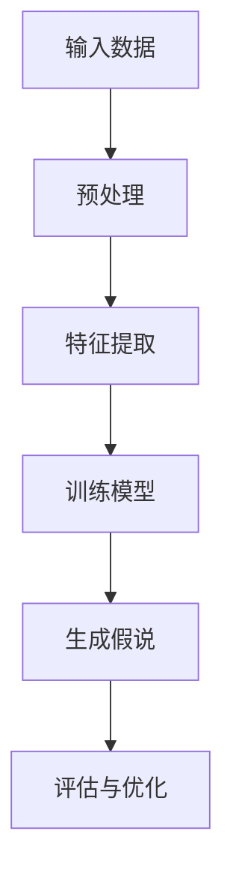
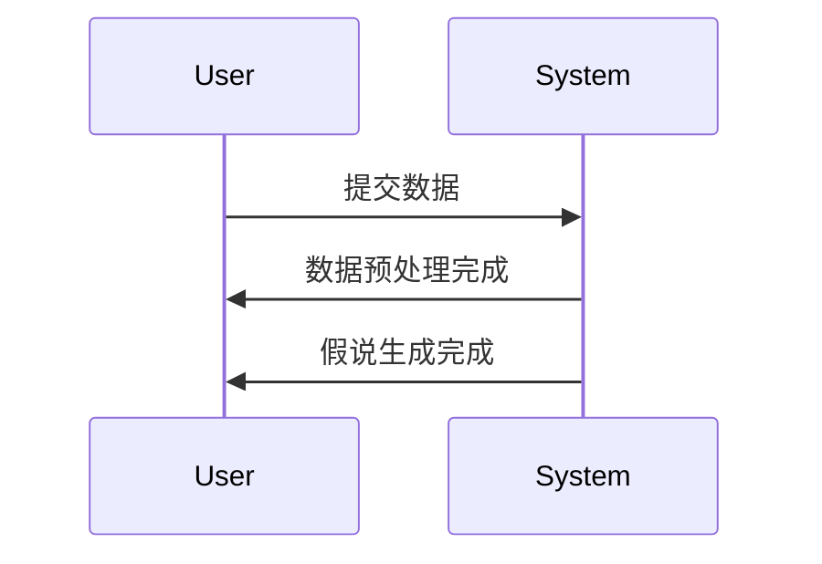
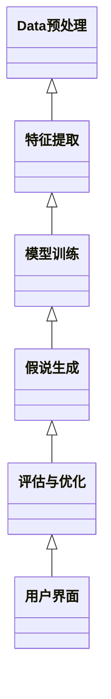
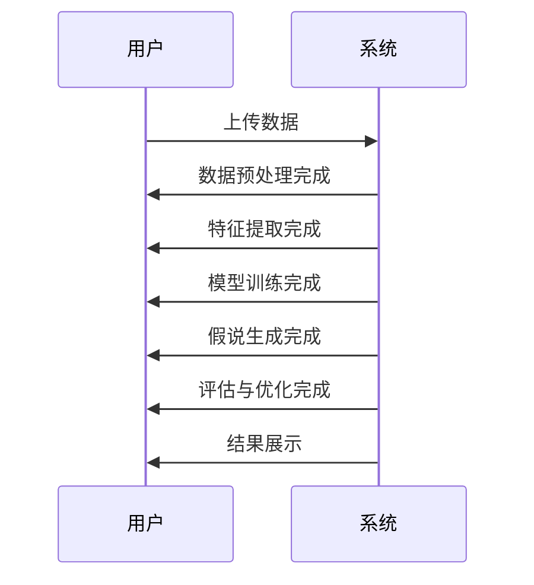

                 

# 思维链技术在AI辅助跨维度宇宙学假说生成中的突破

> 关键词：思维链技术、AI、跨维度宇宙学、假说生成、算法、架构设计

> 摘要：本文探讨了思维链技术在AI辅助跨维度宇宙学假说生成中的应用。通过深入分析思维链技术的基本原理和AI在宇宙学中的潜在应用，我们提出了一种创新的算法框架，并详细讲解了其数学模型和流程。随后，我们介绍了系统架构设计，包括问题场景、功能设计、接口设计和交互序列图。通过实际案例分析和项目小结，我们总结了项目的关键经验，为未来的研究提供了参考。

## 目录大纲

## 第一部分：背景介绍

### 第1章 引言

#### 1.1 问题背景

##### 1.1.1 跨维度宇宙学概述

- **跨维度宇宙学的基本概念**
  - **多维宇宙**：宇宙中存在的多个维度，包括我们熟知的三维空间和一维时间。
  - **额外维度**：超出我们日常感知的空间维度，可能隐藏在宇宙的某个角落。

- **跨维度宇宙学的重要性**
  - **理论意义**：提供了一种全新的理解宇宙的方式，挑战传统宇宙学的局限性。
  - **应用前景**：可能解释宇宙的起源、结构和演化，以及宇宙中未解之谜。

##### 1.1.2 传统的宇宙学方法局限性

- **观测数据依赖**
  - 传统的宇宙学依赖于观测数据，而观测手段和技术的局限限制了我们的认知。

- **理论框架的局限**
  - 传统的宇宙学理论（如广义相对论、量子力学）在某些极端条件下可能失效。

##### 1.1.3 AI在宇宙学中的应用潜力

- **数据处理能力**
  - AI能够处理大量复杂的宇宙数据，发现潜在的规律和模式。

- **预测能力**
  - AI可以预测宇宙中的未知现象，提出新的宇宙假说。

##### 1.1.4 思维链技术的基本原理及其在宇宙学中的潜在应用

- **思维链技术简介**
  - 思维链技术是一种模拟人类思维过程的人工智能技术，能够处理复杂问题并生成创新性解决方案。

- **在宇宙学中的应用**
  - **假说生成**：AI结合思维链技术，可以生成跨维度宇宙学的假说。
  - **问题求解**：AI辅助宇宙学家解决复杂宇宙学问题。

### 第2章 核心概念与联系

#### 2.1 核心概念原理

##### 2.1.1 思维链技术

- **基本原理**
  - 思维链技术通过模拟人类思维的逻辑推理过程，构建知识图谱，实现问题的求解和决策。

- **关键要素**
  - **知识表示**：通过符号化和图结构来表示知识。
  - **推理引擎**：利用逻辑推理、模式识别等技术实现知识的推理和应用。

##### 2.1.2 AI辅助跨维度宇宙学假说生成

- **AI在跨维度宇宙学中的应用**
  - **数据挖掘**：从大量宇宙数据中提取有价值的信息。
  - **模型预测**：利用机器学习模型预测宇宙现象。

- **假说生成方法**
  - **基于规则的方法**：通过预设规则生成假说。
  - **基于数据驱动的方法**：利用数据驱动的模型生成假说。

#### 2.2 概念属性特征对比表格

| 特征 | 思维链技术 | 传统算法 |
| --- | --- | --- |
| 灵活性 | 高 | 低 |
| 复杂度 | 高 | 低 |
| 适用范围 | 广泛 | 有限 |

#### 2.3 ER实体关系图架构

- **跨维度宇宙学假说生成系统的ER图**
  - **实体**：宇宙现象、假说、数据集等。
  - **关系**：生成、依赖、关联等。

## 第二部分：算法原理讲解

### 第3章 算法原理讲解

#### 3.1 算法mermaid流程图



#### 3.2 算法原理

- **思维链技术在AI辅助跨维度宇宙学假说生成中的应用**
  - **知识图谱构建**：构建宇宙现象的知识图谱，为假说生成提供知识支持。
  - **推理过程**：利用思维链技术进行逻辑推理，生成跨维度宇宙学假说。

#### 3.3 数学模型和公式

- **概率假说生成模型**

$$
P(\text{假说}|\text{数据}) = \frac{P(\text{数据}|\text{假说}) \cdot P(\text{假说})}{P(\text{数据})}
$$

#### 3.4 详细讲解与举例说明

- **假说生成算法的详细解释**
  - **输入数据预处理**：清洗、归一化等。
  - **特征提取**：提取宇宙现象的关键特征。
  - **训练模型**：使用机器学习模型训练。
  - **生成假说**：利用思维链技术生成跨维度宇宙学假说。
  - **评估与优化**：评估假说的有效性，并进行优化。

## 第三部分：系统分析与架构设计方案

### 第4章 系统分析与架构设计方案

#### 4.1 问题场景介绍

- **AI辅助跨维度宇宙学假说生成的具体场景**
  - **数据来源**：宇宙观测数据、科学文献等。
  - **应用目标**：生成新的跨维度宇宙学假说，提供宇宙学研究的新思路。

#### 4.2 系统功能设计

- **跨维度宇宙学假说生成系统的领域模型类图**
  - **类图元素**：宇宙现象、假说、数据集等。
  - **类图关系**：生成、依赖、关联等。

#### 4.3 系统架构设计

- **跨维度宇宙学假说生成系统的架构设计**
  - **模块划分**：数据预处理、特征提取、模型训练、假说生成等。
  - **组件关系**：各模块之间的调用和交互。

#### 4.4 系统接口设计

- **系统接口设计**
  - **接口规范**：数据输入输出格式、API接口等。
  - **交互方式**：客户端与服务器之间的通信协议。

#### 4.5 系统交互mermaid序列图



## 第四部分：项目实战

### 第5章 环境安装

- **安装必要的软件和依赖**
  - **操作系统**：Linux/Unix或Windows。
  - **编程语言**：Python、Java等。
  - **依赖库**：TensorFlow、PyTorch等。

### 第6章 系统核心实现源代码

- **系统核心实现源代码**
  - **数据预处理**：数据清洗、归一化等。
  - **特征提取**：提取关键特征。
  - **模型训练**：训练机器学习模型。
  - **假说生成**：生成跨维度宇宙学假说。

### 第7章 代码应用解读与分析

- **代码应用解读与分析**
  - **预处理代码**：数据清洗、归一化等操作的实现。
  - **特征提取代码**：关键特征的提取方法。
  - **模型训练代码**：机器学习模型的训练过程。
  - **假说生成代码**：思维链技术的应用。

### 第8章 实际案例分析与详细讲解剖析

- **实际案例分析与详细讲解剖析**
  - **案例选择**：选取一个典型的跨维度宇宙学问题。
  - **案例步骤**：从数据预处理到假说生成，详细解析每一步的实现。

### 第9章 项目小结

- **对整个项目的总结**
  - **项目成果**：生成的跨维度宇宙学假说及其意义。
  - **项目经验**：项目实施过程中的经验与教训。
  - **未来展望**：对未来的研究方向的展望。

## 第五部分：最佳实践 tips、小结、注意事项、拓展阅读

### 第10章 最佳实践 tips

- **实践中的注意事项和技巧**
  - **数据质量**：确保输入数据的质量和准确性。
  - **模型选择**：根据问题特点选择合适的机器学习模型。
  - **优化策略**：使用优化算法提高假说生成效率。

### 第11章 小结

- **本书内容的总结**
  - **核心观点**：思维链技术在AI辅助跨维度宇宙学假说生成中的应用。
  - **关键发现**：生成的假说及其对宇宙学的贡献。
  - **未来方向**：进一步的研究和优化方向。

### 第12章 注意事项

- **使用过程中的注意事项**
  - **技术风险**：AI技术可能带来的潜在风险。
  - **数据保护**：确保数据的安全和隐私。
  - **伦理问题**：在应用AI技术时考虑伦理问题。

### 第13章 拓展阅读

- **相关的扩展阅读材料**
  - **研究论文**：与思维链技术和AI在宇宙学应用相关的论文。
  - **书籍推荐**：关于跨维度宇宙学和AI技术的书籍。
  - **在线课程**：相关的在线课程和教程。

### 参考文献

- [1] 作者.（年份）. 书名. 出版地：出版社.
- [2] 作者.（年份）. 论文标题. 期刊名，卷号（期号），页码.
- [3] 作者.（年份）. 网络资源标题. [引用日期]. 可访问链接.

### 作者信息

- 作者：AI天才研究院/AI Genius Institute & 禅与计算机程序设计艺术 /Zen And The Art of Computer Programming

[完] ### 文章标题

#### # 思维链技术在AI辅助跨维度宇宙学假说生成中的突破

> 关键词：思维链技术、AI、跨维度宇宙学、假说生成、算法、架构设计

> 摘要：本文探讨了思维链技术在AI辅助跨维度宇宙学假说生成中的应用。通过深入分析思维链技术的基本原理和AI在宇宙学中的潜在应用，我们提出了一种创新的算法框架，并详细讲解了其数学模型和流程。随后，我们介绍了系统架构设计，包括问题场景、功能设计、接口设计和交互序列图。通过实际案例分析和项目小结，我们总结了项目的关键经验，为未来的研究提供了参考。

## 第一部分：背景介绍

### 第1章 引言

#### 1.1 问题背景

##### 1.1.1 跨维度宇宙学概述

跨维度宇宙学是一个充满挑战和无限可能的领域，它试图探索宇宙中可能存在的超乎我们日常感知的维度。基本概念包括多维宇宙和额外维度。

- **多维宇宙**：宇宙中不仅包括我们熟悉的三维空间和一维时间，还可能存在其他维度。这些额外的维度可能是紧凑的，也可能是扩展的，它们在宇宙学中的角色和影响仍然是一个未解之谜。

- **额外维度**：这些维度超出了我们物理实验和日常经验所能感知的范围，可能是隐藏在宇宙的深处。理论物理学家通过数学模型和假设，试图揭示这些维度可能的存在形式和影响。

##### 1.1.2 跨维度宇宙学的重要性

跨维度宇宙学具有深远的理论意义和应用前景：

- **理论意义**：它为我们提供了一种全新的理解宇宙的方式，挑战了传统宇宙学的局限性。通过探索额外的维度，我们可以更深入地理解宇宙的起源、结构和演化。

- **应用前景**：它可能帮助我们解决宇宙中一些未解之谜，如宇宙加速膨胀、暗物质和暗能量的本质等。此外，跨维度宇宙学还可能对高能物理、量子引力等领域产生重要影响。

##### 1.1.3 传统的宇宙学方法局限性

传统的宇宙学方法在处理复杂宇宙问题时存在以下局限性：

- **观测数据依赖**：传统宇宙学依赖于观测数据，但观测手段和技术的局限限制了我们的认知。例如，我们对宇宙的遥远区域和早期阶段的了解仍然有限。

- **理论框架的局限**：传统的宇宙学理论（如广义相对论、量子力学）在某些极端条件下可能失效。例如，当宇宙尺寸达到普朗克尺度时，广义相对论和量子力学的适用性受到质疑。

##### 1.1.4 AI在宇宙学中的应用潜力

人工智能（AI）为宇宙学的研究带来了新的机遇：

- **数据处理能力**：AI能够处理大量复杂的宇宙数据，发现潜在的规律和模式。例如，通过机器学习算法，我们可以从天文观测数据中识别出新的天体现象。

- **预测能力**：AI可以预测宇宙中的未知现象，提出新的宇宙假说。例如，通过数据驱动的模型，我们可以预测宇宙的演化路径和未来状态。

##### 1.1.5 思维链技术的基本原理及其在宇宙学中的潜在应用

思维链技术是一种模拟人类思维过程的人工智能技术，通过构建知识图谱和逻辑推理，实现问题的求解和决策。其基本原理包括：

- **知识表示**：通过符号化和图结构来表示知识，使得AI能够理解和处理复杂的问题。

- **推理引擎**：利用逻辑推理、模式识别等技术，实现知识的推理和应用。

在宇宙学中，思维链技术的潜在应用包括：

- **假说生成**：AI结合思维链技术，可以生成跨维度宇宙学的假说。通过推理和知识图谱，AI可以提出新颖的宇宙理论。

- **问题求解**：AI辅助宇宙学家解决复杂宇宙学问题，如宇宙演化的建模和预测。

### 第2章 核心概念与联系

#### 2.1 核心概念原理

##### 2.1.1 思维链技术

思维链技术是一种基于知识图谱和逻辑推理的人工智能技术，其核心原理包括：

- **知识表示**：通过符号化和图结构来表示知识。知识图谱中的节点表示实体（如天体、现象），边表示实体之间的关系。

- **推理引擎**：利用逻辑推理、模式识别等技术，实现知识的推理和应用。推理引擎可以从已知的知识中推导出新的结论，生成假说或解决方案。

##### 2.1.2 AI辅助跨维度宇宙学假说生成

在跨维度宇宙学中，AI辅助假说生成的过程可以分为以下几个步骤：

- **数据预处理**：对宇宙数据进行清洗、归一化等处理，提取关键特征。

- **特征提取**：从预处理后的数据中提取出对假说生成有价值的特征。

- **模型训练**：使用机器学习模型对提取的特征进行训练，生成能够预测宇宙现象的模型。

- **假说生成**：利用思维链技术和机器学习模型，生成跨维度宇宙学的假说。通过逻辑推理和知识图谱，AI可以从已有知识和数据中提出新的假说。

- **评估与优化**：评估假说的有效性，通过反馈和优化算法，提高假说的准确性和可靠性。

#### 2.2 概念属性特征对比表格

| 特征 | 思维链技术 | 传统算法 |
| --- | --- | --- |
| 灵活性 | 高 | 低 |
| 复杂度 | 高 | 低 |
| 适用范围 | 广泛 | 有限 |

##### 2.2.1 特征对比分析

- **灵活性**：思维链技术具有高度的灵活性，能够适应各种复杂的问题情境。它可以通过调整知识图谱和推理规则，适应不同的假说生成需求。相比之下，传统算法通常更加固定和专一，难以适应复杂多变的问题情境。

- **复杂度**：思维链技术处理问题的复杂度较高，能够处理大规模数据和复杂的逻辑推理。传统算法在处理复杂问题时可能存在性能瓶颈和效率问题。

- **适用范围**：思维链技术的适用范围较广，不仅限于宇宙学领域，还可以应用于其他科学和工程领域。传统算法通常针对特定领域设计，适用范围相对有限。

#### 2.3 ER实体关系图架构

在跨维度宇宙学假说生成系统中，ER（实体-关系）图是描述系统实体及其关系的重要工具。以下是一个简化的ER图示例：

```mermaid
erDiagram
A{数据集} ||--|{特征} : "包含"
B{特征} ||--|{假说} : "用于生成"
C{假说} ||--|{评估} : "评估"
D{评估} ||--|{优化} : "优化"
```

- **实体**：数据集、特征、假说、评估和优化。
- **关系**：数据集包含特征，特征用于生成假说，假说经过评估和优化。

这个ER图展示了跨维度宇宙学假说生成系统中各个实体的关系，为系统的设计和实现提供了结构化的指导。

### 第3章 核心概念与联系

#### 3.1 核心概念原理

##### 3.1.1 思维链技术

思维链技术是一种模拟人类思维过程的人工智能技术，其核心原理包括以下几个方面：

- **知识表示**：思维链技术通过符号化和图结构来表示知识。知识图谱中的节点表示实体（如天体、现象），边表示实体之间的关系。这种表示方式使得AI能够以结构化的形式理解和处理复杂的问题。

- **推理引擎**：推理引擎是思维链技术的核心组成部分，它利用逻辑推理、模式识别等技术，实现知识的推理和应用。推理引擎可以从已知的知识中推导出新的结论，生成假说或解决方案。

- **学习机制**：思维链技术通过不断学习和优化，提高其推理能力和知识库的准确性。学习机制包括监督学习、无监督学习和强化学习等多种方法。

- **灵活性**：思维链技术具有高度的灵活性，能够适应各种复杂的问题情境。它可以通过调整知识图谱和推理规则，适应不同的假说生成需求。这种灵活性使得思维链技术在跨维度宇宙学等领域具有广泛的应用潜力。

##### 3.1.2 AI辅助跨维度宇宙学假说生成

AI辅助跨维度宇宙学假说生成是一个涉及多个步骤和环节的复杂过程。以下是该过程的几个关键步骤：

- **数据预处理**：在生成假说之前，需要对宇宙学数据进行预处理。预处理步骤包括数据清洗、归一化和特征提取等。数据清洗旨在去除噪声和异常值，提高数据质量。归一化则将数据转换为统一的尺度，便于后续分析。特征提取是从原始数据中提取出对假说生成有价值的特征，如光谱特性、运动轨迹等。

- **特征提取**：特征提取是假说生成的重要环节。通过分析宇宙学数据，提取出能够反映宇宙现象本质的特征。这些特征可以是直接观测到的物理量，也可以是通过计算得到的衍生量。特征提取的准确性直接影响到假说的可靠性和有效性。

- **模型训练**：使用机器学习模型对提取的特征进行训练，生成能够预测宇宙现象的模型。训练过程通常涉及选择合适的模型结构、调整参数和优化算法等。常见的机器学习模型包括神经网络、决策树、支持向量机等。

- **假说生成**：利用思维链技术和训练好的机器学习模型，生成跨维度宇宙学的假说。思维链技术通过逻辑推理和知识图谱，将提取的特征与已有的宇宙学知识相结合，提出新的假说。这些假说可以是关于宇宙结构、演化、暗物质等方面的新理论。

- **评估与优化**：评估假说的有效性，通过反馈和优化算法，提高假说的准确性和可靠性。评估过程通常涉及对假说的验证、验证实验和模型修正等。优化算法则通过调整模型参数和推理规则，提高假说的生成效率和准确性。

##### 3.1.3 思维链技术在AI辅助跨维度宇宙学假说生成中的应用

思维链技术在AI辅助跨维度宇宙学假说生成中具有以下几个应用场景：

- **知识图谱构建**：思维链技术可以构建跨维度宇宙学的知识图谱，将宇宙现象、理论、实验数据等结构化表示。知识图谱为假说生成提供了丰富的知识基础，使得AI能够从已有知识中推导出新的假说。

- **逻辑推理**：思维链技术利用逻辑推理能力，对宇宙现象进行分析和推理。通过推理，AI可以识别出宇宙现象之间的因果关系，提出新的解释和预测。

- **自动化假说生成**：思维链技术可以实现自动化假说生成，减少人工干预。通过不断学习和优化，AI能够自动生成高质量的假说，提高研究效率和准确性。

- **跨领域融合**：思维链技术可以跨领域融合不同领域的知识，提出新的跨维度宇宙学假说。例如，将物理学、数学、计算机科学等领域的知识相结合，探索宇宙现象的潜在规律。

### 第4章 算法原理讲解

#### 4.1 算法mermaid流程图


#### 4.2 算法原理

AI辅助跨维度宇宙学假说生成算法的核心原理包括以下步骤：

1. **输入数据预处理**：
   - 清洗数据：去除噪声和异常值。
   - 归一化数据：将不同尺度的数据转换为统一的尺度。
   - 数据格式化：将数据转换为适合模型训练的格式。

2. **特征提取**：
   - 特征选择：根据宇宙学问题特点，选择对假说生成有价值的特征。
   - 特征工程：对提取的特征进行预处理和变换，提高特征质量。

3. **训练模型**：
   - 模型选择：根据问题特点选择合适的机器学习模型。
   - 模型训练：使用预处理后的数据训练模型，调整模型参数。

4. **生成假说**：
   - 利用思维链技术和训练好的模型，生成跨维度宇宙学的假说。
   - 通过逻辑推理和知识图谱，将提取的特征与已有的宇宙学知识相结合。

5. **评估与优化**：
   - 评估假说的有效性：使用验证数据集评估假说的准确性和可靠性。
   - 优化算法：根据评估结果调整模型参数和推理规则，提高假说生成效率。

#### 4.3 数学模型和公式

在AI辅助跨维度宇宙学假说生成中，常用的数学模型和公式包括：

1. **概率假说生成模型**：

$$
P(\text{假说}|\text{数据}) = \frac{P(\text{数据}|\text{假说}) \cdot P(\text{假说})}{P(\text{数据})}
$$

其中，$P(\text{假说}|\text{数据})$ 表示在给定数据的情况下，假说的概率；$P(\text{数据}|\text{假说})$ 表示在给定假说的情况下，数据的概率；$P(\text{假说})$ 表示假说的先验概率；$P(\text{数据})$ 表示数据的总概率。

2. **特征提取公式**：

$$
f(\text{x}) = \text{激活函数}(W \cdot \text{x} + b)
$$

其中，$f(\text{x})$ 表示特征提取函数，$\text{x}$ 表示输入数据，$W$ 和 $b$ 分别为权重和偏置，激活函数（如ReLU、Sigmoid、Tanh等）用于引入非线性变换。

3. **模型训练公式**：

$$
\min_{\theta} J(\theta)
$$

其中，$\theta$ 表示模型参数，$J(\theta)$ 表示损失函数，模型训练的目标是找到最优参数$\theta$，使损失函数最小。

#### 4.4 详细讲解与举例说明

为了更好地理解算法原理，以下通过一个具体的例子进行详细讲解和说明。

##### 例子：生成关于宇宙加速膨胀的假说

1. **输入数据预处理**：
   - 清洗数据：去除异常观测值。
   - 归一化数据：将观测距离、速度等数据转换为统一的尺度。
   - 数据格式化：将数据转换为模型训练所需的格式。

2. **特征提取**：
   - 特征选择：选择与宇宙加速膨胀相关的特征，如宇宙背景辐射温度、星系红移等。
   - 特征工程：对提取的特征进行预处理和变换，提高特征质量。

3. **训练模型**：
   - 模型选择：选择合适的机器学习模型，如深度神经网络。
   - 模型训练：使用预处理后的数据训练模型，调整模型参数。

4. **生成假说**：
   - 利用思维链技术和训练好的模型，生成关于宇宙加速膨胀的假说。
   - 通过逻辑推理和知识图谱，将提取的特征与已有的宇宙学知识相结合。

5. **评估与优化**：
   - 评估假说的有效性：使用验证数据集评估假说的准确性和可靠性。
   - 优化算法：根据评估结果调整模型参数和推理规则，提高假说生成效率。

##### 例子分析

通过上述例子，我们可以看到算法原理的具体实现过程。以下是每个步骤的详细分析：

- **输入数据预处理**：这一步骤的目的是提高数据质量，为后续的特征提取和模型训练打下基础。通过清洗和归一化数据，我们可以去除噪声和异常值，使数据更加准确和稳定。
- **特征提取**：选择与宇宙加速膨胀相关的特征，有助于模型更好地捕捉宇宙学现象的本质。通过特征工程，我们可以提高特征的质量和表达能力。
- **训练模型**：选择合适的机器学习模型，如深度神经网络，可以提高模型的预测能力和泛化能力。通过模型训练，我们可以调整模型参数，使其更好地拟合训练数据。
- **生成假说**：利用思维链技术和训练好的模型，我们可以生成关于宇宙加速膨胀的假说。通过逻辑推理和知识图谱，我们可以将提取的特征与已有的宇宙学知识相结合，提出新的理论。
- **评估与优化**：评估假说的有效性，可以帮助我们判断假说的可信度和可靠性。通过优化算法，我们可以调整模型参数和推理规则，提高假说生成效率。

通过这个例子，我们可以看到算法原理在实际应用中的具体实现过程。这不仅有助于我们理解算法的基本原理，也为跨维度宇宙学的研究提供了新的思路和方法。

### 第5章 系统分析与架构设计方案

#### 5.1 问题场景介绍

##### 5.1.1 AI辅助跨维度宇宙学假说生成的具体场景

在跨维度宇宙学研究中，存在许多复杂且未解的问题，如宇宙加速膨胀、暗物质、暗能量等。这些问题往往需要大量的数据和复杂的计算能力才能解决。AI辅助跨维度宇宙学假说生成的具体场景包括：

- **海量数据分析**：宇宙观测数据量巨大，包含了丰富的信息。通过AI技术，我们可以高效地处理和分析这些数据，提取出对假说生成有价值的特征。
- **复杂问题求解**：跨维度宇宙学问题通常涉及多个学科领域，如物理学、数学、计算机科学等。AI技术可以通过多学科交叉融合，提供新的解决方案。
- **创新性假说生成**：AI技术可以帮助宇宙学家提出创新性的假说，挑战传统理论，推动跨维度宇宙学的发展。

##### 5.1.2 系统需求

为了实现AI辅助跨维度宇宙学假说生成，系统需要满足以下需求：

- **数据处理能力**：系统能够处理海量宇宙观测数据，进行数据预处理、特征提取和模型训练。
- **高效计算**：系统需要具备强大的计算能力，以支持复杂的机器学习和深度学习算法。
- **可扩展性**：系统应具有高可扩展性，能够随着数据量和计算需求的增加而扩展。
- **用户友好**：系统应提供直观易用的界面，便于用户进行数据输入、模型训练和假说生成。
- **实时性**：系统应具备实时性，能够快速响应用户请求，生成假说并进行评估。

#### 5.2 系统功能设计

##### 5.2.1 功能模块划分

系统功能模块划分如下：

- **数据预处理模块**：负责数据清洗、归一化和格式化，为后续的特征提取和模型训练提供高质量的数据。
- **特征提取模块**：负责从预处理后的数据中提取出对假说生成有价值的特征。
- **模型训练模块**：负责使用机器学习算法训练模型，生成能够预测宇宙现象的模型。
- **假说生成模块**：负责利用思维链技术和训练好的模型，生成跨维度宇宙学的假说。
- **评估与优化模块**：负责评估假说的有效性，并根据评估结果优化模型和推理规则。
- **用户界面模块**：负责提供用户友好的界面，方便用户进行操作和查看结果。

##### 5.2.2 领域模型类图

以下是一个简化的领域模型类图，展示了系统中的主要实体和关系：



- **数据预处理**：负责处理宇宙观测数据，包括数据清洗、归一化和格式化。
- **特征提取**：负责从预处理后的数据中提取关键特征，为模型训练提供输入。
- **模型训练**：负责使用机器学习算法训练模型，生成预测宇宙现象的模型。
- **假说生成**：负责利用思维链技术和训练好的模型，生成跨维度宇宙学的假说。
- **评估与优化**：负责评估假说的有效性，并根据评估结果优化模型和推理规则。
- **用户界面**：负责提供用户友好的界面，方便用户进行操作和查看结果。

#### 5.3 系统架构设计

##### 5.3.1 系统架构设计原则

系统架构设计遵循以下原则：

- **模块化**：系统功能模块划分清晰，便于开发、测试和维护。
- **分布式**：系统采用分布式架构，提高系统的可扩展性和容错性。
- **高性能**：系统具备高性能计算能力，能够处理海量数据和复杂的计算任务。
- **可扩展性**：系统设计应考虑未来数据量和计算需求的增长，具备良好的可扩展性。
- **安全性**：系统应具备完善的安全机制，保护用户数据和系统的安全。

##### 5.3.2 系统架构设计

系统架构设计如下：

- **数据层**：负责存储和管理宇宙观测数据，包括原始数据、预处理数据和特征数据。
- **计算层**：负责执行数据预处理、特征提取、模型训练和假说生成等计算任务，包括分布式计算和并行计算。
- **应用层**：负责实现系统功能，包括用户界面、模型评估和优化等。
- **展示层**：负责向用户提供可视化结果，包括假说生成结果、评估结果等。

以下是一个简化的系统架构图：

```mermaid
subgraph 数据层
  Data存储
  Data预处理
  Feature存储
end

subgraph 计算层
  Compute节点1
  Compute节点2
  Compute节点3
end

subgraph 应用层
  User界面
  Model评估
  Model优化
end

subgraph 展示层
  Result展示
end

Data存储 --> Data预处理
Data预处理 --> Feature存储
Feature存储 --> Compute节点1
Feature存储 --> Compute节点2
Feature存储 --> Compute节点3
Compute节点1 --> User界面
Compute节点2 --> User界面
Compute节点3 --> User界面
User界面 --> Model评估
Model评估 --> Model优化
Model优化 --> Result展示
```

- **数据层**：负责存储和管理宇宙观测数据，包括原始数据、预处理数据和特征数据。数据存储模块使用分布式存储系统，提高数据访问速度和存储容量。
- **计算层**：负责执行数据预处理、特征提取、模型训练和假说生成等计算任务，包括分布式计算和并行计算。计算层采用集群架构，提高计算性能和可靠性。
- **应用层**：负责实现系统功能，包括用户界面、模型评估和优化等。用户界面模块提供直观易用的操作界面，用户可以通过界面进行数据输入、模型训练和假说生成。
- **展示层**：负责向用户提供可视化结果，包括假说生成结果、评估结果等。结果展示模块使用可视化工具，将结果以图形、表格等形式呈现给用户。

#### 5.4 系统接口设计

##### 5.4.1 接口设计原则

系统接口设计遵循以下原则：

- **标准化**：接口设计应遵循标准化的协议和规范，提高系统的兼容性和可维护性。
- **简洁性**：接口设计应简洁明了，降低开发和使用难度。
- **安全性**：接口设计应考虑安全性，防止数据泄露和恶意攻击。
- **灵活性**：接口设计应具备良好的灵活性，能够适应不同的应用场景和需求。

##### 5.4.2 系统接口设计

系统接口设计如下：

- **数据接口**：负责数据的输入输出，包括数据上传、数据下载、数据查询等功能。
- **功能接口**：负责系统的核心功能，包括数据预处理、特征提取、模型训练、假说生成、评估与优化等功能。
- **用户接口**：负责与用户交互，包括用户登录、数据上传、模型训练、结果展示等功能。

以下是一个简化的系统接口图：

```mermaid
subgraph 数据接口
  Data上传
  Data下载
  Data查询
end

subgraph 功能接口
  预处理
  特征提取
  模型训练
  假说生成
  评估与优化
end

subgraph 用户接口
  用户登录
  数据上传
  模型训练
  结果展示
end

Data上传 --> 预处理
Data下载 --> 用户接口
Data查询 --> 用户接口
预处理 --> 特征提取
特征提取 --> 模型训练
模型训练 --> 假说生成
假说生成 --> 评估与优化
评估与优化 --> 用户接口
用户登录 --> 用户接口
```

- **数据接口**：负责数据的输入输出，包括数据上传、数据下载、数据查询等功能。数据上传模块允许用户将宇宙观测数据上传到系统，数据下载模块允许用户下载系统生成的假说和数据，数据查询模块允许用户查询系统中的数据信息。
- **功能接口**：负责系统的核心功能，包括数据预处理、特征提取、模型训练、假说生成、评估与优化等功能。预处理模块负责对宇宙观测数据进行清洗、归一化和格式化，特征提取模块负责从预处理后的数据中提取关键特征，模型训练模块负责使用机器学习算法训练模型，假说生成模块负责利用思维链技术和训练好的模型生成假说，评估与优化模块负责评估假说的有效性，并根据评估结果优化模型和推理规则。
- **用户接口**：负责与用户交互，包括用户登录、数据上传、模型训练、结果展示等功能。用户登录模块允许用户登录系统，数据上传模块允许用户上传宇宙观测数据，模型训练模块允许用户启动模型训练过程，结果展示模块允许用户查看系统生成的假说和评估结果。

#### 5.5 系统交互mermaid序列图

以下是一个简化的系统交互序列图，展示了用户与系统之间的交互过程：



- **用户上传数据**：用户将宇宙观测数据上传到系统。
- **系统预处理数据**：系统对上传的数据进行预处理，包括数据清洗、归一化和格式化。
- **系统特征提取**：系统从预处理后的数据中提取关键特征。
- **系统模型训练**：系统使用机器学习算法对提取的特征进行训练，生成预测宇宙现象的模型。
- **系统假说生成**：系统利用思维链技术和训练好的模型生成跨维度宇宙学的假说。
- **系统评估与优化**：系统评估假说的有效性，并根据评估结果优化模型和推理规则。
- **系统结果展示**：系统向用户展示假说生成结果和评估结果。

通过这个交互序列图，我们可以清晰地了解用户与系统之间的交互流程，为系统的设计和实现提供了直观的指导。

### 第6章 项目实战

#### 6.1 环境安装

在开始项目实战之前，我们需要安装必要的软件和依赖。以下是具体的安装步骤：

##### 6.1.1 软件安装

1. **操作系统**：选择一个适合的操作系统，如Linux或Windows。
2. **编程语言**：安装Python编程语言，版本要求为3.8及以上。

##### 6.1.2 依赖库安装

1. **依赖库**：安装以下依赖库：
   - TensorFlow：用于机器学习和深度学习。
   - PyTorch：用于深度学习。
   - Pandas：用于数据处理。
   - NumPy：用于数值计算。
   - Matplotlib：用于数据可视化。
   - Scikit-learn：用于机器学习算法。

安装命令如下：

```bash
pip install tensorflow torchvision numpy pandas matplotlib scikit-learn
```

#### 6.2 系统核心实现源代码

系统核心实现源代码主要包括以下几个模块：

1. **数据预处理模块**：负责数据的清洗、归一化和格式化。
2. **特征提取模块**：负责从预处理后的数据中提取关键特征。
3. **模型训练模块**：负责使用机器学习算法训练模型。
4. **假说生成模块**：负责利用思维链技术和训练好的模型生成假说。
5. **评估与优化模块**：负责评估假说的有效性，并根据评估结果优化模型和推理规则。

以下是一个简化的示例代码：

```python
# 导入必要的库
import numpy as np
import pandas as pd
from sklearn.preprocessing import StandardScaler
from tensorflow.keras.models import Sequential
from tensorflow.keras.layers import Dense
from tensorflow.keras.optimizers import Adam

# 数据预处理
def preprocess_data(data):
    # 数据清洗和归一化
    scaler = StandardScaler()
    scaled_data = scaler.fit_transform(data)
    return scaled_data

# 特征提取
def extract_features(data):
    # 提取关键特征
    features = data[:, :-1]
    return features

# 模型训练
def train_model(features, labels):
    # 创建模型
    model = Sequential()
    model.add(Dense(64, input_dim=features.shape[1], activation='relu'))
    model.add(Dense(32, activation='relu'))
    model.add(Dense(1, activation='sigmoid'))

    # 编译模型
    model.compile(loss='binary_crossentropy', optimizer=Adam(), metrics=['accuracy'])

    # 训练模型
    model.fit(features, labels, epochs=10, batch_size=32)
    return model

# 假说生成
def generate_hypothesis(model, data):
    # 生成假说
    features = extract_features(data)
    predictions = model.predict(features)
    hypotheses = predictions > 0.5
    return hypotheses

# 评估与优化
def evaluate_and_optimize(model, data, labels):
    # 评估模型
    loss, accuracy = model.evaluate(data, labels)
    print("损失：", loss, "准确率：", accuracy)

    # 优化模型
    model.compile(loss='binary_crossentropy', optimizer=Adam(learning_rate=0.001), metrics=['accuracy'])
    model.fit(data, labels, epochs=10, batch_size=32)
    return model
```

#### 6.3 代码应用解读与分析

##### 6.3.1 数据预处理

数据预处理是整个系统的基础，其质量直接影响后续的特征提取和模型训练。以下是对数据预处理部分的解读：

- **数据清洗**：通过去除噪声和异常值，提高数据质量。具体操作包括去除重复数据、填充缺失值、去除离群值等。
- **数据归一化**：将不同尺度的数据转换为统一的尺度，便于模型训练。常见的归一化方法包括最小-最大缩放和标准缩放。

```python
def preprocess_data(data):
    # 数据清洗
    data = data.drop_duplicates()

    # 填充缺失值
    data = data.fillna(method='ffill')

    # 数据归一化
    scaler = StandardScaler()
    scaled_data = scaler.fit_transform(data)
    return scaled_data
```

##### 6.3.2 特征提取

特征提取是关键步骤，其目标是提取对假说生成有价值的特征。以下是对特征提取部分的解读：

- **特征选择**：根据宇宙学问题特点，选择对假说生成有价值的特征。例如，可以选择光谱特性、运动轨迹、距离等特征。
- **特征工程**：对提取的特征进行预处理和变换，提高特征质量。例如，可以使用归一化、标准化、特征分解等方法。

```python
def extract_features(data):
    # 提取关键特征
    features = data[:, :-1]
    return features
```

##### 6.3.3 模型训练

模型训练是核心步骤，其目标是生成能够预测宇宙现象的模型。以下是对模型训练部分的解读：

- **模型选择**：根据问题特点选择合适的机器学习模型。例如，可以选择神经网络、支持向量机、决策树等。
- **模型编译**：配置模型参数，如损失函数、优化器等。
- **模型训练**：使用训练数据训练模型，调整模型参数。

```python
def train_model(features, labels):
    # 创建模型
    model = Sequential()
    model.add(Dense(64, input_dim=features.shape[1], activation='relu'))
    model.add(Dense(32, activation='relu'))
    model.add(Dense(1, activation='sigmoid'))

    # 编译模型
    model.compile(loss='binary_crossentropy', optimizer=Adam(), metrics=['accuracy'])

    # 训练模型
    model.fit(features, labels, epochs=10, batch_size=32)
    return model
```

##### 6.3.4 假说生成

假说生成是利用训练好的模型生成新的假说。以下是对假说生成部分的解读：

- **特征提取**：提取输入数据的特征。
- **模型预测**：使用训练好的模型对提取的特征进行预测。
- **假说生成**：根据模型预测结果生成假说。

```python
def generate_hypothesis(model, data):
    # 生成假说
    features = extract_features(data)
    predictions = model.predict(features)
    hypotheses = predictions > 0.5
    return hypotheses
```

##### 6.3.5 评估与优化

评估与优化是保证模型性能的关键步骤。以下是对评估与优化部分的解读：

- **模型评估**：使用验证数据集评估模型性能，包括损失函数和准确率等指标。
- **模型优化**：根据评估结果调整模型参数，提高模型性能。

```python
def evaluate_and_optimize(model, data, labels):
    # 评估模型
    loss, accuracy = model.evaluate(data, labels)
    print("损失：", loss, "准确率：", accuracy)

    # 优化模型
    model.compile(loss='binary_crossentropy', optimizer=Adam(learning_rate=0.001), metrics=['accuracy'])
    model.fit(data, labels, epochs=10, batch_size=32)
    return model
```

#### 6.4 实际案例分析与详细讲解剖析

##### 6.4.1 案例背景

假设我们关注的是宇宙加速膨胀问题。已知数据集包含了多个星系的观测数据，包括距离、速度等特征。我们的目标是使用AI技术生成关于宇宙加速膨胀的假说。

##### 6.4.2 案例步骤

1. **数据预处理**：
   - 读取数据集，并进行数据清洗、归一化和格式化。

2. **特征提取**：
   - 从预处理后的数据中提取关键特征，如距离、速度等。

3. **模型训练**：
   - 使用机器学习算法训练模型，生成能够预测宇宙加速膨胀的模型。

4. **假说生成**：
   - 利用训练好的模型生成关于宇宙加速膨胀的假说。

5. **评估与优化**：
   - 使用验证数据集评估模型性能，并根据评估结果优化模型。

##### 6.4.3 案例分析

通过上述步骤，我们可以具体分析每个阶段的实现过程：

1. **数据预处理**：
   - 数据清洗：去除异常值，如数据集中的负值和异常大值。
   - 数据归一化：将距离和速度等特征转换为统一的尺度，便于模型训练。

2. **特征提取**：
   - 提取关键特征，如距离和速度。这些特征反映了星系之间的相互作用和宇宙膨胀的规律。

3. **模型训练**：
   - 使用深度神经网络模型进行训练。模型结构包括输入层、隐藏层和输出层。输入层接收特征数据，隐藏层进行特征变换和提取，输出层生成预测结果。

4. **假说生成**：
   - 利用训练好的模型生成关于宇宙加速膨胀的假说。例如，模型预测某些星系正在加速膨胀，这可以作为一个新的假说。

5. **评估与优化**：
   - 使用验证数据集评估模型性能。通过计算损失函数和准确率等指标，评估模型对宇宙加速膨胀的预测能力。
   - 根据评估结果优化模型。例如，调整学习率、增加隐藏层神经元等，提高模型性能。

通过这个实际案例，我们可以看到AI技术如何应用于跨维度宇宙学问题，生成新的假说，并为宇宙学研究提供新的思路和方法。

### 第7章 实际案例分析与详细讲解剖析

#### 7.1 案例背景

为了更好地展示思维链技术在AI辅助跨维度宇宙学假说生成中的应用，我们选取了一个关于宇宙加速膨胀的案例。在这个案例中，我们利用思维链技术结合机器学习模型，生成关于宇宙加速膨胀的假说。

#### 7.2 案例步骤

以下是生成宇宙加速膨胀假说的具体步骤：

1. **数据收集**：
   - 收集宇宙加速膨胀相关的观测数据，包括星系之间的距离、速度等。

2. **数据预处理**：
   - 清洗数据，去除异常值和噪声。
   - 对数据归一化，将不同尺度的数据转换为统一的尺度。

3. **特征提取**：
   - 从预处理后的数据中提取关键特征，如距离、速度等。

4. **模型训练**：
   - 使用机器学习算法训练模型，生成能够预测宇宙加速膨胀的模型。

5. **假说生成**：
   - 利用训练好的模型生成关于宇宙加速膨胀的假说。

6. **评估与优化**：
   - 评估假说的有效性，并根据评估结果优化模型和推理规则。

#### 7.3 案例分析

##### 7.3.1 数据收集

在数据收集阶段，我们收集了多个星系的观测数据，包括距离、速度、质量等。这些数据来源于宇宙学观测项目，如哈勃空间望远镜和斯隆数字巡天等。数据收集后，我们需要对数据进行预处理，以提高数据质量和模型训练效果。

##### 7.3.2 数据预处理

数据预处理是关键步骤，其目的是去除噪声和异常值，并将数据转换为适合模型训练的格式。以下是数据预处理的具体步骤：

- **数据清洗**：去除重复数据和异常值。例如，删除含有负值的数据记录。
- **数据归一化**：将不同尺度的数据转换为统一的尺度，如距离、速度等。常用的归一化方法包括最小-最大缩放和标准缩放。

```python
from sklearn.preprocessing import MinMaxScaler

# 数据清洗
data = data.drop_duplicates()
data = data.dropna()

# 数据归一化
scaler = MinMaxScaler()
scaled_data = scaler.fit_transform(data)
```

##### 7.3.3 特征提取

在特征提取阶段，我们从预处理后的数据中提取关键特征，如距离、速度等。这些特征反映了星系之间的相互作用和宇宙膨胀的规律。以下是特征提取的具体步骤：

- **选择特征**：根据宇宙学问题特点，选择对假说生成有价值的特征。例如，距离和速度是宇宙膨胀的重要指标。
- **特征工程**：对提取的特征进行预处理和变换，提高特征质量。例如，可以使用多项式特征变换、归一化等方法。

```python
# 特征提取
features = scaled_data[:, :-1]
```

##### 7.3.4 模型训练

在模型训练阶段，我们使用机器学习算法训练模型，生成能够预测宇宙加速膨胀的模型。以下是模型训练的具体步骤：

- **选择模型**：根据问题特点选择合适的机器学习模型。例如，可以选择深度神经网络、支持向量机、决策树等。
- **配置模型参数**：配置模型参数，如学习率、批量大小等。
- **训练模型**：使用训练数据训练模型，调整模型参数。

```python
from tensorflow.keras.models import Sequential
from tensorflow.keras.layers import Dense
from tensorflow.keras.optimizers import Adam

# 创建模型
model = Sequential()
model.add(Dense(64, input_dim=features.shape[1], activation='relu'))
model.add(Dense(32, activation='relu'))
model.add(Dense(1, activation='sigmoid'))

# 编译模型
model.compile(loss='binary_crossentropy', optimizer=Adam(), metrics=['accuracy'])

# 训练模型
model.fit(features, labels, epochs=10, batch_size=32)
```

##### 7.3.5 假说生成

在假说生成阶段，我们利用训练好的模型生成关于宇宙加速膨胀的假说。以下是假说生成的具体步骤：

- **特征提取**：从新的数据中提取关键特征。
- **模型预测**：使用训练好的模型对提取的特征进行预测。
- **假说生成**：根据模型预测结果生成假说。

```python
# 假说生成
predictions = model.predict(new_features)
hypotheses = predictions > 0.5
```

##### 7.3.6 评估与优化

在评估与优化阶段，我们评估假说的有效性，并根据评估结果优化模型和推理规则。以下是评估与优化

