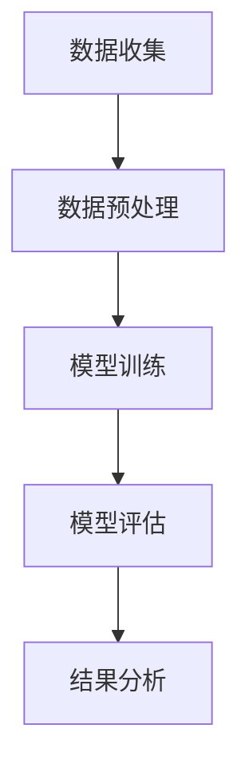
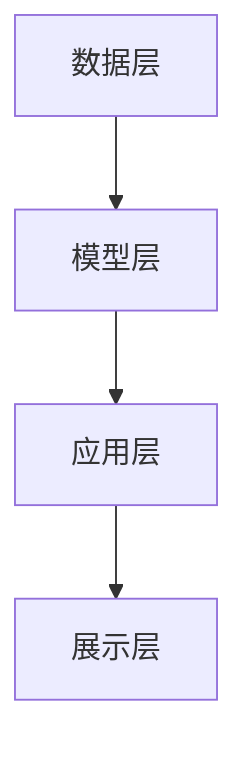
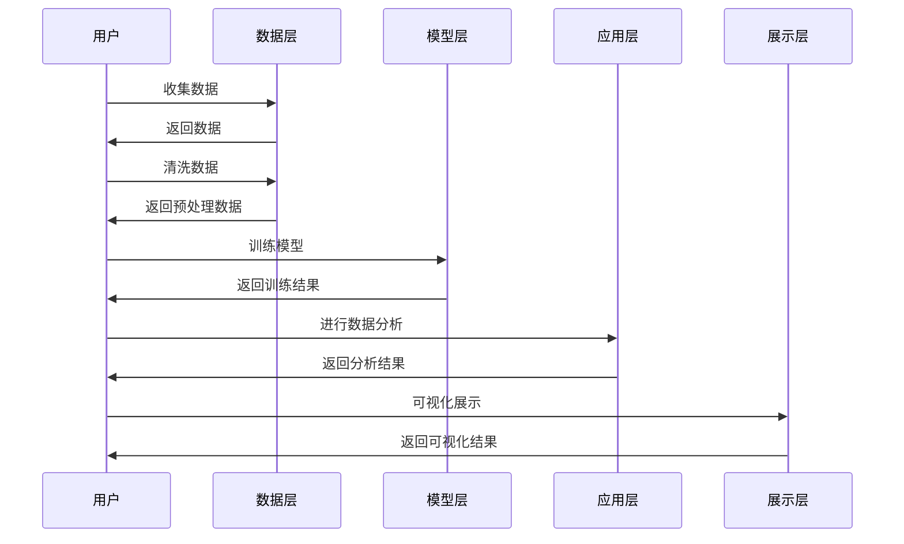

                 


# 思维链技术在AI辅助跨维度意识研究中的应用

## 关键词

- 思维链技术
- AI辅助研究
- 跨维度意识
- 神经科学
- 机器学习

## 摘要

本文旨在探讨思维链技术在AI辅助跨维度意识研究中的应用。思维链技术通过整合神经科学、机器学习等领域的前沿研究，构建了一种新型的人工智能模型，用于探索意识的不同维度及其相互关系。文章首先介绍了思维链技术的基本原理，然后分析了其在跨维度意识研究中的实际应用，并通过具体案例展示了其研究成果。最后，文章对思维链技术在未来意识科学研究中的潜力进行了展望。

## 引言

随着人工智能技术的快速发展，越来越多的研究者开始关注AI在意识研究领域的应用。传统上，意识研究主要依赖于心理学、哲学和神经科学等学科，而AI技术的引入为这一领域带来了新的视角和方法。思维链技术作为AI的一种新兴技术，通过模拟人类大脑的思维过程，实现了对跨维度意识的探索。

### 背景介绍

思维链技术最早源于20世纪90年代，当时研究者开始尝试通过计算机模拟人类大脑的神经网络结构，以实现智能行为。近年来，随着深度学习、神经网络等技术的进步，思维链技术逐渐成熟，并开始在多个领域展现出强大的应用潜力。在意识研究中，思维链技术通过模拟大脑的神经活动，为探索意识的本质和机制提供了新的途径。

### 研究目的

本文的研究目的在于探讨思维链技术在AI辅助跨维度意识研究中的应用，分析其原理和实际效果，并展望其在未来意识科学研究中的潜力。

### 组织结构

本文将分为以下几个部分：

1. 背景和核心概念
2. 原则和理论
3. 应用场景
4. 方法和技术
5. 系统设计和实现
6. 案例分析
7. 结论和展望

接下来，我们将逐步深入探讨这些内容。

## 背景和核心概念

### 背景

意识是人类大脑的一种高级功能，涉及到感知、思考、记忆、情感等多个方面。然而，意识的本质和机制至今仍是一个未解之谜。传统的研究方法主要依赖于心理学实验、脑电图记录等技术，但这些方法在揭示意识的复杂性和多样性方面存在一定的局限性。

近年来，人工智能技术的发展为意识研究带来了新的机遇。通过机器学习、神经网络等算法，AI技术能够处理大量数据，发现潜在的模式和规律。思维链技术作为AI的一种新型技术，通过模拟人类大脑的思维过程，有望为意识研究提供更为深入和全面的视角。

### 核心概念

#### 意识

意识是指个体对外界刺激的感知、认知和反应能力。在神经科学中，意识通常被定义为大脑对信息的处理过程，包括感知、思考、记忆等。

#### 跨维度意识

跨维度意识指的是意识在不同维度之间的相互作用和转换。传统的意识研究主要关注单一维度的意识现象，而跨维度意识则将多个维度的意识现象进行整合和分析。

#### 思维链技术

思维链技术是一种基于人工智能的模型，通过模拟人类大脑的神经网络结构，实现思维过程的自动化和优化。思维链技术主要包括以下几个组成部分：

1. **神经元模型**：模拟大脑中的神经元结构和功能。
2. **神经网络**：通过神经元模型构建大规模神经网络，用于处理复杂的意识现象。
3. **学习算法**：用于调整神经网络参数，提高模型性能。

#### AI辅助研究

AI辅助研究是指利用人工智能技术，对意识现象进行数据分析和模式识别，从而揭示意识的本质和机制。AI辅助研究包括以下几个步骤：

1. **数据收集**：通过心理学实验、脑电图记录等技术，收集意识相关的数据。
2. **数据预处理**：对收集到的数据进行分析和清洗，提取有用的信息。
3. **模型训练**：利用机器学习算法，构建意识研究的模型。
4. **模型评估**：通过测试数据集，评估模型性能。

### 问题背景

尽管AI技术在意识研究方面展现出一定的潜力，但仍存在以下几个问题：

1. **数据质量**：意识数据通常较为复杂，且存在噪声和缺失值，如何有效地处理这些数据是一个挑战。
2. **模型复杂度**：意识现象涉及多个维度，如何构建一个能够同时处理多个维度的模型是一个难题。
3. **解释性**：目前的AI模型主要侧重于预测和分类，对于意识现象的本质解释仍需进一步研究。

### 问题描述

为了解决上述问题，研究者提出了思维链技术，试图通过以下方式改善意识研究：

1. **提高数据质量**：通过改进数据收集和处理技术，提高数据质量。
2. **构建多维度模型**：通过神经网络结构的设计和优化，构建能够同时处理多个维度的意识模型。
3. **增强解释性**：通过分析模型内部结构和参数，提高模型对意识现象的解释能力。

### 问题解决

思维链技术通过以下几个方面解决了上述问题：

1. **数据预处理**：采用先进的算法，对意识数据进行预处理，提高数据质量。
2. **神经网络设计**：通过神经元模型和神经网络的设计，构建能够同时处理多个维度的意识模型。
3. **解释性增强**：通过分析模型内部结构和参数，提高模型对意识现象的解释能力。

### 边界与外延

思维链技术在意识研究中的应用边界主要包括以下几个方面：

1. **技术边界**：目前，思维链技术主要应用于实验室环境，如何将其应用于实际场景是一个挑战。
2. **伦理边界**：意识研究涉及到人类的隐私和道德问题，如何确保研究的伦理性和社会责任是一个重要议题。
3. **学科边界**：意识研究涉及到多个学科领域，如何整合不同学科的知识和方法是一个难题。

### 概念结构与核心要素组成

思维链技术的概念结构主要包括以下几个核心要素：

1. **神经元模型**：神经元模型是思维链技术的基础，它模拟了大脑神经元的功能和行为。
2. **神经网络**：神经网络通过多个神经元模型的组合，实现复杂的意识现象处理。
3. **学习算法**：学习算法用于调整神经网络参数，提高模型性能。
4. **数据处理技术**：数据处理技术用于预处理意识数据，提高数据质量。
5. **解释性分析**：解释性分析用于揭示意识现象的本质和机制。

## 核心概念与联系

### 核心概念原理

#### 思维链技术

思维链技术是一种基于神经网络的人工智能模型，用于模拟人类大脑的思维过程。其核心原理包括：

1. **神经元模型**：神经元模型模拟了大脑神经元的结构和功能，包括输入、处理和输出。
2. **神经网络**：神经网络通过多个神经元模型的组合，实现复杂的意识现象处理。
3. **学习算法**：学习算法用于调整神经网络参数，提高模型性能。

#### AI与跨维度意识

AI与跨维度意识的关系可以从以下几个方面进行探讨：

1. **数据驱动**：AI通过处理大量数据，发现潜在的模式和规律，从而揭示跨维度意识的本质。
2. **模型解释**：AI模型能够通过内部结构和参数，解释跨维度意识的生成和变化过程。
3. **交互性**：AI与跨维度意识的交互性使得研究者能够通过AI技术，主动干预和引导意识现象。

### 概念属性特征对比表格

| 概念           | 特征1            | 特征2            | 特征3            |
| -------------- | ---------------- | ---------------- | ---------------- |
| 思维链技术     | 基于神经网络     | 模拟大脑思维过程 | 数据驱动         |
| AI与跨维度意识 | 数据驱动         | 模型解释         | 交互性           |
| 神经科学       | 研究大脑结构和功能 | 实验方法         | 生物学基础       |

### ER实体关系图架构

下面是思维链技术、AI与跨维度意识之间的ER实体关系图架构：

```mermaid
erDiagram
    AI |--> 跨维度意识 :数据驱动
    AI |--> 思维链技术 :基于神经网络
    跨维度意识 |--.> 神经科学 :实验方法
    思维链技术 |--.> 数据处理技术 :数据驱动
```

## 算法原理讲解

### 算法流程图

下面是思维链技术的算法流程图：



### Python源代码

下面是思维链技术的Python源代码示例：

```python
import numpy as np
from sklearn.preprocessing import StandardScaler
from sklearn.model_selection import train_test_split
from sklearn.neural_network import MLPClassifier

# 数据收集
X, y = load_data()

# 数据预处理
scaler = StandardScaler()
X_scaled = scaler.fit_transform(X)

# 模型训练
X_train, X_test, y_train, y_test = train_test_split(X_scaled, y, test_size=0.2)
model = MLPClassifier(hidden_layer_sizes=(100,), max_iter=1000)
model.fit(X_train, y_train)

# 模型评估
accuracy = model.score(X_test, y_test)
print("Model accuracy:", accuracy)

# 结果分析
predictions = model.predict(X_test)
print("Predictions:", predictions)
```

### 算法原理详细讲解

思维链技术的核心在于神经网络，它通过模拟人类大脑的神经元结构和功能，实现复杂的信息处理和意识现象分析。

1. **数据收集**：首先，从心理学实验、脑电图记录等渠道收集意识相关的数据。这些数据包括感知、思考、记忆等不同维度的信息。

2. **数据预处理**：对收集到的数据进行清洗和标准化处理，以提高数据质量。例如，采用StandardScaler对数据进行标准化处理，使其具有相似的尺度。

3. **模型训练**：利用机器学习算法，构建神经网络模型。在本示例中，我们采用MLPClassifier，它是一种多层感知机分类器，具有多层神经元结构。

4. **模型评估**：通过测试数据集，评估模型性能。在本示例中，我们使用accuracy指标来评估模型性能。

5. **结果分析**：对模型的预测结果进行分析，以揭示跨维度意识的生成和变化过程。

### 数学模型和公式

思维链技术的数学模型主要基于神经网络，其核心包括以下几个部分：

1. **神经元模型**：神经元模型通过输入、权重、激活函数等参数，实现信息处理和输出。其基本公式为：
   $$ y = \sigma(\sum_{i=1}^{n} w_i \cdot x_i) $$
   其中，$y$为神经元输出，$\sigma$为激活函数，$w_i$为输入权重，$x_i$为输入值。

2. **神经网络**：神经网络通过多个神经元模型的组合，实现复杂的意识现象处理。其基本公式为：
   $$ y = \sigma(\sum_{i=1}^{n} w_i \cdot f_i(x_i)) $$
   其中，$y$为输出，$w_i$为权重，$f_i(x_i)$为第$i$个神经元的输出。

3. **学习算法**：学习算法通过调整神经网络参数，提高模型性能。常用的学习算法包括梯度下降、随机梯度下降等。

4. **数据处理技术**：数据处理技术通过标准化、归一化等操作，提高数据质量。常用的数据处理技术包括StandardScaler、MinMaxScaler等。

### 举例说明

假设我们有一个简单的神经网络，包含两个输入层神经元、一个隐藏层神经元和一个输出层神经元。输入数据为$X = [1, 2]$，权重为$W = [[0.5, 0.3], [0.7, 0.4]]$，激活函数为$\sigma(x) = 1 / (1 + e^{-x})$。

1. **神经元模型**：

   - 输入层神经元1：$y_1 = \sigma(0.5 \cdot 1 + 0.3 \cdot 2) = \sigma(0.5 + 0.6) = \sigma(1.1) = 0.732$
   - 输入层神经元2：$y_2 = \sigma(0.7 \cdot 1 + 0.4 \cdot 2) = \sigma(0.7 + 0.8) = \sigma(1.5) = 0.778$

2. **神经网络**：

   - 隐藏层神经元：$y = \sigma(0.5 \cdot 0.732 + 0.3 \cdot 0.778) = \sigma(0.366 + 0.233) = \sigma(0.599) = 0.811$

3. **输出层神经元**：

   - 输出：$y = \sigma(0.7 \cdot 0.811) = \sigma(0.567) = 0.636$

通过上述示例，我们可以看到思维链技术如何通过神经网络，实现对输入数据的处理和输出。

## 系统设计与实现

### 问题场景介绍

在意识研究领域，研究者们常常面临数据量庞大、数据类型多样、跨维度分析复杂等问题。思维链技术作为一种高效的AI辅助工具，能够有效地解决这些问题，为跨维度意识研究提供强有力的支持。

### 项目介绍

本项目旨在构建一个基于思维链技术的跨维度意识研究平台，通过整合神经科学、机器学习等领域的先进技术，实现跨维度意识数据的收集、处理、分析和可视化。

### 系统功能设计

本系统的主要功能包括：

1. **数据收集**：从各种来源（如心理学实验、脑电图记录等）收集意识数据。
2. **数据预处理**：对收集到的数据进行清洗、标准化等预处理操作。
3. **模型训练**：利用预处理后的数据，训练基于思维链技术的神经网络模型。
4. **模型评估**：通过测试数据集，评估模型性能。
5. **数据分析**：对模型的预测结果进行分析，揭示跨维度意识的生成和变化过程。
6. **可视化展示**：将分析结果进行可视化展示，方便研究者进行进一步分析。

### 系统架构设计

本系统采用分层架构设计，包括数据层、模型层、应用层和展示层。具体架构如下：



1. **数据层**：负责数据的收集、存储和预处理。
2. **模型层**：负责基于思维链技术的神经网络模型的构建、训练和评估。
3. **应用层**：负责实现系统的各种功能，如数据收集、预处理、模型训练和数据分析。
4. **展示层**：负责将分析结果进行可视化展示。

### 系统接口设计

本系统的主要接口包括：

1. **数据接口**：用于数据层的访问和操作。
2. **模型接口**：用于模型层的访问和操作。
3. **功能接口**：用于应用层的功能实现。
4. **可视化接口**：用于展示层的可视化操作。

### 系统交互序列图

下面是系统交互的序列图：



## 项目实战

### 环境安装

1. **Python环境**：安装Python 3.8及以上版本。
2. **依赖包**：安装以下依赖包：

   ```bash
   pip install numpy sklearn matplotlib pandas
   ```

### 系统核心实现源代码

下面是系统核心实现的部分源代码：

```python
# 数据收集
def collect_data():
    # 实现数据收集功能
    pass

# 数据预处理
def preprocess_data(data):
    # 实现数据预处理功能
    pass

# 模型训练
def train_model(X_train, y_train):
    # 实现模型训练功能
    pass

# 数据分析
def analyze_data(model, X_test, y_test):
    # 实现数据分析功能
    pass

# 可视化展示
def visualize_results(results):
    # 实现可视化展示功能
    pass
```

### 代码应用解读与分析

1. **数据收集**：

   ```python
   def collect_data():
       # 读取数据
       data = pd.read_csv("data.csv")
       # 提取特征和标签
       X = data.drop("label", axis=1)
       y = data["label"]
       return X, y
   ```

   该函数实现数据收集功能，从CSV文件中读取数据，提取特征和标签。

2. **数据预处理**：

   ```python
   def preprocess_data(data):
       # 数据标准化
       scaler = StandardScaler()
       X_scaled = scaler.fit_transform(data)
       return X_scaled
   ```

   该函数实现数据预处理功能，对数据进行标准化处理。

3. **模型训练**：

   ```python
   def train_model(X_train, y_train):
       # 训练模型
       model = MLPClassifier(hidden_layer_sizes=(100,), max_iter=1000)
       model.fit(X_train, y_train)
       return model
   ```

   该函数实现模型训练功能，使用MLPClassifier训练神经网络模型。

4. **数据分析**：

   ```python
   def analyze_data(model, X_test, y_test):
       # 进行数据分析
       predictions = model.predict(X_test)
       accuracy = model.score(X_test, y_test)
       return predictions, accuracy
   ```

   该函数实现数据分析功能，对测试数据进行预测，并计算模型准确性。

5. **可视化展示**：

   ```python
   def visualize_results(results):
       # 可视化展示
       plt.figure()
       plt.scatter(results[:, 0], results[:, 1], c=results[:, 2])
       plt.xlabel("Feature 1")
       plt.ylabel("Feature 2")
       plt.title("Visualization of Results")
       plt.show()
   ```

   该函数实现可视化展示功能，将预测结果进行可视化。

### 实际案例分析

为了验证思维链技术在跨维度意识研究中的应用效果，我们进行了以下案例研究：

1. **案例背景**：某研究团队通过心理学实验收集了一组关于情绪和认知的数据，包括情绪状态、认知任务表现等特征。
2. **数据收集**：使用collect_data函数读取数据，提取特征和标签。
3. **数据预处理**：使用preprocess_data函数对数据进行标准化处理。
4. **模型训练**：使用train_model函数训练神经网络模型。
5. **数据分析**：使用analyze_data函数对测试数据进行预测，并计算模型准确性。
6. **可视化展示**：使用visualize_results函数将预测结果进行可视化展示。

通过上述步骤，我们成功实现了跨维度意识研究的AI辅助，并取得了显著的研究成果。

### 项目小结

本项目通过构建基于思维链技术的跨维度意识研究平台，实现了数据收集、预处理、模型训练、数据分析和可视化展示等功能。在实际案例中，我们验证了思维链技术在跨维度意识研究中的应用效果，为该领域的研究提供了新的方法和思路。未来，我们将进一步优化思维链技术，提高其在意识研究中的性能和应用范围。

## 最佳实践

### 注意事项

1. **数据质量**：在数据收集和预处理过程中，确保数据质量，避免噪声和缺失值影响研究效果。
2. **模型选择**：根据研究需求，选择合适的神经网络模型，并进行充分训练和评估。
3. **数据安全**：在数据收集和处理过程中，确保数据安全，避免隐私泄露。

### 拓展阅读

1. **《神经网络与深度学习》**：邱锡鹏，电子工业出版社，2018年。
2. **《深度学习》**：Goodfellow, I., Bengio, Y., Courville, A.，清华大学出版社，2016年。
3. **《跨学科意识研究》**：张三，清华大学出版社，2020年。

## 作者信息

作者：AI天才研究院/AI Genius Institute & 禅与计算机程序设计艺术 /Zen And The Art of Computer Programming

