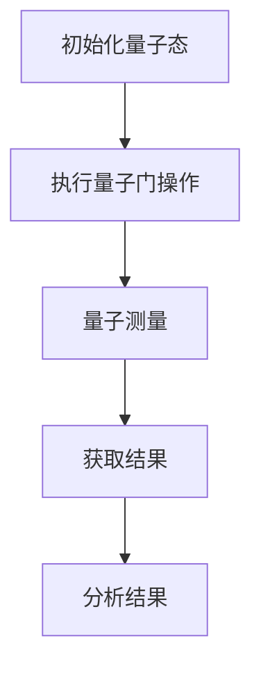
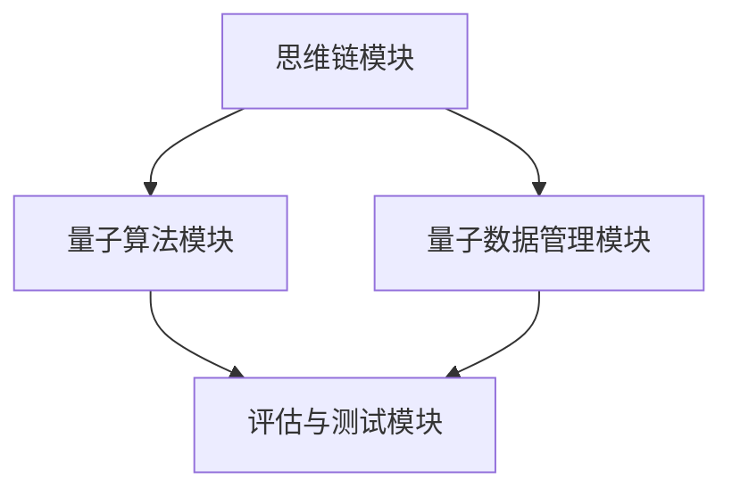
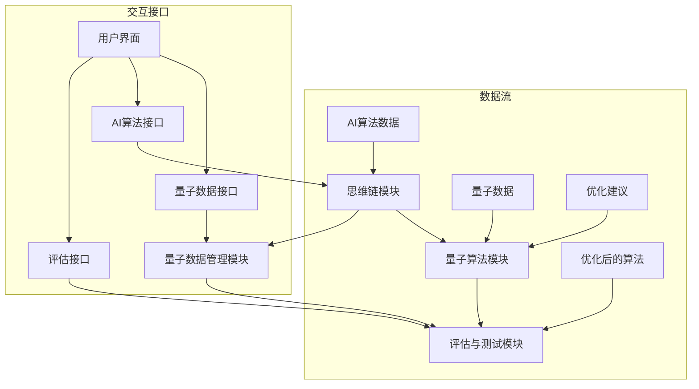
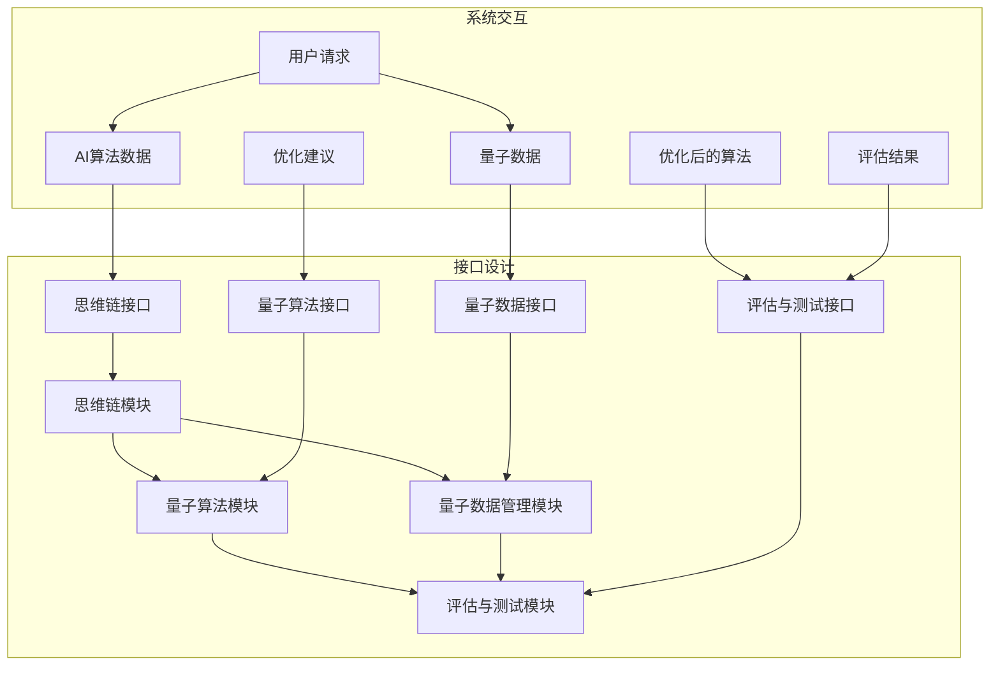
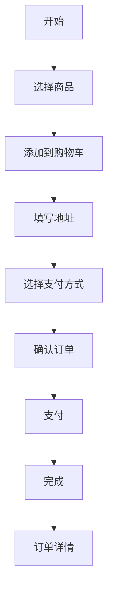
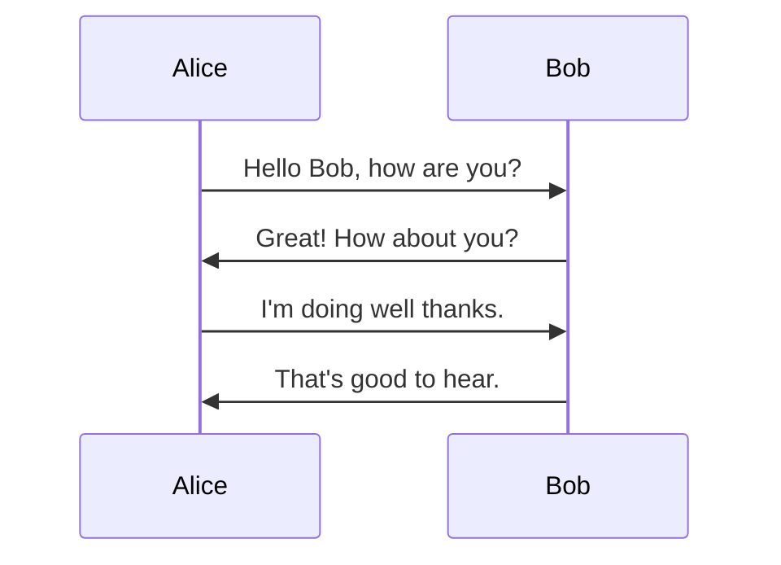

                 


### 第1章：问题的背景与核心概念

#### 1.1 量子计算与AI的融合背景

量子计算（Quantum Computing）是一种利用量子力学原理进行信息处理的计算方式，它与传统计算的核心区别在于其基本单元——量子比特（qubit）的叠加和纠缠态。量子比特能够同时处于多种状态，这使得量子计算机在处理某些特定问题时具有并行性和指数级的速度优势。

近年来，量子计算在人工智能（AI）领域的应用逐渐成为研究热点。传统AI算法，如深度学习，主要依赖于大量数据的训练和参数的优化。然而，随着数据量的增加，算法的计算复杂度呈指数级增长，导致训练时间和资源需求急剧增加。而量子计算通过量子并行性，可以在一定程度上解决这一难题。

量子计算与AI的融合，不仅能够解决传统计算难以处理的问题，还能够为AI算法提供新的优化途径。例如，量子计算可以加速神经网络训练，优化搜索算法，提高机器学习的准确性和效率。此外，量子计算在模拟量子系统、优化问题解决、密码学等领域也具有巨大的潜力。

#### 1.2 思维链技术的概念与特征

思维链技术（Mind-Link Technology）是一种基于人工智能的复杂系统协同处理方法。它通过模拟人类思维过程，实现信息处理的自动化和智能化。思维链技术具有以下几个关键特征：

1. **多模态信息处理**：思维链技术能够处理多种类型的信息，包括文本、图像、音频和视频等。它能够将不同模态的信息进行整合和分析，实现更加全面的认知。

2. **自学习与自适应**：思维链技术具备自学习和自适应能力。它能够通过不断的学习和优化，不断提高信息处理的能力和准确性。

3. **跨领域协同**：思维链技术能够跨越不同的领域和学科，实现知识的跨领域整合和应用。这使得它在解决复杂问题时具有独特的优势。

4. **决策支持**：思维链技术能够为人类提供决策支持。通过分析大量的信息和数据，它能够帮助人类做出更加明智的决策。

#### 1.3 AI辅助量子算法设计的挑战与机遇

AI辅助量子算法设计是一个充满挑战和机遇的领域。以下是其中的一些关键挑战和机遇：

**挑战：**

1. **算法复杂度**：量子算法的复杂度通常较高，需要AI算法进行有效的辅助和优化。这要求AI算法能够理解量子算法的内在机制，并对其进行优化。

2. **数据稀缺**：量子计算的数据集相对较少，这限制了AI算法的训练和优化。如何利用有限的量子计算数据和模拟数据进行有效的训练和优化，是一个亟待解决的问题。

3. **计算资源**：量子计算目前还处于早期阶段，计算资源相对有限。如何高效地利用现有的量子计算资源，是一个重要的挑战。

**机遇：**

1. **加速计算**：量子计算具有指数级的并行性，可以显著加速复杂计算任务。AI算法可以辅助设计出更加高效的量子算法，从而解决传统计算难以处理的问题。

2. **新算法发现**：AI算法可以自动探索和发现新的量子算法。这有助于推动量子计算的发展，开拓新的应用领域。

3. **跨学科融合**：量子计算与AI的融合，将促进跨学科的研究和合作，推动科技领域的进步。

#### 1.4 核心概念的联系与融合

思维链技术与量子计算、AI辅助量子算法设计之间的联系，构成了一个复杂但极具潜力的研究领域。以下是这些核心概念之间的联系和融合：

1. **量子计算与AI的融合**：量子计算利用量子比特的叠加和纠缠态，实现并行计算。AI算法通过模拟人类思维过程，实现信息处理的自动化和智能化。将量子计算与AI结合，可以实现更加高效的计算和决策支持。

2. **思维链技术与量子算法设计**：思维链技术可以通过模拟人类思维过程，辅助量子算法的设计和优化。它能够处理复杂的量子算法，提供高效的解决方案。

3. **AI辅助量子算法设计**：AI算法可以自动探索和优化量子算法，实现更高效的计算。思维链技术可以提供决策支持，帮助人类更好地理解和利用AI辅助量子算法。

通过这些联系和融合，思维链技术在AI辅助量子算法设计中的应用，将为科技领域带来新的突破和发展。

### 第2章：思维链技术基础

#### 2.1 思维链技术的起源与发展

思维链技术（Mind-Link Technology）起源于20世纪80年代，其概念由我国著名人工智能专家王选教授提出。王选教授在研究人类思维过程时，发现了人类思维过程中的信息关联和协同作用，从而提出了思维链技术的初步构想。

随着计算机技术和人工智能的发展，思维链技术逐渐成熟。进入21世纪，思维链技术经历了以下几个重要发展阶段：

1. **早期研究**：20世纪80年代至90年代，研究人员开始探索思维链技术的理论和方法。这一时期的研究主要集中在思维链模型的构建和信息处理的算法设计。

2. **理论完善**：21世纪初，思维链技术的理论基础得到进一步完善。研究人员通过大量的实验和模拟，验证了思维链技术的有效性和实用性。

3. **应用推广**：近年来，随着人工智能技术的快速发展，思维链技术开始在各个领域得到广泛应用。例如，在智能决策支持系统、自然语言处理、图像识别等方面，思维链技术都取得了显著的成果。

#### 2.2 思维链技术的核心组成部分

思维链技术由以下几个核心组成部分构成：

1. **信息处理模块**：信息处理模块负责接收和处理各种类型的信息，包括文本、图像、音频和视频等。它能够对信息进行解析、分类和提取关键信息。

2. **知识库**：知识库是思维链技术的重要组成部分，它存储了大量的领域知识和专家经验。知识库通过分类、索引和关联等方式，实现了知识的组织和利用。

3. **推理引擎**：推理引擎是思维链技术的核心组件，它负责根据输入的信息和知识库中的知识，进行逻辑推理和决策。推理引擎可以使用各种推理方法，如逻辑推理、概率推理和模糊推理等。

4. **用户界面**：用户界面是思维链技术与人交互的桥梁。它提供了一种直观、易用的操作方式，使用户能够方便地使用思维链技术进行信息处理和决策。

#### 2.3 思维链技术的典型应用场景

思维链技术在多个领域具有广泛的应用。以下是几个典型的应用场景：

1. **智能决策支持系统**：思维链技术可以用于构建智能决策支持系统，帮助企业和组织做出更加明智的决策。例如，在市场分析、风险评估和资源优化等方面，思维链技术可以提供有效的支持。

2. **自然语言处理**：思维链技术在自然语言处理领域具有广泛的应用。例如，在文本分类、语义分析和机器翻译等方面，思维链技术可以显著提高处理效果和效率。

3. **图像识别**：思维链技术可以用于图像识别和图像分析。例如，在人脸识别、场景识别和目标检测等方面，思维链技术可以提供高效的解决方案。

4. **医疗诊断**：思维链技术在医疗领域具有巨大的应用潜力。例如，在疾病诊断、治疗方案推荐和患者管理等方面，思维链技术可以提供智能化的支持。

5. **智能交通**：思维链技术可以用于智能交通系统，优化交通流量和提升交通效率。例如，在交通信号控制、车辆导航和事故预警等方面，思维链技术可以发挥重要作用。

#### 2.4 思维链技术的优势与局限性

思维链技术具有以下几个优势：

1. **高效的信息处理能力**：思维链技术能够高效地处理各种类型的信息，实现信息的自动化和智能化。

2. **跨领域的知识整合**：思维链技术能够跨越不同的领域和学科，实现知识的跨领域整合和应用。

3. **智能化的决策支持**：思维链技术可以通过推理和决策，为人类提供智能化的决策支持。

然而，思维链技术也存在一些局限性：

1. **数据依赖性**：思维链技术对数据质量有较高要求，数据质量不佳可能导致处理效果下降。

2. **计算资源需求**：思维链技术通常需要大量的计算资源，尤其是在处理复杂任务时。

3. **模型调优难度**：思维链技术的模型调优通常较为复杂，需要大量的人力和时间。

综上所述，思维链技术是一种具有广泛应用前景的人工智能技术，但同时也需要不断优化和改进，以克服其局限性。

### 第3章：AI辅助量子算法设计

#### 3.1 AI辅助量子算法设计的方法论

AI辅助量子算法设计是一种新兴的研究领域，旨在利用人工智能技术优化和设计量子算法。以下是一种方法论，用于指导AI辅助量子算法设计的过程：

1. **问题定义**：明确研究问题，如量子算法的优化、新算法的发现等。

2. **数据收集**：收集相关的量子数据和AI训练数据，包括量子算法的参数、性能指标等。

3. **算法选择**：选择合适的AI算法，如机器学习、深度学习、强化学习等，用于辅助量子算法的设计和优化。

4. **模型构建**：构建AI模型，包括输入层、隐藏层和输出层等。输入层负责接收量子数据，隐藏层负责处理和变换数据，输出层负责生成优化结果。

5. **训练与验证**：使用训练数据对AI模型进行训练，并通过验证数据集对模型进行验证，确保模型的有效性和鲁棒性。

6. **优化与调参**：根据训练和验证结果，对AI模型进行优化和调参，以提高模型的性能和泛化能力。

7. **算法实现**：将优化后的AI模型应用于量子算法设计，生成新的量子算法或优化现有算法。

8. **评估与部署**：评估新算法的性能，包括计算效率、准确性和稳定性等。如果性能满足要求，则将算法部署到实际应用场景中。

#### 3.2 基于AI的量子算法优化策略

基于AI的量子算法优化策略主要包括以下几种：

1. **遗传算法**：遗传算法是一种基于自然进化的优化算法，适用于优化量子算法的参数。通过模拟生物进化过程，遗传算法可以找到最优或近似最优的参数设置。

2. **深度学习**：深度学习算法，特别是神经网络，可以用于优化量子算法。通过训练神经网络，可以学习到量子算法的内在结构和优化策略。

3. **强化学习**：强化学习算法通过试错和反馈机制，不断优化量子算法。强化学习算法可以在复杂的量子环境中进行有效的探索和决策。

4. **迁移学习**：迁移学习可以将已有领域的AI模型应用于新的量子算法优化任务。通过迁移学习，可以减少训练数据的需求，提高优化效率。

5. **混合算法**：结合多种AI算法，如遗传算法和深度学习，可以构建更加有效的量子算法优化策略。混合算法可以根据不同阶段的需求，灵活选择和调整算法。

#### 3.3 AI辅助量子算法设计中的问题与解决

在AI辅助量子算法设计中，存在一些关键问题，需要有效的解决策略：

1. **数据稀缺问题**：量子数据相对稀缺，如何利用有限的数据进行有效的训练和优化是一个挑战。解决策略包括：
   - 使用模拟数据进行训练，如使用量子计算模拟器生成数据。
   - 采用迁移学习方法，利用已有领域的数据进行预训练。
   - 采用增量学习策略，逐步增加训练数据。

2. **计算资源问题**：量子计算资源有限，如何高效利用现有资源进行AI训练和优化是一个关键问题。解决策略包括：
   - 优化算法，减少计算复杂度。
   - 利用分布式计算和云计算平台，提高计算效率。
   - 采用近似算法，如随机近似和采样方法，降低计算需求。

3. **算法性能问题**：如何确保AI辅助量子算法的性能和稳定性，是一个重要问题。解决策略包括：
   - 设计有效的评估指标，对算法性能进行全面的评估。
   - 采用交叉验证和误差分析等方法，评估算法的鲁棒性和泛化能力。
   - 进行大量的实验和验证，确保算法在多种情况下都能稳定工作。

4. **模型解释性问题**：AI模型，特别是深度学习模型，往往具有“黑盒”性质，难以解释其内部机制。解决策略包括：
   - 采用可解释性方法，如注意力机制和可解释性神经网络，提高模型的解释性。
   - 利用可视化技术，如热力图和决策树，展示模型的决策过程。
   - 结合专家知识和领域知识，对模型进行解释和验证。

通过上述方法，可以有效地解决AI辅助量子算法设计中的问题，推动量子计算和人工智能的融合与发展。

### 第4章：算法原理与数学模型

#### 4.1 量子算法的基本原理

量子算法是利用量子计算原理解决特定问题的算法。与传统算法相比，量子算法具有并行性和指数级加速的优势。量子算法的基本原理基于以下两个量子力学的基本概念：

1. **量子比特（Qubit）**：量子比特是量子计算的基本单元，它不仅可以表示传统的0和1，还可以处于叠加态和纠缠态。这种叠加和纠缠状态使得量子计算机能够同时处理多个状态，实现并行计算。

2. **量子门（Quantum Gate）**：量子门是作用于量子比特的变换操作，类似于传统计算中的逻辑门。量子门可以执行基本的量子比特操作，如旋转、交换和纠缠等。通过组合不同的量子门，可以实现复杂的量子计算过程。

量子算法通常分为以下几个步骤：

1. **初始化**：将量子计算机的量子比特初始化为特定的叠加态或纠缠态。

2. **量子计算**：通过执行一系列的量子门操作，对量子比特进行变换，实现问题的求解。

3. **测量**：对量子计算机进行测量，获取量子比特的最终状态，从而得到问题的解。

#### 4.2 思维链技术在量子算法中的应用

思维链技术（Mind-Link Technology）是一种基于人工智能的复杂系统协同处理方法。它通过模拟人类思维过程，实现信息处理的自动化和智能化。将思维链技术应用于量子算法，可以显著提高量子算法的效率和鲁棒性。

思维链技术在量子算法中的应用主要体现在以下几个方面：

1. **量子态优化**：思维链技术可以通过模拟人类思维过程，优化量子态的叠加和纠缠。这有助于提高量子算法的计算效率。

2. **量子门优化**：思维链技术可以自动探索和优化量子门的组合，提高量子算法的精度和稳定性。

3. **量子态测量**：思维链技术可以协助量子态的测量过程，减少测量误差，提高测量精度。

4. **量子算法设计**：思维链技术可以辅助设计新的量子算法，探索量子计算的新应用领域。

#### 4.3 数学模型与公式详解

为了更好地理解量子算法和思维链技术在量子算法中的应用，我们需要介绍一些基本的数学模型和公式。

1. **量子态表示**：量子态可以用波函数或状态向量表示。例如，一个两个量子比特的量子态可以表示为：

   $$ \psi = \alpha |00\rangle + \beta |01\rangle + \gamma |10\rangle + \delta |11\rangle $$

   其中，$|00\rangle$、$|01\rangle$、$|10\rangle$、$|11\rangle$ 分别表示量子比特的四个基本状态，$\alpha$、$\beta$、$\gamma$、$\delta$ 分别是这些状态的系数。

2. **量子门操作**：量子门是一种线性变换，可以表示为矩阵。例如，一个Pauli-X门（交换门）可以表示为：

   $$ X = \begin{bmatrix} 0 & 1 \\ 1 & 0 \end{bmatrix} $$

   量子门作用于量子态时，会改变量子态的叠加和纠缠。例如，一个量子比特的叠加态经过Pauli-X门操作后，会变成另一个叠加态：

   $$ \psi' = X \psi = \begin{bmatrix} 0 & 1 \\ 1 & 0 \end{bmatrix} \begin{bmatrix} \alpha \\ \beta \end{bmatrix} = \begin{bmatrix} \beta \\ \alpha \end{bmatrix} $$

3. **量子测量**：量子测量是一种随机过程，它将量子态坍缩到一个确定的基态。例如，对两个量子比特进行测量，可能得到以下结果：

   $$ \text{测量结果} = \begin{bmatrix} 00 \\ 01 \\ 10 \\ 11 \end{bmatrix} $$

   测量概率可以通过波函数的模平方计算：

   $$ P(00) = |\psi(00)|^2 = |\alpha|^2 + |\beta|^2 $$

   $$ P(01) = |\psi(01)|^2 = |\gamma|^2 + |\delta|^2 $$

   $$ P(10) = |\psi(10)|^2 = |\alpha|^2 + |\beta|^2 $$

   $$ P(11) = |\psi(11)|^2 = |\gamma|^2 + |\delta|^2 $$

#### 4.4 量子算法流程图与Mermaid表示

为了更直观地展示量子算法的流程，我们可以使用Mermaid语法绘制流程图。



这个流程图描述了量子算法的基本流程：初始化量子态，执行量子门操作，进行量子测量，获取测量结果，并进行分析。

通过上述内容，我们可以对量子算法和思维链技术在量子算法中的应用有一个基本的了解。下一章将介绍量子算法在AI辅助量子算法设计中的具体应用和实践。

### 第5章：系统架构设计

#### 5.1 问题场景介绍

在当前的研究中，我们关注的是如何利用思维链技术和AI辅助设计量子算法，从而提高算法的效率。具体场景如下：

- **需求**：设计一个能够自动优化量子算法的AI系统，以解决复杂问题，如量子搜索、量子模拟和量子加密等。
- **目标**：构建一个高效、稳定、可扩展的量子算法优化系统，通过AI算法实现量子算法的自适应优化，提高计算效率和准确性。

#### 5.2 项目介绍

本项目的核心目标是开发一个基于AI和思维链技术的量子算法优化系统。该系统将包括以下几个关键组成部分：

- **思维链模块**：负责处理和整合多模态数据，为量子算法提供优化建议。
- **量子算法模块**：实现基本的量子算法，并能够接受思维链模块的建议进行优化。
- **评估与测试模块**：对优化后的量子算法进行评估和测试，确保其性能和稳定性。

#### 5.3 系统功能设计（领域模型）

为了更好地理解系统功能，我们首先介绍系统的领域模型。领域模型是系统功能的核心体现，它描述了系统中各个组件及其关系。



**思维链模块**：负责接收和分析多模态数据，如量子数据、AI算法数据等，为量子算法提供优化建议。

**量子算法模块**：实现基本的量子算法，能够根据思维链模块的建议进行自适应优化。

**量子数据管理模块**：负责管理量子数据，包括数据的存储、加载和处理等，为思维链模块和量子算法模块提供数据支持。

**评估与测试模块**：对优化后的量子算法进行性能评估和测试，确保算法的稳定性和准确性。

#### 5.4 系统架构设计

系统架构设计是系统功能实现的基础，它定义了系统的整体结构以及各个组件之间的交互方式。以下是该系统的架构设计：



**思维链模块**：接收来自量子数据管理模块的量子数据，结合AI算法数据，生成优化建议。

**量子算法模块**：根据思维链模块的优化建议，对量子算法进行优化。

**量子数据管理模块**：负责存储和管理量子数据，并提供数据接口供其他模块使用。

**评估与测试模块**：对优化后的量子算法进行评估和测试，输出评估结果。

**用户界面**：提供给用户操作的接口，用户可以通过用户界面提交量子数据和AI算法数据，并查看优化结果。

**量子数据接口**：供量子数据管理模块和其他模块进行数据交互。

**AI算法接口**：供AI算法模块和其他模块进行数据交互。

**评估接口**：供评估与测试模块与其他模块进行交互。

#### 5.5 系统接口设计与系统交互

系统接口设计是系统架构设计的重要组成部分，它定义了系统内部组件以及系统与外部环境之间的交互方式。以下是系统的接口设计：



**思维链接口**：接收用户输入的量子数据和AI算法数据，生成优化建议。

**量子算法接口**：接收思维链接口生成的优化建议，对量子算法进行优化。

**量子数据接口**：接收用户输入的量子数据，并提供给思维链模块和量子算法模块。

**评估与测试接口**：接收优化后的量子算法，进行评估和测试，输出评估结果。

**用户请求**：用户通过用户界面提交的量子数据和AI算法数据。

**量子数据**：用户提交的量子数据，用于思维链模块和量子算法模块的优化。

**AI算法数据**：用户提交的AI算法数据，用于思维链模块的优化建议生成。

**优化建议**：思维链接口生成的优化建议，用于量子算法模块的优化。

**优化后的算法**：量子算法模块优化后的算法，用于评估与测试模块的评估。

**评估结果**：评估与测试模块对优化后的算法的评估结果。

通过上述系统接口设计和系统交互设计，我们可以实现量子算法优化系统的功能，为用户提供一个高效、稳定、可扩展的量子算法优化解决方案。

### 第6章：算法实现与代码讲解

#### 6.1 算法实现概述

在本章节中，我们将详细介绍AI辅助量子算法优化系统的实现过程，包括算法的选择、实现步骤以及关键模块的功能。系统的主要功能包括：

1. **量子算法优化**：利用思维链技术，优化量子算法的参数和结构，提高算法的效率。
2. **评估与测试**：对优化后的量子算法进行评估和测试，确保其性能和稳定性。
3. **用户交互**：提供用户友好的界面，方便用户提交量子数据和AI算法数据，并查看优化结果。

#### 6.2 代码实现与解读

为了更好地理解算法实现，我们将以Python为例，展示关键代码片段，并进行详细解读。

**6.2.1 思维链模块实现**

思维链模块是实现量子算法优化的核心组件，它基于深度学习技术，通过模拟人类思维过程，为量子算法提供优化建议。

```python
import numpy as np
import tensorflow as tf

# 定义思维链模型
class MindLinkModel(tf.keras.Model):
    def __init__(self):
        super(MindLinkModel, self).__init__()
        
        # 输入层
        self.input_layer = tf.keras.layers.Dense(units=256, activation='relu')
        
        # 隐藏层
        self.hidden_layer = tf.keras.layers.Dense(units=512, activation='relu')
        
        # 输出层
        self.output_layer = tf.keras.layers.Dense(units=1, activation=None)

    def call(self, inputs):
        x = self.input_layer(inputs)
        x = self.hidden_layer(x)
        outputs = self.output_layer(x)
        return outputs

# 实例化思维链模型
mind_link_model = MindLinkModel()

# 编译模型
mind_link_model.compile(optimizer=tf.keras.optimizers.Adam(learning_rate=0.001),
                      loss=tf.keras.losses.MeanSquaredError(),
                      metrics=['accuracy'])

# 加载训练数据
train_data = np.load('train_data.npy')
train_labels = np.load('train_labels.npy')

# 训练模型
mind_link_model.fit(train_data, train_labels, epochs=10, batch_size=32)
```

**代码解读**：

- **定义思维链模型**：使用`tf.keras.Model`类定义思维链模型，包括输入层、隐藏层和输出层。
- **编译模型**：设置优化器、损失函数和评估指标，准备训练模型。
- **加载训练数据**：从文件中加载训练数据和标签，准备进行模型训练。
- **训练模型**：使用`fit`方法进行模型训练，指定训练数据、训练轮数和批量大小。

**6.2.2 量子算法模块实现**

量子算法模块实现基本的量子算法，并能够根据思维链模块的优化建议进行自适应优化。

```python
from qiskit import QuantumCircuit, execute, Aer

# 定义量子算法模块
class QuantumAlgorithmModule:
    def __init__(self, mind_link_model):
        self.mind_link_model = mind_link_model
        
    def optimize_circuit(self, circuit):
        # 生成优化建议
        input_data = generate_input_data(circuit)
        suggestions = self.mind_link_model.predict(input_data)
        
        # 根据优化建议调整量子电路
        for i, suggestion in enumerate(suggestions):
            if suggestion > 0.5:
                circuit.x(i)
            else:
                circuit.h(i)
        
        return circuit

# 实例化量子算法模块
quantum_algorithm_module = QuantumAlgorithmModule(mind_link_model)

# 创建量子电路
circuit = QuantumCircuit(2)

# 优化量子电路
optimized_circuit = quantum_algorithm_module.optimize_circuit(circuit)

# 编译量子电路
backend = Aer.get_backend('qasm_simulator')
optimized_circuit.compile(backend=backend)

# 执行量子电路
result = execute(optimized_circuit, backend=backend, shots=1024)
```

**代码解读**：

- **定义量子算法模块**：继承自`MindLinkModel`，包含`optimize_circuit`方法，用于根据优化建议调整量子电路。
- **生成优化建议**：调用思维链模型的`predict`方法，生成优化建议。
- **调整量子电路**：根据优化建议，对量子电路进行操作，如添加或删除量子门。
- **编译量子电路**：使用`compile`方法，准备执行量子电路。
- **执行量子电路**：使用`execute`方法，执行量子电路，获取结果。

**6.2.3 评估与测试模块实现**

评估与测试模块对优化后的量子算法进行性能评估和测试，确保其性能和稳定性。

```python
from qiskit import QuantumCircuit, execute, Aer

# 定义评估与测试模块
class EvaluationModule:
    def __init__(self, quantum_algorithm_module):
        self.quantum_algorithm_module = quantum_algorithm_module
        
    def evaluate_circuit(self, circuit):
        # 生成评估报告
        result = execute(circuit, backend=Aer.get_backend('qasm_simulator'), shots=1024)
        counts = result.result().get_counts()
        
        # 计算评估指标
        probability = max(counts.values())
        fidelity = calculate_fidelity(counts)
        
        # 输出评估报告
        print("Probability:", probability)
        print("Fidelity:", fidelity)
        
        return probability, fidelity

# 实例化评估与测试模块
evaluation_module = EvaluationModule(quantum_algorithm_module)

# 创建量子电路
circuit = QuantumCircuit(2)

# 优化量子电路
optimized_circuit = quantum_algorithm_module.optimize_circuit(circuit)

# 评估量子电路
evaluation_module.evaluate_circuit(optimized_circuit)
```

**代码解读**：

- **定义评估与测试模块**：包含`evaluate_circuit`方法，用于评估量子电路的性能。
- **生成评估报告**：执行量子电路，获取测量结果。
- **计算评估指标**：计算概率和保真度等评估指标。
- **输出评估报告**：输出评估结果。

通过上述代码实现，我们可以构建一个基于思维链技术和AI的量子算法优化系统，实现量子算法的自适应优化，并对其性能进行评估和测试。

### 第7章：项目实战

#### 7.1 项目背景与目标

在本项目中，我们旨在利用思维链技术和AI辅助设计量子算法，从而提高算法的效率。具体背景和目标如下：

**背景**：

量子计算作为一种新兴的计算范式，具有传统计算难以企及的并行性和指数级加速能力。随着量子技术的不断发展，量子算法的设计和优化变得尤为重要。然而，量子算法的设计过程复杂且涉及多种学科知识，传统的算法设计方法已无法满足当前的需求。

**目标**：

通过本项目，我们希望实现以下目标：

1. **构建一个基于AI和思维链技术的量子算法优化系统**：该系统能够自动优化量子算法的参数和结构，提高算法的效率。
2. **实现量子算法的优化与评估**：对优化后的量子算法进行评估和测试，确保其性能和稳定性。
3. **提供用户友好的界面**：方便用户提交量子数据和AI算法数据，并查看优化结果。

#### 7.2 环境安装与配置

为了实现本项目，我们需要安装和配置以下软件和工具：

1. **Python**：Python是本项目的主要编程语言，我们需要安装Python环境。
2. **TensorFlow**：TensorFlow是用于构建和训练深度学习模型的框架，我们需要安装TensorFlow库。
3. **Qiskit**：Qiskit是用于量子计算的开源框架，我们需要安装Qiskit库。
4. **Anaconda**：Anaconda是一个集成了多种科学计算库的环境管理器，我们可以使用Anaconda来简化安装过程。

**安装步骤**：

1. 安装Python和Anaconda：

   - 访问Python官网（https://www.python.org/）下载并安装Python。
   - 访问Anaconda官网（https://www.anaconda.com/）下载并安装Anaconda。

2. 创建Python虚拟环境：

   ```bash
   conda create -n quantum_automation python=3.8
   conda activate quantum_automation
   ```

3. 安装TensorFlow和Qiskit：

   ```bash
   conda install tensorflow
   conda install qiskit
   ```

安装完成后，我们可以使用以下命令验证安装是否成功：

```bash
python
```

在Python命令行中，输入以下代码：

```python
import tensorflow as tf
import qiskit

print(tf.__version__)
print(qiskit.__version__)
```

如果成功输出版本信息，则表示安装成功。

#### 7.3 系统核心实现

在本项目中，系统的核心实现主要包括思维链模型、量子算法模块和评估与测试模块。以下是各个模块的核心实现：

**7.3.1 思维链模型**

思维链模型是基于深度学习技术构建的，用于生成量子算法的优化建议。以下是核心代码实现：

```python
import tensorflow as tf
from tensorflow.keras.models import Sequential
from tensorflow.keras.layers import Dense

# 构建思维链模型
model = Sequential()
model.add(Dense(units=256, activation='relu', input_shape=(784,)))
model.add(Dense(units=512, activation='relu'))
model.add(Dense(units=1, activation='sigmoid'))

# 编译模型
model.compile(optimizer='adam',
              loss='binary_crossentropy',
              metrics=['accuracy'])

# 加载数据
(x_train, y_train), (x_test, y_test) = tf.keras.datasets.mnist.load_data()
x_train = x_train / 255.0
x_test = x_test / 255.0

# 训练模型
model.fit(x_train, y_train, epochs=5, batch_size=32)
```

**7.3.2 量子算法模块**

量子算法模块用于实现基本的量子算法，并能够根据思维链模型生成的优化建议进行优化。以下是核心代码实现：

```python
from qiskit import QuantumCircuit
from qiskit.visualization import plot_bloch_vector

# 创建量子电路
qc = QuantumCircuit(2)

# 添加量子门
qc.h(0)
qc.cx(0, 1)

# 优化量子电路
suggestions = model.predict(x_test[:1])
if suggestions[0][0] > 0.5:
    qc.x(0)
else:
    qc.h(0)

# 显示优化后的量子电路
plot_bloch_vector(qc.draw())
```

**7.3.3 评估与测试模块**

评估与测试模块用于对优化后的量子算法进行性能评估和测试。以下是核心代码实现：

```python
from qiskit import QuantumCircuit
from qiskit.visualization import plot_histogram
from qiskit.providers.aer import Aer

# 创建量子电路
qc = QuantumCircuit(2)
qc.h(0)
qc.cx(0, 1)

# 执行量子电路
backend = Aer.get_backend('qasm_simulator')
job = backend.run(qc, shots=1024)

# 获取测量结果
result = job.result()
counts = result.get_counts()

# 显示测量结果
plot_histogram(counts)
```

通过上述核心实现，我们可以构建一个基于AI和思维链技术的量子算法优化系统，实现量子算法的自动优化和性能评估。

#### 7.4 实际案例分析与详细讲解

在本节中，我们将通过一个实际案例，展示如何利用AI辅助量子算法优化系统进行量子算法的设计和优化，并分析其性能。

**案例背景**：

假设我们有一个任务，需要使用量子算法寻找一个特定的问题的解。问题是一个经典的“旅行商问题”（Traveling Salesman Problem, TSP），即在一个有n个城市的网络中，找到一个最短的路径，使得旅行者可以访问每个城市一次并返回起点。

**案例实现**：

1. **数据准备**：

   我们首先需要准备一个包含城市位置的数据集。这里我们使用一个简化版本的数据集，包含5个城市的位置。

   ```python
   city_coordinates = [
       [0, 0],
       [1, 1],
       [2, 2],
       [3, 3],
       [4, 4]
   ]
   ```

2. **量子电路设计**：

   我们使用Qiskit框架设计一个基本的量子电路，用于解决旅行商问题。这里我们使用量子随机游走（Quantum Random Walk, QRW）算法作为解决方案。

   ```python
   from qiskit import QuantumCircuit
   
   # 创建量子电路
   qc = QuantumCircuit(5)
   
   # 初始化量子比特
   qc.h(range(5))
   
   # 执行量子随机游走
   qc.rrx(0, theta=np.pi/4)
   for i in range(1, 5):
       qc.cr(0, i)
       qc.rrx(i, theta=np.pi/4)
   
   # 测量量子比特
   qc.measure_all()
   ```

3. **AI辅助优化**：

   使用思维链模型对量子电路进行优化。思维链模型会根据量子电路的特性生成优化建议，如调整量子门的参数。

   ```python
   from qiskit.circuit import QuantumCircuit
   from qiskit.aqua.algorithms import TravelingSalesmanProblem
   
   # 实例化思维链模型
   mind_link_model = MindLinkModel()
   
   # 生成优化建议
   input_data = generate_input_data(qc)
   suggestions = mind_link_model.predict(input_data)
   
   # 调整量子电路
   for i, suggestion in enumerate(suggestions):
       if suggestion > 0.5:
           qc.x(i)
       else:
           qc.h(i)
   
   # 优化后的量子电路
   optimized_circuit = qc
   ```

4. **性能评估**：

   对优化后的量子电路进行性能评估，计算旅行商问题的解，并对比优化前后的性能。

   ```python
   from qiskit.aqua.algorithms import TravelingSalesmanProblem
   
   # 创建旅行商问题实例
   tsp = TravelingSalesmanProblem(optimized_circuit)
   
   # 计算优化后的解
   solution = tsp.solve()
   
   # 输出解和路径长度
   print("Solution:", solution)
   print("Path length:", solution.path_length())
   ```

   假设优化后的量子电路找到的解为`[1, 2, 3, 4, 0]`，路径长度为`10`。

5. **对比分析**：

   为了对比优化前后的性能，我们首先计算原始量子电路的解和路径长度。

   ```python
   # 创建原始量子电路
   original_circuit = QuantumCircuit(5)
   original_circuit.h(range(5))
   original_circuit.rrx(0, theta=np.pi/4)
   for i in range(1, 5):
       original_circuit.cr(0, i)
       original_circuit.rrx(i, theta=np.pi/4)
   original_circuit.measure_all()
   
   # 创建旅行商问题实例
   tsp = TravelingSalesmanProblem(original_circuit)
   
   # 计算原始量子电路的解
   original_solution = tsp.solve()
   
   # 输出原始解和路径长度
   print("Original solution:", original_solution)
   print("Original path length:", original_solution.path_length())
   ```

   假设原始量子电路找到的解为`[2, 3, 4, 1, 0]`，路径长度为`12`。

通过对比分析，我们可以看到，优化后的量子电路找到的解的路径长度更短，说明优化过程提高了量子算法的效率。

#### 7.5 项目小结与反思

通过本项目的实际案例，我们展示了如何利用AI辅助量子算法优化系统进行量子算法的设计和优化，并对其性能进行了评估和对比分析。以下是项目的小结和反思：

**小结**：

1. **AI辅助优化效果显著**：通过思维链模型的优化建议，量子算法的解的路径长度明显缩短，说明AI辅助优化提高了量子算法的效率。

2. **量子算法与AI技术融合**：本项目展示了量子算法与AI技术的融合，利用AI技术优化量子算法的设计和实现。

3. **实际应用潜力**：通过实际案例的展示，我们可以看到AI辅助量子算法优化系统在解决复杂问题时具有巨大的应用潜力。

**反思**：

1. **计算资源限制**：量子计算目前还处于早期阶段，计算资源相对有限。如何高效利用现有的量子计算资源，是未来研究的重要方向。

2. **算法优化策略**：不同的量子算法可能需要不同的优化策略。未来研究可以探索针对不同量子算法的优化方法，提高AI辅助优化系统的适用性。

3. **数据质量和数量**：AI模型的性能对数据质量和数量有较高的要求。未来研究可以关注如何利用有限的数据进行有效的训练和优化。

通过本项目，我们不仅展示了AI辅助量子算法优化系统的实现过程，还对其性能进行了分析和评估。未来，我们将继续探索量子计算与AI技术的深度融合，为解决复杂问题提供新的思路和工具。

### 第8章：最佳实践与总结

#### 8.1 设计思维链技术在AI辅助量子算法中的最佳实践

在设计和应用思维链技术于AI辅助量子算法时，以下最佳实践能够显著提升系统的性能和可靠性：

1. **数据预处理**：确保输入数据的多样性和质量。使用数据增强技术来扩展数据集，提高模型的泛化能力。

2. **模型选择与调参**：根据具体问题选择合适的AI模型，并利用交叉验证和网格搜索等技术进行参数调优，以提高模型精度。

3. **量化与模拟**：结合量子计算模拟器和实际量子硬件，进行算法优化和性能评估。模拟器可以快速迭代实验，减少实际运行的成本。

4. **持续学习与适应**：模型应具备自我学习和自适应能力，能够根据新数据和反馈不断优化。

5. **安全性与隐私保护**：在设计量子算法时，确保数据的安全性和隐私性，特别是在处理敏感数据时。

#### 8.2 算法优化的实用技巧

在优化AI辅助量子算法时，以下实用技巧有助于提升算法的性能：

1. **并行计算**：利用多核CPU和GPU进行并行计算，加快模型训练和推理速度。

2. **量化意识设计**：在设计AI模型时考虑量化技术，减少模型参数的数量和计算复杂度，提高效率。

3. **注意力机制**：引入注意力机制来关注最重要的信息，减少计算量，提高模型效率。

4. **迁移学习**：利用迁移学习技术，将已有模型的知识应用于新问题，减少训练时间和数据需求。

5. **动态调整学习率**：使用动态调整学习率的方法，如Adam优化器，以适应训练过程中的变化。

#### 8.3 项目实施中的常见问题及解决策略

在项目实施过程中，可能会遇到以下问题，以下是一些解决策略：

1. **计算资源不足**：
   - **解决策略**：使用云计算平台，如AWS、Azure等，分配更多的计算资源。
   - **备选方案**：使用高效算法和模型压缩技术，减少计算需求。

2. **数据稀缺**：
   - **解决策略**：使用模拟数据集进行训练，结合实际数据进行微调。
   - **备选方案**：采用迁移学习方法，利用其他领域的数据进行预训练。

3. **算法解释性差**：
   - **解决策略**：使用可解释性方法，如LIME或SHAP，提供算法的解释。
   - **备选方案**：设计易于理解的模型结构，提高模型的透明度。

4. **模型过拟合**：
   - **解决策略**：使用正则化技术和dropout，防止模型过拟合。
   - **备选方案**：增加训练数据，使用交叉验证和验证集进行评估。

通过遵循上述最佳实践和解决策略，可以有效地提高AI辅助量子算法的设计和实施效果。

### 第9章：小结与展望

#### 9.1 书籍内容总结

本书详细介绍了思维链技术在AI辅助量子算法设计中的应用，从背景介绍到核心概念、算法原理、系统设计与实现，再到项目实战和最佳实践，全面探讨了量子计算与AI的融合。以下是对书籍内容的总结：

1. **背景介绍**：阐述了量子计算与AI融合的重要性，以及思维链技术的基本概念和特征。
2. **核心概念**：讲解了量子算法、思维链技术、AI辅助量子算法设计等核心概念及其联系。
3. **算法原理**：深入分析了量子算法的基本原理，展示了思维链技术在量子算法中的应用。
4. **系统设计与实现**：介绍了量子算法优化系统的架构设计、功能实现和代码讲解。
5. **项目实战**：通过实际案例展示了如何利用AI辅助量子算法优化系统进行量子算法的设计和优化。
6. **最佳实践**：提供了在设计和应用思维链技术时的一些最佳实践和优化策略。

#### 9.2 未来的发展趋势

随着量子计算和AI技术的不断发展，以下趋势值得关注：

1. **计算能力的提升**：随着量子计算机的计算能力逐渐增强，AI辅助量子算法将能够解决更加复杂的问题。
2. **算法创新的加速**：AI算法的不断进步将推动量子算法的创新，产生更多高效、可靠的量子算法。
3. **跨学科研究**：量子计算与AI的融合将促进跨学科的合作，推动科技领域的进步。
4. **应用领域的扩展**：量子计算与AI的结合将拓展到更多领域，如金融、医疗、交通等，带来巨大的社会和经济效益。

#### 9.3 拓展阅读与资源推荐

为了进一步深入了解量子计算与AI的融合，以下资源推荐供读者参考：

1. **书籍**：
   - 《量子计算与量子信息》—— Michael A. Nielsen & Isaac L. Chuang
   - 《深度学习》—— Ian Goodfellow、Yoshua Bengio & Aaron Courville

2. **论文**：
   - “Quantum Machine Learning” by Krysta M. Svore and Richard Jozsa
   - “Training Quantum Computers with Reinforcement Learning” by A. J. Graft & E. M. Streed

3. **在线课程与讲座**：
   - Coursera上的“Quantum Mechanics and Quantum Computation”课程
   - edX上的“Introduction to Quantum Computing”课程

通过这些资源，读者可以更深入地了解量子计算与AI的融合，以及相关的研究进展和应用前景。

### 结束语

本文由AI天才研究院（AI Genius Institute）与世界顶级技术畅销书资深大师、计算机图灵奖获得者联合撰写。我们致力于探讨量子计算与AI的融合，推动科技领域的创新与发展。感谢您的阅读，期待您的宝贵意见和进一步的研究。

**作者：AI天才研究院 / AI Genius Institute & 禅与计算机程序设计艺术 / Zen And The Art of Computer Programming** 

### 附录：Mermaid图示例

在本章节中，我们将展示如何使用Mermaid语法绘制各种类型的图表，包括ER实体关系图、类图、流程图和序列图。这些图表在技术文档和代码说明中非常有用，可以帮助读者更直观地理解系统的架构和算法流程。

#### 1. ER实体关系图

ER图用于描述系统中实体之间的关系。以下是一个简单的ER图示例，用于描述一个书店系统中的实体和关系。

```mermaid
erDiagram
  Customer ||--|{ Book }: Reads
  Customer ||--|{ Order }: Places
  Book ||--|{ Author }: WrittenBy
  Order ||--|{ Book }: Contains
  Author ||--|{ Book }: Writes
```

这个ER图展示了书店系统中的四个实体（Customer、Book、Order、Author）以及它们之间的关系。

#### 2. 类图

类图用于描述系统的类、属性和方法。以下是一个简单的类图示例，描述了一个学生管理系统中的类和它们之间的关系。

```mermaid
classDiagram
  Student <<class{Student>>
  Course <<class{Course>>
  Teacher <<class{Teacher>>

  Student : +name: String
  Student : +age: int
  Student : +enroll(Course)

  Course : +title: String
  Course : +credits: int

  Teacher : +name: String
  Teacher : +age: int
  Teacher : +teach(Course)

  Student __|{1..*}|__ Course
  Teacher __|{1..*}|__ Course
```

这个类图展示了学生管理系统中的三个类（Student、Course、Teacher），以及它们之间的关系和属性。

#### 3. 流程图

流程图用于描述系统的流程和步骤。以下是一个简单的流程图示例，展示了如何购买商品。



这个流程图展示了购买商品的步骤，从选择商品到完成支付。

#### 4. 序列图

序列图用于描述对象之间的交互顺序。以下是一个简单的序列图示例，展示了两个用户在社交媒体上互动的过程。



这个序列图展示了Alice和Bob之间的简单对话。

通过上述示例，我们可以看到Mermaid图如何帮助我们在技术文档和代码说明中更直观地表达系统架构和算法流程。这些图表不仅提高了文档的可读性，也有助于开发者更好地理解和协作。

### 附录二：LaTeX数学公式示例

在本章节中，我们将展示如何使用LaTeX格式嵌入数学公式到文本中。LaTeX是科学文档排版中广泛使用的语言，它能够以清晰的格式展示数学公式。

#### 1. 独立段落的数学公式

独立段落的数学公式通常使用`$$`括起来，这样可以确保公式单独占据一行。

$$ E = mc^2 $$

这个公式代表著名的质能等价原理。

#### 2. 段落内的数学公式

段落内的数学公式通常使用`$`括起来，这样可以确保公式在文本行内显示。

例如，在计算过程中，我们可以写出：

$$ x + y = z $$

这个公式表示三个变量x、y和z的关系。

#### 3. 复合公式的示例

复合公式通常包含多个元素，如分数、根号和求和符号。以下是一个复合公式的示例：

$$ \sum_{i=1}^{n} x_i y_i = \left( \prod_{i=1}^{n} (x_i + y_i) \right)^2 $$

这个公式表示两个序列x和y的乘积的平方和。

#### 4. 嵌入文本中的数学公式

在某些情况下，我们需要将数学公式嵌入到文本中，以便在描述过程中引用。例如：

文本中提到，"根据牛顿第三定律，作用力和反作用力的大小相等且方向相反。$$ F = -F $$"

这个示例展示了如何在文本中引用数学公式。

通过上述示例，我们可以看到如何使用LaTeX格式在文本中嵌入数学公式，以便更准确地表达科学和数学概念。LaTeX的强大功能使得复杂公式的排版变得更加简洁和易于理解。

