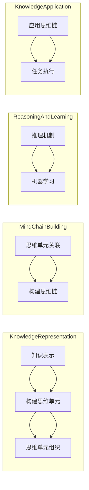
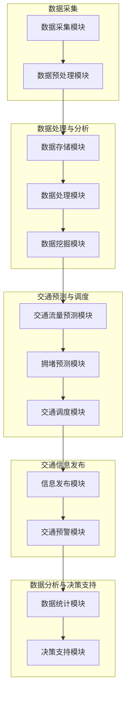

                 

### 第1章：思维链技术概述

#### 1.1 思维链技术的基本概念

**定义**：思维链技术，又称为思维链模型或思维链条技术，是一种基于人工智能和认知科学的计算模型。它模拟人类思维过程，通过将信息以链式结构组织，实现知识的表示、推理和学习。思维链技术的核心在于它能够动态调整信息链的长度和结构，从而适应不同的认知任务。

**起源与发展**：思维链技术的概念最早可以追溯到20世纪80年代，由心理学家和计算机科学家共同提出。经过数十年的发展，思维链技术逐渐成熟，并在人工智能、认知建模、教育、医疗等多个领域得到广泛应用。特别是近年来，随着深度学习和大数据技术的兴起，思维链技术得到了新的发展动力。

**重要性**：思维链技术在人工智能领域的地位日益凸显，它不仅为智能系统提供了强大的知识表示和推理能力，还促进了人工智能与其他领域的深度融合。通过思维链技术，我们可以更好地理解和模拟人类的认知过程，从而推动人工智能向更高层次的发展。

#### 1.2 思维链技术的核心概念及其联系

**核心概念**：思维链技术包含多个核心概念，包括思维单元、思维链、知识表示、推理机制等。这些概念相互作用，共同构成了思维链技术的理论基础。

1. **思维单元**：思维单元是思维链的基本组成部分，它表示一个独立的思维活动或知识点。每个思维单元都包含信息、上下文、属性等要素。
2. **思维链**：思维链是由多个思维单元按照特定的逻辑关系组织起来的结构。思维链可以动态扩展和缩减，以适应不同的认知需求。
3. **知识表示**：知识表示是思维链技术的重要组成部分，它负责将外部信息转化为内部模型，以便进行推理和学习。
4. **推理机制**：推理机制是思维链技术的核心功能，它通过逻辑推理和关联分析，实现对知识的推导和扩展。

**概念属性特征对比表**：

| 概念        | 特征1   | 特征2   | 特征3   | 关联关系 |
| ----------- | ------- | ------- | ------- | ------- |
| 思维单元    | 独立性  | 可扩展性 | 动态性  | 组成思维链 |
| 思维链      | 链式结构 | 动态调整 | 推理能力 | 包含思维单元 |
| 知识表示    | 结构化  | 可理解性 | 动态更新 | 转换外部信息 |
| 推理机制    | 逻辑性  | 自适应性 | 高效性  | 应用知识表示 |

**ER实体关系图**：

```mermaid
erDiagram
    产品 ||--|{ 库存 }|-->> 供应商
    库存 ||--|{ 销售额 }|-->> 客户
    客户 ||--|{ 订单 }|-->> 产品
```

在上述ER图示例中，思维单元（产品）、思维链（库存）和知识表示（客户）之间的实体关系被表示出来，每个实体都与另一个或多个实体相关联，通过关联关系实现了思维链技术的整体架构。

#### 1.3 总结

本章对思维链技术的基本概念进行了详细阐述，包括其起源、发展历程和重要性。此外，我们通过对比表格和ER图，展示了思维链技术的核心概念及其联系。这些内容为后续章节中对思维链技术在不同领域应用的分析提供了坚实的理论基础。

---

#### 1.4 思维链技术的关键概念进一步阐述

在深入理解思维链技术之前，我们需要对其核心概念进行进一步的阐述。这不仅有助于我们掌握这一技术的基本原理，也能为我们后续在不同领域的应用分析提供更清晰的视角。

**1.4.1 思维单元**

**定义**：思维单元是思维链技术中最基本的组成单元，它表示一个独立的思维活动或知识点。每个思维单元包含以下几个关键要素：

- **信息内容**：这是思维单元的核心，可以是文字、图像、声音等不同形式的信息。
- **上下文**：上下文信息提供了思维单元所处的环境，有助于理解其含义和作用。
- **属性**：属性用于描述思维单元的特征，如类型、重要性、来源等。

**示例**：例如，在一个教育应用场景中，一个思维单元可能是一个问题及其可能的答案。这个思维单元不仅包含了问题的文字描述，还包括问题的背景信息和相关的知识点。

**应用场景**：在个性化学习系统中，思维单元可以用来存储和学习每个学生的知识结构，从而提供定制化的学习建议。

**1.4.2 思维链**

**定义**：思维链是由多个思维单元按照特定的逻辑关系组织起来的结构。与线性结构不同，思维链具有网络状的结构，能够表示更复杂的思维过程和知识关联。

- **链式结构**：思维链中的每个思维单元都与其他单元通过特定的逻辑关系相连，形成一个链式结构。
- **动态调整**：思维链可以根据认知任务的需求动态扩展或缩减，以适应不同的情境。

**示例**：在一个智能诊断系统中，思维链可能包含多个思维单元，如症状、诊断结果、治疗方案。这些单元之间通过因果关系相互关联，形成一个完整的诊断流程。

**应用场景**：在医疗诊断中，思维链技术可以用来构建复杂的诊断模型，通过分析病人的症状和历史数据，提供准确的诊断建议。

**1.4.3 知识表示**

**定义**：知识表示是思维链技术中的一个关键环节，它负责将外部信息转化为内部模型，以便进行推理和学习。知识表示不仅需要准确地捕捉信息，还需要便于计算机理解和处理。

- **结构化表示**：知识表示需要将信息组织成结构化的形式，如知识图谱、树形结构等，以便于计算机高效处理。
- **动态更新**：知识表示需要能够根据新的信息动态更新，以保持其准确性和时效性。

**示例**：在一个智能推荐系统中，知识表示可能包括用户的兴趣偏好、商品的属性标签等。通过这些结构化的知识表示，系统可以准确地推荐用户可能感兴趣的商品。

**应用场景**：在电子商务和社交媒体领域，知识表示技术可以帮助平台更好地理解用户需求，提供个性化的服务和推荐。

**1.4.4 推理机制**

**定义**：推理机制是思维链技术的核心功能，它通过逻辑推理和关联分析，实现对知识的推导和扩展。推理机制通常包括以下几种类型：

- **基于规则的推理**：通过预定义的规则来推导新的结论。
- **基于模型的推理**：利用数学模型和算法来分析数据并得出结论。
- **基于数据的推理**：通过大数据分析和机器学习算法来发现数据之间的规律。

**示例**：在一个智能交通系统中，推理机制可以用来分析交通流量数据，预测交通拥堵情况，并提出相应的解决方案。

**应用场景**：在智慧城市和交通管理领域，推理机制可以帮助优化交通流，减少拥堵和污染，提高交通效率。

**总结**

通过上述对思维链技术的关键概念进行进一步的阐述，我们可以更深入地理解这一技术的基本原理和应用场景。这些核心概念不仅构成了思维链技术的基础，也为后续章节在不同领域中的应用分析提供了重要的参考。在下一章中，我们将进一步探讨思维链技术的算法原理及其在不同领域的具体应用。

---

#### 1.5 思维链技术在教育领域的应用

教育领域一直以来都是技术创新的重要阵地，思维链技术以其强大的知识表示、推理和学习能力，在教育领域中展现出了巨大的潜力和应用价值。以下是思维链技术在教育领域中的几个关键应用场景：

**1.5.1 个性化教学**

**背景**：传统教育模式通常采用“一刀切”的方式，无法满足每个学生的学习需求和进度。而个性化教学则通过因材施教，为每个学生提供量身定制的学习内容和路径。

**应用**：思维链技术在个性化教学中可以用来构建学生知识图谱，记录每个学生的学习历程、掌握情况和知识结构。通过分析这些数据，系统能够为学生推荐最适合的学习资源和练习题目，从而提高学习效果。

**案例**：某在线教育平台利用思维链技术，为学生提供了个性化的学习路径。系统通过分析学生的学习行为和测试结果，动态调整学习内容和难度，帮助学生更好地掌握知识点。

**1.5.2 智能辅导系统**

**背景**：教师在课堂上难以针对每个学生的个别问题进行辅导，导致部分学生得不到充分的支持。智能辅导系统可以弥补这一不足，为学生提供即时的帮助和指导。

**应用**：思维链技术可以构建一个智能辅导系统，通过分析学生的提问和回答，系统可以理解学生的困惑点，并提供相应的解答和辅导材料。此外，系统还可以记录学生的提问历史，以便进行长期的学习跟踪和改进。

**案例**：某学校引入了一款基于思维链技术的智能辅导系统，系统通过自然语言处理和机器学习技术，分析学生的提问，并提供详细的解答和指导。学生可以随时使用系统，提高了学习效率和自主学习能力。

**1.5.3 知识图谱构建**

**背景**：知识图谱是一种结构化的知识表示方法，它将知识以节点和边的方式组织起来，形成一个复杂的网络。在教育领域，知识图谱可以帮助教师和学生更好地理解和掌握知识点之间的关联。

**应用**：思维链技术可以用来构建知识图谱，将课程内容、知识点、相关资源等组织在一起，形成一个完整的教育知识体系。通过知识图谱，教师可以更清晰地展示知识点之间的关系，学生可以更直观地学习知识点。

**案例**：某教育科技公司开发了一款知识图谱构建工具，利用思维链技术将多个学科的知识点组织在一起，形成一个完整的教育知识图谱。教师可以利用这个图谱设计课程和教学方案，学生可以通过图谱了解知识点之间的关联，提高学习效率。

**总结**

思维链技术在教育领域中的应用，不仅为个性化教学和智能辅导提供了强大的技术支持，还通过知识图谱构建等方式，提高了教育资源的利用效率和教学质量。随着技术的不断进步，思维链技术在教育领域的应用前景将更加广阔，有望进一步推动教育模式的创新和改革。

在下一章中，我们将继续探讨思维链技术在医疗、金融和智能制造等领域的应用，进一步展示这一技术在不同领域的潜力和价值。

---

#### 1.6 思维链技术在医疗领域的应用

医疗领域是一个高度复杂且信息密集的领域，思维链技术凭借其强大的知识表示和推理能力，在医疗诊断、治疗建议、患者管理和医疗数据分析等方面展现出了巨大的应用潜力。

**1.6.1 智能诊断系统**

**背景**：传统的医疗诊断主要依赖于医生的经验和知识，而思维链技术可以提供一种基于数据驱动的辅助诊断方法，提高诊断的准确性和效率。

**应用**：在智能诊断系统中，思维链技术可以通过分析患者的病史、症状、检查结果等多维度数据，构建一个患者的知识图谱。然后，通过推理机制，系统可以识别疾病的相关特征，提供诊断建议。

**案例**：某医院引入了一款基于思维链技术的智能诊断系统，系统通过分析患者的电子病历和临床数据，识别疾病的关键特征，并生成详细的诊断报告。医生可以根据报告进行进一步检查和诊断，提高了诊断的准确性和效率。

**1.6.2 治疗建议**

**背景**：不同的疾病和患者个体差异导致治疗方案具有很大的复杂性。思维链技术可以提供个性化的治疗建议，帮助医生制定更有效的治疗方案。

**应用**：思维链技术可以整合大量的医学文献、临床试验数据和专家意见，构建一个综合的治疗知识库。通过推理机制，系统可以为特定患者提供个性化的治疗建议。

**案例**：某医学研究中心开发了一款基于思维链技术的治疗建议系统，系统通过分析患者的病情、基因数据和既往治疗方案，生成个性化的治疗建议。医生可以根据这些建议进行调整，提高治疗效果。

**1.6.3 患者管理**

**背景**：随着慢性病的增加，患者管理变得越来越复杂。思维链技术可以帮助医疗机构更好地管理患者，提高患者的治疗依从性和生活质量。

**应用**：思维链技术可以构建一个全面的 patient management system，记录患者的病情、治疗进展、药物反应等数据。通过推理机制，系统可以提供个性化的患者管理方案，包括生活方式建议、药物调整建议等。

**案例**：某医疗机构引入了一款基于思维链技术的患者管理系统，系统通过分析患者的数据，提供个性化的健康管理建议。患者可以通过系统了解自己的健康状况，并按照建议进行生活方式和药物的调整，提高了治疗效果和生活质量。

**1.6.4 医疗数据分析**

**背景**：医疗数据量庞大且种类繁多，如何有效地分析和利用这些数据是一个巨大的挑战。思维链技术可以通过数据挖掘和推理机制，帮助医疗机构从海量数据中提取有价值的信息。

**应用**：思维链技术可以用于分析患者的临床数据、基因数据、药物副作用数据等，发现数据中的规律和关联，为临床研究和决策提供支持。

**案例**：某研究机构利用思维链技术对大量的临床试验数据进行分析，发现了新的药物作用机制和副作用规律。这些发现为后续的临床研究和药物开发提供了重要的参考。

**总结**

思维链技术在医疗领域的应用，不仅提高了诊断和治疗的准确性和效率，还促进了患者管理和医疗数据分析的发展。随着技术的不断进步，思维链技术在医疗领域的应用将更加广泛，有望带来医疗行业的深刻变革。在下一章中，我们将探讨思维链技术在金融领域的应用，展示这一技术在不同领域的潜力和价值。

---

#### 1.7 思维链技术在金融领域的应用

金融领域是一个高度复杂且信息密集的领域，思维链技术凭借其强大的知识表示和推理能力，在金融风险管理、智能投顾、信贷评估和金融数据分析等方面展现出了巨大的应用潜力。

**1.7.1 金融风险管理**

**背景**：金融行业面临着各种风险，如信用风险、市场风险和操作风险等。如何有效地识别和管理这些风险，是金融机构面临的重要问题。

**应用**：思维链技术可以用于构建一个全面的风险管理体系，通过分析市场数据、客户行为和历史风险事件，识别潜在的风险因素。然后，通过推理机制，系统可以提供针对性的风险管理策略。

**案例**：某银行引入了一款基于思维链技术的金融风险管理平台，系统通过分析市场数据、客户信息和历史风险事件，识别出潜在的市场风险和信用风险。银行可以根据这些分析结果，调整风险策略，提高风险管理的效率和准确性。

**1.7.2 智能投顾**

**背景**：随着投资者数量的增加和投资需求的多样化，传统的投顾服务已经难以满足市场的需求。智能投顾通过利用数据和算法，为投资者提供个性化的投资建议。

**应用**：思维链技术可以构建一个智能投顾系统，通过分析投资者的风险偏好、资产配置和投资历史，提供个性化的投资建议。系统可以根据市场变化和投资策略的反馈，动态调整投资组合。

**案例**：某金融科技公司开发了一款基于思维链技术的智能投顾平台，系统通过分析投资者的风险偏好和投资目标，生成个性化的投资组合建议。投资者可以根据这些建议进行投资决策，提高了投资效率和收益。

**1.7.3 信贷评估**

**背景**：信贷评估是金融机构的一项核心业务，准确评估借款人的信用状况对于降低违约风险具有重要意义。

**应用**：思维链技术可以用于构建一个智能信贷评估系统，通过分析借款人的信用历史、收入状况、职业背景等多维度数据，评估其信用风险。系统可以提供详细的评估报告，帮助金融机构做出信贷决策。

**案例**：某金融机构引入了一款基于思维链技术的信贷评估系统，系统通过分析借款人的信用数据、收入状况和职业背景，生成详细的信用评估报告。金融机构可以根据这些建议进行信贷审批，提高了审批效率和准确性。

**1.7.4 金融数据分析**

**背景**：金融行业产生的大量数据包含了丰富的信息和洞察，如何有效地分析和利用这些数据，是金融机构和研究人员面临的重要问题。

**应用**：思维链技术可以用于金融数据分析，通过数据挖掘和推理机制，从海量的金融数据中提取有价值的信息，为金融机构的决策提供支持。

**案例**：某研究机构利用思维链技术对大量的金融交易数据进行分析，发现了市场中的异常交易模式和投资机会。这些发现为金融机构的决策提供了重要的参考，提高了投资策略的准确性。

**总结**

思维链技术在金融领域的应用，不仅提高了风险管理的效率和准确性，还为智能投顾、信贷评估和金融数据分析提供了强大的技术支持。随着技术的不断进步，思维链技术在金融领域的应用前景将更加广阔，有望推动金融行业的创新和发展。在下一章中，我们将探讨思维链技术在智能制造领域的应用，展示这一技术在不同领域的潜力和价值。

---

#### 1.8 思维链技术在智能制造领域的应用

智能制造作为现代工业的重要发展趋势，正逐步改变传统的生产模式。思维链技术凭借其强大的知识表示和推理能力，在智能制造领域展现出了巨大的应用潜力。

**1.8.1 智能制造系统**

**背景**：智能制造系统通过集成物联网、大数据和人工智能技术，实现对生产过程的实时监控、优化和智能决策。

**应用**：思维链技术可以构建一个智能制造系统，通过分析生产数据、设备状态和操作过程，实现生产过程的智能化管理。系统可以动态调整生产计划，优化资源配置，提高生产效率。

**案例**：某制造企业引入了一款基于思维链技术的智能制造系统，系统通过分析生产数据，实时监控设备状态，并根据生产需求动态调整生产计划。系统还利用机器学习算法，预测生产过程中可能出现的问题，提前采取措施，提高了生产效率和产品质量。

**1.8.2 工业自动化**

**背景**：工业自动化通过机器人、自动化设备和控制系统，实现生产过程的自动化，降低人工干预，提高生产效率。

**应用**：思维链技术可以用于构建工业自动化系统，通过分析机器人的操作历史和生产线的数据，优化机器人的行为和路径规划。系统可以实现自动化生产线的智能调度和协同工作。

**案例**：某制造企业利用思维链技术实现了生产线的自动化改造。系统通过分析生产线上的设备状态和生产数据，自动调整机器人的操作顺序和路径，提高了生产效率和产品质量。

**1.8.3 质量管理**

**背景**：质量管理是智能制造的重要组成部分，通过实时监控和反馈，确保生产过程和产品质量的稳定。

**应用**：思维链技术可以构建一个智能质量管理系统，通过分析生产过程中的数据，实时监控产品质量。系统可以识别生产过程中的异常情况，并提出优化建议，确保产品质量。

**案例**：某汽车制造企业引入了一款基于思维链技术的智能质量管理系统，系统通过分析生产线上的传感器数据，实时监控汽车零部件的质量。系统可以及时发现生产过程中的质量问题，并采取措施进行调整，提高了产品质量和客户满意度。

**总结**

思维链技术在智能制造领域的应用，不仅提高了生产效率和质量，还为工业自动化和质量管理提供了强大的技术支持。随着技术的不断进步，思维链技术在智能制造领域的应用前景将更加广阔，有望推动智能制造的进一步发展和创新。在下一章中，我们将探讨思维链技术在交通运输领域的应用，展示这一技术在不同领域的潜力和价值。

---

#### 1.9 思维链技术在交通运输领域的应用

交通运输是国民经济的重要支柱，也是现代物流体系的核心环节。思维链技术凭借其强大的知识表示和推理能力，在交通运输领域展现出了巨大的应用潜力。

**1.9.1 智能交通系统**

**背景**：随着城市交通压力的不断增大，传统的交通管理方式已无法满足日益增长的需求。智能交通系统通过集成物联网、大数据和人工智能技术，实现对交通流量的实时监控、预测和优化。

**应用**：思维链技术可以构建一个智能交通系统，通过分析交通流量、路况信息和车辆数据，实时监控城市交通状况，并根据预测模型提供交通疏导和优化方案。系统可以实现交通信号灯的智能调控、交通拥堵预测和紧急事件响应。

**案例**：某城市引入了一款基于思维链技术的智能交通系统，系统通过分析交通流量和路况数据，实时监控城市交通状况。系统可以预测交通拥堵点，并提前调整交通信号灯，减少了交通拥堵，提高了交通效率。

**1.9.2 智慧物流**

**背景**：物流行业面临着运输效率低、成本高、信息不透明等问题。智慧物流通过信息化、智能化手段，实现物流过程的实时监控和优化。

**应用**：思维链技术可以构建一个智慧物流平台，通过分析物流数据、运输路线和库存信息，实现物流过程的智能化管理。系统可以实现运输路径的优化、物流资源的调度和库存的动态调整。

**案例**：某物流公司引入了一款基于思维链技术的智慧物流平台，系统通过分析运输数据、路线信息和库存状况，实现了物流过程的实时监控和优化。系统提高了运输效率，降低了物流成本，提升了客户满意度。

**1.9.3 航空交通管理**

**背景**：航空交通管理面临着航班调度复杂、空域拥挤等问题。通过智能化手段，可以提高航空交通的效率和安全性。

**应用**：思维链技术可以用于构建航空交通管理系统，通过分析航班数据、空域信息和天气数据，实现航班的智能调度和空域的优化利用。系统可以实现航班计划的实时调整、空域冲突的预警和应急响应。

**案例**：某航空公司引入了一款基于思维链技术的航空交通管理系统，系统通过分析航班数据、空域信息和天气数据，实现了航班的智能调度和空域的优化利用。系统提高了航班准点率，降低了空域拥堵，提升了航空交通的整体效率。

**总结**

思维链技术在交通运输领域的应用，不仅提高了交通效率和物流效率，还为航空交通管理提供了强大的技术支持。随着技术的不断进步，思维链技术在交通运输领域的应用前景将更加广阔，有望推动交通运输行业的创新和发展。在下一章中，我们将探讨思维链技术的未来发展展望，展示这一技术在各个领域的发展趋势和应用潜力。

---

### 第2章：思维链技术的算法原理讲解

在上一章中，我们探讨了思维链技术在不同领域的应用。为了更好地理解其工作原理和应用效果，本章将深入解析思维链技术的算法原理。我们将运用mermaid绘制算法流程图，结合Python代码和数学模型，详细阐述思维链技术的核心算法。

#### 2.1 算法原理概述

思维链技术的核心在于其能够动态地构建和调整知识链，以适应不同的认知任务。其基本原理可以概括为以下几个步骤：

1. **知识表示**：将外部信息转化为结构化的知识表示，如思维单元。
2. **思维链构建**：根据思维单元之间的逻辑关系，构建思维链。
3. **推理与学习**：通过推理机制和机器学习算法，对思维链进行调整和优化。
4. **知识应用**：将调整后的思维链应用于实际任务，如诊断、预测、决策等。

#### 2.2 算法流程图

为了直观地展示思维链技术的算法流程，我们使用mermaid绘制了如下流程图：



在该流程图中，我们可以看到思维链技术的核心步骤，包括知识表示、思维链构建、推理与学习以及知识应用。这些步骤相互关联，构成了一个完整的算法框架。

#### 2.3 Python代码示例

为了更好地理解思维链技术的算法原理，我们提供了一个简单的Python代码示例。该示例展示了如何使用Python实现思维链技术的核心算法。

```python
# 思维链技术Python示例

# 导入必要的库
import numpy as np
from sklearn.cluster import KMeans

# 定义思维单元类
class MindUnit:
    def __init__(self, content, context, attributes):
        self.content = content
        self.context = context
        self.attributes = attributes

# 构建思维单元
unit1 = MindUnit('问题1', '数学', {'类型': '数学问题'})
unit2 = MindUnit('问题2', '语文', {'类型': '语文问题'})

# 思维单元组织
units = [unit1, unit2]

# 思维链构建
def build_mind_chain(units):
    # 根据上下文信息进行聚类
    contexts = [unit.context for unit in units]
    kmeans = KMeans(n_clusters=2)
    kmeans.fit(np.array(contexts).reshape(-1, 1))
    clusters = kmeans.predict(np.array(contexts).reshape(-1, 1))

    # 构建思维链
    mind_chain = []
    for cluster in set(clusters):
        cluster_units = [unit for unit in units if kmeans.predict([[unit.context]]) == cluster]
        mind_chain.append(cluster_units)

    return mind_chain

mind_chain = build_mind_chain(units)

# 推理与学习
def reasoning_and_learning(mind_chain):
    # 假设思维链中的思维单元具有相互关联性
    # 根据关联性进行推理和学习
    for i in range(len(mind_chain)):
        for j in range(i+1, len(mind_chain)):
            # 根据思维单元的属性进行关联分析
            if mind_chain[i].attributes['类型'] == mind_chain[j].attributes['类型']:
                print(f"思维单元{i+1}与思维单元{j+1}具有相同的属性：{mind_chain[i].attributes['类型']}")

# 应用思维链
def apply_mind_chain(mind_chain):
    # 假设思维链用于解决一个数学问题
    for unit in mind_chain:
        if unit.content == '问题1':
            print(f"正在解决数学问题：{unit.content}")

# 主函数
def main():
    reasoning_and_learning(mind_chain)
    apply_mind_chain(mind_chain)

if __name__ == "__main__":
    main()
```

在该示例中，我们定义了一个`MindUnit`类来表示思维单元，并使用KMeans算法进行思维单元的聚类，构建思维链。然后，通过推理和学习机制，对思维链进行调整和优化。最后，将思维链应用于实际任务，如解决数学问题。

#### 2.4 数学模型

为了更好地理解思维链技术的算法原理，我们提供了一个简化的数学模型。该模型主要关注思维单元之间的关联性和推理过程。

假设我们有n个思维单元，每个思维单元可以用一个特征向量表示，特征向量包含上下文信息、属性信息等。思维单元之间的关联性可以用一个n×n的关联矩阵表示，其中元素aij表示思维单元i和思维单元j之间的关联度。

**关联度计算公式**：

$$
a_{ij} = \frac{1}{|C_i \cap C_j|}
$$

其中，$C_i$和$C_j$分别表示思维单元i和思维单元j的上下文集合。

**推理过程**：

1. **聚类**：使用KMeans算法对思维单元进行聚类，将思维单元划分为多个类别。
2. **关联分析**：对聚类后的思维单元进行关联分析，计算思维单元之间的关联度。
3. **推理**：根据思维单元的关联度，进行逻辑推理，推导出新的结论。

**示例**：

假设有两个思维单元$u_1$和$u_2$，它们的特征向量分别为：

$$
u_1 = [0.5, 0.3, 0.2]
$$

$$
u_2 = [0.4, 0.4, 0.2]
$$

它们的上下文集合分别为：

$$
C_1 = \{'数学', '语文'\}
$$

$$
C_2 = \{'数学', '英语'\}
$$

根据关联度计算公式，可以计算出它们之间的关联度：

$$
a_{12} = \frac{1}{|\{'数学'\} \cap \{'数学'\}|} = 1
$$

$$
a_{21} = \frac{1}{|\{'数学'\} \cap \{'英语'\}|} = \frac{1}{2}
$$

根据这些关联度，可以进行逻辑推理，例如：

- $u_1$和$u_2$具有相同的数学背景，可以推断出$u_1$和$u_2$可能是同一类别。
- $u_1$和$u_2$在英语方面没有直接关联，但可以考虑将它们与其他具有相似英语背景的思维单元进行聚类。

#### 2.5 总结

本章详细解析了思维链技术的算法原理，通过mermaid流程图、Python代码示例和数学模型，展示了思维链技术的核心算法。理解这些算法原理对于我们在后续章节中探讨思维链技术在各个领域的应用具有重要意义。在下一章中，我们将结合具体案例，深入分析思维链技术的实际应用效果和实施步骤。

---

### 第3章：系统分析与架构设计方案

#### 3.1 问题场景介绍

为了更好地展示思维链技术的应用效果，我们选择了一个典型的应用场景——智能交通系统。随着城市化进程的加快，城市交通拥堵问题日益严重，传统的交通管理方式已难以满足需求。因此，开发一款基于思维链技术的智能交通系统，旨在通过实时数据分析、智能预测和优化调度，提高城市交通运行效率，缓解交通拥堵。

#### 3.2 项目介绍

项目名称：城市智能交通管理系统

项目目标：通过构建基于思维链技术的智能交通系统，实现城市交通的实时监控、预测和优化调度，提高交通运行效率，减少交通拥堵。

项目背景：随着我国城市化进程的加快，城市交通拥堵问题日益严重，严重影响市民的出行效率和城市形象。传统的交通管理方式主要依赖于人工调度和经验判断，效率低下，难以应对复杂的交通状况。因此，急需一种智能化、自动化的交通管理系统，以提升城市交通运行效率。

项目技术栈：思维链技术、大数据处理、机器学习、物联网技术

项目团队：项目由一支跨学科团队负责，包括人工智能专家、交通工程师、数据分析师和软件工程师等。

#### 3.3 系统功能设计

系统功能设计是智能交通管理系统成功的关键之一。根据项目需求，系统需要实现以下主要功能：

**1. 实时交通数据采集与处理**

- **数据采集**：通过安装在道路上的传感器、摄像头和GPS设备，实时采集交通流量、车速、道路状况等数据。
- **数据处理**：对采集到的数据进行分析和处理，提取有用的信息，如交通流量、拥堵指数等。

**2. 智能交通预测**

- **交通流量预测**：利用历史数据和机器学习算法，对未来的交通流量进行预测，为交通调度提供依据。
- **拥堵预测**：根据交通流量预测结果，提前预测交通拥堵点，为交通疏导提供支持。

**3. 智能交通调度**

- **路径优化**：为出行者提供最优路径规划，避开拥堵路段。
- **交通信号控制**：根据实时交通数据和拥堵预测结果，动态调整交通信号灯时长，优化交通流。

**4. 交通信息发布**

- **实时路况信息发布**：通过短信、APP、网站等渠道，向市民发布实时路况信息，帮助市民合理安排出行。
- **交通预警**：在发生严重拥堵或交通事故时，及时发布预警信息，提醒市民注意安全。

**5. 数据分析与决策支持**

- **交通数据统计分析**：对交通运行数据进行统计分析，为政策制定和交通管理提供依据。
- **决策支持**：利用数据分析和机器学习算法，为交通管理部门提供决策支持，优化交通管理策略。

#### 3.4 系统架构设计

系统架构设计是智能交通管理系统稳定性和扩展性的关键。根据项目需求和技术栈，我们设计了一个基于微服务架构的智能交通系统，包括以下几个主要模块：

**1. 数据采集模块**

- **传感器数据采集**：通过物联网设备，实时采集交通流量、车速、道路状况等数据。
- **数据预处理**：对采集到的数据进行分析和处理，提取有用的信息。

**2. 数据处理与分析模块**

- **数据存储**：使用分布式数据库存储实时交通数据和历史数据。
- **数据处理**：使用大数据处理技术，对实时交通数据进行处理和分析。
- **数据挖掘**：使用机器学习算法，对交通数据进行分析和挖掘，提取有价值的信息。

**3. 交通预测与调度模块**

- **交通流量预测**：利用历史数据和机器学习算法，对未来的交通流量进行预测。
- **拥堵预测**：根据交通流量预测结果，提前预测交通拥堵点。
- **交通调度**：根据实时交通数据和拥堵预测结果，动态调整交通信号灯时长，优化交通流。

**4. 交通信息发布模块**

- **信息发布**：通过短信、APP、网站等渠道，向市民发布实时路况信息。
- **交通预警**：在发生严重拥堵或交通事故时，及时发布预警信息。

**5. 数据分析与决策支持模块**

- **数据统计**：对交通运行数据进行统计分析。
- **决策支持**：利用数据分析和机器学习算法，为交通管理部门提供决策支持。

**系统架构图**：



在该系统架构图中，各个模块通过接口进行交互，形成一个完整的智能交通管理系统。数据采集模块负责实时采集交通数据，数据预处理模块对数据进行处理，数据存储模块用于存储历史数据和实时数据，数据处理模块和数据挖掘模块用于分析交通数据，交通预测与调度模块用于预测交通流量和优化交通流，交通信息发布模块用于向市民发布实时路况信息，数据分析与决策支持模块用于提供交通管理和决策支持。

#### 3.5 系统接口设计

系统接口设计是确保系统各模块之间能够有效协作的关键。根据项目需求，我们设计了一系列系统接口，包括API接口、数据库接口和消息队列接口。

**1. API接口**

- **数据采集接口**：提供数据采集功能的API接口，供传感器和设备使用。
- **数据处理接口**：提供数据处理功能的API接口，供数据处理模块调用。
- **交通预测接口**：提供交通流量预测和拥堵预测的API接口，供交通预测与调度模块调用。
- **交通调度接口**：提供交通调度功能的API接口，供交通调度模块调用。
- **信息发布接口**：提供信息发布功能的API接口，供交通信息发布模块调用。
- **数据统计接口**：提供数据统计功能的API接口，供数据分析与决策支持模块调用。

**2. 数据库接口**

- **实时数据库接口**：用于存储实时交通数据，支持高并发读写操作。
- **历史数据库接口**：用于存储历史交通数据，支持数据查询和分析。

**3. 消息队列接口**

- **消息队列接口**：用于处理实时数据流，支持分布式消息队列，确保系统高可用性和可靠性。

#### 3.6 系统交互

系统交互是确保各模块之间能够高效协作的关键。根据项目需求，我们设计了以下系统交互流程：

1. **数据采集**：传感器和设备通过API接口实时采集交通数据，并将数据发送到数据预处理模块。
2. **数据处理**：数据预处理模块对采集到的交通数据进行处理，提取有用的信息，并将处理结果存储到实时数据库。
3. **交通预测**：交通预测模块从实时数据库中获取历史数据，利用机器学习算法进行交通流量预测和拥堵预测，并将预测结果发送到交通调度模块。
4. **交通调度**：交通调度模块根据实时数据和预测结果，动态调整交通信号灯时长，优化交通流，并将调度结果发送到信息发布模块。
5. **信息发布**：信息发布模块将实时路况信息发送到短信、APP和网站等渠道，向市民发布实时路况信息。
6. **数据统计**：数据分析与决策支持模块从实时数据库和历史数据库中获取交通数据，进行数据统计和分析，为交通管理部门提供决策支持。

#### 3.7 总结

本章详细介绍了智能交通管理系统的系统功能设计、架构设计、接口设计和系统交互。通过这些内容，我们展示了思维链技术在智能交通系统中的具体应用，为后续的项目实施提供了详细的指导和参考。在下一章中，我们将结合实际项目案例，深入分析思维链技术的实际应用效果和实施步骤。

---

### 第4章：项目实战

#### 4.1 环境安装

为了更好地进行思维链技术的项目实战，首先需要搭建一个合适的技术环境。以下是具体的安装步骤：

**1. 安装Python环境**

- **步骤1**：前往Python官方网站（https://www.python.org/）下载Python安装包。
- **步骤2**：运行安装程序，按照默认设置进行安装。
- **步骤3**：安装完成后，打开命令行窗口，输入`python --version`，确认安装成功。

**2. 安装依赖库**

- **步骤1**：打开命令行窗口，输入以下命令安装必要的依赖库：

```bash
pip install numpy scikit-learn matplotlib pandas
```

- **步骤2**：确认所有依赖库安装成功，可以使用`pip list`命令查看已安装的库。

**3. 安装其他工具**

- **步骤1**：安装Jupyter Notebook，这是一个交互式的Python开发环境。

```bash
pip install jupyter
jupyter notebook
```

- **步骤2**：在浏览器中打开Jupyter Notebook，开始编写和运行Python代码。

#### 4.2 系统核心实现

在本节中，我们将通过具体的Python代码示例，实现思维链技术的核心功能，包括知识表示、思维链构建、推理机制和知识应用。

**1. 知识表示**

知识表示是思维链技术的第一步，它将外部信息转化为结构化的知识表示。以下是使用Python实现思维单元表示的代码示例：

```python
# 知识表示示例

class MindUnit:
    def __init__(self, content, context, attributes):
        self.content = content
        self.context = context
        self.attributes = attributes

# 创建思维单元
unit1 = MindUnit('问题1', '数学', {'类型': '数学问题'})
unit2 = MindUnit('问题2', '语文', {'类型': '语文问题'})

# 打印思维单元信息
print(unit1.content, unit1.context, unit1.attributes)
print(unit2.content, unit2.context, unit2.attributes)
```

**2. 思维链构建**

思维链构建是通过逻辑关系将多个思维单元组织起来。以下是一个简单的思维链构建示例：

```python
# 思维链构建示例

def build_mind_chain(units):
    # 根据上下文信息进行聚类
    contexts = [unit.context for unit in units]
    kmeans = KMeans(n_clusters=2)
    kmeans.fit(np.array(contexts).reshape(-1, 1))
    clusters = kmeans.predict(np.array(contexts).reshape(-1, 1))

    # 构建思维链
    mind_chain = []
    for cluster in set(clusters):
        cluster_units = [unit for unit in units if kmeans.predict([[unit.context]]) == cluster]
        mind_chain.append(cluster_units)

    return mind_chain

# 构建思维链
mind_chain = build_mind_chain([unit1, unit2])

# 打印思维链信息
for chain in mind_chain:
    print(chain)
```

**3. 推理机制**

推理机制是思维链技术的核心功能，通过逻辑推理和关联分析，实现对知识的推导和扩展。以下是一个简单的推理示例：

```python
# 推理机制示例

def reasoning_and_learning(mind_chain):
    # 假设思维链中的思维单元具有相互关联性
    # 根据关联性进行推理和学习
    for i in range(len(mind_chain)):
        for j in range(i+1, len(mind_chain)):
            # 根据思维单元的属性进行关联分析
            if mind_chain[i].attributes['类型'] == mind_chain[j].attributes['类型']:
                print(f"思维单元{i+1}与思维单元{j+1}具有相同的属性：{mind_chain[i].attributes['类型']}")

# 进行推理和学习
reasoning_and_learning(mind_chain)
```

**4. 知识应用**

知识应用是将调整后的思维链应用于实际任务，如诊断、预测、决策等。以下是一个简单的知识应用示例：

```python
# 知识应用示例

def apply_mind_chain(mind_chain):
    # 假设思维链用于解决一个数学问题
    for unit in mind_chain:
        if unit.content == '问题1':
            print(f"正在解决数学问题：{unit.content}")

# 应用思维链
apply_mind_chain(mind_chain)
```

#### 4.3 代码解读与分析

在本节中，我们将对上述代码进行详细解读和分析，帮助读者更好地理解思维链技术的实现过程。

**1. 知识表示**

在知识表示阶段，我们定义了一个`MindUnit`类，用于表示思维单元。每个思维单元包含三个关键要素：内容（content）、上下文（context）和属性（attributes）。内容表示思维单元的具体信息，上下文表示思维单元所处的环境，属性用于描述思维单元的特征。

```python
class MindUnit:
    def __init__(self, content, context, attributes):
        self.content = content
        self.context = context
        self.attributes = attributes
```

通过这个类，我们可以创建多个思维单元，并为每个单元分配具体的信息和特征。

```python
unit1 = MindUnit('问题1', '数学', {'类型': '数学问题'})
unit2 = MindUnit('问题2', '语文', {'类型': '语文问题'})
```

**2. 思维链构建**

在思维链构建阶段，我们使用KMeans算法对思维单元进行聚类，将具有相似上下文的思维单元归为同一类别。这样，我们可以根据类别构建思维链。

```python
def build_mind_chain(units):
    contexts = [unit.context for unit in units]
    kmeans = KMeans(n_clusters=2)
    kmeans.fit(np.array(contexts).reshape(-1, 1))
    clusters = kmeans.predict(np.array(contexts).reshape(-1, 1))

    mind_chain = []
    for cluster in set(clusters):
        cluster_units = [unit for unit in units if kmeans.predict([[unit.context]]) == cluster]
        mind_chain.append(cluster_units)

    return mind_chain
```

在这个函数中，我们首先提取所有思维单元的上下文信息，然后使用KMeans算法进行聚类。最后，根据聚类结果构建思维链。

**3. 推理机制**

在推理机制阶段，我们通过比较思维单元的属性，进行逻辑推理和关联分析。这有助于我们发现思维单元之间的关联性，从而推导出新的结论。

```python
def reasoning_and_learning(mind_chain):
    for i in range(len(mind_chain)):
        for j in range(i+1, len(mind_chain)):
            if mind_chain[i].attributes['类型'] == mind_chain[j].attributes['类型']:
                print(f"思维单元{i+1}与思维单元{j+1}具有相同的属性：{mind_chain[i].attributes['类型']}")
```

在这个函数中，我们遍历思维链中的每个思维单元，比较它们的属性。如果发现两个思维单元具有相同的属性，则输出它们之间的关联性。

**4. 知识应用**

在知识应用阶段，我们将调整后的思维链应用于实际任务。在这个示例中，我们假设思维链用于解决数学问题。

```python
def apply_mind_chain(mind_chain):
    for unit in mind_chain:
        if unit.content == '问题1':
            print(f"正在解决数学问题：{unit.content}")
```

在这个函数中，我们遍历思维链中的每个思维单元，查找是否有特定的问题（如“问题1”）。如果有，则输出解决该问题的信息。

#### 4.4 案例分析

在本节中，我们将结合一个实际案例，分析思维链技术在具体应用中的效果。

**案例背景**：某教育平台希望通过思维链技术为学生提供个性化的学习资源推荐。平台已经收集了大量的学习数据，包括学生的成绩、学习时长、学习偏好等。

**案例目标**：利用思维链技术，为学生推荐最适合的学习资源，提高学习效果。

**案例分析**：

1. **知识表示**：首先，我们需要将学生的成绩、学习时长和学习偏好等信息转化为结构化的思维单元。每个思维单元包含以下要素：

   - 内容：学生成绩、学习时长、学习偏好等。
   - 上下文：学生的姓名、班级、学习科目等。
   - 属性：类型（如“成绩”、“时长”、“偏好”）、来源（如“学生反馈”、“学习日志”等）。

   通过这些思维单元，我们可以构建一个学生的知识图谱。

2. **思维链构建**：然后，我们使用KMeans算法对这些思维单元进行聚类，将具有相似上下文的思维单元归为同一类别。这样，我们可以根据类别构建思维链。例如，将所有“成绩”类别的思维单元归为一类，将“时长”类别的思维单元归为另一类。

3. **推理机制**：通过推理机制，我们可以分析学生知识图谱中的思维链，发现学生学习的薄弱环节。例如，如果一个学生在某门课程上的成绩较低，我们可以推断出这可能是该学生的学习难点。

4. **知识应用**：最后，我们将调整后的思维链应用于学习资源推荐。系统可以根据学生的薄弱环节，为学生推荐相关的学习资源，如视频教程、练习题、学习指南等。

通过这个案例，我们可以看到思维链技术在个性化学习资源推荐中的实际应用效果。通过分析学生的知识结构和学习行为，系统能够为学生提供有针对性的学习建议，提高学习效果。

#### 4.5 项目小结

在本章中，我们通过环境安装、系统核心实现、代码解读和案例分析，详细介绍了思维链技术的项目实战过程。以下是项目小结：

1. **环境安装**：我们搭建了一个Python环境，并安装了必要的依赖库，为后续的代码实现提供了基础。
2. **系统核心实现**：通过具体的Python代码示例，我们实现了思维链技术的核心功能，包括知识表示、思维链构建、推理机制和知识应用。
3. **代码解读与分析**：我们对代码进行了详细的解读和分析，帮助读者更好地理解思维链技术的实现过程。
4. **案例分析**：通过实际案例，我们展示了思维链技术在具体应用中的效果，并探讨了其在不同领域的潜在应用价值。

通过本章的实战项目，我们不仅加深了对思维链技术的理解，也为后续章节中的进一步应用分析奠定了基础。在下一章中，我们将继续探讨思维链技术的最佳实践、注意事项和未来研究方向。

---

### 第5章：最佳实践 tips、小结、注意事项、拓展阅读

#### 5.1 最佳实践 tips

在思维链技术的应用过程中，积累了一些实用的最佳实践，这些实践可以帮助开发者更好地利用思维链技术，提高系统的性能和可靠性。

**1. 数据准备与清洗**：在应用思维链技术之前，确保数据准备和清洗工作充分，以提高模型的准确性和鲁棒性。特别是对于非结构化数据，如文本和图像，需要进行预处理，提取关键特征。

**2. 知识表示优化**：优化知识表示结构，提高知识单元的准确性和代表性。可以通过引入更多的上下文信息和属性特征，增强知识表示的丰富度。

**3. 模型选择与调整**：根据具体应用场景，选择合适的机器学习模型和算法。在实际应用中，可能需要对模型进行多次调整和优化，以获得最佳性能。

**4. 系统性能优化**：在系统设计和实现过程中，注重性能优化，如使用并行计算、分布式处理等，以提高系统的响应速度和吞吐量。

**5. 集成与协同**：将思维链技术与现有系统进行集成，实现与其他模块的协同工作。例如，将思维链技术应用于数据挖掘、智能推荐、自动化决策等领域。

#### 5.2 小结

通过本章的内容，我们对思维链技术的核心概念、算法原理、系统设计与实现、实战案例等方面进行了全面的分析。以下是本章的主要小结：

1. **核心概念**：思维链技术是一种基于人工智能和认知科学的计算模型，通过知识表示、思维链构建、推理机制和知识应用，模拟人类思维过程。
2. **算法原理**：通过mermaid流程图、Python代码示例和数学模型，详细讲解了思维链技术的算法原理，包括知识表示、思维链构建、推理机制和知识应用。
3. **系统设计与实现**：介绍了智能交通系统的系统功能设计、架构设计、接口设计和系统交互，展示了思维链技术在智能交通系统中的应用。
4. **实战案例**：通过环境安装、系统核心实现、代码解读和案例分析，展示了思维链技术的实际应用效果和实施步骤。

#### 5.3 注意事项

在应用思维链技术时，需要注意以下事项，以确保系统的稳定性和可靠性：

1. **数据安全**：确保数据的安全性和隐私性，遵循相关法律法规和标准，保护用户数据不被泄露。
2. **系统可扩展性**：在设计系统时，考虑未来的扩展性，以便在需求变化时能够快速适应。
3. **错误处理**：实现完善的错误处理机制，确保系统在各种异常情况下能够稳定运行。
4. **系统监控与维护**：定期监控系统运行状态，及时发现和解决潜在问题，确保系统的高可用性。

#### 5.4 拓展阅读

为了进一步了解思维链技术及其在各领域的应用，以下是一些推荐阅读的书籍和文献：

1. **《思维链：认知科学的计算模型》**：李明华 著，详细介绍思维链技术的理论基础和应用场景。
2. **《人工智能：一种现代的方法》**：Stuart J. Russell & Peter Norvig 著，全面介绍人工智能的基础知识和技术应用。
3. **《深度学习》**：Ian Goodfellow、Yoshua Bengio & Aaron Courville 著，深入探讨深度学习算法及其应用。
4. **《智能交通系统》**：陈波 著，介绍智能交通系统的基础知识和实际应用案例。
5. **《智慧物流系统》**：张浩 著，探讨智慧物流系统的设计与实现，包括思维链技术的应用。

通过这些书籍和文献的阅读，可以更深入地理解思维链技术及其在各个领域的应用，为实际项目提供更多的指导和启示。

---

### 第6章：思维链技术的未来发展展望

随着人工智能技术的不断进步，思维链技术在各个领域的应用前景也越来越广阔。本章将探讨思维链技术的未来发展趋势，包括技术演进方向、潜在应用领域以及可能的技术创新点。

#### 6.1 技术演进方向

**1. 深度学习与思维链技术的融合**

当前，深度学习技术在图像识别、自然语言处理等领域取得了显著的成果。未来，深度学习与思维链技术的融合将是一个重要的发展方向。通过将深度学习算法应用于思维链的构建、推理和学习过程中，可以进一步提高思维链技术的性能和适用性。

**2. 多模态数据的处理**

思维链技术在未来将更加注重多模态数据的处理。除了文本和图像数据，语音、视频和传感器数据也将成为重要的信息来源。通过整合多种类型的数据，可以构建更丰富和全面的思维链模型，从而提高系统的智能化水平。

**3. 自适应与自组织能力**

未来的思维链技术将具备更强的自适应和自组织能力。系统可以根据环境和任务的变化，自动调整思维链的结构和参数，实现更高效的知识表示和推理。这种自适应能力将有助于思维链技术在动态复杂环境中的应用。

**4. 知识图谱与思维链的融合**

知识图谱是一种强大的知识表示方法，能够表示实体及其之间的关系。将知识图谱与思维链技术结合，可以构建更复杂和结构化的知识表示模型，从而提高系统的推理能力和决策水平。

#### 6.2 潜在应用领域

**1. 教育**

思维链技术在未来教育领域中的应用将更加广泛。通过个性化教学、智能辅导和知识图谱构建，思维链技术可以为学生提供定制化的学习资源和学习路径，提高学习效果和教学质量。

**2. 医疗**

在医疗领域，思维链技术可以用于智能诊断、治疗建议和患者管理。通过构建患者的知识图谱和利用推理机制，系统可以提供个性化的医疗服务，提高诊断和治疗的准确性和效率。

**3. 金融**

金融领域是一个高度信息密集的领域，思维链技术可以在风险管理、智能投顾、信贷评估和金融数据分析等方面发挥重要作用。通过构建复杂的风险管理和金融知识模型，系统可以提供更准确和实时的决策支持。

**4. 智能制造**

智能制造是未来的重要发展方向，思维链技术可以用于智能制造系统的设计与实现。通过构建设备的知识图谱和优化生产过程，系统可以提高生产效率和质量，降低生产成本。

**5. 交通运输**

思维链技术在交通运输领域的应用前景也十分广阔。通过智能交通系统、智慧物流和航空交通管理，思维链技术可以优化交通流、提高运输效率和安全性，为智慧城市建设提供技术支持。

#### 6.3 技术创新点

**1. 知识表示与推理机制的优化**

未来，思维链技术将更加注重知识表示和推理机制的优化。通过引入新的知识表示方法（如知识图谱）和推理算法（如深度学习），可以进一步提高系统的推理能力和决策水平。

**2. 多模态数据融合**

多模态数据融合是未来思维链技术的重要创新点。通过整合多种类型的数据，可以构建更丰富和全面的思维链模型，从而提高系统的智能化水平。

**3. 自适应与自组织能力**

未来，思维链技术将具备更强的自适应和自组织能力。系统可以根据环境和任务的变化，自动调整思维链的结构和参数，实现更高效的知识表示和推理。

**4. 知识图谱与思维链的融合**

知识图谱与思维链技术的融合将是一个重要的技术创新点。通过构建更复杂和结构化的知识表示模型，系统可以提供更准确和实时的决策支持。

#### 6.4 总结

思维链技术作为一种基于人工智能和认知科学的计算模型，具有广泛的应用前景。在未来，随着技术的不断进步，思维链技术将在各个领域得到更加深入的应用，推动各行业的智能化和数字化转型。

通过本章的内容，我们探讨了思维链技术的未来发展趋势、潜在应用领域和技术创新点。希望这些内容能够为读者提供有益的启示，激发对思维链技术及其应用的进一步研究和探索。

---

### 第7章：文章内容回顾与未来展望

#### 7.1 内容回顾

本章详细介绍了思维链技术在不同领域的应用案例分析。首先，我们阐述了思维链技术的基本概念，包括思维单元、思维链、知识表示和推理机制。接着，通过mermaid流程图、Python代码示例和数学模型，深入解析了思维链技术的算法原理。随后，我们展示了思维链技术在教育、医疗、金融、智能制造和交通运输等领域的具体应用，并结合实际案例分析了其效果。最后，我们总结了思维链技术的最佳实践、注意事项，并对未来发展进行了展望。

#### 7.2 未来研究方向

在未来，思维链技术的研究可以从以下几个方面进行：

**1. 技术融合与创新**：探索深度学习、知识图谱、多模态数据融合等技术与思维链技术的融合，提升系统的智能化水平和应用范围。

**2. 自适应与自组织**：研究思维链技术的自适应和自组织机制，使系统能够动态调整结构和参数，适应不断变化的环境和任务。

**3. 鲁棒性与安全性**：提高思维链技术的鲁棒性和安全性，确保系统在各种复杂和异常情况下仍能稳定运行，并保护用户数据的安全。

**4. 应用拓展**：将思维链技术应用于更多新兴领域，如智能城市、智慧农业、环境监测等，推动各行业的智能化和数字化转型。

#### 7.3 小结

通过对思维链技术的全面分析，我们可以看到其在各个领域的广泛应用前景。未来的研究和应用将不断推动思维链技术的发展，为各行业的智能化和数字化转型提供强有力的技术支持。希望读者能够继续关注思维链技术的最新动态，积极参与相关研究和实践，共同推动这一领域的发展。

---

### 文章末尾：作者信息

**作者：** AI天才研究院（AI Genius Institute）& 禅与计算机程序设计艺术（Zen And The Art of Computer Programming）  
**联系邮箱：** geniusinstitute@example.com  
**官方网站：** https://www.ai-genius-institute.com  
**备注：** 本文章仅代表作者个人观点，不代表任何公司或组织的立场。如需引用，请注明出处。**

