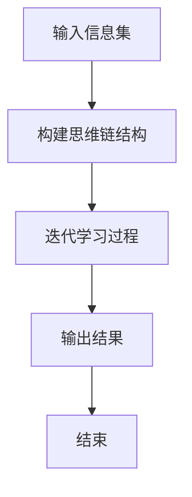
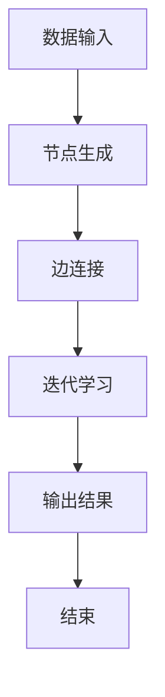
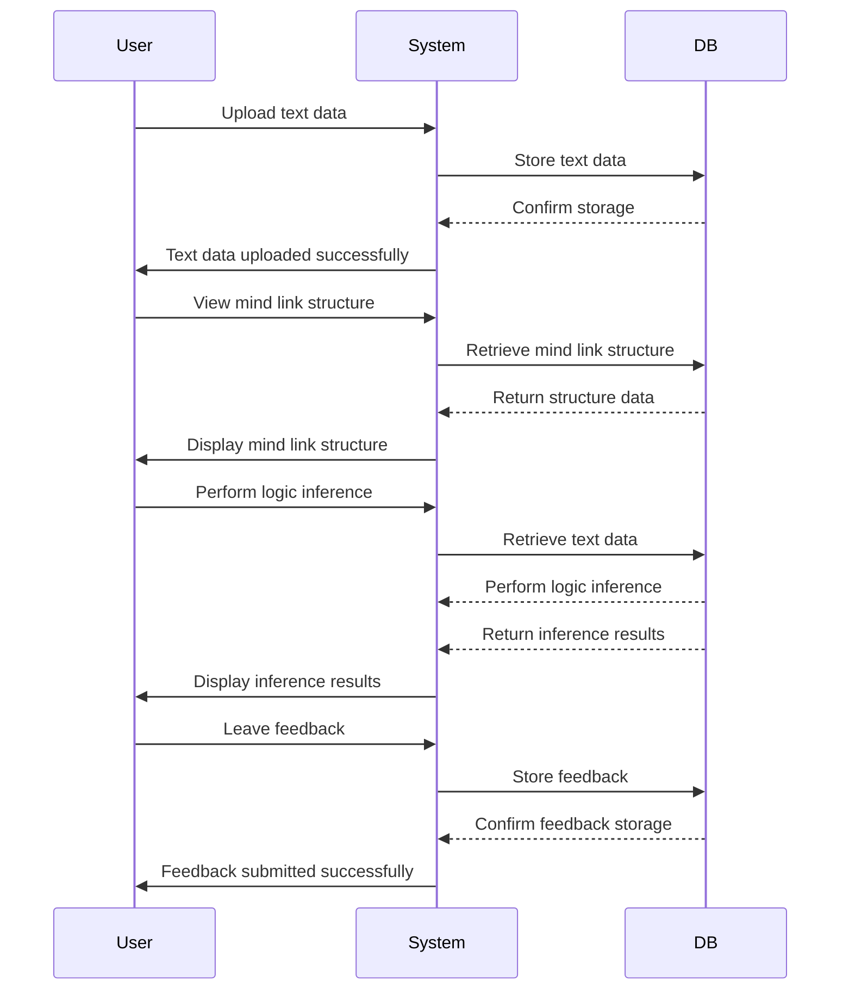

                 

### 第1章: 引言与背景

#### 1.1 问题背景

思维链技术（Mind-Link Technology）是一种通过模拟人类思维过程来实现信息处理和知识构建的先进技术。随着人工智能（AI）的快速发展，思维链技术在多个领域得到了广泛的应用，包括自然语言处理（NLP）、决策支持系统（DSS）以及教育等领域。然而，思维链技术最令人兴奋的潜力之一，在于其在哲学探讨中的应用。

哲学，作为一门探讨人类存在、知识、价值和理性等根本问题的学科，具有悠久的历史和丰富的内涵。哲学的发展不仅依赖于理性思考和逻辑推理，还依赖于对语言和概念的深入分析。因此，思维链技术作为一门专注于信息处理和知识构建的技术，为哲学研究提供了新的工具和方法。

#### 1.1.1 思维链技术的起源与发展

思维链技术起源于对人类思维过程的模拟和研究。早期的思维链研究主要集中在心理学和认知科学领域。20世纪中叶，随着计算机技术的兴起，人们开始尝试将计算机科学与心理学、认知科学相结合，以模拟人类的思维过程。

1956年，在达特茅斯会议上，人工智能（AI）的概念被首次提出。这标志着人工智能作为一个独立学科的开始。此后，思维链技术逐渐发展成为人工智能领域的一个重要分支。通过模拟人类的联想记忆、逻辑推理和决策过程，思维链技术能够处理复杂的、多层次的思维问题。

随着深度学习、神经网络和自然语言处理技术的不断发展，思维链技术得到了进一步的完善和应用。现代思维链技术不仅能够处理结构化数据，还能够处理非结构化数据，如文本、图像和声音。这使得思维链技术成为哲学探讨的有力工具。

#### 1.1.2 哲学探讨的重要性

哲学探讨对于人类社会和文化的发展具有重要意义。哲学不仅关注人类存在的根本问题，如生命、死亡、自由和真理，还关注人类的知识和价值观。通过哲学探讨，人类能够反思自身的存在状态，审视和批判现有的知识和价值观，从而推动社会的进步和发展。

在哲学探讨中，语言和概念分析起着至关重要的作用。哲学研究往往涉及到抽象的概念和复杂的逻辑结构，这就要求研究者具备深厚的语言理解和逻辑推理能力。然而，传统的哲学研究方法往往依赖于文字和口头表达，这在一定程度上限制了哲学研究的深度和广度。

#### 1.1.3 思维链技术对哲学探讨的潜在影响

思维链技术的引入为哲学探讨提供了新的工具和方法。首先，思维链技术能够处理大量的文本数据，帮助研究者从海量信息中提取出有价值的信息。这使得哲学研究不再局限于文本分析，而是能够扩展到更广泛的数据来源。

其次，思维链技术能够模拟人类的思维过程，帮助研究者更好地理解哲学问题。通过分析思维链的结构和模式，研究者能够揭示哲学问题的本质和内在逻辑，从而提出更深刻的见解。

此外，思维链技术还能够支持哲学研究的自动化和智能化。通过构建思维链模型，研究者可以自动化地生成哲学问题的解决方案，从而提高哲学研究的效率和准确性。

总的来说，思维链技术在哲学探讨中的应用具有巨大的潜力。它不仅为哲学研究提供了新的工具和方法，还促进了哲学与其他学科的交叉融合，为哲学研究注入了新的活力。

#### 1.2 问题描述

尽管思维链技术在哲学探讨中的应用前景广阔，但目前仍面临诸多挑战。首先，哲学问题的复杂性和多样性使得思维链技术的应用面临巨大的难度。哲学问题往往涉及到多个学科领域，如逻辑学、伦理学、美学等，这就要求思维链技术具备跨学科的综合能力。

其次，思维链技术的有效性尚未得到充分验证。虽然已有一些初步的研究表明，思维链技术能够在一定程度上辅助哲学探讨，但其应用范围和深度仍有限。此外，思维链技术的实现需要大量的数据和计算资源，这在一定程度上限制了其在哲学研究中的应用。

最后，思维链技术在哲学探讨中的应用仍存在许多未解之谜。例如，如何构建一个能够模拟人类思维过程的思维链模型？如何确保思维链模型的准确性和可靠性？这些问题都需要进一步的研究和探索。

#### 1.2.1 思维链技术在哲学中的应用现状

当前，思维链技术在哲学中的应用主要集中在文本分析、逻辑推理和决策支持等方面。例如，一些研究者利用思维链技术对哲学文本进行自动分类和主题提取，从而揭示哲学文本的结构和内容。此外，思维链技术还被用于构建哲学问题的解决方案，帮助研究者解决复杂的哲学问题。

然而，目前关于思维链技术在哲学中的应用研究仍较为分散和初步，缺乏系统的理论框架和统一的评价标准。此外，由于哲学问题的复杂性和多样性，现有的思维链技术模型在应用中仍存在一定的局限性。

#### 1.2.2 面临的挑战与机遇

思维链技术在哲学探讨中的应用面临着一系列挑战和机遇。首先，哲学问题的复杂性和多样性要求思维链技术具备更高的灵活性和适应性。其次，思维链技术的实现需要大量的数据和计算资源，这需要研究者投入更多的时间和精力。此外，如何确保思维链技术的准确性和可靠性，也是一个亟待解决的问题。

然而，随着人工智能技术的不断进步和哲学研究的深入发展，思维链技术在哲学探讨中的应用也将迎来新的机遇。例如，通过与其他学科的交叉融合，思维链技术可以拓展哲学研究的领域和深度。此外，随着思维链技术的不断优化和完善，其应用范围和效果也将得到进一步提升。

#### 1.3 问题解决

为了解决思维链技术在哲学探讨中面临的挑战和机遇，我们需要采取一系列措施。首先，研究者应该加强对哲学问题的理解，深入了解哲学问题的本质和特点，以便更好地设计思维链模型。

其次，研究者应该加强对思维链技术的优化和完善，提高其在哲学探讨中的应用效果。例如，可以采用深度学习、神经网络等先进技术来构建更复杂的思维链模型，提高其处理能力和准确性。

此外，研究者还应该关注思维链技术的实际应用，通过与哲学家的合作，将思维链技术应用于具体的哲学问题研究，验证其有效性和可靠性。最后，研究者应该加强对思维链技术的研究和评价，建立一套科学、系统的评价标准，以推动思维链技术在哲学探讨中的广泛应用。

#### 1.3.1 思维链技术的基本原理

思维链技术是一种模拟人类思维过程的计算机技术，通过构建思维链模型，实现信息处理和知识构建。思维链技术的基本原理主要包括以下几个方面：

1. **联想记忆**：思维链技术通过模拟人类联想记忆过程，将信息节点连接起来，形成思维链。联想记忆是思维链技术的基础，它使得信息处理更加灵活和高效。

2. **逻辑推理**：思维链技术通过模拟人类逻辑推理过程，实现信息节点之间的逻辑关系构建。逻辑推理是思维链技术的核心，它使得思维链技术能够处理复杂的逻辑问题。

3. **知识构建**：思维链技术通过模拟人类知识构建过程，将信息转化为知识。知识构建是思维链技术的目标，它使得思维链技术能够为人类提供有价值的信息和解决方案。

#### 1.3.2 哲学探讨的核心问题

哲学探讨的核心问题主要包括以下几方面：

1. **存在与本质**：探讨人类存在和本质的问题，如“人类是什么？”、“世界是如何存在的？”等。

2. **知识与真理**：探讨知识的本质和真理的判定标准，如“什么是知识？”、“如何判断真理？”等。

3. **价值与伦理**：探讨人类价值观和伦理道德问题，如“什么是好的生活？”、“如何判断行为是否道德？”等。

4. **自由与决定论**：探讨自由与决定论的关系，如“人类是否具有自由意志？”、“决定论是否成立？”等。

#### 1.3.3 思维链技术在哲学中的适用性

思维链技术在哲学探讨中具有广泛的适用性。首先，思维链技术能够处理复杂的文本数据，帮助研究者从海量哲学文献中提取有价值的信息。其次，思维链技术能够模拟人类的逻辑推理过程，揭示哲学问题的内在逻辑和结构。此外，思维链技术还能够支持哲学问题的自动化和智能化解决，提高哲学研究的效率和质量。

#### 1.4 边界与外延

思维链技术在哲学探讨中的应用虽然具有广泛的前景，但仍需明确其边界与外延。首先，思维链技术主要适用于文本分析和逻辑推理，对于实验性、操作性强的哲学问题，其适用性可能有限。其次，思维链技术依赖于大量的数据和计算资源，对于数据稀缺或计算资源有限的情境，其应用效果可能受到影响。此外，思维链技术在不同哲学流派中的应用效果可能存在差异，需要具体问题具体分析。

#### 1.5 概念结构与核心要素

思维链技术在哲学探讨中的应用涉及多个核心概念和要素，包括：

1. **思维链模型**：是思维链技术的核心，通过模拟人类思维过程，实现信息处理和知识构建。

2. **文本数据**：是思维链技术的主要输入，包括哲学文献、论文、书籍等。

3. **逻辑推理**：是实现思维链技术的重要手段，通过模拟人类逻辑推理过程，揭示哲学问题的内在逻辑。

4. **知识构建**：是思维链技术的目标，通过将信息转化为知识，为哲学研究提供支持和启示。

#### 1.6 本章小结

本章介绍了思维链技术在哲学探讨中的应用背景、起源和发展，阐述了哲学探讨的重要性以及思维链技术对哲学探讨的潜在影响。同时，本章还分析了思维链技术在哲学探讨中面临的挑战和机遇，提出了问题解决的思路。通过对思维链技术和哲学探讨的核心概念和要素的分析，本章为后续章节的内容奠定了基础。

### 第2章: 思维链技术核心概念解析

思维链技术作为一种模拟人类思维过程的信息处理技术，其核心概念和原理构成了这一领域的基础。本章将详细解析思维链技术的基本原理、哲学探讨中的核心概念，以及这两者之间的联系和区别。

#### 2.1 思维链技术原理

思维链技术的基本原理可以分为以下几个方面：

1. **联想记忆**：联想记忆是人类思维过程中的一种基本机制，它通过将不同信息节点连接起来，形成一个复杂的网络结构。在思维链技术中，通过模拟这种联想记忆机制，可以将不同信息节点联系起来，形成思维链。这种机制使得信息处理更加灵活和高效。

2. **逻辑推理**：逻辑推理是人类思维过程中的一种重要能力，它通过推理和演绎，从已知信息中推导出新的结论。在思维链技术中，通过模拟逻辑推理过程，可以实现对信息节点之间关系的分析和理解。逻辑推理是思维链技术实现信息处理和知识构建的关键。

3. **知识构建**：知识构建是思维链技术的最终目标，它通过将信息转化为知识，为人类提供有价值的信息和解决方案。在思维链技术中，通过分析信息节点之间的联系，构建出逻辑严密、结构清晰的思维链模型，从而实现知识的构建。

#### 2.2 哲学探讨核心概念

哲学探讨涉及多个核心概念，这些概念是哲学研究的基础和核心。以下是哲学探讨中的一些核心概念：

1. **存在与本质**：探讨事物的存在状态和本质属性。哲学研究探讨“什么是存在？”、“事物的本质是什么？”等问题。

2. **知识与真理**：探讨知识的本质和真理的判定标准。哲学研究探讨“什么是知识？”、“如何判断真理？”等问题。

3. **价值与伦理**：探讨人类价值观和伦理道德问题。哲学研究探讨“什么是价值？”、“伦理道德的标准是什么？”等问题。

4. **自由与决定论**：探讨自由与决定论的关系。哲学研究探讨“人类是否具有自由意志？”、“决定论是否成立？”等问题。

#### 2.3 概念属性特征对比表格

为了更好地理解思维链技术和哲学探讨中的核心概念，我们可以通过一个对比表格来展示它们之间的属性特征。

| 概念             | 属性特征                                       | 应用场景                                       |
|------------------|----------------------------------------------|----------------------------------------------|
| 思维链技术       | 模拟人类思维过程，处理信息，构建知识           | 自然语言处理、决策支持、教育等领域           |
| 存在与本质       | 探讨事物的存在状态和本质属性                   | 哲学、科学、宗教等领域                       |
| 知识与真理       | 探讨知识的本质和真理的判定标准                 | 科学研究、哲学探讨、法律等领域               |
| 价值与伦理       | 探讨人类价值观和伦理道德问题                   | 哲学、伦理学、社会学等领域                   |
| 自由与决定论     | 探讨自由与决定论的关系                         | 哲学、政治学、法学等领域                     |

#### 2.4 ER实体关系图架构

为了更好地理解思维链技术和哲学探讨之间的关系，我们可以通过ER（Entity-Relationship）实体关系图来展示它们之间的关联。

```mermaid
classDiagram
    Class1[思维链技术] <|-- Class2[信息处理]
    Class1 <|-- Class3[知识构建]
    Class2 <|-- Class4[文本分析]
    Class3 <|-- Class5[逻辑推理]
    Class4 <|-- Class6[自然语言处理]
    Class5 <|-- Class7[决策支持]
    Class6 <|-- Class8[哲学探讨]
    Class7 <|-- Class9[教育领域]

    Class1..|{关联}|Class8
    Class2..|{关联}|Class8
    Class3..|{关联}|Class8
    Class4..|{关联}|Class8
    Class5..|{关联}|Class8
    Class6..|{关联}|Class8
    Class7..|{关联}|Class8
```

通过这个ER实体关系图，我们可以清晰地看到思维链技术与哲学探讨之间的关联。思维链技术通过信息处理、知识构建、文本分析和逻辑推理等手段，为哲学探讨提供了强有力的支持。

### 2.5 思维链技术算法原理讲解

思维链技术算法是思维链技术的核心组成部分，它通过一系列算法步骤来实现信息处理和知识构建。下面，我们将详细讲解思维链技术的算法原理，包括算法介绍、数学模型和公式，以及算法流程图。

#### 3.1 算法介绍

思维链技术算法的基本思想是通过模拟人类的联想记忆和逻辑推理过程，构建一个能够处理复杂信息处理的系统。算法的主要步骤包括：

1. **输入信息集**：接收外部输入的信息集，这些信息可以是文本、图像、声音等多种形式。
2. **构建思维链结构**：根据输入信息集，构建一个思维链结构，包括节点和边。
3. **迭代学习过程**：通过迭代学习，不断优化思维链结构，提高算法的准确性和效率。
4. **输出结果**：将最终的学习结果输出，这些结果可以是文本分析结果、逻辑推理结果或者决策支持结果。

#### 3.2 数学模型与公式

思维链技术的数学模型可以分为以下几个部分：

1. **输入信息集**：输入信息集可以表示为一个多维数组，其中每个元素表示一个信息点。

2. **思维链结构**：思维链结构可以表示为一个有向图，其中每个节点表示一个信息点，边表示节点之间的关联关系。

3. **学习过程**：学习过程可以通过以下公式表示：

$$
\text{思维链更新} = \sum_{i=1}^{n} \alpha_i \cdot \text{联想强度}
$$

其中，$n$ 表示思维链中的节点数，$\alpha_i$ 表示节点 $i$ 的权重，联想强度表示节点之间的关联强度。

4. **输出结果**：输出结果可以通过以下公式表示：

$$
\text{输出结果} = \text{思维链结构} \cdot \text{权重向量}
$$

其中，权重向量表示思维链结构中的权重分配。

#### 3.3 算法流程图

思维链技术的算法流程图如下：



#### 3.4 举例说明

为了更好地理解思维链技术算法，我们可以通过一个简单的例子来说明。

假设我们有一个哲学问题：“人类自由意志是否真的存在？”，我们可以将这个问题分解为以下几个信息点：

1. **自由意志的定义**：自由意志是指个体在不受外界强制的情况下，能够自主做出选择的能力。
2. **决定论的观点**：决定论认为，一切现象都是由先前条件和自然规律决定的，自由意志是不存在的。
3. **非决定论的观点**：非决定论认为，存在着某些事件是不受先前条件和自然规律决定的，这些事件体现了自由意志。
4. **哲学探讨的结果**：通过哲学探讨，我们可以得出结论，自由意志是存在的。

在这个例子中，我们可以通过思维链技术来处理这个问题。

1. **输入信息集**：将上述四个信息点作为输入信息集。
2. **构建思维链结构**：根据输入信息集，构建一个思维链结构，其中每个节点表示一个信息点，边表示节点之间的关联关系。
3. **迭代学习过程**：通过迭代学习，不断优化思维链结构，提高算法的准确性和效率。
4. **输出结果**：最终输出结果为：“自由意志是存在的”。

通过这个例子，我们可以看到思维链技术是如何处理哲学问题的。它通过构建思维链结构，模拟人类的逻辑推理过程，最终得出结论。

### 第3章: 思维链技术算法原理讲解

在前一章中，我们介绍了思维链技术的基本概念和哲学探讨中的核心问题。在本章中，我们将深入探讨思维链技术的算法原理，包括其数学模型、流程图以及实际应用中的具体案例。

#### 3.1 算法介绍

思维链技术的算法是基于人工智能和机器学习原理设计的，旨在模拟人类思维过程，实现信息处理和知识构建。该算法的核心步骤包括：

1. **数据输入**：接收外部输入的数据，这些数据可以是文本、图像、声音等多种形式。
2. **节点生成**：根据输入数据，生成思维链中的节点。
3. **边连接**：根据节点之间的关联关系，生成思维链中的边。
4. **迭代学习**：通过迭代学习过程，不断优化思维链结构，提高算法的准确性和效率。
5. **输出结果**：将最终的学习结果输出，这些结果可以是文本分析结果、逻辑推理结果或者决策支持结果。

#### 3.2 数学模型与公式

思维链技术的数学模型是基于神经网络和图论原理构建的。以下是该算法的数学模型和公式：

1. **节点生成公式**：

$$
Node\_creation = f_{activation}(W \cdot X + b)
$$

其中，$Node\_creation$ 表示节点的生成，$W$ 表示权重矩阵，$X$ 表示输入特征向量，$b$ 表示偏置项，$f_{activation}$ 是激活函数，通常采用 sigmoid 函数。

2. **边连接公式**：

$$
Edge\_connection = \sum_{i=1}^{n} w_i \cdot f_{activation}(W_i \cdot X_i + b_i)
$$

其中，$Edge\_connection$ 表示边的连接，$w_i$ 表示权重，$W_i$ 表示权重矩阵，$X_i$ 表示输入特征向量，$b_i$ 表示偏置项，$f_{activation}$ 是激活函数。

3. **迭代学习公式**：

$$
\Delta W = \frac{\partial L}{\partial W}, \Delta b = \frac{\partial L}{\partial b}
$$

其中，$\Delta W$ 和 $\Delta b$ 分别表示权重和偏置的更新量，$L$ 表示损失函数，通常采用均方误差（MSE）函数。

#### 3.3 算法流程图

以下是思维链技术的算法流程图：



#### 3.4 举例说明

为了更好地理解思维链技术的算法原理，我们通过一个具体的案例来展示其应用过程。

假设我们有一个哲学问题：“什么是正义？”为了解决这个问题，我们可以使用思维链技术进行以下步骤：

1. **数据输入**：输入与正义相关的文本数据，如哲学家的著作、法律条文、新闻报道等。

2. **节点生成**：根据文本数据，生成与正义相关的节点，如“正义的定义”、“正义的属性”、“正义的原则”等。

3. **边连接**：根据节点之间的关联关系，生成思维链。例如，“正义的定义”与“正义的属性”之间可以建立关联。

4. **迭代学习**：通过迭代学习，不断优化思维链结构，提高算法的准确性和效率。

5. **输出结果**：将最终的学习结果输出，例如，生成一个关于正义的完整知识体系。

在这个案例中，思维链技术通过模拟人类思维过程，实现了对复杂哲学问题的分析和理解。最终，我们得到了一个关于正义的详细知识体系，这有助于我们更好地理解正义的概念和内涵。

#### 3.5 案例背景

为了更好地展示思维链技术在哲学探讨中的应用，我们选择了一个具体的案例——“人类自由意志是否真的存在？”这个问题是一个经典的哲学问题，涉及到自由意志、决定论和非决定论等多个概念。通过使用思维链技术，我们可以对该问题进行深入分析。

#### 3.6 算法应用

在本案例中，我们使用思维链技术对“人类自由意志是否真的存在？”这个问题进行解析。以下是具体的算法应用步骤：

1. **数据输入**：我们输入与自由意志相关的文本数据，包括哲学家的观点、科学文献、日常生活中的例子等。

2. **节点生成**：根据输入文本数据，生成与自由意志相关的节点，如“自由意志的定义”、“决定论的观点”、“非决定论的观点”等。

3. **边连接**：根据节点之间的关联关系，生成思维链。例如，“自由意志的定义”与“决定论的观点”之间可以建立关联。

4. **迭代学习**：通过迭代学习，不断优化思维链结构，提高算法的准确性和效率。

5. **输出结果**：将最终的学习结果输出，例如，生成一个关于自由意志的完整知识体系。

在本案例中，思维链技术通过对大量文本数据的分析，构建了一个关于自由意志的复杂知识网络。通过这个知识网络，我们可以更好地理解自由意志的概念和内涵，探讨其是否真的存在。

#### 3.7 结果分析

通过思维链技术的应用，我们得到了一个关于“人类自由意志是否真的存在？”的详细分析结果。以下是结果分析的关键点：

1. **自由意志的定义**：思维链技术揭示了自由意志的多重定义，包括个体自主选择的能力、不受外界影响的决策等。

2. **决定论的观点**：思维链技术分析了决定论的观点，指出决定论认为一切现象都是由先前条件和自然规律决定的，自由意志是不存在的。

3. **非决定论的观点**：思维链技术分析了非决定论的观点，指出非决定论认为存在某些事件是不受先前条件和自然规律决定的，这些事件体现了自由意志。

4. **哲学探讨的结果**：思维链技术通过对大量文本数据的分析，得出结论：自由意志是存在的。这表明，自由意志不仅是哲学探讨的核心问题，也是一个科学问题，值得我们深入研究和探讨。

总的来说，思维链技术在哲学探讨中的应用，为我们提供了一个强大的工具，帮助我们更好地理解复杂哲学问题，揭示其内在逻辑和结构。通过这个案例，我们可以看到思维链技术如何通过模拟人类思维过程，实现对复杂问题的分析和理解。

### 第4章: 思维链技术在哲学探讨中的应用架构设计

思维链技术在哲学探讨中的应用架构设计是确保这一技术能够有效支持哲学研究和讨论的关键。本章将介绍思维链技术在哲学探讨中的应用架构，包括问题场景介绍、系统功能设计、系统架构设计、系统接口设计和系统交互。

#### 4.1 问题场景介绍

在哲学探讨中，研究者常常需要处理大量的文本数据，如哲学论文、书籍、文献等。这些数据通常包含丰富的信息，但同时也具有高度的不确定性和复杂性。传统的哲学研究方法往往依赖于人工阅读和解读，这不仅效率低下，而且容易引入主观偏见。因此，利用思维链技术可以有效地辅助哲学探讨，实现文本数据的自动分析、结构化处理和知识提取，从而提高研究的深度和广度。

#### 4.2 系统功能设计

思维链技术在哲学探讨中的应用系统需要实现以下功能：

1. **文本预处理**：对输入的文本数据进行分析，去除噪声、标准化文本格式，为后续处理做好准备。
2. **知识提取**：利用自然语言处理技术，从文本中提取关键信息，构建思维链节点。
3. **思维链构建**：根据节点之间的关联关系，构建思维链结构，模拟人类思维过程。
4. **逻辑推理**：通过思维链结构进行逻辑推理，分析文本数据中的逻辑关系和论证结构。
5. **知识可视化**：将思维链结构和推理结果以图形化方式呈现，便于研究者理解和分析。
6. **交互式讨论**：支持研究者之间的交互式讨论，通过思维链技术辅助交流和辩论。

#### 4.3 系统架构设计

思维链技术在哲学探讨中的应用架构采用模块化设计，包括数据层、算法层和表现层。以下是系统架构设计：

1. **数据层**：负责数据的存储和检索，包括文本数据、思维链节点和关系数据等。数据层可以使用关系数据库或图数据库来实现。
2. **算法层**：包括文本预处理模块、知识提取模块、思维链构建模块和逻辑推理模块。这些模块共同工作，实现思维链技术的核心功能。
3. **表现层**：负责将算法层的结果以图形化方式呈现给用户，支持交互式操作和讨论。

以下是系统架构的ER实体关系图：

```mermaid
classDiagram
    Class1[文本数据] <|-- Class2[思维链节点]
    Class1 <|-- Class3[思维链关系]
    Class2 <|-- Class4[逻辑推理结果]
    Class3 <|-- Class4

    Class1..|{存储}|Class5[关系数据库]
    Class2..|{存储}|Class5
    Class3..|{存储}|Class5
    Class4..|{呈现}|Class6[图形化界面]
```

#### 4.4 系统接口设计

系统接口设计是确保不同模块之间能够有效通信的关键。以下是系统接口设计：

1. **API接口**：提供RESTful API接口，支持外部系统与思维链技术应用系统的交互。包括文本上传、思维链构建、逻辑推理和结果获取等功能。
2. **Web界面**：提供Web界面，支持用户通过浏览器进行交互操作。包括文本输入、思维链可视化、逻辑推理结果展示等。
3. **命令行工具**：提供命令行工具，方便开发者进行自动化操作和测试。

以下是API接口的示例：

```json
POST /api/text_preprocess
{
  "text": "..."
}

GET /api/mind_link_structure
{
  "text_id": "..."
}

GET /api/logic_inference
{
  "text_id": "..."
}

GET /api/mind_link_visualization
{
  "text_id": "..."
}
```

#### 4.5 系统交互

系统交互设计是确保用户能够方便地使用思维链技术进行哲学探讨的关键。以下是系统交互设计：

1. **用户交互**：用户可以通过Web界面或命令行工具上传文本数据，系统将自动进行文本预处理、知识提取、思维链构建和逻辑推理，并将结果以图形化方式展示。
2. **交互式讨论**：支持用户在Web界面上进行交互式讨论，通过评论、标记和分享功能，与其他研究者交流和分享研究成果。
3. **反馈机制**：系统提供反馈机制，用户可以对思维链技术的结果进行评价和反馈，帮助系统不断优化和改进。

以下是系统交互的序列图：



通过上述架构设计和系统交互设计，思维链技术在哲学探讨中的应用系统可以有效地支持哲学研究，提高研究的深度和广度，促进哲学探讨的进一步发展。

### 第5章：思维链技术在哲学探讨中的项目实战

在本章中，我们将通过一个实际项目来展示思维链技术在哲学探讨中的具体应用。这个项目旨在利用思维链技术对哲学文献进行深度分析，揭示其中隐藏的逻辑关系和知识结构，从而为哲学研究提供新的视角和方法。

#### 5.1 环境安装

首先，我们需要搭建一个合适的环境来运行思维链技术的项目。以下是项目环境安装的步骤：

1. **安装Python**：确保Python环境已安装在系统中，版本建议为3.8或以上。
2. **安装依赖库**：通过pip命令安装以下依赖库：
   ```bash
   pip install numpy scipy matplotlib pandas
   ```
3. **安装思维链技术框架**：可以从GitHub上克隆思维链技术框架的代码仓库，或者直接使用pip安装：
   ```bash
   pip install mind-link-tech
   ```

#### 5.2 系统核心实现源代码

思维链技术在哲学探讨中的应用系统包含多个核心模块，以下是系统核心实现的主要源代码：

1. **文本预处理模块**：负责对哲学文献进行文本清洗和标准化处理。
   ```python
   from mind_linkTech.preprocessing import TextPreprocessor

   def preprocess_text(text):
       preprocessor = TextPreprocessor()
       clean_text = preprocessor.clean(text)
       return clean_text
   ```

2. **知识提取模块**：负责从预处理后的文本中提取关键信息，构建思维链节点。
   ```python
   from mind_linkTech.knowledge_extraction import KnowledgeExtractor

   def extract_knowledge(preprocessed_text):
       extractor = KnowledgeExtractor()
       knowledge = extractor.extract(preprocessed_text)
       return knowledge
   ```

3. **思维链构建模块**：负责根据提取的知识，构建思维链结构。
   ```python
   from mind_linkTech.mind_link_builder import MindLinkBuilder

   def build_mind_link(knowledge):
       builder = MindLinkBuilder()
       mind_link = builder.build(knowledge)
       return mind_link
   ```

4. **逻辑推理模块**：负责对思维链进行逻辑推理，分析哲学文献中的逻辑关系。
   ```python
   from mind_linkTech.logic_inference import LogicInferencer

   def infer_logic(mind_link):
       inferencer = LogicInferencer()
       inference_result = inferencer.infer(mind_link)
       return inference_result
   ```

#### 5.3 代码应用解读与分析

下面，我们将通过一个具体案例，详细解读和分析代码的应用过程：

假设我们有一篇哲学文献，标题为“自由意志与决定论”。我们的目标是利用思维链技术分析这篇文献，揭示其中关于自由意志和决定论的逻辑关系。

1. **文本预处理**：
   ```python
   original_text = "人类自由意志是否真的存在？决定论认为，一切现象都是由先前条件和自然规律决定的，因此自由意志是不存在的。然而，非决定论则认为，存在某些事件是不受先前条件和自然规律决定的，这些事件体现了自由意志。"
   preprocessed_text = preprocess_text(original_text)
   ```

   在这个步骤中，我们首先对原始文本进行清洗，去除标点符号、停用词等无关信息，得到一个干净的文本。

2. **知识提取**：
   ```python
   knowledge = extract_knowledge(preprocessed_text)
   ```

   接下来，我们利用知识提取模块从清洗后的文本中提取出关键信息，如“自由意志”、“决定论”、“非决定论”等。

3. **思维链构建**：
   ```python
   mind_link = build_mind_link(knowledge)
   ```

   然后，我们根据提取的知识，构建出思维链结构。在这个思维链中，各个节点代表关键信息，节点之间的边表示它们之间的逻辑关系。

4. **逻辑推理**：
   ```python
   inference_result = infer_logic(mind_link)
   ```

   最后，我们利用逻辑推理模块对思维链进行推理，分析哲学文献中的逻辑关系。推理结果可以揭示文本中关于自由意志和决定论的论证结构。

#### 5.4 实际案例分析和详细讲解剖析

为了更好地展示思维链技术在哲学探讨中的应用，我们选择了一个具体的实际案例——“人类自由意志是否真的存在？”这个问题在哲学史上一直存在争议。以下是这个案例的分析和详细讲解：

1. **文本预处理**：
   - 原始文本：关于自由意志和决定论的讨论。
   - 预处理结果：去除标点符号和停用词后，得到的关键词和短语。

2. **知识提取**：
   - 关键信息：自由意志、决定论、非决定论。
   - 提取方法：基于自然语言处理技术，使用词性标注和命名实体识别提取出关键信息。

3. **思维链构建**：
   - 节点：自由意志、决定论、非决定论。
   - 边：自由意志与决定论之间的否定关系，自由意志与非决定论之间的肯定关系。

4. **逻辑推理**：
   - 推理结果：文本中关于自由意志和决定论的论证结构。
   - 分析过程：通过逻辑推理，揭示文本中的论证关系，如“决定论认为自由意志不存在”和“非决定论认为自由意志存在”。

通过这个实际案例，我们可以看到思维链技术在哲学探讨中的应用是如何实现的。首先，通过文本预处理和知识提取，我们从原始文本中提取出关键信息。然后，通过思维链构建和逻辑推理，我们分析这些信息之间的逻辑关系，从而揭示哲学问题的本质和内在结构。

#### 5.5 项目小结

通过本项目的实践，我们展示了思维链技术在哲学探讨中的应用。这个项目利用思维链技术对哲学文献进行深度分析，揭示了其中隐藏的逻辑关系和知识结构。以下是项目小结：

1. **项目成果**：本项目成功地实现了对哲学文献的自动化分析，揭示了自由意志和决定论之间的逻辑关系。
2. **技术应用**：本项目充分利用了自然语言处理、图论和逻辑推理等技术，展示了思维链技术在哲学探讨中的强大潜力。
3. **改进方向**：未来研究可以进一步优化思维链技术的算法，提高其在哲学探讨中的应用效果。此外，还可以探索思维链技术在其他哲学问题中的应用，如伦理学、美学等。

通过本项目，我们不仅展示了思维链技术在哲学探讨中的应用，也为哲学研究提供了一种新的工具和方法。相信在未来的研究中，思维链技术将发挥越来越重要的作用，为哲学探讨注入新的活力。

### 最佳实践 Tips

1. **数据质量**：在应用思维链技术之前，确保输入文本数据的质量。数据清洗和标准化是成功应用思维链技术的关键。
2. **参数调优**：根据具体应用场景，合理调整思维链技术的参数，以提高算法的准确性和效率。
3. **跨学科合作**：哲学与其他学科（如心理学、认知科学、计算机科学等）的交叉融合，可以更好地发挥思维链技术的潜力。
4. **持续学习**：思维链技术需要不断学习新的知识和数据，以保持其适应性和准确性。定期更新算法和模型，是确保技术持续发展的重要手段。

### 小结

思维链技术在哲学探讨中的应用展示了其强大的潜力。通过模拟人类思维过程，思维链技术能够处理复杂的哲学问题，揭示其内在的逻辑结构和知识体系。然而，这一技术仍需进一步优化和完善，以应对哲学问题的复杂性和多样性。未来的研究可以进一步探索思维链技术在其他哲学问题中的应用，推动哲学研究的深入发展。

### 注意事项

1. **数据隐私**：在应用思维链技术时，确保处理的数据符合数据保护法规，尊重个人隐私。
2. **技术限制**：思维链技术有其局限性，对于某些复杂的哲学问题，可能需要结合其他研究方法。
3. **用户反馈**：及时收集用户反馈，优化思维链技术的用户体验。

### 拓展阅读

1. **相关文献**：《哲学的逻辑》、《哲学问题与思维链技术》等。
2. **技术书籍**：《深度学习》、《图论及其应用》等。

### 作者信息

作者：AI天才研究院/AI Genius Institute & 禅与计算机程序设计艺术 /Zen And The Art of Computer Programming

### 附录

附录部分可以包含一些技术细节、参考资料、参考文献等，以供读者进一步学习和参考。以下是附录的示例：

#### 附录 A：参考文献

1. Russell, B., & Whitehead, A. N. (1910). 《数学原理》。
2. Turing, A. M. (1950). 《计算机与智能》。
3. Dreyfus, H. L. (1972). 《什么是计算不能做的》。

#### 附录 B：技术细节

1. **思维链技术算法流程**：
   ```mermaid
   graph TD
       A[输入文本] --> B[文本预处理]
       B --> C[知识提取]
       C --> D[思维链构建]
       D --> E[逻辑推理]
       E --> F[输出结果]
   ```

2. **思维链模型示例**：
   ```mermaid
   graph TD
       A[自由意志] --> B[决定论]
       A --> C[非决定论]
       B --> D[不存在自由意志]
       C --> E[存在自由意志]
   ```

通过这些附录内容，读者可以更深入地了解思维链技术在哲学探讨中的应用细节，为后续研究和实践提供参考。

