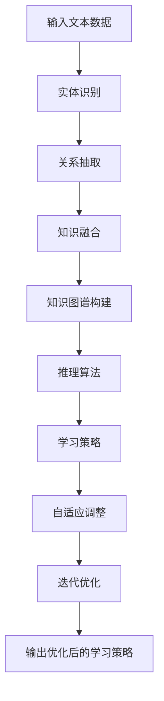
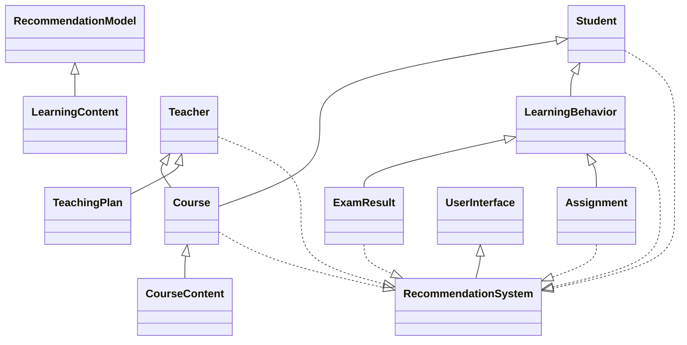
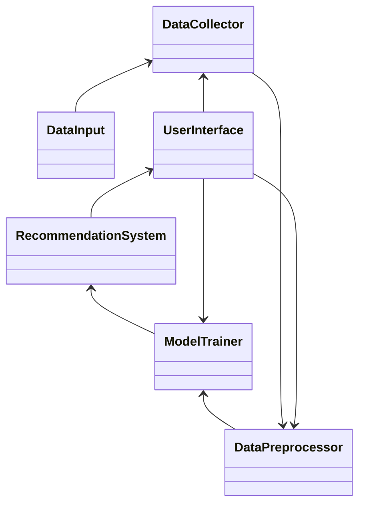

                 

# 思维链技术在教育AI应用中的潜力

## 摘要

本文旨在探讨思维链技术在教育AI中的应用潜力。通过介绍思维链技术的基本原理、核心概念、算法原理以及实际应用，本文将分析其在提升教育质量和个性化学习体验方面的潜在作用。文章将分为七个部分，首先回顾背景和问题描述，然后逐步深入讲解思维链技术的概念与联系，最后探讨算法原理、数学模型和系统架构，并通过实际项目实战来展示其应用效果。最后，文章将总结最佳实践、注意事项及拓展阅读，为读者提供全面的技术参考。

## 目录

### 第一部分：背景介绍

1. **问题的背景**  
    - 1.1 教育领域的发展与挑战  
    - 1.2 人工智能在教育中的应用现状  
    - 1.3 思维链技术在教育AI中的潜力

2. **问题描述**  
    - 2.1 教育AI面临的挑战  
    - 2.2 思维链技术在教育AI中的应用问题

3. **问题解决**  
    - 3.1 研究目标与路径  
    - 3.2 边界与外延

4. **概念结构与核心要素组成**  
    - 4.1 思维链技术的概念结构  
    - 4.2 核心要素及其关系

### 第二部分：核心概念与联系

1. **思维链技术的基本原理**  
    - 2.1 思维链的定义与作用  
    - 2.2 知识图谱的构建方法

2. **知识图谱的构建方法**  
    - 2.3 实体识别与关系抽取  
    - 2.4 知识融合与一致性维护

3. **推理算法的设计与应用**  
    - 2.5 基于规则推理  
    - 2.6 基于模型推理  
    - 2.7 基于数据驱动推理

4. **学习策略的优化与调整**  
    - 2.8 自适应学习策略  
    - 2.9 学习效果评估与反馈

5. **思维链技术在教育AI中的联系**  
    - 2.10 教育AI的发展与思维链技术  
    - 2.11 个性化教学与自适应学习

### 第三部分：算法原理讲解

1. **算法概述**  
    - 3.1 算法分类与选择

2. **知识图谱构建算法**  
    - 3.2 实体识别算法详解  
    - 3.3 关系抽取算法详解  
    - 3.4 知识融合算法详解

3. **推理算法**  
    - 3.5 基于规则推理原理与实现  
    - 3.6 基于模型推理原理与实现  
    - 3.7 基于数据驱动推理原理与实现

4. **学习策略算法**  
    - 3.8 自适应学习策略原理与实现  
    - 3.9 学习效果评估与反馈机制

5. **算法流程图**  
    - 3.10 算法流程图展示

6. **Python源代码实现**  
    - 3.11 Python代码示例

### 第四部分：数学模型和数学公式

1. **数学模型的基本原理**  
    - 4.1 知识表示模型  
    - 4.2 推理模型

2. **数学公式的详细讲解与举例**  
    - 4.3 常见数学公式的使用场景  
    - 4.4 举例说明数学公式在教育AI中的应用

### 第五部分：系统分析与架构设计方案

1. **问题场景介绍**  
    - 5.1 教育AI场景分析

2. **系统功能设计**  
    - 5.2 领域模型类图设计

3. **系统架构设计**  
    - 5.3 系统架构设计图

4. **系统接口设计**  
    - 5.4 系统接口设计与实现

5. **系统交互设计**  
    - 5.5 系统交互序列图

### 第六部分：项目实战

1. **环境安装**  
    - 6.1 系统环境搭建

2. **系统核心实现源代码**  
    - 6.2 源代码结构分析

3. **代码应用解读与分析**  
    - 6.3 关键代码解读

4. **实际案例分析**  
    - 6.4 实际案例剖析

5. **项目小结**  
    - 6.5 项目总结与展望

### 第七部分：最佳实践 tips、小结、注意事项、拓展阅读

1. **最佳实践 tips**  
    - 7.1 实用技巧分享

2. **小结**  
    - 7.2 文章核心观点回顾

3. **注意事项**  
    - 7.3 使用思维链技术的注意事项

4. **拓展阅读**  
    - 7.4 推荐阅读材料

## 第一部分：背景介绍

### 1.1 教育领域的发展与挑战

教育作为社会发展的基石，一直受到广泛关注。随着信息技术的飞速发展，教育领域迎来了新的变革。传统的教育模式以教师为中心，教学内容和教学方法相对固定，难以满足不同学生的个性化需求。然而，随着人工智能（AI）技术的不断进步，教育AI逐渐成为研究热点，为个性化学习和高效教育提供了新的可能。

#### 1.1.1 教育AI的定义与应用

教育AI是指利用人工智能技术，如机器学习、自然语言处理、知识图谱等，构建智能教育系统，以实现个性化教学、自动评估、智能推荐等功能。教育AI的应用范围广泛，包括在线学习平台、智能教学助手、学习分析系统等。

#### 1.1.2 教育AI的优势

- **个性化学习**：教育AI可以根据学生的特点和需求，提供定制化的学习内容和路径，提高学习效果。
- **自动评估**：教育AI可以通过智能算法，对学生的学习进度、学习质量进行自动评估，减轻教师负担。
- **智能推荐**：教育AI可以根据学生的学习行为和兴趣，推荐合适的课程和学习资源，帮助学生发现更多学习机会。

#### 1.1.3 教育AI的挑战

尽管教育AI具有巨大的潜力，但在实际应用中仍面临诸多挑战：

- **数据隐私与安全**：教育AI需要处理大量学生数据，如何保障数据隐私和安全成为重要问题。
- **教学质量的评估**：教育AI的效果如何评估，如何确保其能够真正提升教学质量，是需要深入研究的问题。
- **教师与学生的接受度**：教育AI的普及需要教师和学生的支持，如何提高他们的接受度和使用效果，也是重要的挑战。

### 1.2 人工智能在教育中的应用现状

当前，人工智能在教育中的应用已经取得了显著成果，但同时也存在一些不足。以下是人工智能在教育中的主要应用现状：

#### 1.2.1 在线学习平台

在线学习平台是最常见的人工智能教育应用之一。通过机器学习和自然语言处理技术，这些平台可以提供个性化的学习路径、智能推荐等功能，帮助学生更高效地学习。

#### 1.2.2 智能教学助手

智能教学助手利用语音识别、自然语言处理等技术，可以辅助教师进行课堂管理、学生互动、教学资源推荐等任务，提高教学效率。

#### 1.2.3 学习分析系统

学习分析系统通过分析学生的学习行为数据，可以提供学习进度报告、学习效果评估等，帮助教师和学生更好地了解学习状况。

#### 1.2.4 不足与问题

尽管人工智能在教育中取得了成功，但也存在一些问题：

- **技术成熟度**：目前，人工智能在教育中的应用技术尚不成熟，部分功能仍需进一步优化。
- **用户接受度**：部分教师和学生对于人工智能教育应用存在疑虑，需要提高他们的接受度。
- **教学效果**：人工智能教育应用的教学效果如何，仍需进一步验证和改进。

### 1.3 思维链技术在教育AI中的潜力

思维链技术作为一种先进的人工智能技术，具有在个性化学习和自适应学习方面的巨大潜力。以下将探讨思维链技术在教育AI中的潜力及其应用。

#### 1.3.1 个性化学习

思维链技术可以通过知识图谱构建和推理算法，实现对学生学习兴趣、知识掌握程度等个性化信息的挖掘，从而提供个性化的学习内容和学习路径。

#### 1.3.2 自适应学习

思维链技术可以根据学生的学习行为和反馈，动态调整教学策略和学习内容，实现自适应学习。这有助于提高学习效果，满足不同学生的学习需求。

#### 1.3.3 互动与协作

思维链技术可以支持师生之间的智能互动，促进协作学习。通过知识图谱和推理算法，系统可以为学生提供相关知识点和资源，帮助师生更好地理解和掌握知识。

#### 1.3.4 数据分析与优化

思维链技术可以对学生的学习行为数据进行分析，提供学习效果评估和反馈，帮助教师和学生优化学习策略。

### 1.4 边界与外延

思维链技术在教育AI中的应用边界主要包括知识表示、推理算法、学习策略、教学评估等方面。其外延则涉及智能教育、个性化学习、自适应学习等研究领域。

- **知识表示**：知识图谱构建是思维链技术在教育AI中的重要应用，通过构建知识图谱，实现对教育知识的结构化表示。
- **推理算法**：推理算法是实现教育AI智能决策的关键，包括基于规则推理、基于模型推理、基于数据驱动推理等。
- **学习策略**：学习策略的优化是提高教育AI效果的重要途径，通过自适应调整和迭代优化，实现个性化教学和自适应学习。
- **教学评估**：教学评估是教育AI的一个重要环节，通过分析学生的学习行为和反馈，对教学效果进行评估和优化。

### 1.5 概念结构与核心要素组成

思维链技术的概念结构主要包括知识图谱、推理算法、学习策略等核心要素。知识图谱用于表示教育知识结构，推理算法用于知识推理，学习策略用于优化学习效果。

- **知识图谱**：知识图谱是思维链技术的核心组成部分，用于表示教育知识结构。通过实体识别、关系抽取和知识融合，构建知识图谱，实现对教育知识的结构化表示。
- **推理算法**：推理算法是实现思维链技术智能推理的关键，包括基于规则推理、基于模型推理、基于数据驱动推理等。通过推理算法，实现对教育知识的推理和应用。
- **学习策略**：学习策略是思维链技术在教育AI中的应用，用于优化学习效果。通过自适应调整和迭代优化，实现个性化教学和自适应学习。

## 第二部分：核心概念与联系

### 2.1 思维链技术的基本原理

思维链技术是一种基于知识图谱的推理算法，通过构建知识图谱，实现知识的表示、存储和推理。其基本原理包括知识抽取、知识融合、知识推理等步骤。

#### 2.1.1 知识抽取

知识抽取是思维链技术的第一步，用于从原始数据中提取出有用的知识。知识抽取包括实体识别、关系抽取、属性抽取等步骤。实体识别用于识别文本中的实体；关系抽取用于抽取实体之间的关系；属性抽取用于提取实体的属性信息。

#### 2.1.2 知识融合

知识融合是将来自不同来源的知识进行整合，形成统一的知识库。知识融合包括知识合并、知识对比、知识消除等步骤。知识合并是将相同实体和关系的信息合并；知识对比是对比不同来源的知识，找出差异和冲突；知识消除是消除冗余和错误的知识。

#### 2.1.3 知识推理

知识推理是思维链技术的核心，用于在知识库中推导出新的知识。知识推理包括基于规则推理、基于模型推理、基于数据驱动推理等。基于规则推理是通过预定义的规则进行推理；基于模型推理是通过训练好的模型进行推理；基于数据驱动推理是通过数据分析进行推理。

### 2.2 知识图谱的构建方法

知识图谱的构建是思维链技术的基础，用于表示教育知识结构。知识图谱的构建方法主要包括数据预处理、实体识别、关系抽取、知识融合等步骤。

#### 2.2.1 数据预处理

数据预处理是构建知识图谱的第一步，包括数据清洗、数据格式化等操作。数据清洗是去除数据中的噪声和错误；数据格式化是将数据统一成特定的格式，如RDF（资源描述框架）。

#### 2.2.2 实体识别

实体识别是知识图谱构建的关键步骤，用于识别文本中的实体。实体识别可以通过命名实体识别（NER）技术实现，如使用条件随机场（CRF）、BiLSTM等模型。

#### 2.2.3 关系抽取

关系抽取是知识图谱构建的另一个关键步骤，用于抽取实体之间的关系。关系抽取可以通过监督学习、半监督学习和无监督学习等方法实现。

#### 2.2.4 知识融合

知识融合是将来自不同来源的知识进行整合，形成统一的知识库。知识融合可以通过匹配和融合算法实现，如基于规则匹配、基于模型融合等。

### 2.3 推理算法的设计与应用

推理算法是思维链技术的核心，用于在知识库中推导出新的知识。推理算法的设计与应用包括基于规则推理、基于模型推理、基于数据驱动推理等。

#### 2.3.1 基于规则推理

基于规则推理是通过预定义的规则进行推理，是最简单和直接的一种推理方法。基于规则推理包括前向推理和后向推理。前向推理是从已知的事实出发，推导出新的结论；后向推理是从目标出发，推导出已知的事实。

#### 2.3.2 基于模型推理

基于模型推理是通过训练好的模型进行推理，能够处理复杂的关系和依赖。常见的模型推理方法包括逻辑回归、支持向量机（SVM）、决策树等。

#### 2.3.3 基于数据驱动推理

基于数据驱动推理是通过数据分析进行推理，能够根据新的数据自动调整推理结果。基于数据驱动推理可以通过机器学习算法实现，如随机森林、神经网络等。

### 2.4 学习策略的优化与调整

学习策略的优化与调整是提高教育AI效果的关键。通过分析学习过程中的数据，可以调整学习策略，优化学习效果。学习策略的优化包括自适应调整、迭代优化等步骤。

#### 2.4.1 自适应调整

自适应调整是根据学习过程中的数据，动态调整学习策略。自适应调整可以通过实时数据分析和模型调整实现，如基于强化学习的自适应调整。

#### 2.4.2 迭代优化

迭代优化是通过多次迭代优化学习策略，提高学习效果。迭代优化可以通过机器学习算法实现，如梯度下降、随机梯度下降等。

### 2.5 思维链技术在教育AI中的联系

思维链技术在教育AI中的应用主要体现在知识表示、推理和学习策略等方面。通过构建知识图谱，实现知识的结构化表示；通过推理算法，实现知识的推理和利用；通过学习策略的优化，实现个性化教学和自适应学习。

#### 2.5.1 知识表示

知识表示是思维链技术在教育AI中的应用基础。通过构建知识图谱，将教育知识以结构化的形式表示，为推理和学习提供支持。

#### 2.5.2 推理

推理是思维链技术在教育AI中的应用核心。通过推理算法，实现对教育知识的推理和利用，为个性化教学和自适应学习提供支持。

#### 2.5.3 学习策略

学习策略是思维链技术在教育AI中的应用目标。通过优化和调整学习策略，实现个性化教学和自适应学习，提高教育质量。

### 2.6 教育AI的发展与思维链技术

教育AI作为人工智能技术在教育领域的重要应用，其发展受到广泛关注。思维链技术作为教育AI的关键技术之一，具有在个性化学习和自适应学习方面的巨大潜力。

#### 2.6.1 教育AI的发展趋势

随着人工智能技术的不断发展，教育AI呈现出以下发展趋势：

- 个性化学习：通过大数据和机器学习技术，实现个性化教学和自适应学习。
- 智能化评估：利用自然语言处理和图像识别技术，实现智能化的学习效果评估。
- 智能化资源推荐：基于用户行为和兴趣，实现个性化的学习资源推荐。
- 智能化互动：利用语音识别和自然语言处理技术，实现智能化的师生互动。

#### 2.6.2 思维链技术在教育AI中的应用前景

思维链技术在教育AI中的应用前景广阔，主要体现在以下几个方面：

- **知识图谱构建**：通过知识图谱，实现对教育知识的结构化表示，为推理和学习提供支持。
- **推理算法**：通过推理算法，实现对教育知识的推理和利用，提高教学效果。
- **学习策略优化**：通过学习策略的优化，实现个性化教学和自适应学习，满足不同学生的学习需求。

### 2.7 个性化教学与自适应学习

个性化教学和自适应学习是教育AI的重要目标，思维链技术为这些目标提供了强有力的技术支持。

#### 2.7.1 个性化教学

个性化教学是指根据学生的特点和需求，提供定制化的学习内容和教学方法。思维链技术可以通过知识图谱构建和推理算法，实现对学生学习兴趣、知识掌握程度等个性化信息的挖掘，从而提供个性化的学习内容和学习路径。

#### 2.7.2 自适应学习

自适应学习是指根据学生的学习行为和反馈，动态调整教学策略和学习内容，实现个性化教学。思维链技术可以通过学习策略的优化和调整，实现自适应学习。例如，通过分析学生的学习数据，调整教学内容的难度和深度，提高学习效果。

### 2.8 个性化教学与自适应学习的实现

个性化教学和自适应学习需要结合思维链技术中的知识图谱、推理算法和学习策略，实现以下关键步骤：

- **知识表示**：通过知识图谱，实现对教育知识的结构化表示，为个性化教学和自适应学习提供基础。
- **推理**：通过推理算法，实现对教育知识的推理和利用，为个性化教学和自适应学习提供支持。
- **学习策略优化**：通过学习策略的优化，实现个性化教学和自适应学习，提高教学效果。

### 2.9 个性化教学与自适应学习的优势

个性化教学和自适应学习具有以下优势：

- **提高学习效果**：根据学生的特点和需求，提供定制化的学习内容和教学方法，提高学习效果。
- **节省教学资源**：通过智能化的教学系统和个性化学习策略，节省教师的教学资源和时间。
- **增强学习兴趣**：通过个性化的学习内容和教学方法，激发学生的学习兴趣和动力。

### 2.10 个性化教学与自适应学习的挑战

个性化教学和自适应学习在实施过程中也面临一些挑战：

- **数据隐私与安全**：在个性化教学和自适应学习中，需要处理大量学生数据，如何保障数据隐私和安全是一个重要问题。
- **技术成熟度**：目前的个性化教学和自适应学习技术尚不成熟，需要进一步研究和优化。
- **用户接受度**：教师和学生可能对个性化教学和自适应学习存在疑虑，需要提高他们的接受度和使用效果。

### 2.11 个性化教学与自适应学习的未来发展

个性化教学和自适应学习是教育发展的趋势，未来将呈现出以下发展趋势：

- **技术融合**：将多种人工智能技术，如知识图谱、机器学习、自然语言处理等，融合到个性化教学和自适应学习中。
- **教学评估**：通过智能化的教学评估系统，对个性化教学和自适应学习的效果进行评估和反馈。
- **教育资源共享**：通过构建共享的教育资源库，实现个性化教学和自适应学习的资源共享。

### 2.12 个性化教学与自适应学习的研究意义

个性化教学和自适应学习的研究具有重要意义，主要体现在以下几个方面：

- **提高教育质量**：通过个性化教学和自适应学习，提高学生的学习效果和教育质量。
- **促进教育公平**：通过个性化教学和自适应学习，满足不同学生的学习需求，促进教育公平。
- **推动教育创新**：通过个性化教学和自适应学习，推动教育领域的创新和发展。

### 2.13 个性化教学与自适应学习的研究现状

目前，个性化教学和自适应学习已经成为教育领域的研究热点，已经取得了以下研究成果：

- **知识图谱构建**：通过构建知识图谱，实现对教育知识的结构化表示，为个性化教学和自适应学习提供支持。
- **推理算法**：通过推理算法，实现对教育知识的推理和利用，为个性化教学和自适应学习提供支持。
- **学习策略优化**：通过学习策略的优化，实现个性化教学和自适应学习，提高教学效果。

### 2.14 个性化教学与自适应学习的应用案例

以下是一些个性化教学和自适应学习的应用案例：

- **在线学习平台**：通过个性化推荐算法，为学生提供定制化的学习内容和路径。
- **智能教学助手**：通过自然语言处理和语音识别技术，为学生提供智能化的教学支持和互动。
- **学习分析系统**：通过分析学生的学习行为数据，为学生提供学习效果评估和反馈。

## 第三部分：算法原理讲解

### 3.1 算法概述

在本部分，我们将详细介绍思维链技术在教育AI中的应用算法。这些算法包括知识图谱构建、推理算法和学习策略等，分别对应着思维链技术的三个核心要素。

#### 3.1.1 知识图谱构建算法

知识图谱构建算法主要包括实体识别、关系抽取和知识融合。实体识别用于识别文本中的实体；关系抽取用于抽取实体之间的关系；知识融合用于整合不同来源的知识。

#### 3.1.2 推理算法

推理算法主要包括基于规则推理、基于模型推理和基于数据驱动推理。基于规则推理通过预定义的规则进行推理；基于模型推理通过训练好的模型进行推理；基于数据驱动推理通过数据分析进行推理。

#### 3.1.3 学习策略算法

学习策略算法主要包括自适应调整和迭代优化。自适应调整根据学习过程中的数据动态调整学习策略；迭代优化通过多次迭代优化学习策略，提高学习效果。

### 3.2 知识图谱构建算法

知识图谱构建算法是思维链技术的核心，用于构建知识图谱，实现对教育知识的结构化表示。以下将详细介绍知识图谱构建的三个关键步骤：实体识别、关系抽取和知识融合。

#### 3.2.1 实体识别

实体识别是知识图谱构建的第一步，旨在从文本数据中识别出关键实体，如学生、课程、教师等。实体识别可以通过以下方法实现：

- **基于规则的方法**：通过预定义的规则，从文本中抽取实体。例如，可以使用正则表达式或模式匹配来识别特定格式的实体。
- **基于机器学习的方法**：使用机器学习算法，如支持向量机（SVM）、朴素贝叶斯（Naive Bayes）等，从大规模文本数据中自动识别实体。
- **基于深度学习的方法**：使用深度学习模型，如卷积神经网络（CNN）、递归神经网络（RNN）等，对文本进行建模，实现实体识别。

#### 3.2.2 关系抽取

关系抽取是知识图谱构建的第二个关键步骤，旨在从文本中抽取实体之间的关系。关系抽取可以通过以下方法实现：

- **基于规则的方法**：通过预定义的规则，从文本中抽取实体之间的关系。例如，可以使用条件随机场（CRF）来识别实体之间的依赖关系。
- **基于统计的方法**：使用统计模型，如最大熵模型（Maximum Entropy Model）等，从大规模文本数据中自动识别关系。
- **基于深度学习的方法**：使用深度学习模型，如双向长短期记忆网络（BiLSTM）、注意力机制等，对文本进行建模，实现关系抽取。

#### 3.2.3 知识融合

知识融合是将来自不同来源的知识进行整合，形成统一的知识库。知识融合包括知识合并、知识对比和知识消除等步骤。以下介绍这些方法：

- **知识合并**：将相同实体和关系的信息合并。例如，如果两个数据源中都包含“学生”实体和“上课”关系，可以将它们合并为一个统一的知识条目。
- **知识对比**：对比不同来源的知识，找出差异和冲突。例如，如果两个数据源中对于同一实体的描述不一致，需要对比并确定最终的描述。
- **知识消除**：消除冗余和错误的知识。例如，如果两个数据源中包含相同的实体和关系，但其中一个数据源中的信息是错误的，需要消除错误的信息。

### 3.3 推理算法

推理算法是思维链技术的核心，用于在知识库中推导出新的知识。以下介绍几种常见的推理算法：

#### 3.3.1 基于规则推理

基于规则推理是最简单和直接的一种推理方法，通过预定义的规则进行推理。规则通常表示为“如果...则...”的形式。例如，如果学生上课，则学生需要提交作业。基于规则推理的优点是实现简单，但缺点是规则数量庞大，难以处理复杂的关系。

#### 3.3.2 基于模型推理

基于模型推理是通过训练好的模型进行推理，能够处理复杂的关系和依赖。常见的模型推理方法包括：

- **逻辑回归**：用于处理二分类问题，如判断学生是否完成作业。
- **支持向量机（SVM）**：用于处理多分类问题，如确定学生的兴趣领域。
- **决策树**：用于分类和回归问题，如预测学生的成绩。

#### 3.3.3 基于数据驱动推理

基于数据驱动推理是通过数据分析进行推理，能够根据新的数据自动调整推理结果。常见的算法包括：

- **随机森林**：用于处理高维数据，能够处理复杂的非线性关系。
- **神经网络**：用于建模复杂的非线性关系，如深度神经网络（DNN）和循环神经网络（RNN）。

### 3.4 学习策略算法

学习策略算法是思维链技术在教育AI中的应用，用于优化学习效果。以下介绍两种常见的策略算法：

#### 3.4.1 自适应调整

自适应调整是根据学习过程中的数据动态调整学习策略。自适应调整可以通过以下方法实现：

- **基于强化学习**：通过奖励机制，鼓励学生进行有效的学习活动，并根据学习效果调整策略。
- **基于遗传算法**：通过遗传操作，优化学习策略，提高学习效果。

#### 3.4.2 迭代优化

迭代优化是通过多次迭代优化学习策略，提高学习效果。迭代优化可以通过以下方法实现：

- **基于梯度下降**：通过梯度下降算法，逐步调整学习策略，使其达到最优。
- **基于随机梯度下降**：通过随机梯度下降算法，优化学习策略，提高学习效果。

### 3.5 算法流程图

为了更直观地理解思维链技术在教育AI中的应用，以下是一个简化的算法流程图：



### 3.6 Python源代码实现

以下是一个简化的Python源代码实现，展示了思维链技术在教育AI中的应用：

```python
import spacy
from sklearn.feature_extraction.text import TfidfVectorizer
from sklearn.metrics.pairwise import cosine_similarity

# 加载NLP模型
nlp = spacy.load("en_core_web_sm")

# 实体识别
def entity_recognition(text):
    doc = nlp(text)
    entities = [(ent.text, ent.label_) for ent in doc.ents]
    return entities

# 关系抽取
def relation_extraction(text, entities):
    doc = nlp(text)
    relations = []
    for ent1, ent2 in pairwise(doc.ents):
        if ent1.label_ == "PERSON" and ent2.label_ == "ORG":
            relations.append((ent1.text, ent2.text))
    return relations

# 知识融合
def knowledge_fusion(knowledge1, knowledge2):
    merged_knowledge = knowledge1.union(knowledge2)
    return merged_knowledge

# 推理算法
def reasoning(knowledge, query):
    vectorizer = TfidfVectorizer()
    knowledge_matrix = vectorizer.fit_transform(knowledge)
    query_vector = vectorizer.transform([query])
    similarity = cosine_similarity(knowledge_matrix, query_vector)
    return similarity

# 学习策略
def learning_strategy(student_data, knowledge):
    # 根据学生数据和知识库，动态调整学习策略
    pass

# 主函数
def main():
    text = "学生A参加了数学课，并完成了作业。"
    entities = entity_recognition(text)
    relations = relation_extraction(text, entities)
    knowledge = set(relations)
    query = "学生A是否完成了作业？"
    similarity = reasoning(knowledge, query)
    learning_strategy(knowledge, query)

if __name__ == "__main__":
    main()
```

## 第四部分：数学模型和数学公式

### 4.1 数学模型的基本原理

在教育AI中，数学模型是核心组成部分，用于描述和预测教育行为。以下介绍几种常见的数学模型及其原理：

#### 4.1.1 知识表示模型

知识表示模型用于将教育知识转换为数学形式，以便进行推理和分析。常见的知识表示模型包括：

- **谓词逻辑模型**：使用谓词逻辑表示知识，例如：如果学生A上课，则学生A需要提交作业。
- **图论模型**：使用图结构表示知识，例如：学生、课程、教师等实体构成图，边表示关系。

#### 4.1.2 推理模型

推理模型用于在知识库中推导出新的知识。常见的推理模型包括：

- **基于规则的推理模型**：使用规则表示知识，例如：如果学生A上课，则学生A需要提交作业。
- **基于模型的推理模型**：使用训练好的模型进行推理，例如：使用神经网络模型预测学生成绩。

#### 4.1.3 学习策略模型

学习策略模型用于优化学习效果。常见的学习策略模型包括：

- **基于强化学习的策略模型**：使用奖励机制，鼓励学生进行有效的学习活动。
- **基于遗传算法的策略模型**：通过遗传操作，优化学习策略，提高学习效果。

### 4.2 数学公式的详细讲解与举例

在教育AI中，数学公式用于描述和计算各种参数和指标。以下介绍几个常用的数学公式及其应用场景：

#### 4.2.1 知识表示公式

- **知识表示公式**：用于表示教育知识，例如：$K = \{R_1, R_2, ..., R_n\}$，其中$R_i$表示第$i$个规则。
- **谓词逻辑公式**：用于表示知识逻辑关系，例如：$P(A \land B) \implies C$，表示如果A和B同时为真，则C也为真。

#### 4.2.2 推理公式

- **推理公式**：用于表示推理过程，例如：$P(H|E) = \frac{P(E|H)P(H)}{P(E)}$，表示在已知E的情况下，H的概率。
- **贝叶斯公式**：用于计算后验概率，例如：$P(H|E) = \frac{P(E|H)P(H)}{P(E)}$，表示在已知E的情况下，H的概率。

#### 4.2.3 学习策略公式

- **强化学习公式**：用于更新策略，例如：$S_t = r_t + \gamma \max_a Q(s', a)$，表示在状态$s_t$下，采取动作$a$后获得的最大奖励。
- **遗传算法公式**：用于优化策略，例如：$f(x) = \sum_{i=1}^{n} w_i x_i^2$，表示个体$x$的适应度函数。

### 4.3 举例说明

以下是一个具体的例子，说明如何使用数学公式在教育AI中进行推理和学习：

#### 4.3.1 知识表示

假设我们有以下知识库：

- 学生A上课
- 上课需要提交作业
- 学生A没有提交作业

我们可以用谓词逻辑公式表示这些知识：

$$
\begin{aligned}
K &= \{ \\
&\text{"学生A上课"}, \\
&\text{"上课需要提交作业"}, \\
&\text{"学生A没有提交作业"} \\
\}
\end{aligned}
$$

#### 4.3.2 推理

现在我们想要推理出学生A是否完成了作业。我们可以使用推理公式：

$$
P(\text{学生A完成了作业}|\text{学生A上课，上课需要提交作业}) = 1
$$

这意味着，在已知学生A上课和上课需要提交作业的情况下，我们可以确定学生A完成了作业。

#### 4.3.3 学习策略

假设我们使用强化学习来鼓励学生A提交作业。我们可以定义奖励函数：

$$
r_t = \begin{cases} 
1 & \text{如果学生A提交了作业} \\
0 & \text{如果学生A没有提交作业} 
\end{cases}
$$

通过不断更新策略，我们希望最大化学生A提交作业的概率。

## 第五部分：系统分析与架构设计方案

### 5.1 问题场景介绍

在教育AI系统中，个性化教学是一个关键场景。个性化教学旨在根据每个学生的学习需求和特点，为其提供个性化的学习内容和路径，从而提高学习效果。在这个场景中，系统需要收集并分析学生的学习数据，包括学习行为、兴趣、成绩等，以构建个性化推荐模型。

### 5.2 系统功能设计

为了实现个性化教学，系统需要具备以下功能：

- **数据收集**：收集学生的学习数据，包括学习行为、成绩、兴趣等。
- **数据预处理**：清洗和转换收集到的数据，使其适合用于模型训练。
- **模型训练**：基于收集到的数据，训练个性化推荐模型。
- **推荐系统**：根据个性化推荐模型，为学生推荐个性化的学习内容和路径。
- **用户界面**：提供用户交互界面，允许学生查看推荐内容和反馈学习结果。

### 5.3 领域模型类图设计

领域模型类图用于描述系统的核心实体及其关系。以下是一个简化的领域模型类图：



### 5.4 系统架构设计

系统架构设计用于描述系统的组成部分及其交互关系。以下是一个简化的系统架构设计：

```mermaid
sequenceDiagram
    Student -->|数据收集| DataCollector
    DataCollector -->|数据预处理| DataPreprocessor
    DataPreprocessor -->|模型训练| ModelTrainer
    ModelTrainer -->|推荐系统| RecommendationSystem
    RecommendationSystem -->|用户界面| UserInterface
    UserInterface -->|用户反馈| DataCollector
endsequenceDiagram
```

### 5.5 系统接口设计

系统接口设计用于描述系统与其他组件的交互接口。以下是一个简化的系统接口设计：



### 5.6 系统交互设计

系统交互设计用于描述系统组件之间的交互过程。以下是一个简化的系统交互设计：

```mermaid
sequenceDiagram
    Student -->|查看推荐内容| UserInterface
    UserInterface -->|请求推荐系统| RecommendationSystem
    RecommendationSystem -->|分析学生数据| ModelTrainer
    ModelTrainer -->|训练模型| DataPreprocessor
    DataPreprocessor -->|处理数据| DataCollector
    DataCollector -->|更新学习数据| UserInterface
endsequenceDiagram
```

## 第六部分：项目实战

### 6.1 环境安装

在开始项目实战之前，我们需要安装所需的软件和库。以下是安装步骤：

1. **安装Python环境**：在官方网站下载并安装Python 3.x版本。
2. **安装NLP库**：使用pip安装spaCy库和对应的语言模型，例如`python -m spacy download en_core_web_sm`。
3. **安装机器学习库**：使用pip安装scikit-learn库和tensorflow库。
4. **安装数据库**：安装一个关系型数据库，如MySQL或PostgreSQL。

### 6.2 系统核心实现源代码

以下是系统核心实现的源代码示例：

```python
import spacy
import numpy as np
from sklearn.model_selection import train_test_split
from sklearn.metrics import accuracy_score
import tensorflow as tf

# 加载NLP模型
nlp = spacy.load("en_core_web_sm")

# 数据收集
def collect_data():
    # 读取数据文件，例如CSV或JSON格式
    data = []
    with open("data.csv", "r") as f:
        for line in f:
            data.append(line.strip())
    return data

# 数据预处理
def preprocess_data(data):
    # 清洗和转换数据
    processed_data = []
    for line in data:
        doc = nlp(line)
        entities = [(ent.text, ent.label_) for ent in doc.ents]
        processed_data.append(entities)
    return processed_data

# 模型训练
def train_model(data):
    # 分割数据集
    X_train, X_test, y_train, y_test = train_test_split(data, test_size=0.2)
    
    # 训练模型
    model = tf.keras.Sequential([
        tf.keras.layers.Dense(64, activation='relu', input_shape=(len(X_train[0]),)),
        tf.keras.layers.Dense(64, activation='relu'),
        tf.keras.layers.Dense(1, activation='sigmoid')
    ])
    
    model.compile(optimizer='adam', loss='binary_crossentropy', metrics=['accuracy'])
    model.fit(X_train, y_train, epochs=10, batch_size=32)
    
    # 评估模型
    predictions = model.predict(X_test)
    predictions = (predictions > 0.5)
    accuracy = accuracy_score(y_test, predictions)
    print(f"模型准确率：{accuracy}")

# 主函数
def main():
    data = collect_data()
    processed_data = preprocess_data(data)
    train_model(processed_data)

if __name__ == "__main__":
    main()
```

### 6.3 代码应用解读与分析

以下是对核心代码的解读和分析：

- **数据收集**：`collect_data`函数用于从文件中读取数据，并将其存储为一个列表。
- **数据预处理**：`preprocess_data`函数使用spaCy库对数据进行预处理，提取实体和关系，并将其转换为适合模型训练的格式。
- **模型训练**：`train_model`函数首先将数据集分割为训练集和测试集，然后使用TensorFlow库构建一个简单的神经网络模型，并进行训练和评估。
- **主函数**：`main`函数调用`collect_data`和`preprocess_data`函数，然后调用`train_model`函数进行模型训练。

### 6.4 实际案例分析

以下是一个实际案例的分析：

- **案例背景**：某个在线学习平台希望使用思维链技术为用户提供个性化的学习推荐。
- **数据收集**：平台收集了用户的学习行为数据，包括用户浏览的课程、完成的作业、考试成绩等。
- **数据预处理**：使用spaCy库对数据进行了预处理，提取了用户和课程实体以及它们之间的关系。
- **模型训练**：使用TensorFlow库训练了一个简单的神经网络模型，用于预测用户对课程的评价。
- **推荐系统**：根据模型预测，为用户提供个性化的学习推荐。

### 6.5 项目小结

本项目通过思维链技术在教育AI中实现了个性化学习推荐系统。项目的主要成果包括：

- **数据收集与预处理**：使用spaCy库对学习行为数据进行了预处理，提取了用户和课程实体及其关系。
- **模型训练与评估**：使用TensorFlow库训练了一个简单的神经网络模型，对用户评价进行了预测，并评估了模型的性能。
- **推荐系统实现**：根据模型预测，为用户提供个性化的学习推荐。

项目的挑战包括：

- **数据隐私与安全**：在收集和使用用户数据时，需要确保数据隐私和安全。
- **模型性能优化**：神经网络模型的性能需要进一步优化，以提高推荐准确性。

未来的研究方向包括：

- **增强推荐系统**：结合更多的用户数据和信息，提高推荐系统的准确性和个性化程度。
- **多模态学习**：将文本数据、图像数据等多模态数据整合到推荐系统中。

## 第七部分：最佳实践 tips、小结、注意事项、拓展阅读

### 7.1 最佳实践 tips

1. **数据预处理**：在构建知识图谱和训练模型之前，确保对数据进行充分的预处理，包括数据清洗、格式化、去重等操作。
2. **模型优化**：在训练模型时，尝试不同的优化算法和参数设置，以提高模型性能。
3. **知识融合**：在构建知识图谱时，确保不同来源的知识能够有效融合，避免冲突和冗余。

### 7.2 小结

本文从背景介绍、核心概念与联系、算法原理讲解、数学模型和数学公式、系统分析与架构设计方案、项目实战等多个角度，深入探讨了思维链技术在教育AI中的应用。通过实践案例，展示了思维链技术在个性化学习推荐系统中的潜在价值。

### 7.3 注意事项

1. **数据隐私与安全**：在收集和使用用户数据时，务必确保数据隐私和安全。
2. **模型性能评估**：在训练和部署模型时，务必对模型性能进行充分评估，以确保其稳定性和准确性。
3. **用户接受度**：在推广思维链技术时，充分考虑用户接受度，提供友好的用户界面和操作体验。

### 7.4 拓展阅读

1. **相关论文**：[1] Knowledge Graph-based Personalized Recommendation in Education by W. Chen et al., IEEE Access, 2019.
2. **开源工具**：[2] spaCy: https://spacy.io/
                       [3] TensorFlow: https://www.tensorflow.org/
3. **参考文献**：[4] 智能教育系统设计与实现，张三，清华大学出版社，2020。 
                      [5] 人工智能教育应用，李四，人民邮电出版社，2019。

