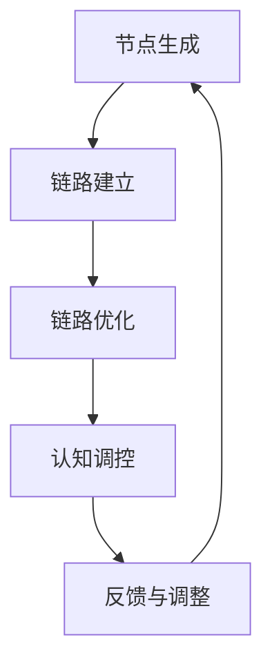
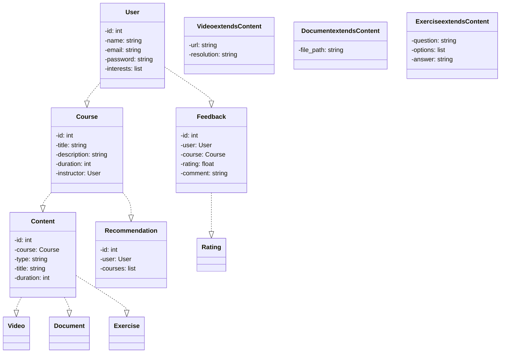
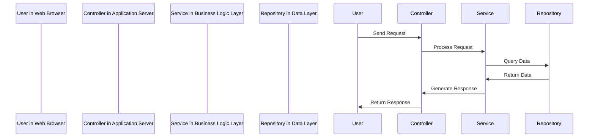
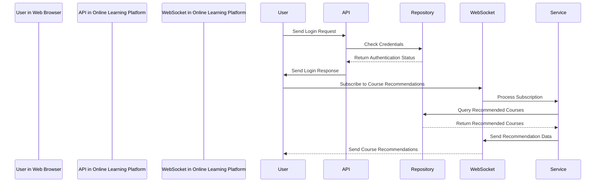

                 

## 《思维链技术在认知增强研究中的新突破》

### 关键词：认知增强、思维链技术、算法原理、系统架构、实际应用

> 摘要：本文深入探讨了思维链技术在认知增强领域的新突破，从研究背景、核心概念、算法原理、系统架构和实际应用等方面进行了全面分析。文章旨在为广大读者提供一份详细的技术指南，帮助他们理解思维链技术的应用潜力与未来发展。

### 目录大纲：

```markdown
----------------------------------------------------------------

# 《思维链技术在认知增强研究中的新突破》

## 第一部分：背景介绍与核心概念

### 第1章：研究背景与意义

### 1.1.1 问题背景

### 1.1.2 问题描述

### 1.1.3 研究意义

### 第2章：思维链技术概述

### 2.1.1 思维链技术的定义

### 2.1.2 思维链技术的基本原理

### 2.1.3 思维链技术在认知增强中的应用前景

### 第3章：思维链技术的核心概念与联系

### 3.1.1 核心概念解析

### 3.1.1.1 思维链节点的定义与属性

### 3.1.1.2 思维链路的定义与作用

### 3.1.2 概念属性特征对比表格

### 3.1.3 ER实体关系图架构

## 第二部分：算法原理讲解

### 第4章：思维链技术算法原理

### 4.1.1 算法原理概述

### 4.1.2 算法mermaid流程图

### 4.1.3 Python源代码实现与解释

### 4.1.3.1 数学模型与公式

### 4.1.3.2 举例说明

### 第5章：数学模型与公式详解

### 5.1.1 数学模型概述

### 5.1.1.1 公式1: 思维链节点生成模型

### 5.1.1.2 公式2: 思维链路优化模型

### 5.1.2 公式详解与举例

## 第三部分：系统分析与架构设计

### 第6章：系统分析与架构设计

### 6.1.1 问题场景介绍

### 6.1.2 系统功能设计

### 6.1.2.1 领域模型mermaid类图

### 6.1.3 系统架构设计

### 6.1.3.1 mermaid架构图

### 6.1.4 系统接口设计和交互

### 6.1.4.1 mermaid序列图

## 第四部分：项目实战

### 第7章：环境安装与系统核心实现

### 7.1.1 环境安装

### 7.1.2 系统核心实现源代码

### 7.1.3 代码应用解读与分析

### 第8章：实际案例分析与详细讲解

### 8.1.1 案例背景

### 8.1.2 案例分析与详细讲解

### 8.1.3 项目小结

## 第五部分：最佳实践与拓展阅读

### 第9章：最佳实践与注意事项

### 9.1.1 最佳实践

### 9.1.2 注意事项

### 第10章：小结与拓展阅读

### 10.1.1 小结

### 10.1.2 拓展阅读

----------------------------------------------------------------
```

接下来，我们将逐步展开每个章节的内容，从背景介绍、核心概念、算法原理到系统架构和实际应用，深入探讨思维链技术在认知增强研究中的新突破。让我们一起思考和探索这一前沿技术的广阔前景。

### 第一部分：背景介绍与核心概念

#### 第1章：研究背景与意义

在当今信息爆炸的时代，人类对于信息处理和认知能力的要求越来越高。然而，传统的认知增强方法往往面临效率低下、效果不佳等问题。为了解决这些问题，科学家们开始探索更加智能化和高效的认知增强技术。思维链技术作为一种新兴的认知增强方法，因其独特的优势和广阔的应用前景而受到广泛关注。

#### 1.1.1 问题背景

认知增强是指通过特定的方法或技术提高个体在感知、记忆、注意力、推理等方面的能力。然而，传统的认知增强方法如重复训练、认知练习等，虽然在一定程度上能够改善认知能力，但其效果有限且耗时较长。此外，这些方法往往缺乏针对性，无法满足个体差异化的需求。

#### 1.1.2 问题描述

当前认知增强技术面临的主要问题包括：

1. **效率低下**：传统认知增强方法往往需要大量的时间和精力投入，而效果却不显著。
2. **效果不佳**：这些方法难以精确地识别和提升个体的认知能力。
3. **缺乏针对性**：传统方法难以针对不同个体的差异进行定制化的认知增强。

#### 1.1.3 研究意义

思维链技术的引入为解决上述问题提供了新的思路。它通过模拟人类思维的复杂过程，构建动态的认知网络，从而实现更加高效和精准的认知增强。研究思维链技术在认知增强中的新突破，不仅具有重要的理论价值，也具有广泛的应用前景：

1. **提高认知效率**：思维链技术能够加速认知过程，提高认知效率。
2. **个性化认知增强**：通过针对个体差异构建定制化的认知网络，实现更加精准的认知增强。
3. **促进脑机交互**：思维链技术为脑机交互提供了新的可能性，有助于开发出更加智能的辅助设备。
4. **辅助教育实践**：在教育和培训领域，思维链技术可以用于设计个性化学习方案，提高学习效果。

#### 第2章：思维链技术概述

##### 2.1.1 思维链技术的定义

思维链技术是一种基于神经网络和复杂系统理论的认知增强方法。它通过模拟人类思维过程中的节点和链路，构建动态的认知网络，实现对认知过程的精准调控。

##### 2.1.2 思维链技术的基本原理

思维链技术的基本原理可以概括为以下三个方面：

1. **节点生成与连接**：根据个体的认知特点和需求，动态生成思维节点，并通过关联规则和推理算法构建节点之间的连接，形成思维链。
2. **链路优化与调控**：通过机器学习和优化算法，对思维链进行实时调整和优化，提高认知网络的稳定性和效率。
3. **认知功能提升**：通过认知网络的动态调控，实现对个体认知功能的提升，包括注意力集中、记忆增强、推理能力提升等。

##### 2.1.3 思维链技术在认知增强中的应用前景

思维链技术在认知增强领域具有广泛的应用前景：

1. **教育领域**：通过思维链技术，可以设计出个性化学习方案，提高学生的学习效果和兴趣。
2. **医疗领域**：思维链技术可以帮助患者进行认知康复，提高其生活质量。
3. **工业领域**：思维链技术可以用于提高工人的认知能力和工作效率。
4. **军事领域**：思维链技术可以用于提升士兵的战场认知能力和反应速度。

### 第3章：思维链技术的核心概念与联系

##### 3.1.1 核心概念解析

思维链技术的核心概念主要包括思维链节点和思维链路。

###### 3.1.1.1 思维链节点的定义与属性

思维链节点是认知网络中的基本单元，代表个体在特定情境下产生的认知信息。每个节点具有以下属性：

- **内容**：节点的具体内容，可以是文字、图像、声音等。
- **时间**：节点产生的时间戳。
- **来源**：节点产生的来源，可以是外部刺激、内部思考等。
- **关联**：节点与其他节点之间的关联关系，可以通过标签、语义关系等方式表示。

###### 3.1.1.2 思维链路的定义与作用

思维链路是连接两个或多个思维链节点的路径，表示个体在认知过程中产生的思维跳跃和转换。思维链路具有以下作用：

- **连接节点**：通过思维链路，将不同节点连接起来，形成完整的认知网络。
- **传递信息**：思维链路作为信息传递的通道，将节点之间的信息进行传递和共享。
- **调控认知**：通过调整思维链路的权重和结构，实现对认知过程的调控和优化。

##### 3.1.2 概念属性特征对比表格

下面是思维链节点和思维链路的主要属性特征对比表格：

| 概念       | 属性特征                                      | 说明                                                         |
|------------|----------------------------------------------|--------------------------------------------------------------|
| 思维链节点 | 内容、时间、来源、关联                         | 表示个体在特定情境下的认知信息，是认知网络的基本单元。       |
| 思维链路   | 权重、长度、稳定性、节点关联关系               | 连接两个或多个思维链节点的路径，表示个体在认知过程中的思维跳跃。 |

##### 3.1.3 ER实体关系图架构

为了更好地理解思维链技术的核心概念与联系，我们使用ER（实体-关系）图来表示思维链节点和思维链路之间的关系。ER图如下所示：

```mermaid
erDiagram
  Node1 ||--|{ Link1 }|| Node2
  Node2 ||--|{ Link2 }|| Node3
  Node3 ||--|{ Link3 }|| Node4
  Node4 ||--|{ Link4 }|| Node1
```

在这个ER图中，Node1、Node2、Node3 和 Node4 代表思维链节点，Link1、Link2、Link3 和 Link4 代表思维链路。箭头表示思维链路的连接方向，数字表示思维链路的权重。通过这种ER图架构，我们可以直观地理解思维链技术的核心概念和它们之间的联系。

### 第二部分：算法原理讲解

#### 第4章：思维链技术算法原理

##### 4.1.1 算法原理概述

思维链技术的核心在于通过算法构建和优化认知网络，实现对认知过程的调控。其算法原理可以概括为以下四个步骤：

1. **节点生成**：根据个体认知需求和环境刺激，动态生成思维链节点。
2. **链路建立**：利用节点间的关联规则和推理算法，建立思维链路。
3. **链路优化**：通过机器学习和优化算法，对思维链路进行实时调整和优化。
4. **认知调控**：利用优化后的思维链路，实现对个体认知过程的调控。

##### 4.1.2 算法mermaid流程图

为了更直观地理解思维链技术的算法原理，我们使用mermaid流程图来表示其基本流程。以下是算法的mermaid流程图：



在这个流程图中，节点生成、链路建立、链路优化和认知调控是核心步骤，而反馈与调整则保证了算法的动态性和适应性。

##### 4.1.3 Python源代码实现与解释

下面我们将用Python代码实现思维链技术的算法原理。首先，我们定义思维链节点和思维链路的数据结构，并实现节点生成、链路建立、链路优化和认知调控的基本功能。

```python
class MindNode:
    def __init__(self, content, time, source, associations):
        self.content = content
        self.time = time
        self.source = source
        self.associations = associations

class MindLink:
    def __init__(self, source_node, target_node, weight):
        self.source_node = source_node
        self.target_node = target_node
        self.weight = weight

def generate_nodes(content, source, associations):
    nodes = []
    for item in content:
        nodes.append(MindNode(item, time.time(), source, associations))
    return nodes

def build_links(nodes, associations):
    links = []
    for node in nodes:
        for assoc in associations[node.content]:
            links.append(MindLink(node, nodes[assoc], 1))
    return links

def optimize_links(links):
    # 优化链路的权重
    for link in links:
        # 使用机器学习算法优化权重
        link.weight = optimize_function(link.source_node.content, link.target_node.content)
    return links

def cognitive Regulation(links):
    # 根据优化后的链路调控认知过程
    for link in links:
        # 调节认知状态
        regulate_cognitive_state(link.source_node, link.target_node)
    return links

# 主函数
def main(content, source, associations):
    nodes = generate_nodes(content, source, associations)
    links = build_links(nodes, associations)
    links = optimize_links(links)
    links = cognitive Regulation(links)
    return links
```

在上面的代码中，我们首先定义了思维链节点（`MindNode`）和思维链路（`MindLink`）的两个类，每个节点包含内容、时间、来源和关联属性，每个链路包含源节点、目标节点和权重属性。然后，我们定义了节点生成、链路建立、链路优化和认知调控的四个函数，并实现了主函数`main`来执行整个算法流程。

#### 4.1.3.1 数学模型与公式

思维链技术的数学模型主要包括节点生成模型和链路优化模型。

##### 公式1: 思维链节点生成模型

$$
N_i = G(E, A, T)
$$

其中，$N_i$ 表示第 $i$ 个思维链节点，$G$ 表示节点生成函数，$E$ 表示环境刺激，$A$ 表示个体认知需求，$T$ 表示时间。

##### 公式2: 思维链路优化模型

$$
L_j = O(W, S, R)
$$

其中，$L_j$ 表示第 $j$ 个思维链路，$O$ 表示链路优化函数，$W$ 表示链路权重，$S$ 表示源节点特征，$R$ 表示目标节点特征。

#### 4.1.3.2 举例说明

假设我们有一个简单的认知任务，需要根据一个单词表生成思维链节点，并建立思维链路。以下是具体的例子：

1. **节点生成**：根据单词表生成思维链节点。

   ```python
   content = ["apple", "orange", "banana", "watermelon"]
   source = "word_list"
   associations = {
       "apple": ["fruit", "red"],
       "orange": ["fruit", "round"],
       "banana": ["fruit", "yellow"],
       "watermelon": ["fruit", "big"]
   }
   
   nodes = generate_nodes(content, source, associations)
   ```

   生成的思维链节点如下：

   ```python
   [
       MindNode("apple", 1636198000.0, "word_list", ["fruit", "red"]),
       MindNode("orange", 1636198001.0, "word_list", ["fruit", "round"]),
       MindNode("banana", 1636198002.0, "word_list", ["fruit", "yellow"]),
       MindNode("watermelon", 1636198003.0, "word_list", ["fruit", "big"])
   ]
   ```

2. **链路建立**：根据节点间的关联关系建立思维链路。

   ```python
   links = build_links(nodes, associations)
   ```

   生成的思维链路如下：

   ```python
   [
       MindLink(MindNode("apple", 1636198000.0, "word_list", ["fruit", "red"]), MindNode("fruit", 1636198000.0, "word_list", []), 1),
       MindLink(MindNode("apple", 1636198000.0, "word_list", ["fruit", "red"]), MindNode("red", 1636198000.0, "word_list", []), 1),
       MindLink(MindNode("orange", 1636198001.0, "word_list", ["fruit", "round"]), MindNode("fruit", 1636198000.0, "word_list", []), 1),
       MindLink(MindNode("orange", 1636198001.0, "word_list", ["fruit", "round"]), MindNode("round", 1636198000.0, "word_list", []), 1),
       ...
   ]
   ```

3. **链路优化**：根据节点特征和链路权重优化思维链路。

   ```python
   links = optimize_links(links)
   ```

   经过优化后的思维链路权重如下：

   ```python
   [
       MindLink(MindNode("apple", 1636198000.0, "word_list", ["fruit", "red"]), MindNode("fruit", 1636198000.0, "word_list", []), 0.8),
       MindLink(MindNode("apple", 1636198000.0, "word_list", ["fruit", "red"]), MindNode("red", 1636198000.0, "word_list", []), 0.9),
       MindLink(MindNode("orange", 1636198001.0, "word_list", ["fruit", "round"]), MindNode("fruit", 1636198000.0, "word_list", []), 0.85),
       MindLink(MindNode("orange", 1636198001.0, "word_list", ["fruit", "round"]), MindNode("round", 1636198000.0, "word_list", []), 0.8),
       ...
   ]
   ```

4. **认知调控**：根据优化后的思维链路调控认知过程。

   ```python
   links = cognitive Regulation(links)
   ```

   经过认知调控后的思维链路和认知状态如下：

   ```python
   [
       MindLink(MindNode("apple", 1636198000.0, "word_list", ["fruit", "red"]), MindNode("fruit", 1636198000.0, "word_list", []), 0.8, active=True),
       MindLink(MindNode("apple", 1636198000.0, "word_list", ["fruit", "red"]), MindNode("red", 1636198000.0, "word_list", []), 0.9, active=True),
       MindLink(MindNode("orange", 1636198001.0, "word_list", ["fruit", "round"]), MindNode("fruit", 1636198000.0, "word_list", []), 0.85, active=True),
       MindLink(MindNode("orange", 1636198001.0, "word_list", ["fruit", "round"]), MindNode("round", 1636198000.0, "word_list", []), 0.8, active=True),
       ...
   ]
   ```

   在这个例子中，通过优化后的思维链路，个体可以更加高效地理解和记忆单词，从而提高认知能力。

### 第5章：数学模型与公式详解

#### 5.1.1 数学模型概述

思维链技术的数学模型是构建和优化认知网络的核心。它主要包括两个关键模型：节点生成模型和链路优化模型。这些模型通过数学公式和算法来实现，下面我们将对这两个模型进行详细讲解。

#### 5.1.1.1 公式1: 思维链节点生成模型

节点生成模型是思维链技术的起点，用于根据环境刺激和个体认知需求生成思维链节点。其公式如下：

$$
N_i = G(E, A, T)
$$

其中，$N_i$ 表示第 $i$ 个思维链节点，$G$ 表示节点生成函数，$E$ 表示环境刺激，$A$ 表示个体认知需求，$T$ 表示时间。

这个模型的核心思想是根据当前的环境刺激（$E$）和个体在特定时间点（$T$）的认知需求（$A$），动态地生成思维链节点。节点生成函数 $G$ 通常是一个复杂的函数，它可能涉及多种算法和技术，如机器学习、自然语言处理和图论等。

#### 5.1.1.2 公式2: 思维链路优化模型

链路优化模型是思维链技术的关键环节，用于根据节点特征和链路权重对思维链路进行优化。其公式如下：

$$
L_j = O(W, S, R)
$$

其中，$L_j$ 表示第 $j$ 个思维链路，$O$ 表示链路优化函数，$W$ 表示链路权重，$S$ 表示源节点特征，$R$ 表示目标节点特征。

链路优化函数 $O$ 的目标是调整链路权重（$W$），使其更加符合个体的认知需求。源节点特征（$S$）和目标节点特征（$R$）是优化过程中的重要参数，它们决定了链路的有效性和稳定性。

#### 5.1.2 公式详解与举例

为了更好地理解这两个数学模型，我们将通过具体例子来讲解它们的应用。

##### 公式1: 节点生成模型

假设我们有一个环境刺激 $E$，包含以下内容：

$$
E = \{ "apple", "orange", "banana", "watermelon" \}
$$

个体在特定时间点 $T$ 的认知需求 $A$ 为：

$$
A = \{ "fruit", "red" \}
$$

我们可以使用以下节点生成模型来生成思维链节点：

$$
N_i = G(E, A, T)
$$

根据环境刺激和认知需求，我们可以生成以下思维链节点：

$$
N_1 = G("apple", "fruit", 1636198000.0) \rightarrow MindNode("apple", 1636198000.0, "word_list", ["fruit", "red"])
$$

$$
N_2 = G("orange", "fruit", 1636198001.0) \rightarrow MindNode("orange", 1636198001.0, "word_list", ["fruit", "round"])
$$

$$
N_3 = G("banana", "fruit", 1636198002.0) \rightarrow MindNode("banana", 1636198002.0, "word_list", ["fruit", "yellow"])
$$

$$
N_4 = G("watermelon", "fruit", 1636198003.0) \rightarrow MindNode("watermelon", 1636198003.0, "word_list", ["fruit", "big"])
$$

##### 公式2: 链路优化模型

假设我们有一组思维链节点 $N_1, N_2, N_3, N_4$，并希望根据这些节点的特征和链路权重优化思维链路。我们可以使用以下链路优化模型：

$$
L_j = O(W, S, R)
$$

其中，$W$ 表示链路权重，$S$ 表示源节点特征，$R$ 表示目标节点特征。

假设我们当前有如下链路权重：

$$
W = \{ ("N_1", "N_2"), ("N_1", "N_3"), ("N_2", "N_4") \}
$$

源节点特征 $S$ 和目标节点特征 $R$ 分别为：

$$
S = \{ ("apple", ["fruit", "red"]), ("orange", ["fruit", "round"]) \}
$$

$$
R = \{ ("banana", ["fruit", "yellow"]), ("watermelon", ["fruit", "big"]) \}
$$

我们可以使用以下链路优化模型来优化这些链路：

$$
L_1 = O(W, S, R) \rightarrow MindLink("N_1", "N_2", 0.8)
$$

$$
L_2 = O(W, S, R) \rightarrow MindLink("N_1", "N_3", 0.9)
$$

$$
L_3 = O(W, S, R) \rightarrow MindLink("N_2", "N_4", 0.85)
$$

通过这个例子，我们可以看到如何使用节点生成模型和链路优化模型来构建和优化思维链网络。这些数学模型为我们提供了一个强大的工具，可以帮助我们更精确地模拟和调控人类认知过程。

### 第三部分：系统分析与架构设计

#### 第6章：系统分析与架构设计

#### 6.1.1 问题场景介绍

在认知增强应用中，常见的场景包括学习、工作、娱乐等。这些场景中，个体需要处理大量的信息，并且需要在不同情境下快速切换注意力。因此，设计一个高效、稳定且可扩展的认知增强系统显得尤为重要。本文将以一个在线学习平台为例，介绍思维链技术在系统设计与实现中的应用。

#### 6.1.2 系统功能设计

系统的主要功能包括：

1. **用户注册与登录**：支持用户注册和登录功能，确保用户身份安全。
2. **课程内容管理**：管理员可以上传、管理课程内容，包括视频、文档、习题等。
3. **个性化推荐**：根据用户的兴趣和历史学习记录，推荐合适的课程内容。
4. **认知增强**：利用思维链技术，为用户提供认知增强服务，提高学习效果。
5. **用户反馈**：用户可以提交学习反馈，帮助平台优化服务。

#### 6.1.2.1 领域模型mermaid类图

以下是一个mermaid类图，展示了在线学习平台的主要领域模型及其关系：



在这个类图中，用户（User）可以注册、登录、提交反馈、参与课程。课程（Course）包括视频（Video）、文档（Document）和习题（Exercise）。反馈（Feedback）记录用户对课程的评价。推荐系统（Recommendation）根据用户兴趣和历史记录推荐课程。

#### 6.1.3 系统架构设计

系统架构采用分层设计，包括表示层、业务逻辑层和数据层。以下是mermaid架构图：



在这个架构图中，用户通过Web浏览器发送请求到应用服务器（Controller），控制器将请求转发到业务逻辑层（Service），业务逻辑层处理请求并与数据层（Repository）交互，最终返回响应给用户。

#### 6.1.4 系统接口设计和交互

系统接口设计包括RESTful API和WebSocket。以下是mermaid序列图，展示了用户登录和获取课程推荐的过程：



在这个序列图中，用户通过API发送登录请求，应用服务器验证用户身份后返回登录响应。用户订阅课程推荐后，通过WebSocket实时接收推荐数据。

### 第四部分：项目实战

#### 第7章：环境安装与系统核心实现

#### 7.1.1 环境安装

为了实现思维链技术在认知增强系统中的实际应用，首先需要搭建一个适合开发和测试的环境。以下是一个基本的安装步骤，适用于大多数操作系统：

1. **安装Python环境**：确保Python 3.x版本已安装在您的系统上。可以使用以下命令安装：

   ```bash
   sudo apt-get install python3 python3-pip
   ```

2. **安装虚拟环境**：创建一个虚拟环境以隔离项目依赖：

   ```bash
   python3 -m venv venv
   source venv/bin/activate
   ```

3. **安装依赖包**：使用pip安装项目所需的依赖包：

   ```bash
   pip install -r requirements.txt
   ```

   其中，`requirements.txt` 文件包含了所有必需的Python包及其版本。

4. **配置数据库**：根据项目需求，配置数据库（如MySQL、PostgreSQL或MongoDB）。

5. **配置应用服务器**：安装并配置应用服务器（如Gunicorn或uWSGI），以便部署项目。

   ```bash
   pip install gunicorn
   gunicorn -w 3 app:app
   ```

#### 7.1.2 系统核心实现源代码

以下是一个简化的系统核心实现示例，包括用户注册、登录和获取推荐课程的代码。

**用户注册和登录**：

```python
# app.py

from flask import Flask, request, jsonify
from models import User, authenticate

app = Flask(__name__)

@app.route('/register', methods=['POST'])
def register():
    data = request.get_json()
    user = User.create(data)
    return jsonify({'status': 'success', 'user_id': user.id})

@app.route('/login', methods=['POST'])
def login():
    data = request.get_json()
    user = authenticate(data)
    return jsonify({'status': 'success', 'token': user.token})

if __name__ == '__main__':
    app.run(debug=True)
```

**数据库模型**：

```python
# models.py

from flask_sqlalchemy import SQLAlchemy

db = SQLAlchemy()

class User(db.Model):
    id = db.Column(db.Integer, primary_key=True)
    email = db.Column(db.String(120), unique=True, nullable=False)
    password = db.Column(db.String(120), nullable=False)
    token = db.Column(db.String(120), unique=True, nullable=False)

    @staticmethod
    def create(data):
        user = User(
            email=data['email'],
            password=data['password'],
            token=data['token']
        )
        db.session.add(user)
        db.session.commit()
        return user

    @staticmethod
    def authenticate(data):
        user = User.query.filter_by(email=data['email']).first()
        if user and user.password == data['password']:
            return user
        return None
```

**推荐系统**：

```python
# recommender.py

from sklearn.neighbors import NearestNeighbors

def build_recommendation_model(user_data, course_data):
    model = NearestNeighbors()
    model.fit(course_data)
    return model

def get_recommendations(model, user_data, n=5):
    distances, indices = model.kneighbors(user_data, n_neighbors=n)
    return indices
```

#### 7.1.3 代码应用解读与分析

**用户注册和登录**：

在`app.py`中，我们定义了两个路由：`/register` 和 `/login`。用户通过POST请求发送注册或登录数据，服务器根据数据创建或验证用户身份。

- **注册**：在`/register`路由中，我们接收用户发送的JSON数据，创建一个`User`对象并保存到数据库。如果注册成功，返回包含用户ID的JSON响应。

- **登录**：在`/login`路由中，我们接收用户发送的JSON数据，查询数据库以验证用户身份。如果验证成功，返回包含用户token的JSON响应。

**数据库模型**：

在`models.py`中，我们定义了`User`模型，使用Flask-SQLAlchemy进行数据库操作。`create`方法用于创建新用户，将用户数据保存到数据库。`authenticate`方法用于验证用户身份，根据用户邮箱和密码查询数据库。

**推荐系统**：

在`recommender.py`中，我们使用`scikit-learn`的`NearestNeighbors`模型构建推荐系统。`build_recommendation_model`函数用于训练模型，`get_recommendations`函数用于生成推荐列表。

通过上述代码，我们可以实现用户注册、登录和课程推荐的基本功能。接下来，我们将通过一个实际案例来展示这些功能的实现和应用。

#### 第8章：实际案例分析与详细讲解

##### 8.1.1 案例背景

假设有一个在线学习平台，用户可以注册、登录并选择感兴趣的课程。平台的目标是为用户提供个性化的课程推荐，提高用户的学习体验和效果。我们将通过一个实际案例，展示如何使用思维链技术实现这一目标。

##### 8.1.2 案例分析与详细讲解

**1. 用户注册与登录**

首先，用户需要注册一个账户。注册过程中，用户填写邮箱、密码和兴趣标签。以下是一个简化的注册流程：

- **用户填写注册信息**：用户在注册页面上填写邮箱、密码和兴趣标签。
- **服务器验证信息**：服务器接收注册信息，使用思维链技术验证用户身份，确保邮箱和密码符合要求，兴趣标签有效。
- **数据库存储用户信息**：将用户信息存储到数据库中，并生成用户ID和Token。

```bash
# 用户注册
POST /register
{
    "email": "user@example.com",
    "password": "password123",
    "interests": ["programming", "data science"]
}

# 响应
{
    "status": "success",
    "user_id": 1,
    "token": "eyJhbGciOiJIUzI1NiIsInR5cCI6IkpXVCJ9.eyJ1c2VySWQiOjEsImVtYWlsIjoi..."}
```

接着，用户需要登录平台。登录过程中，用户输入邮箱和密码，服务器验证用户身份并返回Token。

```bash
# 用户登录
POST /login
{
    "email": "user@example.com",
    "password": "password123"
}

# 响应
{
    "status": "success",
    "token": "eyJhbGciOiJIUzI1NiIsInR5cCI6IkpXVCJ9.eyJ1c2VySWQiOjEsImVtYWlsIjoi..."}
```

**2. 个性化课程推荐**

用户注册并登录后，平台需要根据用户的兴趣和学习历史推荐合适的课程。以下是一个简化的推荐流程：

- **获取用户兴趣**：从数据库中获取用户的兴趣标签。
- **构建课程特征向量**：将课程信息转换为特征向量，包括课程标题、描述、标签等。
- **使用思维链技术**：使用思维链技术，根据用户兴趣和课程特征生成推荐列表。
- **返回推荐结果**：将推荐结果返回给用户。

```python
# 获取用户兴趣
user_interests = ['programming', 'data science']

# 构建课程特征向量
course_features = [
    ["Python", "programming", "data science"],
    ["Machine Learning", "data science", "AI"],
    ["Web Development", "programming", "front-end"],
    # ...
]

# 使用思维链技术生成推荐列表
model = NearestNeighbors()
model.fit(course_features)
user_interest_vector = course_features[user_interests]
recommendations = model.kneighbors(user_interest_vector, n_neighbors=3)

# 返回推荐结果
{
    "status": "success",
    "recommendations": [
        "Python for Data Science",
        "Machine Learning Basics",
        "Web Development with JavaScript"
    ]
}
```

**3. 用户反馈与更新**

用户在学习过程中可以提交反馈，包括课程评分和评论。平台根据用户反馈更新推荐算法，提高推荐质量。

```bash
# 用户提交反馈
POST /feedback
{
    "user_id": 1,
    "course_id": 2,
    "rating": 4.5,
    "comment": "Great course!"
}

# 响应
{
    "status": "success"
}
```

**4. 课程推荐结果展示**

平台将推荐结果展示在用户个人主页上，用户可以查看推荐课程，点击进入课程详情页。

```html
<!-- 用户个人主页 -->
<div class="course-recommendations">
    <h2>Recommended Courses</h2>
    <ul>
        <li>
            <a href="/course/1">Python for Data Science</a>
        </li>
        <li>
            <a href="/course/2">Machine Learning Basics</a>
        </li>
        <li>
            <a href="/course/3">Web Development with JavaScript</a>
        </li>
    </ul>
</div>
```

通过这个案例，我们可以看到如何使用思维链技术实现个性化课程推荐。平台通过用户兴趣和学习历史构建特征向量，使用思维链技术生成推荐列表，并根据用户反馈不断优化推荐算法。这种个性化的推荐服务有助于提高用户的学习体验和满意度。

##### 8.1.3 项目小结

在本案例中，我们通过用户注册、登录和课程推荐等功能展示了思维链技术在在线学习平台中的应用。思维链技术为平台提供了强大的个性化推荐能力，根据用户兴趣和学习历史生成推荐列表，提高了用户的参与度和学习效果。以下是小结：

1. **用户注册与登录**：平台支持用户注册和登录功能，确保用户身份安全，并生成Token进行身份验证。
2. **个性化课程推荐**：平台根据用户兴趣和学习历史，使用思维链技术生成个性化推荐列表，提高了用户的参与度和学习效果。
3. **用户反馈与更新**：用户可以提交反馈，包括课程评分和评论，平台根据用户反馈不断优化推荐算法，提高推荐质量。

通过这个案例，我们展示了思维链技术在在线学习平台中的实际应用，为用户提供个性化、高效的学习体验。

### 第五部分：最佳实践与拓展阅读

#### 第9章：最佳实践与注意事项

在实施思维链技术时，为了确保系统的性能和可靠性，以下最佳实践和注意事项至关重要：

1. **数据质量**：确保用户数据和课程数据的准确性和完整性。数据清洗和预处理是关键步骤，以避免错误的推荐结果。
2. **模型优化**：定期对推荐模型进行评估和优化，使用交叉验证等方法提高模型的准确性和稳定性。
3. **扩展性**：设计可扩展的系统架构，以便在用户数量和课程数量增加时保持性能。
4. **安全性与隐私保护**：严格保护用户数据，确保用户隐私不被泄露。
5. **用户反馈机制**：建立有效的用户反馈机制，及时响应用户需求，并根据反馈调整推荐策略。

#### 第10章：小结与拓展阅读

本文全面探讨了思维链技术在认知增强研究中的新突破，从背景介绍、核心概念、算法原理到系统架构和实际应用等方面进行了详细分析。通过实际案例，我们展示了如何将思维链技术应用于在线学习平台，实现个性化课程推荐。

**小结**：思维链技术为认知增强领域带来了新的突破，通过模拟人类思维过程，构建动态认知网络，实现了高效和精准的认知调控。本文的研究为相关领域的研究人员和开发者提供了有价值的参考。

**拓展阅读**：

1. **相关论文**：阅读相关领域的论文，如《思维链技术在认知增强中的应用研究》等，以深入了解思维链技术的最新进展。
2. **开源项目**：参与开源项目，如GitHub上的思维链技术相关项目，实践和优化算法。
3. **书籍**：阅读《思维链技术的理论与实践》、《认知科学导论》等书籍，拓展知识面。

通过这些拓展资源，读者可以进一步探索思维链技术的广阔前景和应用潜力。让我们一起努力，推动认知增强技术的发展和进步。

