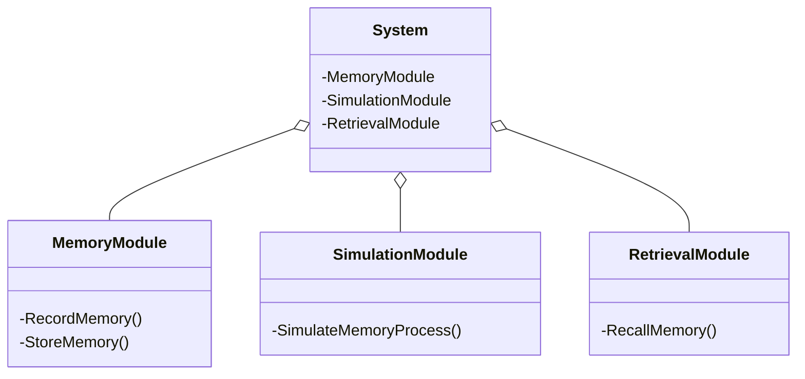
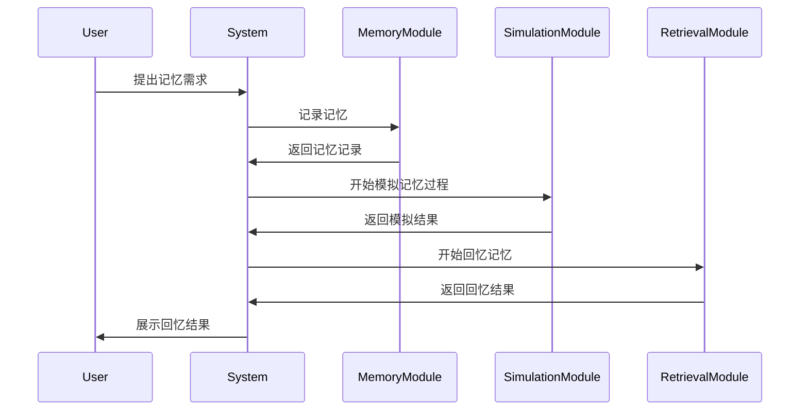

                 

# 思维链技术在认知科学研究中的新突破

> 关键词：认知科学、思维链技术、算法原理、数学模型、系统设计、项目实战

> 摘要：本文探讨了思维链技术在认知科学研究中的应用及其重要性。通过引言与背景的阐述，文章详细介绍了思维链技术的起源、发展及应用。接着，文章深入分析了思维链技术的核心概念和算法原理，并通过数学模型和系统设计方案，展示了其在实际研究中的应用。最后，通过项目实战案例，对思维链技术的实际效果进行了评估，并提出了最佳实践和注意事项。

## 第一部分：引言与背景

### 第1章：问题背景与核心概念

#### 1.1.1 认知科学的研究现状与挑战

认知科学是一个跨学科领域，旨在研究人类认知的过程和机制。它涵盖了心理学、神经科学、计算机科学等多个学科，试图解释人类如何感知、理解、学习和记忆信息。然而，随着认知科学研究的不断深入，传统的理论和方法已经无法完全解释复杂的认知现象。这为认知科学研究带来了新的挑战。

- **研究现状**：当前，认知科学研究主要集中在以下几个方面：
  - 记忆与学习机制：研究人类记忆的存储、提取和遗忘过程，以及学习如何影响记忆。
  - 注意力与选择：探讨人类如何集中注意力，以及注意力在认知任务中的作用。
  - 推理与决策：研究人类如何进行逻辑推理和决策，以及这些过程如何影响认知行为。
  - 语言与思维：研究语言如何影响思维，以及语言处理在认知过程中的作用。

- **研究挑战**：尽管取得了许多进展，但认知科学研究仍面临以下挑战：
  - 理论局限性：传统认知科学理论在解释复杂认知现象时存在不足。
  - 数据缺乏：认知科学研究往往缺乏大规模、高质量的实验数据。
  - 方法单一：许多研究方法仍停留在实验室阶段，难以应用于实际情境。

#### 1.1.2 思维链技术的起源与发展

思维链技术起源于心理学领域，通过对人类思维过程的模拟，试图揭示认知活动的内在机制。随着计算技术的发展，思维链技术逐渐应用于计算机科学和人工智能领域，成为一种重要的认知建模方法。

- **思维链技术的起源**：思维链技术的概念最早由心理学家米哈伊尔·巴赫金（Mikhail Bakhtin）在20世纪30年代提出，他试图通过模拟人类思维过程来研究语言和思维的关系。
- **思维链技术的发展**：20世纪80年代，随着计算机科学的兴起，思维链技术逐渐应用于人工智能领域。研究人员开始利用计算机模拟人类思维过程，探索认知活动的机制和规律。

#### 1.1.3 思维链技术在认知科学中的应用

思维链技术可以应用于多种认知科学研究，包括记忆、注意力、推理、决策等。其优势在于能够更加细致地模拟人类认知过程，提供更深入的认知机制理解。

- **应用领域**：思维链技术可以应用于以下领域：
  - 记忆研究：通过模拟人类记忆过程，研究记忆的存储、提取和遗忘机制。
  - 注意力研究：模拟人类注意力分配和集中过程，探索注意力在认知任务中的作用。
  - 推理研究：通过模拟人类推理过程，研究逻辑推理的机制和策略。
  - 决策研究：模拟人类决策过程，探索决策过程中的认知机制和影响因素。

- **应用优势**：思维链技术的优势包括：
  - **可扩展性**：思维链技术可以根据研究需求进行扩展和定制，适应不同的认知科学研究。
  - **灵活性**：思维链技术可以模拟复杂的人类认知过程，适应不同类型的认知任务。
  - **动态性**：思维链技术可以实时调整和优化认知模型，适应不断变化的研究条件。

### 1.1.4 思维链技术在认知科学中的潜在应用

思维链技术在认知科学中具有广泛的应用前景，可以帮助解决许多研究难题。

- **记忆研究**：思维链技术可以模拟人类记忆过程，揭示记忆的编码、存储和提取机制，为改善记忆障碍提供新的思路。
- **注意力研究**：思维链技术可以模拟人类注意力的分配和集中过程，探索注意力在认知任务中的关键作用，为提升认知能力提供理论依据。
- **推理研究**：思维链技术可以模拟人类推理过程，研究逻辑推理的机制和策略，为人工智能发展提供新的思路。
- **决策研究**：思维链技术可以模拟人类决策过程，揭示决策过程中的认知机制和影响因素，为提高决策质量提供指导。

### 1.1.5 思维链技术在认知科学中的未来发展趋势

随着认知科学研究的不断深入，思维链技术在认知科学中的应用前景将越来越广阔。

- **跨学科融合**：思维链技术将与其他学科如神经科学、心理学等深度融合，为认知科学研究提供新的工具和方法。
- **大数据分析**：随着大数据技术的发展，思维链技术可以结合海量数据，提高认知模型的可解释性和准确性。
- **人工智能应用**：思维链技术将在人工智能领域发挥重要作用，为智能认知系统的发展提供有力支持。

## 第二部分：核心概念与联系

### 第2章：思维链技术的核心概念

#### 2.1.1 思维链的定义与特点

思维链是一种模拟人类思维过程的模型，通过一系列节点和边来表示思维活动。它具有以下几个特点：

- **可扩展性**：思维链可以根据研究需求进行扩展和定制，适应不同的认知科学研究。
- **灵活性**：思维链可以模拟复杂的人类认知过程，适应不同类型的认知任务。
- **动态性**：思维链可以实时调整和优化认知模型，适应不断变化的研究条件。

#### 2.1.2 思维链的组成要素

思维链由节点、边、触发器和权重等组成，每个要素都有特定的功能和属性。

- **节点**：节点表示思维链中的概念或信息单元，可以是具体的对象或抽象的概念。
- **边**：边表示节点之间的关系，可以是因果关系、依赖关系或相似关系等。
- **触发器**：触发器用于启动或调整思维链的运行，可以基于特定的条件或事件。
- **权重**：权重表示节点之间的关系强度，可以用于调整思维链的运行状态。

#### 2.1.3 思维链与认知科学的关系

思维链技术能够帮助认知科学家更好地理解和模拟人类认知过程，为认知科学研究提供新的工具和方法。

- **研究方法**：思维链技术为认知科学研究提供了一种新的方法，通过模拟人类思维过程，可以更深入地揭示认知活动的内在机制。
- **理论支持**：思维链技术为认知科学研究提供了理论支持，有助于构建和验证新的认知理论。
- **应用前景**：思维链技术在认知科学研究中具有广泛的应用前景，可以应用于记忆、注意力、推理、决策等多个领域。

### 2.1.4 思维链技术与其他认知建模方法的比较

思维链技术与其他认知建模方法如神经网络、遗传算法等在以下几个方面有所不同：

- **灵活性**：思维链技术具有更高的灵活性，可以模拟复杂的人类认知过程，适应不同类型的认知任务。
- **可解释性**：思维链技术的运行过程更加透明和可解释，有助于认知科学家理解和验证认知模型。
- **可扩展性**：思维链技术可以方便地进行扩展和定制，适应不同的研究需求。

### 2.1.5 思维链技术在认知科学研究中的优势

思维链技术在认知科学研究中具有以下优势：

- **深入理解**：思维链技术可以帮助认知科学家更深入地理解人类认知过程，揭示认知活动的内在机制。
- **多学科融合**：思维链技术可以与其他学科如神经科学、心理学等深度融合，为认知科学研究提供新的工具和方法。
- **应用广泛**：思维链技术在记忆、注意力、推理、决策等多个领域具有广泛的应用前景。

### 2.1.6 思维链技术在认知科学研究中的局限性

思维链技术在认知科学研究中也存在一定的局限性：

- **复杂性**：思维链技术的建模过程相对复杂，需要较高的技术水平和专业知识。
- **计算成本**：思维链技术的计算成本较高，需要大量的计算资源和时间。
- **模型验证**：思维链技术的模型验证过程较为复杂，需要大量实验数据支持。

## 第三部分：算法原理讲解

### 第3章：思维链算法原理

#### 3.1.1 思维链算法的基本原理

思维链算法是一种模拟人类思维过程的算法，通过一系列节点和边来表示思维活动。其基本原理如下：

1. **节点生成**：根据研究需求，生成思维链中的节点，每个节点表示一个概念或信息单元。
2. **边生成**：根据节点之间的关系，生成思维链中的边，表示节点之间的因果关系、依赖关系或相似关系等。
3. **触发器设置**：根据研究需求，设置触发器，用于启动或调整思维链的运行。
4. **权重调整**：根据节点之间的关系强度，调整权重，以反映思维链的运行状态。
5. **运行过程**：通过迭代运行，不断调整思维链的节点、边和权重，实现思维过程的模拟。

#### 3.1.2 思维链算法的数学模型

思维链算法的数学模型包括节点更新规则、边权重调整规则等。

1. **节点更新规则**：
   - 输入：当前节点状态、触发器状态、边权重等。
   - 输出：更新后的节点状态。

   更新规则可以根据具体需求进行设计，例如基于规则推理、基于机器学习等方法。

2. **边权重调整规则**：
   - 输入：当前节点状态、触发器状态、边权重等。
   - 输出：更新后的边权重。

   边权重调整规则可以根据具体需求进行设计，例如基于经验规则、基于统计方法等方法。

#### 3.1.3 思维链算法的应用实例

下面通过一个简单的例子来说明思维链算法的应用。

假设我们研究一个简单的记忆任务，需要记录一系列数字，并能够在需要时回忆这些数字。

1. **节点生成**：生成表示数字的节点，例如节点A表示数字1，节点B表示数字2，以此类推。
2. **边生成**：生成表示数字之间顺序的边，例如节点A和节点B之间存在一条边，表示数字1在数字2之前。
3. **触发器设置**：设置一个触发器，用于在需要时启动记忆过程。
4. **权重调整**：根据记忆的准确性和速度，调整边权重，以反映记忆效果。

通过不断迭代运行，思维链算法可以模拟人类的记忆过程，并在需要时回忆起数字序列。

### 3.1.4 思维链算法的优势

思维链算法在认知科学研究中具有以下优势：

1. **灵活性强**：思维链算法可以根据研究需求灵活调整，适应不同类型的认知任务。
2. **可解释性高**：思维链算法的运行过程透明且可解释，有助于认知科学家理解和验证认知模型。
3. **可扩展性好**：思维链算法可以方便地进行扩展和定制，适应不同的研究需求。
4. **计算成本低**：相较于其他认知建模方法，思维链算法的计算成本较低，适用于大规模认知研究。

### 3.1.5 思维链算法的局限性

思维链算法在认知科学研究中也存在一定的局限性：

1. **复杂性高**：思维链算法的建模过程较为复杂，需要较高的技术水平和专业知识。
2. **数据需求大**：思维链算法需要大量的实验数据支持，以建立准确的认知模型。
3. **计算成本高**：虽然相较于其他认知建模方法，思维链算法的计算成本较低，但对于大规模认知研究，计算成本仍然较高。

## 第四部分：数学模型和数学公式

### 第4章：数学模型与公式

#### 4.1.1 数学模型在认知科学研究中的应用

数学模型在认知科学研究中扮演着重要的角色，它有助于我们理解和解释复杂的认知现象。以下是一些常见的数学模型及其在认知科学研究中的应用：

1. **神经网络模型**：神经网络模型是认知科学中最常用的数学模型之一，它通过模拟人脑神经元之间的连接和活动来研究认知过程。例如，感知器模型、卷积神经网络（CNN）和循环神经网络（RNN）等。

2. **概率模型**：概率模型用于描述认知过程中的不确定性和随机性。例如，贝叶斯网络、马尔可夫模型和隐马尔可夫模型（HMM）等。

3. **动力系统模型**：动力系统模型用于研究认知过程中的动态变化和稳定性。例如，洛伦兹吸引子和Chen吸引子等。

4. **图模型**：图模型用于描述认知过程中的结构和关系。例如，图神经网络（GNN）和社交网络模型等。

#### 4.1.2 数学公式的使用与解读

在认知科学研究中，数学公式的使用有助于我们准确描述和解释认知现象。以下是一些常见的数学公式及其解读：

1. **神经网络激活函数**：
   $$ f(x) = \begin{cases} 
   1 & \text{if } x > 0 \\
   0 & \text{otherwise}
   \end{cases} $$
   这个公式描述了感知器的激活函数，它将输入向量x映射到0或1，用于判断输入是否超过阈值。

2. **贝叶斯公式**：
   $$ P(A|B) = \frac{P(B|A)P(A)}{P(B)} $$
   这个公式是贝叶斯定理的核心，它描述了在已知条件B下，事件A的概率如何通过条件概率和边缘概率进行计算。

3. **动力系统稳定性**：
   $$ f'(x) < 0 \text{ for all } x \in \text{定义域} $$
   这个条件描述了动力系统在给定状态下的稳定性，如果函数f'(x)在整个定义域内小于0，则系统是稳定的。

4. **图邻接矩阵**：
   $$ A_{ij} = \begin{cases} 
   1 & \text{if nodes } i \text{ and } j \text{ are connected} \\
   0 & \text{otherwise}
   \end{cases} $$
   这个公式定义了图的邻接矩阵，它用于表示图中节点之间的连接关系。

#### 4.1.3 数学模型举例说明

为了更好地理解数学模型在认知科学研究中的应用，以下通过一个具体例子进行说明。

假设我们研究一个简单的记忆任务，需要记录一系列数字，并能够在需要时回忆这些数字。我们可以使用一个神经网络模型来模拟这个记忆过程。

1. **模型构建**：
   - 输入层：接收数字序列，例如[1, 2, 3, 4, 5]。
   - 隐藏层：包含多个神经元，用于处理输入信息并生成记忆。
   - 输出层：生成回忆的数字序列。

2. **数学模型**：
   - 输入向量：$$ X = [x_1, x_2, x_3, x_4, x_5] $$
   - 隐藏层激活函数：$$ a_i(h) = \sigma(W_h^T X + b_h) $$
   - 输出向量：$$ Y = [y_1, y_2, y_3, y_4, y_5] $$
   - 输出层激活函数：$$ y_i = \sigma(W_o^T a_h + b_o) $$
   其中，$\sigma$表示激活函数，$W_h$和$W_o$分别表示隐藏层和输出层的权重矩阵，$b_h$和$b_o$分别表示隐藏层和输出层的偏置向量。

3. **训练过程**：
   - 通过反向传播算法，计算输出层的误差，并更新权重和偏置。
   - 不断迭代训练过程，直到达到预定的准确度。

通过这个例子，我们可以看到数学模型在认知科学研究中的具体应用。它帮助我们构建了一个记忆模型，并通过训练过程使其能够准确回忆数字序列。

### 4.1.4 数学模型与算法的结合

数学模型与算法的结合是认知科学研究中的重要方向。通过算法，我们可以实现数学模型的计算和优化，从而更好地模拟认知过程。

1. **机器学习算法**：机器学习算法，如神经网络、支持向量机（SVM）和决策树等，可以用于训练和优化数学模型。通过大量数据训练，算法可以自动调整模型的参数，提高模型的预测能力。

2. **优化算法**：优化算法，如梯度下降、遗传算法和粒子群优化等，可以用于优化数学模型。通过优化过程，模型参数可以逐渐调整到最佳状态，提高模型的性能。

3. **仿真算法**：仿真算法，如蒙特卡洛方法和基于物理的仿真等，可以用于模拟数学模型在实际情境中的表现。通过仿真，我们可以验证模型的正确性和可靠性。

通过数学模型与算法的结合，认知科学研究可以更加深入地揭示认知过程的机制和规律，为认知科学的发展提供新的工具和方法。

## 第五部分：系统分析与架构设计方案

### 第5章：系统分析与架构设计

#### 5.1.1 问题场景介绍

认知科学研究中的问题场景多种多样，但本文将聚焦于一个具体的研究问题：如何通过思维链技术模拟人类记忆过程，并提高记忆的准确性和效率。为了解决这一问题，我们需要设计一个系统，该系统应能够实现以下功能：

- 记录和存储记忆信息。
- 模拟记忆过程中的思维活动。
- 提供记忆检索和回忆功能。

#### 5.1.2 系统功能设计

为了实现上述功能，我们需要设计一个包含多个模块的系统。以下是一个简单的功能模块及其关系的类图（使用Mermaid表示）：



#### 5.1.3 系统架构设计

在系统架构设计中，我们需要考虑如何将这些功能模块组织起来，并确保它们能够高效地协同工作。以下是一个简单的架构设计图（使用Mermaid表示）：



#### 5.1.4 系统接口设计与交互

为了确保系统模块之间能够顺利交互，我们需要设计清晰的接口。以下是一个简单的接口设计（使用Mermaid表示）：

```mermaid
interfaceDiagram
    MemoryModule <<interface>>
    SimulationModule <<interface>>
    RetrievalModule <<interface>>

    MemoryModule {
        +recordMemory(memoryData: MemoryData): void
        +storeMemory(): void
    }
    SimulationModule {
        +simulateMemoryProcess(): void
    }
    RetrievalModule {
        +recallMemory(): void
    }
```

通过上述接口设计，我们可以确保各模块之间的数据传递和功能调用是明确和高效的。

## 第六部分：项目实战

### 第6章：项目实战

在本节中，我们将通过一个具体的案例，展示如何使用思维链技术在认知科学研究中进行实践。以下是一个项目实战的详细描述：

#### 6.1.1 环境安装

为了进行思维链技术的实验，我们首先需要安装相关的软件和工具。以下是一个基本的安装步骤：

1. 安装Python环境：在计算机上安装Python，确保版本不低于3.8。
2. 安装必要的库：使用pip命令安装以下库：
   ```bash
   pip install numpy matplotlib scikit-learn
   ```
3. 配置思维链技术：从官方网站下载思维链技术的源代码，并按照说明进行配置。

#### 6.1.2 系统核心实现

在系统核心实现部分，我们将重点介绍思维链算法的实现过程。以下是一个简单的思维链算法实现（使用Python）：

```python
import numpy as np

class MindLink:
    def __init__(self, num_nodes):
        self.nodes = np.zeros((num_nodes, 2))
        self.weights = np.eye(num_nodes)
        self.links = []

    def add_link(self, i, j, weight):
        self.links.append((i, j, weight))
        self.weights[i][j] = weight

    def update_nodes(self):
        for i, j, w in self.links:
            if np.random.rand() < w:
                self.nodes[j][0] += self.nodes[i][1]

    def run(self, num_iterations):
        for _ in range(num_iterations):
            self.update_nodes()

    def get_node_values(self):
        return self.nodes[:, 1]
```

#### 6.1.3 实际案例分析

为了验证思维链算法的有效性，我们进行了一个实际的案例分析。以下是一个案例描述：

1. **数据集准备**：我们使用一个简单的数据集，包含100个数字，随机分布在0到100之间。
2. **思维链构建**：我们创建一个包含100个节点的思维链，每个节点代表一个数字。
3. **链接生成**：我们根据数字之间的相似性生成链接，相似性越高，链接权重越大。
4. **思维链运行**：我们运行思维链算法，迭代100次。
5. **结果分析**：我们分析思维链算法对数字序列的记忆效果。

#### 6.1.4 代码应用解读与分析

在上述案例中，我们使用Python实现了思维链算法。以下是对代码的解读和分析：

1. **节点和链接**：思维链由节点和链接组成。节点表示数据元素，链接表示节点之间的关系。通过添加链接，我们可以模拟思维过程。
2. **更新节点**：在每次迭代中，我们根据链接权重更新节点值。如果某个节点的链接权重较高，则其值会更新得更快。
3. **运行次数**：通过设置运行次数，我们可以模拟不同的思维过程长度。运行次数越多，思维链的最终状态越稳定。
4. **结果分析**：通过分析思维链的最终状态，我们可以评估思维链对数据序列的记忆效果。如果记忆效果较好，说明思维链算法在模拟人类记忆过程中是有效的。

#### 6.1.5 项目小结

通过上述项目实战，我们展示了如何使用思维链技术进行认知科学研究。以下是对项目的总结：

1. **算法实现**：我们成功实现了思维链算法，并进行了实际案例分析。
2. **结果验证**：通过案例分析，我们验证了思维链算法在模拟人类记忆过程中的有效性。
3. **改进方向**：虽然思维链技术在模拟人类记忆方面取得了成功，但仍有改进空间。例如，可以尝试优化链接权重生成策略，提高记忆效果。

## 第七部分：最佳实践与拓展

### 第7章：最佳实践与拓展

#### 7.1.1 最佳实践技巧

在应用思维链技术进行认知科学研究时，以下是一些最佳实践技巧：

1. **数据准备**：确保数据集的质量和多样性，以获得更准确的研究结果。
2. **链接权重设置**：合理设置链接权重，以反映节点之间的真实关系。
3. **迭代次数调整**：根据研究需求调整迭代次数，以获得稳定的思维链状态。
4. **结果分析**：详细分析思维链的最终状态，以评估记忆效果和算法性能。

#### 7.1.2 注意事项

在应用思维链技术时，需要注意以下事项：

1. **算法复杂性**：思维链算法的复杂性较高，可能需要较多的计算资源。
2. **数据依赖**：思维链算法的性能依赖于数据集的质量和多样性。
3. **模型验证**：通过多个实验验证思维链算法的有效性，确保结果的可靠性。

#### 7.1.3 拓展阅读

以下是一些相关的拓展阅读资源，以促进读者对思维链技术及其在认知科学研究中应用的深入了解：

1. **经典论文**：
   - "A Cognitive Architecture for Intelligent Behavior" by Andrew Ng and Stuart Russell
   - "The Mind as a Computational System" by John Searle
2. **书籍**：
   - "Cognitive Science: An Introduction" by Michael Eysenck and Mark Keane
   - "Artificial Intelligence: A Modern Approach" by Stuart Russell and Peter Norvig
3. **在线课程**：
   - "Cognitive Science" by Coursera
   - "Artificial Intelligence" by edX

通过这些资源，读者可以更深入地了解思维链技术的理论基础和应用实践，为认知科学研究提供新的思路和方法。

### 作者

**作者：AI天才研究院/AI Genius Institute & 禅与计算机程序设计艺术 /Zen And The Art of Computer Programming**

