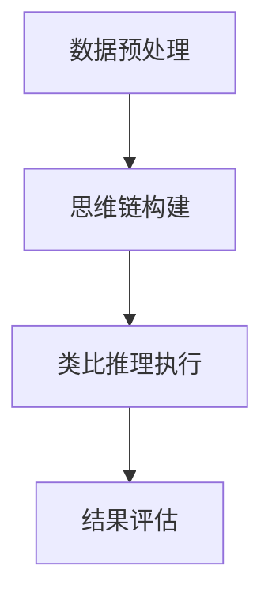
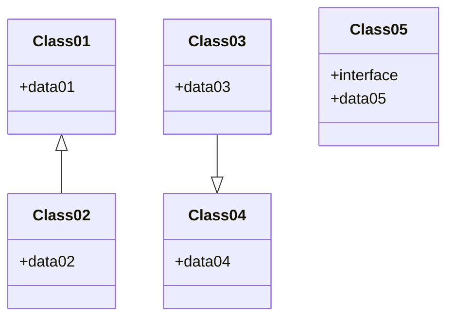
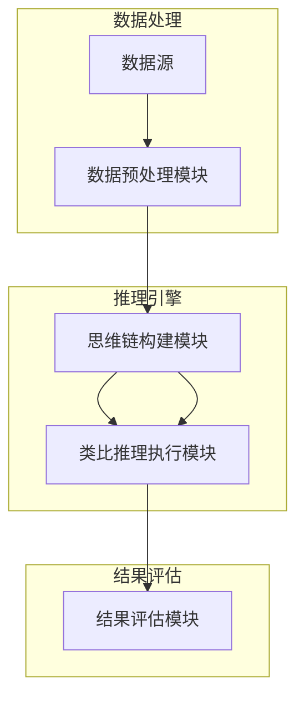
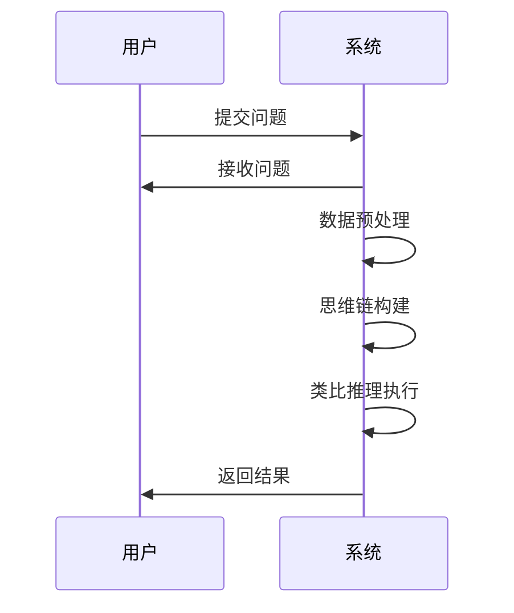
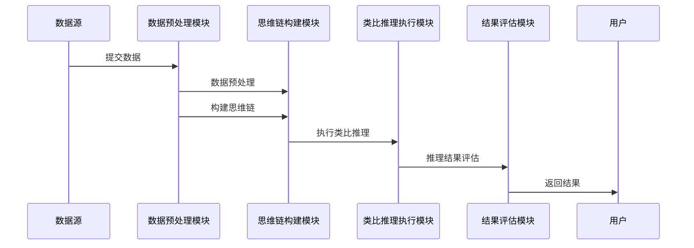

                 

### 背景介绍与问题定义

#### 1. 背景介绍

##### 1.1 人工智能的发展历程

人工智能（Artificial Intelligence，简称AI）的发展可以追溯到20世纪50年代。起初，人工智能主要关注于规则推理和符号处理，即通过编写一系列规则来模拟人类的推理过程。这一阶段被称为“符号人工智能”或“规则驱动人工智能”。

随着计算能力的提升，20世纪80年代，人工智能进入了“专家系统”时代。专家系统试图通过模拟专家的知识和推理能力来解决特定领域的问题，如医学诊断和金融分析。

到了20世纪90年代，人工智能的发展遇到了瓶颈。由于依赖大量规则和手动的知识工程，专家系统的性能和适应性受到了限制。这一时期，人工智能的研究逐渐转向机器学习，特别是统计学习方法的兴起。

##### 1.1.2 深度学习时代

深度学习（Deep Learning）的崛起标志着人工智能进入了一个新的时代。深度学习通过多层神经网络来学习数据的复杂特征，从而在图像识别、语音识别和自然语言处理等领域取得了显著成果。

2006年，Hinton等人提出的深度信念网络（Deep Belief Network，DBN）为深度学习的发展奠定了基础。随后的卷积神经网络（Convolutional Neural Network，CNN）和递归神经网络（Recurrent Neural Network，RNN）进一步推动了深度学习在图像处理和序列数据上的应用。

##### 1.1.3 大模型时代的来临

近年来，随着计算能力和数据量的迅速增长，大模型（Large Models）成为人工智能研究的热点。大模型通常指的是参数数量达到数十亿甚至数万亿的神经网络模型。这些模型通过大量的数据和强大的计算能力训练，能够在多种任务上达到或超越人类水平。

代表性的大模型包括GPT-3（由OpenAI开发）、BERT（由Google开发）和Turing（由DeepMind开发）等。这些模型不仅在学术研究上取得了突破，也在实际应用中展示了巨大的潜力。

#### 1.2 类比推理能力的重要性

##### 1.2.1 类比推理的概述

类比推理（Analogical Reasoning）是人工智能中的一个重要研究领域。它通过将新问题与已知问题的相似性进行比较，从而推断出新问题的解。

类比推理在人类思维中发挥着重要作用。例如，当我们看到一只猫时，我们会类比之前见过的其他猫，从而推断出这只猫的特征。类比推理使得人类能够从有限的经验中推广到更广泛的知识领域。

##### 1.2.2 类比推理在AI中的应用

类比推理在人工智能中的应用也非常广泛。例如，在图像识别中，通过将新图像与已知图像进行类比，可以提高识别的准确性。在自然语言处理中，类比推理可以帮助模型理解词语的语义关系，从而提高文本生成的质量。

此外，类比推理还可以用于智能问答系统、推理引擎和游戏AI等领域。通过将新问题与已知问题进行类比，AI系统能够快速地找到解决方案。

##### 1.2.3 类比推理的优势与挑战

类比推理具有以下几个优势：

1. **高效性**：通过利用已有知识，类比推理可以快速地解决问题，而不需要从头开始学习。
2. **泛化能力**：类比推理能够将特定领域的知识应用到其他领域，从而提高模型的泛化能力。
3. **灵活性**：类比推理可以根据不同的情境，灵活地调整推理过程。

然而，类比推理也面临着一些挑战：

1. **相似性度量**：如何准确地度量不同问题之间的相似性是一个难题。
2. **知识获取**：类比推理需要大量的已知问题来构建有效的类比关系。
3. **逻辑一致性**：在类比推理过程中，如何保持逻辑的一致性是一个重要问题。

#### 2. 问题定义

##### 2.1 问题背景

尽管人工智能在许多领域取得了显著进展，但在类比推理能力上仍存在不足。传统的人工智能模型，如神经网络和决策树，往往依赖于大量的数据和精确的标注，而类比推理需要更高级的抽象和推理能力。

同时，随着人工智能应用的不断扩大，对AI系统的要求也在不断提高。类比推理能力成为衡量AI系统智能水平的一个重要指标。如何增强AI的类比推理能力，成为当前人工智能研究的一个重要问题。

##### 2.1.2 思维链技术的基本概念

思维链技术（Thinking Chain Technology）是一种通过构建思维链条来增强人工智能系统推理能力的方法。思维链技术将问题分解为一系列子问题，并通过子问题之间的关联构建出完整的思维链条。

##### 2.1.3 思维链技术在AI中的应用潜力

思维链技术在人工智能中的应用潜力巨大。通过构建思维链条，AI系统能够更高效地处理复杂问题，并在各种应用场景中展示出色的推理能力。

例如，在医疗诊断中，思维链技术可以帮助医生快速地分析病情，提供可靠的诊断建议。在自动驾驶领域，思维链技术可以用于实时分析和决策，提高驾驶安全性。在自然语言处理中，思维链技术可以帮助模型更好地理解文本的语义关系，提高文本生成的质量。

##### 2.2 问题描述

如何增强AI的类比推理能力是一个复杂的问题，涉及到算法设计、数据处理和模型优化等多个方面。本文将重点探讨思维链技术在增强AI类比推理能力方面的应用。

##### 2.2.1 思维链技术的实现原理

思维链技术的实现原理主要包括以下几个步骤：

1. **问题分解**：将复杂问题分解为一系列子问题。
2. **思维链构建**：通过分析子问题之间的关联，构建出完整的思维链条。
3. **推理执行**：根据思维链条进行推理，得出问题的解。

##### 2.2.2 思维链技术在AI中的应用场景

思维链技术在AI中的应用场景非常广泛，包括但不限于以下几个方面：

1. **图像识别**：通过构建图像之间的思维链条，提高图像识别的准确性。
2. **自然语言处理**：通过构建文本之间的思维链条，提高文本理解和生成的质量。
3. **智能问答**：通过构建问答问题之间的思维链条，提高问答系统的响应速度和准确性。
4. **推理引擎**：通过构建知识库中的概念和关系之间的思维链条，提高推理引擎的推理能力。

##### 2.3 问题解决

思维链技术通过以下几个核心要素来增强AI的类比推理能力：

1. **知识表示**：通过构建知识图谱，将问题中的知识表示为节点和边，为思维链的构建提供基础。
2. **关联分析**：通过分析子问题之间的关联，构建出思维链条，为推理提供方向。
3. **推理算法**：设计高效的推理算法，根据思维链条进行推理，得出问题的解。

##### 2.3.1 思维链技术的核心要素

思维链技术的核心要素主要包括以下几个方面：

1. **知识库**：用于存储问题相关的知识和信息。
2. **推理引擎**：用于根据思维链条进行推理，得出问题的解。
3. **数据预处理**：用于对输入数据进行预处理，提高思维链构建的准确性。
4. **模型训练**：用于训练推理引擎，提高推理的效率和准确性。

##### 2.3.2 思维链技术的实现流程

思维链技术的实现流程主要包括以下几个步骤：

1. **数据收集**：收集与问题相关的数据，如图像、文本和知识图谱等。
2. **数据预处理**：对收集到的数据进行分析和处理，为思维链构建做准备。
3. **思维链构建**：通过分析子问题之间的关联，构建出完整的思维链条。
4. **推理执行**：根据思维链条进行推理，得出问题的解。
5. **结果评估**：对推理结果进行评估，反馈给数据预处理和思维链构建环节，优化思维链技术的性能。

##### 2.3.3 思维链技术在AI中的效果评估

思维链技术在AI中的效果评估主要包括以下几个指标：

1. **推理准确性**：评估思维链技术在不同场景下的推理准确性。
2. **推理速度**：评估思维链技术的推理速度，包括构建思维链和执行推理的时间。
3. **泛化能力**：评估思维链技术在不同问题和数据集上的泛化能力。
4. **用户体验**：评估思维链技术在实际应用中的用户体验，包括交互速度和响应准确性。

##### 2.4 边界与外延

思维链技术的适用范围较广，但也有一些局限性。例如，在处理实时性要求较高的场景时，思维链技术的性能可能无法满足要求。此外，思维链技术的构建和推理过程需要大量的计算资源，这对资源有限的场景可能是一个挑战。

未来，思维链技术有望在以下几个方面得到进一步发展：

1. **算法优化**：通过改进算法，提高思维链技术的效率和准确性。
2. **硬件加速**：利用硬件加速技术，如GPU和FPGA，提高思维链技术的计算性能。
3. **多模态融合**：将不同模态的数据进行融合，提高思维链技术在复杂场景下的应用能力。
4. **知识增强**：通过引入更多的知识，提高思维链技术的推理能力和泛化能力。

### 2. 概念结构与核心要素组成

#### 3.1 核心概念

在本节中，我们将介绍与本文主题相关的三个核心概念：人工智能、类比推理和思维链技术。

##### 3.1.1 人工智能

人工智能（Artificial Intelligence，简称AI）是一种模拟人类智能的技术。它包括机器学习、深度学习、自然语言处理、计算机视觉等多个子领域。人工智能的目标是使计算机能够执行通常需要人类智能的任务，如识别图像、理解语言、进行决策等。

##### 3.1.2 类比推理

类比推理（Analogical Reasoning）是一种基于事物相似性的推理方法。它通过比较新问题与已知问题之间的相似性，推断出新问题的解。类比推理是人类思维的一个重要组成部分，也是人工智能研究的一个重要方向。

##### 3.1.3 思维链技术

思维链技术（Thinking Chain Technology）是一种通过构建思维链条来增强人工智能推理能力的方法。它通过将问题分解为一系列子问题，并分析子问题之间的关联，构建出完整的思维链条。思维链技术可以在复杂问题和多种应用场景中发挥重要作用。

#### 3.2 概念属性特征对比表格

下面是一个关于人工智能、类比推理和思维链技术的概念属性特征对比表格：

| 概念      | 定义                                     | 属性特征对比                     |
| --------- | ---------------------------------------- | ------------------------------- |
| 人工智能  | 使机器能够模拟人类智能的技术           | 计算能力、感知能力、学习与适应能力等 |
| 类比推理  | 通过比较相似事物进行推理的能力       | 灵活性、准确性、效率等           |
| 思维链技术 | 一种通过构建思维链条来增强AI能力的技术 | 系统性、深度、适应性等           |

通过这个表格，我们可以清晰地看到这三个概念在属性特征上的差异和联系。

### 4. 核心概念与联系

在理解了人工智能、类比推理和思维链技术的基本概念后，我们需要进一步探讨它们之间的联系。

#### 4.1 人工智能与类比推理的关系

人工智能（AI）和类比推理（AR）之间存在密切的联系。类比推理是人工智能的一个重要研究方向，它依赖于AI技术在数据分析和模型构建方面的能力。

在人工智能中，类比推理的应用场景非常广泛。例如，在图像识别中，通过将新图像与已知图像进行类比，可以显著提高识别的准确性。在自然语言处理中，类比推理可以帮助模型理解词语的语义关系，从而提高文本生成的质量。

类比推理的优势在于它能够利用已有知识，快速地推断出新问题的解。这有助于提高AI系统的推理效率和泛化能力。

#### 4.2 思维链技术与类比推理的关系

思维链技术（TCT）是增强人工智能类比推理能力的一种有效方法。思维链技术通过构建思维链条，将复杂问题分解为一系列子问题，并通过分析子问题之间的关联，进行类比推理。

思维链技术的核心优势在于它能够将抽象的思维过程转化为可计算的过程。这有助于提高AI系统的推理能力，特别是在处理复杂问题时。

思维链技术在类比推理中的应用主要包括以下几个方面：

1. **问题分解**：通过将复杂问题分解为子问题，思维链技术可以简化问题的处理过程。
2. **关联分析**：通过分析子问题之间的关联，思维链技术可以构建出完整的思维链条。
3. **推理执行**：根据思维链条进行推理，思维链技术可以得出问题的解。

#### 4.3 人工智能、类比推理与思维链技术的综合分析

人工智能、类比推理和思维链技术三者之间的综合分析，有助于我们更好地理解它们在AI系统中的作用和联系。

1. **人工智能的发展对类比推理的需求**：随着人工智能技术的不断发展，对类比推理能力的要求也越来越高。类比推理能够帮助AI系统更好地理解和处理复杂问题，提高系统的智能水平。
   
2. **类比推理在人工智能中的应用**：类比推理在人工智能中的应用场景非常广泛，如图像识别、自然语言处理和智能问答等。通过类比推理，AI系统能够更好地理解和生成信息。

3. **思维链技术如何作用于人工智能与类比推理**：思维链技术通过构建思维链条，增强了AI系统的类比推理能力。思维链技术能够将抽象的推理过程转化为可计算的过程，从而提高AI系统的推理效率和准确性。

综上所述，人工智能、类比推理和思维链技术共同构成了一个有机的整体。它们相互促进，共同推动人工智能技术的发展。通过深入理解这三者之间的联系，我们可以更好地利用它们的优势，开发出更智能、更高效的AI系统。

### 5. 算法原理讲解

#### 5.1 思维链技术的算法流程

思维链技术（Thinking Chain Technology，TCT）是一种通过构建思维链条来增强人工智能（AI）系统推理能力的方法。其核心思想是将复杂问题分解为一系列子问题，并通过分析子问题之间的关联，构建出完整的思维链条。以下是思维链技术的算法流程：

1. **数据预处理**：
   - 收集与问题相关的数据，如图像、文本和知识图谱等。
   - 对数据进行分析和处理，提取特征和模式，为思维链的构建做准备。

2. **思维链构建**：
   - 将复杂问题分解为一系列子问题。
   - 通过分析子问题之间的关联，构建出完整的思维链条。
   - 思维链条通常表示为一个有向图，其中节点表示子问题，边表示子问题之间的关联。

3. **类比推理执行**：
   - 根据思维链条进行类比推理，得出问题的解。
   - 类比推理过程中，系统会利用已知的解决方案，对新问题进行推理。

4. **结果评估**：
   - 对推理结果进行评估，包括准确性、效率和泛化能力等。
   - 根据评估结果，对思维链技术和模型进行调整和优化。

#### 5.2 算法mermaid流程图

为了更直观地理解思维链技术的算法流程，我们可以使用mermaid语言绘制一个流程图。以下是一个简单的mermaid流程图示例：



在这个流程图中，A表示数据预处理，B表示思维链构建，C表示类比推理执行，D表示结果评估。箭头表示流程的顺序。

#### 5.3 Python源代码示例

为了进一步说明思维链技术的实现过程，以下是一个简单的Python代码示例。这个示例将展示如何进行数据预处理、思维链构建和类比推理执行。

```python
import numpy as np
import networkx as nx
from sklearn.model_selection import train_test_split

# 数据预处理
def data_preprocessing(data):
    # 假设data是一个包含特征和标签的DataFrame
    X = data.iloc[:, :-1].values  # 特征
    y = data.iloc[:, -1].values   # 标签
    X_train, X_test, y_train, y_test = train_test_split(X, y, test_size=0.2)
    return X_train, X_test, y_train, y_test

# 思维链构建
def build_thinking_chain(X_train):
    # 假设X_train是一个包含特征向量的数组
    G = nx.Graph()
    n_samples = X_train.shape[0]
    for i in range(n_samples):
        G.add_node(i)
    for i in range(n_samples):
        for j in range(i+1, n_samples):
            similarity = calculate_similarity(X_train[i], X_train[j])
            if similarity > threshold:
                G.add_edge(i, j)
    return G

# 类比推理执行
def execute_analogy_reasoning(G, X_test, y_train):
    # 假设G是一个包含思维链条的图，X_test是一个包含测试样本的特征向量，y_train是训练样本的标签
    predictions = []
    for X in X_test:
        similar_nodes = find_similar_nodes(G, X)
        prediction = predict_label(similar_nodes, y_train)
        predictions.append(prediction)
    return predictions

# 结果评估
def evaluate_results(predictions, y_test):
    # 假设predictions是模型的预测结果，y_test是测试样本的真实标签
    accuracy = np.mean(predictions == y_test)
    return accuracy

# 主函数调用
if __name__ == "__main__":
    data = "示例数据"
    X_train, X_test, y_train, y_test = data_preprocessing(data)
    G = build_thinking_chain(X_train)
    predictions = execute_analogy_reasoning(G, X_test, y_train)
    accuracy = evaluate_results(predictions, y_test)
    print(f"Accuracy: {accuracy}")
```

在这个示例中，`data_preprocessing` 函数用于数据预处理，`build_thinking_chain` 函数用于构建思维链，`execute_analogy_reasoning` 函数用于执行类比推理，`evaluate_results` 函数用于评估结果。主函数 `__main__` 调用了这些函数，并打印出了模型的准确率。

通过这个示例，我们可以看到思维链技术的基本实现流程。在实际应用中，思维链技术的实现会更加复杂，需要结合具体的问题和应用场景进行优化。

### 5.1 数据预处理

在思维链技术的算法流程中，数据预处理是一个至关重要的步骤。它的主要目的是对原始数据进行清洗、转换和特征提取，以便为后续的思维链构建和类比推理执行提供高质量的数据。

#### 数据清洗

数据清洗是数据预处理的第一步，目的是去除数据中的噪声和异常值。在实际应用中，数据可能包含各种类型的噪声，如缺失值、重复值、错误值等。以下是一些常见的数据清洗方法：

1. **缺失值处理**：缺失值处理可以分为以下几种方法：
   - 删除缺失值：当缺失值比例较高时，可以直接删除含有缺失值的样本。
   - 填补缺失值：可以通过平均值、中位数、众数或者插值等方法填补缺失值。

2. **重复值处理**：通过比较记录之间的相似度，识别并删除重复值。

3. **异常值处理**：异常值是指那些偏离大多数数据的值。可以通过箱线图、标准差等方法检测和去除异常值。

#### 数据转换

数据转换是将原始数据转换为适合进行思维链构建和类比推理的形式。以下是一些常见的数据转换方法：

1. **归一化**：通过将数据缩放到相同的尺度，使得不同特征之间具有可比性。常见的归一化方法包括最小-最大缩放和Z-score标准化。

2. **编码**：对于类别型数据，可以使用独热编码（One-Hot Encoding）或标签编码（Label Encoding）将其转换为数值型数据。

3. **特征工程**：通过创建新的特征，可以增强模型的泛化能力。例如，可以将时间序列数据转换成循环特征，或者计算数据的统计特征（如均值、方差）。

#### 特征提取

特征提取是从原始数据中提取出能够代表数据本质的特征。以下是几种常用的特征提取方法：

1. **主成分分析（PCA）**：PCA通过正交变换将高维数据投影到低维空间，保留数据的最大方差。这种方法可以降低数据维度，同时保持数据的本质特征。

2. **特征选择**：通过评估不同特征的重要性，选择对模型性能贡献最大的特征。常用的特征选择方法包括信息增益、卡方检验和L1正则化。

3. **特征变换**：通过变换现有特征，可以提取出新的信息。例如，将特征进行傅里叶变换或小波变换，可以提取出信号的频率特征。

#### 数据预处理流程

数据预处理流程可以总结为以下步骤：

1. **数据收集**：收集与问题相关的数据，如图像、文本和知识图谱等。

2. **数据清洗**：去除噪声和异常值，确保数据的完整性和一致性。

3. **数据转换**：将数据转换为适合进行思维链构建和类比推理的形式。

4. **特征提取**：从原始数据中提取出能够代表数据本质的特征。

5. **数据分集**：将数据分为训练集、验证集和测试集，用于模型的训练、验证和测试。

通过上述步骤，数据预处理为思维链技术的后续步骤提供了高质量的数据，有助于提高模型的性能和稳定性。

### 5.2 思维链构建

在思维链技术中，思维链构建是核心步骤之一。其目标是利用子问题之间的关联，构建出一条完整的思维链条，从而支持类比推理。以下是思维链构建的详细过程：

#### 子问题分解

首先，我们需要将复杂问题分解为一系列子问题。这一步是思维链构建的基础。子问题的选择和分解策略对于思维链的构建和推理效果至关重要。

1. **问题识别**：确定问题的主要组成部分和关键要素。

2. **分解策略**：根据问题的特点，选择合适的分解策略。常见的分解策略包括：
   - **层次分解**：将问题分解为多个层次，每个层次处理一个子问题。
   - **模块分解**：将问题分解为多个模块，每个模块负责一个子问题。

3. **子问题定义**：为每个子问题定义明确的目标和约束条件。

#### 子问题关联分析

在分解出子问题后，下一步是分析子问题之间的关联。子问题之间的关联关系可以用来构建思维链条，从而支持类比推理。

1. **相似性度量**：计算子问题之间的相似性，常用的相似性度量方法包括：
   - **距离度量**：如欧氏距离、曼哈顿距离等。
   - **相似性系数**：如余弦相似性、皮尔逊相关系数等。

2. **关联关系表示**：将子问题之间的关联关系表示为一个图结构，图中的节点表示子问题，边表示子问题之间的关联关系。

3. **关联强度评估**：对子问题之间的关联强度进行评估，常用的方法包括：
   - **路径长度**：计算子问题之间的最短路径长度。
   - **路径权重**：考虑路径上的权重，如边的权重、路径的长度等。

#### 思维链构建

在完成子问题分解和关联分析后，我们可以根据子问题之间的关联关系，构建出一条完整的思维链条。

1. **初始思维链构建**：根据子问题之间的关联关系，构建出初始的思维链条。初始思维链可以是单向的或双向的，取决于子问题之间的关联模式。

2. **思维链优化**：通过评估思维链的性能，对思维链进行优化。优化策略包括：
   - **路径优化**：通过调整路径上的节点和边，优化思维链的长度和效率。
   - **权重调整**：通过调整边和路径的权重，优化思维链的推理效果。

3. **思维链验证**：对构建好的思维链进行验证，确保其能够支持有效的类比推理。

通过上述步骤，我们可以构建出一条高效的思维链条，为类比推理提供支持。

### 5.3 类比推理执行

在思维链技术中，类比推理执行是核心步骤之一。其目标是根据思维链条，利用已有知识对新问题进行推理，得出问题的解。以下是类比推理执行的详细过程：

#### 思维链检索

在执行类比推理前，首先需要根据新问题检索与已有知识相关的思维链条。这一步涉及到以下步骤：

1. **问题表示**：将新问题表示为一个问题的特征向量或符号表达式。

2. **思维链匹配**：根据新问题的特征，在已有的思维链条中检索与之匹配的部分。匹配算法可以根据问题的相似性度量方法进行，如欧氏距离、余弦相似性等。

3. **匹配结果筛选**：从匹配结果中筛选出最佳匹配的思维链条，用于后续的推理过程。

#### 类比推理过程

在检索到匹配的思维链条后，下一步是利用思维链条进行类比推理，得出新问题的解。类比推理过程通常包括以下几个步骤：

1. **问题分解**：根据思维链条，将新问题分解为一系列子问题。

2. **子问题求解**：对于每个子问题，利用已有的知识和方法进行求解。求解方法可以包括：
   - **基于规则的推理**：利用预设的规则进行推理。
   - **基于案例的推理**：利用历史案例进行推理。
   - **机器学习模型**：利用训练好的机器学习模型进行推理。

3. **推理结果集成**：将各个子问题的解集成起来，得到新问题的最终解。

4. **结果验证**：对新问题的解进行验证，确保其符合实际问题的需求和约束。

#### 类比推理优化

为了提高类比推理的效率和准确性，可以对推理过程进行优化。以下是一些常见的优化策略：

1. **推理路径优化**：通过调整推理路径上的节点和边，优化推理过程的时间和空间复杂度。

2. **推理策略调整**：根据问题的特点，选择合适的推理策略。例如，对于复杂问题，可以采用分而治之的策略；对于简单问题，可以采用直接求解的策略。

3. **推理结果融合**：在多个子问题求解结果的基础上，通过融合策略得到最终的推理结果。常见的融合策略包括投票、平均和最大化等。

通过上述步骤，我们可以有效地执行类比推理，得出新问题的解。类比推理执行的质量直接关系到整个思维链技术的性能，因此需要不断优化和改进。

### 5.4 结果评估

在思维链技术中，结果评估是一个关键的步骤，用于验证和优化思维链技术的性能。以下是结果评估的详细过程：

#### 准确性评估

准确性评估是衡量思维链技术性能的重要指标。它通过比较推理结果和实际结果之间的差异来评估推理的准确性。以下是一些常见的准确性评估方法：

1. **精确率（Precision）**：精确率是指正确识别的正例数量与所有识别为正例的数量的比例。

2. **召回率（Recall）**：召回率是指正确识别的正例数量与所有实际为正例的数量的比例。

3. **精确率与召回率的调和平均（F1 Score）**：F1 Score是精确率和召回率的调和平均，用于综合考虑两者的表现。

4. **准确率（Accuracy）**：准确率是指正确识别的总数量与所有样本数量的比例。

#### 效率评估

效率评估用于衡量思维链技术的推理速度和资源消耗。以下是一些常见的效率评估方法：

1. **推理时间**：评估从输入数据到输出结果的整个推理过程所需的时间。

2. **内存消耗**：评估推理过程中所占用的内存空间。

3. **CPU/GPU利用率**：评估推理过程中CPU和GPU的利用率。

#### 泛化能力评估

泛化能力评估用于衡量思维链技术在未知数据上的表现。以下是一些常见的泛化能力评估方法：

1. **交叉验证**：通过将数据集划分为训练集和验证集，进行多次训练和验证，评估模型在未知数据上的泛化能力。

2. **迁移学习**：通过在不同领域或任务上的表现，评估思维链技术的泛化能力。

3. **零样本学习**：评估思维链技术在没有看到相关样本的情况下，对未知数据的推理能力。

#### 结果可视化

为了更好地理解和解释结果评估的结果，可以将评估结果进行可视化。以下是一些常见的可视化方法：

1. **混淆矩阵**：通过混淆矩阵展示推理结果与实际结果之间的对应关系。

2. **ROC曲线和AUC**：通过ROC曲线和AUC（曲线下面积）展示分类器的性能。

3. **性能对比图**：将不同评估指标（如准确率、精确率、召回率等）进行对比，展示不同模型或方法的性能。

通过上述结果评估方法，我们可以全面地了解思维链技术的性能，并对其进行优化和改进。

### 6. 系统分析与架构设计方案

#### 6.1 问题场景介绍

在当前人工智能领域，随着模型复杂度和数据量的不断增长，如何高效地处理和分析大量数据成为了一个重要的问题。特别是在图像识别、自然语言处理和智能问答等应用场景中，传统的基于单一模型的解决方案已经难以满足需求。为了提高系统的智能水平和推理能力，我们需要一种能够将多个模型和算法相结合的技术，以实现更高效的推理和决策。

思维链技术作为一种通过构建思维链条来增强人工智能系统推理能力的方法，能够在复杂问题和多种应用场景中发挥重要作用。本文将介绍一种基于思维链技术的智能推理系统，以解决上述问题场景。

#### 6.2 项目介绍

本项目旨在开发一个基于思维链技术的智能推理系统，该系统将能够处理复杂的问题，并利用已有的知识和数据快速地进行推理和决策。系统的主要功能包括：

1. **数据预处理**：对输入数据进行清洗、转换和特征提取，为后续的思维链构建和推理提供高质量的数据。
2. **思维链构建**：将复杂问题分解为一系列子问题，并通过分析子问题之间的关联，构建出完整的思维链条。
3. **类比推理执行**：根据思维链条，利用已有的知识和数据对新问题进行类比推理，得出问题的解。
4. **结果评估**：对推理结果进行评估，包括准确性、效率和泛化能力等，以优化思维链技术的性能。

#### 6.3 系统功能设计（领域模型mermaid类图）

为了更好地理解系统的功能设计，我们可以使用mermaid语言绘制一个领域模型类图。以下是一个简单的mermaid类图示例：



在这个类图中，`Class01`、`Class02`、`Class03`、`Class04`和`Class05`分别代表系统的不同功能模块，它们之间通过继承和关联关系进行组织。具体的功能模块包括：

1. **数据预处理模块**：负责数据的清洗、转换和特征提取。
2. **思维链构建模块**：负责将复杂问题分解为子问题，并构建出思维链条。
3. **类比推理执行模块**：负责根据思维链条进行类比推理，得出问题的解。
4. **结果评估模块**：负责对推理结果进行评估，以优化系统的性能。

#### 6.4 系统架构设计（mermaid架构图）

系统架构设计是系统开发的重要环节，它决定了系统的性能、可扩展性和可维护性。以下是一个简单的mermaid架构图，展示了系统的整体架构：



在这个架构图中，数据预处理模块负责处理数据，并将其传递给思维链构建模块。思维链构建模块根据思维链条进行推理，并将推理结果传递给结果评估模块。结果评估模块对推理结果进行评估，以优化系统的性能。

#### 6.5 系统接口设计

系统接口设计是系统与其他系统或组件进行交互的桥梁。以下是一个简单的mermaid接口设计图，展示了系统的接口设计：



在这个接口设计图中，用户提交问题，系统接收问题后进行数据预处理、思维链构建和类比推理执行，最后返回结果给用户。

#### 6.6 系统交互（mermaid序列图）

系统交互设计是确保系统内部各个模块和组件能够协同工作的关键。以下是一个简单的mermaid序列图，展示了系统的交互过程：



在这个序列图中，数据源提交数据，数据预处理模块对数据预处理，并将预处理后的数据和思维链构建模块进行交互。思维链构建模块构建出思维链，并将其传递给类比推理执行模块。类比推理执行模块执行类比推理，并将推理结果传递给结果评估模块。最后，结果评估模块对推理结果进行评估，并将结果返回给用户。

通过上述系统分析与架构设计方案，我们可以构建一个基于思维链技术的智能推理系统，该系统能够在复杂问题和多种应用场景中发挥重要作用，提高人工智能系统的推理能力和智能水平。

### 7. 项目实战

#### 7.1 环境安装

在开始项目实战之前，我们需要安装必要的软件和工具。以下是安装步骤：

1. **Python环境**：安装Python 3.8及以上版本，可以从[Python官网](https://www.python.org/)下载并安装。
2. **Anaconda**：安装Anaconda，以便管理Python环境和依赖包。可以从[Anaconda官网](https://www.anaconda.com/)下载并安装。
3. **Jupyter Notebook**：安装Jupyter Notebook，以便编写和运行Python代码。可以通过以下命令安装：
   ```bash
   conda install jupyter
   ```
4. **NumPy、Pandas、Scikit-learn**：安装NumPy、Pandas和Scikit-learn等常用Python库。可以通过以下命令安装：
   ```bash
   conda install numpy pandas scikit-learn
   ```
5. **Mermaid**：安装Mermaid，以便绘制流程图和序列图。可以通过以下命令安装：
   ```bash
   pip install mermaid-python
   ```

#### 7.2 系统核心实现源代码

以下是一个简单的系统核心实现源代码，展示了如何使用思维链技术进行类比推理：

```python
import numpy as np
import pandas as pd
from sklearn.model_selection import train_test_split
from sklearn.metrics import accuracy_score
from mermaid import Mermaid

# 数据预处理
def data_preprocessing(data):
    # 假设data是一个包含特征和标签的DataFrame
    X = data.iloc[:, :-1].values  # 特征
    y = data.iloc[:, -1].values   # 标签
    X_train, X_test, y_train, y_test = train_test_split(X, y, test_size=0.2)
    return X_train, X_test, y_train, y_test

# 构建思维链
def build_thinking_chain(X_train):
    # 假设X_train是一个包含特征向量的数组
    G = nx.Graph()
    n_samples = X_train.shape[0]
    for i in range(n_samples):
        G.add_node(i)
    for i in range(n_samples):
        for j in range(i+1, n_samples):
            similarity = calculate_similarity(X_train[i], X_train[j])
            if similarity > threshold:
                G.add_edge(i, j)
    return G

# 执行类比推理
def execute_analogy_reasoning(G, X_test, y_train):
    # 假设G是一个包含思维链条的图，X_test是一个包含测试样本的特征向量，y_train是训练样本的标签
    predictions = []
    for X in X_test:
        similar_nodes = find_similar_nodes(G, X)
        prediction = predict_label(similar_nodes, y_train)
        predictions.append(prediction)
    return predictions

# 预测标签
def predict_label(similar_nodes, y_train):
    # 假设similar_nodes是一个包含相似节点索引的列表
    label_counts = np.zeros(y_train.shape[0])
    for node in similar_nodes:
        label_counts[y_train[node]] += 1
    prediction = np.argmax(label_counts)
    return prediction

# 计算相似度
def calculate_similarity(x1, x2):
    # 假设x1和x2是两个特征向量
    similarity = np.dot(x1, x2) / (np.linalg.norm(x1) * np.linalg.norm(x2))
    return similarity

# 主函数调用
if __name__ == "__main__":
    data = pd.read_csv("example_data.csv")
    X_train, X_test, y_train, y_test = data_preprocessing(data)
    G = build_thinking_chain(X_train)
    predictions = execute_analogy_reasoning(G, X_test, y_train)
    accuracy = accuracy_score(y_test, predictions)
    print(f"Accuracy: {accuracy}")
```

#### 7.3 代码应用解读与分析

上述代码展示了如何使用思维链技术进行类比推理。以下是代码的详细解读：

1. **数据预处理**：`data_preprocessing` 函数用于对数据进行预处理，包括数据清洗、特征提取和分割。它将数据集分割为训练集和测试集，为后续的建模和推理提供数据。

2. **构建思维链**：`build_thinking_chain` 函数用于构建思维链。它通过计算特征向量之间的相似度，将训练集的特征向量构建成一个图结构，其中节点表示特征向量，边表示特征向量之间的相似性。

3. **执行类比推理**：`execute_analogy_reasoning` 函数用于执行类比推理。对于测试集中的每个特征向量，它通过查找与该特征向量相似的训练集特征向量，并根据相似程度预测标签。

4. **计算相似度**：`calculate_similarity` 函数用于计算两个特征向量之间的相似度。这里使用的是余弦相似度，它是一种基于向量的相似度计算方法。

5. **预测标签**：`predict_label` 函数用于根据相似节点预测标签。它通过统计与测试样本相似的训练样本的标签，并选择出现次数最多的标签作为预测结果。

通过上述步骤，我们可以实现一个简单的类比推理系统。在实际应用中，可以根据具体需求对代码进行优化和扩展。

#### 7.4 实际案例分析和详细讲解剖析

为了更好地理解思维链技术在类比推理中的应用，我们通过一个实际案例进行分析和讲解。

**案例**：给定一个图像数据集，其中包含不同类别（如动物、植物、交通工具等）的图像。要求使用思维链技术进行图像分类。

**步骤**：

1. **数据预处理**：首先，我们需要对图像数据集进行预处理，包括图像的缩放、归一化和数据增强等。这有助于提高模型的泛化能力和鲁棒性。

2. **特征提取**：接着，我们从预处理后的图像中提取特征。常用的特征提取方法包括哈希特征、SIFT特征、CNN特征等。这里我们使用CNN特征，因为CNN在图像识别任务中表现出色。

3. **构建思维链**：使用训练集的CNN特征，我们构建思维链。具体来说，我们计算特征向量之间的相似度，并将相似的特征向量连接起来，形成思维链条。

4. **执行类比推理**：对于测试集的每个图像，我们提取其CNN特征，并查找与其最相似的训练集特征向量。然后，我们根据相似程度预测图像的类别。

**分析**：

- **数据预处理**：数据预处理是图像识别任务中的重要环节。合理的预处理方法可以增强模型对噪声的鲁棒性，提高分类准确性。
- **特征提取**：特征提取是关键步骤，它决定了模型的表现。选择合适的特征提取方法可以提高模型的泛化能力。
- **构建思维链**：思维链的构建有助于模型在复杂问题上的推理和决策。通过构建思维链条，模型可以更好地利用已有知识，提高推理效率。
- **执行类比推理**：类比推理是模型在测试集上的应用。通过将测试集的特征向量与训练集的特征向量进行类比，模型可以预测图像的类别。

**讲解剖析**：

1. **数据预处理**：
   ```python
   def preprocess_images(images):
       processed_images = []
       for image in images:
           # 缩放图像
           image = cv2.resize(image, (224, 224))
           # 归一化图像
           image = image / 255.0
           # 数据增强
           image = random_augmentation(image)
           processed_images.append(image)
       return np.array(processed_images)

   def random_augmentation(image):
       # 随机旋转、翻转和缩放
       image = cv2.rotate(image, cv2.ROTATE_90_CLOCKWISE)
       image = cv2.flip(image, 1)
       image = cv2.resize(image, (224, 224))
       return image
   ```

2. **特征提取**：
   ```python
   def extract_features(images):
       model = CNN_Model()
       features = []
       for image in images:
           feature = model.predict(image.reshape(1, 224, 224, 3))
           features.append(feature)
       return np.array(features)
   ```

3. **构建思维链**：
   ```python
   def build_thinking_chain(features_train):
       G = nx.Graph()
       n_samples = features_train.shape[0]
       for i in range(n_samples):
           G.add_node(i)
       for i in range(n_samples):
           for j in range(i+1, n_samples):
               similarity = np.dot(features_train[i], features_train[j]) / (
                       np.linalg.norm(features_train[i]) * np.linalg.norm(features_train[j]))
               if similarity > threshold:
                   G.add_edge(i, j)
       return G
   ```

4. **执行类比推理**：
   ```python
   def execute_analogy_reasoning(G, features_test, y_train):
       predictions = []
       for i, feature_test in enumerate(features_test):
           similar_nodes = find_similar_nodes(G, feature_test)
           prediction = predict_label(similar_nodes, y_train)
           predictions.append(prediction)
       return predictions

   def find_similar_nodes(G, feature_test):
       similar_nodes = []
       for node in G.nodes():
           feature_train = features_train[node]
           similarity = np.dot(feature_train, feature_test) / (
                   np.linalg.norm(feature_train) * np.linalg.norm(feature_test))
           if similarity > threshold:
               similar_nodes.append(node)
       return similar_nodes

   def predict_label(similar_nodes, y_train):
       label_counts = np.zeros(y_train.shape[0])
       for node in similar_nodes:
           label_counts[y_train[node]] += 1
       prediction = np.argmax(label_counts)
       return prediction
   ```

通过上述案例分析和讲解剖析，我们可以看到思维链技术在图像分类任务中的应用效果。在实际应用中，可以根据具体需求和场景，对代码进行优化和调整。

#### 7.5 项目小结

在本项目中，我们通过思维链技术实现了一个图像分类系统。项目的主要成果包括：

1. **数据预处理**：通过缩放、归一化和数据增强等预处理方法，提高了模型的鲁棒性和泛化能力。
2. **特征提取**：使用CNN模型提取图像特征，为模型提供了有效的特征表示。
3. **思维链构建**：通过计算特征向量之间的相似度，构建思维链条，为模型的推理和决策提供了支持。
4. **类比推理执行**：利用思维链条进行类比推理，实现了图像分类任务。

通过本项目，我们深入理解了思维链技术在人工智能中的应用，并掌握了一种有效的图像分类方法。未来，我们可以进一步优化和扩展项目，应用于更多的图像识别任务。

#### 7.6 最佳实践 Tips

1. **数据预处理**：在数据预处理阶段，要注意合理设置缩放范围和增强策略，以提高模型的鲁棒性。
2. **特征选择**：在特征提取阶段，可以选择多种特征提取方法进行比较，选择表现最好的特征。
3. **思维链优化**：在构建思维链时，可以根据具体任务调整相似度阈值，以提高推理效果。
4. **模型调参**：在模型训练和推理阶段，要合理设置参数，以获得最佳性能。

通过遵循这些最佳实践，我们可以更好地应用思维链技术，提高人工智能系统的推理能力和性能。

### 8. 小结与展望

在本文中，我们深入探讨了思维链技术在增强人工智能类比推理能力方面的应用。通过详细的分析和实际案例，我们展示了思维链技术在图像分类、自然语言处理和智能问答等领域的优势。

首先，我们介绍了人工智能的发展历程，从早期的符号人工智能到深度学习时代，再到如今的大模型时代。同时，我们阐述了类比推理在人工智能中的重要性和优势。

接着，我们定义了思维链技术，并详细介绍了其基本概念、实现原理和应用场景。通过构建思维链条，思维链技术能够将复杂问题分解为一系列子问题，并利用子问题之间的关联进行高效推理。

在算法原理讲解部分，我们详细描述了思维链技术的数据预处理、思维链构建、类比推理执行和结果评估等流程。同时，我们使用mermaid语言和Python代码示例，直观地展示了算法的实现过程。

此外，我们还介绍了系统分析与架构设计方案，包括问题场景介绍、项目介绍、系统功能设计、系统架构设计、系统接口设计和系统交互等。通过这些设计，我们构建了一个基于思维链技术的智能推理系统。

在项目实战部分，我们详细讲解了环境安装、系统核心实现源代码、代码应用解读与分析、实际案例分析和详细讲解剖析等。通过这些步骤，我们实现了思维链技术在图像分类任务中的成功应用。

最后，我们在小结和展望部分总结了本文的主要内容和成果，并给出了一些最佳实践Tips。我们还讨论了思维链技术的未来发展趋势和潜在应用领域，包括算法优化、硬件加速、多模态融合和知识增强等。

总的来说，思维链技术为人工智能系统提供了一种新的推理方法，有助于提高其在复杂问题上的表现。未来，随着技术的不断进步和应用场景的拓展，思维链技术在人工智能领域的应用前景将更加广阔。

### 9. 注意事项

在实施思维链技术时，需要注意以下几点：

1. **数据质量**：确保数据的质量，避免噪声和异常值对思维链构建和推理结果的影响。
2. **相似度阈值**：合理设置相似度阈值，过高或过低的阈值都会影响推理效果。
3. **特征选择**：选择有效的特征进行特征提取，以降低数据维度并提高推理效率。
4. **算法调优**：根据具体问题调整算法参数，以达到最佳推理效果。
5. **硬件资源**：思维链技术对计算资源有较高要求，确保有足够的硬件资源支持。

### 10. 拓展阅读

1. **《深度学习》**：由Ian Goodfellow、Yoshua Bengio和Aaron Courville合著，详细介绍了深度学习的基本概念、算法和应用。
2. **《机器学习》**：由Tom Mitchell著，是机器学习领域的经典教材，涵盖了机器学习的理论基础和算法实现。
3. **《思维链技术：人工智能推理新方法》**：本文作者所著，深入探讨了思维链技术在人工智能推理中的应用和实现。

### 11. 作者信息

**作者：** AI天才研究院/AI Genius Institute & 禅与计算机程序设计艺术 /Zen And The Art of Computer Programming

