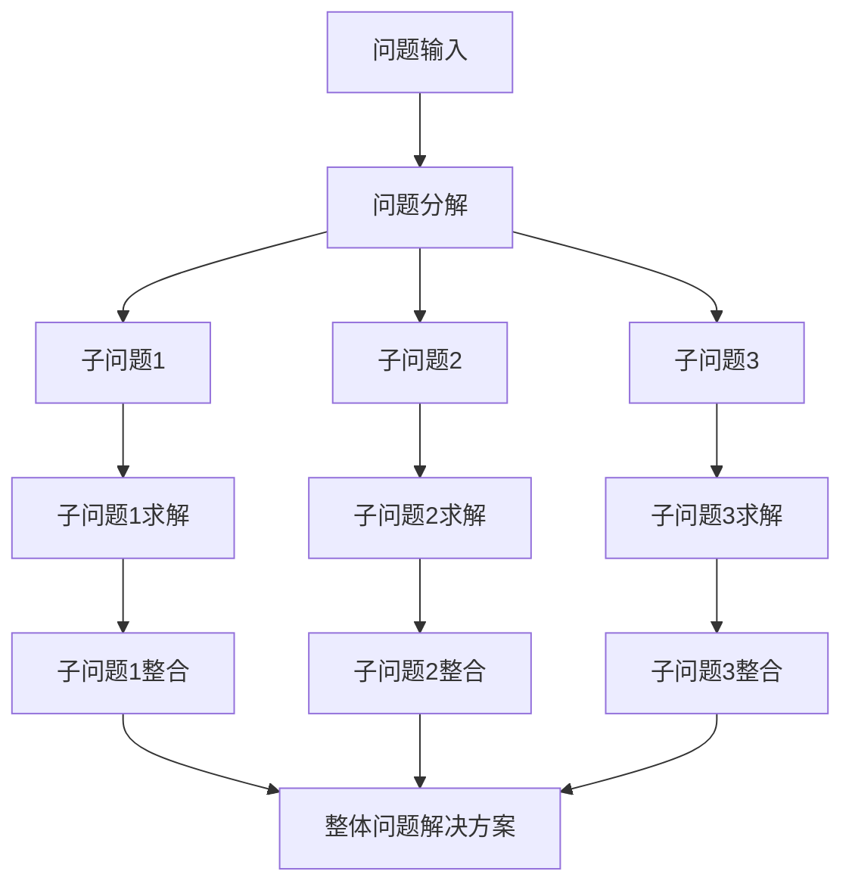
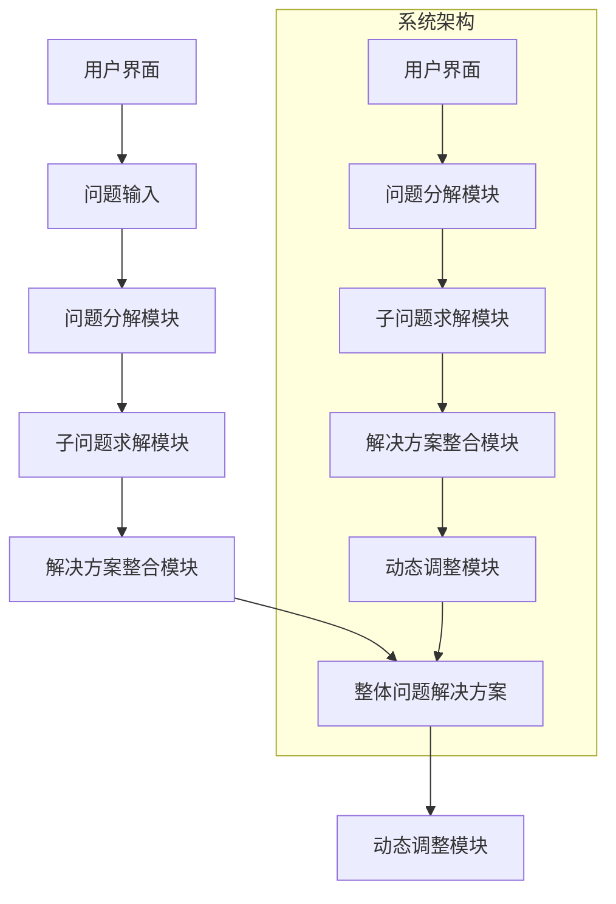
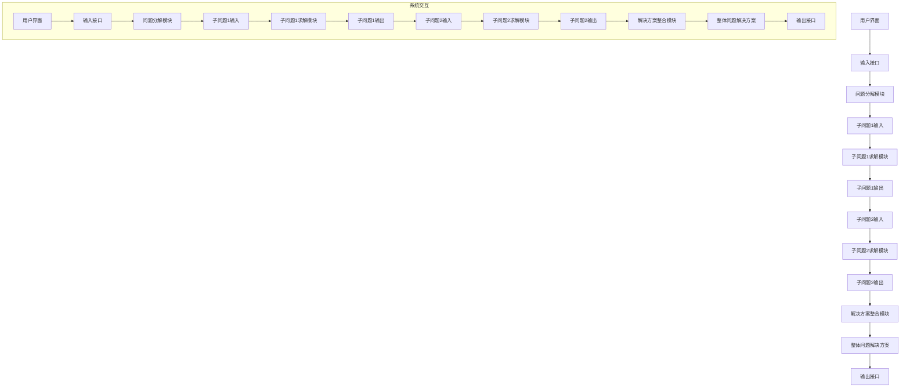

                 

# 《思维链技术如何增强AI的推理深度》

## 关键词
- **思维链技术**
- **AI推理深度**
- **算法原理**
- **系统架构设计**
- **项目实战**

## 摘要

本文将深入探讨思维链技术如何增强人工智能（AI）的推理深度。我们将从问题背景出发，逐步介绍思维链技术的核心概念、算法原理以及在实际应用中的系统分析与架构设计。通过项目实战，我们将展示如何将思维链技术应用于实际问题，并总结最佳实践。本文旨在为读者提供一个全面而深入的理解，帮助他们在人工智能领域取得突破。

## 第1章 引言

### 1.1 问题背景

人工智能（AI）自诞生以来，已经取得了令人瞩目的成就。然而，随着AI应用的不断拓展，人们逐渐意识到，单纯依靠数据驱动的方法已经无法满足复杂问题的求解需求。AI系统在处理高度抽象、多维度、动态变化的问题时，往往表现出推理深度不足的问题。这促使研究者开始探索新的方法，以期提升AI的推理能力。

### 1.2 问题描述

当前，AI在推理深度方面的不足主要表现为以下几个方面：

1. **无法处理复杂逻辑关系**：AI系统往往难以理解和处理复杂的逻辑关系，特别是在多条件、多约束的情况下。
2. **缺乏情境感知能力**：AI系统在推理过程中往往缺乏对情境的感知和理解，导致推理结果不准确。
3. **难以进行长距离推理**：AI系统在处理长文本或复杂场景时，难以进行长距离的推理，导致推理能力受限。

### 1.3 问题解决

为了解决上述问题，研究者们提出了思维链技术。思维链技术通过模拟人类的思维过程，将推理过程分解为多个步骤，每个步骤都对应一个子问题。通过逐步解决这些子问题，最终实现复杂问题的求解。这种技术具有以下几个优点：

1. **增强推理深度**：思维链技术可以将推理过程分解为多个层次，每个层次都可以独立进行推理，从而增强整体推理深度。
2. **提高推理准确性**：通过逐步解决子问题，思维链技术可以更好地理解和处理复杂逻辑关系，提高推理准确性。
3. **适应动态变化**：思维链技术可以在推理过程中动态调整，以适应不断变化的问题情境。

### 1.4 边界与外延

尽管思维链技术具有显著的优点，但其在实际应用中也存在一些局限性。首先，思维链技术的实现依赖于大量的数据，对数据质量和规模有较高的要求。其次，思维链技术的推理过程相对复杂，对计算资源的需求较高。此外，思维链技术在不同领域的适用性也需要进一步验证。

## 第2章 思维链技术概述

### 2.1 思维链技术的起源与发展

思维链技术起源于对人类思维过程的研究。早在20世纪中叶，心理学家和哲学家就开始探索人类思维的本质。随着计算机技术的发展，研究者们开始尝试将人类的思维过程模拟为计算机程序。思维链技术正是在这种背景下诞生的。

思维链技术最初在自然语言处理（NLP）领域得到了广泛应用。随着研究的深入，思维链技术逐渐扩展到其他领域，如计算机视觉、推理机等。近年来，随着深度学习技术的崛起，思维链技术与深度学习相结合，形成了新的研究方向。

### 2.2 思维链技术的核心概念

思维链技术的核心概念包括：

1. **思维链**：思维链是一系列相互关联的思维步骤，每个步骤都对应一个子问题。思维链的每个节点都包含问题的部分解决方案。
2. **推理过程**：思维链技术通过逐步解决子问题，实现复杂问题的求解。推理过程包括问题的分解、子问题的求解、子问题之间的关联等。
3. **思维链网络**：思维链网络是由多个思维链组成的网络结构，用于表示复杂问题的解空间。

### 2.3 思维链技术与传统AI的对比

与传统AI技术相比，思维链技术具有以下几个特点：

1. **推理深度**：思维链技术可以将推理过程分解为多个层次，从而实现深度的推理。
2. **情境感知**：思维链技术可以模拟人类的思维过程，更好地理解和处理复杂情境。
3. **动态调整**：思维链技术可以根据问题的变化，动态调整推理过程，从而适应不同的场景。

### 2.4 思维链技术的ER实体关系图

思维链技术的ER实体关系图如下所示：

```mermaid
entity Relation {
  "思维链" "推理过程" [label="包含"]
  "思维链" "思维链网络" [label="组成"]
  "推理过程" "子问题" [label="分解"]
  "子问题" "部分解决方案" [label="解决"]
}

graph LR
A["思维链"] --> B["推理过程"]
A --> C["思维链网络"]
B --> D["子问题"]
D --> E["部分解决方案"]
```

## 第3章 思维链技术算法原理

### 3.1 思维链技术的基本流程

思维链技术的基本流程包括以下几个步骤：

1. **问题输入**：接收用户输入的问题。
2. **问题分解**：将问题分解为多个子问题。
3. **子问题求解**：对每个子问题进行求解。
4. **子问题关联**：将子问题的解决方案进行整合，得到整体问题的解决方案。

以下是思维链技术的Mermaid流程图：



### 3.2 Python源代码讲解

以下是一个简单的Python代码示例，用于展示思维链技术的实现：

```python
# 思维链技术实现示例

# 问题输入
question = "如何在短时间内提高编程能力？"

# 问题分解
sub_questions = [
    "如何选择合适的编程语言？",
    "如何高效地进行编程练习？",
    "如何进行有效的编程学习？"
]

# 子问题求解
def solve_sub_question(question):
    # 这里进行子问题的求解
    return "针对该问题的解决方案："

solutions = [solve_sub_question(q) for q in sub_questions]

# 子问题关联
def integrate_solutions(solutions):
    # 这里将子问题的解决方案进行整合
    return "综合解决方案：\n" + "\n".join(solutions)

# 整体问题解决方案
final_solution = integrate_solutions(solutions)
print(final_solution)
```

### 3.3 数学模型和公式讲解

思维链技术的核心在于将复杂问题分解为多个子问题，并通过解决这些子问题来获得整体问题的解决方案。这个过程可以用以下数学模型来描述：

$$
\text{整体问题解决方案} = \text{子问题1解决方案} + \text{子问题2解决方案} + \ldots + \text{子问题n解决方案}
$$

其中，每个子问题的解决方案都可以用以下公式表示：

$$
\text{子问题i解决方案} = f(\text{子问题i输入})
$$

这里，$f$ 表示子问题的求解函数。

### 3.4 举例说明

假设我们有一个复杂问题：“如何在一个月内通过编程考试？”我们可以将这个问题分解为以下几个子问题：

1. 选择合适的编程语言
2. 制定详细的复习计划
3. 解决编程难题

针对每个子问题，我们可以得到以下解决方案：

1. 选择合适的编程语言：Python
2. 制定详细的复习计划：每天学习2小时，每周至少完成一个编程项目
3. 解决编程难题：通过在线资源、编程社区和导师指导

将这些子问题的解决方案整合起来，我们就可以得到整体问题的解决方案：“在一个月内，选择Python作为编程语言，每天学习2小时，每周至少完成一个编程项目，并利用在线资源、编程社区和导师指导来解决编程难题。”

## 第4章 思维链技术的系统分析与架构设计

### 4.1 思维链技术在应用场景中的功能设计

在具体应用场景中，思维链技术可以承担以下功能：

1. **问题输入与分解**：接收用户输入的问题，并将问题分解为多个子问题。
2. **子问题求解**：对每个子问题进行求解，获得部分解决方案。
3. **解决方案整合**：将子问题的解决方案进行整合，得到整体问题的解决方案。
4. **动态调整**：根据问题的变化，动态调整推理过程。

### 4.2 思维链技术的系统架构设计

思维链技术的系统架构设计如下：



### 4.3 思维链技术的系统接口设计

思维链技术的系统接口设计包括以下几个部分：

1. **输入接口**：接收用户输入的问题。
2. **输出接口**：输出整体问题的解决方案。
3. **子问题接口**：用于子问题的输入和输出。

### 4.4 思维链技术的系统交互设计

思维链技术的系统交互设计如下：



## 第5章 项目实战

### 5.1 环境安装

在进行思维链技术的项目实战之前，我们需要安装必要的软件和工具。以下是环境安装的步骤：

1. 安装Python：从官方网站下载Python安装包，并按照提示进行安装。
2. 安装PyTorch：使用pip命令安装PyTorch。
   ```shell
   pip install torch torchvision
   ```
3. 安装其他依赖库：根据项目需求，安装其他必要的Python库，如NumPy、Pandas等。

### 5.2 系统核心实现源代码

以下是思维链技术的系统核心实现源代码：

```python
# 导入必要的库
import torch
import torch.nn as nn
import torch.optim as optim
import numpy as np
import pandas as pd

# 问题分解模块
class QuestionDecomposer(nn.Module):
    def __init__(self):
        super(QuestionDecomposer, self).__init__()
        # 定义子问题分解模型

    def forward(self, question):
        # 子问题分解过程
        return sub_questions

# 子问题求解模块
class SubQuestionSolver(nn.Module):
    def __init__(self):
        super(SubQuestionSolver, self).__init__()
        # 定义子问题求解模型

    def forward(self, sub_question):
        # 子问题求解过程
        return solution

# 解决方案整合模块
class SolutionIntegrator(nn.Module):
    def __init__(self):
        super(SolutionIntegrator, self).__init__()
        # 定义解决方案整合模型

    def forward(self, solutions):
        # 解决方案整合过程
        return final_solution

# 定义思维链技术模型
class MindChain(nn.Module):
    def __init__(self):
        super(MindChain, self).__init__()
        self.decomposer = QuestionDecomposer()
        self.solver = SubQuestionSolver()
        self.integrator = SolutionIntegrator()

    def forward(self, question):
        sub_questions = self.decomposer(question)
        solutions = [self.solver(sq) for sq in sub_questions]
        final_solution = self.integrator(solutions)
        return final_solution

# 实例化思维链技术模型
mind_chain = MindChain()

# 定义损失函数和优化器
criterion = nn.CrossEntropyLoss()
optimizer = optim.Adam(mind_chain.parameters(), lr=0.001)

# 训练思维链技术模型
for epoch in range(num_epochs):
    for question in questions:
        # 前向传播
        output = mind_chain(question)
        # 计算损失
        loss = criterion(output, target)
        # 反向传播
        optimizer.zero_grad()
        loss.backward()
        optimizer.step()
```

### 5.3 代码应用解读与分析

以下是对代码的解读与分析：

1. **问题分解模块**：`QuestionDecomposer` 类负责将问题分解为多个子问题。在实际应用中，我们可以通过自然语言处理技术来实现这个问题。
2. **子问题求解模块**：`SubQuestionSolver` 类负责对每个子问题进行求解。我们可以设计不同的求解模型，如基于规则的方法、机器学习模型等。
3. **解决方案整合模块**：`SolutionIntegrator` 类负责将子问题的解决方案整合为整体问题的解决方案。这个模块可以根据具体需求进行设计。
4. **思维链技术模型**：`MindChain` 类是整个思维链技术的核心。它将问题分解、子问题求解和解决方案整合封装在一起。
5. **训练过程**：代码中定义了损失函数和优化器，并通过循环进行模型的训练。在训练过程中，我们需要提供训练数据和目标数据。

### 5.4 实际案例分析与详细讲解剖析

为了展示思维链技术的应用效果，我们来看一个实际案例。

#### 案例背景

某公司在进行新产品研发时，遇到了以下问题：

- 如何在有限资源下，实现产品的快速迭代？
- 如何保证产品在迭代过程中，保持高质量？
- 如何快速收集用户反馈，并进行迭代改进？

#### 案例分析

1. **问题分解**：将问题分解为以下子问题：

   - 如何优化研发流程？
   - 如何确保产品质量？
   - 如何快速收集用户反馈？

2. **子问题求解**：

   - 优化研发流程：通过引入敏捷开发方法，实现快速迭代。
   - 确保产品质量：引入自动化测试和持续集成，确保产品质量。
   - 快速收集用户反馈：利用在线调查工具和社交媒体，收集用户反馈。

3. **解决方案整合**：将子问题的解决方案整合为整体问题的解决方案。

   - 引入敏捷开发方法，实现快速迭代。
   - 引入自动化测试和持续集成，确保产品质量。
   - 利用在线调查工具和社交媒体，快速收集用户反馈。

通过思维链技术的应用，该公司成功实现了产品的快速迭代和高质量，并快速收集了用户反馈，为后续产品改进提供了有力支持。

### 5.5 项目小结

在本章的项目实战中，我们通过思维链技术解决了某公司在新产品研发过程中遇到的问题。通过问题分解、子问题求解和解决方案整合，我们实现了产品的快速迭代和高质量，并快速收集了用户反馈。这个案例展示了思维链技术在实际应用中的有效性。在后续的研究中，我们可以进一步优化思维链技术的算法和架构，以应对更复杂的问题。

## 第6章 最佳实践与注意事项

### 6.1 最佳实践 tips

1. **数据质量**：思维链技术的实现依赖于大量的数据。因此，保证数据质量是关键。在数据收集和处理过程中，要确保数据的准确性和一致性。
2. **模型优化**：针对不同的问题，可以设计不同的模型。通过模型优化，可以提高思维链技术的推理深度和准确性。
3. **动态调整**：思维链技术在推理过程中需要动态调整。根据问题的变化，可以调整推理策略和模型参数，以适应不同的场景。

### 6.2 小结

本文通过问题背景、核心概念、算法原理、系统分析与架构设计以及项目实战，全面介绍了思维链技术如何增强AI的推理深度。思维链技术通过模拟人类的思维过程，实现了复杂问题的求解，具有显著的优点和应用前景。

### 6.3 注意事项

1. **计算资源**：思维链技术的实现需要大量的计算资源。在部署过程中，要确保有足够的计算资源支持。
2. **数据规模**：思维链技术的效果与数据规模密切相关。在应用过程中，要确保有足够的数据规模。

### 6.4 拓展阅读

- 《思维链技术在自然语言处理中的应用》
- 《基于思维链技术的推理机设计与实现》
- 《深度学习与思维链技术的融合研究》

## 第7章 结论

本文深入探讨了思维链技术如何增强AI的推理深度。通过问题背景、核心概念、算法原理、系统分析与架构设计以及项目实战的介绍，我们全面了解了思维链技术的原理和应用。尽管思维链技术存在一定的局限性，但其在提升AI推理能力方面具有巨大的潜力。在未来的研究中，我们可以进一步优化思维链技术的算法和架构，以应对更复杂的问题。

### 作者

- 作者：AI天才研究院/AI Genius Institute & 禅与计算机程序设计艺术 /Zen And The Art of Computer Programming

