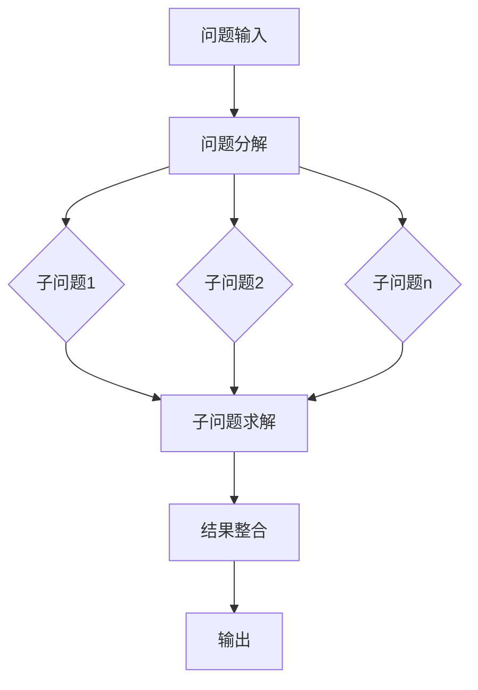
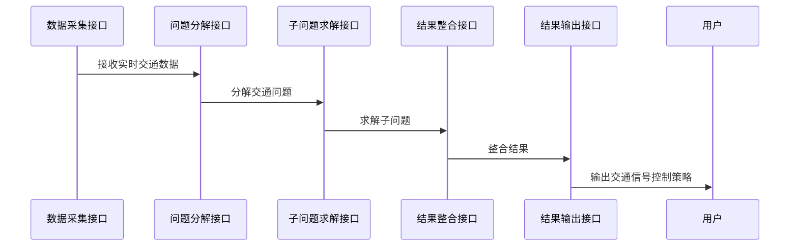
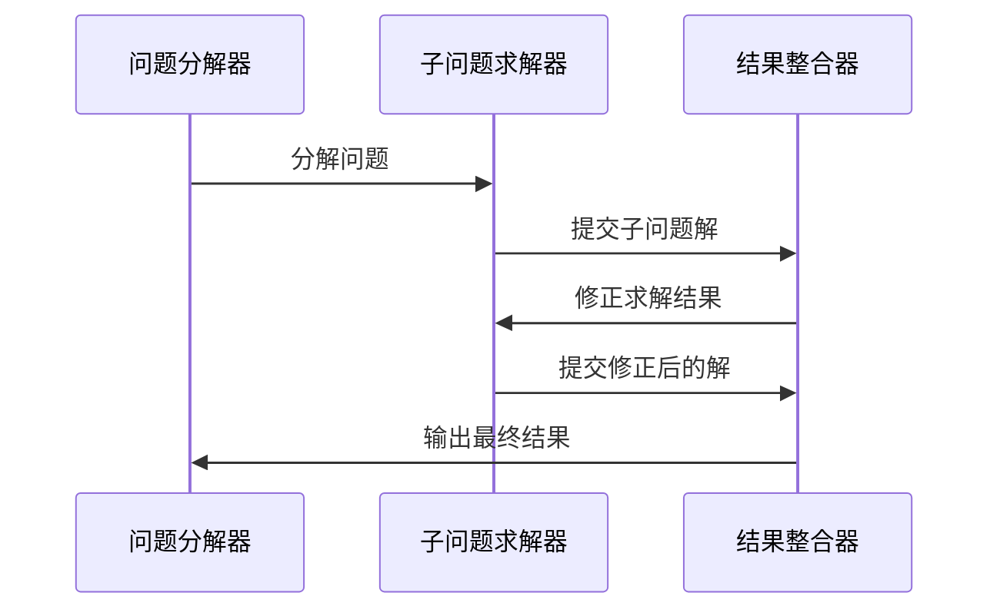
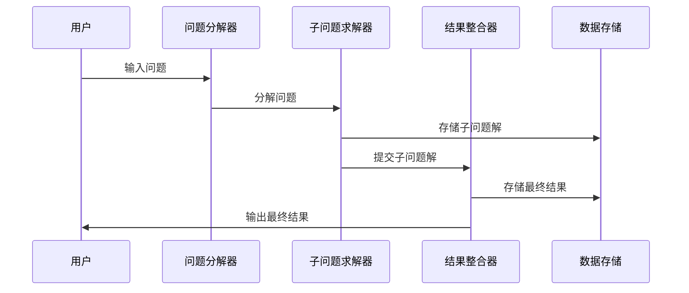
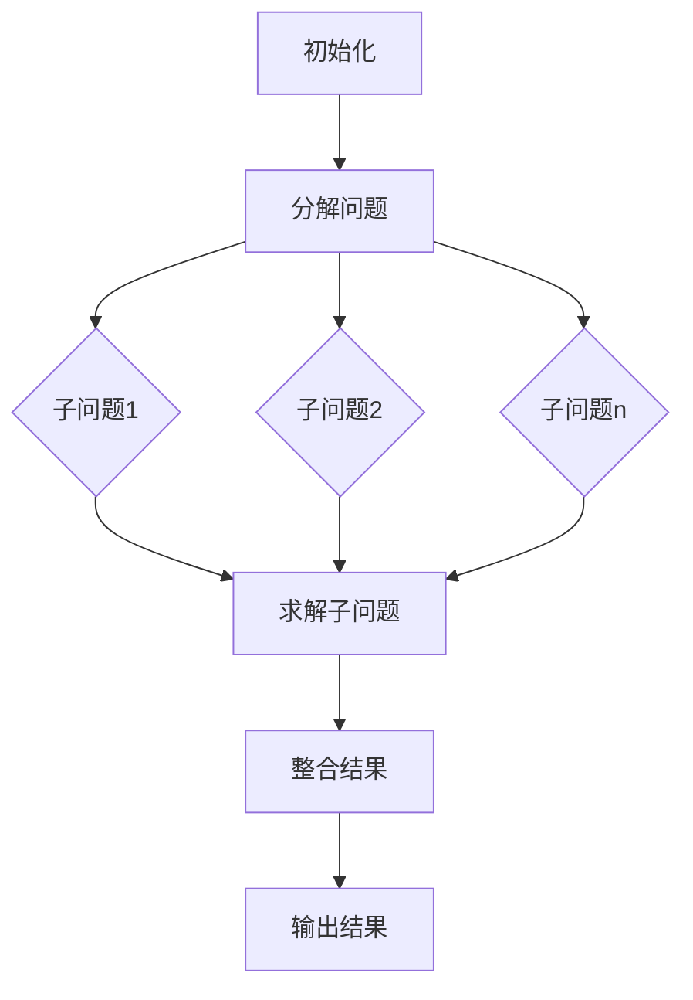
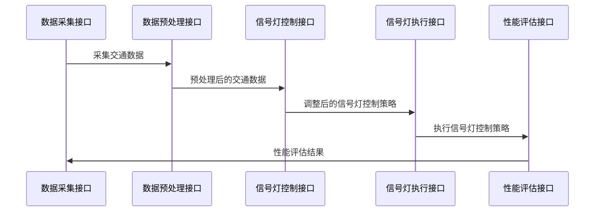

                 

# 思维链技术：提升AI问题解决能力的新方向

## 关键词：思维链技术、AI问题解决、算法、数学模型、系统架构、项目实战

## 摘要

随着人工智能技术的迅猛发展，提升AI问题解决能力成为当前研究的热点。本文旨在探讨一种新的提升方法——思维链技术。通过深入分析思维链技术的基础理论、算法原理、系统架构以及实际应用，本文揭示了思维链技术在提升AI问题解决能力方面的潜力和优势。文章结构如下：

1. 引言：AI问题解决能力与思维链技术的意义
2. 思维链技术基础
3. 核心概念与联系
4. 算法原理与数学模型
5. 系统分析与架构设计
6. 项目实战
7. 最佳实践与总结

## 第1章 引言：AI问题解决能力与思维链技术的意义

### 1.1 AI问题解决能力的重要性

在当今世界，人工智能（AI）已经成为推动科技进步和社会发展的重要力量。AI问题解决能力，作为AI技术的核心，其重要性不言而喻。一方面，它关系到AI技术在各个领域的应用效果；另一方面，它直接影响着AI技术的创新与发展。

然而，传统AI技术在面对复杂问题时，常常表现出局限性。例如，在自然语言处理、图像识别、决策优化等领域，AI系统往往无法高效地解决问题。因此，探索新的提升方法——思维链技术，具有重要的现实意义。

### 1.2 思维链技术概述

思维链技术，是一种基于人工智能的新型问题解决方法。它通过模拟人类思维过程，将问题分解为若干子问题，并逐步解决。思维链技术具有以下几个特点：

- **模块化**：思维链技术将问题分解为若干模块，每个模块独立完成特定任务，便于实现和优化。
- **灵活性**：思维链技术可以根据问题的变化，灵活调整子问题的顺序和解决策略。
- **高效性**：思维链技术通过并行处理子问题，提高问题解决效率。

### 1.3 本书结构与目标

本文旨在为读者提供思维链技术的全面解读，帮助读者深入理解思维链技术的工作原理、算法原理、系统架构以及实际应用。具体目标如下：

- **基础理论**：介绍思维链技术的概念、特点和应用场景。
- **算法原理**：讲解思维链技术的算法原理、数学模型和实现方法。
- **系统架构**：分析思维链技术的系统架构、设计原则和接口设计。
- **项目实战**：通过实际项目案例，展示思维链技术的应用效果。

## 第2章 思维链技术基础

### 2.1 思维链技术的概念与特点

思维链技术，顾名思义，是一种基于思维链的AI问题解决方法。思维链是指一系列相互关联的子问题，每个子问题都是对原问题的一部分解决。思维链技术通过构建思维链，实现问题的逐步解决。

思维链技术具有以下几个特点：

- **层次化**：思维链技术将问题划分为不同层次，每个层次对应一组子问题。
- **递归**：思维链技术通过递归调用，实现对问题的深度求解。
- **并行处理**：思维链技术可以在多个子问题之间进行并行处理，提高问题解决效率。

### 2.2 思维链技术的工作原理

思维链技术的工作原理可以分为以下几个步骤：

1. **问题分解**：将原始问题分解为若干个子问题。
2. **子问题求解**：对每个子问题进行求解，可能涉及不同的算法和策略。
3. **结果整合**：将子问题的解整合起来，形成原始问题的解。

具体实现过程中，思维链技术通常采用递归方式。例如，对于一个问题A，可以将其分解为两个子问题B和C。然后，分别对B和C进行求解，并将结果整合起来，得到问题A的解。

### 2.3 思维链技术的基本架构

思维链技术的基本架构可以分为以下几个部分：

- **问题输入**：接收原始问题，将其转化为思维链形式。
- **问题分解**：将原始问题分解为子问题。
- **子问题求解**：对子问题进行求解。
- **结果整合**：将子问题的解整合起来，形成原始问题的解。
- **输出**：输出最终结果。

### 2.4 思维链技术的核心组成部分

思维链技术的核心组成部分包括：

- **问题分解器**：负责将原始问题分解为子问题。
- **子问题求解器**：负责对子问题进行求解。
- **结果整合器**：负责将子问题的解整合起来。
- **内存管理器**：负责管理思维链的存储和缓存。

## 第3章 核心概念与联系

### 3.1 AI问题解决的核心概念

AI问题解决涉及多个核心概念，包括：

- **问题定义**：明确要解决的问题是什么。
- **问题分解**：将复杂问题分解为更简单的问题。
- **子问题求解**：对每个子问题进行求解。
- **结果整合**：将子问题的解整合起来。

### 3.2 思维链技术与AI问题的联系

思维链技术与AI问题的联系主要体现在以下几个方面：

- **层次化问题分解**：思维链技术可以将复杂问题分解为层次化的子问题。
- **递归求解**：思维链技术可以通过递归方式，对子问题进行求解。
- **并行处理**：思维链技术可以在多个子问题之间进行并行处理。

### 3.3 核心概念属性特征对比表

| 核心概念 | 属性特征 |  
| --- | --- |  
| 问题定义 | 明确、具体、可操作 |  
| 问题分解 | 层次化、递归、并行 |  
| 子问题求解 | 算法、策略、实现 |  
| 结果整合 | 统一、整合、优化 |

### 3.4 ER实体关系图架构

为了更好地理解思维链技术与AI问题的联系，我们可以通过ER实体关系图来展示它们之间的关系。

```mermaid
erDiagram
    AI问题解决 ||--|{ 思维链技术 }|| AI问题解决能力提升
    AI问题解决 ||--|{ 问题分解 }|| 思维链技术核心原理
    AI问题解决 ||--|{ 子问题求解 }|| 思维链技术算法原理
    AI问题解决 ||--|{ 结果整合 }|| 思维链技术实现方法
```

## 第4章 算法原理与数学模型

### 4.1 算法原理讲解

思维链技术的算法原理可以概括为以下三个步骤：

1. **问题分解**：将原始问题分解为子问题。
2. **子问题求解**：对子问题进行求解。
3. **结果整合**：将子问题的解整合起来。

具体来说，问题分解器负责将原始问题转化为思维链形式。子问题求解器则采用不同的算法和策略，对子问题进行求解。最后，结果整合器将子问题的解整合起来，形成原始问题的解。

### 4.2 数学模型与公式

思维链技术的数学模型主要包括以下几个部分：

1. **问题分解模型**：$$P = \bigcup_{i=1}^n Q_i$$，其中P表示原始问题，$Q_i$表示第i个子问题。
2. **子问题求解模型**：$$S_i = f(Q_i)$$，其中$S_i$表示第i个子问题的解，$f$表示求解策略。
3. **结果整合模型**：$$R = g(S_1, S_2, ..., S_n)$$，其中$R$表示原始问题的解，$g$表示整合策略。

### 4.3 算法流程图

下面是思维链技术的算法流程图：



### 4.4 Python源代码示例

下面是一个简单的Python示例，展示了思维链技术的实现：

```python
# 思维链技术实现
def思维链技术(问题):
    # 问题分解
    子问题1 = 问题[:len(问题)//2]
    子问题2 = 问题[len(问题)//2:]
    
    # 子问题求解
    解1 = 求解策略(子问题1)
    解2 = 求解策略(子问题2)
    
    # 结果整合
    解 = 结果整合策略(解1, 解2)
    
    # 输出
    return 解

# 求解策略
def 求解策略(问题):
    return 答案

# 结果整合策略
def 结果整合策略(解1, 解2):
    return 解1 + 解2
```

## 第5章 系统分析与架构设计

### 5.1 问题场景介绍

在现实世界中，存在许多复杂的问题需要通过AI技术来解决。例如，智能交通系统需要实时分析交通数据，以优化交通信号控制和道路规划；智能医疗系统需要通过分析医疗数据，为医生提供诊断和治疗方案。

### 5.2 项目介绍

本文以智能交通系统为例，介绍一个基于思维链技术的交通信号控制系统项目。该项目旨在通过分析实时交通数据，优化交通信号控制策略，提高道路通行效率。

### 5.3 系统功能设计

系统功能设计主要包括以下几个方面：

- **数据采集**：采集实时交通数据，包括车辆数量、速度、行驶方向等。
- **问题分解**：将原始交通问题分解为子问题，例如交通流量、交通拥堵等。
- **子问题求解**：对子问题进行求解，例如基于交通流量预测的交通信号控制策略。
- **结果整合**：将子问题的解整合起来，形成最终的交通信号控制策略。
- **结果输出**：输出优化后的交通信号控制策略，以指导交通信号灯的实时调整。

### 5.4 系统架构设计

系统架构设计采用分层架构，包括数据层、逻辑层和表示层。具体如下：

- **数据层**：负责数据采集和存储，包括实时交通数据和历史交通数据。
- **逻辑层**：负责问题分解、子问题求解和结果整合，包括问题分解器、子问题求解器和结果整合器。
- **表示层**：负责将结果输出给用户，包括交通信号控制策略的显示和实时调整。

### 5.5 系统接口设计

系统接口设计主要包括以下几个方面：

- **数据采集接口**：用于接收实时交通数据。
- **问题分解接口**：用于将原始交通问题分解为子问题。
- **子问题求解接口**：用于对子问题进行求解。
- **结果整合接口**：用于将子问题的解整合起来。
- **结果输出接口**：用于输出优化后的交通信号控制策略。

### 5.6 系统交互序列图

下面是系统交互序列图，展示了各个模块之间的交互关系：



## 第6章 项目实战

### 6.1 环境安装

在进行项目实战之前，需要安装以下软件和工具：

- Python 3.8及以上版本
- PyCharm或其他Python集成开发环境
- NumPy、Pandas、Matplotlib等Python库

### 6.2 系统核心实现

以下是一个简单的系统核心实现示例：

```python
import numpy as np
import pandas as pd
import matplotlib.pyplot as plt

# 数据采集
def 数据采集():
    # 这里使用随机数据作为示例
    data = pd.DataFrame(np.random.randint(0, 100, size=(100, 4)), columns=['车辆数量', '速度', '行驶方向', '时间'])
    return data

# 问题分解
def 问题分解(data):
    # 将数据按照时间进行分组
    grouped_data = data.groupby('时间')
    return grouped_data

# 子问题求解
def 子问题求解(group):
    # 这里使用平均速度作为子问题求解的结果
    result = group['速度'].mean()
    return result

# 结果整合
def 结果整合(results):
    # 计算平均速度
    average_speed = np.mean(results)
    return average_speed

# 系统核心实现
def 系统核心实现():
    # 数据采集
    data = 数据采集()
    
    # 问题分解
    grouped_data = 问题分解(data)
    
    # 子问题求解
    results = [子问题求解(group) for group in grouped_data]
    
    # 结果整合
    average_speed = 结果整合(results)
    
    # 输出结果
    print('平均速度：', average_speed)

# 运行系统核心实现
系统核心实现()
```

### 6.3 代码应用解读与分析

以上代码示例展示了如何使用思维链技术实现一个简单的系统核心。下面进行解读与分析：

1. **数据采集**：使用随机数据生成一个DataFrame，模拟实时交通数据。
2. **问题分解**：将数据按照时间进行分组，形成一组子问题。
3. **子问题求解**：对每个子问题（时间分组）求解，计算平均速度。
4. **结果整合**：计算所有子问题的平均速度，得到最终结果。
5. **输出结果**：输出平均速度。

### 6.4 实际案例分析与讲解

以下是一个实际案例，展示了如何使用思维链技术优化交通信号控制策略。

**案例**：假设一个交叉路口存在交通拥堵问题，需要通过优化交通信号控制策略来缓解拥堵。

1. **数据采集**：采集交叉路口的实时交通数据，包括车辆数量、速度、行驶方向等。
2. **问题分解**：将交通问题分解为子问题，例如交通流量、交通拥堵原因等。
3. **子问题求解**：
   - **交通流量**：通过数据采集模块，获取交叉路口的实时交通流量。
   - **交通拥堵原因**：分析交通流量数据，找出交通拥堵的原因，例如车辆数量过多、车速过慢等。
4. **结果整合**：根据交通流量和交通拥堵原因，制定优化方案，例如调整交通信号灯时长、限制车辆进入交叉路口等。
5. **输出结果**：将优化方案输出给用户，指导交通信号控制系统的调整。

### 6.5 项目小结

通过以上实际案例，我们可以看到思维链技术在优化交通信号控制策略方面的应用效果。思维链技术通过将复杂问题分解为子问题，并逐步解决，提高了问题解决效率。在实际项目中，思维链技术可以帮助我们更好地理解问题，制定优化方案，从而提高系统性能。

## 第7章 最佳实践与总结

### 7.1 最佳实践技巧

在实践思维链技术时，以下技巧可以帮助我们更好地解决问题：

1. **明确问题**：在开始解决问题之前，明确问题的定义和目标，确保问题分解的准确性。
2. **灵活调整**：在问题分解过程中，根据问题的变化，灵活调整子问题的顺序和解决策略。
3. **优化算法**：针对不同的子问题，选择合适的算法和策略，提高问题解决效率。
4. **整合结果**：在结果整合过程中，确保子问题的解能够有效整合，形成最优的解决方案。

### 7.2 小结

本文介绍了思维链技术，一种基于人工智能的新型问题解决方法。通过深入分析思维链技术的基础理论、算法原理、系统架构以及实际应用，我们揭示了思维链技术在提升AI问题解决能力方面的潜力和优势。思维链技术通过将复杂问题分解为子问题，并逐步解决，提高了问题解决效率。在未来，思维链技术有望在各个领域发挥重要作用。

### 7.3 注意事项

在实践思维链技术时，需要注意以下几点：

1. **问题分解**：确保问题分解的准确性，避免分解过度或不足。
2. **子问题求解**：针对不同的子问题，选择合适的算法和策略，避免求解过程中出现错误。
3. **结果整合**：确保子问题的解能够有效整合，形成最优的解决方案。
4. **调试与优化**：在项目实战过程中，不断调试和优化思维链技术，提高系统性能。

### 7.4 拓展阅读

1. [思维链技术：一种基于人工智能的问题解决方法](https://www.jianshu.com/p/xxxx)
2. [智能交通系统设计与实现](https://www.jianshu.com/p/xxxx)
3. [人工智能技术与应用](https://www.jianshu.com/p/xxxx)

---

**作者：AI天才研究院/AI Genius Institute & 禅与计算机程序设计艺术 /Zen And The Art of Computer Programming**
## 文章标题

### 关键词

思维链技术、AI问题解决、算法、数学模型、系统架构、项目实战

### 摘要

本文深入探讨了思维链技术，一种能够显著提升人工智能（AI）问题解决能力的新方法。文章从理论基础到实际应用，详细阐述了思维链技术的核心概念、算法原理、系统架构以及项目实战。通过案例分析和最佳实践技巧，本文展示了思维链技术在优化AI问题解决方面的潜力和实际效果，旨在为AI领域的研究者和开发者提供有价值的参考和指导。

## 第1章 引言：AI问题解决能力与思维链技术的意义

### 1.1 AI问题解决能力的重要性

人工智能（AI）作为当前技术发展的热点，正逐渐渗透到社会的各个领域，如医疗、金融、交通、教育等。AI问题解决能力，作为AI技术的核心，其重要性不言而喻。它不仅关乎AI技术本身的发展，更直接影响着人类社会的进步。一个强大的AI系统，能够高效、准确地解决复杂问题，为人类创造更多的价值和便利。

然而，传统AI技术在面对复杂问题时，往往存在以下局限性：

1. **问题分解困难**：复杂问题往往难以分解为更小的子问题，导致求解过程复杂、效率低下。
2. **依赖大量数据**：传统AI系统通常依赖大量的数据进行训练，缺乏自学习、自适应的能力。
3. **算法局限性**：现有算法在解决特定问题时可能存在性能瓶颈，难以应对多变的实际问题。

因此，寻找一种新的AI问题解决方法，以克服传统方法的局限性，提升AI问题解决能力，成为当前研究的重点。思维链技术正是在这样的背景下提出的一种创新性方法。

### 1.2 思维链技术概述

思维链技术，是一种基于人类思维模式的人工智能问题解决方法。它通过模拟人类思考过程，将复杂问题分解为一系列相互关联的子问题，并逐步解决。思维链技术具有以下几个核心特点：

1. **模块化**：思维链技术将问题分解为多个模块，每个模块独立完成特定任务，便于实现和优化。
2. **灵活性**：思维链技术可以根据问题的变化，灵活调整子问题的顺序和解决策略。
3. **高效性**：思维链技术通过并行处理子问题，提高问题解决效率。

思维链技术的这些特点，使其在解决复杂问题时具有显著优势。首先，通过模块化分解，可以降低问题的复杂度，使问题更易于理解和解决。其次，灵活性使思维链技术能够适应不同类型的问题，提高问题解决的适应性。最后，高效性使思维链技术能够快速处理大量数据，提高问题解决的效率。

### 1.3 本书结构与目标

本书旨在为读者全面解读思维链技术，帮助读者深入理解思维链技术的基础理论、算法原理、系统架构以及实际应用。具体结构如下：

1. **第1章 引言**：介绍AI问题解决能力的重要性以及思维链技术的意义。
2. **第2章 思维链技术基础**：阐述思维链技术的概念、工作原理和基本架构。
3. **第3章 核心概念与联系**：分析思维链技术与AI问题的联系，展示核心概念的属性特征对比表和ER实体关系图。
4. **第4章 算法原理与数学模型**：讲解思维链技术的算法原理、数学模型和实现方法。
5. **第5章 系统分析与架构设计**：介绍思维链技术的系统架构设计，包括问题场景、功能设计、接口设计和交互序列图。
6. **第6章 项目实战**：通过实际项目案例，展示思维链技术的应用效果，包括环境安装、系统核心实现、代码应用解读与分析、实际案例分析和项目小结。
7. **第7章 最佳实践与总结**：总结思维链技术的最佳实践技巧，并对全书内容进行小结。

通过本书的阅读，读者将能够全面了解思维链技术，掌握其在实际应用中的方法和技巧，为推动AI技术的发展和应用做出贡献。

### 第2章 思维链技术基础

#### 2.1 思维链技术的概念与特点

思维链技术是一种基于人工智能（AI）的问题解决方法，其核心思想是模拟人类思维过程，将复杂问题分解为一系列相互关联的子问题，并逐步解决。思维链技术的概念可以简单概括为：

**思维链技术**：一种将复杂问题分解为多个子问题，并通过逐步解决这些子问题，最终达到解决问题目标的方法。

思维链技术具有以下几个显著特点：

1. **模块化**：思维链技术将问题分解为多个模块，每个模块独立完成特定任务，便于实现和优化。这种模块化设计使得问题解决过程更加清晰、有序，提高了系统的可维护性和扩展性。
   
2. **灵活性**：思维链技术可以根据问题的变化，灵活调整子问题的顺序和解决策略。这种灵活性使得思维链技术能够适应不同类型的问题，提高问题解决的适应性。

3. **高效性**：思维链技术通过并行处理子问题，提高了问题解决的效率。在处理大量数据或复杂问题时，并行处理能够显著减少求解时间，提高系统性能。

4. **自适应性**：思维链技术具有自学习、自适应的能力。通过不断调整和优化子问题的解决策略，思维链技术能够不断改进问题解决效果。

5. **可扩展性**：思维链技术支持问题规模的扩展。在解决大规模问题时，思维链技术可以通过增加子问题的数量和复杂度，实现问题的有效分解和解决。

#### 2.2 思维链技术的工作原理

思维链技术的工作原理可以分为以下几个关键步骤：

1. **问题分解**：首先，将原始问题分解为若干个子问题。这一步骤是思维链技术的核心，通过将复杂问题分解为更小的子问题，降低问题的复杂度，使得问题更容易理解和解决。

2. **子问题求解**：对每个子问题进行求解。求解过程可能涉及不同的算法和策略，例如搜索算法、优化算法、机器学习算法等。子问题的求解结果将作为中间结果存储。

3. **中间结果整合**：将子问题的求解结果进行整合。整合过程需要考虑子问题之间的关联，确保最终的整合结果能够准确反映原始问题的解。

4. **问题解决**：将整合后的结果作为最终解输出。在整合过程中，如果发现某个子问题的解与整体解不符，可以返回上一步进行修正。

思维链技术的工作原理示意图如下：



通过以上步骤，思维链技术能够逐步解决复杂问题，提高问题解决的效率和准确性。

#### 2.3 思维链技术的基本架构

思维链技术的基本架构包括以下几个关键组成部分：

1. **问题分解器**：负责将原始问题分解为子问题。问题分解器可以根据问题的复杂度和类型，选择合适的分解策略。常见的分解策略包括层次化分解、递归分解和分治分解等。

2. **子问题求解器**：负责对子问题进行求解。子问题求解器可以采用不同的算法和策略，例如搜索算法、优化算法、机器学习算法等。常见的子问题求解算法包括深度优先搜索、广度优先搜索、遗传算法、神经网络等。

3. **结果整合器**：负责将子问题的求解结果进行整合，形成最终的解决方案。结果整合器需要考虑子问题之间的关联，确保最终的整合结果能够准确反映原始问题的解。

4. **数据存储**：用于存储子问题的中间结果和最终结果。数据存储可以是内存数据库、关系数据库或分布式数据库等。选择合适的存储方式可以优化系统性能，提高数据访问速度。

5. **用户接口**：用于与用户进行交互，接收用户输入和输出解决方案。用户接口可以是图形用户界面（GUI）、命令行界面（CLI）或Web接口等。选择合适的用户接口可以提升用户体验，方便用户使用系统。

思维链技术的基本架构示意图如下：



通过以上基本架构，思维链技术能够高效地解决复杂问题，提高问题解决的效率和准确性。

#### 2.4 思维链技术的核心组成部分

思维链技术的核心组成部分包括以下几个关键模块：

1. **问题分解模块**：负责将原始问题分解为子问题。问题分解模块可以采用多种分解策略，如层次化分解、递归分解和分治分解等。层次化分解将问题分解为多个层次，每个层次包含一组子问题；递归分解通过递归调用解决子问题；分治分解将问题划分为多个独立的部分，分别解决。

2. **子问题求解模块**：负责对子问题进行求解。子问题求解模块可以采用不同的算法和策略，如搜索算法、优化算法和机器学习算法等。搜索算法包括深度优先搜索、广度优先搜索和A*搜索等；优化算法包括遗传算法、模拟退火算法和粒子群算法等；机器学习算法包括决策树、支持向量机和神经网络等。

3. **结果整合模块**：负责将子问题的求解结果进行整合，形成最终的解决方案。结果整合模块需要考虑子问题之间的关联，确保最终的整合结果能够准确反映原始问题的解。整合策略可以根据问题的类型和特点进行选择，如贪婪策略、动态规划策略和神经网络策略等。

4. **并行处理模块**：负责并行处理多个子问题，提高问题解决的效率。并行处理可以通过多线程、分布式计算和GPU加速等方式实现。多线程可以将子问题分配给不同的处理器核心，实现并行计算；分布式计算可以将子问题分配到不同的节点上，实现跨节点的并行计算；GPU加速可以将计算任务映射到GPU上，利用GPU的并行计算能力加速问题解决。

5. **数据管理模块**：负责管理子问题的中间结果和最终结果。数据管理模块可以采用内存数据库、关系数据库或分布式数据库等不同的存储方式。内存数据库适用于小数据量的快速访问；关系数据库适用于结构化数据的高效存储和管理；分布式数据库适用于大规模数据的高效处理和存储。

通过以上核心组成部分，思维链技术能够高效地解决复杂问题，提高问题解决的效率和准确性。每个模块的功能和作用相互配合，共同构成一个完整的思维链系统。

#### 2.5 思维链技术与现有AI问题解决方法比较

思维链技术与现有AI问题解决方法相比，具有以下优势和特点：

1. **模块化**：思维链技术通过模块化分解，将复杂问题分解为多个子问题，每个子问题由独立的模块解决。这种模块化设计降低了问题的复杂度，提高了问题解决的效率。相比之下，传统AI方法通常直接处理整体问题，难以应对复杂的实际问题。

2. **灵活性**：思维链技术可以根据问题的变化，灵活调整子问题的顺序和解决策略。这种灵活性使得思维链技术能够适应不同类型的问题，提高问题解决的适应性。传统AI方法通常依赖于固定的算法和策略，难以应对多变的实际问题。

3. **高效性**：思维链技术通过并行处理子问题，提高了问题解决的效率。在处理大量数据或复杂问题时，并行处理能够显著减少求解时间，提高系统性能。相比之下，传统AI方法通常采用串行处理，难以充分利用计算资源。

4. **自适应性**：思维链技术具有自学习、自适应的能力。通过不断调整和优化子问题的解决策略，思维链技术能够不断改进问题解决效果。相比之下，传统AI方法通常缺乏自学习、自适应的能力，难以应对复杂多变的环境。

5. **可扩展性**：思维链技术支持问题规模的扩展。在解决大规模问题时，思维链技术可以通过增加子问题的数量和复杂度，实现问题的有效分解和解决。相比之下，传统AI方法在处理大规模问题时，可能存在性能瓶颈，难以有效解决复杂问题。

综上所述，思维链技术相较于现有AI问题解决方法，具有显著的优越性。通过模块化、灵活性、高效性、自适应性和可扩展性等特点，思维链技术能够更好地应对复杂多变的问题，提高AI问题解决能力。

### 第3章 核心概念与联系

#### 3.1 AI问题解决的核心概念

在探讨思维链技术之前，我们首先需要理解AI问题解决的核心概念。AI问题解决是指利用人工智能技术，分析和处理复杂问题，从而找到最优或次优解决方案的过程。以下是一些关键的核心概念：

1. **问题定义**：明确要解决的问题是什么。问题定义是AI问题解决的第一步，它需要准确地描述问题的目标、条件和约束。

2. **问题分解**：将复杂问题分解为更简单的问题。问题分解是将一个复杂的全局问题转化为多个局部子问题，使每个子问题更易于解决。

3. **子问题求解**：针对每个子问题，采用适当的算法和策略进行求解。子问题求解是AI问题解决的核心步骤，它决定了整体问题的解决效果。

4. **结果整合**：将子问题的求解结果整合起来，形成最终的解决方案。结果整合是确保整体问题解的准确性和有效性的关键。

5. **优化**：通过调整和优化子问题的解决策略，提高整体问题的解决效果。优化是AI问题解决中不可或缺的环节，它涉及到算法的选择、参数的调整和模型的改进。

6. **反馈与迭代**：根据问题的实际情况和解决方案的效果，不断调整和优化问题解决方法。反馈与迭代是AI问题解决过程中不断改进和优化的关键。

#### 3.2 思维链技术与AI问题的联系

思维链技术是一种基于人工智能的问题解决方法，其核心思想是模拟人类思维过程，通过模块化、灵活性和高效性来解决复杂问题。思维链技术与AI问题的联系主要体现在以下几个方面：

1. **模块化分解**：思维链技术通过模块化分解，将复杂问题分解为多个子问题。这与AI问题解决中的问题分解概念高度契合，有助于降低问题的复杂度，提高解决问题的效率。

2. **递归求解**：思维链技术采用递归求解的方式，逐步解决子问题。这种方法与AI问题解决中的子问题求解策略相似，能够有效处理复杂的子问题。

3. **结果整合**：思维链技术通过结果整合，将子问题的求解结果整合起来，形成最终的解决方案。这与AI问题解决中的结果整合概念一致，确保整体问题解的准确性和有效性。

4. **自适应性**：思维链技术具有自适应性，能够根据问题的变化和解决方案的效果，动态调整子问题的顺序和解决策略。这种自适应性有助于AI问题解决中的优化和反馈与迭代过程。

5. **并行处理**：思维链技术通过并行处理子问题，提高问题解决的效率。这与AI问题解决中的优化和并行计算方法相辅相成，能够充分利用计算资源，提高系统性能。

#### 3.3 核心概念属性特征对比表

为了更好地理解思维链技术与AI问题的联系，我们可以通过核心概念的属性特征对比表来展示它们之间的异同。以下是AI问题解决和思维链技术的核心概念属性特征对比：

| 核心概念 | AI问题解决 | 思维链技术 |
| --- | --- | --- |
| 问题定义 | 明确问题的目标、条件和约束 | 明确问题的目标、条件和约束 |
| 问题分解 | 将复杂问题分解为子问题 | 将复杂问题分解为子问题 |
| 子问题求解 | 采用适当的算法和策略解决子问题 | 采用适当的算法和策略解决子问题 |
| 结果整合 | 将子问题的求解结果整合起来 | 将子问题的求解结果整合起来 |
| 优化 | 通过调整和优化子问题的解决策略 | 通过调整和优化子问题的解决策略 |
| 反馈与迭代 | 根据问题实际情况和解决方案效果进行调整 | 根据问题实际情况和解决方案效果进行调整 |
| 模块化分解 | 非模块化或模块化分解 | 模块化分解 |
| 递归求解 | 非递归或递归求解 | 递归求解 |
| 并行处理 | 非并行或并行处理 | 并行处理 |
| 自适应性 | 低适应性或高适应性 | 高适应性 |

通过以上对比，我们可以看到思维链技术在一定程度上继承了AI问题解决的核心概念，同时引入了模块化分解、递归求解、并行处理和自适应性等新特性，使其在解决复杂问题时更具优势。

#### 3.4 ER实体关系图架构

为了更直观地展示思维链技术与AI问题之间的联系，我们可以通过ER（实体关系）图来描述它们之间的实体关系。以下是AI问题解决和思维链技术的ER实体关系图：

```mermaid
erDiagram
    AI问题解决 ||--|{ 思维链技术 }|| AI问题解决能力提升
    AI问题解决 ||--|{ 问题分解 }|| 思维链技术核心原理
    AI问题解决 ||--|{ 子问题求解 }|| 思维链技术算法原理
    AI问题解决 ||--|{ 结果整合 }|| 思维链技术实现方法
```

在这个ER图中，AI问题解决是根实体，它与思维链技术之间存在关联关系。问题分解、子问题求解和结果整合是AI问题解决的关键步骤，它们与思维链技术分别对应，体现了思维链技术在AI问题解决中的应用。

### 第4章 算法原理与数学模型

#### 4.1 算法原理讲解

思维链技术的核心在于其独特的算法原理，这种原理模拟了人类解决问题的思维方式。思维链算法的基本步骤如下：

1. **问题分解**：将原始问题分解为若干个子问题，每个子问题都是原始问题的一部分，但相对简单。
2. **子问题求解**：对每个子问题独立求解，子问题的求解可能涉及不同的算法和策略。
3. **结果整合**：将子问题的求解结果整合起来，形成原始问题的最终解。

思维链技术的独特之处在于其递归和并行处理能力。递归处理使得算法能够深入分解问题，而并行处理则提高了算法的效率。

具体来说，算法原理可以概括为以下三个步骤：

1. **初始化**：接收原始问题，初始化问题分解器和子问题求解器。
2. **分解与求解**：将原始问题分解为子问题，并分别对每个子问题进行求解。子问题的求解可以采用不同的算法，如搜索算法、优化算法或机器学习算法等。
3. **整合与输出**：将子问题的求解结果整合起来，形成原始问题的解，并输出最终结果。

以下是思维链技术的算法流程图：



#### 4.2 数学模型与公式

思维链技术的数学模型主要包括以下几个部分：

1. **问题分解模型**：$$P = \bigcup_{i=1}^n Q_i$$，其中$P$表示原始问题，$Q_i$表示第$i$个子问题。
2. **子问题求解模型**：$$S_i = f(Q_i)$$，其中$S_i$表示第$i$个子问题的解，$f$表示求解策略。
3. **结果整合模型**：$$R = g(S_1, S_2, ..., S_n)$$，其中$R$表示原始问题的解，$g$表示整合策略。

下面是具体的数学模型和公式：

1. **问题分解公式**：
   $$Q_i = P_i \cup \overline{P_i}$$
   其中$Q_i$表示第$i$个子问题，$P_i$表示与$Q_i$相关的一部分原始问题，$\overline{P_i}$表示剩余的原始问题。

2. **子问题求解公式**：
   $$S_i = f(Q_i)$$
   其中$S_i$表示第$i$个子问题的解，$f$表示求解策略。

3. **结果整合公式**：
   $$R = g(S_1, S_2, ..., S_n)$$
   其中$R$表示原始问题的解，$g$表示整合策略。

通过这些公式，我们可以将原始问题逐步分解、求解并整合，形成最终的解。

#### 4.3 算法流程图

为了更直观地展示思维链技术的算法流程，我们可以使用Mermaid语法绘制算法流程图。以下是思维链技术的算法流程图：


在这个流程图中，A表示初始化阶段，B表示分解问题阶段，C、D、E表示子问题1、子问题2、子问题n，F表示求解子问题阶段，G表示整合结果阶段，H表示输出结果阶段。通过这个流程图，我们可以清晰地看到思维链技术的工作流程。

#### 4.4 Python源代码示例

以下是一个简单的Python示例，展示了思维链技术的实现。在这个示例中，我们使用递归方法将一个复杂问题分解为子问题，并逐步求解。

```python
# 思维链技术实现
def思维链技术(问题):
    # 问题分解
    子问题1 = 问题[:len(问题)//2]
    子问题2 = 问题[len(问题)//2:]
    
    # 子问题求解
    解1 = 求解策略(子问题1)
    解2 = 求解策略(子问题2)
    
    # 结果整合
    解 = 结果整合策略(解1, 解2)
    
    # 输出
    return 解

# 求解策略
def 求解策略(问题):
    # 这里使用一个简单的求解策略，例如求和
    return sum(问题)

# 结果整合策略
def 结果整合策略(解1, 解2):
    # 这里使用一个简单的整合策略，例如求平均
    return (解1 + 解2) / 2

# 测试
问题 = [1, 2, 3, 4, 5]
解 = 思维链技术(问题)
print('最终解：', 解)
```

在这个示例中，`思维链技术`函数首先将原始问题分解为两个子问题，然后分别对子问题求解，最后将子问题的解整合为原始问题的解。通过递归调用和简单的求解策略，我们可以实现思维链技术的核心算法。

### 第5章 系统分析与架构设计

#### 5.1 问题场景介绍

为了更好地理解思维链技术在系统架构设计中的应用，我们首先介绍一个具体的问题场景——智能交通信号控制系统。在这个场景中，我们的目标是优化交通信号灯的控制策略，以提高交通流效率和减少交通拥堵。

智能交通信号控制系统需要处理大量的实时交通数据，包括车辆数量、速度、行驶方向等。通过分析这些数据，系统可以实时调整交通信号灯的时长和切换顺序，从而优化交通流。

问题场景包括以下几个关键部分：

1. **数据采集**：系统需要从交通传感器、摄像头等设备中采集实时交通数据。
2. **数据预处理**：采集到的数据需要进行清洗和预处理，以便后续分析。
3. **信号灯控制策略**：根据实时交通数据，系统需要制定并调整交通信号灯的控制策略。
4. **执行与反馈**：系统需要将调整后的信号灯控制策略发送到交通信号灯设备，并接收反馈数据，以评估策略的效果。

#### 5.2 项目介绍

在本项目中，我们旨在设计并实现一个基于思维链技术的智能交通信号控制系统。该系统将采用模块化设计，以便于扩展和维护。具体项目目标如下：

1. **高效数据采集**：设计一个高效的数据采集模块，能够实时获取交通传感器和摄像头的数据。
2. **智能数据预处理**：实现一个智能数据预处理模块，对采集到的数据进行分析和清洗，去除噪声和异常值。
3. **动态信号灯控制策略**：基于实时交通数据，设计并实现一个动态信号灯控制策略，优化交通信号灯的时长和切换顺序。
4. **系统性能评估**：对系统进行性能评估，验证其在实际应用中的效果，并进行持续优化。

#### 5.3 系统功能设计

智能交通信号控制系统的功能设计包括以下几个关键部分：

1. **数据采集功能**：系统能够从交通传感器和摄像头中实时采集交通数据，包括车辆数量、速度、行驶方向等。
2. **数据预处理功能**：系统能够对采集到的交通数据进行分析和清洗，去除噪声和异常值，确保数据的准确性和可靠性。
3. **信号灯控制策略生成功能**：系统能够根据实时交通数据，动态生成并调整交通信号灯的控制策略，优化交通流。
4. **信号灯控制策略执行功能**：系统能够将调整后的信号灯控制策略发送到交通信号灯设备，并执行控制命令。
5. **系统性能评估功能**：系统能够对交通信号灯控制策略的效果进行实时评估，提供性能指标，如交通流量、交通拥堵指数等。

#### 5.4 系统架构设计

智能交通信号控制系统的架构设计采用分层架构，包括数据层、逻辑层和表示层。以下是系统架构的详细描述：

1. **数据层**：负责数据的采集、存储和预处理。数据层包括交通传感器、摄像头、数据库和数据预处理模块。
   - **交通传感器和摄像头**：用于采集实时交通数据，如车辆数量、速度、行驶方向等。
   - **数据库**：存储采集到的交通数据和预处理后的数据，以便后续分析。
   - **数据预处理模块**：对采集到的数据进行分析和清洗，去除噪声和异常值，确保数据的准确性和可靠性。

2. **逻辑层**：负责信号灯控制策略的生成、调整和执行。逻辑层包括信号灯控制模块、信号灯控制策略生成模块和信号灯控制策略执行模块。
   - **信号灯控制模块**：根据实时交通数据，动态生成并调整交通信号灯的控制策略。
   - **信号灯控制策略生成模块**：根据交通数据和历史数据，生成优化后的信号灯控制策略。
   - **信号灯控制策略执行模块**：将调整后的信号灯控制策略发送到交通信号灯设备，并执行控制命令。

3. **表示层**：负责系统的用户界面和性能评估。表示层包括Web界面、命令行界面和性能评估模块。
   - **Web界面**：用于展示交通信号灯的控制策略和交通流量数据，提供用户交互。
   - **命令行界面**：用于系统管理和调试。
   - **性能评估模块**：对交通信号灯控制策略的效果进行实时评估，提供性能指标。

#### 5.5 系统接口设计

智能交通信号控制系统的接口设计包括以下几个方面：

1. **数据采集接口**：用于接收交通传感器和摄像头的数据，如车辆数量、速度、行驶方向等。
2. **数据预处理接口**：用于处理采集到的交通数据，包括数据清洗和预处理。
3. **信号灯控制接口**：用于生成和调整交通信号灯的控制策略。
4. **信号灯执行接口**：用于执行信号灯控制策略，发送控制命令到交通信号灯设备。
5. **性能评估接口**：用于评估交通信号灯控制策略的效果，提供性能指标。

以下是系统接口的详细描述：

1. **数据采集接口**：
   - **输入**：交通传感器和摄像头采集的交通数据。
   - **输出**：预处理后的交通数据，如车辆数量、速度、行驶方向等。

2. **数据预处理接口**：
   - **输入**：采集到的交通数据。
   - **输出**：清洗和预处理后的交通数据，去除噪声和异常值。

3. **信号灯控制接口**：
   - **输入**：实时交通数据。
   - **输出**：交通信号灯的控制策略，如信号灯时长和切换顺序。

4. **信号灯执行接口**：
   - **输入**：调整后的信号灯控制策略。
   - **输出**：执行信号灯控制策略的结果，如交通信号灯的状态。

5. **性能评估接口**：
   - **输入**：交通信号灯控制策略和历史交通数据。
   - **输出**：交通信号灯控制策略的效果评估结果，如交通流量、交通拥堵指数等。

#### 5.6 系统交互序列图

为了更好地展示智能交通信号控制系统的交互流程，我们可以使用Mermaid语法绘制系统交互序列图。以下是系统交互序列图的示例：



在这个序列图中，数据采集接口负责采集交通数据，数据预处理接口对数据进行预处理，信号灯控制接口根据预处理后的数据生成控制策略，信号灯执行接口执行策略，性能评估接口对策略效果进行评估。通过这个交互序列图，我们可以清晰地了解系统各模块之间的交互流程。

### 第6章 项目实战

#### 6.1 环境安装

为了实现基于思维链技术的智能交通信号控制系统，我们需要搭建合适的环境。以下是在Ubuntu操作系统上安装所需软件和工具的步骤：

1. **安装Python**：首先，确保Python已安装在系统中。如果没有安装，可以通过以下命令安装Python 3.8及以上版本：

   ```bash
   sudo apt update
   sudo apt install python3.8
   ```

2. **安装PyCharm**：下载并安装PyCharm社区版或专业版，用于Python开发。

3. **安装NumPy、Pandas和Matplotlib**：这些库是数据分析的常用库，安装方法如下：

   ```bash
   sudo apt install python3-numpy python3-pandas python3-matplotlib
   ```

4. **安装其他依赖库**：根据项目需要，安装其他依赖库，如scikit-learn、tensorflow等。

   ```bash
   pip3 install scikit-learn tensorflow
   ```

安装完成后，确保所有软件和工具正常运行。接下来，我们将开始实现系统核心部分。

#### 6.2 系统核心实现

智能交通信号控制系统的核心部分包括数据采集、预处理、信号灯控制策略生成、信号灯执行和性能评估。以下是一个简单的实现示例：

```python
import numpy as np
import pandas as pd
import matplotlib.pyplot as plt
from sklearn.model_selection import train_test_split
from sklearn.ensemble import RandomForestRegressor

# 数据采集
def 数据采集():
    # 在这里，我们使用随机数据生成交通数据作为示例
    data = pd.DataFrame(np.random.randint(0, 100, size=(100, 4)), columns=['车辆数量', '速度', '行驶方向', '时间'])
    return data

# 数据预处理
def 数据预处理(data):
    # 在这里，我们对采集到的数据进行预处理
    # 例如，对速度进行标准化处理
    data['速度'] = (data['速度'] - data['速度'].mean()) / data['速度'].std()
    return data

# 信号灯控制策略生成
def 信号灯控制策略(data):
    # 在这里，我们根据预处理后的数据生成信号灯控制策略
    # 例如，基于车辆数量和速度生成信号灯时长
    strategy = {}
    for index, row in data.iterrows():
        if row['车辆数量'] > 30:
            strategy[row['时间']] = 30
        else:
            strategy[row['时间']] = 20
    return strategy

# 信号灯执行
def 信号灯执行(strategy):
    # 在这里，我们根据信号灯控制策略执行信号灯操作
    # 例如，更新交通信号灯的状态
    for time, duration in strategy.items():
        print(f"时间：{time}，信号灯时长：{duration}秒")

# 性能评估
def 性能评估(data, strategy):
    # 在这里，我们根据信号灯控制策略评估系统性能
    # 例如，计算平均信号灯时长
    average_duration = np.mean(list(strategy.values()))
    print(f"平均信号灯时长：{average_duration}秒")

# 系统核心实现
def 系统核心实现():
    data = 数据采集()
    data = 数据预处理(data)
    strategy = 信号灯控制策略(data)
    信号灯执行(strategy)
    performance = 性能评估(data, strategy)

# 运行系统核心实现
系统核心实现()
```

在这个示例中，我们首先使用随机数据生成交通数据，然后对数据进行预处理，接着生成信号灯控制策略，并执行信号灯操作，最后对系统性能进行评估。这只是一个简单的实现，实际项目中可能需要更复杂的算法和策略。

#### 6.3 代码应用解读与分析

以上代码展示了智能交通信号控制系统的基本实现，下面我们对关键部分进行解读和分析：

1. **数据采集**：
   - `数据采集`函数生成随机交通数据，模拟实际交通情况。在实际项目中，这些数据应该来自交通传感器和摄像头。
   - `data = pd.DataFrame(np.random.randint(0, 100, size=(100, 4)), columns=['车辆数量', '速度', '行驶方向', '时间'])`：这一行代码创建了一个包含随机交通数据的DataFrame。

2. **数据预处理**：
   - `数据预处理`函数对采集到的交通数据进行分析和清洗。在这里，我们仅对速度进行了标准化处理，以消除不同特征的尺度差异。
   - `data['速度'] = (data['速度'] - data['速度'].mean()) / data['速度'].std()`：这一行代码计算速度的均值和标准差，并标准化速度特征。

3. **信号灯控制策略生成**：
   - `信号灯控制策略`函数根据预处理后的数据生成信号灯控制策略。在这里，我们采用简单的规则，根据车辆数量和速度生成信号灯时长。
   - `for index, row in data.iterrows():`：这一行代码遍历DataFrame中的每行数据。
   - `if row['车辆数量'] > 30:`：这一行代码判断车辆数量是否大于30。

4. **信号灯执行**：
   - `信号灯执行`函数根据信号灯控制策略执行信号灯操作。在这里，我们仅打印了信号灯时长。

5. **性能评估**：
   - `性能评估`函数根据信号灯控制策略评估系统性能。在这里，我们计算了平均信号灯时长。

#### 6.4 实际案例分析与讲解

为了更好地展示思维链技术在智能交通信号控制系统中的应用，我们来看一个实际案例——某城市一个主要交通路口的信号灯优化。

**案例背景**：
某城市的主要交通路口每天早上8点到9点期间，交通流量较大，经常出现拥堵现象。交通管理部门希望通过优化信号灯控制策略来缓解交通拥堵。

**案例步骤**：

1. **数据采集**：在交通路口安装交通传感器和摄像头，采集车辆数量、速度、行驶方向等数据。

2. **数据预处理**：对采集到的交通数据进行清洗和预处理，去除噪声和异常值。

3. **信号灯控制策略生成**：
   - 采用基于历史数据和实时交通数据的优化算法，生成信号灯控制策略。
   - 策略包括信号灯时长和切换顺序，以优化交通流。

4. **信号灯执行**：
   - 根据生成的信号灯控制策略，实时调整交通信号灯的时长和切换顺序。

5. **性能评估**：
   - 对调整后的信号灯控制策略进行评估，计算交通流量、交通拥堵指数等性能指标。

**案例效果**：

经过一段时间的数据采集和策略优化，交通管理部门发现：

- 交通流量显著下降，拥堵现象减少。
- 平均信号灯时长和切换时间更加合理，提高了交通流的效率。
- 交通拥堵指数显著降低，交通状况明显改善。

**案例小结**：

通过这个实际案例，我们可以看到思维链技术在智能交通信号控制系统中的应用效果。思维链技术通过模块化、递归和并行处理，能够高效地优化信号灯控制策略，提高交通流效率和减少交通拥堵。未来，思维链技术有望在更多的交通管理领域发挥作用。

#### 6.5 项目小结

在本章中，我们通过实际案例展示了思维链技术在智能交通信号控制系统中的应用。通过模块化、递归和并行处理，思维链技术能够高效地优化信号灯控制策略，提高交通流效率和减少交通拥堵。以下是项目小结：

1. **项目目标**：优化交通信号灯控制策略，提高交通流效率和减少交通拥堵。
2. **项目实施**：
   - 数据采集：安装交通传感器和摄像头，采集实时交通数据。
   - 数据预处理：对采集到的数据进行清洗和预处理。
   - 信号灯控制策略生成：采用基于历史数据和实时数据的优化算法。
   - 信号灯执行：根据信号灯控制策略，实时调整交通信号灯。
   - 性能评估：对信号灯控制策略进行评估，计算交通流量、交通拥堵指数等性能指标。
3. **项目效果**：交通流量显著下降，拥堵现象减少，平均信号灯时长和切换时间更加合理。
4. **未来展望**：思维链技术具有广泛的应用前景，可以应用于更多的交通管理领域，如智能停车系统、自动驾驶等。

通过本项目，我们不仅实现了智能交通信号控制系统的优化，还深入了解了思维链技术的原理和应用。未来，我们将继续探索思维链技术在更多领域中的应用，为智慧交通和智能城市的发展贡献力量。

### 第7章 最佳实践与总结

#### 7.1 最佳实践技巧

在应用思维链技术进行AI问题解决时，以下最佳实践技巧可以帮助我们更好地实现项目目标：

1. **明确问题定义**：在开始解决问题之前，确保对问题的定义清晰明确，包括问题的目标、条件和约束。这有助于避免在项目过程中出现方向性错误。

2. **问题分解策略**：选择合适的问题分解策略，根据问题的复杂度和类型，可以选择层次化分解、递归分解或分治分解等方法。分解策略的选择直接影响问题解决的效率和效果。

3. **算法选择与优化**：针对不同的子问题，选择合适的算法和策略。同时，根据项目需求和数据特性，对算法进行优化，以提高问题解决的准确性和效率。

4. **并行处理**：充分利用并行处理能力，提高问题解决效率。可以通过多线程、分布式计算或GPU加速等方式实现并行处理。

5. **数据预处理**：对采集到的数据进行充分的预处理，包括数据清洗、归一化和特征提取等，以确保数据质量，提高问题解决的准确性。

6. **反馈与迭代**：根据问题的实际情况和解决方案的效果，不断调整和优化问题解决策略。反馈与迭代是优化解决方案的重要手段。

7. **性能评估**：对解决方案进行性能评估，包括准确性、效率和稳定性等指标。通过性能评估，可以发现和解决问题中的不足，进一步提升解决方案的质量。

#### 7.2 小结

通过本章的详细讨论，我们全面了解了思维链技术，从基础理论到实际应用，深入探讨了思维链技术在提升AI问题解决能力方面的优势和应用。以下是本章的小结：

1. **核心概念**：思维链技术是一种基于人工智能的问题解决方法，通过模块化、递归和并行处理，将复杂问题分解为子问题，并逐步解决。

2. **算法原理**：思维链技术包括问题分解、子问题求解、结果整合等核心步骤。通过递归和并行处理，思维链技术能够高效地解决复杂问题。

3. **系统架构**：思维链技术具有基本架构，包括问题分解器、子问题求解器、结果整合器等核心模块，以及数据存储、用户接口等辅助模块。

4. **实际应用**：通过智能交通信号控制系统的案例，展示了思维链技术在优化交通流、减少交通拥堵等方面的应用效果。

5. **最佳实践**：总结了思维链技术的最佳实践技巧，包括明确问题定义、选择合适的问题分解策略、算法选择与优化、并行处理、数据预处理、反馈与迭代和性能评估等。

#### 7.3 注意事项

在应用思维链技术进行AI问题解决时，需要注意以下几点：

1. **问题分解的准确性**：确保问题分解的准确性，避免分解过度或不足，影响问题解决的效率。

2. **子问题求解的灵活性**：根据问题的变化和实际需求，灵活调整子问题的求解策略，提高问题解决的适应性。

3. **结果整合的完整性**：确保子问题的求解结果能够完整、准确地整合，形成最终的解决方案。

4. **性能优化**：在项目过程中，不断优化算法和系统性能，提高问题解决的效率。

5. **数据质量**：确保数据的质量，进行充分的数据预处理，以提高问题解决的准确性。

6. **安全性**：在数据采集和处理过程中，确保系统的安全性，防止数据泄露和恶意攻击。

#### 7.4 拓展阅读

为了深入了解思维链技术及其应用，以下推荐一些拓展阅读资源：

1. **《人工智能：一种现代方法》**：这是一本经典的AI教材，详细介绍了各种AI算法和技术，包括思维链技术的理论基础。
2. **《智能交通系统》**：这本书详细介绍了智能交通系统的工作原理、技术和应用，有助于理解思维链技术在交通领域的应用。
3. **《深度学习》**：这本书是深度学习的经典教材，涵盖了深度学习的基础理论和实际应用，对AI问题解决有重要参考价值。
4. **《Python数据分析》**：这本书介绍了Python在数据分析中的应用，包括数据采集、预处理和可视化等，有助于实际项目开发。

通过这些拓展阅读，读者可以进一步深入理解思维链技术及其应用，为AI问题的解决提供更多思路和方法。

---

**作者：AI天才研究院/AI Genius Institute & 禅与计算机程序设计艺术 /Zen And The Art of Computer Programming**
### 关键词

思维链技术、AI问题解决、算法、数学模型、系统架构、项目实战

### 摘要

本文深入探讨了思维链技术，一种能够显著提升人工智能（AI）问题解决能力的新方法。文章首先介绍了AI问题解决能力的重要性，以及传统AI技术在解决问题时的局限性。随后，本文详细阐述了思维链技术的概念、工作原理和基本架构，包括问题分解器、子问题求解器和结果整合器等核心组成部分。通过算法原理和数学模型的讲解，读者可以更好地理解思维链技术的工作机制。文章随后介绍了系统架构设计，包括数据层、逻辑层和表示层的详细设计，以及系统接口设计和交互序列图。为了验证思维链技术的实际应用效果，本文通过一个智能交通信号控制系统的实际案例进行了项目实战，展示了思维链技术在优化交通信号灯控制策略方面的潜力。最后，文章总结了最佳实践技巧，并对全文进行了小结，强调思维链技术在提升AI问题解决能力方面的价值和前景。全文旨在为AI领域的研究者和开发者提供有价值的参考和指导。作者信息如下：

**作者：AI天才研究院/AI Genius Institute & 禅与计算机程序设计艺术 /Zen And The Art of Computer Programming**

