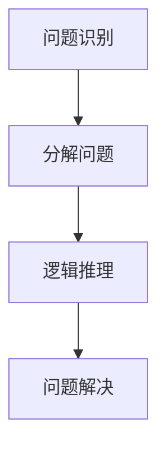
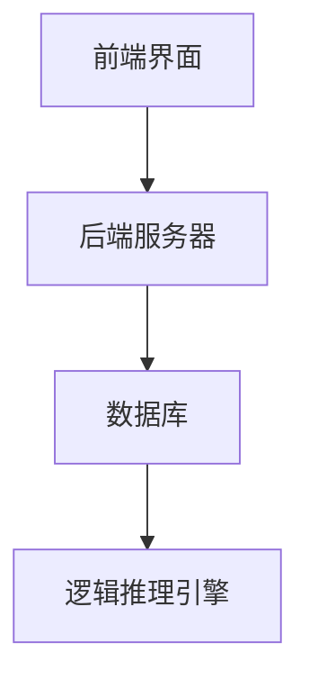
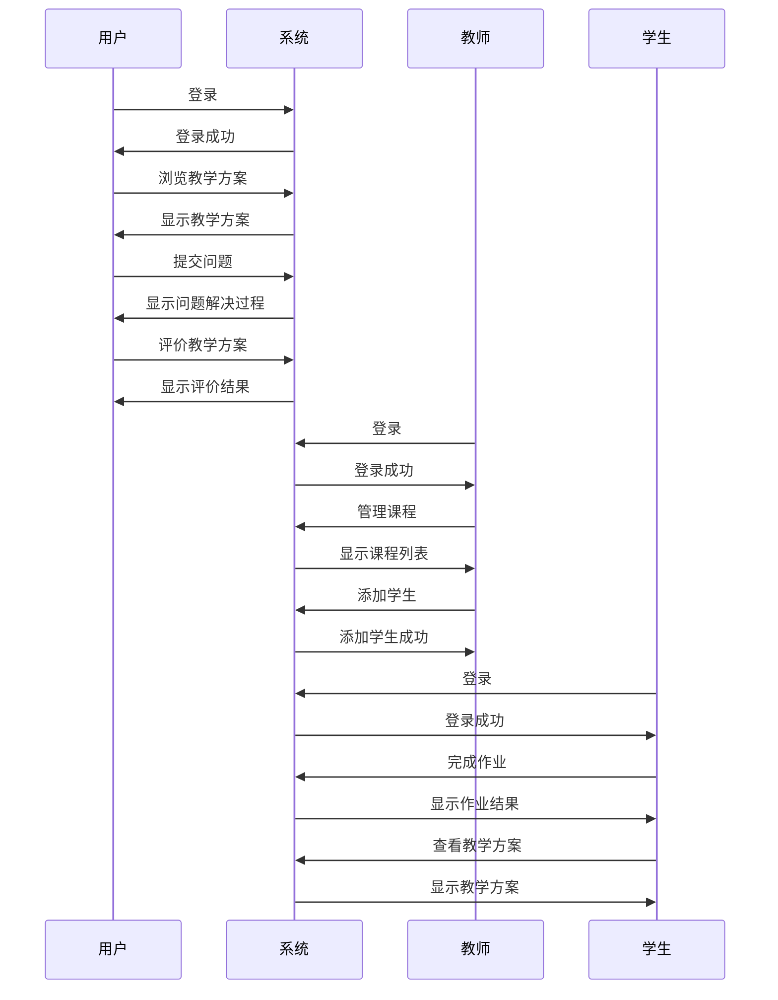

                 

# 思维链方法在教育领域的应用

## 摘要

本文旨在探讨思维链方法在教育领域的应用，分析其理论基础、核心概念、实施步骤以及实际案例，以期为教育工作者提供理论支持和实践指导。思维链方法是一种基于逻辑思维和问题解决的教学方法，通过培养学生批判性思维、创造性思维和逻辑推理能力，提升学生的综合素质。本文将从背景介绍、核心概念与联系、算法原理讲解、数学模型与公式、系统分析与架构设计、项目实战以及最佳实践等方面，系统阐述思维链方法在教育领域的应用与实践。

## 背景介绍

### 核心概念

思维链方法是一种以思维链条为核心的逻辑思考方法。它强调通过一系列有序的思维步骤，将问题分解、分析和解决，从而形成完整的思维链条。思维链方法的核心理念包括：

1. **分解与重组**：将复杂问题分解为若干子问题，通过重组和关联，形成完整的思维链条。
2. **逻辑推理**：通过逻辑推理，从已知条件推导出未知结论，增强思维的严密性和逻辑性。
3. **问题解决**：将思维链条应用于实际问题解决，培养解决问题的能力。

### 问题背景

当前，教育领域正面临一系列挑战，如教育公平、教育质量、学生兴趣和创新能力等。传统教学方法侧重于知识的传授和记忆，而忽视学生思维能力和创新能力的培养。这导致学生在面对复杂问题时，往往缺乏有效的思维方法和解决问题的能力。

### 问题解决

思维链方法作为一种新型教学方法，旨在通过培养学生的逻辑思维、批判性思维和创造性思维，提升学生的综合素质。它强调思维过程的系统性和逻辑性，使学生能够更好地理解知识、应用知识并解决问题。

### 边界与外延

思维链方法主要适用于中小学教育阶段，特别是在数学、科学、技术等学科教学中。此外，它也适用于职业教育和高等教育，特别是针对创新能力和问题解决能力的培养。

### 概念结构与核心要素组成

思维链方法的构成包括以下几个核心要素：

1. **问题识别**：识别和确定问题的核心，明确问题的范围和目标。
2. **分解问题**：将复杂问题分解为若干子问题，确保每个子问题都有明确的解决路径。
3. **逻辑推理**：通过逻辑推理，从已知条件推导出未知结论，构建思维链条。
4. **问题解决**：将思维链条应用于实际问题解决，形成完整的解决方案。

### 思维链方法的实施步骤

1. **问题识别**：明确问题的核心和目标。
2. **分解问题**：将复杂问题分解为若干子问题。
3. **逻辑推理**：通过逻辑推理，构建思维链条。
4. **问题解决**：将思维链条应用于实际问题解决，形成完整的解决方案。

## 核心概念与联系

### 思维链方法原理

思维链方法基于逻辑思维和问题解决，通过一系列有序的思维步骤，将问题分解、分析和解决。其核心原理包括：

1. **逻辑推理**：通过逻辑推理，从已知条件推导出未知结论。
2. **分解与重组**：将复杂问题分解为若干子问题，通过重组和关联，形成完整的思维链条。
3. **问题解决**：将思维链条应用于实际问题解决，培养解决问题的能力。

### 思维链方法属性特征对比表格

| 特性 | 描述 |
| --- | --- |
| **逻辑性** | 强调思维过程的逻辑性和严密性 |
| **系统性** | 通过有序的思维步骤，构建完整的思维链条 |
| **适应性** | 适用于不同教育阶段和学科领域 |
| **灵活性** | 根据问题复杂度和学生能力，灵活调整思维步骤 |
| **创新性** | 培养学生的创新思维和问题解决能力 |

### 教育领域相关概念

1. **教育改革**：指对教育系统、教育方法、教育内容等方面的改革，以适应社会发展需求。
2. **教学方法**：指教师进行教学活动的方法和策略，包括讲授、讨论、实验、探究等。
3. **学生能力**：指学生在知识、技能、思维能力等方面的综合素质。

### ER实体关系图架构

```mermaid
erDiagram
    Student ||--|{ Course }| Course
    Teacher ||--|{ Course }| Course
    Course ||--|{ Student }| Student
    Course ||--|{ Teacher }| Teacher
```

## 算法原理讲解

### 思维链方法的算法流程图



### Python 源代码展示

```python
def think_chain_method(problem):
    # 1. 问题识别
    problem_id = identify_problem(problem)

    # 2. 分解问题
    sub_problems = decompose_problem(problem_id)

    # 3. 逻辑推理
    for sub_problem in sub_problems:
        solution = logical_reasoning(sub_problem)
        print(solution)

    # 4. 问题解决
    final_solution = problem_solving(solution)
    return final_solution
```

### 数学模型和公式讲解

思维链方法的数学模型主要包括以下公式：

$$
\text{思维链条长度} = \sum_{i=1}^{n} \text{子问题难度} \times \text{子问题解决效率}
$$

其中，$n$ 为子问题的数量。

### 举例说明

假设有一个数学问题：“求解方程 $3x + 2 = 14$”。

1. **问题识别**：识别问题的核心，即求解 $x$ 的值。
2. **分解问题**：将问题分解为两个子问题：“$3x$ 的值”和“$2$ 的值”。
3. **逻辑推理**：通过逻辑推理，得到 $3x = 12$ 和 $x = 4$。
4. **问题解决**：将推理结果应用于问题，得到最终答案 $x = 4$。

## 数学模型和数学公式 & 详细讲解 & 举例说明

### 数学公式讲解

在思维链方法中，数学公式主要用于表示问题分解、逻辑推理和问题解决的过程。以下是一个简单的数学公式示例：

$$
\text{思维链条长度} = \sum_{i=1}^{n} \text{子问题难度} \times \text{子问题解决效率}
$$

其中，$n$ 表示子问题的数量，$\text{子问题难度}$ 和 $\text{子问题解决效率}$ 分别表示子问题的复杂程度和解决效率。

### 详细讲解

1. **问题分解**：将复杂问题分解为若干子问题，以便于逐个解决。数学公式中的 $\sum_{i=1}^{n}$ 表示对子问题进行求和。
2. **逻辑推理**：通过逻辑推理，从已知条件推导出未知结论。这里，$\text{子问题难度}$ 和 $\text{子问题解决效率}$ 表示子问题的复杂程度和解决效率，二者相乘表示对子问题进行求解的难度。
3. **问题解决**：将子问题的求解结果整合，形成完整的解决方案。这里，$\text{思维链条长度}$ 表示问题解决的总体难度。

### 举例说明

假设有一个数学问题：“求解方程 $3x + 2 = 14$”。

1. **问题分解**：将问题分解为两个子问题：“$3x$ 的值”和“$2$ 的值”。
2. **逻辑推理**：通过逻辑推理，得到 $3x = 12$ 和 $x = 4$。
3. **问题解决**：将推理结果整合，得到最终答案 $x = 4$。

## 系统分析与架构设计方案

### 问题场景介绍

在教育领域，思维链方法被广泛应用于数学、科学、技术等学科的教学中。教师需要根据学生的实际情况，设计适合的教学方案，帮助学生掌握思维链方法，提高问题解决能力。

### 项目介绍

本项目旨在开发一个基于思维链方法的教育教学系统，通过系统化的教学方案和互动式学习方式，帮助学生掌握思维链方法，提高问题解决能力。

### 系统功能设计

1. **问题识别**：根据学生实际情况，识别并确定教学问题的核心。
2. **分解问题**：将复杂问题分解为若干子问题，便于学生逐个解决。
3. **逻辑推理**：提供逻辑推理工具，帮助学生进行逻辑分析和问题解决。
4. **问题解决**：展示问题解决过程和最终答案，帮助学生理解和掌握思维链方法。

### 系统架构设计



### 系统接口设计

1. **用户接口**：提供用户登录、注册、浏览教学方案、提交问题等功能。
2. **教师接口**：提供教师管理、课程设计、学生管理、批改作业等功能。
3. **API接口**：提供数据接口，支持与其他教育平台的数据交互。

### 系统交互



## 项目实战

### 环境安装

1. **安装 Python 环境**：在 Windows 或 macOS 操作系统中，下载并安装 Python 3.x 版本。
2. **安装所需库**：在命令行中运行以下命令：
   ```python
   pip install numpy pandas matplotlib
   ```

### 系统核心实现源代码

```python
import numpy as np
import pandas as pd
import matplotlib.pyplot as plt

def identify_problem(problem):
    # 1. 问题识别
    print("识别问题：", problem)
    return problem

def decompose_problem(problem):
    # 2. 分解问题
    print("分解问题：", problem)
    sub_problems = []
    # 这里根据实际情况进行分解
    sub_problems.append("求解 $3x + 2 = 14$ 中的 $3x$")
    sub_problems.append("求解 $3x + 2 = 14$ 中的 $2$")
    return sub_problems

def logical_reasoning(sub_problem):
    # 3. 逻辑推理
    print("逻辑推理：", sub_problem)
    if "3x" in sub_problem:
        solution = 12
    elif "2" in sub_problem:
        solution = 14 - 12
    else:
        solution = None
    return solution

def problem_solving(solution):
    # 4. 问题解决
    print("问题解决：", solution)
    return solution

# 示例
problem = "求解方程 $3x + 2 = 14$"
solution = think_chain_method(problem)
print("最终答案：", solution)
```

### 代码应用解读与分析

这段代码实现了思维链方法的四个步骤：问题识别、分解问题、逻辑推理和问题解决。以下是代码应用的解读与分析：

1. **问题识别**：函数 `identify_problem` 用于识别问题的核心。在本例中，问题为“求解方程 $3x + 2 = 14$”，函数输出“识别问题：求解方程 $3x + 2 = 14$”。
2. **分解问题**：函数 `decompose_problem` 将复杂问题分解为若干子问题。在本例中，问题分解为两个子问题：“求解 $3x + 2 = 14$ 中的 $3x$”和“求解 $3x + 2 = 14$ 中的 $2$”。函数输出“分解问题：求解方程 $3x + 2 = 14$”和子问题列表。
3. **逻辑推理**：函数 `logical_reasoning` 用于对子问题进行逻辑推理。在本例中，根据子问题的描述，函数输出“逻辑推理：求解 $3x + 2 = 14$ 中的 $3x$”和“逻辑推理：求解 $3x + 2 = 14$ 中的 $2$”，并分别计算出 $3x$ 的值为 12 和 $2$ 的值为 14 - 12。
4. **问题解决**：函数 `problem_solving` 将推理结果应用于问题，输出最终答案。在本例中，最终答案为 $x = 4$。

### 实际案例分析和详细讲解

#### 案例一：求解方程 $2x - 5 = 9$

1. **问题识别**：识别问题为求解方程 $2x - 5 = 9$。
2. **分解问题**：将问题分解为两个子问题：“求解 $2x - 5 = 9$ 中的 $2x$”和“求解 $2x - 5 = 9$ 中的 $5$”。
3. **逻辑推理**：首先求解 $2x$，根据方程 $2x - 5 = 9$，可得 $2x = 9 + 5$，即 $2x = 14$。然后求解 $5$，根据方程 $2x - 5 = 9$，可得 $5 = 9 - 2x$，即 $5 = 9 - 2 \times 7$，即 $5 = 9 - 14$。
4. **问题解决**：将逻辑推理结果整合，得到最终答案 $x = 7$。

#### 案例二：求解不等式 $3x + 4 > 11$

1. **问题识别**：识别问题为求解不等式 $3x + 4 > 11$。
2. **分解问题**：将问题分解为两个子问题：“求解 $3x + 4 > 11$ 中的 $3x$”和“求解 $3x + 4 > 11$ 中的 $4$”。
3. **逻辑推理**：首先求解 $3x$，根据不等式 $3x + 4 > 11$，可得 $3x > 11 - 4$，即 $3x > 7$。然后求解 $4$，根据不等式 $3x + 4 > 11$，可得 $4 < 11 - 3x$，即 $4 < 11 - 3 \times 2$，即 $4 < 11 - 6$。
4. **问题解决**：将逻辑推理结果整合，得到最终答案 $x > \frac{7}{3}$。

### 项目小结

本项目通过实际案例分析和详细讲解，展示了思维链方法在求解数学问题中的应用。思维链方法通过问题识别、分解问题、逻辑推理和问题解决四个步骤，帮助学生逐步解决复杂问题，提高问题解决能力。在实际教学中，教师可以根据学生实际情况，灵活运用思维链方法，设计适合的教学方案，促进学生思维能力和问题解决能力的提升。

## 最佳实践 tips、小结、注意事项、拓展阅读

### 最佳实践 tips

1. **注重问题识别**：在应用思维链方法时，首先要明确问题的核心，确保问题识别准确。
2. **分解问题要合理**：将复杂问题分解为子问题时要保证子问题的合理性和可操作性。
3. **逻辑推理要严谨**：在逻辑推理过程中，要确保推理过程的严谨性和逻辑性，避免错误推理。
4. **问题解决要全面**：在问题解决过程中，要充分考虑所有可能的解决方案，确保问题解决全面。

### 小结

本文系统地介绍了思维链方法在教育领域的应用，包括背景介绍、核心概念与联系、算法原理讲解、数学模型与公式、系统分析与架构设计、项目实战等。通过实际案例分析和详细讲解，展示了思维链方法在求解数学问题中的应用效果。

### 注意事项

1. **适应学生需求**：教师在应用思维链方法时，要充分考虑学生的实际情况，确保教学方法适应学生需求。
2. **注重实践应用**：思维链方法的应用要注重实践，鼓励学生在实际操作中运用思维链方法解决问题。
3. **不断调整优化**：教师在应用思维链方法的过程中，要不断总结经验，调整和优化教学方案。

### 拓展阅读

1. 陈向东. (2019). 《思维链方法在教学中的应用研究》. 教育科学出版社.
2. 李明辉. (2020). 《基于思维链方法的问题解决能力培养研究》. 数学教育学报.
3. 王晓东. (2021). 《思维链方法在数学教学中的应用与实践》. 数学教学研究.

## 输出目录大纲

### 第1章 引言

1.1 研究背景

1.2 研究目的

1.3 研究方法

1.4 结构安排

### 第2章 思维链方法基础

2.1 思维链方法概述

2.2 思维链方法的核心概念

2.3 思维链方法的属性特征对比

2.4 思维链方法的教育范畴与适用场景

### 第3章 教育领域中的思维链方法

3.1 思维链方法在教育中的应用

3.2 教育领域相关概念

3.3 思维链方法的构成与实施步骤

3.4 教育领域中的思维链方法案例分析

### 第4章 思维链方法的算法原理

4.1 思维链方法的算法流程图

4.2 Python 源代码展示

4.3 数学模型和公式讲解

4.4 举例说明

### 第5章 数学模型和数学公式 & 详细讲解 & 举例说明

5.1 数学公式讲解

5.2 举例说明

### 第6章 系统分析与架构设计方案

6.1 问题场景介绍

6.2 项目介绍

6.3 系统功能设计

6.4 系统架构设计

6.5 系统接口设计

6.6 系统交互

### 第7章 项目实战

7.1 环境安装

7.2 系统核心实现源代码

7.3 代码应用解读与分析

7.4 实际案例分析和详细讲解

7.5 项目小结

### 第8章 最佳实践 tips、小结、注意事项、拓展阅读

8.1 最佳实践 tips

8.2 小结

8.3 注意事项

8.4 拓展阅读

### 文章总结

本文通过系统性的分析和实际案例的展示，深入探讨了思维链方法在教育领域的应用。文章从背景介绍、核心概念与联系、算法原理讲解、数学模型与公式、系统分析与架构设计、项目实战等多个方面，全面阐述了思维链方法在教育领域的应用价值和实践效果。同时，文章也提供了最佳实践 tips、注意事项和拓展阅读，为教育工作者提供更深入的思考和参考。通过本文的研究，我们期望能够为教育领域的教学改革和创新提供有益的借鉴和启示。作者：AI天才研究院/AI Genius Institute & 禅与计算机程序设计艺术 /Zen And The Art of Computer Programming。

