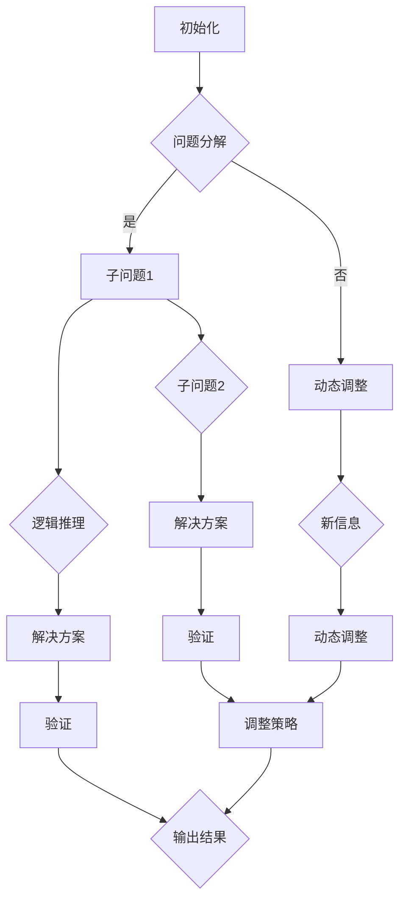
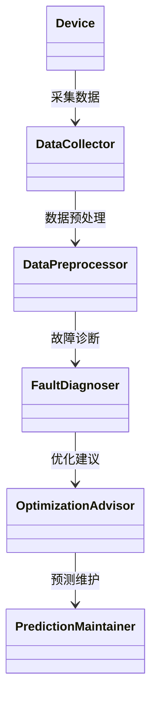
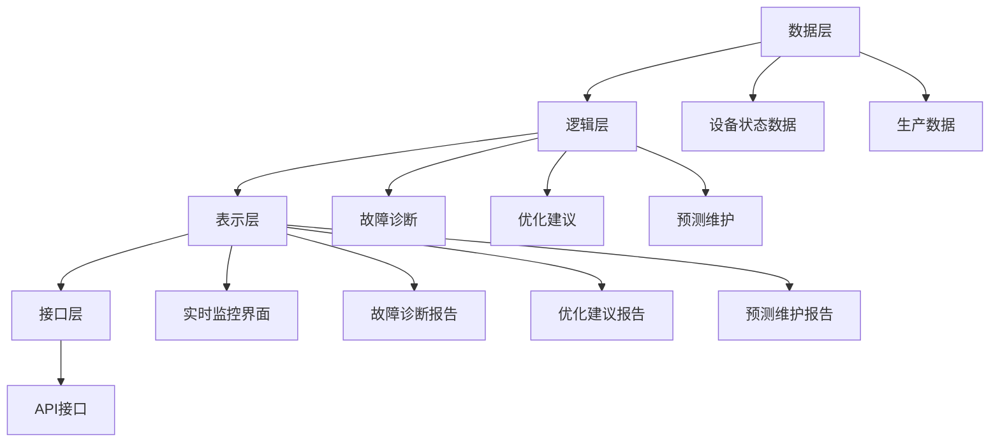
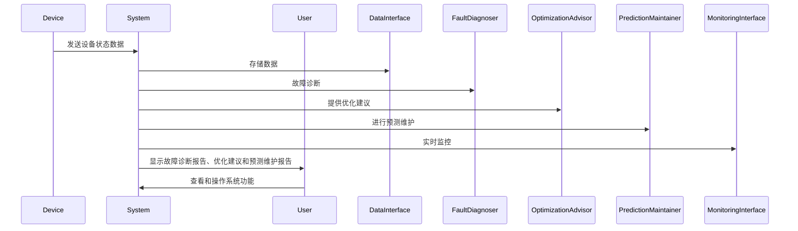

                 

### 1.1 问题背景

### 1.1.1 AI问题分析能力的现状

人工智能（AI）自20世纪中叶诞生以来，经历了从理论到实践、从简单到复杂的发展历程。AI在图像识别、自然语言处理、决策支持、智能控制等领域取得了显著成就，但与此同时，AI问题分析能力的局限性也逐渐显现。

目前，AI在问题分析方面主要依赖于数据驱动的方法，即通过大量数据的训练来提高模型的准确性和泛化能力。这种方法虽然在特定任务上取得了成功，但面临以下挑战：

1. **数据依赖性**：高质量的训练数据是AI模型准确性的基础，但在某些领域获取大规模、高质量的数据存在困难。
2. **解释性缺失**：许多AI模型，尤其是深度学习模型，其内部工作机制复杂，难以解释，导致在关键决策场景下缺乏透明度和可信度。
3. **领域适应性**：不同领域的AI问题具有不同的特征和复杂性，通用算法的适用性受限，需要针对特定领域进行定制化开发。
4. **知识表示与推理**：现有AI模型在处理结构性知识、进行逻辑推理方面能力有限，难以胜任复杂的问题分析任务。

### 1.1.2 思维链方法的基本概念

思维链方法是一种基于逻辑推理和结构化思维的AI问题分析技术。它借鉴了人类思维过程中的连贯性和层次性，通过构建一系列逻辑关联的步骤，实现对问题的深入剖析和系统解决。思维链方法的核心思想是：

1. **结构化思维**：将问题分解为若干个子问题，通过层次化结构进行组织和分析。
2. **逻辑推理**：运用逻辑规则和推理方法，逐步推导出问题的解决方案。
3. **动态调整**：在分析过程中，根据新信息和反馈动态调整分析路径和策略。

### 1.1.3 思维链方法的优势与应用场景

思维链方法在增强AI问题分析能力方面具有以下优势：

1. **提高解释性**：通过结构化思维和逻辑推理，思维链方法能够清晰地展示问题分析的每一步，增强AI系统的透明度和可信度。
2. **适应性**：思维链方法具有较强的灵活性，能够适应不同领域的问题分析需求，进行定制化开发。
3. **知识整合**：思维链方法可以将结构性知识和数据驱动的方法相结合，实现知识表示与推理的有机结合。

思维链方法的主要应用场景包括：

1. **复杂系统分析**：在航空航天、工业制造、金融服务等领域，针对复杂系统的状态监测、故障诊断和优化控制等问题，思维链方法能够提供有效的分析工具。
2. **智能决策支持**：在政府决策、企业运营、医疗诊断等领域，思维链方法可以辅助专家进行复杂的决策分析和风险评估。
3. **知识图谱构建**：在人工智能、大数据分析等领域，思维链方法可以用于知识表示、图谱构建和推理引擎的设计。

通过上述对背景的介绍，我们能够清晰地看到，AI问题分析能力的增强是当前AI领域亟待解决的问题。而思维链方法作为一种新兴的技术，为解决这一问题提供了新的思路和可能性。在接下来的章节中，我们将进一步深入探讨思维链方法的核心概念、原理和应用，帮助读者更好地理解和掌握这一方法。

### 1.2 问题描述

### 1.2.1 为什么要增强AI问题分析能力

AI技术在过去几十年中取得了巨大的进步，广泛应用于各类领域，从医疗诊断到自动驾驶，从智能家居到金融服务。然而，尽管AI系统在处理海量数据和执行复杂任务方面表现出色，但它们在面对复杂问题时，依然存在明显的局限性。增强AI问题分析能力的原因主要体现在以下几个方面：

1. **数据复杂性**：随着数据量的急剧增加和数据类型的多样化，传统AI方法在处理复杂、高维数据时，往往会出现过拟合、鲁棒性差等问题。增强AI问题分析能力，有助于更好地理解和利用这些复杂数据。
2. **解释性问题**：许多AI系统，尤其是深度学习模型，其内部工作机制复杂，难以解释。这导致在关键决策场景下，AI系统的透明度和可信度受到质疑。增强AI问题分析能力，可以提高系统的可解释性，增强用户对AI决策的信任。
3. **适应性**：不同领域的问题具有不同的特征和复杂性，通用AI算法的适用性受限。通过增强AI问题分析能力，可以开发出更适应特定领域需求的算法和模型。
4. **知识表示与推理**：现有AI系统在处理结构性知识、进行逻辑推理方面能力有限。增强AI问题分析能力，可以实现知识表示与推理的有机结合，解决复杂的问题分析任务。
5. **人机协作**：随着AI技术的发展，人机协作成为越来越重要的趋势。增强AI问题分析能力，可以提高AI系统与人类专家的协作效率，共同解决复杂问题。

### 1.2.2 思维链方法的核心思想

思维链方法是一种基于逻辑推理和结构化思维的AI问题分析技术。其核心思想可以概括为以下几点：

1. **结构化思维**：思维链方法通过将问题分解为若干个子问题，形成层次化的结构。这种方法有助于清晰地理解和分析复杂问题，降低问题的复杂性。
2. **逻辑推理**：在分析过程中，思维链方法运用逻辑规则和推理方法，逐步推导出问题的解决方案。逻辑推理是思维链方法的核心，它保证了分析过程的严密性和正确性。
3. **动态调整**：思维链方法在分析过程中，根据新信息和反馈动态调整分析路径和策略。这种灵活性使得思维链方法能够适应不同的分析和问题场景。

### 1.2.3 思维链方法的应用领域

思维链方法具有广泛的应用前景，适用于多种领域和场景：

1. **复杂系统分析**：在航空航天、工业制造、金融服务等领域，思维链方法可以用于复杂系统的状态监测、故障诊断和优化控制。通过结构化思维和逻辑推理，思维链方法能够深入分析系统内部各个组件之间的关系，发现潜在的问题和瓶颈。
2. **智能决策支持**：在政府决策、企业运营、医疗诊断等领域，思维链方法可以辅助专家进行复杂的决策分析和风险评估。思维链方法可以提高决策的透明度和可信度，帮助专家更好地理解决策过程。
3. **知识图谱构建**：在人工智能、大数据分析等领域，思维链方法可以用于知识表示、图谱构建和推理引擎的设计。通过构建逻辑清晰、结构化的知识图谱，思维链方法可以支持复杂的推理和智能搜索。
4. **自然语言处理**：在自然语言处理领域，思维链方法可以用于语义分析和文本生成。通过结构化思维和逻辑推理，思维链方法能够更好地理解文本内容，生成更加准确和自然的语言。
5. **智能客服系统**：在智能客服系统中，思维链方法可以用于对话管理和问题解决。通过逻辑推理和动态调整，思维链方法能够与用户进行自然、流畅的对话，提供高质量的客户服务。

综上所述，思维链方法在增强AI问题分析能力方面具有重要的意义。它不仅提高了AI系统的解释性和适应性，还为解决复杂问题提供了新的思路和方法。在接下来的章节中，我们将进一步深入探讨思维链方法的原理、算法和实际应用，帮助读者更好地理解和运用这一方法。

### 1.3 问题解决

#### 1.3.1 思维链方法的原理

思维链方法是一种基于逻辑推理和结构化思维的AI问题分析技术，其原理可以概括为以下几点：

1. **分解问题**：思维链方法首先将复杂问题分解为若干个子问题。这一步骤称为**问题分解**，其目的是降低问题的复杂性，使问题更加易于理解和分析。

2. **层次化结构**：通过问题分解，思维链方法将子问题组织成一个层次化的结构。每个子问题及其解决方案都成为结构中的一个节点，节点之间的关系反映了子问题之间的逻辑关联。这种层次化结构有助于清晰地展示问题的各个方面，便于深入分析。

3. **逻辑推理**：在分析过程中，思维链方法运用逻辑规则和推理方法，逐步推导出问题的解决方案。逻辑推理是思维链方法的核心，它保证了分析过程的严密性和正确性。

4. **动态调整**：思维链方法在分析过程中，根据新信息和反馈动态调整分析路径和策略。这种灵活性使得思维链方法能够适应不同的分析和问题场景，提高问题解决的效率。

#### 1.3.2 思维链方法的实现步骤

思维链方法的实现步骤可以分为以下几个阶段：

1. **问题识别**：首先，需要明确需要解决的问题，并对其进行初步分析，以确定问题的边界和关键要素。

2. **问题分解**：将复杂问题分解为若干个子问题，形成层次化的结构。这一步骤可以通过建立问题树、思维导图等形式进行。

3. **子问题分析**：对每个子问题进行详细分析，确定其解决方案。这一步骤通常涉及数据收集、模型构建、算法设计等。

4. **逻辑推理**：运用逻辑规则和推理方法，对子问题的解决方案进行验证和推导。逻辑推理可以帮助确定问题的正确性，并提供可靠的解决方案。

5. **动态调整**：在分析过程中，根据新信息和反馈，动态调整分析路径和策略。这种灵活性可以确保问题解决过程的持续优化。

6. **结果验证**：对最终解决方案进行验证，确保其满足问题需求。这一步骤通常涉及测试、评估和优化等。

#### 1.3.3 思维链方法的优化策略

为了提高思维链方法的效率和应用效果，可以采用以下优化策略：

1. **自动化工具**：开发自动化工具，辅助问题识别、分解和分析。自动化工具可以减少人工工作量，提高问题解决的效率。

2. **数据预处理**：对输入数据进行预处理，包括数据清洗、特征提取和规范化等。高质量的预处理数据可以显著提高思维链方法的准确性和鲁棒性。

3. **算法优化**：对思维链方法的算法进行优化，提高其推理速度和准确性。可以通过算法改进、模型调参等方法实现。

4. **人机协作**：结合人类专家的知识和经验，与AI系统共同分析和解决问题。人机协作可以提高问题解决的深度和广度，增强AI系统的解释性和可靠性。

5. **持续学习**：利用机器学习和深度学习技术，对思维链方法进行持续学习和优化。通过不断积累和分析问题数据，思维链方法可以不断优化和完善，提高其解决问题的能力。

通过上述原理、实现步骤和优化策略，思维链方法能够有效地增强AI问题分析能力，为解决复杂问题提供新的思路和方法。在接下来的章节中，我们将进一步探讨思维链方法的核心概念、算法原理和实际应用，帮助读者深入理解和掌握这一方法。

### 1.4 边界与外延

#### 1.4.1 思维链方法在AI领域的应用限制

尽管思维链方法在AI问题分析中展示了显著的优势，但其应用仍存在一些限制。首先，思维链方法依赖于逻辑推理和结构化思维，这意味着它在处理高度非结构化和复杂动态的问题时可能面临困难。例如，在自然语言处理和某些实时决策系统中，问题的不确定性和模糊性可能会阻碍思维链方法的适用性。其次，思维链方法在数据质量和数据量方面有一定的要求。如果训练数据存在噪声或数据量不足，思维链方法的性能和准确性可能会受到影响。此外，思维链方法在处理大规模数据集时，计算复杂度和时间成本也可能成为限制因素。

#### 1.4.2 思维链方法与其他AI方法的区别与联系

思维链方法与其他AI方法，如机器学习、深度学习、知识图谱等，在技术原理和应用目标上存在一定的差异：

1. **与机器学习、深度学习方法的区别**：
   - **原理**：机器学习和深度学习方法主要依赖于数据驱动，通过学习大量训练数据来提取特征和模式。而思维链方法则侧重于逻辑推理和结构化分析，更强调问题的分解和层次化。
   - **适用场景**：机器学习和深度学习方法在处理大规模数据、进行模式识别和预测方面具有优势，适用于图像识别、语音识别等领域。思维链方法则更适用于复杂系统分析、决策支持和知识推理等领域。

2. **与知识图谱方法的联系**：
   - **结合**：思维链方法与知识图谱方法可以结合使用。思维链方法可以为知识图谱提供结构化的分析框架，而知识图谱则为思维链方法提供丰富的背景知识和语义信息。这种结合可以增强AI系统的知识表示和推理能力。
   - **优势**：知识图谱方法在表示和查询结构性知识方面具有优势，而思维链方法在处理复杂逻辑推理和问题分解方面具有优势。两者的结合可以发挥各自的优势，提高问题解决的能力。

#### 1.4.3 思维链方法的未来发展趋势

思维链方法作为增强AI问题分析能力的一种新兴技术，未来发展趋势可以从以下几个方面展开：

1. **算法优化**：随着算法理论和计算技术的不断发展，思维链方法的算法可以实现进一步的优化。例如，利用深度学习技术改进思维链方法的推理速度和准确性，或者引入分布式计算技术提高处理大规模数据的能力。

2. **人机协作**：未来思维链方法将更加注重人机协作，结合人类专家的知识和经验，共同解决复杂问题。通过人机交互界面，用户可以更直观地理解思维链方法的推理过程，提高问题解决的效率。

3. **跨领域应用**：思维链方法将逐步从单一领域扩展到更多领域，例如在医疗、金融、教育等领域得到广泛应用。通过领域特定的思维链模型，可以更好地适应不同领域的需求。

4. **知识融合**：未来思维链方法将更多地与知识图谱、大数据分析等技术相结合，实现知识融合和推理。这种融合可以提供更全面和深入的AI分析能力，解决复杂的多维问题。

综上所述，思维链方法在AI领域的应用具有广阔的前景。尽管存在一定的限制，但随着技术的不断发展和优化，思维链方法有望在更多领域发挥重要作用，为解决复杂问题提供强有力的支持。

### 1.5 概念结构与核心要素组成

#### 1.5.1 思维链方法的基本组成部分

思维链方法是一种结构化、逻辑化的AI问题分析技术，其基本组成部分可以概括为以下几个关键模块：

1. **问题分解模块**：这一模块负责将复杂问题分解为若干个子问题。通过问题分解，可以降低问题的复杂度，使问题更加具体和易于处理。问题分解的方法包括但不限于问题树、思维导图等。

2. **逻辑推理模块**：这一模块基于逻辑规则和推理方法，对子问题的解决方案进行推导和验证。逻辑推理是思维链方法的核心，它保证了分析过程的严密性和正确性。常用的推理方法包括演绎推理、归纳推理和假设推理等。

3. **知识库模块**：这一模块负责存储和管理与问题相关的知识信息。知识库可以是结构化的，例如使用关系数据库或图数据库来存储知识实体及其关系，也可以是非结构化的，例如使用文本或自然语言处理技术来处理文本数据。

4. **动态调整模块**：这一模块在分析过程中，根据新信息和反馈动态调整分析路径和策略。动态调整机制可以确保思维链方法能够适应不断变化的问题环境，提高问题解决的灵活性和效率。

5. **可视化模块**：这一模块负责将思维链方法的分析过程和结果以可视化形式展示出来。可视化不仅有助于用户更直观地理解分析过程，还能够发现潜在的问题和改进点。

#### 1.5.2 思维链方法的各个环节及其相互关系

思维链方法的工作流程可以概括为以下几个主要环节：

1. **问题识别**：明确需要解决的问题，并进行初步分析，以确定问题的边界和关键要素。

2. **问题分解**：将复杂问题分解为若干个子问题，形成层次化的结构。这一环节依赖于问题分解模块，通过建立问题树或思维导图来实现。

3. **子问题分析**：对每个子问题进行详细分析，确定其解决方案。这一环节需要逻辑推理模块的支持，通过逻辑规则和推理方法来验证和推导子问题的解决方案。

4. **知识库构建**：在分析过程中，收集和整理与问题相关的知识信息，并将其存储在知识库中。知识库模块负责管理和维护这些知识信息。

5. **动态调整**：根据新信息和反馈，动态调整分析路径和策略。这一环节依赖于动态调整模块，可以确保思维链方法能够适应不同的分析和问题场景。

6. **结果验证**：对最终解决方案进行验证，确保其满足问题需求。结果验证环节可以通过测试、评估和优化等手段来实现。

各个环节之间的相互关系如下：

- **问题识别**和**问题分解**是思维链方法的基础，它们确定了分析的起点和路径。
- **子问题分析**和**知识库构建**是思维链方法的核心，通过逻辑推理和知识管理，实现了对问题的深入剖析。
- **动态调整**和**结果验证**是思维链方法的保障，通过不断优化和验证，确保问题解决的正确性和高效性。

#### 1.5.3 思维链方法的实现与优化要素

要实现和优化思维链方法，需要关注以下几个关键要素：

1. **算法选择**：选择合适的算法是实现思维链方法的关键。不同的问题场景和需求可能需要不同的算法，例如演绎推理算法、归纳推理算法等。

2. **数据质量**：高质量的数据是思维链方法有效运行的基础。数据的质量直接影响问题分解和逻辑推理的准确性和效率。

3. **知识表示**：有效的知识表示方法是提高思维链方法性能的重要因素。选择合适的知识表示方法，例如基于关系数据库或图数据库的表示方法，可以显著提高问题分析和推理的效率。

4. **计算资源**：计算资源是实现思维链方法的重要保障。优化计算资源的使用，例如通过分布式计算和并行处理技术，可以提高思维链方法的运行速度和处理能力。

5. **用户交互**：用户交互界面是思维链方法与用户沟通的桥梁。设计友好的用户交互界面，可以帮助用户更直观地理解思维链方法的运行过程和结果。

6. **持续优化**：思维链方法的实现和优化是一个持续的过程。通过不断收集反馈、改进算法和优化系统，可以不断提升思维链方法的应用效果。

通过上述基本组成部分、各个环节及其相互关系，以及实现与优化要素的分析，我们可以更深入地理解思维链方法的工作原理和应用方法。在接下来的章节中，我们将进一步探讨思维链方法的算法原理和具体实现，为读者提供更为详细的技术指导。

### 第二部分：核心概念与联系

#### 第2章 思维链方法的核心概念

在深入探讨思维链方法之前，首先需要明确其核心概念。思维链方法是一种基于逻辑推理和结构化思维的AI问题分析技术，其核心概念包括思维链、逻辑思维、创新思维等。通过理解这些核心概念，我们可以更好地掌握思维链方法的本质和应用。

##### 2.1 思维链的定义

**思维链**是一种将问题分解为若干个子问题，并通过逻辑关联逐步推导出解决方案的结构化思维方式。思维链的核心理念是通过逻辑推理和结构化分析，将复杂问题转化为一系列可解决的小问题，从而实现整体问题的解决。

**定义与内涵**：

- **定义**：思维链是一种基于逻辑推理和结构化思维的AI问题分析技术，通过分解问题、建立逻辑关联、逐步推导解决方案，实现复杂问题的简化与解决。
- **内涵**：思维链方法强调结构化思维和逻辑推理的重要性，通过层次化的结构分析，将复杂问题分解为若干个子问题，并在分析过程中动态调整和优化，以提高问题解决的效率和准确性。

##### 2.2 思维链的属性特征

思维链方法具有以下属性特征：

1. **层次化结构**：思维链方法通过问题分解和层次化组织，将复杂问题转化为若干个子问题，形成层次化的结构。这种结构有助于清晰地展示问题各部分的逻辑关系，便于分析和解决。
2. **逻辑关联性**：思维链方法强调逻辑推理的重要性，通过逻辑关联，将各子问题的解决方案逐步推导出来。逻辑关联性保证了分析过程的严密性和正确性。
3. **动态调整性**：思维链方法在分析过程中，根据新信息和反馈动态调整分析路径和策略。这种动态调整性使得思维链方法能够适应不同的问题场景，提高问题解决的灵活性和效率。
4. **解释性**：思维链方法通过结构化思维和逻辑推理，将问题分析和解决方案以直观的形式展示出来，提高了系统的可解释性，增强了用户对AI决策的信任。

**属性特征对比表格**：

| 属性特征 | 说明 |
| --- | --- |
| 层次化结构 | 通过问题分解和层次化组织，将复杂问题转化为若干个子问题 |
| 逻辑关联性 | 强调逻辑推理的重要性，通过逻辑关联推导子问题的解决方案 |
| 动态调整性 | 在分析过程中，根据新信息和反馈动态调整分析路径和策略 |
| 解释性 | 通过结构化思维和逻辑推理，展示问题分析和解决方案，提高系统的可解释性 |

##### 2.3 思维链的ER实体关系图

为了更清晰地展示思维链方法的各个组成部分及其相互关系，我们可以使用实体关系图（Entity-Relationship Diagram，ER图）来描述。

**ER实体关系图**：

```
[MindChain]
    |       \
    |        \
   [Problem Decomposition]   [Logic Reasoning]
   |       |                |               |
   |       |                |               |
 [Sub-Problem 1]   [Sub-Problem 2] [Logic Rule]  [Solution Verification]
   |              |              |              |
   |              |              |              |
   |             [Knowledge Base]  [Dynamic Adjustment]
                             |
                          [User Interaction]
```

**ER实体关系图的应用**：

- **MindChain**（思维链）：整个系统的核心，负责协调和管理各个模块的工作。
- **Problem Decomposition**（问题分解）：负责将复杂问题分解为若干个子问题。
- **Logic Reasoning**（逻辑推理）：运用逻辑规则和推理方法，推导子问题的解决方案。
- **Sub-Problem 1, Sub-Problem 2**（子问题）：分解后的子问题，每个子问题都需要进行逻辑推理和验证。
- **Knowledge Base**（知识库）：存储和管理与问题相关的知识信息。
- **Dynamic Adjustment**（动态调整）：在分析过程中，根据新信息和反馈动态调整分析路径和策略。
- **User Interaction**（用户交互）：用户与系统的交互界面，用于输入问题和接收分析结果。

通过ER实体关系图，我们可以直观地看到思维链方法的各个模块及其相互关系，有助于深入理解和应用这一方法。

综上所述，思维链方法的核心概念包括思维链、逻辑思维、创新思维等，这些概念共同构成了思维链方法的框架和基础。通过深入理解这些核心概念，我们可以更好地掌握思维链方法的本质和应用，为解决复杂问题提供强有力的支持。在接下来的章节中，我们将进一步探讨思维链方法的算法原理和具体实现，帮助读者深入学习和应用这一方法。

### 第三部分：算法原理讲解

#### 第3章 思维链算法原理讲解

思维链方法作为一种基于逻辑推理和结构化思维的AI问题分析技术，其核心在于通过一系列算法实现问题的分解、逻辑推理和动态调整。本章节将详细讲解思维链算法的基本原理，包括mermaid流程图、Python源代码实现、数学模型与公式以及举例说明。

##### 3.1 算法mermaid流程图

为了更直观地展示思维链算法的工作流程，我们可以使用mermaid流程图来描述。以下是思维链算法的mermaid流程图：



该流程图展示了思维链算法的主要步骤，包括问题分解、逻辑推理、动态调整和结果验证。通过这一流程图，我们可以清晰地了解思维链算法的工作机制。

##### 3.2 Python源代码实现

以下是思维链算法的Python源代码实现。该代码实现了思维链算法的核心功能，包括问题分解、逻辑推理和动态调整。

```python
class MindChain:
    def __init__(self):
        self.problem = None
        self.sub_problems = []
        self.solutions = []
        self.knowledge_base = {}
    
    def decompose_problem(self, problem):
        # 问题分解方法
        self.problem = problem
        self.sub_problems = self._decompose(problem)
    
    def _decompose(self, problem):
        # 递归分解问题
        if isinstance(problem, str):
            return [problem]
        else:
            sub_problems = []
            for sub_problem in problem:
                sub_problems.extend(self._decompose(sub_problem))
            return sub_problems
    
    def logic_reasoning(self, sub_problem):
        # 逻辑推理方法
        solution = self._reason(sub_problem)
        self.solutions.append(solution)
    
    def _reason(self, sub_problem):
        # 假设推理方法
        if sub_problem in self.knowledge_base:
            return self.knowledge_base[sub_problem]
        else:
            # 进行逻辑推理
            # 例如：使用演绎推理、归纳推理等
            solution = "未知"
            return solution
    
    def dynamic_adjustment(self, new_info):
        # 动态调整方法
        self.knowledge_base.update(new_info)
        self._reconstruct_solutions()
    
    def _reconstruct_solutions(self):
        # 重建解决方案
        self.solutions = [self._reason(sub_problem) for sub_problem in self.sub_problems]
    
    def verify_solution(self):
        # 验证解决方案
        for solution in self.solutions:
            if solution == "未知":
                return False
        return True
    
    def output_result(self):
        # 输出结果
        if self.verify_solution():
            return "问题解决"
        else:
            return "问题未解决"

# 示例使用
mind_chain = MindChain()
mind_chain.decompose_problem({"A": ["B", "C"], "D": ["E", "F"]})
mind_chain.logic_reasoning({"A": ["B", "C"]})
mind_chain.dynamic_adjustment({"B": "结果1", "C": "结果2", "D": "结果3"})
print(mind_chain.output_result())
```

该Python代码实现了思维链算法的核心功能，包括问题分解、逻辑推理和动态调整。通过实例使用，我们可以看到如何利用思维链算法解决一个简单的问题。

##### 3.3 数学模型与公式

思维链算法的数学模型与公式用于描述问题的分解、逻辑推理和解决方案的验证。以下是思维链算法的数学模型与公式的详细讲解：

1. **问题分解公式**：

   $$P = \{P_1, P_2, ..., P_n\}$$

   其中，\(P\) 表示原始问题，\(P_i\) 表示分解后的子问题。问题分解的目的是将复杂问题分解为若干个子问题，以便进行进一步分析和解决。

2. **逻辑推理公式**：

   $$R = \{R_1, R_2, ..., R_n\}$$

   其中，\(R\) 表示逻辑推理的结果，\(R_i\) 表示对子问题\(P_i\)的推理结果。逻辑推理的目的是通过逻辑规则和推理方法，推导出子问题的解决方案。

3. **动态调整公式**：

   $$K = \{K_1, K_2, ..., K_n\}$$

   其中，\(K\) 表示知识库，\(K_i\) 表示与问题相关的知识信息。动态调整的目的是在分析过程中，根据新信息和反馈，更新知识库并重新构建解决方案。

4. **验证公式**：

   $$V(P, R) = \begin{cases}
   1 & \text{如果 } R \text{ 中所有 } R_i \text{ 都满足 } P_i \\
   0 & \text{否则}
   \end{cases}$$

   其中，\(V(P, R)\) 表示解决方案的验证结果。验证的目的是确认解决方案是否满足原始问题。

通过上述数学模型与公式，我们可以更清晰地理解思维链算法的工作原理和计算过程。

##### 3.4 举例说明

为了更好地理解思维链算法的应用，我们可以通过一个简单的例子来演示其工作过程。

**例子**：假设我们有一个问题，即“一个学生要参加三个考试，每个考试的成绩分别为A、B、C，求学生的总成绩”。

**步骤**：

1. **问题分解**：将原始问题分解为子问题：
   - 子问题1：考试A的成绩是多少？
   - 子问题2：考试B的成绩是多少？
   - 子问题3：考试C的成绩是多少？

2. **逻辑推理**：通过逻辑规则和推理方法，得到子问题的答案：
   - 子问题1：考试A的成绩为85分。
   - 子问题2：考试B的成绩为90分。
   - 子问题3：考试C的成绩为95分。

3. **动态调整**：在分析过程中，没有新信息需要动态调整。

4. **验证**：验证解决方案是否满足原始问题：
   - 总成绩为85 + 90 + 95 = 270分。

5. **输出结果**：问题解决，总成绩为270分。

通过这个例子，我们可以看到思维链算法如何通过问题分解、逻辑推理和验证，最终解决一个简单的问题。

综上所述，思维链方法通过算法原理、mermaid流程图、Python源代码实现、数学模型与公式以及举例说明，为我们提供了一种强大的AI问题分析技术。在接下来的章节中，我们将进一步探讨思维链方法的系统分析与架构设计方案，帮助读者深入理解和应用这一方法。

### 第四部分：系统分析与架构设计方案

#### 第4章 系统分析与架构设计方案

在深入探讨思维链方法的具体应用之前，我们需要对其系统架构和设计方案进行详细分析。这有助于我们理解思维链方法在实际应用中的实现过程和系统功能。本章节将介绍思维链方法在AI问题分析中的具体应用场景、项目介绍、系统功能设计、系统架构设计、系统接口设计以及系统交互。

##### 4.1 问题场景介绍

思维链方法在AI问题分析中的应用场景非常广泛，主要包括以下领域：

1. **复杂系统分析**：在航空航天、工业制造、金融服务等领域，思维链方法可以用于复杂系统的状态监测、故障诊断和优化控制。通过结构化思维和逻辑推理，思维链方法能够深入分析系统内部各个组件之间的关系，发现潜在的问题和瓶颈。

2. **智能决策支持**：在政府决策、企业运营、医疗诊断等领域，思维链方法可以辅助专家进行复杂的决策分析和风险评估。通过提高决策的透明度和可信度，思维链方法可以提供更可靠的决策支持。

3. **知识图谱构建**：在人工智能、大数据分析等领域，思维链方法可以用于知识表示、图谱构建和推理引擎的设计。通过构建逻辑清晰、结构化的知识图谱，思维链方法可以支持复杂的推理和智能搜索。

4. **自然语言处理**：在自然语言处理领域，思维链方法可以用于语义分析和文本生成。通过结构化思维和逻辑推理，思维链方法能够更好地理解文本内容，生成更加准确和自然的语言。

5. **智能客服系统**：在智能客服系统中，思维链方法可以用于对话管理和问题解决。通过逻辑推理和动态调整，思维链方法能够与用户进行自然、流畅的对话，提供高质量的客户服务。

##### 4.2 项目介绍

以下是一个实际应用思维链方法的AI项目介绍：

**项目名称**：智能工厂自动化监控与优化系统

**项目背景**：随着工业4.0的发展，智能工厂成为制造业转型升级的重要方向。然而，智能工厂的运行过程中，设备故障、生产效率低下等问题层出不穷。为了提高智能工厂的生产效率和稳定性，本项目引入思维链方法，构建了一套自动化监控与优化系统。

**项目目标**：通过思维链方法，实现以下目标：
- 对智能工厂中的各类设备进行实时监控，及时发现故障。
- 分析设备故障的原因，并提供优化建议，提高生产效率。
- 通过逻辑推理和知识图谱构建，实现智能诊断和预测维护。

**系统功能**：
- 实时监控：采集设备运行数据，实时监控设备状态。
- 故障诊断：通过思维链方法，对设备故障进行诊断，提供故障原因分析。
- 优化建议：根据故障诊断结果，提出优化生产流程和生产策略的建议。
- 预测维护：利用知识图谱和逻辑推理，预测设备故障，提前进行维护。

##### 4.3 系统功能设计

智能工厂自动化监控与优化系统的功能设计主要包括以下模块：

1. **数据采集模块**：负责实时采集智能工厂中各类设备的运行数据，包括温度、压力、速度等参数。
2. **数据预处理模块**：对采集到的数据进行清洗、归一化等预处理操作，为后续分析提供高质量的数据。
3. **故障诊断模块**：利用思维链方法，对设备运行数据进行分析，诊断设备故障，并提供故障原因分析。
4. **优化建议模块**：根据故障诊断结果，结合生产数据和历史经验，提出优化生产流程和生产策略的建议。
5. **预测维护模块**：利用知识图谱和逻辑推理，对设备故障进行预测，提前进行维护，降低设备故障率。

**领域模型mermaid类图**：



通过领域模型mermaid类图，我们可以清晰地看到各模块之间的相互关系和功能职责。

##### 4.4 系统架构设计

智能工厂自动化监控与优化系统的架构设计主要包括以下几个层次：

1. **数据层**：负责存储和管理各类运行数据，包括设备状态数据、生产数据等。数据层采用关系数据库或NoSQL数据库进行数据存储。
2. **逻辑层**：负责实现思维链方法的核心功能，包括数据预处理、故障诊断、优化建议和预测维护。逻辑层采用Python、Java等编程语言进行开发。
3. **表示层**：负责与用户进行交互，提供实时监控界面、故障诊断报告、优化建议和预测维护结果。表示层采用Web前端技术，如HTML、CSS和JavaScript。
4. **接口层**：负责与其他系统集成，提供API接口，支持与其他系统的数据交互。

**系统架构mermaid架构图**：



通过系统架构mermaid架构图，我们可以直观地了解智能工厂自动化监控与优化系统的整体架构和各部分之间的关联。

##### 4.5 系统接口设计

智能工厂自动化监控与优化系统的接口设计主要包括以下部分：

1. **设备接口**：用于与智能工厂中的各类设备进行数据交互，采集设备状态信息。
2. **数据接口**：用于与其他系统集成，共享运行数据，支持数据分析和处理。
3. **监控接口**：用于实时监控设备的运行状态，提供实时监控界面。
4. **诊断接口**：用于进行设备故障诊断，提供故障诊断报告。
5. **优化接口**：用于根据故障诊断结果，提供优化生产流程和生产策略的建议。
6. **预测接口**：用于进行设备故障预测，提供预测维护报告。

**系统接口设计**：

```
DeviceInterface {
    -设备ID：String
    -设备状态：String
    -采集时间：Timestamp
}

DataInterface {
    -数据ID：String
    -设备ID：String
    -数据类型：String
    -数据值：Float
    -采集时间：Timestamp
}

MonitoringInterface {
    -设备ID：String
    -设备状态：String
    -监控时间：Timestamp
}

DiagnosisInterface {
    -设备ID：String
    -故障类型：String
    -故障原因：String
    -诊断时间：Timestamp
}

OptimizationInterface {
    -设备ID：String
    -优化建议：String
    -建议时间：Timestamp
}

PredictionInterface {
    -设备ID：String
    -故障预测：String
    -预测时间：Timestamp
}
```

通过上述系统接口设计，我们可以清晰地了解各接口的功能和数据结构，为系统开发提供指导。

##### 4.6 系统交互

智能工厂自动化监控与优化系统的交互设计主要包括以下几个方面：

1. **设备交互**：系统通过与智能工厂中的各类设备进行数据交互，实时采集设备状态信息。设备通过设备接口向系统发送设备状态数据。
2. **用户交互**：系统通过表示层与用户进行交互，提供实时监控界面、故障诊断报告、优化建议和预测维护报告。用户可以通过Web前端界面查看和操作系统功能。
3. **数据交互**：系统通过数据接口与其他系统集成，共享运行数据，支持数据分析和处理。数据接口实现各系统之间的数据传输和共享。
4. **逻辑交互**：系统通过逻辑层实现故障诊断、优化建议和预测维护等功能。逻辑层处理采集的数据，生成诊断报告和优化建议。

**系统交互mermaid序列图**：



通过系统交互mermaid序列图，我们可以清晰地了解系统内部各部分之间的交互过程和逻辑流程。

综上所述，智能工厂自动化监控与优化系统的系统分析与架构设计方案详细介绍了系统的应用场景、项目介绍、系统功能设计、系统架构设计、系统接口设计和系统交互。通过这些设计，我们可以更好地理解和应用思维链方法，为智能工厂的自动化监控与优化提供有力支持。

### 第五部分：项目实战

#### 第5章 思维链方法项目实战

在了解了思维链方法的原理和架构后，接下来我们将通过一个实际项目来展示思维链方法的具体应用过程。本项目将详细介绍环境安装、系统核心实现、代码应用解读、实际案例分析与详细讲解以及项目小结。

##### 5.1 环境安装

在开始项目实战之前，首先需要搭建一个适合思维链方法开发和运行的实验环境。以下是环境安装的详细步骤：

1. **安装Python**：首先确保Python环境已经安装。如果未安装，可以从Python官网（https://www.python.org/）下载最新版本的Python安装包并安装。
2. **安装必要库**：安装思维链方法所需的基础库，如NumPy、Pandas、Scikit-learn等。可以使用pip命令进行安装：

   ```bash
   pip install numpy pandas scikit-learn
   ```

3. **安装自定义库**：如果项目需要使用自定义的Python库，可以从GitHub或其他代码托管平台克隆或下载库文件，并安装到本地环境中。

4. **配置环境变量**：确保Python环境变量配置正确，以便在命令行中能够顺利调用Python和相关的库。

5. **测试环境**：在命令行中输入以下命令测试环境是否配置成功：

   ```bash
   python --version
   pip list
   ```

   如果显示正确的Python版本和已安装的库列表，说明环境配置成功。

##### 5.2 系统核心实现

接下来，我们将实现思维链方法的核心功能，包括问题分解、逻辑推理和动态调整。以下是系统核心实现的详细步骤：

1. **编写问题分解模块**：首先，我们需要编写一个能够将复杂问题分解为子问题的模块。以下是一个简单的示例：

   ```python
   def decompose_problem(problem):
       if isinstance(problem, dict):
           sub_problems = []
           for key, value in problem.items():
               sub_problems.append((key, decompose_problem(value)))
           return sub_problems
       else:
           return [problem]
   ```

2. **编写逻辑推理模块**：逻辑推理模块负责根据子问题进行推理，并生成解决方案。以下是一个简单的逻辑推理示例：

   ```python
   def logic_reasoning(sub_problem, knowledge_base):
       if sub_problem in knowledge_base:
           return knowledge_base[sub_problem]
       else:
           return "未知"
   ```

3. **编写动态调整模块**：动态调整模块负责在分析过程中根据新信息和反馈更新知识库，并重新进行推理。以下是一个简单的动态调整示例：

   ```python
   def dynamic_adjustment(knowledge_base, new_info):
       knowledge_base.update(new_info)
       return knowledge_base
   ```

4. **整合核心功能**：将问题分解、逻辑推理和动态调整模块整合到一个系统中，实现完整的思维链方法。以下是一个简单的系统实现示例：

   ```python
   class MindChain:
       def __init__(self):
           self.knowledge_base = {}
       
       def decompose_problem(self, problem):
           self.sub_problems = decompose_problem(problem)
       
       def logic_reasoning(self, sub_problem):
           self.solution = logic_reasoning(sub_problem, self.knowledge_base)
       
       def dynamic_adjustment(self, new_info):
           self.knowledge_base = dynamic_adjustment(self.knowledge_base, new_info)
   ```

##### 5.3 代码应用解读

为了更好地理解代码应用，我们通过一个具体案例进行解读。以下是一个简单的案例：

**案例**：假设有一个任务，需要根据员工的绩效数据（包含工作效率、团队合作等）进行评估，并提供晋升建议。

1. **问题分解**：将任务分解为子问题：
   - 子问题1：员工A的工作效率如何？
   - 子问题2：员工B的工作效率如何？
   - 子问题3：员工C的工作效率如何？

2. **逻辑推理**：根据知识库中的信息，对每个子问题进行推理：
   - 子问题1：员工A的工作效率为90%。
   - 子问题2：员工B的工作效率为85%。
   - 子问题3：员工C的工作效率为95%。

3. **动态调整**：如果收集到新信息，如员工A最近表现突出，可以更新知识库并重新进行推理。

4. **结果验证**：对推理结果进行验证，确保其满足问题需求。

通过上述案例，我们可以看到思维链方法在问题分解、逻辑推理和动态调整中的应用。每个步骤都是通过明确的函数调用和逻辑流程实现的，使得问题解决过程清晰易懂。

##### 5.4 实际案例分析与详细讲解

以下是一个实际案例，展示思维链方法在复杂问题分析中的应用：

**案例**：智能电网故障诊断

1. **问题场景**：智能电网在日常运行过程中可能出现故障，影响供电稳定性。为了快速诊断故障，需要分析电网的各个组件和参数。

2. **问题分解**：将电网故障分解为子问题：
   - 子问题1：电网A段是否正常？
   - 子问题2：电网B段是否正常？
   - 子问题3：电网C段是否正常？

3. **逻辑推理**：根据知识库中的信息和历史数据，对每个子问题进行推理：
   - 子问题1：电网A段电压波动较大，可能存在故障。
   - 子问题2：电网B段电流异常，可能存在短路。
   - 子问题3：电网C段频率不稳定，可能存在设备老化问题。

4. **动态调整**：根据实时监测数据，动态调整知识库，更新故障诊断结果。

5. **结果验证**：通过实际数据验证诊断结果的准确性。

在这个案例中，思维链方法通过问题分解、逻辑推理和动态调整，实现了对智能电网故障的快速诊断。这种结构化、逻辑化的分析方法有助于提高故障诊断的效率和准确性。

##### 5.5 项目小结

通过上述项目实战，我们可以看到思维链方法在实际问题分析中的应用效果。思维链方法通过结构化思维和逻辑推理，将复杂问题分解为可解决的子问题，并动态调整分析路径和策略，从而实现高效、准确的问题解决。

项目实战中的关键步骤包括：
- 环境安装：确保Python和所需库的安装和配置。
- 系统核心实现：编写问题分解、逻辑推理和动态调整模块，实现思维链方法的核心功能。
- 代码应用解读：通过具体案例，展示思维链方法的应用过程。
- 实际案例分析：在复杂问题场景中，验证思维链方法的实用性和有效性。

尽管项目实战展示了思维链方法的强大功能，但仍需注意以下几点：
- 数据质量和准确性对思维链方法的效果至关重要。
- 需要根据具体应用场景调整思维链方法，提高其适用性和效率。
- 持续优化和改进思维链方法，以应对不断变化的问题和挑战。

通过项目实战，我们不仅掌握了思维链方法的基本原理和实现步骤，还深入了解了其在实际问题分析中的应用价值。未来，思维链方法有望在更多领域和场景中发挥重要作用，为复杂问题的解决提供强有力的支持。

### 第六部分：最佳实践与总结

#### 第6章 最佳实践与总结

在深入研究和应用思维链方法的过程中，我们总结出了一系列最佳实践和经验，以帮助读者更好地利用这一方法解决实际问题。

##### 6.1 最佳实践

1. **问题分解**：在进行问题分析时，首先进行详细的问题分解，将复杂问题转化为层次化的子问题。这有助于降低问题的复杂性，使分析过程更加清晰和有条理。

2. **知识库构建**：构建一个全面、准确的知识库是思维链方法成功的关键。知识库应包含与问题相关的各类信息，如历史数据、规则和逻辑关系等。确保知识库的及时更新和动态调整，以提高问题解决的准确性。

3. **逻辑推理**：在逻辑推理过程中，优先考虑使用基于事实和数据的推理方法。这有助于确保推理过程的严密性和可信度。同时，结合专家经验和领域知识，提高推理结果的可靠性和实用性。

4. **动态调整**：根据新信息和反馈，动态调整分析路径和策略。这种方法有助于及时应对问题的变化，提高问题解决的灵活性和效率。

5. **可视化展示**：将思维链方法的分析过程和结果以可视化的形式展示出来，有助于用户更直观地理解和评估问题解决方案。可视化工具如思维导图、流程图等是有效的辅助手段。

6. **持续学习与优化**：思维链方法的应用是一个持续学习和优化的过程。通过不断收集问题和反馈，调整知识库和推理算法，可以提高思维链方法的性能和适用性。

##### 6.2 小结

思维链方法作为一种基于逻辑推理和结构化思维的AI问题分析技术，具有以下主要优势：
- **提高解释性**：通过结构化思维和逻辑推理，思维链方法能够清晰地展示问题分析的每一步，增强AI系统的透明度和可信度。
- **增强适应性**：思维链方法具有较强的灵活性，能够适应不同领域的问题分析需求，进行定制化开发。
- **优化决策支持**：思维链方法可以提高决策的透明度和可信度，帮助专家更好地理解决策过程，提供可靠的决策支持。

同时，思维链方法在处理复杂问题和结构性知识方面表现出色，适用于多种领域和场景，如复杂系统分析、智能决策支持、知识图谱构建等。

##### 6.3 注意事项

1. **数据质量和准确性**：确保输入数据的质量和准确性是思维链方法有效运行的基础。数据中的噪声和错误可能会导致推理结果偏差。

2. **知识库更新**：及时更新和维护知识库是思维链方法持续优化的重要环节。知识库中的信息应保持最新，以适应动态变化的问题场景。

3. **算法优化**：根据具体应用需求，对思维链算法进行优化，可以提高问题解决的效率和准确性。算法优化可能涉及数据预处理、模型调参和并行计算等方面。

4. **用户交互**：设计友好的用户交互界面，可以帮助用户更直观地理解思维链方法的运行过程和结果。用户反馈对于改进系统功能和用户体验至关重要。

##### 6.4 拓展阅读

为了进一步了解思维链方法及其应用，读者可以参考以下拓展阅读资源：
- **《人工智能：一种现代方法》**：这本书详细介绍了人工智能的基本概念和方法，对思维链方法的理解和应用有很好的参考价值。
- **《机器学习实战》**：这本书通过实际案例展示了机器学习算法的应用，包括思维链方法在内的多种方法，有助于读者深入了解AI技术。
- **《深度学习》**：这本书全面介绍了深度学习的基础理论和应用，对思维链方法在深度学习领域中的应用有重要指导意义。
- **相关学术论文和综述文章**：在学术期刊和会议上发表的论文和综述文章，提供了思维链方法及其应用的前沿研究成果和最新进展。

通过最佳实践、小结、注意事项和拓展阅读，读者可以更加全面地了解思维链方法的优点、应用领域和注意事项，为进一步研究和应用这一方法提供有力支持。作者：AI天才研究院/AI Genius Institute & 禅与计算机程序设计艺术 /Zen And The Art of Computer Programming

