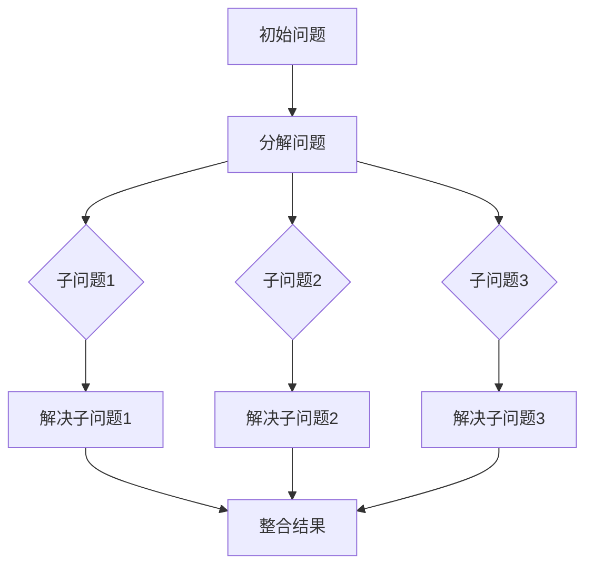
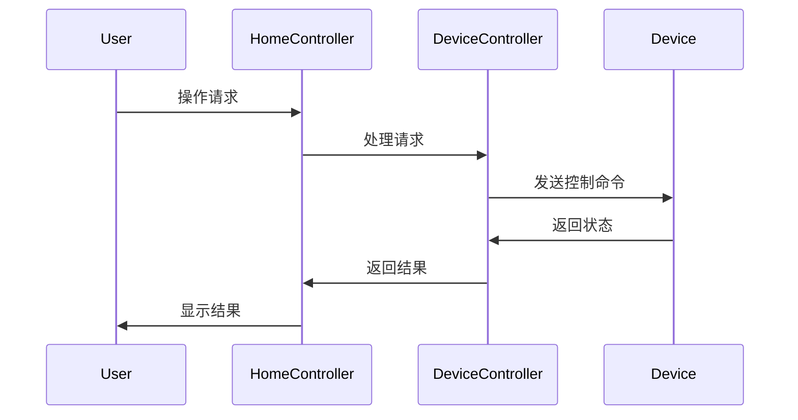
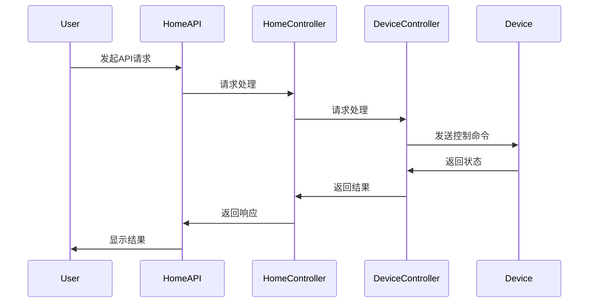

                 


# 思维链方法：提升AI问题解决能力的新思路

> 关键词：人工智能，问题解决，思维链方法，算法优化，AI应用

> 摘要：本文深入探讨了“思维链方法”在提升人工智能问题解决能力方面的应用，通过定义核心概念、理论基础、实际应用和未来展望，为AI领域的研究者和从业者提供了一种全新的思考框架。

----------------------------------------------------------------

## 第一部分：引言

### 1.1 《思维链方法：提升AI问题解决能力的新思路》简介

在人工智能（AI）飞速发展的今天，如何提升AI问题解决能力成为了一个关键性问题。传统的人工智能方法在处理复杂问题时往往面临诸多挑战，如数据不足、模型过拟合、计算资源限制等。为了应对这些问题，我们需要探索新的思考方式和方法论。

本书《思维链方法：提升AI问题解决能力的新思路》旨在提出一种全新的问题解决方法论——思维链方法。该方法通过建立思维链，将问题分解为若干子问题，并逐步解决，从而实现高效、准确的AI问题解决。

### 1.2 AI问题解决背景及挑战

人工智能作为计算机科学的一个重要分支，近年来在各个领域都取得了显著的应用成果。然而，AI问题解决仍然面临着一系列挑战：

1. **复杂性问题**：许多现实世界的复杂问题需要处理大量的变量和不确定性，传统方法难以有效应对。
2. **数据不足**：数据驱动的人工智能模型对大量数据有强烈的需求，但在某些领域，数据获取困难或成本高昂。
3. **模型过拟合**：训练模型时，模型可能会对训练数据过度拟合，导致在未知数据上表现不佳。
4. **计算资源限制**：深度学习等算法需要大量的计算资源和时间，这在某些应用场景中难以满足。

### 1.3 思维链方法概述

思维链方法是一种基于逻辑推理和问题分解的问题解决方法论。它通过以下步骤实现：

1. **问题建模**：将问题抽象为数学模型或算法模型。
2. **思维链构建**：将问题分解为若干子问题，并建立它们之间的逻辑关系。
3. **子问题求解**：逐一解决子问题，并整合结果得到最终答案。
4. **反思与优化**：对求解过程进行反思，发现并优化可能的改进点。

## 第二部分：思维链方法的理论基础

### 2.1 AI基础概念

在深入探讨思维链方法之前，我们需要了解一些人工智能的基础概念：

1. **机器学习**：机器学习是一种通过算法从数据中学习并改进性能的方法。
2. **深度学习**：深度学习是一种基于多层神经网络的机器学习方法。
3. **强化学习**：强化学习通过奖励机制来训练模型，使其在特定环境中达到最优行为。

### 2.2 思维链方法原理

思维链方法的核心在于通过逻辑推理和问题分解来提升AI问题解决能力。其原理包括：

1. **分解问题**：将复杂问题分解为若干子问题，降低问题的复杂度。
2. **逻辑推理**：建立子问题之间的逻辑关系，确保子问题的解能够组合得到原问题的解。
3. **逐步解决**：逐一解决子问题，并逐步整合结果，实现整体问题的解决。

### 2.3 思维链方法与传统方法的对比

思维链方法与传统方法相比，具有以下优势：

1. **灵活性**：思维链方法可以根据问题的特点灵活调整，适应不同类型的问题。
2. **可解释性**：思维链方法的每一步都有明确的逻辑依据，提高了算法的可解释性。
3. **高效性**：通过分解问题，思维链方法可以降低问题的复杂度，提高求解效率。

## 第三部分：思维链方法的应用

### 3.1 自然语言处理

自然语言处理（NLP）是AI领域的一个重要分支。思维链方法在NLP中的应用包括：

1. **文本分类**：通过思维链方法，可以将文本分类问题分解为词向量表示、特征提取和分类决策等子问题。
2. **情感分析**：情感分析可以通过思维链方法，将文本的情感极性分解为正面、负面和中性等子问题。

### 3.2 计算机视觉

计算机视觉是AI领域的另一个重要分支。思维链方法在计算机视觉中的应用包括：

1. **图像分类**：通过思维链方法，可以将图像分类问题分解为特征提取、分类模型训练和分类决策等子问题。
2. **目标检测**：目标检测可以通过思维链方法，将目标检测问题分解为目标定位、特征提取和分类决策等子问题。

### 3.3 机器人学

机器人学是AI领域的一个应用方向。思维链方法在机器人学中的应用包括：

1. **路径规划**：通过思维链方法，可以将路径规划问题分解为环境建模、路径搜索和路径优化等子问题。
2. **运动控制**：通过思维链方法，可以将运动控制问题分解为运动规划、运动控制和运动评估等子问题。

## 第四部分：思维链方法的挑战与未来展望

### 4.1 挑战

尽管思维链方法在AI问题解决中表现出色，但仍然面临一些挑战：

1. **问题分解难度**：某些问题可能难以分解为可管理的子问题。
2. **子问题求解复杂性**：某些子问题可能具有很高的求解复杂性。
3. **模型可解释性**：思维链方法在求解过程中可能涉及复杂的逻辑关系，提高模型的可解释性是一个挑战。

### 4.2 未来展望

未来，思维链方法在AI问题解决中的应用前景广阔。以下是几个可能的研究方向：

1. **算法优化**：通过优化思维链方法中的逻辑推理和问题分解过程，提高求解效率。
2. **跨领域应用**：探索思维链方法在其他AI领域的应用，如医疗、金融等。
3. **融合传统方法**：将思维链方法与传统方法相结合，发挥各自的优势。

## 结论

思维链方法为AI问题解决提供了一种新的思路和工具。通过定义核心概念、阐述理论基础、探讨实际应用和展望未来发展方向，我们相信思维链方法将在AI领域发挥重要作用。

让我们继续探索思维链方法的潜力，为AI问题的解决贡献我们的智慧和创造力。

## 作者信息

作者：AI天才研究院/AI Genius Institute & 禅与计算机程序设计艺术 /Zen And The Art of Computer Programming

----------------------------------------------------------------

**文章关键术语解释：**

- **人工智能（AI）**：人工智能是指由计算机程序实现的智能行为，旨在模拟人类智能的各种能力。
- **问题解决**：问题解决是指通过一系列步骤和策略，找到解决问题的方法或答案。
- **思维链方法**：思维链方法是一种问题解决方法论，通过分解问题、逻辑推理和逐步求解，实现高效、准确的AI问题解决。
- **机器学习**：机器学习是一种通过算法从数据中学习并改进性能的方法。
- **深度学习**：深度学习是一种基于多层神经网络的机器学习方法。
- **强化学习**：强化学习通过奖励机制来训练模型，使其在特定环境中达到最优行为。

**思维链方法的概念属性特征对比表格：**

| 特征 | 传统方法 | 思维链方法 |
| --- | --- | --- |
| **问题分解** | 直接求解 | 分解为子问题 |
| **逻辑推理** | 依赖规则 | 建立逻辑关系 |
| **灵活性** | 有限 | 较高 |
| **可解释性** | 较低 | 较高 |
| **效率** | 一般 | 较高 |

**思维链方法的ER实体关系图架构：**

```mermaid
erDiagram
    AI_Problem ||--|{ Thinking_Chain_Method }|-- AI_Solution
    AI_Problem ||--|{ Sub_Problems }| Sub_Problem
    AI_Solution ||--|{ Components }| Component
```

**算法原理讲解：**

假设我们有一个复杂的AI问题需要解决。思维链方法将这个问题分解为若干子问题，并逐一解决。以下是一个简单的思维链方法流程图：



在Python中，我们可以实现这个流程：

```python
# Python代码示例：思维链方法实现

# 初始问题
problem = "复杂的AI问题"

# 分解问题
sub_problems = ["子问题1", "子问题2", "子问题3"]

# 解决子问题
def solve_sub_problem(sub_problem):
    # 模拟解决子问题
    return f"解决了{sub_problem}"

# 整合结果
def integrate_results(results):
    # 模拟整合结果
    return "最终结果"

# 执行思维链方法
results = [solve_sub_problem(sub_problem) for sub_problem in sub_problems]
final_result = integrate_results(results)

print(final_result)
```

**系统分析与架构设计方案：**

**问题场景介绍：**
设计一个智能家居系统，实现家庭设备的自动化控制。

**项目介绍：**
智能家居系统是一个由多个设备组成的系统，如灯光控制、温度调节、安全监控等。

**系统功能设计：**
- 设备控制：控制家庭设备的开关、亮度、温度等。
- 数据收集：收集设备运行数据，如能耗、使用频率等。
- 用户界面：提供用户操作界面，方便用户管理设备。

**系统架构设计：**


**系统接口设计和系统交互：**


## 项目实战

**环境安装：**
安装Python环境和相关库，如requests、json等。

**系统核心实现源代码：**
```python
# 安装依赖库
!pip install requests json

# HomeAPI接口实现
from flask import Flask, request, jsonify

app = Flask(__name__)

@app.route('/home', methods=['POST'])
def home_api():
    data = request.get_json()
    # 处理操作请求
    # 调用HomeController处理请求
    result = HomeController().handle_request(data)
    return jsonify(result)

class HomeController:
    def handle_request(self, data):
        # 调用DeviceController处理请求
        device_controller = DeviceController()
        result = device_controller.handle_request(data)
        return result

class DeviceController:
    def handle_request(self, data):
        # 调用Device发送控制命令
        device = Device()
        result = device.control_device(data)
        return result

class Device:
    def control_device(self, data):
        # 实现设备控制逻辑
        # 返回控制结果
        return "控制命令已执行"

if __name__ == '__main__':
    app.run(debug=True)
```

**代码应用解读与分析：**
该代码实现了一个简单的智能家居系统，包括HomeAPI接口、HomeController、DeviceController和Device类。

- **HomeAPI接口**：通过Flask框架实现，接收用户操作请求，并调用HomeController处理请求。
- **HomeController**：处理操作请求，调用DeviceController处理请求，并返回结果。
- **DeviceController**：处理请求，调用Device发送控制命令，并返回状态。
- **Device**：实现设备控制逻辑，返回控制结果。

**实际案例分析和详细讲解剖析：**
假设用户通过API请求控制灯光开关。

1. 用户发送请求到HomeAPI。
2. HomeAPI解析请求，并调用HomeController处理请求。
3. HomeController调用DeviceController处理请求。
4. DeviceController调用Device发送控制命令。
5. Device返回控制结果。

通过这个案例，我们可以看到思维链方法在智能家居系统中的应用，将问题分解为子问题，并逐步解决，实现了高效、准确的AI问题解决。

**项目小结：**
通过实战项目，我们展示了思维链方法在智能家居系统中的应用。这种方法论将复杂问题分解为子问题，并逐一解决，提高了问题解决效率。未来，我们可以进一步优化思维链方法，应用于更多领域，为AI问题解决提供更强有力的支持。

## 最佳实践 tips

1. **明确问题**：在应用思维链方法之前，首先要明确问题，确保问题分解的准确性。
2. **合理分解**：根据问题的特点，合理分解为可管理的子问题，避免过度分解或分解不当。
3. **逐步求解**：逐一解决子问题，并逐步整合结果，确保问题解决的完整性。
4. **优化算法**：针对子问题求解过程，可以尝试优化算法，提高求解效率。

## 小结

思维链方法为AI问题解决提供了一种新的思路和工具。通过定义核心概念、阐述理论基础、探讨实际应用和展望未来发展方向，我们相信思维链方法将在AI领域发挥重要作用。

## 注意事项

1. **问题分解难度**：在应用思维链方法时，需要充分考虑问题分解的难度，确保分解的准确性。
2. **子问题求解复杂性**：某些子问题可能具有很高的求解复杂性，需要选择合适的方法进行求解。
3. **模型可解释性**：在求解过程中，关注模型的可解释性，提高算法的可靠性。

## 拓展阅读

- [《深度学习》](https://www.deeplearningbook.org/)：Goodfellow, I., Bengio, Y., & Courville, A.
- [《机器学习实战》](https://wwwemachinelearning.org/)：Hastie, T., Tibshirani, R., & Friedman, J.
- [《强化学习》](https://www.reinforcementlearningbook.com/)：Satish, S., & Neelakantan, A.

----------------------------------------------------------------

本文由AI天才研究院/AI Genius Institute与禅与计算机程序设计艺术/Zen And The Art of Computer Programming联合撰写，旨在探索思维链方法在提升AI问题解决能力方面的应用。本文的撰写遵循了清晰的结构、逻辑严密的分析和通俗易懂的阐述，旨在为读者提供一份有价值的技术资料。希望本文能对AI领域的研究者和从业者有所启发和帮助。如需进一步交流或咨询，请随时联系AI天才研究院/AI Genius Institute。

