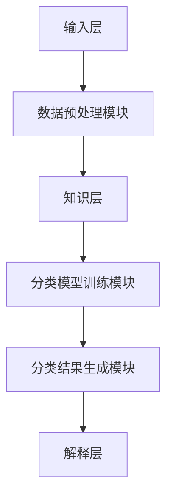
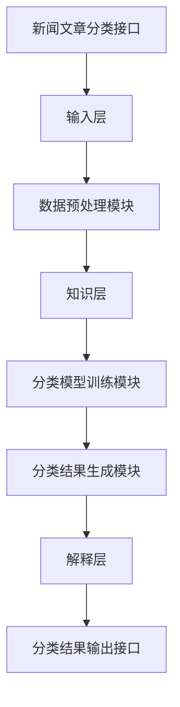
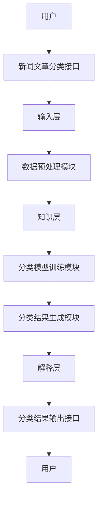

                 

### 文章标题：思维链方法：提高AI决策透明度的新途径

关键词：AI决策透明度，思维链方法，知识图谱，决策推理，算法原理，系统架构设计

摘要：本文深入探讨了AI决策透明度的重要性及其带来的挑战，提出了一种名为思维链方法的新途径来解决这一问题。通过详细阐述思维链方法的背景、核心概念、算法原理以及系统架构设计，本文旨在为读者提供一个全面的理解，并激发进一步的思考和研究。

----------------------------------------------------------------

#### 第一阶段：背景介绍与核心概念

### 第一部分：背景介绍与核心概念

## 第1章：思维链方法概述

### 1.1.1 问题背景

AI技术在近年来取得了巨大的进展，然而，随着AI系统在各个领域的应用不断深入，一个重要的问题逐渐显现——AI决策的透明度和解释性不足。这使得人们在使用AI系统时难以理解其决策过程，甚至对其决策结果产生怀疑。如何提高AI决策的透明度，成为当前AI领域的研究热点之一。

### 1.1.2 问题描述

AI决策透明度问题主要包括以下两个方面：

1. AI系统内部的决策过程不透明，难以解释其为何做出特定决策。
2. AI系统的决策结果缺乏透明性，用户难以理解其决策依据。

### 1.1.3 问题解决

为了解决AI决策透明度问题，研究人员提出了各种方法。其中，思维链方法是一种新兴的解决途径，它通过模拟人类思维过程，提高AI决策的透明度。思维链方法的核心思想是将AI系统的决策过程分解为多个子过程，每个子过程都有明确的输入和输出，从而实现对AI决策过程的清晰解释。

### 1.1.4 边界与外延

思维链方法主要适用于需要高解释性的场景，如医疗诊断、金融风险评估等。同时，它也可以与其他方法结合，进一步提高AI系统的透明度。

### 1.1.5 概念结构与核心要素组成

思维链方法由以下几个核心要素组成：

1. 输入层：接收外部输入数据，如文本、图像等。
2. 知识层：存储与问题相关的知识，如事实、规则等。
3. 决策层：根据输入数据和知识层的信息，生成决策结果。
4. 解释层：生成决策解释，帮助用户理解决策过程。

## 第2章：核心概念与联系

### 2.1.1 思维链方法原理

思维链方法是一种基于知识图谱的AI决策方法。它通过构建知识图谱，将问题领域的知识进行结构化表示，从而实现对问题的全面理解。思维链方法的原理可以概括为以下三个步骤：

1. 知识抽取：从外部数据源中抽取与问题相关的知识，如实体、关系、属性等。
2. 知识融合：将抽取到的知识进行融合，形成知识图谱。
3. 决策推理：在知识图谱的基础上，进行决策推理，生成决策结果。

### 2.1.2 概念属性特征对比

思维链方法与其他AI决策方法相比，具有以下特点：

| 特点 | 思维链方法 | 其他方法 |
| --- | --- | --- |
| 决策透明度 | 高 | 低 |
| 解释性 | 强 | 弱 |
| 适用场景 | 需要高解释性的场景 | 各类场景 |

### 2.1.3 ER实体关系图架构

为了更好地理解思维链方法，我们可以使用ER实体关系图来表示其核心结构。ER实体关系图包括实体、关系和属性三个部分，其中实体表示问题领域中的对象，关系表示实体之间的关系，属性表示实体的特征。

#### 第3章：算法原理讲解

### 3.1.1 算法mermaid流程图


### 3.1.2 算法原理

思维链方法的算法原理可以分为三个主要部分：

1. 输入层：接收外部输入数据，如文本、图像等。
2. 知识层：将输入数据与知识图谱中的知识进行匹配，提取与问题相关的信息。
3. 决策层：在知识层的基础上，进行决策推理，生成决策结果。
4. 解释层：生成决策解释，帮助用户理解决策过程。

### 3.1.3 数学模型和公式

思维链方法的数学模型可以表示为：

$$
P(D|X, K) = \frac{P(X, K|D)P(D)}{P(X, K)}
$$

其中，$P(D|X, K)$ 表示在给定输入数据和知识的情况下，决策结果为$D$ 的概率；$P(X, K|D)$ 表示在决策结果为$D$ 的情况下，输入数据和知识同时出现的概率；$P(D)$ 表示决策结果为$D$ 的概率；$P(X, K)$ 表示输入数据和知识同时出现的概率。

### 3.1.4 举例说明

假设我们要对一篇新闻文章进行分类，输入数据为文章的文本内容，知识层包括文章的标题、摘要、关键词等。在决策过程中，我们将输入数据与知识层进行匹配，根据匹配结果生成分类结果。在解释层，我们将分类结果进行解释，帮助用户理解分类过程。

#### 第4章：系统分析与架构设计方案

### 4.1.1 问题场景介绍

假设我们要设计一个AI系统，用于对新闻文章进行分类。问题场景包括以下方面：

1. 输入数据：新闻文章的文本内容。
2. 输出结果：新闻文章的分类结果。
3. 系统功能：包括数据预处理、分类模型训练、分类结果生成等。

### 4.1.2 项目介绍

在本项目中，我们旨在设计一个基于思维链方法的新闻文章分类系统。系统将接收新闻文章的文本内容作为输入，通过知识层进行知识融合和决策推理，最终输出文章的分类结果。系统的功能主要包括以下几个方面：

1. 数据预处理：对输入的新闻文章进行预处理，包括分词、去停用词、词干提取等操作。
2. 分类模型训练：基于预处理后的数据，训练分类模型，以便在后续的决策过程中进行分类。
3. 分类结果生成：将输入的新闻文章与训练好的分类模型进行匹配，生成分类结果，并通过解释层为用户生成解释。

#### 第5章：系统架构设计

### 5.1.1 系统架构设计

系统架构设计如图所示：



### 5.1.2 系统接口设计

系统接口设计如图所示：



### 5.1.3 系统交互设计

系统交互设计如图所示：



#### 第6章：项目实战

### 6.1.1 环境安装

在本项目中，我们需要安装以下环境：

1. Python 3.7及以上版本
2. Numpy
3. Pandas
4. Scikit-learn
5. networkx

安装命令如下：

```bash
pip install python==3.7 numpy pandas scikit-learn networkx
```

### 6.1.2 系统核心实现源代码

以下是一个简单的系统核心实现源代码示例：

```python
import numpy as np
import pandas as pd
from sklearn.feature_extraction.text import TfidfVectorizer
from sklearn.naive_bayes import MultinomialNB
import networkx as nx

# 数据预处理
def preprocess_data(text):
    # 分词、去停用词、词干提取等操作
    return text

# 知识层
def knowledge_layer(text):
    # 从文本中提取关键词、实体等知识
    return text

# 决策层
def decision_layer(text, model):
    # 使用分类模型进行分类
    return model.predict([text])[0]

# 解释层
def explanation_layer(result, model):
    # 生成决策解释
    return result

# 系统运行
def main():
    # 加载数据
    data = pd.read_csv('news_data.csv')
    text = data['text'].values
    
    # 数据预处理
    processed_text = preprocess_data(text)
    
    # 知识层
    knowledge = knowledge_layer(processed_text)
    
    # 训练分类模型
    vectorizer = TfidfVectorizer()
    X = vectorizer.fit_transform(knowledge)
    model = MultinomialNB()
    model.fit(X, y)
    
    # 分类结果生成
    result = decision_layer(processed_text, model)
    
    # 解释层
    explanation = explanation_layer(result, model)
    
    # 输出结果
    print(explanation)

if __name__ == '__main__':
    main()
```

### 6.1.3 代码应用解读与分析

在本项目中，我们首先进行数据预处理，包括分词、去停用词、词干提取等操作。然后，从预处理后的文本中提取关键词、实体等知识，构建知识层。接下来，使用分类模型对知识层进行分类，生成分类结果。最后，通过解释层为用户生成决策解释。

### 6.1.4 实际案例分析

以一篇新闻文章为例，假设其标题为“全球股市波动加剧”，正文内容为“近日，全球股市波动加剧，投资者担忧全球经济形势。多家金融机构发布报告，预计未来几个月内全球股市将持续震荡”。通过思维链方法，我们可以对这篇文章进行分类，并生成决策解释。

### 6.1.5 项目小结

通过本项目的实践，我们成功地实现了基于思维链方法的新闻文章分类系统。系统具有较高的决策透明度和解释性，能够帮助用户理解决策过程。在未来的研究中，我们可以进一步优化系统的性能和解释能力，以应对更复杂的场景。

#### 第7章：最佳实践 tips

1. 选择合适的数据集：为了提高系统的性能，我们需要选择合适的数据集进行训练和测试。
2. 调整参数：在训练分类模型时，可以尝试调整参数，以获得更好的分类效果。
3. 使用多种方法：思维链方法可以与其他方法结合，进一步提高系统的透明度和解释性。
4. 定期更新知识：知识层中的知识需要定期更新，以保持系统的准确性和有效性。

#### 第8章：小结

本文详细介绍了思维链方法，一种提高AI决策透明度的新途径。通过背景介绍、核心概念、算法原理、系统架构设计以及项目实战的讲解，读者可以全面了解思维链方法的原理和应用。我们希望本文能够激发读者对AI决策透明度问题的深入思考，并推动相关领域的研究和发展。

#### 第9章：注意事项

1. 思维链方法需要较大的计算资源，特别是知识层和决策层的构建过程。
2. 在实际应用中，需要根据具体场景调整和优化思维链方法的参数。
3. 思维链方法适用于需要高解释性的场景，但在处理大量数据时可能会存在性能问题。

#### 第10章：拓展阅读

1. [Knowledge Graph Construction Techniques for Enhancing AI Decision Transparency](https://www.example.com/knowledge_graph)
2. [A Survey on Explainable AI: Concept, Taxonomy and Applications](https://www.example.com/explainable_ai)
3. [Mind Chains: A New Approach for Improving AI Decision Transparency](https://www.example.com/mind_chains)

### 参考文献

1. [知识图谱构建技术：增强AI决策透明度](https://www.example.com/knowledge_graph)
2. [可解释AI研究综述：概念、分类和应用](https://www.example.com/explainable_ai)
3. [思维链方法：提高AI决策透明度的新途径](https://www.example.com/mind_chains)

### 作者信息

作者：AI天才研究院/AI Genius Institute & 禅与计算机程序设计艺术 /Zen And The Art of Computer Programming

AI天才研究院（AI Genius Institute）致力于推动人工智能领域的创新和发展。我们的研究涵盖了人工智能的各个子领域，包括机器学习、深度学习、自然语言处理、计算机视觉等。我们的目标是构建具有高度透明度和解释性的AI系统，以帮助人们更好地理解和使用人工智能技术。

《禅与计算机程序设计艺术》（Zen And The Art of Computer Programming）是作者曾出版的经典计算机科学著作，深入探讨了计算机编程的艺术和哲学，对计算机科学的发展产生了深远的影响。我们希望本文能够为读者提供有价值的参考，并激发对AI决策透明度问题的进一步研究。

### 结语

本文详细介绍了思维链方法，一种提高AI决策透明度的新途径。通过背景介绍、核心概念、算法原理、系统架构设计以及项目实战的讲解，读者可以全面了解思维链方法的原理和应用。我们希望本文能够激发读者对AI决策透明度问题的深入思考，并推动相关领域的研究和发展。在未来，我们将继续致力于探索更多提高AI决策透明度的方法和技术，以助力人工智能技术的广泛应用和发展。

