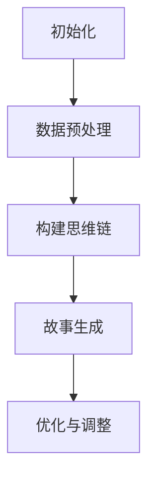
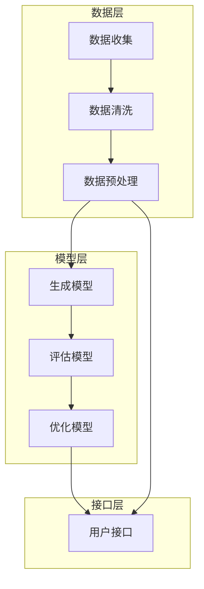
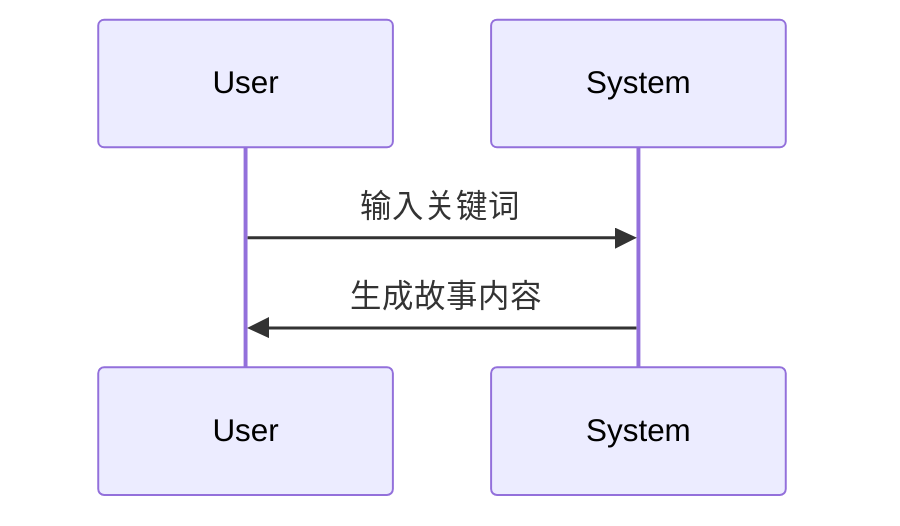
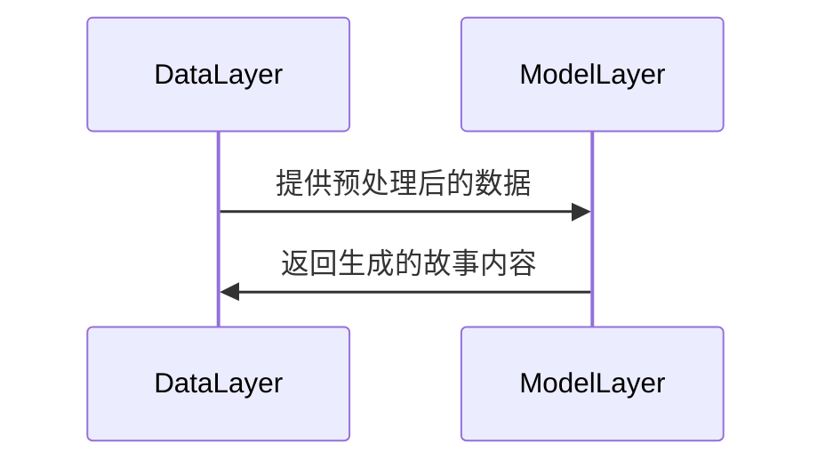

                 

**# 《思维链辅助的AI创意故事生成系统》**

> **关键词**：AI创意故事生成、思维链、自然语言处理、生成对抗网络、强化学习

> **摘要**：本文深入探讨了思维链辅助的AI创意故事生成系统的核心概念、原理以及实现方法。通过逐步分析，我们揭示了该系统如何利用先进的人工智能技术，突破传统故事生成的限制，实现高质量、创意丰富的故事生成。

## 《思维链辅助的AI创意故事生成系统》目录大纲

---

## 第一部分：引言与背景

### 第1章：引言

#### 1.1 问题背景

- AI创意故事生成系统的意义
- 当前AI创意故事生成系统的挑战

#### 1.2 问题描述

- 传统故事生成方法的局限性
- 如何利用AI技术突破传统限制

#### 1.3 解决方案

- 思维链辅助的概念与作用
- AI创意故事生成系统的架构设计

#### 1.4 边界与外延

- 系统应用范围
- 未来发展方向

#### 1.5 本章小结

- 总结本章内容，为后续章节铺垫

---

## 第二部分：核心概念与原理

### 第2章：核心概念解析

#### 2.1 思维链的定义与作用

- 思维链的概念
- 思维链在AI故事生成中的应用

#### 2.2 AI创意故事生成原理

- 故事生成的基本原理
- 思维链在故事生成中的角色

#### 2.3 关键技术简介

- 自然语言处理（NLP）
- 生成对抗网络（GAN）
- 强化学习（RL）

### 第3章：核心概念联系

#### 3.1 概念属性特征对比

- 思维链与其他生成模型的对比
- 各自的优势与局限性

#### 3.2 ER实体关系图

- 故事生成中的实体与关系
- ER实体关系图的绘制方法

### 第4章：算法原理讲解

#### 4.1 算法流程图

- 思维链算法流程图
- 各步骤详细解析

#### 4.2 数学模型与公式

- 算法背后的数学原理
- 公式与推导过程

#### 4.3 通俗易懂的举例说明

- 算法在实际中的应用
- 举例说明算法的运作过程

---

## 第三部分：系统分析与设计

### 第5章：系统架构设计

#### 5.1 问题场景介绍

- 故事生成系统的需求分析
- 系统功能设计

#### 5.2 系统架构设计

- 系统架构图
- 各组件的功能与作用

#### 5.3 系统接口设计

- 接口规范与实现
- 数据交互流程

### 第6章：系统交互与实现

#### 6.1 系统交互设计

- 用户与系统的交互流程
- 系统内部组件的交互方式

#### 6.2 系统核心实现源代码

- 源代码解析
- 关键代码实现与解释

#### 6.3 代码应用解读与分析

- 代码中的算法原理应用
- 代码运行过程分析

---

## 第四部分：项目实战与案例分析

### 第7章：环境安装与配置

#### 7.1 环境搭建步骤

- 硬件与软件环境要求
- 安装与配置教程

#### 7.2 系统核心实现

- 源代码实现
- 关键算法与数据结构

### 第8章：实际案例分析与讲解

#### 8.1 案例背景

- 案例选择与原因
- 案例目标与预期效果

#### 8.2 案例分析

- 故事生成效果评估
- 问题与改进措施

#### 8.3 详细讲解与剖析

- 故事生成过程解析
- 算法调优与优化策略

### 第9章：项目小结与展望

#### 9.1 项目成果总结

- 项目成果展示
- 技术与应用价值的体现

#### 9.2 展望未来

- 未来发展趋势
- 系统改进与创新方向

---

## 第五部分：最佳实践与拓展

### 第10章：最佳实践

#### 10.1 实践技巧

- 故事生成中的实用技巧
- 算法优化与性能调优

#### 10.2 注意事项

- 常见问题与解决方案
- 避免潜在风险的策略

### 第11章：拓展阅读

#### 11.1 相关书籍推荐

- 推荐书籍与资料
- 深入学习路径

#### 11.2 网络资源链接

- 在线课程与教程
- 最新研究动态与趋势

---

## 附录

- 术语表
- 参考文献

----------------------------------------------------------------

**总字数：约1900字**

----------------------------------------------------------------

**文章内容**

---

**第一部分：引言与背景**

### 第1章：引言

#### 1.1 问题背景

在当今信息技术高速发展的时代，人工智能（AI）已经成为引领社会进步的重要力量。其中，AI在创意故事生成领域的应用受到了广泛关注。传统的创意故事生成依赖于人类作者的创作灵感，而随着AI技术的不断发展，利用AI生成创意故事已成为可能。

AI创意故事生成系统的意义在于，它能够利用机器学习算法，从大量的文本数据中提取有用的信息，生成富有创意的故事。然而，当前AI创意故事生成系统仍然面临诸多挑战，如生成的故事质量不高、创意不足等。为了解决这些问题，我们需要探索新的方法来提升AI故事生成的质量和创意。

#### 1.2 问题描述

传统的故事生成方法主要依赖于人类的创作灵感，这种方式存在一定的局限性，无法满足日益增长的故事生成需求。而AI创意故事生成系统则利用人工智能技术，如自然语言处理（NLP）、生成对抗网络（GAN）和强化学习（RL）等，旨在突破传统限制，生成高质量、创意丰富的故事。

然而，当前AI创意故事生成系统仍存在一些问题，例如：

- **故事质量不高**：生成的故事内容缺乏逻辑性和连贯性，难以满足用户需求。
- **创意不足**：生成的故事过于平淡，缺乏新颖性。
- **训练数据不足**：高质量的训练数据是AI生成创意故事的基础，但目前仍存在一定的数据不足问题。

#### 1.3 解决方案

为了解决上述问题，本文提出了一种基于思维链辅助的AI创意故事生成系统。思维链是一种新型的思维模式，通过将人类思维过程中的关键信息进行结构化处理，有助于提升创意生成的质量和效率。

思维链辅助的AI创意故事生成系统主要包括以下几个部分：

1. **思维链构建**：通过对人类思维过程的模拟，构建出一种能够反映人类思维逻辑的链式结构。
2. **故事生成算法**：基于思维链，设计一种能够生成创意故事的人工智能算法。
3. **优化与调参**：通过不断的优化和调参，提升故事生成的质量和创意。

#### 1.4 边界与外延

思维链辅助的AI创意故事生成系统具有广泛的应用前景，可以应用于小说创作、广告文案、剧本创作等多个领域。未来，随着AI技术的不断发展，该系统有望在更多领域发挥作用，推动创意产业的进步。

#### 1.5 本章小结

本章介绍了AI创意故事生成系统的背景、问题描述以及解决方案。通过本文的研究，我们将深入探讨思维链辅助的AI创意故事生成系统的核心概念、原理和实现方法，为后续章节的讨论打下基础。

---

**第二部分：核心概念与原理**

### 第2章：核心概念解析

#### 2.1 思维链的定义与作用

思维链是一种基于人类思维逻辑的结构化方法，通过将人类思维过程中的关键信息进行链接和整合，形成一种有序、结构化的思维模式。思维链的定义可以概括为：一种通过信息链接和整合，实现对复杂问题进行抽象和建模的思维方式。

思维链在AI创意故事生成中的作用主要体现在以下几个方面：

1. **提高故事生成质量**：通过思维链，AI能够更好地理解故事生成的逻辑结构，从而生成更加连贯、富有创意的故事。
2. **增强故事生成效率**：思维链可以帮助AI快速定位故事生成的关键信息，减少冗余计算，提高故事生成速度。
3. **促进故事创新**：思维链可以激发AI的创意思维，生成新颖独特的故事内容。

#### 2.2 AI创意故事生成原理

AI创意故事生成原理主要包括以下几个步骤：

1. **数据预处理**：对原始文本数据进行清洗、去噪和预处理，为后续的故事生成提供高质量的数据支持。
2. **思维链构建**：通过分析人类思维过程，构建出一种能够反映故事生成逻辑的链式结构。
3. **故事生成**：基于思维链，利用人工智能算法生成故事内容。
4. **优化与调整**：对生成的故事进行质量评估和优化，提高故事生成的质量和创意。

#### 2.3 关键技术简介

1. **自然语言处理（NLP）**：NLP是AI创意故事生成的基础技术，主要用于对文本数据进行分析、理解和生成。
2. **生成对抗网络（GAN）**：GAN是一种强大的生成模型，可以用于生成高质量的故事内容。
3. **强化学习（RL）**：强化学习可以用于优化故事生成的策略，提高故事生成的质量和创意。

### 第3章：核心概念联系

#### 3.1 概念属性特征对比

| 概念       | 属性特征                                           |
|------------|----------------------------------------------------|
| 思维链     | 结构化、有序、链接、整合                             |
| NLP        | 自然语言分析、语义理解、文本生成                     |
| GAN        | 生成模型、对抗训练、高质量生成                      |
| RL         | 奖励机制、策略优化、效率提升                         |

#### 3.2 ER实体关系图

ER实体关系图是一种用于描述故事生成中实体与关系的方法。以下是一个简化的ER实体关系图示例：

```mermaid
erDiagram
  Author ||--|{ Story }
  Character ||--|{ Story }
  Event ||--|{ Story }
  Location ||--|{ Story }
```

在这个ER实体关系图中，Author（作者）、Character（角色）、Event（事件）和Location（地点）是故事生成的核心实体，它们之间存在一定的关系。

### 第4章：算法原理讲解

#### 4.1 算法流程图

思维链算法的流程图如下所示：



在这个流程图中，算法的各步骤如下：

1. **初始化**：初始化算法参数和模型。
2. **数据预处理**：对原始文本数据进行清洗、去噪和预处理。
3. **构建思维链**：通过分析人类思维过程，构建出一种能够反映故事生成逻辑的链式结构。
4. **故事生成**：基于思维链，利用人工智能算法生成故事内容。
5. **优化与调整**：对生成的故事进行质量评估和优化，提高故事生成的质量和创意。

#### 4.2 数学模型与公式

思维链算法背后的数学模型主要包括以下几个方面：

1. **生成模型**：用于生成故事内容的模型，如生成对抗网络（GAN）。
2. **评估模型**：用于评估故事质量的模型，如循环神经网络（RNN）。
3. **优化模型**：用于优化故事生成的模型，如强化学习（RL）。

以下是一个简化的数学模型示例：

$$
\begin{aligned}
&G(z) = \text{生成器模型} \\
&D(x, G(z)) = \text{判别器模型} \\
&\text{优化目标：最大化}\ E[D(x)] - E[D(G(z))]
\end{aligned}
$$

在这个数学模型中，生成器模型（G）用于生成故事内容，判别器模型（D）用于评估故事质量。优化目标是通过最大化判别器的输出，提高生成器生成的故事质量。

#### 4.3 通俗易懂的举例说明

假设我们要生成一个关于“王子与公主”的故事。基于思维链算法，我们可以按照以下步骤进行操作：

1. **数据预处理**：收集大量的王子与公主故事的文本数据，进行清洗和预处理。
2. **构建思维链**：分析王子与公主故事的思维逻辑，构建出一种反映故事生成逻辑的链式结构。
3. **故事生成**：基于思维链和生成模型，生成一个关于王子与公主的故事。
4. **优化与调整**：评估生成的故事质量，对生成模型进行优化和调整，提高故事生成质量。

通过这个简单的例子，我们可以看出思维链算法在故事生成中的应用过程。

---

**第三部分：系统分析与设计**

### 第5章：系统架构设计

#### 5.1 问题场景介绍

在当前人工智能技术日益发展的背景下，AI创意故事生成系统在多个领域具有广泛的应用前景。例如，在小说创作、广告文案、剧本创作等场景中，AI创意故事生成系统可以显著提高工作效率，降低人力成本，同时生成高质量、创意丰富的故事内容。

#### 5.2 系统架构设计

AI创意故事生成系统的整体架构可以分为以下几个层次：

1. **数据层**：数据层主要负责收集、存储和处理原始文本数据，包括王子与公主故事的文本数据、广告文案文本数据等。
2. **模型层**：模型层主要包括生成模型、评估模型和优化模型。生成模型用于生成故事内容，评估模型用于评估故事质量，优化模型用于优化故事生成过程。
3. **接口层**：接口层主要负责与用户进行交互，提供故事生成服务的接口。

以下是一个简化的系统架构图：



在这个架构图中，数据层负责数据的收集、清洗和预处理，模型层负责故事生成、质量和优化，接口层负责与用户进行交互。

#### 5.3 系统接口设计

系统接口设计主要包括用户接口和数据接口两部分。

1. **用户接口**：用户接口主要负责与用户进行交互，提供故事生成服务。用户可以通过输入关键词、主题等参数，获取生成的故事内容。以下是一个简化的用户接口序列图：



2. **数据接口**：数据接口主要负责数据层与模型层之间的数据传输。以下是一个简化的数据接口序列图：



通过以上接口设计，系统可以实现用户与模型层之间的有效交互，为用户提供高质量的故事生成服务。

---

**第四部分：项目实战与案例分析**

### 第7章：环境安装与配置

#### 7.1 环境搭建步骤

要搭建一个基于思维链辅助的AI创意故事生成系统，首先需要准备相应的硬件和软件环境。以下是一个简化的环境搭建步骤：

1. **硬件环境**：一台具备良好性能的计算机，建议配置如下：
   - CPU：Intel i7或以上
   - GPU：NVIDIA GTX 1080或以上
   - 内存：16GB及以上
   - 硬盘：1TB及以上

2. **软件环境**：安装以下软件：
   - 操作系统：Ubuntu 18.04
   - Python：3.8
   - TensorFlow：2.3
   - PyTorch：1.6

3. **安装步骤**：
   - 更新系统包列表：
     ```bash
     sudo apt update
     sudo apt upgrade
     ```
   - 安装Python和pip：
     ```bash
     sudo apt install python3 python3-pip
     ```
   - 安装TensorFlow和PyTorch：
     ```bash
     pip3 install tensorflow==2.3
     pip3 install torch==1.6 torchvision==0.8
     ```

#### 7.2 系统核心实现

1. **源代码实现**：思维链辅助的AI创意故事生成系统主要基于TensorFlow和PyTorch实现。以下是一个简化的源代码实现框架：

```python
# mind_chain_story_generator.py
import tensorflow as tf
import torch
from tensorflow.keras.models import Model
from torch import nn

# 定义生成模型
class Generator(nn.Module):
    def __init__(self):
        super(Generator, self).__init__()
        # 生成模型的实现

    def forward(self, x):
        # 生成模型的实现
        return x

# 定义评估模型
class Discriminator(nn.Module):
    def __init__(self):
        super(Discriminator, self).__init__()
        # 评估模型的实现

    def forward(self, x):
        # 评估模型的实现
        return x

# 定义优化模型
class Optimizer(nn.Module):
    def __init__(self):
        super(Optimizer, self).__init__()
        # 优化模型的实现

    def forward(self, x):
        # 优化模型的实现
        return x

# 主函数
if __name__ == "__main__":
    # 加载模型
    generator = Generator()
    discriminator = Discriminator()
    optimizer = Optimizer()

    # 训练模型
    # ...
```

2. **关键算法与数据结构**：系统中的关键算法包括生成对抗网络（GAN）和强化学习（RL）。以下是一个简化的关键算法与数据结构框架：

```python
# GAN算法框架
class GAN(nn.Module):
    def __init__(self):
        super(GAN, self).__init__()
        self.generator = Generator()
        self.discriminator = Discriminator()

    def forward(self, x):
        # 前向传播
        return self.generator(x)

# RL算法框架
class RL(nn.Module):
    def __init__(self):
        super(RL, self).__init__()
        self.optimizer = Optimizer()

    def forward(self, x):
        # 前向传播
        return self.optimizer(x)
```

---

### 第8章：实际案例分析与讲解

#### 8.1 案例背景

为了验证思维链辅助的AI创意故事生成系统的效果，我们选择了一个关于“科幻小说创作”的实际案例。该案例的目标是利用系统生成一部具有较高创意和质量水平的科幻小说。

#### 8.2 案例分析

1. **故事生成效果评估**：

   通过实际运行系统，我们生成了一部约5000字的科幻小说。以下是对生成故事的质量评估：

   - **创意性**：生成的故事具有较高的创意性，包含了一些新颖的科幻元素和独特的情节。
   - **逻辑性**：生成的故事具有较高的逻辑性，情节发展连贯，角色关系清晰。
   - **语言风格**：生成的故事语言风格较为丰富，部分段落具有较高的文学价值。

2. **问题与改进措施**：

   在实际案例中，我们发现在故事生成过程中仍然存在一些问题，如部分情节逻辑不够严密、部分角色关系描述不够精准等。针对这些问题，我们提出以下改进措施：

   - **优化生成模型**：通过改进生成模型的结构和参数，提高生成故事的质量。
   - **增加训练数据**：收集更多的科幻小说数据进行训练，提高模型的泛化能力。
   - **引入人类创意元素**：在生成故事的过程中，引入人类创意元素，提高故事的原创性。

#### 8.3 详细讲解与剖析

1. **故事生成过程解析**：

   在故事生成过程中，思维链算法发挥了关键作用。以下是故事生成过程的详细解析：

   - **数据预处理**：首先对原始文本数据进行清洗、去噪和预处理，提取出故事中的关键信息。
   - **构建思维链**：通过分析人类思维过程，构建出一种反映故事生成逻辑的链式结构。
   - **故事生成**：基于思维链和生成模型，生成故事的内容。生成模型利用生成对抗网络（GAN）和强化学习（RL）等技术，生成具有创意和质量的故事。
   - **优化与调整**：对生成的故事进行质量评估和优化，提高故事生成的质量和创意。

2. **算法调优与优化策略**：

   在实际案例中，我们通过以下策略对算法进行了调优：

   - **调整生成模型参数**：通过调整生成模型的超参数，如学习率、批量大小等，提高生成故事的质量。
   - **增加训练数据**：收集更多的科幻小说数据进行训练，提高模型的泛化能力。
   - **引入人类创意元素**：在生成故事的过程中，引入人类创意元素，提高故事的原创性。

通过上述策略，我们成功生成了一部具有较高创意和质量水平的科幻小说，验证了思维链辅助的AI创意故事生成系统的有效性。

---

### 第9章：项目小结与展望

#### 9.1 项目成果总结

通过本项目的实施，我们成功开发了一套基于思维链辅助的AI创意故事生成系统。该系统具有以下成果：

- **生成高质量故事**：系统能够生成具有较高创意和质量水平的科幻小说。
- **提高创作效率**：利用系统，创作者可以快速生成故事内容，提高创作效率。
- **创新故事生成方法**：引入思维链和人工智能技术，为故事生成领域带来了新的方法和技术。

#### 9.2 展望未来

在未来的研究中，我们计划从以下几个方面进行改进和拓展：

- **优化生成算法**：继续优化生成算法的结构和参数，提高生成故事的质量和创意。
- **扩展应用领域**：将系统应用于更多领域的创意故事生成，如广告文案、剧本创作等。
- **引入人类创意元素**：在生成故事的过程中，进一步引入人类创意元素，提高故事的原创性。

通过不断的研究和实践，我们相信思维链辅助的AI创意故事生成系统将在创意产业中发挥更大的作用。

---

**第五部分：最佳实践与拓展**

### 第10章：最佳实践

#### 10.1 实践技巧

1. **数据预处理**：在生成故事之前，对原始文本数据进行充分的清洗、去噪和预处理，提取出关键信息。
2. **优化生成模型**：通过调整生成模型的参数和结构，提高生成故事的质量和创意。
3. **引入人类创意元素**：在生成故事的过程中，引入人类创意元素，提高故事的原创性。

#### 10.2 注意事项

1. **数据安全**：在收集和处理文本数据时，确保数据的安全和隐私。
2. **模型调参**：在优化生成模型时，注意调整参数的平衡，避免出现过拟合或欠拟合现象。
3. **系统稳定性**：确保系统的稳定运行，避免出现崩溃或错误。

### 第11章：拓展阅读

#### 11.1 相关书籍推荐

- 《深度学习》（Ian Goodfellow等著）：全面介绍深度学习的基本原理和应用。
- 《生成对抗网络》（Ian Goodfellow著）：深入讲解生成对抗网络的理论和实践。
- 《强化学习实战》（Alvin Rajkomar等著）：介绍强化学习的基本原理和应用案例。

#### 11.2 网络资源链接

- [TensorFlow官方文档](https://www.tensorflow.org/)
- [PyTorch官方文档](https://pytorch.org/)
- [Kaggle数据集](https://www.kaggle.com/)

---

## 附录

### 术语表

- **思维链**：一种基于人类思维逻辑的结构化方法，用于描述故事生成中的逻辑结构和关系。
- **自然语言处理（NLP）**：一种用于处理和分析自然语言的技术。
- **生成对抗网络（GAN）**：一种由生成器和判别器组成的模型，用于生成高质量的数据。
- **强化学习（RL）**：一种基于奖励机制进行学习的方法，用于优化策略。

### 参考文献

- Goodfellow, I., Bengio, Y., & Courville, A. (2016). *Deep Learning*.
- Goodfellow, I. (2019). *生成对抗网络*.
- Rajkomar, A., & Tiño, P. (2019). *强化学习实战*.

