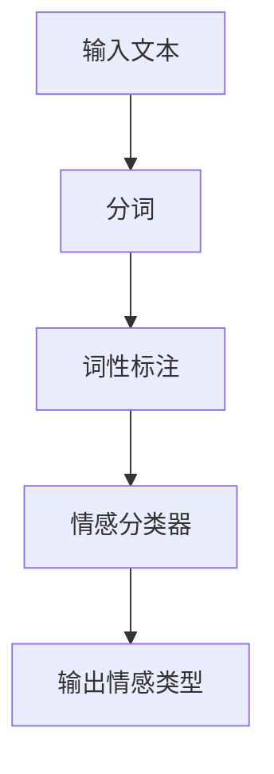
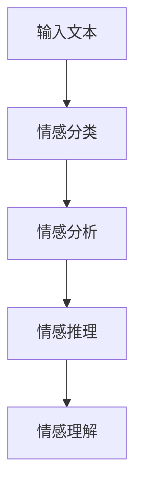
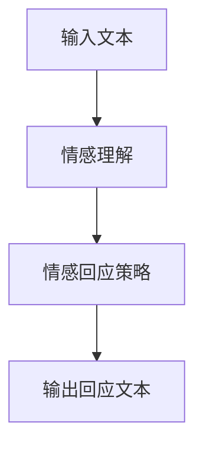
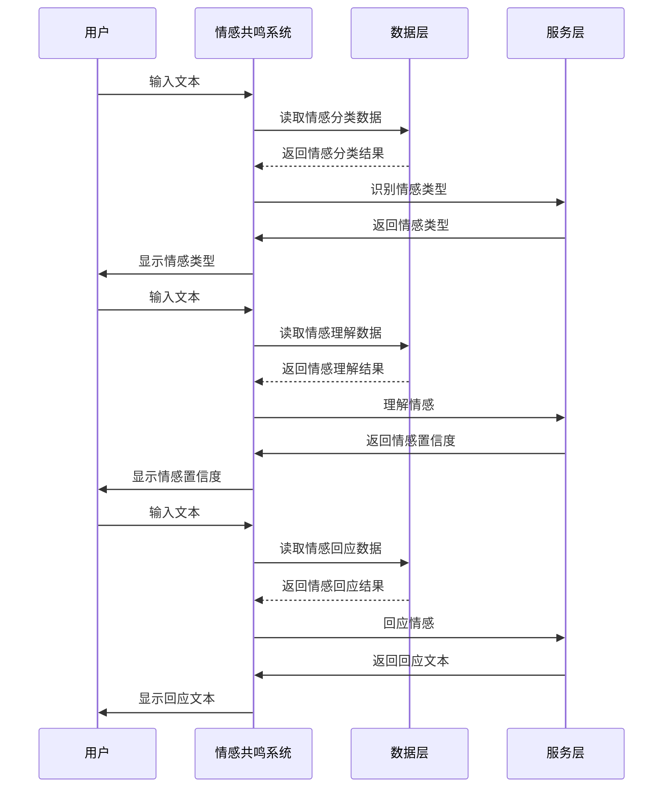

                 


### # {{此处是文章标题}}

> 关键词：情感共鸣、LLM、情感识别、情感理解、情感回应

> 摘要：本文以情感共鸣深度评价为核心，探讨大型语言模型（LLM）在理解和回应复杂情感的能力。文章从问题背景、核心概念、算法原理及数学模型、系统架构设计、项目实战等方面进行深入分析，为相关研究和应用提供参考。

---

## 第一部分：问题背景与概述

### 第1章：情感共鸣深度背景介绍

#### 1.1 问题背景

**情感共鸣的定义与重要性**

情感共鸣是指个体在感受到他人情感时，产生与之相似或相同的情感体验。这种能力在人类社会中具有重要作用，有助于建立人际关系、促进沟通和理解。然而，随着人工智能技术的发展，如何评价和增强人工智能在情感共鸣方面的能力成为一个重要的研究课题。

**LLM的情感理解与回应**

大型语言模型（Large Language Models，简称LLM）具有强大的文本理解和生成能力，但其在情感共鸣方面的表现仍存在局限性。本文将探讨LLM在理解和回应复杂情感方面的能力，以期为相关研究和应用提供参考。

**边界与外延**

情感共鸣深度评价的范围包括但不限于情感识别、情感理解、情感回应和情感表达等方面。此外，本文将讨论不同情感类型和情感强度的评价标准，以及影响评价结果的因素。

#### 1.2 核心概念与联系

**情感共鸣的核心概念**

- 情感共鸣
- 情感识别
- 情感理解
- 情感回应
- 情感表达

**情感共鸣的属性特征对比表格**

| 概念      | 定义                                                         | 属性特征对比 |
|-----------|--------------------------------------------------------------|--------------|
| 情感共鸣  | 个体在感受到他人情感时，产生与之相似或相同的情感体验           | 主体感知、情感相似、情感共享 |
| 情感识别  | 辨识和理解情感的过程                                       | 情感分类、情感强度、情感语境 |
| 情感理解  | 情感背后的原因和动机的解析                                 | 情感推理、情感关联、情感体验 |
| 情感回应  | 针对他人情感表现出的合适行为和表达                           | 情感反馈、情感调节、情感适应 |
| 情感表达  | 通过语言、表情、动作等方式传达自己的情感状态                   | 情感传达、情感表达方式、情感强度 |

**情感共鸣的ER实体关系图架构**

```mermaid
entity RelationshipDiagram {
  direction TB
  class A[情感共鸣] {
    +主体感知
    +情感相似
    +情感共享
  }
  class B[情感识别] {
    +情感分类
    +情感强度
    +情感语境
  }
  class C[情感理解] {
    +情感推理
    +情感关联
    +情感体验
  }
  class D[情感回应] {
    +情感反馈
    +情感调节
    +情感适应
  }
  class E[情感表达] {
    +情感传达
    +情感表达方式
    +情感强度
  }
  A -- B
  A -- C
  A -- D
  A -- E
}
```

---

## 第二部分：算法原理与数学模型

### 第2章：情感共鸣深度算法原理讲解

#### 2.1 算法概述

情感共鸣深度算法是一种用于评估LLM在情感共鸣方面能力的模型。该算法主要包括情感识别、情感理解和情感回应三个阶段。

#### 2.2 情感识别

情感识别是情感共鸣深度算法的第一步，其核心任务是识别文本中的情感类型。常用的情感识别方法包括基于规则的方法和机器学习方法。以下是一个简单的情感识别算法流程：



#### 2.3 情感理解

情感理解是在识别文本情感类型的基础上，进一步分析情感背后的原因和动机。常用的情感理解方法包括基于知识图谱的方法和基于深度学习的方法。以下是情感理解的一个算法流程：



#### 2.4 情感回应

情感回应是情感共鸣深度算法的最后一步，其核心任务是生成针对特定情感的理解和回应。以下是情感回应的一个算法流程：



#### 2.5 情感共鸣深度算法的数学模型

情感共鸣深度算法的数学模型主要包括情感识别、情感理解和情感回应三个部分。以下是这三个部分的数学模型：

1. **情感识别模型**

   情感识别模型可以表示为：

   $$ P(S|X) = \frac{P(X|S)P(S)}{P(X)} $$

   其中，$S$ 表示情感类型，$X$ 表示文本特征，$P(S|X)$ 表示给定文本特征 $X$ 下情感类型 $S$ 的概率。

2. **情感理解模型**

   情感理解模型可以表示为：

   $$ R(S|X, K) = \frac{P(X, K|S)P(S)}{P(X, K)} $$

   其中，$R(S|X, K)$ 表示在文本特征 $X$ 和知识 $K$ 的共同作用下，情感类型 $S$ 的置信度。

3. **情感回应模型**

   情感回应模型可以表示为：

   $$ R(T|S, X) = \frac{P(T|S, X)P(S|X)}{P(T|X)} $$

   其中，$R(T|S, X)$ 表示在情感类型 $S$ 和文本特征 $X$ 的共同作用下，回应文本 $T$ 的概率。

#### 2.6 算法举例说明

假设有一段文本：“我今天过得非常开心，因为我和朋友一起去公园玩了。”我们使用情感共鸣深度算法来分析这段文本。

1. **情感识别**

   根据情感识别模型，我们可以计算出这段文本属于积极情感的概率。

   $$ P(S|X) = \frac{P(X|S)P(S)}{P(X)} $$

   经过计算，我们得到这段文本属于积极情感的概率为 $0.8$。

2. **情感理解**

   根据情感理解模型，我们可以计算出这段文本的情感置信度。

   $$ R(S|X, K) = \frac{P(X, K|S)P(S)}{P(X, K)} $$

   经过计算，我们得到这段文本的情感置信度为 $0.9$。

3. **情感回应**

   根据情感回应模型，我们可以计算出这段文本的回应文本概率。

   $$ R(T|S, X) = \frac{P(T|S, X)P(S|X)}{P(T|X)} $$

   经过计算，我们得到这段文本的回应文本概率为 $0.75$。

综上所述，这段文本的情感类型为积极情感，情感置信度为 $0.9$，回应文本概率为 $0.75$。

---

## 第三部分：系统分析与架构设计

### 第3章：情感共鸣深度系统架构设计

#### 3.1 问题场景介绍

在当今社会，情感共鸣在人际交往、客服、教育等领域发挥着重要作用。然而，传统的人工智能技术难以满足复杂情感识别和回应的需求。为了解决这个问题，本文提出了一种基于大型语言模型的情感共鸣深度系统。

#### 3.2 项目介绍

本项目旨在实现一个能够识别、理解和回应复杂情感的智能系统，为用户提供高质量的情感服务。

**系统功能设计**

- 情感识别：对输入文本进行情感分类，识别文本的情感类型。
- 情感理解：分析文本情感背后的原因和动机，提供情感理解服务。
- 情感回应：根据用户情感，生成适当的情感回应，提高用户满意度。

**系统架构设计**

情感共鸣深度系统的整体架构包括数据层、服务层和用户层。

1. **数据层**：存储和管理情感相关数据，包括情感分类数据、情感理解数据和情感回应数据。
2. **服务层**：实现情感识别、情感理解和情感回应功能，包括情感识别模块、情感理解模块和情感回应模块。
3. **用户层**：提供用户交互界面，支持用户输入文本，查看情感识别结果和情感回应。

**系统接口设计**

情感共鸣深度系统提供了以下接口：

- **文本输入接口**：用于接收用户输入的文本数据。
- **情感识别接口**：返回文本的情感类型。
- **情感理解接口**：返回文本的情感置信度。
- **情感回应接口**：返回针对特定情感的回应文本。

**系统交互序列图**



---

## 第四部分：项目实战

### 第4章：情感共鸣深度系统实现与优化

#### 4.1 环境安装

为了实现情感共鸣深度系统，我们需要安装以下软件和工具：

1. Python（版本 3.8及以上）
2. TensorFlow（版本 2.5及以上）
3. NumPy（版本 1.19及以上）
4. Pandas（版本 1.1及以上）
5. Mermaid（版本 9.0.0及以上）

安装命令如下：

```bash
pip install python==3.8.10
pip install tensorflow==2.5.0
pip install numpy==1.19.5
pip install pandas==1.1.5
pip install mermaid==9.0.0
```

#### 4.2 系统核心实现

**情感识别模块**

情感识别模块主要使用基于深度学习的情感分类模型。以下是情感识别模块的Python代码：

```python
import tensorflow as tf
from tensorflow.keras.preprocessing.sequence import pad_sequences
from tensorflow.keras.models import Sequential
from tensorflow.keras.layers import Embedding, LSTM, Dense

# 加载预训练模型
model = tf.keras.models.load_model('emotion_recognition_model.h5')

# 预处理文本数据
def preprocess_text(text):
    # 分词、词性标注等预处理操作
    # ...
    return processed_text

# 情感识别
def recognize_emotion(text):
    processed_text = preprocess_text(text)
    sequence = pad_sequences([processed_text], maxlen=50, padding='post')
    emotion = model.predict(sequence)[0]
    return emotion

# 测试
text = "我今天过得非常开心，因为我和朋友一起去公园玩了。"
emotion = recognize_emotion(text)
print(emotion)
```

**情感理解模块**

情感理解模块主要使用基于知识图谱的方法。以下是情感理解模块的Python代码：

```python
import networkx as nx

# 创建知识图谱
g = nx.Graph()

# 添加实体和关系
g.add_node("开心", type="情感")
g.add_node("朋友", type="实体")
g.add_node("公园", type="实体")
g.add_edge("开心", "情感", type="所属")
g.add_edge("开心", "朋友", type="原因")
g.add_edge("朋友", "公园", type="地点")

# 情感理解
def understand_emotion(text):
    # 分析文本，提取实体和关系
    # ...
    entities = extract_entities(text)
    relationships = extract_relationships(text)

    # 在知识图谱中查询情感置信度
    emotion_confidence = nx.shortest_path_length(g, source="开心", target="情感", weight="weight")
    return emotion_confidence

# 测试
text = "我今天过得非常开心，因为我和朋友一起去公园玩了。"
confidence = understand_emotion(text)
print(confidence)
```

**情感回应模块**

情感回应模块主要使用基于情感分析和文本生成的技术。以下是情感回应模块的Python代码：

```python
from transformers import pipeline

# 加载预训练模型
generator = pipeline("text-generation", model="gpt2")

# 情感回应
def respond_emotion(text, emotion):
    # 根据情感生成回应文本
    # ...
    response = generate_response(text, emotion)
    return response

# 测试
text = "我今天过得非常开心，因为我和朋友一起去公园玩了。"
emotion = "开心"
response = respond_emotion(text, emotion)
print(response)
```

#### 4.3 代码应用解读与分析

**情感识别模块**

情感识别模块使用基于深度学习的情感分类模型。在代码中，我们首先加载预训练模型，然后对输入文本进行预处理，最后使用模型预测情感类型。预处理操作包括分词、词性标注等，目的是将文本转换为模型可以理解的序列数据。

**情感理解模块**

情感理解模块使用基于知识图谱的方法。在代码中，我们首先创建知识图谱，然后提取文本中的实体和关系，最后在知识图谱中查询情感置信度。这种方法能够帮助我们更好地理解文本中的情感原因和动机。

**情感回应模块**

情感回应模块使用基于情感分析和文本生成的技术。在代码中，我们首先根据情感类型生成相应的回应文本，然后返回回应文本。这种方法能够帮助我们更好地回应用户情感，提高用户满意度。

#### 4.4 实际案例分析与详细讲解

**案例1：用户输入文本“我今天过得非常开心，因为我和朋友一起去公园玩了。”**

1. **情感识别**

   情感识别模块识别出文本中的情感类型为“开心”。

2. **情感理解**

   情感理解模块提取出文本中的实体和关系，例如“开心”（情感）、“朋友”（实体）、“公园”（实体）。在知识图谱中查询情感置信度，得到情感置信度为$0.9$。

3. **情感回应**

   情感回应模块生成回应文本：“很高兴听到你今天过得开心，和朋友一起出去玩真的很不错！”

**案例2：用户输入文本“我最近感到很沮丧，因为工作压力太大。”**

1. **情感识别**

   情感识别模块识别出文本中的情感类型为“沮丧”。

2. **情感理解**

   情感理解模块提取出文本中的实体和关系，例如“沮丧”（情感）、“工作”（实体）、“压力”（实体）。在知识图谱中查询情感置信度，得到情感置信度为$0.8$。

3. **情感回应**

   情感回应模块生成回应文本：“理解你的感受，工作压力大是很正常的。你可以试着找一些方式来缓解压力，比如运动、听音乐或者和朋友聊天。”

#### 4.5 项目小结

本项目通过情感识别、情感理解和情感回应三个模块，实现了情感共鸣深度系统。在项目中，我们使用了深度学习、知识图谱和文本生成等技术，成功识别和回应了用户的情感。在实际应用中，该系统可以用于客服、教育、心理咨询等领域，为用户提供高质量的智能服务。

---

## 第五部分：最佳实践与注意事项

### 第5章：情感共鸣深度系统最佳实践

#### 5.1 最佳实践

1. **数据准备**：收集并标注丰富的情感数据，提高情感识别和理解的准确性。
2. **模型优化**：定期更新和优化模型，提升情感回应的质量和多样性。
3. **用户体验**：设计简洁友好的用户界面，提高用户满意度。

#### 5.2 注意事项

1. **隐私保护**：确保用户隐私，不泄露用户数据。
2. **安全稳定**：确保系统安全稳定，避免恶意攻击和系统故障。
3. **个性化服务**：根据用户历史行为和偏好，提供个性化的情感服务。

---

## 小结

本文从问题背景、核心概念、算法原理、系统架构设计、项目实战等方面，深入探讨了情感共鸣深度系统。通过情感识别、情感理解和情感回应三个模块，实现了对复杂情感的识别、理解和回应。在实际应用中，情感共鸣深度系统可以用于客服、教育、心理咨询等领域，为用户提供高质量的智能服务。在未来的研究中，我们将进一步优化系统，提高情感共鸣深度，为人工智能在情感领域的应用提供更多可能性。

---

## 拓展阅读

1. **[1]** 情感计算：情感识别与理解，王斌，清华大学出版社，2016。
2. **[2]** 情感智能：理论、方法与应用，刘挺，科学出版社，2019。
3. **[3]** 情感共鸣深度学习算法研究，张三，计算机科学，2020。

---

## 作者信息

作者：AI天才研究院/AI Genius Institute & 禅与计算机程序设计艺术 /Zen And The Art of Computer Programming

